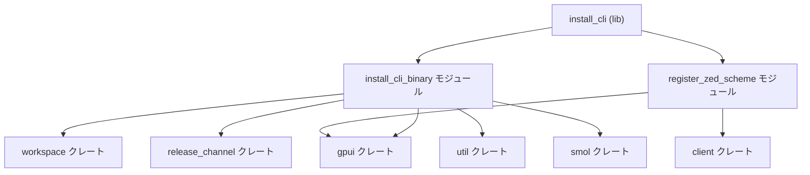
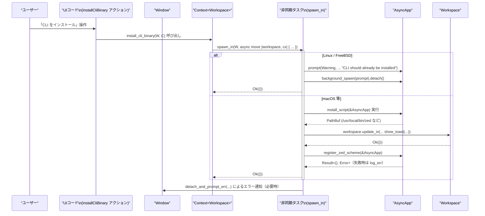

# install_cli ディレクトリ

## 0. ざっくり一言

`install_cli` クレートは、Zed エディタ用の **CLI コマンド `zed` のインストール処理** と、`zed://` URL スキームの **ハンドラ登録処理** を提供するモジュール群です。

---

## 1. このモジュールの役割

### 1.1 概要

- このモジュールは、Zed を OS と統合するための補助機能を提供します。
- 具体的には、Zed のバンドルに含まれる CLI バイナリを `/usr/local/bin/zed` にシンボリックリンクで配置し、ターミナルから `zed` コマンドを実行できるようにします（Windows 以外）。
- あわせて、`zed://` という独自 URL スキームを OS に登録することで、ブラウザ等から Zed を起動できるようにします。

### 1.2 アーキテクチャ内での位置づけ

依存関係の大まかな関係を以下に示します。



- `install_cli` ライブラリ（`src/install_cli.rs`）は、プラットフォーム条件付きで
  - CLI インストール関連 API（`install_cli_binary` / `InstallCliBinary`）
  - URL スキーム登録関連 API（`register_zed_scheme` / `RegisterZedScheme`）
  を公開します。
- `install_cli_binary` モジュールは `gpui` と `workspace` のコンテキスト上で動作する非同期タスクを起動し、実際のファイル操作や UI のトースト表示を行います。
- `register_zed_scheme` モジュールは `client::ZED_URL_SCHEME` を用いて、`gpui::AsyncApp` に URL スキームを登録します。

### 1.3 設計上のポイント

コードから読み取れる設計上の特徴は次のとおりです。

- **OS ごとの条件分岐**
  - `install_cli_binary` 関連は `#[cfg(not(target_os = "windows"))]` 付きモジュールとして定義され、Windows では公開されません。
  - 関数内部でも `cfg!(any(target_os = "linux", target_os = "freebsd"))` によるランタイム分岐があり、Linux / FreeBSD では実際のインストール処理は行わず注意喚起ダイアログのみ表示します。
- **状態を持たないユーティリティ的 API**
  - いずれの関数もグローバルな状態を保持せず、`AsyncApp` や `Workspace` から必要な処理を呼び出すだけの構造になっています。
- **エラー処理の方針**
  - 失敗しうる I/O 操作は `anyhow::Result` や `anyhow::ensure!` でラップされています。
  - UI との統合部分では `workspace::notifications::DetachAndPromptErr` と `util::ResultExt::log_err` を用いて、エラーを UI 上で通知したり、ログに残しつつ処理継続する設計になっています。
- **UI アクションとしての公開**
  - `gpui::actions!` マクロで `InstallCliBinary` / `RegisterZedScheme` アクションが定義されており、UI からコマンドとして呼び出されることを想定した構成です。

---

## 2. 主要な機能一覧

このディレクトリが提供する主な機能は次のとおりです。

- **`InstallCliBinary` アクション**  
  Zed の CLI バイナリに対するシンボリックリンクを `/usr/local/bin/zed` に作成し、`PATH` から `zed` コマンドを実行できるようにする（macOS 想定）。Linux / FreeBSD では「すでにインストール済みであるはず」という警告のみを表示します。

- **`install_cli_binary(window, cx)` 関数**  
  上記アクションの実処理となる非同期タスクを起動し、必要に応じてトースト通知や URL スキーム登録を行います。

- **`RegisterZedScheme` アクション**  
  `zed://` URL スキームハンドラを登録する UI アクションです。

- **`register_zed_scheme(cx)` 関数**  
  `gpui::AsyncApp` に対して、`client::ZED_URL_SCHEME` を URL スキームとして登録します。

- **内部関数 `install_script(cx)`**  
  CLI バイナリの実体パスを求め、既存シンボリックリンクの確認・更新、`osascript` を用いた管理者権限でのリンク作成を行い、最終的な `zed` コマンドのパスを返します。

---

## 4. 関数・構造体の解説

### 4.1 アクション型一覧

`gpui::actions!` マクロにより、次のアクションが定義されています。

| 名前               | 定義ファイル                         | 役割 / 用途                                                                 |
|--------------------|--------------------------------------|------------------------------------------------------------------------------|
| `InstallCliBinary` | `src/install_cli_binary.rs`          | 「Zed CLI をシステム PATH にインストールする」アクション。UI から呼び出される想定です。 |
| `RegisterZedScheme`| `src/register_zed_scheme.rs`         | 「`zed://` URL スキームを登録する」アクション。                              |

これらのアクション型の具体的な実装（トレイト実装など）は `actions!` マクロの展開先で定義されており、このチャンクからは詳細は分かりません。

---

### 4.2 `install_script(cx: &AsyncApp) -> Result<PathBuf>`

**定義場所**

- `src/install_cli_binary.rs`（プライベート関数）

**概要**

- Zed バンドル内の CLI 実行ファイルのパスを取得し、`/usr/local/bin/zed` へのシンボリックリンクを作成または更新します。
- すでに同じ CLI バイナリを指すシンボリックリンクが存在する場合は、再作成せずそのパスを返します。
- 通常のファイル操作で失敗した場合は、`osascript` による管理者権限付きコマンドでシンボリックリンクを作成します（macOS 想定）。

**引数**

| 引数名 | 型         | 説明                                             |
|--------|------------|--------------------------------------------------|
| `cx`   | `&AsyncApp`| アプリケーションコンテキスト。CLI バイナリの実パス取得や URL スキーム登録などに利用されます。 |

**戻り値**

- `Result<PathBuf>`  
  - `Ok(PathBuf)` : 最終的に利用可能になった `zed` コマンドのパス（通常は `/usr/local/bin/zed`）。
  - `Err(anyhow::Error)` : CLI パス取得や `osascript` 実行などでエラーが発生した場合。

**内部処理の流れ**

1. `cx.update(|cx| cx.path_for_auxiliary_executable("cli"))` を呼び出し、Zed の補助実行ファイル `"cli"` のパスを取得します。
2. `link_path` として `/usr/local/bin/zed`、`bin_dir_path` としてその親ディレクトリ `/usr/local/bin` を設定します。
3. `smol::fs::read_link(link_path).await.ok()` で既存シンボリックリンクの参照先を取得し、それが `cli_path` と等しければ再作成せずに `Ok(link_path.into())` を返します。
4. それ以外の場合は、まず `smol::fs::remove_file(link_path).await.log_err();` で既存ファイル（シンボリックリンクを含む）の削除を試みます。失敗してもログ出力されるだけで処理は継続します。
5. `smol::fs::unix::symlink(&cli_path, link_path).await.log_err()` でシンボリックリンクの作成を試みます。成功時は `Ok(link_path.into())` を返します。
6. シンボリックリンク作成に失敗した場合、`/usr/bin/osascript` を呼び出し、  
   `mkdir -p 'bin_dir_path' && ln -sf 'cli_path' 'link_path'`  
   というコマンドを管理者権限付きで実行します。
7. `osascript` の終了ステータスが成功 (`status.success()`) でない場合は `anyhow::ensure!` によりエラーを返します。
8. 成功した場合、`Ok(link_path.into())` を返します。

**Examples（使用例）**

この関数はプライベートで、通常は `install_cli_binary` から呼ばれます。`AsyncApp` コンテキストから直接呼び出す使用例を示します（実際の型は周辺コードに依存します）。

```rust
use install_cli;                         // install_cli クレート全体をインポート
use gpui::AsyncApp;                      // AsyncApp 型を使用
use anyhow::Result;                      // anyhow::Result を使用

async fn ensure_zed_cli_installed(cx: &AsyncApp) -> Result<()> { // CLI がインストールされていることを確認する関数
    // install_cli_binary.rs の install_script は公開されていないため、
    // 実際には install_cli::install_cli_binary を通じて呼び出すのが通常です。
    // ここでは「AsyncApp を使って CLI のインストールを行う」というイメージ例のみ示します。

    // 例: 何らかの公開 API があったと仮定して呼び出す（この行は概念的な例です）
    // let path = install_cli::install_cli_binary_direct(cx).await?;

    Ok(())                                // 正常終了を表す
}
```

※ `install_script` は非公開のため、上記はあくまで挙動イメージであり、実際には `install_cli_binary` を用いることになります。

**Errors / Panics**

- **エラー (`Err`) になるケース**
  - `cx.update(|cx| ...)` の呼び出しで CLI 実行ファイルのパス取得に失敗した場合。
  - `smol::process::Command::new("/usr/bin/osascript")...output().await` の実行自体が失敗した場合。
  - `osascript` の終了ステータスが非成功（`status.success() == false`）だった場合（`anyhow::ensure!` によりエラー）。
- **パニックの可能性**
  - `link_path.parent().unwrap()` で親ディレクトリ取得に `unwrap()` を使用しています。ただし `link_path` は固定文字列 `"/usr/local/bin/zed"` のため、通常は必ず親が存在します。

**Edge cases（エッジケース）**

- すでに `/usr/local/bin/zed` が **同じ `cli_path` を指すシンボリックリンク** の場合、削除や再作成は行わず、そのままのパスを返します。
- `read_link` や `remove_file`、`symlink` でエラーが起きても、`log_err()` によりエラーはログに残されるだけで処理は中断されません（その後 `osascript` にフォールバックします）。
- `osascript` が存在しない、あるいはスクリプトが拒否された場合はエラー終了になります。

**使用上の注意点**

- `smol::fs::unix::symlink` を使用しているため、Unix 系 OS 前提の実装です。この関数を含むモジュール自体が Windows ではコンパイル対象になりません。
- `osascript` による管理者権限昇格を行うため、ユーザーにパスワード入力が求められる可能性があります。
- `link_path` は固定で `/usr/local/bin/zed` になっているため、別の場所へインストールしたい場合はこの関数の修正が必要になります。

---

### 4.3 `install_cli_binary(window: &mut Window, cx: &mut Context<Workspace>)`

**定義場所**

- `src/install_cli_binary.rs`（公開関数）

**概要**

- UI コンテキスト（`Window` と `Context<Workspace>`）から呼び出され、CLI インストール処理を非同期タスクとして起動します。
- Linux / FreeBSD では「CLI はすでにインストールされているはず」という警告ダイアログを表示するのみで、システムへの変更は行いません。
- macOS 等では `install_script` を呼び出してシンボリックリンクを作成・更新し、その結果をトースト通知としてユーザーに表示します。
- 処理後に `register_zed_scheme` を呼び出し、URL スキーム登録も試みます。

**引数**

| 引数名  | 型                     | 説明                                                                 |
|---------|------------------------|----------------------------------------------------------------------|
| `window`| `&mut Window`          | 処理を紐付けるウィンドウ。エラー時のダイアログ表示などに使用されます（`detach_and_prompt_err` など）。 |
| `cx`    | `&mut Context<Workspace>` | ワークスペース用の UI コンテキスト。非同期タスクの起動やトースト表示に使用されます。 |

**戻り値**

- 戻り値は `()`（何も返さない）です。  
  非同期処理自体は `cx.spawn_in(...)` によりバックグラウンドで実行され、エラー通知は `detach_and_prompt_err` によって UI 上に表示されます。

**内部処理の流れ**

1. `LINUX_PROMPT_DETAIL` という Linux / FreeBSD 向けの詳細メッセージ定数を定義します。
2. `cx.spawn_in(window, async move |workspace, cx| { ... })` により、`workspace` と非同期コンテキスト `cx` を受け取る非同期タスクを起動します。
3. タスク内で `cfg!(any(target_os = "linux", target_os = "freebsd"))` を用いて OS を判定します。
   - **Linux / FreeBSD の場合**
     - `cx.prompt(PromptLevel::Warning, "CLI should already be installed", Some(LINUX_PROMPT_DETAIL), &["Ok"])` で警告ダイアログを作成し、
     - `cx.background_spawn(prompt).detach();` でダイアログ表示タスクをバックグラウンドで起動して終了します。
   - **それ以外（主に macOS 想定）の場合**
     1. `install_script(cx.deref()).await` を呼び出し、CLI シンボリックリンクの作成処理を実行します。
        - エラー時には `context("error creating CLI symlink")` でエラーメッセージに文脈情報を追加します。
     2. `workspace.update_in(cx, |workspace, _, cx| { ... })` を用いて、ワークスペース内でトースト通知を表示します。
        - `Toast::new(NotificationId::unique::<InstalledZedCli>(), message)` で一意な通知 ID とメッセージを生成します。
        - メッセージにはインストール先パスと `ReleaseChannel::global(cx).display_name()` を利用したチャンネル名が含まれます。
     3. `register_zed_scheme(cx).await.log_err();` を呼び出し、`zed://` スキーム登録を試みます。失敗してもログに記録されるのみで処理は継続します。
4. `cx.spawn_in(...).detach_and_prompt_err("Error installing zed cli", window, cx, |_, _, _| None);`
   - 非同期タスクのエラーは `detach_and_prompt_err` によってウィンドウに紐付いたエラーダイアログ等として通知されるようになっています。

**Examples（使用例）**

UI コードからこの関数を直接呼び出す例です。実際には `InstallCliBinary` アクション経由で呼ばれることも想定されます。

```rust
use install_cli::install_cli_binary;       // install_cli クレートから関数をインポート
use gpui::{Window, Context};              // Window と Context 型をインポート
use workspace::Workspace;                 // Workspace 型をインポート

fn on_install_cli_button_clicked(         // 例えば「CLI をインストール」ボタンのハンドラ
    window: &mut Window,                  // 対象ウィンドウ
    cx: &mut Context<Workspace>,          // ワークスペースコンテキスト
) {
    // 非同期のインストール処理をバックグラウンドで開始する
    install_cli_binary(window, cx);       // エラー表示等は内部で処理される
}
```

**Errors / Panics**

- この関数自体はエラーを返しませんが、内部で起動する非同期タスクは次のようなエラーを発生しうります。
  - CLI パス取得やファイル操作が失敗した場合の `anyhow::Error`。
  - `register_zed_scheme` の実行中に起こるエラー。
- これらは `detach_and_prompt_err("Error installing zed cli", ...)` によって UI 上に通知される設計になっています。

**Edge cases（エッジケース）**

- **Linux / FreeBSD**  
  実際のインストール処理は行われず、警告ダイアログのみが表示されます。ユーザーに `PATH` の設定やパッケージマネージャ由来の CLI 名の違いに注意を促します。
- **Windows**  
  このファイルを含むモジュールは `#[cfg(not(target_os = "windows"))]` 付きのため、Windows ターゲットでは `install_cli_binary` 関数自体が存在しません。

**使用上の注意点**

- 呼び出し側は Windows ターゲットでコンパイルする可能性がある場合、`#[cfg(not(target_os = "windows"))]` を用いて呼び出しを条件付きにする必要があります。
- CLI インストール処理はバックグラウンド非同期タスクとして実行されるため、呼び出し直後には処理が完了していない可能性があります。
- エラーの詳細な処理は `DetachAndPromptErr` / `Toast` / `prompt` といった周辺クレートに依存するため、この関数単体ではカスタマイズできません。

---

### 4.4 `register_zed_scheme(cx: &AsyncApp) -> anyhow::Result<()>`

**定義場所**

- `src/register_zed_scheme.rs`（公開関数）

**概要**

- `gpui::AsyncApp` コンテキストに対して `client::ZED_URL_SCHEME` を URL スキームとして登録します。
- これにより、`zed://...` 形式の URL を OS から Zed に渡せるようになることが想定されます（詳細な挙動は `register_url_scheme` の実装に依存します）。

**引数**

| 引数名 | 型         | 説明                                     |
|--------|------------|------------------------------------------|
| `cx`   | `&AsyncApp`| `register_url_scheme` を呼び出すアプリケーションコンテキスト |

**戻り値**

- `anyhow::Result<()>`  
  - `Ok(())` : スキーム登録が成功した場合。
  - `Err(anyhow::Error)` : 内部の `cx.update(...)` がエラーになった場合。

**内部処理の流れ**

1. `cx.update(|cx| cx.register_url_scheme(ZED_URL_SCHEME)).await` を呼び出します。
2. `client::ZED_URL_SCHEME` で定義されたスキーム文字列を `register_url_scheme` に渡します。
3. 非同期で URL スキーム登録処理を行い、その結果を `anyhow::Result<()>` として返します。

**Examples（使用例）**

アプリケーション起動時に URL スキームを登録する例です。

```rust
use install_cli::register_zed_scheme;     // URL スキーム登録関数をインポート
use gpui::AsyncApp;                       // AsyncApp 型をインポート
use anyhow::Result;                       // anyhow::Result を使用

async fn on_app_startup(cx: &AsyncApp) -> Result<()> { // アプリ起動時に呼ばれる想定の関数
    // zed:// URL スキームを OS に登録する
    register_zed_scheme(cx).await?;       // 失敗した場合は Err を伝播する
    Ok(())                                // 正常終了
}
```

**Errors / Panics**

- `cx.update(|cx| cx.register_url_scheme(...)).await` がエラーを返した場合、`Err(anyhow::Error)` になります。
- コード上からはパニックを誘発する箇所は読み取れません。

**Edge cases（エッジケース）**

- すでに同じ URL スキームが登録済みの場合や、外部要因により登録が拒否される場合の挙動は、このチャンクには現れていません（`register_url_scheme` の実装に依存します）。
- `ZED_URL_SCHEME` の値（実際の文字列）は `client` クレート側で定義されており、このチャンクからは確認できません。

**使用上の注意点**

- 非同期関数のため、呼び出し側は `.await` が可能なコンテキストである必要があります。
- エラー時にどのようにユーザーに通知するかは、呼び出し側で `Result` をどう扱うかに依存します。`install_cli_binary` 内では `log_err()` によってログ出力のみ行う構成になっています。

---

## 5. データフロー

ここでは、「ユーザーが UI から Zed CLI インストールを実行する」という代表的なシナリオのデータフローを示します。

### 5.1 処理の要点

1. ユーザーが UI 上で「CLI をインストール」のようなアクションを実行する（例: `InstallCliBinary` アクション）。
2. UI コードが `install_cli::install_cli_binary(window, cx)` を呼び出す。
3. 関数内部で `cx.spawn_in(window, async move |workspace, cx| { ... })` により非同期タスクが起動される。
4. OS に応じて:
   - Linux / FreeBSD: 警告ダイアログ表示のみ。
   - それ以外（macOS 等）: `install_script` による symlink 作成、トースト表示、`register_zed_scheme` の呼び出し。
5. エラーが発生した場合は、`detach_and_prompt_err` によってウィンドウに紐付いたエラーダイアログなどでユーザーに通知される。

### 5.2 シーケンス図



この図はあくまでこのチャンクから読み取れる範囲での概略を表したものであり、`spawn_in` / `update_in` / `detach_and_prompt_err` 等の詳細な挙動はそれぞれのクレートの実装に依存します。

---

## 6. 使い方（How to Use）

### 6.1 基本的な使用方法

ここでは、アプリケーションコードから CLI インストール処理と URL スキーム登録処理を利用する基本パターンを示します。

#### CLI インストールをトリガーする例

```rust
use install_cli::install_cli_binary;       // CLI インストール関数をインポート
use gpui::{Window, Context};              // Window と Context 型をインポート
use workspace::Workspace;                 // Workspace 型をインポート

fn on_user_requests_cli_install(          // 例えばメニューやショートカットから呼ばれるハンドラ
    window: &mut Window,                  // 対象のウィンドウ
    cx: &mut Context<Workspace>,          // ワークスペースの UI コンテキスト
) {
    // バックグラウンドで CLI インストール処理を開始する
    install_cli_binary(window, cx);       // エラー通知やトースト表示は関数内部で行われる
}
```

#### URL スキーム登録をアプリ起動時に行う例

```rust
use install_cli::register_zed_scheme;     // URL スキーム登録関数をインポート
use gpui::AsyncApp;                       // AsyncApp 型をインポート
use anyhow::Result;                       // anyhow::Result を使用

async fn initialize_integration(cx: &AsyncApp) -> Result<()> { // アプリ起動時の初期化処理
    // zed:// URL スキームを登録する
    register_zed_scheme(cx).await?;       // 失敗した場合は Err を返して呼び出し元に伝える
    Ok(())                                // 正常終了
}
```

### 6.2 よくある使用パターン

1. **UI アクション経由での CLI インストール**
   - `gpui::actions!` で定義された `InstallCliBinary` アクションをコマンドパレットやメニューに紐付け、
   - アクションハンドラ内で `install_cli_binary(window, cx)` を呼ぶ、という使い方が想定されます。

2. **アプリ起動時の URL スキーム登録**
   - メインウィンドウやアプリケーションの初期化フェーズで `register_zed_scheme(cx).await` を呼び、
   - OS との連携（`zed://` からの起動）を有効化します。

### 6.3 使用上の注意点（まとめ）

- **プラットフォーム依存性**
  - `install_cli_binary` および `InstallCliBinary` は `#[cfg(not(target_os = "windows"))]` でガードされているため、Windows ターゲットでは存在しません。
  - 呼び出し側でクロスプラットフォーム対応を行う場合は、同様の `cfg` ガードを用いる必要があります。
- **Linux / FreeBSD での挙動**
  - CLI インストール処理は実際には行われず、ユーザーに `PATH` 設定やパッケージマネージャ由来の CLI 名の違いを案内する警告が表示されるだけです。
- **macOS での権限昇格**
  - `install_script` は `osascript` を通じて管理者権限付きで `ln -sf` を実行するため、ユーザーにパスワード入力を求めるダイアログが表示される可能性があります。
- **非同期処理であること**
  - CLI インストール処理はバックグラウンドタスクとして実行されるため、呼び出し直後には symlink がまだ作成されていない場合があります。
  - 処理完了のフィードバックはトースト通知によってのみ提供されます。
- **API の非公開部分**
  - `install_script` はプライベート関数であり、外部から直接呼び出すことはできません。CLI インストールフローを利用・拡張する場合は、`install_cli_binary` を入口として扱う必要があります。

---

## 7. 関連ファイル

このディレクトリ内のファイルと、それぞれの役割の一覧です。

| パス                                   | 役割 / 関係                                                                 |
|----------------------------------------|------------------------------------------------------------------------------|
| `install_cli/Cargo.toml`               | クレート定義。ライブラリエントリを `src/install_cli.rs` に設定し、依存クレート（`anyhow`, `client`, `gpui`, `release_channel`, `smol`, `util`, `workspace` など）を宣言しています。`test-support` フィーチャも定義されていますが、このチャンクにはその利用箇所は現れていません。 |
| `install_cli/src/install_cli.rs`       | ライブラリエントリモジュール。`install_cli_binary` モジュール（Windows 以外）と `register_zed_scheme` モジュールを読み込み、それぞれのアクション型と関数を `pub use` で再公開します。 |
| `install_cli/src/install_cli_binary.rs`| CLI インストール処理を実装するモジュール。`InstallCliBinary` アクションの定義、内部ヘルパー関数 `install_script`、公開 API `install_cli_binary(window, cx)` を含みます。 |
| `install_cli/src/register_zed_scheme.rs`| `zed://` URL スキームの登録処理を実装するモジュール。`RegisterZedScheme` アクションと `register_zed_scheme(cx)` 関数を提供します。 |

このディレクトリにはテストコードや補助ユーティリティは含まれておらず、実装の詳細やテスト方法は他ディレクトリやクレート側に依存しています。
