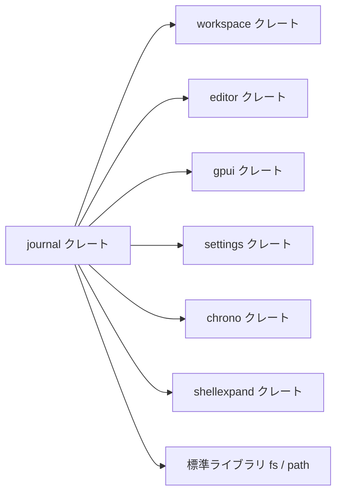
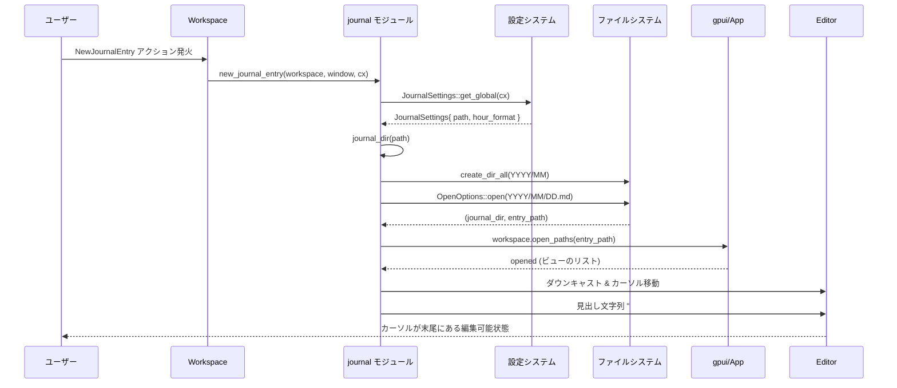

## 1. ざっくり一言

`journal` クレートは、ユーザー設定にもとづいてローカルファイルシステム上に日次の Markdown ジャーナルファイルを作成し、エディタで開いて見出しを挿入するための機能を提供するモジュールです。

---

## 2. このモジュールの役割

### 2.1 概要

- このモジュールは **「今日のジャーナルエントリをすぐ書き始められる状態にする」** ことを目的にしています。
- ユーザー設定からジャーナルの保存場所と時刻表示形式を取得し、`YYYY/MM/DD.md` という構成のディレクトリ・ファイルを作成します。
- そのファイルをワークスペース内で開き、カーソルを末尾に移動して時刻付きの Markdown 見出しを挿入します。

### 2.2 アーキテクチャ内での位置づけ

`journal` クレートは、エディタやワークスペース、設定システムの上に載る「機能モジュール」として実装されています。外部クレートとの関係は概ね次のようになっています。



- `gpui` / `workspace`：アクションの登録やウィンドウ・ワークスペースの操作を担当します。
- `editor`：Markdown ファイルを開くエディタビューの操作に使用します。
- `settings`：ジャーナル用の設定 (`JournalSettings`) を定義し、全体設定から読み出します。
- `chrono`：現在日時の取得と、見出しに書く時刻のフォーマットに使用します。
- `shellexpand`：ユーザーが指定したパスに含まれる `~` などの展開を行います。
- 標準ライブラリ (`fs`, `path`)：ディレクトリ作成とファイルオープン、パス操作を行います。

### 2.3 設計上のポイント

コードから読み取れる設計上の特徴は次の通りです。

- **設定駆動**  
  - ジャーナルの保存パスと時刻表示形式は `JournalSettings` に集約され、グローバル設定から読み出します。
- **アクションベースの起動**  
  - `NewJournalEntry` というアクションを `Workspace` に登録し、ユーザー操作からジャーナル作成をトリガーできるようになっています。
- **非同期 I/O と UI 更新の分離**  
  - ファイルやディレクトリの作成は `cx.background_spawn` でバックグラウンドタスクとして実行し、その結果を受けて UI スレッド側でワークスペースを開く構成になっています。
- **ワークスペースとの統合**  
  - 既存のワークスペースにジャーナルディレクトリが含まれているかを判定し、必要な場合のみ新しいワークスペースを開くようになっています。
- **単純なプレーンテキストフォーマット**  
  - ジャーナルファイルは Markdown (`.md`) で、1 エントリは `# HH:MM` 形式の見出しから始まります（12時間 / 24時間いずれか）。

---

## 3. 主要な機能一覧

このクレートが提供する主な機能は次の通りです。

- `NewJournalEntry` アクションの登録: 各 `Workspace` に「新しいジャーナルエントリを作る」アクションを追加します。
- ジャーナル設定 (`JournalSettings`) の定義と読み出し:
  - ジャーナル保存パス (`path`)
  - 時刻の表示形式 (`HourFormat`：12時間 / 24時間)
- ジャーナルディレクトリの決定:
  - ユーザー指定パスの展開 (`~` 含む)
  - 相対パスをホームディレクトリ配下の `journal` にフォールバック
- 日次ジャーナルファイルの作成:
  - `YYYY/MM/DD.md` 形式のディレクトリとファイルを作成
  - 既存ファイルがある場合でも内容は消さずに開くだけ
- エディタでのオープンとカーソル位置調整:
  - 該当ファイルをワークスペース内で開き、末尾にカーソルを移動
  - 既存内容があれば空行を挟んだ後に見出しを挿入
- 見出し文字列の生成:
  - `# HH:MM` または `# H:MM AM/PM` 形式の Markdown 見出しを生成

---

## 4. 関数・構造体の解説

### 4.1 型一覧（構造体・列挙体など）

| 名前                | 種別       | 役割 / 用途 |
|---------------------|------------|-------------|
| `JournalSettings`   | 構造体     | ジャーナル機能専用の設定（保存ディレクトリと時刻形式）を表します。 |
| `HourFormat`        | 列挙体（外部） | 時刻の表示形式（12時間 / 24時間）を表します。`settings` クレートから再公開されています。 |
| `NewJournalEntry`   | アクション型（マクロ生成） | 「今日のジャーナルエントリを作成・表示する」アクションを表す型です。 |

#### `JournalSettings`

```rust
#[derive(Clone, Debug, RegisterSetting)]
pub struct JournalSettings {
    /// The path of the directory where journal entries are stored.
    ///
    /// Default: `~`
    pub path: String,
    /// What format to display the hours in.
    ///
    /// Default: hour12
    pub hour_format: HourFormat,
}
```

- `path`  
  - ジャーナル用のベースディレクトリを文字列で保持します。
  - 実際に使用するディレクトリは `journal_dir` 関数の中で `path` に `"journal"` を連結したものになります。
- `hour_format`  
  - `HourFormat::Hour12` または `HourFormat::Hour24` を指定し、見出しでの時刻表示形式を決定します。

`impl settings::Settings for JournalSettings` では、グローバルな設定 (`SettingsContent`) から `journal` セクションを取得し、その中の `path` と `hour_format` を `unwrap()` で取り出しています。  
そのため、設定が欠けている場合は起動時にパニックになる前提です（詳細は後述の「使用上の注意点」を参照してください）。

---

### 4.2 重要な関数

#### 4.2.1 `init(app_state: Arc<AppState>, cx: &mut App)`

**概要**

- アプリケーション起動時に呼び出され、各 `Workspace` に `NewJournalEntry` アクションのハンドラを登録します。
- これにより、UI 上から `NewJournalEntry` アクションが発火したときに `new_journal_entry` が呼ばれるようになります。

**引数**

| 引数名      | 型                 | 説明 |
|-------------|--------------------|------|
| `_`         | `Arc<AppState>`    | 現在のアプリケーション状態。`init` 内では直接使用していません。 |
| `cx`        | `&mut App`         | `gpui` のアプリケーションコンテキスト。オブザーバ登録に使用します。 |

**戻り値**

- なし（`()`）。

**内部処理の流れ**

1. `cx.observe_new` を使って、新しい `Workspace` が作られたときに呼び出されるコールバックを登録します。
2. コールバック内で、その `Workspace` に対して `workspace.register_action` を呼び出します。
3. `NewJournalEntry` アクションが発火したときの処理として、`new_journal_entry(workspace, window, cx)` を呼び出すように設定します。
4. `.detach()` により登録処理用のタスクを切り離します（`observe_new` の戻り値の型に依存しますが、詳細な挙動はこのチャンクからは分かりません）。

**使用例**

アプリケーションの初期化処理の中で `init` を呼び出す想定です。

```rust
use std::sync::Arc;                         // Arc を使って AppState を共有する
use gpui::App;                             // gpui アプリケーションの型
use workspace::AppState;                   // アプリケーション全体の状態（別クレート）
use journal;                               // journal クレート

fn setup_app(mut cx: App, app_state: Arc<AppState>) {
    // ジャーナル機能を初期化し、NewJournalEntry アクションを登録する
    journal::init(app_state, &mut cx);
    // ここで他の機能の初期化などを行う
}
```

※ `AppState` の具体的な生成方法は、このチャンクには定義がありません。

**エッジケース**

- `Workspace` が新しく作成されない限り、このアクションは登録されません。
- `observe_new` や `register_action` の失敗時の挙動は、このコードからは読み取れません（マクロや外部クレートの実装に依存します）。

**使用上の注意点**

- `init` はアプリケーション起動時（少なくとも `Workspace` が作られる前）に一度だけ呼び出される前提の実装になっています。
- `AppState` 引数は現在使われていませんが、将来的な拡張に備えて残されている可能性があります。削除する場合は他ファイルでの期待も確認する必要があります。

---

#### 4.2.2 `new_journal_entry(workspace: &Workspace, window: &mut Window, cx: &mut App)`

**概要**

- 「新しいジャーナルエントリを作る」実際の処理を行う中核の関数です。
- 設定からジャーナルディレクトリを決定し、当日の日付に対応する Markdown ファイルを作成・オープンし、見出しを挿入します。
- 既存のワークスペースにジャーナルディレクトリが含まれていない場合、新しいワークスペースを開きます。

**引数**

| 引数名     | 型                    | 説明 |
|------------|-----------------------|------|
| `workspace`| `&Workspace`          | 現在のワークスペース。ファイルオープンや状態取得に使用します。 |
| `window`   | `&mut Window`         | 現在のウィンドウ。非同期タスクの起動や UI 更新に使用します。 |
| `cx`       | `&mut App`            | `gpui` のアプリケーションコンテキスト。設定取得やタスク起動に利用します。 |

**戻り値**

- なし（`()`）。  
  非同期タスク内では `anyhow::Result<()>` を使用していますが、最外では `spawn(...).detach_and_log_err(cx)` により処理が切り離されています。

**内部処理の流れ**

1. **設定取得**
   - `JournalSettings::get_global(cx)` によりグローバル設定から `JournalSettings` を取得します（`RegisterSetting` 派生によるメソッドと推測されますが、具体的実装はこのチャンクには登場しません）。
2. **ジャーナルディレクトリの決定**
   - `journal_dir(&settings.path)` を呼び出し、保存先ディレクトリ `journal_dir` を `Option<PathBuf>` として取得します。
   - `None` の場合はエラーログを出力し、処理を中断して早期リターンします。
3. **ファイルパスの構築**
   - 現在時刻 `Local::now()` を取得し、  
     `journal_dir / YYYY / MM / DD.md` というパス（ゼロ埋め）を構築します。
   - `heading_entry(now.time(), &settings.hour_format)` により、その時刻に対応する Markdown 見出し文字列を生成します。
4. **ファイル作成（非同期）**
   - `cx.background_spawn` によってバックグラウンドタスクを起動し、次の処理を行います。
     - `std::fs::create_dir_all(month_dir)` で月のディレクトリを作成（既にあれば何もしない）。
     - `OpenOptions::new().create(true).truncate(false).write(true).open(&entry_path)` により、日付ファイルを作成または開きます（既にある場合は内容を保持します）。
     - `(journal_dir, entry_path)` を `Result` として返します。
5. **ワークスペースの選択**
   - `workspace.visible_worktrees(cx)` から現在表示されているワークツリーを列挙し、次の条件を満たすかをチェックします。
     - ワークツリーのルートが `journal_dir` と一致する。
     - または、そのワークツリーのサブディレクトリのうち、一部が `journal_dir` で終わるパスを持つ。
   - 上記のいずれかが見つかった場合は `open_new_workspace = false` とし、既存ワークスペースで開きます。
   - 見つからない場合は `open_new_workspace = true` とし、新しいワークスペースを開きます。
6. **非同期タスクの起動**
   - `window.spawn(cx, async move |cx| { ... })` によって、UI コンテキスト内でファイルオープンや見出し挿入を行う非同期タスクを起動します。
   - タスク内で先ほどの `create_entry` を `await` し、`(journal_dir, entry_path)` を取得します。
7. **ワークスペース / ファイルのオープン**
   - `open_new_workspace` が `true` の場合：
     - `workspace::open_paths(&[journal_dir], app_state, ...)` を通して新しいワークスペースを開きます。
     - その新しいワークスペースに対して `workspace.open_paths(vec![entry_path], ...)` を呼び、ジャーナルファイルを開きます。
   - `false` の場合：
     - `view_snapshot.update_in` 経由で既存ワークスペースにアクセスし、`workspace.open_paths(vec![entry_path], ...)` でジャーナルファイルを開きます。
   - `opened` には、開かれたビューの情報（`Item` のような型）が格納されます。
8. **エディタの操作と見出し挿入**
   - `opened.first()` の結果から最初の要素を取り出し、  
     `Some(Some(Ok(item)))` であれば `item.downcast::<Editor>()` によって `Editor` にダウンキャストを試みます。
   - `Editor` が得られた場合：
     - バッファ長 `len` を取得し、`len..len` を選択範囲として末尾にカーソルを移動します（中央スクロール付き）。
     - 既にテキストがある場合（`len.0 > 0`）は、先に `"\n\n"` を挿入して空行を挟みます。
     - 見出し `entry_heading` を挿入し、その後に再度 `"\n\n"` を挿入します。
9. **エラー処理**
   - タスクの末尾で `anyhow::Ok(())` を返し、`spawn(...).detach_and_log_err(cx)` が呼ばれます。
   - `detach_and_log_err` の具体的挙動はこのチャンクからは分かりませんが、名前からはエラーのログ出力とタスクの切り離しが行われることが想定されます。

**Examples（使用例）**

`new_journal_entry` 自体は通常アクション経由で呼び出されますが、テスト用や他機能から直接呼び出すこともできます（同じクレート内から）。

```rust
use gpui::{App, Window};                  // gpui の App と Window
use workspace::Workspace;                 // ワークスペース型（別クレート）
use journal;                              // journal クレート

fn create_today_journal(workspace: &Workspace, window: &mut Window, app: &mut App) {
    // 現在のワークスペースとウィンドウで今日のジャーナルを開く
    journal::new_journal_entry(workspace, window, app);
}
```

**Errors / Panics**

- **ファイル・ディレクトリ関連**
  - `create_dir_all` や `open` が I/O エラーを返した場合、非同期タスク内で `?` によって `anyhow::Error` へ変換されます。
  - その後の扱いは `detach_and_log_err` に依存します（このチャンクでは不明）。
- **設定関連**
  - `JournalSettings::get_global(cx)` が内部でどのようなエラー処理を行うかは、このチャンクからは分かりません。
  - `JournalSettings` 自体の生成は `from_settings` 内で `unwrap()` を多用しているため、設定が不足している場合、起動時にパニックになる可能性があります（詳細は 4.2.3 参照）。
- **ワークスペース / エディタ関連**
  - `open_paths` の戻り値 `opened` の要素が `Editor` でない場合、見出しの自動挿入は行われません（エラーにはなりません）。

**Edge cases（エッジケース）**

- ジャーナルディレクトリの決定に失敗（`journal_dir` が `None`）した場合：
  - エラーログを出力し、処理は何も行われません。
- すでに当日の日付のファイルが存在する場合：
  - ファイルは上書きされず、そのまま開かれます。
  - 末尾に新しい見出しと空行が追加されます。
- ファイルが空の場合：
  - 先頭から `# HH:MM` 系の見出しが挿入され、その後に空行が続きます。

**使用上の注意点**

- `new_journal_entry` は UI スレッドと非同期タスクを組み合わせた処理になっているため、同期的な戻り値（成功/失敗）には依存できません。
- ファイルがエディタ以外のビュー（例：単なるバイナリビュー）として開かれた場合、見出し挿入は行われません。
- 同じ日付に対して何度も呼び出すと、同じファイルの末尾に見出しが複数追加される挙動になります。

---

#### 4.2.3 `fn journal_dir(path: &str) -> Option<PathBuf>`

**概要**

- 設定で指定されたパス文字列から、実際にジャーナルを保存するディレクトリパスを決定します。
- 必ず `.../journal` というサブディレクトリを付加したパスを返す設計です。

**引数**

| 引数名 | 型        | 説明 |
|--------|-----------|------|
| `path` | `&str`    | ユーザー設定で指定されたベースパス（`~` や絶対/相対パスを含みうる文字列） |

**戻り値**

- `Option<PathBuf>`  
  - 正常に解決できた場合：`Some(absolute_path.join("journal"))`
  - 展開やホームディレクトリ取得に失敗した場合：`None`

**内部処理の流れ**

1. `shellexpand::full(path)` でパスを展開します。
   - 例：`"~/documents"` → `"/home/user/documents"`（Unix の場合）
   - 展開に失敗すると `None` を返します。
2. 展開済みの文字列から `Path` を構築し、`is_absolute()` を確認します。
3. 絶対パスであれば、そのまま `absolute_path` として採用します。
4. 相対パスであれば、
   - `log::warn!` で「絶対パスでないためホームディレクトリにフォールバックする」旨を出力します。
   - `std::env::home_dir()` を呼び出し、ホームディレクトリを取得しようとします。
   - ホームディレクトリが取得できなければ `None` を返します。
5. いずれの場合も、最後に `absolute_path.join("journal")` を返します。

**Examples（使用例：テストと同等のケース）**

テストコードから読み取れる期待値の例です。

```rust
// Unix 系で絶対パスを指定した場合
let dir = journal_dir("/home/user").unwrap();               // 絶対パスを指定
assert!(dir.is_absolute());                                 // 常に絶対パスになる
assert_eq!(dir, PathBuf::from("/home/user/journal"));       // "journal" が最後に付与される

// チルダを含むパスを指定した場合
let dir = journal_dir("~/documents").unwrap();              // "~" を含むパス
assert!(dir.is_absolute());                                 // "~" はホームディレクトリへ展開される
// 期待値の構築（home_dir が Some のときのみ検証）
if let Some(home) = std::env::home_dir() {
    assert_eq!(dir, home.join("documents").join("journal"));
}
```

**Edge cases（エッジケース）**

- `path` が相対パス（`"relative/path"` など）の場合：
  - ログに警告が出力され、`home_dir().unwrap().join("journal")` にフォールバックします（テストで確認されています）。
- `path` が存在しないディレクトリ名を含んでいても：
  - パスの存在チェックは行わないため、この関数自体は正常に `Some(PathBuf)` を返します。
  - 実際の存在確認は `create_dir_all` 側で行われます。
- ホームディレクトリが取得できない場合：
  - `std::env::home_dir()` が `None` を返すと、そのまま `None` を返します。

**使用上の注意点**

- **絶対パス推奨**：  
  相対パスを指定した場合、ユーザーの意図したディレクトリではなくホームディレクトリ直下の `journal` が使われるため、混乱を避けるためにも絶対パスまたは `~` を使う形が推奨されます。
- **"journal" サブディレクトリの固定**：  
  どのような `path` を指定しても、最終的な保存先は `path` の直下に `journal` を付けた場所になります。`path` 自体に "journal" を含めて指定すると、`.../journal/journal` になる点に注意が必要です。

---

#### 4.2.4 `fn heading_entry(now: NaiveTime, hour_format: &HourFormat) -> String`

**概要**

- 指定された時刻と時刻形式にもとづいて、Markdown の見出し文字列（`# ...`）を生成します。
- 12時間表示（AM/PM）と 24時間表示の両方に対応しています。

**引数**

| 引数名       | 型              | 説明 |
|--------------|-----------------|------|
| `now`        | `NaiveTime`     | 日付を含まない時刻（時・分） |
| `hour_format`| `&HourFormat`   | `HourFormat::Hour12` または `HourFormat::Hour24` |

**戻り値**

- `String`  
  - 24時間表示時：`"# HH:MM"` 形式（例：`"# 15:00"`）
  - 12時間表示時：`"# H:MM AM/PM"` 形式（例：`"# 3:00 PM"`）

**内部処理の流れ**

1. `match hour_format` で表示形式を分岐します。
2. `HourFormat::Hour24` の場合：
   - `now.hour()` と `now.minute()` を取得し、`format!("# {}:{:02}", hour, minute)` を返します。
3. `HourFormat::Hour12` の場合：
   - `now.hour12()` で `(pm, hour)` を取得します。
     - `pm` が `true` なら `"PM"`、`false` なら `"AM"`。
     - `hour` は 1〜12 の範囲で返されます。
   - `format!("# {}:{:02} {}", hour, minute, am_or_pm)` を返します。

**Examples（使用例：テストと同等のケース）**

```rust
use chrono::NaiveTime;                   // 日付なしの時刻型
use journal::HourFormat;                // 再公開されている列挙体

// 15:00 を 12時間表示で見出しにする
let t = NaiveTime::from_hms_milli_opt(15, 0, 0, 0).unwrap();
let heading = journal::tests::heading_entry(t, &HourFormat::Hour12); // 実際には同クレート内から呼び出し
assert_eq!(heading, "# 3:00 PM");

// 15:00 を 24時間表示で見出しにする
let heading_24 = journal::tests::heading_entry(t, &HourFormat::Hour24);
assert_eq!(heading_24, "# 15:00");
```

※ `heading_entry` は `pub` ではないため、外部クレートから直接呼び出すことはできません。上記は同クレート内で使用するイメージです。

**Edge cases（エッジケース）**

- 秒やミリ秒は無視され、常に「時:分」だけが使われます。
- 12時間表示で深夜や正午など特別な扱いは行っていません（`hour12()` の仕様に従います）。

**使用上の注意点**

- 時刻の取得は呼び出し元（`new_journal_entry`）側で行っているため、テストやカスタム用途で固定された時刻を使用したい場合は、`NaiveTime` を明示的に生成して渡す必要があります。
- 24時間表示でも先頭に `#` が付くため、Markdown では「レベル 1 見出し」として扱われます。

---

### 4.3 その他の関数・テスト

- `impl settings::Settings for JournalSettings::from_settings`  
  - グローバル設定構造体から `journal.path` と `journal.hour_format` を `unwrap()` で取り出して `JournalSettings` を構築します。
  - `content.journal`、`journal.path`、`journal.hour_format` がすべて `Some` であることを前提としています。
- テストモジュール
  - `heading_entry_tests`  
    - 12時間 / 24時間表示で `heading_entry` が期待通りの文字列を返すかを検証しています。
  - `journal_dir_tests`  
    - 絶対パス、`~` を含むパス、相対パス、Windows 形式のパスといった入力に対し、`journal_dir` が期待通りの絶対パスを返すかを検証しています。

---

## 5. データフロー

ここでは、「ユーザーが `NewJournalEntry` アクションを発火してジャーナルを書き始める」までの代表的なデータフローを示します。

### 5.1 シーケンス図



### 5.2 フローの要点

- 設定 (`JournalSettings`) から読み出した `path` と `hour_format` が、保存場所と見出し形式の両方に影響します。
- ファイルシステムへのアクセス（ディレクトリ作成・ファイルオープン）は非同期タスクとしてバックグラウンドで行われます。
- `workspace.open_paths` によって該当ファイルがエディタで開かれ、その後に `Editor` ビューが特定されて文末へのスクロールと見出し挿入が行われます。

---

## 6. 使い方（How to Use）

ここでは、`journal` クレートを他のコードから利用する際の基本的な流れと注意点をまとめます。

### 6.1 基本的な使用方法

#### 6.1.1 アプリケーション起動時にジャーナル機能を有効化する

`init` をアプリケーションの初期化フェーズで呼び出し、`NewJournalEntry` アクションをワークスペースに登録します。

```rust
use std::sync::Arc;                      // AppState を共有するための Arc
use gpui::App;                          // gpui のアプリケーション型
use workspace::AppState;                // アプリケーション状態（別クレート）
use journal;                            // journal クレート

fn setup_app(app_state: Arc<AppState>, cx: &mut App) {
    // ジャーナル機能を初期化して、NewJournalEntry アクションを登録する
    journal::init(app_state, cx);

    // 他の機能の初期化処理が続くと想定される
}
```

その後、UI 側で `NewJournalEntry` にショートカットキーやメニュー項目を紐付けることで、ユーザーが任意のタイミングでジャーナル作成をトリガーできるようになります（ショートカット設定などの詳細は、このチャンクには含まれていません）。

#### 6.1.2 他コードから直接ジャーナルを作成する（同クレート内の利用）

同じクレート内であれば、`new_journal_entry` を直接呼び出して今日のジャーナルを作成できます。

```rust
use gpui::{App, Window};                // App と Window の型
use workspace::Workspace;               // Workspace 型（別クレート）
use journal;                            // journal クレート

fn create_journal_now(workspace: &Workspace, window: &mut Window, app: &mut App) {
    // 現在のワークスペース・ウィンドウでジャーナルエントリを作成・開く
    journal::new_journal_entry(workspace, window, app);
}
```

### 6.2 よくある使用パターン

#### 6.2.1 ジャーナル保存場所をカスタマイズする

- `JournalSettings::path` によってベースとなるパスを指定できます。
- 実際の保存先は `path` の直下に `"journal"` を付けた場所になります。

例（概念的な設定内容）:

- `path = "~"` → `~/journal/YYYY/MM/DD.md`
- `path = "~/Documents"` → `~/Documents/journal/YYYY/MM/DD.md`

設定の具体的な記述方法（設定ファイルや UI）は、このチャンクには登場していませんが、`JournalSettings` 用の設定セクションに `path` を指定する前提になっています。

#### 6.2.2 12時間 / 24時間表示を切り替える

- `JournalSettings::hour_format` に `HourFormat::Hour12` または `HourFormat::Hour24` を指定することで、見出しに使う時刻の表示形式を切り替えられます。

概念的な例:

- `hour_format = "hour12"` → `# 3:00 PM`
- `hour_format = "hour24"` → `# 15:00`

どちらの場合も、ファイル名 (`DD.md`) 自体は同じで、表示だけが変わります。

#### 6.2.3 既存ジャーナルへの追記

- 同じ日付に対して `NewJournalEntry` アクションを複数回実行すると、同じ `YYYY/MM/DD.md` ファイルの末尾に次々と見出しが追加されます。
- 1 日の中で複数のセッションを分けて書きたい場合は、これを利用して複数の時刻見出しを作成できます。

### 6.3 使用上の注意点（まとめ）

- **設定必須項目**
  - `JournalSettings::from_settings` では `content.journal`, `journal.path`, `journal.hour_format` に対して `unwrap()` を使用しています。
  - これらが `None` の場合、起動時にパニックする可能性があります。
  - 設定システム側で必ず `journal` セクションとその中の `path`・`hour_format` を埋める前提です。

- **パス指定の挙動**
  - `path` が相対パスの場合、ログに警告が出たうえでホームディレクトリ直下の `journal` にフォールバックします。
  - 意図しない場所にファイルが作成されるのを避けるため、`/absolute/path` もしくは `~` を使用したパス指定が推奨されます。
  - `path` の末尾に `"journal"` を含めると、成果物が `.../journal/journal` になる点に注意してください。

- **ホームディレクトリ取得の失敗**
  - `std::env::home_dir()` が `None` を返した場合、`journal_dir` は `None` を返します。
  - その結果 `new_journal_entry` はログにエラーを出して終了し、ファイルは作成されません。

- **エディタビューの前提**
  - `open_paths` で開かれたビューが `Editor` にダウンキャストできない場合、見出し挿入は行われません。
  - ジャーナルファイルを通常のテキストエディタビューで開く構成になっていることが前提です。

- **同日の複数エントリ**
  - 1 日に何度も `NewJournalEntry` を実行すると、同じファイルに見出しが増え続ける構造です。
  - 1 ファイル 1 日という運用であることを前提とした設計になっています。

---

## 7. 関連ファイル

このディレクトリ（`journal` クレート）および密接に関係するファイル・クレートは次の通りです。

| パス / クレート名           | 役割 / 関係 |
|-----------------------------|------------|
| `journal/Cargo.toml`        | `journal` クレートのパッケージ情報と依存クレート（`chrono`, `editor`, `gpui`, `settings`, `workspace` など）を定義します。 |
| `journal/src/journal.rs`    | 本ドキュメントで解説している、ジャーナル機能の実装本体（設定定義、アクション登録、ファイル作成・オープン処理、テストを含む）です。 |
| `settings` クレート（別クレート） | `JournalSettings` の基盤となる設定インフラと `HourFormat` 列挙体を提供します。このチャンクには実装は含まれません。 |
| `workspace` クレート（別クレート） | `Workspace`, `AppState`, `OpenResult`, `OpenVisible` などを提供し、ファイルオープンやワークスペース管理の機能を担います。 |
| `editor` クレート（別クレート） | `Editor` ビューとカーソル・選択範囲操作 (`SelectionEffects`, `Autoscroll`) を提供します。 |
| `gpui` クレート（別クレート）   | アプリケーションとウィンドウのライフサイクル管理、非同期タスク (`spawn`, `background_spawn`) を含む UI インフラを提供します。 |

このチャンクにはそれぞれの外部クレートの実装は含まれていないため、詳細な挙動については各クレート側のドキュメントやコードを参照する必要があります。
