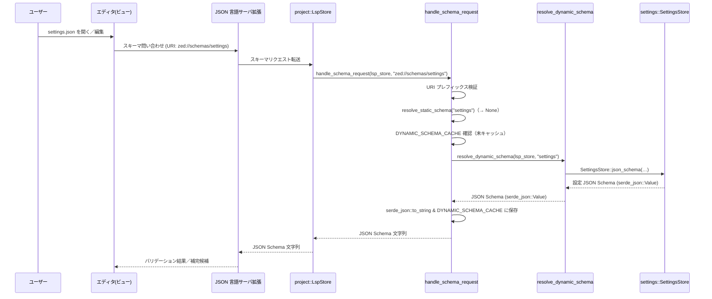

# crates/json_schema_store ディレクトリ解説

## 0. ざっくり一言

Zed エディタ内の JSON / JSONC 言語サーバ向けに、各種設定ファイル（`settings.json`・`tasks.json`・`keymap.json`・`tsconfig.json`・`package.json` など）の **JSON Schema を提供・キャッシュし、ファイルパターンとの対応付けを管理するモジュール**です。

---

## 1. このモジュールの役割

### 1.1 概要

- この crate は、エディタ内で扱うさまざまな設定ファイルや JSON ファイルに対して **適切な JSON Schema を返すスキーマストア**として機能します。
- JSON 言語サーバ（`json_language_server_ext`）からのスキーマ URI リクエストを受け取り、静的・動的に生成したスキーマを返します。
- 同時に、ファイル名や拡張子とスキーマ URI の対応表（file associations）を JSON で返すユーティリティも提供します。

### 1.2 アーキテクチャ内での位置づけ

`json_schema_store` が、どのモジュールからどのように利用されるかを簡略化した依存関係図です。

```mermaid
graph TD
    subgraph App
        A[gpui::App / AsyncApp]
        LS[project::LspStore]
    end

    subgraph JsonSchemaStore
        JS[json_schema_store::init]
        H[handle_schema_request]
        ASSOC[all_schema_file_associations]
        STORE[SchemaStore(Global)]
    end

    subgraph LangAndSettings
        LR[language::LanguageRegistry]
        SET[settings::SettingsStore / KeymapFile]
        TASK[task::TaskTemplates & DebugTaskFile]
        SNIP[snippet_provider::VsSnippetsFile]
        THEME[theme::ThemeRegistry]
        DAP[dap::DapRegistry]
    end

    subgraph StaticSchemas
        TSC[schemas/tsconfig.json]
        PKG[schemas/package.json]
    end

    A --> JS
    JS --> STORE
    JS --> LS
    LS --> H
    H --> LR
    H --> SET
    H --> TASK
    H --> SNIP
    H --> THEME
    H --> DAP
    H --> TSC
    H --> PKG
    A --> ASSOC
```

- アプリ起動時に `init` が呼ばれ、`SchemaStore` を `gpui::Global` として登録し、JSON 言語サーバにスキーマハンドラ（`handle_schema_request`）を登録します。
- JSON 言語サーバは `zed://schemas/...` 形式の URI でスキーマを問い合わせ、`handle_schema_request` が静的スキーマや動的スキーマを返します。
- スキーマの動的生成時には、言語レジストリ・LSP アダプタ・DAP レジストリ・設定ストア・テーマレジストリなど、他のグローバルコンポーネントに依存します。

### 1.3 設計上のポイント

コードから読み取れる特徴を整理します。

- **グローバルなスキーマストア**
  - `SchemaStore` 構造体を `gpui::Global` として登録し、アプリ全体で共有します。
  - `LspStore`（言語サーバ管理）の `WeakEntity` を保持し、スキーマ更新時に JSON 言語サーバへ「スキーマが変わった」通知を行います。

- **静的スキーマと動的スキーマの分離**
  - 静的スキーマ（`tsconfig.json`・`package.json`・タスク・スニペット・キーmap など）は `LazyLock<String>` による **起動後一度だけ生成**されるキャッシュに格納されます。
  - 動的スキーマ（設定・LSP 設定・DAP debug tasks・アクションスキーマなど）は、`DYNAMIC_SCHEMA_CACHE` で URI ごとにキャッシュし、外部イベントで無効化されます。

- **イベント駆動でのキャッシュ無効化**
  - 拡張機能のセット変更（インストール/アンインストール）や DAP レジストリ変更をフックし、関連するスキーマのキャッシュだけを選択的に無効化します。

- **JSONC 対応**
  - `schemars` のカスタムトランスフォーム `DefaultDenyUnknownFields` と `AllowTrailingCommas` を使って **JSONC（コメント付き JSON）用メタスキーマ**を生成します。
  - JSONC 言語のファイルパターン（拡張子／ファイル名）を言語レジストリと設定から収集し、JSON 言語サーバへ渡す file associations に含めます。

---

## 2. 主要な機能一覧

このディレクトリが提供する主な機能です。

- JSON スキーマ URI ハンドラの登録: `json_language_server_ext` に対して `handle_schema_request` を登録する（`init`）。
- スキーマリクエスト処理:
  - `zed://schemas/tsconfig` → `tsconfig.json` スキーマ
  - `zed://schemas/package_json` → `package.json` スキーマ
  - `zed://schemas/settings` / `project_settings` / `settings/lsp/...` → 設定スキーマ
  - `zed://schemas/tasks` / `debug_tasks` → タスク／デバッグタスクスキーマ
  - `zed://schemas/snippets` → VS Code 形式スニペットスキーマ
  - `zed://schemas/keymap` / `action/<アクション名>` → キーマップ・アクションスキーマ
  - `zed://schemas/jsonc` → JSONC メタスキーマ
- スキーマキャッシュ管理:
  - 静的スキーマ / アクションスキーマのメモリキャッシュ
  - 動的スキーマの URI 単位キャッシュと、外部イベントによるキャッシュ無効化
- JSONC file associations の生成:
  - 各種設定ファイルと `zed://schemas/...` URI のマッピングを JSON で返す。
  - JSONC 言語向けに、拡張子・設定オーバーライドをもとにしたファイルグロブを生成する。
- JSONC メタスキーマの生成:
  - `allowTrailingCommas` などのオプションを含む JSONC 用スキーマを動的生成する。
- アクション名の正規化ユーティリティ:
  - `::` を含むアクション名をファイル名として使いやすい形に変換 (`normalize_action_name` / `denormalize_action_name` / `normalized_action_file_name`)。

---

## 3. 関数・構造体の解説

### 3.1 主要な型

このディレクトリに定義されている代表的な型です。

| 名前 | 種別 | 役割 / 用途 |
|------|------|-------------|
| `SchemaStore` | 構造体 (`gpui::Global` 実装) | 保持している LSP ストア一覧に対して、「スキーマが変わった」通知を送るためのグローバルストアです。 |
| `ChangedSchemas` | 列挙型（private） | どのカテゴリのスキーマが変更されたかを表します（`Settings` / `DebugTasks`）。 |

### 3.2 代表的な関数・メソッド（詳細）

#### `init(cx: &mut App)`

**概要**

- アプリ起動時に呼び出される初期化関数です。
- `SchemaStore` をグローバルに登録し、JSON 言語サーバへのスキーマハンドラ登録や、拡張機能・DAP レジストリの変更監視をセットアップします。

**引数**

| 引数名 | 型 | 説明 |
|--------|----|------|
| `cx` | `&mut gpui::App` | アプリケーションコンテキスト。グローバルの登録やイベント購読に使用します。 |

**戻り値**

- なし。

**内部処理の流れ**

1. `cx.set_global(SchemaStore::default())` で空の `SchemaStore` をグローバルに登録します。
2. `json_language_server_ext::register_schema_handler(handle_schema_request, cx)` を呼び、JSON 言語サーバにスキーマリクエストハンドラとして `handle_schema_request` を登録します。
3. `cx.observe_new` により、新しい `LspStore` が作られたタイミングで、その `WeakEntity<LspStore>` を `SchemaStore.lsp_stores` に追加します。
4. `extension::ExtensionEvents` が存在する場合、`ExtensionsInstalledChanged` イベントを購読し、発生時に設定系スキーマ（`settings` / `project_settings` / `settings/lsp/...`）のキャッシュを無効化するよう `SchemaStore::notify_schema_changed(ChangedSchemas::Settings, ...)` を呼びます。
5. `cx.observe_global::<dap::DapRegistry>` により DAP レジストリの変化を購読し、発生時に `ChangedSchemas::DebugTasks` を指定してデバッグタスク用スキーマのキャッシュを無効化します。

**Examples（使用例）**

アプリケーションの起動処理の一部として呼び出すイメージです。

```rust
// main.rs 側のイメージコード
use gpui::App;
use json_schema_store;

fn main() {
    gpui::App::run(|cx| {
        // 他のグローバルの初期化 …
        
        // JSON スキーマストアを初期化する
        json_schema_store::init(cx);

        // アプリの残りのセットアップ …
    });
}
```

**使用上の注意点**

- 想定されているのは **アプリ起動時に 1 回だけ**呼び出すパターンです。
- `init` を呼ばない場合、JSON 言語サーバからのスキーマリクエストに応答できず、スキーマバリデーションや補完に問題が出る可能性があります。

---

#### `SchemaStore::notify_schema_changed(&mut self, changed_schemas: ChangedSchemas, cx: &mut App)`

**概要**

- 指定されたカテゴリのスキーマに変更があったことを各 `LspStore` に通知し、対応する URI の動的スキーマキャッシュを無効化するメソッドです。

**引数**

| 引数名 | 型 | 説明 |
|--------|----|------|
| `self` | `&mut SchemaStore` | グローバルなスキーマストア。内部に `lsp_stores` を持ちます。 |
| `changed_schemas` | `ChangedSchemas` | 変更されたスキーマカテゴリ（`Settings` / `DebugTasks`）。 |
| `cx` | `&mut gpui::App` | JSON 言語サーバへの通知に使用するアプリコンテキスト。 |

**戻り値**

- なし。

**内部処理の流れ**

1. `changed_schemas` に応じて、無効化すべきスキーマ URI のリスト `uris_to_invalidate` を構築します。
   - `Settings` の場合:
     - `zed://schemas/settings*` と `zed://schemas/project_settings` に該当する URI を `DYNAMIC_SCHEMA_CACHE` から削除します（`extract_if` を使用）。
   - `DebugTasks` の場合:
     - `zed://schemas/debug_tasks` だけを `DYNAMIC_SCHEMA_CACHE` から削除し、削除された URI を 1 要素の `Vec` に変換します。
2. `uris_to_invalidate` が空なら何もせず終了します。
3. `self.lsp_stores` の各 `WeakEntity<LspStore>` を `upgrade` し、まだ生きている `LspStore` に対して
   `json_language_server_ext::notify_schemas_changed(lsp_store, &uris_to_invalidate, cx)` を呼びます。
4. `upgrade` に失敗した（既に破棄された）`LspStore` は `retain` を通してリストから削除されます。

**Edge cases（エッジケース）**

- `DYNAMIC_SCHEMA_CACHE` に対象 URI が 1 つも存在しない場合は、LSP 側への通知も行われません。
- `lsp_stores` に死んだ `WeakEntity` が含まれていても、`upgrade` 失敗を検知して安全に削除されます。

**使用上の注意点**

- このメソッドは通常、外部から直接呼ぶのではなく `init` 内で登録したイベントハンドラからのみ呼ばれる前提になっています。

---

#### `handle_schema_request(lsp_store: Entity<LspStore>, uri: String, cx: &mut AsyncApp) -> Task<Result<String>>`

**概要**

- JSON 言語サーバからの **スキーマ URI リクエスト**を処理するエントリポイントです。
- `zed://schemas/...` URI を解析し、該当する JSON Schema を文字列として返します。
- 静的スキーマ・動的スキーマ・キャッシュのいずれかから取得します。

**引数**

| 引数名 | 型 | 説明 |
|--------|----|------|
| `lsp_store` | `Entity<LspStore>` | 言語サーバストア。動的スキーマ生成時に LSP アダプタ情報を取得するために使用します。 |
| `uri` | `String` | 要求されたスキーマ URI（例: `zed://schemas/settings`）。 |
| `cx` | `&mut AsyncApp` | 非同期タスク生成のためのコンテキスト。 |

**戻り値**

- `Task<Result<String>>`
  - 成功時: JSON Schema を表す JSON 文字列。
  - 失敗時: `anyhow::Error` をラップした `Err`。

**内部処理の流れ**

1. `SCHEMA_URI_PREFIX ("zed://schemas/")` を `uri.strip_prefix` でチェックし、プレフィックスがなければ即座に `Err("Invalid schema URI")` を返すタスクを構築します。
2. プレフィックス以降（例: `"settings"`, `"settings/lsp/..."`）を `path` として取得します。
3. `resolve_static_schema(path)` を呼び、静的スキーマが見つかれば即座にその JSON 文字列を返すタスクを返します。
4. `DYNAMIC_SCHEMA_CACHE` に `uri` が存在する場合は、そのキャッシュをクローンして即座に返します。
5. 上記いずれにも該当しない場合は、`cx.spawn` で非同期タスクを生成し、その中で:
   - `resolve_dynamic_schema(lsp_store, &path, cx).await` を呼んで `serde_json::Value` のスキーマを取得。
   - `serde_json::to_string` で文字列化し、`DYNAMIC_SCHEMA_CACHE.write().insert(uri_clone, json.clone())` でキャッシュに保存。
   - JSON 文字列を `Ok(json)` として返します。

**Errors / Panics**

- `uri` が `zed://schemas/` で始まらない場合: `Err(anyhow!("Invalid schema URI: {}", uri))` が即座に返されます。
- `resolve_dynamic_schema` 内で詳細なエラー（未知の schema 名、LSP アダプタ未発見など）が `anyhow::Error` として返される可能性があります。
- `serde_json::to_string` が失敗した場合は `"Failed to serialize schema"` コンテキスト付きのエラーになります。

**Examples（使用例）**

通常は JSON 言語サーバ側から呼ばれるため、直接呼び出すことはあまり想定されていませんが、テストコードのイメージは以下のようになります。

```rust
// 疑似コード: LspStore と AsyncApp のセットアップは他モジュールに依存します
use gpui::{AsyncApp, Task};
use project::LspStore;
use json_schema_store::handle_schema_request;

fn request_settings_schema(
    lsp_store: gpui::Entity<LspStore>,
    cx: &mut AsyncApp,
) -> Task<anyhow::Result<String>> {
    // `zed://schemas/settings` のスキーマを取得する
    handle_schema_request(lsp_store, "zed://schemas/settings".to_string(), cx)
}
```

**使用上の注意点**

- `uri` には必ず `zed://schemas/` プレフィックスを付ける必要があります（それ以外は即エラー）。
- 動的スキーマを取得する場合、`lsp_store` がローカルモードであり、利用可能なワークツリーが存在する必要があります（`resolve_dynamic_schema` 内の条件）。

---

#### `resolve_static_schema(path: &str) -> Option<String>`

**概要**

- プレフィックスを除いたパス（例: `"tsconfig"`、`"action/foo__bar"`）から、**組み込みの静的スキーマ**を返します。
- 一部のスキーマでは内部キャッシュ (`LazyLock` や `ACTION_SCHEMA_CACHE`) を利用して JSON 文字列を返します。

**引数**

| 引数名 | 型 | 説明 |
|--------|----|------|
| `path` | `&str` | `zed://schemas/` を除いたパス。`"schema_name"` または `"schema_name/rest"` 形式。 |

**戻り値**

- 対応するスキーマ JSON 文字列があれば `Some(String)`、なければ `None`。

**対応するスキーマ例**

- `"tsconfig"` → `src/schemas/tsconfig.json` の内容（ビルド時に `include_str!` されたもの）。
- `"package_json"` → `src/schemas/package.json` の内容。
- `"tasks"` → `task::TaskTemplates::generate_json_schema()` をシリアライズしたキャッシュ。
- `"snippets"` → `snippet_provider::format::VsSnippetsFile::generate_json_schema()`。
- `"jsonc"` → `generate_jsonc_schema()` の結果をキャッシュしたもの。
- `"keymap"` → `settings::KeymapFile::generate_json_schema_from_inventory()`。
- `"zed_inspector_style"` → debug ビルド時は `generate_inspector_style_schema()`、release ビルド時は単純な `true` スキーマ。
- `"action/<normalized_name>"` → `KeymapFile::get_action_schema_by_name` から取得したアクションスキーマを、`root_schema_from_action_schema` でルートスキーマに合成したもの（`ACTION_SCHEMA_CACHE` でキャッシュ）。

**内部処理の流れ**

1. `path.split_once('/')` で `schema_name` と `rest` に分解します（`schema_name` のみのケースでは `rest = None`）。
2. `schema_name` に応じて `match` し、対応するスキーマを返します。
3. `"action"` の場合は `rest` が必須で、`None` のときは `None` を返します。
   - `denormalize_action_name` で正規化されたアクション名を元に戻し、キャッシュに存在するか確認。
   - なければ `KeymapFile::action_schema_generator` と `get_action_schema_by_name` でスキーマを取得し、`root_schema_from_action_schema` を適用して JSON 化し、キャッシュに保存します。

**Edge cases（エッジケース）**

- `"action"` なのに `rest`（アクション名）がない場合は `None` を返します。
- 対応していない `schema_name` の場合は `None` を返し、動的スキーマ側で処理されます。

**使用上の注意点**

- この関数は `handle_schema_request` 内部でのみ利用される想定です。外部から直接呼ぶ必要は基本的にありません。

---

#### `resolve_dynamic_schema(lsp_store: Entity<LspStore>, path: &str, cx: &mut AsyncApp) -> Result<serde_json::Value>`

**概要**

- 静的スキーマに該当しない `path` に対して、**実行時の状態に依存するスキーマ**を生成する関数です。
- 対応スキーマには `settings`・`settings/lsp/...`・`project_settings`・`debug_tasks`・`keymap`・`action`・`tasks` などがあります。

**引数**

| 引数名 | 型 | 説明 |
|--------|----|------|
| `lsp_store` | `Entity<LspStore>` | LSP アダプタ情報およびワークツリー情報を取得するのに使用します。 |
| `path` | `&str` | `zed://schemas/` の後ろの部分（例: `"settings"`, `"settings/lsp/rust-analyzer/settings"`）。 |
| `cx` | `&mut AsyncApp` | 非同期コンテキスト。LSP アダプタやグローバルオブジェクトへのアクセスに使用します。 |

**戻り値**

- 成功時: `serde_json::Value`（JSON Schema の値）。
- 失敗時: `anyhow::Error`。

**内部処理の主な分岐**

1. `let languages = lsp_store.read_with(cx, |lsp_store, _| lsp_store.languages.clone());` で `LanguageRegistry` を取得します。
2. `schema_name` と `rest` を `path.split_once('/')` で分解し、`schema_name` に応じて分岐します。

主なケース:

- `"settings"` + `rest` が `"lsp/..."` の場合
  - `LSP_SETTINGS_SCHEMA_URL_PREFIX` と比較して LSP アダプタ名・スキーマ種別（`initialization_options` / `settings`）を抽出。
  - `LanguageRegistry` から該当アダプタを探し、見つからなければ `languages.load_available_lsp_adapter` でロードを試みます。
  - `LspStore` がローカルモードかつ利用可能なワークツリーがあるかをチェックし、`LocalLspAdapterDelegate::from_local_lsp` で delegate を作成。
  - アダプタの `initialization_options_schema` または `settings_schema` を `await` で取得し、`Option` が `None` の場合は `{ "type": "object", "additionalProperties": true }` のデフォルトスキーマにフォールバック。

- `"settings"`（それ以外のパス）
  - すべての LSP アダプタ名（ロード済み + 利用可能）を列挙し、重複を削除。
  - `cx.update` でフォント名・言語名・テーマ名・アイコンテーマ名を取得。
  - `settings::SettingsStore::json_schema(&SettingsJsonSchemaParams { ... })` を呼び出して **全体設定用スキーマ**を生成。

- `"project_settings"`
  - プロジェクト設定用に、言語名と LSP アダプタ名だけを指定した `SettingsJsonSchemaParams` で `SettingsStore::project_json_schema` を呼び出し、プロジェクトローカル設定スキーマを生成。

- `"debug_tasks"`
  - `cx.read_global::<dap::DapRegistry, _>` で DAP アダプタのスキーマ一覧を取得。
  - `task::DebugTaskFile::generate_json_schema(&adapter_schemas)` でデバッグタスクファイル用スキーマを生成。

- `"keymap"`
  - `settings::KeymapFile::generate_json_schema_for_registered_actions` を `cx.update` で呼び、現在登録されているアクションに対応したキーマップスキーマを生成。

- `"action"`
  - `rest` から正規化済みアクション名を取得し、`denormalize_action_name` で元のアクション名へ戻す。
  - `settings::KeymapFile::action_schema_generator` を使って `cx.action_schema_by_name(&action_name, &mut generator)` を呼び出し、アクションスキーマを取得。
  - `root_schema_from_action_schema(schema, &mut generator).to_value()` でルートスキーマに合成。

- `"tasks"`
  - `task::TaskTemplates::generate_json_schema()` をそのまま返す。

- その他
  - `anyhow::bail!("Unrecognized schema: {schema_name}")` によりエラーを返します。

**Errors / Panics**

- `"settings/lsp/...` のパスが期待する形式でない場合: `"Invalid LSP schema path"` エラー。
- 該当する LSP アダプタが見つからない場合: `"LSP adapter not found: {lsp_name}"` エラー。
- ローカル LSP モードでない、またはワークツリーが取得できない場合: `"Failed to create adapter delegate - either LSP store is not in local mode or no worktree is available"` エラー。
- 未知の `schema_name` の場合: `"Unrecognized schema: {schema_name}"` エラー。

**使用上の注意点**

- この関数は `handle_schema_request` 内部からのみ呼び出され、戻り値はさらに JSON 文字列へシリアライズされます。
- 複数の外部コンポーネント（`LanguageRegistry`・`DapRegistry`・`SettingsStore`・`ThemeRegistry` 等）への依存があるため、これらが適切に初期化されている前提があります。

---

#### `all_schema_file_associations(languages: &Arc<LanguageRegistry>, path: Option<SettingsLocation<'_>>, cx: &mut App) -> serde_json::Value`

**概要**

- JSON 言語サーバに渡すための **file associations 配列**（`[{ "fileMatch": [...], "url": "zed://schemas/..." }, ...]`）を生成します。
- Zed 内部の設定ファイルやタスク・スニペット・キーmap・debug 設定などを、対応するスキーマ URI へマッピングします。
- JSONC 言語のファイルパターンも含めて返します。

**引数**

| 引数名 | 型 | 説明 |
|--------|----|------|
| `languages` | `&Arc<LanguageRegistry>` | JSONC 言語の拡張子／ファイル名パターン取得に使用します。 |
| `path` | `Option<SettingsLocation<'_>>` | `AllLanguageSettings::get` で JSONC 言語の file-type 上書きを取得する際に使用する設定位置です。 |
| `cx` | `&mut App` | 各種パスユーティリティやアクション名一覧の取得 (`cx.all_action_names()`) のために使用します。 |

**戻り値**

- `serde_json::Value` 型の JSON 配列。各要素は以下の形式です。

  ```json
  { "fileMatch": [ "...glob..." ], "url": "zed://schemas/..." }
  ```

**内部処理の流れ**

1. JSONC 言語用のファイルグロブ `jsonc_globs` を生成:
   - `languages.available_language_for_name("JSONC")` で JSONC 言語があれば、その `matcher().path_suffixes` から `*.suffix` と `suffix` の両方を生成。
   - `AllLanguageSettings::get(path, cx).file_types.get("JSONC")` からユーザ設定による追加の glob を取得し、マージ。
2. 代表的な設定ファイルとスキーマ URI の対応を配列に格納:
   - `paths::settings_file()` → `"zed://schemas/settings"`
   - `paths::local_settings_file_relative_path()` → `"zed://schemas/project_settings"`
   - `paths::keymap_file()` → `"zed://schemas/keymap"`
   - `paths::tasks_file()` / `paths::local_tasks_file_relative_path()` → `"zed://schemas/tasks"`
   - `paths::debug_scenarios_file()` / `paths::local_debug_file_relative_path()` → `"zed://schemas/debug_tasks"`
   - `paths::snippets_dir().join("*.json")` → `"zed://schemas/snippets"`
   - `"tsconfig.json"` → `"zed://schemas/tsconfig"`
   - `"package.json"` → `"zed://schemas/package_json"`
   - `jsonc_globs` → `"zed://schemas/jsonc"`
3. debug ビルド時のみ `"zed-inspector-style.json"` → `"zed://schemas/zed_inspector_style"` の要素を追加。
4. `cx.all_action_names()` からすべてのアクション名を取得し、それぞれについて:
   - `normalize_action_name(name)` で `::` を `__` に置き換えた正規化名を生成。
   - `normalized_action_name_to_file_name(normalized_name.clone())` で `"normalized_name.json"` ファイル名を生成。
   - `fileMatch: [file_name]`, `url: "zed://schemas/action/{normalized_name}"` のエントリを追加。
5. 最終的な配列を `serde_json::Value` として返します。

**Examples（使用例）**

JSON 言語サーバに渡す設定を構築する側から利用するイメージです。

```rust
use std::sync::Arc;
use gpui::App;
use language::LanguageRegistry;
use json_schema_store::all_schema_file_associations;

fn build_json_schema_config(cx: &mut App, languages: &Arc<LanguageRegistry>) -> serde_json::Value {
    // ユーザ／プロジェクト設定に基づく file associations を取得する
    all_schema_file_associations(languages, None, cx)
}
```

**使用上の注意点**

- 返却される値は JSON 配列であり、JSON 言語サーバが期待する形式（`fileMatch` / `url`）に合わせて構築されています。
- JSONC 言語が利用できない場合でも、`jsonc_globs` は空の配列に近い形となり、他のエントリは正常に生成されます。

---

#### `generate_jsonc_schema() -> serde_json::Value`

**概要**

- JSONC 用のメタスキーマを `schemars` を用いて生成する関数です。
- コメント付き JSON・末尾カンマ許容などの特性をスキーマに反映します。

**戻り値**

- `serde_json::Value` 形式の JSONC メタスキーマ。

**内部処理の流れ**

1. `schemars::generate::SchemaSettings::draft2019_09()` をベースに、以下のトランスフォームを適用した `SchemaGenerator` を作成:
   - `DefaultDenyUnknownFields`（未知のフィールドをデフォルトで拒否する変換）
   - `AllowTrailingCommas`（末尾カンマを許可する変換）
2. `generator.settings().meta_schema` からメタスキーマの URL（例: `https://json-schema.org/...`）を取得。
3. `generator.definitions()` から `$defs` に相当する定義群を取得。
4. それらを用いて以下の JSON Schema を構築し、`serde_json::to_value` で `serde_json::Value` に変換して返します。

   ```json
   {
     "$schema": "<meta_schema>",
     "allowTrailingCommas": true,
     "$defs": { ... }
   }
   ```

**使用上の注意点**

- 実際にはこの関数の返り値は `JSONC_SCHEMA: LazyLock<String>` の初期化時に JSON 文字列へシリアライズされ、静的スキーマとして利用されます。
- 外部コードから直接呼び出す場面は想定されていません。

---

#### `normalize_action_name(action_name: &str) -> String` / `denormalize_action_name(action_name: &str) -> String`

**概要**

- アクション名とファイル名／URI との間で変換を行うユーティリティ関数です。
- `normalize_action_name` は `::` を `__` に置き換え、`denormalize_action_name` はその逆を行います。

**Examples（使用例）**

```rust
use json_schema_store::{normalize_action_name, denormalize_action_name};

fn example() {
    // アクション名からファイル用の正規化名を作る
    let action = "workspace::open_file";
    let normalized = normalize_action_name(action);
    assert_eq!(normalized, "workspace__open_file");

    // URIからアクション名を復元する
    let original = denormalize_action_name(&normalized);
    assert_eq!(original, action);
}
```

**使用上の注意点**

- 正規化名は JSON スキーマ URI やファイル名（`.json`）として利用されます。
- `normalized_action_file_name` / `normalized_action_name_to_file_name` は、この正規化名に `.json` を付与するためのヘルパーです。

---

### 3.3 その他の補助関数

簡単なラッパ・補助関数を表形式で整理します。

| 関数名 | 役割（1 行） |
|--------|--------------|
| `normalized_action_file_name(action_name: &str) -> String` | アクション名を正規化し、`<normalized>.json` というファイル名を返します。 |
| `normalized_action_name_to_file_name(normalized_action_name: String) -> String` | 既に正規化されたアクション名に `.json` を付与します。 |
| `root_schema_from_action_schema(action_schema: Option<schemars::Schema>, generator: &mut SchemaGenerator) -> schemars::Schema` | アクション固有スキーマをルートスキーマに合成し、`$schema`・`allowTrailingCommas`・`$defs` を設定します。 |
| `generate_inspector_style_schema()`（debug ビルドのみ） | `gpui::StyleRefinement` の JSON Schema を `schemars` で生成します。 |
| `schema_file_match(path: &Path) -> String` | 設定パスから、プロジェクトルート相対の Unix 風パス（`/` 区切り）文字列を生成します。 |

`schema_file_match` は `path.parent().unwrap().parent().unwrap()` を前提としているため、最低でも 2 階層上のディレクトリが存在するパスを渡す必要があります。

---

## 4. データフロー

### 4.1 代表的な処理シナリオ: 設定ファイルのスキーマ解決

ユーザーが `settings.json` を編集しているとき、JSON 言語サーバがスキーマを問い合わせて補完やバリデーションを行う流れを、簡略化して示します。



要点:

- `"settings"` は静的スキーマではないため `resolve_dynamic_schema` が使われます。
- 1 回目のリクエストではキャッシュが無いため `SettingsStore::json_schema` を呼びますが、2 回目以降は `DYNAMIC_SCHEMA_CACHE` から即座に取得できます。
- 拡張機能やテーマ・フォントなどが変化した場合は、`SchemaStore::notify_schema_changed(ChangedSchemas::Settings, ...)` により該当 URI のキャッシュが無効化され、再度このフローが動きます。

---

## 5. 使い方（How to Use）

### 5.1 基本的な使用方法

この crate を利用する側では、主に次の 2 点を行うことになります。

1. アプリ起動時に `json_schema_store::init` を呼び、スキーマハンドラとイベント購読をセットアップする。
2. JSON 言語サーバに渡す設定（file associations）を構築する際に `all_schema_file_associations` を呼ぶ。

擬似コード例:

```rust
use std::sync::Arc;
use gpui::App;
use language::LanguageRegistry;
use json_schema_store::{init, all_schema_file_associations};

fn main() {
    App::run(|cx| {
        // 1. LanguageRegistry や他のグローバルを初期化（実際のコードは他モジュールに依存）
        let languages = Arc::new(LanguageRegistry::new());
        cx.set_global(languages.clone());

        // 2. JSON スキーマストアを初期化
        init(cx);

        // 3. JSON 言語サーバに渡すスキーマ設定を生成
        let associations = all_schema_file_associations(&languages, None, cx);

        // 以降、`associations` を JSONLS 拡張の設定として利用する …
        // （具体的な適用方法は json_language_server_ext 側のコードに依存）
    });
}
```

### 5.2 よくある使用パターン

1. **アプリケーションレベルでの一括初期化**
   - メインの GUI アプリが、言語レジストリや LSP ストアなど他のグローバルを初期化した後に、1 度だけ `json_schema_store::init` を呼びます。
   - これにより、拡張機能や DAP レジストリの変化を自動的に監視し、スキーマキャッシュの無効化も自動で行われます。

2. **JSON 言語サーバ設定への組み込み**
   - JSON 言語サーバ拡張（`project::lsp_store::json_language_server_ext` 側）が `all_schema_file_associations` の返す JSON 配列を自分の設定に取り込みます。
   - `fileMatch` には実際のファイル名（`settings.json`・`tsconfig.json` 等）や glob パターンが含まれ、`url` には `zed://schemas/...` が入ります。

3. **アクションごとのスキーマファイル**
   - `cx.all_action_names()` に登録された各アクション名に対して `<normalized_action_name>.json` というファイルがスキーマ対象として追加されます。
   - これにより、アクション固有の JSON ファイルを作成しても、対応する `zed://schemas/action/<normalized_name>` のスキーマでバリデーションが行われます。

### 5.3 使用上の注意点

- **`init` の呼び出しタイミング**
  - 他のグローバル（特に `LspStore` や `LanguageRegistry`、`SettingsStore` 等）が適切に初期化される前に `init` を呼ぶと、実行時に必要な情報が足りず、動的スキーマ生成でエラーになる可能性があります。
  - 一般には「すべての基盤的なストアをセットした後、JSON スキーマストアを初期化する」順序が安全です。

- **URI プレフィックスの取り扱い**
  - `handle_schema_request` は `zed://schemas/` プレフィックスがない URI をエラーとみなします。
  - 外部から直接この関数を呼ぶ場合は、URI の形式に注意する必要があります（通常は JSON 言語サーバ拡張が責任を持ちます）。

- **動的スキーマとキャッシュの関係**
  - `settings`・`settings/lsp/...`・`project_settings`・`debug_tasks` などは `DYNAMIC_SCHEMA_CACHE` にキャッシュされます。
  - 拡張機能・DAP レジストリの変化に伴って `SchemaStore::notify_schema_changed` が呼ばれ、必要な URI のみキャッシュが削除されます。
  - 他のスキーマ（静的な `tsconfig`・`package_json`・`tasks` 等）は `LazyLock` による静的キャッシュを利用します。

- **パス前提（`schema_file_match`）**
  - `schema_file_match` は `path.parent().unwrap().parent().unwrap()` を前提にしているため、最低 2 階層以上のディレクトリ構造を持つパスを渡す必要があります。
  - この前提は `paths::*` ユーティリティ側で満たされるようになっています。

---

## 6. 関連ファイル

このディレクトリ内および密接に関係するファイルです。

| パス | 役割 / 関係 |
|------|------------|
| `json_schema_store/Cargo.toml` | `json_schema_store` crate の定義。`anyhow`・`gpui`・`language`・`project`・`settings`・`task`・`snippet_provider`・`dap`・`theme` など、スキーマ生成に必要な依存関係を宣言しています。 |
| `json_schema_store/src/json_schema_store.rs` | 本レポートの中心となるモジュール。スキーマハンドラの登録、静的／動的スキーマの解決、キャッシュ管理、file associations 生成などを実装しています。 |
| `json_schema_store/src/schemas/tsconfig.json` | TypeScript コンパイラ設定ファイル `tsconfig.json` 用の JSON Schema。`TSCONFIG_SCHEMA` 定数として `include_str!` され、`resolve_static_schema("tsconfig")` で使用されます。 |
| `json_schema_store/src/schemas/package.json` | npm の `package.json` 用 JSON Schema。`PACKAGE_JSON_SCHEMA` 定数として `include_str!` され、`resolve_static_schema("package_json")` で使用されます。 |

これらに加えて、他 crate の以下のコンポーネントが密接に関係しています（ここでは名前のみ列挙します）。

- `project::lsp_store::json_language_server_ext`  
  スキーマハンドラの登録 (`register_schema_handler`) および変更通知 (`notify_schemas_changed`) を提供します。
- `settings::SettingsStore`, `settings::KeymapFile`  
  設定全体・プロジェクト設定・キーマップ・アクションスキーマの生成に使用されます。
- `task::TaskTemplates`, `task::DebugTaskFile`  
  タスクファイル・デバッグタスクファイル用 JSON Schema を生成します。
- `snippet_provider::format::VsSnippetsFile`  
  VS Code 形式スニペットファイルの JSON Schema を生成します。
- `language::LanguageRegistry` / `language_settings::AllLanguageSettings`  
  JSONC 言語のファイルマッチパターンや利用可能な LSP アダプタ名の取得に使用されます。
- `theme::ThemeRegistry` / `dap::DapRegistry` / `extension::ExtensionEvents`  
  テーマ・DAP アダプタ・拡張機能の変化に応じたスキーマ生成・キャッシュ無効化に関与します。

以上が、`json_schema_store` ディレクトリの構造と振る舞いの概要です。
