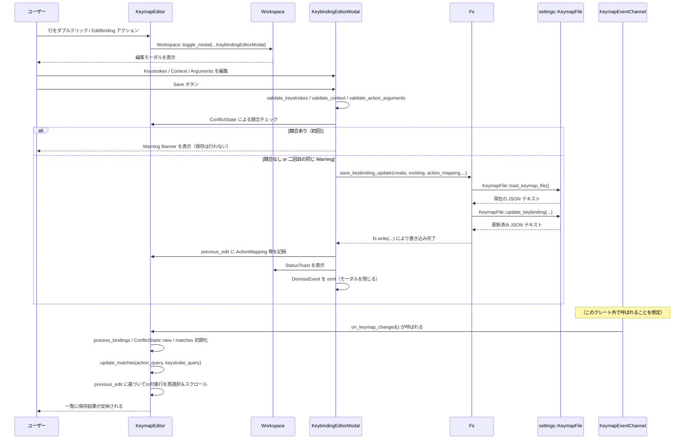

# keymap_editor/ ディレクトリ解説

## 1. ざっくり一言

Zed エディタのキーマップ（キーバインド）を **GUI で検索・フィルタ・編集するためのエディタタブと補助コンポーネント** を提供するクレートです。  
キーバインド一覧、競合検出、JSON ベースのアクション引数編集、キーストローク入力 UI などをまとめて扱います。

---

## 2. このモジュールの役割

### 2.1 概要

- このモジュールは **Zed のキーバインド設定を編集する UI「Keymap Editor」タブ**を実装しています。
- 具体的には次の機能を提供します。
  - 既存キーバインドの一覧表示・ソース別フィルタ（User / Default / Vim）
  - アクション名・キーストロークによる検索（fuzzy マッチ）
  - キーバインド間の **競合検出と表示**
  - 1 件のキーバインドを編集・新規作成する **編集モーダル**
  - JSON 形式のアクション引数の編集（LSP / シンタックスハイライト付き）
  - キーストロークシーケンス入力のための再利用可能な UI コンポーネント

### 2.2 アーキテクチャ内での位置づけ

ディレクトリ内コンポーネントと周辺クレートとの関係を簡略化して示します。

```mermaid
graph TD
  subgraph keymap_editor crate
    KE[KeymapEditor<br/>(tab view)]
    KC[KeybindingEditorModal]
    KA[ActionArgumentsEditor]
    ACP[ActionCompletionProvider]
    KSI[KeystrokeInput]
  end

  WS[Workspace] --> KE
  KE --> KC
  KC --> KA
  KC --> ACP
  KE --> KSI

  KE -->|読込/更新| KF[settings::KeymapFile]
  KE -->|fuzzy 検索| FZ[fuzzy crate]
  KE --> LANG[language::Language<br/>tree-sitter-json/rust]
  KE --> DB[KeybindingEditorDb]

  KSI --> gpui[gpui<br/>KeyBinding/Keystroke]
```

位置づけの要点:

- `KeymapEditor` は `workspace::Item` としてタブ表示されるエディタビューです。
- `KeybindingEditorModal` は 1 件のキーバインドを編集するモーダルで、`KeymapEditor` から起動されます。
- `KeystrokeInput` は「キー列を録音する」ための汎用 UI コンポーネントで、検索バーと編集モーダルの両方で使われます。
- 実際の JSON キーマップファイルの読み書きは `settings::KeymapFile` + `fs::Fs` に委譲しています。
- 競合検出や fuzzy 検索などはこのクレート内で完結しており、UI は `gpui` / `ui` クレートに依存します。
- `KeymapEventChannel` を `App` にグローバル登録しておき、外部から「キーマップが更新された」ことを通知できます。

### 2.3 設計上のポイント

コードから読み取れる設計上の特徴を挙げます。

- **UI とデータ処理の分離**
  - `KeymapEditor` が UI と状態を一括で管理しつつ、キーバインドの加工は `process_bindings` や `ConflictState` など専用構造体／関数に分離されています。
- **非同期・バックグラウンド処理**
  - fuzzy 検索、言語オブジェクトのロード、JSON バッファ作成、ファイル書き込みなどは `cx.spawn` / `cx.background_spawn` でバックグラウンド実行されます。
  - UI スレッドをブロックしない形になっています。
- **競合検出のための追加データ構造**
  - `ConflictState` に、キーシーケンス + コンテキストごとにどのソース（User / Vim / Default 等）からのバインドが存在するかをマップで保持し、優先度にもとづいて競合を判定します。
- **コンテキスト式の「意味的」比較**
  - `normalized_ctx_eq` で `a && b` と `b && a` のような式を同値とみなすなど、論理式としての等価性をかなり丁寧に扱っています。
- **編集モーダルでの安全な保存フロー**
  - 保存前に keystrokes / context / JSON 引数を検証し、`settings::KeymapFile::update_keybinding` へ渡す前にエラーを UI に表示します。
  - 競合がある場合はまず警告として表示し、同じ警告で 2 回目の保存で実際の書き込みを行う二段階方式です。
- **キーストローク入力の再利用性**
  - `KeystrokeInput` はレコーディング開始/停止アクションに応じて window のキーストロークを intercept する汎用コンポーネントとして実装されており、検索モード / 通常モードを切り替えられます。

---

## 3. 主要な機能一覧

このディレクトリが提供する主な機能を列挙します。

- Keymap Editor タブの初期化 (`init`)
- キーバインド一覧の構築・ソート・ fuzzy 検索
- ユーザ／デフォルト／Vim キーマップのソース別フィルタ
- キーストローク検索（部分一致 / 完全一致）の切り替え
- キーバインド間の競合検出とハイライト表示
- コンテキスト式 (`KeyBindingContextPredicate`) の比較・補完
- 1 件のキーバインドの編集・新規作成モーダル (`KeybindingEditorModal`)
- JSON アクション引数編集用のサブエディタ (`ActionArgumentsEditor`)
- キーバインドの追加・置換・削除を JSON キーマップファイルに反映 (`save_keybinding_update`, `remove_keybinding`)
- キーストロークを録音・表示する UI コンポーネント (`KeystrokeInput`)
- キーマップエディタの存在をワークスペース DB に永続化 (`KeybindingEditorDb`)

---

## 4. 関数・構造体の解説

### 4.1 型一覧（構造体・列挙体など）

主要な型を一覧にします（公開 API でなくても、理解に重要なものを含みます）。

| 名前 | 種別 | 役割 / 用途 |
|------|------|-------------|
| `KeymapEditor` | 構造体 | キーマップ編集タブ本体。キーバインド一覧表示・検索・フィルタ・編集モーダル呼び出しを行います。 |
| `KeymapEventChannel` | 構造体 | グローバルな「キーマップ変更」通知チャネル。`Global` を実装し、`trigger_keymap_changed` で通知します。 |
| `SearchMode` | 列挙体 | 検索モード（通常のアクション名検索 / キーストローク検索（exact / non-exact））を表します。 |
| `FilterState` | 列挙体 | `All`（全て） / `Conflicts`（競合のみ）のフィルタ状態を表します。 |
| `SourceFilters` | 構造体 | User / Zed Defaults / Vim Defaults それぞれのバインドを表示するかどうかのフラグを保持します。 |
| `ActionMapping` | 構造体 | あるキーバインドの「keystrokes + コンテキスト」の組を保持し、競合検出や保存時のターゲット指定に使います。 |
| `ConflictState` | 構造体 | キーシーケンスとコンテキスト毎に `ConflictOrigin` を集約し、どのバインドがどれと競合しているかを管理します。 |
| `ProcessedBinding` | 列挙体 | 実際の `gpui::KeyBinding` から加工した 1 件分の論理的なキーバインド情報（マップ済 / 未マップ）を表します。 |
| `KeybindContextString` | 列挙体 | `<global>` か、ローカルコンテキスト文字列＋言語（ハイライト用）を表すラッパ型です。 |
| `KeybindingEditorModal` | 構造体 | 1 件のキーバインドを編集または新規作成するモーダルビューです。検証と保存を担当します。 |
| `ActionArgumentsEditor` | 構造体 | JSON 形式のアクション引数を編集するための `Editor` ラッパ。LSP を動かすために一時ファイルと Worktree を使用します。 |
| `InputError` | 構造体 | 編集モーダル内でのバリデーション結果（Warning / Error）を表し、Banner に表示されます。 |
| `ActionCompletionProvider` | 構造体 | アクション名の補完候補を提供する `CompletionProvider` 実装です。 |
| `KeyContextCompletionProvider` | 構造体 | コンテキスト式内の識別子候補を補完する `CompletionProvider` 実装です。 |
| `KeystrokeInput` | 構造体 | キーストロークシーケンスを録音・表示するための再利用可能な UI コンポーネントです。 |
| `KeybindingEditorDb` | 構造体 | キーマップエディタの存在を SQLite 上に保存するためのドメイン。`SerializableItem` 用です。 |

このほかにも内部的な小さな構造体（`KeyBinding`, `KeybindInformation`, `ActionInformation`, `KeybindConflict`, `KeybindingEditorModalFocusState` など）が存在しますが、ここでは代表的なものに絞っています。

---

### 4.2 関数詳細（代表的なもの）

代表的な 7 つの関数・メソッドを詳しく説明します。

#### `init(cx: &mut App)`

**概要**

- Keymap Editor クレートをアプリに組み込むためのエントリポイントです。
- グローバルな `KeymapEventChannel` を登録し、`OpenKeymap` / `ChangeKeybinding` アクションに応じて `KeymapEditor` タブを開くように設定します。
- `KeymapEditor` を `SerializableItem` として登録し、ワークスペース間で復元可能にします。

**引数**

| 引数名 | 型 | 説明 |
|--------|----|------|
| `cx` | `&mut App` | アプリケーション全体のコンテキスト。グローバル登録やアクションハンドラの設定に使用します。 |

**戻り値**

- なし。

**内部処理の流れ**

1. `KeymapEventChannel::new()` でイベントチャネルを生成し、`cx.set_global` で `App` に登録します。
2. ローカル関数 `open_keymap_editor(filter, workspace, window, cx)` を定義します。
   - 既存の `KeymapEditor` を `active_pane` から探し、あればそれをアクティブ化。
   - なければ新しく `KeymapEditor::new` で作成し、アクティブペインに追加。
   - `filter` が Some のときはフィルタエディタに文字列をセットし、該当バインドがなければロード完了後に自動で作成モーダルを開くため `open_binding_modal_after_loading` を呼びます。
3. `cx.on_action` で `OpenKeymap` アクションを購読し、発火時に `with_active_or_new_workspace` 経由で `open_keymap_editor(None, ...)` を呼びます。
4. `cx.observe_new` で新しい `Workspace` が生成されたときのフックを登録し、各 `Workspace` で `ChangeKeybinding` アクションを処理するハンドラを追加します。
   - `ChangeKeybinding` には `action.action` にアクション名が入っており、それを `filter` として `open_keymap_editor(Some(action_name), ...)` に渡します。
5. `register_serializable_item::<KeymapEditor>(cx)` を呼び、`KeymapEditor` をワークスペース上のシリアライズ対象アイテムとして登録します。

**Examples（使用例）**

アプリ側で Keymap Editor を有効にするコード例です。

```rust
use keymap_editor;                // このクレート
use ui::App;                      // アプリケーションのエントリポイント

fn main() {
    ui::run(|cx: &mut App| {      // アプリ起動時に呼ばれる初期化クロージャ
        keymap_editor::init(cx);  // Keymap Editor 機能を登録
        // 他のプラグインや UI 初期化もここで行う
    });
}
```

**Edge cases（エッジケース）**

- `ChangeKeybinding` によって開かれた場合、フィルタに該当するバインドが存在しないときは、一覧の読み込みが完了したあとに自動で「新規キーバインド作成」モーダルが開きます（`open_binding_modal_after_loading`）。
- キーマップエディタが既に開かれている場合は再利用され、新しくタブは作られません。

**使用上の注意点**

- `init` はアプリ起動時に 1 度だけ呼び出す前提で設計されています（複数回呼ぶことは想定されていません）。
- `KeymapEventChannel` のグローバル登録もここで行われるため、外部から `KeymapEventChannel::trigger_keymap_changed` を使う場合も必ず `init` の呼び出しが必要です。

---

#### `KeymapEditor::new(workspace: WeakEntity<Workspace>, window: &mut Window, cx: &mut Context<Self>) -> Self`

**概要**

- `KeymapEditor` タブのインスタンスを生成し、初期状態を整えます。
- グローバルの `KeymapEventChannel` を購読し、キーマップ変更時に自動で一覧を再読み込みするように設定します。
- 検索フィールド・キーストローク入力欄・テーブル・一時ディレクトリなどの初期化を行います。

**引数**

| 引数名 | 型 | 説明 |
|--------|----|------|
| `workspace` | `WeakEntity<Workspace>` | 所属するワークスペースへの弱参照。モーダル表示や Worktree 作成などに使用します。 |
| `window` | `&mut Window` | このビューが所属するウィンドウ。フォーカス制御や子エンティティ作成に使用します。 |
| `cx` | `&mut Context<Self>` | `KeymapEditor` 用のローカルコンテキスト。サブスクライブや子エンティティ生成に用います。 |

**戻り値**

- 新しく初期化された `KeymapEditor` インスタンス。

**内部処理の流れ（要約）**

1. `cx.observe_global_in::<KeymapEventChannel>(window, Self::on_keymap_changed)` で、グローバルイベントチャネルからの通知を購読します。
2. `TableInteractionState` を新規作成し、スクロールバーのスタイルなどを設定。
3. キーストローク検索用の `KeystrokeInput` を生成し、`set_search(true)` を設定します。
4. アクション名検索用の `Editor` を生成し、プレースホルダテキスト `"Filter action names…"` をセットします。
5. フィルタエディタに対して `EditorEvent::BufferEdited` を購読し、テキスト変更時に `on_query_changed` を呼ぶようにします。
6. `KeystrokeInput` に対しても変更時のサブスクリプションを貼り、キーストロークが変化したとき（かつキーストローク検索モードのとき）に `on_query_changed` を呼びます。
7. バックグラウンドで一時ディレクトリと Worktree を作成し、JSON LSP 用の `action_args_temp_dir` と `action_args_temp_dir_worktree` を保存します。
8. デフォルトのフィルタ状態・ソースフィルタ・列幅設定などをフィールドにセットします。
9. 最後に `self.on_keymap_changed(window, cx)` を呼び、現在のキーマップから一覧を構築して初期表示を行います。

**Edge cases（エッジケース）**

- 一時ディレクトリ／Worktree の作成に失敗した場合でも、Keymap Editor 自体は生成されます。その場合、`ActionArgumentsEditor` 側でバックアップの一時ディレクトリを作成して LSP を有効にしようとします。
- `workspace` が無効になっている場合でも、`WeakEntity` を通じて update した際にエラーとして返り、適切に無視されるような設計になっています（`read_with` / `update` の戻り値を `?` で伝播しています）。

**使用上の注意点**

- 通常は `KeymapEditor::new` を直接呼ばず、`init` 内の `open_keymap_editor` 経由で生成されます。
- `KeymapEditor` は `SerializableItem` を実装しているため、ワークスペース復元時にもこのコンストラクタが使われます（`SerializableItem::deserialize`）。

---

#### `fn on_query_changed(&mut self, cx: &mut Context<Self>)`

**概要**

- アクション名フィルタまたはキーストローク入力が変更されたときに呼ばれ、検索クエリに応じた一覧更新をトリガします。
- テレメトリイベント用の 1 秒デバウンスと、実際の `update_matches` 呼び出しを同時に行います。

**引数**

| 引数名 | 型 | 説明 |
|--------|----|------|
| `cx` | `&mut Context<Self>` | `KeymapEditor` のコンテキスト。バックグラウンドタスクを spawn するのに使用します。 |

**戻り値**

- なし。

**内部処理の流れ**

1. 現在のアクションクエリ文字列とキーストローククエリ（`Vec<KeybindingKeystroke>`）を取得します。
2. 現在の検索モードから `exact_match` フラグを取得します。
3. `cx.background_executor().timer(Duration::from_secs(1))` を使って 1 秒タイマーを設定し、その完了時にテレメトリイベント `"Keystroke Search Completed"` を送るタスクを `background_spawn` します。
   - テレメトリにはアクションクエリ文字列・キーストローク文字列表現（`unparse()` を join）・ exact match フラグが記録されます。
4. すぐに別のタスクを `cx.spawn` で起動し、`Self::update_matches(this.clone(), action_query, keystroke_query, cx).await` を呼びます。
5. `update_matches` 完了後に `scroll_to_item(0, ScrollStrategy::Top, cx)` を呼び、テーブルのスクロール位置を先頭に戻します。

**Edge cases（エッジケース）**

- クエリが頻繁に変わる場合でも、テレメトリは 1 秒デバウンスされますが、`update_matches` の呼び出し自体は都度行われます。
- `update_matches` は `WeakEntity` を使っているため、検索中に `KeymapEditor` が閉じられた場合は自動的に何もせず終了します。

**使用上の注意点**

- `on_query_changed` 自体は UI スレッド上で軽量である必要があるため、重い処理は必ず `update_matches` 側（非同期）に押し出されています。
- `search_mode` が `SearchMode::Normal` のときはキーストローククエリは空にされ、それに応じて `update_matches` もキーストローク関連のフィルタを適用しません。

---

#### `async fn update_matches(this: WeakEntity<Self>, action_query: String, keystroke_query: Vec<KeybindingKeystroke>, cx: &mut AsyncApp) -> anyhow::Result<()>`

**概要**

- 現在の全キーバインドから、アクション名 fuzzy 検索・ソースフィルタ・競合フィルタ・キーストロークフィルタなどを適用し、最終的に表示する行（`matches: Vec<StringMatch>`）を更新します。
- 代表的な「一覧更新ロジック」の中心的な関数です。

**引数**

| 引数名 | 型 | 説明 |
|--------|----|------|
| `this` | `WeakEntity<KeymapEditor>` | 編集対象の `KeymapEditor` への弱参照。ビューが破棄済みでも安全に動かすために使われます。 |
| `action_query` | `String` | 正規化前のアクション名検索クエリ。 |
| `keystroke_query` | `Vec<KeybindingKeystroke>` | キーストローク検索モード用のクエリ（録音されたキー列）。 |
| `cx` | `&mut AsyncApp` | 非同期アプリケーションコンテキスト。バックグラウンド executor や `read_with` / `update` を提供します。 |

**戻り値**

- `anyhow::Result<()>`  
  - 成功時は `Ok(())`。
  - `this.read_with` / `this.update` や `fuzzy::match_strings` のエラーがあれば `Err` を返します。

**内部処理の流れ（概要）**

1. `command_palette::normalize_action_query(&action_query)` でアクション名クエリを正規化します（小文字化やスペース正規化などを想定）。
2. `this.read_with` で
   - `string_match_candidates`（人間向けアクション名の候補一覧）、
   - キーバインド数 (`keybind_count`)
   を取得します。
3. `fuzzy::match_strings` を実行し、アクション名に対する fuzzy マッチ結果（`Vec<StringMatch>`）を取得します。
4. `this.update` 内で `matches` に対して次のフィルタ処理を適用します。
   - **ソースフィルタ**: `SourceFilters::allows` によって User / Default / Vim のどれを表示するか制御。
   - **競合フィルタ**: `FilterState::Conflicts` のとき、`ConflictState::has_user_conflict` が `true` のものだけ残します。
   - **キーストロークフィルタ**（`SearchMode::KeyStroke` のとき）
     - `exact_match == true` のとき: `keystrokes_match_exactly` でキーストローク列が完全一致するもののみ残します。
     - `exact_match == false` のとき: クエリ列をターゲット列の「連続する部分列」として埋め込めるかどうかを走査し、条件を満たすものだけ残します（モディファイアが包含関係、キー文字列の一致等で判定）。
   - **NoAction フィルタ**: `show_no_action_bindings == false` のとき `is_no_action()` なバインドを除外。
   - **ソート**: アクションクエリが空文字列のとき、`ProcessedBinding::cmp` に基づいて（ソース → humanized なアクション名）でソートします。
5. `selected_index` をクリアし、新しい `matches` を `self` に保存し、`cx.notify()` で UI 再描画をトリガします。

**Edge cases（エッジケース）**

- アクションクエリが空のときのみ、`ProcessedBinding::cmp` によるソートが行われます。クエリが非空のときは fuzzy スコアを保持した順序が優先されます。
- キーストローク検索モードでクエリがターゲットより長い場合は必ず除外されます。
- `show_no_action_bindings == false` のとき、`gpui::NoAction` に紐づくバインドは一覧から消えるため、空のアクションも検索できません。

**使用上の注意点**

- この関数は `WeakEntity` 経由で `KeymapEditor` にアクセスするため、呼び出し時点でビューが既に破棄されている可能性があります。その場合、`read_with` / `update` が `Err` を返し、早期 `?` で終了します。
- 追加のフィルタ条件を入れたい場合、`update_matches` にロジックを追加するのが自然な拡張ポイントです。

---

#### `fn on_keymap_changed(&mut self, window: &mut Window, cx: &mut Context<KeymapEditor>)`

**概要**

- グローバルな `KeymapEventChannel` の更新に応じて呼ばれ、現在のキーマップから一覧・競合状態を再構築します。
- 初期化時にも呼ばれ、Keymap Editor が開かれた際の初期データロードにも使われます。

**引数**

| 引数名 | 型 | 説明 |
|--------|----|------|
| `window` | `&mut Window` | 所属ウィンドウ。非同期タスクをウィンドウに紐づけて spawn するのに使用します。 |
| `cx` | `&mut Context<KeymapEditor>` | KeymapEditor コンテキスト。非同期タスク起動および自身の更新に使用します。 |

**戻り値**

- なし。

**内部処理の流れ**

1. `workspace` の弱参照をクローンし、`cx.spawn_in(window, async move |this, cx| { ... })` で非同期タスクを起動します。
2. 非同期タスク内で:
   1. `load_json_language(workspace.clone(), cx).await` で JSON 用 `Language` を読み込み（失敗時は tree-sitter-json でのデフォルトを生成）。
   2. `load_keybind_context_language(workspace.clone(), cx).await` で「Zed Keybind Context」言語を読み込み（失敗時は tree-sitter-rust ベースのデフォルト）。
   3. `this.update` で以下を行います。
      - `Self::process_bindings(json_language, zed_keybind_context_language, &this.humanized_action_names, cx)` を呼び、次を得ます。
        - `Vec<ProcessedBinding>`
        - `Vec<StringMatchCandidate>`（humanized アクション名）
        - `HashSet<&'static str>`（スキーマを持つアクション名集合）
      - `ConflictState::new(&key_bindings)` で競合情報を再構築し、`keybinding_conflict_state` に設定。
      - `keybindings`, `actions_with_schemas`, `string_match_candidates`, `matches` を更新。初期 `matches` は候補全件をスコア 0 で構築します。
      - 現在のアクションクエリとキーストローククエリを取得して返します。
   4. `Self::update_matches(this.clone(), action_query, keystroke_query, cx).await` により、現在のクエリに対するフィルタリング・ソートを適用します。
   5. さらに `this.update_in` で、`previous_edit` フィールドに応じたスクロール位置・選択行の復元を行います。

**Edge cases（エッジケース）**

- JSON / Keybind Context 言語の取得が失敗した場合でも、デフォルト言語を構築して一覧を表示します。
- `previous_edit` が `PreviousEdit::Keybinding` の場合、再ロード後に一致する `ActionMapping` / `action_name` を持つ行を探し、存在すればそこへスクロール＆選択、見つからなければ以前のスクロール位置に戻します。
- `previous_edit` が `ScrollBarOffset` の場合は単にスクロール位置だけ復元されます。

**使用上の注意点**

- 実際の「キーマップ変更」はこのクレートの外側で行われることも多く、その際は `KeymapEventChannel::trigger_keymap_changed` を呼ぶことでこの関数が間接的に起動されます。
- キーバインド数が多い場合、`process_bindings` や `ConflictState::new` はそれなりのコストがかかるため、必要以上に頻繁に呼ばない設計が望まれます。

---

#### `fn save(&mut self, cx: &mut Context<Self>) -> Result<(), InputError>` （`KeybindingEditorModal`）

**概要**

- 編集モーダルで「Save」操作が行われたときに呼ばれます。
- キーストローク・コンテキスト・アクション名・アクション引数を検証し、必要であれば競合警告を表示しながら、JSON キーマップファイルへ変更を反映します。

**引数**

| 引数名 | 型 | 説明 |
|--------|----|------|
| `cx` | `&mut Context<Self>` | モーダルコンテキスト。キーマップエディタや Workspace の更新に使用します。 |

**戻り値**

- `Result<(), InputError>`  
  - 成功時は `Ok(())`（ただし実際のファイル書き込みは非同期タスクで行われます）。
  - バリデーションエラーや競合警告の場合は `Err(InputError)` を返します（上位の `save_or_display_error` が Banner に表示）。

**内部処理の流れ（概要）**

1. 既存バインド `existing_keybind` と `fs` をクローンします。
2. `validate_keystrokes` を呼び、空でないキーストローク列を取得します。
   - ここで `KeybindingKeystroke::remove_key_char()` を呼び、キーキャラクタをクリアします（key + modifiers に標準化）。
3. `validate_context` でコンテキスト文字列を取得し、`KeyBindingContextPredicate::parse` で検証します。
4. `validate_action_arguments` でアクション引数（JSON 文字列）を検証します。
   - JSON パース → `cx.build_action(action_name, value)` でアクション引数として妥当か確認。
5. 上記情報から `ActionMapping { keystrokes: Rc<[KeybindingKeystroke]>, context: Option<SharedString> }` を構築します。
6. `keymap_editor.read(cx).keybinding_conflict_state.conflicting_indices_for_mapping(...)` で、新しいマッピングが他のバインドと競合するか確認します。
   - 競合がある場合、対象アクション名と件数から警告メッセージを組み立て、`InputError::warning` として返します。
   - ただし、**同じ警告が既に表示されている場合**は警告を再表示せず、保存を継続します（2 回目の Save で実際に書き込む動き）。
7. `get_selected_action_name` でアクション名を最終確定します（新規作成時は入力欄から取得、それ以外は既存）。
8. `ActionInformation::new` でヒューマナイズされたアクション名などを持つ新しい `ActionInformation` を作成し、`keybind_for_save` として利用します。
9. `cx.spawn` で非同期タスクを起動し、`save_keybinding_update` を呼びます。
   - 成功時:
     - `KeymapEditor` の `previous_edit` に、今回の `ActionMapping` と `action_name` とスクロール位置を記録します。
     - `StatusToast` を表示し、「Saved edits to the {humanized_action_name} action.」という通知を出します。
     - `DismissEvent` を emit してモーダルを閉じます。
   - 失敗時:
     - `InputError::error(err)` としてエラーメッセージをセットし、Banner に表示します。

**Edge cases（エッジケース）**

- キーストロークが空の場合: `validate_keystrokes` で `anyhow::ensure!` によりエラーとなり、「Keystrokes cannot be empty」というメッセージでエラー扱いになります。
- コンテキスト式の構文エラー: `KeyBindingContextPredicate::parse` が失敗すると、`"Failed to parse key context"` でラップされたエラーになります。
- アクション引数 JSON の構文エラーや不正なフィールド: `serde_json::from_str` または `cx.build_action` の失敗として `InputError::error` になります。
- 競合がある場合:
  - 初回 Save では警告表示のみで、ファイルは書き換えられません。
  - 同じ警告で 2 回目に Save した場合に限り、ファイル更新に進むようになっています。

**使用上の注意点**

- `save` 自体は同期関数で、実際のディスク書き込みは非同期タスクで行われます。そのため、戻り値 `Ok(())` は「保存処理の開始」を意味し、完了を保証するものではありません。
- 保存完了後の一覧更新は `KeymapEventChannel` を通じた `on_keymap_changed` で行われる設計になっているため、外部から `trigger_keymap_changed` を呼ぶことが期待されています（このクレート内で直接呼んでいる箇所はありません）。

---

#### `fn handle_keystroke(&mut self, keystroke: &Keystroke, window: &mut Window, cx: &mut Context<Self>)` （`KeystrokeInput`）

**概要**

- `KeystrokeInput` がフォーカスされている状態で、1 つのキーストロークイベントを受け取ったときの処理です。
- 「録音停止用のキーシーケンス」の検出と、実際に `keystrokes` ベクタへ記録する処理を行います。

**引数**

| 引数名 | 型 | 説明 |
|--------|----|------|
| `keystroke` | `&gpui::Keystroke` | ウィンドウから届いた 1 回分のキーストローク（キー + モディファイア）。 |
| `window` | `&mut Window` | モディファイア情報やフォーカス制御に使用します。 |
| `cx` | `&mut Context<Self>` | `KeystrokeInput` のコンテキスト。イベントの伝播停止やタスク起動に使います。 |

**戻り値**

- なし。

**内部処理の流れ（要約）**

1. `cx.stop_propagation()` で、このキーストロークが他の Keybinding に捕まらないようにします。
2. `handle_possible_close_keystroke` を呼び、現在のキーストロークが「録音停止アクション用のバインド（例: escape escape escape）」の一部かどうかを判定します。
   - 完全一致 (`CloseKeystrokeResult::Close`) の場合は `stop_recording` を呼んで録音終了し、この関数を抜けます。
   - 部分一致 (`Partial`) の場合は `close_keystrokes` と `close_keystrokes_start` を更新します。
3. `KeybindingKeystroke::new_with_mapper` で `Keystroke` を `KeybindingKeystroke` に変換します（プラットフォーム依存マッピングを考慮）。
4. 直前の keystrokes の末尾が「キーのないダミー keystroke」の場合は、条件に応じて削除します（検索モードやモディファイアの有無に応じた調整）。
5. `CloseKeystrokeResult::Partial` の場合、`close_keystrokes_start` に現在の `keystrokes.len()` をセットします（この位置以降が終了シーケンス）。
6. `keystrokes.len()` が上限 (`KEYSTROKE_COUNT_MAX = 3`) に達している場合は、`clear_keystrokes` を呼んで全てクリアし、戻ります。
7. それ以外の場合は、新しい `KeybindingKeystroke` を `keystrokes` にプッシュし、`keystrokes_changed` を呼んでイベントおよび UI 更新を通知します。
8. 実際のモディファイア状態を `window.modifiers()` から取得し、検索モードかどうかに応じて挙動を分けます。
   - 検索モード (`search == true`): `previous_modifiers` に現在のモディファイアを保存し、終了します。ダミー keystroke は追加されません。
   - 通常モード: まだ上限に達しておらず、モディファイアが有効な場合は `dummy(modifiers)` を追加し、「モディファイアのみ」の keystroke を末尾に追加します（`ctrl-a` の後に `ctrl-` が並ぶような表現）。

**Edge cases（エッジケース）**

- 録音停止用キーシーケンス
  - 実際のキーシーケンスは `determine_stop_recording_binding` によって決まり、テストでは `escape escape escape` が使われています。
  - シーケンス途中で別のキーが挟まると検出状態がリセットされ、録音は継続されます。
  - 完全に一致した場合は、そのシーケンスに対応する keystrokes が `keystrokes` から削除され、録音が停止します。
- キーストローク数の上限
  - 上限 3 を超える入力が行われた場合、`clear_keystrokes` により入力済み keystrokes は全てクリアされます（テストでもこの挙動が検証されています）。
- 検索モードと通常モードの違い
  - 検索モードではモディファイアのみの keystroke が別エントリとして残るため、「ctrl-」「alt-」なども検索クエリとして利用できます。
  - 通常モードでは最後が「キー無しダミー」の場合、`keystrokes()` アクセサでこの末尾を隠すようになっており、実際のバインドには含まれません。

**使用上の注意点**

- このメソッドは通常直接呼び出さず、`KeystrokeInput` が `on_inner_focus_in` で登録した keystroke interceptor 経由で自動的に呼ばれます。
- カスタムの録音停止キーを設定したい場合は、`StopRecording` アクションに対する Keybinding を gpui 側で切り替える必要があります。

---

#### `async fn save_keybinding_update(create: bool, existing: ProcessedBinding, action_mapping: &ActionMapping, new_args: Option<&str>, fs: &Arc<dyn Fs>, keyboard_mapper: &dyn PlatformKeyboardMapper) -> anyhow::Result<()>`

**概要**

- 既存または新規のキーバインド変更を JSON キーマップファイルに反映します。
- `settings::KeymapFile::update_keybinding` を用いて JSON を更新し、`fs::Fs` でディスクに書き戻します。

**引数**

| 引数名 | 型 | 説明 |
|--------|----|------|
| `create` | `bool` | 新規作成か（`true`）既存置換か（`false`）。 |
| `existing` | `ProcessedBinding` | 変更対象となる元のバインド情報。 |
| `action_mapping` | `&ActionMapping` | 新しく設定する keystrokes + context。 |
| `new_args` | `Option<&str>` | 新しい JSON アクション引数（文字列）。None の場合は引数なし。 |
| `fs` | `&Arc<dyn Fs>` | ファイルシステム抽象。キーマップファイルの読み書きに利用。 |
| `keyboard_mapper` | `&dyn PlatformKeyboardMapper` | キー名の正規化などに使われるマッパー。 |

**戻り値**

- `anyhow::Result<()>`  
  - 失敗時には、読み込み／更新／書き込みのいずれかのエラーをラップして返します。

**内部処理の流れ（概要）**

1. `KeymapFile::load_keymap_file(fs).await` で現在のキーマップ JSON を読み込みます。
2. `infer_json_indent_size(&keymap_contents)` でインデント幅を推測します。
3. 既存バインドの情報から `settings::KeybindUpdateTarget` を構築します（元の context / keystrokes / action_name / arguments）。
4. 新しい値から `source: KeybindUpdateTarget` を構築します。
5. `create` フラグに応じて `KeybindUpdateOperation` を構築します。
   - `Replace`（既存バインドの置換）
   - `Add`（新しいバインドの追加。`from` に元バインドを持たせておく）
6. `operation.generate_telemetry()` を呼び出し、テレメトリに送るための情報（新旧バインド表示用の文字列と source）を取得します。
7. `KeymapFile::update_keybinding(operation, keymap_contents, tab_size, keyboard_mapper)` を呼び、新しい JSON テキストを得ます。
8. `fs.write(paths::keymap_file().as_path(), updated_keymap_contents.as_bytes()).await` でファイルに書き込みます。
9. `telemetry::event!` で `"Keybinding Updated"` イベントを送信します。

**Edge cases（エッジケース）**

- 既存バインドが unmapped（`ProcessedBinding::Unmapped`）の場合でも、`existing.keystrokes()` が `None` のときは `keymap_contents` に対応するエントリが存在しない可能性があります。その場合の挙動は `KeymapFile::update_keybinding` の実装に依存します（このチャンクからは詳細不明です）。
- ファイル書き込みに失敗した場合、`InputError::error` としてモーダルに表示されます。

**使用上の注意点**

- この関数は `KeybindingEditorModal::save` からのみ呼び出されており、直接利用する場面は通常ありません。
- 更新後の再読み込みはこの関数内では行っておらず、別途 `KeymapEventChannel::trigger_keymap_changed` などで通知する必要があります（このクレートの外側の責務です）。

---

#### `pub fn keystrokes(&self) -> &[KeybindingKeystroke]` （`KeystrokeInput`）

※ 短めの補足ですが、検索・保存時の挙動に大きく関わるため挙げておきます。

**概要**

- 現在 `KeystrokeInput` に記録されている keystrokes を参照用に返します。
- 検索モードかどうか、末尾が「キーなしダミー」であるかどうかによって、**実際に返すスライスを調整** します。

**戻り値**

- `&[KeybindingKeystroke]`  
  - 検索モードでない場合、末尾が「キー無し（`key == ""`）」のダミー keystroke であればそれを除いたスライスを返します。
  - プレースホルダが設定されていて、かつ現在 keystrokes が空のときはプレースホルダ keystrokes を返します。

**Edge cases（エッジケース）**

- プレースホルダ keystrokes がある場合:
  - 録音前やクリア直後に `keystrokes()` を呼ぶとプレースホルダを返し、UI 上に「サンプル keystroke」のようなものを表示できます。
- 通常モードでの末尾ダミー keystroke の扱い:
  - 例えば `["ctrl-a", "ctrl-"]` のように内部には残っていても、`keystrokes()` では `["ctrl-a"]` だけが返されます。
  - これにより、保存時の検証や比較では余計なダミーが含まれないようになっています。

---

### 4.3 その他の関数

詳しく説明しなかった補助関数・内部ロジックの役割を簡単にまとめます。

| 関数名 | 役割（1 行） |
|--------|--------------|
| `keystrokes_match_exactly` | 2 つの `&[KeybindingKeystroke]` が長さ・キー・モディファイアともに全く同じかを判定します。 |
| `binding_is_unbound_by_unbind` | ある `gpui::KeyBinding` が、後続の `gpui::Unbind` アクションによって無効化されているかどうかを判定します（テストあり）。 |
| `ConflictState::new` | 全 `ProcessedBinding` からキーシーケンス + コンテキストごとの競合情報を集計し、`ConflictState` を構築します。 |
| `ConflictState::conflicting_indices_for_mapping` | 指定した `ActionMapping` と競合する既存バインドのインデックス情報を返します。 |
| `HumanizedActionNameCache::new` | すべてのアクション名を `command_palette::humanize_action_name` したキャッシュを構築します。 |
| `collect_contexts_from_assets` | デフォルト / Vim / Base キーマップのアセットからコンテキスト識別子を抽出し、補完候補リストを生成します。 |
| `normalized_ctx_eq` | `KeyBindingContextPredicate` 同士が論理的に等価かどうかを、And/Or の交換・結合則や二重否定を考慮して比較します（豊富なテストあり）。 |
| `load_json_language` | JSON 用の `Language` をワークスペースから取得し、なければ tree-sitter-json でデフォルトを生成します。 |
| `load_keybind_context_language` | 「Zed Keybind Context」用の `Language` を取得し、なければ tree-sitter-rust ベースで生成します。 |
| `remove_keybinding` | 既存キーバインドを JSON キーマップファイルから削除します（`KeybindUpdateOperation::Remove`）。 |
| `KeybindingEditorModalFocusState` 系メソッド | モーダル内のフォーカスをアクション名 → keystrokes → 引数 → コンテキストの順に移動させるロジックです。 |

---

## 5. データフロー

ここでは、「既存のキーバインドを編集して保存し、一覧に反映される」までの典型的なデータフローを説明します。

### シナリオ: 行をダブルクリックしてキーバインドを編集・保存する

流れの要点:

1. ユーザーが `KeymapEditor` 一覧の行をダブルクリックするか、行を選択して `EditBinding` を発火させます。
2. `KeymapEditor` は `KeybindingEditorModal` を生成し、現在のバインド内容を渡してモーダルを表示します。
3. ユーザーはモーダル内の `KeystrokeInput`・コンテキスト・引数エディタを編集し、「Save」ボタンを押します。
4. `KeybindingEditorModal::save` が検証と競合チェックを行い、問題なければ `save_keybinding_update` を非同期に呼び出します。
5. `save_keybinding_update` は JSON キーマップファイルを更新し、ディスクに書き戻します。
6. 保存が完了した後、外部から `KeymapEventChannel::trigger_keymap_changed` が呼ばれることで、`KeymapEditor::on_keymap_changed` が起動し、一覧を再構築します。
7. `previous_edit` に記録された情報から、編集したバインドの行を再選択し、そこまでスクロールします。

これをシーケンス図で表します。



この図から分かるように、UI 更新（`on_keymap_changed`）とファイル書き込み（`save_keybinding_update`）は疎結合になっており、`KeymapEventChannel` を介して連携する構造になっています。

---

## 6. 使い方（How to Use）

### 6.1 基本的な使用方法

Keymap Editor をアプリケーションに組み込み、キーバインドを編集できるようにするまでの典型的なコード例です。

#### 1. アプリ初期化時に Keymap Editor を登録

```rust
use ui::App;                   // Zed の App 型（仮想）
use keymap_editor;             // このクレート

fn main() {
    ui::run(|cx: &mut App| {   // アプリケーションのエントリポイント
        keymap_editor::init(cx); // Keymap Editor のアクションやタブを登録
        // 他のプラグインや UI 初期化処理…
    });
}
```

#### 2. キーマップエディタを開く

Keymap Editor には標準アクション `zed_actions::OpenKeymap` でアクセスできます（このクレート内では `cx.on_action` でハンドラ登録済み）。

```rust
use zed_actions::OpenKeymap;
use gpui::{Window, AppContext as _};

fn open_keymap_from_somewhere(window: &mut Window, cx: &mut ui::App) {
    // OpenKeymap アクションをディスパッチすると Keymap Editor が前面に表示される
    window.dispatch_action(OpenKeymap.boxed_clone(), cx);
}
```

#### 3. KeystrokeInput コンポーネントを使う（独自 UI で）

`KeystrokeInput` は単体コンポーネントとしても使用できます。

```rust
use keymap_editor::keystroke_input::KeystrokeInput;
use gpui::{Context, Entity};
use ui::Window;

fn build_custom_ui(window: &mut Window, cx: &mut Context<()>) -> Entity<KeystrokeInput> {
    // 既定のプレースホルダ無しで KeystrokeInput を生成
    cx.new(|cx| KeystrokeInput::new(None, window, cx))
}
```

### 6.2 よくある使用パターン

#### パターン 1: 特定アクションのキーバインド編集画面を直接開く

`ChangeKeybinding` アクションを発火すると、該当アクションでフィルタされた Keymap Editor が開きます（`init` 内でハンドラ登録済み）。

```rust
use zed_actions::ChangeKeybinding;

fn change_specific_action(window: &mut Window, cx: &mut ui::App) {
    let action_name = "file::open";               // 例: 開きたいアクション名

    let action = ChangeKeybinding { action: action_name.into() };
    window.dispatch_action(action.boxed_clone(), cx);
    // → Keymap Editor が開き、アクション名でフィルタされた状態になる
    // → バインドがなければロード完了後に新規作成モーダルが自動で開く
}
```

#### パターン 2: キーマップ JSON を外部で編集した後に再読み込みさせる

このクレート以外でキーマップ JSON を編集した場合、`KeymapEventChannel::trigger_keymap_changed` を呼ぶことで Keymap Editor の一覧を再構築させられます。

```rust
use keymap_editor::KeymapEventChannel;
use ui::App;

fn on_external_keymap_change(cx: &mut App) {
    // 何らかの手段で keymap.json を書き換えたあと
    KeymapEventChannel::trigger_keymap_changed(cx);
    // → 開いている KeymapEditor は on_keymap_changed を通して再読み込みする
}
```

#### パターン 3: KeystrokeInput を検索バーとして使う

`KeystrokeInput` は `set_search(true)` を呼ぶと検索モードになり、`KeystrokeInput::keystrokes()` が検索用クエリとして使いやすい状態になります。

```rust
use keymap_editor::keystroke_input::KeystrokeInput;
use gpui::{Context, Entity};
use ui::Window;

fn create_search_keystroke_input(window: &mut Window, cx: &mut Context<()>) -> Entity<KeystrokeInput> {
    cx.new(|cx| {
        let mut input = KeystrokeInput::new(None, window, cx);
        input.set_search(true);      // 検索モードに切り替える
        input
    })
}
```

### 6.3 使用上の注意点（まとめ）

このディレクトリのモジュールを利用する際の共通の注意点をまとめます。

- **非同期更新と整合性**
  - fuzzy 検索やキーマップ再読み込みは非同期で行われます。ビューが閉じられたあとにタスクが完了しても `WeakEntity` を通じて安全に無視される設計ですが、外部から追加の非同期処理を入れる場合も同様のパターンを踏襲することが望ましいです。
- **キーストローク数の上限**
  - `KeystrokeInput` は最大 3 keystrokes までしか保持しません。それ以上入力すると自動的にクリアされます。長いキーシーケンスを扱いたい場合は、この制約を考慮する必要があります（このファイルでは 3 に固定されています）。
- **録音停止用キーシーケンス**
  - 録音停止は `StopRecording` アクションに割り当てられたバインド（Keymap 上の定義）に依存します。テストでは `escape escape escape` になっていますが、実際のアプリではユーザが変更可能です。
- **末尾ダミー keystroke の扱い**
  - 通常モードでは `KeystrokeInput::keystrokes()` が末尾の空キーを隠すため、保存や比較ではダミーが含まれません。検索モードではダミーも検索クエリとして利用されるので、この違いを前提に使う必要があります。
- **コンテキスト式の等価性**
  - `normalized_ctx_eq` を用いて `a && b` と `b && a` などを同値とみなしているため、内部的な競合判定では式の書き方の違いによるブレが軽減されています。
  - ただし、すべての論理等価変形を網羅しているわけではなく、実装されている変形（AND/OR の交換・結合、二重否定など）に限定されます。
- **エラー表示と警告の二段階保存**
  - 編集モーダルでは、エラー（`InputError::Error`）は即座に保存を中断し、警告（`InputError::Warning`）は同じ内容の警告が二度出たときにのみ保存を進める仕組みになっています。
  - 特にキーバインドの競合は警告扱いであり、ユーザーに再度の Save を促します。
- **一時ディレクトリの寿命**
  - `ActionArgumentsEditor` は一時ファイル＋Worktree を使って JSON LSP を動かします。`KeymapEditor` が持つ `TempDir` はエディタのライフタイムに紐付いており、バックアップ用 `TempDir` は `ActionArgumentsEditor` のドロップ時に自動削除されます。

---

## 7. 関連ファイル

このディレクトリと密接に関係する外部ファイル・モジュールを示します（コード中の参照にもとづきます）。

| パス / モジュール | 役割 / 関係 |
|-------------------|------------|
| `settings::KeymapFile` | JSON キーマップファイルの読み込み・パース・更新ロジックを提供します。`save_keybinding_update` / `remove_keybinding` から利用されています。 |
| `settings::KeybindUpdateOperation` / `KeybindUpdateTarget` | キーバインドの追加・置換・削除を表現するデータ構造です。 |
| `settings::BaseKeymap` / `SettingsAssets` | デフォルト / Vim / Base キーマップのアセットパス管理と読み込みに使用され、`collect_contexts_from_assets` でコンテキスト候補抽出に使われています。 |
| `workspace::Workspace` / `WorkspaceDb` | Keymap Editor をタブとして管理し、DB に存在を永続化するためのワークスペース関連モジュールです。 |
| `workspace::SerializableItem` | `KeymapEditor` をワークスペース間で復元可能なアイテムとして扱うためのトレイト。`serialize` / `deserialize` / `cleanup` で使用されています。 |
| `editor::Editor` / `editor::MultiBuffer` | アクション名フィルタ・コンテキスト編集・引数 JSON 編集などのテキスト入力 UI を提供します。 |
| `gpui::KeyBinding` / `KeyBindingContextPredicate` | 実際のキーバインド情報とコンテキスト式の表現。`binding_is_unbound_by_unbind` や `normalized_ctx_eq` 等で利用されています。 |
| `fuzzy` クレート | アクション名の fuzzy 検索（`fuzzy::match_strings`）に使用されます。 |
| `language::Language` / `tree-sitter-json` / `tree-sitter-rust` | JSON と Keybind Context のシンタックスハイライト・LSP 用言語定義として利用されます。 |
| `db` / `WorkspaceDb` | `KeybindingEditorDb` のバックエンドとなる SQLite 接続・マイグレーションを提供します。 |

このディレクトリ内のコードは、これら外部モジュールを組み合わせることで「キーマップの GUI エディタ」という機能を構成しています。
