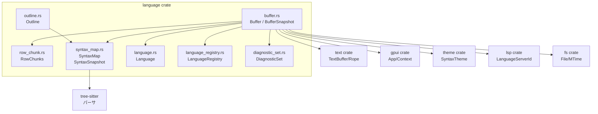
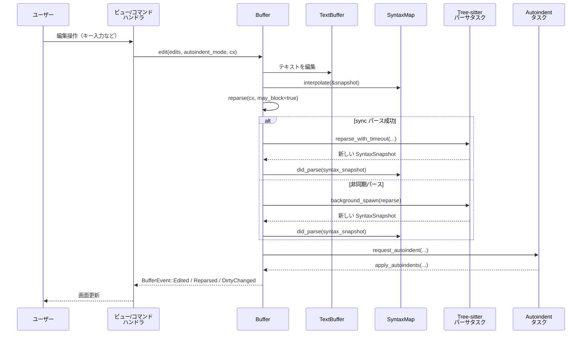

# crates/language ディレクトリ（バッファ周辺）の解説

---

## 1. ざっくり一言

Zed エディタ内で使われる **ソースコードバッファ（テキスト＋構文木＋診断＋共同編集状態）を管理する中核モジュール**です。  
テキスト編集・Tree-sitter による構文解析・自動インデント・アウトライン・ブラケットマッチ・LSP 診断などを一括して扱う仕組みが実装されています。

---

## 2. このモジュールの役割

### 2.1 概要

このディレクトリ（`language` クレート）は、ざっくり次の問題を解決するために存在します。

- **問題**  
  - エディタ内でのテキスト編集・構文解析・診断・アウトライン・補完・共同編集など、多数の機能をそれぞれ独立に実装するとコードが散らばりがちで、一貫した状態管理が難しい。
- **提供する機能**  
  - `Buffer` を中心に、「テキスト」「構文情報」「LSP 診断」「リモート選択」「言語設定」「ファイル状態」をまとめて管理する。
  - Tree-sitter ベースの構文情報から **アウトライン / テキストオブジェクト / 括弧マッチ / デバッグ変数 / Runnable 範囲 / レダクション範囲** など、エディタ機能に直結する API を提供する。
  - ファイルの再読み込みや差分適用、自動インデント、共同編集（レプリカ）などの高度な操作をカプセル化する。

### 2.2 アーキテクチャ内での位置づけ

`Buffer` は `text` クレートの低レベルなテキストバッファをラップし、`SyntaxMap`・`Language`・`LanguageRegistry` 等と連携しながら、エディタからの操作に応じて周辺コンポーネントを更新します。

依存関係のイメージは次の通りです（矢印は「利用する側 → 利用される側」）。



- `buffer.rs`  
  - `text::Buffer`（ロープベースのテキスト）を保持しつつ、構文スナップショット・診断・リモート選択などを統合します。
- `row_chunk.rs`  
  - Tree-sitter 連携用に、バッファを「行チャンク」に分割してキャッシュを効率的に持つためのユーティリティです。
- `buffer_tests.rs`  
  - `Buffer` 周辺 API の挙動（インデント、ブランチ、アウトライン、言語スコープなど）を総合的にテストしています。

### 2.3 設計上のポイント

コードから読み取れる範囲での特徴をまとめると、次のようになります。

- **状態の集約**
  - テキスト本体は `TextBuffer`、構文情報は `SyntaxMap`、診断は `TreeMap<LanguageServerId, DiagnosticSet>` などそれぞれ別コンポーネントですが、`Buffer` がそれらを 1 つの構造体としてまとめています。
- **スナップショット指向**
  - 読み取り専用の `BufferSnapshot` を多用し、バックグラウンドスレッドでの解析や UI 描画などを安全に行える設計になっています。
- **非同期・インクリメンタル構文解析**
  - Tree-sitter のインクリメンタルパースを `SyntaxMap` 経由で扱い、1ms タイムアウトまで同期パース、それ以降はバックグラウンドタスクという二段構えで UI の応答性を保っています。
- **共同編集と Lamport 時計**
  - `ReplicaId` と `Lamport` タイムスタンプを用いた `Operation` で、リモートとの同期や遅延到着した操作の適用順序を管理しています。
- **自動インデントの後追い処理**
  - 編集時にインデント要求だけ記録し、構文解析完了後にバックグラウンドでインデントを計算・適用することで、重い処理を分離しています。
- **ブラケットハイライトのチャンク化**
  - `RowChunks` と `TreeSitterData` で行単位にチャンク分割し、ブラケットマッチ結果をチャンクごとにキャッシュすることで、大きなファイルでも効率的に処理します。
- **イベント駆動**
  - `BufferEvent` を `gpui::EventEmitter` 経由で発火し、ビュー側はテキスト変更・診断更新などを購読できます。

---

## 3. 主要な機能一覧

このディレクトリ（特に `buffer.rs`）が提供している主な機能を列挙します。

- テキストバッファ管理
  - `Buffer::local` / `Buffer::remote` によるローカル／リモートバッファの生成
  - バージョン管理（`clock::Global`）とトランザクション（undo / redo）
  - 差分計算 (`diff`, `apply_diff`, `remove_trailing_whitespace`, `ensure_final_newline`)
- ファイル I/O とエンコーディング
  - `File` / `LocalFile` トレイトで抽象化されたファイルハンドル
  - `reload` / `reload_with_encoding` による再読み込みと BOM/エンコーディング検出
  - ディスク状態 `DiskState`（新規／存在／削除／履歴）
- 言語・構文解析
  - `set_language(_async)` / `language_at` / `languages_at`
  - Tree-sitter を使ったインクリメンタルパース (`reparse`, `SyntaxMap`)
  - `LanguageScope` / `language_scope_at` によるオーバーライド済み言語設定の取得
- 自動インデント
  - `AutoindentMode::EachLine` / `Block` と `autoindent_requests`
  - `BufferSnapshot::suggested_indents` / `indent_size_for_line`
- アウトライン・シンボル・テキストオブジェクト
  - `BufferSnapshot::outline` / `symbols_containing`
  - `text_object_ranges`, `debug_variables_query`, `runnable_ranges`
- 括弧ハイライト・ブラケットマッチ
  - `fetch_bracket_ranges`, `all_bracket_ranges`, `bracket_ranges`
  - `innermost_enclosing_bracket_ranges`, `enclosing_bracket_ranges`
- LSP 診断・補完トリガ
  - `update_diagnostics`, `diagnostics_in_range`, `diagnostic_groups`
  - `set_completion_triggers`, `completion_triggers`
- 共同編集・リモート選択
  - `Operation` / `BufferEvent`
  - `apply_ops`, `serialize_ops`
  - `SelectionSet` と `selections_in_range`
- 行・単語・文字種別ユーティリティ
  - `trailing_whitespace_ranges`
  - `CharClassifier`（単語／空白／句読点の分類）
  - `words_in_range`（補完候補などの単語探索）
- ブランチ機能
  - `branch` / `merge_into_base` による一時的な編集ブランチとマージ
- 表示用チャンク
  - `BufferSnapshot::chunks` と `BufferChunks` / `Chunk` による、ハイライト＋診断を含んだテキストチャンク列挙

---

## 4. 関数・構造体の解説

### 4.1 主要な型一覧

代表的な公開／内部型を整理します。

| 名前 | 種別 | 役割 / 用途 |
|------|------|-------------|
| `Buffer` | 構造体 | テキスト＋構文木＋診断＋共同編集状態など、バッファ全体の状態を管理する中核型 |
| `BufferSnapshot` | 構造体 | ある時点の `Buffer` の不変スナップショット。バックグラウンド処理や描画で使用 |
| `Capability` | enum | `ReadWrite` / `Read` / `ReadOnly` で編集可否を表現 |
| `File`, `LocalFile` | トレイト | バッファに紐づくファイル抽象。ローカルディスク I/O をカプセル化 |
| `DiskState` | enum | ファイルの存在状態（新規／存在／削除／履歴）と mtime / サイズ |
| `TreeSitterData` | 構造体 | `RowChunks` とブラケットキャッシュを保持し、Tree-sitter 関連データを管理 |
| `RowChunks` / `RowChunk` | 構造体 | 行範囲を一定行数ごとのチャンクに分割して管理。ブラケット検索時の最適化に使用 |
| `ParseStatus` | enum | 構文解析状態 (`Idle` / `Parsing`) を `watch::Sender/Receiver` で公開 |
| `Operation` | enum | 共同編集のための操作種別（テキスト編集、診断更新、選択、補完トリガ、改行コード変更） |
| `BufferEvent` | enum | `Buffer` 内部で起きるイベントをビューへ通知するためのイベント列挙体 |
| `AutoindentMode` | enum | 自動インデントモード (`EachLine` / `Block { ... }`) |
| `IndentSize` / `IndentKind` | 構造体 / enum | 行のインデント長と、スペース／タブの種別 |
| `BracketMatch<T>` | 構造体 | 対応する開き括弧・閉じ括弧の範囲や色インデックスを持つ |
| `BufferChunks<'a>` / `Chunk<'a>` | 構造体 | レンダリング用にテキストの部分列とハイライト・診断情報をまとめて走査するイテレータ |
| `Diff` | 構造体 | あるバージョンからの差分 (挿入レンジ＋文字列) と行末コードを表す |
| `CharKind` / `CharScopeContext` / `CharClassifier` | enum / 構造体 | 文字の分類（空白／句読点／単語）とコンテキスト（補完／リンク編集）を扱う |
| `WordsQuery` | 構造体 | `words_in_range` 用の検索条件（範囲・ fuzzy 文字列・数字スキップ） |

テストコード `buffer_tests.rs` では、これらの型を広範囲に使った動作確認が行われています（アウトラインの検索、ブラケットマッチの検証、自動インデントの挙動など）。

### 4.2 代表的なメソッド／関数の詳細

ここでは特に重要な 7 つのメソッド／関数を選んで詳しく解説します。

---

#### 4.2.1 `Buffer::local(base_text: T, cx: &Context<Self>) -> Self`

**概要**

- 新しいローカルバッファを生成します。
- 内部で `TextBuffer::new` を呼び出し、`ReplicaId::LOCAL` を使ってローカル用のレプリカとして初期化します。

**引数**

| 引数名 | 型 | 説明 |
|--------|----|------|
| `base_text` | `T: Into<String>` | バッファに最初に入れるテキスト |
| `cx` | `&gpui::Context<Buffer>` | `gpui` のコンテキスト。`entity_id` などを取得するために使用 |

**戻り値**

- 新しく構築された `Buffer`。`Capability::ReadWrite` で編集可能なローカルバッファです。

**内部処理の流れ**

1. `cx.entity_id()` からバッファ ID を取得。
2. `TextBuffer::new(ReplicaId::LOCAL, buffer_id, base_text)` を作成。
3. `Buffer::build` で `syntax_map` や `TreeSitterData`、診断マップなどを初期化。

**エッジケース**

- `base_text` が空文字でも問題なく動作します。
- 行末コードは `TextBuffer` 側のデフォルト (`LineEnding::Unix` 相当) が使われます。

**使用例**

```rust
use gpui::{App, AppContext as _, Entity};
use language::Buffer;

// 単純なバッファを生成し、テキストを編集してみる例
fn create_and_edit_buffer(cx: &mut App) {
    // 新しいエンティティとして Buffer を生成する
    let buffer_entity: Entity<Buffer> = cx.new(|cx| {
        // 初期テキスト "hello\n" を持つローカルバッファを作成
        let mut buffer = Buffer::local("hello\n", cx);
        // 末尾に "world\n" を追加
        buffer.append("world\n", cx);
        buffer
    });

    // 読み取り専用でテキストを確認
    buffer_entity.read_with(cx, |buffer, _| {
        assert_eq!(buffer.text(), "hello\nworld\n");
    });
}
```

**使用上の注意点**

- `Buffer::local` は `gpui::Context` の中で呼ぶ必要があります（`cx.new` 内など）。
- 言語設定や構文解析はデフォルトでは行われないため、必要に応じて `with_language` / `set_language_registry` を呼ぶ必要があります。

---

#### 4.2.2 `Buffer::edit<I, S, T>(edits_iter, autoindent_mode, cx) -> Option<clock::Lamport>`

**概要**

- バッファに対して 1 個以上の編集（削除＋挿入）を適用するメイン API です。
- 隣接する編集は（必要に応じて）まとめて 1 つの編集として扱われます。
- `AutoindentMode` を指定すると、自動インデントリクエストが登録されます。

**引数**

| 引数名 | 型 | 説明 |
|--------|----|------|
| `edits_iter` | `IntoIterator<Item = (Range<S>, T)>` | 編集内容の列（削除範囲＋挿入文字列） |
| `autoindent_mode` | `Option<AutoindentMode>` | 自動インデントのモード。`None` でインデント調整なし |
| `cx` | `&mut Context<Self>` | UI コンテキスト。イベント送信・再パースなどに使用 |

個々の編集要素は：

- `Range<S>`: 編集対象範囲（`S: ToOffset` なので `Point` や `Anchor` なども指定可）
- `T: Into<Arc<str>>`: 挿入する文字列

**戻り値**

- 実際に編集が行われた場合は、その編集に対応する `Lamport` タイムスタンプを返します。
- 無効な編集（空挿入かつ空範囲のみなど）の場合は `None`。

**内部処理の流れ（簡略版）**

1. 引数の範囲を `usize` オフセットに変換し、不正な start/end を修正（逆順ならスワップ）。
2. 挿入文字列が空かつ範囲も空でない場合などをスキップしつつ、必要なら隣接する編集どうしを連結。
3. 有効な編集がなければ `None` を返す。
4. トランザクションを開始 (`start_transaction`)。
5. 自動インデントが有効なら、編集前スナップショット＋言語設定から `AutoindentRequestEntry` を構築して `autoindent_requests` に追加。
6. `TextBuffer::edit` に実際の編集を渡し、`Operation::Buffer` を生成。
7. トランザクション終了 (`end_transaction`)、`did_edit` を呼び出して再パース・イベント発火などを行う。
8. `send_operation` で `BufferEvent::Operation` を通知（共同編集用）。
9. 編集の `Lamport` タイムスタンプを返却。

**エッジケース**

- 範囲の `start > end` の場合も自動的に修正（スワップ）してから処理されます。
- 同一位置に複数の編集が与えられた場合、`coalesce_adjacent = true` のとき、まとめて一つの編集になります。
- 自動インデントは、バッファに言語が設定されていない場合はスキップされます（`language.as_ref().map(...)` のチェックあり）。

**使用例（簡単な置換とインデント付き挿入）**

```rust
use gpui::{App, AppContext as _, Entity};
use language::{Buffer, AutoindentMode};
use text::Point;

fn replace_and_indent(cx: &mut App, buffer: &Entity<Buffer>) {
    buffer.update(cx, |buffer, cx| {
        // "foo" を "bar" に置き換え
        if let Some(pos) = buffer.text().find("foo") {
            buffer.edit([(pos..pos + 3, "bar")], None, cx);
        }

        // 2 行目の先頭に改行を挿入し、自動インデントを有効にする
        let p = Point::new(1, 0);
        buffer.edit([(p..p, "\n")], Some(AutoindentMode::EachLine), cx);
    });
}
```

**使用上の注意点**

- このメソッドは **内部でトランザクションを開始・終了**するため、外側で明示的に `start_transaction` している場合、ネストに注意が必要です。
- 自動インデントは構文解析結果に依存するため、重い編集を連続して行うと、バックグラウンドタスクが多数起動される可能性があります。
- `edit_non_coalesce` を使うと、隣接編集をあえて分割したまま扱うこともできます（undo の粒度を細かくしたい場合など）。

---

#### 4.2.3 `Buffer::reparse(&mut self, cx: &mut Context<Self>, may_block: bool)`

**概要**

- バッファのテキストが変化した後に Tree-sitter による構文解析を更新する処理です。
- 一定時間（デフォルト 1ms or 10ms）までは同期パースを試み、それを超える場合はバックグラウンドタスクに切り替えます。

**引数**

| 引数名 | 型 | 説明 |
|--------|----|------|
| `cx` | `&mut Context<Self>` | UI コンテキスト |
| `may_block` | `bool` | 同期パースで（短時間）ブロックしてよいかどうか |

**戻り値**

- 戻り値は `()`（副作用で `syntax_map` や Tree-sitter タスクを更新）。

**内部処理の流れ（要約）**

1. `TreeSitterData` のバージョンと `text.version()` を比較し、差があれば `TreeSitterData::clear` でチャンク情報をリセット。
2. すでに `self.reparse` タスクが走っていればそのまま return。
3. 言語が設定されていなければ return。
4. `text_snapshot` と `SyntaxMap` をロックし、テキストの変更を `interpolate` してから `SyntaxSnapshot` を取得。
5. `parse_status` を `Parsing` に更新。
6. `may_block && sync_parse_timeout` がある場合、
   - `reparse_with_timeout` を呼び出し、成功すれば同期的に `did_finish_parsing` を呼んで終了。
7. それ以外の場合、`cx.background_spawn` で `SyntaxSnapshot::reparse` をバックグラウンド実行。
8. 完了後、`did_finish_parsing` を呼び、新しい構文状態を `syntax_map` に反映。必要なら再度 `reparse` を呼ぶ（テキストや言語が変わってしまっていた場合）。

**エッジケース**

- `language` が `None`（言語未設定）の場合は何もしません。
- 同時に複数の reparse を走らせないよう、`self.reparse.is_some()` でガードしています。
- 再パース中に言語や LanguageRegistry が変わった場合は、完了時に `parse_again` フラグが立ち、再帰的に reparse が呼ばれます。

**使用上の注意点**

- 通常は `Buffer::edit` や `set_language` の内部から呼ばれるため、外から直接呼ぶ必要はあまりありません。
- テストコードでは、非同期 reparse の完了を `parsing_idle` / `cx.executor().run_until_parked()` で待ってから構文木の内容を検査しています。

---

#### 4.2.4 `Buffer::reload_with_encoding(&mut self, encoding: &'static Encoding, cx: &Context<Self>)`

**概要**

- バッファに紐づくローカルファイルを **指定したエンコーディングで再読み込み**します。
- BOM などによる自動判定をバイパスし、ユーザ指定のエンコーディングを強制する用途を想定しています（特に非 Unicode エンコーディング）。

**引数**

| 引数名 | 型 | 説明 |
|--------|----|------|
| `encoding` | `&'static Encoding` | 再読み込みに使うエンコーディング（`encoding_rs` の型） |
| `cx` | `&Context<Self>` | コンテキスト。非同期タスク起動などに使用 |

**戻り値**

- `oneshot::Receiver<Option<Transaction>>`  
  再読み込みによる編集を含むトランザクションが返る可能性があります。  
  - `Some(txn)` … diff 適用で実際にテキストが変わった場合。
  - `None` … テキストが変わらなかった／再読み込みできなかった場合など。

**内部処理の流れ（reload_impl の要点）**

1. `File` が `LocalFile` でない場合や、ファイルハンドルが無ければ `None` を返し、何も行わない。
2. `LocalFile::load_bytes` で生バイト列をロード。
3. `encoding` が非 Unicode かつ `force_encoding.is_some()` であれば、BOM を無視して `decode_without_bom_handling` を使用。
4. それ以外の場合は `Encoding::decode` を利用し、実際に使われたエンコーディング（`used_enc`）と BOM 有無を確認。
5. ロードしたテキストと現在のテキストとの差分 `Diff` を `diff` メソッドで計算。
6. `apply_diff` で既存の編集との競合を解決しながらバッファに適用。
7. エンコーディングと BOM フラグを更新し、`reload_with_encoding_txns` に元の設定を保存（undo / redo 時に復元できるようにする）。
8. `did_reload` を呼び、`saved_version`・`saved_mtime`・`line_ending` を更新し、イベントを発火。

**エッジケース**

- 再読み込み対象のファイルがローカルでない場合（例：リモートストレージなど）、`as_local()` が `None` を返して処理全体がスキップされます。
- `apply_diff` の結果、バッファの現在のバージョンと `Diff.base_version` がずれている場合は、競合フラグ `has_conflict` が立ちます。
- Unicode エンコーディング（UTF-8/UTF-16LE/UTF-16BE）の場合は BOM 検出が行われ、`has_bom` フィールドに反映されます。

**使用上の注意点**

- 呼び出し側は戻り値の `oneshot::Receiver` を待機することで、実際にどんなトランザクションが適用されたかを把握できます（必要であれば）。
- undo / redo によってエンコーディングが戻される可能性があるため、エンコーディング変更をユーザーに見せる UI 側は、`Buffer` の状態を都度参照する必要があります。

---

#### 4.2.5 `Buffer::apply_diff(&mut self, diff: Diff, cx: &mut Context<Self>) -> Option<TransactionId>`

**概要**

- 事前に計算された `Diff` を、現在のバッファの状態に対して「可能な範囲で」適用します。
- `Diff.base_version` 以降に行われた編集を考慮して、非衝突な部分だけを適用する仕組みです。

**引数**

| 引数名 | 型 | 説明 |
|--------|----|------|
| `diff` | `Diff` | ベースバージョン・行末コード・挿入レンジ＋テキストの集合 |
| `cx` | `&mut Context<Self>` | コンテキスト（編集とイベント発火のため） |

**戻り値**

- 適用された編集を含むトランザクション ID (`TransactionId`)。編集が行われない場合は `None`。

**内部処理の流れ**

1. 現在のスナップショットを取得し、`edits_since::<usize>(&diff.base_version)` で diff 計算後に行われた編集列を取得。
2. 各 diff 片 `(range, new_text)` について：
   - その前に行われている編集の影響（挿入／削除によるオフセットのズレ）を `delta` で累積。
   - もし diff 片と編集が交差する場合、その diff 片は **衝突** とみなしてスキップ。
3. 衝突しなかった diff 片のみを「調整済みレンジ」で編集リストに変換。
4. トランザクションを開始し、`line_ending` を `diff.line_ending` に更新。
5. `edit(adjusted_edits, None, cx)` を呼び、トランザクションを終了。
6. 生成されたトランザクション ID を返却。

**エッジケース**

- diff 計算後に大きな編集が入っていると、多くの diff 片が衝突してスキップされる可能性があります。
- `edits_since` が空であれば、diff はそのまま適用されます（`base_version` から一度も編集されていない場合）。

**使用上の注意点**

- フォーマッタや外部ツールからの自動編集適用に向いている API です。
- `Diff` の計算時に使用したバージョンを正しく `diff.base_version` に持たせることが重要です。
- 衝突した diff 片は静かに無視されるため、「すべての変更が反映されたか」を知りたい場合は、呼び出し側で追加のチェックが必要です。

---

#### 4.2.6 `BufferSnapshot::outline(&self, theme: Option<&SyntaxTheme>) -> Outline<Anchor>`

**概要**

- バッファの構文情報から **アウトライン情報（関数・構造体・モジュールなどのシンボル一覧）** を生成します。
- 各シンボルは `OutlineItem<Anchor>` として、テキスト位置やハイライト情報を含んで返されます。

**引数**

| 引数名 | 型 | 説明 |
|--------|----|------|
| `theme` | `Option<&SyntaxTheme>` | シンボル名に対するスタイル付けを行うテーマ。`None` ならプレーンテキスト |

**戻り値**

- `Outline<Anchor>`  
  `items: Vec<OutlineItem<Anchor>>` を持ち、検索等の API も提供するラッパーです。

**内部処理の流れ（概要）**

1. `outline_items_containing(0..self.len(), true, theme)` を呼び出し、バッファ全体に対するアウトラインアイテムを取得。
2. 各 `OutlineItem` には以下が含まれます。
   - `depth`（ネストレベル）
   - `range`（シンボル全体の範囲）
   - `source_range_for_text`（アウトラインの表示テキストとなる範囲）
   - `text`（シンボル名＋コンテキスト）
   - `highlight_ranges`（スタイル適用範囲）
   - `name_ranges`（名前部分だけの範囲）
   - `body_range`（本体部分の範囲）
   - `annotation_range`（ドキュメントコメントなどの注釈範囲）
3. それらをまとめた `Outline` を返却。

**使用例（簡単なアウトライン取得と表示）**

```rust
use gpui::{App, AppContext as _, Entity};
use language::Buffer;

fn print_outline(cx: &mut App, buffer: &Entity<Buffer>) {
    buffer.read_with(cx, |buffer, cx| {
        // スナップショットを取得
        let snapshot = buffer.snapshot();
        // テーマ付きでアウトラインを計算（ここでは None でプレーン）
        let outline = snapshot.outline(None);

        for item in &outline.items {
            // 深さに応じてインデントを追加
            let indent = "  ".repeat(item.depth);
            println!("{}{}", indent, item.text);
        }
    });
}
```

**エッジケース**

- 言語がアウトライン用の Tree-sitter クエリ (`outline_config`) を提供していない場合、アウトラインは空になる可能性があります。
- マルチ言語（埋め込み言語）でも、各レイヤーに対応したクエリがあればまとめて扱われます。

**使用上の注意点**

- `outline` は構文スナップショットに依存するため、直前の編集がまだ reparse されていない場合、結果が古い可能性があります。必要なら `parsing_idle` でパース完了を待ってから呼ぶとよいです。

---

#### 4.2.7 `BufferSnapshot::bracket_ranges<T: ToOffset>(&self, range: Range<T>)`

**概要**

- 指定範囲を含む（または隣接する）括弧ペア（`BracketMatch<usize>`）を列挙するイテレータを返します。
- `newline_only` でマークされた括弧（改行だけを対象にするようなペア）は除外されます。

**引数**

| 引数名 | 型 | 説明 |
|--------|----|------|
| `range` | `Range<T>` | 探索対象となる範囲。`T: ToOffset` なので `Point` や `usize` を指定可能 |

**戻り値**

- `impl Iterator<Item = BracketMatch<usize>>`  
  各要素は `open_range` / `close_range` / `syntax_layer_depth` / `color_index` などを持ちます。

**内部処理の流れ（関連関数を含む）**

1. 引数の範囲を「一つ前／一つ後のオフセット」を含むように拡張 (`to_previous_offset` / `to_next_offset`)。
2. `all_bracket_ranges(range)` で実際の探索を行う。
   - `TreeSitterData.chunks.applicable_chunks` を使って、対象範囲にかかる `RowChunk` を列挙。
   - チャンクごとに `syntax.matches_with_options` でブラケットクエリを走らせる。
   - 開き／閉じ括弧の単位でグルーピングし、同一 open に複数 close が対応しているような「壊れた」クエリ結果を補正。
   - ネスト深度に基づき `color_index` を付与（レインボーブラケット用）。
   - チャンク単位で結果をキャッシュ (`brackets_by_chunks`)。
3. その中から `newline_only == false` のものだけをフィルタし、指定範囲と交差する括弧ペアを返す。

**使用上の注意点**

- キャッシュは `TreeSitterData::clear` / `invalidate_tree_sitter_data` でバージョンに応じてリセットされます。テキスト編集後に参照する場合も、`BufferSnapshot` 経由であれば一貫性が保たれます。
- `innermost_enclosing_bracket_ranges` を使えば、「最も内側の括弧ペア」だけを求めることもできます。

**簡単な使用例（現在位置の括弧ペアを取得）**

```rust
use gpui::{App, AppContext as _, Entity};
use language::Buffer;
use text::Point;

fn highlight_current_brackets(cx: &mut App, buffer: &Entity<Buffer>) {
    buffer.read_with(cx, |buffer, _| {
        let snapshot = buffer.snapshot();

        // たとえばカーソル位置 (row=10, col=5) を想定
        let cursor = Point::new(10, 5);

        if let Some((open, close)) =
            snapshot.innermost_enclosing_bracket_ranges(cursor..cursor, None)
        {
            println!("open: {:?}, close: {:?}", open, close);
            // ここで open / close に対してハイライトを付ける等が可能
        }
    });
}
```

---

### 4.3 その他の補助的な関数

表に簡単にまとめます（すべて `buffer.rs` 内）。

| 関数名 / メソッド | 役割（1 行） |
|-------------------|--------------|
| `trailing_whitespace_ranges(rope: &Rope)` | 各行末の空白範囲（スペース／タブ）を検出するユーティリティ |
| `indent_size_for_line(snapshot, row)` | 指定行のインデントサイズ（空白／タブと長さ）を計算 |
| `Buffer::remove_trailing_whitespace` | バッファ全体の行末空白を削除する `Diff` を非同期に生成 |
| `Buffer::ensure_final_newline` | ファイル末尾にちょうど 1 つの改行がある状態に整える |
| `Buffer::branch` / `merge_into_base` | 一時的な編集ブランチを作り、変更の一部／全体を基のバッファへマージ |
| `BufferSnapshot::words_in_range` | 指定範囲の単語を `BTreeMap<String, Range<Anchor>>` として収集 |
| `CharClassifier` 関連メソッド | `is_word` / `is_whitespace` など、言語設定に基づく文字種別判定 |

---

## 5. データフロー

ここでは代表的なシナリオとして、**ユーザーの編集が構文解析・自動インデント・イベント通知に至るまでの流れ**を説明します。

1. ユーザーがキー入力やコマンド操作を行う。
2. コマンドハンドラが `Buffer::edit` を呼び、テキスト変更を適用。
3. `Buffer::edit` 内部で `TextBuffer::edit` が呼ばれ、ロープ構造が更新される。
4. 編集前後バージョンを用いて `SyntaxMap::interpolate` が呼ばれ、構文木が一時的に補間される。
5. `Buffer::reparse` が起動し、Tree-sitter によるインクリメンタルパースを同期／非同期で実行。
6. 構文解析完了後 `did_finish_parsing` が呼ばれ、`syntax_map`・`TreeSitterData`・`parse_status` が更新される。
7. `request_autoindent` によって、自動インデントが必要な行の情報がバックグラウンドで計算され、`apply_autoindents` で追加の編集が行われる。
8. それぞれの段階で `BufferEvent::Edited`, `BufferEvent::Reparsed`, `BufferEvent::DirtyChanged` などのイベントが発火し、ビュー側は再描画を行う。

この一連の流れをシーケンス図で示します。



- `BufferSnapshot::chunks` などの描画用 API は、`V` 側から `Buffer` または `BufferSnapshot` を通じて呼び出されます。
- ブラケットマッチやアウトライン、診断表示も同様にスナップショットベースで行われます。

---

## 6. 使い方（How to Use）

### 6.1 基本的な使用方法

ここでは、**単純なローカルバッファを作成して言語設定・編集・アウトライン取得を行う**最小構成の例を示します。

```rust
use std::sync::Arc;
use gpui::{App, AppContext as _, Entity};
use language::{Buffer, Language, LanguageConfig, LanguageRegistry};
use text::Point;

// 簡単な Rust 言語オブジェクトを仮定（実際の実装は別ファイル）
fn rust_language() -> Arc<Language> {
    Arc::new(Language::new(
        LanguageConfig {
            name: "Rust".into(),
            // 拡張子などのマッチャー設定は省略
            ..Default::default()
        },
        None, // Tree-sitter 言語を省略（ここでは詳細不明）
    ))
}

fn basic_usage(cx: &mut App) {
    // 言語レジストリを用意（実装詳細はこのチャンクには含まれていません）
    let registry = Arc::new(LanguageRegistry::test(cx.background_executor().clone()));

    // Buffer エンティティを作成
    let buffer_entity: Entity<Buffer> = cx.new(|cx| {
        let mut buffer = Buffer::local("fn main() {}\n", cx);
        buffer.set_language_registry(registry.clone());
        buffer.set_language(Some(rust_language()), cx);
        buffer
    });

    // 少し編集してアウトラインを取る
    buffer_entity.update(cx, |buffer, cx| {
        // main 関数の中に 1 行挿入
        let insert_pos = buffer.text().find('{').unwrap() + 1;
        buffer.edit([(insert_pos..insert_pos, "\n    println!(\"hi\");")], None, cx);
    });

    buffer_entity.read_with(cx, |buffer, _| {
        let snapshot = buffer.snapshot();
        let outline = snapshot.outline(None); // テーマなしでアウトラインを取得

        for item in &outline.items {
            println!("depth={} text={}", item.depth, item.text);
        }

        // 現在位置周辺の括弧マッチも取得
        let cursor = Point::new(0, 10); // 例: main の中
        if let Some((open, close)) =
            snapshot.innermost_enclosing_bracket_ranges(cursor..cursor, None)
        {
            println!("brackets: open={:?} close={:?}", open, close);
        }
    });
}
```

### 6.2 よくある使用パターン

#### パターン 1: バックグラウンド処理のためのスナップショット

`BufferSnapshot` は所有権を持つコピーとして独立して扱えるため、**バックグラウンドスレッドで重い処理を行う**用途に向いています。

```rust
use gpui::{App, AppContext as _, Entity};
use language::Buffer;

fn do_background_analysis(cx: &mut App, buffer: &Entity<Buffer>) {
    // スナップショットを取得して別スレッドに渡す
    let snapshot = buffer.read_with(cx, |buffer, _| buffer.snapshot());
    let executor = cx.background_executor().clone();

    executor.spawn(async move {
        // スナップショットからアウトラインや単語一覧を計算
        let outline = snapshot.outline(None);
        let words = snapshot.words_in_range(language::WordsQuery {
            fuzzy_contents: None,
            skip_digits: true,
            range: 0..snapshot.len(),
        });

        println!("outline items = {}", outline.items.len());
        println!("unique words = {}", words.len());
    });
}
```

#### パターン 2: ブランチを作って一部の変更だけマージ

`Buffer::branch` / `merge_into_base` により、一時的な編集ブランチを作って、その中の一部だけを基のバッファに取り込むことができます。テストにもそのパターンが現れています。

```rust
use gpui::{App, AppContext as _, Entity};
use language::Buffer;
use text::Point;

fn branch_and_merge(cx: &mut App) {
    // ベースバッファを作成
    let base: Entity<Buffer> = cx.new(|cx| Buffer::local("one\ntwo\nthree\n", cx));

    // ブランチを作成
    let branch = base.update(cx, |buffer, cx| buffer.branch(cx));

    // ブランチ側で編集
    branch.update(cx, |buffer, cx| {
        buffer.edit(
            [
                (Point::new(1, 0)..Point::new(1, 0), "1.5\n"), // 行を挿入
                (Point::new(2, 0)..Point::new(2, 5), "THREE"), // 文字列を変更
            ],
            None,
            cx,
        );
    });

    // 変更の一部だけをベースにマージ（範囲指定）
    branch.update(cx, |buffer, cx| {
        buffer.merge_into_base(vec![5..8], cx); // 例: あるバイト範囲にかかる変更だけ
    });

    // ベースとブランチがどう変わったか確認
    base.read_with(cx, |buffer, _| {
        println!("base text:\n{}", buffer.text());
    });
    branch.read_with(cx, |buffer, _| {
        println!("branch text:\n{}", buffer.text());
    });
}
```

### 6.3 よくある誤りパターン

コードから想定される「やりがちなミス」をいくつか挙げます。

- **言語未設定のまま構文依存 API を使う**
  - `language_at` / `outline` / `text_object_ranges` などは、言語が設定されていない場合は空の結果またはデフォルト言語で動作します。
  - 期待どおりの結果が得られない場合、`set_language` と `set_language_registry` が呼ばれているか確認する必要があります。
- **バックグラウンドから `Buffer` を直接操作する**
  - `Buffer` 自体は `Send` ではなく、`BufferChunks` のみ `unsafe impl Send` が付いています。
  - 編集やイベント送信は `gpui::Context` 経由で行う必要があり、バックグラウンド処理には `BufferSnapshot` を使うことが想定されています。
- **`reload_with_encoding` の戻り値（`Receiver`）を無視する**
  - 無視してもエラーにはなりませんが、「再読み込みの結果どのトランザクションが適用されたか」を知りたい場合は `await` する必要があります。
- **ブランチとベースのバージョン関係を意識しない**
  - `merge_into_base` はベースバッファの `version` とブランチの `edits_since` を元に差分を取るため、ベース側での編集や undo/redo のタイミングによっては期待と異なるマージ結果になることがあります。

### 6.4 使用上の注意点（まとめ）

- **スレッドセーフティ**
  - `Buffer` は `gpui` のエンティティとして扱われ、基本的に UI スレッド（`Context<Self>`）から操作されることを前提にしています。
  - マルチスレッドで重い処理を行う場合は `BufferSnapshot` や `Diff`、`WordsQuery` をバックグラウンドに渡します。
- **パフォーマンス**
  - 大量の編集を短時間で行うと、
    - `reparse`（Tree-sitter）、
    - `compute_autoindents`（自動インデント）、
    - `diagnostics_in_range`（診断計算）
    などが多く起動します。可能であれば編集をトランザクションでまとめると効率的です。
- **バージョン管理**
  - `has_unsaved_edits` / `is_dirty` / `saved_version` / `has_conflict` などのフィールドは、ディスク上のファイル状態との整合性を取るために使われています。ファイル監視や保存ダイアログの実装はこれらの値を参照して行う必要があります。
- **API の前提条件**
  - `set_language_registry` は `set_language` より前／後どちらでも呼べますが、埋め込み言語（injection）を使う場合は両方が必要です。
  - `BufferSnapshot::chunks(range, language_aware = true)` などの言語依存 API は、構文解析が完了していない場合、一時的に空または古い状態を返す可能性があります。

---

## 7. 関連ファイル

このチャンクに含まれている、またはコードから参照されている関連ファイルをまとめます。

| パス | 役割 / 関係 |
|------|------------|
| `language/Cargo.toml` | `language` クレートの定義。`text`, `syntax_map`, `lsp`, `theme`, `gpui` などへの依存や `test-support` フィーチャが定義されている |
| `language/build.rs` | 環境変数 `ZED_BUNDLE` が存在する場合、それをコンパイル時環境変数として埋め込むビルドスクリプト |
| `language/benches/highlight_map.rs` | `language::build_highlight_map` のベンチマーク。テーマキー数・キャプチャ数を変えてパフォーマンスを測定 |
| `language/src/buffer.rs` | 本解説の中心。`Buffer` と `BufferSnapshot` を含む、テキスト編集・構文解析・診断・自動インデント・共同編集などの中核実装 |
| `language/src/buffer/row_chunk.rs` | `RowChunks` / `RowChunk` の定義。Tree-sitter ブラケットハイライトなどで使う「行チャンク」管理 |
| `language/src/buffer_tests.rs` | `Buffer` 周辺の包括的なテスト。行末コード、ブランチ・マージ、自動インデント、アウトライン、言語スコープ、括弧マッチなど多くの挙動を検証 |
| `language/src/syntax_map.rs` | `buffer.rs` から `SyntaxMap` / `SyntaxSnapshot` として参照される構文マップ実装（このチャンクには本体コードは含まれていません） |
| `language/src/language.rs` | `Language`, `LanguageScope`, `LanguageConfig` などの定義。`buffer.rs` の言語関連機能で利用 |
| `language/src/language_registry.rs` | `LanguageRegistry` の実装。ファイルパスや shebang, ユーザ設定から言語を解決するために使用 |
| `language/src/outline.rs` | `Outline` / `OutlineItem` の定義。`BufferSnapshot::outline` で使用 |
| `language/src/diagnostic_set.rs` | `DiagnosticSet`, `DiagnosticEntry` など LSP 診断関連型の定義。`Buffer` の診断管理で利用 |

※ `syntax_map.rs` や `language.rs` などの中身はこのチャンクには含まれていないため、ここでの説明は主に `buffer.rs` 側からの利用箇所を根拠にしたものです。
