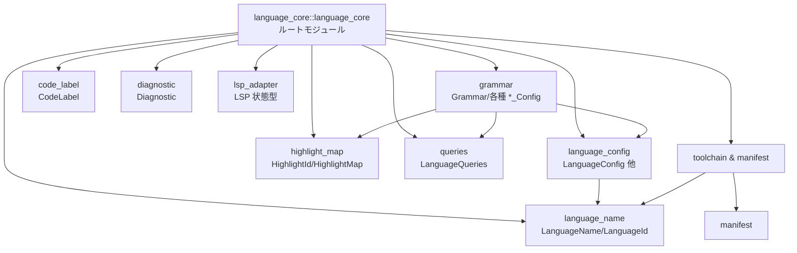
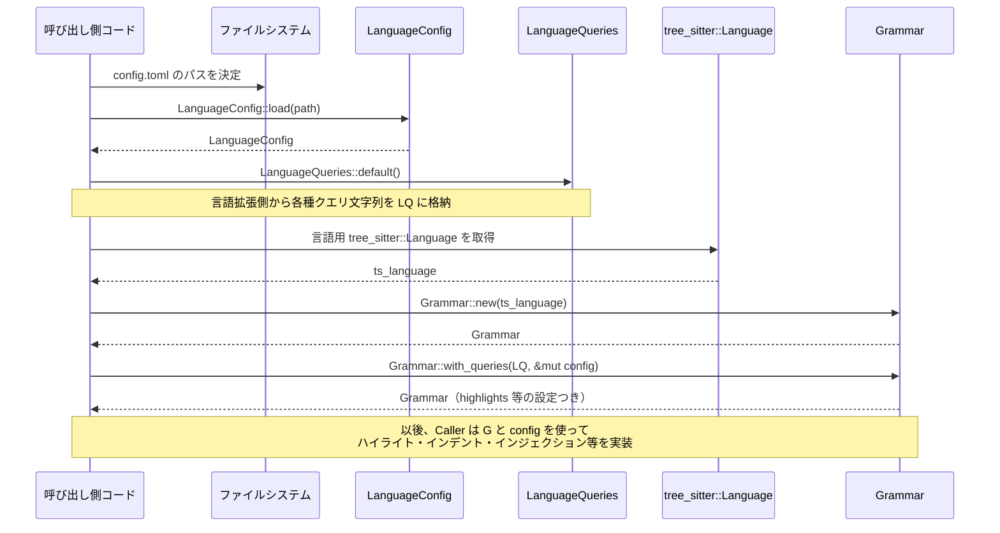

## 1. ざっくり一言

`language_core` は、エディタの「言語機能」の中核となるクレートで、  
**言語設定（LanguageConfig）・tree‑sitter ベースの Grammar・シンタックスハイライト ID・LSP 診断・ツールチェーン情報**などを共通の型としてまとめています。

---

## 2. このモジュールの役割

### 2.1 概要

- このクレートは、エディタにおける **言語ごとの振る舞い** を定義・制御するための土台となる型群を提供します。
- 具体的には、
  - `config.toml` から読み込む **言語設定**
  - tree‑sitter のクエリ文字列から構築される **Grammar / 各種 query 設定**
  - **シンタックスハイライト ID とマッピング**
  - **LSP 診断情報** や **言語サーバーの状態**
  - **言語ごとのツールチェーン情報**
  をひとまとめにした「コア」ライブラリです。

### 2.2 アーキテクチャ内での位置づけ

このクレートは、「UI やエディタ本体」と「tree‑sitter / LSP / 言語拡張」の間に位置し、  
言語機能で共通に使われる型とロジックを提供します。



- `language_core.rs` が各サブモジュールを公開し、「言語機能用の標準ライブラリ」として振る舞います。
- `grammar` は `LanguageConfig` と `LanguageQueries` を受け取り、tree‑sitter の `Query` から各種設定 (`HighlightsConfig` など) を構築します。
- `highlight_map` や `code_label` は、構文木のキャプチャ結果をエディタ上のハイライト・ラベル表示に結び付ける役割を持ちます。
- `toolchain` や `lsp_adapter` は LSP クライアント側のコードから利用される「状態やメタデータ」を表現します。

### 2.3 設計上のポイント

- **設定主導**  
  - 多くの挙動（インデント、コメント、ブラケット、テキストオブジェクトなど）は `config.toml` と tree‑sitter クエリで外部定義され、ここではそれを読み込んで検証・保持する構造になっています。
- **軽量共有のための文字列型**  
  - `LanguageName` や `ManifestName` などは `SharedString` を内部に保持し、文字列の共有を意識した設計になっています。
- **ID の一意性確保**  
  - `GrammarId` や `LanguageId` は `AtomicUsize` による単純なインクリメントで生成され、プロセス内で一意な ID を付与します。
- **tree‑sitter クエリの検証**  
  - `populate_capture_indices` により、クエリ内のキャプチャ名が期待通りかをチェックし、  
    未使用・不足分をログ出力やエラーとして扱います。
- **Serde / JSON Schema 対応**  
  - 多くの設定構造体が `serde` と `schemars::JsonSchema` を実装しており、  
    設定ファイルのシリアライズ／スキーマ生成に対応しています。
- **Option による段階的機能有効化**  
  - `Grammar` 内の多くのフィールドは `Option<...>` で、クエリが提供されている機能だけが有効になります。

---

## 3. 主要な機能一覧

- **言語設定 (`LanguageConfig` 一式)**  
  - ファイルマッチング、インデント・折り返し・コメント・リスト・ブラケットなどの挙動を定義。
- **tree‑sitter Grammar とクエリ設定 (`Grammar` + 各種 *_Config)**  
  - ハイライト・アウトライン・インデント・ブラケット・インジェクション・テキストオブジェクトなどのクエリを保持・検証。
- **ハイライト ID とマップ (`HighlightId`, `HighlightMap`)**  
  - tree‑sitter のキャプチャ ID を UI 上のハイライト種別に対応付け。
- **コードラベル (`CodeLabel`, `CodeLabelBuilder`, `Symbol`)**  
  - シンボル一覧や補完などで使われる、ハイライト付きテキストラベルとフィルタ範囲。
- **診断情報 (`Diagnostic`)**  
  - LSP などから得られるエラー・警告などの診断メッセージと付属メタデータ。
- **LSP アダプタ向け状態型 (`ToLspPosition`, `LanguageServerStatusUpdate` など)**  
  - サーバー状態やヘルスチェック結果、プロンプト応答コンテキストを表現。
- **言語名と ID (`LanguageName`, `LanguageId`)**  
  - UI 表示用・LSP 用の言語名や内部 ID を扱う。
- **ツールチェーン情報 (`Toolchain`, `ToolchainList`, `ToolchainScope`, `ToolchainMetadata`)**  
  - 言語ごと／プロジェクトごとのツールチェーンの一覧とスコープ。
- **クエリ管理 (`LanguageQueries`, `QUERY_FILENAME_PREFIXES`)**  
  - 言語ごとの tree‑sitter クエリ文字列を保持し、ファイル名プレフィックスと紐付ける。

---

## 4. 関数・構造体の解説

### 4.1 主要な型一覧

代表的な公開型を抜粋して整理します。

| 名前 | 種別 | 主な役割 |
|------|------|----------|
| `LanguageConfig` | 構造体 | 1 言語分の設定（マッチング、コメント、ブラケット、リスト、ソフトラップなど） |
| `LanguageMatcher` | 構造体 | 拡張子・先頭行・モデルラインでファイルと言語をマッチさせる条件 |
| `SoftWrap` | enum | ソフトラップのモード指定（なし / エディタ幅 / 推奨行長など） |
| `BlockCommentConfig` | 構造体 | ブロックコメントの区切り文字と改行時の整形設定 |
| `BracketPairConfig` | 構造体 | ブラケットのペアと、無効化するスコープの一覧 |
| `BracketPair` | 構造体 | 開き・閉じ文字列と、自動クローズ・囲み・改行挿入の挙動 |
| `LanguageConfigOverride` | 構造体 | スコープごとのコメント・word characters などの上書き設定 |
| `Override<T>` | enum | 設定の上書き or 削除（`Set(T)` / `Remove { remove: bool }`） |
| `LanguageName` | 構造体 | 言語名（`SharedString` ラッパー）と LSP 用 ID 変換 |
| `LanguageId` | 新タイプ | プロセス内で一意な言語 ID |
| `Grammar` | 構造体 | tree‑sitter `Language` と各種クエリ設定の集約 |
| `GrammarId` | 新タイプ | Grammar の一意 ID |
| `HighlightsConfig` | 構造体 | ハイライト用クエリと、識別子キャプチャのインデックス一覧 |
| `IndentConfig` | 構造体 | インデント用クエリとキャプチャインデックス、開始/終了情報 |
| `OutlineConfig` | 構造体 | アウトライン用クエリと、項目・名前・コンテキストなどのキャプチャ |
| `TextObject` / `DebuggerTextObject` | enum | テキストオブジェクト（関数/クラス/コメント、変数/スコープ）種別 |
| `TextObjectConfig` / `DebugVariablesConfig` | 構造体 | 各テキストオブジェクトのクエリとキャプチャインデックス |
| `InjectionConfig` | 構造体 | 言語インジェクション用クエリと、言語/コンテンツキャプチャ・パターン |
| `InjectionPatternConfig` | 構造体 | インジェクションごとの言語名・結合フラグ |
| `BracketsConfig`, `BracketsPatternConfig` | 構造体 | ブラケットクエリと、パターンごとの newline / rainbow 設定 |
| `RedactionConfig` | 構造体 | 秘匿化用クエリと対象キャプチャ |
| `RunnableConfig`, `RunnableCapture` | 構造体 / enum | 実行可能コード（"run" など）用のクエリと追加キャプチャ種別 |
| `OverrideConfig`, `OverrideEntry` | 構造体 | スコープ毎の LanguageConfigOverride をクエリと関連付けたもの |
| `HighlightId` | 新タイプ | ハイライト種別 ID（NonZeroU32 ベース） |
| `HighlightMap` | 構造体 | capture ID → `HighlightId` のマップ |
| `CodeLabel`, `CodeLabelBuilder`, `Symbol` | 構造体 | シンボル名や補完に使うラベルテキスト＋ハイライト＋フィルタ範囲 |
| `Diagnostic`, `DiagnosticSourceKind` | 構造体 / enum | 診断メッセージとその種別（Pulled/Pushed/Other） |
| `ToLspPosition` | trait | 任意の値から LSP `Position` へ変換するトレイト（実装はこのチャンク外） |
| `PromptResponseContext` | 構造体 | ShowMessageRequest 応答時のメッセージ・選択ボタン情報 |
| `LanguageServerStatusUpdate`, `ServerHealth`, `BinaryStatus` | enum | 言語サーバーのバイナリ状態・ヘルス情報 |
| `ManifestName` | 新タイプ | ツールチェーンのマニフェストファイル名 |
| `Toolchain`, `ToolchainScope`, `ToolchainMetadata`, `ToolchainList` | 構造体 / enum | ツールチェーン 1 件とそのスコープ・メタデータ・一覧管理 |
| `LanguageQueries`, `QUERY_FILENAME_PREFIXES` | 構造体 / 定数 | 各種 tree‑sitter クエリ文字列と、そのファイル名プレフィックス対応 |

### 4.2 重要な関数の詳細（7件）

#### 4.2.1 `LanguageConfig::load(config_path: impl AsRef<Path>) -> anyhow::Result<Self>`

**概要**

- 指定されたパスの TOML ファイル（通常 `config.toml`）を読み込み、`LanguageConfig` にデシリアライズします。

**引数**

| 引数名 | 型 | 説明 |
|--------|----|------|
| `config_path` | `impl AsRef<Path>` | 読み込む設定ファイルへのパス |

**戻り値**

- 成功時: `Ok(LanguageConfig)`  
- 失敗時: `Err(anyhow::Error)`（I/O エラーまたは TOML パースエラー）

**内部処理の流れ**

1. `std::fs::read_to_string(config_path.as_ref())` でファイル全体を文字列として読み込みます。
2. `toml::from_str(&config)` により `LanguageConfig` にデシリアライズします。
3. `toml::from_str` からのエラーは `anyhow::Error` に変換されて呼び出し元へ返されます。

**Examples**

```rust
use language_core::LanguageConfig;                // LanguageConfig 型をインポート
use std::path::PathBuf;                          // パス操作用

fn load_rust_config() -> anyhow::Result<LanguageConfig> {
    let path = PathBuf::from("grammars/rust/config.toml"); // 読み込みたい設定ファイルのパス
    let config = LanguageConfig::load(path)?;              // TOML を読み込んでパース
    Ok(config)                                            // 成功したらそのまま返す
}
```

**Errors / Panics**

- ファイルが存在しない・権限がない等: `read_to_string` が失敗し `Err` を返します。
- TOML の構文エラーや、不正なフィールド型: `toml::from_str` が失敗し `Err` を返します。
- パニックを起こすコードは含まれていません。

**Edge cases**

- 空ファイルや必須フィールドが足りない場合、`toml::from_str` がエラーになります。
- 正規表現フィールドなどでパターン文字列が不正な場合も、デシリアライズ時にエラーになります（`deserialize_regex` 内）。

**使用上の注意点**

- パスは呼び出し側で正しく解決しておく必要があります（この関数はパスの探索は行いません）。
- 設定スキーマは `LanguageConfig` に固定されているため、未知のフィールドがあると TOML 側のオプション設定によりエラーになる可能性があります（`deny_unknown_fields` が使われているかどうかはこのチャンクからは分かりません）。

---

#### 4.2.2 `Grammar::new(ts_language: tree_sitter::Language) -> Self`

**概要**

- 与えられた tree‑sitter 言語から、新しい `Grammar` インスタンスを生成します。
- 各種クエリ用設定フィールドは `None` で初期化され、必要に応じて `with_*_query` 系メソッドで設定されます。

**引数**

| 引数名 | 型 | 説明 |
|--------|----|------|
| `ts_language` | `tree_sitter::Language` | 対象言語の tree‑sitter 言語オブジェクト |

**戻り値**

- 初期状態の `Grammar`。`error_query` のみ `(ERROR) @error` というエラー検出用クエリが試行的に設定されます（失敗した場合は `None`）。

**内部処理の流れ**

1. `GrammarId::new()` で一意な ID を生成します。
2. `error_query` に対して `Query::new(&ts_language, "(ERROR) @error")` を試し、成功すれば `Some(query)` を、失敗すれば `None` をセットします。
3. `highlights_config` などの多くの設定フィールドは `None` で初期化されます。
4. `highlight_map` はデフォルト（空のマップ）で初期化されます。

**Examples**

```rust
use language_core::Grammar;                      // Grammar 型をインポート
use tree_sitter_rust::language as rust_lang;    // 仮の tree-sitter 言語取得関数（各言語クレートが提供）

fn create_rust_grammar() -> Grammar {
    let ts_language = rust_lang();              // Rust 用の tree-sitter Language を取得
    let grammar = Grammar::new(ts_language);    // Grammar 構造体を生成
    grammar                                     // 初期状態の Grammar を返す
}
```

**Errors / Panics**

- `Query::new` のエラーは `error_query` を `None` にするだけで、パニックにはなりません。
- その他のパニックはありません。

**Edge cases**

- `ts_language` が `(ERROR)` ノードを持たないような特殊な grammar でも、このメソッド自体は成功し、`error_query` が `None` になるだけです。

**使用上の注意点**

- `Grammar` 作成直後はハイライトやアウトラインなどの設定がないため、`with_queries` などで必要なクエリを読み込む必要があります。

---

#### 4.2.3 `Grammar::with_queries(self, queries: LanguageQueries, config: &mut LanguageConfig) -> Result<Self>`

**概要**

- `LanguageQueries` に格納された各種クエリ文字列（ハイライト、ブラケット、インデントなど）を、`Grammar` に一括で適用します。
- 一部の処理（override クエリ）は `LanguageConfig` 自体も書き換えます（ブラケット設定の整理など）。

**引数**

| 引数名 | 型 | 説明 |
|--------|----|------|
| `self` | `Grammar`（ムーブ） | 既に `Grammar::new` などで作成された Grammar インスタンス |
| `queries` | `LanguageQueries` | 各種クエリ文字列（`Option<Cow<'static, str>>`）のセット |
| `config` | `&mut LanguageConfig` | 対応する言語の設定。override クエリ処理時に一部が更新される |

**戻り値**

- 成功時: クエリを適用した `Grammar`。
- 失敗時: `anyhow::Error`（どのクエリで失敗したかを `.context(...)` で付加）。

**内部処理の流れ**

1. `queries.highlights` が `Some` なら `with_highlights_query` を呼び出し、失敗時は `"Error loading highlights query"` という文脈を付加して `Err` を返します。
2. 同様に、`brackets`, `indents`, `outline`, `injections`, `overrides`, `redactions`, `runnables`, `text_objects`, `debugger` それぞれについて対応する `with_*_query` を順番に呼び出します。
3. `with_override_query` だけは `config` に含まれる `overrides`, `brackets`, `scope_opt_in_language_servers` を参照・更新します。
4. いずれかのクエリ処理が `Err` を返した場合、そこで処理を中断し、そのエラーを返します。
5. すべて成功した場合、更新済みの `Grammar` を `Ok(self)` として返します。

**Examples**

```rust
use language_core::{Grammar, LanguageConfig, LanguageQueries}; // 必要な型をインポート
use std::borrow::Cow;                                         // Cow<'static, str> 用
use tree_sitter_rust::language as rust_lang;                  // 仮の tree-sitter 言語関数

fn build_rust_grammar(mut config: LanguageConfig) -> anyhow::Result<Grammar> {
    let ts_language = rust_lang();                            // tree-sitter Language を取得
    let grammar = Grammar::new(ts_language);                  // Grammar を初期化

    // 言語拡張側からロードしたクエリ文字列を仮に埋める
    let mut queries = LanguageQueries::default();             // 全フィールド None で開始
    queries.highlights = Some(Cow::Borrowed("(function) @function")); // ハイライトクエリ例
    // 他の queries.brackets, queries.indents なども必要に応じて設定する

    let grammar = grammar.with_queries(queries, &mut config)?; // すべてのクエリを適用
    Ok(grammar)                                               // 完成した Grammar を返す
}
```

**Errors / Panics**

- 各 `with_*_query` 内で `Query::new` が失敗した場合などに `Err` が返されます。
- `with_override_query` 内では、設定とクエリの不整合がある場合 `anyhow::bail!` が呼ばれ、`Err` になります（詳細は 4.2.5 参照）。
- パニックは使用していません（`anyhow::bail!` はエラーを返すだけです）。

**Edge cases**

- ある種別のクエリだけが提供されていない場合、その機能（例: runnables）が無効のままになるだけです。
- 初期 `Grammar` に既に一部設定がある場合（このチャンクのコードからは通常想定しづらいですが）、それが上書きされるかどうかは各 `with_*_query` の実装次第です。

**使用上の注意点**

- `queries` の各フィールドは、対応するクエリ文字列が存在する場合のみ `Some` にする必要があります。
- 途中でエラーになると、その時点までの設定のみが `Grammar` に反映され、以降の設定は行われません。

---

#### 4.2.4 `Grammar::with_injection_query(self, source: &str, language_name: &LanguageName) -> Result<Self>`

**概要**

- インジェクション（コードブロック中に別言語を埋め込む機能）用の tree‑sitter クエリ文字列を解析し、`InjectionConfig` を構築します。
- `"language"` / `"injection.language"`, `"content"` / `"injection.content"` などのキャプチャを整理して扱います。

**引数**

| 引数名 | 型 | 説明 |
|--------|----|------|
| `self` | `Grammar`（ムーブ） | もとになる Grammar |
| `source` | `&str` | インジェクションクエリの文字列 |
| `language_name` | `&LanguageName` | ログメッセージ用の言語名 |

**戻り値**

- 成功時: `InjectionConfig` を設定した `Grammar`。
- 失敗時: クエリコンパイルエラーや `anyhow::Error`。

**内部処理の流れ**

1. `Query::new(&self.ts_language, source)` でクエリをパースします。
2. `populate_capture_indices` を使い、  
   - `"language"` → `language_capture_ix`（任意）  
   - `"injection.language"` → `injection_language_capture_ix`（任意）  
   - `"content"` → `content_capture_ix`（任意）  
   - `"injection.content"` → `injection_content_capture_ix`（任意）  
   のインデックスを集めます。
3. `"language"` と `"injection.language"` が両方ある場合、`anyhow::bail!` によりエラーにします（どちらか片方に統一する必要があります）。
4. `"content"` と `"injection.content"` も同様に排他的である必要があります。
5. 各 `pattern` について `query.property_settings(ix)` を走査し、
   - `"language"` / `"injection.language"` → `config.language` に文字列をコピー
   - `"combined"` / `"injection.combined"` → `config.combined = true`
   を設定した `InjectionPatternConfig` を作成します。
6. `content_capture_ix` が `Some` なら `InjectionConfig` を生成し、`self.injection_config` に格納します。
   - `None` の場合はログにエラーを出しつつ設定を行わず、処理自体は `Ok(self)` を返します。

**Examples**

```rust
use language_core::{Grammar, LanguageName};      // Grammar と LanguageName をインポート
use tree_sitter_rust::language as rust_lang;    // 仮の tree-sitter 言語関数

fn add_injection(grammar: Grammar) -> anyhow::Result<Grammar> {
    let lang_name = LanguageName::new("Rust");  // ログ用の言語名を作る

    // 簡易的な injection クエリ例（実際には言語ごとの .scm ファイルから読み込む）
    let query_src = r#"
      ((raw_string_literal) @content
       (#set! injection.language "regex"))
    "#;

    let grammar = grammar.with_injection_query(query_src, &lang_name)?; // InjectionConfig を構築
    Ok(grammar)
}
```

**Errors / Panics**

- `Query::new` が失敗すると `Err` を返します。
- `"language"` と `"injection.language"` 両方がある、または `"content"` と `"injection.content"` 両方がある場合は `anyhow::bail!` によりエラーになります。
- `content` / `injection.content` のどちらもない場合は、`log::error!` でログを出し、`injection_config` は設定されませんが、関数自体は成功します。

**Edge cases**

- `language` / `content` がオプションになっているため、それらがないパターンは言語名・コンテンツ範囲の特定ができず、注入処理が十分に機能しない可能性があります。
- `property_settings` に未知のキーがあっても、無視されます。

**使用上の注意点**

- クエリ側で `"language"` と `"injection.language"`、 `"content"` と `"injection.content"` を混在させないことが前提です。
- 少なくとも 1 つの `"content"` もしくは `"injection.content"` キャプチャが必要です。

---

#### 4.2.5 `Grammar::with_override_query(self, source: &str, language_name: &LanguageName, overrides: &HashMap<String, LanguageConfigOverride>, brackets: &mut BracketPairConfig, scope_opt_in_language_servers: &[LanguageServerName]) -> Result<Self>`

**概要**

- スコープごとの `LanguageConfigOverride`（コメントや word characters の変更など）を、tree‑sitter クエリと紐付けて `OverrideConfig` にまとめます。
- ブラケット設定 (`BracketPairConfig`) に含まれていた「スコープごとの無効化情報」を `LanguageConfigOverride` 側へ移し替え、整合性チェックを行います。

**引数（抜粋）**

| 引数名 | 型 | 説明 |
|--------|----|------|
| `source` | `&str` | override 用クエリ文字列 |
| `language_name` | `&LanguageName` | エラーメッセージ用の言語名 |
| `overrides` | `&HashMap<String, LanguageConfigOverride>` | 設定ファイル側で定義された Override 名 → 設定値 |
| `brackets` | `&mut BracketPairConfig` | ブラケット設定（この中の `disabled_scopes_by_bracket_ix` を更新） |
| `scope_opt_in_language_servers` | `&[LanguageServerName]` | スコープ opt-in を許可する言語サーバー一覧 |

**内部処理の流れ（要約）**

1. `Query::new(&self.ts_language, source)` でクエリをパースします。
2. 各 `capture_name` について:
   - 先頭が `'_'` のものは無視します。
   - `".inclusive"` サフィックスを持てば `range_is_inclusive = true` とし、名前からサフィックスを削除します。
   - `overrides` の map から `name` に対応する `LanguageConfigOverride` を取得（なければ `Default`）。
   - `LanguageConfigOverride::opt_into_language_servers` に含まれるサーバー名が、`scope_opt_in_language_servers` に含まれているかを確認し、含まれていなければ `util::debug_panic!` を呼びます（このチャンクからは詳細不明ですがデバッグ用パニックマクロと思われます）。
   - `OverrideEntry { name, range_is_inclusive, value }` を `capture_id (u32)` に対応付けて `override_configs_by_id` に格納します。
3. `overrides` に含まれるすべての override 名、および `brackets.disabled_scopes_by_bracket_ix` に含まれるすべてのスコープ名が、`override_configs_by_id` の中に存在するかチェックします。
   - 存在しない場合、`anyhow::bail!` でエラーにします。
4. 各 `OverrideEntry` について、`brackets.disabled_scopes_by_bracket_ix` を走査し、その override 名を含むブラケットのインデックスを `disabled_bracket_ixs` として `entry.value` に埋め込みます。
5. `brackets.disabled_scopes_by_bracket_ix` を `clear()` し、情報源を `OverrideEntry` 側に移します。
6. 構成した `OverrideConfig { query, values: override_configs_by_id }` を `self.override_config` にセットし、`Ok(self)` を返します。

**Examples**

```rust
use language_core::{
    Grammar, LanguageName, BracketPairConfig, LanguageConfigOverride,
};                                                   // 必要な型をインポート
use std::collections::HashMap;                      // HashMap 用
use lsp::LanguageServerName;                        // 言語サーバー名型

fn apply_overrides(
    grammar: Grammar,
    lang_name: LanguageName,
    overrides: HashMap<String, LanguageConfigOverride>,
) -> anyhow::Result<Grammar> {
    let query_src = r#"
      ((identifier) @scope.main)
      ((comment) @scope.comment.inclusive)
    "#;                                            // スコープ用のクエリ例

    let mut brackets = BracketPairConfig::default(); // ブラケット設定（例では空）
    let scope_servers: Vec<LanguageServerName> = Vec::new(); // オプトイン許可サーバーの一覧（例では空）

    let grammar = grammar.with_override_query(
        query_src,
        &lang_name,
        &overrides,
        &mut brackets,
        &scope_servers,
    )?;                                            // OverrideConfig を適用
    Ok(grammar)
}
```

**Errors / Panics**

- `Query::new` 失敗時に `Err`。
- `overrides` か `brackets.disabled_scopes_by_bracket_ix` で参照されている名前が、クエリのキャプチャとして定義されていない場合は `anyhow::bail!` によりエラーになります。
- `LanguageConfigOverride.opt_into_language_servers` に含まれているサーバーが `scope_opt_in_language_servers` に含まれていない場合、`util::debug_panic!` が呼ばれます（デバッグ時にパニックする可能性があります）。

**Edge cases**

- `brackets.disabled_scopes_by_bracket_ix` が空であれば、その部分の処理はスキップされます。
- `overrides` にキーは存在するがクエリ側で使用されていない場合もエラーになります（設定とクエリの整合性確保のため）。

**使用上の注意点**

- `config.toml` の `overrides` と、override 用 `.scm` クエリ内のキャプチャ名は必ず一致させる必要があります。
- ブラケットに対してスコープ単位で無効化を設定したい場合、`BracketPairConfig` の `disabled_scopes_by_bracket_ix` と override クエリを合わせて設計する必要があります。

---

#### 4.2.6 `CodeLabel::filtered(text: String, label_len: usize, filter_text: Option<&str>, runs: Vec<(Range<usize>, HighlightId)>) -> Self`

**概要**

- 表示テキスト・フィルタ用文字列・ハイライト情報を元に、`CodeLabel` を構築します。
- `filter_text` が与えられればその出現範囲をフィルタ対象とし、なければ先頭 `label_len` 文字をフィルタ対象にします。

**引数**

| 引数名 | 型 | 説明 |
|--------|----|------|
| `text` | `String` | ラベルとして表示する全文字列 |
| `label_len` | `usize` | フィルタ範囲としてのデフォルト長（`filter_text` が見つからない場合に使用） |
| `filter_text` | `Option<&str>` | フィルタ対象としたい部分文字列。`text` 内の最初の一致位置が使われる |
| `runs` | `Vec<(Range<usize>, HighlightId)>` | テキスト内のハイライト範囲と ID のペアの一覧 |

**内部処理の流れ**

1. `assert!(label_len <= text.len());` で `label_len` がテキスト長を超えていないことを確認します。
2. `filter_range` を次のルールで決定します。
   - `filter_text` が `Some(filter)` の場合:
     - `text.find(filter)` が `Some(index)` なら `index .. index + filter.len()` をフィルタ範囲とします。
     - 見つからなければ `0 .. label_len` をフィルタ範囲とします。
   - `filter_text` が `None` の場合: `0 .. label_len` をフィルタ範囲とします。
3. `Self::new(text, filter_range, runs)` を呼び出します。
   - `new` の中で、`filter_range` と各 `runs` の `range` が `text` の有効な範囲内であることを `assert!` で検証します。

**Examples**

```rust
use language_core::{CodeLabel, HighlightId};        // CodeLabel と HighlightId をインポート
use std::ops::Range;                                // Range 型

fn make_function_label() -> CodeLabel {
    let text = "fn greet(name: &str)".to_string();  // ラベルにしたい関数シグネチャ
    let label_len = text.len();                     // 全体をフィルタ対象にする長さ

    // 仮のハイライト ID を用意（実際には Grammar から取得）
    let func_id = HighlightId::new(0);              // キャプチャ 0 を想定した ID
    let runs = vec![(0..2, func_id)];               // "fn" にハイライトを適用

    // "greet" の部分がフィルタ対象になるように指定
    let label = CodeLabel::filtered(text, label_len, Some("greet"), runs);
    label                                           // 構築した CodeLabel を返す
}
```

**Errors / Panics**

- `label_len > text.len()` の場合、`assert!` によりパニックします。
- `runs` 内の `Range` が `text` の範囲外を指している場合も `assert!` によりパニックします。
- `filter_text` が見つからない場合でもパニックにはなりません（`0..label_len` にフォールバックします）。

**Edge cases**

- `filter_text` が複数回現れる場合、最初の出現のみが使用されます。
- `label_len == 0` の場合、`filter_text` も見つからないとフィルタ範囲は `0..0` になります。
- UTF-8 のマルチバイト文字については、`Range<usize>` が「バイトオフセット」であるため、呼び出し側がバイト単位で範囲を計算する必要があります（この構造体ではその前提で動作しています）。

**使用上の注意点**

- `Range` は UTF-8 の文字境界に沿っている必要があります。そうでないと後続の表示処理で問題になる可能性があります。
- 事前に `runs` の範囲計算を慎重に行わないと、`assert!` によるパニックが発生します。

---

#### 4.2.7 `CodeLabelBuilder::build(self) -> CodeLabel`

**概要**

- 蓄積したテキストとハイライト情報から `CodeLabel` を構築します。
- フィルタ範囲が未設定（`end == 0`）の場合は、テキスト全体をフィルタ対象とするように補完します。

**引数**

| 引数名 | 型 | 説明 |
|--------|----|------|
| `self` | `CodeLabelBuilder`（ムーブ） | `push_str` などで構築途中のビルダー |

**戻り値**

- 完成した `CodeLabel`。

**内部処理の流れ**

1. `if self.filter_range.end == 0 { self.respan_filter_range(None); }` で、フィルタ範囲が未設定とみなされる場合、`0..self.text.len()` をフィルタ範囲にします。
2. `CodeLabel { text: self.text, runs: self.runs, filter_range: self.filter_range }` を返します。
   - `CodeLabel::new` を通さず直接フィールドを設定しているため、範囲チェックは `builder` を使う側の責任となります。

**Examples**

```rust
use language_core::{CodeLabelBuilder, HighlightId}; // ビルダーと HighlightId をインポート

fn build_label_with_builder() -> String {
    let mut builder = CodeLabelBuilder::default(); // 空のビルダーを作成

    let keyword_id = HighlightId::new(0);          // "fn" 用ハイライト ID
    let name_id = HighlightId::new(1);             // 関数名用ハイライト ID

    builder.push_str("fn ", Some(keyword_id));     // "fn " にハイライトを付与
    builder.push_str("greet", Some(name_id));      // "greet" に別のハイライト
    builder.push_str("()", None);                  // 括弧にはハイライトなし

    let label = builder.build();                   // CodeLabel を構築
    label.text().to_string()                       // テキスト部分を String にして返す
}
```

**Errors / Panics**

- `build` 自体はパニックを起こしません。
- ただし、`push_str` によって構築されるハイライト範囲が後段で不整合だった場合は、`CodeLabel` の利用箇所で問題になる可能性があります（このチャンクでは `CodeLabelBuilder` から `CodeLabel::new` を通さないため、内部で assert は行われません）。

**Edge cases**

- `builder` 作成後に `filter_range` を一度も設定していない場合、`filter_range` はテキスト全体（`0..self.text.len()`）になります。
- `filter_range.end` を 0 以外に手動で設定している場合、その値がそのまま使われます（範囲チェックは行われません）。

**使用上の注意点**

- ビルダーを通じてハイライト範囲を設定する際は、常に `self.text` の現在長を意識して範囲を作る必要があります（`push_str` 内では自動で計算されるため、通常は安全です）。
- `filter_range` を手動で上書きする場合、`text` の範囲内であることを呼び出し側が保証する必要があります。

---

#### 4.2.8 `ToolchainList::group_for_index(&self, index: usize) -> Option<(usize, SharedString)>`

**概要**

- 指定されたツールチェーンインデックスに対応する「グループ」（例えば UI 上のセクション）を返します。
- グループ情報は `(開始インデックス, グループ名)` の配列として `self.groups` に保存されています。

**引数**

| 引数名 | 型 | 説明 |
|--------|----|------|
| `index` | `usize` | `toolchains` ベクタ内のインデックス |

**戻り値**

- `Some((group_lower_bound, group_label))` または `None`。
- `index` が `toolchains.len()` 以上の場合や、対応するグループがない場合は `None`。

**内部処理の流れ**

1. `if index >= self.toolchains.len() { return None; }` で範囲外を早期リターンします。
2. `self.groups.partition_point(|(group_lower_bound, _)| group_lower_bound <= &index)` で、`index` 以上となる最初のグループ位置を 2分探索で求めます。
3. その 1 つ前（`checked_sub(1)`）の要素が、`index` が属するグループとなります。
4. 見つかった要素を `cloned()` して `Some((usize, SharedString))` として返します。

**Examples**

```rust
use language_core::{Toolchain, ToolchainList};    // Toolchain 系の型をインポート
use gpui::SharedString;                           // SharedString 型

fn group_example() -> Option<(usize, SharedString)> {
    let toolchains = vec![
        Toolchain {
            name: SharedString::from("PyEnv 1"),  // ツールチェーン 0
            path: SharedString::from("/pyenv1"),
            language_name: "Python".into(),
            as_json: serde_json::Value::Null,
        },
        Toolchain {
            name: SharedString::from("PyEnv 2"),  // ツールチェーン 1
            path: SharedString::from("/pyenv2"),
            language_name: "Python".into(),
            as_json: serde_json::Value::Null,
        },
    ];

    // 0 番目から「Python 環境」というグループでまとめる例
    let groups: Box<[(usize, SharedString)]> = Box::from([(
        0usize,
        SharedString::from("Python environments"),
    )]);

    let list = ToolchainList {
        toolchains,                               // 2 件のツールチェーン
        default: Some(0),                         // デフォルトは 0 番
        groups,                                   // グループ情報
    };

    list.group_for_index(1)                      // 1 番目のツールチェーンのグループを取得
}
```

**Errors / Panics**

- パニックは使用していません。
- `partition_point` の前提として `groups` がインデックス昇順にソートされている必要がありますが、それが保証されていない場合の挙動は未定義（ここではチェックされません）。

**Edge cases**

- `groups` が空の場合は、常に `None` が返ります。
- 指定インデックスより大きな `group_lower_bound` を持つグループしかない場合も `None` になります。

**使用上の注意点**

- `groups` 配列は `group_lower_bound` 昇順で構築する必要があります。
- `group_lower_bound` は `toolchains` ベクタ内のインデックスとして解釈されるため、`toolchains` の並び替えと整合させる必要があります。

---

### 4.3 その他の型・関数（抜粋）

| 名前 | 役割（1行） |
|------|-------------|
| `BracketPairConfig::is_closing_brace(&self, c: char) -> bool` | 任意の文字 `c` がブラケットペアの「終端側」の先頭文字かどうかをチェックします。 |
| `Override<T>::as_option(this: Option<&Self>, original: Option<&T>) -> Option<&T>` | override 設定（`Set` / `Remove`）と元の値から、最終的な有効値を決定します。 |
| `LanguageName::lsp_id(&self) -> String` | `"Plain Text"` を特別扱いして `"plaintext"` を返し、それ以外は小文字化して返します。 |
| `HighlightMap::from_ids` / `HighlightMap::get` | capture ID から `HighlightId` を取り出す軽量なマップを構築・参照します。 |
| `TextObject::from_capture_name` / `DebuggerTextObject::from_capture_name` | クエリキャプチャ名から enum 値を推論します。 |
| `populate_capture_indices`（内部関数） | クエリ内のキャプチャ名から必須／任意フィールドのインデックスを埋め、未知キャプチャ名をログに出力します。 |
| `Diagnostic::default()` | 診断のデフォルト値（ERROR severity など）を生成します。 |

---

## 5. データフロー

ここでは、**1 言語分の設定と Grammar を構築して構文ハイライトに利用する** 典型的な流れを整理します。

1. 呼び出し側コードが、その言語用の `config.toml` パスを決定します。
2. `LanguageConfig::load` で設定を読み込みます。
3. 言語拡張側から tree‑sitter クエリ文字列を集め、`LanguageQueries` に格納します。
4. 対応する tree‑sitter `Language` を取得し、`Grammar::new` で `Grammar` を作成します。
5. `Grammar::with_queries` で、読み込んだクエリを `Grammar` に適用しつつ、必要に応じて `LanguageConfig` を更新します。
6. エディタ側は、tree‑sitter 解析結果と `Grammar` の設定を用いてハイライト・アウトラインなどを計算します。



このチャンクには、構文木から実際にハイライトやインデントを計算する処理は含まれていませんが、  
その前提となる設定・クエリ・マッピングがどのように準備されるかが上記のフローで示されています。

---

## 6. 使い方（How to Use）

### 6.1 基本的な使用方法

#### 例: 1 言語の設定と Grammar を構築する

```rust
use language_core::{
    Grammar, LanguageConfig, LanguageQueries, LanguageName, // コア型をインポート
};
use std::borrow::Cow;                                     // クエリ文字列用
use std::path::PathBuf;                                  // パス操作用
use tree_sitter_rust::language as rust_lang;             // 仮の tree-sitter 言語関数（各言語クレートが提供）

fn setup_rust_language() -> anyhow::Result<(LanguageConfig, Grammar)> {
    // 1. 設定ファイルのパスを決める
    let config_path = PathBuf::from("grammars/rust/config.toml"); // Rust 言語の config.toml

    // 2. LanguageConfig を読み込む
    let mut config = LanguageConfig::load(&config_path)?;         // TOML から設定を読み込む

    // 3. LanguageQueries を構築（ここでは直接文字列を埋めているが、通常は .scm ファイルから読む）
    let mut queries = LanguageQueries::default();                 // 各クエリは最初 None
    queries.highlights = Some(Cow::Borrowed("(function_item) @function")); // 仮のハイライトクエリ

    // 4. tree-sitter Language を取得
    let ts_language = rust_lang();                                // Rust 用の tree-sitter 言語

    // 5. Grammar を作成し、クエリを適用
    let grammar = Grammar::new(ts_language)                       // Grammar を初期化
        .with_queries(queries, &mut config)?;                     // クエリを適用（必要なら config も更新）

    Ok((config, grammar))                                        // 設定と Grammar を返す
}
```

この例をベースに、実際にはクエリ文字列をファイルから読み込んだり、  
複数言語分を管理するラッパー（このチャンクには存在しません）から利用します。

---

### 6.2 よくある使用パターン

#### パターン1: CodeLabelBuilder で補完候補ラベルを組み立てる

```rust
use language_core::{CodeLabelBuilder, HighlightId}; // ビルダーとハイライト ID をインポート

fn build_completion_label(name: &str) -> String {
    let mut builder = CodeLabelBuilder::default();   // 空のビルダーを作成

    let func_kw = HighlightId::new(0);               // "fn" 用のハイライト ID（仮）
    let name_id = HighlightId::new(1);               // 関数名用ハイライト ID（仮）

    builder.push_str("fn ", Some(func_kw));          // "fn " にハイライトを付けて追加
    builder.push_str(name, Some(name_id));           // 関数名に別のハイライトを付けて追加
    builder.push_str("()", None);                    // 括弧部分はハイライトなしで追加

    let label = builder.build();                     // CodeLabel を構築
    label.text().to_string()                         // テキスト部分を String にして返す
}
```

- 補完候補一覧やシンボル検索ダイアログなどで、ラベルテキストとハイライトをコントロールしたい場合に使われます。
- フィルタ範囲を明示したい場合は、`CodeLabelBuilder::respan_filter_range` を事前に呼び出すことができます。

#### パターン2: LanguageName から LSP 用 ID を得る

```rust
use language_core::LanguageName;                    // LanguageName 型をインポート

fn lsp_language_id(name: &str) -> String {
    let lang_name = LanguageName::new(name);        // SharedString でラップした言語名を作る
    lang_name.lsp_id()                              // LSP に渡すための ID 文字列を取得
}
```

- `"Plain Text"` という表示名だけは特別に `"plaintext"` に変換されます。
- それ以外は単純に小文字化されます（例: `"Rust"` → `"rust"`）。

#### パターン3: ToolchainList からデフォルトツールチェーンを取得

```rust
use language_core::{Toolchain, ToolchainList};      // Toolchain 周りの型をインポート
use gpui::SharedString;                             // SharedString 型

fn pick_default_toolchain() -> Option<Toolchain> {
    let toolchain = Toolchain {
        name: SharedString::from("My Rust Toolchain"), // 表示名
        path: SharedString::from("/path/to/rust"),     // 絶対パス
        language_name: "Rust".into(),                  // 対象言語名
        as_json: serde_json::Value::Null,              // 追加メタデータ（ここでは空）
    };

    let list = ToolchainList {
        toolchains: vec![toolchain],                   // 1 件だけのリスト
        default: Some(0),                              // 0 番目をデフォルトに指定
        groups: Box::new([]),                          // グループはなし
    };

    list.default_toolchain()                           // デフォルトを取得（Some or None）
}
```

---

### 6.3 使用上の注意点（まとめ）

- **範囲・インデックスの妥当性**
  - `CodeLabel::new` / `CodeLabel::filtered` は `Range<usize>` が `text` の範囲外を指すと `assert!` でパニックします。
  - `HighlightMap::get` は単に `capture_id` をインデックスにしてアクセスするだけなので、対応する要素が存在するかどうかは呼び出し側が意識する必要があります。
- **設定ファイルとクエリの整合性**
  - `LanguageConfigOverride` と override クエリ (`with_override_query`) のキャプチャ名が一致していないと `anyhow::bail!` によるエラーになります。
  - `BracketPairConfig` の `disabled_scopes_by_bracket_ix` と override クエリも、名前の整合性が必要です。
- **正規表現の扱い**
  - `deserialize_regex` / `deserialize_regex_vec` により、設定ファイル内の正規表現文字列がコンパイルされます。不正なパターンはロード時点でエラーになります。
- **tree‑sitter クエリの必須キャプチャ**
  - `populate_capture_indices` を通るクエリでは、必須のキャプチャ名が存在しないとエラーログが出力され、対応する設定（例: `OutlineConfig`）が作られない場合があります。
  - インジェクションクエリでは `"content"` / `"injection.content"` のいずれかが必須です。
- **ID の安定性**
  - `GrammarId` / `LanguageId` はプロセス内での一意性のみを保証しており、実行間での安定した値は保証されません。永続化キーなどには使わない前提と思われます（コード上でそのような用途は見られません）。
- **デバッグ専用パニック**
  - `with_override_query` の中で `util::debug_panic!` が呼ばれるケースがあり、デバッグビルドなどではパニックにつながる可能性があります。設定と `scope_opt_in_language_servers` の整合性が前提です。

---

## 7. 関連ファイル

このディレクトリ内のファイル同士の関係を一覧にします。

| パス | 役割 / 関係 |
|------|------------|
| `language_core/src/language_core.rs` | クレートのルートモジュール。各サブモジュールを公開し、よく使う型を `pub use` しています。 |
| `language_core/src/language_config.rs` | `LanguageConfig` と、その周辺の設定型（ブラケット、リスト、コメント、正規表現のシリアライズなど）を定義します。 |
| `language_core/src/grammar.rs` | `Grammar` と tree‑sitter クエリ関連の設定・ローダー (`with_*_query`) を提供します。`LanguageConfig` や `LanguageQueries` と密接に連携します。 |
| `language_core/src/highlight_map.rs` | `HighlightId` と `HighlightMap` を定義し、tree‑sitter キャプチャ ID からハイライト種別への変換を扱います。 |
| `language_core/src/code_label.rs` | `CodeLabel`・`CodeLabelBuilder`・`Symbol` を定義し、ハイライト付きラベルとフィルタ範囲の管理を行います。 |
| `language_core/src/diagnostic.rs` | `Diagnostic` と `DiagnosticSourceKind` を定義し、LSP などからの診断メッセージを表現します。 |
| `language_core/src/language_name.rs` | `LanguageName` と `LanguageId` を定義し、言語名の表現と LSP ID 変換を行います。 |
| `language_core/src/lsp_adapter.rs` | `ToLspPosition` トレイトや `LanguageServerStatusUpdate`・`ServerHealth` など、LSP アダプタ側で用いる状態型を定義します。 |
| `language_core/src/manifest.rs` | `ManifestName` 新タイプを定義し、ツールチェーンのマニフェストファイル名を表現します。 |
| `language_core/src/queries.rs` | `LanguageQueries` と `QUERY_FILENAME_PREFIXES` を定義し、クエリファイル名から対応フィールドへのマッピングを提供します。 |
| `language_core/src/toolchain.rs` | `Toolchain`・`ToolchainScope`・`ToolchainMetadata`・`ToolchainList` を定義し、言語ツールチェーンの一覧とメタデータ管理を行います。 |
| `language_core/Cargo.toml` | クレートの設定ファイル。`tree-sitter`, `lsp`, `serde`, `schemars` などへの依存関係が定義されています。 |

このチャンクには、実際の **言語ごとの grammar（WASM や .so など）や `.scm` クエリファイル** は含まれていませんが、  
それらは `LanguageConfig::FILE_NAME`（`config.toml`）や `LanguageQueries` と組み合わせて利用される前提になっています。
