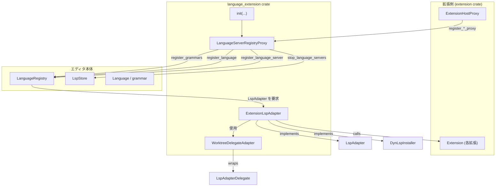
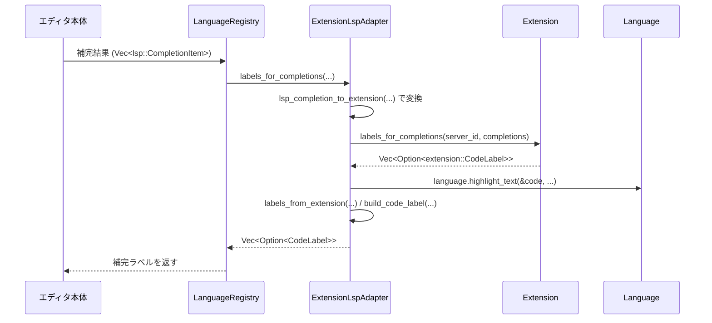

# language_extension/ ディレクトリ

## 1. ざっくり一言

Zed の拡張機構で提供される「言語拡張（Language Extension）」から、エディタ本体の言語レジストリ・LSP クライアントを操作できるようにするブリッジ層です。  
拡張が提供する言語サーバー・文法・言語定義を、`LanguageRegistry` や `LspStore` に登録・連携する役割を持ちます。

---

## 2. このモジュールの役割

### 2.1 概要

- このクレートは、拡張側の API（`extension` クレート）とエディタ本体側の API（`language`, `project::LspStore` など）を接続します。
- 拡張が提供する:
  - 文法（grammar）
  - 言語定義（language）
  - 言語サーバー（language server）
  を、エディタの `LanguageRegistry` や `LspStore` に登録・反映します。
- さらに、拡張が返す JSON 文字列や補完・シンボル情報を、エディタ内部の型に変換するアダプタを提供します。

### 2.2 アーキテクチャ内での位置づけ

このクレートは「拡張ホスト」と「言語機能」「LSP 管理」の間に入る仲介レイヤーです。



- `init` 関数で `LanguageServerRegistryProxy` を作り、拡張ホスト (`ExtensionHostProxy`) に登録します。
- 拡張は、この proxy を通して文法・言語・言語サーバーを登録／削除します。
- `LanguageRegistry` から見ると、拡張由来の言語サーバーは `ExtensionLspAdapter` 経由で利用されます。
- LSP の起動／停止は `LspAccess` 経由で `LspStore`（または複数の `LspStore`）に伝えられます。

### 2.3 設計上のポイント

- **プロキシ（Proxy）による責務分離**
  - 拡張ホストには `LanguageServerRegistryProxy` だけを渡し、その内部で `LanguageRegistry` や `LspStore` への実処理を行います。
- **LSP アダプタ**
  - `ExtensionLspAdapter` は `LspAdapter` と `DynLspInstaller` を実装し、拡張が提供する言語サーバーを、他の LSP と同様の形で扱えるようにします。
- **非同期処理・タスク管理**
  - `async_trait` により多くのメソッドが async 化され、`gpui::App` の `background_spawn` でバックグラウンドタスクとして実行されます。
  - 複数ワークスペース／複数 LspStore に対応するため、`LspAccess` で起動元を切り替えています。
- **データ変換レイヤー**
  - 拡張が返す JSON 文字列や独自型（補完・シンボル・ラベル）を、`serde_json::Value` や `language::CodeLabel` などに変換します。
- **Windows 向けのパス補正**
  - WASI 拡張が返すパスを Windows 向けに補正する処理が含まれています（先頭 `/` が付いたドライブレター付きパスの修正）。

---

## 3. 主要な機能一覧

このクレートが外部に提供する主な機能は次の通りです。

- `init` による拡張ホストとの連携初期化
- 拡張が提供する文法 (`register_grammars`) の `LanguageRegistry` への登録
- 拡張が提供する言語 (`register_language`, `remove_languages`) の `LanguageRegistry` への登録・削除
- 拡張が提供する言語サーバーの登録 (`register_language_server`) と削除 (`remove_language_server`)
- 言語サーバーバイナリのインストールコマンド決定 (`ExtensionLspAdapter` の `get_language_server_command`)
- 拡張が返す初期化オプションや設定の JSON 文字列を `serde_json::Value` に変換
- 補完候補／シンボルに対するラベル生成（`labels_for_completions`, `labels_for_symbols`）
- 拡張側の補完種別・シンボル種別・挿入テキスト形式を、LSP 由来の値から変換
- `extension::CodeLabel` から `language::CodeLabel` への変換とシンタックスハイライト適用（`build_code_label`）

---

## 4. 関数・構造体の解説

### 4.1 主な型一覧

| 名前 | 種別 | 役割 / 用途 |
|------|------|-------------|
| `LspAccess` | `enum` | LSP の停止などに利用する `LspStore` へのアクセス方法を表します。単一 / 複数 / 何もしない(Noop)の3パターン。 |
| `LanguageServerRegistryProxy` | 構造体 | 拡張ホストに渡されるプロキシ。文法・言語・言語サーバーの登録／削除を `LanguageRegistry` / `LspStore` に委譲します。 |
| `WorktreeDelegateAdapter` | 構造体 | `LspAdapterDelegate` を拡張側が期待する `WorktreeDelegate` にラップするアダプタです。 |
| `ExtensionLspAdapter` | 構造体 | 拡張由来の言語サーバーを `LspAdapter` / `DynLspInstaller` として公開するアダプタです。 |
| `LanguageServerRegistryProxy` (traits) | `ExtensionGrammarProxy`, `ExtensionLanguageProxy`, `ExtensionLanguageServerProxy` | 拡張からの登録要求に応じて `LanguageRegistry` や `LspStore` を操作するためのインターフェース実装です。 |

### 4.2 重要な関数・メソッド詳細（7件）

#### 4.2.1 `init(lsp_access, extension_host_proxy, language_registry)`

```rust
pub fn init(
    lsp_access: LspAccess,
    extension_host_proxy: Arc<ExtensionHostProxy>,
    language_registry: Arc<LanguageRegistry>,
)
```

**概要**

拡張ホストに対して、文法・言語・言語サーバー用のプロキシ (`LanguageServerRegistryProxy`) を登録し、このクレートを全体に組み込む入口です。

**引数**

| 引数名 | 型 | 説明 |
|--------|----|------|
| `lsp_access` | `LspAccess` | LSP の停止処理などで、どの `LspStore` にアクセスするかを表します。 |
| `extension_host_proxy` | `Arc<ExtensionHostProxy>` | 拡張ホスト。ここに grammar/language/language_server 用プロキシを登録します。 |
| `language_registry` | `Arc<LanguageRegistry>` | 言語定義・文法・LSP アダプタを登録するレジストリです。 |

**戻り値**

- なし。副作用として `extension_host_proxy` に 3 種類の proxy を登録します。

**内部処理の流れ**

1. `LanguageServerRegistryProxy` 構造体を作成し、`language_registry` と `lsp_access` を保持させます。
2. `extension_host_proxy.register_grammar_proxy(...)` で文法登録用プロキシとして登録します。
3. `extension_host_proxy.register_language_proxy(...)` で言語登録用プロキシとして登録します。
4. `extension_host_proxy.register_language_server_proxy(...)` で言語サーバー登録用プロキシとして登録します。

**Examples（使用例）**

```rust
use std::sync::Arc;
use language_extension::{init, LspAccess};
use extension::ExtensionHostProxy;
use language::LanguageRegistry;
use gpui::{App, Entity};
use project::LspStore;

// アプリケーション初期化時のどこか
fn setup_language_extension(app: &mut App) {
    // LspStore の Entity をどこかから取得する（詳細はこのチャンク外）
    let lsp_store: Entity<LspStore> = /* LspStore を生成または取得 */;

    // LSP アクセス方法を決定
    let lsp_access = LspAccess::ViaLspStore(lsp_store);

    // 拡張ホスト・言語レジストリはアプリケーション側で用意されている前提
    let extension_host_proxy: Arc<ExtensionHostProxy> = /* 取得 */;
    let language_registry: Arc<LanguageRegistry> = /* 取得 */;

    // language_extension の初期化
    init(lsp_access, extension_host_proxy, language_registry);
}
```

**使用上の注意点**

- `init` はアプリケーション起動時など、拡張が登録を開始する前に一度だけ呼び出されることが前提と考えられます（コードから再登録処理は見えません）。
- 渡す `LanguageRegistry` や `ExtensionHostProxy` は、アプリケーション全体で共有されるものを使う必要があります。

---

#### 4.2.2 `LanguageServerRegistryProxy::register_language(...)`

```rust
impl ExtensionLanguageProxy for LanguageServerRegistryProxy {
    fn register_language(
        &self,
        language: LanguageName,
        grammar: Option<Arc<str>>,
        matcher: LanguageMatcher,
        hidden: bool,
        load: Arc<dyn Fn() -> Result<LoadedLanguage> + Send + Sync + 'static>,
    ) { /* ... */ }
}
```

**概要**

拡張から新しい言語定義の登録要求を受け、`LanguageRegistry` にその言語を登録します。

**引数**

| 引数名 | 型 | 説明 |
|--------|----|------|
| `language` | `LanguageName` | 言語名（例: `"Rust"`, `"TypeScript"` など）。 |
| `grammar` | `Option<Arc<str>>` | 関連付ける文法 ID（あれば）。 |
| `matcher` | `LanguageMatcher` | ファイル名や拡張子などから言語を判定するための情報。 |
| `hidden` | `bool` | UI における表示可否などに関わるフラグと推測されますが、詳細はこのチャンクからは分かりません。 |
| `load` | `Arc<dyn Fn() -> Result<LoadedLanguage> + ...>` | 実際の言語をロードするクロージャ。必要になったときに呼ばれます。 |

**戻り値**

- なし。副作用として `language_registry.register_language(...)` を呼び出します。

**内部処理の流れ**

1. 受け取った引数をそのまま `self.language_registry.register_language(...)` に渡します。
2. 第 5 引数の位置には `None` を固定で渡しています（詳細な意味は `LanguageRegistry::register_language` の定義依存です）。

**Edge cases（エッジケース）**

- `load` クロージャがエラーを返した場合の扱いは、`LanguageRegistry` 側の実装に依存し、このチャンクからは分かりません。

**使用上の注意点**

- `load` クロージャ内でパニックや高コスト処理を行うと、実際に言語が必要になったタイミングで問題が顕在化するため、拡張実装側で注意が必要です。

---

#### 4.2.3 `ExtensionLanguageServerProxy::register_language_server(...)`

```rust
impl ExtensionLanguageServerProxy for LanguageServerRegistryProxy {
    fn register_language_server(
        &self,
        extension: Arc<dyn Extension>,
        language_server_id: LanguageServerName,
        language: LanguageName,
    ) { /* ... */ }
}
```

**概要**

拡張が提供する言語サーバーを `LanguageRegistry` に登録し、その言語サーバーに対応する `LspAdapter` として `ExtensionLspAdapter` を紐付けます。

**引数**

| 引数名 | 型 | 説明 |
|--------|----|------|
| `extension` | `Arc<dyn Extension>` | 言語サーバーを提供する拡張インスタンス。 |
| `language_server_id` | `LanguageServerName` | 言語サーバーの識別子。 |
| `language` | `LanguageName` | この言語サーバーを紐づける言語名。 |

**戻り値**

- なし。`LanguageRegistry` に LSP アダプタを登録します。

**内部処理の流れ**

1. `ExtensionLspAdapter::new(extension, language_server_id, language)` でアダプタを作成します。
2. それを `Arc` で包んで `self.language_registry.register_lsp_adapter(language.clone(), adapter)` を呼び出します。

**使用上の注意点**

- `language` に指定した言語名に対して、後から `LanguageRegistry` 側で LSP アダプタが参照される前提となります。  
  拡張側での言語登録と整合が取れている必要があります。

---

#### 4.2.4 `ExtensionLanguageServerProxy::remove_language_server(...)`

```rust
impl ExtensionLanguageServerProxy for LanguageServerRegistryProxy {
    fn remove_language_server(
        &self,
        language: &LanguageName,
        language_server_name: &LanguageServerName,
        cx: &mut App,
    ) -> Task<Result<()>> { /* ... */ }
}
```

**概要**

指定された言語サーバーを言語レジストリから削除し、必要に応じて起動中の LSP プロセスを停止する処理を行います。

**引数**

| 引数名 | 型 | 説明 |
|--------|----|------|
| `language` | `&LanguageName` | 対象言語名。 |
| `language_server_name` | `&LanguageServerName` | 削除対象の言語サーバー名。 |
| `cx` | `&mut App` | `gpui` のアプリケーションコンテキスト。LspStore 更新／タスク起動に使われます。 |

**戻り値**

- `Task<Result<()>>`  
  バックグラウンドで実行されるタスクを返します。タスク内では LSP 停止処理が行われ、エラーがあれば `Err` が返ります。

**内部処理の流れ**

1. `language_registry.remove_lsp_adapter(language, language_server_name)` でレジストリからアダプタを除去します。
2. `self.lsp_access` の内容に応じて、`LspStore` に対して「該当言語サーバーを停止する」リクエストを発行します。
   - `ViaLspStore(lsp_store)` の場合: 単一の `LspStore` に対して `stop_language_servers_for_buffers(...)` を呼ぶタスクを作成。
   - `ViaWorkspaces(provider)` の場合: `provider(cx)` から複数 `LspStore` を取得し、それぞれに同様のタスクを作成。
   - `Noop` の場合: LSP 停止処理は行わず、レジストリからの削除のみ。
3. 複数の停止タスクを `join_all` し、すべての結果を確認する非同期処理を `cx.background_spawn` で起動します。
4. そのバックグラウンドタスクを返します。

**Edge cases（エッジケース）**

- `ViaWorkspaces` のクロージャが `Err` を返した場合、`if let Ok(lsp_stores) = ...` で握りつぶしているため、LSP 停止が行われない可能性があります。
- どれか 1 つの `stop_language_servers_for_buffers` がエラーを返すと、そのエラーで `Task<Result<()>>` が失敗します（`result?` による）。

**使用上の注意点**

- `Noop` を指定した `LspAccess` の場合、プロセス停止は行われません。テスト環境などでのみ使用するのが適切と考えられます。
- 複数 `LspStore` を扱う場合、`ViaWorkspaces` のクロージャは `App` からすべての対象 `LspStore` を正しく取得する必要があります。

---

#### 4.2.5 `ExtensionLspAdapter::get_language_server_command(...)`

```rust
#[async_trait(?Send)]
impl DynLspInstaller for ExtensionLspAdapter {
    fn get_language_server_command(
        self: Arc<Self>,
        delegate: Arc<dyn LspAdapterDelegate>,
        _: Option<Toolchain>,
        _: LanguageServerBinaryOptions,
        _: OwnedMutexGuard<Option<(bool, LanguageServerBinary)>>,
        _: AsyncApp,
    ) -> LanguageServerBinaryLocations {
        /* 非同期クロージャを返す */
    }
}
```

**概要**

拡張が提供する言語サーバー起動コマンドを取得し、`LanguageServerBinary` に変換して返します。`DynLspInstaller` のインターフェース実装です。

**主な引数**

| 引数名 | 型 | 説明 |
|--------|----|------|
| `self` | `Arc<Self>` | アダプタ自身。 |
| `delegate` | `Arc<dyn LspAdapterDelegate>` | ファイル読み込みや `which` など、ワークツリー情報を提供するデリゲート。 |

その他の引数（`Toolchain`, `LanguageServerBinaryOptions`, `OwnedMutexGuard`, `AsyncApp`）は、この実装では使用していません。

**戻り値**

- `LanguageServerBinaryLocations`  
  実体はこのチャンクからは分かりませんが、非同期に `LanguageServerBinary` を返すための型（`Future` 相当）です。
  戻り値の中身として `(ret, None)` を返していることから、`ret` に `Result<LanguageServerBinary, _>` 相当が入っていると推測できますが、詳細は型定義依存です。

**内部処理の流れ**

1. `delegate` を `WorktreeDelegateAdapter` 経由で拡張が期待する `WorktreeDelegate` 型に変換します。
2. 拡張の `extension.language_server_command(...)` を呼び出し、言語サーバー起動コマンド（パス・引数・環境変数など）を取得します。
3. Windows の場合に、先頭が `/C:\...` のようなパスを検出したとき、先頭の `/` を取り除いて Windows ネイティブなパスに戻します（`command_path` の処理）。
4. `extension.path_from_extension(command_path)` で拡張のワークディレクトリからの相対パスを実際のファイルパスに変換します。
5. 特定の拡張 ID（`"toml"`, `"zig"`）で、かつ拡張の `work_dir` 配下のパスであれば、`make_file_executable(&path)` で実行ビットを立てます（古いバージョンとの互換のための暫定措置）。
6. 引数リストについても、Windows かつ `/C:\...` 形式の場合は先頭 `/` を削除します。
7. 最終的に `LanguageServerBinary { path, arguments, env: Some(...) }` を構築し、`Ok(...)` として返します。
8. 全体は `maybe!(async move { ... }).await` でラップされており、内部のエラー処理は `maybe!` マクロの挙動に依存します（詳細は util クレート側で定義）。

**Errors / Panics**

- `make_file_executable` が失敗した場合:
  - `"failed to set file permissions"` というコンテキスト付きで `Err` を返します。
- 拡張の `language_server_command` が `Err` を返した場合は、そのエラーが `maybe!` を通じて `ret` に反映されます。

**Edge cases（エッジケース）**

- Windows 以外の環境では、パスの補正は行われず、そのまま使用されます。
- 拡張が返すパスが不正（UTF-8 でないなど）な場合の挙動は、このチャンクだけでは読み取れません。

**使用上の注意点**

- 拡張作者側は、Windows で先頭 `/` 付きのパスを返しても動作するよう、このアダプタで補正される前提になっています。
- `DynLspInstaller::try_fetch_server_binary` は `unreachable!()` で実装されており、このアダプタでは常に `get_language_server_command` が使われる前提です。

---

#### 4.2.6 `ExtensionLspAdapter::initialization_options(...)`

```rust
#[async_trait(?Send)]
impl LspAdapter for ExtensionLspAdapter {
    async fn initialization_options(
        self: Arc<Self>,
        delegate: &Arc<dyn LspAdapterDelegate>,
        _: &mut AsyncApp,
    ) -> Result<Option<serde_json::Value>> { /* ... */ }
}
```

**概要**

拡張が返す初期化オプション（JSON 文字列）を取得し、`serde_json::Value` にパースして LSP の初期化に利用します。

**引数**

| 引数名 | 型 | 説明 |
|--------|----|------|
| `self` | `Arc<Self>` | アダプタ自身。 |
| `delegate` | `&Arc<dyn LspAdapterDelegate>` | ワークツリー情報提供デリゲート。内部で `WorktreeDelegateAdapter` にラップされます。 |

**戻り値**

- `Result<Option<serde_json::Value>>`  
  - `Ok(Some(value))`: 拡張がオプションを返し、JSON パースにも成功した場合。
  - `Ok(None)`: 拡張が `None` を返した場合。
  - `Err(_)`: JSON パースなどに失敗した場合。

**内部処理の流れ**

1. `delegate` を `WorktreeDelegateAdapter` でラップします。
2. 拡張の `extension.language_server_initialization_options(...)` を呼び出し、`Option<String>`（JSON 文字列）を取得します。
3. `Some(json)` の場合は `serde_json::from_str(&json)` で `Value` にパースします。
   - 失敗時には `"failed to parse initialization_options from extension: {json}"` というコンテキストを付けて `Err` を返します。
4. `None` の場合は `Ok(None)` を返します。

**Edge cases（エッジケース）**

- 拡張が返す文字列が JSON ではない場合、パースに失敗して `Err` になります。
- 拡張が `Ok(None)` を返した場合は、そのまま `None` として扱われます。

**使用上の注意点**

- 拡張作者は、ここで返す文字列が必ず有効な JSON になるようにする必要があります。
- ホスト側（このクレート）では、JSON のスキーマまでは検証しておらず、構造的に正しい JSON であれば受け入れます。

---

#### 4.2.7 `build_code_label(...)`

```rust
fn build_code_label(
    label: &extension::CodeLabel,
    parsed_runs: &[(Range<usize>, HighlightId)],
    language: &Arc<Language>,
) -> Option<CodeLabel>
```

**概要**

拡張が返す `extension::CodeLabel` から、エディタ内部で使用する `language::CodeLabel` を構築します。  
テキスト断片とハイライト情報（`HighlightId`）を統合し、フィルタリングに使う範囲も保持します。

**引数**

| 引数名 | 型 | 説明 |
|--------|----|------|
| `label` | `&extension::CodeLabel` | 拡張側が生成したコードラベル。`code`, `spans`, `filter_range` を持ちます。 |
| `parsed_runs` | `&[(Range<usize>, HighlightId)]` | 元の `code` に対して適用済みのハイライト結果。 |
| `language` | `&Arc<Language>` | ハイライト名から `HighlightId` を引くために使われます。 |

**戻り値**

- `Some(CodeLabel)`  
  正常に組み立てられた場合。
- `None`  
  不正なレンジ（マルチバイト文字を分断するなど）や `filter_range` が不正な場合。

**内部処理の流れ**

1. 出力用文字列 `text` と、その中でのハイライト `runs` を初期化します。
2. `label.spans` を順に処理します。
   - `CodeRange(range)` の場合:
     1. `label.code.get(range.clone())?` で対象範囲の文字列を取得。UTF-8 の境界に沿っていない場合は `None` になり、全体として `None` を返します。
     2. `parsed_runs` を走査し、`range` と重なる部分の `HighlightId` を `text` 上のインデックスにマッピングし直して `runs` に追加します。
     3. 対象の `code_span` を `text` に追加します。
   - `Literal(span)` の場合:
     1. `language.grammar()` と `span.highlight_name` が両方存在する場合、`grammar.highlight_id_for_name(...)` でハイライト ID を取得します。
     2. `text` の末尾に `span.text` を追加し、その範囲に取得した `HighlightId` を割り当てます。
3. 最後に `label.filter_range` に対応する範囲が `text.get(filter_range.clone())` で取得できるか確認します。
   - 取得できなければ `None` を返します。
4. 問題がなければ `Some(CodeLabel::new(text, filter_range, runs))` を返します。

**Examples（使用例）**

テストコード `test_build_code_label` が具体例になっています。

```rust
#[test]
fn test_build_code_label() {
    use util::test::marked_text_ranges;

    // 元のコードと、その中でハイライトすべき範囲
    let (code, code_ranges) = marked_text_ranges(
        "«const» «a»: «fn»(«Bcd»(«Efgh»)) -> «Ijklm» = pqrs.tuv",
        false,
    );
    let code_runs = code_ranges
        .into_iter()
        .map(|range| (range, HighlightId::new(0)))
        .collect::<Vec<_>>();

    // ラベルは末尾の "pqrs.tuv" と ": fn(...) -> Ijklm" を組み合わせたもの
    let label = build_code_label(
        &extension::CodeLabel {
            spans: vec![
                extension::CodeLabelSpan::CodeRange(code.find("pqrs").unwrap()..code.len()),
                extension::CodeLabelSpan::CodeRange(
                    code.find(": fn").unwrap()..code.find(" = ").unwrap(),
                ),
            ],
            filter_range: 0.."pqrs.tuv".len(),
            code,
        },
        &code_runs,
        &language::PLAIN_TEXT,
    )
    .unwrap();

    // 期待されるラベル
    let (label_text, label_ranges) =
        marked_text_ranges("pqrs.tuv: «fn»(«Bcd»(«Efgh»)) -> «Ijklm»", false);
    let label_runs = label_ranges
        .into_iter()
        .map(|range| (range, HighlightId::new(0)))
        .collect::<Vec<_>>();

    assert_eq!(
        label,
        CodeLabel::new(label_text, label.filter_range.clone(), label_runs)
    )
}
```

このテストから、「元コードの複数の範囲を連結しつつ、ハイライト情報を保ったラベルを組み立てる」役割が分かります。

**Edge cases（エッジケース）**

テスト `test_build_code_label_with_invalid_ranges` で、代表的なエラーケースが検証されています。

1. **マルチバイト文字を途中から切る範囲**
   - `'🏀'` のようなマルチバイト文字の途中から始まる `Range` を渡すと、`code.get(range)` が `None` となり、`build_code_label` 全体が `None` を返します。
2. **`filter_range` が実際のテキストをはみ出す**
   - `filter_range: 0..5` だが `text` が `"abc"` のみ、というケースでは `text.get(filter_range)` が失敗し、`None` となります。

**使用上の注意点**

- 拡張作者が `extension::CodeLabel` を構築する際には、以下が前提になります。
  - `spans` の `Range` は UTF-8 の境界に沿った範囲であること。
  - `filter_range` は、最終的に生成されるラベルテキストの範囲内であること。
- これらが守られない場合、この関数は `None` を返し、そのラベルは表示されません。

---

### 4.3 その他の関数・メソッド一覧

| 関数 / メソッド | 役割（1 行） |
|-----------------|--------------|
| `WorktreeDelegateAdapter::id` | `LspAdapterDelegate` の `worktree_id` を `WorktreeDelegate` の ID として返します。 |
| `WorktreeDelegateAdapter::root_path` | ワークツリーのルートパスを文字列として返します。 |
| `WorktreeDelegateAdapter::read_text_file` | 相対パスのファイル内容を読み込みます（実処理は delegate 側）。 |
| `WorktreeDelegateAdapter::which` | バイナリ名から実行パスを探します（実処理は delegate 側）。 |
| `WorktreeDelegateAdapter::shell_env` | シェル環境変数を取得し、`Vec<(String, String)>` に変換します。 |
| `ExtensionLspAdapter::name` | 言語サーバー名 (`LanguageServerName`) を返します。 |
| `ExtensionLspAdapter::code_action_kinds` | 拡張の manifest から対応する CodeActionKind を取得し、なければデフォルトセットを返します。 |
| `ExtensionLspAdapter::language_ids` | LSP の languageId 文字列のマッピングを返します。PHP 拡張の旧バージョン用の特別扱いを含みます。 |
| `workspace_configuration` | 拡張から workspace 設定の JSON 文字列を取得し、`Value` にパースします。 |
| `initialization_options_schema` / `settings_schema` | 拡張からスキーマの JSON 文字列を取得し、`Value` にパースします（失敗時は `None`）。 |
| `additional_initialization_options` / `additional_workspace_configuration` | 他の言語サーバー ID に対する追加の設定を取得し、`Value` にパースします。 |
| `labels_for_completions` | `lsp::CompletionItem` 配列から拡張経由で `CodeLabel` を取得します。 |
| `labels_for_symbols` | `language::Symbol` 配列から拡張経由で `CodeLabel` を取得します。 |
| `labels_from_extension` | `Vec<Option<extension::CodeLabel>>` を `Vec<Option<CodeLabel>>` に変換します。 |
| `lsp_completion_to_extension` | `lsp::CompletionItem` を `extension::Completion` に変換します。 |
| `lsp_completion_item_*_to_extension` | 補完のラベル詳細・種別を extension 用の型に変換します。 |
| `lsp_insert_text_format_to_extension` | `InsertTextFormat` を extension 用の型に変換します。 |
| `lsp_symbol_kind_to_extension` | `lsp::SymbolKind` を extension 用の `SymbolKind` に変換します。 |
| `extract_int` | 任意のシリアライズ可能な値から数値 (i32) を取り出そうとし、失敗時はログ出力のうえ `-1` を返します。 |

---

## 5. データフロー

ここでは、代表的なシナリオとして「補完ラベルの取得」のデータフローを示します。

### 5.1 概要

1. エディタ本体が LSP から補完候補（`lsp::CompletionItem`）を受け取る。
2. `LanguageRegistry` 経由で、その言語に対応する `ExtensionLspAdapter` の `labels_for_completions` が呼ばれる。
3. アダプタは `lsp::CompletionItem` を拡張用の型に変換し、拡張へ渡す。
4. 拡張が `extension::CodeLabel` の配列を返す。
5. `labels_from_extension` と `build_code_label` で、ハイライト済みの `CodeLabel` に変換してエディタ側に返す。

### 5.2 シーケンス図



### 5.3 要点

- 補完ラベルの生成は、拡張と本体の双方の責務にまたがります。
  - 拡張側: どのようなラベル（`CodeLabel`）を生成するか決める。
  - 本体側: 文法 (`Language`) を使ってコード部分にハイライトを適用し、ラベルを描画用の形式に整える。
- エラーや不正なレンジがあった場合、`build_code_label` は `None` を返し、そのラベルは無視されます。

---

## 6. 使い方（How to Use）

### 6.1 基本的な使用方法

このクレートは、主に「エディタ本体側」で利用されることを想定した内部クレートです。基本的な流れは次の通りです。

1. アプリケーション起動時に `LspAccess` を決める。
2. `ExtensionHostProxy` と `LanguageRegistry` を用意する。
3. `language_extension::init(...)` を呼び、拡張ホストにプロキシを登録する。
4. 拡張が実行されると、`LanguageServerRegistryProxy` 経由で文法・言語・言語サーバーが登録される。

```rust
use std::sync::Arc;
use language_extension::{init, LspAccess};
use extension::ExtensionHostProxy;
use language::LanguageRegistry;
use gpui::{App, Entity};
use project::LspStore;

fn app_startup(app: &mut App) {
    // 1. LspStore へのアクセス方法を決める
    let lsp_store: Entity<LspStore> = /* アプリ側で生成・取得 */;
    let lsp_access = LspAccess::ViaLspStore(lsp_store);

    // 2. 拡張ホスト・言語レジストリを用意
    let extension_host_proxy: Arc<ExtensionHostProxy> = /* 生成/取得 */;
    let language_registry: Arc<LanguageRegistry> = /* 生成/取得 */;

    // 3. language_extension の初期化
    init(lsp_access, extension_host_proxy, language_registry);
}
```

### 6.2 よくある使用パターン

#### パターン1: 単一 LspStore を使う環境

- デスクトップアプリなどでワークスペースが 1 つだけの場合、`LspAccess::ViaLspStore` を使います。

```rust
let lsp_store: Entity<LspStore> = /* ... */;
let lsp_access = LspAccess::ViaLspStore(lsp_store);
init(lsp_access, extension_host_proxy, language_registry);
```

#### パターン2: 複数ワークスペース／複数 LspStore を扱う環境

- 複数のプロジェクトを同時に開く場合など、`ViaWorkspaces` で `Vec<Entity<LspStore>>` を返すクロージャを登録します。

```rust
let lsp_access = LspAccess::ViaWorkspaces(Arc::new(|app: &mut App| {
    // app から全ワークスペースの LspStore を集めて返す
    let stores: Vec<Entity<LspStore>> = /* ... */;
    Ok(stores)
}));

init(lsp_access, extension_host_proxy, language_registry);
```

#### パターン3: テストなどで LSP 停止処理を無効にする

- 単体テスト・ベンチマークなどで、実際の LSP プロセス停止を行いたくない場合は `Noop` が利用できます。

```rust
let lsp_access = LspAccess::Noop;
init(lsp_access, extension_host_proxy, language_registry);
// remove_language_server しても LspStore への停止要求は飛びません
```

### 6.3 使用上の注意点（まとめ）

- **LspAccess の選択**
  - 実運用環境で `Noop` を使うと、言語サーバー削除時にプロセスが停止されない可能性があります。
- **拡張から返す JSON**
  - 初期化オプションや設定スキーマなど、拡張が返す JSON 文字列は必ずパース可能な JSON にする必要があります。  
    パースに失敗すると `Err` となり、その設定は利用されません。
- **CodeLabel のレンジ**
  - `extension::CodeLabel` の `spans` および `filter_range` は、UTF-8 境界に沿った正しい範囲である必要があります。  
    不正な範囲は `build_code_label` が `None` を返し、ラベルが無視される原因になります。
- **Windows のパス**
  - 拡張が Windows で `/C:\...` 形式のパスを返しても、このアダプタが補正しますが、他の特殊な形式についてはこのチャンクからは保証できません。
- **エラー処理**
  - `extract_int` は変換に失敗すると `-1` を返しつつ `log_err` でログに出力します。  
    「その他の種別」を表す値として `-1` を扱う設計になっているため、上位での扱いに注意が必要です。

---

## 7. 関連ファイル

このクレートと密接に関係する他モジュール／クレートをまとめます（パスはこのワークスペース内の論理的な位置づけです）。

| パス / クレート | 役割 / 関係 |
|-----------------|------------|
| `language_extension/Cargo.toml` | 本クレートの定義。ライブラリエントリを `src/language_extension.rs` に設定しています。 |
| `language_extension/src/language_extension.rs` | クレートルート。`LspAccess` 定義と `init` 関数、`LanguageServerRegistryProxy` の基本実装を提供します。 |
| `language_extension/src/extension_lsp_adapter.rs` | 拡張由来の LSP を扱う `ExtensionLspAdapter` や、補完・シンボル・ラベル変換ロジックを含みます。 |
| `extension` クレート | `Extension`, `ExtensionHostProxy`, 各種 Proxy トレイト、`CodeLabel` など、拡張側の API を提供します。 |
| `language` クレート | `LanguageRegistry`, `Language`, `CodeLabel`, `LspAdapter`, `DynLspInstaller` など、言語と LSP の中心的な API を提供します。 |
| `project::LspStore` | LSP プロセスの管理やバッファとの紐付けを行うと見られる型で、`LspAccess` から参照されます。 |
| `util` クレート | `ResultExt`, `maybe!`, `make_file_executable`, テスト用の `marked_text_ranges` などのユーティリティを提供します。 |

このチャンクには、これら関連クレートの実装は含まれていませんが、インポートやメソッド呼び出しから上記のような関係が読み取れます。
