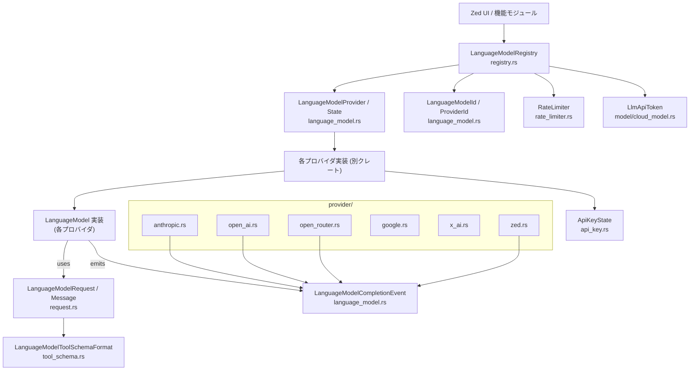
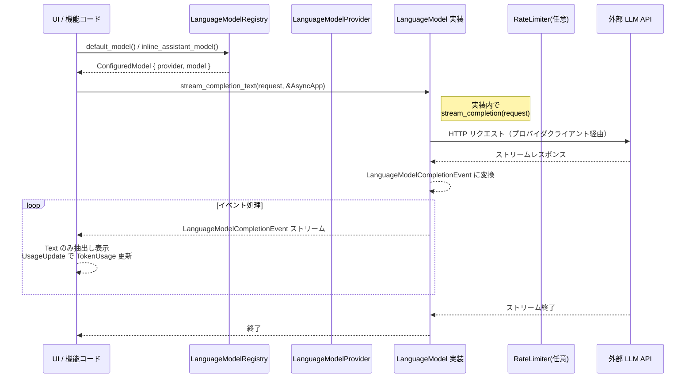

# language_model/ ディレクトリ解説

---

## 1. ざっくり一言

Zed エディタが複数の外部 LLM プロバイダ（Anthropic / OpenAI / OpenRouter / Zed Cloud など）を **統一的なインターフェースで扱うためのコアクレート** です。  
モデル・プロバイダの抽象化、リクエスト/レスポンス表現、ツール呼び出し、画像・トークン管理、レジストリ、レート制御、API キー管理などをまとめて提供します。

---

## 2. このモジュールの役割

### 2.1 概要

このクレートは、Zed 内での LLM 利用に関する共通基盤を提供します。

- **問題**: プロバイダごとに異なる API・エラー形式・機能（ツール、画像、thinking 等）を、UI や他コードから安全・一貫して扱いたい。
- **機能**:
  - `LanguageModel` / `LanguageModelProvider` トレイトによる抽象化
  - メッセージ・ツール・画像を含む `LanguageModelRequest` / `LanguageModelCompletionEvent` の定義
  - プロバイダごとのエラー型からの変換・統合された `LanguageModelCompletionError`
  - グローバルな `LanguageModelRegistry` によるモデル選択・デフォルトモデル管理
  - 画像のリサイズ・エンコード、ツールスキーマの JSON Schema 変換
  - API キー・Cloud LLM トークン管理、レートリミット、テスト用のフェイクプロバイダ

### 2.2 アーキテクチャ内での位置づけ

このクレート内部の主要モジュール同士の依存関係を表にまとめ、その上で Mermaid 図で示します。

- `language_model.rs`: コア型・トレイト・エラー・イベント。
- `request.rs`: リクエスト/レスポンス、画像、ツール結果の表現。
- `provider/*`: 各 LLM プロバイダの ID/Name とエラー変換。
- `registry.rs`: グローバルなモデルレジストリ。
- `api_key.rs`: API キーのロード/保存。
- `model/cloud_model.rs`: Zed Cloud 用 LLM トークン管理。
- `rate_limiter.rs`: 非同期レート制御。
- `tool_schema.rs`: ツール用 JSON Schema の生成・変換。



### 2.3 設計上のポイント

- **トレイトベースの抽象化**  
  - `LanguageModel` / `LanguageModelProvider` を中心に、各プロバイダ実装は外部クレートに分離されます。
- **ストリーミング前提の設計**  
  - `stream_completion` は `BoxStream<LanguageModelCompletionEvent>` を返し、その上に `stream_completion_text` / `stream_completion_tool` のヘルパを提供します。
- **エラーの統合表現**  
  - HTTP ステータスや各プロバイダのエラー型を `LanguageModelCompletionError` に正規化し、UI 側で一貫したハンドリングができます。
- **UI フレームワークとの統合**  
  - `gpui::App` / `AsyncApp` / `Task` / `Entity` を通じて、状態管理・非同期処理・イベント購読が行われます。
- **ツール・画像サポート**  
  - ツール呼び出し (`LanguageModelToolUse` / `LanguageModelToolResult`) や画像 (`LanguageModelImage`) を一体的に扱えるよう設計されています。
- **プロバイダごとの差異吸収**  
  - JSON Schema のバリアント (`JsonSchema` vs Google AI のサブセット) を `LanguageModelToolSchemaFormat` と変換処理で吸収します。
- **テストしやすさ**  
  - `fake_provider` によるフェイクモデル/プロバイダと、豊富なテストが存在し、非同期ストリームや画像ダウンスケールなどの挙動が検証されています。

---

## 3. 主要な機能一覧

- **モデル・プロバイダの抽象化**:
  - `LanguageModel` / `LanguageModelProvider` / `LanguageModelProviderState` トレイト
  - Model/Provider ID・名前・コスト情報 (`LanguageModelCostInfo`)
- **リクエスト/レスポンス表現**:
  - `LanguageModelRequest` / `LanguageModelRequestMessage` / `MessageContent`
  - 画像 (`LanguageModelImage`)、ツール呼び出し (`LanguageModelToolUse`) と結果 (`LanguageModelToolResult`)
- **ストリーミング補助**:
  - `LanguageModelCompletionEvent` / `LanguageModelTextStream`
  - `stream_completion_text` / `stream_completion_tool`
- **エラー・トークン管理**:
  - `LanguageModelCompletionError` と各プロバイダ用 `From` 実装
  - `TokenUsage` と合計・加算/減算
- **グローバルレジストリ**:
  - `LanguageModelRegistry` によるデフォルトモデル・用途別モデル・可視プロバイダの管理
  - 拡張（extension）インストール時のビルトインプロバイダ非表示ロジック
- **API キー・Cloud トークン管理**:
  - `ApiKeyState` / `ApiKey` による env / システムキーチェーンからの取得・保存
  - `LlmApiToken` による Zed Cloud 用 LLM トークンのキャッシュと再取得
- **レートリミット**:
  - `RateLimiter` による並列数制限つき `run` / `stream` ラッパ
- **ツールスキーマ生成・変換**:
  - `root_schema_for<T>` による schemars ベースの JSON Schema 生成
  - `adapt_schema_to_format` による OpenAPI サブセット対応変換
- **テスト用フェイク実装**:
  - `FakeLanguageModelProvider` / `FakeLanguageModel` とストリーム制御 API

---

## 4. 関数・構造体の解説

ここではディレクトリ全体で特に重要な型・関数を中心に説明します。

### 4.1 コア型・トレイト（language_model.rs）

#### 4.1.1 LanguageModelCompletionEvent

```rust
#[derive(Debug, PartialEq, Clone, Serialize, Deserialize)]
pub enum LanguageModelCompletionEvent {
    Queued { position: usize },
    Started,
    Stop(StopReason),
    Text(String),
    Thinking { text: String, signature: Option<String> },
    RedactedThinking { data: String },
    ToolUse(LanguageModelToolUse),
    ToolUseJsonParseError { /* ... */ },
    StartMessage { message_id: String },
    ReasoningDetails(serde_json::Value),
    UsageUpdate(TokenUsage),
}
```

- LLM からストリーミングで届くイベントの列挙体です。
- テキスト (`Text`)、思考 (`Thinking` / `RedactedThinking`)、ツール呼び出し (`ToolUse`)、トークン使用量更新 (`UsageUpdate`) などを表現します。
- `from_completion_request_status` で、クラウド側の `CompletionRequestStatus` から一部イベント（Queued / Started / エラー）に変換します。

**エッジケース**

- `Unknown` / `StreamEnded` ステータスは `None` を返し、イベント列には現れません。
- `Failed` は `LanguageModelCompletionError::from_cloud_failure` に委譲されます。

#### 4.1.2 LanguageModelCompletionError

```rust
#[derive(Error, Debug)]
pub enum LanguageModelCompletionError {
    PromptTooLarge { tokens: Option<u64> },
    NoApiKey { provider: LanguageModelProviderName },
    RateLimitExceeded { provider: LanguageModelProviderName, retry_after: Option<Duration> },
    ServerOverloaded { provider: LanguageModelProviderName, retry_after: Option<Duration> },
    ApiInternalServerError { provider: LanguageModelProviderName, message: String },
    UpstreamProviderError { message: String, status: StatusCode, retry_after: Option<Duration> },
    HttpResponseError { provider: LanguageModelProviderName, status_code: StatusCode, message: String },
    // ... 多数のクライアント側エラー ...
    StreamEndedUnexpectedly { provider: LanguageModelProviderName },
    #[error(transparent)]
    Other(#[from] anyhow::Error),
}
```

- LLM 呼び出しに関するエラーを網羅的に表現する列挙体です。
- HTTP ステータスや各プロバイダ独自エラーをユーザ向けメッセージに集約します。

##### `from_cloud_failure(...)`

**概要**

Cloud 側の `CompletionRequestStatus::Failed` から送られた `code` / `message` / `retry_after` を解析し、適切な `LanguageModelCompletionError` に変換します。

**主要な挙動**

- `parse_prompt_too_long` を用いて「プロンプトトークン超過」のパターンを検知し、`PromptTooLarge { tokens }` を返す。
- `code == "upstream_http_error"` の場合、`message` を JSON として解析し、`upstream_status` / `inner_message` を取り出して `from_http_status` に委譲。
- `code` が `"upstream_http_{status}"` / `"http_{status}"` 形式なら `StatusCode` に変換して `from_http_status` に委譲。
- それ以外はメッセージを `anyhow!` に包み `Other` へ。

**使用上の注意点**

- `code` / `message` が期待した形式でない場合、`Other` になるため、UI では汎用エラーとして扱われます。
- `retry_after` が付与される場合はリトライ戦略に利用できます。

##### `from_http_status(...)`

- HTTP ステータスごとに、より意味のあるエラー種別へマッピングします。
  - 400 → `BadRequestFormat`
  - 401 → `AuthenticationError`
  - 403 → `PermissionError`
  - 404 → `ApiEndpointNotFound`
  - 413 → `PromptTooLarge`
  - 429 → `RateLimitExceeded`
  - 500 → `ApiInternalServerError`
  - 503 / 529 → `ServerOverloaded`
  - その他 → `HttpResponseError`

#### 4.1.3 TokenUsage

```rust
#[derive(Debug, PartialEq, Clone, Copy, Serialize, Deserialize, Default)]
pub struct TokenUsage {
    pub input_tokens: u64,
    pub output_tokens: u64,
    pub cache_creation_input_tokens: u64,
    pub cache_read_input_tokens: u64,
}
```

- 入出力トークン、キャッシュ作成/読み込みに使ったトークン数を集約する構造体です。
- `total_tokens()` により合計値を計算できます。
- `Add` / `Sub` 実装により、トークン使用量の加算・差分計算が可能です。

#### 4.1.4 LanguageModel / LanguageModelTextStream

```rust
pub trait LanguageModel: Send + Sync {
    fn id(&self) -> LanguageModelId;
    fn name(&self) -> LanguageModelName;
    fn provider_id(&self) -> LanguageModelProviderId;
    fn provider_name(&self) -> LanguageModelProviderName;
    fn upstream_provider_id(&self) -> LanguageModelProviderId { /* 既定: provider_id() */ }
    fn upstream_provider_name(&self) -> LanguageModelProviderName { /* 既定: provider_name() */ }

    fn telemetry_id(&self) -> String;
    fn api_key(&self, _cx: &App) -> Option<String> { None }
    fn model_cost_info(&self) -> Option<LanguageModelCostInfo> { None }
    fn supports_thinking(&self) -> bool { false }
    fn supports_fast_mode(&self) -> bool { false }
    fn supported_effort_levels(&self) -> Vec<LanguageModelEffortLevel> { Vec::new() }
    fn default_effort_level(&self) -> Option<LanguageModelEffortLevel> { /* ... */ }

    fn supports_images(&self) -> bool;
    fn supports_tools(&self) -> bool;
    fn supports_tool_choice(&self, choice: LanguageModelToolChoice) -> bool;
    fn supports_streaming_tools(&self) -> bool { false }
    fn supports_split_token_display(&self) -> bool { false }
    fn tool_input_format(&self) -> LanguageModelToolSchemaFormat { LanguageModelToolSchemaFormat::JsonSchema }

    fn max_token_count(&self) -> u64;
    fn max_output_tokens(&self) -> Option<u64> { None }

    fn count_tokens(&self, request: LanguageModelRequest, cx: &App)
        -> BoxFuture<'static, Result<u64>>;

    fn stream_completion(
        &self,
        request: LanguageModelRequest,
        cx: &AsyncApp,
    ) -> BoxFuture<'static, Result<BoxStream<'static, Result<LanguageModelCompletionEvent, LanguageModelCompletionError>>, LanguageModelCompletionError>>;

    fn stream_completion_text(
        &self,
        request: LanguageModelRequest,
        cx: &AsyncApp,
    ) -> BoxFuture<'static, Result<LanguageModelTextStream, LanguageModelCompletionError>> { /* 既定実装 */ }

    fn stream_completion_tool(
        &self,
        request: LanguageModelRequest,
        cx: &AsyncApp,
    ) -> BoxFuture<'static, Result<LanguageModelToolUse, LanguageModelCompletionError>> { /* 既定実装 */ }

    fn cache_configuration(&self) -> Option<LanguageModelCacheConfiguration> { None }

    #[cfg(any(test, feature = "test-support"))]
    fn as_fake(&self) -> &fake_provider::FakeLanguageModel { unimplemented!() }
}
```

##### `stream_completion_text(...)`

**概要**

- `stream_completion` で得たイベントストリームから、テキスト (`Text`) のみを抽出した `LanguageModelTextStream` を構築するヘルパ関数です。
- 最初の `StartMessage` イベントから `message_id` を取得し、`UsageUpdate` イベントから最終的な `TokenUsage` を保存します。

**引数**

| 引数名    | 型                    | 説明                                       |
|----------|------------------------|--------------------------------------------|
| `request` | `LanguageModelRequest` | モデルへのリクエスト（メッセージ、ツール等） |
| `cx`      | `&AsyncApp`            | 非同期コンテキスト（gpui）                |

**戻り値**

- `Result<LanguageModelTextStream, LanguageModelCompletionError>` を返す `BoxFuture`。
- `LanguageModelTextStream` は `message_id`（あれば）と `BoxStream<String>`（テキストチャンク列）と `last_token_usage` を持ちます。

**内部処理の流れ**

1. `self.stream_completion(request, cx)` を呼び出し、イベントストリームを取得。
2. 最初のイベントを 1 つ読み:
   - `StartMessage { message_id }` → `message_id` を保存。
   - `Text(text)` → `first_item_text` に保存（後続ストリームで先頭に流す）。
3. その後のイベントストリームに `filter_map` をかけて:
   - `Text(text)` → `Some(Ok(text))`（下流へ流す）。
   - `UsageUpdate(token_usage)` → `last_token_usage` を更新し、下流には流さない。
   - `Queued` / `Started` / `Thinking` 等、他のイベントは `None` として無視。
   - `Err(err)` → `Some(Err(err))` として下流へエラーを伝搬。
4. `LanguageModelTextStream { message_id, stream, last_token_usage }` を返す。

**エッジケース**

- 最初のイベントが `Text` 以外（例: すぐに `UsageUpdate`）でも、その後の `Text` は通常どおり抽出されます。
- `UsageUpdate` が来ない場合、`last_token_usage` は `TokenUsage::default()` のままです。
- ストリームがエラーで終わる場合、`stream` 自体が `Err(LanguageModelCompletionError)` を流します。

**使用上の注意点**

- Thinking / ToolUse などは `stream_completion_text` では見えません。ツールストリームが必要な場合は `stream_completion` や `stream_completion_tool` を直接利用する必要があります。
- この関数はモデル実装ではなく呼び出し側が使うためのユーティリティで、モデル実装側は `stream_completion` のみ実装すれば足ります。

##### `stream_completion_tool(...)`

- `stream_completion` から最初に `is_input_complete == true` な `LanguageModelToolUse` を見つけるまでイベントを読み進めます。
- 見つからないままストリームが終了した場合は `LanguageModelCompletionError::Other` でエラーとします。

#### 4.1.5 LanguageModelProvider / LanguageModelProviderState

- `LanguageModelProvider` はプロバイダ単位（Anthropic / OpenAI など）の操作を表すトレイトです。
  - `default_model` / `provided_models` / `is_authenticated` / `authenticate` / `reset_credentials` / `configuration_view` などを提供します。
- `LanguageModelProviderState` は UI からプロバイダの状態変更を購読するためのフックです。
  - `observable_entity` で `gpui::Entity` を返し、`subscribe` で `Context` 経由の購読を簡略化します。

---

### 4.2 リクエスト・画像・ツール関連（request.rs）

#### 4.2.1 LanguageModelImage

```rust
#[derive(Clone, PartialEq, Eq, Serialize, Deserialize, Hash)]
pub struct LanguageModelImage {
    /// base64-encoded PNG（data: プレフィックスなし）
    pub source: SharedString,
    pub size: Option<Size<DevicePixels>>,
}
```

- LLM に送信する画像を、**PNG を base64 文字列化したもの**として表します。

##### `LanguageModelImage::from_image(...)`

**概要**

Zed の `gpui::Image` から、Anthropic 等の制限を考慮した PNG + base64 形式の `LanguageModelImage` を生成します。  
画像が大きすぎる場合は複数回ダウンサンプリングを行い、サイズ上限 (`DEFAULT_IMAGE_MAX_BYTES`) に収まらなければ `None` を返します。

**引数**

| 引数名 | 型              | 説明                         |
|--------|------------------|------------------------------|
| `data` | `Arc<Image>`     | Zed 内部の画像オブジェクト   |
| `cx`   | `&mut App`       | UI アプリコンテキスト       |

**戻り値**

- `Task<Option<LanguageModelImage>>`
  - 成功時: `Some(LanguageModelImage)`
  - 対応フォーマットでない / サイズが縮められなかった場合: `None`

**内部処理**

1. `cx.background_spawn` でバックグラウンドタスクを起動。
2. `ImageFormat` に応じて適切なデコーダ（PNG / JPEG / WebP / GIF / BMP / TIFF）で `image::DynamicImage` に変換。
3. 元の幅・高さから `Size<DevicePixels>` を作成。
4. Anthropic の制限 `ANTHROPIC_SIZE_LIMIT` を超える場合は、`ObjectFit::ScaleDown` で最大辺 1568px 以内にリサイズ。
5. `encode_png_bytes` で PNG にエンコードし、そのバイト長が `DEFAULT_IMAGE_MAX_BYTES` 以下か確認。
   - 超える場合、`MAX_IMAGE_DOWNSCALE_PASSES` 回まで約 15% ずつ縮小しつつ再エンコード。
6. それでもサイズが超過していれば `None`。
7. 最終的な PNG バイト列を base64 エンコードし、UTF-8 文字列として `source` に格納。
8. `LanguageModelImage { size: Some(original_size), source }` を返す。

**エッジケース**

- `ImageFormat` が対応外の場合（例: 未知の形式）は即座に `None`。
- 縮小により画像の幅または高さが 1px 以下になりそうな場合、1px で打ち止め。
- base64 エンコードでエラーが起きた場合、`log_err` によりログ出力されつつ `None` になります。

**使用上の注意点**

- `LanguageModelImage.size` は**元の画像サイズ**であり、ダウンサンプリング後のサイズではありません（テストコードから読み取れる範囲では、元サイズを保持しています）。
- 実際に送るバイト列のサイズ制限は PNG バイト列に対して行われており、base64 後のサイズではありません。

#### 4.2.2 LanguageModelToolResult / LanguageModelToolResultContent

```rust
#[derive(Debug, Clone, Serialize, Deserialize, Eq, PartialEq, Hash)]
pub struct LanguageModelToolResult {
    pub tool_use_id: LanguageModelToolUseId,
    pub tool_name: Arc<str>,
    pub is_error: bool,
    pub content: LanguageModelToolResultContent,
    pub output: Option<serde_json::Value>,
}
```

`LanguageModelToolResultContent` はツール結果のペイロード部分です。

```rust
#[derive(Debug, Clone, Serialize, Eq, PartialEq, Hash)]
pub enum LanguageModelToolResultContent {
    Text(Arc<str>),
    Image(LanguageModelImage),
}
```

##### `impl<'de> Deserialize` for LanguageModelToolResultContent

**概要**

様々なフォーマットで返されうるツール結果を、`Text` または `Image` に正規化してデシリアライズします。  
フィールド名はすべて **大文字・小文字を無視**して扱います。

**対応する入力形式（代表例）**

1. プレーン文字列:
   - `"This is plain text"` → `Text("This is plain text")`
2. ラップされたテキスト形式:
   - `{ "type": "text", "text": "..." }`
   - `{ "Type": "TEXT", "TEXT": "..." }` など大文字小文字混在も可
   - `{ "text": "..." }`（単一フィールド）
3. ラップされた画像形式:
   - `{ "image": { "source": "...", "size": { "width": 100, "height": 200 } } }`
4. 直接画像オブジェクト:
   - `{ "source": "base64...", "size": { "width": 100, "height": 200 } }`

**内部処理**

1. 入力を `serde_json::Value` として受け取る。
2. まず `String` としてパースを試みる → 成功すれば `Text`。
3. `Value::Object` の場合:
   - case-insensitive に `"type"` / `"text"` を探し、`type == "text"` かつ `text` が文字列 → `Text`。
   - フィールドが `"text"` の 1 つだけ → `Text`。
   - フィールドが `"image"` の 1 つだけで、その中身が `LanguageModelImage::from_json` でパース可能 → `Image`。
   - そうでなければ、`LanguageModelImage::from_json(obj)`（source/size を直接持つ画像）を試す。
4. いずれもマッチしなければ、`D::Error::custom(...)` で詳しい JSON を含んだエラーを返す。

**エッジケース**

- 数値・配列・null など文字列・オブジェクト以外の JSON はすべてエラーです。
- `"type": "blahblah", "text": "..."` のように `type` が `"text"` 以外の場合もエラーです。
- `"Text": "..."` に余計なフィールドがある場合（obj.len() > 1）はラップ形式と見なさず、他のパターンにもマッチしなければエラーになります。

**使用上の注意点**

- モデルやツール実装がどの形式で返しても、できる限り吸収して `Text` / `Image` に正規化しますが、**対応していない形式の場合は明示的なデシリアライズエラー**になります。
- `to_str()` / `is_empty()` でテキストとして扱えるか・空かどうかを簡単に確認できます。

#### 4.2.3 MessageContent / LanguageModelRequest / Speed

- `MessageContent` はユーザ・システム・アシスタントメッセージの各コンテンツ要素を表します（テキスト・Thinking・画像・ツール関連）。
- `LanguageModelRequest` はスレッド ID、意図 (`CompletionIntent`)、メッセージ列、ツール定義 (`LanguageModelRequestTool`)、ストップトークン、温度、thinking 設定、速度 (`Speed`) などをまとめたリクエスト型です。
- `Speed` は `Standard` / `Fast` 間のトグルが用意されており、Anthropic の `Speed` に `From` 変換できます。

---

### 4.3 プロバイダメタ情報・エラー変換（provider/*.rs）

- `provider::anthropic.rs`
  - `ANTHROPIC_PROVIDER_ID` / `ANTHROPIC_PROVIDER_NAME` の定数を定義。
  - `From<AnthropicError>` / `From<anthropic::ApiError>` を実装し、Anthropic のエラーを `LanguageModelCompletionError` に変換します。
    - API コード `InvalidRequestError` → `BadRequestFormat` など、Anthropic 固有のエラーコードを個別にマッピング。

- `provider::open_ai.rs`
  - `OPEN_AI_PROVIDER_ID` / `OPEN_AI_PROVIDER_NAME`。
  - `From<open_ai::RequestError>` により、HTTP レスポンスエラーから `Retry-After` ヘッダを読み取り、`from_http_status` に渡します。

- `provider::open_router.rs`
  - OpenRouter 用のエラー変換。
  - `PaymentRequiredError` を `AuthenticationError` として扱うなど、プロバイダ固有の意味づけを行っています。

- `provider::google.rs` / `provider::x_ai.rs` / `provider::zed.rs`
  - 各プロバイダの ID / 名前の定数のみ（このクレート内ではエラー変換などは未定義）。

- `provider.rs`
  - 上記モジュールを `pub use` し、外部から `crate::provider::*` としてアクセスしやすくしています。

---

### 4.4 API キー管理（api_key.rs）

#### 4.4.1 ApiKeyState / ApiKey / LoadStatus

```rust
pub struct ApiKeyState {
    pub url: SharedString,
    env_var: EnvVar,
    load_status: LoadStatus,
    load_task: Option<future::Shared<Task<()>>>,
}

#[derive(Debug, Clone)]
pub enum LoadStatus {
    NotPresent,
    Error(String),
    Loaded(ApiKey),
}

#[derive(Debug, Clone)]
pub struct ApiKey {
    source: ApiKeySource,
    key: Arc<str>,
}
```

- 1 つのプロバイダ URL に対する API キーを、**環境変数 or システムキーチェーン**からロード・保存するための状態構造体です。
- `LoadStatus` によって「未ロード/エラー/ロード済み」が管理されます。
- `ApiKeySource` で「環境変数由来」か「システムキーチェーン由来」かを区別します。

##### `ApiKeyState::load_if_needed(...)`

**概要**

指定された URL に対する API キーを、必要であれば非同期でロードします。  
環境変数が設定されている場合は **常に環境変数を優先**し、システムキーチェーンは参照しません。

**引数**

| 引数名    | 型                                       | 説明 |
|----------|-------------------------------------------|------|
| `url`    | `SharedString`                            | 対象 API エンドポイントの URL |
| `get_this` | `Fn(&mut Ent) -> &mut Self`             | エンティティから `ApiKeyState` へのアクセス関数 |
| `provider` | `Arc<dyn CredentialsProvider>`          | システムキーチェーン操作用プロバイダ |
| `cx`     | `&mut Context<Ent>`                       | gpui コンテキスト |

**戻り値**

- `Task<Result<(), AuthenticateError>>`
  - 成功時: `Ok(())`
  - キーが存在しない / 読み出しエラー: `Err(AuthenticateError::...)`

**内部処理**

1. 既に `LoadStatus::Loaded` かつ `self.url == url` なら即座に `Task::ready(Ok(()))` を返す。
2. 環境変数 `self.env_var.value` が非空なら:
   - `ApiKey::from_env(...)` で `ApiKey` を構築し、`load_status = Loaded` に更新して `Ok(())`。
3. それ以外の場合:
   - すでに `self.load_task` があればそれを再利用（同じ URL に対するロードを共有）。
   - なければ `Self::load(...)` で新しい `Task<()>` を作り、`future::Shared` で共有しつつ `self.load_task` に保存。
   - 最後に `cx.spawn` して、共有タスク完了後に `LoadStatus` を `AuthenticateError` に変換（`into_authenticate_result`）し、その結果を返す。

**エッジケース**

- URL が変わった場合は `handle_url_change` により再ロードが行われる想定です。  
  URL 不一致で `key(&self, url)` が呼ばれた場合、環境変数由来なら警告ログ、キーチェーン由来ならエラーログを出します。

**使用上の注意点**

- 環境変数にキーが設定されている場合、`store` でシステムキーチェーンへ保存しようとすると `"bug: attempted to store API key in system keychain when API key is from env var"` エラーになります。
- `Task` をドロップしてもロード処理自体はキャンセルされません（`Shared` で共有されているため）。

##### `ApiKey::load_from_system_keychain(...)`

- URL が空文字列の場合は即座に `LoadStatus::NotPresent` を返します。
- `CredentialsProvider::read_credentials` で取得したバイト列を UTF-8 として解釈し、`ApiKeySource::SystemKeychain` としてロードします。
- デコードエラーや I/O エラーは `LoadStatus::Error(String)` になります。

---

### 4.5 レートリミッタ（rate_limiter.rs）

```rust
#[derive(Clone)]
pub struct RateLimiter {
    semaphore: Arc<Semaphore>,
}
```

- 内部で `smol::lock::Semaphore` を用い、同時に実行できる非同期処理数を制限します。

#### `RateLimiter::run(...)`

**概要**

- 与えられた `Future<Output = Result<T, LanguageModelCompletionError>>` を、セマフォの許可を取得してから実行します。  
  結果が `Err` の場合でもガードは正常に解放されます。

**使用例（擬似コード）**

```rust
let limiter = RateLimiter::new(4); // 最大 4 並列

let response = limiter.run(model.stream_completion(request, async_app)).await?;
```

#### `RateLimiter::stream(...)`

- `Future<Output = Result<T, LanguageModelCompletionError>>` を実行し、その結果の `T: Stream` を `RateLimitGuard<T>` でラップして返します。
- `RateLimitGuard<T>` は `Stream` を実装しており、**ドロップされるまでセマフォの許可を保持**します。

**エッジケース**

- ストリームが非常に長い場合でも、ガードが保持されている限りそのスロットは占有され続けます。

---

### 4.6 Cloud LLM トークン管理（model/cloud_model.rs）

```rust
#[derive(Clone, Default)]
pub struct LlmApiToken(Arc<RwLock<Option<String>>>);
```

- Zed Cloud API (`CloudApiClient`) から取得する LLM 用トークンをキャッシュするための小さなヘルパです。

#### `LlmApiToken::acquire(...)`

**概要**

- 既にトークンがキャッシュされていればそれを返し、無ければ API 呼び出しで新規取得します。

**引数**

| 引数名          | 型                    | 説明 |
|----------------|------------------------|------|
| `client`       | `&CloudApiClient`      | Cloud API クライアント |
| `system_id`    | `Option<String>`       | システム ID（任意） |
| `organization_id` | `Option<OrganizationId>` | 組織 ID（任意） |

**内部処理**

1. `RwLockUpgradableReadGuard` で読み取りロックを取得。
2. `Some(token)` ならその場でクローンして返す。
3. `None` の場合:
   - `RwLockUpgradableReadGuard::upgrade(lock)` で書き込みロックに昇格。
   - `Self::fetch(...)` を呼び出してトークンを生成し、ロックの中身を更新。

**エッジケース**

- `CloudApiClient::create_llm_token` がエラーを返した場合、ロック内を `None` に戻してエラーをそのまま返します。

#### `refresh` / `clear_and_refresh`

- `refresh`: 既存のトークンを上書きして再取得。
- `clear_and_refresh`: まずキャッシュをクリアし、失敗しても古いトークンが残らないようにしてから取得。

---

### 4.7 レジストリ（registry.rs）

```rust
#[derive(Default)]
pub struct LanguageModelRegistry {
    default_model: Option<ConfiguredModel>,
    default_fast_model: Option<ConfiguredModel>,
    inline_assistant_model: Option<ConfiguredModel>,
    commit_message_model: Option<ConfiguredModel>,
    thread_summary_model: Option<ConfiguredModel>,
    providers: BTreeMap<LanguageModelProviderId, Arc<dyn LanguageModelProvider>>,
    inline_alternatives: Vec<Arc<dyn LanguageModel>>,
    installed_llm_extension_ids: HashSet<Arc<str>>,
    builtin_provider_hiding_fn: Option<BuiltinProviderHidingFn>,
}
```

- グローバルに 1 つ存在し、使用中のモデル・プロバイダ集合を管理します。

#### 主要な概念

- `ConfiguredModel`: `{ provider: Arc<dyn LanguageModelProvider>, model: Arc<dyn LanguageModel> }`
- `SelectedModel`: `provider_id/model_id` を文字列から解析するための型（設定値を文字列で持つ際に使用）。
- `Event`: デフォルトモデル変更やプロバイダ追加/削除などのイベント種別。

#### `LanguageModelRegistry::register_provider(...)`

**概要**

新しいプロバイダをレジストリに登録し、その状態に応じてイベントを購読・通知します。

**引数**

| 引数名   | 型                                       | 説明 |
|---------|-------------------------------------------|------|
| `provider` | `Arc<T>` (`T: LanguageModelProvider + LanguageModelProviderState`) | 登録するプロバイダ |
| `cx`    | `&mut Context<Self>`                      | レジストリのコンテキスト |

**内部処理**

1. `provider.id()` を取得。
2. `provider.subscribe(...)` を呼び出し、`LanguageModelProviderState::observable_entity` が返すエンティティを観察。
3. 観察コールバック内で `Event::ProviderStateChanged(id.clone())` を emit。
4. 生成されたサブスクリプションがあれば `detach()`。
5. `providers` マップに `id -> provider` を追加。
6. `Event::AddedProvider(id)` を emit。

**使用上の注意点**

- プロバイダは `LanguageModelProviderState` も実装している必要があります（`observable_entity` が `None` を返す場合は購読は行われませんが、登録自体は行われます）。
- `unregister_provider` を呼ぶと `Event::RemovedProvider` が発行されます。

#### その他の重要メソッド

- `providers()`:
  - プロバイダ一覧を返します。Zed Cloud プロバイダ (`"zed.dev"`) を先頭に並べる特別扱いがあります。
- `visible_providers()`:
  - `should_hide_provider` で隠すべきプロバイダを除いた一覧を返します。
- `set_builtin_provider_hiding_fn(...)`:
  - "Anthropic 拡張が入っているときはビルトインの Anthropic プロバイダを隠す" といったルールを動的に指定します。
- `extension_installed` / `extension_uninstalled` / `sync_installed_llm_extensions`:
  - 拡張のインストール状況に応じて `installed_llm_extension_ids` を更新し、`Event::ProvidersChanged` を emit。
- `configuration_error`:
  - 与えられた `ConfiguredModel` または `None` に対して、「プロバイダが認証済みか」「モデルが存在するか」を検査し、`ConfigurationError` を返します。
- `default_model` / `inline_assistant_model` / `commit_message_model` / `thread_summary_model`:
  - 用途別に選択されたモデルを返します。
  - デバッグ用に `ZED_SIMULATE_NO_LLM_PROVIDER` がセットされていると、必ず `None` を返すガードがあります。

---

### 4.8 ロール（role.rs）

```rust
#[derive(Clone, Copy, Serialize, Deserialize, Debug, Eq, PartialEq, Hash)]
#[serde(rename_all = "lowercase")]
pub enum Role { User, Assistant, System }
```

- メッセージのロールを表す単純な enum です。
- `cycle()` で `User → Assistant → System → User` とローテーションできます。
- `Display` は `"user"` / `"assistant"` / `"system"` を出力します。

---

### 4.9 ツールスキーマ（tool_schema.rs）

#### 4.9.1 LanguageModelToolSchemaFormat / root_schema_for

```rust
#[derive(Debug, PartialEq, Eq, Clone, Copy, Hash)]
pub enum LanguageModelToolSchemaFormat {
    JsonSchema,
    JsonSchemaSubset,
}
```

- `JsonSchema`: 一般的な JSON Schema（OpenAI 等）向け。
- `JsonSchemaSubset`: Google AI（Gemini）の API がサポートするサブセット形式向け。

```rust
pub fn root_schema_for<T: JsonSchema>(format: LanguageModelToolSchemaFormat) -> Schema { /* ... */ }
```

- `schemars` の `SchemaSettings` を適切に構成し、`root_schema_for::<T>()` を生成します。
  - `JsonSchema` → draft07 設定、`meta_schema = None`、`inline_subschemas = true`。
  - `JsonSchemaSubset` → OpenAPI3 設定に `ToJsonSchemaSubsetTransform` を適用。

#### 4.9.2 adapt_schema_to_format / preprocess_json_schema / adapt_to_json_schema_subset

```rust
pub fn adapt_schema_to_format(json: &mut Value, format: LanguageModelToolSchemaFormat) -> Result<()> {
    if let Value::Object(obj) = json {
        obj.remove("$schema");
        obj.remove("title");
        obj.remove("description");
    }

    match format {
        LanguageModelToolSchemaFormat::JsonSchema => preprocess_json_schema(json),
        LanguageModelToolSchemaFormat::JsonSchemaSubset => adapt_to_json_schema_subset(json),
    }
}
```

- 既存の JSON Schema（`serde_json::Value`）を、指定フォーマットに適合させるための変換関数です。
- `$schema` / `title` / `description` は共通で削除され、その後フォーマットごとの処理を行います。

##### `preprocess_json_schema(...)`

- `type == "object"` の場合:
  - `additionalProperties` が未指定なら `false` を挿入（ツール引数の「勝手なプロパティ」を抑制）。
  - OpenAI が `properties` を要求するため、無ければ空の `{}` を挿入。

##### `adapt_to_json_schema_subset(...)`

- Gemini がサポートしないキーが含まれていないか検査:
  - `"if"`, `"then"`, `"else"`, `"$ref"` が存在すると `Err` を返します。
- 次のキーは「型が特定の条件を満たす場合」に削除:
  - `"format"`（文字列の場合のみ）など。
  - `"additionalProperties"` / `"propertyNames"` / `"exclusiveMinimum"` / `"exclusiveMaximum"` / `"optional"`。
- 説明があり、`type` が指定されておらず、`anyOf` / `oneOf` / `allOf` を持たない場合、`type: "string"` を追加。
- `oneOf` が配列なら `anyOf` に変換。
- ネストされた `Object` / `Array` も再帰的に同様の処理を適用します。

**使用上の注意点**

- Gemini で許されない構文が含まれている場合はエラーになるため、それを受けてツール定義側でスキーマを修正する必要があります。
- `preprocess_json_schema` と `adapt_to_json_schema_subset` はそれぞれテストコードで詳細にカバーされています。

---

## 5. データフロー

ここでは代表的な「LLM へのストリーミング補完リクエスト」の流れを示します。

1. UI/機能コードが、`LanguageModelRegistry` から使用するモデル (`ConfiguredModel`) を取得。
2. `LanguageModelRequest` を構築（メッセージ・ツール・画像などを含む）。
3. モデルの `stream_completion` または `stream_completion_text` を呼び出す。
4. モデル実装は、外部プロバイダクライアント（`anthropic` / `open_ai` など）を利用し HTTP リクエストを発行。
5. 戻りストリームを `LanguageModelCompletionEvent` に変換。
6. 呼び出し側は `LanguageModelTextStream` を通じてテキストチャンクを受け取りつつ、最終的な `TokenUsage` を参照。



ツール呼び出しの場合は、`LanguageModelCompletionEvent::ToolUse` を検知して外部ツールを実行し、その結果を `LanguageModelToolResult` として後続の LLM リクエストに渡す、という流れになります（このクレート内では主にデータ型までを提供しています）。

---

## 6. 使い方（How to Use）

### 6.1 基本的な使用方法

ここでは、テスト用フェイクモデルを使った概念的な例を示します。  
実際の Zed アプリでは `App` / `AsyncApp` の生成は Zed の起動フレームワーク側が行います。

```rust
use std::sync::Arc;
use language_model::{
    init as init_language_models,
    LanguageModelRegistry,
    LanguageModelRequest, LanguageModelRequestMessage,
    MessageContent, Role,
};
use gpui::{App, TestAppContext};

#[gpui::test]
async fn basic_stream_completion_example(cx: &mut TestAppContext) {
    // 1. レジストリを初期化（Zed 本体では起動時に init() が呼ばれる想定）
    cx.update(|app| {
        init_language_models(app);
    });

    // 2. テスト用のレジストリとフェイクプロバイダを準備
    let fake_provider = cx.update(|app| {
        // LanguageModelRegistry::test は fake_provider を登録し、デフォルトモデルを設定するヘルパ
        language_model::LanguageModelRegistry::test(app)
    });

    // 3. デフォルトモデルを取得
    let (model, request) = cx.update(|app| {
        let registry_ent = LanguageModelRegistry::global(app);
        let registry = registry_ent.read(app);

        let configured = registry.default_model().expect("default model");
        let model = configured.model.clone();

        // シンプルなリクエストを構築
        let msg = LanguageModelRequestMessage {
            role: Role::User,
            content: vec![MessageContent::from("Hello!")],
            cache: false,
            reasoning_details: None,
        };

        let request = LanguageModelRequest {
            messages: vec![msg],
            ..Default::default()
        };

        (model, request)
    });

    // 4. 非同期コンテキストから stream_completion_text を呼び出し
    let text_stream = cx
        .update(|app| {
            let async_app = app.to_async(); // 実際のコードでは適切なコンバート関数を使用
            model.stream_completion_text(request, &async_app)
        })
        .await
        .expect("stream_completion_text failed");

    // 5. text_stream.stream を読み取り、結果を検証・表示
    use futures::StreamExt;
    let chunks: Vec<_> = text_stream.stream.collect().await;
    // FakeLanguageModel はデフォルトでは自動応答しないので、テストでは
    // fake_provider.test_model().send_completion_stream_text_chunk(...) を使って
    // 明示的にイベントを流します。
}
```

※ 上記の `App::to_async()` はこのクレートには定義されていません。実際の Zed コードでは、`AsyncApp` への変換や取得はフレームワーク側の機能を利用します。ここでは **概念的な流れ** を示しています。

### 6.2 よくある使用パターン

#### パターン 1: ツール結果のデシリアライズ

モデルから返ってきた JSON を `LanguageModelToolResult` にパースする例です。

```rust
use language_model::LanguageModelToolResult;

// モデルから得た JSON 文字列（形式が多少ぶれていてもよい）
let json = r#"{
    "tool_use_id": "id-123",
    "tool_name": "example_tool",
    "is_error": false,
    "content": { "type": "text", "text": "Hello" }
}"#;

let result: LanguageModelToolResult = serde_json::from_str(json)?;
println!("tool content = {:?}", result.content.to_str());
```

`content` 部分が `"text"` / `"Text"` / `"type": "text"` / 画像オブジェクトなど、複数の表現を受け入れるようになっているため、モデル実装側の細かい違いを気にせず扱えます。

#### パターン 2: ツールスキーマの生成と変換

```rust
use language_model::tool_schema::{LanguageModelToolSchemaFormat, root_schema_for, adapt_schema_to_format};
use schemars::JsonSchema;
use serde::Serialize;
use serde_json::Value;

#[derive(Serialize, JsonSchema)]
struct MyToolArgs {
    /// A user name
    name: String,
    /// Optional age
    age: Option<u32>,
}

fn make_openai_schema() -> anyhow::Result<Value> {
    let schema = root_schema_for::<MyToolArgs>(LanguageModelToolSchemaFormat::JsonSchema);
    let mut json = serde_json::to_value(&schema)?;
    adapt_schema_to_format(&mut json, LanguageModelToolSchemaFormat::JsonSchema)?;
    Ok(json)
}

fn make_gemini_schema() -> anyhow::Result<Value> {
    let schema = root_schema_for::<MyToolArgs>(LanguageModelToolSchemaFormat::JsonSchemaSubset);
    let mut json = serde_json::to_value(&schema)?;
    adapt_schema_to_format(&mut json, LanguageModelToolSchemaFormat::JsonSchemaSubset)?;
    Ok(json)
}
```

### 6.3 よくある間違い

```rust
use language_model::ApiKeyState;
use env_var::env_var;

// 間違い例: 環境変数から読み込んだキーをキーチェーンに保存しようとする
fn wrong_store_api_key(state: &mut ApiKeyState, cx: &gpui::Context<()>, provider: Arc<dyn credentials_provider::CredentialsProvider>) {
    // 既に env から読み込まれている場合、この呼び出しはエラーになる
    let _task = state.store("https://api.example.com".into(), Some("secret".into()), |_| state, provider, cx);
}

// 正しい例: env 変数がない or 空のときだけキーチェーンに保存する
fn correct_store_api_key(cx: &mut gpui::Context<()>, provider: Arc<dyn credentials_provider::CredentialsProvider>) {
    let env = env_var("MY_API_KEY");
    let mut state = ApiKeyState::new("https://api.example.com".into(), env.clone());

    if env.value.as_deref().unwrap_or("").is_empty() {
        // env にキーがない場合のみ保存
        let _task = state.store("https://api.example.com".into(), Some("secret".into()), |_| &mut state, provider, cx);
    }
}
```

その他の典型的な誤り:

- `LanguageModelRegistry::init` を呼ばずに `LanguageModelRegistry::global` を使用しようとする → グローバルが存在せずパニックする可能性がある（このコードチャンクだけでは挙動は不明ですが、Zed 側の慣習として init が必要です）。
- `LanguageModelToolResultContent` の JSON 形式がサポート外（数値・配列など）なのに、それを `serde_json::from_value` でパースしようとする → 明示的なデシリアライズエラーとなる。

### 6.4 使用上の注意点（まとめ）

- **非同期ストリーム**:
  - モデル呼び出しは `AsyncApp` を用いた非同期ストリームとして提供されます。`StreamExt::collect` でまとめて読むと UI ブロックにつながる可能性があります。
- **エラー処理**:
  - `LanguageModelCompletionError` はかなり詳細な状態を表現するため、UI では少なくとも「リトライ可能か」「API キーが必要か」「レートリミットか」を見分けると設計しやすくなります。
- **API キー管理**:
  - 環境変数がある場合はそれが常に優先され、キーチェーンへの保存はエラー扱いです。この前提を崩さないように呼び出し側を設計する必要があります。
- **ツールスキーマ**:
  - Gemini の JSON Schema サブセットは表現力に制限があります。`adapt_schema_to_format` が `Err` を返した場合は、スキーマ側を簡略化する（`$ref` を展開する、`if/then/else` をやめる）必要があります。
- **レートリミット**:
  - `RateLimiter::stream` でラップしたストリームはガードがドロップされるまで並列枠を占有します。非常に長いストリームを多数開くと、他のリクエストに影響が出る可能性があります。

---

## 7. 関連ファイル

| パス                                   | 役割 / 関係 |
|----------------------------------------|-------------|
| `language_model/Cargo.toml`            | クレートのメタデータと依存関係定義。`cloud_api_client`・`anthropic`・`open_ai` 等の外部クライアントクレートに依存します。 |
| `language_model/src/language_model.rs` | クレートのメインモジュール。`lib` のエントリであり、コア型・トレイト・エラー・イベント・ID 型・コスト情報・プロバイダトレイトなどを定義します。 |
| `language_model/src/request.rs`        | `LanguageModelRequest` / `MessageContent` / `LanguageModelImage` / ツール結果など、リクエスト/レスポンスと周辺型を定義します。 |
| `language_model/src/registry.rs`       | `LanguageModelRegistry` によるプロバイダ・モデルのグローバル管理、イベント発行、拡張によるビルトインプロバイダ非表示ロジックを実装します。 |
| `language_model/src/api_key.rs`        | `ApiKeyState` / `ApiKey` による API キー管理（env vs システムキーチェーン）を行います。`CredentialsProvider` に依存します。 |
| `language_model/src/model.rs`          | サブモジュール `cloud_model` の公開ラッパ。 |
| `language_model/src/model/cloud_model.rs` | `LlmApiToken` による Zed Cloud API 用 LLM トークンのキャッシュと取得ロジックを提供します。 |
| `language_model/src/rate_limiter.rs`   | `RateLimiter` / `RateLimitGuard` による並列実行数の制御ユーティリティです。 |
| `language_model/src/provider.rs`       | 各プロバイダモジュール (`anthropic`, `open_ai`, `open_router`, `google`, `x_ai`, `zed`) の集約と再公開。 |
| `language_model/src/provider/anthropic.rs` | Anthropic 専用のプロバイダ名/ID と、`AnthropicError` → `LanguageModelCompletionError` の変換ロジックを実装します。 |
| `language_model/src/provider/open_ai.rs` | OpenAI 専用のプロバイダ名/ID と、`open_ai::RequestError` → `LanguageModelCompletionError` の変換ロジックを実装します。 |
| `language_model/src/provider/open_router.rs` | OpenRouter 専用のエラー変換ロジックとプロバイダ名定数を提供します。 |
| `language_model/src/provider/google.rs` | Google AI 用の `LanguageModelProviderId` / `LanguageModelProviderName` 定数。 |
| `language_model/src/provider/x_ai.rs`  | xAI 用の `LanguageModelProviderId` / `LanguageModelProviderName` 定数。 |
| `language_model/src/provider/zed.rs`   | Zed Cloud 用プロバイダ ID / 名称定数（`ZED_CLOUD_PROVIDER_ID` / `ZED_CLOUD_PROVIDER_NAME`）。 |
| `language_model/src/role.rs`           | LLM 会話での `Role`（User / Assistant / System）を定義します。 |
| `language_model/src/tool_schema.rs`    | ツール引数の JSON Schema 生成 (`root_schema_for`) と、OpenAI/Gemini など向けスキーマ変換 (`adapt_schema_to_format`) を提供します。 |
| `language_model/src/fake_provider.rs`  | テスト・開発用のフェイクプロバイダ/モデル実装。`LanguageModel` / `LanguageModelProvider` を実装し、ストリーミングイベントをテスト内から手動送信できます。 |

このディレクトリ全体を通じて、Zed の LLM 機能は「プロバイダ実装クレート（Anthropic/OpenAI 等）」と「UI / 機能コード」の間に挟まる **共通抽象レイヤ** を確立していると整理できます。
