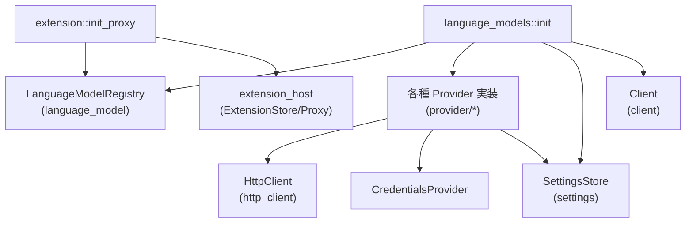
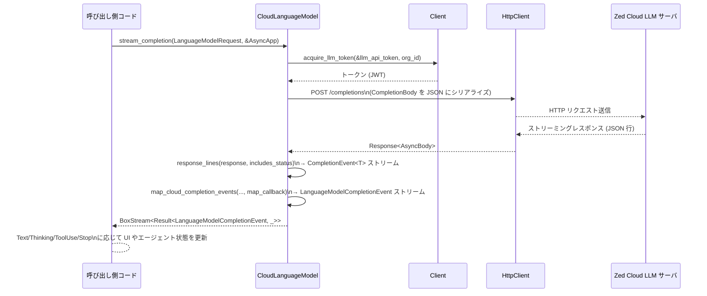

# crates/language_models ディレクトリ

## 1. ざっくり一言

Zed で利用する各種 LLM（Anthropic, OpenAI 互換, Bedrock, Google, DeepSeek, LM Studio, Zed Cloud, Copilot Chat など）を、共通インターフェース `LanguageModel` / `LanguageModelProvider` でまとめて登録・利用できるようにするクレートです。  
API キーや認証方式、モデル一覧、ストリーミングレスポンスをプロバイダごとに吸収し、エディタ側からは同じイベント形式で扱えるようにしています。

---

## 2. このモジュールの役割

### 2.1 概要

- このクレートは **複数の LLM プロバイダを統合管理** する役割を持ちます。
- 具体的には:
  - `LanguageModelRegistry` に対して、Zed Cloud / 各種 SaaS / ローカルサーバ（LM Studio 等）のプロバイダを登録する初期化ロジック
  - プロバイダごとの API キー・エンドポイント・利用モデル一覧の管理
  - 各プロバイダのストリーミングレスポンスを、共通の `LanguageModelCompletionEvent` ストリームへ変換
  - Zed の拡張機構（extension）を通じた、外部 LLM プロバイダの登録・内蔵プロバイダの非表示制御
- 呼び出し側は、`language_model` クレートの抽象インターフェースに対してのみ依存し、プロバイダ固有の HTTP / 認証処理を意識せずに LLM を利用できます。

### 2.2 アーキテクチャ内での位置づけ

主要コンポーネント同士の依存関係を簡略化して示します。



- `language_models::init`  
  - アプリ起動時に呼ばれ、`LanguageModelRegistry` に全ての組み込みプロバイダを登録します。
  - 設定 (`SettingsStore`) を監視し、OpenAI 互換プロバイダなど動的なプロバイダの追加・削除を同期します。
- `extension::init_proxy`  
  - `extension_host` と `LanguageModelRegistry` を橋渡しするプロキシを登録し、拡張機能から LLM プロバイダを登録できるようにします。
- `provider/*`  
  - 各サービス（Anthropic, Bedrock, Google, DeepSeek, Zed Cloud, Copilot Chat, LM Studio など）ごとに
    - `LanguageModelProvider`（プロバイダ全体）
    - `LanguageModel`（モデル 1 個）
    を実装します。
- `Client` / `HttpClient` / `CredentialsProvider`  
  - HTTP 実行・トークン発行・資格情報の保存/読み出しを担当し、各 provider から利用されます。

### 2.3 設計上のポイント

コードから読み取れる主な設計方針は次の通りです。

- **インターフェース駆動**  
  - プロバイダはすべて `LanguageModelProvider` / `LanguageModel` トレイト実装として提供され、`LanguageModelRegistry` から一様に扱われます。
- **ストリーミング指向**  
  - ほぼすべてのモデルが `stream_completion` をサポートしており、
    `LanguageModelCompletionEvent`（Text / Thinking / ToolUse / UsageUpdate / Stop など）のストリームに正規化されます。
- **認証と設定の分離**
  - API キーや URL は `ApiKeyState` と `CredentialsProvider` によって管理され、UI からの変更や環境変数による設定を統一的に扱います。
  - `SettingsStore` と crate 内の `AllLanguageModelSettings` で、利用可能モデルやエンドポイントを設定できます。
- **プロバイダごとの EventMapper**
  - Anthropic / Bedrock / Google / DeepSeek / LM Studio / Copilot Chat / Zed Cloud など、それぞれ専用の「イベント→共通イベント」変換ロジックを持ちます。
  - ツール呼び出しの途中 JSON など、ストリーミング固有のエッジケースもここで吸収します。
- **レート制限**
  - 各 `LanguageModel` インスタンスは `RateLimiter::new(4)` を持ち、同時リクエスト数を抑制しています。

---

## 3. 主要な機能一覧

このディレクトリが提供する主な機能です。

- レジストリ初期化:
  - `language_models::init` による組み込み LLM プロバイダの一括登録
  - `extension::init_proxy` による拡張機能からの LLM プロバイダ登録サポート
- 設定連動:
  - `SettingsStore` / `AllLanguageModelSettings` と連動したプロバイダ設定（API URL / 利用モデル / 認証方式）の反映
  - OpenAI 互換プロバイダの動的追加・削除
- クラウド経由 LLM:
  - `provider::cloud` による Zed Cloud (Zed AI) 経由での Anthropic / OpenAI / Google / X AI の統合利用
  - 課金状態（Plan）、トライアル判定などの UI 表示
- 直接接続プロバイダ:
  - `provider::anthropic`：Anthropic API（thinking / tools / images / telemetry 含む）
  - `provider::bedrock`：Amazon Bedrock（複数の認証方式・リージョン・ツール・thinking）
  - `provider::google`：Google AI (Gemini)（thinking / tools / images）
  - `provider::deepseek`：DeepSeek API（Reasoner / chat モデルとツール）
  - `provider::lmstudio`：LM Studio ローカルサーバ（ローカル LLM 実行）
  - `provider::mistral`：Mistral API（途中まで確認可能）
  - その他（コードはこのチャンク外）: open_ai, open_router, ollama, vercel, vercel_ai_gateway, x_ai, opencode 等
- Copilot 統合:
  - `provider::copilot_chat` による GitHub Copilot Chat モデルの利用（Anthropic / OpenAI / Google / XAI ベースの複雑なルーティング）
- トークンカウント:
  - 各プロバイダに応じた `count_tokens` 実装（ネイティブ API または `tiktoken_rs` による推定）
- ストリーミングイベント変換:
  - 各 API のストリームを `LanguageModelCompletionEvent` に変換する Mapper 群
    - `AnthropicEventMapper`, `GoogleEventMapper`, `DeepSeekEventMapper`, `LmStudioEventMapper`
    - Bedrock / Copilot Chat / Zed Cloud の各マッピング関数

---

## 4. 関数・構造体の解説

### 4.1 主な型一覧

代表的な公開／外部から利用される型をまとめます。

| 名前 | 種別 | 場所 | 役割 / 用途 |
|------|------|------|-------------|
| `LanguageModelProviderRegistryProxy` | 構造体 | `extension.rs` | extension_host からの LLM プロバイダ登録/解除を `LanguageModelRegistry` に橋渡しするプロキシ |
| `AnthropicLanguageModelProvider` | 構造体 | `provider/anthropic.rs` | Anthropic 向け `LanguageModelProvider` 実装。API キー管理とモデル一覧を担当 |
| `AnthropicModel` | 構造体 | 同上 | 特定 Anthropic モデル（Claude など）を表す `LanguageModel` 実装 |
| `AnthropicEventMapper` | 構造体 | 同上 | Anthropic のストリーミングイベントを `LanguageModelCompletionEvent` に変換 |
| `BedrockLanguageModelProvider` | 構造体 | `provider/bedrock.rs` | Amazon Bedrock 用プロバイダ。認証方式/リージョン/モデル設定などを扱う |
| `BedrockModel` | 構造体 | 同上 | Bedrock の個々のモデルを表す `LanguageModel` 実装 |
| `CloudLanguageModelProvider` | 構造体 | `provider/cloud.rs` | Zed Cloud 経由の LLM プロバイダ。利用可能モデル一覧の取得と登録 |
| `CloudLanguageModel` | 構造体 | 同上 | Zed Cloud 上の 1 つのモデル（上流は Anthropic/OpenAI/Google/X AI） |
| `CopilotChatLanguageModelProvider` | 構造体 | `provider/copilot_chat.rs` | GitHub Copilot Chat 用プロバイダ |
| `CopilotChatLanguageModel` | 構造体 | 同上 | Copilot Chat の具体的なモデルを表す `LanguageModel` |
| `DeepSeekLanguageModelProvider` | 構造体 | `provider/deepseek.rs` | DeepSeek API 用プロバイダ |
| `DeepSeekLanguageModel` | 構造体 | 同上 | DeepSeek モデル（reasoner / chat 等） |
| `DeepSeekEventMapper` | 構造体 | 同上 | DeepSeek のストリームを共通イベントに変換 |
| `GoogleLanguageModelProvider` | 構造体 | `provider/google.rs` | Google AI (Gemini) 用プロバイダ |
| `GoogleLanguageModel` | 構造体 | 同上 | Gemini 系モデルの `LanguageModel` |
| `GoogleEventMapper` | 構造体 | 同上 | Google のレスポンスを共通イベントに変換 |
| `LmStudioLanguageModelProvider` | 構造体 | `provider/lmstudio.rs` | LM Studio ローカルサーバのモデル一覧を取得・登録するプロバイダ |
| `LmStudioLanguageModel` | 構造体 | 同上 | LM Studio 上の 1 モデルを表す `LanguageModel` |
| `LmStudioEventMapper` | 構造体 | 同上 | LM Studio ストリーム→共通イベント変換 |
| `State`（各 provider 内） | 構造体 | 各 provider モジュール | API キーの状態、認証設定、利用可能モデルリスト、設定変更の購読など、プロバイダ固有の内部状態 |
| `*Settings`（例: `AnthropicSettings`, `GoogleSettings` 等） | 構造体 | 各 provider モジュール | `settings.json` 相当から読み込まれる、プロバイダ固有の設定（API URL や追加モデル定義など） |

> `settings.rs` 内の `AllLanguageModelSettings` や詳細設定型の定義は、このチャンクには含まれていませんが、各 provider の `*Settings` を集約するモジュールとして利用されています。

### 4.2 重要な関数詳細（代表 7 件）

#### 4.2.1 `language_models::init(user_store, client, cx)`

```rust
pub fn init(user_store: Entity<UserStore>, client: Arc<Client>, cx: &mut App)
```

**概要**

Zed アプリ起動時に呼び出され、以下を行います。

- 組み込みの LLM プロバイダを `LanguageModelRegistry` に登録
- 拡張機能由来の LLM プロバイダのインストール状況を `LanguageModelRegistry` と同期
- 設定 (`SettingsStore`) に基づく OpenAI 互換プロバイダの登録/解除を行う

**引数**

| 引数名 | 型 | 説明 |
|--------|----|------|
| `user_store` | `Entity<UserStore>` | 現在ユーザーや組織を取得するためのストア |
| `client` | `Arc<Client>` | HTTP クライアント・資格情報・Zed Cloud などのアクセスを提供するオブジェクト |
| `cx` | `&mut App` | gpui のアプリケーションコンテキスト |

**戻り値**

- なし（レジストリや購読が副作用として設定されます）。

**内部処理の流れ**

1. `client.credentials_provider()` から `CredentialsProvider` を取得。
2. `LanguageModelRegistry::global(cx)` でレジストリの `Entity` を取得し、
   `update` 内で `register_language_model_providers(...)` を呼び、全組み込みプロバイダを登録。
3. `extension_host::ExtensionStore::try_global(cx)` が存在すれば:
   - ExtensionStore に対して `cx.subscribe` を行い、以下のイベントを監視:
     - `ExtensionInstalled`：マニフェストに `language_model_providers` が含まれていれば、`registry.extension_installed(...)`
     - `ExtensionUninstalled`：`registry.extension_uninstalled(...)`
     - `ExtensionsUpdated`：拡張一覧から LLM 拡張 ID の集合を作り、`registry.sync_installed_llm_extensions(...)`
   - 現在インストール済みの拡張から、初期の LLM 拡張 ID セットを作り、`sync_installed_llm_extensions` で初期同期。
4. `AllLanguageModelSettings::get_global(cx)` から OpenAI 互換プロバイダの ID を `HashSet<Arc<str>>` として取得。
5. いったん空集合との差分として `register_openai_compatible_providers(...)` を呼び出し、現在の設定に含まれる OpenAI 互換プロバイダを登録。
6. `cx.observe_global::<SettingsStore>` を使って設定変更を監視し、OpenAI 互換プロバイダの ID セットが変化した場合は
   - 差分（消えた ID の unregister、新たに追加された ID の register）を行う。

**Examples（使用例）**

アプリ起動時に LLM を有効化する最小限のコード例です（`user_store` と `client` が既に用意されている前提）。

```rust
use std::sync::Arc;
use client::{Client, UserStore};
use gpui::App;
use language_models::{init as init_language_models, init_extension_proxy};

fn init_llms(user_store: gpui::Entity<UserStore>, client: Arc<Client>, cx: &mut App) {
    // 拡張機能からの LLM 登録プロキシを初期化
    init_extension_proxy(cx);

    // 組み込み + OpenAI 互換プロバイダを LanguageModelRegistry に登録
    init_language_models(user_store, client, cx);
}
```

**Edge cases（エッジケース）**

- `extension_host::ExtensionStore` が存在しない場合:
  - 拡張機能由来の LLM は同期されませんが、組み込みプロバイダの登録は行われます。
- Settings が更新されても OpenAI 互換プロバイダが変わらない場合:
  - 差分が検出されないため何も行われません。

**使用上の注意点**

- `extension_host::init` より前に `init_extension_proxy` を呼び出す必要があります（`extension.rs` 側のコメント参照）。
- `init` は通常 1 回だけ呼び出されることが期待されています。

---

#### 4.2.2 `extension::init_proxy(cx: &mut App)`

```rust
pub fn init_proxy(cx: &mut App)
```

**概要**

拡張ホスト (`ExtensionHostProxy`) に対し、LLM プロバイダ登録用のプロキシを設定し、  
かつ `LanguageModelRegistry` に「拡張がインストールされたらどの内蔵プロバイダを隠すか」という関数を登録します。

**内部処理の流れ**

1. `ExtensionHostProxy::default_global(cx)` で拡張ホストプロキシを取得。
2. `LanguageModelRegistry::global(cx)` を取得し、`update` で
   - `registry.set_builtin_provider_hiding_fn(Box::new(extension_for_builtin_provider))`
   を呼び出す。
   - `extension_for_builtin_provider` は `"anthropic" -> "anthropic"` のような静的マップから拡張 ID を返す関数。
3. `proxy.register_language_model_provider_proxy(LanguageModelProviderRegistryProxy::new(registry))`  
   を呼び、`LanguageModelProviderRegistryProxy` を拡張ホストに登録。

**使用上の注意点**

- ソースコメントにある通り、これは **`extension_host::init` より前に呼ぶ必要があります。**
- `BUILTIN_TO_EXTENSION_MAP` に載っていないプロバイダ ID については、拡張インストール時も内蔵プロバイダは隠されません。

---

#### 4.2.3 `register_language_model_providers(...)`

```rust
fn register_language_model_providers(
    registry: &mut LanguageModelRegistry,
    user_store: Entity<UserStore>,
    client: Arc<Client>,
    credentials_provider: Arc<dyn CredentialsProvider>,
    cx: &mut Context<LanguageModelRegistry>,
)
```

**概要**

組み込みの LLM プロバイダ（Zed Cloud / Anthropic / OpenAI / Bedrock / Google / DeepSeek / LM Studio / Copilot Chat など）を  
`LanguageModelRegistry` に登録します。

**内部処理の流れ（抜粋）**

1. `CloudLanguageModelProvider::new(user_store, client.clone(), cx)` を作成し `registry.register_provider`。
2. `AnthropicLanguageModelProvider::new(...)` など、各プロバイダごとに `Arc::new(...)` あるいは `MistralLanguageModelProvider::global(...)` を呼んで `register_provider`。
3. 殆どのプロバイダは `client.http_client()` と `credentials_provider.clone()` を受け取り、認証を共有します。
4. `CopilotChatLanguageModelProvider::new(cx)` のみ `App` コンテキストから Copilot のグローバル状態を参照します。

**Edge cases**

- 各プロバイダの `new` / `global` 関数内で設定や資格情報の購読を開始するため、ここでまとめて呼ぶことで全プロバイダが一括して有効になります。

**使用上の注意点**

- この関数は `init` 内からのみ呼ばれています。外部コードから直接呼び出す必要はありません。

---

#### 4.2.4 `CloudLanguageModel::stream_completion(...)`

```rust
impl LanguageModel for CloudLanguageModel {
    fn stream_completion(
        &self,
        request: LanguageModelRequest,
        cx: &AsyncApp,
    ) -> BoxFuture<
        'static,
        Result<
            BoxStream<'static, Result<LanguageModelCompletionEvent, LanguageModelCompletionError>>,
            LanguageModelCompletionError,
        >,
    > { /* ... */ }
}
```

**概要**

Zed Cloud 上のモデルに対してストリーミング補完を行い、その結果を  
`LanguageModelCompletionEvent` のストリームとして返します。  
実際には Zed Cloud API に HTTP POST を行い、上流の Anthropic / OpenAI / Google / X AI のイベントを  
それぞれの EventMapper で共通形式に変換します。

**主な引数**

- `request: LanguageModelRequest`  
  - メッセージ履歴、ツール定義、thinking 設定などが含まれます。
- `cx: &AsyncApp`  
  - 非同期 gpui コンテキスト。`Client` から Llm トークンや組織 ID を取得するために使われます。

**内部処理（Anthropic 分岐の例）**

1. `request.thinking_allowed` や `self.model.supports_thinking` に応じて `AnthropicModelMode` を決定。
2. `into_anthropic(...)` で共通リクエストを Anthropic の `Request` 型へ変換。
3. `CompletionBody`（プロバイダ種別 + モデル ID + provider_request JSON）を作成。
4. `self.request_limiter.stream(async move { ... })` 内で:
   - `CloudLanguageModel::perform_llm_completion(...)` を呼び、Zed Cloud へ `/completions` リクエストを送信。
   - レスポンスのボディを `response_lines` で 1 行ずつ読み、`CompletionEvent<T>` にデコード。
   - `AnthropicEventMapper::new().map_event` を `map_cloud_completion_events` に渡し、  
     `LanguageModelCompletionEvent` ストリームに変換。
5. RateLimiter 経由で得られたストリームを `BoxStream` として呼び出し元に返す。

**Errors / Panics**

- Zed Cloud API に使う HTTP ステータスとエラー JSON は `ApiError` と `LanguageModelCompletionError::from` で変換されます。
  - 429, 503 などは `UpstreamProviderError` または `RateLimitExceeded` / `ServerOverloaded` 等に変換（テストが存在）。
  - `StatusCode::PAYMENT_REQUIRED` は `PaymentRequiredError` として `anyhow::Error` 経由で返却。

**Edge cases**

- ストリームの最後に `CompletionRequestStatus::StreamEnded` が送られない場合、  
  `LanguageModelCompletionError::StreamEndedUnexpectedly` が返されるようになっています。
- thinking をサポートしないモデルに対して `thinking_allowed` が真でも、  
  プロバイダ側の分岐で thinking 設定は無視されます。

**使用上の注意点**

- 呼び出し側は `BoxStream<Result<LanguageModelCompletionEvent, ...>>` を逐次読み取り、  
  `Text` / `Thinking` / `ToolUse` / `Stop` イベントに応じて UI を更新する必要があります。
- 同一 `CloudLanguageModel` インスタンスで最大 4 並行ストリームに制限されます（`RateLimiter::new(4)`）。

---

#### 4.2.5 `AnthropicModel::stream_completion(...)`

```rust
impl AnthropicModel {
    fn stream_completion(
        &self,
        request: anthropic::Request,
        cx: &AsyncApp,
    ) -> BoxFuture<
        'static,
        Result<
            BoxStream<'static, Result<anthropic::Event, AnthropicError>>,
            LanguageModelCompletionError,
        >,
    > { /* ... */ }
}

impl LanguageModel for AnthropicModel {
    fn stream_completion(
        &self,
        request: LanguageModelRequest,
        cx: &AsyncApp,
    ) -> BoxFuture<
        'static,
        Result<
            BoxStream<'static, Result<LanguageModelCompletionEvent, LanguageModelCompletionError>>,
            LanguageModelCompletionError,
        >,
    > { /* ... */ }
}
```

**概要**

- 前者: Anthropic の `Request` を受け取り、Anthropic API からの `Event` ストリームを返す低レベル関数。
- 後者: 共通の `LanguageModelRequest` を受け取り、
  - `into_anthropic` で変換
  - `AnthropicEventMapper` で `LanguageModelCompletionEvent` に変換  
  する高レベル実装です。

**内部処理のポイント**

- `state.read_with` で API URL と API キーを取得。存在しない場合は `LanguageModelCompletionError::NoApiKey`。
- `anthropic::stream_completion` を呼び出してストリームを開始。
- `RateLimiter::stream` で同時実行数を制限。
- `AnthropicEventMapper::new().map_stream(response)` により
  - `Text` / `Thinking`（署名付き思考）/ `RedactedThinking`
  - `ToolUse`（部分 JSON/完了 JSON / JSON parse error）
  - `UsageUpdate`（トークン使用量）
  - `Stop`（`StopReason` に正規化）
  を生成。

**使用上の注意点**

- `into_anthropic` は `LanguageModelRequest` 内の
  - role が連続するメッセージのマージ
  - 空メッセージのスキップ
  - `cache` フラグが立ったメッセージの最後のコンテンツへ `cache_control` を付与
  を行います。これに依存した挙動を変えたい場合は、この関数の挙動を理解しておく必要があります。

---

#### 4.2.6 `BedrockModel::stream_completion(...)` & `into_bedrock(...)`

```rust
impl BedrockModel {
    fn stream_completion(
        &self,
        request: bedrock::Request,
        cx: &AsyncApp,
    ) -> BoxFuture<
        'static,
        Result<BoxStream<'static, Result<BedrockStreamingResponse, anyhow::Error>>, BedrockError>,
    > { /* ... */ }
}

pub fn into_bedrock(
    request: LanguageModelRequest,
    model: String,
    default_temperature: f32,
    max_output_tokens: u64,
    thinking_mode: BedrockModelMode,
    supports_caching: bool,
    supports_tool_use: bool,
    allow_extended_context: bool,
) -> Result<bedrock::Request> { /* ... */ }
```

**概要**

- `into_bedrock` は共通リクエストを Bedrock API の `Request` に変換します。
- `BedrockModel::stream_completion` は Bedrock Runtime クライアントを初期化し、`bedrock::stream_completion` を呼び出してストリーミング応答を得ます。

**`into_bedrock` の主な処理**

- メッセージ変換:
  - `MessageContent::Text` / `Image` / `Thinking` / `RedactedThinking` / `ToolUse` / `ToolResult` を
    `BedrockInnerContent`（テキスト・画像・思考・ツール呼び出し・ツール結果）へ変換。
  - DeepSeekR1 モデルでは thinking ブロックを API 要件に従い除外。
- thinking 設定:
  - `LanguageModelRequest.thinking_allowed` と `thinking_mode` に応じて
    - `BedrockModelMode::Thinking` → `bedrock::Thinking::Enabled { budget_tokens }`
    - `BedrockModelMode::AdaptiveThinking` → `Adaptive { effort }`
- ツール構成:
  - `supports_tool_use` が true の場合、`request.tools` から `BedrockToolSpec` を生成。
  - メッセージに tool use/result が含まれるが `tools` が空の場合、
    API 要件を満たすためのプレースホルダツール `_placeholder` を追加。
  - キャッシュ対応モデルでは `BedrockTool::CachePoint` を `tool_spec` に追加。
- `tool_choice`:
  - `LanguageModelToolChoice` に応じて `BedrockToolChoice::Auto/Any` を選択。
  - `None` の場合も Auto を使い、レスポンス側で tool call イベントをフィルタ（`deny_tool_use_events`）。

**`BedrockModel::stream_completion` のポイント**

- `get_or_init_client` で AWS SDK の `BedrockClient` を初期化（リージョン / endpoint / 認証方式を `State` から取得）。
- 非同期タスクは `Tokio::spawn` で実行。
- エラー種別（RateLimited / ServiceUnavailable / AccessDenied / InternalServer など）を  
  `LanguageModelCompletionError` に細かくマッピング。

**使用上の注意点**

- Bedrock の認証設定は `AmazonBedrockSettings.authentication_method` や環境変数 `ZED_*` によって変わり、
  UI からの「静的クレデンシャル」と設定による「自動/プロファイル/SSO」が優先順位を持って解決されます。
- メッセージにツール利用履歴を含める場合、`tools` が空だと API エラーになるため、  
  この関数内でプレースホルダツールが追加される仕様を理解しておく必要があります。

---

#### 4.2.7 `GoogleEventMapper::map_stream(...)` / `map_event(...)`

```rust
pub struct GoogleEventMapper {
    usage: UsageMetadata,
    stop_reason: StopReason,
}

impl GoogleEventMapper {
    pub fn map_stream(
        mut self,
        events: Pin<Box<dyn Send + Stream<Item = Result<GenerateContentResponse>>>>,
    ) -> impl Stream<Item = Result<LanguageModelCompletionEvent, LanguageModelCompletionError>> { .. }

    pub fn map_event(
        &mut self,
        event: GenerateContentResponse,
    ) -> Vec<Result<LanguageModelCompletionEvent, LanguageModelCompletionError>> { .. }
}
```

**概要**

Google AI (Gemini) の `GenerateContentResponse` ストリームを、  
`LanguageModelCompletionEvent` ストリームへ変換します。

**主な変換ルール**

- `usage_metadata` → `TokenUsage` に変換し、`UsageUpdate` イベントとして流す。
- `prompt_feedback.block_reason` がある場合:
  - `SAFETY` / `BLOCKLIST` / `PROHIBITED_CONTENT` など → `StopReason::Refusal` + `Stop` イベントを即時返却。
- `candidates[*].finish_reason`:
  - `"STOP"` → `StopReason::EndTurn`
  - `"MAX_TOKENS"` → `StopReason::MaxTokens`
- 各 `Part`:
  - `TextPart` → `Text` イベント
  - `FunctionCallPart` → `ToolUse` イベント
    - `function_call.name` / `args` をそのまま利用
    - `thought_signature` は空文字列の場合 `None` に正規化
  - `ThoughtPart` → `Thinking` イベント（ここでは暗号化された思考として、テキストは固定文言）

**Edge cases**

- 「ツールを呼びたい」ケースでも `finish_reason: STOP` が返るため、  
  `wants_to_use_tool` フラグを立てて `StopReason::ToolUse` に書き換えています。
- ツール呼び出しの並列（複数 `FunctionCallPart`）にも対応しており、テストでシグネチャが保持されることが検証されています。

**使用上の注意点**

- `ToolUse` イベントには `LanguageModelToolUseId` を自動生成しており、
  この ID とツール引数 JSON を次のリクエストに含めることで「round-trip」させる設計になっています。
- `Thinking` イベントのテキストは実際の思考内容ではなく、現状プレースホルダ文字列になっています（コメントで TODO が示されています）。

---

### 4.3 その他の関数・ユーティリティ

主要な補助関数・マッパーの一部です（詳細実装は上記のメイン関数と同じパターンに従っています）。

| 関数名 | 場所 | 役割（1 行） |
|--------|------|--------------|
| `extension_for_builtin_provider` | `extension.rs` | 内蔵プロバイダ ID から、同名の拡張 ID を返し「どの拡張が内蔵を隠すべきか」を決定 |
| `into_anthropic` | `provider/anthropic.rs` | `LanguageModelRequest` → Anthropic `Request` 変換（thinking / tools / cache_control を含む） |
| `count_anthropic_tokens_with_tiktoken` | 同上 | Anthropic 系モデルのトークン数を tiktoken で近似計算 |
| `get_bedrock_tokens` | `provider/bedrock.rs` | Bedrock モデルのトークン数を tiktoken (GPT‑4 トークナイザ) で近似 |
| `map_to_language_model_completion_events` | `provider/bedrock.rs` | Bedrock ストリーム → 共通イベントストリーム変換 |
| `map_cloud_completion_events` | `provider/cloud.rs` | Zed Cloud の `CompletionEvent<T>` ストリームを共通イベントへ変換 |
| `response_lines` | `provider/cloud.rs` | HTTP ストリームを 1 行ごとの JSON に分割するヘルパ |
| `collect_tiktoken_messages` | `provider/copilot_chat.rs` | `LanguageModelRequest` を tiktoken 用メッセージ列に変換 |
| `into_copilot_chat` / `into_copilot_responses` | 同上 | 共通リクエストを Copilot Chat / responses API 形式へ変換 |
| `into_deepseek` | `provider/deepseek.rs` | DeepSeek API 用リクエスト変換。reasoning_content やツール呼び出しを DeepSeek 形式に整形 |
| `into_google` | `provider/google.rs` | 共通リクエストを Google AI の `GenerateContentRequest` に変換 |
| `count_google_tokens` | 同上 | Google モデル向けトークン数を tiktoken で近似 |
| `parse_tool_arguments` | `provider/util.rs` | ツール呼び出しの JSON 文字列を `serde_json::Value` にパース（失敗時はエラーで通知） |
| `fix_streamed_json` | 同上 | ストリーミング中の不完全な JSON を、パース可能な JSON へ補正するユーティリティ |

---

## 5. データフロー

### 5.1 代表シナリオ：Zed Cloud 経由のストリーミング補完

Zed Cloud 上のモデル（例: Anthropic ベース）でストリーミング補完を行う場合の主な流れです。

1. 呼び出し側コードが `Arc<CloudLanguageModel>` を（`LanguageModelRegistry` を通じて）取得する。
2. `CloudLanguageModel::stream_completion(request, cx)` を呼び出す。
3. 内部で `CompletionBody` を構築し、`perform_llm_completion` を通じて Zed Cloud API (`/completions`) に POST。
4. サーバは上流プロバイダ（Anthropic 等）にリクエストを転送し、ストリーミングレスポンスを行単位で返す。
5. クライアント側は `response_lines` で 1 行ごとに `CompletionEvent<T>` としてデコードし、  
   `map_cloud_completion_events` と各プロバイダ EventMapper で `LanguageModelCompletionEvent` に変換する。



この流れは、Anthropic / OpenAI / Google / X AI いずれの上流プロバイダでも同じで、  
`map_callback` 内で使う EventMapper の種類だけが異なります。

---

## 6. 使い方（How to Use）

### 6.1 基本的な使用方法

#### 6.1.1 初期化（アプリ起動時）

アプリケーション起動時に、内蔵プロバイダと拡張プロバイダを有効にする例です。

```rust
use std::sync::Arc;
use client::{Client, UserStore};
use gpui::{App, Entity};
use language_models::{init as init_language_models, init_extension_proxy};

fn init_llms(user_store: Entity<UserStore>, client: Arc<Client>, cx: &mut App) {
    // 拡張機能からの LLM プロバイダ登録プロキシをセットアップ
    init_extension_proxy(cx);

    // 組み込みプロバイダおよび OpenAI 互換プロバイダを登録
    init_language_models(user_store, client, cx);
}
```

この初期化の後、他のモジュールが `LanguageModelRegistry` からプロバイダやモデルを取得して  
`LanguageModel::stream_completion` / `count_tokens` を呼び出す前提になっています  
（レジストリからの取得方法はこのチャンクには現れません）。

#### 6.1.2 モデルに対するストリーミング補完呼び出し

`Arc<dyn LanguageModel>` をすでに持っている前提で、ストリーミング補完を行う例です。

```rust
use std::sync::Arc;
use futures::StreamExt;
use gpui::AsyncApp;
use language_model::{
    LanguageModel, LanguageModelRequest, LanguageModelRequestMessage,
    MessageContent, Role, LanguageModelCompletionEvent,
};

// `model` は CloudLanguageModel や AnthropicModel などの Arc<dyn LanguageModel>
async fn run_completion(model: Arc<dyn LanguageModel>, app: &AsyncApp) {
    // 入力メッセージを構築
    let request = LanguageModelRequest {
        messages: vec![
            LanguageModelRequestMessage {
                role: Role::User,
                content: vec![MessageContent::Text("Say hello".into())],
                cache: false,
                reasoning_details: None,
            }
        ],
        ..Default::default() // 他のフィールド（tools, thinking_allowed など）はデフォルト
    };

    // ストリーミング補完を開始
    let stream = model
        .stream_completion(request, app)
        .await
        .expect("start streaming")
        .map(|event_result| event_result.expect("event"));

    futures::pin_mut!(stream);
    while let Some(event) = stream.next().await {
        match event {
            LanguageModelCompletionEvent::Text(chunk) => {
                println!("text: {chunk}");
            }
            LanguageModelCompletionEvent::Thinking { text, .. } => {
                println!("thinking: {text}");
            }
            LanguageModelCompletionEvent::ToolUse(tool) => {
                println!("tool use: {} -> {}", tool.name, tool.raw_input);
            }
            LanguageModelCompletionEvent::Stop(reason) => {
                println!("stop: {:?}", reason);
            }
            _ => {}
        }
    }
}
```

### 6.2 よくある使用パターン

#### 6.2.1 API キーの設定方法（環境変数 vs UI）

各プロバイダは共通して `ApiKeyState` + `EnvVar` を用いた仕組みを持ちます。

- 例: Anthropic
  - 環境変数: `ANTHROPIC_API_KEY`
  - UI: 設定パネルから API キーを入力 → `State::set_api_key(...)` → `CredentialsProvider` 経由で安全なストアに保存
- 例: Google
  - 環境変数: `GEMINI_API_KEY` または `GOOGLE_AI_API_KEY`
- 例: DeepSeek
  - 環境変数: `DEEPSEEK_API_KEY`
- 例: LM Studio
  - 環境変数: `LMSTUDIO_API_KEY`（あれば利用）
  - 接続自体は LM Studio サーバが起動しているかどうか（`get_models` 成功）で判定

UI を使わず環境変数だけで済ませたい場合、対応する環境変数を設定して Zed を再起動すれば、  
ConfigurationView 上に「環境変数で設定されている」というメッセージが表示されます。

#### 6.2.2 thinking（推論モード）の利用

- `LanguageModelRequest` の
  - `thinking_allowed: bool`
  - `thinking_effort: Option<String>`（"low"/"medium"/"high"/"max" 等）
- を設定すると、対応しているモデルではプロバイダ固有の thinking 設定にマッピングされます。
  - Anthropic: `AnthropicModelMode` / `anthropic::Thinking::*`
  - Bedrock: `BedrockModelMode` / `bedrock::Thinking::*`
  - Google: `GoogleModelMode::Thinking` + `ThinkingConfig`
  - Copilot Chat: モデル能力 (`supports_adaptive_thinking` など) に応じて Anthropic リクエストや reasoning 設定を付与

thinking を有効化した場合、イベントとしては

- `LanguageModelCompletionEvent::Thinking { text, signature }`
- `LanguageModelCompletionEvent::RedactedThinking { data }`

が追加で届きます。

#### 6.2.3 ツール呼び出しのストリーミング処理

Anthropic / Bedrock / DeepSeek / LM Studio / Copilot Chat / Google などでは、

- ツール入力 JSON がストリーミングで少しずつ届く
- 各 EventMapper は `fix_streamed_json` を用いて中間状態をパース可能な JSON に補正し、
  - 入力途中 → `is_input_complete: false` の `ToolUse` イベント
  - 完了時 → `is_input_complete: true` の `ToolUse` か `ToolUseJsonParseError`
- というパターンでイベントを出します。

呼び出し側は `ToolUseJsonParseError` を受け取った場合も、  
「ツール入力の JSON が壊れている」というエラーとして扱えます。

### 6.3 使用上の注意点（まとめ）

- **初期化順序**
  - `init_extension_proxy` は `extension_host::init` より前に呼び出す必要があります。
  - `language_models::init` は、`LanguageModelRegistry` が利用される前に一度だけ呼び出します。
- **資格情報の保存場所**
  - 多くの provider は `CredentialsProvider` 経由で安全なストア（キーチェーン等）に資格情報を保存します。
  - 環境変数から読み取った場合、「環境変数から取得したので UI からはリセットできない」ことを UI 上で明示しています（ツールチップなど）。
- **LM Studio / Bedrock のような外部サービス**
  - LM Studio が起動していない場合や、Bedrock の権限が不足している場合は、`AuthenticateError` や `LanguageModelCompletionError` として通知されます。
  - Bedrock はリージョン設定により特定モデルが利用できず、`model identifier is invalid` を含む Validation エラーが
    「そのリージョンでは利用不可」というメッセージに変換されます。
- **ストリームの終端**
  - Cloud 経由のストリームで `StreamEnded` ステータスが届かない場合、`StreamEndedUnexpectedly` エラーになります。
  - 各 EventMapper は最後に必ず `Stop` イベントを出すようなパターンになっているため、
    呼び出し側で `Stop` を見たらストリームを終了するのが前提です。
- **thinking ブロックの扱い**
  - Anthropic や Bedrock では「署名のない thinking ブロック」を API 仕様上無効として削除する実装になっています。  
    メッセージ再送時などに thinking ブロックだけ保持したい場合は、この仕様を踏まえた設計が必要です。

---

## 7. 関連ファイル

このディレクトリと密接に関連するファイル・モジュールです。

| パス / クレート | 役割 / 関係 |
|-----------------|------------|
| `language_models/src/language_models.rs` | 本ディレクトリのエントリポイント。`init` で各プロバイダを `LanguageModelRegistry` に登録し、拡張機能・設定と同期する |
| `language_models/src/extension.rs` | extension_host と `LanguageModelRegistry` の橋渡し（拡張由来 LLM の登録 / 内蔵プロバイダの隠蔽制御） |
| `language_models/src/provider/*.rs` | 各 LLM プロバイダ（Anthropic, Bedrock, Cloud, Copilot Chat, DeepSeek, Google, LM Studio, Mistral, Ollama, OpenAI, OpenRouter, OpenCode, Vercel, X AI など）の実装 |
| `language_models/src/provider/util.rs` | `fix_streamed_json` / `parse_tool_arguments` など、ストリーミングツール入出力の補助ユーティリティ |
| `language_models/src/settings.rs` | `AllLanguageModelSettings` の定義と思われるモジュール。各 provider から `get_global(cx)` を通じて参照されます（詳細はこのチャンクには含まれていません） |
| `crates/language_model`（別クレート） | `LanguageModel` / `LanguageModelProvider` / `LanguageModelRegistry` / `LanguageModelRequest` など、LLM 抽象インターフェースを提供 |
| `crates/client` | `Client` 型を通じて HTTP クライアント、Zed Cloud API、認証トークン管理（`LlmApiToken` など）を提供 |
| `crates/credentials_provider` | API キーや AWS 資格情報などの安全な保存・読み出しを行う |
| `crates/settings` | `SettingsStore` / `Settings` を通じてユーザー設定 (`settings.json` 相当) を管理し、各 provider の設定にも利用される |
| `crates/extension_host` | 拡張機能のインストール状態やイベントを管理し、LLM を提供する拡張との連携に使用される |

> `provider/open_ai.rs` や `provider/ollama.rs` など、一部の provider 実装ファイル本体はこのチャンクには含まれていませんが、  
> 構造や役割はここで説明した他の provider と同様に `LanguageModelProvider` / `LanguageModel` / EventMapper というパターンに沿っていることが読み取れます。
