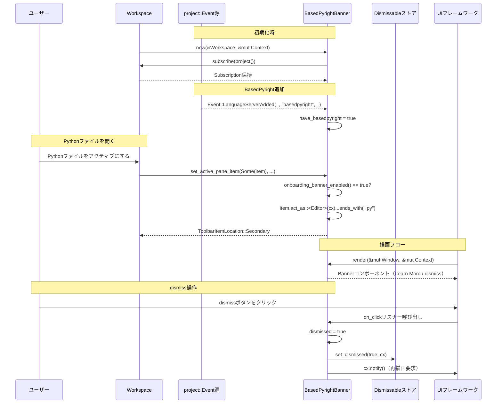

# language_onboarding/

## 1. ざっくり一言

Python 用言語サーバー「BasedPyright」の導入タイミングで、エディタ上部のツールバーにオンボーディング用バナーを表示し、ドキュメントへのリンクと「二度と表示しない」動作を提供する小さな UI モジュールです。

---

## 2. このモジュールの役割

### 2.1 概要

- このクレート（`language_onboarding`）は、Python 言語サーバーの設定変更をユーザーに知らせるための **オンボーディング用バナー** を提供します。
- `BasedPyrightBanner` 型がライブラリ本体で、BasedPyright 言語サーバーが有効になったときに、Python ファイルを開いている場合のみツールバーにバナーを表示します。
- バナーはドキュメントへのリンクボタンと、永続的に非表示にするための「閉じる」アイコンを持ちます。

### 2.2 アーキテクチャ内での位置づけ

このモジュールは、ワークスペースや UI フレームワークと連携して動作します。

- `workspace::Workspace` からプロジェクトイベント（言語サーバー追加）を購読します。
- UI は `gpui` と `ui` クレート（`Banner`, `Button`, `IconButton` など）を用いて構築します。
- ユーザーがバナーを閉じた状態は `db::kvp::Dismissable` を通じて永続化されます。
- ツールバーとの接続は `workspace::ToolbarItemView` を実装することで行われます。

依存関係の概要を Mermaid 図で示します。

```mermaid
graph TD
    subgraph Workspace周辺
        WS["workspace::Workspace"]
        Item["workspace::ItemHandle"]
        TIV["workspace::ToolbarItemView"]
    end

    subgraph UI周辺
        GPUI["gpui::Context<Self> / EventEmitter"]
        UI["ui::Banner / Button / IconButton など"]
        WIN["ui::Window"]
    end

    DB["db::kvp::Dismissable"]
    EDR["editor::Editor"]
    PROJ["project::Event::LanguageServerAdded"]

    BANNER["BasedPyrightBanner"]

    WS -->|project() / Event購読| BANNER
    PROJ -->|LanguageServerAdded| BANNER
    DB -->|dismissed状態の保存/読込| BANNER
    GPUI -->|Context / subscribe / notify| BANNER
    UI -->|描画用コンポーネント| BANNER
    WIN -->|render時に使用| BANNER
    TIV -->|ToolbarItemView実装| BANNER
    Item -->|act_as::<Editor>| BANNER
    EDR -->|target_file_abs_path()| BANNER
```

### 2.3 設計上のポイント

- **状態管理**
  - フラグは 2 つだけです:
    - `dismissed`: ユーザーがバナーを閉じたかどうか（永続化対象）
    - `have_basedpyright`: BasedPyright 言語サーバーが追加されたかどうか（セッション内のみ）
- **イベント駆動**
  - `workspace.project()` に対する購読を通じて `LanguageServerAdded` イベントを受け取り、`have_basedpyright` を更新します。
- **条件付きレンダリング**
  - バナー表示条件を `onboarding_banner_enabled()` に集約し、
    - 「dismiss されていない」
    - 「BasedPyright が存在する」
    - 「アクティブアイテムが Python ファイル」
    の条件を満たすときだけツールバーに表示されるようにしています。
- **永続化**
  - `Dismissable` トレイトのデフォルトメソッドと思われる `Self::dismissed(cx)` / `Self::set_dismissed(..)` により、バナーの表示・非表示状態をストレージに保存します（ストレージの実装詳細はこのチャンクからは分かりません）。

---

## 3. 主要な機能一覧

- BasedPyright 検知: ワークスペースのプロジェクトイベントから `basedpyright` 言語サーバーが追加されたかを検出します。
- オンボーディング・バナー表示:
  - BasedPyright が存在し、ユーザーがまだバナーを dismiss していない場合に、ツールバーにバナーを表示します。
- Python ファイルに限定した表示:
  - アクティブなエディタのファイルパスを調べ、拡張子が `.py` の場合にのみバナーを表示します。
- ドキュメントへのリンク:
  - 「Learn More」ボタンから `https://zed.dev/docs/languages/python` をブラウザで開きます。
- 永続的 dismiss:
  - 閉じるアイコンをクリックすると、バナーが非表示になり、その状態が永続化されます。

---

## 4. 関数・構造体の解説

### 4.1 型一覧

| 名前                 | 種別   | 役割 / 用途 |
|----------------------|--------|-------------|
| `BasedPyrightBanner` | 構造体 | BasedPyright 用オンボーディングバナーを表現し、ツールバーアイテムとして表示制御を行います。 |

#### `BasedPyrightBanner` のフィールド

コードから読み取れるフィールドは次の通りです。

| フィールド名       | 型                    | 説明 |
|--------------------|-----------------------|------|
| `dismissed`        | `bool`                | ユーザーがバナーを dismiss 済みかどうか。`Dismissable` 経由で永続化されます。 |
| `have_basedpyright`| `bool`                | プロジェクト内に BasedPyright 言語サーバーが追加されているかどうか。 |
| `_subscriptions`   | `[Subscription; 1]`   | プロジェクトイベント購読用のサブスクリプション。破棄されないようにフィールドとして保持します。 |

実装しているトレイト:

- `Dismissable`（`db::kvp`）: `KEY` 定数を持ち、dismiss 状態を保存・読み出しするために使われます。
- `EventEmitter<ToolbarItemEvent>`（`gpui`）: ツールバーイベント発火のためのマーカー的トレイトです（このコードでは明示的な発火は行っていません）。
- `Render`（`ui::prelude`）: UI 描画のためのトレイト。`render` メソッドでバナーを構築します。
- `ToolbarItemView`（`workspace`）: ツールバー項目としての挙動（表示位置など）を定義します。

### 4.2 関数詳細

#### `BasedPyrightBanner::new(workspace: &Workspace, cx: &mut Context<Self>) -> Self`

**概要**

- `BasedPyrightBanner` インスタンスを初期化し、プロジェクトの言語サーバー追加イベントを購読して BasedPyright の存在を検知できるようにします。
- 既に dismiss 済みかどうかを永続ストレージから読み込みます。

**引数**

| 引数名      | 型                      | 説明 |
|------------|-------------------------|------|
| `workspace`| `&Workspace`            | 現在のワークスペース。プロジェクトイベントを購読するために使います。 |
| `cx`       | `&mut Context<Self>`    | `gpui` のコンテキスト。イベント購読や永続化 API 呼び出しに使われます。 |

**戻り値**

- `Self` (`BasedPyrightBanner`): 初期化済みのバナーインスタンス。

**内部処理の流れ**

1. `cx.subscribe(workspace.project(), ...)` を呼び出して、プロジェクトのイベントストリームを購読します。
2. イベントハンドラ内で `project::Event::LanguageServerAdded(_, name, _)` をパターンマッチし、`name == "basedpyright"` のときに `this.have_basedpyright = true` にします。
3. `Self::dismissed(cx)` を呼び出して、過去に dismiss されたかどうかを永続ストアから読み込み、`dismissed` フィールドにセットします。
4. `have_basedpyright` を `false`、`_subscriptions` に上記サブスクリプションを格納して構造体を返します。

**Examples（使用例）**

この例は、`Workspace` と `Context` が既に用意されている環境で、`BasedPyrightBanner` を初期化するだけの最小コードです。

```rust
use language_onboarding::BasedPyrightBanner;        // このクレートの型
use workspace::Workspace;                           // ワークスペース型
use gpui::Context;                                  // コンテキスト型

fn init_banner(workspace: &Workspace, cx: &mut Context<BasedPyrightBanner>) {
    // BasedPyright 用オンボーディングバナーを初期化する
    let _banner = BasedPyrightBanner::new(workspace, cx);
    // 実際には、このインスタンスをツールバーに登録する処理が
    // どこか別の場所にあると考えられます（このチャンクには登場しません）。
}
```

**Edge cases（エッジケース）**

- BasedPyright がすでにプロジェクトに追加されている状態でこの関数が呼ばれた場合にどう扱われるかは、`workspace.project()` のイベントストリーム挙動に依存します。
  - このコードだけからは、「過去の `LanguageServerAdded` イベントを再送してくれるか」は分かりません。
- `Self::dismissed(cx)` がどのような条件で `true/false` を返すかの詳細は、このチャンクからは分かりませんが、少なくとも dismiss ボタンが一度押されたかに依存します。

**使用上の注意点**

- `workspace` と `cx` は有効なオブジェクトである必要があります。無効な参照を渡した場合の挙動はこのコードからは分かりません。
- 生成したインスタンスをどこかで保持しないと、`_subscriptions` がドロップされイベント購読が解除される可能性があります（Rust の一般的な挙動として）。

---

#### `BasedPyrightBanner::onboarding_banner_enabled(&self) -> bool`

**概要**

- ユーザーにバナーを表示すべきかどうかを計算する内部ヘルパー関数です。

**引数**

- なし（`&self` のみ）。

**戻り値**

- `bool`: バナーを表示すべきときは `true`、それ以外は `false`。

**内部処理の流れ**

1. `!self.dismissed && self.have_basedpyright` を評価して、その結果を返します。
   - dismiss 済みでないこと。
   - BasedPyright が存在すること。

**Edge cases（エッジケース）**

- `dismissed == true` の場合:
  - `have_basedpyright` がどれだけ変化しても `false` になります（バナーは二度と表示されません）。
- `have_basedpyright == false` の場合:
  - `dismissed` が `false` でも `false` になります（BasedPyright がない間はバナーは表示されません）。

**使用上の注意点**

- 公開関数ではなく内部利用専用です。表示ロジックを一箇所にまとめる役割があります。

---

#### `impl Render for BasedPyrightBanner { fn render(&mut self, _window: &mut Window, cx: &mut Context<Self>) -> impl IntoElement }`

**概要**

- 現在の状態（dismissed / have_basedpyright）に応じて、バナーを描画する UI ツリーを構築します。
- バナー内に「Learn More」ボタンと「閉じる」アイコンボタンを配置します。

**引数**

| 引数名    | 型                     | 説明 |
|----------|------------------------|------|
| `_window`| `&mut Window`          | ウィンドウへの参照。ここでは変数名に `_` が付いており、未使用です。 |
| `cx`     | `&mut Context<Self>`   | UI コンテキスト。URL オープンや dismiss 状態の更新、再描画通知に使用します。 |

**戻り値**

- `impl IntoElement`: `gpui` / `ui` フレームワークが描画できる UI 要素ツリー。実体は `div()` から構築されるコンポーネント群です。

**内部処理の流れ**

1. `div()` を作成し、`.id("basedpyright-banner")` で ID を設定します。
2. `.when(self.onboarding_banner_enabled(), |el| { ... })` により、バナー表示条件を満たすときだけ子要素を追加します。
3. 子要素として `Banner::new()` を追加し、その中に縦並びレイアウト `v_flex()` で 2 つの `Label` を配置します。
   - 1 行目: メインメッセージ
   - 2 行目: 詳細説明（小さい文字、Muted 色）
4. `.action_slot(...)` で右側のアクション領域を構築します。
   - `Button::new("learn-more", "Learn More")`:
     - クリックで `cx.open_url("https://zed.dev/docs/languages/python")` を呼び出します。
   - `IconButton::new("dismiss", IconName::Close)`:
     - クリックで `this.dismissed = true` にし、`Self::set_dismissed(true, cx)` で永続ストレージも更新し、最後に `cx.notify()` で UI に更新を通知します。

**Examples（使用例）**

`render` はフレームワークから呼び出される想定なので、直接呼び出すコード例はあまり実用的ではありませんが、シグネチャに沿ったテスト的な呼び出し例を示します。

```rust
use language_onboarding::BasedPyrightBanner;
use gpui::{Context};
use ui::Window;

fn manual_render(
    banner: &mut BasedPyrightBanner,
    window: &mut Window,
    cx: &mut Context<BasedPyrightBanner>,
) {
    // 現在の状態に対応した UI ツリーを構築する
    let element = banner.render(window, cx);

    // 実際には、この element をフレームワークがウィンドウに描画します。
    // ここでは element を利用する具体的手順はこのチャンクからは分かりません。
    let _ = element;
}
```

**Edge cases（エッジケース）**

- `onboarding_banner_enabled()` が `false` の場合:
  - `div` は作られますが、`.when(...)` によりバナー本体は追加されません。
- dismiss ボタンが押された瞬間:
  - `this.dismissed = true` に更新され、`Self::set_dismissed(true, cx)` で永続化され、`cx.notify()` により再描画がトリガされます。このため次回描画からバナーは表示されません。

**使用上の注意点**

- `cx.open_url(...)` は外部ブラウザなどを開く I/O を伴うため、フレームワーク側の制約（利用可能なスレッドなど）がある場合はそれに従う必要があります（詳細はこのチャンクからは分かりません）。
- dismiss 状態を変更したあと `cx.notify()` を呼び忘れると、UI に変更が反映されない可能性がありますが、このコードではきちんと呼んでいます。

---

#### `impl ToolbarItemView for BasedPyrightBanner { fn set_active_pane_item(&mut self, active_pane_item: Option<&dyn workspace::ItemHandle>, _window: &mut ui::Window, cx: &mut Context<Self>) -> ToolbarItemLocation }`

**概要**

- ツールバー内で、このバナーをどこに表示するか（もしくは非表示にするか）を決定する関数です。
- 主に「アクティブなアイテムが Python ファイルかどうか」に基づいて表示位置を切り替えます。

**引数**

| 引数名            | 型                                  | 説明 |
|------------------|-------------------------------------|------|
| `active_pane_item` | `Option<&dyn workspace::ItemHandle>` | 現在アクティブなペインアイテム。エディタとして振る舞えるかどうかを判定します。 |
| `_window`        | `&mut ui::Window`                   | ウィンドウへの参照。ここでは未使用です。 |
| `cx`             | `&mut Context<Self>`                | `gpui` コンテキスト。`act_as::<Editor>(cx)` などで利用されます。 |

**戻り値**

- `ToolbarItemLocation`:
  - `ToolbarItemLocation::Secondary`: セカンダリ領域にバナーを表示する。
  - `ToolbarItemLocation::Hidden`: ツールバー上では非表示にする。

**内部処理の流れ**

1. `if !self.onboarding_banner_enabled() { return ToolbarItemLocation::Hidden; }`
   - バナー表示条件を満たしていなければ即座に非表示を返します。
2. `active_pane_item` が `Some(item)` の場合のみ、以下の判定を行います。
3. `item.act_as::<Editor>(cx)` を呼び出し、アクティブアイテムを `Editor` として扱えるか試みます。
4. `editor.update(cx, |editor, cx| editor.target_file_abs_path(cx))` でターゲットファイルの絶対パスを取得します。
5. `path.file_name()` が `Some(file_name)` の場合、`file_name.as_encoded_bytes().ends_with(".py".as_bytes())` でファイル名が `.py` で終わるかをチェックします。
6. 上記すべてが成立した場合は `ToolbarItemLocation::Secondary` を返します。
7. いずれかの条件に合致しない場合は `ToolbarItemLocation::Hidden` を返します。

**Examples（使用例）**

以下は、`BasedPyrightBanner` のインスタンスに対して、アクティブペインアイテムに応じて表示位置を問い合わせる例です。

```rust
use language_onboarding::BasedPyrightBanner;
use workspace::{ItemHandle, ToolbarItemLocation};
use gpui::Context;
use ui::Window;

fn update_toolbar_location(
    banner: &mut BasedPyrightBanner,                  // バナーインスタンス
    active_item: Option<&dyn ItemHandle>,             // 現在のアクティブアイテム
    window: &mut Window,                              // ウィンドウ
    cx: &mut Context<BasedPyrightBanner>,             // コンテキスト
) -> ToolbarItemLocation {
    // Python ファイルかつ BasedPyright が有効なら Secondary、
    // それ以外は Hidden が返ってきます。
    banner.set_active_pane_item(active_item, window, cx)
}
```

**Edge cases（エッジケース）**

- `active_pane_item` が `None` の場合:
  - 早期に `ToolbarItemLocation::Hidden` になります。
- `item.act_as::<Editor>(cx)` が `None` の場合:
  - アクティブアイテムがエディタとして扱えないので、Hidden になります。
- `editor.target_file_abs_path(cx)` が `None` を返した場合:
  - ターゲットファイルがない（または取得できない）ため、Hidden になります。
- `file_name` が取得できない場合:
  - Hidden になります。
- 拡張子が `.py` でない場合（たとえば `.pyw`, `.txt` など）:
  - Hidden になります。

**使用上の注意点**

- 拡張子判定は「ファイル名のバイト列が `.py` で終わるかどうか」に基づいており、大文字・小文字違い（`.PY` など）には対応していません。
- Python 用のオンボーディングバナーという意図のため、他言語ファイルでは表示されないのが仕様です。

### 4.3 その他の関数

- このチャンクには、上記以外の明示的な補助関数は存在しません。

---

## 5. データフロー

ここでは、典型的なシナリオとして「BasedPyright が追加され、ユーザーが Python ファイルを開き、バナーを dismiss する」までの流れを説明します。

### シナリオの要点

1. ワークスペースで BasedPyright 言語サーバーが追加される。
2. `BasedPyrightBanner` がそのイベントを受け取り、`have_basedpyright = true` にする。
3. ユーザーが Python ファイルをアクティブにすると、`set_active_pane_item` が呼ばれ、バナーがセカンダリツールバーに表示される。
4. ユーザーがバナー内の「閉じる」アイコンをクリックすると、dismiss 状態が永続化され、バナーは二度と表示されない。

### シーケンス図



---

## 6. 使い方（How to Use）

このクレートは Zed 本体などのアプリケーションから組み込まれることを想定しているように見えますが、このチャンク内には「どこから `BasedPyrightBanner` を生成・登録するか」を示すコードは含まれていません。そのため、ここでは分かる範囲での利用例とパターンを説明します。

### 6.1 基本的な使用方法

開発者がこの型を利用する基本的な流れは次のように整理できます。

1. `Workspace` と `Context<BasedPyrightBanner>` が利用可能なコンテキストで `BasedPyrightBanner::new` を呼び出す。
2. 生成された `BasedPyrightBanner` をツールバーのアイテムとして登録する（具体的な登録方法はこのチャンクからは分かりませんが、`ToolbarItemView` 実装を利用するはずです）。
3. 以降、フレームワークが
   - プロジェクトの `LanguageServerAdded` イベントを流し込み、
   - アクティブペイン変更時に `set_active_pane_item` を呼び、
   - 描画時に `render` を呼び出す、
   ような形で動作します。

基本的な初期化コード例:

```rust
use language_onboarding::BasedPyrightBanner;
use workspace::Workspace;
use gpui::Context;

fn setup_python_onboarding(
    workspace: &Workspace,                           // 既存のワークスペース
    cx: &mut Context<BasedPyrightBanner>,            // バナー用コンテキスト
) -> BasedPyrightBanner {
    // BasedPyright 用オンボーディングバナーを生成する
    let banner = BasedPyrightBanner::new(workspace, cx);

    // 実際には、ここでツールバーへの登録などを行う必要がありますが、
    // その API はこのチャンクには登場しないため不明です。

    banner
}
```

### 6.2 よくある使用パターン

コードから読み取れる代表的なパターンは「条件付き表示」です。

1. **BasedPyright 有無に応じた表示**
   - `LanguageServerAdded(_, "basedpyright", _)` イベントを受け取るまで `have_basedpyright` は `false` であり、バナーは表示されません。
   - BasedPyright が追加された後、ユーザーが Python ファイルをアクティブにすると初めてバナーが表示されます。

2. **Python ファイル限定の表示**
   - `set_active_pane_item` 内では `.py` 拡張子を持つファイルのみを対象にしています。
   - そのため、ユーザーが JavaScript や他の言語ファイルを開いてもバナーは表示されず、Python ファイルに切り替えたときだけ表示されます。

3. **一度だけのオンボーディング**
   - dismiss ボタンを押すと `dismissed = true` になり、`set_dismissed(true, cx)` で永続化されます。
   - 以降のセッションでも `Self::dismissed(cx)` が `true` を返すため、バナーは表示されません。

### 6.3 使用上の注意点（まとめ）

- **dismiss 状態の永続化**
  - 一度 dismiss すると `dismissed` が永続的に `true` になります。
  - これをユーザーに再度表示したい場合は、どこかで `Dismissable` のキー `basedpyright-banner` に対応するストアをリセットする必要がありそうですが、その方法はこのチャンクからは分かりません。

- **拡張子判定**
  - `.py` のみを対象としているため、たとえば `.pyw` などの別拡張子の Python スクリプトには自動的には適用されません。
  - 大文字拡張子（`.PY`）への対応も行っていません。

- **言語サーバー名のハードコーディング**
  - イベント名の比較はリテラル `"basedpyright"` に対して行っています。
  - プロジェクト側で言語サーバー名が変更されると、このバナーが機能しなくなる可能性があります。

- **ライフタイムとサブスクリプション**
  - `_subscriptions` フィールドにサブスクリプションを保持しているため、`BasedPyrightBanner` インスタンスをドロップするとイベント購読も解除されます。
  - バナーを期待通り動かすには、ワークスペースと同じくらい長生きする場所にインスタンスを保持する必要があります（一般的な設計として）。

---

## 7. 関連ファイル

このディレクトリに含まれるファイルと、その役割をまとめます。

| パス                                   | 役割 / 関係 |
|----------------------------------------|------------|
| `language_onboarding/Cargo.toml`       | クレートのメタデータと依存関係を定義します。ライブラリのエントリポイントとして `src/python.rs` を指定しています（`[lib] path = "src/python.rs"`）。 |
| `language_onboarding/src/python.rs`    | クレート本体。`BasedPyrightBanner` 型を定義し、Python 用オンボーディングバナーの UI と表示ロジックを実装しています。 |

外部クレート（依存先）としては次のものが登場します。

| 依存クレート / モジュール | 用途 |
|---------------------------|------|
| `db::kvp::Dismissable`    | バナーの dismiss 状態の永続化。`KEY` 定数と `dismissed` / `set_dismissed` メソッドを提供していると解釈できます。 |
| `editor::Editor`          | アクティブペインアイテムが「エディタ」として振る舞えるかの判定と、ファイルパスの取得に使用します。 |
| `gpui::{Context, EventEmitter, Subscription}` | UI フレームワークのコンテキストとイベント購読、イベントエミッタの基盤として利用されます。 |
| `ui::{Banner, FluentBuilder as _, prelude::*}` | バナーやボタン、レイアウト（`v_flex`, `h_flex`）など、実際の UI コンポーネントを構築するために使用します。 |
| `workspace::{ToolbarItemEvent, ToolbarItemLocation, ToolbarItemView, Workspace}` | ツールバーアイテムとしてのインターフェースと、ワークスペース・プロジェクトへのアクセスに使用します。 |
| `project`（`project::Event::LanguageServerAdded`） | 言語サーバーが追加されたことを知らせるイベントの型として使用されます。 |

これら外部クレートの詳細実装はこのチャンクには含まれていないため、ここではインターフェースレベルでの関係のみを説明しています。
