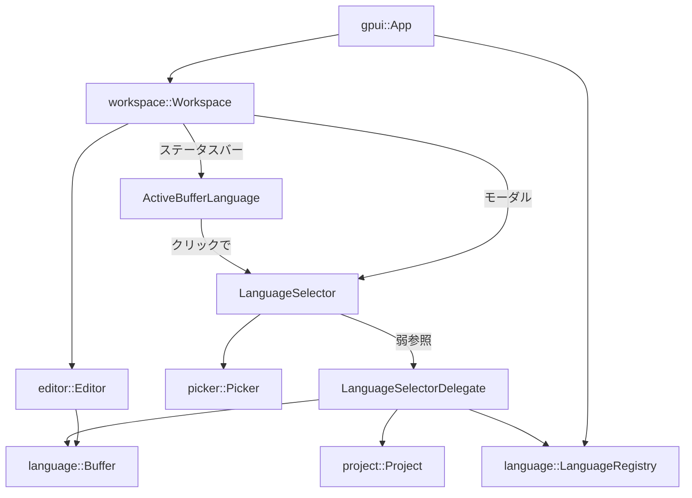
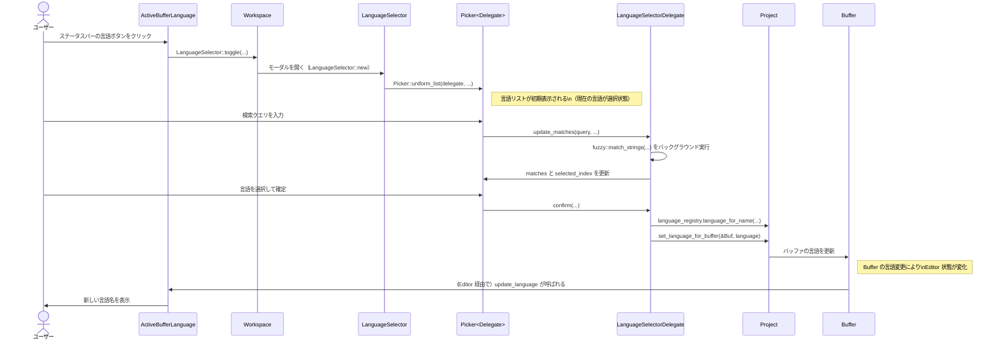

# language_selector/ ディレクトリ解説

## 1. ざっくり一言

- Zed エディタの **アクティブなバッファの言語を表示・変更** するためのクレートです。
- ステータスバーの言語ボタン（`ActiveBufferLanguage`）と、言語を検索・選択するモーダル（`LanguageSelector`）を提供します。

---

## 2. このモジュールの役割

### 2.1 概要

- このクレートは、アクティブなエディタバッファに対して **言語（シンタックス）をユーザーが手動で選択・変更** できる仕組みを提供します。
- 役割は大きく 2 つに分かれます。
  - ステータスバーに現在の言語名（または Unknown）を表示し、クリックでモーダルを開く `ActiveBufferLanguage`
  - 登録されている全言語を fuzzy search し、選択した言語をバッファに適用する `LanguageSelector` + `LanguageSelectorDelegate`

### 2.2 アーキテクチャ内での位置づけ

このディレクトリ内には、次の 2 つの UI コンポーネントがあります。

- `ActiveBufferLanguage`: `workspace::StatusItemView` を実装したステータスバー項目
- `LanguageSelector`: `workspace::ModalView` を実装したモーダルダイアログ

これらは `workspace` / `editor` / `language` / `project` など他クレートと連携して動作します。

主要な依存関係を簡略化すると次のようになります。



### 2.3 設計上のポイント

コードから読み取れる主な特徴は次のとおりです。

- **責務の分割**
  - ステータスバー表示とクリックハンドリングは `ActiveBufferLanguage`
  - 言語の一覧表示・検索・選択処理は `LanguageSelectorDelegate`
  - モーダルのラッピングとフォーカス管理は `LanguageSelector`
- **状態管理**
  - `ActiveBufferLanguage` は現在のアクティブエディタの言語を **三値** で管理します（未初期化 / 言語なし / 言語あり）。
  - `LanguageSelectorDelegate` は言語候補とマッチ結果、選択中インデックスなど UI 状態を保持します。
- **エラーハンドリング**
  - 非同期で言語を適用する部分（`confirm`）は `anyhow::Result` を返し、`.detach_and_log_err(cx)` でログを残す方針になっています。
  - `WeakEntity` を使い、`Project` や `Buffer` が破棄されていた場合は `context("... was dropped")` 付きのエラーとして扱います。
- **非同期・バックグラウンド処理**
  - fuzzy search（`match_strings`）は `cx.background_executor()` を使ってバックグラウンドで実行し、完了後に UI スレッドへ結果を反映します。

---

## 3. 主要な機能一覧

このクレートが提供する主な機能を箇条書きでまとめます。

- **アクティブバッファの言語表示**
  - `ActiveBufferLanguage` がステータスバーに現在の言語名（または `Unknown`）を表示します。
- **ステータスバーからの言語変更**
  - 言語名ラベルをクリックすると `LanguageSelector` モーダルが開きます。
- **言語リストの構築**
  - `LanguageRegistry::language_names()` を元に、`hidden()` で隠されていない言語のみを候補にします。
- **fuzzy search による言語絞り込み**
  - `fuzzy::match_strings` を使い、入力クエリに応じて候補言語をスコア付け・フィルタリングします。
- **現在の言語のハイライト選択**
  - クエリ未入力時は、アクティブバッファの現在の言語をリストの選択状態として反映します。
- **アイコン付き表示**
  - `file_icons::FileIcons` と `LanguageMatcher::path_suffixes` から、言語ごとのファイルアイコンを取得して表示します（設定で有効な場合）。
- **言語の適用**
  - 選択された言語は `Project::set_language_for_buffer` を通して対象 `Buffer` に適用されます。

---

## 4. 関数・構造体の解説

### 4.1 型一覧

| 名前 | 種別 | 役割 / 用途 |
|------|------|-------------|
| `LanguageSelector` | 構造体 | 言語選択モーダル本体。内部に `Picker<LanguageSelectorDelegate>` を保持し、`ModalView` を実装します。 |
| `LanguageSelectorDelegate` | 構造体 | `PickerDelegate` の実装。言語候補リスト、マッチ結果、選択中インデックスなどモーダルのロジックを担当します。 |
| `ActiveBufferLanguage` | 構造体 | ステータスバーに表示される「現在の言語」ボタン。クリックで `LanguageSelector` を開きます。 |
| `Toggle` | アクション型（マクロ生成） | `language_selector::Toggle` アクション。ワークスペースから言語セレクタの開閉に使われます。 |

補助的な型（`StringMatch`, `StringMatchCandidate` など）は `fuzzy` クレート由来であり、このクレート内では主にデータ保持と UI 表示のために利用されています。

---

### 4.2 重要な関数・メソッド詳細（最大 7 件）

#### `init(cx: &mut App)`

**概要**

- アプリケーション起動時に呼び出される初期化関数です。
- 新しく作成される `Workspace` に対して、`LanguageSelector` のアクション登録（`Toggle`）を自動的に行う監視をセットします。

**引数**

| 引数名 | 型 | 説明 |
|--------|----|------|
| `cx` | `&mut App` | gpui アプリケーションコンテキスト。新規 `Workspace` を監視するために使われます。 |

**戻り値**

- ありません（`()`）。

**内部処理の流れ**

1. `cx.observe_new(LanguageSelector::register)` を呼び出します。
2. 新しい `Workspace` が生成されるたびに、`LanguageSelector::register` が呼び出されます。
3. `.detach()` で戻り値のサブスクリプションを破棄し、監視を継続させます。

**Examples（使用例）**

テストコードでは、アプリ初期化時に次のように呼び出されています。

```rust
fn init_test(cx: &mut TestAppContext) -> Arc<AppState> {
    cx.update(|cx| {
        let app_state = AppState::test(cx); // AppState のテスト用初期化
        settings::init(cx);                 // 設定の初期化
        super::init(cx);                    // ← 言語セレクタの初期化
        editor::init(cx);                   // エディタの初期化
        app_state
    })
}
```

**使用上の注意点**

- `init` はアプリケーションの起動時やテストセットアップ時に **一度だけ** 呼ばれることを前提としているように見えます（コード上の制約はありませんが、複数回呼び出す意味は特にありません）。

---

#### `LanguageSelector::toggle(workspace: &mut Workspace, window: &mut Window, cx: &mut Context<Workspace>) -> Option<()>`

**概要**

- 現在アクティブなエディタバッファを対象に、言語セレクタモーダルを開閉します。
- モーダルを開く際に、対象バッファ・プロジェクト・言語レジストリを `LanguageSelector` に渡します。

**引数**

| 引数名 | 型 | 説明 |
|--------|----|------|
| `workspace` | `&mut Workspace` | アクティブなワークスペース。アクティブアイテムやモーダルの表示に使用します。 |
| `window` | `&mut Window` | 現在のウィンドウ。モーダルの描画に使用します。 |
| `cx` | `&mut Context<Workspace>` | `Workspace` 用の gpui コンテキスト。 |

**戻り値**

- `Option<()>`  
  - アクティブなエディタバッファが存在しない場合は `None` を返します。
  - モーダルのトグル操作が行われた場合は `Some(())` を返します。

**内部処理の流れ**

1. `workspace.app_state().languages.clone()` から `LanguageRegistry` を取得します。
2. `workspace.active_item(cx)?` でアクティブアイテムを取得し、`act_as::<Editor>(cx)?` によりエディタとして扱えるか確認します。
3. エディタから `active_buffer(cx)?` を取得し、対象バッファを特定します。
4. `workspace.project().clone()` で `Project` を取得します。
5. `workspace.toggle_modal(window, cx, ...)` を呼び出し、モーダルを開閉します。
   - モーダル生成時に `LanguageSelector::new(buffer, project, registry, window, cx)` が呼ばれます。

**Examples（使用例）**

テストコードでは、`Toggle` アクションをディスパッチすることで間接的に呼び出されています。

```rust
fn open_selector(
    workspace: &Entity<Workspace>,
    cx: &mut VisualTestContext,
) -> Entity<Picker<LanguageSelectorDelegate>> {
    cx.dispatch_action(Toggle); // ← Toggle アクションを送る
    cx.run_until_parked();      // 非同期イベント処理

    active_picker(workspace, cx) // モーダル内の Picker を取得
}
```

**Errors / Panics**

- `?` 演算子により、以下の場合は即座に `None` を返します。
  - アクティブアイテムが存在しない。
  - アクティブアイテムを `Editor` として扱えない。
  - アクティブエディタにアクティブバッファがない。

**Edge cases（エッジケース）**

- **アクティブエディタがない**: `active_item(cx)` が `None` の場合、モーダルは開かれません。
- **アクティブアイテムがエディタではない**: `.act_as::<Editor>(cx)` が失敗した場合も同様です。
- **エディタにアクティブバッファがない**: `active_buffer(cx)` が `None` の場合もモーダルは開かれません。

**使用上の注意点**

- `Toggle` アクションはこの関数にバインドされているため、キーバインドやメニューから呼び出す場合は `Toggle` に紐づけることが前提になります（紐づけ方法自体はこのチャンクには現れていません）。

---

#### `LanguageSelectorDelegate::new( ... ) -> Self`

```rust
fn new(
    language_selector: WeakEntity<LanguageSelector>,
    buffer: Entity<Buffer>,
    project: Entity<Project>,
    language_registry: Arc<LanguageRegistry>,
    current_language_name: Option<String>,
) -> Self
```

**概要**

- 言語選択モーダルのロジック部分（`PickerDelegate`）のインスタンスを構築します。
- 利用可能な言語を列挙し、現在の言語がどの候補に対応するかを特定します。

**引数**

| 引数名 | 型 | 説明 |
|--------|----|------|
| `language_selector` | `WeakEntity<LanguageSelector>` | 親モーダルへの弱参照。モーダルの閉じるイベント発火に使います。 |
| `buffer` | `Entity<Buffer>` | 言語を適用する対象バッファ。 |
| `project` | `Entity<Project>` | 対象バッファを管理するプロジェクト。言語の適用に使用します。 |
| `language_registry` | `Arc<LanguageRegistry>` | 利用可能な言語のレジストリ。候補リスト構築に使用します。 |
| `current_language_name` | `Option<String>` | 現在のバッファに設定されている言語名（なければ `None`）。 |

**戻り値**

- `LanguageSelectorDelegate` の新しいインスタンス。

**内部処理の流れ**

1. `language_registry.language_names()` で名前一覧を取得します。
2. 各名前に対して `available_language_for_name` を呼び、
   - `hidden()` が `false` の言語だけを候補に採用します。
3. 採用した言語名に対して、`StringMatchCandidate::new(candidate_id, name.as_ref())` を生成し、`candidates` ベクタに格納します。
4. `current_language_name` が与えられていれば、
   - `candidates.iter().position(|candidate| candidate.string == *name)` で、対応するインデックスを `current_language_candidate_index` に保存します。
5. `selected_index` は、
   - 現在の言語候補が見つかった場合はそのインデックス、
   - そうでなければ `0` に初期化されます。

**Edge cases（エッジケース）**

- **現在の言語が候補に存在しない**:
  - 例えば `current_language_name` が空文字だったり、`hidden()` な言語だった場合などは、`current_language_candidate_index` は `None` になります。
  - その場合、`selected_index` は 0 となり、リスト先頭が選択されます。
- **言語レジストリが空**:
  - コード上はそのまま空の `candidates` ベクタができます。
  - その後の動作（空リストでの UI）は、このチャンクからは分かりませんが、`update_matches` 側で `matches.is_empty()` を考慮した処理があります。

**使用上の注意点**

- `language_registry` に使いたい言語が事前に登録されている必要があります（テストでは `register_test_languages` で登録しています）。

---

#### `LanguageSelectorDelegate::update_matches(&mut self, query: String, window: &mut Window, cx: &mut Context<Picker<Self>>) -> gpui::Task<()>`

**概要**

- ユーザーの入力クエリに応じて、言語候補に対するマッチ結果（`matches`）を更新します。
- クエリが空のときは全候補をリストし、現在の言語を選択状態にします。
- クエリがある場合は fuzzy search をバックグラウンドで実行します。

**引数**

| 引数名 | 型 | 説明 |
|--------|----|------|
| `query` | `String` | ユーザーが入力した検索クエリ。 |
| `window` | `&mut Window` | ウィンドウコンテキスト。非同期タスクの実行に必要です。 |
| `cx` | `&mut Context<Picker<Self>>` | `Picker` 用 gpui コンテキスト。背景実行や状態更新に使用します。 |

**戻り値**

- `gpui::Task<()>`  
  - 実際のマッチ処理は非同期で行われ、このタスクが完了すると UI が更新されます。

**内部処理の流れ**

1. `let background = cx.background_executor().clone();` でバックグラウンド executor を取得します。
2. `candidates` と `query_is_empty` をローカルにコピーします。
3. `cx.spawn_in(window, async move |this, cx| { ... })` で非同期処理を開始します。
4. 非同期ブロック内で:
   - `query_is_empty` なら
     - 全候補を `matches` にコピーし、`score` は `0.0`、`positions` は空ベクタに設定します。
   - そうでなければ
     - `match_strings(&candidates, &query, false, true, 100, &Default::default(), background).await` を呼び出します。
5. 取得した `matches` を `this.update_in(cx, |this, window, cx| { ... })` の中で UI に反映します。
   - `matches.is_empty()` の場合:
     - `this.delegate.matches = matches;`
     - `this.delegate.selected_index = 0;`
   - `matches` が非空の場合:
     - クエリが空なら、現在の言語候補（`current_language_candidate_index`）に対応するマッチを選択インデックスとします。
     - クエリが非空なら、常に `selected_index = 0` とします。
   - `this.set_selected_index(selected_index, None, false, window, cx);`
   - `cx.notify();` で UI に再描画を通知します。

**Examples（使用例）**

テスト中の一部の流れは次のようになっています。

```rust
picker.update_in(cx, |picker, window, cx| {
    picker.update_matches("ru".to_string(), window, cx) // クエリ "ru" で更新
});
cx.run_until_parked(); // 非同期タスクが完了するまで回す

picker.read_with(cx, |picker, _| {
    assert!(picker.delegate.matches.len() > 1);
    assert_eq!(picker.delegate.selected_index, 0); // 先頭が選択されている
});
```

**Edge cases（エッジケース）**

- **クエリが空**:
  - すべての候補がマッチとしてリストされ、現在言語が候補に存在すればそれが選択されます。
  - 現在言語が存在しなければ、最初の候補（インデックス 0）が選択されます。
- **マッチ結果が空**:
  - `matches.is_empty()` のブロックが実行され、`selected_index` は 0 にリセットされます。
  - ただし候補自体がない場合、UI 側でどう表示されるかはこのチャンクからは読み取れません。

**使用上の注意点**

- `candidates` ベクタを `clone` して非同期タスクに渡しているため、大量の候補がある場合はメモリ確保コストがかかる可能性があります（このコードからは具体的な上限や性能は分かりません）。

---

#### `LanguageSelectorDelegate::confirm(&mut self, _: bool, window: &mut Window, cx: &mut Context<Picker<Self>>)` 

**概要**

- 現在選択されているマッチ（言語）を確定し、対象バッファにその言語を適用します。
- 処理終了後、モーダルを閉じる（`dismissed` を呼ぶ）役割も持ちます。

**引数**

| 引数名 | 型 | 説明 |
|--------|----|------|
| `_` | `bool` | 「入力で確定したかどうか」を表すフラグ（ここでは未使用）。 |
| `window` | `&mut Window` | ウィンドウコンテキスト。非同期タスクの起動に使用します。 |
| `cx` | `&mut Context<Picker<Self>>` | `Picker` 用 gpui コンテキスト。 |

**戻り値**

- なし（`()`）。

**内部処理の流れ**

1. `self.matches.get(self.selected_index)` で現在選択中のマッチを取得します。
   - 見つからない場合は何もせず `self.dismissed(window, cx);` を呼ぶだけです。
2. 見つかった場合:
   - 候補 ID から `language_name` を得て、`self.language_registry.language_for_name(language_name)` で非同期に言語オブジェクトを取得します。
   - `self.project.downgrade()` / `self.buffer.downgrade()` で `WeakEntity` を取得します。
3. `cx.spawn_in(window, async move |_, cx| { ... })` で非同期タスクを開始します。
4. 非同期タスク内で:
   - `let language = language.await?;`
   - `let project = project.upgrade().context("project was dropped")?;`
   - `let buffer = buffer.upgrade().context("buffer was dropped")?;`
   - `project.update(cx, |project, cx| { project.set_language_for_buffer(&buffer, language, cx); });`
   - `anyhow::Ok(())` を返します。
5. `.detach_and_log_err(cx);` でタスクをバックグラウンドで実行し、エラーがあればログに記録します。
6. 最後に `self.dismissed(window, cx);` を呼び、モーダルを閉じるイベント（`DismissEvent`）を発火させます。

**Examples（使用例）**

テストでは、`confirm` を直接呼んでいませんが、ユーザーがモーダルで Enter を押すなどした際に呼ばれることが想定されます。

**Errors / Panics**

- 非同期タスク内で以下のようなエラーが発生しうる設計です。
  - `language_registry.language_for_name` が `Err` を返す。
  - `project.upgrade()` が失敗し、`"project was dropped"` エラーとなる。
  - `buffer.upgrade()` が失敗し、`"buffer was dropped"` エラーとなる。
- いずれも `anyhow::Result` 経由で `.detach_and_log_err(cx)` によりログ出力されます。
- `panic!` を明示的に起こすコードは含まれていません。

**Edge cases（エッジケース）**

- **`matches` が空** / **`selected_index` が範囲外**:
  - `self.matches.get` が `None` を返し、何もせず `dismissed` のみ呼ばれます。
- **プロジェクトやバッファが既に破棄されている**:
  - `upgrade()` に失敗し、エラーとして記録されますが、UI 側では単に言語が変わらないだけになります。

**使用上の注意点**

- 言語の適用は非同期で行われるため、即座に UI に反映されない可能性がありますが、`Workspace` と `Editor` 側が適切に更新通知を出す前提になっています（この仕組み自体は他クレート側の責務です）。

---

#### `ActiveBufferLanguage::set_active_pane_item(&mut self, active_pane_item: Option<&dyn ItemHandle>, window: &mut Window, cx: &mut Context<Self>)`

**概要**

- ステータスバー項目として、現在アクティブなペインアイテム（エディタなど）が変わったときに呼び出されます。
- アクティブアイテムが `Editor` であれば、そのエディタを監視しつつ言語情報を更新します。

**引数**

| 引数名 | 型 | 説明 |
|--------|----|------|
| `active_pane_item` | `Option<&dyn ItemHandle>` | 現在アクティブなペインのアイテム。`Editor` へのダウンキャストを試みます。 |
| `window` | `&mut Window` | ウィンドウコンテキスト。 |
| `cx` | `&mut Context<Self>` | `ActiveBufferLanguage` 用 gpui コンテキスト。 |

**戻り値**

- なし（`()`）。

**内部処理の流れ**

1. `active_pane_item.and_then(|item| item.downcast::<Editor>())` で、アクティブアイテムを `Editor` にダウンキャストします。
2. ダウンキャストに成功した場合:
   - `self._observe_active_editor = Some(cx.observe_in(&editor, window, Self::update_language));`
     - エディタの変化を監視し、変化があれば `update_language` が呼ばれるようにします。
   - `self.update_language(editor, window, cx);` で即座に言語情報を更新します。
3. 失敗した場合（エディタでない、またはアクティブアイテムなしのとき）:
   - `self.active_language = None;`
   - `self._observe_active_editor = None;`
4. 最後に `cx.notify();` で UI の再描画を通知します。

**Edge cases（エッジケース）**

- **アクティブアイテムがエディタでない**:
  - `active_language` は `None` にリセットされ、ステータスバーから言語ボタンは消えます（`render` のロジックと組み合わせてそう振る舞います）。
- **以前のエディタの監視が残っている**:
  - 新しいエディタを監視するときに `_observe_active_editor` を上書きしているため、古い監視は上書きされます。

**使用上の注意点**

- このメソッドは `StatusItemView` トレイトの一部として `Workspace` 側から呼び出されることが前提です。
- `update_language` は `Entity<Editor>` を要求するため、`ItemHandle` からのダウンキャストに失敗すると監視は行われません。

---

#### `impl Render for ActiveBufferLanguage::render(&mut self, _: &mut Window, cx: &mut Context<Self>) -> impl IntoElement`

**概要**

- ステータスバーに表示される UI を構築します。
- 設定による表示・非表示の切り替えと、言語名ラベル付きのボタン・クリックハンドラ・ツールチップを定義します。

**引数**

| 引数名 | 型 | 説明 |
|--------|----|------|
| `_` | `&mut Window` | ウィンドウコンテキスト（ここでは未使用）。 |
| `cx` | `&mut Context<Self>` | `ActiveBufferLanguage` の UI コンテキスト。状態参照やリスナー登録に使用します。 |

**戻り値**

- `impl IntoElement`  
  - 実際には `div()` をベースとした UI ツリーです。

**内部処理の流れ**

1. `StatusBarSettings::get_global(cx).active_language_button` を参照し、言語ボタンの表示設定が無効なら `div().hidden()` を返します。
2. 有効な場合:
   - `div().when_some(self.active_language.as_ref(), |el, active_language| { ... })`
   - `self.active_language` が `Some` のときだけ子要素（ボタン）を追加します。
3. `active_language` が
   - `Some(Some(name))` なら `name.to_string()` をラベルに。
   - `Some(None)` なら `"Unknown"` をラベルにします。
4. `Button::new("change-language", active_language_text)` を生成し、
   - `.label_size(LabelSize::Small)` で小さいラベルサイズに設定。
   - `.on_click(...)` でクリック時に `LanguageSelector::toggle` を呼び出すリスナーを登録。
   - `.tooltip(|_window, cx| Tooltip::for_action("Select Language", &Toggle, cx))` でツールチップを設定します。

**Examples（使用例）**

このメソッドは `Workspace` のステータスバー描画サイクルの中で自動的に呼ばれる想定であり、直接呼び出されることはありません。

**Edge cases（エッジケース）**

- **`active_language` が `None`**:
  - `when_some` によりボタンは描画されず、空のコンテナのみになります。
- **設定で `active_language_button` が false**:
  - 常に `div().hidden()` が返され、ステータスバーから非表示になります。

**使用上の注意点**

- 言語名ラベルは `LanguageName` の `Display`（文字列化）に依存します。
- 「Unknown」はバッファ自体は存在するが言語が設定されていない場合を表しており、アクティブエディタがまったくない場合とは区別されています（後者は `active_language = None` になり、ボタン自体が描画されません）。

---

### 4.3 その他の関数・メソッド一覧

ここでは、補助的な関数や単純なラッパーを簡潔にまとめます。

| 関数 / メソッド名 | 役割（1 行） |
|-------------------|--------------|
| `LanguageSelector::register` | 新しい `Workspace` に `Toggle` アクションハンドラ（`toggle` 呼び出し）を登録します。 |
| `LanguageSelector::new` | バッファ・プロジェクト・言語レジストリを受け取り、`LanguageSelectorDelegate` と `Picker` を構築します。 |
| `LanguageSelector::render` | モーダルの外枠となる縦フレックスコンテナを生成し、`picker` を子要素として描画します。 |
| `LanguageSelector::focus_handle` | モーダルのフォーカスを内部 `Picker` の `focus_handle` に委譲します。 |
| `LanguageSelectorDelegate::language_data_for_match` | マッチ中の言語について、ラベル文字列（`(current)` の付加）とアイコンを決定します。 |
| `LanguageSelectorDelegate::language_icon` | `LanguageMatcher::path_suffixes` から適切なファイルアイコンを取得・着色します。 |
| `PickerDelegate::placeholder_text` | 検索入力欄に表示されるプレースホルダ（"Select a language…"）を返します。 |
| `PickerDelegate::match_count` | 現在のマッチ数を返します。 |
| `PickerDelegate::dismissed` | モーダルが閉じられたときに `DismissEvent` を `LanguageSelector` に送ります。 |
| `PickerDelegate::render_match` | 1 行分の候補アイテム（ラベル + アイコン）を `ListItem` として構築します。 |
| テスト用ヘルパー群（`open_file_editor` など） | テスト環境でプロジェクト・ワークスペース・エディタ・バッファを作成・操作する補助関数です。 |

---

## 5. データフロー

ここでは代表的なシナリオとして、**ステータスバーから言語を変更する流れ** を説明します。

### 5.1 処理の要点

1. ユーザーがステータスバーの言語ボタン（`ActiveBufferLanguage`）をクリックする。
2. `ActiveBufferLanguage` が `LanguageSelector::toggle` を経由して、言語セレクタモーダルを開く。
3. モーダルは `LanguageSelector` と `Picker<LanguageSelectorDelegate>` により、言語のリストと検索 UI を表示する。
4. ユーザーがクエリを入力すると、`LanguageSelectorDelegate::update_matches` が fuzzy search を行い、候補リストを更新する。
5. ユーザーが言語を確定すると、`LanguageSelectorDelegate::confirm` が非同期で `Project::set_language_for_buffer` を呼び出し、バッファの言語が変更される。
6. バッファの言語変更に伴い、エディタが更新され、`ActiveBufferLanguage` が監視しているエディタ状態から新しい言語名を再表示する。

### 5.2 シーケンス図



---

## 6. 使い方（How to Use）

### 6.1 基本的な使用方法

#### 6.1.1 初期化

アプリケーション起動時に `language_selector::init` を呼び出すことで、各 `Workspace` に `Toggle` アクションが自動登録されます。テストコードに基づく例は次の通りです。

```rust
use gpui::App;
use language_selector::init as init_language_selector;
use editor;
use settings;

fn init_app(cx: &mut gpui::App) {
    // 設定や他モジュールと同様に init を呼び出す
    settings::init(cx);             // 設定モジュールの初期化（別クレート）
    init_language_selector(cx);     // 言語セレクタの初期化
    editor::init(cx);               // エディタの初期化（別クレート）
}
```

> 実際のエントリポイント（`main` 関数など）はこのチャンクには含まれていないため、上記はテストコードのパターンを抽象化した例です。

#### 6.1.2 ステータスバーへの組み込み

`ActiveBufferLanguage` は `StatusItemView` を実装しているため、`Workspace` のステータスバーに登録できるようになっています。

概念的には、次のようなコードになります（`Workspace` 側の具体的な API はこのチャンクには現れないため、疑似コードとして示します）。

```rust
use language_selector::ActiveBufferLanguage;
use workspace::Workspace;

fn add_status_items(workspace: &mut Workspace, cx: &mut gpui::Context<Workspace>) {
    let status_item = ActiveBufferLanguage::new(workspace); // ワークスペースへの弱参照を保持
    // workspace.add_status_item(status_item); // 実際の登録方法は workspace クレート側に依存
}
```

#### 6.1.3 モーダルの起動

ユーザーから見た起動方法は主に 2 つです。

1. **ステータスバーの言語ボタンをクリック**  
   - `ActiveBufferLanguage::render` が生成するボタンの `on_click` で `LanguageSelector::toggle` が呼ばれます。
2. **アクション `Toggle` の発火（キーバインドなど）**  
   - テストコードでは `cx.dispatch_action(Toggle)` によりモーダルを開いています。

```rust
use language_selector::Toggle;
use gpui::TestAppContext;

fn open_language_selector(cx: &mut TestAppContext) {
    cx.dispatch_action(Toggle); // Toggle アクションを発火
    cx.run_until_parked();      // イベントループを回してモーダルが開くのを待つ
}
```

### 6.2 よくある使用パターン

#### パターン 1: ファイルごとに言語を変更する

1. プロジェクト内でファイルを開き、エディタをアクティブにする。
2. ステータスバーの言語ボタンをクリックするか、`Toggle` アクションを実行してモーダルを開く。
3. 言語リストから目的の言語を検索して選択し、Enter で確定する。
4. `Project::set_language_for_buffer` により、アクティブバッファの言語が更新される。

テストでは、次のように現在の言語が正しく選択されているかを検証しています。

```rust
assert_selected_language_for_editor(&workspace, &rust_editor, Some("Rust"), cx);
assert_selected_language_for_editor(&workspace, &typescript_editor, Some("TypeScript"), cx);
assert_selected_language_for_editor(&workspace, &empty_editor, None, cx);
```

#### パターン 2: 新規バッファでの言語選択

新規バッファ（ファイルパスなし）の場合、デフォルト言語（例: "Plain Text"）が設定される場合があります。

テストでは、以下のような挙動が確認されています。

- クエリ未入力時:
  - リスト先頭ではなく、"Plain Text" が選択状態になっている。
- クエリ `"ru"` を入力すると:
  - "Rust" や "Ruby" など複数マッチが返る。
  - `selected_index` は常に最初のマッチに設定される。

```rust
picker.update_in(cx, |picker, window, cx| {
    picker.update_matches("ru".to_string(), window, cx)
});
cx.run_until_parked();

picker.read_with(cx, |picker, _| {
    assert!(picker.delegate.matches.len() > 1);
    assert_eq!(picker.delegate.selected_index, 0);
});
```

### 6.3 使用上の注意点（まとめ）

- **前提条件**
  - 言語セレクタを利用する前に、`LanguageRegistry` に必要な言語が登録されている必要があります。  
    テストでは `register_test_languages` 内で `language_registry.add(...)` を呼び出しています。
  - `Workspace` にアクティブな `Editor` およびその `Buffer` が存在しない場合、`LanguageSelector::toggle` は何もせず `None` を返します。

- **表示・非表示**
  - ステータスバーの言語ボタンは `StatusBarSettings::get_global(cx).active_language_button` が `true` のときのみ表示されます。
  - アクティブペインが `Editor` でない場合、ボタンは非表示になります（`active_language = None`）。

- **言語候補のフィルタ**
  - `LanguageSelectorDelegate::new` では、`available_language_for_name(...).hidden().not()` により **非表示設定の言語は候補から除外** されます。
  - 隠し言語を使いたい場合は、その `hidden` 設定を変更する必要があると考えられます（詳細は `language` クレート側の設計に依存し、このチャンクには現れません）。

- **非同期処理**
  - 言語の適用（`confirm`）および fuzzy search（`update_matches`）は非同期で行われます。
  - UI 側では `cx.notify()` によって更新がトリガーされるため、処理完了までわずかな遅延が発生する可能性があります。

- **エンティティの寿命**
  - `LanguageSelectorDelegate` は `WeakEntity` を使って `LanguageSelector` / `Project` / `Buffer` を参照します。
  - これらが破棄された後に操作が行われた場合、エラーとしてログには残りますが、UI 上では特にクラッシュしないように設計されています。

---

## 7. 関連ファイル

このディレクトリ内と、密接に関係するファイル・モジュールをまとめます。

| パス / モジュール | 役割 / 関係 |
|-------------------|------------|
| `language_selector/Cargo.toml` | クレートのメタ情報および依存関係を定義します。`editor`, `language`, `workspace`, `picker`, `file_icons` などが依存として宣言されています。 |
| `language_selector/src/language_selector.rs` | クレートのメインライブラリファイル。`LanguageSelector` 本体、`LanguageSelectorDelegate`、`Toggle` アクション、およびテストコードが含まれます。 |
| `language_selector/src/active_buffer_language.rs` | ステータスバー表示用コンポーネント `ActiveBufferLanguage` を定義します。`StatusItemView` を実装し、`LanguageSelector` モーダル起動のトリガーとなります。 |
| `editor` クレート | `Editor` 型を提供し、アクティブバッファの取得やエディタビューの生成を行います（テストヘルパー内で `Editor::for_buffer` などを利用）。 |
| `language` クレート | `Language`, `LanguageConfig`, `LanguageName`, `LanguageMatcher`, `LanguageRegistry` など言語関連の型・登録機能を提供します。 |
| `project` クレート | `Project` と `ProjectPath` を提供し、ファイルのオープン・バッファの作成・`set_language_for_buffer` などの操作を担います。 |
| `workspace` クレート | `Workspace`, `StatusItemView`, `ModalView`, `AppState`, `MultiWorkspace` などを提供し、このクレートの UI コンポーネントを統合します。 |

> 他のクレート（`ui`, `gpui`, `picker`, `file_icons` など）は UI コンポーネント・イベントループ・ファイルアイコン取得などの汎用機能を提供しており、このクレートはそれらを組み合わせることで「言語の表示・選択」という機能を実現しています。
