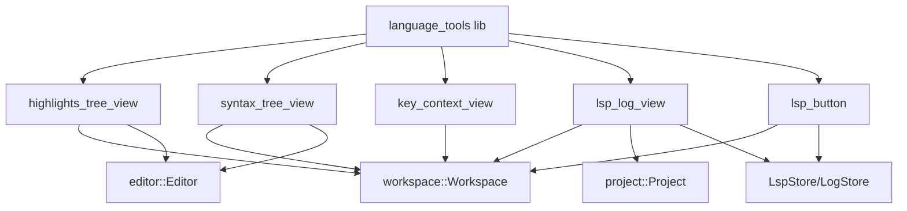
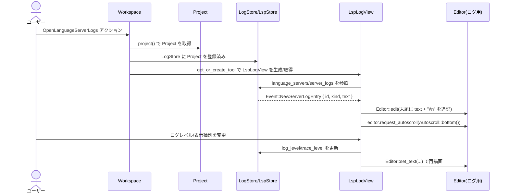

## 1. ざっくり一言

`language_tools` クレートは、Zed の Workspace / Editor 上で動作する以下のような「言語系デバッグツールビュー」をまとめて提供するクレートです。

- ハイライト一覧ビュー、構文木ビュー、LSP ログビュー、LSP サーバーメニュー、キーボードコンテキストビューを定義し、それらをアプリ全体に登録する役割を持ちます。

---

## 2. このモジュールの役割

### 2.1 概要

- このクレートは **エディタと言語サーバーに関する内部状態を可視化・操作するためのツール群** を提供します。
- 各ツールは `workspace::Item` として実装され、Workspace のペインとして開くことができます。
- 主な機能は次の通りです。
  - ハイライト（テキスト / 構文 / セマンティック）の一覧・ジャンプ
  - tree-sitter 構文木の可視化とノードへのジャンプ
  - LSP サーバーのログ / トレース / RPC メッセージ / サーバー情報の閲覧
  - LSP サーバーの状態確認・再起動・停止（ステータスバーのボタン）
  - キーバインドのコンテキストスタックとマッチ状況のデバッグ

### 2.2 アーキテクチャ内での位置づけ

このクレート内のモジュールと、外部コンポーネントとの関係を簡略化した図です。



- `language_tools::init` が入口となり、各サブモジュールの `init` を呼び出して Workspace へのアクション登録・LogStore 初期化などを行います。
- 各ビュー (`HighlightsTreeView`, `SyntaxTreeView`, `LspLogView`, `KeyContextView`) は
  - `Workspace` にアクションとして登録され、ショートカットやコマンドパレットから開かれます。
  - `Editor` と `Project` / `LspStore` からスナップショットや状態を取得して表示を行います。
- `LspButton` は `StatusItemView` を実装し、ステータスバーに LSP サーバーの状態を集約したメニューを表示します。その内部で `LspLogView` を開く処理（`lsp_log_view::open_server_trace`）も利用します。

### 2.3 設計上のポイント

コードから読み取れる特徴を列挙します。

- **Workspace / Item ベース設計**
  - すべてのビューは `workspace::Item` を実装し、Workspace のペインとして扱われます（分割・クローンが可能）。
  - トグル用のアクション（`OpenSyntaxTreeView` 等）は `workspace.register_action` により各 Workspace に登録されます。

- **Editor との疎結合連携**
  - `HighlightsTreeView` と `SyntaxTreeView` は `WeakEntity<Workspace>` と `Entity<Editor>` を保持し、`EditorEvent` を購読して更新します。
  - 表示中の Editor とビュー間の同期（選択範囲やカーソル位置を基準にスクロールなど）は、`Editor::update` 経由で行われます。

- **UI 仮想化 / パフォーマンス**
  - `uniform_list` と `UniformListScrollHandle` を利用し、大量のハイライト・ノードでも必要な範囲のみを描画するようになっています。
  - LSP ログについても、`Editor` にテキストを追記しつつ自動スクロールやフォールディングを行うことで、長大なログの取り扱いに配慮しています。

- **ハイライトキーの分離**
  - `HighlightKey::HighlightsTreeView(_)` と `HighlightKey::SyntaxTreeView(_)` のように、ビューごとに固有のハイライトキーを用いて Editor 上の背景ハイライトを制御しています。ビューが削除されるタイミングで対応するハイライトを必ずクリアしています。

- **非同期タスクと WeakEntity**
  - LSP ログ・LSP ボタンのメニュー更新などは `Task` と `WeakEntity` を使って非同期に行われ、Workspace や LogStore が既に破棄されている場合は `upgrade()` の結果を見て早期 return する実装になっています。

---

## 3. 主要な機能一覧

このクレートが提供する主要機能を列挙します。

- ハイライトビュー: 現在のファイルのテキストハイライト / 構文トークン / セマンティックトークンを一覧表示し、選択・ホバーで Editor 側を同期させるビュー。
- 構文木ビュー: tree-sitter による構文木をフラットなリストとして表示し、カーソル位置のノードに自動スクロール・強調表示するビュー。
- LSP ログビュー: 言語サーバーごとの
  - 通常ログ（`Log` / `Info` / `Warning` / `Error`）
  - サーバートレース（`TraceValue`）
  - RPC メッセージ（JSON）
  - サーバー情報（Capabilities や Configuration）
  を切り替えながら閲覧できるビュー。
- LSP ボタン: ステータスバーに LSP サーバーの状態をまとめたメニューを出し、サーバーごとのログ閲覧・再起動・停止や、メモリ使用量・バイナリパス・エラーメッセージを確認できるボタン。
- キーコンテキストビュー: 現在の `KeyContext` スタックや、最後に打鍵したショートカットに対して候補となったキーバインドと、そのマッチ状況（マッチ / 低優先度 / マッチしない）を可視化するビュー。
- 初期化エントリポイント: `language_tools::init` により、上記全ツールのアクションや LogStore の初期化をアプリケーションに組み込む。

---

## 4. 関数・構造体の解説

### 4.1 型一覧（主要な構造体・列挙体）

| 名前 | 種別 | 公開 | 役割 / 用途 |
|------|------|------|-------------|
| `HighlightsTreeView` | 構造体 | `pub`（re-export） | 現在の Editor に存在するテキスト / 構文 / セマンティックハイライトを一覧表示し、クリック・ホバーで Editor 側の選択・ハイライトを更新するペイン。 |
| `HighlightsTreeToolbarItemView` | 構造体 | `pub`（re-export） | `HighlightsTreeView` がアクティブなときにツールバーに表示されるビュー。表示件数やフィルタ（Text / Syntax / Semantic）トグル UI を提供。 |
| `HighlightCategory` | enum | モジュール内 | ハイライト種別（Text / SyntaxToken / SemanticToken）と、その詳細情報を表現。 |
| `SyntaxTreeView` | 構造体 | `pub`（re-export） | tree-sitter 構文木を一覧表示し、カーソル位置のノードへ自動スクロール・選択との同期を行うペイン。 |
| `SyntaxTreeToolbarItemView` | 構造体 | `pub`（re-export） | 構文木ビューのツールバー UI。アクティブな syntax layer の切り替え・「最後にフォーカスしていた Editor を使う」ボタンを提供。 |
| `KeyContextView` | 構造体 | モジュール内 | キーバインドのコンテキストスタック・最後のキーストローク・候補バインディング一覧とマッチ状態を表示するペイン。 |
| `LspLogView` | 構造体 | `pub` | LSP ログ / トレース / RPC / サーバー情報を `Editor` 上に表示するペイン。Workspace から `OpenLanguageServerLogs` アクションで開かれる。 |
| `LspLogToolbarItemView` | 構造体 | `pub` | `LspLogView` 用のツールバー UI。対象サーバーの選択・ログ種別の切り替え・ログレベル / トレースレベル設定・RPC トレース有効化トグル・ログクリアボタンを提供。 |
| `LogMenuItem` | 構造体 | `pub(crate)` | LSP ログツールバー用のリスト行（サーバー名・ワークツリー名・RPC トレース状態など）を保持。 |
| `LspButton` | 構造体 | `pub` | ステータスバーに配置される言語サーバーメニュー。`StatusItemView` を実装し、サーバーごとの状態・ログ閲覧・再起動 / 停止等を提供。 |
| `LanguageServerState` | 構造体 | モジュール内 | `LspButton` が保持する内部状態（サーバーごとのヘルス / バイナリ / バッファとの対応など）を集約。 |
| `LanguageServers` | 構造体 | モジュール内 | サーバーごとのヘルス / バイナリ状態 / パスごとのサーバー集合を管理するヘルパ。 |
| `LspLogView::LogKind` | enum（他モジュール定義） | 外部 | ログビューで表示する種別（`Logs` / `Trace` / `Rpc` / `ServerInfo`）。`LogStore` 側の状態と同期される。 |

### 4.2 関数詳細（代表 7 件）

#### 1. `language_tools::init(cx: &mut App)`

**概要**

- このクレートのエントリポイントです。
- アプリケーション起動時に呼び出すことで、各種ビューやアクションを `App` / `Workspace` に登録します。

**引数**

| 引数名 | 型 | 説明 |
|--------|----|------|
| `cx` | `&mut App` | アプリケーション全体のコンテキスト。各 Workspace やグローバルストアの初期化に利用されます。 |

**戻り値**

- なし（`()`）。

**内部処理の流れ**

1. `highlights_tree_view::init(cx)` を呼び出し、「ハイライトビューを開く」アクションとビュー生成処理を各 Workspace に登録します。
2. `lsp_log_view::init(false, cx)` を呼び出し、LSP ログ用の `LogStore` を初期化し、`OpenLanguageServerLogs` アクションを登録します。
3. `syntax_tree_view::init(cx)` を呼び出し、構文木ビューのアクション・コマンドパレット設定を行います。
4. `key_context_view::init(cx)` を呼び出し、キーボードコンテキストビューのアクションを登録します。

**使用例**

アプリケーションの起動時に一度だけ呼び出します。

```rust
use gpui::{App, AppContext};
use language_tools; // クレート名と一致

fn main() {
    gpui::run(|cx: &mut App| {
        // language_tools が提供する各種ビュー・アクションを登録する        // ここで Highlights / SyntaxTree / LSP Logs / Key Context が有効化される
        language_tools::init(cx);
        // 以降、Workspace 等の初期化を続ける                                  // 他のプラグインやワークスペースのセットアップ
    });
}
```

**Edge cases（エッジケース）**

- `init` 自体は内部で状態を保持しないため、複数回呼び出してもクラッシュなどはしませんが、同じアクションを重複登録しない前提で設計されているため、通常は **一度だけ** 呼び出すことが想定されます（コードからは重複登録時の挙動は読み取れません）。

**使用上の注意点**

- `lsp_log_view::init` の中で `log_store::init` が呼ばれ、グローバルな LogStore が初期化されます。Zed 本体ではこの前提で他の箇所も実装されていると考えられるため、`init` をスキップするとログビューの動作に影響します。

---

#### 2. `get_or_create_tool<T>(...) -> Entity<T>`

```rust
fn get_or_create_tool<T>(
    workspace: &mut Workspace,
    destination: SplitDirection,
    window: &mut Window,
    cx: &mut Context<Workspace>,
    new_tool: impl FnOnce(&mut Window, &mut Context<T>) -> T,
) -> Entity<T>
where
    T: Item,
```

**概要**

- Workspace 内に指定タイプ `T` のツール（`Item`）が既に存在すればそれを返し、存在しなければ新たに作成してペインに追加するユーティリティです。
- `LspLogView` など「各 Workspace に 1 つあれば良い」ビューの生成に使われています。

**引数**

| 引数名 | 型 | 説明 |
|--------|----|------|
| `workspace` | `&mut Workspace` | ツールを追加 / 検索する対象の Workspace。 |
| `destination` | `SplitDirection` | 新規作成時にペインをどちらへ分割するか（右 / 下など）。 |
| `window` | `&mut Window` | 現在のウィンドウ。ペイン操作に利用。 |
| `cx` | `&mut Context<Workspace>` | Workspace 用の UI コンテキスト。 |
| `new_tool` | `impl FnOnce(&mut Window, &mut Context<T>) -> T` | 新しいツール `T` を生成するクロージャ。`cx.new` の中から呼ばれます。 |

**戻り値**

- `Entity<T>`: 既存または新規作成されたツールのエンティティ。

**内部処理の流れ**

1. `workspace.item_of_type::<T>(cx)` で既存のツールがあるかを検索。
   - 存在すれば、それをそのまま返す。
2. 存在しない場合は、`cx.new(|cx| new_tool(window, cx))` で新しい `T` を生成。
3. `workspace.find_pane_in_direction(destination, cx)` で目的方向にペインがあるかを確認。
   - あれば `workspace.add_item` でそこに追加。
   - なければ `workspace.split_item(destination, new_tool.boxed_clone(), ...)` でペインを分割して追加。
4. 生成した `Entity<T>` を返す。

**使用例**

`LspLogView` を「右に分割して開く」例です（実際のコードと同じパターン）。

```rust
use language_tools::LspLogView;
use project::Project;
use lsp_store::log_store::LogStore;
use workspace::{Workspace, SplitDirection};
use ui::{Context, Window};

fn open_lsp_logs(
    workspace: &mut Workspace,              // 対象 Workspace
    project: Entity<Project>,               // 対象 Project
    log_store: Entity<LogStore>,            // LSP ログストア
    window: &mut Window,                    // ウィンドウ
    cx: &mut Context<Workspace>,            // Workspace コンテキスト
) {
    // 既に LspLogView があれば再利用し、なければ右ペインに新規作成する
    let _view = language_tools::get_or_create_tool(
        workspace,
        SplitDirection::Right,              // 右に分割
        window,
        cx,
        move |window, cx| {
            // 新規作成時に呼ばれるクロージャ。Project と LogStore を渡して LspLogView を構築
            LspLogView::new(project.clone(), log_store.clone(), window, cx)
        },
    );
}
```

**Edge cases**

- `item_of_type::<T>` は Workspace に最初に見つかった `T` を返すため、複数の `T` が存在しうるケースでは「どれを返すか」は呼び出し側が意識する必要があります。このクレートでは「1 Workspace に 1 つ」のツールにのみ使用されています。
- `find_pane_in_direction` が `None` を返す場合は常に `split_item` でペインを分割します。ペインレイアウトに依存した挙動になりますが、詳細は Workspace 実装側の責務です。

**使用上の注意点**

- クロージャ `new_tool` 内で `workspace` や `cx` をキャプチャした長寿命の参照を保持しないようにする必要があります（`cx.new` 内部で完結しているため、コード上は正しくスコープが切られています）。

---

#### 3. `highlights_tree_view::init(cx: &mut App)`

**概要**

- 「現在のファイルのハイライトツリービュー」を開くアクション `OpenHighlightsTreeView` を各 Workspace に登録します。
- アクション実行時に `HighlightsTreeView` を右ペインとして開きます。

**引数**

| 引数名 | 型 | 説明 |
|--------|----|------|
| `cx` | `&mut App` | アプリケーション全体のコンテキスト。 |

**戻り値**

- なし。

**内部処理の流れ**

1. `cx.observe_new` で新しく生成される `Workspace` を監視。
2. 各 Workspace ごとに `workspace.register_action` を呼び出し、
   - `OpenHighlightsTreeView` アクションのハンドラを登録。
   - ハンドラ内で
     - `workspace.active_item(cx)` からアクティブなペインを取得。
     - `workspace.weak_handle()` を取得。
     - `cx.new(|cx| HighlightsTreeView::new(workspace_handle, active_item, window, cx))` でビューを作成。
     - `workspace.split_item(SplitDirection::Right, Box::new(highlights_tree_view), ...)` で右ペインに表示。

**使用例**

アプリ側は `language_tools::init` から間接的に呼び出されるため、個別に呼ぶ必要はありませんが、単独利用のイメージは以下の通りです。

```rust
use gpui::App;

fn setup_highlight_tool(cx: &mut App) {
    // 新規 Workspace が作成されるたびに、
    // 「OpenHighlightsTreeView」アクションを登録する
    language_tools::highlights_tree_view::init(cx);
}
```

**Edge cases**

- アクティブなペインが Editor でない場合や存在しない場合、`HighlightsTreeView::new` の中で `handle_item_updated` が Editor を見つけられず、ビューは「Not attached to an editor」状態になります。

**使用上の注意点**

- 本関数は `App` に対して一度呼び出せば、以降に生成される全ての Workspace でアクションが有効になります。

---

#### 4. `syntax_tree_view::init(cx: &mut App)`

**概要**

- 構文木ビュー `SyntaxTreeView` を開く `OpenSyntaxTreeView` アクションと、アクティブ Editor を切り替える `UseActiveEditor` アクションを Workspace に登録します。
- さらに `CommandPaletteFilter` を通じて、`UseActiveEditor` の表示を適切に制御します。

**引数・戻り値**

- 引数 / 戻り値は `highlights_tree_view::init` と同様です。

**内部処理の流れ（概要）**

1. `syntax_tree_actions` として `UseActiveEditor` の `TypeId` を配列に保持。
2. `CommandPaletteFilter::update_global` で、これらのアクション種別をコマンドパレットから非表示に設定。
3. `cx.observe_new` で Workspace ごとに：
   - `OpenSyntaxTreeView` を登録し、実行時に
     - `CommandPaletteFilter` で `UseActiveEditor` を再び表示する。
     - `SyntaxTreeView::new` を生成し、右ペインに追加。
     - `SyntaxTreeView` の `on_release` で「SyntaxTreeView が 1 つも無くなったら `UseActiveEditor` を再度非表示にする」処理を登録。
   - `UseActiveEditor` アクションも登録し、実行時に
     - 既に存在する `SyntaxTreeView` を探して `update_active_editor` を呼び出し、「最後にアクティブだった Editor に切り替える」。

**使用例**

```rust
use gpui::App;

fn setup_syntax_tree_tool(cx: &mut App) {
    // 構文木ビューおよび関連アクションを有効化する
    language_tools::syntax_tree_view::init(cx);
}
```

**使用上の注意点**

- 構文木ビューは `Editor` に対して tree-sitter の構文情報が存在する場合にのみ有効です。`SyntaxTreeView` 自身は、対応する言語がない場合「Current editor has no associated language」と表示するだけで、それ以上の操作は行いません。

---

#### 5. `lsp_log_view::init(on_headless_host: bool, cx: &mut App)`

**概要**

- LSP ログ機構を初期化し、各 Workspace に
  - `LogStore` へのプロジェクト登録
  - `OpenLanguageServerLogs` アクション
  を設定します。

**引数**

| 引数名 | 型 | 説明 |
|--------|----|------|
| `on_headless_host` | `bool` | ヘッドレスホスト上かどうかのフラグ。`log_store::init` にそのまま渡されます。 |
| `cx` | `&mut App` | アプリケーションコンテキスト。 |

**戻り値**

- なし。

**内部処理の流れ**

1. `log_store::init(on_headless_host, cx)` を呼び出し、グローバルな `LogStore` エンティティを取得。
2. `cx.observe_new` で Workspace の生成を監視し、各 Workspace ごとに：
   - `store.add_project(workspace.project(), cx)` を呼んで、その Workspace の `Project` を LogStore に登録。
   - `OpenLanguageServerLogs` アクションを登録し、実行時に
     - `get_or_create_tool` を使用して `LspLogView::new(project, log_store, window, cx)` を右ペインに開く。

**使用例**

```rust
use gpui::App;

fn setup_lsp_logs(cx: &mut App) {
    // 通常の GUI ホスト上で LSP ログビューを有効化する
    language_tools::lsp_log_view::init(false, cx);
}
```

**使用上の注意点**

- `on_headless_host` が true のときの具体的な挙動はこのチャンクのコードからは分かりません。`log_store::init` の実装に依存します。
- `Project` 側の LSP ストアや Fake サーバーなどは別モジュールにあり、本関数はそれらに対して「ログを集約する場」を用意する役割に限定されています。

---

#### 6. `lsp_log_view::open_server_trace(...)`

```rust
pub fn open_server_trace(
    log_store: &Entity<LogStore>,
    workspace: WeakEntity<Workspace>,
    server: LanguageServerSelector,
    window: &mut Window,
    cx: &mut App,
)
```

**概要**

- 与えられた `LanguageServerSelector`（ID か名前）に対応するサーバーの **RPC メッセージトレース** を表示するために、
  - 対応する `LspLogView` を開く（または再利用する）
  - ログビューに対象サーバーの RPC トレースの表示を指示する
  非同期処理です。

**引数**

| 引数名 | 型 | 説明 |
|--------|----|------|
| `log_store` | `&Entity<LogStore>` | LSP ログの状態を保持するストア。 |
| `workspace` | `WeakEntity<Workspace>` | 対象の Workspace（Weak 参照）。ドロップされていれば何もせず終了。 |
| `server` | `LanguageServerSelector` | サーバー ID またはサーバー名による指定。 |
| `window` | `&mut Window` | 操作対象のウィンドウ。 |
| `cx` | `&mut App` | アプリコンテキスト。非同期タスクの生成に使用。 |

**戻り値**

- なし。

**内部処理の流れ（簡略）**

1. `log_store.update(cx, |_, cx| { ... })` 内で `cx.spawn_in(window, async move |log_store, cx| { ... })` を起動。
2. 非同期タスク内で
   - `log_store.upgrade()` に失敗した場合は終了。
   - `workspace.update_in(cx, |workspace, window, cx| { ... })` で Workspace を更新しつつ：
     - `project` を取得。
     - `get_or_create_tool` を使って `LspLogView::new(project, tool_log_store, window, cx)` を開く。
     - `LanguageServerSelector` から `LanguageServerId` を解決（ID 指定ならそのまま、名前指定なら LogStore の `language_servers` から検索）。
     - 見つかった場合 `log_view.show_rpc_trace_for_server(server_id, window, cx)` を呼び出して RPC トレースビューに切り替える。

**使用例**

`LspButton` メニューから「View Logs」ではなく「RPC メッセージトレース」を開きたいケースなどで再利用できます（実際には「View Logs」用に使われています）。

```rust
use language_tools::lsp_log_view::open_server_trace;
use lsp::LanguageServerSelector;

// どこかの UI ハンドラから:
fn show_rpc_for_server(
    log_store: &Entity<LogStore>,             // 既存の LogStore
    workspace: WeakEntity<Workspace>,         // 対象 Workspace
    window: &mut Window,
    cx: &mut App,
) {
    let selector = LanguageServerSelector::Name(LanguageServerName("rust-analyzer".into()));
    open_server_trace(log_store, workspace, selector, window, cx);
}
```

**Edge cases**

- `workspace` や `log_store` が既に破棄されている場合は `upgrade` / `update_in` に失敗し、そのまま何もせず終了します。
- `LanguageServerSelector::Name` で指定した名前に一致するサーバーが見つからない場合も、何も表示されません（エラー表示は行っていません）。

**使用上の注意点**

- 必ず `lsp_log_view::init` 等で `LogStore` に対応するプロジェクトが登録されている前提で使用する必要があります。そうでないと `server_ids_for_project` 等の問い合わせ結果が空になり、ビューが空になる可能性があります。

---

#### 7. `LspButton::new(...) -> LspButton`

```rust
impl LspButton {
    pub fn new(
        workspace: &Workspace,
        popover_menu_handle: PopoverMenuHandle<ContextMenu>,
        window: &mut Window,
        cx: &mut Context<Self>,
    ) -> Self
```

**概要**

- ステータスバーに配置される LSP ボタンのコンストラクタです。
- 初期状態として
  - グローバル設定の監視
  - LspStore のイベント購読
  - 既存の言語サーバー状態の読み込み
  - 必要に応じたメニュー生成
  を行い、`StatusItemView` として利用できるインスタンスを返します。

**引数**

| 引数名 | 型 | 説明 |
|--------|----|------|
| `workspace` | `&Workspace` | このボタンが関連付けられる Workspace。`project()` や `lsp_store()` にアクセスするために利用。 |
| `popover_menu_handle` | `PopoverMenuHandle<ContextMenu>` | ポップオーバーメニューの外部ハンドル。メニューの再生成に利用。 |
| `window` | `&mut Window` | 現在のウィンドウ。購読登録やメニュー更新に利用。 |
| `cx` | `&mut Context<Self>` | `LspButton` 自身の UI コンテキスト。 |

**戻り値**

- `LspButton`: 初期化済みのボタン。

**内部処理の流れ（概要）**

1. `SettingsStore` のグローバル設定を購読し、`global_lsp_settings.button` が
   - true の場合：ボタン表示・メニュー生成を有効化。
   - false の場合：メニューをクリアして非表示扱いにする。
2. `workspace.project().read(cx).lsp_store()` を取得し、既存の `language_server_statuses` をもとに `LanguageServers::binary_statuses` を初期化。
3. LspStore に対する購読を設定し、`LspStoreEvent` に応じて
   - バイナリステータス更新（`update_binary_status`）
   - ヘルス更新（`update_server_health`）
   - バッファ登録（`servers_per_buffer_abs_path` 更新）
   を行い、必要に応じてメニュー再生成。
4. `LanguageServerState` エンティティを生成し、前述の状態を持たせる。
5. 初期状態でバイナリ状態が一つでも存在する場合、`refresh_lsp_menu(true, ...)` を呼んでメニューを生成。

**使用例**

ステータスバーなどから利用する場合の簡略例です（`StatusItemView` 実装に従って追加される前提）。

```rust
use language_tools::lsp_button::LspButton;
use ui::{Context, Window};
use workspace::Workspace;
use ui::ContextMenu;

fn create_lsp_status_item(
    workspace: &Workspace,                         // 対象 Workspace
    window: &mut Window,
    cx: &mut Context<LspButton>,                   // LspButton 用コンテキスト
) -> LspButton {
    let handle = PopoverMenuHandle::<ContextMenu>::default(); // メニューハンドル
    LspButton::new(workspace, handle, window, cx)             // 初期化済みのボタンを返す
}
```

**Edge cases**

- `server_state.language_servers.is_empty()` または `lsp_menu.is_none()` の場合、`render` は `div().hidden()` を返し、UI に何も表示しません。
- ボタンの表示・非表示は `ProjectSettings::get_global(cx).global_lsp_settings.button` によって制御されます。この設定が false の場合、LSP サーバーが存在していてもボタンは出ません。

**使用上の注意点**

- `set_active_pane_item` が `StatusItemView` として呼ばれる前提で、アクティブな Editor に応じてメニュー内容を更新する設計になっています。直接 `new` しても、適切に `set_active_pane_item` が呼ばれないと Editor ベースの絞り込み（アクティブバッファに紐づくサーバーなど）が効かない点に注意が必要です。

---

### 4.3 その他の関数（主なもの）

| 関数名 | 所属 | 役割（1 行） |
|--------|------|--------------|
| `HighlightsTreeView::refresh_highlights` | `highlights_tree_view` | Editor のテキスト / 構文 / セマンティックハイライトを収集し、`HighlightEntry` に変換してソート・重複除去を行う。 |
| `HighlightsTreeView::compute_items` | 同上 | 仮想リスト内の可視範囲にある項目を描画し、クリック / ホバー時の Editor 更新ロジックを紐付ける。 |
| `SyntaxTreeView::editor_updated` | `syntax_tree_view` | カーソル位置から該当する syntax layer とノードを特定し、ビューの選択・スクロールを更新する。 |
| `SyntaxTreeView::compute_items` | 同上 | 指定した descendant index 範囲のノードをリストとして描画し、線形にたどるためのカーソル移動ロジックを含む。 |
| `KeyContextView::matches` | `key_context_view` | `KeyBindingContextPredicate` に対して現在の context_stack がマッチするかどうかを判定する。 |
| `LspLogView::show_logs_for_server` | `lsp_log_view` | 指定サーバーの通常ログを Editor に表示し、必要に応じて LSP 側へ `ToggleLspLogs` を送信する。 |
| `LspLogView::show_trace_for_server` | 同上 | 指定サーバーのサーバートレースを表示し、トレースレベルに応じて `SetTrace` 通知を送る。 |
| `LspLogView::show_rpc_trace_for_server` | 同上 | 指定サーバーの RPC トレースを有効化・表示し、JSON としてシンタックスハイライトを設定する。 |
| `LspLogView::menu_items` | 同上 | 現在のプロジェクトに紐づく全言語サーバーの一覧を `LogMenuItem` にまとめ、ツールバー用のデータとして返す。 |

---

## 5. データフロー

ここでは代表的なシナリオとして「ユーザーが LSP ログビューを開き、ログが追記されるまで」の流れを追います。

### 5.1 シナリオ概要

- ユーザーがショートカットやコマンドパレットで `OpenLanguageServerLogs` を実行する。
- Workspace が `LspLogView` を右ペインとして開く（既存があれば再利用）。
- `LogStore` に言語サーバーからログが追加されると、`LspLogView` がイベントを受け取り、内部の `Editor` にテキストを追記する。
- `Editor` は cursor の位置に応じて自動スクロールを行い、ユーザーは検索やログレベル切り替えなどを行える。

### 5.2 シーケンス図



この流れにより、ユーザーは任意のサーバーを選択し、ログ・トレース・RPC メッセージ・サーバー情報をリアルタイムに追跡できます。

---

## 6. 使い方（How to Use）

### 6.1 基本的な使用方法

#### アプリケーションへの組み込み

最も基本的には、アプリ起動時に `language_tools::init` を呼ぶだけで、各 Workspace に必要なアクションやログストアが登録されます。

```rust
use gpui::{App, AppContext};
use language_tools; // crates/language_tools

fn main() {
    gpui::run(|cx: &mut App| {
        // language_tools の全機能を有効化する                      // Highlights / SyntaxTree / LSP Logs / Key Context
        language_tools::init(cx);

        // ここで Workspace や他の拡張を初期化                     // workspace::Workspace などのセットアップ
    });
}
```

この状態で、Zed 本体側が定義しているキーバインドやコマンドパレット経由で：

- 「Highlights」ビュー（`OpenHighlightsTreeView`）
- 「Syntax Tree」ビュー（`OpenSyntaxTreeView`）
- 「LSP Logs」ビュー（`OpenLanguageServerLogs`）
- 「Keyboard Context」ビュー（`OpenKeyContextView`）

を開けるようになります（具体的なバインドは別ファイルに依存するため、このチャンクからは分かりません）。

#### LspLogView を直接生成したい場合

テストコードのように、任意の `Project` と `LogStore` から直接 `LspLogView` を生成することもできます。

```rust
use language_tools::LspLogView;
use project::Project;
use lsp_store::log_store::LogStore;
use gpui::{AppContext as _, TestAppContext};
use ui::Window;

// 簡略化した例（実際には TestAppContext や FakeFs 等を準備）
fn open_log_view_for_project(
    project: Entity<Project>,                 // 対象 Project
    log_store: Entity<LogStore>,              // 対象 LogStore
    window: &mut Window,                      // ウィンドウ
    cx: &mut gpui::Context<LspLogView>,       // LspLogView 用コンテキスト
) {
    // Project + LogStore を渡して LspLogView を構築する
    let _log_view = LspLogView::new(project, log_store, window, cx);
}
```

### 6.2 よくある使用パターン

1. **アクション経由で各ビューを開く**

   - `OpenHighlightsTreeView`  
     現在フォーカスしている Editor に対するハイライト一覧ビューを右ペインに開きます。
   - `OpenSyntaxTreeView`  
     現在の Editor の tree-sitter 構文木を表示します。ビューを閉じると `UseActiveEditor` アクションはコマンドパレットから隠されます。
   - `OpenLanguageServerLogs`  
     対象 Workspace の `Project` に紐づく LSP サーバーのログビューを開きます。
   - `OpenKeyContextView`  
     キーバインドのコンテキストスタックを確認するためのビューを開きます。

   これらはすべて `actions!` マクロで定義されており、Zed のキー設定（別ファイル）から通常のアクションと同様にバインド可能です。

2. **ステータスバーに LspButton を表示する**

   - `LspButton` は `StatusItemView` を実装しているため、ステータスバー管理側から `set_active_pane_item` が呼ばれれば、自動的にアクティブ Editor に応じたサーバー一覧・状態を表示します。
   - ボタンをクリックすると
     - サーバーごとのサブメニュー（ログ閲覧 / 再起動 / 停止 / メタ情報表示）
     - 「Restart All Servers」「Stop All Servers」
     などが利用可能です。

3. **LspLogView のツールバーから表示を切り替える**

   `LspLogToolbarItemView` を通じて、以下のような操作が可能です。

   - 対象サーバーの選択（ワークツリー名付きのリスト）
   - 表示種別の切り替え
     - `RPC Messages`
     - `Server Logs`
     - `Server Trace`
     - `Server Info`
   - RPC トレースの有効/無効切り替え（チェックボックス）
   - Trace レベル / Log レベルの変更（`TraceValue` / `MessageType`）

   これらはすべて `ContextMenu` と `PopoverMenu` を通じて実装されており、選択内容は `LspLogView` 内の状態（`current_server_id`, `active_entry_kind`）と `LogStore` の状態に反映されます。

### 6.3 使用上の注意点（まとめ）

- **Editor への依存**
  - `HighlightsTreeView` と `SyntaxTreeView` は、アタッチされた Editor が存在しない場合「Not attached to an editor」と表示され、何も行いません。
  - Editor が閉じられた場合、対応するビューは内部状態をクリアし、必要に応じて最後にアクティブだった Editor に切り替えようとします。

- **言語情報の前提**
  - 構文木ビューは、`Buffer` に tree-sitter ベースの `syntax_layers` が存在することを前提としています。無い場合、説明メッセージを表示するのみです。
  - ハイライトビューの「Syntax Tokens」表示も、`grammar.highlights_config` が存在する前提です。存在しない場合は該当キャプチャはスキップされます。

- **LSP ログの前提**
  - `LspLogView` は `LogStore` と `Project` に対して状態を問い合わせます。`lsp_log_view::init` またはテストコードのように `LogStore::new` で適切な関連付けが行われていないと、ログが表示されません。
  - RPC トレースや Trace レベルの変更は、実際の `LanguageServer` が存在する場合のみ有効であり、存在しない場合は更新されない可能性があります（コード上では `language_server_for_id` の Option をチェックしています）。

- **グローバル設定**
  - `LspButton` の表示は `ProjectSettings::get_global(cx).global_lsp_settings.button` に依存します。このフラグが false の場合、LSP サーバーが起動していてもボタンは表示されません。
  - キーバインドコンテキストビューは `SettingsStore` のテスト用初期化が必要なため、ユニットテストでは `init_test` で各種グローバル設定を行っています。

- **ハイライトのクリア**
  - `HighlightsTreeView` と `SyntaxTreeView` は、それぞれ `on_removed` で Editor 側のハイライトを必ずクリアします。別の拡張で同じ `HighlightKey` を利用すると競合する可能性があるため、キーの再利用には注意が必要です。

---

## 7. 関連ファイル

このクレート内のファイルと役割の一覧です。

| パス | 役割 / 関係 |
|------|------------|
| `language_tools/Cargo.toml` | クレート定義。`language`, `editor`, `workspace`, `lsp`, `ui`, `gpui` など、多数のワークスペースクレートに依存していることが分かります。 |
| `language_tools/src/language_tools.rs` | ライブラリのエントリポイント。モジュール宣言と `init`、`get_or_create_tool` を提供し、主要ビューを re-export します。 |
| `language_tools/src/highlights_tree_view.rs` | ハイライトツリービュー本体と、そのツールバー用ビューを実装。Workspace アクション `OpenHighlightsTreeView` と UI ロジックを含みます。 |
| `language_tools/src/syntax_tree_view.rs` | 構文木ビュー本体とツールバーを実装。`OpenSyntaxTreeView` / `UseActiveEditor` アクションや `CommandPaletteFilter` の制御も含まれます。 |
| `language_tools/src/key_context_view.rs` | キーボードコンテキストビューを実装。`OpenKeyContextView` アクション、およびキーバインドのマッチ状態の可視化ロジックを含みます。 |
| `language_tools/src/lsp_log_view.rs` | LSP ログビュー (`LspLogView`) とツールバー (`LspLogToolbarItemView`)、および `open_server_trace` / `init` などのヘルパーを実装します。`LogStore` / `Project` / `LanguageServer` と連携します。 |
| `language_tools/src/lsp_log_view_tests.rs` | `LspLogView` のテスト。FakeFs・FakeLspAdapter・TestAppContext を用いて、ログメッセージが正しくビューに反映されることを検証します。 |
| `language_tools/src/lsp_button.rs` | ステータスバーの LSP ボタン (`LspButton`) とその内部状態（`LanguageServerState`、`LanguageServers` など）を実装します。`LspStoreEvent` を購読してメニューを動的に更新し、`lsp_log_view::open_server_trace` と連携します。 |

このクレートは、Zed エディタの内部フレームワーク（`gpui`, `workspace`, `editor`, `project`, `lsp` など）に強く依存しているため、これらのクレートの API を併せて参照するとより理解が深まります。
