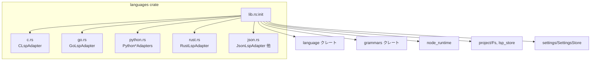
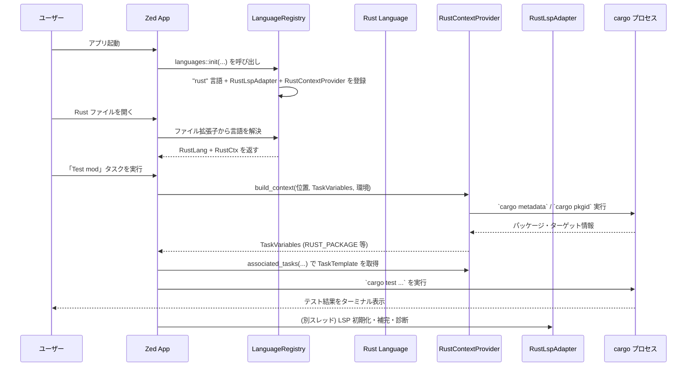

# `languages/` ディレクトリ

## 1. ざっくり一言

Zed エディタで扱う各種言語について、

- **LSP サーバーのインストール／起動方法（アダプタ）**
- **コード補完・シンボル表示などの見た目調整**
- **言語ごとのビルド／テスト用タスク定義**
- **ツールチェーン検出（Python / Go / Rust など）**

をまとめて提供するクレートです。

---

## 2. このモジュールの役割

### 2.1 概要

このクレートは Zed の「言語サポートの中核」として機能します。

- 各言語ごとに **LspAdapter / LspInstaller** を実装し、  
  対応する **言語サーバーのインストール・検出・起動** をカプセル化します。
- `ContextProvider` やタスク定義を通じて、  
  **「今開いているファイルに対してどんなコマンドを実行できるか」** を決めます。
- `LanguageRegistry` に対して、  
  **どの言語名にどの LSP・コンテキスト・マニフェストを紐づけるか** を登録します。
- JSON スキーマや semantic token rules（構文ハイライト用のルール）もここから読み込みます。

### 2.2 アーキテクチャ内での位置づけ

主要な依存関係を簡略化した図です。



- `lib.rs::init` が入口で、ここから各言語モジュール（`c.rs`, `go.rs`, `python.rs`, `rust.rs`, `json.rs` など）のアダプタやコンテキストを組み立てて登録します。
- 各言語モジュールは
  - `language` クレートのトレイト（`LspAdapter`, `LspInstaller`, `ContextProvider` など）
  - `http_client`, `node_runtime`, `pet-*` などの外部依存
  を利用して、実際の LSP バイナリやツールチェーンを操作します。

### 2.3 設計上のポイント

コードから読み取れる特徴をまとめます。

- **言語ごとの分割**
  - 言語ごとに `c.rs`, `go.rs`, `python.rs`, `rust.rs`, `json.rs` ... のようなモジュールに分割されています。
  - それぞれが必要な LSP アダプタ・タスク・補完ラベル生成を担当します。

- **抽象トレイトによる拡張性**
  - `language::LspAdapter`, `language::LspInstaller`, `language::ContextProvider`,  
    `language::ToolchainLister`, `language::ManifestProvider` などのトレイトを実装することで、
    新しい言語や新しい LSP を追加できる構造になっています。

- **非同期・外部プロセスの扱い**
  - `async_trait` と `smol`ベースで、HTTP ダウンロード・ファイルシステム操作・外部コマンド実行（`go`, `cargo`, `python`, `npm` など）を非同期に扱います。
  - `LspInstaller` の実装では、**バイナリのバージョン管理とキャッシュ** を行いつつ、必要に応じて HTTP 経由で取得します。

- **設定との統合**
  - `SettingsStore` や `language_server_settings` 経由で、ユーザーやプロジェクト固有の LSP 設定 / 初期化オプション / semantic token rules を読み書きしています。
  - ESLint や Ruff, rust-analyzer などは、**自身が提供する JSON Schema を実行時に取得し、Zed の設定スキーマに変換**する処理を持っています。

- **エディタ機能の微調整**
  - `label_for_completion` / `label_for_symbol` / `process_diagnostics` などで、
    各 LSP が返す素のデータを **Zed 独自の見た目（色付け・ラベル整形）に変換**しています。
  - bash / C / C++ / Python などについては、**自動インデントの振る舞いをテストで検証**しています（実装本体は別クレート）。

---

## 3. 主要な機能一覧

このクレート全体で提供している主な機能を列挙します。

- **言語登録と初期化**
  - `lib::init` で、Zed に組み込みの言語（bash, C, C++, Go, JSON, Python, Rust, TypeScript など）を `LanguageRegistry` に登録。
  - 各言語に対して LSP アダプタ、コンテキストプロバイダ、ツールチェーンプロバイダ、マニフェスト名、semantic token rules を紐付け。

- **LSP サーバーのインストール／検出（LspInstaller 実装）**
  - C: `CLspAdapter`（clangd を GitHub からダウンロード、または `clangd` が PATH にあれば利用）
  - CSS/JSON: `CssLspAdapter` / `JsonLspAdapter`（`vscode-langservers-extracted` を npm からインストール）
  - ESLint: `EsLintLspAdapter`（`microsoft/vscode-eslint` のリリースを GitHub から取得しビルド）
  - Go: `GoLspAdapter`（`gopls` を `go install` 経由でインストール）
  - JSON 補助: `NodeVersionAdapter`（`package-version-server` バイナリを GitHub から取得）
  - Python: `TyLspAdapter`, `PyrightLspAdapter`, `PyLspAdapter`, `BasedPyrightLspAdapter`, `RuffLspAdapter`
  - Rust: `RustLspAdapter`（rust-analyzer バイナリを GitHub から取得）

- **ツールチェーン検出**
  - `PythonToolchainProvider`:
    - `pet`, `pet-conda`, `pet-poetry` などを用いて Python 仮想環境を列挙・優先度順に並び替え。
    - `Toolchain` として Zed から選択可能な形に変換。
  - Go / Rust については、外部コマンド（`go`, `cargo`）を直接呼び出してバージョンやパッケージ情報を取得。

- **タスクコンテキスト・テンプレート（ContextProvider）**
  - bash: 選択範囲の実行、スクリプトファイルの実行。
  - Go: パッケージ / モジュールルート / subtest 名などから `go test` / `go bench` / `go fuzz` / `go run` タスクを生成。
  - Python: unittest / pytest のどちらを使うかを設定から決定し、選択ファイル・クラス・メソッド単位のテストタスクを生成。
  - Rust: `cargo check` / `cargo test` / `cargo run` などのタスクを、現在のパッケージ・バイナリ名・必要 feature から組み立て。
  - JSON: `package.json` / `composer.json` のスクリプトを読み取り、「npm run」「composer script」タスクを生成。

- **補完・シンボル・診断の整形**
  - 各 LSP の `CompletionItem` / `DocumentSymbol` / `PublishDiagnostics` を
    - ラベルテキスト（signature+名前）
    - フィルタ範囲（補完のマッチ対象）
    - 構文ハイライト情報
    に変換するロジックを持ちます（C, Go, Python, Rust など）。

- **設定スキーマの生成**
  - rust-analyzer / Ruff / ESLint などが提供する JSON スキーマを外部プロセス経由で取得し、
    Zed 側の設定 UI で扱いやすい形に変換します。

- **テスト**
  - bash / C / C++ / Python などの **自動インデントの期待挙動** をテスト。
  - ESLint / Ruff / Python ツールチェーン / Rust の補完ラベルなど、細かいロジックも多数テストされています。

---

## 4. 関数・構造体の解説

ここでは、ディレクトリ全体の理解に重要な代表的な型・関数を中心に説明します。  
（すべての関数を網羅するのは現実的でないため、特徴的なものだけを取り上げます。）

### 4.1 主な公開的な型・役割の一覧

| 場所 | 型 / 関数 | 役割の概要 |
|------|-----------|------------|
| `lib.rs` | `fn init(...)` | 全言語を `LanguageRegistry` に登録し、LSP アダプタ・コンテキスト・ツールチェーン・manifest を紐付ける初期化関数です。 |
| `bash.rs` | `fn bash_task_context()` | bash ファイル用のタスク（選択実行・スクリプト実行）を提供するコンテキストです。 |
| `c.rs` | `struct CLspAdapter` | C/C++ 用に clangd をインストール／起動する LSP アダプタ + インストーラです。 |
| `cpp.rs` | `fn semantic_token_rules()` | C++ 用 semantic token rules JSON を読み込みます。 |
| `css.rs` | `struct CssLspAdapter` | Node ベースの CSS 言語サーバーを扱うアダプタ／インストーラです。 |
| `eslint.rs` | `struct EsLintLspAdapter` | ESLint 用 LSP アダプタ。GitHub のリリースアーカイブから拡張を取得し、`npm install` / `compile` まで行います。 |
| `go.rs` | `struct GoLspAdapter` | Go 用 LSP (`gopls`) のインストール／起動と補完ラベル整形を担当します。 |
| `go.rs` | `struct GoContextProvider` | Go ファイルからパッケージ名・モジュールルート・subtest 名などを抽出し、Go 関連タスクに必要な変数を組み立てます。 |
| `json.rs` | `struct JsonTaskProvider` | `package.json` / `composer.json` スクリプトからタスクを生成します。 |
| `json.rs` | `struct JsonLspAdapter` | JSON / JSONC 向けの Node ベース LSP アダプタです。スキーマ情報の注入も行います。 |
| `json.rs` | `struct NodeVersionAdapter` | `package-version-server`（Node パッケージのバージョン情報を扱うサーバ？）用アダプタです。詳細な仕様はこのチャンクからは分かりません。 |
| `package_json.rs` | `struct PackageJsonData` | `package.json` から検出したスクリプト・テストフレームワーク・packageManager をまとめる構造体です。 |
| `python.rs` | 各種 Python LSP アダプタ (`PyrightLspAdapter`, `PyLspAdapter`, `BasedPyrightLspAdapter`, `TyLspAdapter`, `RuffLspAdapter`) | Python の型チェック／補完／フォーマッタ／リンタの LSP サーバーを複数サポートします。 |
| `python.rs` | `PythonContextProvider` | Python ファイルから unittest / pytest の対象名やモジュール名などを組み立て、タスク変数を提供します。 |
| `python.rs` | `PythonToolchainProvider` | Python 仮想環境を `pet` ライブラリで探索し、Zed の `Toolchain` として一覧表示・選択できるようにします。 |
| `python.rs` | `PyprojectTomlManifestProvider` | `pyproject.toml` をプロジェクトマニフェストとして検出するプロバイダです。 |
| `rust.rs` | `RustLspAdapter` | rust-analyzer のインストール／起動・設定スキーマ生成・補完ラベル整形・診断の加工を担当します。 |
| `rust.rs` | `RustContextProvider` | Rust ソースからパッケージ名・ターゲット・テスト名などを取得し、Cargo コマンド用タスクを構成します。 |
| `rust.rs` | `CargoManifestProvider` | `Cargo.toml` をマニフェストとして検出します。 |

### 4.2 代表的な処理の詳細

#### 4.2.1 `lib::init(languages, fs, node, cx)`

**概要**

- Zed 起動時に呼ばれる初期化関数です。
- `LanguageRegistry` に対して「この言語名には、これらの LSP / コンテキスト / ツールチェーンを使う」という登録をまとめて行います。

**主な処理フロー**

1. （オプション）`load-grammars` feature が有効なら、`languages.register_native_grammars` で組み込み grammars を登録。
2. 各言語モジュールのアダプタやコンテキスト、ツールチェーンプロバイダを `Arc` で生成  
   例:
   - C: `Arc::new(c::CLspAdapter)`
   - CSS: `Arc::new(css::CssLspAdapter::new(node.clone()))`
   - Go: `Arc::new(go::GoLspAdapter)` + `Arc::new(go::GoContextProvider)`
   - JSON: `Arc::new(JsonLspAdapter::new(languages.clone(), node.clone()))`
   - Python: 複数アダプタ (`PyLspAdapter`, `PyrightLspAdapter`, `BasedPyrightLspAdapter`, `RuffLspAdapter`, `TyLspAdapter`) と `PythonContextProvider`, `PythonToolchainProvider`
   - Rust: `RustLspAdapter`, `RustContextProvider`
3. `LanguageInfo` の配列 `built_in_languages` を組み立てる。
   - 各要素に対して
     - 言語名（例: `"rust"`, `"python"`, `"json"`, `"go"` など）
     - LSP アダプタのリスト
     - コンテキストプロバイダ
     - ツールチェーンプロバイダ
     - `manifest_name`（`Cargo.toml`, `pyproject.toml`）
     - semantic token rules
     を指定。
4. 各 `LanguageInfo` について `register_language` を呼び出し:
   - 設定に semantic token rules を登録
   - LSP アダプタを `LanguageRegistry` に紐付け
   - `LanguageRegistry::register_language` で Language 自体を登録
5. Tailwind / ESLint / VTSLS / TypeScript Language Server などの LSP を「利用可能なアダプタ」として名前で登録し、  
   一部の言語（HTML, CSS, TSX, Vue.js など）に対してデフォルトで紐付ける。
6. `languages.subscribe()` で言語設定の変更を監視し、変更があれば `SettingsStore` のグローバル設定を更新。
7. 最後に、`CargoManifestProvider` と `PyprojectTomlManifestProvider` を `ManifestProvidersStore` に登録。

**使用上の注意点**

- `init` は **アプリケーション起動時に 1 度だけ呼び出す前提** で設計されています。
- 引数の `languages`, `fs`, `node` は他クレートで構築されるため、ここではその実装詳細は見えません（このチャンクには含まれていません）。
- feature フラグやプラットフォームによって登録される要素が変わる場合があります（例: `tree-sitter-gitcommit` feature）。

---

#### 4.2.2 `RustLspAdapter` 周り（rust-analyzer サポート）

**主な責務**

- rust-analyzer バイナリの **取得・キャッシュ・検証** と、LSP 接続のためのラッパーを提供します。
- 診断メッセージの整形・補完ラベルの装飾・設定スキーマの取得など、Rust 固有の調整を行います。

**インストール関連（LspInstaller 実装）**

- `fetch_latest_server_version`:
  - `latest_github_release("rust-lang/rust-analyzer", ...)` を呼び出して最新リリース情報を取得。
  - ターゲット OS / CPU / libc 種別に応じて `rust-analyzer-ARCH-OS-LIBC_KIND.EXT` のようなアセット名を組み立てます。
    - Linux の場合は `determine_libc_type` で GLIBC / musl を判別しています。
- `fetch_server_binary`:
  - ダウンロード済みメタデータ（`GithubBinaryMetadata`）があり digest が一致し、`--version` 実行が成功すれば再利用。
  - 条件を満たさない場合は `download_server_binary` でアーカイブを取得・展開し、実行属性を付与し、古いバージョンを削除。
- `cached_server_binary`:
  - `get_cached_server_binary` で `container_dir` 内を走査し、最新のバイナリを返す。

**LspAdapter の調整**

- `process_diagnostics`:
  - diagnostic メッセージ中の `` `code\n` `` のようなパターンを `` `code` `` に変換し、改行位置による表示崩れを防ぎます。
- `diagnostic_message_to_markdown`:
  - 行頭にあるスペースを削って空行に変換し、Markdown 表示向けに読みやすく整形します。
- `label_for_completion`:
  - rust-analyzer の `CompletionItem` を解析し、「名前 + シグネチャ + 補助情報」を含んだラベルを構築。
  - `CompletionItemKind` ごとに、`Language::highlight_text` に渡す **小さな Rust コード片**（例: `fn name(args) -> Ret {}`）を組み立て、意味単位ごとにハイライト ID を割り当てます。
  - スニペット（`insert_text_format == SNIPPET`）の場合は、Tabstop 用の特殊なハイライト ID も付与しています。
- `label_for_symbol`:
  - シンボル種別ごとに `"fn name();"` `"struct name;"` などのコードを作り、そこからラベル + ハイライトを抽出します。
- `prepare_initialize_params`:
  - `ProjectSettings` に `enable_lsp_tasks` が有効なら、`InitializeParams.capabilities.experimental` に `runnables` サポート（`cargo`/`shell`）を追加します。

**エッジケース**

- Linux 上での libc 判定に失敗した場合でも、最終的には `Gnu` をデフォルトとして扱います。
- `rust-analyzer` が PATH に見つかっても、`--help` 実行が失敗する場合は **無効** とみなして、自動ダウンロードにフォールバックします。

---

#### 4.2.3 `PythonToolchainProvider::list`（Python 仮想環境の列挙）

**概要**

- 現在のワークツリーとサブプロジェクトの位置・環境変数を基に、利用可能な Python 仮想環境（Conda, Poetry, venv など）を列挙し、優先度付きでソートします。
- 検出結果を `ToolchainList` として返し、ユーザーが Zed 内で選択できるようにします。

**主なステップ**

1. `EnvironmentApi::from_env` によって、プロジェクト環境変数と OS 環境を統合した環境 API を作成。
2. `pet::locators::create_locators` を利用して、Conda / Poetry など各種ロケータを構築。
3. `Configuration` に `workspace_directories` を設定。
   - `subroot_relative_path.ancestors()` を使い、ワークツリー内の下位ディレクトリも含めて探索対象にします。
4. `pet::find::find_and_report_envs` を呼び出し、各ロケータから仮想環境情報を収集。
5. 収集した `PythonEnvironment` の一覧を、次の優先度でソート。
   - `.venv` ファイルに書かれている環境名と一致するか
   - 仮想環境のルートディレクトリが
     - サブプロジェクト内か（近いほど優先）
     - ワークツリー内か
   - ENV_PRIORITY_LIST（Poetry, venv, Conda, グローバル…の順）に基づく優先度
   - `CONDA_PREFIX` と一致する Conda 環境かどうか
   - 実行ファイルパスの辞書順
6. 各 `PythonEnvironment` を `Toolchain` に変換 (`venv_to_toolchain`)。
   - 名前（`Python 3.11 (Poetry)` など）
   - path（python 実行ファイルのパス）
   - `as_json`（環境情報と各シェル用 activate スクリプトを含む JSON）
7. 重複するツールチェーンを除去して `ToolchainList` を返す。

**使用上の注意点**

- `pet` 系ライブラリがサポートしていない特殊な環境は検出されない可能性があります。
- `.venv` ファイルで指定された環境名を **最優先** するため、意図しない環境名を `.venv` に書かないことが前提になっています。

---

#### 4.2.4 `PythonContextProvider::associated_tasks`（Python 実行・テストタスク）

**概要**

- 現在の Python ファイルに対して、よく使うタスク（スクリプト実行、モジュール実行、unittest / pytest のテスト実行）を `TaskTemplate` として生成します。
- `TEST_RUNNER` 変数（`"unittest"` / `"pytest"`）に応じて、生成されるテストタスクが切り替わります。

**代表的なタスク**

- 共通
  - 「execute selection」: 選択範囲を `python -c` で実行。
  - 「run 'file.py'」: ファイルを直接 `python file.py` で実行。
  - 「run module 'package.module'」: `python -m package.module` でモジュールとして実行。
- unittest モード
  - `python -m unittest file.py`
  - `python -m unittest <module>.<Class>.<method>`（`PYTHON_TEST_TARGET_TASK_VARIABLE` を利用）
- pytest モード
  - `python -m pytest file.py`
  - `python -m pytest file.py::Class::test_method` など。

**エッジケース**

- unittest モードでは、メソッド名だけが選択されてクラス名がないようなケースは無効（ターゲットを作りようがない）として `None` にしています。
- モジュール名は `RelativeFile` を `/`→`.` 変換し、`.py` 拡張子を除くことで計算されます（`python_module_name_from_relative_path`）。

---

#### 4.2.5 `JsonTaskProvider::associated_tasks`（package.json/composer.json タスク生成）

**概要**

- 現在のバッファのファイルパスを見て、`package.json` または `composer.json` であれば、その `scripts` セクションからコマンドを抽出し、タスクとして返します。

**処理の流れ**

1. `buffer` から `project::File` を取得し、`RelPath::unix("package.json")` / `"composer.json"` で末尾一致をチェック。
2. 該当しない場合は `Task::ready(None)` を返して終了。
3. 該当する場合は `cx.spawn` で非同期タスクを起動:
   - ファイル内容を `worktree.load_file` で取得。
   - `package.json` の場合:
     - `HashMap<String, Value>` として lenient JSON パース。
     - `PackageJsonData::new(path, package_json)` を構築し、`scripts` と `package_manager`（pnpm/yarn/npm/bun）を抽出。
     - `scripts` のキーごとに `"run <name>"` タスクを生成し、`<manager> run <name>` を実行するテンプレートを作成。
     - カスタムスクリプト用 `"package script $ZED_CUSTOM_script"` タスクも 1 つ追加。
   - `composer.json` の場合:
     - `scripts` オブジェクトからキーを列挙し、`composer -d $ZED_DIRNAME <name>` タスクを生成。
     - `"composer script $ZED_CUSTOM_script"` タスクを追加。
4. 生成した `Vec<TaskTemplate>` を `Some(TaskTemplates(...))` として返却。

**使用上の注意点**

- JSON パースには `serde_json_lenient` を使っているため、多少フォーマットが崩れた JSON でも受け入れますが、構造が大きく崩れていると `None` になります。
- `PackageJsonData` は Jest / Mocha / Vitest / Jasmine / Bun / Node などの依存関係も記録しますが、  
  このチャンクではそれらの利用箇所は `JsonTaskProvider` 以外には見えていません。

---

#### 4.2.6 `GoContextProvider::associated_tasks`（Go のテスト／実行タスク）

**概要**

- `GoContextProvider::build_context` で作った変数（`GO_PACKAGE`, `GO_MODULE_ROOT`, `GO_SUBTEST_NAME` 等）を使って、Go 用のタスクテンプレートを返します。

**代表的なタスク**

- 個別テスト（表形式テスト / subtest / testify suite など）:
  - `go test <pkg> -v -run ^TestSuite$/^TestMethod$`
  - `go test <pkg> -v -run ^TestFunc$/^CaseName$`
  - `go test <pkg> -v -run '^TestFunc$/^SubtestName$'`
- 通常のテスト:
  - `go test <pkg> -run ^TestName$`
  - `go test <pkg>`
  - `go test ./...`（モジュールルートから全パッケージを対象）
- ベンチ・ファズ:
  - `go test <pkg> -benchmem -run='^$' -bench ^BenchmarkName$`
  - `go test <pkg> -fuzz=Fuzz -run ^FuzzName$`
- その他:
  - `go run .`（現在のパッケージ）
  - `go generate`, `go generate ./...`

**エッジケース**

- `GO_PACKAGE` が `"."` の場合には `cwd` を `$ZED_DIRNAME` ではなく `None` にするなど、  
  コマンドの実行場所に応じた調整が入っています。
- subtest 名や table test case 名は `extract_subtest_name` で
  - 空白→`_`
  - 正規表現特殊文字のエスケープ
  を行った名前を用いています。これにより `go test -run` の正規表現が壊れないようにしています。

---

## 5. データフロー

ここでは、代表的なシナリオとして「Rust ファイルを開いてテストを実行する」場合のデータフローを示します。

### 5.1 Rust ファイルを開いて `cargo test` タスクを実行する流れ

1. アプリケーション起動時に `languages::init` が呼ばれ、`"rust"` 言語に
   - `RustLspAdapter`
   - `RustContextProvider`
   - `CargoManifestProvider`
   が登録されます。
2. ユーザーが `.rs` ファイルを開くと、`LanguageRegistry` が Rust 用 `Language` と `ContextProvider` を紐付けます。
3. コマンドパレットなどから「Rust: Test mod」等のタスクが要求されると、
   - `RustContextProvider::build_context` が
     - 現在ファイルの絶対パス
     - `cargo metadata` / `cargo pkgid` の結果
     から `RUST_PACKAGE`, `RUST_TEST_FRAGMENT`, `RUST_MANIFEST_DIRNAME` などのタスク変数を計算します。
   - 同時に `RustContextProvider::associated_tasks` が、これらの変数を使った `TaskTemplate` を返します。
4. タスク実行時、Zed は `TaskTemplate` に含まれる
   - `command = "cargo"`
   - `args = ["test", "-p", "<package>", "--", "<test-fragment>"]`
   - `cwd = <manifest-dir>`
   を用いて外部プロセス `cargo` を起動します。
5. 並行して、`RustLspAdapter` 経由で rust-analyzer プロセスが起動・接続され、
   - 補完 (`label_for_completion`)
   - 診断 (`process_diagnostics`)
   などが行われます。

この流れを sequence diagram にまとめると、次のようになります。



同様のパターンで、Go や Python でも

- `GoContextProvider` / `PythonContextProvider`
- `GoLspAdapter` / `PyrightLspAdapter` 等

を組み合わせて、**言語固有のタスク** と **LSP 通信** を協調させています。

---

## 6. 使い方（How to Use）

ここでの「使い方」は、このクレートを別のコードからどう利用するか、あるいは既存の仕組みにどう乗るか、という観点です。

### 6.1 基本的な使用方法

#### 6.1.1 アプリケーション起動時に言語サポートを初期化する

Zed 本体と同様に、このクレートを使う側は `languages::init` を呼び出して言語サポートを登録します。

```rust
use std::sync::Arc;
use gpui::App;
use language::LanguageRegistry;
use project::Fs;
use node_runtime::NodeRuntime;

fn init_languages(
    languages: Arc<LanguageRegistry>, // 言語レジストリ（別クレートで構築）
    fs: Arc<dyn Fs>,                  // ファイルシステム抽象（別クレート）
    node: NodeRuntime,                // Node 実行環境（別クレート）
    cx: &mut App,                     // アプリケーションコンテキスト
) {
    // この関数が、このクレートの主なエントリポイントです
    languages_crate::init(languages, fs, node, cx);
}
```

※ `LanguageRegistry` / `Fs` / `NodeRuntime` の具象実装やコンストラクタは、このチャンクには含まれていません。

#### 6.1.2 テストコードから Language を構築して利用する

`#[cfg(any(test, feature = "test-support"))]` 下には、テスト用の `language` ヘルパーが定義されています。

```rust
use std::sync::Arc;
use languages_crate::language; // lib.rs 内のテストサポート関数
use language::Buffer;

fn make_python_buffer(cx: &mut gpui::App) -> Arc<Buffer> {
    // tree_sitter_python::LANGUAGE は別クレート（grammar）から提供される
    let lang = language("python", tree_sitter_python::LANGUAGE.into());
    cx.new(|cx| Buffer::local("", cx).with_language(lang, cx))
}
```

このパターンは、bash / C / C++ / Go / Python / Rust などの自動インデントや補完ラベル関連のテストで使われています。

### 6.2 よくある使用パターン

#### 6.2.1 新しい LSP アダプタを「利用可能なサーバー」として登録する

Tailwind / ESLint / VTSLS などと同様に、  
ある LSP を「任意の言語から設定で選べる」ようにするには `register_available_lsp_adapter` を使います（`lib.rs` より）。

```rust
// 例: 既存の Tailwind LSP を「tailwindcss-language-server」という名前で登録
languages.register_available_lsp_adapter(
    LanguageServerName("tailwindcss-language-server".into()),
    tailwind_adapter.clone(),
);

// 言語名 "CSS" に対して、このアダプタをデフォルトで紐付ける
languages.register_lsp_adapter("CSS".into(), tailwind_adapter.clone());
```

設定ファイルからは、次のような形で選択できます（コメントは説明用です）。

```jsonc
{
  "languages": {
    "My Language": {
      "language_servers": ["tailwindcss-language-server"]
    }
  }
}
```

#### 6.2.2 `package.json` / `composer.json` スクリプトからタスクを得る

`JsonTaskProvider` を直接意識することは少ないですが、  
「JSON 言語にコンテキストプロバイダとして紐付ける」という形で利用されています。

```rust
// lib.rs より抜粋 (概念的なコード)
let json_context_provider = Arc::new(JsonTaskProvider);
let json_lsp_adapter = Arc::new(JsonLspAdapter::new(languages.clone(), node.clone()));

LanguageInfo {
    name: "json",
    adapters: vec![json_lsp_adapter, node_version_lsp_adapter],
    context: Some(json_context_provider),
    ..Default::default()
}
```

これにより、`package.json` を開いている状態でタスクリストを開くと、

- `"run <script>"`（npm / yarn / pnpm / bun）
- `"package script $ZED_CUSTOM_script"`

のようなタスクが自動的に生成されます。

#### 6.2.3 Python / Go / Rust のテストランナーを拡張する

- Go: `GoContextProvider::build_context` が、内部変数 `_subtest_name` などを前提にしています。  
  これらの変数は別のコンポーネント（ランナブル検出ロジック）から供給されます。
- Python: `selected_test_runner` が `LanguageSettings` の `tasks.variables["TEST_RUNNER"]` を参照し、unittest / pytest を切り替えます。
- Rust: `LanguageSettings` のカスタム変数を用いて「デフォルトで `cargo run` するパッケージ」や「カスタム target-dir」を指定できます。

これらはいずれも、「設定 → ContextProvider → TaskTemplate」という流れで機能しています。

### 6.3 使用上の注意点（まとめ）

- **外部コマンド・ネットワークへの依存**
  - 多くの `LspInstaller` 実装が `go`, `cargo`, `python`, `pip`, `npm`, `node`, `conda`, `mamba`, `micromamba` など外部コマンドや GitHub API に依存しています。
  - これらが未インストール・PATH 非設定の場合、インストール処理は失敗し、  
    場合によってはユーザー通知（例: Go）のみ行う実装もあります。

- **ディスク書き込みとキャッシュディレクトリ**
  - LSP バイナリは `delegate.language_server_download_dir` などから取得したディレクトリ（コンテナディレクトリ）に格納されます。
  - 実装によっては `remove_matching` により **同じディレクトリ内の他のファイルを削除する** 場合があるため、  
    一つのコンテナディレクトリを複数の LSP で共有しない前提になっています。

- **非同期実行コンテキスト**
  - 多くの関数が `async fn` であり、`gpui::AsyncApp` / `gpui::App` の文脈で呼び出されます。
  - テストでは `TestAppContext` / `cx.executor()` を使ってイベントループを制御しているため、
    実コードでも **UI スレッドをブロックしないよう非同期タスクとして実行**することが前提です。

- **このチャンクに含まれない依存**
  - `tailwind.rs`, `tailwindcss.rs`, `typescript.rs`, `vtsls.rs`, `yaml.rs` などのコードはこのチャンクには含まれていませんが、
    `lib::init` からアダプタとして参照されています。
  - これらの具体的な挙動や設定項目は、ここからは読み取れません。

---

## 7. 関連ファイル

このディレクトリ内の主なファイルと、その役割の対応です。

| パス | 役割 / 関係 |
|------|-------------|
| `languages/Cargo.toml` | クレートのメタ情報と依存関係（`language`, `grammars`, `http_client`, `node_runtime`, `pet-*` など）を定義します。 |
| `languages/src/lib.rs` | エントリポイント。`init` 関数で全言語の登録・LSP アダプタ・コンテキスト・ツールチェーン・マニフェストプロバイダを束ねます。 |
| `languages/src/bash.rs` | bash 用タスクコンテキスト（選択実行／ファイル実行）と自動インデントテスト。 |
| `languages/src/c.rs` | clangd 用 LSP アダプタ (`CLspAdapter`) と C の自動インデントテスト。 |
| `languages/src/cpp.rs` | C++ の semantic token rules ローダーと自動インデントテスト。 |
| `languages/src/css.rs` | CSS 用 Node ベース LSP (`vscode-css-language-server`) のアダプタとアウトライン生成テスト。 |
| `languages/src/eslint.rs` | ESLint 用 LSP アダプタ。GitHub から `vscode-eslint` を取得し、設定（flat/legacy config, workingDirectories）を調整します。 |
| `languages/src/go.rs` | `GoLspAdapter`, `GoContextProvider` と Go の補完ラベル・テスト検出・自動インデントテスト。 |
| `languages/src/json.rs` | `JsonTaskProvider`, `JsonLspAdapter`, `NodeVersionAdapter`。JSON スキーマや package/composer script タスクの生成を担当します。 |
| `languages/src/package_json.rs` | `PackageJsonData` など、`package.json` の内容（scripts, テストフレームワーク, packageManager）を集約する構造体。 |
| `languages/src/python.rs` | Python 周辺一式：`PythonToolchainProvider`, `PythonContextProvider`, 各種 Python LSP アダプタ（Pyright / BasedPyright / PyLSP / Ty / Ruff）と関連ロジック。 |
| `languages/src/rust.rs` | `RustLspAdapter`, `RustContextProvider`, `CargoManifestProvider`、および rust-analyzer 設定スキーマ変換・補完・テストタスクロジック。 |
| `languages/src/tailwind.rs` | Tailwind 用 LSP アダプタ（コードはこのチャンクにはありませんが、`lib.rs` から参照されています）。 |
| `languages/src/tailwindcss.rs` | Tailwind CSS Intellisense 用 LSP アダプタ（同上）。 |
| `languages/src/typescript.rs` | TypeScript / JavaScript / TSX 用 LSP アダプタとコンテキスト（コードはこのチャンクにはありません）。 |
| `languages/src/vtsls.rs` | VTSLS (TypeScript Server) 用 LSP アダプタ（コードはこのチャンクにはありません）。 |
| `languages/src/yaml.rs` | YAML 用 LSP アダプタ（コードはこのチャンクにはありません）。 |

このディレクトリ全体としては、

- **lib.rs が全体のハブとなり、各言語モジュールを束ねる**
- 各モジュールは
  - LSP アダプタ（`LspAdapter`/`LspInstaller`）
  - タスクコンテキスト（`ContextProvider`）
  - ツールチェーン検出（`ToolchainLister`）
  を通じて、Zed における言語体験を具体化する

という構造になっている、と整理できます。
