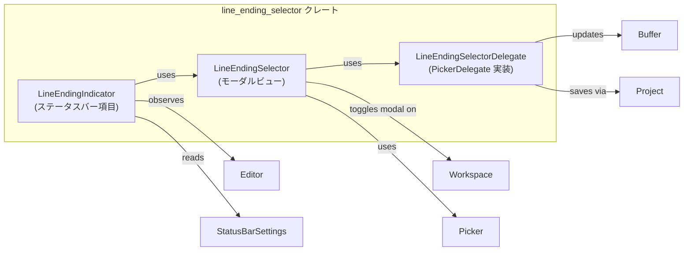

line_ending_selector ディレクトリのコードについて解説します。

# line_ending_selector/ ディレクトリ解説

## 1. ざっくり一言

エディタの現在の改行コード（`LF` / `CRLF` など）をステータスバーに表示し、モーダル（ポップアップ）で Unix / Windows のどちらかに変更できるようにするための UI コンポーネントを提供するモジュール群です。

---

## 2. このモジュールの役割

### 役割の概要

- エディタのアクティブなバッファから現在の `LineEnding` を読み取り、ステータスバーに表示します。
- ステータスバーのボタンやアクション（`Toggle`）を通じて、「改行コード選択」モーダルを開閉します。
- モーダル内では `Picker` コンポーネントを用いて「Unix / Windows」の二択リストを表示し、選択された改行コードをバッファに適用し、保存処理をトリガします。

### アーキテクチャ内での位置づけ

このディレクトリ内のモジュールどうしと、外部のエディタ／UI コンポーネントとの関係はおおよそ次のようになっています。



- `LineEndingIndicator`
  - ワークスペースのステータスバーに表示される項目です。
  - アクティブな `Editor` を監視し、`Buffer` の `LineEnding` を表示します。
  - ボタン押下で `LineEndingSelector::toggle` を呼び出します。
- `LineEndingSelector`
  - ワークスペースのモーダルとして表示されるビューです。
  - 内部に `Picker<LineEndingSelectorDelegate>` を持ち、選択 UI を表示します。
- `LineEndingSelectorDelegate`
  - `PickerDelegate` を実装し、Unix / Windows の候補を管理し、選択時に `Buffer` の `line_ending` を変更し、`Project` に保存を依頼します。

### 設計上のポイント

コードから読み取れる特徴をまとめると次の通りです。

- **責務分割**
  - 「ステータスバー表示＋クリック検知」（`LineEndingIndicator`）と、
    「モーダル UI＋バッファ更新」（`LineEndingSelector` / `LineEndingSelectorDelegate`）が分離されています。
- **エンティティと弱参照**
  - `gpui::Entity` / `WeakEntity` を利用して `Editor`・`Buffer`・`Project`・`Picker` などの UI/モデルオブジェクトを参照します。
  - `WeakEntity` を使うことで、対象が破棄された場合に安全に何もしない形で処理を打ち切る構造になっています（`toggle` 内の `ok().flatten()` など）。
- **リアクティブな更新**
  - `LineEndingIndicator` は `StatusItemView::set_active_pane_item` と `cx.observe_in` により、アクティブエディタやバッファの変化に応じて自動更新されます。
- **シンプルな選択肢**
  - 選択可能な `LineEnding` は `Unix` と `Windows` の 2 種類に固定されています（`matches: vec![LineEnding::Unix, LineEnding::Windows]`）。
- **モーダル統合**
  - `LineEndingSelector` は `ModalView` と `EventEmitter<DismissEvent>` を実装し、ワークスペースのモーダル管理に組み込まれる前提の設計になっています。

---

## 3. 主要な機能一覧

このディレクトリが提供する主な機能を列挙します。

- ステータスバーへの改行コード表示（`LineEndingIndicator`）
- ステータスバーからの「改行コード選択」モーダル起動（`Toggle` アクション → `LineEndingSelector::toggle`）
- モーダル内での Unix / Windows 改行コードの一覧表示（`Picker<LineEndingSelectorDelegate>`）
- 選択された改行コードのバッファへの適用（`Buffer::set_line_ending` を呼び出し）
- 改行コード変更後のバッファ保存処理のトリガ（`Project::save_buffer` 呼び出し）
- モーダルのフォーカス管理・閉じるイベントの発行（`Focusable` / `DismissEvent` / `ModalView`）

---

## 4. 関数・構造体の解説

### 4.1 主な構造体・型一覧

| 名前 | 種別 | 役割 / 用途 |
|------|------|-------------|
| `LineEndingIndicator` | 構造体 | ステータスバーに現在の改行コードボタンを表示し、クリックでセレクタモーダルを開く |
| `LineEndingSelector` | 構造体 | 改行コード選択モーダルのビュー。内部に `Picker<LineEndingSelectorDelegate>` を保持する |
| `LineEndingSelectorDelegate` | 構造体 | `PickerDelegate` 実装。Unix / Windows の候補リスト管理と選択時のバッファ更新・保存を行う |
| `Toggle` | アクション型 | `actions!` マクロで定義されるアクション。改行コードセレクタモーダルの開閉トリガ |
| `init` | 関数 | アプリケーションにこのモジュールを登録し、新規 `Editor` に `Toggle` アクションを紐づけるエントリポイント |

### 4.2 重要な関数・メソッドの詳細（7 件）

#### 1. `pub fn init(cx: &mut App)`

**概要**

- アプリケーションの `App` コンテキストに対して、このモジュールの機能を登録します。
- 新しく生成される `Editor` ごとに `LineEndingSelector::register` を呼び、`Toggle` アクションを紐づけます。

**引数**

| 引数名 | 型 | 説明 |
|--------|----|------|
| `cx` | `&mut App` | アプリケーション全体のコンテキスト（`gpui` 側で定義されている型と推測されますが、このチャンクでは定義は見えません） |

**戻り値**

- なし（副作用としてオブザーバを登録します）。

**内部処理の流れ**

1. `cx.observe_new(LineEndingSelector::register)` を呼び出し、新規 `Editor` インスタンスが作られたタイミングで `LineEndingSelector::register` が呼ばれるように設定します。
2. `detach()` により、このオブザーバ `Task` を切り離し、呼び出し元で待たないようにします。

**使用例**

```rust
// アプリケーション起動時など、プラグイン・拡張機能を初期化する段階で呼び出す想定の例です。
fn init_plugins(app: &mut App) {                         // App はアプリ全体のコンテキスト
    line_ending_selector::init(app);                     // 新規 Editor への改行コードセレクタ登録を有効化する
}
```

**エッジケース・注意点**

- この関数自体にはエラー処理はなく、`observe_new` の戻り値に対してただ `detach()` を呼ぶだけです。
- 同じ `App` に対して複数回呼び出すと、同じ登録処理が重複する可能性がありますが、その挙動は `observe_new` の実装次第であり、このチャンクからは詳細は分かりません。

---

#### 2. `LineEndingIndicator::update(&mut self, editor: Entity<Editor>, _: &mut Window, cx: &mut Context<Self>)`

**概要**

- 指定された `Editor` のアクティブバッファから現在の `LineEnding` を読み取り、インジケータの状態を更新します。

**引数**

| 引数名 | 型 | 説明 |
|--------|----|------|
| `editor` | `Entity<Editor>` | 対象のエディタエンティティ |
| `_` | `&mut Window` | ウィンドウコンテキスト（この関数内では未使用） |
| `cx` | `&mut Context<Self>` | `LineEndingIndicator` 自身のコンテキスト |

**戻り値**

- なし。`self.line_ending` と `self.active_editor` を更新し、`cx.notify()` で再描画を促します。

**内部処理の流れ**

1. `self.line_ending` と `self.active_editor` を `None` にリセットします。
2. `editor.read(cx).active_buffer(cx)` でアクティブな `Buffer` を取得します。
3. バッファが存在する場合:
   - `buffer.read(cx).line_ending()` で現在の改行コードを取得します。
   - `self.line_ending = Some(line_ending)` として保存。
   - `self.active_editor = Some(editor.downgrade())` として、`WeakEntity<Editor>` を保持。
4. 最後に `cx.notify()` を呼び、UI の再描画を通知します。

**エッジケース**

- アクティブバッファが存在しない場合（`active_buffer` が `None`）:
  - `self.line_ending` と `self.active_editor` は `None` のままとなります。
  - `render` メソッド側でボタンが表示されなくなります。

**使用上の注意点**

- 通常は直接呼び出すのではなく、`StatusItemView::set_active_pane_item` や `cx.observe_in` によって呼ばれる前提です。
- `editor` が有効である前提で `read` を行っています。`Entity` が無効になるケースについてはこの関数内では考慮していません（呼び出し元で管理されていると考えられます）。

---

#### 3. `impl Render for LineEndingIndicator { fn render(&mut self, _window: &mut Window, cx: &mut Context<Self>) -> impl IntoElement }`

**概要**

- ステータスバー上に表示される改行コードボタンを描画します。
- 設定や状態に応じて、ボタンを非表示にしたり、現在の改行コードラベルを表示したりします。

**引数**

| 引数名 | 型 | 説明 |
|--------|----|------|
| `_window` | `&mut Window` | ウィンドウコンテキスト（このメソッド内では未使用） |
| `cx` | `&mut Context<Self>` | インジケータのコンテキスト |

**戻り値**

- `impl IntoElement`：UI ツリーに追加される要素（`div` またはその子を含むレイアウト）を返します。

**内部処理の流れ**

1. `StatusBarSettings::get_global(cx).line_endings_button` を参照し、改行ボタンが有効かどうかを確認します。
   - `false` の場合は `div()`（空コンテナ）を返し、何も表示しません。
2. 設定が有効な場合、`self.line_ending.as_ref()` を使って現在の `LineEnding` が存在するか確認します。
   - 存在する場合: `div().when_some(...)` により、ボタンを子要素として追加します。
   - 存在しない場合: ボタンは表示されません。
3. ボタンは次の属性を持ちます。
   - `Button::new("change-line-ending", line_ending.label())`：ラベルとして `LineEnding::label()` を使用。
   - `.label_size(LabelSize::Small)`：小さいラベルサイズ。
   - `.on_click(...)`：クリック時に `this.active_editor` があれば `LineEndingSelector::toggle` を呼ぶ。
   - `.tooltip(...)`：`Toggle` アクションに対応するツールチップを表示。

**使用例（概念的）**

```rust
// ステータスバー用のビューの一部として LineEndingIndicator を使用する例（概念的）
let mut indicator = LineEndingIndicator::default();            // 初期状態のインジケータを生成
let element = indicator.render(window, cx);                    // ステータスバー内で描画に利用する
```

※ 実際には `StatusItemView` を実装しているため、ステータスバー管理側から呼ばれる形になります。

**エッジケース・注意点**

- グローバル設定で `line_endings_button` が無効な場合は、`self.line_ending` に値があってもボタンは一切表示されません。
- `self.active_editor` が `None` の状態でボタンがクリックされた場合、`on_click` 内の `if let Some(editor)` により何も起こりません（モーダルが開かない）。

---

#### 4. `LineEndingSelector::toggle(editor: &WeakEntity<Editor>, window: &mut Window, cx: &mut App)`

**概要**

- 指定されたエディタに対して、改行コードセレクタモーダルを開閉します。
- エディタが有効かつアクティブバッファを持っている場合にのみモーダルを開きます。

**引数**

| 引数名 | 型 | 説明 |
|--------|----|------|
| `editor` | `&WeakEntity<Editor>` | 対象エディタの弱参照 |
| `window` | `&mut Window` | ウィンドウコンテキスト |
| `cx` | `&mut App` | アプリケーションコンテキスト |

**戻り値**

- なし。副作用としてワークスペースのモーダルの開閉を行います。

**内部処理の流れ**

1. `editor.update(cx, |editor, cx| { Some((editor.workspace()?, editor.active_buffer(cx)?)) })` を呼び出し、
   - `Editor` から `workspace()` を取得。
   - `active_buffer(cx)` でアクティブな `Buffer` を取得。
   - 上記が両方成功した場合 `(workspace, buffer)` のタプルを `Some` で返す。
2. `.ok().flatten()` により、`update` が失敗した場合や、いずれかの `?` が `None` を返した場合には `None` になり、`else { return; }` で何もせず終了します。
3. 成功した場合、`workspace.update(cx, |workspace, cx| { ... })` を呼び出し:
   - `let project = workspace.project().clone();` で `Project` エンティティを取得。
   - `workspace.toggle_modal(window, cx, move |window, cx| { LineEndingSelector::new(buffer, project, window, cx) });`
     を用いて、`LineEndingSelector` モーダルをトグル表示します。

**使用例（概念的）**

```rust
fn open_line_ending_selector(editor: &WeakEntity<Editor>, window: &mut Window, app: &mut App) {
    LineEndingSelector::toggle(editor, window, app);           // 条件が整っていれば改行コードセレクタを開く
}
```

**エッジケース・注意点**

- 次のような場合、モーダルは開かれません。
  - `WeakEntity<Editor>` が無効（`update` がエラー）な場合。
  - エディタがワークスペースを持たない場合（`workspace()` が `None` を返す場合）。
  - アクティブバッファが存在しない場合（`active_buffer` が `None` を返す場合）。
- これらのケースでは静かに `return` し、ユーザーには何も起こらないように見えます。

---

#### 5. `LineEndingSelector::new(buffer: Entity<Buffer>, project: Entity<Project>, window: &mut Window, cx: &mut Context<Self>) -> Self`

**概要**

- 指定されたバッファとプロジェクトを対象とする `LineEndingSelector` インスタンス（モーダルビュー）を生成します。

**引数**

| 引数名 | 型 | 説明 |
|--------|----|------|
| `buffer` | `Entity<Buffer>` | 改行コードを変更したいバッファ |
| `project` | `Entity<Project>` | バッファの保存処理を行うプロジェクト |
| `window` | `&mut Window` | ウィンドウコンテキスト |
| `cx` | `&mut Context<Self>` | `LineEndingSelector` のコンテキスト |

**戻り値**

- 新しく構築された `LineEndingSelector`。

**内部処理の流れ**

1. `let line_ending = buffer.read(cx).line_ending();` で、現在の改行コードを取得します。
2. `let delegate = LineEndingSelectorDelegate::new(cx.entity().downgrade(), buffer, project, line_ending);`
   - 自身（`LineEndingSelector`）の `WeakEntity`、
   - 対象 `Buffer`、
   - 対象 `Project`、
   - 現在の `LineEnding`
   を引数に `LineEndingSelectorDelegate` を生成します。
3. `let picker = cx.new(|cx| Picker::nonsearchable_uniform_list(delegate, window, cx));`
   - 検索バーのない固定リスト型 `Picker` を生成します。
4. `Self { picker }` として `LineEndingSelector` を初期化します。

**エッジケース・注意点**

- `buffer.read(cx)` が前提として有効な `Buffer` である必要があります。`Entity` が無効な場合の挙動は `read` の実装に依存し、このチャンクからは分かりません。
- 候補リストは `LineEndingSelectorDelegate::new` の中で `Unix` / `Windows` に固定されています。バッファの現在の `LineEnding` がこのどちらかでない場合の扱いは、このコードからは判断できません。

---

#### 6. `LineEndingSelectorDelegate::confirm(&mut self, _: bool, window: &mut Window, cx: &mut Context<Picker<Self>>)`

**概要**

- ユーザーが `Picker` 上で選択を確定したときに呼び出されます。
- 選択された `LineEnding` をバッファに適用し、その後プロジェクトにバッファの保存処理を依頼し、最後にモーダルを閉じます。

**引数**

| 引数名 | 型 | 説明 |
|--------|----|------|
| `_` | `bool` | 「プレビューかどうか」などのフラグと思われますが、この実装では未使用です |
| `window` | `&mut Window` | ウィンドウコンテキスト（`dismissed` の呼び出しに渡されます） |
| `cx` | `&mut Context<Picker<Self>>` | `Picker` のコンテキスト |

**戻り値**

- なし。

**内部処理の流れ**

1. `if let Some(line_ending) = self.matches.get(self.selected_index) { ... }`
   - 現在の `selected_index` に対応する `LineEnding` 候補を取得します。
2. 候補が存在する場合:
   - `self.buffer.update(cx, |this, cx| { this.set_line_ending(*line_ending, cx); });`
     - バッファに選択された改行コードを設定します。
   - `let buffer = self.buffer.clone(); let project = self.project.clone();`
     でクローンを作成。
   - `cx.defer(move |cx| { project.update(cx, |this, cx| { this.save_buffer(buffer, cx).detach(); }); });`
     - 非同期タスクとして、プロジェクトに `save_buffer` を依頼します。
3. 最後に `self.dismissed(window, cx);` を呼び、モーダル側に閉じるイベントを通知します。

**使用例（概念的）**

`confirm` は `Picker` から呼ばれるコールバックであり、通常ユーザーコードから直接呼び出す必要はありません。

```rust
// Picker 内部からユーザー操作によって confirm が呼ばれるイメージ
// 実際の呼び出しは Picker 実装側が行います。
```

**エッジケース**

- `self.selected_index` が `matches` の範囲外の場合:
  - `self.matches.get(self.selected_index)` が `None` になり、改行コード変更・保存処理はスキップされます。
  - それでも `self.dismissed(window, cx);` は呼ばれるため、モーダルは閉じます。
- `Project::save_buffer` の具体的な動作（ディスクへの保存など）は、このチャンクからは分かりません。名前からは永続化処理と推測されますが、詳細はプロジェクト側の実装に依存します。

---

#### 7. `LineEndingSelectorDelegate::render_match(&self, ix: usize, selected: bool, _: &mut Window, _: &mut Context<Picker<Self>>) -> Option<ListItem>`

**概要**

- `Picker` の一覧に表示する 1 行分（リストアイテム）を生成します。
- 現在選択中の候補にはトグル状態を付加し、現在のバッファの改行コードと一致する候補にはチェックアイコンを表示します。

**引数**

| 引数名 | 型 | 説明 |
|--------|----|------|
| `ix` | `usize` | レンダリングしたい候補のインデックス |
| `selected` | `bool` | この候補が現在 Picker 上で選択されているかどうか |
| `_` | `&mut Window` | ウィンドウコンテキスト（未使用） |
| `_` | `&mut Context<Picker<Self>>` | Picker コンテキスト（未使用） |

**戻り値**

- `Option<ListItem>`:
  - `Some(ListItem)`：`ix` が有効な範囲で、該当候補の UI を生成できた場合。
  - `None`：`ix` が `matches` の範囲外である場合。

**内部処理の流れ**

1. `let line_ending = self.matches.get(ix)?;`
   - `ix` 番目の `LineEnding` を取得できない場合は `None` を返します。
2. `let label = line_ending.label();` で表示用ラベルを取得します。
3. `ListItem::new(ix)` から始めて、以下のように属性を設定します。
   - `.inset(true)`：内側に余白を持たせる。
   - `.spacing(ListItemSpacing::Sparse)`：ゆとりのある行間。
   - `.toggle_state(selected)`：選択中かどうかをトグル状態として反映。
   - `.child(Label::new(label))`：ラベルとして改行コード名を表示。
4. さらに `if &self.line_ending == line_ending` の場合（現在のバッファの改行コードと一致する場合）:
   - `.end_slot(Icon::new(IconName::Check).color(Color::Muted))` を付けて、右側にチェックアイコンを表示します。
5. 最後に `Some(list_item)` を返します。

**エッジケース・注意点**

- `ix` が範囲外の場合は `None` を返し、`Picker` 側はこの行を表示しません。
- `self.line_ending` は「モーダルを開いた時点のバッファの改行コード」で固定されており、`confirm` 後に再度再描画されるかどうかは、外側の再描画タイミングに依存します（このチャンクからは詳細不明です）。

---

### 4.3 その他の主なメソッド・実装一覧

| 名前 | 所属 | 役割（1 行） |
|------|------|--------------|
| `LineEndingIndicator::set_active_pane_item` | `impl StatusItemView for LineEndingIndicator` | アクティブなペイン項目が `Editor` かどうかを判定し、購読（`observe_in`）を設定／解除する |
| `LineEndingSelector::register` | `impl LineEndingSelector` | 各 `Editor` に対して `Toggle` アクションを登録し、実行時に `LineEndingSelector::toggle` を呼ぶようにする |
| `LineEndingSelector::render` | `impl Render for LineEndingSelector` | 横幅 34 rem のコンテナ内に `Picker` を配置するモーダルビューを描画する |
| `LineEndingSelector::focus_handle` | `impl Focusable for LineEndingSelector` | Picker の `focus_handle` を委譲し、モーダルへのフォーカス制御を提供する |
| `impl EventEmitter<DismissEvent> for LineEndingSelector` | - | `DismissEvent` を受け取れるモーダルとして振る舞うためのマーカー的実装 |
| `impl ModalView for LineEndingSelector` | - | ワークスペースのモーダルシステムに統合するためのマーカー的実装 |
| `LineEndingSelectorDelegate::new` | `impl LineEndingSelectorDelegate` | `matches` を `Unix` / `Windows` の 2 つに固定したデリゲートを生成する |
| `placeholder_text` | `impl PickerDelegate` | Picker のプレースホルダテキストとして「Select a line ending…」を返す |
| `match_count` | 同上 | 候補数を返す（常に `matches.len()`） |
| `dismissed` | 同上 | モーダルが閉じられたときに `LineEndingSelector` に `DismissEvent` を emit する |
| `selected_index` / `set_selected_index` | 同上 | 現在選択中のインデックスを取得・更新する |
| `update_matches` | 同上 | 検索クエリに応じた候補更新を行うはずのメソッドだが、この実装では何もせず `Task::ready(())` を返す |

---

## 5. データフロー

ここでは、ユーザーがステータスバーから改行コードを変更する典型的なフローを示します。

### 処理の流れの概要

1. ステータスバーの `LineEndingIndicator` に表示されている改行コードボタンがクリックされます。
2. `LineEndingIndicator` が `LineEndingSelector::toggle` を呼び出し、アクティブな `Editor` から `Workspace` と `Buffer` を取得し、モーダルを開きます。
3. モーダル内の `Picker` に `Unix` / `Windows` の候補が表示され、ユーザーが一つを選択して確定します。
4. `LineEndingSelectorDelegate::confirm` が呼ばれ、バッファの改行コードを更新し、`Project::save_buffer` で保存を行い、その後モーダルを閉じます。

### シーケンス図

```mermaid
sequenceDiagram
    participant U as ユーザー
    participant SB as LineEndingIndicator<br/>(ステータスバー)
    participant E as Editor
    participant WS as Workspace
    participant SEL as LineEndingSelector
    participant PK as Picker&lt;Delegate&gt;
    participant B as Buffer
    participant P as Project

    U->>SB: 改行コードボタンをクリック
    SB->>SEL: LineEndingSelector::toggle(WeakEntity<Editor>, ...)
    SEL->>E: WeakEntity::update(...) で workspace と buffer を取得
    SEL->>WS: toggle_modal(LineEndingSelector::new(...))
    WS->>SEL: モーダル内に Picker を表示
    SEL->>PK: Picker::nonsearchable_uniform_list(delegate)

    U->>PK: Unix / Windows のどちらかを選択して確定
    PK->>B: set_line_ending(選択された LineEnding)
    PK->>P: save_buffer(buffer) を非同期タスクで依頼
    PK->>SEL: DismissEvent を emit
    SEL->>WS: モーダルを閉じる（Workspace 側のモーダル管理に依存）
```

この図は、ユーザー操作からバッファの保存までの主要なコンポーネント間のデータの流れを表しています。

---

## 6. 使い方（How to Use）

### 基本的な使用方法

このモジュールをアプリケーションに組み込む場合の基本的な流れは次の通りです。

1. アプリケーション初期化時に `line_ending_selector::init` を呼び出し、新規 `Editor` に `Toggle` アクションを登録する。
2. ステータスバーに `LineEndingIndicator` を `StatusItemView` として登録する。
3. ユーザーがステータスバーのボタンをクリックすると、モーダルが開き、改行コードを変更できる。

#### 1. init の呼び出し例

```rust
use line_ending_selector::init;                           // init 関数をインポート

fn init_plugins(app: &mut App) {                          // App はアプリケーションコンテキスト
    init(app);                                            // 新規 Editor に Toggle アクションを登録する
}
```

#### 2. LineEndingIndicator をステータスバーに登録するイメージ

実際のステータスバー API はこのチャンクには出てこないため、概念的な例になります。

```rust
use line_ending_selector::LineEndingIndicator;            // インジケータをインポート
use workspace::StatusItemView;                            // ステータスバー項目用トレイト

fn create_status_items() -> impl StatusItemView {         // 戻り値はイメージ
    LineEndingIndicator::default()                        // デフォルト状態のインジケータを生成
    // 実際には、ワークスペース側の API を使って
    // ステータスバーに登録する必要があります（このチャンクには定義がありません）。
}
```

### よくある使用パターン

1. **ステータスバーからの変更**
   - `LineEndingIndicator` がステータスバーに常駐し、現在の改行コード（例: "LF", "CRLF"）を表示します。
   - そのボタンをクリックすると、`LineEndingSelector` モーダルが開き、Unix / Windows のどちらかを選択できます。
   - 選択後はバッファの改行コードが変更され、自動的に保存処理が走ります。

2. **アクション（コマンド）からの変更**
   - `Toggle` アクションには `"Select Line Ending"` という説明が紐づいており（`Tooltip::for_action` で利用）、コマンドパレットやキーバインドから呼び出されることが想定できます。
   - その場合も内部的には `LineEndingSelector::toggle` が呼ばれ、ステータスバー経由と同じモーダルが開きます。

3. **ツールチップでの一貫した表示**
   - `LineEndingIndicator::render` 内で `Tooltip::for_action("Select Line Ending", &Toggle, cx)` を使用しているため、
     他の UI パーツでも `Toggle` アクションに対して同じ文言のツールチップを表示することができます。

### 使用上の注意点

このモジュールを利用する際に注意したいポイントをまとめます。

- **アクティブペインが Editor でない場合は表示されない**
  - `LineEndingIndicator::set_active_pane_item` の実装により、
    アクティブなペイン項目が `Editor` にダウンキャストできない場合は
    - `self.line_ending = None`
    - `self._observe_active_editor = None`
    となり、ステータスバー上のボタンは表示されません。
- **ステータスバー設定による制御**
  - `StatusBarSettings::get_global(cx).line_endings_button` が `false` の場合、
    `LineEndingIndicator` はボタンを一切描画しません。
  - 設定 UI などからこのフラグが切り替えられる前提と考えられます。
- **エディタやバッファが存在しない場合は何もしない**
  - `LineEndingSelector::toggle` 内で `editor.update(...).ok().flatten()` を使っているため、
    - エディタがすでに破棄されている
    - ワークスペースやアクティブバッファが取得できない
    といった場合には、モーダルは開かず静かに処理が終了します。
- **対応している改行コードは Unix / Windows のみ**
  - `LineEndingSelectorDelegate::new` 内で `matches: vec![LineEnding::Unix, LineEnding::Windows]` として固定されており、
    他の種類の `LineEnding` が存在したとしても、この UI からは選択できません。
- **改行コード変更時に保存処理が走る**
  - `confirm` で `Project::save_buffer` が呼ばれるため、改行コードの変更と同時にバッファの保存処理が行われます。
  - `save_buffer` の具体的な挙動（即時ディスク書き込みか、非同期キューかなど）はこのチャンクには出てきませんが、状態管理に影響する可能性があります。
- **ステータスバー更新の前提**
  - `LineEndingIndicator` は `cx.observe_in(&editor, window, Self::update)` によりエディタの状態変化を監視しています。
  - ワークスペース側でペインの切り替えやバッファの変更時に `set_active_pane_item` が適切に呼ばれないと、インジケータ表示が最新状態にならない可能性があります。

---

## 7. 関連ファイル

このディレクトリに含まれるファイルと、その役割をまとめます。

| パス | 役割 / 関係 |
|------|------------|
| `line_ending_selector/Cargo.toml` | クレート名・バージョン・ライセンス・依存クレート（`editor`, `gpui`, `language`, `picker`, `project`, `ui`, `util`, `workspace` など）を定義する |
| `line_ending_selector/src/line_ending_selector.rs` | ライブラリ本体。`LineEndingSelector` モーダル、`LineEndingSelectorDelegate`、`Toggle` アクション、`init` 関数、および `LineEndingIndicator` の再エクスポートを定義する |
| `line_ending_selector/src/line_ending_indicator.rs` | ステータスバー用の `LineEndingIndicator` を定義し、アクティブな `Editor` の改行コード表示と `Toggle` アクションの起点となる |

このディレクトリ全体として、「ステータスバーの小さなボタン」から「モーダルでの改行コード選択」「バッファへの適用と保存」までを一貫して提供する構成になっています。
