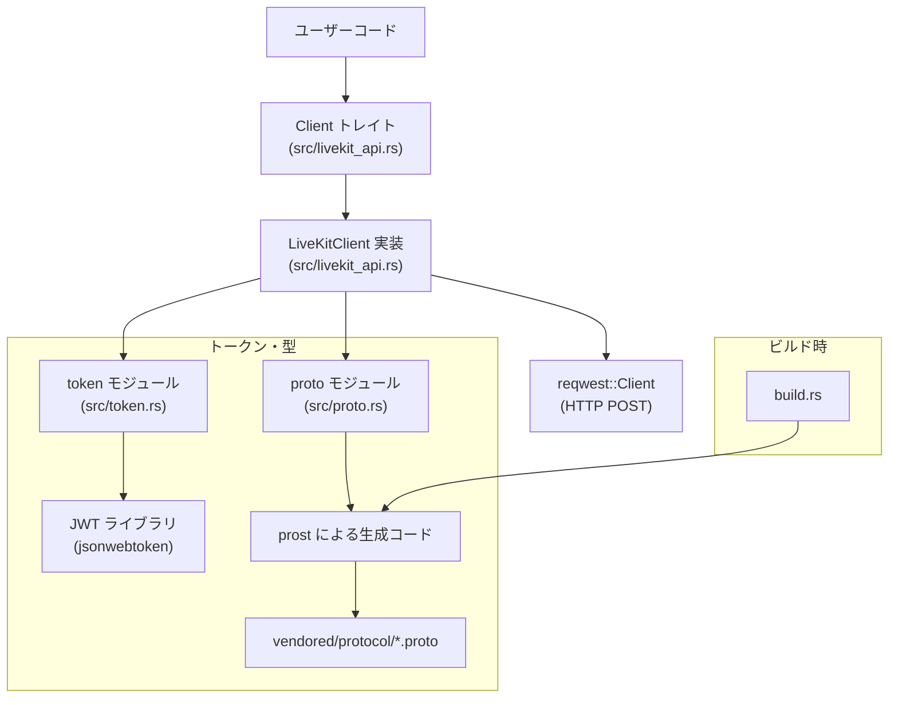
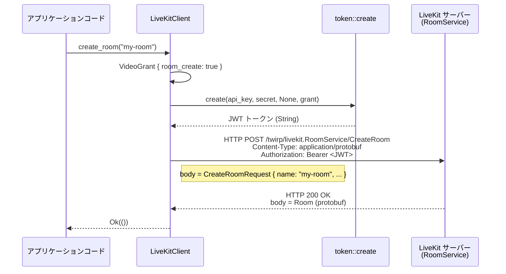

## 1. ざっくり一言

LiveKit の「RoomService」HTTP API と JWT ベースの認可トークンを、Rust から簡単に扱うための **軽量 SDK クレート**です。  
vendored された `.proto` 定義から生成された型と、HTTP クライアント・トークン生成ロジックをまとめています。

---

## 2. このモジュールの役割

### 2.1 概要

- LiveKit サーバーの **Room 管理 API（Twirp + protobuf）** を Rust から呼び出すためのクライアントを提供します。
- LiveKit の認可に使う **JWT トークン生成・検証ロジック** を提供します。
- LiveKit プロトコル（Room / Participant / Egress など）の **protobuf メッセージ型** を Rust の型として利用できるようにします。

### 2.2 構成要素と依存関係

このクレート内部の主要コンポーネントの関係は次のようになっています。



- `Client` トレイトは、このクレートの対外的なインターフェースです。
- `LiveKitClient` は `Client` トレイトの標準実装で、`reqwest` により HTTP 通信を行います。
- `token` モジュールが JWT 作成／検証を担当し、その中で `jsonwebtoken` クレートを利用します。
- `proto` モジュールは `build.rs` + `prost-build` によって、`vendored/protocol` 配下の protobuf 定義から生成された Rust 型を re-export します。

### 2.3 設計上のポイント

コードから読み取れる特徴をまとめると、次のようになっています。

- **役割ごとの分割**
  - HTTP クライアントロジック: `LiveKitClient`（`src/livekit_api.rs`）
  - 権限スコープ付き JWT: `token` モジュール（`src/token.rs`）
  - protobuf 型: `proto` モジュール（`src/proto.rs`）
- **非同期 API**
  - `Client` トレイトは `async-trait` を用いて `async fn` を持つトレイトとして定義されています。
  - HTTP 呼び出しは `reqwest` の非同期クライアントを使用します。
- **シリアライズ形式**
  - サーバーとのやり取りは **protobuf バイナリ** (`application/protobuf`) で行われ、`prost::Message` を使ってエンコード／デコードします。
- **エラーハンドリング**
  - パブリック API の多くは `anyhow::Result<T>` を返します。
  - HTTP ステータスが 2xx 以外の時には `anyhow::bail!` でエラーを返し、ステータスコードとレスポンス本文をログ・エラーに含めています。
- **設定とビルド**
  - vendored の `.proto` を `prost-build` でビルド時に Rust コードへ変換し、`include!` で取り込む構成になっています。

---

## 3. 主要な機能一覧

このクレートが提供する主な機能を列挙します。

- **LiveKit API クライアント**
  - `Client` トレイト: LiveKit のサーバー API を抽象化するインターフェース
  - `LiveKitClient`: 実際に HTTP 経由で Room API を呼び出す実装

- **Room 管理操作（RoomService の一部）**
  - `create_room(name: String)`: 新しい Room を作成
  - `delete_room(name: String)`: Room を削除
  - `remove_participant(room: String, identity: String)`: 指定 participant を強制退室させる
  - `update_participant(room: String, identity: String, permission: ParticipantPermission)`: participant の権限を更新

- **トークン関連**
  - `token::VideoGrant`: Room に対する権限セットの表現
  - `token::create`: API キーとシークレットから、LiveKit が認識する JWT を生成
  - `token::validate`: JWT を検証し、クレーム (`ClaimGrants`) を取り出す

- **プロトコルバッファ型**
  - `proto` モジュール: LiveKit の Room / Participant / Track / Egress / Ingress などに対応する protobuf 型定義
    - 例: `proto::Room`, `proto::ParticipantInfo`, `proto::ParticipantPermission`, `proto::CreateRoomRequest`, `proto::UpdateParticipantRequest` など

---

## 4. 関数・構造体の解説

### 4.1 主な構造体・トレイト一覧

| 名前 | 種別 | 役割 / 用途 |
|------|------|-------------|
| `Client` | トレイト | LiveKit API クライアントの抽象インターフェース |
| `LiveKitClient` | 構造体 | `Client` の標準実装。HTTP 経由で LiveKit にアクセス |
| `ClaimGrants<'a>` | 構造体 | JWT のクレーム（発行者、subject、期限、VideoGrant など） |
| `VideoGrant<'a>` | 構造体 | LiveKit における video/room 関連の権限セット |
| `proto::Room` | 構造体 | Room の情報（`livekit_room.proto` 定義） |
| `proto::ParticipantPermission` | 構造体 | participant の権限設定 |
| `proto::ParticipantInfo` | 構造体 | participant の状態やトラック情報 |

以降では、主要なトレイト・構造体・関数について順に説明します。

---

### 4.2 `Client` トレイト

```rust
#[async_trait]
pub trait Client: Send + Sync {
    fn url(&self) -> &str;
    async fn create_room(&self, name: String) -> Result<()>;
    async fn delete_room(&self, name: String) -> Result<()>;
    async fn remove_participant(&self, room: String, identity: String) -> Result<()>;
    async fn update_participant(
        &self,
        room: String,
        identity: String,
        permission: proto::ParticipantPermission,
    ) -> Result<()>;
    fn room_token(&self, room: &str, identity: &str) -> Result<String>;
    fn guest_token(&self, room: &str, identity: &str) -> Result<String>;
}
```

**概要**

- LiveKit API クライアントのインターフェースであり、アプリケーション側からはこのトレイトを通して操作します。
- 非同期の Room 操作メソッドと、トークン生成メソッドをまとめています。
- `Send + Sync` 制約により、クライアント実装はスレッド間で共有できることが前提になっています。

**主なメソッドの意味**

- `create_room`: 指定した名前の Room を新規作成します。
- `delete_room`: 指定した名前の Room を削除します。
- `remove_participant`: Room から特定の参加者を退出させます。
- `update_participant`: 参加者の権限 (`ParticipantPermission`) を更新します。
- `room_token`: 通常の参加者として Room に join するためのトークンを生成します。
- `guest_token`: 発言できないゲスト用のトークンを生成します。

**使用例（トレイト経由の利用）**

```rust
use livekit_api::{Client, LiveKitClient};       // このクレートの型をインポート
use anyhow::Result;

async fn example_usage() -> Result<()> {
    // LiveKitClient を Box<dyn Client> として扱う
    let client: Box<dyn Client> =
        Box::new(LiveKitClient::new(
            "https://livekit.example.com".to_string(), // LiveKit のベース URL
            "API_KEY".to_string(),                     // LiveKit の API キー
            "API_SECRET".to_string(),                  // API シークレット
        ));

    client.create_room("my-room".to_string()).await?;

    let token = client.room_token("my-room", "user-1")?;
    println!("room token = {}", token);

    Ok(())
}
```

---

### 4.3 `LiveKitClient` と HTTP リクエスト処理

#### 構造体定義とコンストラクタ

```rust
#[derive(Clone)]
pub struct LiveKitClient {
    http: reqwest::Client,
    url: Arc<str>,
    key: Arc<str>,
    secret: Arc<str>,
}

impl LiveKitClient {
    pub fn new(mut url: String, key: String, secret: String) -> Self {
        if url.ends_with('/') {
            url.pop();
        }

        Self {
            http: reqwest::ClientBuilder::new()
                .timeout(Duration::from_secs(5))
                .build()
                .unwrap(),
            url: url.into(),
            key: key.into(),
            secret: secret.into(),
        }
    }
}
```

**概要**

- `LiveKitClient` は `Client` トレイトの具象実装です。
- `reqwest::Client`、LiveKit サーバーのベース URL、API キー・シークレットを内部に保持します。
- `#[derive(Clone)]` により、クライアントをクローンして複数箇所で共有できます（内部は `Arc` で共有）。

**`new` の挙動**

- 引数 `url` の末尾に `/` が付いていれば削除してから保存します。
- `reqwest::ClientBuilder` でタイムアウト 5 秒の HTTP クライアントを生成します。
- `key` と `secret` は `Arc<str>` として保持されるため、クローン時にもメモリを共有します。

**使用例**

```rust
use livekit_api::LiveKitClient;

let client = LiveKitClient::new(
    "https://livekit.example.com/".to_string(), // 末尾の / は内部で削除される
    "API_KEY".to_string(),
    "API_SECRET".to_string(),
);

// &client から Client トレイトメソッドを呼び出せる
```

**使用上の注意**

- `reqwest::Client::build()` には `unwrap()` を使用しているため、ビルドに失敗すると panic します。
  - 通常はデフォルト設定のため失敗するケースは限定的ですが、ライブラリとして利用する場合はこの点を前提にしておく必要があります。
- タイムアウトは固定で 5 秒です。長時間かかる操作を行う場合は、これに収まらないと `reqwest` 側でエラーになります。

#### 内部メソッド `request`

```rust
impl LiveKitClient {
    fn request<Req, Res>(
        &self,
        path: &str,
        grant: token::VideoGrant,
        body: Req,
    ) -> impl Future<Output = Result<Res>>
    where
        Req: Message,
        Res: Default + Message,
    {
        let client = self.http.clone();
        let token = token::create(&self.key, &self.secret, None, grant);
        let url = format!("{}/{}", self.url, path);
        log::info!("Request {}: {:?}", url, body);
        async move {
            let token = token?;
            let response = client
                .post(&url)
                .header(CONTENT_TYPE, "application/protobuf")
                .bearer_auth(token)
                .body(body.encode_to_vec())
                .send()
                .await?;

            if response.status().is_success() {
                log::info!("Response {}: {:?}", url, response.status());
                Ok(Res::decode(response.bytes().await?)?)
            } else {
                log::error!("Response {}: {:?}", url, response.status());
                anyhow::bail!(
                    "POST {} failed with status code {:?}, {:?}",
                    url,
                    response.status(),
                    response.text().await
                );
            }
        }
    }
}
```

**概要**

- Room API への HTTP POST を共通化した内部ヘルパーです。
- 任意の protobuf メッセージ `Req` をリクエストボディとして送り、`Res` 型の protobuf をレスポンスとして受け取ります。
- 認可用 JWT は `token::create` に `VideoGrant` を渡して生成します。

**引数**

| 引数名 | 型 | 説明 |
|--------|----|------|
| `path` | `&str` | ベース URL からの相対パス（例: `"twirp/livekit.RoomService/CreateRoom"`） |
| `grant` | `token::VideoGrant` | リクエストに必要な LiveKit 権限（JWT 内の video claim） |
| `body` | `Req` | protobuf メッセージとして送るリクエストボディ |

**戻り値**

- `impl Future<Output = Result<Res>>`
  - 非同期に `Res` 型のレスポンスを返す Future です。
  - HTTP エラーやデコード失敗時には `anyhow::Error` を返します。

**内部処理の流れ**

1. `token::create` に API キー・シークレット・`VideoGrant` を渡して JWT を生成する Future を準備します。
2. URL を `"{base_url}/{path}"` 形式で組み立て、リクエスト内容を `log::info!` でログ出力します。
3. `reqwest::Client` で POST リクエストを発行し、ヘッダに
   - `Content-Type: application/protobuf`
   - `Authorization: Bearer <jwt>`
   を付与します。
4. レスポンスステータスが成功 (2xx) の場合:
   - ステータスをログし、レスポンスボディをバイト列として取得し、`Res::decode` で protobuf デコードして返します。
5. ステータスがエラーの場合:
   - エラーログを記録し、`anyhow::bail!` でステータスコードとレスポンス本文を含むエラー文字列を返します。

**エッジケース**

- JWT の生成 (`token::create`) がエラーになると、HTTP 呼び出し前にエラーで終了します。
- サーバーから返ってきたボディが期待する protobuf 形式でない場合、`Res::decode` がエラーになります。
- `response.text().await` の結果もエラーになり得ますが、このコードでは `?` していないため、「レスポンス本文部分の表示に失敗した」という情報はエラー型には反映されず、`Result<String>` が `Debug` 表示されます。

---

### 4.4 `Client` トレイトメソッドの実装（`LiveKitClient`）

#### `create_room`

```rust
async fn create_room(&self, name: String) -> Result<()> {
    let _: proto::Room = self
        .request(
            "twirp/livekit.RoomService/CreateRoom",
            token::VideoGrant {
                room_create: Some(true),
                ..Default::default()
            },
            proto::CreateRoomRequest {
                name,
                ..Default::default()
            },
        )
        .await?;
    Ok(())
}
```

**概要**

- LiveKit の `RoomService.CreateRoom` Twirp エンドポイントを呼び出し、新しい Room を作成します。
- レスポンスとして `proto::Room` が返りますが、この実装では結果を捨てて `()` を返しています。

**ポイント**

- 必要な権限は `room_create` です。
- `CreateRoomRequest` では `name` 以外のフィールドは `Default` で利用しています（空 timeout / metadata など）。

**エッジケース**

- 既に同名の Room が存在する場合の挙動は、LiveKit サーバー側の仕様に依存し、このコードからは確定しません。

#### `delete_room`

```rust
async fn delete_room(&self, name: String) -> Result<()> {
    let _: proto::DeleteRoomResponse = self
        .request(
            "twirp/livekit.RoomService/DeleteRoom",
            token::VideoGrant {
                room_create: Some(true),
                ..Default::default()
            },
            proto::DeleteRoomRequest { room: name },
        )
        .await?;
    Ok(())
}
```

- `RoomService.DeleteRoom` を呼び出します。
- 権限は `room_create` が必要です。
- レスポンス `DeleteRoomResponse` は空メッセージで、結果は捨てています。

#### `remove_participant`

```rust
async fn remove_participant(&self, room: String, identity: String) -> Result<()> {
    let _: proto::RemoveParticipantResponse = self
        .request(
            "twirp/livekit.RoomService/RemoveParticipant",
            token::VideoGrant::to_admin(&room),
            proto::RoomParticipantIdentity {
                room: room.clone(),
                identity,
            },
        )
        .await?;
    Ok(())
}
```

- `RoomService.RemoveParticipant` を呼び出し、指定参加者を Room から退出させます。
- 権限は `room_admin` が必要であり、そのため `VideoGrant::to_admin(&room)` を利用しています。

#### `update_participant`

```rust
async fn update_participant(
    &self,
    room: String,
    identity: String,
    permission: proto::ParticipantPermission,
) -> Result<()> {
    let _: proto::ParticipantInfo = self
        .request(
            "twirp/livekit.RoomService/UpdateParticipant",
            token::VideoGrant::to_admin(&room),
            proto::UpdateParticipantRequest {
                room: room.clone(),
                identity,
                metadata: "".to_string(),
                permission: Some(permission),
            },
        )
        .await?;
    Ok(())
}
```

- `RoomService.UpdateParticipant` を呼び出し、participant の権限を更新します。
- `metadata` は空文字列に固定されています（metadata 更新用途には使っていません）。
- レスポンスの `ParticipantInfo` は結果を捨てています。

#### トークン生成メソッド

```rust
fn room_token(&self, room: &str, identity: &str) -> Result<String> {
    token::create(
        &self.key,
        &self.secret,
        Some(identity),
        token::VideoGrant::to_join(room),
    )
}

fn guest_token(&self, room: &str, identity: &str) -> Result<String> {
    token::create(
        &self.key,
        &self.secret,
        Some(identity),
        token::VideoGrant::for_guest(room),
    )
}
```

- `room_token` は通常参加者向けトークン、`guest_token` は publish 不可のゲスト向けトークンを生成します。
- どちらも `identity` を必須とし、`VideoGrant::to_join` / `VideoGrant::for_guest` を利用して権限を設定します。

---

### 4.5 トークン関連 (`token.rs`)

#### `ClaimGrants<'a>`

```rust
#[derive(Default, Serialize, Deserialize)]
#[serde(rename_all = "camelCase")]
pub struct ClaimGrants<'a> {
    pub iss: Cow<'a, str>,
    pub sub: Option<Cow<'a, str>>,
    pub iat: u64,
    pub exp: u64,
    pub nbf: u64,
    pub jwtid: Option<Cow<'a, str>>,
    pub video: VideoGrant<'a>,
}
```

**概要**

- LiveKit の JWT が持つクレームを表現する構造体です。
- `iss`（Issuer）、`sub`（Subject）、発行時刻 (`iat`)、有効期限 (`exp`)、not-before (`nbf`)、ID (`jwtid`) に加え、`video` フィールドとして `VideoGrant` を含みます。
- `Cow<'a, str>` により、文字列を借用または所有のどちらでも持てるようにしています。

#### `VideoGrant<'a>`

```rust
#[derive(Default, Serialize, Deserialize)]
#[serde(rename_all = "camelCase")]
pub struct VideoGrant<'a> {
    pub room_create: Option<bool>,
    pub room_join: Option<bool>,
    pub room_list: Option<bool>,
    pub room_record: Option<bool>,
    pub room_admin: Option<bool>,
    pub room: Option<Cow<'a, str>>,
    pub can_publish: Option<bool>,
    pub can_subscribe: Option<bool>,
    pub can_publish_data: Option<bool>,
    pub hidden: Option<bool>,
    pub recorder: Option<bool>,
}
```

**概要**

- LiveKit の video/room 関連権限（`room_join`、`room_admin` など）をまとめた構造体です。
- すべて `Option` なので、セットされているフィールドのみが JWT にシリアライズされます。

**ヘルパーメソッド**

```rust
impl<'a> VideoGrant<'a> {
    pub fn to_admin(room: &'a str) -> Self { /* ... */ }
    pub fn to_join(room: &'a str) -> Self { /* ... */ }
    pub fn for_guest(room: &'a str) -> Self { /* ... */ }
}
```

- `to_admin(room)`: 指定 Room に対する `room_admin` 権限を持つ grant を生成します。
- `to_join(room)`: publish/subcribe 可能な通常参加者用 grant を生成します。
- `for_guest(room)`: 購読のみ可能なゲスト用 grant を生成します。

#### `create` 関数

```rust
pub fn create(
    api_key: &str,
    secret_key: &str,
    identity: Option<&str>,
    video_grant: VideoGrant,
) -> Result<String> {
    if video_grant.room_join.is_some() && identity.is_none() {
        anyhow::bail!("identity is required for room_join grant, but it is none");
    }

    let now = SystemTime::now();

    let claims = ClaimGrants {
        iss: Cow::Borrowed(api_key),
        sub: identity.map(Cow::Borrowed),
        iat: now.duration_since(UNIX_EPOCH).unwrap().as_secs(),
        exp: now
            .add(DEFAULT_TTL)
            .duration_since(UNIX_EPOCH)
            .unwrap()
            .as_secs(),
        nbf: 0,
        jwtid: identity.map(Cow::Borrowed),
        video: video_grant,
    };
    Ok(jsonwebtoken::encode(
        &Header::default(),
        &claims,
        &EncodingKey::from_secret(secret_key.as_ref()),
    )?)
}
```

**概要**

- LiveKit 用の署名付き JWT を生成し、`String` として返します。
- デフォルトの TTL は 6 時間 (`DEFAULT_TTL`) です。

**引数**

| 引数名 | 型 | 説明 |
|--------|----|------|
| `api_key` | `&str` | JWT の `iss` にセットされる API キー |
| `secret_key` | `&str` | 署名に使うシークレットキー（HMAC 用） |
| `identity` | `Option<&str>` | `sub` および `jwtid` に利用するユーザー識別子（room_join grant では必須） |
| `video_grant` | `VideoGrant` | JWT の `video` claim として格納する権限情報 |

**戻り値**

- 成功時: 署名済み JWT 文字列 (`Ok(String)`)
- 失敗時: `anyhow::Error`（`jsonwebtoken::encode` のエラーなど）

**内部処理の流れ**

1. `video_grant` に `room_join` が含まれているのに `identity` が `None` の場合、エラーで終了します。
2. 現在時刻 `now` を取得し、UNIX エポックからの秒数を `iat` に設定します。
3. `exp` は `now + DEFAULT_TTL` の秒数に設定します。
4. `ClaimGrants` 構造体を組み立てます。
5. `jsonwebtoken::encode` を使い、`Header::default()`（HS256 など）と `EncodingKey::from_secret(secret_key.as_ref())` で署名します。

**エッジケース**

- `SystemTime::now().duration_since(UNIX_EPOCH)` がエラーになるケース（システム時刻が過去にずれているなど）は `unwrap()` により panic します。
- `identity` が `None` でも `room_join` が指定されていなければ、そのまま JWT が生成されます。

**使用上の注意**

- TTL はコード内の `DEFAULT_TTL` 固定（6 時間）であり、外部から変更する仕組みはこのチャンクにはありません。
- LiveKit 側の仕様により、`video` claim の内容と `iss`・`sub` の組み合わせが認可に影響します。

**使用例**

```rust
use livekit_api::token::{self, VideoGrant};
use anyhow::Result;

fn make_token() -> Result<String> {
    let grant = VideoGrant::to_join("room-1"); // room-1 に join できる権限
    let token = token::create("API_KEY", "API_SECRET", Some("user-123"), grant)?;
    Ok(token)
}
```

#### `validate` 関数

```rust
pub fn validate<'a>(token: &'a str, secret_key: &str) -> Result<ClaimGrants<'a>> {
    let token = jsonwebtoken::decode(
        token,
        &DecodingKey::from_secret(secret_key.as_ref()),
        &Validation::default(),
    )?;

    Ok(token.claims)
}
```

**概要**

- 受け取った JWT を検証し、`ClaimGrants` にデシリアライズして返します。
- HS256 など、`Header::default()` に対応するアルゴリズムと `secret_key` を使って署名検証を行います（`Validation::default()` に従う）。

**引数**

| 引数名 | 型 | 説明 |
|--------|----|------|
| `token` | `&str` | 検証対象の JWT 文字列 |
| `secret_key` | `&str` | 署名検証に用いるシークレットキー |

**戻り値**

- 検証成功時: `Ok(ClaimGrants)`（JWT のクレーム）
- 検証失敗時: `anyhow::Error`（`jsonwebtoken::decode` が返すエラー）

---

### 4.6 `proto` モジュール（protobuf 型）

```rust
// src/proto.rs
include!(concat!(env!("OUT_DIR"), "/livekit.rs"));
```

- `build.rs` で `vendored/protocol` 配下の `livekit_room.proto`（およびその import 先）から生成された Rust コードを取り込みます。
- その結果として、次のような型が利用可能になります（一部抜粋）:
  - Room 関連: `Room`, `CreateRoomRequest`, `DeleteRoomRequest`, `DeleteRoomResponse`, `ListRoomsRequest`, `ListRoomsResponse` など
  - Participant 関連: `ParticipantInfo`, `ParticipantPermission`, `RoomParticipantIdentity`, `UpdateParticipantRequest` など
  - データ送受信・トラック: `TrackInfo`, `ParticipantTracks`, `DataPacket`, `SendDataRequest`, `SendDataResponse` など
- これらの型はすべて `prost::Message` を実装し、`Default` も実装されているため、`Default::default()` で初期化できます。

---

## 5. データフロー

ここでは代表的なシナリオとして、`create_room` 呼び出し時のデータフローを示します。

### 5.1 `create_room` のフロー



**要点**

- アプリケーションは `LiveKitClient::create_room` を呼び出します。
- `LiveKitClient` は内部で `VideoGrant { room_create: Some(true), .. }` を作成し、`token::create` を使って JWT を生成します。
- `reqwest` により Twirp エンドポイント `twirp/livekit.RoomService/CreateRoom` に POST します。
- レスポンスとして `Room` メッセージを受け取りますが、この実装では呼び出し元には `()` だけ返します。

他のメソッド (`delete_room`, `remove_participant`, `update_participant`) も、エンドポイントとリクエスト型・権限の違いを除けば同様のデータフローです。

---

## 6. 使い方（How to Use）

### 6.1 基本的な使用方法

ここでは、Room を作成し、参加用トークンを生成する一連の処理例を示します。

```rust
// main.rs などのアプリケーションコード
use anyhow::Result;
use livekit_api::{Client, LiveKitClient};
use livekit_api::proto; // protobuf 型を使いたい場合

#[tokio::main]
async fn main() -> Result<()> {
    // LiveKit サーバーのベース URL と API キー・シークレットを指定してクライアントを作成
    let client = LiveKitClient::new(
        "https://livekit.example.com".to_string(), // Twirp エンドポイントのベース URL
        "API_KEY".to_string(),                     // LiveKit の API キー
        "API_SECRET".to_string(),                  // LiveKit の API シークレット
    );

    // Room を作成
    client.create_room("demo-room".to_string()).await?;

    // 参加者 user-1 用の通常トークンを生成
    let token = client.room_token("demo-room", "user-1")?;
    println!("join token: {}", token);

    Ok(())
}
```

### 6.2 よくある使用パターン

#### パターン1: ゲスト用トークンの発行

発言権限のないゲストに配布するトークンを発行する場合です。

```rust
use livekit_api::{Client, LiveKitClient};
use anyhow::Result;

fn make_guest_token() -> Result<String> {
    let client = LiveKitClient::new(
        "https://livekit.example.com".to_string(),
        "API_KEY".to_string(),
        "API_SECRET".to_string(),
    );

    // ゲストとして room-guest へ join するためのトークン
    client.guest_token("room-guest", "guest-42")
}
```

#### パターン2: 管理者として参加者を強制退出させる

管理用プロセスから、特定の参加者を Room から退室させる例です。

```rust
use livekit_api::{Client, LiveKitClient};
use anyhow::Result;

async fn kick_participant() -> Result<()> {
    let client = LiveKitClient::new(
        "https://livekit.example.com".to_string(),
        "API_KEY".to_string(),
        "API_SECRET".to_string(),
    );

    client
        .remove_participant("moderated-room".to_string(), "troll-user".to_string())
        .await?;

    Ok(())
}
```

#### パターン3: `Client` トレイトを使った差し替え（テストなど）

`Client` トレイトを使えば、テスト時にモック実装に差し替えることができます。

```rust
use anyhow::Result;
use async_trait::async_trait;
use livekit_api::{Client, LiveKitClient};
use livekit_api::proto;

// 実運用コードでは LiveKitClient を使用
async fn run_business_logic<C: Client>(client: &C) -> Result<()> {
    client.create_room("logic-room".to_string()).await?;
    Ok(())
}

// 簡易なモック実装
struct MockClient;
#[async_trait]
impl Client for MockClient {
    fn url(&self) -> &str { "mock://livekit" }
    async fn create_room(&self, _name: String) -> Result<()> { Ok(()) }
    async fn delete_room(&self, _name: String) -> Result<()> { Ok(()) }
    async fn remove_participant(&self, _room: String, _identity: String) -> Result<()> { Ok(()) }
    async fn update_participant(
        &self,
        _room: String,
        _identity: String,
        _permission: proto::ParticipantPermission,
    ) -> Result<()> { Ok(()) }
    fn room_token(&self, _room: &str, _identity: &str) -> Result<String> { Ok("mock".into()) }
    fn guest_token(&self, _room: &str, _identity: &str) -> Result<String> { Ok("mock".into()) }
}
```

### 6.3 使用上の注意点

- **URL の指定**
  - `LiveKitClient::new` に渡す URL はベース URL です（`https://host` や `https://host:port` など）。
  - 末尾の `/` は自動的に取り除かれますが、`twirp/livekit.RoomService/...` などのパスは内部で付与されます。

- **タイムアウト**
  - HTTP タイムアウトは固定で 5 秒です。
  - ネットワーク遅延やサーバー処理時間が長い場合には、タイムアウトを考慮する必要があります（このクレート内ではタイムアウト値を変更する手段は提供されていません）。

- **JWT の TTL**
  - トークンの有効期限は発行時刻から 6 時間です。
  - 長時間接続が想定される場合には、トークンの再発行やサーバー側の refresh token 機能などと組み合わせて利用する必要があります（本チャンクでは `refresh_token` 受信側の処理は実装されていません）。

- **room_join と identity**
  - `token::create` は `room_join` 権限が付与されている場合、`identity` が `Some` であることを要求します。
  - これに反すると `anyhow::bail!` でエラーになります。

- **システム時計への依存**
  - `iat`・`exp` 計算に `SystemTime::now()` を利用しており、システム時計が大きくずれていると、有効期限が意図しない値になる可能性があります。

- **プロトコルバージョン**
  - vendored の `.proto` は特定コミット (`8645a138fb2e...`) 時点の LiveKit プロトコルに基づいています。
  - サーバーのプロトコルバージョンがこれと大きく異なる場合、型不整合や API 仕様差異が発生する可能性があります。

---

## 7. 関連ファイル

このクレート内のファイルと、それぞれの役割をまとめます。

| パス | 役割 / 関係 |
|------|------------|
| `livekit_api/Cargo.toml` | クレート定義。ライブラリのエントリポイントを `src/livekit_api.rs` に指定し、`prost-build`, `reqwest`, `jsonwebtoken` などの依存を定義 |
| `livekit_api/build.rs` | ビルドスクリプト。`vendored/protocol/livekit_room.proto`（および import 先）から `livekit.rs` を生成します |
| `livekit_api/src/livekit_api.rs` | ライブラリ本体。`Client` トレイト、`LiveKitClient` 実装、共通 HTTP リクエスト処理を定義 |
| `livekit_api/src/token.rs` | JWT クレーム構造体 (`ClaimGrants`, `VideoGrant`) と、トークン生成 (`create`)、検証 (`validate`) ロジックを定義 |
| `livekit_api/src/proto.rs` | `build.rs` で生成された `livekit.rs` を `include!` するモジュール。LiveKit の protobuf 型群を公開 |
| `livekit_api/vendored/protocol/README.md` | vendored された LiveKit プロトコルの元リポジトリとコミットハッシュを説明 |
| `livekit_api/vendored/protocol/livekit_room.proto` | RoomService や Room/Participant に関する protobuf 定義。HTTP API で直接利用されるメッセージが含まれます |
| `livekit_api/vendored/protocol/livekit_models.proto` | Room / Participant / Track など共通モデルの protobuf 定義 |
| `livekit_api/vendored/protocol/livekit_egress.proto` | Egress 関連（録画・配信）サービスの protobuf 定義 |
| `livekit_api/vendored/protocol/livekit_ingress.proto` | Ingress 関連（外部入力）の protobuf 定義 |
| `livekit_api/vendored/protocol/livekit_analytics.proto` | 分析・統計情報に関する protobuf 定義 |
| `livekit_api/vendored/protocol/livekit_internal.proto` | 内部メッセージ（Node 状態、RTC/Signal ノード間メッセージなど）の protobuf 定義 |
| `livekit_api/vendored/protocol/livekit_rpc_internal.proto` | Egress / Ingress の内部 RPC メッセージ定義 |
| `livekit_api/vendored/protocol/livekit_rtc.proto` | WebRTC シグナリング（SignalRequest/Response など）の protobuf 定義 |
| `livekit_api/vendored/protocol/livekit_webhook.proto` | Webhook イベント（room_started など）の protobuf 定義 |

このディレクトリ構成により、LiveKit の公開 API だけでなく、内部プロトコルまで含めた型情報が Rust から利用できるようになっています。実際にこのクレートが直接利用しているのは主に `livekit_room.proto` およびその依存先ですが、他の `.proto` も型定義として利用可能です。
