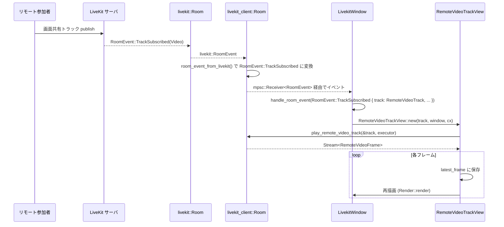

# livekit_client/ ディレクトリ解説

---

## 1. ざっくり一言

LiveKit の Rust SDK と GPUI をつなぐための「クライアント層」と、音声・映像の入出力処理をまとめたクレートです。  
本番用の実クライアント実装と、テスト用のインメモリ実装（モックサーバ）を同一 API で切り替えて利用できます。

---

## 2. このモジュールの役割

### 2.1 概要

- このクレートは **LiveKit ルームへの接続・トラックの publish/subscribe** を行うためのラッパーを提供します。
- 同時に、**CPAL / Rodio / libwebrtc を使った音声入出力・ミキシング・画面共有の処理** をカプセル化しています。
- GPUI（Zed の UI ランタイム）上で扱いやすいように、`RoomEvent` や `RemoteVideoTrackView` といった **UI 向けの抽象化** を提供します。
- `test-support` やテスト環境では、ネットワークを使わない **インメモリの TestServer と mock クライアント** に自動的に差し替わります。

### 2.2 アーキテクチャ内での位置づけ

このクレート内部の主なモジュールと外部依存との関係を簡略化した図です。

```mermaid
graph TD
    App[アプリケーション (GPUI)] --> LC[livekit_client (lib.rs)]

    LC --> Real[real client: livekit_client.rs]
    LC --> Mock[mock_client.rs + test.rs]
    LC --> Playback[playback.rs (AudioStack)]
    LC --> RVView[remote_video_track_view.rs]
    LC --> Record[record.rs]
    LC --> LinuxWayland[livekit_client/linux.rs]

    Real --> LiveKitSDK[LiveKit SDK (livekit)]
    Mock --> TestServer[TestServer (インメモリ)]

    Playback --> AudioIO[CPAL / Rodio / libwebrtc]
    RVView --> GPUI[GPUI / gpui_tokio]
    LinuxWayland --> libwebrtcDesktop[libwebrtc desktop_capturer + PipeWire]
```

- `src/lib.rs` がクレートの公開 API を定義し、**条件付きコンパイル**で
  - 実際の LiveKit SDK を用いる `livekit_client` 実装
  - テスト用の `mock_client` + `test` 実装  
  を切り替えています。
- `playback.rs` と `linux.rs` は主に **メディア（音声・映像）の入出力** を担当します。
- `remote_video_track_view.rs` は **リモート映像を描画する GPUI コンポーネント** です。
- `record.rs` はマイク入力を WAV に記録する簡易ユーティリティです。

### 2.3 設計上のポイント

コードから読み取れる設計上の特徴です。

- **実装の差し替え**
  - `cfg` により、同じ型名 (`Room`, `LocalParticipant`, `RemoteTrackPublication` など) で、  
    - 実 LiveKit クライアント (`livekit_client.rs`)
    - モッククライアント (`mock_client.rs` + `test.rs`)  
    を切り替えています。
- **UI / ネットワーク / メディアの分離**
  - `livekit_client.rs` は主に LiveKit SDK とのやり取りと GPUI の橋渡し。
  - `playback.rs` は音声・映像の処理（APM, ミキサー, resampler, Rodio エフェクトなど）。
  - `remote_video_track_view.rs` は描画専用。
- **イベント駆動**
  - `Room::connect` が `RoomEvent` のストリームを返し、UI 側で `while let Some(event) = events.next().await` のループで処理する設計になっています。
- **音声パイプラインのカプセル化**
  - マイク入力 → APM（エコーキャンセル等） → WebRTC 送信
  - リモート音声 → ミキサー → APM 逆方向処理 → 出力デバイス  
  という流れを `AudioStack` で一括管理しています。
- **Wayland 特化の画面共有**
  - Linux/Wayland では PipeWire / xdg-desktop-portal を前提に `linux::start_wayland_desktop_capture` で画面共有を行います。
- **テスト容易性**
  - `test.rs` にインメモリの `TestServer` を持ち、`livekit_api::Client` を実装しているため、LiveKit API に依存するコードをネットワークなしでテストできます。

---

## 3. 主要な機能一覧

クレート全体として提供している機能を箇条書きで整理します。

- **LiveKit ルーム接続**
  - `Room::connect` によるルームへの接続と `RoomEvent` ストリームの提供。
- **参加者情報のラップ**
  - `Participant`（ローカル／リモートの抽象化）、`LocalParticipant`, `RemoteParticipant`。
  - `ConnectionQuality`, `ParticipantIdentity` などの共通型。
- **トラック publish / subscribe**
  - マイク音声: `Room::publish_local_microphone_track`。
  - 画面共有（一般）：`LocalParticipant::publish_screenshare_track`。
  - 画面共有（Wayland/Linux）：`LocalParticipant::publish_screenshare_track_wayland`。
  - トラックの unpublish: `Room::unpublish_local_track`（実装系）／`Room::unpublish_local_track`（モック側は `test.rs` 経由）。
- **音声入出力とミキシング**
  - リモート音声トラックの再生: `Room::play_remote_audio_track` → `AudioStack::play_remote_audio_track`。
  - マイク入力のキャプチャ: `AudioStack::capture_local_microphone_track`。
  - デバイス変化検知（macOS）: `DeviceChangeListener`。
- **映像のキャプチャと再生**
  - 画面共有トラック生成: `playback::capture_local_video_track`, `linux::start_wayland_desktop_capture`。
  - リモート映像フレームストリーム: `playback::play_remote_video_track`。
  - GPUI での表示: `RemoteVideoTrackView`。
- **ユーティリティ**
  - デフォルトのオーディオデバイス選択: `default_device`。
  - サンプルフォーマット変換: `get_sample_data`, `convert_sample_data`。
  - テスト録音: `record::CaptureInput`（マイク音声を WAV に保存）。
- **テスト用インメモリ LiveKit 実装**
  - `test::TestServer`, `test::Room`, `mock_client::*` による疑似 LiveKit サーバとクライアント。

---

## 4. 関数・構造体の解説

### 4.1 主要な型一覧

代表的な公開・半公開型を一覧にします（条件付きコンパイルで実体が変わるものも含みます）。

| 型名 | 種別 | 役割 / 用途 |
|------|------|-------------|
| `Room` | 構造体 | LiveKit のルーム接続を表す。`connect` で生成され、参加者やトラック操作の窓口になる。 |
| `Participant` | enum | `Local` / `Remote` を統一的に扱うための参加者抽象。 |
| `LocalParticipant` / `RemoteParticipant` | 構造体 | それぞれローカル・リモート参加者を表す。接続品質や音量、トラック一覧を取得できる。 |
| `LocalTrackPublication` / `RemoteTrackPublication` | 構造体 | Publish 済みトラックのハンドル。ミュート・有効／無効の切り替えに使用。 |
| `LocalTrack` / `RemoteTrack` | enum | Audio / Video をまとめたローカル／リモートトラックのバリアント。 |
| `RemoteAudioTrack` / `RemoteVideoTrack` | 構造体 | LiveKit SDK のトラックをラップした薄い型。SID 取得などに使用。 |
| `RoomEvent` | enum | GPUI 側で扱いやすいよう整形された LiveKit ルームイベントの列挙体。 |
| `AudioStack` | 構造体 | 音声処理パイプライン（APM・ミキサー・入出力タスク）を管理する内部用コンポーネント。 |
| `AudioStream` | enum | 音声入出力タスクのライフタイム管理用ハンドル（`Drop` 時にタスク終了）。 |
| `RemoteVideoFrame` | 型エイリアス | OS ごとのリモート映像フレーム表現（macOS: `CVPixelBuffer`, その他: `Arc<RenderImage>`）。 |
| `RemoteVideoTrackView` | 構造体 | 1 本の `RemoteVideoTrack` を GPUI 上で表示するビューコンポーネント。 |
| `CaptureInput` | 構造体 | テスト用にマイク入力をキャプチャし、WAV に書き出すためのユーティリティ。 |
| `TestServer` / `test::Room` | 構造体 | `test-support` / テスト時にのみ使われるインメモリ LiveKit サーバとクライアント。 |

### 4.2 重要な関数・メソッドの詳細（7件）

#### `Room::connect(url: String, token: String, cx: &mut AsyncApp) -> Result<(Room, mpsc::UnboundedReceiver<RoomEvent>)>`

**概要**

- LiveKit ルームに接続し、そのルームを表す `Room` と、ルーム内で発生するイベント（`RoomEvent`）のストリームを返します。
- 実装によって、内部で LiveKit SDK (`livekit::Room`) または `TestServer` に接続します。

**引数**

| 引数名 | 型 | 説明 |
|--------|----|------|
| `url` | `String` | LiveKit サーバ（または TestServer）の URL。 |
| `token` | `String` | LiveKit の JWT トークン。参加者の identity やルーム名などを含む。 |
| `cx` | `&mut AsyncApp` | GPUI の非同期コンテキスト。Tokio タスクや GPUI バックグラウンド実行用に使用。 |

**戻り値**

- `Ok((room, events_rx))`
  - `room`: ルームへの接続を表す `Room`。
  - `events_rx`: `RoomEvent` を受け取るための `mpsc::UnboundedReceiver<RoomEvent>`。
- `Err`: 接続やトークン検証などに失敗した場合。

**内部処理の流れ（実クライアント版）**

1. `RoomOptions` に TLS 設定 (`http_client_tls::tls_config()`) を入れて LiveKit SDK を初期化。
2. `Tokio::spawn` で Tokio ランタイム上から `livekit::Room::connect(&url, &token, config)` を実行。
3. 接続成功後、LiveKit SDK が返すイベントストリームを受け取り、`mpsc::unbounded` チャネルを作成。
4. バックグラウンドタスクで LiveKit のイベントをループし、`room_event_from_livekit` で `RoomEvent` に変換して `tx.send`。
5. `Room { room, _task, playback: AudioStack::new(..) }` と `rx` を返す。

**Examples（使用例）**

```rust
use livekit_client::{Room, RoomEvent};
use futures::StreamExt;
use gpui::AsyncApp;

// 非同期コンテキスト内の例
async fn join_room(mut cx: AsyncApp) -> anyhow::Result<()> {
    let url = "http://localhost:7880".to_string();
    let token = "your_jwt".to_string();

    let (room, mut events) = Room::connect(url, token, &mut cx).await?;

    // イベント処理タスク
    cx.spawn(async move |_cx| {
        while let Some(event) = events.next().await {
            match event {
                RoomEvent::Connected { .. } => eprintln!("connected"),
                RoomEvent::TrackSubscribed { .. } => eprintln!("track subscribed"),
                _ => {}
            }
        }
    }).detach();

    // room を保持しておくことで接続を維持
    eprintln!("Room name: {}", room.name());
    Ok(())
}
```

**Errors / Panics**

- LiveKit SDK の接続失敗、TLS 設定エラーなどで `Err` を返します。
- 変換対象外の LiveKit イベントは `room_event_from_livekit` 内で `log::trace!` され、`None` として破棄されます（エラーにはなりません）。

**Edge cases**

- イベントストリームが終了した場合（切断など）、`events.recv().await` が `None` を返し、バックグラウンドタスクは終了します。
- モック実装 (`test::Room::connect`) の場合も同じシグネチャで、TestServer に参加し、`RoomEvent` を生成します。

**使用上の注意点**

- `Room` と `events` レシーバを保持している間のみ接続が維持されます。
- `cx` は GPUI の `AsyncApp` である必要があり、通常は GPUI のアプリケーション内でのみ呼び出します。

---

#### `Room::publish_local_microphone_track(&self, user_name: String, is_staff: bool, cx: &mut AsyncApp) -> Result<(LocalTrackPublication, AudioStream, Arc<AtomicU64>)>`

**概要**

- ローカルマイクをキャプチャし、LiveKit ルームに音声トラックとして publish します。
- 同時に、入力遅延（レイテンシ）をモニタするための `Arc<AtomicU64>` を返します。

**引数**

| 引数名 | 型 | 説明 |
|--------|----|------|
| `user_name` | `String` | トラック名に埋め込まれるユーザ名。 |
| `is_staff` | `bool` | スタッフかどうかのフラグ。トラック名にエンコードされます。 |
| `cx` | `&mut AsyncApp` | GPUI の非同期コンテキスト。 |

**戻り値**

- `LocalTrackPublication`: publish 済みトラックのハンドル（ミュートなどに使う）。
- `AudioStream`: マイクキャプチャタスクのライフタイムを管理するハンドル（`Drop` で停止）。
- `Arc<AtomicU64>`: 直近のフレームの入力遅延（マイクキャプチャから送信までのラグ）をマイクロ秒で保持。

**内部処理の流れ**

1. `AudioStack::capture_local_microphone_track` を呼び出して:
   - CPAL を使ったマイク入力ストリームを開始。
   - APM / Rodio エフェクトを適用。
   - `NativeAudioSource` を通じて WebRTC にフレームを送るタスクを生成。
2. `LocalAudioTrack` を LiveKit SDK の `LocalTrack::Audio` としてラップ。
3. `LocalParticipant::publish_track` を使って `TrackSource::Microphone` としてルームに publish。
4. `LocalTrackPublication` と `AudioStream`、`input_lag_us` を返却。

**Examples（使用例）**

```rust
use livekit_client::Room;
use gpui::AsyncApp;
use std::sync::Arc;
use std::sync::atomic::Ordering::Relaxed;

async fn publish_mic(room: &Room, cx: &mut AsyncApp) -> anyhow::Result<()> {
    let (pub_, _stream, input_lag_us) =
        room.publish_local_microphone_track("user1".into(), false, cx).await?;

    // 入力遅延をログ
    eprintln!("input lag (us): {}", input_lag_us.load(Relaxed));

    // 後でミュートする例
    pub_.mute(&cx.app());
    Ok(())
}
```

**Errors / Panics**

- オーディオデバイス解決（`default_device`）、CPAL ストリーム構築、LiveKit publish で失敗すると `Err` になります。
- モック実装では `TestServer::publish_audio_track` が失敗した場合に `Err` を返します。

**Edge cases**

- 音声入力デバイスが見つからない場合や、サポートされていないサンプルフォーマットの場合はエラーになります（`get_sample_data` の `Unsupported sample format`）。
- `AudioStream` ハンドルを `drop` するとマイクキャプチャタスクが止まり、以降フレームは送信されません。

**使用上の注意点**

- `AudioStream` をフィールドに保持することで、マイクキャプチャを維持します（例: `LivekitWindow` の `microphone_stream`）。
- `LocalTrackPublication` の `mute/unmute` は非同期で実行されます（`Tokio::spawn`）。

---

#### `LocalParticipant::publish_screenshare_track(&self, source: &dyn ScreenCaptureSource, cx: &mut AsyncApp) -> Result<(LocalTrackPublication, Box<dyn ScreenCaptureStream>)>`

**概要**

- 任意の `ScreenCaptureSource`（例えばウィンドウやディスプレイ）から映像をキャプチャし、LiveKit に画面共有トラックとして publish します。

**引数**

| 引数名 | 型 | 説明 |
|--------|----|------|
| `source` | `&dyn ScreenCaptureSource` | GPUI が提供する画面キャプチャ元の抽象。 |
| `cx` | `&mut AsyncApp` | GPUI 非同期コンテキスト。 |

**戻り値**

- `LocalTrackPublication`: 画面共有トラックの publish ハンドル。
- `Box<dyn ScreenCaptureStream>`: キャプチャストリームのハンドル。`Drop` でキャプチャ停止。

**内部処理の流れ**

1. `capture_local_video_track(source, cx)` を呼び出し、`LocalVideoTrack` と `ScreenCaptureStream` を取得。
2. `TrackPublishOptions` を `Screenshare + VP8` で構築。
3. `publish_track(LocalTrack::Video(track.0), options, cx)` を呼び出して LiveKit に publish。
4. `(LocalTrackPublication, stream)` を返す。

**Examples（使用例）**

```rust
use livekit_client::Room;
use futures::StreamExt;
use gpui::{AsyncApp, ScreenCaptureSource};

async fn share_screen(room: &Room, cx: &mut AsyncApp) -> anyhow::Result<()> {
    // 例: GPUI からキャプチャソース一覧を取得し、最初のものを使う
    let sources = cx.screen_capture_sources().await?.unwrap();
    let source = sources.into_iter().next().expect("no screen sources");

    let local = room.local_participant();
    let (publication, stream) = local.publish_screenshare_track(&*source, cx).await?;

    // stream を保持している間だけ共有が続く
    eprintln!("screenshare sid = {}", publication.sid());
    drop(stream); // 共有を止める
    Ok(())
}
```

**Errors / Panics**

- `ScreenCaptureSource::metadata` / `stream` の取得に失敗した場合や、LiveKit への publish に失敗した場合は `Err` になります。

**Edge cases**

- `ScreenCaptureSource::stream` が `None` を返す（権限拒否など）場合、`?` によりエラーとして扱われます。
- 共有元のウィンドウが閉じられた場合の挙動は `ScreenCaptureSource` 実装に依存し、ここからは読み取れません。

**使用上の注意点**

- 呼び出し側は `ScreenCaptureStream` の所有権を保持している必要があります。`LivekitWindow` では `screen_share_stream: Option<Box<dyn ScreenCaptureStream>>` として保持しています。

---

#### `LocalParticipant::publish_screenshare_track_wayland(&self, cx: &mut AsyncApp) -> Result<(LocalTrackPublication, Box<dyn ScreenCaptureStream>, oneshot::Receiver<()>)>` （Linux のみ）

**概要**

- Wayland / PipeWire 環境向けの画面共有ヘルパです。  
  `linux::start_wayland_desktop_capture` を使ってデスクトップ全体をキャプチャし、その映像を LiveKit へ publish します。

**引数・戻り値**

| 項目 | 型 | 説明 |
|------|----|------|
| `cx` | `&mut AsyncApp` | GPUI 非同期コンテキスト。 |
| 戻り値1 | `LocalTrackPublication` | 画面共有トラックの publish ハンドル。 |
| 戻り値2 | `Box<dyn ScreenCaptureStream>` | `WaylandScreenCaptureStream` ハンドル。`Drop` で停止。 |
| 戻り値3 | `oneshot::Receiver<()>` | キャプチャの恒久的エラー通知（エラー時に `Ok(())` が送信される）。 |

**内部処理の流れ（要約）**

1. `linux::start_wayland_desktop_capture(cx)` を呼び出し:
   - `DesktopCapturer` を初期化（PipeWire / xdg-desktop-portal が前提）。
   - フレームを NV12 に変換し、`NativeVideoSource` に流し込む。
   - 最初のフレームを 30 秒以内に受信できなければタイムアウトエラー。
2. 取得した `LocalVideoTrack` を `TrackSource::Screenshare` として publish。
3. `WaylandScreenCaptureStream::new(stop_flag, feed_task)` を `Box<dyn ScreenCaptureStream>` として返す。
4. `failure_rx` で恒久的なキャプチャエラーを通知。

**Edge cases**

- `PIPEWIRE_TIMEOUT_S`（30秒）以内に最初のフレームが届かない場合:
  - エラー: `"Screen sharing timed out..."` を返し、`stop_flag` を立てて capturer を停止。
- ポータルの許可拒否などでチャネルが `None` を返した場合:
  - エラー: `"Screen sharing was canceled or the portal denied permission..."`。
- キャプチャ中に `CaptureError::Permanent` が発生した場合:
  - `permanent_error` を true にし、`stop_flag` を立てて `failure_tx` に通知。

**使用上の注意点**

- このメソッドは `cfg(target_os = "linux")` でのみコンパイルされます。
- `ScreenCaptureStream` を drop するか、`failure_rx` を監視してエラー時に UI 側で適切な処理を行う必要があります。

---

#### `Room::play_remote_audio_track(&self, track: &RemoteAudioTrack, cx: &mut App) -> Result<AudioStream>`

**概要**

- 1 本のリモート音声トラックをローカルオーディオデバイスから再生します。
- `AudioStack` のミキサーにこのトラック用のソースを追加し、出力タスクを起動（または再利用）します。

**引数**

| 引数名 | 型 | 説明 |
|--------|----|------|
| `track` | `&RemoteAudioTrack` | 再生したいリモート音声トラック。 |
| `cx` | `&mut App` | GPUI アプリケーションコンテキスト（オーディオ設定の取得に使用）。 |

**戻り値**

- `AudioStream::Output { .. }`: 再生タスクのライフタイム管理用ハンドル。

**内部処理の流れ**

1. `AudioSettings::get_global(cx)` からユーザー設定の `output_audio_device` を取得（なければデフォルト）。
2. `AudioStack::play_remote_audio_track(&track.0, output_audio_device)` を呼び出し:
   - 出力タスクを起動（なければ）。
   - ミキサーに `AudioMixerSource` を追加し、`NativeAudioStream` からフレームを流し続けるタスクを生成。
3. `AudioStream::Output` として返却。`Drop` でミキサーからソースを削除し、関連タスクを解放。

**Examples（使用例）**

```rust
use livekit_client::{Room, RemoteTrack, RoomEvent};

fn handle_event(room: &Room, event: RoomEvent, app: &mut gpui::App) {
    if let RoomEvent::TrackSubscribed { track, publication, participant: _ } = event {
        if let RemoteTrack::Audio(audio_track) = track {
            let _stream = room.play_remote_audio_track(&audio_track, app).unwrap();
            // _stream を保持している間、音声が再生される
            eprintln!("playing audio sid={}", publication.sid());
        }
    }
}
```

**Usage notes**

- 出力タスクは `AudioStack` 内部で共有されるため、複数トラックを同時に再生しても出力ストリームは 1 つです。
- `RemoteTrackPublication::set_enabled(false)` を使うと、リモート側のトラック有効／無効を切り替えられます（`test_app.rs` の「Deafen」ボタンなど）。

---

#### `playback::capture_local_video_track(capture_source: &dyn ScreenCaptureSource, cx: &mut AsyncApp) -> Result<(LocalVideoTrack, Box<dyn ScreenCaptureStream>)>`

**概要**

- 任意の `ScreenCaptureSource` からフレームを取得し、WebRTC 用の `NativeVideoSource` に変換して `LocalVideoTrack` を作成する低レベル関数です。
- 上位の `LocalParticipant::publish_screenshare_track` から利用されます。

**内部処理の流れ（要約）**

1. `capture_source.metadata()` から解像度を取得。
2. `Tokio::spawn` で `NativeVideoSource::new(VideoResolution { width, height }, true)` を生成。
3. `capture_source.stream(executor, callback)` を呼び出し:
   - 各 `ScreenCaptureFrame` を NV12 などの `VideoBuffer` に変換 (`video_frame_buffer_to_webrtc`)。
   - `track_source.capture_frame(VideoFrame { buffer, .. })` で WebRTC パイプラインに流入。
4. `LocalVideoTrack(track::LocalVideoTrack::create_video_track("screen share", RtcVideoSource::Native(track_source)))` を生成。
5. `(LocalVideoTrack, capture_stream)` を返す。

**Edge cases**

- フレーム形式が期待と異なる場合（`video_frame_buffer_to_webrtc` で `_ => log::error!`）、`None` が返され、そのフレームは無視されます。
- 画面キャプチャ実装に依存する部分（権限、ウィンドウ閉鎖時の挙動など）はこの関数からは読み取れません。

---

#### `RemoteVideoTrackView::new(track: RemoteVideoTrack, window: &mut Window, cx: &mut Context<Self>) -> Self`

**概要**

- 1 本の `RemoteVideoTrack` からフレームストリームを購読し、最新フレームを描画する GPUI ビューを構築します。
- フレームが途切れた（ストリームが完了した）場合、`RemoteVideoTrackViewEvent::Close` を emit します。

**内部処理の流れ**

1. `cx.focus_handle()` を呼び出してフォーカス可能に。
2. `crate::play_remote_video_track(&track, cx.background_executor())` からフレームストリームを取得。
3. 非 macOS では:
   - 画像リソースの管理のため、`current_rendered_frame` と `previous_rendered_frame` を保持。
   - `on_release` で Window が破棄される際に `drop_image` を呼び、GPU リソースを解放。
4. `cx.spawn_in(window, async move |this, cx| { ... })` でフレーム維持タスクを起動:
   - `while let Some(frame) = frames.next().await` ループで `this.latest_frame = Some(frame)`、`cx.notify()`。
   - ストリーム終了時に `cx.emit(RemoteVideoTrackViewEvent::Close)`。
5. `Render` 実装では:
   - macOS: `gpui::surface(latest_frame.clone()).size_full()` で描画。
   - 非 macOS: `gpui::img(latest_frame.clone())` を配置し、前のフレームの GPU イメージを順次 `drop_image` で解放。

**Examples（使用例）**

`examples/test_app.rs` での利用例（要約）:

```rust
use livekit_client::{RemoteVideoTrack, RemoteVideoTrackView};
use gpui::{Entity, Window, Context};

fn on_track_subscribed_video(
    track: RemoteVideoTrack,
    window: &mut Window,
    cx: &mut Context<LivekitWindow>,
) -> Entity<RemoteVideoTrackView> {
    cx.new(|cx| RemoteVideoTrackView::new(track, window, cx))
}
```

**使用上の注意点**

- `RemoteVideoTrackView` の `Entity` を UI ツリーに保持している間のみ映像が更新されます。
- 非 macOS では、GPU メモリ解放のため `drop_image` を適切なタイミングで呼び出していますが、これは内部的に処理されるため、通常の利用者は意識する必要はありません。

---

### 4.3 その他の主な補助関数・型

| 関数 / 型 | 役割（1行） |
|-----------|------------|
| `default_device(input: bool, device_id: Option<&DeviceId>)` | CPAL の入出力デフォルトデバイスと対応ストリーム設定を解決する。 |
| `get_sample_data(sample_format, data)` | CPAL の `Data` を `Vec<i16>` に変換するヘルパー。未サポート形式は `Err`。 |
| `convert_sample_data<TSource, TDest>(data)` | 任意フォーマットから `TDest` へのサンプル変換。 |
| `record::CaptureInput::start/finish` | マイク入力をキャプチャし、`finish` で WAV ファイルを書き出す。 |
| `linux::start_wayland_desktop_capture` | Wayland + PipeWire 上でのデスクトップキャプチャ開始関数（`LocalVideoTrack` と停止用フラグ等を返す）。 |
| `test::TestServer` とメソッド群 | LiveKit API を模倣するインメモリサーバ。`create_room`, `publish_audio_track` などを提供。 |

---

## 5. データフロー

ここでは「リモート参加者の画面共有がローカル UI に表示される」までの代表的なデータフローを扱います。  
（音声も同様の構造ですが、ここでは映像に絞ります。）

### 5.1 処理の要点（概要）

1. リモート参加者が LiveKit に画面共有トラックを publish する（リモート側）。
2. ローカルの LiveKit SDK (`livekit::Room`) が `RoomEvent::TrackSubscribed` を発行。
3. `livekit_client::room_event_from_livekit` がそれを `crate::RoomEvent::TrackSubscribed` に変換。
4. `Room::connect` が返したイベントストリームを UI (`LivekitWindow`) が受信し、映像トラックを検出。
5. `LivekitWindow::handle_room_event` 内で `RemoteVideoTrackView::new` を呼び出し、ビューを作成。
6. `RemoteVideoTrackView` が `play_remote_video_track` のフレームストリームを購読し、最新フレームを描画。

### 5.2 Sequence Diagram



このフローにより、アプリケーション側は `RoomEvent::TrackSubscribed` を処理して `RemoteVideoTrackView` エンティティを UI ツリーに追加するだけで、映像表示までが自動的に行われます。

---

## 6. 使い方（How to Use）

### 6.1 基本的な使用方法

ここでは、`examples/test_app.rs` の簡略版として、**2 人が同じルームに参加し、音声と画面共有を行う** 最小構成を示します。

```rust
use std::sync::Arc;
use futures::StreamExt;
use gpui::{AsyncApp, App, Window, Context, Task};
use livekit_client::{
    Room, RoomEvent, RemoteTrack, RemoteVideoTrackView,
    LocalTrackPublication, AudioStream,
};

struct MyWindow {
    room: Arc<Room>,
    mic_pub: Option<LocalTrackPublication>,
    mic_stream: Option<AudioStream>,
    _events_task: Task<()>,
}

impl MyWindow {
    async fn new(url: String, token: String, cx: &mut AsyncApp) -> gpui::WindowHandle<Self> {
        let (room, mut events) = Room::connect(url, token, cx).await.unwrap();

        cx.update(|cx| {
            cx.open_window(Default::default(), |window, cx| {
                cx.new(|cx| {
                    let room = Arc::new(room);

                    // RoomEvent を受け取り続けるタスク
                    let events_task = cx.spawn_in(window, async move |this, cx| {
                        while let Some(event) = events.next().await {
                            cx.update(|window, cx| {
                                this.update(cx, |this: &mut MyWindow, cx| {
                                    this.handle_event(event, window, cx);
                                })
                            }).ok();
                        }
                    });

                    Self {
                        room,
                        mic_pub: None,
                        mic_stream: None,
                        _events_task: events_task,
                    }
                })
            }).unwrap()
        })
    }

    fn handle_event(
        &mut self,
        event: RoomEvent,
        window: &mut Window,
        cx: &mut Context<Self>,
    ) {
        match event {
            RoomEvent::TrackSubscribed { track, publication, participant: _ } => {
                match track {
                    RemoteTrack::Audio(audio) => {
                        // リモート音声を再生
                        let stream = self.room.play_remote_audio_track(&audio, cx.app()).unwrap();
                        // stream をどこかに保持しておく（ここでは捨てていない前提）
                        let _ = stream;
                    }
                    RemoteTrack::Video(video) => {
                        // 画面共有ビューを作成して UI に追加（詳細レイアウトは省略）
                        let _view = cx.new(|cx| RemoteVideoTrackView::new(video, window, cx));
                    }
                }
            }
            _ => {}
        }
    }

    fn toggle_mic(&mut self, window: &mut Window, cx: &mut Context<Self>) {
        if let Some(pub_) = &self.mic_pub {
            if pub_.is_muted() {
                pub_.unmute(cx.app());
            } else {
                pub_.mute(cx.app());
            }
        } else {
            let room = self.room.clone();
            cx.spawn_in(window, async move |this, cx| {
                let (pub_, stream, _lag) = room
                    .publish_local_microphone_track("user".into(), false, cx)
                    .await
                    .unwrap();
                this.update(cx, |this, _cx| {
                    this.mic_pub = Some(pub_);
                    this.mic_stream = Some(stream);
                })
            }).detach();
        }
    }
}
```

この例では:

- `Room::connect` で接続し、イベントストリームを UI 側タスクで処理しています。
- `TrackSubscribed` イベントを受けたら:
  - 音声トラック: `Room::play_remote_audio_track`
  - 映像トラック: `RemoteVideoTrackView::new`  
  で再生／表示しています。
- マイクの publish / mute 切り替えは `toggle_mic` で行っています。

### 6.2 よくある使用パターン

#### 6.2.1 テスト・CI 向けにモッククライアントを使う

`Cargo.toml` で `test-support` フィーチャを有効にするか、テスト（`#[test]`）として実行すると、`lib.rs` の条件付きコンパイルにより `mock_client` + `test` 実装が使用されます。

特徴:

- 実際の LiveKit サーバには接続せず、`TestServer` 上でルームやトラックが管理されます。
- API 形は本番版と同じ (`Room::connect`, `RoomEvent`, `LocalParticipant` など) のため、アプリケーションコードは変更不要です。
- `play_remote_video_track` は `futures::stream::pending()` を返すため、モック環境では映像フレームは流れません（ただし API 的には問題ありません）。

テスト側からは `test::TestServer::create` を用いてサーバを立ち上げ、`livekit_api::Client` 実装として利用することもできます。

#### 6.2.2 Wayland 上の画面共有

Linux/Wayland 環境で専用の画面共有を行う場合は `LocalParticipant::publish_screenshare_track_wayland` を利用できます。

```rust
#[cfg(target_os = "linux")]
async fn share_wayland_screen(local: &livekit_client::LocalParticipant, cx: &mut gpui::AsyncApp) {
    use futures::channel::oneshot;

    let (pub_, stream, failure_rx) =
        local.publish_screenshare_track_wayland(cx).await.unwrap();

    // failure_rx を監視して恒久的エラーを検知
    cx.spawn(async move |_cx| {
        if failure_rx.await.is_ok() {
            eprintln!("Wayland screen capture failed permanently");
        }
    }).detach();

    // pub_ と stream を保持している間は共有が継続
}
```

#### 6.2.3 リモート参加者ごとの音声 ON/OFF 切り替え

`RemoteTrackPublication::set_enabled` を使うことで、「自分側で」特定のリモート音声を一時的にミュート（Deafen）できます。`examples/test_app.rs` の `toggle_remote_audio_for_participant` が代表例です。

```rust
use livekit_client::{ParticipantIdentity, RoomEvent, RemoteTrackPublication};

fn toggle_remote_audio(
    participants: &mut Vec<(ParticipantIdentity, ParticipantState)>,
    identity: &ParticipantIdentity,
    cx: &mut gpui::Context<LivekitWindow>,
) -> Option<()> {
    let state = participants.iter().find_map(|(id, s)| (id == identity).then_some(s))?;
    let publication: &RemoteTrackPublication = &state.audio_output_stream.as_ref()?.0;

    publication.set_enabled(!publication.is_enabled(), cx.app());
    Some(())
}
```

### 6.3 使用上の注意点（まとめ）

- **GPUI 依存**
  - 多くのメソッドが `&mut AsyncApp` や `&mut App` を要求し、GPUI のタスク実行環境（smol + Tokio）と密接に結びついています。
  - 単独 crate として Tokio アプリから直接使う設計にはなっていません。

- **ハンドルのライフタイム**
  - `AudioStream` や `ScreenCaptureStream`、`RemoteVideoTrackView` の `Entity` は、**保持している間だけ** 実際の処理（再生・キャプチャ・描画）が継続します。
  - これらを `drop` すると対応するタスクやリソースが終了します。

- **オーディオデバイスの存在**
  - `default_device` は `audio::resolve_device` と CPAL の `default_input/output_config` に依存しており、デバイス未接続・権限問題などで `Err` になる可能性があります。
  - モック実装では実デバイスを使わないため、この種のエラーは発生しません。

- **サンプルフォーマット**
  - `get_sample_data` は CPAL の `SampleFormat` ごとに分岐しており、定義されていないフォーマットの場合 `"Unsupported sample format"` でエラーになります。

- **Wayland 画面共有の前提**
  - `linux::start_wayland_desktop_capture` のエラーメッセージにあるように、  
    `xdg-desktop-portal` と PipeWire が動作していることが前提です。
  - 30 秒以内に最初のフレームを受信できない場合はタイムアウトエラーになります。

- **テスト環境と本番環境の差**
  - Windows（GNU ツールチェイン）や FreeBSD、`test` / `test-support` が有効な環境では `mock_client` 実装が選択されます。
  - 映像フレームが流れない（`play_remote_video_track` が pending）など、本番と挙動が異なる部分があるため、UI テストではその前提を考慮する必要があります。

---

## 7. 関連ファイル

ディレクトリ内のファイルとその役割を一覧にします。

| パス | 役割 / 関係 |
|------|------------|
| `livekit_client/Cargo.toml` | クレートメタデータと依存関係、`test-support` フィーチャやプラットフォーム別依存を定義。 |
| `livekit_client/examples/test_app.rs` | GPUI を使ったサンプルアプリ。`Room::connect` からマイク publish、画面共有、リモート映像表示まで一通りの流れを実装。 |
| `livekit_client/src/lib.rs` | クレートの公開 API の入り口。`Participant`, `RoomEvent`, オーディオヘルパー関数を定義し、`livekit_client` / `mock_client` を条件付きで re-export。 |
| `livekit_client/src/livekit_client.rs` | 実 LiveKit クライアント実装。`Room`, `LocalParticipant`, `RemoteParticipant` などのラッパ型と、`Room::connect`・`publish_*` 系メソッド、`room_event_from_livekit` を提供。 |
| `livekit_client/src/livekit_client/playback.rs` | 音声・映像の入出力パイプライン（`AudioStack`、`AudioStream`、`play_remote_video_track`、`capture_local_video_track` など）を実装。 |
| `livekit_client/src/livekit_client/linux.rs` | Linux/Wayland 向けのデスクトップキャプチャ実装。PipeWire / xdg-desktop-portal / libwebrtc desktop capturer を使って `LocalVideoTrack` を生成。 |
| `livekit_client/src/remote_video_track_view.rs` | リモート映像トラックを表示する GPUI コンポーネント。`RemoteVideoTrackView` とイベント型を定義。 |
| `livekit_client/src/record.rs` | マイク入力を CPAL / Rodio でキャプチャし、WAV ファイルに書き出す `CaptureInput` を提供。主にテスト用途。 |
| `livekit_client/src/mock_client.rs` | モッククライアントのエントリ。`Room`, `LocalParticipant` などの型エイリアスを `test` モジュールに向けて定義し、`play_remote_video_track` のモック実装などを提供。 |
| `livekit_client/src/mock_client/participant.rs` | モック環境での `LocalParticipant` / `RemoteParticipant` 実装。インメモリ TestServer を通じてトラック publish/unpublish を行う。 |
| `livekit_client/src/mock_client/publication.rs` | モック環境での `LocalTrackPublication` / `RemoteTrackPublication` 実装。ミュート状態や有効／無効を `TestServer` 内部状態に反映。 |
| `livekit_client/src/mock_client/track.rs` | モック用のトラック型（`LocalVideoTrack`, `RemoteAudioTrack` など）を定義。テストサーバ内トラックとの関連を保持。 |
| `livekit_client/src/test.rs` | インメモリ LiveKit 風サーバ `TestServer` と、そのクライアント `Room` を実装。`livekit_api::Client` を実装した `TestApiClient` も含む。 |

以上が `livekit_client` クレート全体の構造と主要 API の概要です。このドキュメントを入口として、必要に応じて各ファイルの実装詳細を参照すると理解しやすくなります。
