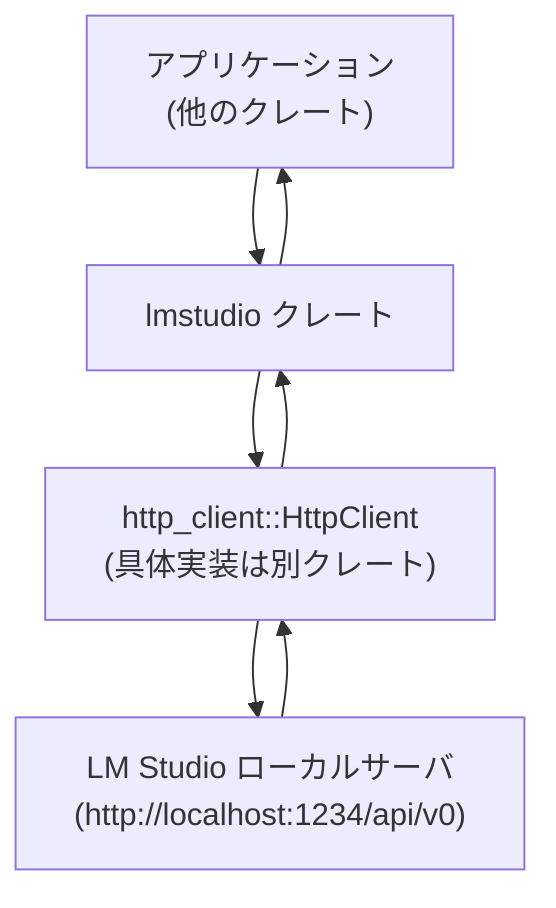
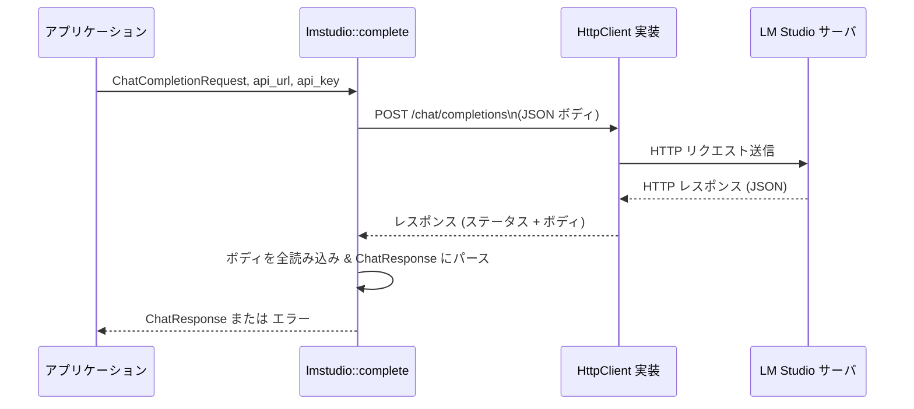

# lmstudio/ ディレクトリ解説

## 1. ざっくり一言

`lmstudio` クレートは、LM Studio のローカル HTTP API（Chat Completions / Models）に対して Rust から非同期でアクセスするための、**型定義と薄いクライアント関数**を提供するモジュールです。

---

## 2. このモジュールの役割

### 2.1 概要

- LM Studio が提供する OpenAI 互換の HTTP API に対応した **リクエスト／レスポンスの型**を定義します。
- チャット補完（通常・ストリーム）と、利用可能なモデル一覧取得のための **非同期 HTTP クライアント関数**を提供します。
- ツール呼び出し（function calling）や画像入力など、LM Studio が扱う追加機能を表現するための補助的な型を含みます。

### 2.2 アーキテクチャ内での位置づけ

このクレートは「HTTP クライアント実装」と「LM Studio API 本体」の間に挟まる **API バインディング層**として機能します。



- アプリケーションは `lmstudio` の型と関数（`complete`, `stream_chat_completion`, `get_models`）を呼び出します。
- 実際の HTTP 送受信は外部クレート `http_client` の `HttpClient` トレイト実装に委譲されます。
- エンドポイントは `LMSTUDIO_API_URL`（`http://localhost:1234/api/v0`）をデフォルトとして利用できます。

### 2.3 設計上のポイント

- **責務の分離**
  - このクレート自身は HTTP 実装を持たず、`&dyn HttpClient` に依存して **トランスポート非依存**になっています。
  - OpenAI 互換の JSON 形式（チャットメッセージ、ツール呼び出し、モデル一覧など）を Rust の型にマッピングする役割に集中しています。

- **状態の扱い**
  - 永続的な内部状態は持たず、すべての API 関数は **関数引数のみ**で完結します。
  - モデル情報などは `Model`, `ModelEntry` などの構造体に格納して、アプリケーション側で保持する想定です。

- **エラーハンドリング**
  - ランタイムエラーは `anyhow::Result<T>` で返却し、メッセージ文字列に HTTP ステータス・レスポンスボディを埋め込みます。
  - ストリーミング API のエラーは、JSON 上の `{ "error": { "message": ... } }` を検出して `Err(anyhow!(...))` に変換します。
  - パニックを明示的に発生させるコードはありません。

- **シリアライズ／デシリアライズ**
  - すべての外部とやりとりする型は `serde::Serialize` / `Deserialize` で定義され、JSON との変換を担います。
  - `schemars` feature が有効なら `Model` に対して JSON Schema 生成（`JsonSchema`）を追加できます。

---

## 3. 主要な機能一覧

- **チャット補完（非ストリーム）**
  - `complete`: `/chat/completions` エンドポイントに POST して、`ChatResponse` を一括で取得します。
- **チャット補完（ストリーム）**
  - `stream_chat_completion`: `/chat/completions` に POST し、サーバ送信イベント形式のストリームを `BoxStream<Result<ResponseStreamEvent>>` として受け取ります。
- **モデル一覧取得**
  - `get_models`: `/models` エンドポイントに GET し、`Vec<ModelEntry>` として利用可能なモデル情報を取得します。
- **チャットメッセージ表現**
  - `Role`, `ChatMessage`, `MessageContent`, `MessagePart`, `ImageUrl`: ユーザ／システム／アシスタント／ツールの各種メッセージと、テキスト・画像パートを表現します。
- **ツール呼び出し（function calling）**
  - `ToolDefinition`, `ToolChoice`, `ToolCall`, `FunctionDefinition`, `FunctionContent`, `ToolCallChunk`, `FunctionChunk`: ツール定義と、モデル側からのツール呼び出し出力（通常・ストリーム）を表現します。
- **モデル情報表現**
  - `Model`, `ModelEntry`, `ModelType`, `ModelState`, `CompatibilityType`, `Capabilities`: モデルの ID、状態、対応機能（ツール・画像など）を表現します。
- **トークン使用量情報**
  - `Usage`: プロンプト／補完／合計トークン数を格納します。
- **ストリームレスポンス表現**
  - `ResponseStreamEvent`, `ResponseStreamResult`, `ResponseMessageDelta`, `ChoiceDelta`: チャットストリームの各チャンク内容（メッセージ増分、ツール呼び出し増分など）を表現します。

---

## 4. 関数・構造体の解説

### 4.1 主な型一覧

代表的な公開型を表にまとめます。

| 名前 | 種別 | 役割 / 用途 |
|------|------|-------------|
| `LMSTUDIO_API_URL` | `&'static str` 定数 | LM Studio API のデフォルトベース URL (`http://localhost:1234/api/v0`) |
| `Role` | enum | チャットメッセージの役割（`user`, `assistant`, `system`, `tool`） |
| `Model` | 構造体 | アプリ側で扱うモデル情報（名前・表示名・最大トークン数・機能フラグ） |
| `ToolChoice` | enum | ツール呼び出しの方針（`auto` / `required` / `none` / 任意ツール定義） |
| `ToolDefinition` | enum | ツール定義（現状は `Function { function: FunctionDefinition }` のみ） |
| `FunctionDefinition` | 構造体 | ツールとして公開する関数の名前・説明・パラメータスキーマ |
| `ChatMessage` | enum | 送受信するチャットメッセージ（`Assistant` / `User` / `System` / `Tool`） |
| `MessageContent` | enum | メッセージ内容（単一テキスト or 複数パート（テキスト＋画像など）） |
| `MessagePart` | enum | メッセージの単一部分（テキスト or 画像） |
| `ImageUrl` | 構造体 | 画像入力の URL と詳細レベル（`detail`） |
| `ToolCall` | 構造体 | モデルからのツール呼び出し結果（ID と具体内容） |
| `ToolCallContent` | enum | ツール呼び出し内容（現状は関数呼び出しのみ） |
| `FunctionContent` | 構造体 | ツール関数名と、JSON 文字列としての引数 |
| `ChatCompletionRequest` | 構造体 | `/chat/completions` リクエストボディ |
| `ChatResponse` | 構造体 | 非ストリームのチャットレスポンス（選択肢 `choices` を含む） |
| `ChoiceDelta` | 構造体 | ストリーム／非ストリーム共通の「単一選択肢」の増分内容 |
| `ToolCallChunk` | 構造体 | ストリーミング中のツール呼び出しの増分 |
| `FunctionChunk` | 構造体 | ツール関数名・引数の増分 |
| `Usage` | 構造体 | トークン数情報（プロンプト／補完／合計） |
| `Capabilities` | newtype 構造体 | モデルの機能文字列（`"tool_use"`, `"vision"` など）のラッパー |
| `LmStudioError` | 構造体 | ストリームエラーのメッセージ |
| `ResponseStreamResult` | enum | ストリームイベントかエラーかのラッパー（`Ok` / `Err { error }`） |
| `ResponseStreamEvent` | 構造体 | ストリーム中の 1 イベント（`choices` + `usage`） |
| `ListModelsResponse` | 構造体 | `/models` レスポンス全体（`data: Vec<ModelEntry>`） |
| `ModelEntry` | 構造体 | `/models` が返す 1 モデルの詳細情報（状態・互換性など） |
| `ModelType` | enum | モデル種別（`Llm` / `Embeddings` / `Vlm`） |
| `ModelState` | enum | モデルのロード状態（`Loaded` / `Loading` / `NotLoaded`） |
| `CompatibilityType` | enum | モデルフォーマット（`Gguf` / `Mlx`） |
| `ResponseMessageDelta` | 構造体 | ストリームで届くメッセージ増分（テキスト，推論内容，ツール呼び出し） |

### 4.2 重要関数・メソッド詳細

#### `Model::new(name: &str, display_name: Option<&str>, max_tokens: Option<u64>, supports_tool_calls: bool, supports_images: bool) -> Model`

**概要**

- アプリケーション側で利用する `Model` 構造体のインスタンスを組み立てます。
- `max_tokens` が `None` の場合はデフォルトで `2048` が設定されます。

**引数**

| 引数名 | 型 | 説明 |
|--------|----|------|
| `name` | `&str` | モデル ID。`Model::id()` でそのまま返されます。 |
| `display_name` | `Option<&str>` | UI 表示用の名前。`None` の場合は `name` が表示名として使われます。 |
| `max_tokens` | `Option<u64>` | 最大トークン数。`None` なら `2048` に設定されます。 |
| `supports_tool_calls` | `bool` | ツール呼び出し対応可否フラグ。 |
| `supports_images` | `bool` | 画像入力対応可否フラグ。 |

**戻り値**

- 与えられた情報を持つ `Model` インスタンス。

**内部処理の流れ**

- `name` / `display_name` を `String` に変換して格納。
- `max_tokens.unwrap_or(2048)` で `max_tokens` を決定。
- 残りのフラグをそのままフィールドに保存。

**Edge cases**

- `display_name == None` の場合、`display_name()` メソッドは `name` を返します。
- `max_tokens == None` の場合、自動的に `2048` になります。

**使用上の注意点**

- LM Studio API 側の実際の制限と `max_tokens` の値は必ずしも一致しません。あくまでアプリ側のメタ情報として扱われます。

---

#### `MessageContent::push_part(&mut self, part: MessagePart)`

**概要**

- 既存の `MessageContent` に新しい `MessagePart`（テキストや画像）を追加します。
- 必要に応じて `Plain` から `Multipart` に内部表現を変換します。

**引数**

| 引数名 | 型 | 説明 |
|--------|----|------|
| `self` | `&mut MessageContent` | 追加先のメッセージ内容。 |
| `part` | `MessagePart` | 追加するメッセージパート（テキスト or 画像）。 |

**戻り値**

- なし。`self` がインプレースに更新されます。

**内部処理の流れ**

1. `self` が `Plain(text)` の場合:
   - 新しい `Multipart` ベクタを作成し、先頭に元の `text` を `MessagePart::Text` として追加。
   - 続いて引数 `part` を追加。
2. `self` が `Multipart(parts)` かつ `parts` が空のとき:
   - `part` が `Text { text }` なら `Plain(text)` に変換（単一テキストの最適化）。
   - `Image` の場合は 1 要素の `Multipart(vec![part])` にする。
3. `self` が `Multipart(parts)` で非空のとき:
   - `parts.push(part)` で単純に末尾に追加。

**Edge cases**

- 初期状態が `MessageContent::empty()`（中身が空の `Multipart`）のとき:
  - 最初に追加するのがテキストであれば `Plain` になります。
  - 最初に追加するのが画像であれば `Multipart(vec![画像])` になります。

**使用上の注意点**

- シリアライズ時の JSON 形式は `Plain` と `Multipart` で異なります。単一テキストのみなら `Plain` のほうが簡潔な JSON になります。
- テキストと画像を混在させる場合、自動的に `Multipart` に変換されるため、呼び出し側は表現の違いを意識する必要はありません。

---

#### `Capabilities::supports_tool_calls(&self) -> bool`

**概要**

- モデルの機能一覧から、ツール呼び出しがサポートされているかを判定します。

**引数**

| 引数名 | 型 | 説明 |
|--------|----|------|
| `self` | `&Capabilities` | モデルの capabilities 配列。 |

**戻り値**

- `true` なら `"tool_use"` という文字列を含んでいることを意味します。

**内部処理の流れ**

- 内部の `Vec<String>` をイテレートし、 `"tool_use"` と一致する要素があるかを `any` で判定します。

**Edge cases**

- capabilities が空 (`Vec` が空) の場合は `false` を返します。

**使用上の注意点**

- LM Studio 側の capabilities 文字列仕様に依存しているため、仕様変更時は更新が必要です。
- 画像対応は `supports_images`（`"vision"`）で別判定になります。

---

#### `async fn complete(client: &dyn HttpClient, api_url: &str, api_key: Option<&str>, request: ChatCompletionRequest) -> Result<ChatResponse>`

**概要**

- `/chat/completions` に対して HTTP POST を行い、**非ストリーム**のチャットレスポンスを `ChatResponse` として一括取得します。

**引数**

| 引数名 | 型 | 説明 |
|--------|----|------|
| `client` | `&dyn HttpClient` | HTTP 通信を行うクライアント実装。 |
| `api_url` | `&str` | ベース API URL（例: `LMSTUDIO_API_URL`）。 |
| `api_key` | `Option<&str>` | 認証が必要な場合の API キー（`Authorization: Bearer ...`）。 |
| `request` | `ChatCompletionRequest` | モデル名・メッセージ・パラメータを含むリクエストボディ。 |

**戻り値**

- 成功時: `Ok(ChatResponse)` – `choices` などを含むレスポンス。
- 失敗時: `Err(anyhow::Error)` – HTTP ステータスとレスポンスボディ文字列を含んだメッセージ。

**内部処理の流れ**

1. `api_url` とパス `/chat/completions` を連結してリクエスト URI を作成。
2. `HttpRequest::builder()` で `POST` / `Content-Type: application/json` を設定。
3. `api_key` があれば `Authorization: Bearer <key>` ヘッダを追加。
4. `serde_json::to_string(&request)` で JSON にシリアライズし、`AsyncBody::from` でボディに設定。
5. `client.send(request).await?` で非同期送信。
6. `response.status().is_success()` をチェック:
   - 成功時: ボディを `Vec<u8>` に全読み込みし、`serde_json::from_slice` で `ChatResponse` にデシリアライズ。
   - 失敗時: ボディ全体を文字列として読み、`anyhow::bail!` で `"Failed to connect to API: {status} {body}"` エラー。

**Examples（使用例）**

```rust
use lmstudio::{
    complete, ChatCompletionRequest, ChatMessage, MessageContent, LMSTUDIO_API_URL,
};
use http_client::HttpClient; // トレイトのみ。具体実装は別クレート。
use anyhow::Result;

// 非同期コンテキスト内で呼び出す例
async fn run_complete(client: &dyn HttpClient) -> Result<()> {
    // ユーザメッセージを準備
    let message = ChatMessage::User {
        content: MessageContent::Plain("こんにちは、自己紹介をしてください。".to_string()),
    };

    // リクエストを構築
    let request = ChatCompletionRequest {
        model: "my-model-id".to_string(), // 実際のモデル ID に置き換える
        messages: vec![message],
        stream: false,                     // 非ストリーム
        max_tokens: None,
        stop: None,
        temperature: Some(0.7),
        tools: Vec::new(),
        tool_choice: None,
    };

    // API 呼び出し
    let response = complete(client, LMSTUDIO_API_URL, None, request).await?;

    // 先頭の choice の delta.content を例として表示
    if let Some(choice) = response.choices.first() {
        if let Some(ref content) = choice.delta.content {
            println!("モデルからの応答: {}", content);
        }
    }

    Ok(())
}
```

**Errors / Panics**

- HTTP ステータスが `2xx` でない場合:
  - ボディを文字列として読み出し、`anyhow::bail!("Failed to connect to API: {} {}", status, body_str)` で `Err` を返します。
- ボディが UTF-8 として解釈できない場合や、JSON のパースに失敗した場合も `Err(anyhow::Error)` になります。
- パニック (`panic!`) は発生させません。

**Edge cases**

- LM Studio 側から予期しない JSON フォーマットが返った場合、`serde_json::from_slice` が失敗し `Err` になります。
- ネットワークエラーやタイムアウトは `client.send().await` からの `Err` として伝播します。

**使用上の注意点**

- 引数 `request.stream` の値に関わらず、この関数はレスポンスボディを **一括で読み切り**、`ChatResponse` として解釈します。ストリーミング結果を扱いたい場合は `stream_chat_completion` を利用する必要があります。
- `HttpClient` 実装側で適切なタイムアウトやリトライポリシーを設定しておく必要があります。

---

#### `async fn stream_chat_completion(client: &dyn HttpClient, api_url: &str, api_key: Option<&str>, request: ChatCompletionRequest) -> Result<BoxStream<'static, Result<ResponseStreamEvent>>>`

**概要**

- `/chat/completions` に対して HTTP POST を行い、サーバ送信イベントの形式で届く **ストリームレスポンス**を `BoxStream` として返します。
- 各行 `"data: {...}"` を JSON としてパースし、`ResponseStreamEvent` に変換します。

**引数**

| 引数名 | 型 | 説明 |
|--------|----|------|
| `client` | `&dyn HttpClient` | HTTP 通信を行うクライアント実装。 |
| `api_url` | `&str` | ベース API URL。 |
| `api_key` | `Option<&str>` | 認証用 API キー（ある場合）。 |
| `request` | `ChatCompletionRequest` | ストリーミング用チャットリクエスト。`stream: true` を指定することが想定されます。 |

**戻り値**

- 成功時: `Ok(BoxStream<'static, Result<ResponseStreamEvent>>)` – 1 行ごとに `ResponseStreamEvent` かエラーを流すストリーム。
- 失敗時: `Err(anyhow::Error)` – HTTP ステータスエラーや JSON パースエラーなど。

**内部処理の流れ**

1. `api_url` + `/chat/completions` で URI を作成し、`http::Request::builder()` を使って `POST` / `Content-Type: application/json` を設定。
2. `api_key` があれば `Authorization` ヘッダを追加。
3. `serde_json::to_string(&request)` をボディとして `AsyncBody::from` に渡す。
4. `client.send(request).await?` で非同期送信。
5. `response.status().is_success()` をチェック:
   - 成功時:
     - `BufReader::new(response.into_body())` でボディを行単位で読み出す準備。
     - `reader.lines()`（`AsyncBufReadExt`）で `Stream<Item = Result<String, _>>` を得る。
     - `filter_map` で次を行う:
       - 行取得エラー -> `Err(anyhow!(error))` としてストリームに流す。
       - 正常行: `"data: "` プレフィックスを剥がせない行は無視（`None`）。
       - `"[DONE]"` 行なら `None` を返し、それ以降はストリーム終了。
       - 残りの行を `serde_json::from_str` で `ResponseStreamResult` にパース。
         - `Ok(ResponseStreamResult::Ok(response))` → `Some(Ok(response))`
         - `Ok(ResponseStreamResult::Err { error })` → `Some(Err(anyhow!(error.message)))`
         - パースエラー → `Some(Err(anyhow!(error)))`
     - 最終的に `.boxed()` で `BoxStream` に変換。
   - 失敗時:
     - ボディ全体を `String` に読み、`anyhow::bail!("Failed to connect to LM Studio API: {} {}", status, body)` で `Err` を返す。

**Examples（使用例）**

```rust
use lmstudio::{
    stream_chat_completion, ChatCompletionRequest, ChatMessage, MessageContent, LMSTUDIO_API_URL,
};
use http_client::HttpClient;
use anyhow::Result;
use futures::StreamExt;

// ストリームでトークンを逐次受け取って表示する例
async fn run_stream(client: &dyn HttpClient) -> Result<()> {
    let message = ChatMessage::User {
        content: MessageContent::Plain("ストリームで少しずつ応答してください。".to_string()),
    };

    let request = ChatCompletionRequest {
        model: "my-model-id".to_string(),
        messages: vec![message],
        stream: true,   // ストリームを有効にする想定
        max_tokens: None,
        stop: None,
        temperature: Some(0.7),
        tools: Vec::new(),
        tool_choice: None,
    };

    let mut stream = stream_chat_completion(client, LMSTUDIO_API_URL, None, request).await?;

    while let Some(event_result) = stream.next().await {
        let event = event_result?; // ストリーム内でのパースエラーなどをここで処理
        for choice in &event.choices {
            if let Some(ref content) = choice.delta.content {
                print!("{}", content);
            }
        }
    }

    Ok(())
}
```

**Errors / Panics**

- HTTP ステータスが成功でない場合:
  - ボディ文字列を含めて `anyhow::bail!("Failed to connect to LM Studio API: {} {}", ...)`。
- ストリーム行の読み出しエラーや JSON パースエラーは、ストリーム要素 `Err(anyhow::Error)` として流れます。
- パニックは発生させません。

**Edge cases**

- `"data: "` プレフィックスが付かない行は無視されます（ストリームに現れません）。
- `"[DONE]"` 行を受け取ると、それ以降のイベントは生成されません。
- ストリーム中に LM Studio が `{ "error": { "message": ... } }` を返した場合、その行は `Err(anyhow!(message))` としてストリームに出力されます。

**使用上の注意点**

- 呼び出し側は `request.stream` を `true` に設定する必要があります（関数側では強制していません）。
- `BoxStream` 内の `Err` を適切に処理しないと、ストリーム中の一部のエラーを見落とす可能性があります。
- 高頻度でトークンを受け取るため、UI 更新などで過剰なオーバーヘッドをかけないよう、適宜バッファリングを検討する必要があります。

---

#### `async fn get_models(client: &dyn HttpClient, api_url: &str, api_key: Option<&str>, _: Option<Duration>) -> Result<Vec<ModelEntry>>`

**概要**

- LM Studio の `/models` エンドポイントに GET リクエストを送り、利用可能なモデル一覧を `Vec<ModelEntry>` として取得します。

**引数**

| 引数名 | 型 | 説明 |
|--------|----|------|
| `client` | `&dyn HttpClient` | HTTP クライアント実装。 |
| `api_url` | `&str` | ベース API URL。 |
| `api_key` | `Option<&str>` | 認証用 API キー（ある場合）。 |
| `_` | `Option<Duration>` | タイムアウトなどに使いそうな引数ですが、現状は未使用です。 |

**戻り値**

- 成功時: `Ok(Vec<ModelEntry>)` – モデルごとの詳細情報のベクタ。
- 失敗時: `Err(anyhow::Error)`。

**内部処理の流れ**

1. `api_url` + `/models` で URI を作成。
2. `HttpRequest::builder()` を使って `GET` / `Accept: application/json` を設定。
3. `api_key` があれば `Authorization` ヘッダを追加。
4. 空ボディ `AsyncBody::default()` をセットしてリクエストを作成。
5. `client.send(request).await?` で送信し、レスポンスのボディを `String` に読み取る。
6. `anyhow::ensure!(status.is_success(), "Failed to connect to LM Studio API: {} {}", status, body)` でステータスをチェック。
7. `serde_json::from_str::<ListModelsResponse>(&body)` で JSON をパースし、`response.data`（`Vec<ModelEntry>`）を返す。

**Examples（使用例）**

```rust
use lmstudio::{get_models, LMSTUDIO_API_URL, ModelEntry};
use http_client::HttpClient;
use anyhow::Result;

// モデル一覧を取得して、表示名や能力を確認する例
async fn list_models(client: &dyn HttpClient) -> Result<()> {
    let models: Vec<ModelEntry> = get_models(client, LMSTUDIO_API_URL, None, None).await?;

    for model in &models {
        println!(
            "ID: {}, state: {:?}, max_context: {:?}, capabilities: {:?}",
            model.id, model.state, model.max_context_length, model.capabilities
        );
    }

    Ok(())
}
```

**Errors / Panics**

- HTTP ステータスが成功でない場合:
  - レスポンスボディを含めて `anyhow::ensure!` で `Err` を返します。
- JSON の形式が `ListModelsResponse` と一致しない場合:
  - `serde_json::from_str` が失敗し、`context("Unable to parse LM Studio models response")` を付与した `Err` を返します。

**Edge cases**

- モデルが 1 件も存在しない場合は、空の `Vec<ModelEntry>` が返されます。
- `capabilities` フィールドは `#[serde(default)]` で空ベクタに初期化されるため、レスポンスにフィールドが無くても `Capabilities` は常に存在します。

**使用上の注意点**

- `ModelEntry` の `max_context_length` や `loaded_context_length` は `Option<u64>` であり、`None` の場合も考慮する必要があります。
- モデルのロード状態は `ModelState`（`Loaded` / `Loading` / `NotLoaded`）で確認できます。即座に利用可能かどうかを判断する際に利用できます。

---

### 4.3 その他の補助的な実装

- `impl TryFrom<String> for Role` / `impl From<Role> for String`  
  - 文字列 `"user"`, `"assistant"`, `"system"`, `"tool"` と `Role` の相互変換を提供します。
  - 不正な文字列は `anyhow::bail!("invalid role '{value}'")` で `Err` になります。

- `impl From<Vec<MessagePart>> for MessageContent`  
  - ベクタ内が「テキスト 1 要素だけ」の場合 `Plain(String)` に、それ以外の場合 `Multipart(Vec<MessagePart>)` に変換します。

- `Capabilities::supports_images(&self) -> bool`  
  - 内部に `"vision"` が含まれるかどうかで画像対応を判定します。

- 各種 `#[serde(...)]` 属性  
  - JSON フォーマットを LM Studio の期待する形に合わせるため、`rename_all`, `tag`, `untagged`, `flatten`, `skip_serializing_if` などが適用されています。

---

## 5. データフロー

ここでは、代表的なシナリオとして「非ストリームチャット補完 (`complete`)」のデータフローを示します。

### 5.1 チャット補完（complete）のフロー

1. アプリケーションが `ChatCompletionRequest` を構築します。
2. `complete` に `&dyn HttpClient`, `api_url`, `api_key`, `request` を渡して呼び出します。
3. `complete` 内でリクエスト JSON をシリアライズし、`/chat/completions` に HTTP POST します。
4. LM Studio サーバは JSON レスポンスを返します。
5. `complete` はボディを読み切り、`ChatResponse` にデシリアライズしてアプリケーションに返します。



### 5.2 ストリームチャット補完のフロー（概要）

- `stream_chat_completion` の場合、上記と同様に POST を送りますが、レスポンスボディは「行のストリーム」として扱われます。
- 各行 `"data: {...}"` を `ResponseStreamResult` にパースし、`Ok(ResponseStreamEvent)` or `Err` に変換してストリームとして返します。
- `"[DONE]"` 行でストリームを終了します。

---

## 6. 使い方（How to Use）

### 6.1 基本的な使用方法

ここでは、非ストリームチャット補完とモデル一覧取得の基本的な呼び出し例を示します。

```rust
use lmstudio::{
    LMSTUDIO_API_URL,
    ChatCompletionRequest, ChatMessage, MessageContent,
    complete, get_models,
};
use http_client::HttpClient;        // トレイト。具体型は別クレートから提供される。
use anyhow::Result;
use futures::executor::block_on;    // 単純な例として使用するランタイム

// 実際には、適切な HttpClient 実装を用意する必要があります。
// ここでは &dyn HttpClient を受け取る関数として定義します。
async fn basic_usage(client: &dyn HttpClient) -> Result<()> {
    // 1. モデル一覧を取得
    let models = get_models(client, LMSTUDIO_API_URL, None, None).await?;
    println!("利用可能なモデル数: {}", models.len());

    // 2. チャットメッセージを構築
    let user_message = ChatMessage::User {
        content: MessageContent::Plain("Rust について簡単に説明してください。".to_string()),
    };

    let request = ChatCompletionRequest {
        model: "my-model-id".to_string(), // 実際のモデル ID を指定
        messages: vec![user_message],
        stream: false,
        max_tokens: Some(512),
        stop: None,
        temperature: Some(0.5),
        tools: Vec::new(),
        tool_choice: None,
    };

    // 3. 非ストリームで補完を実行
    let response = complete(client, LMSTUDIO_API_URL, None, request).await?;
    if let Some(choice) = response.choices.first() {
        if let Some(ref content) = choice.delta.content {
            println!("応答: {}", content);
        }
    }

    Ok(())
}

fn main() -> Result<()> {
    // ここで任意の HttpClient 実装を生成し、basic_usage に渡します。
    // 例: let client = http_client::native::NativeClient::new(); など
    // このクレート内には具体的な HttpClient 実装は含まれていないため、
    // 実際のコードでは使用している http_client クレートに合わせて置き換える必要があります.
    //
    // let client = ...;
    // block_on(basic_usage(&client))

    Ok(()) // サンプルのため空実装としています
}
```

### 6.2 よくある使用パターン

#### パターン 1: テキスト＋画像入力のメッセージ

`MessagePart::Text` と `MessagePart::Image` を組み合わせて、画像付きプロンプトを送る例です。

```rust
use lmstudio::{
    ChatMessage, MessageContent, MessagePart, ImageUrl,
};

// 画像とテキストを組み合わせたメッセージの構築例
fn build_multimodal_message() -> ChatMessage {
    let parts = vec![
        MessagePart::Text {
            text: "この画像の内容を説明してください。".to_string(),
        },
        MessagePart::Image {
            image_url: ImageUrl {
                url: "data:image/png;base64,...".to_string(), // 実際の Base64 画像データ
                detail: None,
            },
        },
    ];

    ChatMessage::User {
        content: MessageContent::from(parts),
    }
}
```

#### パターン 2: ツール呼び出しを許可してチャットする

ツール定義と `ToolChoice` を使って、モデルに function calling を許可する例です。

```rust
use lmstudio::{
    ChatCompletionRequest, ChatMessage, MessageContent,
    ToolDefinition, FunctionDefinition, ToolChoice,
};

fn build_tool_enabled_request() -> ChatCompletionRequest {
    // ツール（関数）の定義
    let tool = ToolDefinition::Function {
        function: FunctionDefinition {
            name: "get_weather".to_string(),
            description: Some("指定された都市の天気を返します。".to_string()),
            parameters: None, // JSON Schema を入れることも可能
        },
    };

    let message = ChatMessage::User {
        content: MessageContent::Plain("東京の天気を教えてください。".to_string()),
    };

    ChatCompletionRequest {
        model: "my-model-id".to_string(),
        messages: vec![message],
        stream: false,
        max_tokens: None,
        stop: None,
        temperature: Some(0.0),
        tools: vec![tool],
        tool_choice: Some(ToolChoice::Auto),
    }
}
```

#### パターン 3: ストリームからツール呼び出しチャンクを拾う

ストリーム中にツール呼び出しの増分が含まれる場合の処理パターンです。

```rust
use lmstudio::{stream_chat_completion, ChatCompletionRequest, ChatMessage, MessageContent, LMSTUDIO_API_URL};
use http_client::HttpClient;
use anyhow::Result;
use futures::StreamExt;

async fn handle_tool_calls_stream(client: &dyn HttpClient) -> Result<()> {
    let message = ChatMessage::User {
        content: MessageContent::Plain("ツールを必要とする指示を与える。".to_string()),
    };

    let request = ChatCompletionRequest {
        model: "my-model-id".to_string(),
        messages: vec![message],
        stream: true,
        max_tokens: None,
        stop: None,
        temperature: Some(0.0),
        tools: Vec::new(),         // 実際はツール定義を設定
        tool_choice: None,
    };

    let mut stream = stream_chat_completion(client, LMSTUDIO_API_URL, None, request).await?;

    while let Some(event_result) = stream.next().await {
        let event = event_result?;
        for choice in &event.choices {
            if let Some(tool_calls) = &choice.delta.tool_calls {
                for tc in tool_calls {
                    println!("tool_call index={}, id={:?}, function={:?}",
                        tc.index, tc.id, tc.function);
                }
            }
        }
    }

    Ok(())
}
```

### 6.3 使用上の注意点（まとめ）

- **HTTP クライアント実装が必須**
  - このクレートは `http_client::HttpClient` トレイトに依存しており、実際の通信を行う具体型は別クレートが提供します。
  - ランタイムや TLS 設定、タイムアウトなどは、その実装に依存します。

- **非同期コンテキストが前提**
  - 全ての API 関数（`complete`, `stream_chat_completion`, `get_models`）は `async fn` です。
  - `tokio` や `async-std` など、何らかの async ランタイムの上で動かす必要があります。

- **`stream` フラグと関数選択**
  - `ChatCompletionRequest.stream` の値と、実際に呼び出す関数（`complete` or `stream_chat_completion`）が一致するように設計する必要があります。
  - このクレート側は両者の整合性をチェックしていません。

- **エラーメッセージ**
  - HTTP レベルのエラーは `"Failed to connect to API: ..."` や `"Failed to connect to LM Studio API: ..."` として返されます。
  - ストリーム中のエラーはストリーム要素の `Err` として届くため、ループ中で都度チェックする必要があります。

- **JSON 仕様への依存**
  - `#[serde]` 属性で LM Studio 側の JSON 仕様に合わせています。
  - LM Studio のバージョンアップ等で仕様が変わった場合は、このクレートの型定義も更新が必要です。

---

## 7. 関連ファイル

| パス | 役割 / 関係 |
|------|------------|
| `lmstudio/Cargo.toml` | `lmstudio` クレートの設定。ライブラリパスを `src/lmstudio.rs` に指定し、`anyhow`, `futures`, `http_client`, `serde`, `serde_json` などの依存関係と `schemars` feature を定義しています。 |
| `lmstudio/src/lmstudio.rs` | 本解説の対象となるメインライブラリファイル。すべての型定義・API 関数・簡単なテストがここに含まれています。 |

このディレクトリ内にはテスト専用ファイルはなく、`lmstudio.rs` 内の `#[cfg(test)] mod tests` で `MessagePart` の JSON シリアライズ形式が LM Studio の期待する形と合致するかどうかを検証しています。
