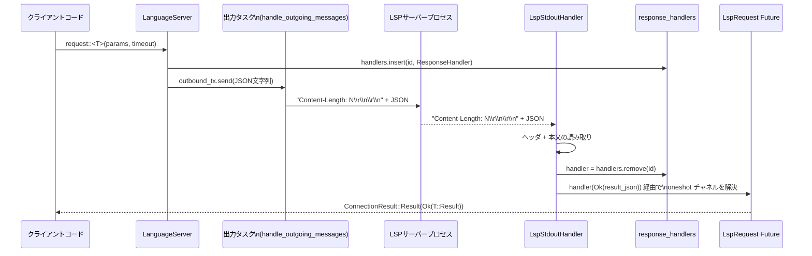

# crates/lsp ディレクトリ解説

## 1. ざっくり一言

`crates/lsp` は、外部の Language Server をプロセスとして起動し、LSP (Language Server Protocol) の JSON-RPC メッセージを標準入出力経由でやり取りする「LSP クライアント兼アダプタ」です。  
Zed の内部（`gpui` ベースのアプリケーション）から、LSP サーバーへリクエスト・通知を送ったり、その応答・通知をハンドラに振り分ける役割を持ちます。

---

## 2. このモジュールの役割

### 2.1 概要

このディレクトリは主に次の問題を解決します。

- 外部バイナリとして提供される LSP サーバーの起動・終了と、標準入出力によるプロトコル処理
- LSP の JSON-RPC メッセージのシリアライズ／デシリアライズと、リクエスト ID に基づく応答のマッピング
- クライアント側から登録する通知ハンドラ・リクエストハンドラ・IO ログハンドラへのイベント配信
- テスト用の FakeLanguageServer による LSP 通信の疑似実行

### 2.2 アーキテクチャ内での位置づけ

`lsp.rs` がライブラリのルートで、実質的な「LanguageServer クライアント」の本体です。  
`input_handler.rs` は、LSP サーバーの stdout を LSP メッセージ単位で読み取り、通知と応答を振り分ける補助モジュールです。

主なコンポーネントの関係は次のようになっています。

```mermaid
graph TD
  Client["クライアントコード\n(エディタ側ロジック)"]
  LS["LanguageServer 構造体\n(lsp.rs)"]
  InHandler["LspStdoutHandler\n(input_handler.rs)"]
  Child["LSP サーバープロセス\n(子プロセス, stdio)"]
  StdinTask["handle_outgoing_messages\n(標準入力書き込み)"]
  StderrTask["handle_stderr\n(標準エラー読取り)"]
  IoHandlers["io_handlers: HashMap<i32, IoHandler>"]
  NotifHandlers["notification_handlers:\nHashMap<method, Handler>"]
  RespHandlers["response_handlers:\nHashMap<RequestId, ResponseHandler>"]

  Client -->|request/notify/on_* 登録| LS
  LS -->|spawn 子プロセス| Child
  LS -->|outbound_tx| StdinTask
  StdinTask -->|LSP メッセージ (JSON + ヘッダ)| Child
  Child -->|stdout (LSP メッセージ)| InHandler
  Child -->|stderr (ログ行)| StderrTask

  InHandler -->|NotificationOrRequest| LS
  InHandler -->|Response| RespHandlers
  LS --> NotifHandlers
  LS --> IoHandlers
  InHandler --> IoHandlers
  StderrTask --> IoHandlers
```

- `LanguageServer` が外部プロセスの起動と、送受信タスク (`handle_incoming_messages` / `handle_outgoing_messages` / `handle_stderr`) を管理します。
- `LspStdoutHandler` は stdout から LSP メッセージをバイト列で読み、JSON にパースして  
  - 通知／リクエスト: `incoming_messages` チャンネルで `LanguageServer` へ
  - 応答: `response_handlers` マップに登録されたハンドラを呼び出す  
 という役割を持ちます。

### 2.3 設計上のポイント

コードから読み取れる設計上の特徴は次の通りです。

- **責務分割**
  - `LanguageServer` はプロセス起動・タスク起動・LSP メッセージの高レベルな API（`request`, `notify`, `on_notification`, `on_request` など）を提供します。
  - `LspStdoutHandler` は「標準出力から LSP メッセージを 1 メッセージずつ読み取り、通知とレスポンスを振り分ける」低レベル I/O に特化しています。
- **状態管理**
  - リクエスト応答待ち: `response_handlers: Arc<Mutex<Option<HashMap<RequestId, ResponseHandler>>>>`
  - 通知ハンドラ: `notification_handlers: Arc<Mutex<HashMap<&'static str, NotificationHandler>>>`
  - IO ハンドラ: `io_handlers: Arc<Mutex<HashMap<i32, IoHandler>>>`
  - これらは `Arc + Mutex` で共有され、複数タスクからアクセスされます。
- **エラーハンドリング**
  - プロセス起動や I/O、JSON パースには `anyhow::Result` / `anyhow::Context` を使用します。
  - LSP レスポンスのエラーは独自の `Error` 型（LSP の error オブジェクト）で表現し、`ResponseHandler` に `Result<String, Error>` として渡します。
  - リクエストタイムアウトや接続リセットなど通信上の状態は、`ConnectionResult<T>`（外部 crate）で表現されます。
- **リソース管理**
  - `LanguageServer::Drop` 実装で `shutdown` を呼び出し、LSP の `shutdown` リクエスト／`exit` 通知送信・タスク終了・子プロセス kill までを自動で行います。
  - `Subscription` の Drop 実装で、自動的にハンドラを解除します（`detach` した場合は解除しない）。
- **テスト支援**
  - `FakeLanguageServer` で、実プロセスを起動せずに `async_pipe` を使って LSP 通信を模擬できるようになっています（`cfg(test)` または `feature = "test-support"`）。

---

## 3. 主要な機能一覧

このディレクトリが提供する主な機能は次のとおりです。

- **LSP サーバープロセスの起動・終了**
  - `LanguageServer::new` で外部バイナリを子プロセスとして起動し、標準入出力／標準エラーを接続します。
  - Drop 時に `shutdown` リクエスト／`exit` 通知送信とプロセス終了処理を行います。
- **LSP メッセージの送受信**
  - `request` / `request_with_timer` で JSON-RPC リクエストを送り、応答を Future で受け取ります。
  - `notify` で JSON-RPC 通知を送信します。
  - 入力側は `LspStdoutHandler` がヘッダ＋ボディを読み取り、LSP メッセージとしてパースします。
- **通知／リクエストハンドラの登録**
  - `on_notification` / `on_request` で、LSP サーバーからクライアントへの通知／リクエストに対するハンドラを登録します。
  - 未処理のサーバー→クライアントリクエストに対しては、`-32601 Unrecognized method` で自動応答する仕組みを持ちます。
- **IO ログハンドリング**
  - `on_io` で、LSP サーバーとの stdio（stdin/stdout/stderr）の文字列を購読できます（ログやデバッグ用）。
- **LSP クライアント機能の補助**
  - `default_initialize_params` で `InitializeParams` を生成し、Zed のクライアント能力（Capabilities）をまとめて構築します。
  - `workspace_folders` 関連の通知 (`DidChangeWorkspaceFolders`) を自動送信するユーティリティ (`add_workspace_folder`, `remove_workspace_folder`, `set_workspace_folders`) を提供します。
  - ドキュメントの open/close を通知する `register_buffer` / `unregister_buffer`。
- **テスト用 FakeLanguageServer**
  - `FakeLanguageServer::new` で `LanguageServer` と対になる偽サーバーを生成し、双方向の LSP 通信をテストできます。
  - `set_request_handler`, `handle_notification` などでテスト時のサーバー挙動を柔軟に定義できます。

---

## 4. 関数・構造体の解説

### 4.1 主な型一覧

公開・準公開 API として重要な型をまとめます（`cfg(test)` / `feature="test-support"` 限定の型も含みます）。

| 名前 | 種別 | 定義場所 | 役割 / 用途 |
|------|------|----------|-------------|
| `LanguageServerBinary` | 構造体 | `lsp.rs` | 起動する LSP サーバーバイナリのパス・引数・環境変数の集合 |
| `LanguageServerBinaryOptions` | 構造体 | `lsp.rs` | LSP バイナリの検索・ダウンロード方針を表すオプション |
| `LanguageServerId` | newtype 構造体 | `lsp.rs` | 実行中の LanguageServer インスタンスを一意に識別する ID |
| `LanguageServerName` | newtype 構造体 | `lsp.rs` | LSP サーバー名（`SharedString` ベース） |
| `LanguageServerSelector` | enum | `lsp.rs` | LanguageServer を ID または Name で指定するためのセレクタ |
| `LanguageServer` | 構造体 | `lsp.rs` | 子プロセスとしての LSP サーバーを管理し、LSP 通信 API を提供する中核 |
| `Subscription` | enum | `lsp.rs` | 通知ハンドラ／IO ハンドラ登録のハンドル。Drop 時に自動解除 |
| `IoKind` | enum | `lsp.rs` | IO ハンドラに渡される「どのストリームか」（StdOut / StdIn / StdErr） |
| `RequestId` | enum | `lsp.rs` | LSP リクエストの ID（数値または文字列） |
| `Request<'a, T>` | 構造体 | `lsp.rs` | LSP リクエストメッセージの JSON 表現（送信側） |
| `AnyResponse<'a>` | 構造体 | `lsp.rs` | LSP レスポンスの汎用表現（結果を Raw JSON で保持） |
| `Response<T>` | 構造体 | `lsp.rs` | クライアント側からサーバーへ返すレスポンス構造体 |
| `LspResult<T>` | enum | `lsp.rs` | レスポンスの result / error を排他的に表すラッパー |
| `Notification<'a, T>` | 構造体 | `lsp.rs` | LSP 通知メッセージの JSON 表現 |
| `NotificationOrRequest` | 構造体 | `lsp.rs` | サーバーからクライアントへ送られる通知またはリクエストの共通表現 |
| `Error` | 構造体 | `lsp.rs` | LSP エラーオブジェクト（code / message / data） |
| `LspRequestFuture<O>` | トレイト | `lsp.rs` | `id()` メソッド付きの Future。リクエスト ID へアクセス可能 |
| `LspRequest<F>` | 構造体 | `lsp.rs` | 内部用の Future ラッパー。リクエスト ID と元の Future を保持 |
| `AdapterServerCapabilities` | 構造体 | `lsp.rs` | サーバー側とアダプタ側の能力情報をまとめた構造体 |
| `LspStdoutHandler` | 構造体 | `input_handler.rs` | LSP サーバー stdout からのメッセージ読み取りループの管理 |
| `FakeLanguageServer` | 構造体 | `lsp.rs` (`cfg(test)` 等) | テスト・サポート用の疑似 LSP サーバー |

### 4.2 重要な関数・メソッド詳細（最大 7 件）

ここでは、利用時に中心となる 7 つの関数／メソッドを詳しく説明します。

---

#### `LanguageServer::new(...) -> Result<Self>`

**概要**

- 実際の LSP サーバーバイナリを子プロセスとして起動し、その標準入出力／標準エラーを `LanguageServer` インスタンスに接続します。
- その後の LSP 通信は、このインスタンス経由で行われます。

**引数**

| 引数名 | 型 | 説明 |
|--------|----|------|
| `stderr_capture` | `Arc<Mutex<Option<String>>>` | サーバーの stderr の内容を格納するオプションのバッファ |
| `server_id` | `LanguageServerId` | 論理的なサーバー ID |
| `server_name` | `LanguageServerName` | サーバー表示名 |
| `binary` | `LanguageServerBinary` | 実際に起動するバイナリパス・引数・環境変数 |
| `root_path` | `&Path` | 作業ディレクトリとして扱うパス（URI に変換され、`root_uri` にも使われる） |
| `code_action_kinds` | `Option<Vec<CodeActionKind>>` | クライアント側が把握している code action 種類 |
| `workspace_folders` | `Option<Arc<Mutex<BTreeSet<Uri>>>>` | 管理対象の workspace folder 群 |
| `cx` | `&mut AsyncApp` | `gpui` の非同期アプリケーションコンテキスト |

**戻り値**

- `Result<LanguageServer>`  
  - 成功時: LSP サーバーに接続済みの `LanguageServer` インスタンス
  - 失敗時: コマンド起動やストリーム取得に失敗した理由を含む `anyhow::Error`

**内部処理の流れ**

1. `root_path` から実際の作業ディレクトリ(`working_dir`)を決定します（ファイルの場合は親ディレクトリ）。
2. `Uri::from_file_path` で `root_uri` を作成します（不正なパスの場合はエラー）。
3. `util::command::new_command` で `binary.path` を実行するコマンドを準備し、カレントディレクトリや引数・環境変数を設定します。
4. `stdin/stdout/stderr` をパイプで確保し、`kill_on_drop(true)` を設定した上で `spawn()` で子プロセスを起動します。
5. 得られた `stdin/stdout/stderr` と子プロセスハンドルを `new_internal` に渡し、`LanguageServer` を構築します。
6. 完成した `LanguageServer` を `Ok` で返します。

**Examples（使用例）**

```rust
use std::{path::Path, sync::Arc};
use parking_lot::Mutex;
use lsp::{
    LanguageServer, LanguageServerBinary, LanguageServerId, LanguageServerName,
};
use lsp_types::ServerCapabilities;

// `cx` はどこかで用意された AsyncApp とする
async fn start_server(cx: &mut gpui::AsyncApp) -> anyhow::Result<LanguageServer> {
    let stderr_capture = Arc::new(Mutex::new(None));

    let binary = LanguageServerBinary {
        path: "/usr/bin/rust-analyzer".into(),
        arguments: vec![],
        env: None,
    };

    let server = LanguageServer::new(
        stderr_capture,
        LanguageServerId(1),
        LanguageServerName::from("rust-analyzer"),
        binary,
        Path::new("/path/to/project"),
        None,              // code_action_kinds
        None,              // workspace_folders
        cx,
    )?;

    Ok(server)
}
```

**Errors / Panics**

- `Uri::from_file_path` が失敗した場合、`anyhow!("{working_dir:?} is not a valid URI")` を返します。
- `command.spawn()` が失敗すると `with_context(|| format!("failed to spawn command {command:?}"))` を付加した `Err` を返します。
- `stdin/stdout/stderr` の `take()` は `unwrap()` されているため、これらのパイプが取得できなかった場合にはパニックしますが、通常 `spawn` 成功時には存在する前提です。

**Edge cases（エッジケース）**

- `root_path` がディレクトリでない場合は親ディレクトリを使用します。親が無い場合はルート (`"/"`) を使用します。
- `binary.env` が `None` の場合でも、`envs(binary.env.clone().unwrap_or_default())` により空の環境変数マップが渡されます。

**使用上の注意点**

- `new` の直後には LSP の `initialize` リクエストはまだ送られていません。  
  実際に利用する前に `initialize` を呼び出し、サーバーの `ServerCapabilities` を取得しておく必要があります。
- `cx` (`AsyncApp`) のライフタイムとサーバーのタスクライフタイムが結びつくため、アプリケーション終了前に不要な `LanguageServer` をドロップしておく必要があります（Drop 実装で `shutdown` が走ります）。

---

#### `LanguageServer::initialize(self, params, configuration, timeout, cx) -> Task<Result<Arc<Self>>>`

**概要**

- 既に起動済みの `LanguageServer` に対して `initialize` リクエストを送り、サーバーからの能力情報 (`ServerCapabilities`) を取得して内部状態を更新します。
- 成功すると、`Arc<LanguageServer>` を返すタスクを生成します。

**引数**

| 引数名 | 型 | 説明 |
|--------|----|------|
| `self` | `LanguageServer`（ムーブ） | 既に `new` 済みのインスタンス。`initialize` 後は `Arc<Self>` で保持されます。 |
| `params` | `InitializeParams` | LSP の `initialize` リクエストに渡すパラメータ |
| `configuration` | `Arc<DidChangeConfigurationParams>` | 設定情報（ログ表示用にそのまま保持） |
| `timeout` | `Duration` | リクエストタイムアウト |
| `cx` | `&App` | `gpui::App` コンテキスト |

**戻り値**

- `Task<Result<Arc<Self>>>`  
  - `await` すると `Arc<LanguageServer>` か、初期化失敗の `anyhow::Error` を返します。

**内部処理の流れ**

1. `cx.background_spawn` で非同期タスクを生成します。
2. タスク内で `self.request::<request::Initialize>(params, timeout).await` を呼び出し、`ConnectionResult` を `into_response()` で `Result<InitializeResult>` に変換します。
3. エラー時には `with_context` で `"initializing server {name}, id {server_id}"` の文脈を付加します。
4. 成功時:
   - `server_info` から `version` や `name` を `LanguageServer` のフィールドに反映します。
   - `capabilities` フィールドを `response.capabilities` で初期化します。
   - `configuration` を保存します。
   - `notification::Initialized` を送信します。
5. 最終的に `Arc::new(self)` を `Ok` で返します。

**Examples（使用例）**

```rust
use lsp::{LanguageServer, DEFAULT_LSP_REQUEST_TIMEOUT};
use lsp_types::DidChangeConfigurationParams;
use serde_json::Value;
use std::sync::Arc;

// `server` は LanguageServer::new 済みとする
async fn initialize_server(
    server: LanguageServer,
    app: &gpui::App,
) -> anyhow::Result<Arc<LanguageServer>> {
    let pull_diagnostics = false;
    let augments_syntax_tokens = false;

    let params = server.default_initialize_params(pull_diagnostics, augments_syntax_tokens, app);

    let configuration = Arc::new(DidChangeConfigurationParams {
        settings: Value::Null,
    });

    let task = server.initialize(
        params,
        configuration,
        DEFAULT_LSP_REQUEST_TIMEOUT,
        app,
    );

    let server = task.await?; // Arc<LanguageServer>
    Ok(server)
}
```

**Errors / Panics**

- `initialize` リクエスト自体がタイムアウト、接続リセット、サーバーエラー等を返した場合、それらを `anyhow::Error` に変換した上で `Err` になります。
- 内部で panic する箇所は見当たらず、主に `request`／応答の変換エラーとして扱われます。

**Edge cases**

- タイムアウトにより `ConnectionResult::Timeout` が発生した場合も、`into_response()` で `Err` になります。  
  そのため「初期化に非常に時間がかかるサーバー」を利用する場合は `timeout` を十分長くする必要があります。

**使用上の注意点**

- `initialize` は `self` をムーブするため、**戻り値の `Arc<Self>` を以後の参照に使う前提** で設計されています。
- `default_initialize_params` は Zed 固有のクライアント能力を多数含んでいるため、通常はそれを利用し、手動で `InitializeParams` を組み立てる場合も、その構造を参考にする必要があります。

---

#### `LanguageServer::request<T>(params, request_timeout) -> impl LspRequestFuture<T::Result>`

**概要**

- 汎用的な LSP リクエスト送信 API です。  
  型引数 `T` に `lsp_types::request::Request` 実装を指定し、リクエストパラメータとタイムアウトを渡すと、応答を待つ Future を得られます。

**引数**

| 引数名 | 型 | 説明 |
|--------|----|------|
| `T` | `request::Request`（型パラメータ） | LSP のリクエスト種別（例: `request::GotoDefinition`） |
| `params` | `T::Params` | そのリクエストに対応するパラメータ型 |
| `request_timeout` | `Duration` | タイムアウト。0 or `Duration::MAX` で無期限 |

**戻り値**

- `impl LspRequestFuture<T::Result>`  
  - `Future<Output = ConnectionResult<T::Result>>` を実装しつつ、`id()` で LSP メッセージ ID を取得できます。

**内部処理の流れ（`request_internal`／`request_internal_with_timer`）**

1. `next_id` の `AtomicI32` から新しい ID を採番 (`fetch_add`) します。
2. `Request { jsonrpc: "2.0", id, method: T::METHOD, params }` を JSON 文字列へシリアライズします。
3. `response_handlers` に、`RequestId::Int(id)` をキーとして `ResponseHandler` を登録します。
   - このハンドラは、`input_handler` 側で JSON レスポンス文字列を受け取った際に呼ばれ、  
     `serde_json::from_str` で `T::Result` 型へデシリアライズした `Result<T::Result>` を oneshot チャネルへ流します。
4. `outbound_tx.try_send(message)` でメッセージ送信を試みます。
5. `request_timeout` に応じたタイマ Future と、レスポンス待ち oneshot Future を `select!` で競合させます。
   - 応答が先: `ConnectionResult::Result(Ok(T::Result))` か、デシリアライズ等のエラー
   - タイマが先: `ConnectionResult::Timeout`（`response_handlers` からハンドラを削除）

**Examples（使用例）**

```rust
use lsp::LanguageServer;
use lsp_types::{request, Position, TextDocumentIdentifier, TextDocumentPositionParams};
use std::time::Duration;

async fn goto_definition(
    server: &LanguageServer,
    doc_uri: lsp_types::Url,
    line: u32,
    character: u32,
) -> util::ConnectionResult<lsp_types::GotoDefinitionResponse> {
    let params = TextDocumentPositionParams {
        text_document: TextDocumentIdentifier::new(doc_uri),
        position: Position { line, character },
    };

    server
        .request::<request::GotoDefinition>(params, Duration::from_secs(5))
        .await
}
```

**Errors / Panics**

- `response_handlers.lock().as_mut().context("server shut down")` に失敗すると、`Result::Err(anyhow!("server shut down"))` を返します。  
  → サーバーが既に shutdown 済み、または Drop 済みのケース。
- `outbound_tx.try_send(message)` が失敗すると、「stdin 書き込みに失敗した」旨の `anyhow::Error` を返します。
- これらは `ConnectionResult::Result(Err(...))` として Future の結果になります。

**Edge cases**

- `request_timeout == Duration::ZERO` または `Duration::MAX` の場合、タイマが永遠に発火しないため、実質的に無期限待ちとなります。
- サーバーからのレスポンス JSON が `T::Result` にデシリアライズできない場合、
  - ログにエラーメッセージと生のレスポンスが出力され、
  - 呼び出し側には `Err(anyhow!("failed to deserialize response"))` として返ります。

**使用上の注意点**

- 過度に短い `request_timeout` を設定すると、サーバー側が処理したにもかかわらずクライアント側でタイムアウト扱いになる可能性があります。
- `LspRequestFuture` は `id()` を持ちますが、通常は ID を意識せず `await` で結果を受け取れば十分です。

---

#### `LanguageServer::notify<T>(params: T::Params) -> Result<()>`

**概要**

- LSP 通知メッセージをサーバーに送信します（応答は期待しません）。
- たとえば `DidOpenTextDocument`, `PublishDiagnostics` などの通知に対応します。

**引数**

| 引数名 | 型 | 説明 |
|--------|----|------|
| `T` | `notification::Notification`（型パラメータ） | 送る通知種別 |
| `params` | `T::Params` | 通知のパラメータ |

**戻り値**

- `Result<()>`  
  - 送信キュー (`notification_tx`) への送信に成功すれば `Ok(())`、失敗すれば `anyhow::Error`。

**内部処理の流れ**

1. `NotificationSerializer` という「遅延シリアライザ」を作ります。  
   これは `FnOnce() -> String` を箱詰めしたもので、実際の JSON シリアライズは送信ループ側で行われます。
2. `notification_tx.send_blocking(serializer)?` でシリアライザを送信します。
3. 別タスク内で `notification_rx.recv().await` し、受け取ったシリアライザを呼び出して JSON 文字列に変換します。
4. JSON 文字列は `outbound_tx.send(serialized).await` に流され、`handle_outgoing_messages` でヘッダ付きで書き出されます。

**Examples（使用例）**

```rust
use lsp::LanguageServer;
use lsp_types::{notification, DidOpenTextDocumentParams, TextDocumentItem};

fn open_document(
    server: &LanguageServer,
    uri: lsp_types::Url,
    language_id: String,
    text: String,
) -> anyhow::Result<()> {
    server.notify::<notification::DidOpenTextDocument>(DidOpenTextDocumentParams {
        text_document: TextDocumentItem::new(uri, language_id, 0, text),
    })
}
```

**Errors / Panics**

- `notification_tx.send_blocking` が失敗すると `Err` を返します（`channel::Sender` がクローズされている場合など）。

**Edge cases**

- `Notification` の `params` フィールドは `skip_serializing_if = "is_unit"` で、`()` の場合は JSON に含まれません。  
  → パラメータ無し通知でも問題なく送信できます。

**使用上の注意点**

- 通知は応答がないため、送信に成功したかどうかは `notify` 自身の `Result` でしか確認できません。  
  サーバー側で無視されたかどうかは検出できません。

---

#### `LanguageServer::on_notification<T, F>(&self, f: F) -> Subscription`

**概要**

- サーバーからクライアントへの LSP 通知に対するハンドラを登録します。
- 指定したメソッド（`T::METHOD`）に対して、1 つだけハンドラを紐付けられます。

**引数**

| 引数名 | 型 | 説明 |
|--------|----|------|
| `T` | `notification::Notification` | 対象とする通知の型 |
| `F` | `FnMut(T::Params, &mut AsyncApp) + Send + 'static` | 通知到着時に呼び出されるコールバック |

**戻り値**

- `Subscription`  
  - Drop されると自動的にハンドラが解除されます。`detach()` で解除を無効化可能です。

**内部処理の流れ（`on_custom_notification`）**

1. `notification_handlers` マップに、`T::METHOD` をキーとしてクロージャを登録します。
2. 登録時に以前のハンドラが存在していないか検査し、存在していた場合は `assert!(prev_handler.is_none())` で panic します。
3. `handle_incoming_messages` 内で `NotificationOrRequest` を受信した際、  
   - `notification_handlers` から `msg.method` に対応するハンドラを探し、
   - 見つかれば JSON から `T::Params` 型へデシリアライズしてからコールバック `f` を呼び出します。

**Examples（使用例）**

```rust
use lsp::LanguageServer;
use lsp_types::{notification, ShowMessageParams};

fn subscribe_show_message(server: &LanguageServer) -> lsp::Subscription {
    server.on_notification::<notification::ShowMessage, _>(
        |params: ShowMessageParams, _cx: &mut gpui::AsyncApp| {
            println!("LSP ShowMessage: {:?}", params.message);
        },
    )
}
```

**Errors / Panics**

- 既に同じメソッドのハンドラが登録されている状態で再度 `on_notification` を呼ぶと、`assert!(prev_handler.is_none())` により panic します。
- 受信 JSON が `T::Params` にデシリアライズできない場合は `log_err()` でログにエラーを残し、ハンドラ `f` は呼ばれません。

**Edge cases**

- `Subscription` が Drop されると、`notification_handlers.lock().remove(method)` によりハンドラが解除されます。  
  → ハンドラのライフタイムを明示的に管理したい場合は、`detach()` を呼ぶ必要があります。

**使用上の注意点**

- テストコードでは、Drop によるハンドラ解除を回避するために `subscription.detach()` を頻繁に使用しています。  
  実装側でも、ハンドラを長期的に生かしたい場合は同様に `detach()` を検討します。

---

#### `LanguageServer::on_request<T, F, Fut>(&self, f: F) -> Subscription`

**概要**

- サーバーからクライアントへの LSP リクエスト（双方向拡張など）に対するハンドラを登録します。
- クライアント側がレスポンスを返す必要があるタイプのメッセージを扱います。

**引数**

| 引数名 | 型 | 説明 |
|--------|----|------|
| `T` | `request::Request` | 対象とするリクエスト型 |
| `F` | `FnMut(T::Params, &mut AsyncApp) -> Fut + Send + 'static` | リクエスト到着時に呼び出される非同期コールバック |
| `Fut` | `Future<Output = Result<T::Result>> + 'static + Send` | コールバックの戻り Future 型 |

**戻り値**

- `Subscription`  
  - Drop されるとハンドラが解除されます。

**内部処理の流れ（`on_custom_request`）**

1. `notification_handlers` に `method` 用のエントリを登録し、受信処理を「通知＋ID付きリクエスト共通の入口」として扱います。
2. 受信時に `msg.id` が `Some(id)` の場合のみリクエストとみなし、`params` を `T::Params` へデシリアライズします。
3. `f(params, cx)` で処理を開始し、その結果を `Response<T::Result>` として JSON シリアライズします。
4. シリアライズされたレスポンスは `outbound_tx.try_send(response)` で送信されます。
5. `pending_respond_tasks` にタスクを登録しておき、`$/cancelRequest` 通知を受け取ったときに対応するタスクを削除（= ドロップ）することでキャンセルを実現します。

**Examples（使用例）**

テスト用 FakeLanguageServer 側のユーティリティが典型例です。

```rust
#[cfg(any(test, feature = "test-support"))]
fn install_custom_handler(
    fake: &lsp::FakeLanguageServer,
) -> futures::channel::mpsc::UnboundedReceiver<()> {
    use lsp_types::request;

    fake.set_request_handler::<request::Shutdown, _, _>(|_params, _cx| async move {
        // クライアントからの shutdown リクエストを受けて、成功レスポンスを返す
        Ok(())
    })
}
```

**Errors / Panics**

- `on_notification` と同様、同一メソッド名に複数ハンドラを登録すると `assert!(prev_handler.is_none())` で panic します。
- リクエストパラメータのデシリアライズに失敗した場合:
  - ログにエラーを出力し、
  - `code: -32700 (Parse error)` の `AnyResponse` を生成してサーバーに返します。

**Edge cases**

- サーバーから `$/cancelRequest` 通知が来た場合、`handle_incoming_messages` 内で `pending_respond_tasks` から該当 ID のタスクが削除されます。  
  → タスクの Drop により、実際のコールバック処理が中断される想定です。

**使用上の注意点**

- サーバーからのリクエストを受け付ける必要がない場合は、この API を呼ぶ必要はありません。  
  未処理のリクエストは `on_unhandled_notification` ラッパーを通じて `-32601 Unrecognized method` で応答されます。

---

#### `LanguageServer::shutdown(&self) -> Option<impl Future<Output = Option<()>>>`

**概要**

- サーバーに対して `Shutdown` リクエストと `Exit` 通知を送り、I/O タスクと子プロセスを安全に終了させるための非同期処理を組み立てます。
- Drop 実装からも自動的に呼び出されます。

**引数**

- なし（`&self` のみ）

**戻り値**

- `Option<impl Future<Output = Option<()>> + 'static + Send>`  
  - すでに shutdown 済み（`io_tasks` が `None`）の場合は `None`。  
  - Future は、終了処理完了時に `Some(())` を返します。

**内部処理の流れ**

1. `io_tasks` を `take()` し、以後同じインスタンスで二重に shutdown が走らないようにします。
2. 現在の `next_id` をコピーし、`Shutdown` リクエストを送るための独立した ID カウンタとして使います。
3. `request_internal::<request::Shutdown>` で `SERVER_SHUTDOWN_TIMEOUT` をタイムアウトとするリクエスト Future を作成します。
4. `executor.timer(SERVER_SHUTDOWN_TIMEOUT)` と `select!` で競合させます。
5. どちらかが終わると:
   - `response_handlers` をクリア (`take`) し、
   - `notification::Exit` を送信し、
   - `notification_serializers.close()` で通知チャンネルを閉じ、
   - `output_done.recv().await` で出力タスクの終了を待機します。
   - 子プロセスが生きていれば `child.kill()` を呼び出し、
   - タスクハンドル (`tasks`) をドロップします。

**Examples（使用例）**

通常は Drop で自動実行されるため、明示的に呼び出す必要はあまりありませんが、明示的に待ちたい場合の例です。

```rust
async fn graceful_shutdown(server: &lsp::LanguageServer) {
    if let Some(shutdown_future) = server.shutdown() {
        // 明示的に待つ
        shutdown_future.await;
    }
}
```

**Errors / Panics**

- 内部では `log::warn` / `log::error` にメッセージを出すのみで、`shutdown` 自体はエラーを返しません。
- `output_done_rx` が `take().unwrap()` されているため、`shutdown` が二度呼ばれると `unwrap` が panic しますが、実際には最初の呼び出しで `io_tasks` が `None` となるため、後続呼び出しは `None` を返してここに到達しません。

**Edge cases**

- サーバーがすでに終了していて `ConnectionResult::ConnectionReset` になるケースもログに出力するだけで、`shutdown` 自体は続行します。
- タイムアウトに到達した場合でも、`Exit` 通知送信→子プロセス kill という強制終了フローが実行されます。

**使用上の注意点**

- `shutdown` は `LanguageServer` の Drop から自動的に呼び出されるため、通常は明示的に呼ぶ必要はありません。
- ただし「終了処理完了まで待ちたい」ケース（テストなど）では、戻り値の Future を `await` することで処理完了を待機できます。

---

#### `LspStdoutHandler::new(...) -> LspStdoutHandler`（＋内部 `handler`）

**概要**

- LSP サーバーの stdout からメッセージを読み取るループをバックグラウンドタスクとして起動し、
  - 通知／リクエスト: `incoming_messages` チャンネルに `NotificationOrRequest` を流す
  - 応答: `response_handlers` マップに登録済みの `ResponseHandler` を呼び出す  
 役割を持ちます。

**引数**

| 引数名 | 型 | 説明 |
|--------|----|------|
| `stdout` | `Input: AsyncRead + Unpin + Send + 'static` | LSP サーバーの stdout ストリーム |
| `response_handlers` | `Arc<Mutex<Option<HashMap<RequestId, ResponseHandler>>>>` | リクエスト ID → 応答ハンドラのマップ |
| `io_handlers` | `Arc<Mutex<HashMap<i32, IoHandler>>>` | IO ログハンドラ群 |
| `cx` | `BackgroundExecutor` | バックグラウンドタスクを起動するための実行コンテキスト |

**戻り値**

- `LspStdoutHandler`  
  - `loop_handle`: 読み取りループタスクの `Task<Result<()>>`
  - `incoming_messages`: `UnboundedReceiver<NotificationOrRequest>`（通知/リクエスト用ストリーム）

**内部処理の流れ（概略）**

1. `smol::io::BufReader` で `stdout` をラップします。
2. ループ内で:
   1. バッファをクリアし、`read_headers` で `\r\n\r\n` までのヘッダ部を読み込みます。
   2. ヘッダ内の `Content-Length: N` を探し、メッセージ本文長をパースします。
   3. 本文長分だけ読み取り、`buffer` に格納します。
   4. `str::from_utf8` に成功したら、IO ハンドラに `IoKind::StdOut` としてメッセージ文字列を渡します。
   5. `serde_json::from_slice::<NotificationOrRequest>` を試み、成功すれば通知/リクエストとして `notifications_sender` に送信します。
   6. 失敗した場合は、`serde_json::from_slice::<AnyResponse>` を試みます。成功した場合:
      - `response_handlers` から `id` に対応するハンドラを取り出し、
      - `error` / `result` の有無に応じて `handler(Err(Error))` または `handler(Ok(json_string))` を `await` します。
   7. いずれでもなければ、デシリアライズ失敗として `warn!` ログを出します。

**Errors / Panics**

- `read_headers` 内で `read_until` が 0 バイト（EOF）を返した場合、`anyhow::bail!("cannot read LSP message headers")` でエラー終了します。
- ヘッダ解析時に `Content-Length` 行が見つからない、あるいはパースに失敗した場合にも `with_context` 付きの `Err` を返します。
- これらのエラーは `loop_handle` の `Task<Result<()>>` 結果として観測できます。

**Edge cases**

- ヘッダ終端（`\r\n\r\n`）は `read_until(b'\n')` ベースで検出しているため、ヘッダの行終端が仕様どおり `\r\n` でないサーバーとは相性が良くありません。
- メッセージ本文が UTF-8 でない場合は IO ハンドラへのトレースログ出力は行われませんが、JSON としてのパースは `from_slice` で試みられます。

**使用上の注意点**

- `LspStdoutHandler` は `LanguageServer::handle_incoming_messages` から内部的に利用されるため、通常は直接使う必要はありません。
- `incoming_messages` を読み尽くさないと、内部バッファが増えていく可能性があります（`handle_incoming_messages` はこのストリームをループで読み続けます）。

---

### 4.3 その他の補助的関数

- `LanguageServer::handle_incoming_messages`  
  - `LspStdoutHandler` を生成し、`incoming_messages` ストリームを処理します。  
    - `$/cancelRequest` を処理して `pending_respond_tasks` からタスクを削除  
    - 通知ハンドラを呼び出し、未処理メッセージは `on_unhandled_notification` に委譲
- `LanguageServer::handle_outgoing_messages`  
  - `outbound_rx` から JSON メッセージを受信し、`Content-Length` ヘッダ＋本文として stdin に書き込みます。
- `LanguageServer::handle_stderr`  
  - stderr を行単位で読み取り、`IoKind::StdErr` として IO ハンドラに渡しつつ、必要に応じて `stderr_capture` に追記します。
- `LanguageServer::default_initialize_params`  
  - Zed 固有のクライアント機能を埋め込んだ `InitializeParams` を構築します。
- `FakeLanguageServer` 系メソッド  
  - 本物の `LanguageServer` とペアで LSP 通信を模擬するテストユーティリティ群です。

---

## 5. データフロー

ここでは、「クライアントからサーバーへリクエストを送り、応答を受け取る」典型的なシナリオのデータフローを示します。

### 5.1 概要

1. クライアントコードが `LanguageServer::request::<T>(params, timeout)` を呼びます。
2. `LanguageServer` は JSON-RPC リクエストをシリアライズし、`outbound_tx` 経由で送信キューへ入れます。
3. `handle_outgoing_messages` タスクが `Content-Length` ヘッダ付きで標準入力（サーバー側）へ書き込みます。
4. LSP サーバーが応答を stdout に書き出します。
5. `LspStdoutHandler` が stdout からヘッダ＋本文を読み取り、JSON をパースして `AnyResponse` として解釈します。
6. `response_handlers` マップから該当 ID のハンドラを取り出し、JSON 文字列を `Result<T::Result>` に変換して oneshot チャネルに流します。
7. `LspRequest` Future が `ConnectionResult::Result(Ok(T::Result))` を返し、クライアントコードが結果を受け取ります。

### 5.2 シーケンス図



- タイムアウトの場合は、`ReqFut` 内の `select!` が先にタイマ側を選び、`ConnectionResult::Timeout` を返します。
- サーバーからのレスポンスパースエラーなどは `ConnectionResult::Result(Err(...))` として返されます。

---

## 6. 使い方（How to Use）

### 6.1 基本的な使用方法

ここでは、実際に `LanguageServer` を起動し、初期化してから LSP リクエスト／通知をやり取りする基本的な流れを示します。  
（下記コードはコンセプトを示すものであり、周辺の `gpui` セットアップなどは簡略化しています。）

```rust
use std::{path::Path, sync::Arc, time::Duration};
use parking_lot::Mutex;
use serde_json::Value;
use lsp::{
    LanguageServer, LanguageServerBinary, LanguageServerId,
    LanguageServerName, DEFAULT_LSP_REQUEST_TIMEOUT,
};
use lsp_types::{
    notification, request, InitializeParams, DidChangeConfigurationParams,
    TextDocumentIdentifier, TextDocumentPositionParams, Position,
};
use gpui::{App, AsyncApp};

async fn run_lsp(app: &mut App) -> anyhow::Result<()> {
    // 1. AsyncApp を取得
    let mut async_cx = app.to_async();

    // 2. LanguageServer を起動
    let stderr_capture = Arc::new(Mutex::new(None));
    let binary = LanguageServerBinary {
        path: "/usr/bin/rust-analyzer".into(),
        arguments: vec![],
        env: None,
    };
    let server = LanguageServer::new(
        stderr_capture,
        LanguageServerId(1),
        LanguageServerName::from("rust-analyzer"),
        binary,
        Path::new("/path/to/project"),
        None,
        None,
        &mut async_cx,
    )?;

    // 3. initialize パラメータの構築
    let initialize_task = async_cx.update(|cx| {
        let params: InitializeParams =
            server.default_initialize_params(false, false, cx);
        let configuration = DidChangeConfigurationParams {
            settings: Value::Null,
        };
        server.initialize(params, Arc::new(configuration), DEFAULT_LSP_REQUEST_TIMEOUT, cx)
    });

    // 4. initialize を待つ
    let server = initialize_task.await??; // Arc<LanguageServer>

    // 5. 通知ハンドラ登録（例: ShowMessage）
    let mut sub = server.on_notification::<notification::ShowMessage, _>(
        |params, _cx| {
            println!("LSP ShowMessage: {}", params.message);
        },
    );
    sub.detach(); // Drop しても解除されないようにする

    // 6. ドキュメントを open したことを通知
    let uri = "file:///path/to/file.rs".parse().unwrap();
    server.register_buffer(uri.clone(), "rust".into(), 0, String::new());

    // 7. GotoDefinition リクエストを送信
    let goto_params = TextDocumentPositionParams {
        text_document: TextDocumentIdentifier::new(uri.clone()),
        position: Position { line: 0, character: 0 },
    };
    let result = server
        .request::<request::GotoDefinition>(goto_params, Duration::from_secs(5))
        .await;

    println!("GotoDefinition result: {:?}", result);

    // 8. ドキュメント close 通知
    server.unregister_buffer(uri);

    // Drop すると自動的に shutdown が走る
    Ok(())
}
```

### 6.2 よくある使用パターン

#### パターン 1: IO ログの取得

LSP プロトコルレベルでのデバッグを行いたい場合、`on_io` で stdio を監視できます。

```rust
use lsp::{LanguageServer, IoKind};

fn attach_io_logging(server: &LanguageServer) {
    let mut sub = server.on_io(|kind, msg| {
        match kind {
            IoKind::StdIn => eprintln!("[LSP stdin] {msg}"),
            IoKind::StdOut => eprintln!("[LSP stdout] {msg}"),
            IoKind::StdErr => eprintln!("[LSP stderr] {msg}"),
        }
    });
    sub.detach(); // サーバーのライフタイム全体でログを取りたいとき
}
```

#### パターン 2: Workspace フォルダの追加・削除

ワークスペースフォルダを動的に更新し、必要に応じて `DidChangeWorkspaceFolders` を送信します。

```rust
use lsp::LanguageServer;
use lsp_types::{Url};

fn update_workspace(server: &LanguageServer) {
    let uri = Url::parse("file:///path/to/project").unwrap();

    // 追加（サーバーが対応していれば通知送信）
    server.add_workspace_folder(uri.clone());

    // 削除（同上）
    server.remove_workspace_folder(uri);
}
```

#### パターン 3: テストで FakeLanguageServer を用いる

実プロセスを起動せずに LSP 通信をテストできます（`cfg(test)` または `feature = "test-support"` が有効な場合）。

```rust
#[cfg(any(test, feature = "test-support"))]
async fn test_with_fake_server(cx: &mut gpui::TestAppContext) {
    use lsp::{FakeLanguageServer, LanguageServerBinary, LanguageServerId};
    use lsp_types::ServerCapabilities;

    cx.update(|cx| {
        release_channel::init(semver::Version::new(0, 0, 0), cx);
    });

    let (server, mut fake) = FakeLanguageServer::new(
        LanguageServerId(0),
        LanguageServerBinary {
            path: "path/to/language-server".into(),
            arguments: vec![],
            env: None,
        },
        "the-lsp".to_string(),
        ServerCapabilities::default(),
        &mut cx.to_async(),
    );

    // 以後、`server` は本物の LanguageServer と同様に扱え、
    // `fake` 経由でサーバー側の挙動を制御／アサートできます。
}
```

### 6.3 使用上の注意点

- **複数ハンドラ登録の制約**
  - 同じ LSP メソッド名に対して `on_notification` / `on_request` を複数回呼び出すと `assert!` で panic します。  
    → 既存ハンドラを差し替えたい場合は、`remove_*_handler` で明示的に削除してから登録するか、`FakeLanguageServer::set_request_handler` のようなラッパーを参考にします。
- **Subscription の Drop 挙動**
  - `Subscription` は Drop 時に対応するハンドラや IO ハンドラを自動解除します。  
    ハンドラを恒久的に残したい場合は、`subscription.detach()` を呼び出して内部の `Arc`/`Weak` を `None` にしておきます。
- **タイムアウト設定**
  - `request_timeout` に 0 または `Duration::MAX` を渡すと、リクエストは無期限待ちになります。  
    実運用では、適切なタイムアウト値を設定し、`ConnectionResult::Timeout` をハンドリングすることが推奨されます。
- **サーバー終了時の挙動**
  - `LanguageServer` が Drop されると `shutdown` が自動実行され、子プロセス kill まで行われます。  
    同じ `LanguageServer` を複数個所で共有している場合、`Arc` のライフタイム管理に注意が必要です。
- **JSON デシリアライズエラー**
  - サーバーからの応答 JSON が期待した型に合わない場合、ログにエラーが出力されるだけでなく、呼び出し側には `Err(anyhow!("failed to deserialize response"))` が返ります。  
    プロトコル拡張やバージョン違いの可能性がある場合は、このエラーをトリガに調査が必要になります。
- **標準入出力のフォーマット**
  - この実装は、LSP の仕様どおり `"Content-Length: N\r\n\r\n"` ヘッダと、指定されたバイト数の本文を前提としています。  
    これに従わないサーバー（例: `\n\n` だけで区切るなど）とは互換性がありません。

---

## 7. 関連ファイル

このディレクトリ内および関連する外部モジュールの一覧です。

| パス / モジュール | 役割 / 関係 |
|-------------------|------------|
| `crates/lsp/Cargo.toml` | このライブラリクレートの設定。`lsp.rs` をライブラリルートとして公開し、`lsp-types`, `gpui`, `smol`, `util` などへの依存を宣言しています。 |
| `crates/lsp/src/lsp.rs` | ライブラリ本体。`LanguageServer` / `LanguageServerBinary` / `Subscription` / `FakeLanguageServer` などの主要型と、LSP 通信の実装が含まれます。 |
| `crates/lsp/src/input_handler.rs` | `LspStdoutHandler` と `read_headers` を定義し、LSP サーバー stdout からのメッセージ分割・パース・振り分けを担当します。 |
| `util::command`（外部クレート／別ディレクトリ） | 子プロセス起動 (`Child`, `Stdio`) を抽象化し、`LanguageServer::new` から利用されています。このバッチには実装は含まれていません。 |
| `gpui`, `gpui_util`（外部クレート） | `App`, `AsyncApp`, `BackgroundExecutor`, テスト用マクロなどを提供し、LSP 通信のタスク実行やテストサポートに利用されています（実装は本チャンクには含まれません）。 |
| `lsp-types`（外部クレート） | LSP プロトコルの型定義（`request`, `notification`, `InitializeParams` など）を提供します。`pub use lsp_types::*;` により `lsp` クレートの公開 API の一部となっています。 |
| `release_channel`, `util::redact` など（外部クレート） | `default_initialize_params` の `client_info` 設定や、`LanguageServerBinary` の `Debug` 出力での環境変数マスクなどに使用されています。 |

このチャンクには、`util` / `gpui` / `lsp-types` 等の実装は含まれていないため、それらの正確な挙動についてはそれぞれのクレート側ドキュメントやコードを参照する必要があります。
