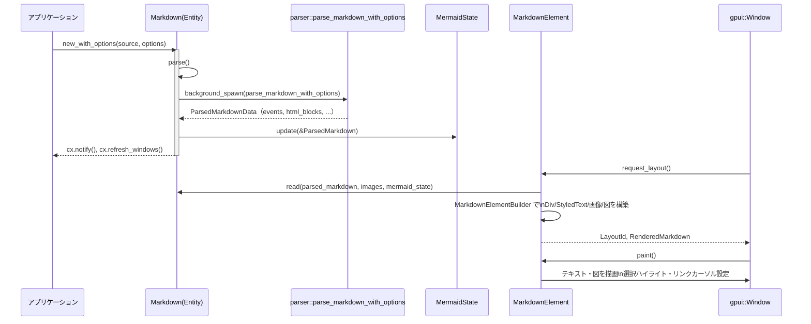

# crates/Markdown ディレクトリ

## 1. ざっくり一言

Zed の UI フレームワーク gpui 上で Markdown をパース・レンダリングするためのクレートです。  
Markdown テキストをパースして、HTML ブロック・コードブロック・Mermaid 図・リンクなどを解釈し、インタラクティブに表示・選択・コピーできるコンポーネントを提供します。

---

## 2. このモジュールの役割

### 2.1 概要

- このクレートは **Markdown 文字列を画面に表示するまでの一連の処理**（パース → HTML/テーブル/コードブロック解析 → UI 要素構築）を担います。
- Markdown のパース部分は `pulldown_cmark` ベースの独自 `MarkdownEvent` 列挙体に変換し、UI に最適化された形で保持します。
- UI 側には `Markdown`（モデル）と `MarkdownElement`（gpui の Element 実装）を提供し、シンタックスハイライト・リンククリック・テキスト選択・コピーなどのインタラクションを扱います。
- オプションで埋め込み HTML と Mermaid 図もパース・レンダリングします。

### 2.2 アーキテクチャ内での位置づけ

主なモジュール間・外部依存の関係を簡略化した図です。

```mermaid
graph TD
    subgraph markdown crate
        MD[Markdown 構造体]
        ME[MarkdownElement]
        PAR[parser モジュール]
        HTML[html モジュール<br/>(minifier/parser/rendering)]
        MER[mermaid モジュール]
        PATH[path_range モジュール]
    end

    ME --> MD
    MD --> PAR
    MD --> MER
    MD --> HTML
    PAR --> PATH

    PAR -->|"pulldown_cmark<br/>linkify"| ExtMD[Markdown ライブラリ]
    HTML -->|"html5ever<br/>rcdom"| ExtHTML[HTML ライブラリ]
    MER -->|"mermaid-rs-renderer<br/>gpui SVG renderer"| ExtMer[Mermaid 関連]
    ME --> GPUI[gpui/ui]
```

- `Markdown` はクレートの中核モデルで、`parser` / `html` / `mermaid` の結果をまとめた `ParsedMarkdown` を保持します。
- `MarkdownElement` は `Markdown` の内容を gpui の `Div` や `StyledText` に変換する描画用コンポーネントです。
- `parser` はテキストから `MarkdownEvent` の列を生成し、コードブロック・リンク・HTML ブロック・root ブロック境界などのメタ情報を付与します。
- `html` は埋め込み HTML ブロックを最小限の HTML レンダラーに変換します（`html_minifier` → `html_parser` → `html_rendering`）。
- `mermaid` は ` ```mermaid` コードブロックから Mermaid 図を抽出し、非同期で SVG レンダリングしてキャッシュします。
- `path_range` は `file.rs#L10-L20` のような path+行範囲をパースするユーティリティで、ソース位置付きコードブロックに使われています。

### 2.3 設計上のポイント

- **非同期パース**
  - `Markdown::parse` / `start_background_parse` で Markdown 全体をバックグラウンドでパースし、完了後に `cx.notify` / `cx.refresh_windows` で UI を更新します。
  - パース中でも前回の `ParsedMarkdown` を保持し、コンテンツが空にならないようにしています。

- **イベント指向の内部表現**
  - pulldown_cmark の `Event` を `MarkdownEvent`（静的ライフタイムの列挙体）に変換し、`Vec<(Range<usize>, MarkdownEvent)>` として保持します。
  - 文字範囲（ソースインデックス）をすべてのイベントに付与することで、選択や「コピー as Markdown」とのマッピングを保っています。

- **ソース位置 ↔ 描画テキストのマッピング**
  - `RenderedText` / `RenderedLine` / `SourceMapping` で、「描画文字インデックス」と「元 Markdown ソースインデックス」を相互変換可能な形で保存し、選択範囲・リンク検出・root block ハイライトなどで利用します。

- **HTML/テーブル/リストの統合**
  - Markdown テーブル（`| a | b |`）は `parser` が `MarkdownTag::Table` 系イベントとして扱い、
  - HTML テーブル（`<table>`）は `html` モジュールで別経路（`ParsedHtmlTable` → `render_html_table`）でレンダリングされます。
  - どちらも最終的には `MarkdownElementBuilder` によって gpui のグリッドレイアウトへ変換されます。

- **Mermaid 図のキャッシュ**
  - Mermaid コードブロックの内容+スケールをキーに `MermaidState::cache` にキャッシュし、編集時にできるだけ既存の描画を流用することでちらつきを抑えています。

- **最小限の公開 API**
  - 外部には主に `Markdown`, `MarkdownElement`, `MarkdownStyle`, `MarkdownOptions`, `parser::parse_links_only`, `PathWithRange` などを公開し、HTML パーサや minifier はクレート内限定です。

---

## 3. 主要な機能一覧

- Markdown テキストの非同期パースと再パース制御（`Markdown`）
- Markdown のスタイル設定（フォント、リンク色、コードブロック、ブロック引用など）（`MarkdownStyle`）
- gpui 上での Markdown コンテンツの描画・レイアウト・インタラクション（`MarkdownElement`）
- 埋め込み HTML ブロックのミニマイズとパース・レンダリング（`html` モジュール）
- Mermaid 図（```mermaid ...```）の抽出・SVG レンダリング・キャッシュ（`mermaid` モジュール）
- Markdown ソースと描画テキスト間のインデックス・位置マッピング、テキスト選択・コピー機能
- Markdown 内の URL のみを高速に検出する軽量パーサ（`parser::parse_links_only`）
- コードブロック info 文字列からファイルパスと行レンジを抽出するユーティリティ（`PathWithRange`）
- 生テキストを Markdown として安全に埋め込むためのエスケープ（`Markdown::escape`）

---

## 4. 関数・構造体の解説

### 4.1 公開型一覧

主に外部クレートから利用される型の一覧です。

| 名前 | 種別 | 所属 | 役割 / 用途 |
|------|------|------|-------------|
| `Markdown` | 構造体 | `markdown` | Markdown ソース文字列とそのパース結果・選択状態などを保持するモデル |
| `MarkdownStyle` | 構造体 | `markdown` | テキスト・リンク・コードブロック・表など Markdown 表示のスタイル一式 |
| `MarkdownFont` | 列挙体 | `markdown` | スタイル生成時に使用するフォントセット種別 (`Agent` / `Editor`) |
| `MarkdownOptions` | 構造体 | `markdown` | パース挙動のオプション（リンクのみ / HTML 解析 / Mermaid レンダリング） |
| `CopyButtonVisibility` | 列挙体 | `markdown` | コードブロックのコピー・ボタンの表示条件 |
| `CodeBlockRenderer` | 列挙体 | `markdown` | コードブロックのレンダリング方法（デフォルト or カスタム） |
| `ParsedMarkdown` | 構造体 | `markdown` | パース済み Markdown（イベント列・HTML ブロック・Mermaid 情報など） |
| `MarkdownElement` | 構造体 | `markdown` | gpui の `Element`。`Markdown` の内容を描画する UI コンポーネント |
| `RenderedText` | 構造体 | `markdown` | 描画済みテキストとソースインデックスとの対応情報 |
| `PathWithRange` | 構造体 | `path_range` | `file.rs#L10-L20` のようなパスと行・列範囲 |
| `LineCol` | 構造体 | `path_range` | 行番号と任意の列番号を表すユニット |
| `MarkdownEvent` | 列挙体 | `parser` | 静的ライフタイムの Markdown イベント（パース結果） |
| `MarkdownTag` | 列挙体 | `parser` | 見出し・リスト・コードブロックなどの構造情報 |
| `MarkdownTagEnd` | 列挙体型エイリアス | `parser` | pulldown_cmark の `TagEnd` 公開エイリアス |

HTML 関連（`ParsedHtmlBlock` など）は `pub(crate)` なので、外部からは直接使われず、`MarkdownElement` 内部でのみ利用されます。

---

### 4.2 代表的な関数・メソッド

#### 4.2.1 `Markdown::new` / `Markdown::new_with_options`

```rust
impl Markdown {
    pub fn new(
        source: SharedString,
        language_registry: Option<Arc<LanguageRegistry>>,
        fallback_code_block_language: Option<LanguageName>,
        cx: &mut Context<Self>,
    ) -> Self { /* 省略 */ }

    pub fn new_with_options(
        source: SharedString,
        language_registry: Option<Arc<LanguageRegistry>>,
        fallback_code_block_language: Option<LanguageName>,
        options: MarkdownOptions,
        cx: &mut Context<Self>,
    ) -> Self { /* 省略 */ }
}
```

**概要**

- `Markdown` モデルを初期化し、バックグラウンドで Markdown パースを開始します。
- `new` はデフォルトオプションを使い、`new_with_options` は `MarkdownOptions` を指定できます。

**主な引数**

| 引数名 | 型 | 説明 |
|--------|----|------|
| `source` | `SharedString` | 表示したい Markdown テキスト |
| `language_registry` | `Option<Arc<LanguageRegistry>>` | コードブロックのシンタックスハイライト用レジストリ |
| `fallback_code_block_language` | `Option<LanguageName>` | 言語指定がないコードブロックに適用するフォールバック言語名 |
| `options` | `MarkdownOptions` | パース挙動オプション（`new` では `Default` を使用） |
| `cx` | `&mut Context<Self>` | gpui のコンテキスト（エンティティ生成・タスク起動に使用） |

**戻り値**

- 初期状態の `Markdown` インスタンス。生成直後に `parse` が呼ばれ、非同期に `ParsedMarkdown` が構築されます。

**内部処理の流れ**

1. フィールドを初期化（`selection`, `parsed_markdown`, `images_by_source_offset`, `mermaid_state` など）。
2. `parse(cx)` を呼び出し、必要ならバックグラウンドパースを開始。
3. `start_background_parse` のタスク内で `parser::parse_markdown_with_options` 呼び出し。
4. パース結果から:
   - `events` / `root_block_starts` / `html_blocks` / `mermaid_diagrams` を構築。
   - `language_registry` からコードブロックの言語やファイルパス別言語を非同期ロード。
   - data URL 画像を base64 デコードし、`images_by_source_offset` に格納。
5. メインスレッド側で `parsed_markdown`・`images_by_source_offset`・`mermaid_state` を更新し、`cx.notify()` と `cx.refresh_windows()` を呼んで再描画を促します。

**Examples（使用例）**

最小限の `Markdown` エンティティ作成例です（UI 側は後述）。

```rust
use std::sync::Arc;
use gpui::Context;
use language::LanguageRegistry;
use markdown::{Markdown, MarkdownOptions};

fn create_markdown_entity(cx: &mut Context<Markdown>) -> Markdown {
    // 表示したい Markdown テキスト
    let source = "# Title\n\nSome *markdown* text.".to_string().into();

    // シンタックスハイライトに使うレジストリ（省略可）
    let language_registry = Some(Arc::new(LanguageRegistry::new(cx.background_executor().clone())));

    // デフォルトオプションで作成
    Markdown::new_with_options(
        source,                // ソース文字列
        language_registry,     // 言語レジストリ
        None,                  // フォールバック言語なし
        MarkdownOptions::default(), // HTML 解析などのオプション
        cx,
    )
}
```

**Edge cases（エッジケース）**

- `source` が空文字の場合
  - `parse` 内で特別扱いされ、`ParsedMarkdown` は空のまま、`html_blocks` / `mermaid_state` もクリアされます。
- すでにパース中 (`pending_parse` が `Some`) に `parse` が再度呼ばれた場合
  - `should_reparse = true` が立ち、現行のパース終了後に再度パースがキューされます。

**使用上の注意点**

- `Markdown` は gpui のエンティティとして `cx.new(|cx| ...)` の中で生成する前提です（テストコードや examples を参照）。
- `LanguageRegistry` を渡さない場合、コードブロックのハイライトは行われませんが、Markdown のレンダリング自体は動作します。
- `MarkdownOptions` の `parse_html` / `render_mermaid_diagrams` はパースコストに影響するため、必要な場合のみ有効化するのが無難です。

---

#### 4.2.2 `Markdown::escape(s: &str) -> Cow<'_, str>`

**概要**

- 任意の生テキストを Markdown として埋め込んでも、副作用的にコードブロックや箇条書きなどにならないようにエスケープします。
- 主に診断メッセージやログメッセージを Markdown として表示するときに使う想定の関数です。

**引数 / 戻り値**

- 引数 `s`: エスケープしたい UTF-8 文字列。
- 戻り値: エスケープ後の文字列。変更が不要な場合はコピーをせず元の借用（`Cow::Borrowed`）を返します。

**主なルール（`MarkdownEscaper`）**

- 行頭の空白:
  - 行頭のスペースやタブは **ノーブレークスペース (`\u{00A0}`)** に変換され、コードブロックや引用として解釈されるのを防ぎます。
- 改行:
  - `\n` は **2 つの改行** に変換され、Markdown の段落区切りとして扱われます。
- ASCII 記号:
  - バッククォート、パイプ `|`、波括弧 `{` などの ASCII 記号は `\|` のように **バックスラッシュでエスケープ** されます。
- 非 ASCII 文字:
  - 変更されません。

**Examples**

```rust
use markdown::Markdown;

fn main() {
    // 行頭にスペースがあると Markdown ではコードブロックになるため、そのまま出すと危険
    let diagnostic = "    | { a: string }";

    // Markdown::escape で安全に変換
    let escaped = Markdown::escape(diagnostic);

    // escaped は「ノーブレークスペース＋エスケープ済み '|' '{' '}'」の文字列になります
    println!("{escaped}");
}
```

**Edge cases**

- 空文字列: そのまま空文字列を返します。
- 1 行中の途中のタブ・スペース:
  - 行頭以外のスペース・タブは変換されず、そのまま残ります。
- すでにエスケープ済みの記号:
  - さらに `\` を前置するため、二重エスケープされることがあります（仕様上許容）。

**使用上の注意点**

- この関数は「Markdown を生成したくないときの保護用」なので、Markdown 記法を積極的に使いたい箇所には適しません。
- 出力は視覚的には似ていても、ノーブレークスペースを含むため、テキスト比較などに使う場合は注意が必要です。

---

#### 4.2.3 `parser::parse_markdown_with_options(text: &str, parse_html: bool) -> ParsedMarkdownData`

※ `pub(crate)` ですが、クレート内部の処理の核となるため解説します。

**概要**

- `pulldown_cmark` で Markdown をパースしつつ、`MarkdownEvent` 列挙体の列に変換します。
- root ブロックの開始位置（`root_block_starts`）、コードブロックの言語情報、HTML ブロックやテーブル、タスクリストなどを解釈して付加情報を構築します。

**主な挙動**

- `PARSE_OPTIONS` により、多くの拡張（テーブル・脚注・GFM・サブスク / スーパー スクリプトなど）を有効化。
- `ParseState::push_event` により:
  - 最上位のブロック開始に `RootStart` / 終了に `RootEnd` を挿入。
  - `MarkdownEvent::Rule`（水平線）は単独の root ブロックとして扱う。
- 自動リンク検出:
  - コードブロック外で、`linkify::LinkFinder` により URL を検出し、`LinkType::Autolink` な `MarkdownTag::Link` を挿入。
- コードブロック:
  - `CodeBlockKind::Indented` / `CodeBlockKind::FencedLang` / `CodeBlockKind::FencedSrc` に分類し、`CodeBlockMetadata` にコンテンツ範囲と行数を格納。
  - コードブロック内では **自動リンクを無効** にします（テスト `test_code_blocks_do_not_autolink_urls` 参照）。
- HTML ブロック:
  - `parse_html` が `true` のとき、`html::html_parser::parse_html_block` を呼び、成功したものを `html_blocks` に格納。
  - その HTML ブロック内の pulldown_cmark イベントはスキップし、`Start(HtmlBlock)` → `End(HtmlBlock)` だけを挿入。
- メタデータブロック:
  - `MetadataBlockKind`（`+++ ... +++`）は root ブロックには含めません（`within_metadata` フラグ）。

**Errors / Panics**

- 関数自体はエラー型を返さず、パースに失敗した HTML は `html_blocks` に登録しない（= Option を捨てる）だけです。
- pulldown_cmark 由来でパニックする状況はコードからは読み取れません（通常は安全と想定されます）。

**Edge cases**

- HTML コメント:
  - `test_html_comments` にあるように、HTML コメントブロックは `HtmlBlock` として扱われ、その後の `Returns` 行とは別の root ブロックになります。
- 自動リンクがフラグメントにまたがる場合:
  - `test_links_split_across_fragments` で検証されている通り、エスケープや HTML エンティティにより複数の Text イベントにまたがる URL を結合して検出します。

**使用上の注意点**

- 外部クレートから直接呼べない（`pub(crate)`）ため、通常は `Markdown` を通じて利用します。
- 自前でパーサを差し替える場合は、この関数の出力形式（`MarkdownEvent` 列挙体）に合わせる必要があります。

---

#### 4.2.4 `parser::parse_links_only(text: &str) -> Vec<(Range<usize>, MarkdownEvent)>`

**概要**

- Markdown 全体を解釈せず、プレーンテキスト中の URL だけを `Start(Link)` / `Text` / `End(Link)` イベントとして返す軽量パーサです。
- `MarkdownOptions { parse_links_only: true, .. }` で `Markdown` が内部的に使用します。

**引数 / 戻り値**

- 引数 `text`: 任意の文字列。
- 戻り値: ソース上の範囲と `MarkdownEvent` のペア列。
  - URL の前後に `MarkdownEvent::Text` を挟みつつ、`Start(Link)` / `End(Link)` を挿入します。

**内部処理の流れ**

1. `LinkFinder` で URL を列挙。
2. URL の前の領域があれば `Text` イベントを追加。
3. URL 区間について:
   - `Start(Link)`（`LinkType::Autolink`）を追加。
   - `Text` イベントを追加。
   - `End(Link)` を追加。
4. 最後の URL の後ろに残りテキストがあれば、`Text` イベントを追加。

**Examples**

```rust
use markdown::parser::{parse_links_only, MarkdownEvent, MarkdownTag};
use std::ops::Range;

fn main() {
    let text = "Visit https://example.com for details.";
    let events = parse_links_only(text);

    for (range, event) in events {
        match event {
            MarkdownEvent::Start(MarkdownTag::Link { dest_url, .. }) => {
                println!("link start: {dest_url} at {:?}", range); // URL 開始位置
            }
            MarkdownEvent::Text => {
                println!("text: {:?}", &text[range.clone()]);       // 対応するテキスト
            }
            MarkdownEvent::End(_) => {
                println!("link end at {:?}", range);                // URL 終了位置
            }
            _ => {}
        }
    }
}
```

**使用上の注意点**

- Markdown 記法（`[text](url)` など）は解釈せず、単に「見た目が URL のテキスト」を検出します。
- コードブロックや HTML などの文脈情報は一切扱わないため、「リンク検出だけしたい場合」に限定して用いるのが適切です。

---

#### 4.2.5 `html::html_parser::parse_html_block(source: &str, source_range: Range<usize>) -> Option<ParsedHtmlBlock>`

**概要**

- Markdown 内の HTML ブロック文字列を `html5ever` で DOM にパースし、`ParsedHtmlBlock`（見出し・段落・リスト・表・引用など）に変換します。
- 解析対象は `<p>`, `<h1>〜<h6>`, `<ul>/<ol>`, `<blockquotes>`, `<table>` およびその子要素です。

**引数 / 戻り値**

- `source`: HTML ソース文字列（`Range` に対応する部分文字列）。
- `source_range`: 元 Markdown ソース上の範囲（インデックス）。
- 戻り値: 成功時は `Some(ParsedHtmlBlock)`、DOM パースが失敗した場合は `None`。

**内部処理の流れ**

1. `cleanup_html(source)` で HTML を minify:
   - `html_minifier::Minifier` を使い、`omit_doctype: true, collapse_whitespace: true` で余分な空白を除去。
   - Minify に失敗した場合は元のバイト列を使用。
2. `html5ever::parse_document` で `RcDom` を構築。
3. ルートノード `dom.document` に対して `parse_html_node` を再帰的に適用。
4. ノード種別ごとに `ParsedHtmlElement` を構築:
   - `Text` → `Paragraph`（`HtmlParagraphChunk::Text`）として扱う。
   - `<p>`, `<h1>〜<h6>`, `<ul>/<ol>`, `<blockquote>`, `<table>` などをそれぞれ専用の構造体に変換。
   - `` は `HtmlImage` として alt, width/height, style 属性を解釈。

**Edge cases**

- HTML パースに失敗した場合:
  - `parse_document(...).read_from(&mut cursor).ok()?` により `None` を返します。その場合、その HTML ブロックは `html_blocks` に登録されません。
- テーブルの `colspan` / `rowspan`:
  - `parse_html_table` / `parse_table_row` / `parse_table_column` で解析され、スペイン数が 1 未満の場合は 1 に丸められます。
- `style` 属性:
  - `text-decoration`, `font-style`, `font-weight` などを `HtmlHighlightStyle` に変換し、太字・斜体・下線などに反映します。

**使用上の注意点**

- この関数は `MarkdownOptions::parse_html = true` のときにのみ `parser` から呼び出されます。
- 戻り値 `ParsedHtmlBlock` は外部には公開されておらず、`MarkdownElement` 内部でのみレンダリングに使われます。

---

#### 4.2.6 `mermaid::extract_mermaid_diagrams(source: &str, events: &[(Range<usize>, MarkdownEvent)])`

**概要**

- `MarkdownEvent` 列から、` ```mermaid` コードブロックを探し出し、Mermaid 図のコンテンツとスケール情報を抽出します。
- 結果は `BTreeMap<usize, ParsedMarkdownMermaidDiagram>` として返され、キーはソース開始インデックスです。

**主な挙動**

- イベント列を走査し、`MarkdownEvent::Start(MarkdownTag::CodeBlock { kind, metadata })` を探す。
- `CodeBlockKind::FencedLang(info)` で `info` が `"mermaid"` から始まない場合はスキップ。
- `parse_mermaid_info(info)` によりスケールをパース:
  - `"mermaid"` → `scale = 100`
  - `"mermaid 150"` → `scale = 150`（10〜500 にクランプ）
- `metadata.content_range` で示される本文から末尾の `\n` を除去した文字列を `contents` として格納。

**使用上の注意点**

- `MarkdownOptions::render_mermaid_diagrams = true` のときにだけ `Markdown::start_background_parse` 内で呼ばれます。
- Info 文字列に `/` を含む場合は `CodeBlockKind::FencedSrc` とみなされるため、Mermaid として扱われません。

---

#### 4.2.7 `MarkdownElement::request_layout` / `paint`

```rust
impl Element for MarkdownElement {
    type RequestLayoutState = RenderedMarkdown;
    type PrepaintState = Hitbox;

    fn request_layout(/* 省略 */) -> (LayoutId, RenderedMarkdown) { /* 省略 */ }
    fn prepaint(/* 省略 */) -> Hitbox { /* 省略 */ }
    fn paint(/* 省略 */) { /* 省略 */ }
}
```

**概要**

- `MarkdownElement` は gpui の `Element` として、レイアウト計算と描画・イベント処理を担当します。
- `request_layout` で `ParsedMarkdown` をもとに UI ツリーと `RenderedText` を構築し、`paint` で選択ハイライトやコピーハンドラ、マウスイベントを設定します。

**内部処理（request_layout の要点）**

1. `MarkdownElementBuilder` を初期化し、コンテナスタイル・ベーステキストスタイル・シンタックステーマを渡す。
2. `Markdown` エンティティから現在の `ParsedMarkdown`・画像・Mermaid 状態・オプションを読み出す。
3. `events` を順に走査し、`MarkdownEvent` 種別に応じて:
   - 段落/見出し/引用/リスト/テーブル/コードブロック/リンク/画像/HTML/ルールなどに対応する `Div` や `StyledText` を積み上げる。
   - コードブロックでは `language` 情報に応じてシンタックスハイライトを適用。
   - Mermaid 対応が有効で当該範囲が Mermaid 図なら、図を表す `AnyElement` を挿入。
   - HTML ブロックは `html_blocks` を `render_html_block` で描画。
4. `builder.build()` で最終的な `RenderedMarkdown`（`element: AnyElement`, `text: RenderedText`）を生成。
5. 子要素のレイアウトを計算し、自身の `LayoutId` を返す。

**内部処理（paint / mouse 処理の要点）**

- `paint_selection` で `RenderedText` と `selection` から矩形を計算し、選択背景色で塗りつぶす。
- `paint_mouse_listeners` で:
  - リンク上ではカーソルを `PointingHand` に、それ以外は `IBeam` に変更。
  - クリック・ドラッグにより `Selection` を更新。
  - クリック位置がリンク上ならクリック時に `on_url_click` または `cx.open_url` を呼ぶ。
- `on_action` ハンドラとして:
  - `markdown::Copy` アクション → 選択範囲の「表示テキスト」をクリップボードへコピー。
  - `markdown::CopyAsMarkdown` アクション → 選択範囲の「元 Markdown ソース」をコピー。

**Edge cases**

- コードブロック内の横スクロール:
  - `MarkdownStyle::code_block_overflow_x_scroll = true` のとき、コードブロック単位の `ScrollHandle` で水平スクロールを管理します。
- Linux / FreeBSD:
  - マウスアップ時に `selection.pending` が解除される際、選択文字列を `primary` クリップボードに書き込みます（X11 の選択仕様に合わせた挙動）。

**使用上の注意点**

- `MarkdownElement` は `Markdown` エンティティに依存するため、`Markdown` を `cx.new` で生成したあと、その `Entity<Markdown>` を渡して作成します。
- `style.prevent_mouse_interaction = true` の場合、リンククリック・選択などのマウス処理は無効化されます。

---

### 4.3 その他の主な関数（抜粋）

| 関数名 | 所属 | 役割（1 行） |
|--------|------|--------------|
| `html_minifier::Minifier::minify` | `html_minifier` | HTML をパースして不要な空白やタグを省き、最小化された HTML を生成する |
| `html_rendering::render_html_block`（`MarkdownElement` メソッド） | `html_rendering` | `ParsedHtmlBlock` を Markdown と同じスタイルの UI 要素に変換する |
| `MermaidState::update` | `mermaid` | 新しい `ParsedMarkdown` に対応する Mermaid 図キャッシュを更新し、不要なエントリを削除する |
| `PathWithRange::new` | `path_range` | コードブロック info 文字列からファイルパスと行範囲 `Range<LineCol>` をパースする |
| `RenderedText::surrounding_word_range` | `markdown` | ダブルクリックなどの位置に対して、適切な「単語」のソース範囲を推定する |
| `RenderedText::text_for_range` | `markdown` | 指定したソース範囲に相当する描画テキストを取り出す（smart quotes・HTML エンティティ適用後） |

---

## 5. データフロー

Markdown テキストが UI に表示されるまでの代表的な処理の流れです。

### 5.1 処理の要約

1. アプリケーションが `Markdown` エンティティを作成し、`MarkdownElement` を UI ツリーに追加します。
2. `Markdown` はバックグラウンドで `parser::parse_markdown_with_options` を呼び出し、`ParsedMarkdown` を構築します。
3. 必要なら `mermaid::extract_mermaid_diagrams` と `MermaidState::update` で Mermaid 図を準備します。
4. gpui がレイアウトを要求すると、`MarkdownElement::request_layout` が `ParsedMarkdown` をもとに UI ツリーと `RenderedText` を構築します。
5. 描画フェーズで `MarkdownElement::paint` が呼ばれ、テキスト・図・テーブル・選択ハイライトなどが描画されます。

### 5.2 シーケンス図



---

## 6. 使い方（How to Use）

### 6.1 基本的な使用方法

gpui アプリケーション内で `Markdown` をウィンドウに表示する最小構成の例です。

```rust
use std::sync::Arc;
use assets::Assets;
use gpui::{Entity, WindowOptions, px};
use gpui::prelude::*;
use language::LanguageRegistry;
use markdown::{Markdown, MarkdownElement, MarkdownOptions, MarkdownStyle};
use ui::prelude::*;
use ui::{App, Window, div};

fn main() {
    env_logger::init();                                  // ロガー初期化

    gpui_platform::application()
        .with_assets(Assets)                             // フォントなどのアセット
        .run(|cx| {
            // 設定・テーマなど（Zed の他クレートに依存）
            settings::SettingsStore::init(cx);           // 必要に応じて初期化
            theme_settings::init(theme::LoadThemes::JustBase, cx);

            let language_registry =
                Arc::new(LanguageRegistry::new(cx.background_executor().clone()));

            // フォント読み込み
            Assets.load_fonts(cx).unwrap();

            cx.activate(true);                           // アプリケーションをアクティブ化

            cx.open_window(WindowOptions::default(), move |_, cx| {
                cx.new(|cx| {
                    // 表示したい Markdown テキスト
                    let text: SharedString = "# Hello\n\nThis is **Markdown**.".into();

                    // Markdown モデルの作成
                    let markdown = cx.new(|cx| {
                        Markdown::new_with_options(
                            text,
                            Some(language_registry.clone()), // シンタックスハイライト用
                            None,                             // フォールバック言語なし
                            MarkdownOptions::default(),       // HTML/Mermaid 無効
                            cx,
                        )
                    });

                    // スタイル（必要なら MarkdownStyle::themed などを利用）
                    let style = MarkdownStyle::default();

                    // ウィンドウに表示するルート要素
                    MarkdownExample { markdown, style }
                })
            })
            .unwrap();
        });
}

// ルートビュー構造体
struct MarkdownExample {
    markdown: Entity<Markdown>,                          // Markdown のエンティティ
    style: MarkdownStyle,                                // 表示スタイル
}

impl Render for MarkdownExample {
    fn render(&mut self, _window: &mut Window, _cx: &mut Context<Self>) -> impl IntoElement {
        div()
            .p(px(16.0))                                // パディング
            .child(
                MarkdownElement::new(self.markdown.clone(), self.style.clone())
            )
    }
}
```

### 6.2 よくある使用パターン

#### 6.2.1 MarkdownElement を既存レイアウトの子として使う

`examples/markdown_as_child.rs` のように、既存の UI コンポーネントの中に Markdown を埋め込むパターンです。

```rust
use gpui::{Entity, Length, px};
use markdown::{Markdown, MarkdownElement, MarkdownStyle};
use ui::prelude::*;
use ui::{div, Window};

struct Panel {
    markdown: Entity<Markdown>,                        // 子として表示する Markdown
}

impl Render for Panel {
    fn render(&mut self, _window: &mut Window, cx: &mut Context<Self>) -> impl IntoElement {
        let style = MarkdownStyle::default();

        div()
            .flex()                                    // 親はフレックスボックス
            .size(Length::Definite(px(400.0).into())) // 固定サイズのパネル
            .child(
                div()
                    .p_4()
                    .child(MarkdownElement::new(self.markdown.clone(), style))
            )
    }
}
```

#### 6.2.2 Mermaid 図と HTML パースを有効にする

```rust
use markdown::{Markdown, MarkdownElement, MarkdownOptions, MarkdownStyle};

fn markdown_with_mermaid_and_html(cx: &mut gpui::Context<Markdown>) -> MarkdownElement {
    let markdown = cx.new(|cx| {
        Markdown::new_with_options(
            "
<h1>Hello</h1>


".into(),
            None,
            None,
            MarkdownOptions {
                parse_html: true,                    // HTML ブロックを解析
                render_mermaid_diagrams: true,       // Mermaid 図を描画
                ..Default::default()
            },
            cx,
        )
    });
    MarkdownElement::new(Markdown, MarkdownStyle::default())
}

```

### 6.3 使用上の注意点（まとめ）

- **テーマ・設定の初期化**
  - テストコードや examples のように、`settings::init` / `theme_settings::init` を事前に呼び、`cx.theme()` や `ThemeSettings` に依存するスタイルが使える状態にしておく必要があります。

- **HTML パース**
  - `MarkdownOptions::parse_html` を有効にしないと、`<table>` や `` などの HTML ブロックは単なるテキストとして扱われます。
  - HTML パースに失敗したブロックは `html_blocks` に登録されず、Markdown イベント列側の HTML テキストだけが残ります。

- **Mermaid 図**
  - `render_mermaid_diagrams = true` のときにのみ `mermaid-rs-renderer` で SVG レンダリングを行います。
  - レンダリングは非同期で行われるため、最初は「Rendering mermaid diagram...」といったプレースホルダが表示される場合があります。

- **パフォーマンス**
  - パースはバックグラウンドで行われますが、非常に長い Markdown や大量の code block/HTML block を含む文書では再パースが頻発しないよう、`append` / `replace` の呼び出し頻度に注意する必要があります。
  - `parse_links_only` を使う `Markdown::new_text` は、リンク検出だけ行いたい軽量な用途向けです。

- **選択・コピー**
  - `Copy` は「画面に表示されているテキスト」、`CopyAsMarkdown` は「元 Markdown ソース」をコピーします。
  - smart quotes や HTML エンティティを含むテキストでは、表示テキストとソーステキストが異なる点に注意が必要です。

---

## 7. 関連ファイル

このディレクトリ内の主なファイルと役割です。

| パス | 役割 / 関係 |
|------|------------|
| `markdown/Cargo.toml` | クレート定義。ライブラリエントリを `src/markdown.rs` に設定し、`pulldown_cmark`, `html5ever`, `mermaid-rs-renderer`, `gpui` などの依存を宣言。 |
| `markdown/src/markdown.rs` | クレートのメインファイル。`Markdown`, `MarkdownStyle`, `MarkdownElement`, `ParsedMarkdown` など公開 API の大部分を定義。 |
| `markdown/src/parser.rs` | Markdown テキスト → `MarkdownEvent` 列への変換ロジック。HTML ブロック・コードブロック・root ブロック・自動リンク検出などを実装。 |
| `markdown/src/html.rs` | HTML 関連サブモジュールのエントリ。`html_minifier`, `html_parser`, `html_rendering` を束ねる。 |
| `markdown/src/html/html_minifier.rs` | `html5ever` ベースの HTML 最小化ロジック。空白の圧縮やタグ省略などを実装。 |
| `markdown/src/html/html_parser.rs` | HTML ブロックを `ParsedHtmlBlock` / `ParsedHtmlElement`（見出し・リスト・表など）に変換するロジック。 |
| `markdown/src/html/html_rendering.rs` | `ParsedHtmlBlock` を `MarkdownElement` のスタイルに従って gpui の UI ツリーに変換する処理。 |
| `markdown/src/mermaid.rs` | `mermaid` コードブロックの抽出 (`extract_mermaid_diagrams`) と SVG レンダリング・キャッシュ (`MermaidState`)・描画 (`render_mermaid_diagram`) を提供。 |
| `markdown/src/path_range.rs` | `PathWithRange` / `LineCol` 型と、そのパースロジック。コードブロック info 文字列からファイルパスと行範囲を抽出するユーティリティ。 |
| `markdown/examples/markdown.rs` | ウィンドウ全体を Markdown 表示にするサンプル。画像データ URL・コードブロック・リンクなどを含むリッチな例。 |
| `markdown/examples/markdown_as_child.rs` | 既存のレイアウト内に Markdown を子要素として埋め込むサンプル。スタイルのカスタマイズ例も含む。 |

この構成により、Markdown テキストの解析・装飾・描画・インタラクションが一貫した形で実現されています。
