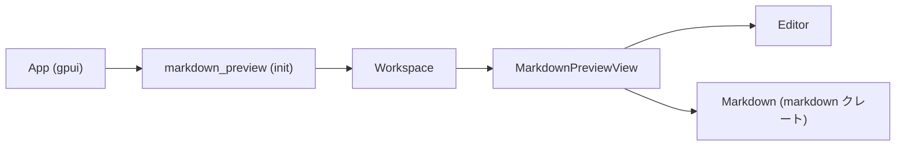
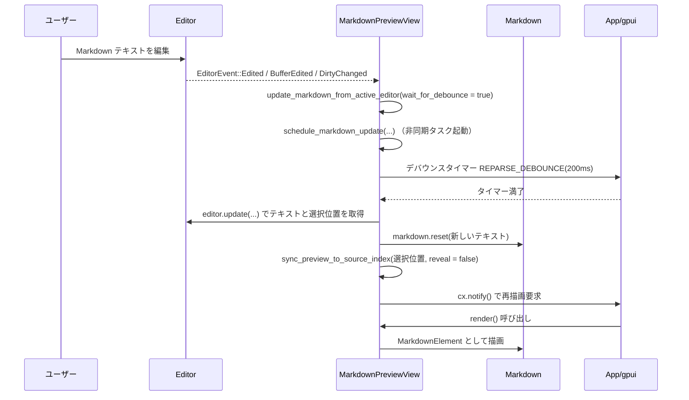

# Markdown_preview ディレクトリ解説

## 1. ざっくり一言

`markdown_preview` クレートは、エディタ内で開いている Markdown ファイルの内容を別タブとしてレンダリングし、スクロール・カーソル位置・チェックボックスなどをエディタと連動させる「Markdown プレビュー」を提供するモジュール群です。

---

## 2. このモジュールの役割

### 2.1 概要

- このディレクトリは **Markdown ファイルのプレビュー表示** を行うための UI コンポーネントを提供します。
- エディタの内容を非同期に Markdown に変換し、プレビュー側のスクロールやクリック操作と、元のエディタのカーソル・内容を同期します。
- 「プレビュータブの表示」「右側にプレビューを開く」「現在のエディタを追従するプレビュー」など、複数の表示モードを持ちます。

### 2.2 アーキテクチャ内での位置づけ

このクレート内と周辺コンポーネントの関係を簡略化して示します。



- `markdown_preview::init`  
  - `App` から呼ばれ、`Workspace` に対してプレビュー関連のアクションハンドラを登録します。
- `MarkdownPreviewView`  
  - `Workspace` のアイテムとしてタブにぶら下がる UI コンポーネントです。
  - 内部で `Editor` と `Markdown` ウィジェット (`markdown` クレート) を橋渡しします。

### 2.3 設計上のポイント

コードから読み取れる特徴を列挙します。

- **アクション駆動**
  - `OpenPreview` / `OpenPreviewToTheSide` / `OpenFollowingPreview` などのアクション型を通じてプレビューを開きます。
  - スクロール系アクション（`ScrollUp` など）もすべてアクションとして定義され、キーバインドから呼び出し可能です。

- **状態の分離**
  - `MarkdownPreviewView` は
    - `active_editor`: 現在プレビュー対象となる `Editor`
    - `markdown`: レンダリング用 `Markdown` エンティティ
    - `scroll_handle`: スクロール状態
    - `base_directory`: プレビュー対象ファイルのディレクトリ
    を保持します。
  - `Workspace` とは `WeakEntity<Workspace>` で疎結合に接続されています。

- **非同期更新とデバウンス**
  - エディタの編集イベントを受けると、`REPARSE_DEBOUNCE (200ms)` を使って再パースをデバウンスします。
  - `pending_update_task` に現在進行中の更新タスクを保持し、過剰な再パースを抑制します。

- **双方向同期**
  - エディタ側で選択範囲が変わるとプレビューのスクロール位置・アクティブな Markdown ブロックを更新します。
  - プレビュー側でソース位置をダブルクリックすると、エディタのカーソル位置を移動させます。
  - チェックボックスをクリックすると `"[ ]"` / `"[x]"` を直接 Markdown ソースに書き込みます。

- **パス・画像解決**
  - 相対パス・URL エンコードされたパス・HTTP URL を扱うためのユーティリティ関数を提供し、リンクや画像を適切に解決します。

---

## 3. 主要な機能一覧

このディレクトリが提供する主な機能を箇条書きで整理します。

- プレビュータブの生成
  - `OpenPreview`: 現在の Markdown エディタのプレビューを同じペインに開く
  - `OpenPreviewToTheSide`: 右側ペインにプレビューを開く（必要ならペインを分割）
  - `OpenFollowingPreview`: アクティブなエディタに追従する「フォロー」プレビューモードを開く

- エディタとプレビューの同期
  - エディタの編集イベントを検知して Markdown を再パース
  - カーソル位置（ソースインデックス）に対応するプレビュー位置へ自動スクロール（オプションで reveal）
  - アクティブなルートブロック（見出しなど）のハイライト更新

- プレビュー側の操作とアクション
  - ページ単位・行単位・要素単位のスクロール (`ScrollPageUp/Down`, `ScrollUp/Down`, `ScrollUp/DownByItem`)
  - プレビューの先頭／末尾へジャンプ (`ScrollToTop`, `ScrollToBottom`)
  - プレビュー内リンクをクリックしてローカルファイルを開く or 外部ブラウザで開く
  - ソース位置のダブルクリックでエディタのカーソル移動
  - Markdown のタスクリストチェックボックス操作とソース書き換え

- リンク／画像パス解決
  - `resolve_preview_path`: Markdown 内リンクから実際のファイルパスへ解決（相対パス・絶対パス・URL エンコード対応）
  - `resolve_preview_image`: Markdown 内画像への URL／パスから `ImageSource` を生成（HTTP/HTTPS, workspace ルート, base ディレクトリ）

- レンダリング設定
  - HTML を含む Markdown のパース (`parse_html: true`)
  - Mermaid 図のレンダリング (`render_mermaid_diagrams: true`)
  - コードブロックにコピー用ボタンを表示（ホバー時）

---

## 4. 関数・構造体の解説

### 4.1 型一覧（構造体・列挙体など）

| 名前 | 種別 | 役割 / 用途 |
|------|------|-------------|
| `MarkdownPreviewView` | 構造体 | Markdown プレビュータブ本体。エディタと Markdown ウィジェットを仲立ちし、スクロール・同期・リンク解決などを行います。 |
| `MarkdownPreviewMode` | 列挙体 | プレビューモードの種別。`Default`（固定）と `Follow`（アクティブエディタ追従）を表します。 |
| `EditorState` | 構造体（非公開） | 現在プレビュー対象になっている `Editor` と、そのイベント購読 (`Subscription`) をまとめた内部状態です。 |
| `OpenPreview`, `OpenPreviewToTheSide` | アクション型（他クレートから再公開） | プレビュータブを開くためのアクションです。 |
| `OpenFollowingPreview` | アクション型 | フォローモードプレビューを開くためのアクションです。 |
| `ScrollPageUp`, `ScrollPageDown`, `ScrollUp`, `ScrollDown`, `ScrollUpByItem`, `ScrollDownByItem`, `ScrollToTop`, `ScrollToBottom` | アクション型 | プレビューのスクロールを制御するためのアクションです。 |

### 4.2 主要関数の詳細

以下では、特に重要な関数を 7 件まで選んで詳しく説明します。

#### `init(cx: &mut App)`

**概要**

- アプリケーション起動時に呼び出され、`Workspace` が生成されたタイミングで `MarkdownPreviewView` のアクション登録を行います。

**引数**

| 引数名 | 型 | 説明 |
|--------|----|------|
| `cx` | `&mut App` | アプリケーション全体のコンテキスト。新しい `Workspace` の観測などを行います。 |

**戻り値**

- 戻り値はありません。`observe_new` のサブスクリプションは `detach()` され、アプリケーションライフタイムに渡って有効になります。

**内部処理の流れ**

1. `cx.observe_new` にクロージャを渡し、新規 `Workspace` が作られるたびに呼ばれるよう登録します。
2. クロージャ内で `window` が `Some` の場合のみ、
   `MarkdownPreviewView::register(workspace, window, cx)` を呼び出します。
3. `observe_new` から返るサブスクリプションを `.detach()` し、明示的に保持せずに動作させます。

**Examples（使用例）**

アプリケーションまたはプラグインの初期化コード内での利用例です。

```rust
use gpui::App;                             // App コンテキスト型
use markdown_preview::init;               // このクレートの初期化関数

pub fn init_markdown_preview(cx: &mut App) {
    // 他のコンポーネントの初期化に加えて、Markdown プレビューも登録する
    init(cx);
}
```

**Errors / Panics**

- この関数内で明示的な `Result` や `panic!` は使用されていません。
- `window` が `None` の場合は何もせずに帰ります。

**Edge cases（エッジケース）**

- `Workspace` は作成されるが `Window` がない（`window == None`）場合、プレビューは登録されません。

**使用上の注意点**

- アプリケーション起動時に一度呼び出す前提で設計されています。複数回呼び出すと、`observe_new` が複数登録される可能性があります。

---

#### `MarkdownPreviewView::register(workspace: &mut Workspace, window: &mut Window, cx: &mut Context<Workspace>)`

**概要**

- `Workspace` に対して、プレビューを開くアクション (`OpenPreview` など) のハンドラを登録します。
- これにより、ユーザー操作（キーバインド・メニューなど）からプレビューが開けるようになります。

**引数**

| 引数名 | 型 | 説明 |
|--------|----|------|
| `workspace` | `&mut Workspace` | アクションを登録する対象のワークスペースです。 |
| `window` | `&mut Window` | 関連付けられたウィンドウです。ペインの分割やフォーカスに利用されます。 |
| `cx` | `&mut Context<Workspace>` | `Workspace` 用の UI コンテキストです。 |

**戻り値**

- 戻り値はありません。アクションハンドラは `Workspace` に登録されます。

**内部処理の流れ**

1. `OpenPreview` アクションのハンドラ登録
   - アクティブアイテムが Markdown エディタであれば `create_markdown_view` でビューを作成。
   - 同じエディタに対する既存のプレビューがあればそれをアクティブ化、なければ現在のペインに新規タブとして追加。
2. `OpenPreviewToTheSide` アクションのハンドラ登録
   - 右側にペインがあればそこに、なければ現在のペインを右方向に分割して新しいペインを作成。
   - 既存プレビューがあれば再利用、なければ新規タブとして追加。
3. `OpenFollowingPreview` アクションのハンドラ登録
   - アクティブペイン内にすでに `Follow` モードのプレビューがあれば、それをアクティブ化。
   - なければ `MarkdownPreviewMode::Follow` で新規ビューを作成して追加。
4. 各アクション処理の最後で `cx.notify()` を呼び出し、UI 更新をトリガー。

**Examples（使用例）**

この関数自体は内部利用専用ですが、`init` から呼び出される構造を示します。

```rust
use gpui::{App, Context, Window};
use workspace::Workspace;
use markdown_preview::markdown_preview_view::MarkdownPreviewView;

// init の中身とほぼ同じ構造の例
fn setup_markdown_preview(cx: &mut App) {
    cx.observe_new(|workspace: &mut Workspace, window, cx| {
        if let Some(window) = window {
            MarkdownPreviewView::register(workspace, window, cx);
        }
    })
    .detach();
}
```

**Errors / Panics**

- 本関数内では明示的なエラー処理や panic は行っていません。

**Edge cases**

- アクティブアイテムが Markdown 以外のファイルの場合、いずれのアクションも何も行いません（プレビューは開かれません）。
- `Follow` モードのプレビューはアクティブペインごとに 1 つだけを想定しており、既存のものがあるときは新規作成せずに再利用します。

**使用上の注意点**

- `Workspace` 内のアクション登録のための関数であり、通常は直接呼び出す必要はなく、`init` 経由で利用されます。

---

#### `MarkdownPreviewView::new(...) -> Entity<Self>`

**概要**

- 新しい `MarkdownPreviewView` インスタンスを作成し、エディタとの紐付けや Markdown エンティティの初期化、ワークスペース更新の購読（フォローモード時）を行います。

**引数**

| 引数名 | 型 | 説明 |
|--------|----|------|
| `mode` | `MarkdownPreviewMode` | `Default`（固定プレビュー）か `Follow`（アクティブエディタ追従）かを指定します。 |
| `active_editor` | `Entity<Editor>` | 初期表示対象となるエディタです。 |
| `workspace` | `WeakEntity<Workspace>` | ワークスペースへの弱い参照です。リンククリックなどでファイルを開く際に利用します。 |
| `language_registry` | `Arc<LanguageRegistry>` | Markdown 内のコードブロックなどのハイライト用に使用される言語レジストリです。 |
| `window` | `&mut Window` | このビューが所属するウィンドウです。 |
| `cx` | `&mut Context<Workspace>` | `Workspace` に紐付いたコンテキストです。 |

**戻り値**

- `Entity<MarkdownPreviewView>`  
  - UI ツリーに登録された `MarkdownPreviewView` エンティティです。

**内部処理の流れ**

1. `Markdown` エンティティを作成
   - 空の `SharedString` を渡し、`parse_html: true`, `render_mermaid_diagrams: true` を有効にして `Markdown::new_with_options` を呼び出します。
2. `MarkdownPreviewView` 構造体の初期化
   - `active_editor` は一旦 `None`。
   - `focus_handle`、`scroll_handle`、`image_cache` などのフィールドを初期化。
   - `markdown` に対して `cx.observe` を設定し、Markdown 側の更新時に `sync_active_root_block` を呼び出すよう登録。
3. `this.set_editor(active_editor, window, cx)` を呼び出し、実際のエディタとの紐付けと初回のプレビュー更新を行います。
4. `mode` が `Follow` の場合
   - `workspace.upgrade()` に成功すれば、その `Workspace` に対して `cx.observe_in` を設定し、アクティブアイテムが変わるたびに `workspace_updated` が呼ばれるようにします。
   - `workspace` が取得できなければ、ログにエラーを出力して終了します。
5. `this` を返し、エンティティの構築を完了します。

**Examples（使用例）**

実際のコードでは `create_markdown_view` などのヘルパー経由で呼ばれます。

```rust
use std::sync::Arc;
use gpui::{Context, Window};
use language::LanguageRegistry;
use workspace::Workspace;
use editor::Editor;
use markdown_preview::markdown_preview_view::{MarkdownPreviewView, MarkdownPreviewMode};

fn open_preview_for_editor(
    workspace: &mut Workspace,
    editor: gpui::Entity<Editor>,
    window: &mut Window,
    cx: &mut Context<Workspace>,
) {
    let language_registry = workspace.project().read(cx).languages().clone();
    let workspace_handle = workspace.weak_handle();

    let _view = MarkdownPreviewView::new(
        MarkdownPreviewMode::Default, // 固定モード
        editor,
        workspace_handle,
        language_registry,
        window,
        cx,
    );
}
```

**Errors / Panics**

- `workspace.upgrade()` に失敗した場合、エラーをログ出力するだけで panic にはなりません。
- `cx.new` / `cx.observe` / `cx.observe_in` が内部で panic する可能性については、このコードからは判断できません。

**Edge cases**

- フォローモードで `Workspace` が解放済みの場合、アクティブアイテムの追従は行われず、ログに「Failed to listen to workspace updates」が出力されます。

**使用上の注意点**

- 通常は `MarkdownPreviewView::new` を直接呼ぶのではなく、`register` 内のロジック（アクション経由）で生成されます。

---

#### `MarkdownPreviewView::resolve_active_item_as_markdown_editor(workspace: &Workspace, cx: &mut Context<Workspace>) -> Option<Entity<Editor>>`

**概要**

- `Workspace` のアクティブアイテムが「Markdown ファイルを開いている `Editor`」であるかどうかを判定し、そうであればその `Editor` を返します。

**引数**

| 引数名 | 型 | 説明 |
|--------|----|------|
| `workspace` | `&Workspace` | 現在のワークスペースです。 |
| `cx` | `&mut Context<Workspace>` | アクティブアイテム取得に用いるコンテキストです。 |

**戻り値**

- `Some(Entity<Editor>)`: アクティブアイテムが Markdown エディタだった場合。
- `None`: アクティブアイテムが存在しない、または Markdown エディタではない場合。

**内部処理の流れ**

1. `workspace.active_item(cx)` でアクティブアイテムを取得。
2. それを `item.act_as::<Editor>(cx)` によって `Editor` として扱えるか確認。
3. `Self::is_markdown_file(&editor, cx)` を用いて、言語名が `"Markdown"` であるかを判定。
4. 条件を満たす場合は `Some(editor)` を返し、そうでなければ `None` を返します。

**Examples（使用例）**

```rust
use gpui::Context;
use workspace::Workspace;
use editor::Editor;
use markdown_preview::markdown_preview_view::MarkdownPreviewView;

fn active_markdown_editor(
    workspace: &Workspace,
    cx: &mut Context<Workspace>,
) -> Option<gpui::Entity<Editor>> {
    MarkdownPreviewView::resolve_active_item_as_markdown_editor(workspace, cx)
}
```

**Errors / Panics**

- 本関数内で明示的なエラー処理や panic は行っていません。

**Edge cases**

- `Editor` が複数バッファを扱うモード（`as_singleton()` が `None`）の場合は Markdown と見なされません。
- 言語名が `"Markdown"` 以外（`"MD"` など）の場合も Markdown とは認識されません。

**使用上の注意点**

- 言語判定は文字列 `"Markdown"` に依存しているため、言語名のカスタマイズが行われている環境では期待通り動作しない可能性があります。

---

#### `MarkdownPreviewView::update_markdown_from_active_editor(&mut self, wait_for_debounce: bool, should_reveal: bool, window: &mut Window, cx: &mut Context<Self>)`

**概要**

- 現在の `active_editor` の内容をもとに Markdown プレビューの更新をスケジュールします。
- `wait_for_debounce` により「編集の落ち着きを待ってから再パースする」かどうかを制御します。

**引数**

| 引数名 | 型 | 説明 |
|--------|----|------|
| `wait_for_debounce` | `bool` | `true` の場合、`REPARSE_DEBOUNCE` (200ms) 待機後に更新します。 |
| `should_reveal` | `bool` | 更新後にカーソル位置にスクロールするかどうかのフラグです。 |
| `window` | `&mut Window` | 非同期タスク起動に利用するウィンドウです。 |
| `cx` | `&mut Context<Self>` | `MarkdownPreviewView` のコンテキストです。 |

**戻り値**

- 戻り値はありません。内部で `pending_update_task` に `Task<Result<()>>` を格納します。

**内部処理の流れ**

1. `active_editor` が存在するかを確認。なければ何もせず終了。
2. `wait_for_debounce == true` かつ `pending_update_task.is_some()` の場合
   - すでにデバウンス付きの更新がスケジュール済みなので、そのままリターンして新しいタスクを追加しません。
3. `schedule_markdown_update` を呼び出し、結果の `Task` を `pending_update_task` に格納します。

※ 実際の再パース処理は `schedule_markdown_update` 内で行われます。

**Examples（使用例）**

この関数は内部からのみ呼び出されます。代表的な呼び出し元は以下です。

- 編集イベント (`EditorEvent::Edited` など)  
  → `wait_for_debounce = true`, `should_reveal = false`
- エディタの切り替え直後 (`set_editor` の末尾)  
  → `wait_for_debounce = false`, `should_reveal = true`

**Errors / Panics**

- 明示的なエラー処理はなく、`schedule_markdown_update` からの `Task` の結果も特に参照していません。

**Edge cases**

- 高頻度で編集イベントが発生しても、デバウンス付きの更新は常に 1 つまでしかスケジュールされません。
- デバウンスを待っている間に `active_editor` が変更された場合、`schedule_markdown_update` 内のガードによって古いエディタの内容では更新されません。

**使用上の注意点**

- 高コストな Markdown パースを抑えるためのデバウンス処理が組み込まれているため、リアルタイム性と負荷のトレードオフがあります。

---

#### `resolve_preview_path(url: &str, base_directory: Option<&Path>) -> Option<PathBuf>`

**概要**

- Markdown 内のリンク文字列から、プレビューで開くべきローカルファイルの絶対パスを解決します。
- HTTP/HTTPS の URL は対象外として扱います。

**引数**

| 引数名 | 型 | 説明 |
|--------|----|------|
| `url` | `&str` | Markdown 内のリンク文字列（例: `"notes.md"`, `"release%20notes.md"`） |
| `base_directory` | `Option<&Path>` | 相対パスの基準となるディレクトリ。通常はプレビュー対象ファイルのディレクトリです。 |

**戻り値**

- `Some(PathBuf)`: 解決に成功し、実際に存在するファイルだった場合。
- `None`: HTTP/HTTPS URL である、`base_directory` が `None`、もしくは解決後にファイルが存在しない場合。

**内部処理の流れ**

1. `url` が `"http://"` または `"https://"` で始まる場合は `None` を返して終了。
2. `urlencoding::decode(url)` で URL デコードを試み、失敗した場合は元の文字列を使います。
3. デコード結果から `candidate: PathBuf` を作成。
   - `candidate.is_absolute()` かつ `candidate.exists()` の場合は `Some(candidate)` を返す。
4. `base_directory` が `None` なら `None`。
5. `base_directory.join(decoded_url)` で相対パスを解決し、そのパスが `exists()` する場合は `Some(resolved)`、しない場合は `None`。

**Examples（使用例）**

テストコードと同様の使い方です。

```rust
use std::path::Path;
use markdown_preview::markdown_preview_view::resolve_preview_path;

fn resolve_notes(base: &Path) {
    // "notes.md" が base ディレクトリに存在すれば Some、なければ None
    let path = resolve_preview_path("notes.md", Some(base));

    // URL エンコードされたファイル名にも対応
    let path2 = resolve_preview_path("release%20notes.md", Some(base));

    // HTTP URL は常に None
    let no_path = resolve_preview_path("https://example.com", None);

    println!("{path:?} {path2:?} {no_path:?}");
}
```

**Errors / Panics**

- `urlencoding::decode` のエラーは握りつぶし、元の文字列を使うため panic にはなりません。
- ファイルの存在チェックには標準ライブラリの `exists()` が用いられています。

**Edge cases**

- `base_directory` が `None` のとき、相対パスは解決されず `None` になります。
- 絶対パスであっても、ファイルが存在しない場合は `None` を返します。

**使用上の注意点**

- 存在チェックを行うため、ファイル数が多い環境で大量に呼び出すと I/O コストが増加します。
- HTTP/HTTPS URL は必ず `None` になる設計です（ブラウザで開くなどの処理は別経路で行われます）。

---

#### `resolve_preview_image(dest_url: &str, base_directory: Option<&Path>, workspace_directory: Option<&Path>) -> Option<ImageSource>`

**概要**

- Markdown 内の画像 URL から、実際に描画するための `ImageSource` を生成します。
- HTTP/HTTPS URL、ワークスペースルートからの絶対パス、プレビュー対象ファイルからの相対パスなどに対応します。

**引数**

| 引数名 | 型 | 説明 |
|--------|----|------|
| `dest_url` | `&str` | 画像の URL 文字列（例: `"./image.png"`, `"/root.png"`, `"https://example.com/img.png"`） |
| `base_directory` | `Option<&Path>` | 相対パスの基準となるディレクトリ。通常はプレビュー対象 Markdown ファイルのディレクトリです。 |
| `workspace_directory` | `Option<&Path>` | ワークスペースのルートディレクトリ。`/path.png` のようなパス解決に使用します。 |

**戻り値**

- `Some(ImageSource)`: 適切な `ImageSource::Resource` が生成できた場合。
- `None`: Data URL（`"data:"` で始まる）や、`base_directory` がなく相対パスを解決できない場合など。

**内部処理の流れ**

1. `dest_url` が `"data:"` で始まる場合は `None` を返す（ここでは扱わない）。
2. `dest_url` が `"http://"` または `"https://"` で始まる場合は
   - `ImageSource::Resource(Resource::Uri(SharedUri::from(dest_url.to_string())))` を返す。
3. `urlencoding::decode` でデコードし、`decoded: String` を得る（失敗時は元の文字列）。
4. `decoded` が `"/..."` で始まる場合（`strip_prefix("/")` に成功）かつ `workspace_directory` がある場合
   - `workspace_directory.join(relative_path)` を計算し、存在すればそのパスを `Resource::Path` として返す。
5. 上記で解決できなかった場合
   - `Path::new(&decoded).is_absolute()` なら、そのまま `PathBuf::from(decoded)`。
   - そうでなければ、`base_directory?` があれば `base_directory.join(decoded)`、なければ `None`。
6. 最後に `ImageSource::Resource(Resource::Path(Arc::from(path.as_path())))` として返す（この時点では存在チェックは行いません）。

**Examples（使用例）**

テストコードと近い形の例です。

```rust
use std::path::Path;
use markdown_preview::markdown_preview_view::{resolve_preview_image, ImageSource, Resource};

fn resolve_image_example(base: &Path, workspace_root: &Path) {
    // ワークスペースルートからの絶対パス
    let img = resolve_preview_image("/test_image.png", Some(base), Some(workspace_root));
    if let Some(ImageSource::Resource(Resource::Path(p))) = img {
        println!("Resolved to workspace image path: {:?}", p);
    }

    // HTTP URL
    let http_img = resolve_preview_image("https://example.com/img.png", Some(base), Some(workspace_root));
    assert!(matches!(http_img, Some(ImageSource::Resource(Resource::Uri(_)))));
}
```

**Errors / Panics**

- `urlencoding::decode` のエラーは握りつぶし、元の文字列を使用します。
- 存在しないパスでも `Resource::Path` が返される場合がありますが、その扱いは呼び出し側（画像ローダー）に委ねられています。

**Edge cases**

- `dest_url` が絶対パス（`C:\...` や `/home/...`）の場合、`base_directory` や `workspace_directory` に関係なく、そのまま `Resource::Path` に変換されます（存在チェックなし）。
- `/xxx.png` 形式で存在しない場合は、ワークスペースルート結合で失敗した後、`base_directory` ベースの `join("/xxx.png")` にフォールバックし、そのパスを返します（テストで確認されています）。
- `base_directory` が `None` かつ相対パスの場合、`None` が返ります。

**使用上の注意点**

- ローカルファイルの存在チェックが行われない経路があるため、呼び出し側でエラー処理を行う必要があるかもしれません。
- Data URL（`data:`）はここでは扱われないため、別のレイヤーで処理されている前提です。

---

### 4.3 その他の関数（概要のみ）

ここでは、詳細解説を行っていない補助関数・メソッドを用途別にまとめます。

| 関数名 / メソッド名 | 役割（1 行） |
|---------------------|--------------|
| `MarkdownPreviewView::workspace_updated` | フォローモード時に、ワークスペースのアクティブアイテム変化を受けて、Markdown エディタであれば `set_editor` で紐付け直します。 |
| `MarkdownPreviewView::set_editor` | 指定した `Editor` をプレビュー対象として設定し、編集イベント・選択変更イベントを購読します。 |
| `MarkdownPreviewView::selected_source_index` | エディタの最後の選択範囲の開始位置を、ソースインデックス（`usize`）として取得します。 |
| `MarkdownPreviewView::sync_preview_to_source_index` | ソースインデックスを記録し、アクティブブロック設定および必要に応じて自動スクロールを行います。 |
| `MarkdownPreviewView::sync_active_root_block` | `active_source_index` に基づき、Markdown 側の「アクティブなルートブロック」を更新します。 |
| `MarkdownPreviewView::move_cursor_to_source_index` | プレビューで選択されたソースインデックスへエディタのカーソルを移動し、中央にスクロールします。 |
| `MarkdownPreviewView::get_folder_for_active_editor` | プレビュー対象 `Editor` が紐付くローカルファイルの親ディレクトリ（ベースディレクトリ）を取得します。 |
| `MarkdownPreviewView::line_scroll_amount` | テーマ設定 (`ThemeSettings`) に基づき、1 行分のスクロール量をピクセルで算出します。 |
| スクロール系メソッド群（`scroll_page_up/down`, `scroll_up/down`, `scroll_up/down_by_item`, `scroll_to_top/bottom`） | スクロールハンドル (`ScrollHandle`) を操作して、ページ・行・要素単位のスクロールや先頭／末尾へのジャンプを行います。 |
| `MarkdownPreviewView::render_markdown_element` | `MarkdownElement` を構築し、スタイル・コードブロック・画像解決・リンククリック・チェックボックス操作などのコールバックを設定します。 |
| `open_preview_url` | プレビュー内リンクをクリックした際に、ローカルファイルであればワークスペース内で開き、そうでなければ外部 URL として開きます。 |

---

## 5. データフロー

ここでは、代表的な処理フローとして「ユーザーが Markdown を編集し、その内容がプレビューに反映される」流れを示します。

### 5.1 編集 → プレビュー更新のシーケンス



### 5.2 要点

- 編集イベントのたびに即時パースするのではなく、200ms の待機を挟んでまとめて Markdown を再構築します。
- `selected_source_index` を基準に、現在のカーソル位置に対応する Markdown ブロックがアクティブになるよう同期されます。
- 再描画は `cx.notify()` によってスケジュールされ、`Render` 実装の `render` メソッドを通じて実行されます。

---

## 6. 使い方（How to Use）

### 6.1 基本的な使用方法

このクレートを利用する基本的な流れは、以下のようになります。

1. アプリケーション起動時に `markdown_preview::init` を呼び出す。
2. ユーザーが Markdown ファイルをエディタで開く。
3. ユーザーが「プレビューを開く」アクション（`OpenPreview` など）を実行する。
4. `MarkdownPreviewView` がタブとして追加され、エディタと同期しながら Markdown を表示する。

初期化部分のコード例です。

```rust
use gpui::App;
use markdown_preview::init;

pub fn app_main(mut cx: App) {
    // 他のモジュールと同様に、Markdown プレビューを初期化する
    init(&mut cx);

    // あとはアプリケーション固有の起動処理を続ける
    // ...
}
```

ユーザー操作により `OpenPreview` などのアクションが発火すると、内部で `MarkdownPreviewView::register` で登録されたハンドラが呼び出され、プレビュータブが開かれます。

### 6.2 よくある使用パターン

#### パターン 1: 同じペイン内にプレビュータブを開く（`OpenPreview`）

- アクティブなアイテムが Markdown エディタであるときに `OpenPreview` を実行すると、現在のペインにプレビュータブが開きます。
- すでに同じエディタに対応するプレビュータブが存在する場合は、そのタブがアクティブ化されます。

#### パターン 2: 右側ペインにプレビューを開く（`OpenPreviewToTheSide`）

- `OpenPreviewToTheSide` アクションを実行すると、右側のペインを探します。
  - 見つかればそこにプレビューを追加。
  - なければアクティブペインを右方向に分割して新しいペインを作成し、そちらにプレビューを追加します。
- プレビュー追加後、元のエディタにフォーカスが戻されます。

#### パターン 3: フォローモードプレビュー（`OpenFollowingPreview`）

- `OpenFollowingPreview` を実行すると、アクティブペインの中で
  - 既存の `Follow` モードプレビューがあればそれをアクティブ化。
  - なければ新たに `MarkdownPreviewMode::Follow` でプレビューを作成。
- フォローモードプレビューは、アクティブなアイテムが Markdown エディタに切り替わるたびに `workspace_updated` を通してプレビュー対象エディタを切り替えます。

#### パターン 4: リンク／画像解決ユーティリティの単体利用

テストコードと同様に、パス解決関数だけをユーティリティ的に使うこともできます。

```rust
use std::fs;
use tempfile::TempDir;
use markdown_preview::markdown_preview_view::{resolve_preview_path, resolve_preview_image};

fn example() -> anyhow::Result<()> {
    let temp_dir = TempDir::new()?;
    let base = temp_dir.path();

    // 相対パス解決
    let md_file = base.join("notes.md");
    fs::write(&md_file, "# Notes")?;
    assert_eq!(
        resolve_preview_path("notes.md", Some(base)),
        Some(md_file)
    );

    // 画像パス解決（存在しないファイルの場合でも Path として返されることがある）
    let img_source = resolve_preview_image("image.png", Some(base), None);
    println!("Image source: {img_source:?}");

    Ok(())
}
```

### 6.3 よくある間違い

#### 誤用例 1: 非 Markdown ファイルに対してプレビューを開こうとする

```rust
// アクティブなアイテムがプレーンテキストや別言語のファイルの状態で
// OpenPreview アクションを実行しても、プレビューは開かれない
```

- `resolve_active_item_as_markdown_editor` が `language.name() == "Markdown"` を条件にしているためです。

**正しい使い方**

- Markdown と認識されるファイル（言語名が `"Markdown"` のバッファ）をアクティブにしてから、プレビューアクションを実行します。

#### 誤用例 2: `resolve_preview_path` を `base_directory = None` で使い、相対パスを期待する

```rust
use markdown_preview::markdown_preview_view::resolve_preview_path;

let path = resolve_preview_path("notes.md", None);
// path は必ず None になる
```

**正しい使い方**

```rust
use std::path::Path;
use markdown_preview::markdown_preview_view::resolve_preview_path;

fn correct_usage(base: &Path) {
    let path = resolve_preview_path("notes.md", Some(base));
    // base/notes.md が存在する場合にのみ Some になる
}
```

#### 誤用例 3: フォローモードプレビューが複数同じペインに存在すると期待する

- `OpenFollowingPreview` は、アクティブペイン内にすでに `Follow` モードプレビューがある場合はそれを再利用するため、同じペインに複数のフォロープレビューが作られることはありません。

### 6.4 使用上の注意点（まとめ）

- **Markdown 判定**
  - プレビュー対象は「言語名が `Markdown` のシングルバッファエディタ」に限定されます。
- **エディタ切り替え**
  - フォローモードプレビューは、アクティブアイテムが Markdown 以外に切り替わると、そのまま前の内容を表示し続けます（コード上からは、切り替え条件は Markdown のみです）。
- **非同期更新**
  - 大きな Markdown ファイルを高速に編集すると、200ms デバウンスによりプレビュー反映がわずかに遅れることがあります。
- **パス解決**
  - `resolve_preview_path` はファイルの存在チェックを行い、存在しない場合は `None` を返します。
  - `resolve_preview_image` は一部の経路で存在チェックを行わずにパスを返すため、画像の読み込み失敗は呼び出し側で処理される前提です。
- **チェックボックス操作**
  - プレビュー側でのタスクチェックボックス操作は、ソース上の該当範囲を `"[ ]"` または `"[x]"` に置き換えるだけのシンプルな実装です。タスクリストの書式（`- [ ] タスク` など）が崩れていないことが前提となります。

---

## 7. 関連ファイル

このディレクトリ内のファイルと役割の対応を示します。

| パス | 役割 / 関係 |
|------|------------|
| `markdown_preview/Cargo.toml` | クレート `markdown_preview` のメタ情報と依存関係を定義します。`editor`, `workspace`, `gpui`, `markdown` など、このモジュールが依存する主要コンポーネントが列挙されています。 |
| `markdown_preview/src/markdown_preview.rs` | クレートのエントリーポイントとなるライブラリモジュールです。プレビューアクション（スクロール・OpenPreview 系）を定義し、`init` 関数で `Workspace` への登録処理を行います。 |
| `markdown_preview/src/markdown_preview_view.rs` | 実際のプレビュー UI ロジックを含む主要ファイルです。`MarkdownPreviewView` 構造体および関連メソッド、リンク／画像解決関数、テストコードが含まれます。 |

このディレクトリにはテストコードも同じファイル内（`markdown_preview_view.rs` の `#[cfg(test)] mod tests`）に含まれており、パス解決処理 (`resolve_preview_path`, `resolve_preview_image`) の動作が検証されています。
