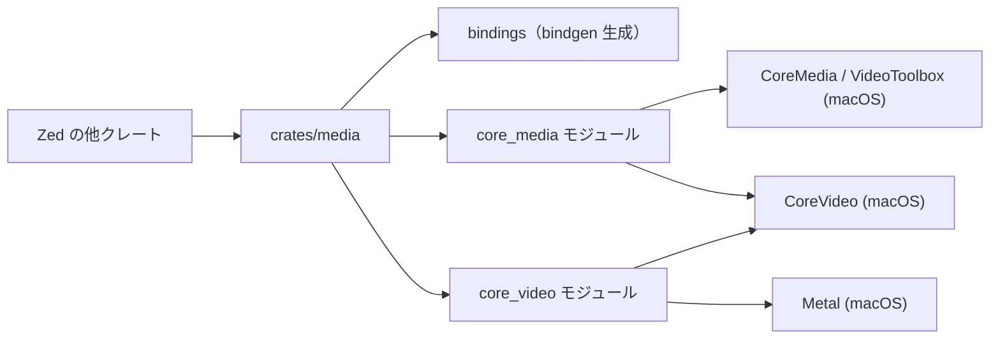
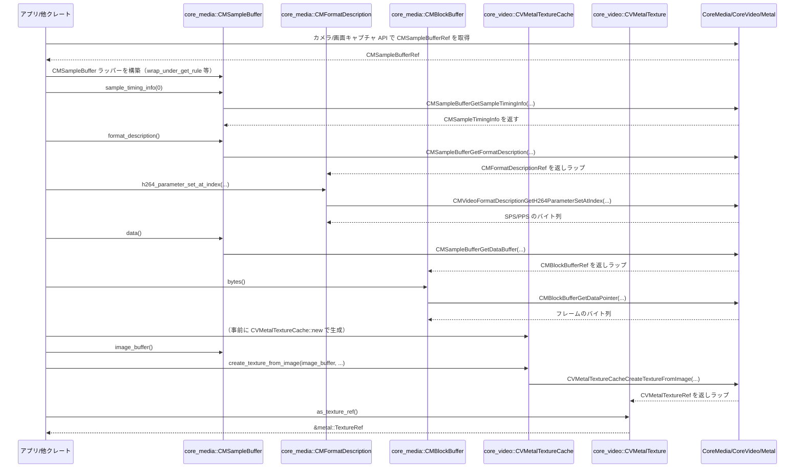

# crates/media ディレクトリ解説

## 1. ざっくり一言

macOS の CoreMedia / CoreVideo / VideoToolbox / Metal API を Rust から扱うための、薄い FFI ラッパーモジュールです。  
Zed 本体から、CMSampleBuffer などのメディアフレームや H.264 のパラメータセット、Metal テクスチャを安全に扱えるようにしています。

---

## 2. このモジュールの役割

### 2.1 概要

- このディレクトリは、macOS 固有のメディア処理 API を Rust から利用するためのバインディングを提供します。
- 具体的には、CoreMedia の `CMSampleBuffer` / `CMFormatDescription` / `CMBlockBuffer` と、CoreVideo の `CVMetalTextureCache` / `CVMetalTexture` に対する Rust の型とメソッドを定義しています。
- 非安全な FFI 呼び出しを内部に閉じ込め、呼び出し側は主に安全なメソッド (`&[u8]` のスライスや `Vec<CFDictionary<CFString>>` など) を利用できるようになっています。

### 2.2 アーキテクチャ内での位置づけ

このクレートは、Zed の他クレートと macOS のフレームワーク群の間に入る「ブリッジ層」です。  
内部では、`build.rs` による `bindgen` 生成コードと、手書きのラッパーモジュールが分かれています。



- `build.rs` + `src/bindings.h` + `bindgen`  
  → Apple のヘッダーから必要な型・定数・関数のみを Rust に自動生成します。
- `src/bindings.rs`  
  → 生成された `bindings.rs` を `include!` で取り込み、`core_media` / `core_video` から利用可能にします。
- `src/media.rs`  
  → crate ルートとして `core_media` / `core_video` モジュールを定義し、`bindings` の生バインディングに対する高レベルラッパーを提供します。

### 2.3 設計上のポイント

- **macOS 限定**  
  - ほとんどのコードに `#[cfg(target_os = "macos")]` が付いており、macOS 以外では空の `main`（build.rs）やモジュールがコンパイルされるだけです。
- **CoreFoundation 連携**  
  - `declare_TCFType!` / `impl_TCFType!` マクロで、CoreFoundation/ CoreMedia の `CFTypeRef` ベースの型を Rust の所有権モデルに合わせてラップしています。
  - これにより `as_concrete_TypeRef()` や `wrap_under_get_rule()` といった安全性の高いヘルパーが利用されています。
- **FFI と安全ラッパーの分離**
  - `extern "C"` で宣言した生の C 関数はすべて `unsafe` で、モジュール内のメソッドがこれをまとめて呼び出す構造になっています。
  - 呼び出し側は主に安全なメソッド（`&self` / `Result<T>` など）を使うことができます（一部 `unsafe fn` を除く）。
- **エラーハンドリング方針**
  - OSStatus や CVReturn などの戻り値は、`anyhow::ensure!` によって `Result<T>` で返すか、前提を満たす場面に限定して `assert!` でチェックしています。
- **ビルド時バインディング生成**
  - `build.rs` で `bindgen` を用い、必要なシンボルのみ `allowlist_*` で絞り込んで生成しているため、バインディングが過剰に膨らまないようになっています。

---

## 3. 主要な機能一覧

このクレートが提供する主な機能を列挙します。

- CoreMedia サンプルバッファの操作
  - `CMSampleBuffer` から添付情報（attachments）の取得
  - `CMSampleBuffer` から `CVImageBuffer`（画像バッファ）の取得
  - `CMSampleBuffer` 内のサンプルのタイミング情報（`CMSampleTimingInfo`）の取得
  - `CMSampleBuffer` からフォーマット情報 (`CMFormatDescription`) の取得
  - `CMSampleBuffer` からデータバッファ (`CMBlockBuffer`) の取得
- H.264 フォーマット情報の取得
  - `CMFormatDescription` から H.264 のパラメータセット（SPS/PPS 等）の数を取得
  - 指定インデックスの H.264 パラメータセットを `&[u8]` として取得
- ブロックバッファの生バイト取得
  - `CMBlockBuffer` からフレームの生バイト列を `&[u8]` として取得
- CoreVideo → Metal 連携
  - `CVMetalTextureCache` を用いて `CVImageBuffer` から `CVMetalTexture` を生成
  - `CVMetalTexture` から Metal の `TextureRef` を取得して GPU レンダリングに利用
- 補助的な型・定数
  - `CMItemIndex` / `CMSampleTimingInfo` / `CMTime` / `CMVideoCodecType` など CoreMedia の型
  - `kCMTimeInvalid` / `kCMVideoCodecType_H264` / 各種 `kCVPixelFormatType_*` / `kCVReturnSuccess` などの定数

---

## 4. 関数・構造体の解説

### 4.1 型一覧（構造体・列挙体など）

公開されている主要な型をまとめます。

| 名前 | 種別 | 所属モジュール | 役割 / 用途 |
|------|------|----------------|-------------|
| `CMSampleBuffer` | 構造体 (TCFType) | `core_media` | CoreMedia の `CMSampleBufferRef` をラップし、添付情報・画像バッファ・タイミング情報・フォーマット・データへのアクセスを提供します。 |
| `CMSampleBufferRef` | 型エイリアス | `core_media` | `*const __CMSampleBuffer`。FFI 関数に渡すための C 側ポインタ型です。 |
| `CMFormatDescription` | 構造体 (TCFType) | `core_media` | ビデオフォーマット（特に H.264）のメタ情報を表す CoreMedia の `CMFormatDescriptionRef` のラッパーです。 |
| `CMFormatDescriptionRef` | 型エイリアス | `core_media` | `*const __CMFormatDescription`。FFI 用の生ポインタです。 |
| `CMBlockBuffer` | 構造体 (TCFType) | `core_media` | エンコード済みビデオデータなどを持つ `CMBlockBufferRef` をラップし、生バイト列にアクセスするための型です。 |
| `CMBlockBufferRef` | 型エイリアス | `core_media` | `*const __CMBlockBuffer`。FFI 用の生ポインタです。 |
| `CVMetalTextureCache` | 構造体 (TCFType) | `core_video` | `CVMetalTextureCacheRef` のラッパー。`CVImageBuffer` から Metal テクスチャを生成するためのキャッシュです。 |
| `CVMetalTextureCacheRef` | 型エイリアス | `core_video` | `*const __CVMetalTextureCache`。FFI 用の生ポインタです。 |
| `CVMetalTexture` | 構造体 (TCFType) | `core_video` | `CVMetalTextureRef` のラッパー。CoreVideo が管理する Metal テクスチャへのアクセスを提供します。 |
| `CVMetalTextureRef` | 型エイリアス | `core_video` | `*const __CVMetalTexture`。FFI 用の生ポインタです。 |

`declare_TCFType!` / `impl_TCFType!` マクロにより、これらの構造体には以下のような共通メソッドが生成されています（詳細実装はこのチャンク外ですが、使用例から存在が分かります）。

- `fn as_concrete_TypeRef(&self) -> <Ref 型>`  
  → 内部の `CFTypeRef` / CoreMedia の `*const` ポインタを取り出す。
- `unsafe fn wrap_under_get_rule(<Ref 型>) -> Self`  
  → `retain` 済みの参照をラップする。
- `unsafe fn wrap_under_create_rule(<Ref 型>) -> Self`  
  → `create` 系関数で返された新規参照をラップする。

### 4.2 関数詳細（代表 7 件）

#### 4.2.1 `core_media::CMSampleBuffer::sample_timing_info(&self, index: usize) -> Result<CMSampleTimingInfo>`

**概要**

- サンプルバッファ内の指定インデックスのサンプルに対するタイミング情報 (`CMSampleTimingInfo`) を取得します。

**引数**

| 引数名 | 型 | 説明 |
|--------|----|------|
| `index` | `usize` | 取得したいサンプルのインデックス。`CMItemIndex` にキャストされて CoreMedia に渡されます。 |

**戻り値**

- `Result<CMSampleTimingInfo>`  
  - 成功: 指定サンプルの `duration` / `presentationTimeStamp` / `decodeTimeStamp` を含む構造体。  
  - 失敗: `OSStatus` が 0 以外の場合に `anyhow::Error` を返します。

**内部処理の流れ**

1. `CMSampleTimingInfo` 構造体を、各フィールド `kCMTimeInvalid` で初期化します。
2. `CMSampleBufferGetSampleTimingInfo` を `unsafe` で呼び出し、`index` / `self` / 初期化した構造体へのポインタを渡します。
3. 戻り値 `OSStatus` が 0 であることを `anyhow::ensure!(result == 0, ...)` でチェックします。
4. エラーなら `Err(anyhow::Error)`、成功なら埋められた `timing_info` を `Ok` で返します。

**Examples（使用例）**

```rust
use anyhow::Result;                                      // anyhow::Result をインポート
use media::core_media::{CMSampleBuffer, CMSampleTimingInfo};

fn log_first_sample_timing(buf: &CMSampleBuffer) -> Result<()> {
    // サンプルバッファ内の最初のサンプルのタイミング情報を取得する
    let timing: CMSampleTimingInfo = buf.sample_timing_info(0)?;
    // ここで timing.duration や timing.presentationTimeStamp 等を使った処理を行う想定
    // （このチャンクにはフィールド利用例は出てこないため詳細は不明）
    Ok(())
}
```

**Errors / Panics**

- `Err` になるケース:
  - `CMSampleBufferGetSampleTimingInfo` が 0 以外の `OSStatus` を返した場合。
    - 例: `index` が範囲外、サンプルバッファが不正など。
- panic:
  - このメソッド内では `anyhow::ensure!` のみを使用しており、`assert!` はありません。  
    `anyhow::ensure!` はパニックではなく `Err` を返します。

**Edge cases（エッジケース）**

- 空のサンプルバッファに対して `index = 0` を指定した場合:
  - CoreMedia 側がエラー `OSStatus` を返し、`Err` になる可能性があります。
- ごく大きなインデックスを渡した場合:
  - 同様に `OSStatus` がエラーとなり `Err` が返ります。

**使用上の注意点**

- `index` が有効範囲内であることを、呼び出し側で把握している前提の API です。  
  範囲チェックは CoreMedia に任されています。
- `CMSampleTimingInfo` 自体はコピー可能な小さな構造体であり、所有権やライフタイムの制約は特にありません。

---

#### 4.2.2 `core_media::CMSampleBuffer::format_description(&self) -> CMFormatDescription`

**概要**

- サンプルバッファが持つフォーマット記述子 (`CMFormatDescription`) を取得します。  
  これを使って H.264 のパラメータセットなどの情報にアクセスします。

**引数**

- なし（`&self` のみ）

**戻り値**

- `CMFormatDescription`  
  - `CMFormatDescriptionRef` を `wrap_under_get_rule` でラップしたものです。

**内部処理の流れ**

1. `CMSampleBufferGetFormatDescription(self.as_concrete_TypeRef())` を `unsafe` で呼び出します。
2. 返ってきた `CMFormatDescriptionRef` を、`CMFormatDescription::wrap_under_get_rule(...)` でラップします。
3. ラップした `CMFormatDescription` を返します。

**Examples（使用例）**

```rust
use media::core_media::{CMSampleBuffer, CMFormatDescription};

fn get_format(buf: &CMSampleBuffer) -> CMFormatDescription {
    // サンプルバッファのフォーマット情報を取得する
    let format: CMFormatDescription = buf.format_description();
    format  // 呼び出し元に返す
}
```

**Errors / Panics**

- このメソッド自体は `Result` ではありません。
- CoreMedia が `NULL` を返した場合の挙動は、このチャンクからは分かりませんが、
  `wrap_under_get_rule` は通常 `NULL` を未定義動作またはパニックとして扱う実装であることが多く、
  「フォーマットが必ず存在する」前提で使われています。

**Edge cases**

- 非ビデオ / 不完全なサンプルバッファなど、フォーマット記述子を持たないケースでは、
  OS 側で `NULL` が返る可能性がありますが、この実装では特別な扱いをしていません。

**使用上の注意点**

- このメソッドは「フォーマット記述子が存在するサンプルバッファ」に対してのみ使う想定です。
- H.264 固有のメソッド（`h264_parameter_set_*`）を呼ぶ前に、コーデックが H.264 であることを  
  `CMVideoCodecType` などで確認する必要があります（この確認ロジックはこのチャンクには存在しません）。

---

#### 4.2.3 `core_media::CMSampleBuffer::data(&self) -> CMBlockBuffer`

**概要**

- サンプルバッファに紐づく `CMBlockBuffer` を取得し、その後 `CMBlockBuffer::bytes()` で生バイト列を取り出すための入口になります。

**引数**

- なし（`&self` のみ）

**戻り値**

- `CMBlockBuffer`  
  - `CMSampleBufferGetDataBuffer` が返す `CMBlockBufferRef` をラップしたものです。

**内部処理の流れ**

1. `CMSampleBufferGetDataBuffer(self.as_concrete_TypeRef())` を `unsafe` で呼び出します。
2. 返ってきた `CMBlockBufferRef` を `CMBlockBuffer::wrap_under_get_rule` でラップします。
3. ラップした `CMBlockBuffer` を返します。

**Examples（使用例）**

```rust
use media::core_media::{CMSampleBuffer, CMBlockBuffer};

fn get_sample_bytes(buf: &CMSampleBuffer) -> &'_ [u8] {
    // サンプルバッファに紐づく CMBlockBuffer を取得する
    let block: CMBlockBuffer = buf.data();
    // ブロックバッファ内の生バイト列を取得する
    let bytes: &[u8] = block.bytes();
    bytes
}
```

**Errors / Panics**

- このメソッド自体は `Result` を返さず、エラー時の扱いは `wrap_under_get_rule` 依存です。
- `CMSampleBufferGetDataBuffer` が `NULL` を返すケース（データバッファを持たないサンプルなど）は、
  実装上特別扱いされておらず、`NULL` ラップ時の挙動はこのチャンクからは不明です。

**Edge cases**

- オーディオのみ、メタデータのみなど、ブロックバッファを持たない `CMSampleBuffer` に対して呼ぶと、
  OS 側が `NULL` を返す可能性があります。

**使用上の注意点**

- 返される `CMBlockBuffer` は元の `CMSampleBuffer` とライフタイム的に結びついています。  
  `&[u8]` を取得して保持する場合も、元のバッファが生きている間に使用する必要があります。

---

#### 4.2.4 `core_media::CMFormatDescription::h264_parameter_set_count(&self) -> usize`

**概要**

- H.264 ビデオストリームにおけるパラメータセット（SPS, PPS 等）の数を取得します。

**引数**

- なし（`&self` のみ）

**戻り値**

- `usize`  
  - パラメータセットの数。

**内部処理の流れ**

1. ローカル変数 `count = 0` を用意します。
2. `CMVideoFormatDescriptionGetH264ParameterSetAtIndex` を、
   - `parameter_set_index = 0`
   - `parameter_set_pointer_out = ptr::null_mut()`
   - `parameter_set_size_out = ptr::null_mut()`
   - `parameter_set_count_out = &mut count`
   - `NALUnitHeaderLengthOut = ptr::null_mut()`
   で呼び出します。
3. 戻り値 `OSStatus` が 0 であることを `assert_eq!(result, 0);` でチェックします。
4. `count` を返します。

**Examples（使用例）**

```rust
use media::core_media::CMFormatDescription;

fn print_parameter_set_count(format: &CMFormatDescription) {
    // H.264 のパラメータセット数を取得する
    let count = format.h264_parameter_set_count();
    // 実際にはここで count をログ出力などに利用する
    // println!("parameter set count = {}", count);
}
```

**Errors / Panics**

- `OSStatus != 0` の場合、`assert_eq!(result, 0);` によって **panic** します。
  - H.264 以外のフォーマットで呼び出した場合などが該当します。
- `Result` を返さないため、呼び出し側はこの panic を捕捉できません。

**Edge cases**

- フォーマットが H.264 ではない場合:
  - CoreMedia がエラーを返し、パニックする可能性があります。
- パラメータセットが 0 個の場合:
  - 正常終了して `count = 0` が返るかどうかは CoreMedia の仕様に依存し、このチャンクからは詳細不明です。

**使用上の注意点**

- 「この `CMFormatDescription` は H.264 である」という前提でのみ安全に使えます。
- フォーマット種別を確認するロジック（`CMVideoCodecType` のチェックなど）は、このクレート外で行う必要があります。

---

#### 4.2.5 `core_media::CMFormatDescription::h264_parameter_set_at_index(&self, index: usize) -> Result<&[u8]>`

**概要**

- 指定インデックスの H.264 パラメータセット（SPS, PPS 等）のバイト列を `&[u8]` として取得します。

**引数**

| 引数名 | 型 | 説明 |
|--------|----|------|
| `index` | `usize` | 取得したいパラメータセットのインデックス。 |

**戻り値**

- `Result<&[u8]>`  
  - 成功: パラメータセットの生バイト列。スライスのライフタイムは `&self` に束縛されます。  
  - 失敗: `OSStatus` が 0 以外のときに `anyhow::Error`。

**内部処理の流れ**

1. `bytes: *const u8 = ptr::null()`、`len: usize = 0` を用意します。
2. `CMVideoFormatDescriptionGetH264ParameterSetAtIndex` を
   - `parameter_set_index = index`
   - `parameter_set_pointer_out = &mut bytes`
   - `parameter_set_size_out = &mut len`
   などとして呼び出します。
3. 戻り値 `OSStatus` が 0 であることを `anyhow::ensure!(result == 0, ...)` で確認します。
4. 成功時は `std::slice::from_raw_parts(bytes, len)` で `&[u8]` を構築し、`Ok` で返します。

**Examples（使用例）**

```rust
use anyhow::Result;
use media::core_media::CMFormatDescription;

fn collect_h264_parameter_sets(format: &CMFormatDescription) -> Result<Vec<&[u8]>> {
    // パラメータセットの総数を取得する
    let count = format.h264_parameter_set_count();
    let mut sets = Vec::new();                             // スライスのベクタを準備

    for i in 0..count {
        // 各インデックスのパラメータセットを取得する
        let param: &[u8] = format.h264_parameter_set_at_index(i)?;
        sets.push(param);                                  // 取得したスライスを保存
    }

    Ok(sets)
}
```

**Errors / Panics**

- `Err` になるケース:
  - インデックスが範囲外、フォーマットが H.264 ではないなどで `OSStatus != 0` の場合。
- panic:
  - このメソッドでは `assert!` を使っていないため、直接の panic はありません。
  - ただし CoreMedia が不正なポインタと長さを返した場合、`from_raw_parts` によってメモリ安全性の問題が生じる可能性がありますが、それは CoreMedia の契約違反に依存します。

**Edge cases**

- `index >= h264_parameter_set_count()` の場合:
  - `OSStatus != 0` となり、`Err` が返る可能性が高いです。
- パラメータセットが非常に大きい場合:
  - `len` が大きな値になり、それに応じたスライスが生成されます。  
  この処理自体はコピーを伴わないため、メモリ使用量は元のバッファ依存です。

**使用上の注意点**

- 返される `&[u8]` スライスは、「`CMFormatDescription`（ひいては元の `CMSampleBuffer`）が生きている間のみ有効」です。
- スライスを別スレッドに渡したり、元オブジェクトのライフタイムを超えて保持したりしないことが重要です。

---

#### 4.2.6 `core_media::CMBlockBuffer::bytes(&self) -> &[u8]`

**概要**

- `CMBlockBuffer` が指すデータ全体を 1 つの連続した `&[u8]` スライスとして取得します。

**引数**

- なし（`&self` のみ）

**戻り値**

- `&[u8]`  
  - ブロックバッファ内の生バイト列への参照です。

**内部処理の流れ**

1. `bytes: *const u8 = ptr::null()`、`len: usize = 0` を用意します。
2. `CMBlockBufferGetDataPointer` を
   - `offset = 0`
   - `length_at_offset_out = &mut 0`（出力値は無視）
   - `total_length_out = &mut len`
   - `data_pointer_out = &mut bytes`
   として `unsafe` で呼び出します。
3. 戻り値が 0 であることを `assert!(result == 0, "could not get block buffer data");` で検証します。
4. `std::slice::from_raw_parts(bytes, len)` で `&[u8]` を構築し、返します。

**Examples（使用例）**

```rust
use media::core_media::CMBlockBuffer;

fn checksum(block: &CMBlockBuffer) -> u32 {
    // ブロックバッファ内の全バイト列への参照を取得する
    let bytes: &[u8] = block.bytes();

    // 非常に単純なチェックサム計算の例（実際にはより適切なアルゴリズムを使用）
    bytes.iter().fold(0u32, |acc, &b| acc.wrapping_add(b as u32))
}
```

**Errors / Panics**

- panic:
  - `CMBlockBufferGetDataPointer` が 0 以外を返した場合に `assert!(result == 0, ...)` でパニックします。
  - 例えば、「バッファが連続しておらず、単一ポインタでは表せない」ようなケースなど。

**Edge cases**

- 非連続な CMBlockBuffer:
  - CoreMedia の仕様上、`CMBlockBufferGetDataPointer` がエラーを返すケースがあり、その場合この関数はパニックします。
- データ長が 0 のブロック:
  - `len = 0` のスライス（空スライス）が返ると考えられます。

**使用上の注意点**

- 「単一の連続したメモリとしてアクセスできるブロックバッファ」を前提としたメソッドです。
- 返されるスライスはコピーを伴わず、元の `CMBlockBuffer` のライフタイムに依存します。

---

#### 4.2.7 `core_video::CVMetalTextureCache::create_texture_from_image(&self, source: CVImageBufferRef, texture_attributes: CFDictionaryRef, pixel_format: MTLPixelFormat, width: usize, height: usize, plane_index: usize) -> Result<CVMetalTexture>`

**概要**

- CoreVideo の `CVImageBuffer` から Metal テクスチャ（`CVMetalTexture`）を生成します。  
  GPU へのアップロードやレンダリングに利用する入口となります。

**引数**

| 引数名 | 型 | 説明 |
|--------|----|------|
| `source` | `::core_video::image_buffer::CVImageBufferRef` | 元になる画像バッファ。`CMSampleBuffer::image_buffer()` から得られる `CVImageBuffer` から取り出すことが想定されます。 |
| `texture_attributes` | `CFDictionaryRef` | テクスチャ生成時の追加属性。不要なら `ptr::null()` を渡せます。 |
| `pixel_format` | `MTLPixelFormat` | Metal 側のピクセルフォーマット（例: `MTLPixelFormat::BGRA8Unorm`）。 |
| `width` | `usize` | テクスチャの幅（ピクセル）。 |
| `height` | `usize` | テクスチャの高さ（ピクセル）。 |
| `plane_index` | `usize` | YUV 形式などで複数プレーンを持つ場合のプレーンインデックス。通常 BGRA なら 0。 |

**戻り値**

- `Result<CVMetalTexture>`  
  - 成功: 新たに生成された `CVMetalTexture`（`wrap_under_create_rule` による所有）。  
  - 失敗: `CVReturn != kCVReturnSuccess` の場合に `anyhow::Error`。

**内部処理の流れ**

1. `this: CVMetalTextureRef = ptr::null()` を用意します。
2. `CVMetalTextureCacheCreateTextureFromImage` を `unsafe` で呼び出し、各種引数と `&mut this` を渡します。
3. 戻り値が `kCVReturnSuccess` であることを `anyhow::ensure!` で確認します。
4. 成功時は `CVMetalTexture::wrap_under_create_rule(this)` でラップし、`Ok` で返します。

**Examples（使用例）**

以下は、既に有効な `CVMetalTextureCache` と `CVImageBufferRef` を持っている前提の例です。

```rust
use anyhow::Result;                                                   // anyhow::Result を利用
use core_foundation::dictionary::CFDictionaryRef;                      // 属性辞書の型
use media::core_video::CVMetalTextureCache;                            // テクスチャキャッシュ
use metal::MTLPixelFormat;                                             // Metal のピクセルフォーマット

// Safety: 引数のポインタはすべて有効でなければならない
unsafe fn make_texture_from_image(
    cache: &CVMetalTextureCache,                                       // 既存のテクスチャキャッシュ
    image: ::core_video::image_buffer::CVImageBufferRef,               // 元の画像バッファ
    attrs: CFDictionaryRef,                                            // 属性（なければ ptr::null()）
    width: usize,
    height: usize,
) -> Result<media::core_video::CVMetalTexture> {
    // BGRA8 の 2D テクスチャを 0 番プレーンから作成する例
    let tex = cache.create_texture_from_image(
        image,                                                          // 画像バッファ
        attrs,                                                          // 属性辞書
        MTLPixelFormat::BGRA8Unorm,                                     // ピクセルフォーマット
        width,                                                          // 幅
        height,                                                         // 高さ
        0,                                                              // プレーンインデックス
    )?;
    Ok(tex)                                                             // 生成した CVMetalTexture を返す
}
```

**Errors / Panics**

- `Err` になるケース:
  - `CVMetalTextureCacheCreateTextureFromImage` が `kCVReturnSuccess` 以外を返した場合。
- panic:
  - 本メソッド内では `assert!` を使用していません。

**Edge cases**

- 不正な `CVImageBufferRef` や `MTLPixelFormat` を渡した場合:
  - CoreVideo/Metal 側でエラーとなり、`Err` が返る可能性があります。
- `width`/`height` が `source` 実際のサイズと一致しない場合:
  - エラーになるかどうかは OS の仕様によります。このチャンクには詳細は現れていません。

**使用上の注意点**

- メソッド自体が `unsafe fn` であり、「引数が OS の契約通りに正しい」ことを呼び出し側が保証する必要があります。
- 返された `CVMetalTexture` から `as_texture_ref()` で `&metal::TextureRef` を取得するときも、元テクスチャが有効であることが前提です。

---

### 4.3 その他の関数

上記以外の主なメソッド・関数を一覧します。

| 関数名 / メソッド名 | 所属 | 役割（1 行） |
|---------------------|------|--------------|
| `CMSampleBuffer::attachments(&self) -> Vec<CFDictionary<CFString>>` | `core_media` | サンプルバッファに付随する添付情報（キーフレームフラグなど）を配列として取得します。 |
| `CMSampleBuffer::image_buffer(&self) -> Option<CVImageBuffer>` | `core_media` | サンプルバッファから画像バッファ（ピクセルデータ）を取得します。存在しない場合は `None` を返します。 |
| `CVMetalTextureCache::new(metal_device: *mut MTLDevice) -> Result<Self>` | `core_video` | Metal デバイスに紐づくテクスチャキャッシュを作成する `unsafe` コンストラクタです。 |
| `CVMetalTexture::as_texture_ref(&self) -> &metal::TextureRef` | `core_video` | `CVMetalTexture` が内部に持つ Metal のテクスチャ参照を取得します。 |
| `CMTimeMake` | `bindings` 経由で `core_media` 再公開 | CoreMedia の `CMTime` 構造体を作る C 関数。タイムスタンプの生成などに利用されます。 |
| `kCVPixelFormatType_*` / `kCVReturnSuccess` 等 | `bindings` 経由で `core_video` / `core_media` から使用 | CoreVideo のピクセルフォーマット ID や戻り値定数です。 |
| `CMSampleBufferGet*` / `CMVideoFormatDescriptionGetH264ParameterSetAtIndex` など | `core_media` 内 `extern "C"` | CoreMedia との FFI 入口。上記のメソッドからのみ利用されます。 |
| `CVMetalTextureCacheCreate` / `CVMetalTextureCacheCreateTextureFromImage` / `CVMetalTextureGetTexture` | `core_video` 内 `extern "C"` | CoreVideo/Metal との FFI 入口。ラッパーメソッドからのみ利用されます。 |

---

## 5. データフロー

ここでは、キャプチャされた H.264 ビデオフレームを扱い、CPU 側で生バイトを取得しつつ GPU には Metal テクスチャとして渡す典型的なフローを示します。



このフローにより、

- CoreMedia からは
  - タイミング情報 (`CMSampleTimingInfo`)
  - H.264 のパラメータセット (`&[u8]`)
  - フレームの生バイト (`&[u8]`)
- CoreVideo + Metal からは
  - GPU レンダリング用の `&metal::TextureRef`

をそれぞれ取得できる構造になっています。

---

## 6. 使い方（How to Use）

### 6.1 基本的な使用方法

ここでは、`CMSampleBuffer` から H.264 のパラメータセットとフレームの生バイトを取り出す基本的な例を示します。  
（`CMSampleBuffer` の生成部分はこのチャンクには登場しないため、外部から渡される前提です。）

```rust
use anyhow::Result;                                  // anyhow::Result 型を利用する
use media::core_media::{CMSampleBuffer, CMFormatDescription, CMBlockBuffer};

fn process_h264_sample(sample: &CMSampleBuffer) -> Result<()> {
    // 1. フォーマット記述子を取得する
    let format: CMFormatDescription = sample.format_description();

    // 2. パラメータセットの数を確認する
    let count = format.h264_parameter_set_count();

    // 3. 各パラメータセットの生バイトを取得して処理する
    for i in 0..count {
        let param: &[u8] = format.h264_parameter_set_at_index(i)?; // i 番目のパラメータセット
        // ここで param をデコーダ初期化などに利用する想定
    }

    // 4. サンプル本体のデータブロックを取得する
    let block: CMBlockBuffer = sample.data();

    // 5. フレームの生バイト列を取得する
    let bytes: &[u8] = block.bytes();
    // bytes をエンコーダやネットワーク送信に渡す処理をここで行う

    Ok(())
}
```

ポイント:

- `format_description()` → `h264_parameter_set_count()` → `h264_parameter_set_at_index()` の流れで H.264 固有のメタデータを取得します。
- `data()` → `bytes()` でフレームの生バイトにアクセスします。
- いずれも元の `CMSampleBuffer` が生きている間に利用する必要があります。

### 6.2 よくある使用パターン

#### パターン 1: GPU レンダリングのために Metal テクスチャを作る

`CMSampleBuffer` から画像バッファを取り出し、`CVMetalTextureCache` を使って Metal テクスチャに変換する例です。

```rust
use anyhow::Result;                                                // エラー処理に anyhow を使用
use core_foundation::dictionary::CFDictionaryRef;                   // 属性辞書の型
use media::core_media::CMSampleBuffer;                              // CMSampleBuffer 型
use media::core_video::CVMetalTextureCache;                         // テクスチャキャッシュ
use metal::{MTLDevice, MTLPixelFormat, TextureRef};                 // Metal の型
use std::ptr;                                                       // ptr::null などに使用

// Safety: device は有効な MTLDevice* でなければならない
unsafe fn upload_sample_to_gpu(
    device: *mut MTLDevice,                                         // 既存の Metal デバイスのポインタ
    sample: &CMSampleBuffer,                                        // 処理対象のサンプル
    attrs: CFDictionaryRef,                                         // 追加属性（必要なければ ptr::null()）
    width: usize,                                                   // テクスチャ幅
    height: usize,                                                  // テクスチャ高さ
) -> Result<&'static TextureRef> {
    // 1. Metal テクスチャキャッシュを作成する
    let cache = CVMetalTextureCache::new(device)?;                  // エラー時は Err を返す

    // 2. サンプルから画像バッファを取り出す
    let image_buffer = sample
        .image_buffer()                                             // Option<CVImageBuffer> を取得
        .expect("画像バッファを持たないサンプル");                  // この例では必ずある前提

    // ここで image_buffer.as_concrete_TypeRef() を使って CVImageBufferRef を取得する必要がありますが、
    // 具体的なコードは core_video::image_buffer モジュール側の定義に依存し、このチャンクにはありません。

    // 擬似コードレベルでの呼び出しイメージ:
    // let source = image_buffer.as_concrete_TypeRef();

    // 3. CVImageBuffer から Metal テクスチャを生成する
    // let cv_tex = cache.create_texture_from_image(
    //     source,                                                   // CVImageBufferRef
    //     attrs,                                                    // 属性辞書
    //     MTLPixelFormat::BGRA8Unorm,                               // ピクセルフォーマット
    //     width,                                                    // 幅
    //     height,                                                   // 高さ
    //     0,                                                        // プレーンインデックス
    // )?;

    // 4. Metal の TextureRef を取り出す
    // let tex_ref: &TextureRef = cv_tex.as_texture_ref();

    // このチャンクには image_buffer から CVImageBufferRef を取得する具体コードがないため、
    // 実装イメージのみを示しています。

    Err(anyhow::anyhow!("擬似コード例（実装は core_video::image_buffer に依存）"))
}
```

- 実際のコードでは、`CVImageBuffer` 用の `TCFType` 実装（`as_concrete_TypeRef()` など）を使って `CVImageBufferRef` を取得してから `create_texture_from_image` を呼びます。
- 生成された `CVMetalTexture` から `as_texture_ref()` で `&TextureRef` を取り出すことができます。

#### パターン 2: 添付情報（attachments）からキーフレームやフラグを読む

添付情報の具体的なキーや値の意味はこのチャンクからは分かりませんが、`CFDictionary<CFString>` として取得できる構造になっています。

```rust
use media::core_media::CMSampleBuffer;                         // CMSampleBuffer 型

fn inspect_attachments(sample: &CMSampleBuffer) {
    // 添付情報の配列を取得する
    let attachments = sample.attachments();                     // Vec<CFDictionary<CFString>>

    for dict in attachments {
        // ここで dict を使って "NotSync" フラグなどを読む処理を書く想定
        // どのキーを使うか（例: kCMSampleAttachmentKey_NotSync）はこのチャンクに定義がありますが、
        // 実際の読み方は core_foundation::dictionary の API に依存します。
    }
}
```

### 6.3 使用上の注意点（まとめ）

- **macOS 限定**
  - `core_media` / `core_video` は `#[cfg(target_os = "macos")]` 付きです。  
    他 OS ではこれらのモジュールや機能は利用できません。
- **FFI の前提条件**
  - `CVMetalTextureCache::new` / `create_texture_from_image` などの `unsafe fn` は、
    引数が OS の契約通りであること（ポインタの有効性・サイズの整合性など）を呼び出し側が保証する必要があります。
- **ライフタイムとスライス**
  - `CMBlockBuffer::bytes()` や `CMFormatDescription::h264_parameter_set_at_index()` が返す `&[u8]` は、
    元の CoreMedia オブジェクト（`CMSampleBuffer` / `CMFormatDescription` / `CMBlockBuffer`）が有効な間だけ使えます。
  - これらのスライスを長期間保持したり、所有権を持つ型（`Vec<u8>` など）と混同しないよう注意が必要です。
- **panic の可能性**
  - 一部のメソッド（特に `h264_parameter_set_count` / `CMBlockBuffer::bytes`）は `assert!` によるチェックを行っており、
    CoreMedia の戻り値が想定外だった場合にパニックします。
  - これらは「正しい種類のデータに対してのみ呼ぶ」ことが前提になっています。
- **スレッド安全性**
  - このチャンクには `Send` / `Sync` 実装の有無は現れていません。  
    CoreMedia / CoreVideo / Metal のドキュメントに従い、同一オブジェクトを複数スレッドで同時に扱う場合は注意が必要です。

---

## 7. 関連ファイル

このディレクトリ内の各ファイルと役割をまとめます。

| パス | 役割 / 関係 |
|------|------------|
| `media/Cargo.toml` | `media` クレートの定義。ライブラリターゲットとして `src/media.rs` を指定し、`anyhow` / `core-foundation` / `core-video` / `metal` / `objc` / `bindgen` などへの依存を宣言しています。 |
| `media/build.rs` | ビルドスクリプト。macOS 上でのみ動作し、`xcrun --sdk macosx --show-sdk-path` で SDK パスを取得した上で、`src/bindings.h` に対して `bindgen` を実行し、`OUT_DIR/bindings.rs` を生成します。 |
| `media/src/bindings.h` | `bindgen` の入力となる Objective‑C/ C のヘッダー。`CoreMedia`, `CoreVideo`, `VideoToolbox` のヘッダーを `#import` しています。 |
| `media/src/bindings.rs` | `#![allow(...)]` で警告を抑制した上で、`include!(concat!(env!("OUT_DIR"), "/bindings.rs"));` によりビルド時生成のバインディングを取り込みます。`core_media` / `core_video` から各種型・定数・関数が参照されます。 |
| `media/src/media.rs` | クレートルート。`mod bindings;` でバインディングモジュールを読み込み、`pub mod core_media` / `pub mod core_video` 内で CoreMedia / CoreVideo / Metal に対するラッパー型とメソッドを定義しています。 |

この構成により、Zed の他クレートは `media::core_media` / `media::core_video` を介して macOS のメディア API を利用できるようになっています。
