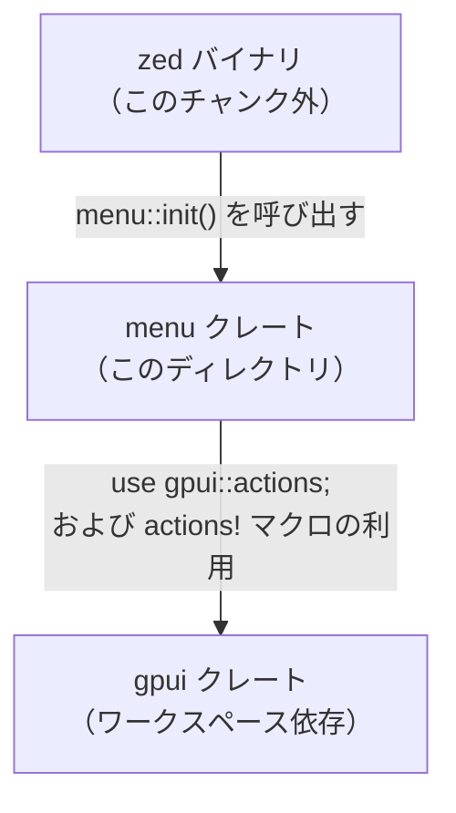
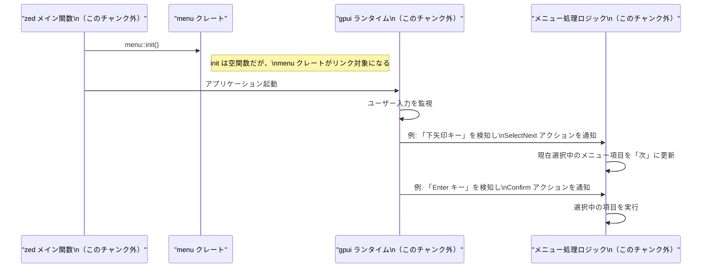

# menu/ ディレクトリ解説

## 1. ざっくり一言

`menu` クレートは、UI の「メニュー操作」に関する一連のアクション（Cancel, Confirm など）を定義し、それらが最適化で削除されないようにするための空の初期化関数 `init()` を提供する小さなライブラリです。

---

## 2. このモジュールの役割

このディレクトリには、`menu` という名前のライブラリクレートが含まれています。

- `Cargo.toml` で `gpui` クレートへの依存と、ライブラリのエントリポイントとして `src/menu.rs` を指定しています。
- `src/menu.rs` では、`gpui::actions!` マクロを用いてメニュー操作用のアクションを定義しつつ、空の `pub fn init()` を定義しています。

`init()` の役割はコメントに明示されています。

```rust
// If the zed binary doesn't use anything in this crate, it will be optimized away
// and the actions won't initialize. So we just provide an empty initialization function
// to be called from main.
```

つまり:

- **問題**: zed のメインバイナリ側がこのクレート内のシンボルを直接使わないと、リンク時や LTO（リンク時最適化）によってクレート全体が最適化で落とされる可能性がある。
- **解決**: メインバイナリから `menu::init()` を一度呼ぶことで、`menu` クレートが「使われている」と認識され、`actions!` によるアクション定義が有効になる。

### 依存関係（概念図）

このディレクトリ内と、その周辺コンポーネントとの関係を簡単に図示します。



このチャンクには zed 本体や `gpui` クレートの実装は含まれていませんが、`menu` はそれらの間で「メニュー関連アクションをまとめて提供する薄いレイヤー」として位置付けられていると理解できます（コメントと依存関係からの解釈です）。

### 設計上のポイント（コードから読み取れる範囲）

- **責務の分割**
  - `menu` クレートは、メニュー操作に関するアクション定義だけに特化しています。
  - 実際のメニュー表示や状態遷移ロジックは、このディレクトリには含まれていません。
- **状態の有無**
  - Rust コード上ではグローバルな状態や構造体は定義されておらず、`init()` も空関数です。
  - アクションの登録や管理は、`gpui::actions!` マクロの内部および `gpui` 側に委ねられていると考えられます（ただし詳細はこのチャンクにはありません）。
- **エラーハンドリング**
  - `init()` は戻り値が `()` の単純な関数であり、エラーを返しません。
  - アクション定義部も宣言のみで、エラーを起こしうる処理は含まれていません。

---

## 3. 主要な機能一覧

このクレートが提供する主な機能は次のとおりです。

- **メニュー操作アクションの定義**
  - `gpui::actions!` マクロを用いて、メニューに関する各種アクション（`Cancel`, `Confirm`, `SelectNext` など）を宣言します。
- **空の初期化関数 `init()`**
  - メインバイナリから呼び出すことで、このクレート全体が最適化で削除されないようにするための「アンカー」として機能します。

---

## 4. 関数・構造体の解説

このディレクトリには明示的な関数が 1 つ（`init`）、およびマクロによって定義されるアクション群があります。

### 4.1 `pub fn init()`

```rust
pub fn init() {}
```

**概要**

- メインバイナリ（zed 本体など）から呼び出されることを想定した、空の初期化関数です。
- 実行時の副作用はありませんが、「このクレートが使用されている」という事実をコンパイラに伝えることで、`actions!` によるアクション定義が最適化で落とされるのを防ぐ目的があります。

**引数**

- 引数はありません。

**戻り値**

- 戻り値の型は `()`（何も返さない）です。

**内部処理の流れ**

- 関数本体は空であり、実行時には何も行いません。
- 意味のある「処理」はすべてコンパイル・リンク段階で行われており、この関数の存在自体が重要です。

**Edge cases（エッジケース）**

- 引数がないため、入力に関するエッジケースはありません。
- 本体が空なので、何回呼び出しても同じ挙動（何も起きない）です。

**使用上の注意点**

- **少なくとも 1 回は呼び出す必要がある**  
  コメントにあるとおり、このクレート内のシンボルがメインバイナリから参照されないと、クレートごと最適化で削除される可能性があります。  
  そのため、アプリケーションの起動時などに `menu::init()` を一度呼び出すことが前提になっています。
- **複数回呼び出しても問題になりません**  
  関数本体が空であるため、複数回呼んでも追加の副作用は発生しません。
- **この関数自体は何も初期化しない**  
  「init」という名前ですが、この関数内部ではアクション登録などの処理は行っていません。アクションの登録や初期化は、`gpui::actions!` マクロや `gpui` ランタイム側で行われていると考えられます（詳細はこのチャンクからは分かりません）。

---

### 4.2 `actions!` マクロで定義されるアクション群

```rust
use gpui::actions;

actions!(
    menu,
    [
        /// Cancels the current menu operation.
        Cancel,
        /// Confirms the selected menu item.
        Confirm,
        /// Performs secondary confirmation action.
        SecondaryConfirm,
        /// Selects the previous item in the menu.
        SelectPrevious,
        /// Selects the next item in the menu.
        SelectNext,
        /// Selects the first item in the menu.
        SelectFirst,
        /// Selects the last item in the menu.
        SelectLast,
        /// Enters a submenu (navigates to child menu).
        SelectChild,
        /// Exits a submenu (navigates to parent menu).
        SelectParent,
        /// Restarts the menu from the beginning.
        Restart,
        EndSlot,
    ]
);
```

**概要**

- `gpui::actions!` というマクロを使って、`menu` という名前空間に属する一連の「メニュー操作用アクション」を宣言しています。
- 具体的にどのような型（構造体・列挙体・関数など）が生成されるかは、このチャンクには `actions!` の定義がないため分かりません。
- ただし、各アクション名と付与されたドキュメントコメントから、「ユーザーがメニューを操作したときに発行されるイベントの種類」を表す識別子であると解釈できます。

**定義されているアクション（コメントから読み取れる意味）**

- `Cancel`  
  - 「現在のメニュー操作をキャンセルする」アクションです。
- `Confirm`  
  - 「現在選択中のメニュー項目を確定（実行）する」アクションです。
- `SecondaryConfirm`  
  - 「副次的な確認操作」を行うアクションです。  
    （具体的に何をするかは、このチャンクだけでは分かりません。右クリックや別キーに対応する可能性がありますが、推測の域を出ません。）
- `SelectPrevious`  
  - 「メニュー内で一つ前の項目を選択する」アクションです。
- `SelectNext`  
  - 「メニュー内で次の項目を選択する」アクションです。
- `SelectFirst`  
  - 「メニュー内の最初の項目を選択する」アクションです。
- `SelectLast`  
  - 「メニュー内の最後の項目を選択する」アクションです。
- `SelectChild`  
  - 「サブメニューに入る（子メニューへ移動する）」アクションです。
- `SelectParent`  
  - 「サブメニューから親メニューに戻る」アクションです。
- `Restart`  
  - 「メニューを最初からやり直す」アクションです。  
    具体的には、選択状態やスクロール位置などを初期状態に戻すイメージの操作と考えられますが、詳細な実装はこのチャンクにはありません。
- `EndSlot`  
  - コメントが付いていないため意味はコードからは分かりません。  
    名前から、「メニューのスロット（枠）の終端を示す特別なアクション／マーカー」である可能性も考えられますが、推測にとどまります。

**内部実装について**

- `actions!` マクロの展開内容は、このチャンクには存在しません。
- 一般的には、こうしたマクロは
  - アクションの識別子（型・定数など）
  - それらを gpui のイベントシステムに登録するための仕組み
  を生成することが多いですが、実際に何が生成されるかは `gpui` クレート側の実装を確認する必要があります。

**使用上の注意点**

- どのような API でこれらのアクションを扱うか（例: `on_action(Confirm, handler)` のような形かどうか）は、このディレクトリからは分かりません。
- 実際の使用方法やアクションハンドラの登録方法を確認するには、`gpui` クレートと、このアクションを消費している他のファイル（このチャンク外）を参照する必要があります。

---

## 5. データフロー

このディレクトリ単体ではメニュー処理のロジックは定義されていませんが、コメントや命名から想定される「典型的なフロー」を概念的に整理します。

1. **アプリ起動時**
   - zed などのメインバイナリが `menu` クレートに依存しており、起動時に `menu::init()` を一度呼び出します。
   - これによりコンパイラ・リンカは `menu` クレートを「使用されている」とみなし、`actions!` で定義されたアクション関連のシンボルがリンク対象になります。
2. **ユーザー操作時**
   - `gpui` ランタイムがキーボードやマウスの入力を受け取り、対応するアクション（例: `SelectNext`, `Confirm`）を発行します。
   - メニュー制御ロジック（このチャンク外）が、そのアクションを受け取ってメニュー状態を更新したり、選択された項目を実行したりします。

※以下のシーケンス図は、一般的な GUI メニューとこのクレートの役割から構成した概念図であり、実装の詳細はこのチャンクだけでは確認できません。



このように、`menu` クレートは「アクションの種類を列挙して名前を与える」役割に留まり、実際の状態管理やレンダリングは別コンポーネントに委ねられている構造と解釈できます。

---

## 6. 使い方（How to Use）

### 6.1 基本的な使用方法

このクレートで明確に分かる唯一の公開 API は `menu::init()` です。  
メインバイナリ側での代表的な利用例を示します。

```rust
// src/main.rs （zed 本体や他のバイナリクレート側のイメージ）
//
// Cargo.toml には `menu` クレートへの依存が追加されている前提です。
// [dependencies]
// menu = { path = "crates/menu" } // 実際のパスはワークスペース構成に依存します

use menu::init as init_menu; // menu クレートの init 関数をインポートする

fn main() {
    // アプリケーション起動時に一度だけ呼び出す
    init_menu(); // menu クレートが「使用されている」ことをコンパイラに伝える

    // この後で gpui ベースのアプリケーションを起動するなど
    // run_app();
}
```

このコードが行うこと:

- 実行時には何も起きません（`init()` は空）。
- ただし、コンパイラ・リンカの視点では `menu` クレートの公開関数が使用されているため、クレート全体が最適化で削除されにくくなります。

### 6.2 よくある使用パターン（推測を含む一般的な話）

このディレクトリからは他のクレートのコードが見えないため、「実際にどう使われているか」を断定することはできませんが、一般的な構成として次のようなパターンが考えられます。

- **複数のサブシステムクレートと同様の `init()` を持つ構成**
  - 例: `menu`, `editor`, `notifications` などのクレートがそれぞれ `actions!` マクロでアクションを定義し、空の `init()` を提供する。
  - メインバイナリでは、起動時にそれぞれの `init()` を順番に呼び出す。

```rust
// main.rs （一般的なイメージ例。実際のクレート名はこのチャンクからは分かりません）

fn main() {
    // 各サブシステムのアクションを登録させるための init 呼び出し
    menu::init();
    // editor::init();
    // notifications::init();
    // ...

    // アプリケーション本体の起動
    // run_app();
}
```

- **テストやツールからの利用**
  - メニュー関連のアクションを含む UI テストなどで、このクレートをリンクさせるために `menu::init()` を呼ぶ、という使い方も考えられます。

これらはあくまで「この種の設計でよく見られるパターン」であり、実際にこのリポジトリがそうなっているかは、このチャンクだけでは判断できません。

### 6.3 使用上の注意点（まとめ）

- **必ずどこかで `menu::init()` を呼び出す**
  - そうしないと、`menu` クレートが最適化で削除され、`gpui::actions!` によるアクション初期化が行われない可能性があります（コメントにその旨が記載されています）。
- **`init()` は副作用を持たない**
  - 本体が空のため、呼び出しによる実行時の副作用はありません。
  - 複数回呼び出されてもアプリケーション状態に影響を与えないと考えられます。
- **アクションの実際の扱いは `gpui` 側に依存する**
  - アクションハンドラの登録方法や、どの入力がどのアクションに対応するかといった詳細は、`gpui` クレートおよび他のアプリケーションコード側で定義されています。
  - それらを変更・利用する場合は、`gpui` のドキュメントやソースを参照する必要があります。

---

## 7. 関連ファイル

このディレクトリ内および密接に関係するコンポーネントを一覧にします。

| パス / コンポーネント | 役割 / 関係 |
|-----------------------|------------|
| `menu/Cargo.toml`     | `menu` クレートの設定ファイルです。ライブラリのエントリポイントとして `src/menu.rs` を指定し、`gpui` をワークスペース依存として宣言しています。また `doctest = false` により doctest が無効化されています。 |
| `menu/src/menu.rs`    | `menu` クレートの本体です。`pub fn init()` による初期化用関数と、`gpui::actions!` マクロを用いたメニュー操作アクションの宣言を行っています。 |
| `gpui` クレート（パス不明・このチャンク外） | `use gpui::actions;` で参照されている UI フレームワーククレートです。`actions!` マクロの定義元であり、アクション登録・ディスパッチの実装が含まれていると考えられます。 |
| zed メインバイナリクレート（パス不明・このチャンク外） | ソースコメントにある「zed binary」から、`menu::init()` を呼び出す側のバイナリクレートが存在することが分かります。実際のパスや構成は、このチャンクからは分かりません。 |

このディレクトリ単体では、アクション定義とリンク維持用の `init()` だけという非常に薄い層になっており、実際のメニュー挙動は他のクレート（特に `gpui` と zed 本体）と合わせて理解する必要があります。
