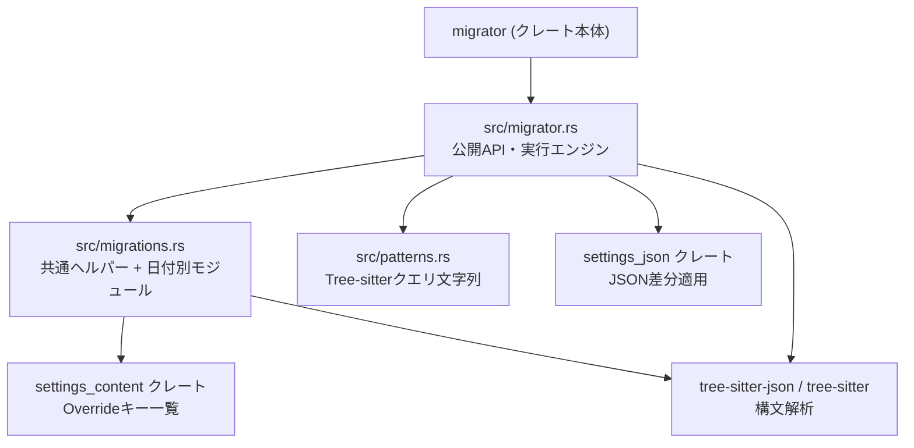
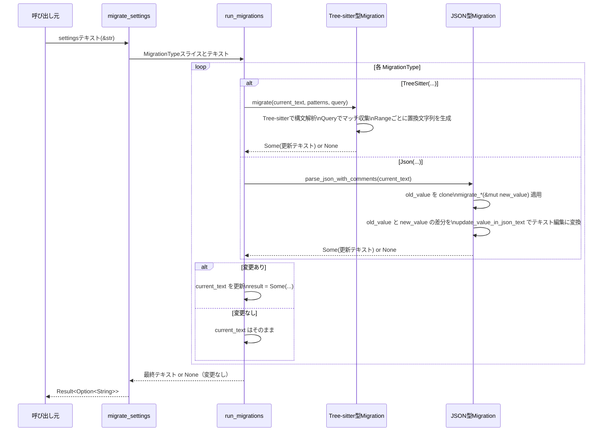

# migrator ディレクトリ解説

## 1. ざっくり一言

Zed の設定ファイル (`settings.json`) とキーマップ (`keymap.json`) を、バージョンアップに合わせて自動変換するためのマイグレーション用ライブラリです。  
古い形式の設定を新しいスキーマに揃える処理が、日付ごとの「マイグレーション」としてまとまっています。

---

## 2. このモジュールの役割

### 2.1 概要

- このクレートは、**テキストとしての JSON 設定ファイル**に対して段階的なマイグレーションを適用します。
- マイグレーションは大きく 2 種類あります。
  - **Tree-sitter ベース**: JSON テキストを Tree-sitter で解析し、パターンにマッチした部分文字列を置換する。
  - **serde_json ベース**: JSON を値 (`serde_json::Value`) として扱い、構造を変更してから元のテキストに差分を反映する。
- マイグレーションは **日付ごとのモジュール (`m_YYYY_MM_DD`) に追加され、既存のマイグレーションは変更しない**方針になっています。

### 2.2 アーキテクチャ内での位置づけ

ディレクトリ内の主なモジュールと、外部クレートとの関係は次のようになっています。



位置づけ:

- `migrator.rs`  
  - ライブラリのエントリーポイントです。
  - `migrate_keymap`, `migrate_settings` など外部から直接呼ぶ関数を提供し、内部で各日付マイグレーションを順番に実行します。
- `migrations.rs`  
  - JSON マイグレーションを **root / platform override / channel override / profiles** などに一括適用するヘルパー関数を提供します。
  - 各日付モジュール (`m_2025_01_02` など) をサブモジュールとして束ねます。
- `patterns.rs`  
  - Tree-sitter に渡すクエリ文字列（パターン）を `keymap` / `settings` に分けて定義・再エクスポートします。

外部クレート:

- `settings_json`  
  - `parse_json_with_comments`, `infer_json_indent_size`, `update_value_in_json_text` などを提供します。  
    コードから、**コメント付き JSON のパースと、Value 間の差分からテキスト編集を生成するユーティリティ**と解釈できます。
- `settings_content::PlatformOverrides` / `ReleaseChannelOverrides`  
  - `OVERRIDE_KEYS` という配列を通じて、プラットフォーム別・リリースチャネル別のオーバーライドセクションのキー一覧を提供していると考えられます（具体的なキーはこのチャンクには出てきません）。
- `tree-sitter` / `tree-sitter-json`  
  - JSON の構文木生成とパターンマッチングに使用します。

### 2.3 設計上のポイント

- **日付ごとのマイグレーション単位**
  - `m_2025_01_29` のように日付付きモジュール単位でマイグレーションを追加します。
  - 冒頭のドキュメントコメントにもあるとおり、「過去のマイグレーションは変更せず、新しいものを足す」方針です。
- **テキストベースと構造ベースの両立**
  - Tree-sitter ベースでは、**コメントやフォーマットを極力維持したまま局所的な置換**を行います。
  - serde_json ベースのマイグレーションでは、構造変化（フィールドの移動・再構成など）を扱い、その後 `update_value_in_json_text` でテキストへ最小限の差分を適用します。
- **オーバーライド / プロファイルへの再利用可能な適用**
  - `migrations::migrate_settings` / `migrate_language_setting` が、root 設定だけでなく `linux`, `macos`, `nightly` などの override セクションや `profiles` 配下にも同じマイグレーションロジックを再利用できるようにしています。
- **安全性と冪等性のテスト**
  - `#[cfg(test)]` セクションで、多数のテストが用意されています。
  - 各マイグレーションについて「1 回目は期待どおり変換され、2 回目以降は無変更である（冪等）」ことを明示的に確認しています。
- **Tree-sitter マイグレーションの衝突回避**
  - 置換区間 `Range<usize>` を開始位置・終了位置でソートし、「範囲が内包関係にあるもの」を `dedup_by` で取り除くことで、**重複・競合する置換を抑止**しています。

---

## 3. 主要な機能一覧

このクレートが提供する主な機能を、用途ごとにまとめると次のとおりです。

- **設定ファイルの一括マイグレーション**
  - `migrate_settings(text: &str) -> Result<Option<String>>`  
    Zed の `settings.json` 相当のテキストを最新スキーマに変換します。
- **キーマップファイルの一括マイグレーション**
  - `migrate_keymap(text: &str) -> Result<Option<String>>`  
    Zed の `keymap.json` 相当のテキストを最新スキーマに変換します。
- **特定設定のみを対象にしたマイグレーション**
  - `migrate_edit_prediction_provider_settings(text: &str)`  
    `edit_prediction_provider` 関連の設定のみを Tree-sitter ベースでマイグレーションします。
- **JSON オブジェクトに対するヘルパー的マイグレーション**
  - `migrations::migrate_settings`  
    任意の「設定オブジェクト 1 個に対する変換関数」を、root / override / profiles すべてに一括適用します。
  - `migrations::migrate_language_setting`  
    1 つの設定値とその `languages` サブツリーに同じ変換関数を適用します。
- **Tree-sitter パターンの集約**
  - `patterns::KEYMAP_*_PATTERN`, `patterns::SETTINGS_*_PATTERN`  
    キーマップ・設定用のよく使うパターンを文字列として提供します。
- **日付ごとのマイグレーション定義**
  - `migrations::m_YYYY_MM_DD` モジュール群  
    - 設定名の変更 (`inline_completions` → `edit_predictions` など)
    - Boolean → enum への変換 (`auto_indent`, `relative_line_numbers` など)
    - オブジェクト構造の再構成（`agent.tool_permissions` や `agent_servers` など）
    - Keymap アクション名・引数形式の変換 など、多数の個別マイグレーションを含みます。

---

## 4. 関数・構造体の解説

ここでは、外部から利用される可能性が高い関数と、マイグレーション実装者が理解しておくべき型・ヘルパーを中心に解説します。

### 4.1 主な公開関数

#### 4.1.1 `migrator::migrate_keymap(text: &str) -> Result<Option<String>>`

**役割**

- キーマップ JSON（`keymap.json` 相当のテキスト）に対して、登録済みの Tree-sitter ベースマイグレーションを順番に適用します。
- 何らかのマイグレーションでテキストが変わった場合のみ `Some(new_text)` を返します。

**内部処理の流れ**

1. `migrations::m_2025_01_29::KEYMAP_PATTERNS` など、日付ごとの `KEYMAP_PATTERNS` と、それに対応する `Query` を `MigrationType::TreeSitter` として配列に定義します。
2. その配列を `run_migrations(text, migrations)` に渡します。
3. `run_migrations` の中で、各マイグレーションについて `MigrationType::TreeSitter` であれば `migrate` を呼び、テキストを更新していきます。
4. 最終的に、元の `text` と異なるテキストになっていれば `Ok(Some(new_text))`、何も変わらなければ `Ok(None)` を返します。

**適用される主なマイグレーション例**

- 2025-01-29:
  - `["workspace::ActivatePaneInDirection", "Up"]` → `"workspace::ActivatePaneUp"` のような **配列 → 単一文字列アクション**への変換。
  - `"inline_completion::ToggleMenu"` → `"edit_prediction::ToggleMenu"` のようなアクション名のリネーム。
- 2025-01-30:
  - `{"saveIntent": "saveAll"}` → `{"save_intent": "save_all"}` のような **キー名・値の snake_case 化**。
- 2025-03-03 / 03-06:
  - `GoToPrev` 系アクション名の `Previous` へのリネームと、コードアクション付き配列アクションのフラット化。
- 2026-03-23:
  - `context` 文字列に含まれる `edit_prediction_conflict` を、`edit_prediction`, `showing_completions`, `in_leading_whitespace` に分解した新しい条件式に置き換え。

**エッジケース・注意点**

- `text` が空文字列の場合、すぐに `Ok(None)` を返します（マイグレーションは行われません）。
- Tree-sitter のパターンにマッチしない部分はそのまま残ります。
- 重なり合う置換範囲があっても、`migrate` 内のソートと `dedup_by` によって、**外側の範囲が優先**されます。

**使用例（簡略版）**

```rust
use std::fs;                                   // ファイル読み書き用
use migrator::migrate_keymap;                  // キーマップ用マイグレーション関数

fn main() -> anyhow::Result<()> {
    let path = "keymap.json";                  // キーマップファイルのパス
    let text = fs::read_to_string(path)?;      // 元の JSON テキストを読み込む

    if let Some(new_text) = migrate_keymap(&text)? {
        fs::write(path, new_text)?;            // 変更があった場合のみ上書き保存する
    }

    Ok(())
}
```

---

#### 4.1.2 `migrator::migrate_settings(text: &str) -> Result<Option<String>>`

**役割**

- 設定 JSON（`settings.json` 相当のテキスト）に対して、**Tree-sitter ベース**と**JSON ベース**の両方のマイグレーションを順番に適用します。
- テキストに変更があった場合のみ、新しいテキストを `Some(...)` で返します。

**内部処理の流れ**

1. `MigrationType` の配列を定義しています。
   - 例:  
     - `MigrationType::TreeSitter(m_2025_01_02::SETTINGS_PATTERNS, &SETTINGS_QUERY_2025_01_02)`
     - `MigrationType::Json(m_2025_10_01::flatten_code_actions_formatters)`
2. これを `run_migrations(text, migrations)` に渡します。
3. `run_migrations` の中で順番に
   - Tree-sitter マイグレーション → `migrate` を呼ぶ
   - JSON マイグレーション → lenient JSON パース → `migrate_*` 関数で `serde_json::Value` を編集 → `update_value_in_json_text` でテキストに反映
4. どこかで変更が発生すると `current_text` が更新され、次のマイグレーションは更新後のテキストに対して適用されます。
5. すべてのマイグレーション適用後、**最初の `text` と異なる場合のみ** `Some(new_text)` を返します。

**代表的なマイグレーションの種類（抜粋）**

- 設定名の変更（Tree-sitter）
  - `inline_completions` 系 → `edit_predictions` 系へのリネーム（`m_2025_01_29::SETTINGS_PATTERNS`）。
  - `agent_font_size` → `agent_ui_font_size` など。
- 設定値の変換（Tree-sitter）
  - `chat_panel.button: true/false` → `"always"/"never"`。
  - `tabs.always_show_close_button: true/false` → 新しいキー `show_close_button` と `"always"/"hover"` への変換。
  - `project_panel.open_file_on_paste: bool` → `auto_open: { "on_paste": bool }`。
- Boolean → enum 変換（JSON ベース）
  - `auto_indent: bool` → `"syntax_aware" / "none"`。
  - `file_finder.include_ignored: bool/null` → `"all" / "indexed" / "smart"`。
  - `relative_line_numbers: bool` → `"enabled" / "disabled"`。
  - `agent.play_sound_when_agent_done: bool` → `"always" / "never"`。
- オブジェクト構造の再編成（JSON ベース）
  - `formatter` / `format_on_save` 周りのコードアクション・フォーマッタ設定を、新しい配列形式／別フィールドに分離。
  - `agent.tool_permissions` に `default` を導入し、`always_allow_tool_actions` や `default_mode` を移行。
  - `agent_servers` の `gemini` / `claude` / `codex` を `"registry"` / `"custom"` ベースの新しい表現に移行。
  - `profiles` の値を `{ "settings": ... }` 形式にラップする（`m_2026_04_01`）。

**エッジケース・注意点**

- 入力テキストが空 (`""`) の場合は `Ok(None)` を返します。
- JSON マイグレーションでは
  - オブジェクトでない場合 (`!value.is_object()`) は、何もせずそのまま返します。
  - 多くのマイグレーション関数は `as_object_mut()` で安全にダウンキャストし、想定外の型の場合は `Ok(())` でスキップするか、`anyhow::bail!` でエラーを返します。
- すべてのマイグレーションを適用してもテキストが変わらなければ `None` を返します。
- テストでは「2 回目以降のマイグレーション実行では変更が発生しないこと」を確認しています。

**使用例（簡略版）**

```rust
use std::fs;                                  // ファイル読み書き用
use migrator::migrate_settings;               // 設定用マイグレーション関数

fn main() -> anyhow::Result<()> {
    let path = "settings.json";               // 設定ファイルパス
    let text = fs::read_to_string(path)?;     // 元の設定を読み込む

    if let Some(new_text) = migrate_settings(&text)? {
        fs::write(path, new_text)?;           // 変更があれば上書き保存
    }

    Ok(())
}
```

---

#### 4.1.3 `migrator::migrate_edit_prediction_provider_settings(text: &str) -> Result<Option<String>>`

**役割**

- `edit_prediction_provider`（旧 `inline_completion_provider`）関連設定のみを、Tree-sitter ベースでマイグレーションするための関数です。
- 内部では `SETTINGS_NESTED_KEY_VALUE_PATTERN` と `m_2025_01_29::replace_edit_prediction_provider_setting` を使っています。

**挙動の概要**

- JSON テキスト中から、`parent_key == "features"` かつ `setting_name == "inline_completion_provider"` のペアを探し、キー名を `edit_prediction_provider` に書き換えます。
- それ以外の設定には影響しません。

**使用上の注意**

- `migrate_settings` の中でもより広範なマイグレーションが実行されるため、通常は `migrate_settings` を使う方が自然です。
- この関数は、特定の設定のみ個別に処理したい場合に使われることを想定した補助的な API です。

---

#### 4.1.4 `migrations::migrate_settings(value: &mut Value, migrate_one: &mut dyn FnMut(&mut serde_json::Map<String, Value>) -> Result<()>)`

**役割**

- 「**1 つの設定オブジェクト**に対する変換関数」を、次の全てに対して適用するヘルパーです。
  - ルートオブジェクト
  - リリースチャネル別オーバーライド (`ReleaseChannelOverrides::OVERRIDE_KEYS`)
  - プラットフォーム別オーバーライド (`PlatformOverrides::OVERRIDE_KEYS`)
  - `profiles` 配下の各プロファイルの設定オブジェクト

**処理の流れ**

1. `value` がオブジェクトでなければ何もせず `Ok(())`。
2. `value` を `root_object` として `migrate_one(root_object)` を呼ぶ。
3. `ReleaseChannelOverrides::OVERRIDE_KEYS` と `PlatformOverrides::OVERRIDE_KEYS` を連結したイテレータで、それぞれのキーに対し
   - サブオブジェクトがあれば `migrate_one(sub_map)` を呼ぶ。
4. `profiles` キーがあれば、その中の各値がオブジェクトであれば `migrate_one(profile_map)` を呼ぶ。

**使用例（簡略イメージ）**

多くの JSON マイグレーション（例: `make_relative_line_numbers_an_enum`）は、次のような形でこのヘルパーを利用しています。

```rust
pub fn make_relative_line_numbers_an_enum(value: &mut Value) -> Result<()> {
    migrate_settings(value, &mut |obj| {
        // obj は 1 つの設定オブジェクト（root, override, profile のいずれか）
        if let Some(v) = obj.get_mut("relative_line_numbers") {
            // bool → enum に変換する処理
        }
        Ok(())
    })
}
```

これにより、「ルート設定だけでなく、`linux`, `macos`, `nightly`, `profiles.work` といった**あらゆる階層に同じ変換を適用**できるようになっています。

---

#### 4.1.5 `migrations::migrate_language_setting(value: &mut Value, migrate_fn: fn(&mut Value, path: &[&str]) -> Result<()>)`

**役割**

- 1 つの設定値と、その直下の `languages` サブツリーに対し、**同じ変換関数 `migrate_fn` を適用するヘルパー**です。
- `auto_indent` や `formatter` のように、「言語ごとの設定 (`languages.Python`, `languages.Rust` など) を含めて一括で変換したい」ケースで使われます。

**処理の流れ（簡略）**

1. 自身がオブジェクトでなければ何もせず `Ok(())`。
2. `apply_to_value_and_languages(value, &[], migrate_fn)` を呼ぶ。
   - ここで、まず root の `value` に対して `migrate_fn(value, &[])` を呼び出し、
   - 次に `value.languages` の各言語設定に対して `migrate_fn(language, &["languages", language_name])` を呼ぶ。
3. root オブジェクトに対し、override キーごとに同様の処理を行う。
4. `profiles` 配下の各プロファイル設定にも同様に適用する。

**path 引数について**

- `migrate_fn` の第二引数 `path` は、「今処理している設定値が設定ツリーのどこにあるか」を `&str` の配列で示します。
- 例:
  - root の `auto_indent` → `[]`
  - `macos.languages.Rust` の `auto_indent` → `["macos", "languages", "Rust"]`
- 一部マイグレーション（例: `remove_formatters_on_save`）では、この `path` を使って、エラーメッセージ中に `"settings.json` 内のどこが問題か" を表示しています。

---

### 4.2 補助的な型・マクロ

#### 4.2.1 `type MigrationPatterns`

```rust
pub type MigrationPatterns = &'static [(
    &'static str,
    fn(&str, &QueryMatch, &Query) -> Option<(Range<usize>, String)>,
)];
```

- 1 つの Tree-sitter マイグレーションは、
  - **パターン文字列 (`&str`)** と
  - **そのパターンにマッチしたときの置換ロジック（コールバック関数）**
  の組の配列として表現されます。
- `migrator::migrate` は、この `MigrationPatterns` と `Query` を受け取り、全てのマッチに対してコールバックを呼び出します。

#### 4.2.2 `enum MigrationType<'a>`

```rust
enum MigrationType<'a> {
    TreeSitter(MigrationPatterns, &'a Query),
    Json(fn(&mut serde_json::Value) -> Result<()>),
}
```

- `run_migrations` が扱う「1 ステップのマイグレーション」を表す列挙型です。
  - `TreeSitter`: パターン + Query によるテキスト置換マイグレーション。
  - `Json`: `&mut Value` を受け取って編集する JSON ベースマイグレーション。
- `migrate_keymap` / `migrate_settings` では、この列挙型のスライスを作って順番に適用しています。

#### 4.2.3 `define_query!` マクロ

```rust
macro_rules! define_query {
    ($var_name:ident, $patterns_path:path) => {
        static $var_name: LazyLock<Query> = LazyLock::new(|| {
            Query::new(
                &tree_sitter_json::LANGUAGE.into(),
                &$patterns_path
                    .iter()
                    .map(|pattern| pattern.0)
                    .collect::<String>(),
            )
            .unwrap()
        });
    };
}
```

- `MigrationPatterns` に含まれるすべてのパターン文字列を連結して 1 つの `Query` を作成するマクロです。
- 例:
  - `define_query!(SETTINGS_QUERY_2025_01_29, migrations::m_2025_01_29::SETTINGS_PATTERNS);`
- これにより、「日付ごとのマイグレーション用 Query を 1 箇所で静的に生成し、何度も再利用する」構造になっています。

---

### 4.3 代表的なマイグレーション実装の例

詳細は各ファイルに譲りますが、典型的なパターンを 2 例だけ概観します。

#### 4.3.1 Tree-sitter ベース: `m_2025_01_29::settings.rs`

- 目的: `inline_completions` 系の設定を `edit_predictions` 系へリネームし、features / languages の両方をカバーすること。
- 構成:
  - `SETTINGS_PATTERNS` に 3 つのパターンを登録。
    1. ルートの key/value を対象にした `SETTINGS_ROOT_KEY_VALUE_PATTERN`  
       → `replace_setting_name` で `SETTINGS_STRING_REPLACE` テーブルに基づきキー名を変換。
    2. ネストした key/value（`features.inline_completion_provider` など）  
       → `replace_edit_prediction_provider_setting` で `inline_completion_provider` → `edit_prediction_provider` に変更。
    3. `languages` 配下の設定  
       → `replace_setting_in_languages` で `LANGUAGE_SETTINGS_REPLACE` テーブルに基づきキー名を変換。
- 特徴:
  - 「親オブジェクト名 (`parent_key`) と設定名 (`setting_name`) の両方を見て変換する」というパターンが多く、**誤った場所の同名キーを変換しない**ようになっています。

#### 4.3.2 JSON ベース: `m_2026_02_04::migrate_tool_permission_defaults`

- 目的:
  - 旧形式の `agent.always_allow_tool_actions` / `default_mode` を新しい `tool_permissions.default` ベースのスキーマに移行する。
- 構成:
  - `migrate_tool_permission_defaults` 本体は `migrations::migrate_settings` を呼び出し、root / override / profiles すべての `agent` に対して `migrate_agent_with_profiles` を適用。
  - `migrate_agent_with_profiles` は `agent` 自身とその `profiles` の中身に対し `migrate_agent_tool_permissions` を適用。
  - `migrate_agent_tool_permissions` の中で、
    - `always_allow_tool_actions` が `true` なら `tool_permissions.default = "allow"` を設定し、
    - 既存の `default_mode` / `tools.*.default_mode` を `default` に移し替える。
- 特徴:
  - 構造が深い (`agent.profiles.*.tool_permissions.tools.*`) ため、Tree-sitter ではなく JSON 値ベースでのマイグレーションを採用しています。
  - 既に新形式を使っている場合（`default` が存在するなど）は変更しないようになっています。

---

## 5. データフロー

ここでは、`migrate_settings` を呼び出したときに、テキストがどのように変換されていくかをシーケンス図で示します。



要点:

- 1 回の `migrate_settings` 呼び出しで、**複数のマイグレーションが順番に適用**されます。
- 各ステップは、「入力テキスト → （変換） → 出力テキスト / 変換なし」を返し、次のステップは出力テキストを入力として受け取ります。
- 最後に、**最初の入力と完全に同じであれば `None`**、どこかで変わっていれば `Some(最終テキスト)` になります。

---

## 6. 使い方（How to Use）

### 6.1 基本的な使用方法

最も単純な使い方は、「設定ファイルを読み込み、マイグレーションを実行し、変更があれば上書き保存する」という流れです。

```rust
use std::fs;                                       // ファイル読み書き
use migrator::{migrate_settings, migrate_keymap};  // 本クレートの公開API
use anyhow::Result;                                // エラー型

fn main() -> Result<()> {
    // 1. settings.json のマイグレーション
    let settings_path = "settings.json";           // 設定ファイルパス
    let settings_text = fs::read_to_string(settings_path)?; // 元テキスト
    if let Some(new_text) = migrate_settings(&settings_text)? {
        fs::write(settings_path, new_text)?;       // 変更があれば上書き
    }

    // 2. keymap.json のマイグレーション
    let keymap_path = "keymap.json";               // キーマップファイルパス
    let keymap_text = fs::read_to_string(keymap_path)?;     // 元テキスト
    if let Some(new_text) = migrate_keymap(&keymap_text)? {
        fs::write(keymap_path, new_text)?;         // 変更があれば上書き
    }

    Ok(())
}
```

ポイント:

- **入力はテキスト (`&str`)** で渡します。`serde_json::Value` を直接受け取る API ではありません。
- 返り値は `Result<Option<String>>` なので、
  - `Err(e)` の場合はマイグレーション全体が失敗したことを意味します。
  - `Ok(None)` は「マイグレーションの必要がなかった（変更なし）」ことを意味します。
  - `Ok(Some(new_text))` は「変更があった」ことを意味します。

---

### 6.2 よくある使用パターン

#### パターン 1: 特定設定だけをマイグレーションしたい

`migrate_settings` は多くのマイグレーションを一括で適用しますが、特定の設定だけを対象にしたい場合は、専用の関数を使うこともできます。

例: `edit_prediction_provider` 関連だけを変換したい場合

```rust
use migrator::migrate_edit_prediction_provider_settings; // 特定設定用API
use anyhow::Result;

fn migrate_edit_prediction_only(text: &str) -> Result<Option<String>> {
    migrate_edit_prediction_provider_settings(text)
}
```

この関数は内部的には Tree-sitter を使っており、`features.inline_completion_provider` → `features.edit_prediction_provider` のような置換を行います。

#### パターン 2: 新しいマイグレーションを追加する（クレート内での利用）

このクレートに新しいマイグレーションを追加する場合の典型的な流れは次のとおりです（実装者向け）。

1. `src/migrations/m_YYYY_MM_DD/` ディレクトリを作成し、`settings.rs` または `keymap.rs` を追加する。
2. Tree-sitter ベースの場合:
   - `crate::patterns::*` にある既存パターンを再利用するか、新しいパターン文字列をそのファイルで定義する。
   - `pub const SETTINGS_PATTERNS: MigrationPatterns = &[(PATTERN, callback_fn), ...];` のようにパターンとコールバックを登録する。
3. JSON ベースの場合:
   - `pub fn migrate_xxx(value: &mut serde_json::Value) -> anyhow::Result<()>` を定義し、
   - 必要なら `migrations::migrate_settings` / `migrate_language_setting` を使って root / override / profiles へ一括適用する。
4. `src/migrations.rs` にサブモジュールを追加し、必要なシンボルを `pub(crate) use` する。
5. `src/migrator.rs` の `migrate_settings` / `migrate_keymap` の `migrations` 配列に、新しい `MigrationType` を追記し、`define_query!` で対応する `Query` を定義する（Tree-sitter の場合）。
6. テストを追加し、
   - 初回で期待どおりの変換になること
   - 2 回目以降は変換されないこと
   を確認します（既存テストと同じパターンで書かれています）。

このように、「マイグレーションを足す場所」と「マイグレーションを実行する順序」はコード上ではっきり分離されています。

---

### 6.3 使用上の注意点（まとめ）

- **空ファイルの扱い**
  - `migrate_settings` / `migrate_keymap` は、入力が空 (`""`) の場合や空白のみの場合に `Ok(None)` を返すコードパスがあります。
- **Tree-sitter マイグレーションの前提**
  - 入力は **JSON として parse 可能なテキスト**である必要があります（コメント付き JSON も `tree-sitter-json` が扱える範囲であれば対応可能です）。
  - パターンは `document` から始まる JSON 全体を前提としているため、一部だけ抜き出した断片にはマッチしません。
- **JSON マイグレーションの前提**
  - `settings_json::parse_json_with_comments` を使っているため、コメントや末尾カンマ付きの JSON にも対応していると考えられますが、詳細な仕様は `settings_json` クレート側に依存します。
  - マイグレーション関数は多くの場合、
    - 想定フィールドが見つからなければ何もしない
    - 想定外の型があれば `bail!` か `Ok(())` で戻る
    という作りになっています。エラーが返された場合、**そのマイグレーション以降の処理も中断される**点に注意が必要です。
- **冪等性**
  - 既存のマイグレーションはテストで「2 回目以降は変更なし」であることを確認しています。
  - 新しいマイグレーションを追加する場合も、同じ性質を満たすような実装・テストが必要です。
- **過去のマイグレーションを変更しない**
  - 冒頭のドキュメントコメントにもあるように、「既存のマイグレーションを編集せず、新しいマイグレーションを追加する」ことが前提です。
  - これにより、「x-2 → x」など、**複数バージョンを一気に飛び越えてアップデートするユーザ**に対しても整合性のあるマイグレーションが提供できます。

---

## 7. 関連ファイル

このディレクトリ内で、特に本モジュール（マイグレーション機構）と密接に関係するファイルは次のとおりです。

| パス | 役割 / 関係 |
|------|-------------|
| `migrator/Cargo.toml` | クレート定義。ライブラリクレートとして `src/migrator.rs` をエントリーポイントに設定し、`settings_json`, `settings_content`, `tree-sitter-json` などへの依存を宣言しています。 |
| `migrator/src/migrator.rs` | 公開 API (`migrate_settings`, `migrate_keymap`, `migrate_edit_prediction_provider_settings`) と、`MigrationType`, `run_migrations`, `migrate` などの実行エンジンを定義する中核ファイルです。 |
| `migrator/src/migrations.rs` | JSON オブジェクト用ヘルパー (`migrate_settings`, `migrate_language_setting`) と、日付ごとのサブモジュール (`m_2025_01_02` など) の集約・再エクスポートを行います。 |
| `migrator/src/migrations/m_YYYY_MM_DD/*.rs` | 各日付の個別マイグレーション実装です。`settings.rs` と `keymap.rs` に分かれ、Tree-sitter パターン + コールバック、または JSON マイグレーション関数を提供します。 |
| `migrator/src/patterns.rs` | `keymap` / `settings` 向け Tree-sitter クエリパターンを定義する `patterns::keymap` / `patterns::settings` モジュールの薄いラッパーです。`pub(crate) use` でよく使うパターンを再エクスポートします。 |
| `migrator/src/patterns/keymap.rs` | キーマップ JSON に対する Tree-sitter パターン文字列 (`KEYMAP_ACTION_ARRAY_PATTERN` など) を定義します。 |
| `migrator/src/patterns/settings.rs` | 設定 JSON に対する Tree-sitter パターン文字列 (`SETTINGS_ROOT_KEY_VALUE_PATTERN` など) を定義します。 |

このクレートのコードを変更・拡張する場合は、主に `migrator.rs`, `migrations.rs`, `migrations/m_YYYY_MM_DD/` 下のファイル、および `patterns/` ディレクトリを参照する構成になっています。
