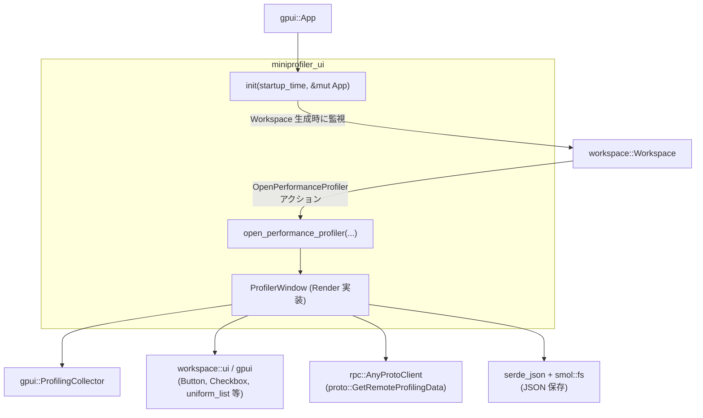
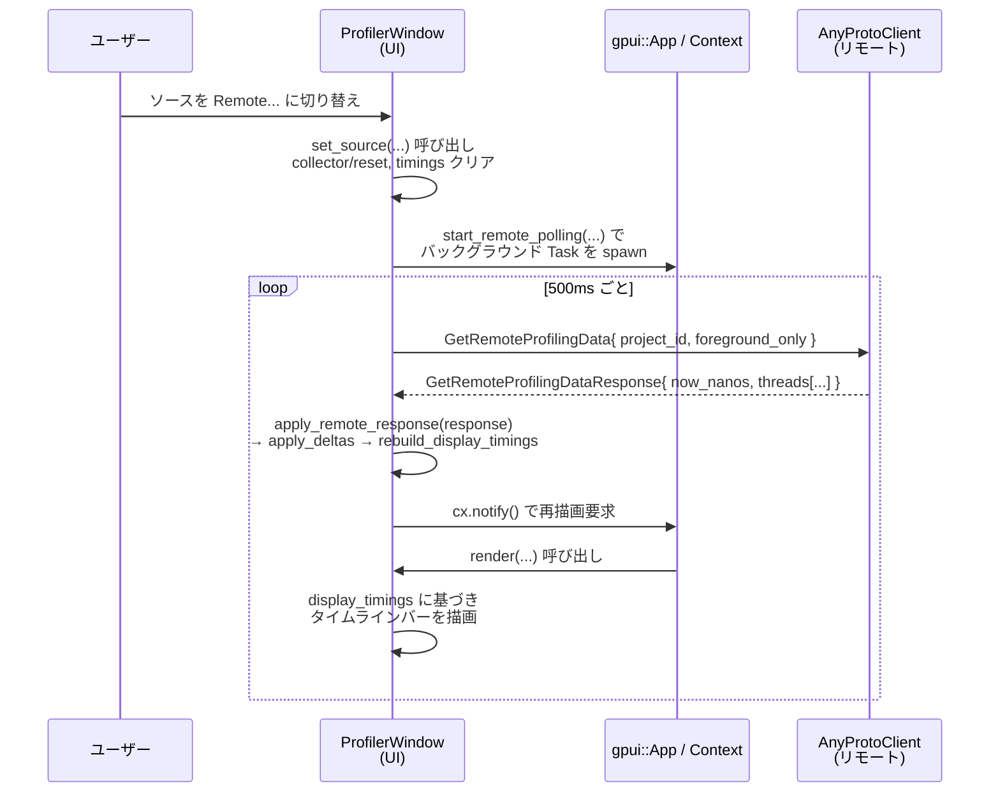

# miniprofiler_ui/

## 1. ざっくり一言

`miniprofiler_ui` クレートは、`gpui` ベースのアプリケーション向けに **パフォーマンスプロファイラ用の専用ウィンドウ** を提供するモジュールです。  
アプリ内・リモートサーバ上で計測されたタスクの実行時間を取得し、タイムライン形式のバーグラフとして表示・保存できるようにします。

---

## 2. このモジュールの役割

### 2.1 概要

- このモジュールは **アプリケーションの実行時プロファイリング結果を可視化** するために存在します。
- 主な機能は次の通りです。
  - `gpui::ProfilingCollector` や RPC を通じて取得した **スレッドごとのタスクタイミング情報** の収集
  - 最新約 10 秒分のデータを対象にした **タイムライン表示 UI の構築**
  - ローカルスレッド／全スレッド／リモートの前景・全スレッドの切り替え
  - プロファイル結果の **JSON ファイルへの保存**

### 2.2 アーキテクチャ内での位置づけ

このディレクトリには `Cargo.toml` と `src/miniprofiler_ui.rs` の 1 モジュールがあり、その中で UI・データ取得・保存までを完結させています。外部との関係は概ね次のようになります。



- `init` 関数が `gpui::App` にフックされ、`workspace::Workspace` が生成されたときに `OpenPerformanceProfiler` アクションを登録します。
- ユーザーが `OpenPerformanceProfiler` を起動すると `open_performance_profiler` が呼ばれ、`ProfilerWindow` を持つ専用ウィンドウが開きます（既にあれば再利用）。
- `ProfilerWindow` は
  - ローカル: `gpui::ProfilingCollector` を使って `foreground_executor` からスレッドタイミングを取得
  - リモート: `rpc::AnyProtoClient` を使って定期的にプロファイルデータを取得
  - UI: `workspace::ui` のコンポーネントでヘッダー・リスト・スクロールバーを描画
  - 保存: `serde_json` でのシリアライズと `smol::fs::write` による非同期書き込み
  を担っています。

### 2.3 設計上のポイント

コードから読み取れる設計上の特徴は次の通りです。

- **状態管理**
  - `ProfilerWindow` 構造体が UI 状態・取得済みタイミングデータ・リモートポーリングタスクなど **ほぼすべての状態** を保持します。
  - 状態は `gpui::Entity` として管理され、`Render` トレイト実装により再描画されます。
- **データ取得とフィルタ**
  - ローカル／リモートともに「スレッドごとのタスクタイミング列」を `SerializedTaskTiming` / `SerializedThreadTaskTimings` として保持します。
  - 表示は最新 10 秒 (`VISIBLE_WINDOW_NANOS`) のみ対象とし、1ms 未満の短いタスクや自身の UI のタイミングを除外するフィルタが用意されています。
- **エラーハンドリング方針**
  - 多くの外部呼び出し（RPC・ファイル書き込み・Workspace 読み出しなど）は `util::ResultExt::log_err()` により「ログ出力して無視」する形になっています。
  - UI の応答性を優先し、エラーでパニックせず処理継続する方針と解釈できます。
- **リモート対応**
  - `ProfileSource` でローカル／リモート・前景のみ／全スレッドの 4 種類を統一的に扱います。
  - リモート時は `start_remote_polling` がバックグラウンドタスク（`Task<()>`）として 500ms 間隔で RPC を発行します。
- **パフォーマンス配慮**
  - 1 スレッドあたり表示対象を最大 10,000 件 (`MAX_VISIBLE_PER_THREAD`) に制限。
  - K-way マージ (`kway_merge`) によりスレッドごとのソート済み列から 1 本の時系列列を構築します。
  - スクロールには `uniform_list` と `UniformListScrollHandle` を使い、表示範囲のみを描画する前提と思われます。

---

## 3. 主要な機能一覧

このモジュールが提供する主な機能を列挙します。

- **プロファイラ UI の初期化**
  - `init(startup_time, &mut App)`: Workspace 生成時に `OpenPerformanceProfiler` アクションを登録し、UI を有効化します。
- **プロファイラウィンドウの生成・再利用**
  - `open_performance_profiler`: 既存のプロファイラウィンドウがあればアクティブ化し、なければ新規ウィンドウを開きます。
- **プロファイルデータの取得**
  - ローカル前景スレッド: `gpui::foreground_executor().dispatcher().get_current_thread_timings()`
  - ローカル全スレッド: `dispatcher.get_all_timings()`
  - リモート前景／全スレッド: `rpc::AnyProtoClient` から `proto::GetRemoteProfilingData` を 500ms 間隔で取得
- **タイミングデータの管理**
  - `ProfilingCollector` により、まだ表示していない新規タスク (`ThreadTimingsDelta`) の抽出と蓄積（`timings` フィールド）を行います。
  - `visible_tail` と `filter_timings` による時間窓・長さ・ファイルに基づくフィルタリング。
  - `kway_merge` により、スレッドごとのソート済み列から 1 本の昇順列へマージ。
- **UI 表示**
  - `ProfilerWindow` の `render` 実装で、次のような UI を構築します。
    - ソース切り替えドロップダウン（Foreground / All threads / Remote ...）
    - Pause / Resume ボタン
    - Save ボタン（JSON として保存）
    - Include profiler timings チェックボックス
    - タイムラインバーリスト（`uniform_list` による仮想リスト + カスタムスクロールバー）
- **プロファイルデータの保存**
  - 表示中のタイミングを JSON 文字列にシリアライズし、ユーザー指定パスに `.miniprof.json` として非同期保存します。

---

## 4. 関数・構造体の解説

### 4.1 型一覧（構造体・列挙体など）

| 名前 | 種別 | 公開 | 役割 / 用途 |
|------|------|------|-------------|
| `ProfileSource` | 列挙体 | 非公開 | プロファイルデータの取得元（ローカル/リモート、前景のみ/全スレッド）を表します。 |
| `TimingBar` | 構造体 | 非公開 | 単一のタスクタイミングを UI 表示用にまとめたデータ（開始時刻・長さ・色・位置情報）です。 |
| `ProfilerWindow` | 構造体 | 非公開（`Entity<Self>` 経由で利用） | プロファイラウィンドウ全体の状態と UI ロジックを保持します。`Render` トレイトを実装します。 |

`ProfileSource` のバリアント:

- `Foreground`: ローカルの前景スレッドのみ。
- `AllThreads`: ローカルの全スレッド。
- `RemoteForeground`: リモートサーバの前景スレッドのみ。
- `RemoteAllThreads`: リモートサーバの全スレッド。

### 4.2 主要な関数の詳細（抜粋）

ここでは特に重要な 7 つの関数・メソッドを詳しく説明します。

#### 4.2.1 `init(startup_time: Instant, cx: &mut App)`

**概要**

- `gpui::App` の初期化時に呼び出され、`workspace::Workspace` が生成されるたびに `OpenPerformanceProfiler` アクションを登録します。
- これにより、ユーザーがアクションを実行するとプロファイラウィンドウが開けるようになります。

**引数**

| 引数名 | 型 | 説明 |
|--------|----|------|
| `startup_time` | `Instant` | アプリケーション起動時刻。`ProfilingCollector` の基準時刻として利用されます。 |
| `cx` | `&mut App` | `gpui::App` のコンテキスト。Workspace の監視やウィンドウ操作に使います。 |

**戻り値**

- なし（副作用として `App` にオブザーバーとアクション登録を行います）。

**内部処理の流れ**

1. `cx.observe_new` を使い、新しい `workspace::Workspace` が生成されたタイミングを監視します。
2. Workspace が生成されると、その `Entity` を `WeakEntity<Workspace>` として `workspace_handle` に保持します。
3. Workspace に対して `register_action` を呼び、`OpenPerformanceProfiler` アクションが発生したときに
   `open_performance_profiler(startup_time, workspace_handle.clone(), window, cx)` を実行するよう登録します。
4. `observe_new` の戻り値に対して `.detach()` を呼び、オブザーバーを独立して動作させます。

**Examples（使用例）**

`gpui::App` のセットアップ中にプロファイラを有効にする例です。

```rust
use std::time::Instant;              // Instant 型をインポートする
use gpui::App;                       // App 型をインポートする

fn setup_profiler(app: &mut App) {   // 既存のセットアップ関数の一部として定義する
    let startup_time = Instant::now(); // 実際にはプロセス起動直後の Instant を渡すのが望ましい
    miniprofiler_ui::init(startup_time, app); // プロファイラ UI を App に登録する
}
```

**Errors / Panics**

- 関数内で `unwrap` や `expect` は使用しておらず、パニック要因は直接は見当たりません。
- `observe_new` や `register_action` の内部でどのようなエラー処理が行われるかはコードからは分かりません。

**Edge cases（エッジケース）**

- `init` を複数回呼び出すと、Workspace ごとに複数のオブザーバーが登録される可能性があります。  
  ただし `observe_new` の仕様が不明のため、重複登録の扱いはコードからは分かりません。
- `startup_time` にアプリ起動から大きく離れた時刻を渡すと、後述の `now_nanos` による相対時間計算が直感的でなくなる可能性があります。

**使用上の注意点**

- `startup_time` には **アプリケーション起動直後の時刻** を渡すのが自然です。  
  そうすることで、プロファイルタスクの開始時刻が「起動から何ナノ秒後か」という統一的な基準になります。
- 通常は `gpui::App` の初期化フェーズで一度だけ呼び出す前提の設計に見えます。

---

#### 4.2.2 `open_performance_profiler(startup_time, workspace_handle, _window, cx)`

**概要**

- `OpenPerformanceProfiler` アクションにより呼ばれ、プロファイラ用ウィンドウを開きます。
- すでに `ProfilerWindow` を持つウィンドウが存在する場合はそれを再利用し、アクティブ化します。

**引数**

| 引数名 | 型 | 説明 |
|--------|----|------|
| `startup_time` | `Instant` | `ProfilerWindow::new` に渡される起動時刻。 |
| `workspace_handle` | `WeakEntity<Workspace>` | プロファイラが紐づく Workspace への弱参照。 |
| `_window` | `&mut gpui::Window` | アクション発生元のウィンドウ。関数内では使用されていません。 |
| `cx` | `&mut App` | ウィンドウ列挙・新規ウィンドウ作成に用いる `App` コンテキスト。 |

**戻り値**

- なし。副作用としてプロファイラウィンドウを開く／アクティブ化します。

**内部処理の流れ**

1. `cx.windows()` で既存のウィンドウを列挙し、`window.downcast::<ProfilerWindow>()` によって  
   既に `ProfilerWindow` を表示しているウィンドウがないか探します。
2. 見つかった場合:
   - `existing_window.update` で `profiler_window.workspace` を `Some(workspace_handle.clone())` に更新。
   - `window.activate_window()` を呼び、そのウィンドウを前面に出します。
   - エラーは `.log_err()` でログに出すのみです。
3. 見つからなかった場合:
   - テーマから `window_background` を取得し、標準サイズ `1280x720` を設定。
   - `cx.defer` で遅延処理として `cx.open_window` を呼び、新しいウィンドウを開きます。
     - `WindowOptions` にはタイトルバー・初期サイズ・位置（中央配置）などを設定。
     - ウィンドウ内容は `ProfilerWindow::new(startup_time, Some(workspace_handle), cx)` により生成されます。
   - `open_window` の結果は `.log_err()` で失敗時にログ出力します。

**Examples（使用例）**

アクションハンドラなどから直接呼び出すときのイメージです（実際には `init` がハンドラ登録を行うので、通常は手動で呼び出しません）。

```rust
use std::time::Instant;                          // Instant をインポート
use gpui::{App, Window};                         // App / Window をインポート
use workspace::Workspace;                        // Workspace 型

fn open_profiler_from_action(
    startup_time: Instant,                       // アプリ起動時刻
    workspace: gpui::WeakEntity<Workspace>,      // 対象 Workspace の WeakEntity
    window: &mut Window,                         // アクションが発生したウィンドウ
    app: &mut App,                               // App コンテキスト
) {
    miniprofiler_ui::open_performance_profiler(
        startup_time,
        workspace,
        window,
        app,
    );
}
```

※ 実際のコードでは `open_performance_profiler` は非公開関数のため、外部から直接は呼び出せません。この例は内部動作のイメージです。

**Errors / Panics**

- 既存ウィンドウの `update` や `open_window` の失敗は `.log_err()` でログに残されるだけで、パニックにはなりません。
- `downcast::<ProfilerWindow>()` が失敗しても `Option` で無視されるため、パニック要因にはなりません。

**Edge cases**

- Workspace がすでにドロップされている `WeakEntity` になっている場合でも、その情報は `ProfilerWindow` にセットされます。  
  後に `read_with` した際に失敗する可能性がありますが、そこで `.log_err()` が行われます。
- `cx.windows()` に `ProfilerWindow` を持つウィンドウが複数存在する想定はされておらず、最初に見つかった一つのみを使用します。

**使用上の注意点**

- `ProfilerWindow` は 1 つだけ存在する前提の設計になっており、再度アクションを実行しても新しいウィンドウは開かれません。

---

#### 4.2.3 `ProfilerWindow::poll_timings(&mut self, cx: &App)`

**概要**

- 現在選択されている `ProfileSource` に応じて、ローカルスレッドから最新のタイミングデータを取得し、内部状態に反映します。
- リモートソースの場合は、ここでは何も取得せず、別途 `apply_remote_response` からのデータを前提とします。

**引数**

| 引数名 | 型 | 説明 |
|--------|----|------|
| `self` | `&mut ProfilerWindow` | プロファイラ状態。`timings` や `display_timings` を更新します。 |
| `cx` | `&App` | `foreground_executor()` へのアクセスおよびリモートクライアント検出に使います。 |

**戻り値**

- なし。内部の `timings` / `display_timings` を更新します。

**内部処理の流れ**

1. `self.has_remote = self.remote_proto_client(cx).is_some();`  
   - 現在 Workspace からリモートクライアントを取得できるかどうかを調べ、`has_remote` フラグに保存します。
2. `match self.source` でソース種別ごとに処理を分岐:
   - `ProfileSource::Foreground`:
     1. `cx.foreground_executor().dispatcher()` から dispatcher を取得。
     2. `get_current_thread_timings()` で前景スレッドのタイミングを取得。
     3. `self.collector.collect_unseen(vec![current_thread])` で未処理の差分 (`ThreadTimingsDelta`) のみを抽出。
     4. `self.apply_deltas(deltas)` で `self.timings` に追加。
   - `ProfileSource::AllThreads`:
     1. 同様に dispatcher を取得。
     2. `get_all_timings()` で全スレッドのタイミングを取得。
     3. 以降は `Foreground` と同じ流れ。
   - `ProfileSource::RemoteForeground | ProfileSource::RemoteAllThreads`:
     - コメントにもある通り、ここでは何もせず、リモートポーリングタスクからの `apply_remote_response` に委ねます。
3. 最後に `self.rebuild_display_timings()` を呼び、フィルタおよびマージ済みの `display_timings` を構築します。

**Examples（使用例）**

このメソッドは通常、`Render` 実装の中から呼ばれます（外部から直接呼ぶ必要はありません）。

```rust
impl gpui::Render for ProfilerWindow {
    fn render(&mut self, window: &mut gpui::Window, cx: &mut gpui::Context<Self>)
        -> impl gpui::IntoElement
    {
        if !self.paused {
            self.poll_timings(cx.app()); // 実際のコードでは &App 相当を渡している
        }
        // 以降 UI の構築...
    }
}
```

※ 実際のコードでは `cx` 自体が `App` へのアクセスを提供しているため、この例は概念的なものです。

**Errors / Panics**

- `foreground_executor` や `get_all_timings` の内部実装は分かりませんが、このメソッド自身で `unwrap` や `expect` は使用していません。
- `self.remote_proto_client(cx)` がエラーを返した場合は `.log_err()` でログに記録され、`has_remote` は `false` になります。

**Edge cases**

- `source` がリモートの場合:
  - このメソッドは **新しいデータを追加しません**。  
    すでに `self.timings` に入っているリモートデータを元に `rebuild_display_timings` する役割のみになります。
- `timings` が空の場合:
  - `rebuild_display_timings` により `display_timings` も空のままになります。UI 上はタイムラインリストが表示されません。

**使用上の注意点**

- `render` 内で毎フレーム呼び出される設計になっているため、ここで重い処理を追加しない方が良い、という前提のように見えます。
- ローカルとリモートの処理経路が分かれているため、新しいソース種別を追加する場合はこのメソッドの分岐を更新する必要があります。

---

#### 4.2.4 `ProfilerWindow::start_remote_polling(&mut self, cx: &mut Context<Self>)`

**概要**

- リモートプロファイルソースが選択されたときに、RPC を用いた **定期ポーリングタスク** を開始します。
- 500ms 間隔で `proto::GetRemoteProfilingData` を送信し、レスポンスを `apply_remote_response` に渡します。

**引数**

| 引数名 | 型 | 説明 |
|--------|----|------|
| `self` | `&mut ProfilerWindow` | `has_remote` フラグや `_remote_poll_task` を更新します。 |
| `cx` | `&mut Context<Self>` | `weak_entity` 取得や `spawn`、タイマー起動に使うコンテキストです。 |

**戻り値**

- なし。副作用として `self._remote_poll_task` にバックグラウンドタスクを保存します。

**内部処理の流れ**

1. `let Some(proto_client) = self.remote_proto_client(cx) else { return; };`
   - Workspace から `AnyProtoClient` を取得できなければ何もせず終了します。
2. `let source_foreground_only = self.source.foreground_only();`
   - 現在のソースが「前景のみ」かどうかを bool として保存します。
3. `let weak = cx.weak_entity();`
   - 後で UI スレッド側に結果を適用するための `WeakEntity<ProfilerWindow>` を取得します。
4. `self._remote_poll_task = Some(cx.spawn(async move |_this, cx| { ... }))`
   - 非同期タスクを生成し、無名ループで次を繰り返します。
   - ループ内容:
     1. `proto_client.request(proto::GetRemoteProfilingData { ... }).await` を呼び出し。
     2. 成功 (`Ok(response)`) の場合:
        - `weak.update(&mut cx.clone(), |this, cx| { this.apply_remote_response(response); cx.notify(); });`
        - `update` がエラー（エンティティが既に破棄されている等）の場合は `break` してループ終了。
     3. エラー (`Err(error)`) の場合:
        - `Err::<(), _>(error).log_err();` によりログ出力のみ行い、ループは継続。
     4. `cx.background_executor().timer(REMOTE_POLL_INTERVAL).await;`
        - 500ms 待機してから次のループへ。

**Examples（使用例）**

通常は `set_source` の中から呼ばれます。

```rust
fn set_source(&mut self, source: ProfileSource, cx: &mut gpui::Context<Self>) {
    self.source = source;                          // ソースを切り替える
    if self.source.is_remote() {
        self.start_remote_polling(cx);             // リモート選択時のみポーリング開始
    }
}
```

**Errors / Panics**

- RPC エラーや `weak.update` のエラーはすべて `.log_err()` によりログ出力され、パニックにはなりません。
- `Task` のキャンセルタイミング等の挙動は `gpui::Task` の実装に依存するため、このコードからは分かりません。

**Edge cases**

- `source_foreground_only` は **タスク開始時点の値** をキャプチャしており、ソース切り替え後に自動更新されることはありません。  
  `set_source` ではソース非リモートに切り替えたとき `_remote_poll_task = None` にしているため、実行中のタスクがどのように中断されるかは `Task` の仕様に依存します。
- リモートクライアント取得に失敗するとポーリングは開始されませんが、その情報は `has_remote` フラグを通じて UI に反映されます。

**使用上の注意点**

- リモート API の仕様（リクエスト/レスポンス型）が変わった場合には、このメソッドおよび `apply_remote_response` を一貫して更新する必要があります。
- ポーリング間隔 `REMOTE_POLL_INTERVAL` は定数で 500ms に固定されています。変更したい場合はこの定数も含めて調整します。

---

#### 4.2.5 `impl Render for ProfilerWindow::render(...)`

**概要**

- `ProfilerWindow` の UI を構築するメインメソッドです。
- Pause 状態でなければプロファイルデータを更新し、タイムラインバーのリストを描画します。
- ヘッダーにソース選択、Pause/Resume、Save、Include Self の各コントロールを提供します。

**シグネチャ**

```rust
impl Render for ProfilerWindow {
    fn render(
        &mut self,
        window: &mut gpui::Window,
        cx: &mut gpui::Context<Self>,
    ) -> impl gpui::IntoElement
```

**引数**

| 引数名 | 型 | 説明 |
|--------|----|------|
| `self` | `&mut ProfilerWindow` | 表示状態・データを持つインスタンス。 |
| `window` | `&mut gpui::Window` | 描画対象ウィンドウ。タイトルバーやアニメーションフレームの要求に利用します。 |
| `cx` | `&mut gpui::Context<Self>` | UI ツリー構築・イベントハンドラ登録・スクロール管理などのためのコンテキスト。 |

**戻り値**

- `impl gpui::IntoElement`: `gpui` が解釈できる UI 要素ツリーを返します。

**内部処理の流れ（概要）**

1. フォントとデータ更新
   - `theme_settings::setup_ui_font(window, cx)` で UI フォントをセット。
   - `!self.paused` の場合:
     - `self.poll_timings(cx);` でプロファイルデータを更新。
     - `window.request_animation_frame();` で次フレームの再描画を要求（アニメーションループの一部）。
2. オートスクロール状態の更新
   - `scroll_handle` から現在オフセットと最大オフセットを取得。
   - 一定の閾値（下端から 24px 以内）にいる場合は `self.autoscroll = true` とし、`scroll_to_bottom` を呼びます。
   - スクロールホイールイベントが発生した場合は `autoscroll = false` にします。
3. ルートコンテナの構築
   - `v_flex()` を使い、縦方向に並ぶ UI を構築。
   - 背景色やテキスト色には現在テーマの `surface_background` / `text` を使用。
4. ヘッダーバーの構築
   - 左側 (`justify_between` 左側):
     - ソース選択ドロップダウン: `self.render_source_dropdown(window, cx)`
     - Pause/Resume ボタン:
       - ラベルは `self.paused` に応じて `"Resume"` / `"Pause"`。
       - クリック時:
         - `this.paused = !this.paused;`
         - リモート選択中に Resume: `start_remote_polling(cx)` を再開。
         - リモート選択中に Pause: `_remote_poll_task = None;` としてタスクハンドルを破棄。
     - Save ボタン:
       - Workspace がない、またはタイミングがすべて空なら何もしません。
       - `serde_json::to_string` で JSON へシリアライズし、`cx.prompt_for_new_path` で保存先をユーザーに問い合わせます。
       - `smol::fs::write` による非同期ファイル書き込みを `background_spawn` でバックグラウンド実行します。
   - 右側:
     - `Checkbox::new` により「Include profiler timings」を表示。
     - クリックで `self.include_self_timings` を更新し、`cx.notify()` で再描画を要求。
5. タイムラインリストの描画
   - `display_timings` が空でなければ `.when(!display_timings.is_empty(), ...)` 内を描画。
   - 表示窓パラメータ:
     - `now_nanos = self.now_nanos();`
     - `window_start_nanos = now_nanos.saturating_sub(VISIBLE_WINDOW_NANOS);`
     - `window_duration_nanos = VISIBLE_WINDOW_NANOS;`
   - タイムラインコンテナ:
     - `Divider::horizontal()` を挟み、`v_flex` 内に `uniform_list` を配置。
     - `uniform_list("list", display_timings.len(), move |visible_range, _, cx| { ... })`
       - `visible_range` の各インデックスについて `Self::render_timing(...)` を呼び出し、`TimingBar` を構築。
       - バーの色は `cx.theme().accents().color_for_index(location_color_index(&timing.location))` によりロケーションに依存して決まります。
     - スクロールホイールイベントで `self.autoscroll = false` にし、ユーザーによるスクロールを優先。
     - `custom_scrollbars` により縦方向のみのスクロールバーを常に表示。

**Examples（使用例）**

このメソッドは `gpui` によって自動的に呼ばれるため、通常は直接呼び出すことはありません。`Render` 実装としての役割を持つことが重要です。

```rust
// 実装側から見たイメージ（簡略化）
let profiler_window: gpui::Entity<ProfilerWindow> = ProfilerWindow::new(startup_time, workspace, app);
// app のイベントループの中で、必要に応じて profiler_window の render が呼ばれる
```

**Errors / Panics**

- 内部で `unwrap` や `expect` は使用していません。
- 各種外部操作（Workspace 読み出し、ファイルダイアログ、ファイル書き込みなど）は `.log_err()` を通じて失敗をログに記録するだけで、UI は継続動作します。

**Edge cases**

- `timings` / `display_timings` が空の場合:
  - ヘッダーバーのみが表示され、タイムライン部分は描画されません。
- Save ボタン:
  - Workspace が存在しない (`self.workspace.is_none()`) 場合は何もしません。
  - すべてのスレッドで `t.timings.is_empty()` なら何もしません（空ファイルは保存されません）。
- オートスクロール:
  - ユーザーがホイールスクロールすると `autoscroll` が false になり、手動スクロールが優先されます。
  - 一番下近くまでスクロールした状態で新たなデータが追加されると、自動的に下端まで追従します。

**使用上の注意点**

- `render` 内で I/O や重い計算を直接行わず、非同期タスクやバックグラウンドエグゼキュータにオフロードしている点が特徴です。  
  追加の機能を実装する場合も、この方針に合わせると UI の応答性を保ちやすくなります。
- Save のフォーマットは `foreground_only` の場合とそれ以外で異なります（フラットな配列 vs スレッドごとの構造体配列）。後段の解析ツールはそれを前提としておく必要があります。

---

#### 4.2.6 `visible_tail(timings: &[SerializedTaskTiming], cutoff_nanos: u128) -> &[SerializedTaskTiming]`

**概要**

- 1 スレッド分のタイミング列（ソート済み前提）から、表示対象となる「末尾部分」のスライスを返します。
- 最大 `MAX_VISIBLE_PER_THREAD` 件に制限しつつ、指定された `cutoff_nanos` より新しい（または重なっている）タイミングだけを含めます。

**引数**

| 引数名 | 型 | 説明 |
|--------|----|------|
| `timings` | `&[SerializedTaskTiming]` | スレッドの全タイミング（開始時刻昇順でソートされている前提）。 |
| `cutoff_nanos` | `u128` | これより以前に完全に終了したタスクは表示対象から外されます。 |

**戻り値**

- `&[SerializedTaskTiming]`: `timings` の末尾部分へのスライス。  
  `cutoff_nanos` 以降（またはそれにかかる）タスクのみが含まれ、件数は最大 `MAX_VISIBLE_PER_THREAD` 件です。

**内部処理の流れ**

1. `len = timings.len()`
2. `limit = len.min(MAX_VISIBLE_PER_THREAD)`
3. `search_start = len - limit`
4. `tail = &timings[search_start..]`
   - これにより、末尾最大 `MAX_VISIBLE_PER_THREAD` 件だけを対象にします。
5. `first_visible = 0`
6. `for (i, timing) in tail.iter().enumerate().rev()` で末尾から先頭方向に走査:
   - `if timing.start + timing.duration < cutoff_nanos {`
     - `first_visible = i + 1;`
     - `break;`
   - これは「cutoff より前に完全に終わっている最後の要素」の次のインデックスを求めています。
7. `&tail[first_visible..]` を返却。

**Examples（使用例）**

1 スレッド分のタイミングから、最新 10 秒分の末尾だけを得るイメージです。

```rust
use gpui::{SerializedLocation, SerializedTaskTiming, SharedString};

// 例としてダミーのタイミング列を作る
let loc = SerializedLocation {
    file: SharedString::from("src/main.rs"),
    line: 10,
    column: 5,
};

let all_timings = vec![
    SerializedTaskTiming { location: loc.clone(), start: 0, duration: 1_000_000_000 },      // 0〜1秒
    SerializedTaskTiming { location: loc.clone(), start: 9_000_000_000, duration: 2_000_000_000 }, // 9〜11秒
    SerializedTaskTiming { location: loc.clone(), start: 20_000_000_000, duration: 1_000_000_000 }, // 20〜21秒
];

let cutoff = 10_000_000_000; // 10秒
let tail = visible_tail(&all_timings, cutoff); // 10秒以降にかかる要素のみ

// この例では 9〜11秒 のタスクは 11秒までかかるため cutoff にかかり、tail に含まれます。
```

**Errors / Panics**

- `len.min(MAX_VISIBLE_PER_THREAD)` により `limit <= len` を保証しているため、`len - limit` はアンダーフローしません。
- スライスアクセスは境界を守っているため、この関数単体ではパニック要因は見当たりません。

**Edge cases**

- `timings` が空の場合:
  - `limit = 0`, `search_start = 0`, `tail = &[]` となり、最終的な戻り値も空スライスになります。
- すべてのタスクが `cutoff_nanos` より前に終わっている場合:
  - ループで最後の要素に対して条件が真になり、`first_visible = tail.len()` となるため、`&tail[tail.len()..]` すなわち空スライスが返ります。
- `timings` に `cutoff_nanos` より後の要素が大量に含まれる場合でも、`MAX_VISIBLE_PER_THREAD` 件までに制限されます。

**使用上の注意点**

- 入力 `timings` は **開始時刻でソートされている前提** です。ソートされていない場合、意図した結果にならない可能性があります。
- `cutoff_nanos` と `MAX_VISIBLE_PER_THREAD` を組み合わせることで、古いデータを段階的に「忘れていく」設計になっています。

---

#### 4.2.7 `kway_merge(lists: Vec<Vec<SerializedTaskTiming>>) -> Vec<SerializedTaskTiming>`

**概要**

- 各スレッドごとにソート済みのタスク列（開始時刻昇順）を複数受け取り、それらを 1 本の昇順列にマージします。
- 典型的な K-way マージアルゴリズムの実装です。

**引数**

| 引数名 | 型 | 説明 |
|--------|----|------|
| `lists` | `Vec<Vec<SerializedTaskTiming>>` | スレッドごとのタイミング列。各 `Vec` は `start` 昇順にソートされている前提です。 |

**戻り値**

- `Vec<SerializedTaskTiming>`: すべての入力要素を含む 1 本のソート済み列。

**内部処理の流れ**

1. `total_len` に各リストの長さの合計を算出し、`result` の容量として予約します。
2. `cursors` ベクタを作成し、各リストの現在位置を 0 で初期化します。
3. 無限ループ:
   1. `min_start = u128::MAX`, `min_list = None` で最小開始時刻を探す準備をします。
   2. `for (list_idx, list) in lists.iter().enumerate()` により全リストを走査:
      - `let cursor = cursors[list_idx];`
      - `if let Some(timing) = list.get(cursor)` により現在位置の要素があれば、
        - `if timing.start < min_start { min_start = timing.start; min_list = Some(list_idx); }`
   3. ループ終了後:
      - `Some(idx)` の場合:
        - `result.push(lists[idx][cursors[idx]].clone())`
        - `cursors[idx] += 1`
      - `None` の場合:
        - すべてのリストを走査し終えたので `break;`
4. 完成した `result` を返します。

**Examples（使用例）**

2 スレッド分のタイミングをマージする例です。

```rust
use gpui::{SerializedLocation, SerializedTaskTiming, SharedString};

let loc = SerializedLocation {
    file: SharedString::from("src/main.rs"),
    line: 1,
    column: 1,
};

let thread1 = vec![
    SerializedTaskTiming { location: loc.clone(), start: 0, duration: 1_000_000 },
    SerializedTaskTiming { location: loc.clone(), start: 3_000_000, duration: 1_000_000 },
];

let thread2 = vec![
    SerializedTaskTiming { location: loc.clone(), start: 1_000_000, duration: 1_000_000 },
    SerializedTaskTiming { location: loc.clone(), start: 2_000_000, duration: 1_000_000 },
];

let merged = kway_merge(vec![thread1, thread2]);
// merged の start は [0, 1_000_000, 2_000_000, 3_000_000] の順になる
```

**Errors / Panics**

- `lists[idx][cursors[idx]]` アクセスは、事前の `list.get(cursor)` チェックにより存在が保証されているため、パニックは発生しません。
- `lists` のすべての要素が空でも問題なく空ベクタを返します。

**Edge cases**

- `lists` 自体が空の場合:
  - 外側のループで `min_list` は常に `None` となり、即座に空の `result` が返ります。
- 1 つ以上のリストが空でも、残りのリストの要素はすべて `result` にコピーされます。
- 各リストがソートされていない場合:
  - この関数はその前提をチェックしていないため、結果の順序は保証されません。

**使用上の注意点**

- コメントにある通り「各入力 Vec は `start` によってすでにソートされている必要」があります。  
  この前提を破ると `display_timings` の表示順が時系列にならない可能性があります。
- `lists` は値所有 (`Vec<Vec<...>>`) で受け取るため、呼び出し側で再利用することはできません。必要に応じてクローンして渡す設計になっています。

---

### 4.3 その他の関数・メソッド一覧

重要度が比較的低い、または単純な補助関数を一覧でまとめます。

| 関数名 / メソッド名 | 役割（1 行） |
|---------------------|--------------|
| `ProfileSource::label` | ソース種別に対応するラベル文字列（"Foreground" など）を返します。 |
| `ProfileSource::is_remote` | リモート系ソースかどうかを判定します。 |
| `ProfileSource::foreground_only` | 前景スレッドのみのソースかどうかを判定します。 |
| `ProfilerWindow::new` | `ProfilingCollector` や各種フィールドを初期値でセットし、新しい `Entity<ProfilerWindow>` を生成します。 |
| `ProfilerWindow::rebuild_display_timings` | `visible_tail` と `filter_timings`、`kway_merge` を用いて `display_timings` を再構築します。 |
| `ProfilerWindow::now_nanos` | ローカルまたはリモートの「現在時刻（起動基準）をナノ秒」で返します。 |
| `ProfilerWindow::set_source` | プロファイルソースを切り替え、状態リセットやリモートポーリング開始/停止を行います。 |
| `ProfilerWindow::remote_proto_client` | Workspace からリモートクライアントを探し、`AnyProtoClient` を返します。 |
| `ProfilerWindow::apply_remote_response` | リモートからのレスポンスを `ThreadTimingsDelta` に変換し、`apply_deltas` と `rebuild_display_timings` を呼びます。 |
| `ProfilerWindow::apply_deltas` | `ThreadTimingsDelta` ベクタを `append_to_thread` を用いて `self.timings` に反映します。 |
| `ProfilerWindow::render_source_dropdown` | ソース選択用の `DropdownMenu` を構築し、選択時に `set_source` を呼ぶコンテキストメニューを生成します。 |
| `ProfilerWindow::render_timing` | 単一の `TimingBar` を 1 行の UI 行（ラベル + バー + ms 表示）として描画します。 |
| `filter_timings` | 指定した iterator から「1ms 以上」「self UI 以外（条件付き）」のタイミングだけを抽出します。 |
| `location_color_index` | `SerializedLocation` からハッシュ値を計算し、色選択に使うインデックスを返します。 |
| `append_to_thread` | `thread_id` ごとに `SerializedThreadTaskTimings` を追加・更新します。 |

---

## 5. データフロー

ここでは、代表的なシナリオでのデータフローを説明します。

### 5.1 リモートプロファイルデータ取得のフロー

ユーザーがプロファイルソースとして `RemoteForeground` または `RemoteAllThreads` を選択した場合の流れを示します。



要点:

- リモートソース選択時に `set_source` から `start_remote_polling` が呼ばれ、非同期ループが開始されます。
- 各レスポンスは `apply_remote_response` により
  - `self.remote_now_nanos`, `self.remote_received_at`, `self.has_remote` を更新し
  - `threads` フィールドから `ThreadTimingsDelta` を組み立てて `self.timings` にマージし
  - 最後に `rebuild_display_timings` で UI 表示用データを更新します。
- `render` は `display_timings` をコピーしてタイムラインバーを描画するだけで、リモートの I/O 自体は行いません。

### 5.2 ローカルプロファイルデータ取得のフロー

ローカルソース (`Foreground` / `AllThreads`) が選択されている場合の簡易フローです。

1. `render` が毎フレーム呼ばれる。
2. `self.paused == false` であれば `self.poll_timings(cx)` を実行。
3. `poll_timings` は `foreground_executor().dispatcher()` からタイミング情報を取得し、`ProfilingCollector::collect_unseen` を通じて差分のみを `apply_deltas` に渡す。
4. `apply_deltas` は `append_to_thread` により `self.timings` を更新。
5. `rebuild_display_timings` で
   - 各スレッドにつき `visible_tail` と `filter_timings` を適用
   - それらを `kway_merge` でマージして `display_timings` を生成。
6. `render` は `display_timings` を用いて `uniform_list` 内で各行を `render_timing` により描画します。

---

## 6. 使い方（How to Use）

### 6.1 基本的な使用方法

#### 6.1.1 アプリケーションへの組み込み

アプリケーション側では、`gpui::App` の初期化中に一度 `init` を呼び出すだけでプロファイラ UI を有効化できます。

```rust
use std::time::Instant;              // Instant 型
use gpui::App;                       // App 型

fn configure_app(app: &mut App) {    // アプリの設定処理の一部の例
    let startup_time = Instant::now(); // アプリ起動時刻を取得（実際にはもっと早いタイミングの値でもよい）
    miniprofiler_ui::init(startup_time, app); // プロファイラ UI を App に登録する
}
```

- これにより、新しく生成される `workspace::Workspace` に `OpenPerformanceProfiler` アクションが登録されます。
- ユーザーがそのアクションを実行すると、`open_performance_profiler` → `ProfilerWindow` が起動し、プロファイラウィンドウが表示されます。

#### 6.1.2 プロファイラウィンドウでの基本操作

UI の基本的な使い方は次の通りです。

- 左上のドロップダウン:
  - `Foreground`: 前景スレッドのみのローカルプロファイルを表示。
  - `All threads`: 全スレッドのローカルプロファイルを表示。
  - `Remote: Foreground` / `Remote: All threads`: リモートサーバ上のプロファイルを表示（リモートクライアントがある場合のみ）。
- `Pause` / `Resume` ボタン:
  - `Pause`: タイミング取得を止め、表示を固定します。
  - `Resume`: 再度取得を開始します。リモート選択中ならポーリングも再開します。
- `Save` ボタン:
  - 現在のプロファイルデータを JSON として保存します。
  - 保存先のパスをダイアログで選択し、`.miniprof.json` 拡張子のファイルが書き出されます。
- `Include profiler timings` チェックボックス:
  - ON: `miniprofiler_ui.rs` 自身の処理もタイムラインに含めます。
  - OFF: 自身の処理を除外し、アプリ本体の処理にフォーカスします。

---

### 6.2 よくある使用パターン

#### 6.2.1 全体負荷の確認 → 問題のある箇所の特定

1. ソースを `All threads` に切り替えます。
2. アプリで重い操作を行い、その間 `ProfilerWindow` を開いておきます。
3. タイムラインバーの長さ（ms 表示）と色（同一ファイル/ロケーションで同じ色）を見て、特に長いバーが集中している箇所を探します。
4. 左側ラベルをクリックすると `"file.rs:line:column"` 形式の文字列がクリップボードにコピーされるため、それを利用して該当箇所をエディタで開くなどの操作が可能です。

#### 6.2.2 自身のプロファイラオーバーヘッドの確認

1. 通常は `Include profiler timings` が OFF のため、プロファイラ UI 自体の処理は表示されません。
2. UI の負荷を確認したい場合は、このチェックボックスを ON にします。
3. `miniprofiler_ui.rs` ファイルに属するタスクが表示され、UI の各処理（描画周期やスクロール処理など）の負荷を確認できます。

#### 6.2.3 リモート環境での性能調査

1. 適切にリモートプロジェクトが設定された Workspace を開きます。
2. ソースドロップダウンから `Remote: Foreground` または `Remote: All threads` を選択します。
3. 数秒待つとリモートサーバからプロファイルデータが届き、ローカルと同様にタイムラインが表示されます。
4. ローカルソースと切り替えながら比較し、差分を確認することができます。

---

### 6.3 よくある間違い・使用上の注意点

#### 6.3.1 よくある間違い

```rust
// 間違い例: init を呼ばずに OpenPerformanceProfiler を使おうとしている
fn configure_app(app: &mut gpui::App) {
    // miniprofiler_ui::init(...) を呼んでいないため、
    // Workspace に OpenPerformanceProfiler アクションが登録されない
}

// 正しい例: App 初期化中に init を呼ぶ
fn configure_app(app: &mut gpui::App) {
    let startup_time = std::time::Instant::now();
    miniprofiler_ui::init(startup_time, app); // これによりアクションが登録される
}
```

```rust
// 間違い例: Include profiler timings を OFF のまま自分のコードの負荷を疑ってしまう
// → プロファイラ UI 自体の負荷が見えていない状態

// 正しい使い方:
 // 自身の UI 負荷を見たい場合はチェックボックスを ON にしてから観測する
```

#### 6.3.2 使用上の注意点（まとめ）

- **起動時刻の扱い**
  - `startup_time` はプロファイル時刻の基準になります。アプリ起動からの経過時間として意味を持たせたい場合、なるべくアプリ起動直後の値を渡すと分かりやすくなります。
- **時間窓の制限**
  - `VISIBLE_WINDOW_NANOS` により **最後の約 10 秒** だけがタイムラインに表示されます。  
    それ以前のデータは `timings` には残っていても、`visible_tail` により表示対象から外れます。
- **スレッドごとの件数制限**
  - `MAX_VISIBLE_PER_THREAD = 10_000` により、1 スレッドあたり表示するタスク件数に上限があります。極端に短いタスクが大量に発生するケースでは、古いものから順に表示対象外になります。
- **1ms 未満のタスク**
  - `filter_timings` が `t.duration / NANOS_PER_MS >= 1` でフィルタしているため、1ms 未満の短いタスクは表示されません。  
    超高速な処理のプロファイルが必要な場合は、このフィルタ条件を調整する必要があります。
- **リモート依存**
  - リモートソースは `remote_proto_client` によるクライアント取得に依存しています。  
    Workspace / プロジェクトの設定により、クライアントが取得できない場合はリモートソースのメニューが出ないか、データが常に空になります。
- **保存フォーマット**
  - `Foreground` / `RemoteForeground` の場合はフラットな `Vec<SerializedTaskTiming>` を JSON 化します。
  - `AllThreads` / `RemoteAllThreads` の場合は `Vec<SerializedThreadTaskTimings>` をそのまま JSON 化します。  
    解析ツール側では、どちらの形式も解釈できるようにしておく必要があります。

---

### 6.4 変更の仕方（概要）

このモジュールを拡張・変更する場合の入口を簡単にまとめます。

#### 6.4.1 新しい機能を追加する場合

- **UI 要素の追加**
  - ファイル: `src/miniprofiler_ui.rs`
  - セクション: `impl Render for ProfilerWindow` の `render` メソッド内。
  - 例: 新しいフィルタやタブを追加したい場合、ヘッダーバー (`h_flex().py_2().px_4() ...`) にボタンやドロップダウンを追加し、その状態は `ProfilerWindow` のフィールドとして保持します。
- **新しいプロファイルソースの追加**
  - 変更箇所:
    - `enum ProfileSource` に新しいバリアントを追加。
    - `ProfileSource::label`, `is_remote`, `foreground_only` の分岐を更新。
    - `ProfilerWindow::poll_timings` と `set_source` に新しいソース用の分岐と初期化処理を追加。
    - `render_source_dropdown` の `sources` リストを調整。
- **エクスポート形式の拡張**
  - Save ボタンのクリックハンドラ内（`Button::new("export-data", ...)`）にある
    `serde_json::to_string` 部分を変更し、例えば別形式（CSV 等）での保存を追加することも可能です。

#### 6.4.2 既存の機能を変更する場合

- **時間窓やフィルタ条件の変更**
  - 時間窓: `VISIBLE_WINDOW_NANOS` を変更。
  - 1ms フィルタ: `filter_timings` の `t.duration / NANOS_PER_MS >= 1` 条件を変更。
  - 自己プロファイル除外ルール: `filter_timings` 内の `ends_with("miniprofiler_ui.rs")` 条件を変更。
- **リモート API 変更への対応**
  - `proto::GetRemoteProfilingDataResponse` のフィールド構造が変わった場合:
    - `apply_remote_response` 内のマッピングロジック（`threads`, `timings`, `location` の扱い）を更新します。
- **UI テーマやレイアウトの変更**
  - バーの色割り当て: `location_color_index` および `cx.theme().accents().color_for_index(...)` の使用箇所を調整。
  - 行の高さやラベル幅: `render_timing` 内の `px(32.0)`, `px(200.0)` などの値を変更。

変更時は:

- `ProfilerWindow` のフィールドの意味（例えば `timings`, `display_timings` の整合性）が保たれているか、
- `poll_timings` → `rebuild_display_timings` → `render` のフローで一貫して扱えるか、

を意識して確認すると、安全に修正しやすくなります。

---

## 7. 関連ファイル

このモジュールに直接関係するファイルは次の 2 つです。

| パス | 役割 / 関係 |
|------|------------|
| `miniprofiler_ui/Cargo.toml` | クレート名・依存クレート（`gpui`, `rpc`, `workspace`, `serde_json`, `smol` など）の定義と、ライブラリエントリ (`src/miniprofiler_ui.rs`) の指定を行います。 |
| `miniprofiler_ui/src/miniprofiler_ui.rs` | 本レポートで解説した、プロファイラ UI ロジック・データ取得・保存処理のすべてを含む主要ソースファイルです。 |

他のクレート（`gpui`, `workspace`, `rpc`, `theme_settings`, `zed_actions`, `util`, `smol`, `serde_json` など）は外部依存として利用されており、本ディレクトリにはその実装は含まれていません。
