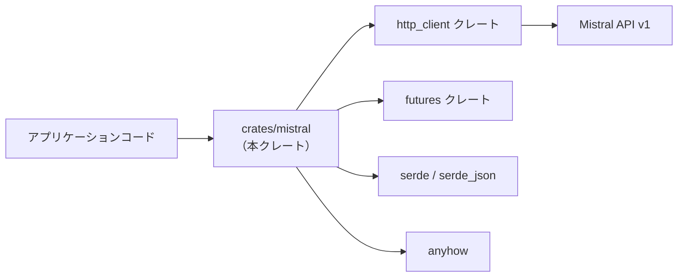
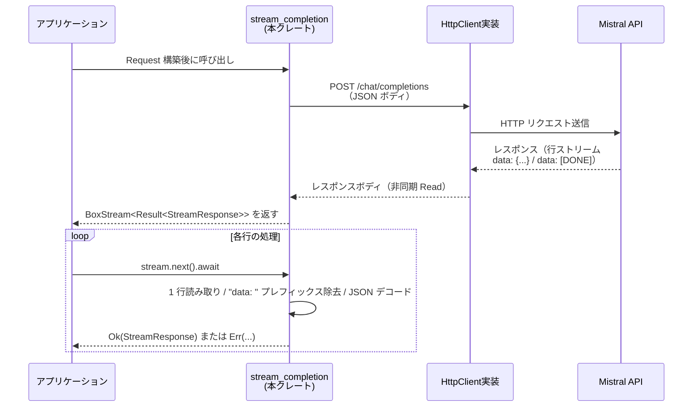

# crates/mistral ディレクトリ解説

## 1. ざっくり一言

Mistral AI の `/v1/chat/completions` エンドポイント向けに、  
リクエスト／ストリームレスポンスの型と、HTTP クライアントを使ったストリーミング呼び出し関数を提供するクレートです。

---

## 2. このモジュールの役割

### 2.1 概要

- このディレクトリ（クレート）は、Mistral API のチャット補完機能を **Rust から型安全に扱う** ためのラッパーです。
- モデル ID・メッセージ・ツール呼び出し・ストリームレスポンスを表す構造体／列挙体を定義し、
- 非同期 HTTP クライアント (`http_client` クレートの `HttpClient` トレイト) を使って **ストリーミングでトークンを受信する関数** を提供します。

### 2.2 アーキテクチャ内での位置づけ

このクレートを中心にした、主な依存関係のイメージです。



- アプリケーションは `mistral` クレートを使って `Request` などを構築し、`stream_completion` を呼び出します。
- `stream_completion` は `HttpClient` 実装に依存して HTTP リクエストを送信し、Mistral API からのレスポンスボディを `futures::io::BufReader` とストリーム (`BoxStream`) に変換します。
- JSON のシリアライズ／デシリアライズは `serde` / `serde_json`、エラーは `anyhow::Error` を用いてラップされています。

### 2.3 設計上のポイント

- **状態を持たない設計**
  - グローバル状態やクライアント構造体は定義されておらず、`stream_completion` は `&dyn HttpClient` を引数に取る純粋な関数です。
- **API スキーマに近いデータ構造**
  - `#[serde(rename_all = "...")]` や `#[serde(tag = "type")]` などの属性で、Mistral API の JSON 形式に合わせた列挙体／構造体が定義されています。
- **モデル能力のメタデータ化**
  - `Model` 列挙体には `max_token_count` や `supports_tools` など、モデルごとの能力を問い合わせるメソッドが用意されています。
- **ストリーム前提のレスポンス表現**
  - `StreamResponse` / `StreamChoice` / `StreamDelta` / `MessageContentDelta` といった、**1 行ごとのストリームチャンク** をそのまま表現する型が用意されています。
- **エラー処理**
  - HTTP ステータスコードが非成功の場合はレスポンスボディを読み取って `anyhow::bail!` で即座に失敗させ、
  - ストリーム中の I/O エラーや JSON パースエラーは、ストリーム要素ごとの `Result<StreamResponse>` として伝播します。

---

## 3. 主要な機能一覧

- **Mistral モデルの管理**:  
  `Model` 列挙体により、既知のモデル ID とカスタムモデルを表現し、ID 文字列やトークン上限・機能サポートを問い合わせできます。
- **チャットメッセージ構造の表現**:  
  `RequestMessage`, `MessageContent`, `MessagePart` で、ユーザー／システム／アシスタント／ツールの各メッセージと、テキスト・画像・thinking などのコンテンツを表現します。
- **ツール呼び出しの定義と結果の表現**:  
  `ToolDefinition`, `FunctionDefinition`, `ToolChoice`, `ToolCall` などで、関数ツールの定義と、モデルから返ってくるツール呼び出し指示を表現します。
- **チャット補完リクエストの構築**:  
  `Request` 構造体により、モデル名・メッセージ・温度・レスポンス形式・ツール設定などをまとめて JSON にシリアライズできます。
- **ストリーミングレスポンスの受信**:  
  `StreamResponse`, `StreamChoice`, `StreamDelta`, `MessageContentDelta` などで、`data: ...` 行ごとのストリームチャンクをデシリアライズして扱います。
- **ストリーミング呼び出し関数**:  
  `stream_completion` 関数により、非同期にチャット補完ストリームを開始し、`BoxStream<Result<StreamResponse>>` として利用できます。

---

## 4. 関数・構造体の解説

### 4.1 型一覧

#### リクエスト側の主な型

| 名前 | 種別 | 役割 / 用途 |
|------|------|-------------|
| `MISTRAL_API_URL` | 定数 | 既定の API ベース URL（`https://api.mistral.ai/v1`） |
| `Role` | 列挙体 | `user` / `assistant` / `system` / `tool` を表現します。ストリームレスポンスの `role` などで使用されます。 |
| `Model` | 列挙体 | 利用可能な Mistral モデル ID と `Custom` モデルを表現し、トークン上限・ツール/画像/thinking サポートなどのメタ情報を持ちます。 |
| `Request` | 構造体 | `/chat/completions` に送信するリクエストボディ。モデル名、メッセージ列、温度、ツール設定などを含みます。 |
| `RequestMessage` | 列挙体 | `assistant` / `user` / `system` / `tool` それぞれのメッセージを表現します。コンテンツやツールコール ID を持ちます。 |
| `MessageContent` | 列挙体 | メッセージ内容。単一テキスト（`Plain`）または複数パート（`Multipart`）を表現します。 |
| `MessagePart` | 列挙体 | メッセージの 1 パート。テキスト・画像 URL・thinking 部分などを表現します。 |
| `ContentPart` | 型エイリアス | `MessagePart` の別名（後方互換のため）。 |
| `ThinkingPart` | 列挙体 | thinking コンテンツの 1 パート。現在はテキストのみです。 |
| `StreamOptions` | 構造体 | ストリーミング固有のオプション。現状は `stream_tool_calls` のみを保持します。 |
| `ResponseFormat` | 列挙体 | モデルからのレスポンス形式（通常テキスト or JSON オブジェクト）。 |
| `ToolDefinition` | 列挙体 | 使用可能なツールの定義。現状は `Function` ツールのみ。 |
| `FunctionDefinition` | 構造体 | 関数ツールの名前・説明・パラメータ（JSON Schema 相当）を保持します。 |
| `ToolChoice` | 列挙体 | ツール使用ポリシー（自動／必須／使用禁止／任意／特定ツール指定）を表現します。 |

`Request` のフィールドには `skip_serializing_if` が多用されており、`None` や空のベクタは JSON から省略されます。  
これは「指定した項目だけを API に送る」という挙動に対応しています。

#### レスポンス側の主な型

| 名前 | 種別 | 役割 / 用途 |
|------|------|-------------|
| `Usage` | 構造体 | `prompt_tokens` / `completion_tokens` / `total_tokens` を保持します。ストリームの一部または最後で返ることがあります。 |
| `StreamResponse` | 構造体 | 1 行分のストリームレスポンス（`data: {...}`）を表現します。`choices` や `usage` を含みます。 |
| `StreamChoice` | 構造体 | ある選択肢（`index`）のチャンク。`delta` と `finish_reason` を持ちます。 |
| `StreamDelta` | 構造体 | 追加された役割・コンテンツ・ツールコールの差分を表現します。 |
| `MessageContentDelta` | 列挙体 | ストリーム中のコンテンツ差分。単純テキスト（`Text`）か、`MessagePart` の配列（`Parts`）です。 |
| `ToolCall` | 構造体 | モデルから返るツール呼び出し指示の 1 件分。ID と内容を持ちます。 |
| `ToolCallContent` | 列挙体 | 現状は `Function` 呼び出しのみをサポートします。 |
| `FunctionContent` | 構造体 | 実際に呼び出す関数名と、JSON 文字列の引数を保持します。 |
| `ToolCallChunk` | 構造体 | ストリーム中のツールコール差分。どのツール（`index`）かと、ID・内容の部分更新を表現します。 |
| `FunctionChunk` | 構造体 | 関数名・引数文字列の部分更新用オブジェクトです。 |

---

### 4.2 重要な関数

ここでは特に利用頻度が高い／挙動を理解しておきたい関数を詳しく説明します。

#### `MessageContent::push_part(&mut self, part: MessagePart)`

**概要**

- メッセージ内容 (`MessageContent`) に対して、新しいパート（テキスト／画像／thinking）を追記します。
- 元がプレーンテキストか複数パートかに応じて、自動的に `Plain` ⇔ `Multipart` を切り替えます。

**引数**

| 引数名 | 型 | 説明 |
|--------|----|------|
| `self` | `&mut MessageContent` | 追記対象のメッセージ内容。内部で形態が書き換わる可能性があります。 |
| `part` | `MessagePart` | 追加する 1 パート（`Text` / `ImageUrl` / `Thinking`） |

**戻り値**

- なし（`()`）。`self` が就地（インプレース）で更新されます。

**内部処理の流れ**

1. `self` が `Plain { content }` か `Multipart { content }` かで分岐します。
2. `Plain` の場合:
   - 追加パートが `MessagePart::Text { text }` なら、既存の文字列 `content` にそのまま連結します。
   - `Text` 以外（画像・thinking）の場合:
     - 既存 `content` が空文字列なら、空の `Vec<MessagePart>` を作ります。
     - 空でなければ、既存テキストを `MessagePart::Text { text: content.clone() }` として 1 パートに変換し、ベクタに入れます。
     - そのベクタに新しいパートを `push` し、`self` を `Multipart { content: parts }` に差し替えます。
3. `Multipart` の場合:
   - 単に `content` ベクタに `part` を `push` します。

**Examples（使用例）**

シンプルなテキスト追記の例です。

```rust
use mistral::{MessageContent, MessagePart}; // このクレート内の型

fn build_content() -> MessageContent {
    let mut content = MessageContent::empty(); // 空の Plain("") を生成

    content.push_part(MessagePart::Text {
        text: "Hello".to_string(),
    }); // content: Plain("Hello")

    content.push_part(MessagePart::Text {
        text: ", world!".to_string(),
    }); // content: Plain("Hello, world!")

    content
}
```

テキストから画像付きのマルチパートに昇格する例です。

```rust
use mistral::{MessageContent, MessagePart};

fn build_multipart() -> MessageContent {
    let mut content = MessageContent::empty(); // Plain("")

    content.push_part(MessagePart::Text {
        text: "Describe this image: ".to_string(),
    }); // Plain("Describe this image: ")

    content.push_part(MessagePart::ImageUrl {
        image_url: "https://example.com/image.png".to_string(),
    });
    // ここで Plain から Multipart に変換される
    // Multipart([
    //   Text { "Describe this image: " },
    //   ImageUrl { "https://example.com/image.png" }
    // ])

    content
}
```

**Errors / Panics**

- この関数自身は `Result` を返さず、内部でも `panic!` を呼びません。
- 文字列操作のみのため、通常の使用でパニックになる条件は見当たりません。

**Edge cases（エッジケース）**

- もともと `Plain` で `content` が空文字のときに画像や thinking を追加すると、最初の `Text` パートは作られず、新しいパートだけを含む `Multipart` になります。
- `Multipart` にテキストを続けて追加すると、テキストパートがベクタにそのまま追加され、1 つの文字列には連結されません（パート単位の扱いになります）。

**使用上の注意点**

- 「テキストだけを 1 本の文字列として扱いたい」のか、「構造化されたパート（テキスト＋画像など）として扱いたい」のかに応じて、`Plain`／`Multipart` のどちらになるかを意識する必要があります。
- すでに `Multipart` になったコンテンツを `Plain` に戻す処理はこの型にはありません。その場合は呼び出し側で結合などを行う必要があります。

---

#### `stream_completion(

    client: &dyn HttpClient,
    api_url: &str,
    api_key: &str,
    request: Request,
    affinity: Option<String>,
) -> Result<BoxStream<'static, Result<StreamResponse>>>`

**概要**

- Mistral の `/chat/completions` エンドポイントに POST し、
- レスポンスボディを行単位 (`data: ...`) のストリームとして読みながら、各行を `StreamResponse` にデシリアライズして返す非同期関数です。
- 戻り値は `BoxStream<Result<StreamResponse>>` で、各チャンクごとに I/O エラーや JSON パースエラーが `Err` として流れてきます。

**引数**

| 引数名 | 型 | 説明 |
|--------|----|------|
| `client` | `&dyn HttpClient` | `http_client` クレートが提供する HTTP クライアントのトレイトオブジェクト。実際の実装は別クレートに依存します。 |
| `api_url` | `&str` | ベース URL。通常は `MISTRAL_API_URL` を指定しますが、エンドポイントの差し替えも可能です。 |
| `api_key` | `&str` | Mistral API の Bearer トークン。`trim()` されてからヘッダに挿入されます。 |
| `request` | `Request` | 送信するチャット補完リクエスト。呼び出し側で JSON シリアライズに適した形に構築します。 |
| `affinity` | `Option<String>` | 存在する場合、`x-affinity` HTTP ヘッダとして送信される値です。 |

**戻り値**

- `Result<BoxStream<'static, Result<StreamResponse>>>`
  - 外側の `Result`:
    - HTTP リクエストの構築・送信やステータスチェックで発生したエラーを表します（`async fn` の `await` 時に返る）。
  - 内側の `Result<StreamResponse>`:
    - ストリームの各要素で、1 行分の JSON を `StreamResponse` にデシリアライズした結果か、行読み取り／パースのエラーです。

**内部処理の流れ**

1. `api_url` と `"/chat/completions"` からリクエスト URI を組み立てます。
2. `HttpRequest::builder()` を使い、以下を設定します。
   - `Method::POST`
   - `Content-Type: application/json`
   - `Authorization: Bearer {api_key.trim()}`
   - `affinity` が `Some` の場合は `x-affinity` ヘッダも追加（`when_some` 拡張メソッドを利用）。
3. `request` を `serde_json::to_string` で JSON 文字列にシリアライズし、`AsyncBody::from(...)` に包んで HTTP リクエストボディに設定します。
4. `client.send(request).await?` で HTTP リクエストを送信し、レスポンスを受け取ります。
5. ステータスコードが成功 (`2xx`) の場合:
   - レスポンスボディを `BufReader::new(response.into_body())` でラップし、
   - `reader.lines()` により非同期で 1 行ずつ読み取るストリームを生成します。
   - 各行に対して以下の処理を行う `filter_map` を適用します。
     1. 行読み取りが `Err(e)` の場合は `Some(Err(anyhow!(e)))` を返す（ストリーム要素としてエラーを流す）。
     2. `Ok(line)` の場合は `"data: "` プレフィックスを `strip_prefix` で取り除きます。プレフィックスがない行は `None` を返してスキップされます。
     3. プレフィックス後の内容が `"[DONE]"` の場合は `None` を返してスキップ（終了通知として扱うが、ループ自体は行ストリームが終わるまで続きます）。
     4. それ以外の文字列を `serde_json::from_str::<StreamResponse>` でパースし、成功なら `Some(Ok(response))`、失敗なら `Some(Err(anyhow!(error)))` として返します。
   - 以上のストリームを `.boxed()` して `BoxStream` に変換し、`Ok(...)` で返します。
6. ステータスコードが非成功 (`!is_success()`) の場合:
   - `response.body_mut().read_to_string(&mut body).await?` でボディ内容を文字列に読み取り、
   - `"Failed to connect to Mistral API: {status} {body}"` というメッセージで `anyhow::bail!` します。

**Examples（使用例）**

もっとも基本的な使用例です（`client` は何らかの `HttpClient` 実装が用意されていると仮定します）。

```rust
use anyhow::Result;                                   // エラー型のため
use futures::StreamExt;                               // stream.next() のため
use http_client::HttpClient;                          // トレイト
use mistral::{
    MISTRAL_API_URL,                                  // 既定の URL
    Model,                                            // モデル列挙体
    Request, RequestMessage, MessageContent,          // リクエスト関連型
    stream_completion,                                // 本関数
};

async fn run_chat(client: &dyn HttpClient) -> Result<()> {
    // モデル ID を Model 列挙体から取得し、String にする
    let model_id = Model::MistralSmallLatest.id().to_string();

    // 単純なユーザーメッセージ 1 件を含むリクエストを構築
    let request = Request {
        model: model_id,
        messages: vec![
            RequestMessage::User {
                content: MessageContent::Plain {
                    content: "Hello, Mistral!".to_string(),
                },
            },
        ],
        stream: true,                 // ストリーミングを利用するかどうか（API 仕様に応じて設定）
        stream_options: None,
        max_tokens: None,
        temperature: Some(0.7),
        response_format: None,
        tool_choice: None,
        parallel_tool_calls: None,
        tools: Vec::new(),
    };

    // ストリームを開始
    let mut stream = stream_completion(
        client,
        MISTRAL_API_URL,
        "YOUR_API_KEY_HERE",
        request,
        None,                         // affinity ヘッダなし
    ).await?;                         // HTTP 送信エラーなどがあればここで Err

    // 1 行ずつ（1 チャンクずつ）読み取る
    while let Some(item) = stream.next().await {
        match item {
            Ok(chunk) => {
                // chunk.choices[n].delta.content などを参照して部分テキストを取り出せる
                println!("{chunk:?}");
            }
            Err(e) => {
                // ストリーム途中の I/O / JSON パースエラー
                eprintln!("stream error: {e}");
                break;
            }
        }
    }

    Ok(())
}
```

**Errors / Panics**

- **外側の `Result` が `Err` になる条件**
  - リクエストのビルド失敗（ヘッダ設定やボディ生成に失敗した場合）。
  - `client.send(request).await` がエラーを返した場合。
  - HTTP ステータスが非成功で、エラーボディを読み取ったあとに `anyhow::bail!` した場合。
- **ストリーム要素の `Err` になる条件**
  - `reader.lines()` での行読み取りに失敗したとき（I/O エラーなど）。
  - 行を `StreamResponse` に `serde_json::from_str` する際にパースエラーが発生したとき。
- `panic!` を直接呼んでいる箇所はありません。

**Edge cases（エッジケース）**

- `"data: "` プレフィックスのない行は `strip_prefix` により `None` となり、`filter_map` によって完全に無視されます。
  - HTTP レスポンスに空行やコメント行が混ざっていても、チャンクとしては流れてきません。
- `"[DONE]"` 行も同様に `None` になり、ストリームに現れません。
  - ストリームの終了検出は、実際には下層の行ストリームが終端に達するタイミングに依存します。
- `stream: bool` フィールドの値によらず、この関数は単にレスポンスボディを「行ストリーム」として扱います。
  - そのため、Mistral API 側の仕様に沿って `Request.stream` を正しく設定する必要があります。

**使用上の注意点**

- 戻り値が二重の `Result` になっているため、**開始時のエラー** と **ストリーム途中のエラー** を分けて扱う必要があります。
- `api_key` はそのまま `"Bearer {key.trim()}"` として送信されるため、空文字やスペースのみにならないことを呼び出し側で確認しておくと安全です。
- モデル名 (`request.model`) は文字列で渡す仕様なので、`Model` 列挙体の `id()` を通じて値を得ると、タイポを防ぎやすくなります。

---

### 4.3 その他の主な関数・メソッド

| 関数名 | 役割（1 行） |
|--------|--------------|
| `Model::default_fast()` | 「高速な既定モデル」として `MistralSmallLatest` を返します。 |
| `Model::from_id(id: &str) -> Result<Model>` | 既知のモデル ID 文字列から `Model` 列挙体に変換します。未知の ID は `Err` を返します。 |
| `Model::id(&self) -> &str` | 列挙体の各バリアントに対応するモデル ID 文字列を返します。`Custom` の場合は `name` を返します。 |
| `Model::display_name(&self) -> &str` | UI 向けの表示名を返します。`Custom` では `display_name` があればそれを、なければ `name` を使います。 |
| `Model::max_token_count(&self) -> u64` | モデルごとの最大トークン数（コンテキスト長）を返します。`Custom` ではフィールド値をそのまま返します。 |
| `Model::max_output_tokens(&self) -> Option<u64>` | 出力トークン数の上限を返します。現状、`Custom` の場合のみ `Some` が返されます。 |
| `Model::supports_tools(&self) -> bool` | ツール呼び出しをサポートするモデルかどうかを返します。`Custom` はフィールド値に基づきます。 |
| `Model::supports_images(&self) -> bool` | 画像入力をサポートするモデルかどうかを返します。`Custom` はフィールド値に基づきます。 |
| `Model::supports_thinking(&self) -> bool` | thinking 機能をサポートするモデルかどうかを返します。`Magistral*` と `Custom` の一部で `true` になりえます。 |
| `MessageContent::empty() -> MessageContent` | 空のプレーンテキスト (`Plain { content: "" }`) を生成します。 |
| 実装 `TryFrom<String> for Role` | `"user"` などの文字列から `Role` に変換します。未知の文字列は `Err` になります。 |
| 実装 `From<Role> for String` | `Role` から小文字の文字列（`"user"` など）に変換します。 |

---

## 5. データフロー

ここでは、`Request` を投げて `StreamResponse` を順次受信する、典型的なフローを説明します。

1. アプリケーションコードが、`Model` や `RequestMessage` を使って `Request` を構築します。
2. `stream_completion` に `HttpClient` 実装・API キー・`Request` を渡して、レスポンスストリームを開始します。
3. 関数内部で HTTP POST が行われ、Mistral API はイベントストリーム形式で `data: {...}` 行を返します。
4. 各行は `StreamResponse` にデシリアライズされ、`BoxStream<Result<StreamResponse>>` としてアプリケーション側へ届けられます。
5. アプリケーションは `StreamResponse.choices[*].delta.content` や `tool_calls` を読み取り、表示やツール実行に利用します。

これをシーケンス図で表すと、次のようになります。



---

## 6. 使い方（How to Use）

### 6.1 基本的な使用方法

最も単純な、「テキストのみのユーザーメッセージをストリーミングで送信する」例です。

```rust
use anyhow::Result;                                   // エラー型
use futures::StreamExt;                               // stream.next() を使うため
use http_client::HttpClient;                          // HTTP クライアントのトレイト
use mistral::{
    MISTRAL_API_URL,                                  // API ベース URL
    Model,                                            // モデル列挙体
    Request, RequestMessage, MessageContent,          // リクエスト関連型
    stream_completion,                                // ストリーミング呼び出し関数
};

async fn simple_chat(client: &dyn HttpClient) -> Result<()> {
    // 1. モデル ID を Model 列挙体から取得する
    let model_id = Model::MistralSmallLatest.id().to_string(); // "mistral-small-latest"

    // 2. ユーザーメッセージを 1 件含む Request を作る
    let request = Request {
        model: model_id,                              // モデル ID 文字列
        messages: vec![
            RequestMessage::User {
                content: MessageContent::Plain {
                    content: "Say hello in Japanese.".to_string(),
                },
            },
        ],
        stream: true,                                 // ストリーミングを有効化（API 仕様に合わせて設定）
        stream_options: None,                         // 特別なストリームオプションなし
        max_tokens: None,                             // 上限トークン数を API 既定に任せる
        temperature: Some(0.2),                       // 低めの温度（決定的な応答寄り）
        response_format: None,                        // テキスト形式
        tool_choice: None,                            // ツールは使わない
        parallel_tool_calls: None,
        tools: Vec::new(),                            // ツール定義なし
    };

    // 3. ストリームを開始する
    let mut stream = stream_completion(
        client,
        MISTRAL_API_URL,
        "YOUR_API_KEY_HERE",
        request,
        None,                                         // affinity ヘッダなし
    ).await?;                                         // HTTP エラー時はここで Err

    // 4. ストリームからチャンクを順次受け取る
    while let Some(item) = stream.next().await {
        match item {
            Ok(chunk) => {
                // 実際のテキストは chunk.choices[*].delta.content に入る
                println!("{chunk:?}");
            }
            Err(e) => {
                eprintln!("stream error: {e}");
                break;
            }
        }
    }

    Ok(())
}
```

### 6.2 よくある使用パターン

#### 画像付きメッセージを送る

`MessagePart::ImageUrl` を使うことで、テキスト＋画像 URL のマルチパートメッセージを構成できます。

```rust
use mistral::{Request, RequestMessage, MessageContent, MessagePart, Model};

fn build_image_request() -> Request {
    let mut content = MessageContent::empty();            // Plain("")

    // 説明テキストを追加
    content.push_part(MessagePart::Text {
        text: "Describe this image: ".to_string(),
    });

    // 画像 URL を追加（ここで Multipart に変換される）
    content.push_part(MessagePart::ImageUrl {
        image_url: "https://example.com/cat.png".to_string(),
    });

    Request {
        model: Model::PixtralLargeLatest.id().to_string(), // 画像サポートがあるモデルを選ぶ
        messages: vec![RequestMessage::User { content }],
        stream: true,
        stream_options: None,
        max_tokens: None,
        temperature: Some(0.5),
        response_format: None,
        tool_choice: None,
        parallel_tool_calls: None,
        tools: Vec::new(),
    }
}
```

実際にモデルが画像入力をサポートしているかどうかは、`Model::supports_images()` で確認できます。

#### ツール定義を含める

関数ツールを 1 つ定義し、自動ツール選択を有効にしたリクエストの例です（パラメータ定義は簡略化しています）。

```rust
use serde_json::json;                                   // JSON 値を組み立てるヘルパ
use mistral::{
    Request, RequestMessage, MessageContent,
    ToolDefinition, FunctionDefinition, ToolChoice,
    Model,
};

fn build_tool_request() -> Request {
    // ツール定義（関数）
    let tool = ToolDefinition::Function {
        function: FunctionDefinition {
            name: "get_weather".to_string(),
            description: Some("Get the current weather for a city.".to_string()),
            parameters: Some(json!({
                "type": "object",
                "properties": {
                    "city": { "type": "string" }
                },
                "required": ["city"]
            })),
        },
    };

    Request {
        model: Model::MistralMediumLatest.id().to_string(),
        messages: vec![
            RequestMessage::User {
                content: MessageContent::Plain {
                    content: "What's the weather in Paris?".to_string(),
                },
            },
        ],
        stream: true,
        stream_options: None,
        max_tokens: None,
        temperature: Some(0.7),
        response_format: None,
        tool_choice: Some(ToolChoice::Auto),            // ツール自動選択
        parallel_tool_calls: Some(true),                // 必要なら並列ツール呼び出し
        tools: vec![tool],                              // 使用可能なツール一覧
    }
}
```

モデルがツールをサポートしているかは `Model::supports_tools()` で確認できます。

### 6.3 使用上の注意点

- **モデルごとの機能差に注意**
  - 画像・ツール・thinking などはモデルによってサポート状況が違います。コード上では `Model::supports_images()` / `supports_tools()` / `supports_thinking()` で判別できるようになっています。
- **`Request.stream` の設定**
  - このクレートはストリーム前提のレスポンス処理を行いますが、「ストリームを返すかどうか」は Mistral API の仕様（`Request.stream`）に依存します。API ドキュメントに従ってフラグを設定する必要があります。
- **エラー処理の二段構造**
  - `stream_completion(...).await` の失敗と、ストリームから取り出す各要素の失敗は別物です。両方を適切にハンドリングしないと、途中のエラーを見落とす可能性があります。
- **未使用フィールドの存在**
  - 例えば `Model::Custom` の `max_completion_tokens` フィールドなど、このファイル内では直接参照されていないメタ情報があります。利用する場合は呼び出し側で意味付けを行う必要があります。
- **HTTP クライアント実装への依存**
  - 実際にどのような接続設定（タイムアウトなど）で HTTP 通信が行われるかは、`HttpClient` の実装に依存します。このクレート側では制御していません。

---

## 7. 関連ファイル

| パス | 役割 / 関係 |
|------|------------|
| `mistral/Cargo.toml` | クレート名・バージョン・ライセンス・依存クレートを定義します。ライブラリのエントリポイントとして `src/mistral.rs` を指定し、`schemars` 機能をオプションとして提供しています。 |
| `mistral/src/mistral.rs` | 本クレートの実装本体。モデル列挙体、リクエスト／レスポンス用のすべての型、および `stream_completion` 関数が定義されています。 |

このバッチにはテストコードや追加モジュールは含まれていないため、挙動の確認や拡張はここに示した 2 ファイルを起点に行うことになります。
