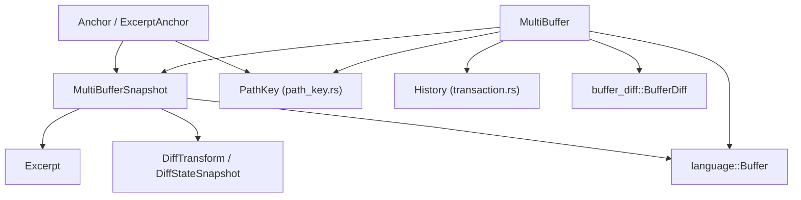
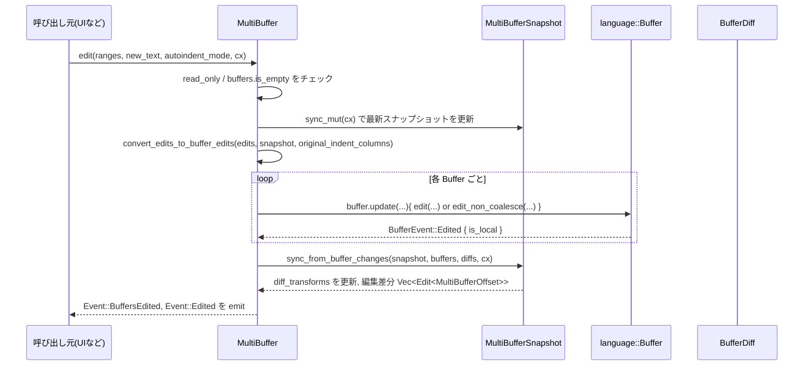

## 1. ざっくり一言

`multi_buffer` クレートは、複数の `Buffer`（ファイルやテキストバッファ）から指定した範囲（Excerpt）を抜き出し、ひとつの仮想テキストとして編集・表示・差分表示するための中核モジュール群です。  
アンカー（`Anchor`）を使って編集に強い位置表現を提供し、差分（`BufferDiff`）との統合やインデントガイドなど、エディタ表示に必要な情報をまとめて扱えるようにしています。

---

## 2. このモジュールの役割

### 2.1 概要

- このディレクトリは、Zed エディタにおける「マルチバッファビュー」を実装します。
- 複数の `language::Buffer` から任意範囲を `Excerpt` として抜き出し、1 つの `MultiBuffer` として扱えるようにします。
- `BufferDiff` と組み合わせて、削除行を含む差分ビューを構築し、行ごとのステータスやハイライト領域を計算します。
- `Anchor` により編集後も安定して参照できる位置表現を提供し、座標変換（バッファ ⇔ マルチバッファ、UTF‑8 ⇔ UTF‑16, Point ⇔ Offset）を一括管理します。

### 2.2 アーキテクチャ内での位置づけ

このディレクトリ内と周辺モジュールの主な依存関係は次のようになっています。



- `multi_buffer.rs`  
  - `MultiBuffer` 本体、`MultiBufferSnapshot`、`Excerpt`・`DiffTransform` など、全体のコア実装。
- `anchor.rs`  
  - `Anchor`／`ExcerptAnchor` とその比較・座標変換ロジック。
- `path_key.rs`（定義はこのチャンク外）  
  - `PathKey` 型を提供し、複数バッファの「ソートキー（パス・論理名）」として利用されます。
- `transaction.rs`（定義はこのチャンク外）  
  - `History` 型を提供し、マルチバッファレベルの undo/redo グルーピングを行います。

### 2.3 設計上のポイント

コードから読み取れる設計上の特徴をまとめます。

- **スナップショット指向**
  - `MultiBuffer` は内部に `RefCell<MultiBufferSnapshot>` を保持し、`snapshot(&App)` 呼び出し時に基底バッファの変更を取り込んでからクローンを返します。
  - 読み取り系 API は `MultiBufferSnapshot` 上に集約され、編集系は `MultiBuffer` 経由で行う構造になっています。

- **複数の座標系を明示的に区別**
  - 単一バッファ用オフセット: `BufferOffset` / `BufferOffsetUtf16`
  - マルチバッファ用オフセット: `MultiBufferOffset` / `MultiBufferOffsetUtf16`
  - 行・列座標: `Point` / `PointUtf16` / `MultiBufferRow`
  - これらを抽象化するトレイトとして `MultiBufferDimension`・`ToOffset`・`ToPoint` が定義されています。

- **Excerpt 空間と表示空間を SumTree で管理**
  - 抜粋テキスト（`Excerpt`）は `SumTree<Excerpt>` として管理され、長さや最長行などのメタ情報をサマリとして保持します。
  - 差分表示のために、Excerpt 空間 → 表示空間の変換を `SumTree<DiffTransform>` で表現し、削除ハンクなどを挿入しています。

- **編集に強いアンカー**
  - `text::Anchor` をベースにした `Anchor` / `ExcerptAnchor` により、編集後も安定して位置比較や変換ができるようになっています。
  - diff ベース側の位置を保持する `diff_base_anchor` を保持でき、削除行の位置付けにも利用されています。

- **イベント駆動**
  - `MultiBuffer` は `EventEmitter<Event>` を実装し、編集・diff 変更・言語変更などのタイミングで UI にイベントを発火します。
  - `buffer_diff::BufferDiff` や各 `Buffer` からのイベントを購読し、`buffer_changed_since_sync` フラグを立てて遅延同期します。

---

## 3. 主要な機能一覧

- 複数バッファの統合:
  - 複数の `Buffer` の一部範囲（`ExcerptRange`）を抜き出し、1つの連続したテキストとして扱う。
- アンカーによる位置表現:
  - `Anchor` を使って、編集後も有効な位置・範囲を表現・比較・変換する。
- 差分（diff）と統合したビュー:
  - `BufferDiff` を追加して、追加／削除／変更行や単語レベル diff の情報を `MultiBufferDiffHunk` として取得。
  - 削除ハンクの展開・折りたたみ、拡張 diff 範囲の利用など。
- 編集:
  - マルチバッファ全体に対して範囲編集を行い、内部で各 `Buffer` への編集に変換。
  - ブロックオートインデント（`AutoindentMode::Block`）をサポート。
- 座標変換:
  - `point_to_offset` / `offset_to_point` / UTF‑16 版など、バッファ・マルチバッファ間の座標変換。
  - `range_to_buffer_ranges` / `range_to_buffer_range` による MultiBuffer ⇔ Buffer の範囲変換。
- 行情報・インデント・言語情報:
  - `row_infos` による行ごとのバッファ行・diff ステータス・Excerpt 拡張情報の取得。
  - インデントサイズ・インデントガイド・言語設定（`LanguageSettings`）の問い合わせ。
- シンタックス情報・テキストオブジェクト:
  - 診断（Diagnostics）、アウトライン、テキストオブジェクト、括弧範囲などを MultiBuffer 座標で取得。
- Undo/Redo ヒストリ統合:
  - `History` と各 `Buffer` のヒストリを組み合わせたマルチバッファレベルのグルーピング（詳細実装は `transaction.rs` 側）。

---

## 4. 関数・構造体の解説

### 4.1 型一覧（主な構造体・列挙体など）

| 名前 | 種別 | 役割 / 用途 |
|------|------|-------------|
| `MultiBuffer` | 構造体 | 複数の `Buffer` をまとめた編集・表示単位。編集 API や diff 管理、イベント発火を担当します。 |
| `MultiBufferSnapshot` | 構造体 | ある時点の `MultiBuffer` の不変スナップショット。読み取り専用 API（テキスト取得・座標変換など）はここにまとまります。 |
| `Anchor` | 列挙体 | `MultiBuffer` 内の位置を表すアンカー。`Min` / `Excerpt(ExcerptAnchor)` / `Max` の3種があります。 |
| `ExcerptAnchor` | 構造体 | 特定の `Excerpt` 内の `text::Anchor` と、その `PathKeyIndex` を保持します。 |
| `MultiBufferRow` | 構造体 | マルチバッファの行番号（`u32` のラッパー）。 |
| `MultiBufferOffset` | 構造体 | マルチバッファ内の UTF‑8 バイトオフセット。 |
| `MultiBufferOffsetUtf16` | 構造体 | マルチバッファ内の UTF‑16 オフセット。 |
| `BufferOffset` / `BufferOffsetUtf16` | 構造体 | 単一 `Buffer` 内のオフセット表現。`TextDimension` を実装し SumTree と連携します。 |
| `ExcerptRange<T>` | 構造体 | 単一バッファ内の範囲（`context` と `primary`）を表現。Excerpt の表示範囲とハイライト範囲を区別します。 |
| `Excerpt` | 構造体（crate 内部） | `Buffer` の一部スライス。`ExcerptRange<text::Anchor>` とテキストの `TextSummary` を保持します。 |
| `Event` | 列挙体 | `MultiBuffer` から UI に対して発火されるイベント（編集、言語変更、diff 変更など）。 |
| `MultiBufferDiffHunk` | 構造体 | マルチバッファ上のひとつの diff ハンク（行範囲、元バッファ範囲、diff ベース範囲、ステータス、単語差分など）。 |
| `RowInfo` | 構造体 | `row_infos` が返す 1 行分のメタ情報（対応するバッファ行・diff ステータス・拡張候補など）。 |
| `ExpandInfo` | 構造体 | Excerpt を上下どちらに拡張可能かを表す情報。 |
| `IndentGuide` | 構造体 | インデントガイド 1 本の情報（開始行・終了行・深さなど）。 |
| `ExcerptBoundaryInfo` / `ExcerptBoundary` | 構造体 | Excerpt と Excerpt の境界位置と、その前後の範囲に関するメタ情報。 |
| `MultiBufferRows<'a>` | 構造体 | `row_infos` 用のイテレータ。 |
| `MultiBufferChunks<'a>` / `MultiBufferBytes<'a>` | 構造体 | マルチバッファの一定範囲のテキストをチャンク／バイト列としてイテレートするためのラッパー。 |
| `PathKey` | 構造体（`path_key.rs`） | バッファの論理パス・キー。Excerpt の並び順やグルーピングに利用されます（実装はこのチャンクには未掲載）。 |
| `History` | 構造体（`transaction.rs`） | マルチバッファレベルのトランザクション履歴を管理（実装はこのチャンクには未掲載）。 |

主に外部から触るのは `MultiBuffer`／`MultiBufferSnapshot`／`Anchor`／`ExcerptRange`／`MultiBufferOffset`／`MultiBufferRow` と `Event` です。

### 4.2 重要な関数・メソッド（詳細）

#### `MultiBuffer::new(capability: Capability) -> MultiBuffer`

**概要**

- 空の `MultiBuffer` を作成します。差分や Excerpt はまだ含まれません。
- `capability` により読み書き可否（ReadOnly / ReadWrite）を制御します。

**引数**

| 引数名 | 型 | 説明 |
|--------|----|------|
| `capability` | `Capability` | バッファの書き込み可否（`Buffer` の capability と整合する必要があります）。 |

**戻り値**

- 新しい `MultiBuffer` インスタンス。内部 `snapshot` はデフォルト状態で、ヘッダ表示・削除ハンク表示が有効なスナップショットが初期化されます。

**内部処理の流れ**

1. `MultiBuffer::new_` を呼び出し、`MultiBufferSnapshot` を初期値付きで生成。
2. `buffers`, `diffs`, `subscriptions` などのフィールドをデフォルトで初期化。
3. `singleton` フラグは `false` になります。

**エッジケース・注意点**

- まだ `Buffer` は一つも追加されていないため、この直後の `is_empty()` は `true` です。
- 編集 API (`edit` など) を呼んでも、内部で `buffers.is_empty()` チェックにより何も起こりません。

---

#### `MultiBuffer::singleton(buffer: Entity<Buffer>, cx: &mut Context<Self>) -> MultiBuffer`

**概要**

- 単一 `Buffer` 全体を 1 つの `MultiBuffer` として扱うヘルパーです。
- Excerpt はバッファ全体（`Point::zero()..buffer.max_point()`）が 1 つだけ生成されます。

**引数**

| 引数名 | 型 | 説明 |
|--------|----|------|
| `buffer` | `Entity<Buffer>` | 対象となる単一バッファ。 |
| `cx` | `&mut Context<MultiBuffer>` | gpui のエンティティコンテキスト。イベント購読などに使用されます。 |

**戻り値**

- 単一バッファを含む `MultiBuffer`。`is_singleton()` は `true` になります。

**内部処理の流れ**

1. `buffer.read(cx).capability()` から capability を取得。
2. `singleton: true` かつ `show_deleted_hunks: true` な `MultiBufferSnapshot` を持つ `MultiBuffer` を生成。
3. `set_excerpts_for_path(PathKey::sorted(0), buffer, [全体範囲], ..)` を呼び、1 つの Excerpt を設定。

**エッジケース・注意点**

- テストでは `snapshot.text()` が元の `Buffer` のテキストと一致することが検証されています。
- このモードでは、`row_infos` 等で「拡張可能な Excerpt 情報（`ExpandInfo`）」が少し簡略化されます（`is_singleton` による分岐あり）。

---

#### `MultiBuffer::edit<I, S, T>(&mut self, edits: I, autoindent_mode: Option<AutoindentMode>, cx: &mut Context<Self>)`

**概要**

- マルチバッファ全体に対する編集 API です。
- 各編集は「MultiBuffer 上の範囲」と「挿入テキスト」からなり、内部で各 `Buffer` の編集 (アンカー範囲) に変換されます。

**引数**

| 引数名 | 型 | 説明 |
|--------|----|------|
| `edits` | `I: IntoIterator<Item = (Range<S>, T)>` | 編集したい範囲と新しいテキストの集合。範囲は `S: ToOffset` で `MultiBuffer` 上の位置（`Point` や `MultiBufferOffset`）を指定できます。 |
| `autoindent_mode` | `Option<AutoindentMode>` | ブロックオートインデントなどの設定。`None` ならインデント調整なし。 |
| `cx` | `&mut Context<Self>` | コンテキスト。内部で各 `Buffer` の `update` を呼びます。 |

**戻り値**

- 返り値は `()` です。編集結果は `MultiBuffer` / `Buffer` 内部状態と、発火される `Event` によって観測します。

**内部処理の流れ（簡略）**

1. 読み取り専用・バッファ空チェック
   - `read_only()` または `buffers.is_empty()` の場合は何もせず return。
2. `sync_mut(cx)` 呼び出しで、事前に基底バッファの変更を反映したスナップショットを作成。
3. `edits` を `(Range<MultiBufferOffset>, Arc<str>)` に変換し、`start > end` の場合は swap。
4. `convert_edits_to_buffer_edits` を呼び出し、各編集を `HashMap<BufferId, Vec<BufferEdit>>` に変換。
   - Excerpt 跨ぎの場合は、先頭 Excerpt に挿入、途中の Excerpt は削除、といった形に分解されます。
5. バッファごとに `buffer.update` を行い、`BufferEdit` 群を「削除」と「挿入」に分解して `Buffer::edit` / `edit_non_coalesce` を呼びます。
6. 編集後、`Event::BuffersEdited { buffer_ids }` を emit します。

**Examples（使用例）**

```rust
// 例: 2 行目の "foo" を "bar" に置き換える
multibuffer.update(cx, |mb, cx| {
    // マルチバッファ座標で 2 行目の先頭〜5文字目を指定
    let range = Point::new(1, 0)..Point::new(1, 3); // "foo"
    mb.edit([(range, "bar")], None, cx);            // インデント調整なしで置換
});
```

**Errors / Panics**

- `MultiBuffer::edit` 自体は `Result` を返しませんが、内部で `Buffer` 側の `edit` が panic する条件（例: 不正なアンカー）があれば伝播する可能性があります。
- 範囲変換中に `cursor.region().expect("start offset out of bounds")` などの `expect` があり、スナップショット範囲を超えた位置を指定した場合は panic します。

**Edge cases（代表例）**

- 編集範囲が Excerpt 間をまたぐ場合:
  - 先頭 Excerpt は挿入、途中の Excerpt は全削除、末尾 Excerptは部分削除…といった複数の `BufferEdit` に分解されます。
- `read_only()` なマルチバッファ:
  - 何もせず return します（イベントも発火しません）。

**使用上の注意点**

- 引数 `range` は必ず `MultiBuffer` 上の座標（`Point` / `Anchor` / `MultiBufferOffset` など `ToOffset` 実装）で指定します。単純に `Buffer` のオフセットを渡すと不正な位置扱いになります。
- スナップショットを使って範囲を計算する場合は、編集前に `snapshot()` を取得して座標を固定するのが安全です。

---

#### `MultiBuffer::add_diff(&mut self, diff: Entity<BufferDiff>, cx: &mut Context<Self>)`

**概要**

- 通常の（非反転）diff を `MultiBuffer` に追加します。
- 対象 `buffer_id` の diff 情報を `MultiBufferSnapshot.diffs` に取り込み、Excerpt と連携させます。

**引数**

| 引数名 | 型 | 説明 |
|--------|----|------|
| `diff` | `Entity<BufferDiff>` | 差分オブジェクト。`buffer_id` フィールドで対象バッファを特定します。 |
| `cx` | `&mut Context<Self>` | コンテキスト。 |

**戻り値**

- 返り値は `()` です。

**内部処理の流れ**

1. 既に同じ `BufferDiff` が登録されている場合は何もせず return。
2. `buffer_diff_changed(diff.clone(), min_max_range_for_buffer(buffer_id), cx)` を呼び出し、対象バッファの全範囲に対する diff 変更として処理。
3. `self.diffs.insert(buffer_id, DiffState::new(diff, cx))` で `DiffState` を登録し、今後の diff 更新をイベント購読します。

**Edge cases**

- 対象バッファが `MultiBuffer` に存在しない場合:
  - `buffer_diff_changed` 内で `self.buffer(diff.read(cx).buffer_id)` が `None` の場合、早期 return します（diff は追加されません）。

**使用上の注意点**

- `add_diff` を呼ぶ前に、その `buffer_id` を含む Excerpt が `MultiBuffer` に存在している必要があります。
- diff 追加後、実際に削除ハンクを展開するには `expand_diff_hunks` などを別途呼ぶ必要があります。

---

#### `MultiBuffer::add_inverted_diff(&mut self, diff, main_buffer, cx)`

**概要**

- 「反転 diff（inverted diff）」を追加します。  
  通常と逆に、`base_text` 側を `MultiBuffer` に表示し、`main_buffer` を差分先として扱います。

**ポイント**

- `snapshot.get_mut().has_inverted_diff = true` を立てることで、`diff_hunks_in_range` などの挙動が一部変わります。
- 内部的には `DiffState::new_inverted` で diff を登録します。

**使用上の注意点**

- 反転 diff では削除ハンクの扱いが通常の diff とは異なるため、`diff_hunks_in_range` の戻り値やハイライト範囲が変わる点に注意が必要です（テスト `test_inverted_diff_hunks_in_range` を参照）。

---

#### `MultiBuffer::snapshot(&self, cx: &App) -> MultiBufferSnapshot`

**概要**

- 最新の基底バッファ状態に同期した `MultiBufferSnapshot` を取得します。

**引数**

| 引数名 | 型 | 説明 |
|--------|----|------|
| `cx` | `&App` | アプリケーションコンテキスト。各 `Buffer` の `read` に用います。 |

**戻り値**

- クローンされた `MultiBufferSnapshot`。これを使って読み取り系操作を行います。

**内部処理**

1. `self.sync(cx)` を呼び、`buffer_changed_since_sync` が `true` であれば `sync_from_buffer_changes` を実行してスナップショットを更新。
2. `self.snapshot.borrow().clone()` を返します。

**使用上の注意点**

- 返されるスナップショットは独立したコピーです。後続の編集を自動では反映しないため、必要な時点ごとに `snapshot()` を取り直す必要があります。
- パフォーマンス上、頻繁に巨大なスナップショットを複製するのはコストが高くなり得ます。その場合は `read(&App)` で `Ref<MultiBufferSnapshot>` を借用する方法もあります。

---

#### `MultiBufferSnapshot::anchor_at<T: ToOffset>(&self, position: T, bias: Bias) -> Anchor`

**概要**

- マルチバッファ上の位置から `Anchor` を生成します。
- diff ハンクや削除行を考慮し、「どの Excerpt・どのバッファ・どのアンカー」に対応するかを計算します。

**引数**

| 引数名 | 型 | 説明 |
|--------|----|------|
| `position` | `T: ToOffset` | `MultiBuffer` 上の位置（`Point` / `MultiBufferOffset` など）。 |
| `bias` | `Bias` | 境界上にいるときに左寄り / 右寄りどちらに付くか。 |

**戻り値**

- `Anchor::Min` / `Anchor::Excerpt(ExcerptAnchor)` / `Anchor::Max` のいずれか。

**内部処理（簡略）**

1. diff 変換（`diff_transforms`）上で `position` に対応する transform を探索。
2. その transform が
   - `BufferContent` の場合: Excerpt 内のオフセットに変換。
   - `DeletedHunk` の場合: diff ベースのオフセットに変換し、場合によって `diff_base_anchor` を持つ `ExcerptAnchor` を構築。
3. Excerpt ツリー（`excerpts`）から該当 Excerpt を探し、対応する `text::Anchor` を `Excerpt::clip_anchor` で切り詰めて `ExcerptAnchor` を生成。
4. Excerpt が見つからず、offset がゼロ／終端にいる場合は `Anchor::Min` / `Anchor::Max` を返却。

**Edge cases**

- 削除ハンクの終端直後など、`DeletedHunk` の trailing newline に相当する位置では、`bias` によって所属 transform が変わります。
- `diff_base_anchor` がある場合は、削除ハンク内の diff ベース位置として anchor を復元します。

**使用上の注意点**

- `Anchor` を別の `MultiBufferSnapshot` に対して使い回す場合、`is_valid` や `can_resolve` で検証してから利用するのが安全です（別スナップショット由来のアンカーを使うと panic し得ます）。

---

#### `MultiBufferSnapshot::diff_hunks_in_range<T: ToPoint>(&self, range: Range<T>) -> impl Iterator<Item = MultiBufferDiffHunk>`

**概要**

- 指定したマルチバッファ行範囲に含まれる diff ハンクを列挙します。
- 各ハンクはマルチバッファ上の行範囲・バッファ範囲・diff ベース範囲・ステータス・単語差分などを含む `MultiBufferDiffHunk` として返されます。

**引数**

| 引数名 | 型 | 説明 |
|--------|----|------|
| `range` | `Range<T: ToPoint>` | 検索範囲（行座標）。`Point` や `Anchor` などから指定可能です。 |

**戻り値**

- `Iterator<Item = MultiBufferDiffHunk>`  
  - `row_range: Range<MultiBufferRow>` — マルチバッファ上の行範囲  
  - `buffer_id`, `buffer_range: Range<text::Anchor>` — 元バッファとその範囲  
  - `diff_base_byte_range: Range<BufferOffset>` — diff ベースのバイト範囲  
  - `status: DiffHunkStatus` — Added/Modified/Deleted とセカンダリステータス  
  - `word_diffs: Vec<Range<MultiBufferOffset>>` — 単語 diff の範囲  
  - `excerpt_range`, `multi_buffer_range` — Excerpt と MultiBuffer 上のアンカー範囲

**内部処理（概要）**

1. `lift_buffer_metadata` を使い、各 Excerpt ごとに `BufferDiffSnapshot` の `hunks_intersecting_range` / `hunks_intersecting_base_text_range` を呼びます。
2. 反転 diff か否か、`show_deleted_hunks` や `all_diff_hunks_expanded` のフラグによって表示するハンクや word diff を調整します。
3. `buffer_range` や `diff_base_byte_range` を計算し、`Anchor::range_in_buffer` でマルチバッファ側の範囲に持ち上げます。

**Edge cases**

- 「新規ファイル追加」のような `hunk.is_created_file()` なハンクは、`all_diff_hunks_expanded` が `false` の場合にはスキップされます。
- 指定範囲の開始位置がハンクの終了と一致する場合など、微妙な境界条件を除くために一部ハンクを除外しています（テスト `test_diff_hunks_in_range_query_starting_at_added_row` 参照）。

**使用上の注意点**

- 返ってくる `row_range` はマルチバッファ上の行番号であり、元の `Buffer` の行番号とは異なります。元のバッファ行が必要な場合は `buffer_range` を使って変換します。

---

#### `MultiBufferSnapshot::range_to_buffer_ranges<T: ToOffset>(&self, range: Range<T>) -> Vec<(BufferSnapshot, Range<BufferOffset>, ExcerptRange<text::Anchor>)>`

**概要**

- マルチバッファ上の範囲を、「1 つまたは複数のバッファ範囲 + 対応する Excerpt 範囲」に分解します。
- 編集やシンタックス情報取得など、既存の `Buffer` API を再利用するための基本ユーティリティです。

**引数**

| 引数名 | 型 | 説明 |
|--------|----|------|
| `range` | `Range<T: ToOffset>` | マルチバッファ上の範囲。 |

**戻り値**

- `Vec<(BufferSnapshot, Range<BufferOffset>, ExcerptRange<text::Anchor>)>`  
  - 同一バッファでかつ連続する部分は 1 つにマージされています。

**内部処理（概要）**

1. `cursor::<MultiBufferOffset, BufferOffset>()` を使い、`range` に intersect する各 region（Excerpt + DiffTransform）を順に走査。
2. `region.is_main_buffer` な部分だけを対象に、`buffer_range` を計算。
3. 直前要素と同一バッファ・連続範囲かつ同じ Excerpt `context.start` を持つ場合は 1 エントリにマージ。

**使用上の注意点**

- 差分ハンク（削除行など）は「元バッファ」と見なせないため、`is_main_buffer` が `false` の領域は含まれません。
- range が Excerpt の終端を跨ぐと複数の要素に分割されるので、元のテキスト連続性には注意が必要です。

---

### 4.3 その他の主な関数・メソッド（一覧）

| 関数名 / メソッド名 | 役割（1 行） |
|---------------------|--------------|
| `MultiBuffer::autoindent_ranges` | 指定範囲の行を、各 `Buffer` のオートインデント機構を使って再整形します。 |
| `MultiBuffer::set_active_selections` | `Selection<Anchor>` のリストを各 `Buffer` の `Selection<text::Anchor>` に変換してアクティブカーソルとして反映します。 |
| `MultiBuffer::expand_diff_hunks` / `collapse_diff_hunks` | 指定した `Anchor` 範囲内の diff ハンクを展開・折りたたみます。 |
| `MultiBufferSnapshot::anchor_before` / `anchor_after` | 指定位置の直前 / 直後にある `Anchor` を返します。 |
| `MultiBufferSnapshot::grapheme_count_for_range` | マルチバッファ上の範囲に含まれる Unicode グラフェム数を数えます。 |
| `MultiBufferSnapshot::enclosing_indent` | 指定行が属するインデントブロックの範囲と代表インデントを、非同期に探索します。 |
| `MultiBufferSnapshot::outline` | シングルトンのとき、バッファのアウトライン情報を `Anchor` 範囲に持ち上げて返します。 |
| `MultiBufferSnapshot::diagnostics_in_range` | 指定範囲内の診断（エラー・警告）を MultiBuffer 座標で列挙します。 |

---

## 5. データフロー

### 5.1 代表的シナリオ: マルチバッファ編集の流れ

マルチバッファに対して `edit` を呼び出したとき、おおまかに次のようなフローで処理されます。



ポイント:

- 実際に文字列を変更するのは各 `Buffer` であり、`MultiBuffer` は「どの Buffer のどのオフセットが、MultiBuffer のどの位置に対応するか」を管理している層です。
- 編集後、`sync_from_buffer_changes` によって Excerpt の `TextSummary` や diff 変換（`DiffTransform`）が更新され、`snapshot.text()` などの結果が正しく反映されます。
- diff がある場合、編集に応じて `DiffStateSnapshot` / `DiffTransform` が再計算され、削除ハンクの位置や長さも変化します。

---

## 6. 使い方（How to Use）

### 6.1 基本的な使用方法

単一バッファをマルチバッファとして扱い、テキストを編集する最小例です。

```rust
use gpui::{App, Context};
use language::{Buffer, Capability, Point};
use multi_buffer::MultiBuffer;

// App コンテキストの中で実行されていることを想定
fn demo(cx: &mut App) {
    // 1. 単一の Buffer を作成する
    let buffer = cx.new(|cx| Buffer::local("hello\nworld\n", cx)); // ローカルバッファ

    // 2. その Buffer から MultiBuffer を構築する（singleton）
    let multibuffer = cx.new(|cx| MultiBuffer::singleton(buffer.clone(), cx));

    // 3. 現在のスナップショットを取得して内容を確認する
    let snapshot = multibuffer.read(cx).snapshot(cx);            // 不変スナップショット
    assert_eq!(snapshot.text(), "hello\nworld\n");               // MultiBuffer 全体のテキスト

    // 4. マルチバッファ座標で 2 行目 "world" を "Zed" に置き換える
    multibuffer.update(cx, |mb, cx| {
        let range = Point::new(1, 0)..Point::new(1, 5);          // 2 行目の 0..5 カラム
        mb.edit([(range, "Zed")], None, cx);                     // オートインデントなしで置換
    });

    // 5. 再度スナップショットを取得して結果を確認する
    let snapshot = multibuffer.read(cx).snapshot(cx);
    assert_eq!(snapshot.text(), "hello\nZed\n");                 // 編集結果
}
```

### 6.2 よくある使用パターン

#### (1) 検索結果や部分範囲を並べる MultiBuffer

テストコードから読み取れる範囲で、`set_excerpt_ranges_for_path` を使うと、1つのバッファから複数の範囲を抜き出して MultiBuffer に並べられます。

```rust
// ある Buffer から 2 つの範囲を抜き出して MultiBuffer に配置する例
multibuffer.update(cx, |mb, cx| {
    let buffer_snapshot = buffer.read(cx).snapshot();  // 元バッファのスナップショット
    let ranges = vec![
        ExcerptRange::new(Point::new(1, 2)..Point::new(2, 5)), // 1つめの範囲
        ExcerptRange::new(Point::new(5, 3)..Point::new(6, 4)), // 2つめの範囲
    ];

    mb.set_excerpt_ranges_for_path(
        PathKey::sorted(0),    // このパスキーに属する Excerpt 群
        buffer.clone(),        // 対象バッファ
        &buffer_snapshot,      // スナップショット
        ranges,                // 抜き出し範囲
        cx,
    );
});
```

> ※ `set_excerpt_ranges_for_path` 自体の実装はこのチャンクには含まれていませんが、テストから「指定した `PathKey` に対応する Excerpt 群を差し替える」メソッドとして使われていることが分かります。

#### (2) diff を追加して差分ビューを構築

```rust
use buffer_diff::BufferDiff;

// base_text と現在の Buffer の差分をとり、MultiBuffer に反映する例
multibuffer.update(cx, |mb, cx| {
    // base_text と buffer の diff を作成
    let diff = cx.new(|cx| {
        BufferDiff::new_with_base_text(
            "old\ntext\n",
            &buffer.read(cx).text_snapshot(),
            cx,
        )
    });

    // diff を MultiBuffer に追加
    mb.add_diff(diff, cx);

    // すべての diff ハンクを展開
    mb.expand_diff_hunks(vec![Anchor::Min..Anchor::Max], cx);
});
```

この後 `snapshot.diff_hunks()` や `snapshot.row_infos()` で diff 表示用の情報を取得できます。

### 6.3 よくある間違い

```rust
// 間違い例: Buffer 座標をそのまま MultiBuffer に渡している
multibuffer.update(cx, |mb, cx| {
    let buffer_offset = 10usize;
    // これは MultiBufferOffset ではないので不正な位置になる可能性がある
    // mb.edit([(buffer_offset..buffer_offset + 5, "X")], None, cx); // 危険
});

// 正しい例: MultiBufferSnapshot を使って MultiBufferOffset に変換する
multibuffer.update(cx, |mb, cx| {
    let snapshot = mb.snapshot(cx);
    // バッファ側オフセットからアンカーを経由して MultiBuffer 座標に変換するなど
    let (buffer_snapshot, range) = /* Buffer 側で計算した Range<BufferOffset> */;
    // snapshot.buffer_range_to_excerpt_ranges(...) などで MultiBuffer 範囲に変換
});
```

典型的な注意点:

- **座標系の混同**
  - `BufferOffset` と `MultiBufferOffset`、`Point` と `MultiBufferRow` は異なる座標系です。変換には `MultiBufferSnapshot` のヘルパーを利用する必要があります。
- **古いスナップショットの使い回し**
  - 編集後に古い `MultiBufferSnapshot` を使って座標を計算すると、位置がずれたり `expect` で panic することがあります。編集の前後でスナップショットを取り直すことが推奨されます。
- **別の MultiBuffer からの Anchor を混ぜる**
  - `Anchor::Excerpt` は内部に `PathKeyIndex` を持っているため、別の `MultiBuffer` で使うと `panic!("anchor's path was never added to multibuffer")` になる可能性があります。

### 6.4 使用上の注意点（まとめ）

- **編集可否の確認**
  - `read_only()` が `true` のときは `edit` や `autoindent_ranges` は何もしません。UI 側で編集可否に応じて操作を制御するのが一般的です。
- **Anchor の有効性**
  - `Anchor::is_valid(&snapshot)` で検証できます。特に diff 状態や Excerpt が変わったあとには、古い `Anchor` が無効になる可能性があります。
- **座標変換の前提**
  - `range_to_buffer_range` / `anchor_range_to_buffer_anchor_range` は「1つの Excerpt 内に収まる場合のみ Some を返す」などの制約があります。複数 Excerpt を跨ぐ場合は `range_to_buffer_ranges` を使う必要があります。
- **diff の有無**
  - `MultiBufferSnapshot::has_diff_hunks()` は diff の存在有無だけを見ます。削除ハンクの表示／非表示は `show_deleted_hunks` フラグや `set_show_deleted_hunks` に依存します。
- **スレッドセーフではない前提**
  - `RefCell` や `Rc<Cell<bool>>` を使用しており、基本的に UI スレッド（gpui のコンテキスト）から使用する前提の設計になっています。マルチスレッドから直接共有するのは前提外です。

---

## 7. 関連ファイル

| パス | 役割 / 関係 |
|------|------------|
| `multi_buffer/Cargo.toml` | クレート定義。`buffer_diff`, `language`, `text`, `sum_tree`, `gpui` などへの依存を宣言しています。 |
| `multi_buffer/src/multi_buffer.rs` | `MultiBuffer` 本体と `MultiBufferSnapshot`、`Excerpt`、`DiffTransform` などマルチバッファの主要ロジックを実装する中核ファイルです。 |
| `multi_buffer/src/anchor.rs` | `Anchor` / `ExcerptAnchor` と、その比較・バイアス・`MultiBufferSnapshot` との座標変換（`summary_for_anchor` 等）を定義します。 |
| `multi_buffer/src/path_key.rs` | `PathKey` 型の実装ファイルです。このチャンクにはコードが含まれていませんが、Excerpt の論理パスとソート順の管理に使われています。 |
| `multi_buffer/src/transaction.rs` | `History` 型など、マルチバッファレベルのトランザクション（undo/redo グルーピング）を実装するファイルです。このチャンクには実装は含まれていません。 |
| `multi_buffer/src/multi_buffer_tests.rs` | `MultiBuffer` と関連 API の包括的なテスト。シングルトン動作、Excerpt 境界、diff 展開、ランダム編集など多様なユースケースが検証されており、使用例としても参考になります。 |

このディレクトリの型や関数を利用・変更する際は、`multi_buffer.rs` と `anchor.rs` を主な入口にしつつ、`multi_buffer_tests.rs` を挙動の具体例として参照すると理解しやすくなります。
