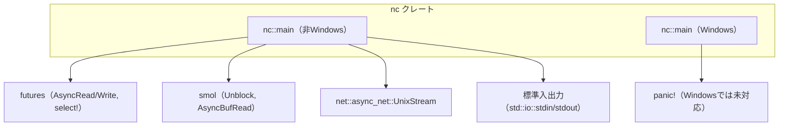
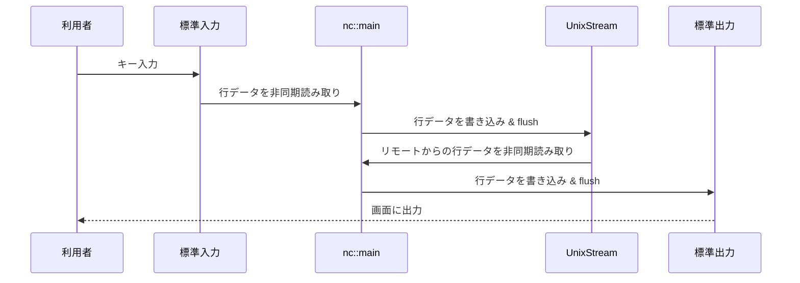

nc ディレクトリ（C:\Drive\rust\zed-local\crates\nc）のコード解説です。

---

## 1. ざっくり一言

Unix ドメインソケットと標準入出力（stdin/stdout）の間で、行単位のデータを双方向に中継する「netcat モード」用の小さなユーティリティクレートです。  
Windows では未対応で、呼び出すと明示的に panic します。

---

## 2. このモジュールの役割

この `nc` クレートは、Zed の「netcat モード」のメイン処理を 1 つの関数 `nc::main` として提供しています（doc コメントより）。  
指定された Unix ドメインソケットに接続し、そのソケットとプロセスの標準入力／標準出力の間でデータを行単位で橋渡しします。

### 依存関係の位置づけ

このディレクトリ内には 1 ファイル（`src/nc.rs`）のみがあり、その中の `main` 関数が外部クレートとやり取りします。



- `Cargo.toml` で `lib` クレートとして定義され、エントリポイントは `src/nc.rs` にあります。
- 非 Windows 環境では、`nc::main` が
  - `net::async_net::UnixStream` でソケット接続を行い、
  - `smol` と `futures` を用いて非同期に stdin/stdout と接続します。
- Windows 環境では、`nc::main` は未実装で即座に `panic!` します。

---

## 3. 主要な機能一覧

このディレクトリ（クレート）が提供する主な機能は次のとおりです。

- Unix ドメインソケットへの接続確立: 指定されたソケットパスに `UnixStream::connect` で接続します。
- 標準入力からソケットへの非同期転送: stdin を行単位で読み取り、その内容をソケットへ書き込みます。
- ソケットから標準出力への非同期転送: ソケットから行単位で読み取り、その内容を stdout に書き込みます。
- Windows 環境での未対応の明示: Windows では `--nc` がサポートされていないことを panic メッセージで通知します。

---

## 4. 関数・構造体の解説

このクレートには公開関数 `main` が 2 つ（cfg による条件付きコンパイル）定義されています。構造体や列挙体は定義されていません。

### 4.1 関数一覧

| 関数名                         | 対象プラットフォーム | 役割 |
|--------------------------------|----------------------|------|
| `nc::main(_socket: &str)`      | `#[cfg(windows)]`    | Windows 環境で呼び出された場合に panic し、未対応であることを示す |
| `nc::main(socket: &str)`       | `#[cfg(not(windows))`| 非 Windows 環境で netcat モードを実装するメイン処理 |

以降では、実際の処理を持つ非 Windows 版の `main` を詳しく説明します。

### 4.2 `nc::main(socket: &str) -> anyhow::Result<()>`（非 Windows）

#### 概要

非 Windows 環境で Zed を netcat モードで動作させる際のメイン関数です。  
指定された Unix ドメインソケットに接続し、ソケットと標準入出力の間でデータを行単位で双方向に転送します。

#### 引数

| 引数名  | 型        | 説明 |
|---------|-----------|------|
| `socket` | `&str`   | 接続先の Unix ドメインソケットのパス文字列です。`net::async_net::UnixStream::connect` にそのまま渡されます。 |

#### 戻り値

- 型: `anyhow::Result<()>`
  - 正常終了時: `Ok(())`
  - エラー時: `Err(anyhow::Error)` として接続エラーや I/O エラーなどが返されます。

#### 内部処理の流れ

コードの流れを大まかにステップで示します。

1. **非同期ランタイムでの実行開始**
   - `smol::block_on(async { ... })` で、内部の `async` ブロックを完了するまで実行します。
   - この関数自身は、その処理が終わるまで戻りません。

2. **ソケットへの接続と分割**
   - `UnixStream::connect(socket).await?` で指定パスの Unix ドメインソケットに接続します。
   - `socket_stream.split()` で読み取り用と書き込み用に分割し、
     - 読み取り側は `BufReader::new` でバッファ付きリーダー `socket_reader` に包まれます。
     - 書き込み側は `socket_write` として保持されます。

3. **標準入出力の非同期ラップ**
   - `Unblock::new(std::io::stdout())` で非同期に書き込める `stdout` ハンドルを作成します。
   - `Unblock::new(std::io::stdin())` で非同期に読み込める `stdin` ハンドルを作成し、
     `BufReader::new(stdin)` でバッファ付きリーダー `stdin_reader` に包みます。

4. **読み書きバッファの用意**
   - `socket_line: Vec<u8>` と `stdin_line: Vec<u8>` を用意し、それぞれ
     - ソケットから読んだ 1 行分のバイト列
     - 標準入力から読んだ 1 行分のバイト列
     を一時的に保持します。

5. **無限ループでの双方向転送**
   - `loop { ... }` の中で `futures::select!` を使い、
     - ソケットからの 1 行読み取り
     - 標準入力からの 1 行読み取り
     のどちらかが先に完了した側の処理を行います。
   - 各分岐で `read_until(b'\n', &mut buffer).fuse()` を呼び出し、
     改行（バイト `b'\n'`）までのデータをバッファに追記します。

6. **ソケットから標準出力への転送分岐**

   ```rust
   bytes_read = socket_reader.read_until(b'\n', &mut socket_line).fuse() => {
       if bytes_read? == 0 {
           break
       }
       stdout.write_all(&socket_line).await?;
       stdout.flush().await?;
       socket_line.clear();
   }
   ```

   - `bytes_read? == 0` の場合:
     - ソケット側で EOF（接続が閉じられた）と判断し、ループを抜けます。
   - それ以外の場合:
     - `socket_line` の内容をそのまま stdout に書き込み、`flush` します。
     - `socket_line.clear()` で次の行に備えてバッファを空にします。

7. **標準入力からソケットへの転送分岐**

   ```rust
   bytes_read = stdin_reader.read_until(b'\n', &mut stdin_line).fuse() => {
       if bytes_read? == 0 {
           break
       }
       socket_write.write_all(&stdin_line).await?;
       socket_write.flush().await?;
       stdin_line.clear();
   }
   ```

   - `bytes_read? == 0` の場合:
     - 標準入力が EOF（例: 入力ストリームが閉じられた）と判断し、ループを抜けます。
   - それ以外の場合:
     - `stdin_line` の内容をソケットへ書き込み、`flush` します。
     - `stdin_line.clear()` で次の行に備えます。

8. **終了**
   - どちらかの側が EOF となるとループを抜け、`anyhow::Ok(())` を返して `block_on` が終了します。
   - それに伴い、`nc::main` も `Ok(())` で終了します。

#### Errors / Panics

- `Err` となる主なケース（すべて `?` 演算子経由で `anyhow::Error` に包まれます）:
  - `UnixStream::connect(socket)` の失敗（ソケットパスが存在しない、権限不足など）。
  - ソケットからの読み取り（`socket_reader.read_until`）や書き込み（`socket_write.write_all`）中の I/O エラー。
  - 標準入力からの読み取り（`stdin_reader.read_until`）や標準出力への書き込み・`flush` 中の I/O エラー。
- `panic` となるケース:
  - 非 Windows 版 `main` 内には `panic!` 呼び出しはありません。
  - ただし Windows 版 `main` では、関数冒頭で `panic!("--nc isn't yet supported on Windows");` が呼ばれるため、呼び出すと必ず panic します。

#### Edge cases（エッジケース）

- **片側の接続が閉じられた場合**
  - ソケット側が先に閉じられた場合:
    - `socket_reader.read_until` が `Ok(0)` を返し、ループから抜けて全体の処理が終了します。
  - 標準入力側が先に閉じられた場合:
    - `stdin_reader.read_until` が `Ok(0)` を返し、同様にループから抜けます。
- **改行のない長いデータ**
  - `read_until(b'\n', &mut buffer)` を使用しているため、改行が現れない限り 1 回の読み取りでは返らず、バッファが増え続けます。
  - EOF が発生した時点で改行なしのデータがあっても、その分はまとめて書き出され、次の `read_until` で `0` が返って終了します。
- **バイナリデータ**
  - バイナリデータであっても `u8` の列としてそのまま転送されますが、
    - 改行で区切られないバイト列は上記のとおり「行」として区切られず、EOF までバッファにたまり続けます。

#### 使用上の注意点

- 引数 `socket` には Unix ドメインソケットのパスが渡される前提になっています。
  - TCP ソケットなど別の種類のソケットには対応していません（`UnixStream` を直接使用しているため）。
- 行単位の処理であり、改行を含まない大きな連続データには向いていません。
- 内部で `smol::block_on` を用いているため、この関数は netcat セッションが終了するまで呼び出し元スレッドを占有します。
- Windows では別実装が有効になり、呼び出すと必ず panic します。

### 4.3 `nc::main(_socket: &str) -> anyhow::Result<()>`（Windows）

- Windows 環境用に `#[cfg(windows)]` でコンパイルされるバージョンです。
- 関数シグネチャは非 Windows 版と同じですが、実装は次のとおりです。

```rust
#[cfg(windows)]
pub fn main(_socket: &str) -> Result<()> {
    // It looks like we can't get an async stdio stream on Windows from smol.
    panic!("--nc isn't yet supported on Windows");
}
```

- 現状、Windows では smol 経由で非同期な標準入出力ストリームを取得できないことがコメントに記載されています。
- どのような引数を渡しても、必ず `panic!("--nc isn't yet supported on Windows")` が実行されます。
- `Result<()>` 型を返すシグネチャですが、実際には `Ok(())` を返す経路は存在しません。

---

## 5. データフロー

ここでは、一般的な使用シナリオにおけるデータの流れを説明します。  
利用者のキーボード入力がソケットに送り出され、その応答が標準出力に表示される流れです。



文章で整理すると次のようになります。

1. 利用者がキーボードから文字列を入力すると、そのデータは OS によって標準入力（stdin）に渡されます。
2. `nc::main` 内の `stdin_reader.read_until(b'\n', &mut stdin_line)` が、改行までのバイト列を読み取ります。
3. 読み取った 1 行分のデータが `socket_write.write_all(&stdin_line)` によって Unix ドメインソケットへ送信されます。
4. ソケットの対向（Zed 本体など）が応答を送信すると、そのデータが `socket_reader.read_until(b'\n', &mut socket_line)` により 1 行分として読み取られます。
5. 読み取った行は `stdout.write_all(&socket_line)` によって標準出力に書き込まれ、`flush` により即座に画面へ表示されます。
6. いずれかの側（ソケットまたは標準入力）が EOF になると、ループを抜けてセッションが終了します。

---

## 6. 使い方（How to Use）

ここでは、このディレクトリ（`nc` クレート）を他のコードから利用することを想定し、典型的な呼び出し方法と注意点を示します。

### 6.1 基本的な使用方法

最も単純な使い方は、「Unix ドメインソケットのパスを渡して `nc::main` をそのまま呼び出す」形です。  
以下は、別のバイナリクレートから `nc` を利用する例です（非 Windows を想定）。

```rust
use anyhow::Result;          // anyhow::Result 型をインポートする
use nc;                      // Cargo.toml で依存に追加した nc クレートをインポートする

fn main() -> Result<()> {    // バイナリのメイン関数。anyhow::Result<()> を返す
    let socket_path = "/tmp/zed.sock"; // 接続したい Unix ドメインソケットのパス

    // nc クレートの main を呼び出し、netcat モードを開始する
    // この呼び出しは、ソケットまたは標準入力が閉じられるまで戻らない
    nc::main(socket_path)
}
```

- `nc::main` は非同期関数ではなく、内部で `smol::block_on` を呼び出す同期関数です。
- そのため、上記のように普通の `fn main` から直接呼び出すことができます。

### 6.2 よくある使用パターン

このクレートが行う処理はシンプルで、主なパターンは次の 2 つに集約されます。

#### パターン 1: 固定パスのソケットに接続するユーティリティとして使う

特定のソケットパスに接続する専用バイナリとして利用するパターンです。

```rust
use anyhow::Result;               // anyhow::Result の利用
use nc;                           // nc クレートのインポート

fn main() -> Result<()> {
    // アプリケーション内で決め打ちされたソケットパス
    const SOCKET_PATH: &str = "/run/zed/netcat.sock";

    // 固定パスに接続する nc::main を呼び出す
    nc::main(SOCKET_PATH)
}
```

- 呼び出し側はソケットパスを意識する必要がなく、`nc` に役割を委譲できます。

#### パターン 2: コマンドライン引数からソケットパスを受け取る

ユーザーにソケットパスを指定してもらい、それを `nc::main` に渡すパターンです。

```rust
use anyhow::{Result, bail};              // Result と簡易エラー生成マクロを利用する
use nc;                                  // nc クレートをインポートする

fn main() -> Result<()> {
    let mut args = std::env::args();     // コマンドライン引数イテレータを取得する
    let _bin = args.next();              // 先頭はバイナリ名なので捨てる

    // 2 番目の引数をソケットパスとして取得する
    let socket_path = match args.next() {
        Some(path) => path,              // 指定されていればそれを使う
        None => {                        // 指定がなければエラーにする
            bail!("usage: my-nc <socket-path>");
        }
    };

    // 取得したソケットパスで netcat モードを開始する
    nc::main(&socket_path)
}
```

- `nc::main` の API は単純な `&str` なので、引数や設定ファイルなど、任意の方法で文字列として準備すれば、そのまま渡せます。

### 6.3 使用上の注意点

このクレート（`nc`）を利用する際の共通の注意点をまとめます。

- **Windows では利用できない**
  - Windows では `#[cfg(windows)]` 版の `main` が有効になり、呼び出すと必ず `panic!("--nc isn't yet supported on Windows")` になります。
  - クロスプラットフォーム用途であれば、呼び出し側で `cfg!(windows)` を用いた分岐などが必要です。
- **Unix ドメインソケット前提**
  - コード上、`net::async_net::UnixStream::connect` を直接呼び出しているため、`socket` 引数は Unix ドメインソケットのパスである必要があります。
  - TCP アドレスや他のプロトコルには対応していません。
- **行単位処理であること**
  - `read_until(b'\n', ...)` で改行までを 1 単位として処理しています。
  - 改行を含まない長いデータを扱うと、EOF までバッファに溜まり続ける挙動になります。
  - バイナリデータのストリーミング用途には向きません。
- **セッション中は呼び出し元スレッドを占有する**
  - `smol::block_on(async { ... })` により、ソケットまたは標準入力が EOF になるまで `nc::main` は戻りません。
  - 他の処理と並列で動かしたい場合は、別スレッドから `nc::main` を呼び出すなどの工夫が必要になる可能性があります（このチャンクからは具体的な並列利用例は分かりません）。

---

## 7. 関連ファイル

このディレクトリと密接に関係するファイル・クレートをまとめます。

| パス / 名前            | 役割 / 関係 |
|------------------------|------------|
| `nc/Cargo.toml`        | `nc` クレートのメタデータと依存関係（`anyhow`, `futures`, `net`, `smol` など）を定義します。`[lib]` セクションでエントリポイントとして `src/nc.rs` を指定しています。 |
| `nc/src/nc.rs`         | 本レポートの対象ファイルです。Zed の netcat モードのメイン処理（`nc::main`）を実装しています。 |
| クレート `net`        | `net::async_net::UnixStream` を提供し、Unix ドメインソケット接続を担います。このチャンクには `net` クレートのソースコードは含まれていません。 |
| クレート `smol`       | `smol::block_on` や `smol::Unblock` を提供し、非同期実行と標準入出力の非同期ラップに利用されています。ソースコードはこのチャンクには含まれていません。 |

このディレクトリ単体では、テストコードや追加のユーティリティモジュールは確認できません。`nc::main` をどのように呼び出しているか（例: Zed 本体側のコード）は、このチャンクには登場しないため詳細は不明です。
