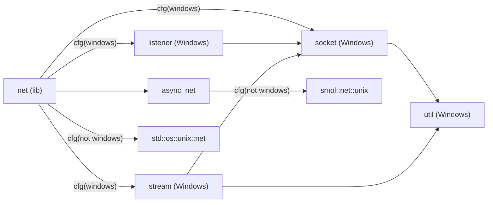
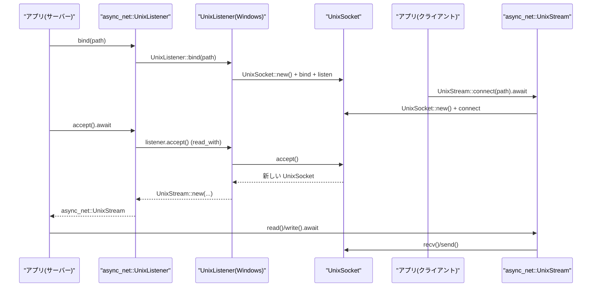

# crates/net ディレクトリ解説

## 1. ざっくり一言

`crates/net` は、UNIX ドメインソケット (`AF_UNIX`) 用の `UnixListener` / `UnixStream` を提供する小さなネットワーククレートです。  
Unix 系 OS では標準ライブラリや `smol` の型をそのまま re-export し、Windows では WinSock の `AF_UNIX` を直接叩いて互換 API と非同期ラッパーを実装しています。

---

## 2. このモジュールの役割

### 2.1 概要

- このクレートは **「UNIX ドメインソケットを OS 差を意識せず使いたい」** という問題を解決するために存在します。
- Unix 系 OS では `std::os::unix::net::{UnixListener, UnixStream}` と `smol::net::unix` を re-export して、他のコードからはこのクレートだけを見ればよいようにしています。
- Windows では WinSock の `AF_UNIX` サポートを使い、`UnixListener` / `UnixStream` 相当の同期 API と、`smol::Async` ベースの非同期 API を提供します。

### 2.2 アーキテクチャ内での位置づけ

主なモジュール間の依存関係は次のようになっています（`cfg` による分岐をコメントで示しています）。



- `net.rs` がクレートルートで、OS ごとに公開 API を切り替えています。
- Windows では `listener.rs` / `stream.rs` / `socket.rs` / `util.rs` が実装を担い、これらを `pub use` で外に出します。
- `async_net.rs` は「非同期版 `UnixListener` / `UnixStream`」を提供し、  
  - 非 Windows: `smol::net::unix` の re-export  
  - Windows: `smol::Async<crate::UnixListener/UnixStream>` のラッパー  
 という二層構造になっています。

### 2.3 設計上のポイント

- **クロスプラットフォームなインターフェース**
  - `crate::UnixListener` / `crate::UnixStream` という名前で、Unix でも Windows でも同名の型を使えるようにしています。
  - 非同期版も `crate::async_net::{UnixListener, UnixStream}` という共通の入口を持ちます。
- **Windows ではレイヤー分割**
  - `UnixSocket`（WinSock の `SOCKET` を薄く包んだ低レベルラッパ）
  - それを使う `UnixListener` / `UnixStream`（同期 `Read` / `Write` 実装）
  - さらにそれを `smol::Async` で包む `async_net::UnixListener` / `async_net::UnixStream`（非同期）
  という 3 層で責務を分けています。
- **WinSock 初期化の一元管理**
  - `util::init()` で `WSAStartup` を `Once` により一度だけ実行します。
  - 利用側は明示的に初期化を意識せず `bind` / `connect` を呼べます。
- **エラーハンドリングの方針**
  - WinSock の戻り値やエラーコードを `util::map_ret` / `UnixSocket::accept` で `std::io::Error` に変換します。
  - `WSAEWOULDBLOCK` は明示的に `ErrorKind::WouldBlock` にマッピングされています。

---

## 3. 主要な機能一覧

- 同期 Unix ドメインソケット API:
  - `UnixListener::bind(&Path)` / `UnixListener::accept()`  
  - `UnixStream::connect(&Path)` / `Read` / `Write` 実装
- 非同期 Unix ドメインソケット API:
  - `async_net::UnixListener::bind(&Path)` / `accept().await`
  - `async_net::UnixStream::connect(&Path).await` / `AsyncRead` / `AsyncWrite` 実装
- Windows 用低レベルソケットラッパ:
  - `UnixSocket::new()` / `accept()` / `recv()` / `send()` / `Drop`
- WinSock ユーティリティ:
  - `util::init()` … `WSAStartup` の一度きりの初期化
  - `util::sockaddr_un(path)` … `SOCKADDR_UN` 構造体の構築と検証
  - `util::map_ret(ret)` … WinSock 戻り値を `Result<usize>` に変換
- ストリーム分割（Windows のみ）:
  - `UnixStream::into_split() -> (OwnedReadHalf, OwnedWriteHalf)`  
    読み取り専用・書き込み専用のストリームに分割します。

---

## 4. 関数・構造体の解説

### 4.1 クレートルート `net.rs` と公開型

#### `pub use` による公開 API

- 非 Windows 環境:

  ```rust
  #[cfg(not(target_os = "windows"))]
  pub use std::os::unix::net::{UnixListener, UnixStream};
  ```

  - このクレートの `UnixListener` / `UnixStream` は、そのまま標準ライブラリのものになります。
  - 非同期版は `async_net` モジュール経由で `smol::net::unix::{UnixListener, UnixStream}` を使います。

- Windows 環境:

  ```rust
  #[cfg(target_os = "windows")]
  pub mod listener;
  #[cfg(target_os = "windows")]
  pub mod socket;
  #[cfg(target_os = "windows")]
  pub mod stream;
  #[cfg(target_os = "windows")]
  mod util;

  #[cfg(target_os = "windows")]
  pub use listener::*;
  #[cfg(target_os = "windows")]
  pub use socket::*;
  #[cfg(target_os = "windows")]
  pub use stream::*;
  ```

  - `UnixListener`, `UnixStream`, `OwnedReadHalf`, `OwnedWriteHalf`, `UnixSocket` などが公開されます。
  - 実装は次のファイル群に分割されています:
    - `listener.rs` … `UnixListener`
    - `stream.rs` … `UnixStream` とハーフ
    - `socket.rs` … `UnixSocket`
    - `util.rs` … WinSock 初期化とユーティリティ

#### テストコードからわかる利用像

- `test_windows_listener`:
  - `crate::{UnixListener, UnixStream}` を使い、同期 I/O で echo 風の通信を行っています。
- `test_unix_listener`:
  - `crate::async_net::{UnixListener, UnixStream}` を使い、`smol` 上で非同期に同様の通信を行っています。

これらのテストが、モジュールの意図された使い方の具体例になっています。

---

### 4.2 Windows 用低レベルソケット: `socket::UnixSocket`

```rust
pub struct UnixSocket(SOCKET);
```

WinSock の `SOCKET` を直接ラップする構造体です。Windows でのみコンパイルされます。

#### 主なメソッド

- `pub fn new() -> Result<Self>`

  - `WSASocketW(AF_UNIX, SOCK_STREAM, ...)` で `AF_UNIX` / `SOCK_STREAM` のソケットを作成します。
  - 続けて `SetHandleInformation` でハンドル継承フラグをリセットしています（子プロセスへのハンドル継承を防ぐ意図と解釈できます）。
  - いずれかの Win32 API 呼び出しが失敗すると `std::io::Error` として返します。

- `pub(crate) fn as_raw(&self) -> SOCKET`

  - 内部の `SOCKET` を返します。`listener` / `stream` モジュール内で WinSock API に渡すために使用されています。

- `pub fn accept(&self, storage: *mut SOCKADDR, len: &mut i32) -> Result<Self>`

  - WinSock の `accept` を呼び出し、新しい `SOCKET` をラップした `UnixSocket` を返します。
  - エラー時の挙動:
    - `WSAGetLastError()` が `WSAEWOULDBLOCK` の場合:
      - `ErrorKind::WouldBlock` の `std::io::Error` を明示的に生成して返します。
    - それ以外のエラー:
      - WinSock 由来のエラーを `err.into()` で `std::io::Error` に変換して返します。

- `pub(crate) fn recv(&self, buf: &mut [u8]) -> Result<usize>`

  - WinSock の `recv` を呼び出し、その戻り値を `util::map_ret` で `Result<usize>` に変換します。

- `pub(crate) fn send(&self, buf: &[u8]) -> Result<usize>`

  - WinSock の `send` を呼び出し、その戻り値を `util::map_ret` で `Result<usize>` に変換します。

- `impl Drop for UnixSocket`

  - スコープを抜けると `closesocket(self.0)` を呼び出してソケットをクローズします。

#### エッジケース・注意点

- `accept` はソケットが非ブロッキングモードになっている場合にだけ `WouldBlock` を返しうる設計です。  
  （このクレート内では非ブロッキング設定は行っていないため、そのような状態にするには外部で追加設定が必要です。）
- `recv` / `send` は WinSock の戻り値 `SOCKET_ERROR` を検出し、`WSAGetLastError()` からエラーコードを取得して `io::Error` 化します。

---

### 4.3 Windows 同期ストリーム: `stream::UnixStream` とハーフ

```rust
pub struct UnixStream(Arc<UnixSocket>);
```

`UnixSocket` を共有所有 (`Arc`) し、`std::io::Read` / `Write` と `AsSocket` を実装する構造体です。  
`async_io::IoSafe` を `unsafe impl` しているため、`async_io::Async<UnixStream>` でラップ可能な設計になっています。

#### 主なメソッド

- `pub fn new(socket: UnixSocket) -> Self`

  - 既存の `UnixSocket` を `Arc` で包みます。
  - 主に `listener::UnixListener::accept` から呼ばれます。

- `pub fn connect<P: AsRef<Path>>(path: P) -> Result<Self>`

  - `util::init()` を呼んで `WSAStartup` を一度だけ初期化します。
  - 新しい `UnixSocket::new()` を作成します。
  - `util::sockaddr_un(path)` で `SOCKADDR_UN` と長さを構築します。
  - WinSock の `connect` を呼び出し、その戻り値を `util::map_ret` でエラーチェックします。
  - 成功すると、`Arc<UnixSocket>` を持つ `UnixStream` を返します。

- `pub fn into_split(self) -> (OwnedReadHalf, OwnedWriteHalf)`

  - 内部の `Arc<UnixSocket>` を取り出し、クローンして、
    - `OwnedReadHalf(Arc<UnixSocket>)`
    - `OwnedWriteHalf(Arc<UnixSocket>)`
    を返します。
  - 同じソケットを共有する読み取り用・書き込み用ハーフになります。

#### トレイト実装

- `impl Read for UnixStream` / `OwnedReadHalf`

  - `self.0.recv(buf)` を呼び出し、`UnixSocket::recv` に処理を委譲します。

- `impl Write for UnixStream` / `OwnedWriteHalf`

  - `self.0.send(buf)` を呼び出します。
  - `flush()` は何もせず `Ok(())` を返します（WinSock の送信バッファフラッシュなどは行いません）。

- `impl AsSocket for UnixStream`

  - `BorrowedSocket::borrow_raw(self.0.as_raw().0 as _)` で Windows 標準ライブラリのソケット扱いができるようにします。

#### エッジケース・注意点

- `connect` の失敗は `util::sockaddr_un` と `WinSock connect` のどちらからも発生しうるため、
  - パス文字列の不正（UTF-8 でない、長すぎる、NUL を含む）
  - OS 側の接続失敗
  を両方考慮する必要があります。
- `flush()` は no-op なので、「`flush` すれば OS に必ず送信される」とは限りません。実際の送信は `send()` の戻り値に依存します。

---

### 4.4 Windows リスナー: `listener::UnixListener`

```rust
pub struct UnixListener(UnixSocket);
```

`UnixSocket` を内部に持つサーバー側リスナーです。

#### 主なメソッド

- `pub fn bind<P: AsRef<Path>>(path: P) -> Result<Self>`

  1. `util::init()` で `WSAStartup` を一度だけ実行します。
  2. `UnixSocket::new()` で `AF_UNIX` / `SOCK_STREAM` ソケットを作成します。
  3. `util::sockaddr_un(path)` で `SOCKADDR_UN` と長さを生成します。
  4. `bind(socket.as_raw(), &addr, len)` を `util::map_ret` 経由で呼び出しエラーチェックします。
  5. `listen(..., SOMAXCONN)` を呼び、同様に `map_ret` でエラーチェックします。
  6. 成功したら `UnixListener(UnixSocket)` を返します。

- `pub fn accept(&self) -> Result<(UnixStream, ())>`

  1. `SOCKADDR_UN::default()` を用意し、長さも設定します。
  2. `self.0.accept(&mut storage, &mut len)` を呼び出し、新しい `UnixSocket` を受け取ります。
  3. `UnixStream::new(raw)` でクライアント側ストリームを作り、`(UnixStream, ())` を返します。  
     戻り値の `()` はリモートアドレスの代わりのプレースホルダです（アドレス情報は返していません）。

- `impl AsSocket for UnixListener`

  - `BorrowedSocket::borrow_raw(self.0.as_raw().0 as _)` により、標準のソケットインターフェースと連携可能にしています。

#### エッジケース・注意点

- `bind` は既に存在するパスや権限不足など、WinSock 側の理由で失敗する可能性がありますが、その詳細は `io::Error` としてのみ得られます。
- `accept` は `UnixSocket::accept` の挙動をそのまま受け継ぐため、非ブロッキングソケットの場合に `ErrorKind::WouldBlock` を返し得ます。

---

### 4.5 非同期 API: `async_net::UnixListener` / `async_net::UnixStream`

#### 非 Windows の場合

```rust
#[cfg(not(target_os = "windows"))]
pub use smol::net::unix::{UnixListener, UnixStream};
```

- `async_net::UnixListener` / `UnixStream` は `smol::net::unix` の型そのものです。
- `smol` のドキュメントに従った一般的な UNIX ドメインソケットの非同期 API が利用できます。

#### Windows の場合

```rust
pub struct UnixListener(Async<crate::UnixListener>);
pub struct UnixStream(Async<crate::UnixStream>);
```

- `smol::Async<T>` で同期版の `crate::UnixListener` / `crate::UnixStream` を包み、`AsyncRead` / `AsyncWrite` を提供します。

##### `UnixListener::bind<P: AsRef<Path>>(path: P) -> Result<Self>`

- `crate::UnixListener::bind(path)?` で同期リスナーを作成します。
- `Async::new(...)` で `smol` の非同期 I/O ラッパを作り、それを `UnixListener` に包んで返します。
- `Async::new` もエラーになりうるため、2 段階で `Result` が返ります。

##### `async fn accept(&self) -> Result<(UnixStream, ())>`

- `self.0.read_with(|listener| listener.accept()).await?` を呼び出します。
  - `read_with` は、与えられたクロージャ内でブロッキングな I/O を行い、それを非同期タスクとして扱うためのヘルパです。
  - 内部では同期版 `UnixListener::accept` が実行されます。
- 返ってきた同期版 `UnixStream` を `Async::new` で包んで `async_net::UnixStream` として返します。
- 戻り値は `(UnixStream, ())` で、`()` は同期版と同様にアドレス情報のプレースホルダです。

##### `async fn UnixStream::connect<P: AsRef<Path>>(path: P) -> Result<Self>`

- 同期版 `crate::UnixStream::connect(path)?` を呼び出します。
- それを `Async::new` で包み `async_net::UnixStream` として返します。
- 実際の connect は同期的ですが、一般には短時間で終わるため、そのまま `Async::new` で扱っています。

##### `AsyncRead` / `AsyncWrite` 実装

- いずれも `Pin::new(&mut self.0).poll_*` に委譲しています。
- `smol::Async` が実際の非同期 I/O の実装を担います。

#### エッジケース・注意点

- Windows の `async_net` は内部で同期 API を使っているため、
  - `accept()` は `read_with` によるブロッキング I/O ラップ
  - `connect()` は同期 connect の結果を包むだけ
  という設計になっています。  
  重い処理でも `smol` のスレッドプールで処理されますが、根本は同期 API である点を理解しておくとトラブルシューティングに役立ちます。

---

### 4.6 WinSock ユーティリティ: `util.rs`

#### `pub(crate) fn init()`

- `static ONCE: Once` を使い、一度だけ `WSAStartup(0x202, &mut wsa_data)` を呼びます。
- 戻り値が 0 以外の場合は `panic!("WSAStartup failed: {}", result)` となり、リカバリ不能なエラーとして扱われます。
- `listener::UnixListener::bind` と `stream::UnixStream::connect` から呼ばれています。

#### `pub(crate) fn sockaddr_un<P: AsRef<Path>>(path: P) -> Result<(SOCKADDR_UN, usize)>`

- `SOCKADDR_UN::default()` を基に UNIX ドメインソケット用アドレスを構築します。
- 手順:
  1. `path.as_ref().to_str()` で UTF-8 文字列に変換（失敗すると `ErrorKind::InvalidInput`）。
  2. バイト列に変換し、以下を検証:
     - 内部に `0` バイトを含まないこと  
       → 含まれていたら `"paths may not contain interior null bytes"` でエラー。
     - 長さが `addr.sun_path.len()` 未満であること  
       → それ以上なら `"path must be shorter than SUN_LEN"` でエラー。
  3. `std::ptr::copy_nonoverlapping` で `sun_path` にパスをコピー。
  4. `sun_path_offset(&addr)` とパス長から `len` を計算。  
     - 先頭バイトが `0`（抽象パス）または空文字列の場合はそのまま。  
     - それ以外（通常のパス）の場合は終端の NUL 分として `+1` します。
- 戻り値は `(構築した SOCKADDR_UN, 構造体長)` です。

#### `pub(crate) fn map_ret(ret: i32) -> Result<usize>`

- WinSock 関数の戻り値を共通の形に変換します。
- `ret == SOCKET_ERROR` のとき:
  - `WSAGetLastError().0` を `Error::from_raw_os_error` で `io::Error` に変換して返します。
- それ以外:
  - `Ok(ret as usize)` を返します。

#### `fn sun_path_offset(addr: &SOCKADDR_UN) -> usize`

- `addr` の先頭アドレスと `addr.sun_path` フィールドのアドレス差分を計算し、そのバイトオフセットを返します。
- `sockaddr_un` 長さ計算のための内部補助関数で、外部からは呼べません。

#### エッジケース・注意点

- `sockaddr_un` は
  - UTF-8 で表現できないパス
  - NUL バイトを含むパス
  - Windows の `sun_path` に入りきらない長さのパス
  をすべて `ErrorKind::InvalidInput` として弾きます。
- `init()` の失敗は `panic` になるため、`WSAStartup` が成功する前提でライブラリが書かれています。

---

## 5. データフロー

ここでは代表的なシナリオとして、Windows で `async_net::UnixListener` / `async_net::UnixStream` を用いた簡単なクライアント・サーバー通信のデータフローを示します（`test_unix_listener` と同様の構成）。

### 処理の要点

1. サーバー側は `async_net::UnixListener::bind(path)` でソケットファイルにバインドし、`accept().await` で接続待ちをします。
2. クライアント側は `async_net::UnixStream::connect(path).await` で接続します。
3. サーバーの `accept()` では内部で同期 `UnixListener::accept` → `UnixSocket::accept` → WinSock `accept` と処理が流れます。
4. クライアント・サーバー双方の `read` / `write` は `async_net::UnixStream` → `smol::Async<UnixStream>` → `UnixSocket::recv` / `send` → WinSock `recv` / `send` という流れで OS に届きます。

### シーケンス図



このように、非同期 API は最終的には `UnixSocket` と WinSock API を経由して OS と通信します。

---

## 6. 使い方（How to Use）

### 6.1 基本的な使用方法（同期 API）

最も基本的な使い方は、「ソケットパスにバインドした `UnixListener` で接続を受け、`UnixStream` で読み書きする」という流れです。  
このコードは Unix でも Windows でも同じ形で書けます（Windows ではこのクレートの実装、Unix では標準ライブラリ実装が使われます）。

```rust
use std::io::{Read, Write};              // 同期 I/O トレイト
use std::thread;                         // スレッド生成
use tempfile::tempdir;                   // 一時ディレクトリ
use net::{UnixListener, UnixStream};     // crates/net の公開 API

fn main() -> std::io::Result<()> {
    let dir = tempdir()?;                                   // 一時ディレクトリを作成
    let socket_path = dir.path().join("socket.sock");       // ソケットファイルのパス

    // サーバーを開始
    let listener = UnixListener::bind(&socket_path)?;       // パスにバインドして listen
    let server = thread::spawn(move || {                    // 別スレッドでサーバー処理
        let (mut stream, _) = listener.accept()?;           // クライアントを 1 件受け付ける
        let mut buf = [0u8; 32];
        let n = stream.read(&mut buf)?;                     // クライアントから読み取り
        stream.write_all(&buf[..n])?;                       // 読み取ったデータをそのまま返信
        Ok::<_, std::io::Error>(())
    });

    // クライアントから接続
    let mut client = UnixStream::connect(&socket_path)?;    // サーバーへ接続
    client.write_all(b"hello")?;                           // データ送信
    let mut buf = [0u8; 32];
    let n = client.read(&mut buf)?;                         // 応答を読み取り
    println!("{:?}", &buf[..n]);                            // 受信データを表示

    server.join().unwrap()?;                               // サーバースレッドを待つ
    Ok(())
}
```

### 6.2 よくある使用パターン

#### パターン1: `smol` を使った非同期サーバー（クロスプラットフォーム）

`async_net::UnixListener` / `async_net::UnixStream` を使うと、Unix では `smol::net::unix`、Windows ではこのクレートのラッパが利用されます。

```rust
use std::path::PathBuf;                                      // パス操作用
use net::async_net::{UnixListener, UnixStream};              // 非同期 Unix ソケット
use smol::io::{AsyncReadExt, AsyncWriteExt};                 // 非同期 I/O トレイト

fn main() -> std::io::Result<()> {
    smol::block_on(async {
        let dir = tempfile::tempdir()?;                      // 一時ディレクトリ
        let path: PathBuf = dir.path().join("socket.sock");  // ソケットパス

        // サーバー開始
        let listener = UnixListener::bind(&path)?;           // 非同期リスナーを作成
        let server = smol::spawn(async move {
            let (mut stream, _addr) = listener.accept().await.unwrap(); // 接続を 1 件受け付け
            let mut buf = [0u8; 32];
            let n = stream.read(&mut buf).await.unwrap();    // クライアントから読み取り
            stream.write_all(&buf[..n]).await.unwrap();      // エコー返信
        });

        // クライアント側
        let mut client = UnixStream::connect(&path).await?;  // サーバーへ接続
        client.write_all(b"hello").await?;                  // データ送信
        let mut buf = [0u8; 32];
        let n = client.read(&mut buf).await?;                // 応答を読み取り
        println!("{:?}", &buf[..n]);

        client.flush().await?;                              // バッファフラッシュ（smol 側）
        server.await;                                       // サーバータスク終了を待機
        Ok(())
    })
}
```

#### パターン2: Windows でのストリーム分割（読み取り／書き込みの分離）

Windows では `UnixStream::into_split()` を使って読み取り・書き込みを分離できます。

```rust
#[cfg(target_os = "windows")]
fn split_example(path: &std::path::Path) -> std::io::Result<()> {
    use std::io::{Read, Write};
    use net::UnixStream;                           // Windows では自前実装

    let stream = UnixStream::connect(path)?;       // サーバーに接続
    let (mut reader, mut writer) = stream.into_split(); // 読み取りハーフと書き込みハーフに分割

    writer.write_all(b"ping")?;                    // 書き込み専用ハーフで送信
    let mut buf = [0u8; 16];
    let n = reader.read(&mut buf)?;                // 読み取り専用ハーフで受信
    println!("{:?}", &buf[..n]);

    Ok(())
}
```

この例では同じスレッドで使っていますが、`OwnedReadHalf` / `OwnedWriteHalf` は `Arc<UnixSocket>` を共有しているため、別スレッドに移動して使うことも想定された設計です（具体的な `Send` / `Sync` の性質はコードからは直接読み取れないため、実際の自動トレイト解決に依存します）。

### 6.3 使用上の注意点（まとめ）

- **パスの制約（Windows、`util::sockaddr_un`）**
  - パスは UTF-8 で表現できる必要があります（`to_str()` に失敗すると `InvalidInput`）。
  - NUL バイト（`0`）を内部に含むパスは使えません。
  - `SOCKADDR_UN.sun_path` に入りきらない長さのパスはエラーになります。
- **WinSock 初期化の失敗**
  - `util::init()`（`WSAStartup`）が失敗すると `panic!` します。
  - アプリケーションからはこのエラーを `Result` として処理できない設計です。
- **`flush()` の意味**
  - `UnixStream` / `OwnedWriteHalf` における `flush()` は no-op であり、実際の送信完了を保証しません。
  - 送信バイト数は `write` / `write_all` の戻り値で確認する必要があります。
- **`ErrorKind::WouldBlock` の扱い**
  - Windows の `UnixSocket::accept` は `WSAEWOULDBLOCK` を `ErrorKind::WouldBlock` に変換します。
  - ソケットを非ブロッキングモードに設定した場合、`accept` がこのエラーを返す可能性があります。
- **OS ごとの API 差**
  - Unix では `UnixListener` / `UnixStream` は標準ライブラリそのものであり、Windows 固有のヘルパ（`UnixSocket`, `OwnedReadHalf` など）は存在しません。
  - クロスプラットフォームなコードを書きたい場合、Windows 専用型（`UnixSocket`, `OwnedReadHalf`, `OwnedWriteHalf` など）に直接依存しないのが安全です。
- **非同期 API の前提**
  - `async_net` モジュールの実装は `smol` とその内部の `async-io` に依存しています。
  - 他の非同期ランタイム（Tokio 等）と混在させる場合は、その点を考慮する必要があります。

---

## 7. 関連ファイル

`crates/net` ディレクトリ内のファイルとその役割、および主要な外部依存をまとめます。

| パス                         | 役割 / 関係 |
|------------------------------|-------------|
| `net/Cargo.toml`             | クレート定義。`smol`、`windows`、`async-io`、`tempfile` などの依存関係や、ライブラリエントリ `src/net.rs` を指定しています。 |
| `net/src/net.rs`             | クレートルート。OS ごとの `mod` / `pub use` で公開 API を切り替え、テスト (`tests` モジュール) もここに置かれています。 |
| `net/src/async_net.rs`       | 非同期 Unix ドメインソケット API。非 Windows では `smol::net::unix` の re-export、Windows では `smol::Async` によるラッパ実装を提供します。 |
| `net/src/listener.rs`        | Windows 専用の `UnixListener` 実装。`UnixSocket` と WinSock の `bind` / `listen` / `accept` をラップします。 |
| `net/src/socket.rs`          | Windows 専用の低レベルソケット `UnixSocket`。`WSASocketW`、`accept`、`recv`、`send` など WinSock 関数の薄いラッパです。 |
| `net/src/stream.rs`          | Windows 専用の `UnixStream` と `OwnedReadHalf` / `OwnedWriteHalf`。`Read` / `Write` / `AsSocket` / `IoSafe` を実装し、高レベル API の中心となります。 |
| `net/src/util.rs`            | Windows 専用ユーティリティ。`WSAStartup` の初期化 (`init`)、`SOCKADDR_UN` 構築 (`sockaddr_un`)、WinSock 戻り値の変換 (`map_ret`) などを提供します。 |

依存クレート（ファイルではありませんが、理解のために列挙します）:

| クレート名 | 役割 / 関係 |
|-----------|-------------|
| `smol`    | 非同期ランタイム。`smol::Async` と `smol::net::unix` を通じて非同期 Unix ドメインソケットを提供します。 |
| `async-io`| `IoSafe` トレイトの定義元。`UnixStream` を `Async` などで安全にラップできることを示すために使用されます。 |
| `windows` | Win32 API バインディング。WinSock (`AF_UNIX` ソケット) とハンドル操作に利用されています。 |
| `tempfile`| テストで一時ディレクトリ／ソケットパスを作るために使われます。 |

このように、`crates/net` は「UNIX ドメインソケットの OS 差を吸収するための薄いネットワークレイヤー」として構成されています。
