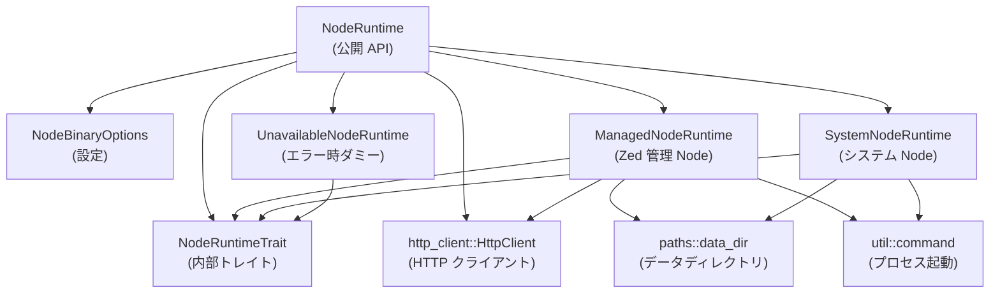
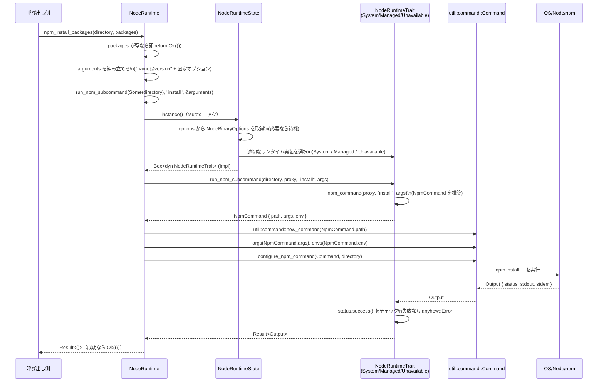

# node_runtime/ ディレクトリ解説

## 1. ざっくり一言

`node_runtime` クレートは、Zed 内で使う Node.js ランタイムを

- システム側の Node を検出・利用し、
- 必要であれば公式配布バイナリを自動ダウンロードして管理し、
- 共通のプロキシ／証明書設定付きで npm を実行する

ためのユーティリティを提供するモジュールです。

---

## 2. このモジュールの役割

### 2.1 概要

- このモジュールは **「Zed から Node.js / npm を安定して使う」** という問題を解決するために存在します。
- システムの PATH や設定から Node.js / npm を検出し、条件に応じて自前で管理する Node.js をダウンロード・検証します。
- その上で npm のサブコマンド実行やパッケージバージョン取得など、Node ベース機能に必要な操作をラップして提供します。

### 2.2 アーキテクチャ内での位置づけ

このクレート内部の主な型・依存関係は次のようになっています。



- 外部から直接使うのは主に `NodeRuntime` と、その設定 `NodeBinaryOptions`、結果として返される `NpmCommand` などです。
- 実際の Node 実行は `SystemNodeRuntime`（システムの Node）か `ManagedNodeRuntime`（ダウンロードした Node）のどちらかが担います。
- どの実装を使うかは `NodeRuntime` 内部の状態と設定で自動的に選択されます。

### 2.3 設計上のポイント

コードから読み取れる特徴は次の通りです。

- **状態管理**
  - `NodeRuntime` は内部に `NodeRuntimeState` を持ち、`Arc<Mutex<...>>` で共有・排他制御されています。
  - 設定 (`NodeBinaryOptions`) の変更を `watch::Receiver` 経由で監視し、設定が変わるたびに内部のランタイムインスタンスを作り直します。
- **多様な Node ソースのサポート**
  - 明示的なパス指定 (`use_paths`) / PATH からの検出 (`allow_path_lookup`) / バイナリの自動ダウンロード (`allow_binary_download`) の 3 パターンを組み合わせて動作します。
- **エラーハンドリング方針**
  - `anyhow::Result` により、詳細なメッセージ付きでエラーを返します。
  - 一部の失敗は「安いチェック」なので毎回再試行し、高コストなダウンロード失敗などは `UnavailableNodeRuntime` としてキャッシュする、という方針がコメントで明示されています。
- **ネットワーク環境の統一**
  - HTTP プロキシや追加 CA 証明書 (`NODE_EXTRA_CA_CERTS`) の設定を、npm 実行時にも反映することで、Zed 全体のネットワーク設定と整合を取る構造になっています。

---

## 3. 主要な機能一覧

このクレートが提供する主な機能を箇条書きでまとめます。

- Node.js ランタイムの選択と初期化
  - システムの Node をパスから検出 (`SystemNodeRuntime::detect`)
  - 任意パス指定の Node / npm の検証 (`SystemNodeRuntime::new`)
  - Zed 管理の Node バイナリのダウンロード・検証 (`ManagedNodeRuntime::install_if_needed`)
- npm コマンドの実行
  - `npm install` など任意のサブコマンドを適切な環境・オプションで実行 (`run_npm_subcommand`)
  - 長時間動作させる npm プロセス用の `NpmCommand` 設定生成 (`npm_command`)
- npm パッケージ情報の取得
  - 指定パッケージのインストール済みバージョン取得 (`npm_package_installed_version` / `read_package_installed_version`)
  - npm registry からの最新バージョン取得 (`npm_package_latest_version`)
- パッケージインストールの制御
  - 任意ディレクトリでの `npm install` 実行 (`npm_install_packages`)
  - 既存バージョンと pinned / latest の比較に基づく「インストールが必要か」判定 (`should_install_npm_package`)
- プロキシ・証明書設定の反映
  - `http_client::HttpClient` のプロキシ設定を npm `--proxy` オプションに変換 (`proxy_argument`)
  - `NODE_EXTRA_CA_CERTS` や PATH など、必要な環境変数を npm 実行環境に注入 (`npm_command_env`)

---

## 4. 関数・構造体の解説

### 4.1 型一覧（構造体・列挙体など）

主な公開／内部型を表にまとめます。

| 名前 | 種別 | 公開範囲 | 役割 / 用途 |
|------|------|----------|-------------|
| `NodeBinaryOptions` | 構造体 | `pub` | Node バイナリの取得方法（PATH 検索／ダウンロード／パス指定）をまとめた設定 |
| `NpmCommand` | 構造体 | `pub` | npm プロセスを起動するためのパス・引数・環境変数のセット |
| `VersionStrategy<'a>` | enum | `pub` | パッケージバージョン比較の方針（固定バージョンに合わせる / 最新と比較） |
| `NodeRuntime` | 構造体 (tuple) | `pub` | 外部向けのランタイムフロント。内部で `NodeRuntimeTrait` 実装を選択して利用 |
| `NodeRuntimeState` | 構造体 | 非公開 | `NodeRuntime` が保持する内部状態（HTTP クライアント、現在のランタイム実装など） |
| `ArchiveType` | enum | 非公開 | Node バイナリの配布形式（`.tar.gz` or `.zip`）の識別 |
| `NpmInfo` | 構造体 | `pub` | `npm info` の JSON をデシリアライズするための型（`dist-tags` と `versions`） |
| `NpmInfoDistTags` | 構造体 | `pub` | `npm info` の `dist-tags` 部分（特に `latest`） |
| `NodeRuntimeTrait` | トレイト | 非公開 | Managed/System/Unavailable いずれのランタイムからも共通で呼び出すための内部トレイト |
| `ManagedNodeRuntime` | 構造体 | 非公開 | Zed がダウンロード・管理する Node.js ランタイムを表現 |
| `SystemNodeRuntime` | 構造体 | `pub` | システムの Node / npm バイナリを利用するランタイムを表現 |
| `DetectError` | enum | 非公開 | システム Node の検出に失敗した理由（PATH に無い / その他のエラー） |
| `UnavailableNodeRuntime` | 構造体 | `pub` | Node が利用できない状態を一貫したエラーとして表現するランタイム実装 |

### 4.2 主要な関数・メソッド詳細（抜粋）

ここでは、理解に重要な関数・メソッドを 7 件まで詳しく解説します。

#### 4.2.1 `NodeRuntime::new(http, shell_env_loaded, options) -> NodeRuntime`

**概要**

- HTTP クライアント、シェル環境読み込み完了通知、Node のバイナリ設定ストリームを受け取り、`NodeRuntime` を初期化します。
- 以後の npm 実行は、この `NodeRuntime` 経由で行われます。

**引数**

| 引数名 | 型 | 説明 |
|--------|----|------|
| `http` | `Arc<dyn HttpClient>` | HTTP リクエストを行うためのクライアント。Node バイナリのダウンロードに利用されます。 |
| `shell_env_loaded` | `Option<oneshot::Receiver<()>>` | シェル環境（PATH など）のロード完了を通知する one-shot チャンネル。`None` の場合は未完了のダミーが使われます。 |
| `options` | `watch::Receiver<Option<NodeBinaryOptions>>` | Node バイナリ設定を流す watch チャンネルの受信側。設定変更を検知してランタイム再構築に使われます。 |

**戻り値**

- 初期状態の `NodeRuntime`。実際の Node バイナリ検出やダウンロードは、最初の利用時に行われます。

**内部処理の流れ**

1. `NodeRuntimeState` を生成し、`Arc<Mutex<...>>` でラップします。
2. `shell_env_loaded` が `None` の場合は `oneshot::channel().1`（受信用）をそのまま `Shared` にして保持します。
3. `options` はそのまま `NodeRuntimeState` に保持され、後続の `instance()` で参照・監視されます。

**エッジケース**

- `shell_env_loaded` に未解決の Receiver が渡された場合、PATH 検索による Node 検出はその通知を待ってから行われます（`instance()` 内で `await`）。

**使用上の注意点**

- `http` は長期間使われるため、再利用可能なクライアント（接続プール付きなど）であることが前提と推測されますが、コード上から詳細は分かりません。
- `options` に `None` が流れている間、`instance()` はブロックして待機します。

---

#### 4.2.2 `NodeRuntime::instance(&self) -> Box<dyn NodeRuntimeTrait>`

**概要**

- 現在の設定 (`NodeBinaryOptions`) に基づいて、適切な Node ランタイム実装（System / Managed / Unavailable）を生成または再利用して返します。
- このメソッドは非公開ですが、他の公開メソッドのほぼ全てが内部で利用します。

**内部処理の流れ**

1. `Mutex` をロックして `NodeRuntimeState` への変更権を取得します。
2. `options` の `watch::Receiver` から現在値を取得し、`Some` が来るまで `changed().await` で待機します。
   - チャンネルエラーの場合は `UnavailableNodeRuntime` を返します。
3. 前回使用した `last_options` と現在の `options` を比較し、変わっていれば `instance` を破棄します。
4. 既に `instance` が存在すれば、それを `boxed_clone()` して返します（再初期化なし）。
5. `options.use_paths` が `Some((node, npm))` の場合:
   - `SystemNodeRuntime::new(node, npm)` でユーザー指定の Node / npm を検証します。
   - 成功時: それを `instance` としてキャッシュし、返します。
   - 失敗時: エラー内容を含めた `UnavailableNodeRuntime` を新規に返します（キャッシュはしません）。
6. `options.allow_path_lookup` が `true` の場合:
   - `shell_env_loaded` 完了を待ってから `SystemNodeRuntime::detect()` で PATH から Node / npm を探します。
   - 成功時: それを `instance` としてキャッシュし、返します。
   - 失敗時: エラー情報を `system_node_error` に保持します（以降の処理で使用）。
7. `options.allow_binary_download` が `true` の場合:
   - `system_node_error` の内容からログレベルと「なぜ Managed を使うか」の説明文字列を決めます。
   - `ManagedNodeRuntime::install_if_needed(&state.http)` を呼び、必要なら Node をダウンロード・検証します。
   - 成功時: Managed ランタイムをログ付きで採用し、キャッシュして返します。
   - 失敗時: エラー内容を含む `UnavailableNodeRuntime` を生成し、**キャッシュした上で**返します。
8. `allow_binary_download == false` かつ `system_node_error.is_some()` の場合:
   - システム Node チェックに失敗した旨の `UnavailableNodeRuntime` を返します（キャッシュしません）。
9. 上記いずれの方法でも Node を利用できない場合:
   - 「設定上 Node を利用する方法が無い」というメッセージを持つ `UnavailableNodeRuntime` を生成し、**キャッシュ**します。

**エッジケース**

- `options` チャンネルがクローズされると `changed().await` が `Err` を返し、以降は `UnavailableNodeRuntime` になります。
- `allow_path_lookup == false` かつ `allow_binary_download == false` で `use_paths` も `None` の場合、必ず「利用できない」状態になります。
- 一部の失敗（PATH 検索失敗など）は都度やり直されますが、ダウンロード失敗など一部はキャッシュされるため、Zed の再起動まで状態が変わりません。

**使用上の注意点**

- この関数は全ての公開メソッドから内部的に呼ばれるので、実質的に「遅延初期化 + キャッシュ」の中心です。
- 呼び出し側で特別な同期を意識する必要はありませんが、最初の呼び出しではダウンロード・展開などの重い処理が走る可能性があります。

---

#### 4.2.3 `NodeRuntime::npm_install_packages(&self, directory, packages) -> Result<()>`

**概要**

- 指定ディレクトリを作業ディレクトリとして、`npm install` を実行して複数パッケージをインストールします。
- 各パッケージは `"name@version"` の形式で指定されます。

**引数**

| 引数名 | 型 | 説明 |
|--------|----|------|
| `directory` | `&Path` | `npm install` を実行するプロジェクトディレクトリ |
| `packages` | `&[(&str, &str)]` | `(パッケージ名, バージョン文字列)` のタプル配列 |

**戻り値**

- 成功時は `Ok(())`。`npm install` が失敗した場合や Node が利用できない場合は `Err(anyhow::Error)` になります。

**内部処理の流れ**

1. `packages` が空なら、何もせず `Ok(())` を返します。
2. 各 `(name, version)` を `"name@version"` 形式の文字列に変換し、`Vec<String>` にまとめます。
3. 固定の npm オプション（`--save-exact`、各種 `--fetch-*` タイムアウト）を追加します。
4. `run_npm_subcommand(Some(directory), "install", &arguments)` を呼び出し、実際に npm を実行します。
5. `run_npm_subcommand` 内で npm プロセスの終了コードがチェックされ、失敗時には詳細なメッセージを含むエラーが返されます。

**エッジケース**

- `directory` が存在しない場合や書き込み権限がない場合、`npm install` の実行自体が OS レベルで失敗する可能性があります（その場合は `Err`）。
- `packages` が空の場合は npm を起動しません。

**使用上の注意点**

- コメントに「This is also wrong because the directory is wrong.」という記述がありますが、このチャンクだけでは具体的に何が「wrong」なのかは分かりません。呼び出し側のディレクトリ指定が重要である、程度に留まります。
- `npm install` はネットワークアクセスと大量のディスク I/O を伴うため、頻繁な呼び出しは全体のパフォーマンスに影響する可能性があります。

---

#### 4.2.4 `NodeRuntime::should_install_npm_package(&self, package_name, local_executable_path, local_package_directory, version_strategy) -> bool`

**概要**

- ある npm パッケージについて、「再インストールが必要かどうか」を判定するユーティリティです。
- 実行ファイルの存在チェックと、インストール済みバージョンと所望のバージョンの比較を行います。

**引数**

| 引数名 | 型 | 説明 |
|--------|----|------|
| `package_name` | `&str` | npm パッケージ名 |
| `local_executable_path` | `&Path` | そのパッケージが提供するローカル実行ファイルのパス |
| `local_package_directory` | `&Path` | `package.json` などが置かれたローカルパッケージディレクトリ |
| `version_strategy` | `VersionStrategy<'_>` | バージョン比較の方針（`Pin` / `Latest`） |

**戻り値**

- `true`: インストール（または再インストール）が必要と判断した場合。
- `false`: 現状維持でよいと判断した場合。

**内部処理の流れ**

1. `local_executable_path` に対して `fs::metadata` を実行し、存在を確認します。
   - エラー（通常は `NotFound`）なら `true` を返します（インストールが必要）。
2. `npm_package_installed_version(local_package_directory, package_name)` を呼び出し、インストール済みバージョンを取得します。
   - 戻り値は `Result<Option<Version>>` で、`log_err().flatten()` により:
     - エラーはログに出して `None` と同等に扱う（と解釈できます）。
     - `Some(version)` のときだけバージョン比較に進みます。
   - `None` の場合は `true`（インストール必要）を返します。
3. `VersionStrategy` に応じて比較します。
   - `Pin(pinned_version)` の場合: `installed_version != pinned_version` なら `true`。
   - `Latest(latest_version)` の場合: `installed_version < latest_version` なら `true`。

**エッジケース**

- `npm_package_installed_version` が JSON パースエラーなどを起こした場合でも、「インストールすべき」と判断します（安全側）。
- `latest_version` がどのように算出されたかは呼び出し側に依存します（例えば `npm_package_latest_version` を利用）。

**使用上の注意点**

- この関数自体は `async` ではありますが、内部で npm コマンドを呼ぶのではなく、ファイルシステム読み取りが中心です（`read_package_installed_version` を利用）。
- 実行ファイルのパスが正しく設定されていることが前提です。間違ったパスを指定すると常に `true` になる可能性があります。

---

#### 4.2.5 `ManagedNodeRuntime::install_if_needed(http: &Arc<dyn HttpClient>) -> Result<Self>`

**概要**

- Zed 管理の Node.js バイナリが既にインストール済みかどうかをチェックし、必要であれば nodejs.org からダウンロード・展開します。
- いずれの場合も最終的に `ManagedNodeRuntime` インスタンスを返します。

**戻り値**

- 成功時: `Ok(ManagedNodeRuntime)`（`installation_path` は Node が展開されたディレクトリ）。
- 失敗時: `Err(anyhow::Error)`（OS 非対応、ダウンロード失敗、展開失敗など）。

**内部処理の流れ**

1. 実行中 OS (`consts::OS`) を `darwin` / `linux` / `win` のいずれかにマッピング。その他はエラー。
2. アーキテクチャ (`consts::ARCH`) を `x64` / `arm64` にマッピング。その他はエラー。
3. `VERSION`（固定文字列 `"v24.11.0"`）と OS / Arch からフォルダ名・ファイル名を構築します。
4. `paths::data_dir().join("node")` を基準に、インストールディレクトリやバイナリパス (`NODE_PATH`, `NPM_PATH`) を決定します。
5. 既に Node バイナリが存在する場合:
   - `util::command::new_command(&node_binary)` で `node npm-cli.js --version` を実行し、`status.success()` かどうかで「有効」か判定します。
   - 失敗時には警告ログを出し、再ダウンロード対象とします。
6. 「有効でない」場合:
   - 既存の `node_containing_dir` を `remove_dir_all` し、新規に作成します。
   - OS に応じてアーカイブ形式 (`ArchiveType::TarGz` or `Zip`) を選択します。
   - `https://nodejs.org/dist/{version}/{file_name}` に HTTP GET を送り、応答ボディを解凍・展開します。
     - `.tar.gz` の場合: `GzipDecoder` + `async_tar::Archive` で `unpack`。
     - `.zip` の場合: `util::archive::extract_zip` を利用。
7. インストールの有無に関わらず、`node_dir` 内に以下を作成します（エラーは無視）:
   - `cache/` ディレクトリ
   - 空ファイル `blank_user_npmrc`
   - 空ファイル `blank_global_npmrc`
8. 最終的に `ManagedNodeRuntime { installation_path: node_dir }` を返します。

**エッジケース**

- 未対応 OS / Arch の場合は即座に `bail!` しています。
- 既存 Node バイナリが存在しても、`npm --version` が失敗した場合は再ダウンロード対象になります（壊れたインストールを検出）。
- `NODE_EXTRA_CA_CERTS` の環境変数がセットされている場合、それを使って検証コマンドを実行します。

**使用上の注意点**

- この関数はネットワークアクセスとファイル展開を行うため、呼び出しには時間がかかる可能性があります。
- 成功後も、Node の実行に必要なファイル（`node.exe` / `bin/node` など）が削除されると、次回 `install_if_needed` 呼び出し時に再ダウンロードが行われます。

---

#### 4.2.6 `SystemNodeRuntime::new(node: PathBuf, npm: PathBuf) -> Result<Self>`

**概要**

- 明示的に指定された Node バイナリと npm バイナリを検証し、それが最低バージョン要件を満たす「利用可能なシステム Node」であるかを確認します。

**戻り値**

- 成功時: 構築された `SystemNodeRuntime`。
- 失敗時: `Err(anyhow::Error)`（Node が動作しない / バージョンが古い / npm 実行失敗など）。

**内部処理の流れ**

1. `node --version` を実行し、成功かつ標準出力からバージョン文字列を取得します。
2. 先頭の `'v'` を取り除き、`semver::Version::parse` でパースします。
3. `version < MIN_VERSION(=22.0.0)` ならエラーを返します。
4. `paths::data_dir().join("node")` をスクラッチディレクトリとして作成し、`cache/` ディレクトリも作成します（エラーは無視）。
5. 一時的な `SystemNodeRuntime` インスタンスを作成し、それを使って `npm root -g` を実行します。
6. `npm root -g` の標準出力を `global_node_modules` として保存します。

**エッジケース**

- `node --version` の標準出力に余分な改行が含まれることを想定し、`trim()` で前後の空白を削除しています。
- `npm root -g` の結果末尾に改行が含まれる可能性がありますが、そのまま `PathBuf` に変換して格納しています（後続処理がどのように扱うかはこのチャンクからは分かりません）。

**使用上の注意点**

- Node の最低バージョンはコード中で `22.0.0` に固定されており、それ未満の Node は利用できません。
- この関数は `util::command` に依存するため、利用環境で `node` / `npm` が実際に実行可能である必要があります。

---

#### 4.2.7 `read_package_installed_version(node_module_directory, name) -> Result<Option<Version>>`

**概要**

- ローカルの `node_modules/<name>/package.json` を読み取り、そのパッケージのインストール済みバージョンを取得します。

**引数**

| 引数名 | 型 | 説明 |
|--------|----|------|
| `node_module_directory` | `PathBuf` | 通常は `.../node_modules` ディレクトリへのパス |
| `name` | `&str` | パッケージ名 |

**戻り値**

- `Ok(Some(version))`: バージョン情報を取得できた場合。
- `Ok(None)`: `package.json` が存在しなかった場合（未インストール）。
- `Err(anyhow::Error)`: ファイル読み取りや JSON パースに失敗した場合。

**内部処理の流れ**

1. `node_module_directory/name/package.json` を組み立て、`fs::File::open` で開きます。
2. `io::ErrorKind::NotFound` の場合のみ `Ok(None)` を返し、それ以外のエラーはそのまま返します。
3. ローカル構造体 `PackageJson { version: Version }` を定義し、`serde_json::from_str` で JSON をパースします。
4. `package_json.version` を `Some` で包んで返します。

**エッジケース**

- `package.json` に `version` フィールドが無い、または semver として無効な文字列だった場合、パースエラーになります（`Err`）。
- `node_module_directory` が `node_modules` ではないディレクトリを指す場合、期待された結果は得られません。

**使用上の注意点**

- エラー時には呼び出し側で適切に補正する必要があります。`should_install_npm_package` などはエラーをログに出したうえで「インストール必要」とみなす実装になっています。

---

### 4.3 その他の主な関数・メソッド

補助的または単純なラッパーの関数・メソッドを一覧で示します。

| 名前 | 役割（1 行） |
|------|--------------|
| `NodeRuntime::unavailable` | 強制的に Node を利用不可にした `NodeRuntime` を構築（HTTP は BlockedHttpClient） |
| `NodeRuntime::binary_path` | 現在選択されている Node バイナリのパスを取得 |
| `NodeRuntime::run_npm_subcommand` | プロキシ設定を引き継いだ上で任意の npm サブコマンドを実行 |
| `NodeRuntime::npm_package_installed_version` | 現在のランタイムを通じてローカル npm パッケージのバージョンを取得 |
| `NodeRuntime::npm_command` | 長時間実行する npm 向けに `NpmCommand`（path / args / env）を構築 |
| `NodeRuntime::npm_package_latest_version` | `npm info --json` で得た情報から最新バージョンを求める |
| `ManagedNodeRuntime::run_npm_subcommand` | Managed Node を利用して npm サブコマンドを実行（リトライ付き） |
| `ManagedNodeRuntime::npm_command` | Managed Node 専用の npm コマンド引数・環境を構築 |
| `SystemNodeRuntime::detect` | PATH から `node` / `npm` を探し、`SystemNodeRuntime::new` で検証 |
| `UnavailableNodeRuntime` 各メソッド | 全ての操作でエラーメッセージを含む `bail!` を返すダミー実装 |
| `configure_npm_command` | `util::command::Command` に作業ディレクトリと `--prefix` を設定 |
| `proxy_argument` | `http_client::Url` を npm の `--proxy` 引数用文字列に変換し、`localhost` を `127.0.0.1` に置き換える |
| `build_npm_command_args` | キャッシュ・設定ファイル・プロキシなどを含む npm 引数リストを組み立てる |
| `npm_command_env` | PATH や CA 証明書など、npm 実行用の環境変数を組み立てる |
| `path_with_node_binary_prepended` | 既存 PATH の先頭に Node バイナリのディレクトリを追加した PATH を生成 |

---

## 5. データフロー

ここでは、代表的な処理として「npm パッケージをインストールする」フローを簡単なシーケンス図で示します。

### 5.1 `npm_install_packages` 実行時のフロー



要点:

- `NodeRuntime` の公開メソッドは、まず `instance()` を通じて内部ランタイム実装を決定します。
- 実際の `npm` 実行は `util::command::Command` 経由で OS プロセスとして行われ、終了コードと stdout/stderr がチェックされます。
- プロキシや環境変数の設定は `npm_command` / `npm_command_env` を通じて一元的に管理されています。

---

## 6. 使い方（How to Use）

### 6.1 基本的な使用方法

ここでは、システム Node を優先しつつ、見つからなければ自動的に Node をダウンロードして npm パッケージをインストールする、という典型的な使い方を示します。

```rust
use std::{path::Path, sync::Arc};                      // Path 型と Arc を使う
use futures::channel::{oneshot};                     // シェル環境ロード通知に oneshot を使う
use watch;                                           // NodeBinaryOptions の配信に watch チャンネルを使う

use node_runtime::{
    NodeRuntime,                                     // メインのランタイム型
    NodeBinaryOptions,                               // Node の取得方法を指定する設定型
};                                                   // VersionStrategy 等も必要に応じてインポートする

// 仮の HTTP クライアント実装。実際には http_client クレートの具体型などを使う。
struct MyHttpClient;                                 // HttpClient トレイトを実装していると仮定
impl http_client::HttpClient for MyHttpClient {      // 具体的な実装はこのチャンクには無い
    /* ... */                                        // ため省略する
}

async fn install_example() -> anyhow::Result<()> {   // 非同期関数として定義
    // 1. HTTP クライアントを用意する
    let http: Arc<dyn http_client::HttpClient> =
        Arc::new(MyHttpClient);                      // Arc でトレイトオブジェクトを包む

    // 2. Node の設定を送る watch チャンネルを用意する
    let (options_tx, options_rx) =
        watch::channel(Some(NodeBinaryOptions {      // 初期値として Some(...) を送る
            allow_path_lookup: true,                 // まず PATH から Node を探す
            allow_binary_download: true,             // 見つからなければダウンロードを許可
            use_paths: None,                         // 特定パスは指定しない
        }));

    // 3. シェル環境ロード完了通知を作る（ここでは即座に完了させる例）
    let (env_tx, env_rx) = oneshot::channel();       // oneshot チャンネルを作成
    let _ = env_tx.send(());                         // すぐに「完了」を送信

    // 4. NodeRuntime を初期化する
    let node_runtime = NodeRuntime::new(
        http,                                        // HTTP クライアント
        Some(env_rx),                                // シェル環境ロード通知
        options_rx,                                  // Node 設定の受信側
    );

    // 5. あるディレクトリで npm パッケージをインストールする
    let project_dir = Path::new("/path/to/project"); // プロジェクトディレクトリ
    node_runtime
        .npm_install_packages(                       // npm install を実行
            project_dir,
            &[("typescript", "5.6.3")],             // 例: typescript@5.6.3 をインストール
        )
        .await?;                                     // エラーがあれば ? で伝播

    Ok(())                                           // 正常終了
}
```

この例では:

- システムの Node が条件を満たしていればそれを使い、そうでなければ Managed Node をダウンロードして使用します。
- `npm_install_packages` で `npm install` が実行され、失敗した場合は `anyhow::Error` が返されます。

### 6.2 よくある使用パターン

#### 6.2.1 npm の最新バージョン情報を取得する

npm registry に問い合わせて、指定パッケージの最新バージョンを取得する例です。

```rust
use std::sync::Arc;
use futures::channel::{oneshot};
use watch;

use node_runtime::{NodeRuntime, NodeBinaryOptions};  // 必要な型をインポート

async fn print_latest_version(http: Arc<dyn http_client::HttpClient>) -> anyhow::Result<()> {
    // NodeBinaryOptions とシェル環境通知をセットアップ（詳細は前節と同様）
    let (options_tx, options_rx) =
        watch::channel(Some(NodeBinaryOptions::default())); // デフォルト設定を使う
    let (env_tx, env_rx) = oneshot::channel();
    let _ = env_tx.send(());                         // 即座に「完了」を送る

    let node_runtime = NodeRuntime::new(http, Some(env_rx), options_rx);

    // "express" パッケージの最新バージョンを取得する
    let latest = node_runtime
        .npm_package_latest_version("express")       // npm info --json で情報取得
        .await?;                                     // エラー時は ? で伝播

    println!("latest express version: {latest}");    // バージョンを表示
    Ok(())
}
```

#### 6.2.2 長時間動作する npm プロセスを起動する

`NodeRuntime::npm_command` から得られる `NpmCommand` を使うと、同じ環境設定を保ったまま、呼び出し側で自由にプロセス制御できます。

```rust
use std::process::Stdio;
use std::sync::Arc;
use futures::channel::{oneshot};
use watch;

use node_runtime::{NodeRuntime, NodeBinaryOptions};

async fn run_long_lived_npm(http: Arc<dyn http_client::HttpClient>) -> anyhow::Result<()> {
    // NodeRuntime の初期化（詳細は前述）
    let (options_tx, options_rx) =
        watch::channel(Some(NodeBinaryOptions::default()));
    let (env_tx, env_rx) = oneshot::channel();
    let _ = env_tx.send(());
    let node_runtime = NodeRuntime::new(http, Some(env_rx), options_rx);

    // 例: npm run dev のような長時間プロセスを起動したい
    let npm_cmd = node_runtime
        .npm_command("run", &["dev"])                // npm run dev のコマンド設定を取得
        .await?;                                     // エラー時は ? で伝播

    // std::process::Command でプロセスを起動する例
    let mut child = std::process::Command::new(&npm_cmd.path) // npm 実行ファイルのパスを指定
        .args(&npm_cmd.args)                         // 引数リストをそのまま渡す
        .envs(&npm_cmd.env)                          // 環境変数を設定
        .stdout(Stdio::inherit())                    // 標準出力を親プロセスに引き継ぐ
        .stderr(Stdio::inherit())                    // 標準エラーも同様
        .spawn()?;                                   // プロセスを起動

    let status = child.wait()?;                      // プロセス終了を待つ
    if !status.success() {                           // 終了コードを確認
        anyhow::bail!("npm run dev failed: {status}");
    }

    Ok(())
}
```

### 6.3 使用上の注意点（まとめ）

このディレクトリ（クレート）全体を利用する際の共通注意点をまとめます。

- **Node バージョン制約**
  - システム Node を利用する場合、バージョンが `22.0.0` 未満だと `SystemNodeRuntime::new` がエラーになります。
  - 古い Node しかインストールされていない環境では、自動的に Managed Node を使う設定（`allow_binary_download = true`）が必要です。
- **設定の組み合わせ**
  - `use_paths` / `allow_path_lookup` / `allow_binary_download` の組み合わせにより、Node 利用可否が変わります。
  - どれも指定していない（かつダウンロード禁止）の場合、「設定上 Node を利用できない」というエラーになります。
- **エラーのキャッシュ**
  - Managed Node のダウンロード・インストールに失敗した場合、その状態は `instance()` 内でキャッシュされます。短時間に何度も再試行されることを避けるためです。
  - 一方、PATH 検索によるシステム Node チェックの失敗は毎回再実行されます。
- **ファイルシステム前提**
  - npm 実行時には、作業ディレクトリが存在し、必要なファイル（`package.json` など）が揃っている前提です。
  - `read_package_installed_version` などは `package.json` の `version` フィールドが正しく設定されている前提で動作します。
- **プロキシ設定**
  - npm の `--proxy` オプションには `localhost` が解釈できないケースがあるため、`proxy_argument` で自動的に `127.0.0.1` に変換されます。
  - そのため、`http_client::HttpClient` のプロキシ設定は `localhost` でも構いませんが、実行時には `127.0.0.1` に置き換わることに注意が必要です。
- **Windows 特有の環境変数**
  - Windows 環境では `SYSTEMROOT` と `ComSpec` を `npm_command_env` がコピーしており、これらの環境変数が元プロセスで設定されていることが前提です。

---

## 7. 関連ファイル

このディレクトリ内で、本モジュールと密接に関係するファイル一覧です。

| パス | 役割 / 関係 |
|------|------------|
| `node_runtime/Cargo.toml` | クレート名や依存クレート（`anyhow`, `http_client`, `util`, `watch` など）を定義するマニフェスト |
| `node_runtime/src/node_runtime.rs` | 本クレートの全てのロジック（Node ランタイム検出・管理・npm ラッパー関数）が定義されているメインソース |

他のクレート（例: `util`, `http_client`, `paths`, `watch` など）の具体的な実装はこのチャンクには含まれておらず、ここからは詳細は分かりませんが、プロセス起動・HTTP 通信・設定配信といった外部機能を提供していることがコードから読み取れます。
