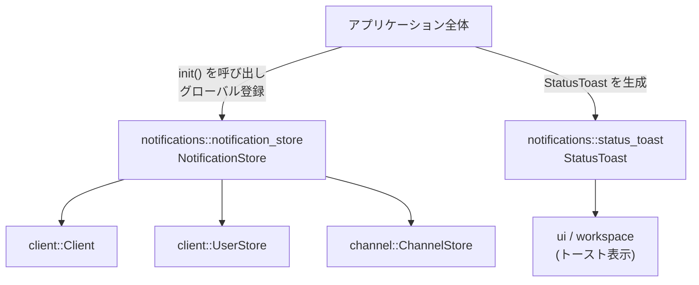
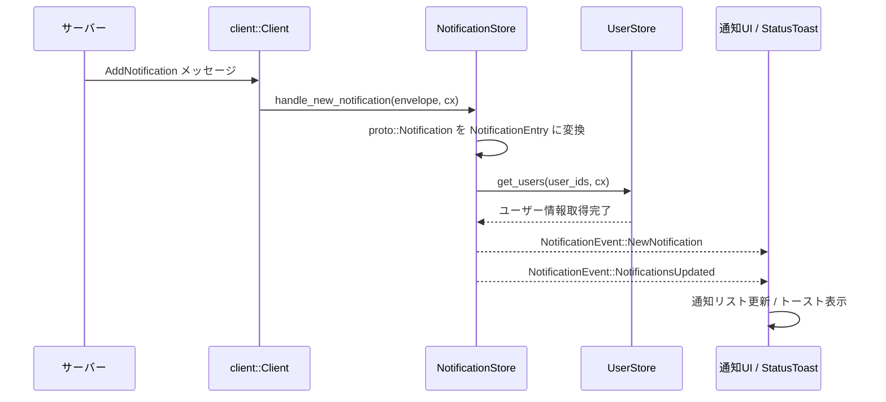

crates/notifications ディレクトリのコード構成と役割を説明します。

---

## 0. ざっくり一言

このディレクトリは、アプリケーション内の「通知」を扱うためのクレートです。  
サーバーから届く通知の一覧を管理する `NotificationStore` と、それらをトーストとして画面に表示する `StatusToast` コンポーネントを提供します。

---

## 1. このモジュールの役割

### 1.1 概要

- このクレートは、サーバーから届く通知をクライアント側で保持・更新し、UI に反映するための仕組みを提供します。
- 通知は `NotificationStore` に順序付きで蓄積され、未読件数や N 番目の最新通知などを効率よく取得できます。
- 通知やその他の状態メッセージを小さな「トースト」として表示する UI コンポーネント `StatusToast` も含まれます。

### 1.2 アーキテクチャ内での位置づけ

`NotificationStore` はネットワーククライアント (`client::Client`) と UI の間で通知データを仲介し、  
`StatusToast` は UI レイヤーでの表示を担当します。



- `notifications::notifications`（lib ルート）は `notification_store` を再公開し、`status_toast` モジュールを公開します。
- `NotificationStore` は
  - `client::Client` から通知メッセージを受け取り
  - `UserStore` や `ChannelStore` と連携して、通知への「承諾・拒否」などのアクションを実行します。
- `StatusToast` は UI クレート (`ui`) と `workspace::ToastView` と連携してトーストを描画します。

### 1.3 設計上のポイント

- **グローバルストア**
  - `init` 関数を通じて `NotificationStore` を `gpui::App` のグローバルとして登録し、どこからでも `NotificationStore::global` で参照できる構造になっています。
- **イベント駆動**
  - `NotificationStore` は `EventEmitter<NotificationEvent>` を実装し、通知の追加・削除・既読化などのイベントを UI に伝えます。
- **効率的なリスト管理**
  - `sum_tree::SumTree<NotificationEntry>` を用いて通知を保持し、件数や未読件数、ID やインデックスによる検索を効率的に行います。
- **非同期処理との統合**
  - 接続状態の監視や通知のロードは `gpui::Task` と `AsyncApp` により非同期に行われます。
- **UI コンポーネントの分離**
  - 通知のデータ管理 (`NotificationStore`) と視覚表現 (`StatusToast`) はモジュール単位で分離されており、それぞれ独立に利用できます。

---

## 2. 主要な機能一覧

- 通知ストアの初期化とグローバル登録（`init`, `NotificationStore::global`）
- 通知一覧の管理
  - 追加／削除／ページング読み込み（`load_more_notifications` など）
  - 接続・切断時の再読み込み（`handle_connect`, `handle_disconnect`）
- 通知の検索・集計
  - 総件数・未読件数の取得（`notification_count`, `unread_notification_count`）
  - N 番目の最新通知の取得（`notification_at`）
  - 通知 ID からの検索（`notification_for_id`）
- 通知への応答処理
  - 連絡先リクエストの承諾／拒否（`respond_to_notification` → `UserStore`）
  - チャンネル招待の承諾／拒否（`respond_to_notification` → `ChannelStore`）
- トースト UI コンポーネント
  - テキスト・アイコン・アクションボタン・閉じるボタン付きトーストの表示（`StatusToast`）
  - トースト用アイコンのラッパー（`ToastIcon`）
  - トーストのプレビュー／サンプルギャラリー（`StatusToast::preview`）

---

## 4. 関数・構造体の解説

### 4.1 主要な型一覧

| 型名 | 種別 | 定義ファイル | 役割 / 用途 |
|------|------|-------------|-------------|
| `NotificationStore` | 構造体 | `notification_store.rs` | 通知の一覧と状態（未読数など）を保持し、サーバーとの同期や通知への応答を管理するストアです。 |
| `NotificationEvent` | 列挙体 | `notification_store.rs` | 通知一覧の更新や個別通知の追加・削除・既読化を表すイベントです。UI はこれを購読してリスト表示を更新します。 |
| `NotificationEntry` | 構造体 | `notification_store.rs` | 単一の通知の情報（ID、本体、タイムスタンプ、既読フラグ、レスポンス）を表します。 |
| `NotificationSummary` | 構造体 | `notification_store.rs` | `SumTree` 用の集計情報（最大 ID、件数、未読数）を保持します。 |
| `ToastIcon` | 構造体 | `status_toast.rs` | トーストで使用するアイコンとその色をまとめた小さなユーティリティ型です。 |
| `StatusToast` | 構造体（コンポーネント） | `status_toast.rs` | ステータスや通知をトーストとして表示する UI コンポーネントです。`ToastView` として扱われます。 |

### 4.2 重要な関数・メソッド詳細（最大 7 件）

#### `init(client: Arc<Client>, user_store: Entity<UserStore>, cx: &mut App)`

**概要**

- `NotificationStore` を生成し、`gpui::App` のグローバルオブジェクトとして登録します。
- これにより、以降は `NotificationStore::global(cx)` からストアにアクセスできます。

**引数**

| 引数名 | 型 | 説明 |
|--------|----|------|
| `client` | `Arc<Client>` | サーバーとの接続や RPC を扱うクライアントです。通知の取得・受信に利用されます。 |
| `user_store` | `Entity<UserStore>` | ユーザー情報を管理するストアのエンティティです。通知と関連するユーザー情報の取得に使われます。 |
| `cx` | `&mut App` | `gpui` のアプリケーションコンテキストです。エンティティの生成やグローバル登録に使用します。 |

**戻り値**

- なし（`()`）。

**内部処理の流れ**

1. `cx.new` を使って `NotificationStore::new` を呼び出し、`Entity<NotificationStore>` を生成します。
2. 生成したエンティティを `GlobalNotificationStore` にラップし、`cx.set_global` でアプリ全体のグローバルとして登録します。

**Examples（使用例）**

```rust
use std::sync::Arc;                     // Arc を使って Client を共有するためにインポート
use gpui::{App, Entity};               // App と Entity 型をインポート
use client::{Client, UserStore};       // Client と UserStore をインポート
use notifications::init;               // このクレートの init 関数をインポート

fn setup_notifications(
    client: Arc<Client>,               // どこかで初期化された Client
    user_store: Entity<UserStore>,     // どこかで初期化された UserStore の Entity
    app: &mut App,                     // gpui アプリケーションコンテキスト
) {
    // NotificationStore を生成し、グローバルとして登録する
    init(client, user_store, app);
}
```

**Errors / Panics**

- この関数自体は `Result` を返さず、明示的なエラーハンドリングは行いません。
- 内部で呼び出される `App::new` や `App::set_global` の挙動（失敗条件など）は、このチャンクからは分かりません。

**Edge cases（エッジケース）**

- 同じ `App` に対して複数回 `init` を呼んだ場合の挙動は、このコードだけからは分かりません（上書きされるか、エラーになるかは `set_global` の仕様に依存します）。

**使用上の注意点**

- 通知機能を使う前に、アプリケーションの起動時など一度だけ呼び出しておく前提の設計になっています。

---

#### `NotificationStore::notification_at(&self, ix: usize) -> Option<&NotificationEntry>`

**概要**

- 「新しい順」で `ix` 番目の通知（0 が最新）を取得します。
- 通知が `ix + 1` 件未満の場合は `None` を返します。

**引数**

| 引数名 | 型 | 説明 |
|--------|----|------|
| `ix` | `usize` | 0 を最新としたときのインデックス（0: 最新、1: 2 番目に新しい、…）。 |

**戻り値**

- `Some(&NotificationEntry)`：該当する通知が存在する場合。
- `None`：インデックスが範囲外の場合（通知件数 ≤ `ix`）。

**内部処理の流れ**

1. 現在の通知総数を `self.notifications.summary().count` から取得します。
2. `ix >= count` の場合は `None` を返します。
3. 新しい順の `ix` 番目を、古い順のインデックス `count - 1 - ix` に変換します。
4. `SumTree::find::<Count, _>` を使って、その位置に対応する `NotificationEntry` を取得します。

**Examples（使用例）**

```rust
use gpui::{App, Entity};                    // App と Entity をインポート
use notifications::NotificationStore;       // NotificationStore をインポート

fn print_latest_notification(app: &mut App) {
    // グローバルな NotificationStore の Entity を取得する
    let store_entity: Entity<NotificationStore> = NotificationStore::global(app);

    // ストアを読み取り、最新の通知を表示する
    store_entity.read_with(app, |store, _cx| {
        if let Some(entry) = store.notification_at(0) {
            println!("最新の通知 ID: {}", entry.id);
            // entry.notification や entry.timestamp などもここで参照できます
        } else {
            println!("通知はまだありません");
        }
    });
}
```

**Errors / Panics**

- コード上、範囲外アクセスなどによる明示的な panic は行っていません。
- `SumTree::find` の仕様による panic 可能性については、このチャンクからは分かりません。

**Edge cases（エッジケース）**

- 通知が 0 件のとき: 常に `None` を返します。
- `ix` が非常に大きい値でも、そのまま比較されるため `ix >= count` となり `None` になります。

**使用上の注意点**

- インデックスは「新しい順」で解釈される点に注意が必要です（通常の配列のような古い順ではありません）。

---

#### `NotificationStore::load_more_notifications(&self, clear_old: bool, cx: &mut Context<Self>) -> Option<Task<Result<()>>>`

**概要**

- サーバーから追加の通知を読み込み、ストアに統合する非同期タスクを開始します。
- すでにすべての通知を読み込んでいて、`clear_old == false` の場合は `None` を返し、新しいタスクは作りません。

**引数**

| 引数名 | 型 | 説明 |
|--------|----|------|
| `clear_old` | `bool` | 既存の通知を一旦クリアしてから読み込むかどうか。接続し直した場合などに `true` が使われます。 |
| `cx` | `&mut Context<Self>` | `NotificationStore` 用の UI コンテキストです。タスク生成やイベント通知に使われます。 |

**戻り値**

- `Some(Task<Result<()>>)`: 通知のロード処理を行う非同期タスク。
- `None`: 追加で読み込む通知がないと判断された場合（`self.loaded_all_notifications && !clear_old`）。

**内部処理の流れ**

1. すでに全件読み込み済みかつ `clear_old == false` の場合は `None` を返して終了します。
2. そうでない場合、`before_id` を決定します:
   - `clear_old == true` の場合は `None`（最初から読み込み）。
   - それ以外では、現在の最古の通知 ID（`self.notifications.first().map(|entry| entry.id)`）。
3. `client.request(proto::GetNotifications { before_id })` を発行し、その Future を待つタスクを生成します。
4. タスク内で:
   - `this.upgrade()` により `Entity<NotificationStore>` を取得（ストアがまだ存在している場合）。
   - 応答の `done` フラグを元に `loaded_all_notifications` を更新。
   - `add_notifications` を呼び出して通知を `SumTree` に統合します。

**Examples（使用例）**

```rust
use gpui::{App, Context, Entity};              // App, Context, Entity をインポート
use notifications::NotificationStore;          // NotificationStore をインポート

fn load_initial_notifications(app: &mut App) {
    // グローバル NotificationStore の Entity を取得
    let store_entity: Entity<NotificationStore> = NotificationStore::global(app);

    // Context を使ってストアを更新する
    store_entity.update(app, |store, cx| {
        // 既存の通知をクリアしてから最初のページを読み込む
        if let Some(task) = store.load_more_notifications(true, cx) {
            // task は Result<()> を返す非同期タスク
            // 具体的な待ち方やライフサイクル管理は、このチャンクからは分かりません
            let _ = task;
        }
    });
}
```

**Errors / Panics**

- タスク内では `request.await?` により、RPC エラーが `anyhow::Result` の `Err` として扱われます。
- `this.upgrade()` に失敗した場合（ストアがドロップされた場合）は、`Context` 付きのエラーを返します。
- これらのエラーが上位でどのように扱われるか（ログのみか、UI への表示か）は、このチャンクからは分かりません。

**Edge cases（エッジケース）**

- サーバーからの応答で `notifications` が空の場合、そのページについては何も追加されませんが、`done` フラグが `true` なら `loaded_all_notifications` が設定されます。
- `clear_old == true` の場合、既存の通知はすべて削除された上で新しい通知が適用されます。

**使用上の注意点**

- 戻り値の `Task<Result<()>>` の扱い（`await` するか、フレームワークに任せるか）は呼び出し側の設計に依存します。
- 同時に複数回呼び出した場合の挙動は、この関数単体からは分かりません（RPC 側の挙動および UI スレッドとの調停に依存します）。

---

#### `NotificationStore::respond_to_notification(&mut self, notification: Notification, response: bool, cx: &mut Context<Self>)`

**概要**

- 通知に対するユーザーの応答（承諾 / 拒否）を処理します。
- 対応している通知種別:
  - `Notification::ContactRequest`
  - `Notification::ChannelInvitation`

**引数**

| 引数名 | 型 | 説明 |
|--------|----|------|
| `notification` | `rpc::Notification` | 応答対象の通知本体です。種別によって処理が分岐します。 |
| `response` | `bool` | 応答内容。`true` で承諾、`false` で拒否として扱われます。 |
| `cx` | `&mut Context<Self>` | `NotificationStore` 用コンテキストです。`UserStore` や `ChannelStore` の更新に利用されます。 |

**戻り値**

- なし（`()`）。

**内部処理の流れ**

1. `match notification` で通知種別を判定します。
2. `Notification::ContactRequest { sender_id }` の場合:
   - `user_store.update` を呼び出し、`UserStore::respond_to_contact_request(sender_id, response, cx)` を非同期に実行します。
3. `Notification::ChannelInvitation { channel_id, .. }` の場合:
   - `channel_store.update` を呼び出し、`ChannelStore::respond_to_channel_invite(ChannelId(channel_id), response, cx)` を非同期に実行します。
4. その他の通知種別は何も行いません。

**Examples（使用例）**

```rust
use gpui::{App, Entity};                       // App, Entity をインポート
use rpc::Notification;                         // 通知の列挙体をインポート
use notifications::NotificationStore;          // NotificationStore をインポート

fn accept_notification(app: &mut App, entry_id: u64) {
    let store_entity: Entity<NotificationStore> = NotificationStore::global(app);

    store_entity.update(app, |store, cx| {
        // ID から通知エントリを検索する
        if let Some(entry) = store.notification_for_id(entry_id) {
            // 通知の種別に応じて承諾処理を行う
            store.respond_to_notification(entry.notification.clone(), true, cx);
        }
    });
}
```

**Errors / Panics**

- `user_store.update` や `channel_store.update` が返すタスクは `.detach()` で切り離されています。
- 応答処理中のエラーがどのように扱われるか（ログのみかなど）は、このチャンクからは分かりません。

**Edge cases（エッジケース）**

- `ContactRequest` と `ChannelInvitation` 以外の通知に対して呼び出された場合は、何も行われません（サイレントに無視されます）。
- 同じ通知に対して複数回呼び出した場合のサーバー側の挙動は、このコードからは分かりません。

**使用上の注意点**

- UI 側では、通知種別を確認した上で適切な文言やボタンを表示する必要があります。
- `notification` 引数には `NotificationEntry.notification` を使うのが自然です。

---

#### `StatusToast::new(text: impl Into<SharedString>, cx: &mut App, f: impl FnOnce(Self, &mut Context<Self>) -> Self) -> Entity<Self>`

**概要**

- `StatusToast` コンポーネントを生成し、任意のカスタマイズ関数 `f` を通じてアイコンやアクションなどを設定します。
- 生成結果は `Entity<StatusToast>` として返され、UI ツリーに組み込まれます。

**引数**

| 引数名 | 型 | 説明 |
|--------|----|------|
| `text` | `impl Into<SharedString>` | トーストに表示するテキストです。 |
| `cx` | `&mut App` | `gpui` アプリケーションコンテキストです。コンポーネント生成に使用します。 |
| `f` | `impl FnOnce(Self, &mut Context<Self>) -> Self` | デフォルトの `StatusToast` を受け取り、アイコンやアクションなどを設定して返すためのクロージャです。 |

**戻り値**

- `Entity<StatusToast>`：生成されたトーストコンポーネントを表すエンティティです。

**内部処理の流れ**

1. `cx.new` を呼び出してコンポーネントを生成します。
2. 生成時に内部で `focus_handle` と `this_handle` を取得し、構造体フィールドにセットします。
3. 呼び出し側から渡されたクロージャ `f` に、初期状態の `StatusToast` と `Context<Self>` を渡し、その戻り値を最終的な状態として登録します。

**Examples（使用例）**

```rust
use gpui::{App, AnyElement};                   // App と AnyElement をインポート
use ui::prelude::*;                            // h_flex などの UI ビルダーをインポート
use ui::Color;                                 // 色指定用
use ui::IconName;                              // アイコン名
use notifications::{StatusToast, ToastIcon};   // StatusToast と ToastIcon をインポート

fn build_example_view(app: &mut App) -> AnyElement {
    // シンプルな成功トーストを生成する
    let toast = StatusToast::new("処理が完了しました", app, |this, _cx| {
        // チェックアイコンと成功色を設定したトーストにする
        this.icon(ToastIcon::new(IconName::Check).color(Color::Success))
    });

    // 生成したトーストを任意のコンテナに包んで返す
    h_flex().child(toast).into_any_element()
}
```

**Errors / Panics**

- この関数自体はエラーを返しません。
- `cx.new` や `cx.focus_handle` の内部挙動によるエラー・panic の可能性については、このチャンクからは分かりません。

**Edge cases（エッジケース）**

- カスタマイズ関数 `f` でアイコン・アクションを何も設定しない場合、テキストのみの素朴なトーストが生成されます。
- `text` が空文字列でも、そのまま空のラベルとして表示されます。

**使用上の注意点**

- `f` のクロージャ内で `StatusToast` を必ず返す必要があります（何も返さないとコンパイルエラーになります）。
- `this_handle` は内部で自動的に設定されるため、通常は `f` の中で直接参照する必要はありません。

---

#### `StatusToast::action(mut self, label: impl Into<SharedString>, f: impl Fn(&mut Window, &mut App) + 'static) -> Self`

**概要**

- トーストにアクションボタンを追加します。
- ボタンがクリックされるとトーストは `DismissEvent` を発火して閉じられ、その後で指定したコールバック `f` が実行されます。

**引数**

| 引数名 | 型 | 説明 |
|--------|----|------|
| `label` | `impl Into<SharedString>` | アクションボタンに表示するラベルです。 |
| `f` | `impl Fn(&mut Window, &mut App) + 'static` | ボタンがクリックされたときに実行されるコールバックです。`Window` と `App` への可変参照が渡されます。 |

**戻り値**

- `Self`：アクションが設定された `StatusToast` を返すため、メソッドチェーンに利用できます。

**内部処理の流れ**

1. `this_handle` をクロージャにクローンしてキャプチャします。
2. `ToastAction::new` を呼び出し:
   - ラベルを設定。
   - `Rc` でラップしたクリックハンドラを渡します。
3. クリックハンドラ内では:
   - `this_handle.update` を使って `DismissEvent` を発火し、トーストを閉じるよう依頼します。
   - その後、ユーザー指定のコールバック `f(window, cx)` を呼び出します。

**Examples（使用例）**

```rust
use gpui::{App, Window};                          // App, Window をインポート
use ui::prelude::*;                               // UI ビルダーをインポート
use notifications::StatusToast;                   // StatusToast をインポート

fn show_update_ready_toast(app: &mut App) {
    let toast = StatusToast::new("アップデートの準備ができました", app, |this, _cx| {
        // 「再起動」ボタン付きのトーストを作成する
        this.action("再起動", |window: &mut Window, cx: &mut App| {
            // ここで任意の処理を行う（例: 再起動ダイアログの表示など）
            let _ = (window, cx); // 例示のため未使用
        })
    });

    // あとは `toast` を任意のビュー階層に追加して表示します
    let _ = toast;
}
```

**Errors / Panics**

- このメソッド自体は `Result` を返さず、明示的なエラーハンドリングはありません。

**Edge cases（エッジケース）**

- `action` を複数回呼び出した場合、最後に設定した `ToastAction` で上書きされます（内部で `self.action = Some(...)` としているため）。
- コールバック `f` 内で panic が起きた場合の扱いは、このチャンクからは分かりません。

**使用上の注意点**

- `f` には `'static` 制約があるため、クロージャ内でキャプチャする値も `'static` にする必要があります（`Rc` や `Arc` などで包むなど）。

---

#### `impl Render for StatusToast { fn render(&mut self, _window: &mut Window, cx: &mut Context<Self>) -> impl IntoElement }`

**概要**

- `StatusToast` の見た目（レイアウトやスタイル）を定義するメソッドです。
- テキスト、アイコン、アクションボタン、閉じるボタンを組み合わせてトースト UI を構築します。

**引数**

| 引数名 | 型 | 説明 |
|--------|----|------|
| `_window` | `&mut Window` | 現在のウィンドウ。ここでは未使用です。 |
| `cx` | `&mut Context<Self>` | コンポーネント用コンテキストです。テーマ情報やイベント発行に利用されます。 |

**戻り値**

- `impl IntoElement`：UI ツリーに挿入可能な要素です。

**内部処理の流れ（概要）**

1. `has_action_or_dismiss` フラグを計算し、右パディング量を変えることで、ボタン有無に応じた余白を調整します。
2. `h_flex()` をベースに:
   - ID やエレベーション（影）、パディング、背景色などを設定。
   - `when_some(self.icon.as_ref(), ...)` でアイコンがある場合に先頭にアイコンを表示。
   - メインテキストを `Label` として表示。
   - `when_some(self.action.as_ref(), ...)` でアクションボタンを表示し、クリック時に `ToastAction` のコールバックを実行。
   - `when(self.show_dismiss, ...)` で閉じるボタン（× アイコン）を表示し、クリック時に `DismissEvent` を発火。

**Examples（使用例）**

- 通常は `Render` メソッドはフレームワークから自動的に呼ばれるため、アプリケーションコードから直接呼び出す必要はありません。
- 使用者は `StatusToast::new` などでコンポーネントを生成し、ビュー階層に追加するだけで十分です。

**Errors / Panics**

- メソッド内に明示的な `panic!` はありません。
- UI ビルダーや `when_some`, `when` の内部挙動によるエラー可能性は、このチャンクからは分かりません。

**Edge cases（エッジケース）**

- `icon`・`action`・`show_dismiss` のいずれも設定されていない場合、テキストだけのシンプルなトーストになります。
- `action` または `show_dismiss` がある場合は右パディングが小さくなり、ボタンの領域が確保されます。

**使用上の注意点**

- レイアウトを変更したい場合は、このメソッドの中身を編集することになります。スタイル指定はすべて `ui::prelude` のビルダー API を通じて行われています。

---

### 4.3 その他の関数・メソッド一覧

| 関数 / メソッド名 | 定義 | 役割（1 行） |
|-------------------|------|--------------|
| `NotificationStore::global(&App) -> Entity<Self>` | `notification_store.rs` | `init` で登録したグローバルな `NotificationStore` のエンティティを取得します。 |
| `NotificationStore::notification_count(&self) -> usize` | 同上 | 現在保持している通知の総件数を返します。 |
| `NotificationStore::unread_notification_count(&self) -> usize` | 同上 | 未読の通知件数を返します。 |
| `NotificationStore::notification_for_id(&self, id: u64) -> Option<&NotificationEntry>` | 同上 | 通知 ID から `NotificationEntry` を検索します。 |
| `NotificationStore::handle_connect(&mut self, cx)` | 同上 | 接続確立時に通知をクリアし、最初のページを読み込みます（非公開）。 |
| `NotificationStore::handle_disconnect(&mut self, cx)` | 同上 | 切断時に UI に変更を通知します（データは保持したまま）。 |
| `NotificationStore::handle_new_notification(...)` | 同上 | `AddNotification` メッセージを受け取り、`add_notifications` を呼び出すハンドラです。 |
| `NotificationStore::handle_delete_notification(...)` | 同上 | `DeleteNotification` メッセージを受け取り、該当通知を削除します。 |
| `NotificationStore::add_notifications(...)` | 同上 | proto から `NotificationEntry` への変換・ユーザー情報のプリフェッチ・`splice_notifications` の呼び出しを行います。 |
| `NotificationStore::splice_notifications(...)` | 同上 | `SumTree` 上の通知列を差し替え、必要なイベント（追加・削除・既読・範囲更新）を発火します。 |
| `StatusToast::icon(self, ToastIcon) -> Self` | `status_toast.rs` | トーストに表示するアイコンを設定します。 |
| `StatusToast::dismiss_button(self, bool) -> Self` | 同上 | 閉じるための「×」ボタンの表示有無を設定します。 |
| `impl ToastView for StatusToast::action(&self)` | 同上 | `ToastView` としてトーストのアクションを返します。 |
| `StatusToast::preview(...) -> Option<AnyElement>` | 同上 | 各種サンプルトーストを並べたプレビュー UI を返します。 |

---

## 5. データフロー

ここでは、典型的な「サーバーから通知が届き、UI にトーストが表示される」流れを整理します。

1. サーバーがクライアントに `AddNotification` メッセージを送信します。
2. `client::Client` がメッセージを受信し、`NotificationStore::handle_new_notification` が登録済みハンドラとして呼ばれます。
3. `NotificationStore` は proto から `NotificationEntry` を生成し、関連ユーザー情報を `UserStore` に問い合わせます。
4. `SumTree` に通知を挿入し、`NotificationEvent::NewNotification` と `NotificationEvent::NotificationsUpdated` を発火します。
5. UI 側のコンポーネントがこれらのイベントを受け取り、リスト表示や `StatusToast` の表示を更新します。



- `NotificationEvent::NotificationsUpdated { old_range, new_count }` により、UI はどの範囲のリストを再描画すべきかを判断できます。
- `NotificationEvent::NewNotification` により、新着通知に対して特別な演出（ハイライトやトースト表示など）を行うことができます。

---

## 6. 使い方（How to Use）

### 6.1 基本的な使用方法

ここでは、最小限の流れとして

1. `NotificationStore` の初期化
2. 通知件数の取得
3. シンプルな `StatusToast` の表示

というパターンを示します。

```rust
use std::sync::Arc;                           // Arc を使って Client を共有するため
use gpui::{App, AnyElement, Entity};         // App, AnyElement, Entity をインポート
use client::{Client, UserStore};             // Client と UserStore をインポート
use ui::prelude::*;                          // h_flex などの UI ビルダーをインポート
use ui::{Color, IconName};                   // 色とアイコン名をインポート
use notifications::{                         // このクレートから必要な型をインポート
    init, NotificationStore, StatusToast, ToastIcon,
};

fn setup(client: Arc<Client>, user_store: Entity<UserStore>, app: &mut App) {
    // 1. NotificationStore を初期化してグローバル登録する
    init(client, user_store, app);
}

fn build_main_view(app: &mut App) -> AnyElement {
    // 2. グローバル NotificationStore を取得し、通知件数を参照する
    let store_entity: Entity<NotificationStore> = NotificationStore::global(app);

    let mut notification_count = 0usize;      // 通知件数を格納する変数

    store_entity.read_with(app, |store, _cx| {
        notification_count = store.notification_count();  // 現在の通知件数を取得
    });

    // 3. 通知件数を表示するトーストを作ってみる（例として）
    let toast = StatusToast::new(
        format!("通知が {} 件あります", notification_count), // 表示テキスト
        app,                                                  // App コンテキスト
        |this, _cx| {                                         // カスタマイズクロージャ
            this.icon(ToastIcon::new(IconName::Bell).color(Color::Muted))  // 鐘のアイコンを付与
        },
    );

    // 生成したトーストをシンプルなコンテナに入れて返す
    h_flex().child(toast).into_any_element()
}
```

### 6.2 よくある使用パターン

#### パターン 1: スクロール末尾で追加の通知を読み込む

```rust
use gpui::{App, Entity};
use notifications::NotificationStore;

fn on_reach_bottom(app: &mut App) {
    let store_entity: Entity<NotificationStore> = NotificationStore::global(app);

    store_entity.update(app, |store, cx| {
        // 既存の通知を残したまま、さらに古い通知を読み込む
        if let Some(task) = store.load_more_notifications(false, cx) {
            // 必要に応じて task を記録したり、待機したりします
            let _ = task;
        }
    });
}
```

- `clear_old = false` により、既存の通知は保持されたまま、`before_id` で指定したより古い通知が追加されます。

#### パターン 2: 通知への応答（連絡先リクエストの承諾）

```rust
use gpui::{App, Entity};
use notifications::NotificationStore;

fn accept_contact_request(app: &mut App, notification_id: u64) {
    let store_entity: Entity<NotificationStore> = NotificationStore::global(app);

    store_entity.update(app, |store, cx| {
        if let Some(entry) = store.notification_for_id(notification_id) {
            // `ContactRequest` であれば、respond_to_notification が適切な処理を行う
            store.respond_to_notification(entry.notification.clone(), true, cx);
        }
    });
}
```

#### パターン 3: 種類の異なる StatusToast を作る

```rust
use gpui::{App, AnyElement};
use ui::prelude::*;
use ui::{Color, IconName};
use notifications::{StatusToast, ToastIcon};

fn build_toast_examples(app: &mut App) -> AnyElement {
    // 成功メッセージ
    let success = StatusToast::new("プッシュに成功しました", app, |this, _cx| {
        this.icon(ToastIcon::new(IconName::Check).color(Color::Success))
    });

    // 警告メッセージ + アクション
    let warning = StatusToast::new("設定が古くなっています", app, |this, _cx| {
        this.icon(ToastIcon::new(IconName::Warning).color(Color::Warning))
            .action("詳細", |_, _| {
                // 詳細ダイアログ表示など
            })
    });

    // 閉じるボタン付きメッセージ
    let dismissible = StatusToast::new("このメッセージは閉じることができます", app, |this, _cx| {
        this.dismiss_button(true)
    });

    v_flex()
        .gap_4()
        .children(vec![success.into_any_element(), warning.into_any_element(), dismissible.into_any_element()])
        .into_any_element()
}
```

### 6.3 使用上の注意点（まとめ）

- **初期化順序**
  - `NotificationStore::global` を使う前に、一度 `init` を呼んでグローバル登録しておく必要があります。
- **コンテキストの前提**
  - `NotificationStore` のメソッドで `Context<Self>` を受け取るものは、`Entity::update` などを通じて UI スレッド上の文脈から呼び出す前提になっています。
- **通知種別の扱い**
  - `respond_to_notification` は `ContactRequest` と `ChannelInvitation` のみを処理し、それ以外は無視します。UI 側で種別に応じたボタン表示を行う前提です。
- **ロードの打ち止め**
  - `load_more_notifications(false, cx)` が `None` を返した場合、その時点ではサーバーから取得すべき「さらに古い通知」がない状態を意味します。
- **トーストのライフサイクル**
  - `StatusToast` は `DismissEvent` を発火するだけで、実際にトーストを消す処理は親側の実装に依存します（このチャンクにはそのコードは含まれていません）。
- **アクションコールバック**
  - `StatusToast::action` で設定するコールバックは `'static` 制約があり、UI スレッド上で実行される前提です。重い処理は別タスクに委譲する設計が望ましいです。

---

## 7. 関連ファイル

| パス | 役割 / 関係 |
|------|------------|
| `notifications/Cargo.toml` | クレート名（`notifications`）、依存クレート（`client`, `channel`, `gpui`, `ui`, `workspace` など）や `test-support` 機能フラグを定義します。 |
| `notifications/src/notifications.rs` | ライブラリのエントリーポイントです。`mod notification_store;` と `pub use notification_store::*;` により `NotificationStore` 系を再公開し、`pub mod status_toast;` でトースト UI モジュールを公開します。 |
| `notifications/src/notification_store.rs` | 通知データのストア `NotificationStore` と、関連するイベント・エントリ型（`NotificationEvent`, `NotificationEntry` 等）の実装を含みます。サーバーとの同期やユーザー／チャンネルへの応答処理もここにあります。 |
| `notifications/src/status_toast.rs` | 通知や状態メッセージを表示する UI コンポーネント `StatusToast` と、補助型 `ToastIcon` の実装ファイルです。トーストのレイアウトとプレビューもここに定義されています。 |

このディレクトリ全体として、「通知データの取得・蓄積」と「通知の視覚的な表示」の両方を担うクレートになっています。
