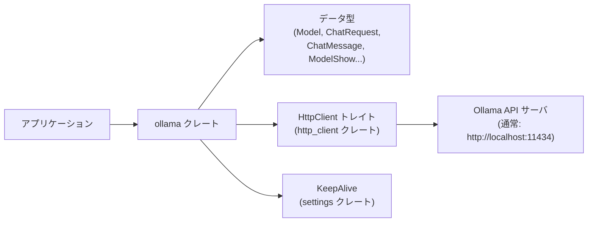
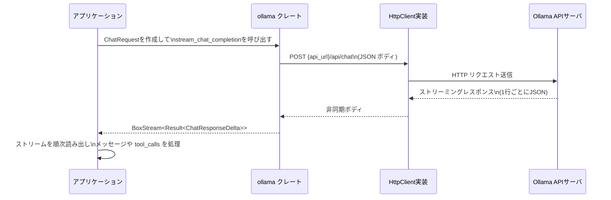

# ollama/ コード解説

---

## 1. ざっくり一言

- ローカルの Ollama サーバ（デフォルト `http://localhost:11434`）とやり取りするための **型定義と HTTP クライアントラッパ** を提供するクレートです。
- チャット補完（ストリーミング）、モデル一覧取得、モデル詳細取得（capabilities など）のための API と、その入出力 JSON を表現する構造体群を定義しています。

---

## 2. このモジュールの役割

### 2.1 概要

- このクレートは **Ollama HTTP API と安全にやり取りする** ことを目的としており、
  - チャットリクエスト・レスポンスの Rust 型定義
  - モデル一覧・モデル詳細情報の Rust 型定義
  - それらを用いて `/api/chat`, `/api/tags`, `/api/show` を呼び出す非同期関数  
  を提供します。
- HTTP クライアント実装や設定は外部に委ね、**プロトコルとデータ構造に集中**した薄いラッパになっています。

### 2.2 アーキテクチャ内での位置づけ

このディレクトリには実質 1 ファイル（`src/ollama.rs`）のみですが、外部クレートや Ollama サーバとの役割関係は次のようになります。



- アプリケーションは `ollama` クレートの型を使ってリクエストを組み立て、`HttpClient` 実装を渡して API を呼び出します。
- `ollama` クレートは HTTP の詳細実装（コネクション管理など）には依存せず、`HttpClient` トレイトのみを前提にしています。
- モデルの保持時間などの設定には `settings::KeepAlive` を再エクスポートして利用します。

### 2.3 設計上のポイント

- **状態レスな設計**  
  - グローバル状態や接続プールなどは持たず、すべての関数は引数として `&dyn HttpClient` や `ChatRequest` を受け取ります。
- **HTTP クライアントの抽象化**  
  - `http_client::HttpClient` トレイトに依存することで、具体的な HTTP 実装にロックインせずに利用できます。
- **serde による JSON 対応**  
  - すべてのリクエスト／レスポンス型は `Serialize` / `Deserialize` を実装し、Ollama API の JSON 形式と直接対応しています。
  - `#[serde(skip_serializing_if = "Option::is_none")]` などを使い、**不要なフィールドを送らない**よう制御しています。
- **ストリーミング対応**  
  - `/api/chat` のレスポンスは 1 行 1 JSON のストリームとして扱い、`BoxStream<'static, Result<ChatResponseDelta>>` としてアプリ側に渡します。
- **カスタムデシリアライズ**  
  - `ModelShow` はカスタム `Deserialize` 実装を持ち、`model_info` オブジェクトの中からアーキテクチャ名とコンテキスト長を抽出します。

---

## 3. 主要な機能一覧

- **チャットメッセージ型の定義 (`ChatMessage`)**  
  ユーザー／アシスタント／システム／ツールレスポンスを表現し、画像やツールコール、thinking テキストも扱います。
- **ツール呼び出し（Function calling）定義 (`OllamaTool*`)**  
  Ollama の「tools」機能用の関数ツール定義とツールコール結果を表現します。
- **チャットリクエスト／レスポンス定義 (`ChatRequest`, `ChatResponseDelta`)**  
  モデル名、メッセージ列、ストリーミング有無、各種オプションを含むリクエストと、逐次返ってくるレスポンスの 1 チャンクを表現します。
- **チャットオプション (`ChatOptions`)**  
  `num_ctx`, `num_predict`, `stop` トークン、温度、top_p など、Ollama のモデルパラメータを指定するための構造体です。
- **モデル一覧取得 (`get_models`)**  
  `/api/tags` を叩いてローカルに存在するモデル一覧 (`LocalModelListing`) を取得します。
- **モデル詳細取得 (`show_model`)**  
  `/api/show` を叩いて、モデルの capabilities や context length を含む詳細情報を `ModelShow` として取得します。
- **チャット補完のストリーミング呼び出し (`stream_chat_completion`)**  
  `/api/chat` に POST し、行単位の JSON を `ChatResponseDelta` のストリームとして返します。
- **モデル情報のローカル表現 (`Model`)**  
  アプリケーション側で扱いやすいモデル情報（表示名、最大トークン数、KeepAlive、機能サポートフラグ）を保持します。

---

## 4. 関数・構造体の解説

### 4.1 主要な型一覧

| 型名 | 種別 | 役割 / 用途 |
|------|------|-------------|
| `Model` | 構造体 | モデル名・表示名・最大トークン数・KeepAlive・各種機能サポートフラグを保持するアプリ側のモデル表現 |
| `ChatMessage` | enum | `assistant` / `user` / `system` / `tool` の 4 種のチャットメッセージを表現 |
| `OllamaToolCall` | 構造体 | アシスタントが返すツール呼び出し 1 件（ID と呼び出した関数） |
| `OllamaFunctionCall` | 構造体 | ツール呼び出しで実行すべき関数名と arguments(JSON) |
| `OllamaFunctionTool` | 構造体 | ツールとして公開する関数のメタ情報（名前、説明、parameters スキーマ） |
| `OllamaTool` | enum | 現状 `Function` バリアントのみ。Ollama API の `tools` 配列の要素を表現 |
| `ChatRequest` | 構造体 | `/api/chat` に送るリクエスト。モデル名・メッセージ列・ストリーム指定・KeepAlive・オプション・ツール・think フラグを含む |
| `ChatOptions` | 構造体 | モデルのコンテキスト長、予測トークン数、ストップトークン、temperature, top_p を指定 |
| `ChatResponseDelta` | 構造体 | ストリーミングチャットレスポンスの 1 チャンク（メッセージと done フラグなど） |
| `LocalModelsResponse` | 構造体 | `/api/tags` のトップレベルレスポンス。`models` 配列をラップ |
| `LocalModelListing` | 構造体 | モデル一覧の 1 要素。名前、更新日時、サイズ、digest、`ModelDetails` を含む |
| `LocalModel` | 構造体 | モデルの `modelfile`・`parameters`・`template` と `ModelDetails` を保持 |
| `ModelDetails` | 構造体 | フォーマット、ファミリ、パラメータサイズ、量子化レベルなどモデルの詳細 |
| `ModelShow` | 構造体 | `/api/show` の中から capabilities, architecture, context length を抜き出した要約 |
| `KeepAlive` | 構造体（外部） | `settings` クレートから再エクスポートされる型。モデルの保持時間などを表す |

#### ChatMessage の JSON 表現について

`ChatMessage` には `#[serde(tag = "role", rename_all = "lowercase")]` が付いているため、JSON では次のように表現されます。

- `ChatMessage::User { ... }` → `{"role":"user", "content": "...", ...}`
- `ChatMessage::Assistant { ... }` → `{"role":"assistant", "content": "...", "tool_calls": [...], ...}` など

このため、レスポンスを `ChatResponseDelta` にデシリアライズする際も `role` フィールドから自動で適切なバリアントが選択されます。

---

### 4.2 代表的な関数・メソッド詳細

#### `Model::new(...) -> Model`

```rust
impl Model {
    pub fn new(
        name: &str,
        display_name: Option<&str>,
        max_tokens: Option<u64>,
        supports_tools: Option<bool>,
        supports_vision: Option<bool>,
        supports_thinking: Option<bool>,
    ) -> Self { ... }
}
```

**概要**

- モデル名などから `Model` 構造体を組み立てるコンストラクタです。
- 表示名や最大トークン数を指定しない場合は、名前やデフォルト値から自動的に補完します。
- `keep_alive` は常に `KeepAlive::indefinite()` で初期化されます。

**引数**

| 引数名 | 型 | 説明 |
|--------|----|------|
| `name` | `&str` | モデルの内部名（例: `"llama3.2"`, `"llama3.2:latest"`） |
| `display_name` | `Option<&str>` | UI 用の表示名。`None` の場合は `name` かサフィックス除去版から自動生成 |
| `max_tokens` | `Option<u64>` | モデルの最大トークン数。`None` の場合は `get_max_tokens(name)` によるデフォルト |
| `supports_tools` | `Option<bool>` | ツール呼び出し機能をサポートするかどうか（不明な場合は `None`） |
| `supports_vision` | `Option<bool>` | 画像入力をサポートするかどうか |
| `supports_thinking` | `Option<bool>` | thinking モードをサポートするかどうか |

**戻り値**

- 指定された属性を持つ `Model` インスタンス。

**内部処理の流れ**

1. `name` を `String` にコピーして `Model::name` として保持します。
2. `display_name` が `Some` ならそれを `String` にして使用します。
3. `display_name` が `None` なら、`name` が `":latest"` で終わるかをチェックし、終わる場合はサフィックスを取り除いたものを `display_name` にします（例: `"llama3.2:latest"` → `"llama3.2"`）。
4. `max_tokens` が `Some` ならそのまま使用し、`None` の場合は `get_max_tokens(name)` の戻り値（現状 4096 固定）を使用します。
5. `keep_alive` は常に `Some(KeepAlive::indefinite())` に設定されます。
6. 各種サポートフラグは引数で渡された `Option<bool>` をそのまま保存します。

**Examples（使用例）**

```rust
use ollama::{Model, KeepAlive};

fn make_model() -> Model {
    // "llama3.2:latest" という名前のモデルを表す Model を生成する
    Model::new(
        "llama3.2:latest", // モデル ID
        None,              // 表示名は name から自動派生する（":latest" を取り除く）
        None,              // max_tokens はデフォルト (4096) になる
        Some(true),        // tools をサポートしている
        Some(false),       // vision はサポートしない
        None,              // thinking サポートは不明
    )
}
```

**Edge cases（エッジケース）**

- `display_name == None` かつ `name` に `":latest"` が含まれない場合  
  → `display_name` は `name` と同じ文字列になります。
- `max_tokens == None` の場合  
  → 常に 4096 が設定されます（`get_max_tokens` が現状定数を返すため）。
- `keep_alive` はコンストラクタを通る限り必ず `Some` になります。

**使用上の注意点**

- `get_max_tokens` は現状すべてのモデルに対して同じ値（4096）を返すため、実際のモデルの制限と一致しない場合があります。必要に応じてアプリ側で上書きする前提で扱うと安全です。
- `supports_*` フラグは `Option<bool>` であり、`None` は「情報なし」を意味します。単純に `unwrap_or(false)` するかどうかはアプリのポリシーに依存します。

---

#### `ModelShow::supports_tools(&self) -> bool` 他

```rust
impl ModelShow {
    pub fn supports_tools(&self) -> bool { ... }
    pub fn supports_vision(&self) -> bool { ... }
    pub fn supports_thinking(&self) -> bool { ... }
}
```

**概要**

- `/api/show` のレスポンスから得られた `capabilities` 配列に特定の機能名が含まれているかを判定します。
- `supports_tools` は `"tools"`、`supports_vision` は `"vision"`、`supports_thinking` は `"thinking"` の存在をチェックします。

**引数**

- いずれも `&self` のみです。

**戻り値**

- `bool` — `capabilities` に対応する機能名が含まれていれば `true`、そうでなければ `false`。

**内部処理の流れ**

- `self.capabilities.iter().any(|v| v == "tools")` のように、文字列一致で判定します。

**Examples（使用例）**

```rust
use ollama::ModelShow;

fn check_capabilities(show: &ModelShow) {
    if show.supports_tools() {
        println!("tools 機能をサポートしています");
    }
    if show.supports_vision() {
        println!("vision 機能をサポートしています");
    }
}
```

**Edge cases**

- `capabilities` が空配列の場合  
  → すべて `false` を返します。
- 大文字小文字は区別されます。コード上 `"tools"` のように小文字固定で比較しているため、サーバ側の表記が異なる場合は `false` になります。

**使用上の注意点**

- `ModelShow` はカスタムデシリアライズで `capabilities` を Vec<String> に読み込む前提のため、レスポンスの形式が大きく変わると期待通り動かなくなる可能性があります。
- `architecture` や `context_length` は別フィールドとして格納されるため、これらの値を使う場合は `Option` をチェックしてから利用する必要があります。

---

#### `stream_chat_completion(...) -> Result<BoxStream<'static, Result<ChatResponseDelta>>>`

```rust
pub async fn stream_chat_completion(
    client: &dyn HttpClient,
    api_url: &str,
    api_key: Option<&str>,
    request: ChatRequest,
) -> Result<BoxStream<'static, Result<ChatResponseDelta>>> { ... }
```

**概要**

- `/api/chat` エンドポイントにチャットリクエストを送信し、レスポンスを **1 行 1 JSON オブジェクト** として読みながら `ChatResponseDelta` のストリームを返します。
- HTTP エラー時にはレスポンスボディを読み切って `Err` を返し、アプリ側で原因を判断できるようにします。

**引数**

| 引数名 | 型 | 説明 |
|--------|----|------|
| `client` | `&dyn HttpClient` | HTTP リクエストを送信するためのトレイトオブジェクト |
| `api_url` | `&str` | ベース URL（例: `"http://localhost:11434"`） |
| `api_key` | `Option<&str>` | Bearer 認証に使う API キー。`Some` の場合 `Authorization: Bearer <key>` ヘッダが付与される |
| `request` | `ChatRequest` | シリアライズされて JSON ボディとして送信されるチャットリクエスト |

**戻り値**

- `Result<BoxStream<'static, Result<ChatResponseDelta>>>`  
  - Ok 時: 非同期ストリーム。各要素は 1 行ぶんの JSON をデシリアライズした `ChatResponseDelta` か、その行の読み込み／パースに失敗した場合の `Err(anyhow::Error)`。
  - Err 時: HTTP レベルで接続やステータスに問題があった場合のエラー。

**内部処理の流れ**

1. `"{api_url}/api/chat"` という URI を組み立てます。
2. `HttpRequest::builder()` で POST リクエストを構築し、`Content-Type: application/json` ヘッダを付与します。
3. `api_key` が `Some` の場合、`Authorization: Bearer {api_key}` ヘッダを追加します。
4. `request` を `serde_json::to_string` で JSON にシリアライズし、`AsyncBody` としてリクエストボディに設定します。
5. `client.send(request).await?` で HTTP リクエストを送信し、レスポンスを受け取ります。
6. ステータスコードが成功（2xx）であれば、ボディを `BufReader` に包み、`AsyncBufReadExt::lines()` で行単位のストリームに変換します。
7. 各行について `serde_json::from_str` で `ChatResponseDelta` にパースし、パースエラー時には `"Unable to parse chat response"` というコンテキスト付きエラーに変換します。
8. これを `BoxStream` として呼び出し元に返します。
9. ステータスコードが非成功の場合は、ボディ全体を `String` に読み込んだ上で、ステータスとボディを含むエラーメッセージで `bail!` します。

**Examples（使用例）**

ストリーミングでアシスタントのメッセージを逐次表示する例です（HTTP クライアント実装は外部から渡される想定です）。

```rust
use ollama::{
    ChatMessage, ChatRequest, ChatOptions, KeepAlive,
    stream_chat_completion, OLLAMA_API_URL,
};
use http_client::HttpClient;
use anyhow::Result;
use futures::StreamExt; // .next() を使うため

// 何らかの HttpClient 実装を受け取って利用する関数
async fn chat_example(client: &dyn HttpClient) -> Result<()> {
    // ユーザーメッセージを 1 件だけ含むリクエストを作成する
    let request = ChatRequest {
        model: "llama3.2".to_string(),             // 使用するモデル
        messages: vec![ChatMessage::User {
            content: "Hello, how are you?".into(), // ユーザーの入力
            images: None,                          // 画像はなし
        }],
        stream: true,                              // ストリーミングレスポンスを期待
        keep_alive: KeepAlive::default(),          // モデルの保持設定
        options: Some(ChatOptions {
            num_ctx: Some(4096),
            temperature: Some(0.7),
            ..Default::default()
        }),
        tools: vec![],                             // ツールは利用しない
        think: None,                               // thinking モードは指定しない
    };

    // Ollama にストリーミングチャットを開始
    let mut stream = stream_chat_completion(
        client,
        OLLAMA_API_URL,
        None,        // API キーなし
        request,
    ).await?;

    // ストリームから 1 チャンクずつ読み出して表示
    while let Some(delta_result) = stream.next().await {
        let delta = delta_result?; // 行の読み込み・パースエラーをここで伝播
        match delta.message {
            ChatMessage::Assistant { content, .. } => {
                print!("{content}");
            }
            _ => {} // それ以外の role はここでは無視
        }

        if delta.done {
            println!("\n--- done ---");
            break;
        }
    }

    Ok(())
}
```

**Errors / Panics**

- HTTP レベルのエラー  
  - `client.send` が失敗した場合、`Err` として戻されます。
  - ステータスコードが成功でない場合、レスポンスボディを読み込んだ上で  
    `"Failed to connect to Ollama API: {status} {body}"` というメッセージで `Err` になります。
- ストリーム内のエラー  
  - 行の読み込み失敗（ネットワーク切断など）や JSON パース失敗は、ストリーム要素の `Err(anyhow::Error)` として現れます。
- panic  
  - 関数内には明示的な `panic!` 呼び出しはありません。

**Edge cases**

- レスポンスが空行を含む場合  
  → 空文字列に対する `serde_json::from_str` はエラーになるため、その行の要素は `Err` になります。
- JSON 形式が `ChatResponseDelta` と整合しない場合（必須フィールドが欠けている等）  
  → パースエラーとして `Err` が返ります。
- `stream` フラグが `false` の場合  
  → サーバ側の挙動次第ですが、本関数は常に「行ごとの JSON」を期待して処理します。サーバが 1 行で完結した JSON を返す場合は 1 要素だけのストリームになります。

**使用上の注意点**

- 戻り値は「ストリームを生成すること」に対する `Result` であり、ストリームの各要素も `Result` です。  
  - したがって、**`await` とストリームの `.next().await` の両方でエラーをハンドリングする**必要があります。
- `api_url` は末尾スラッシュなしで渡す前提で `"{api_url}/api/chat"` を組み立てています。末尾にスラッシュがあると `//api/chat` になりますが、多くのサーバは許容します。
- サーバが返す JSON の仕様に依存しているため、Ollama のバージョンアップで形式が変わった場合はパースエラーになる可能性があります。

---

#### `get_models(...) -> Result<Vec<LocalModelListing>>`

```rust
pub async fn get_models(
    client: &dyn HttpClient,
    api_url: &str,
    api_key: Option<&str>,
) -> Result<Vec<LocalModelListing>> { ... }
```

**概要**

- `/api/tags` エンドポイントを呼び出し、ローカルに存在するモデル一覧を `Vec<LocalModelListing>` として取得します。

**引数**

| 引数名 | 型 | 説明 |
|--------|----|------|
| `client` | `&dyn HttpClient` | HTTP クライアント実装 |
| `api_url` | `&str` | ベース URL |
| `api_key` | `Option<&str>` | Bearer API キー（あれば付与） |

**戻り値**

- 成功時: `Vec<LocalModelListing>`  
  - それぞれの要素には `name`, `modified_at`, `size`, `digest`, `details` などが含まれます。
- 失敗時: `anyhow::Error`（HTTP エラーまたは JSON パースエラー）。

**内部処理の流れ**

1. `"{api_url}/api/tags"` を URI として組み立てます。
2. GET リクエストを構築し、`Accept: application/json` ヘッダを設定します。
3. `api_key` があれば `Authorization` ヘッダを設定します。
4. ボディは空 (`AsyncBody::default()`) で送信します。
5. レスポンスボディをすべて `String` に読み込みます。
6. ステータスコードが成功でなければ、ステータスとボディを含むエラーメッセージで `Err` を返します。
7. 成功なら、ボディを `LocalModelsResponse` にデシリアライズし、その `models` フィールドを返します。

**Examples（使用例）**

```rust
use ollama::{get_models, LocalModelListing, OLLAMA_API_URL};
use http_client::HttpClient;
use anyhow::Result;

async fn list_models(client: &dyn HttpClient) -> Result<()> {
    let models: Vec<LocalModelListing> = get_models(client, OLLAMA_API_URL, None).await?;

    for model in models {
        println!("{} (size: {} bytes)", model.name, model.size);
    }

    Ok(())
}
```

**Edge cases**

- `/api/tags` のレスポンス形式が `{"models": [...]}` でない場合  
  → デシリアライズエラーになります。
- ステータスコードが非成功（4xx/5xx 等）の場合  
  → ボディ内容を含むエラーが返るため、ログに出すことでサーバ側のエラーメッセージを確認できます。

**使用上の注意点**

- モデル数が多い場合、レスポンスボディのサイズも大きくなります。この関数はボディを丸ごと `String` に読み込むため、大量のモデルがある環境ではメモリ使用量に注意が必要です。

---

#### `show_model(...) -> Result<ModelShow>`

```rust
pub async fn show_model(
    client: &dyn HttpClient,
    api_url: &str,
    api_key: Option<&str>,
    model: &str,
) -> Result<ModelShow> { ... }
```

**概要**

- `/api/show` エンドポイントを呼び出し、指定したモデルの詳細情報を取得して `ModelShow` として返します。
- `ModelShow` には capabilities（例: `"completion"`, `"tools"`）、アーキテクチャ名、コンテキスト長が格納されます。

**引数**

| 引数名 | 型 | 説明 |
|--------|----|------|
| `client` | `&dyn HttpClient` | HTTP クライアント実装 |
| `api_url` | `&str` | ベース URL |
| `api_key` | `Option<&str>` | Bearer API キー |
| `model` | `&str` | 対象モデルの名前（例: `"llama3.2:3b"`） |

**戻り値**

- 成功時: `ModelShow`  
  - `capabilities`: `Vec<String>` — `"completion"`, `"tools"` など  
  - `architecture`: `Option<String>` — 例: `"llama"`  
  - `context_length`: `Option<u64>` — 例: `Some(131072)` など
- 失敗時: `anyhow::Error`。

**内部処理の流れ**

1. `"{api_url}/api/show"` を URI として組み立てます。
2. POST リクエストを構築し、`Content-Type: application/json` ヘッダを設定します。
3. `api_key` があれば `Authorization` ヘッダを設定します。
4. ボディとして `{"model": model}` を JSON 文字列にして送信します。
5. レスポンスボディをすべて `String` に読み込みます。
6. ステータスコードが成功でなければ、ステータスとボディを含むエラーメッセージで `Err` を返します。
7. 成功なら、ボディを `ModelShow` にデシリアライズして返します。

`ModelShow` のデシリアライズでは以下を行います（コードから読み取れる範囲）:

- トップレベルの `"capabilities"` → `Vec<String>` として読み込む。
- `"model_info"` オブジェクトを `serde_json::Value` として読み込み:
  - `"general.architecture"` から `architecture` を取得（文字列として）。
  - `architecture` が `Some("llama")` なら `"llama.context_length"` など、`"<arch>.context_length"` キーから `context_length` を取得。

**Examples（使用例）**

```rust
use ollama::{show_model, OLLAMA_API_URL};
use http_client::HttpClient;
use anyhow::Result;

async fn inspect_model(client: &dyn HttpClient) -> Result<()> {
    let info = show_model(client, OLLAMA_API_URL, None, "llama3.2:3b").await?;

    println!("capabilities: {:?}", info.capabilities);
    println!("architecture: {:?}", info.architecture);
    println!("context length: {:?}", info.context_length);

    if info.supports_tools() {
        println!("このモデルは tools をサポートします");
    }

    Ok(())
}
```

**Edge cases**

- レスポンスに `"model_info"` が含まれない、またはオブジェクトでない場合  
  → `architecture` と `context_length` は `None` のままになります。
- `"general.architecture"` キーが存在しない場合  
  → `architecture` は `None`、`context_length` も検索されません。
- `"<arch>.context_length"` キーが存在しない、あるいは数値でない場合  
  → `context_length` は `None` になります。
- `capabilities` フィールドが存在しない場合  
  → 空の `Vec<String>` として解釈されます（初期値が空ベクタのため）。

**使用上の注意点**

- `architecture` と `context_length` は `Option` です。`unwrap` するとパニックになる可能性があるため、`if let` などで存在確認をしてから利用するのが前提になります。
- `ModelShow` はレスポンスの一部の情報のみを抽出しており、ライセンスやテンソルなど他の情報は保持していません。必要に応じて別途 JSON を解析する必要があります。

---

### 4.3 その他の型・関数に関する補足

- `ChatOptions`  
  - すべてのフィールドが `Option` かつ `#[serde(skip_serializing_if = "Option::is_none")]` 付きのため、
    - 何も指定しない `ChatOptions::default()` は JSON で `{}` にシリアライズされます（テストで確認されています）。
    - `stop: None` の場合、`"stop"` フィールド自体が JSON から省略されます。  
      Ollama にモデルのデフォルトストップトークンを使わせたい場合に重要です。
- `ChatMessage` の `images` フィールド  
  - `User` / `Assistant` バリアントに `images: Option<Vec<String>>` があり、テストでは base64 文字列を入れています。
  - `None` の場合 `"images"` フィールドはシリアライズされません。
- `ChatResponseDelta`  
  - テストでは `total_duration` など、構造体に存在しないフィールドを含む JSON も問題なくデシリアライズされることが確認されています（serde のデフォルト挙動で、未知フィールドは無視されます）。

---

## 5. データフロー

ここでは、代表的なシナリオである「チャット補完のストリーミングレスポンス」を例に、データの流れを示します。

1. アプリケーションが `ChatMessage` のリストとモデル名から `ChatRequest` を構築する。
2. `stream_chat_completion` に `&dyn HttpClient` と `ChatRequest` を渡す。
3. `ollama` クレートが `/api/chat` に POST し、レスポンスボディを行単位で読み出す。
4. 各行の JSON が `ChatResponseDelta` にパースされ、ストリームとしてアプリへ返る。
5. アプリケーションはストリームを読みながら `ChatMessage::Assistant` の `content` や `tool_calls` を処理する。



- `ChatResponseDelta.message` の `role` に応じて、アプリケーション側で UI 更新やツール実行などの処理を行うことを想定しています。
- `done == true` となる最後のチャンクを受け取ったタイミングで、アプリケーションは対話の 1 ターンを終了できます。

---

## 6. 使い方（How to Use）

### 6.1 基本的な使用方法

#### 6.1.1 シンプルなチャット（ストリーミング）

もっとも基本的なパターンは、ユーザーメッセージ 1 件に対してストリーミングで応答を受け取る形です。

```rust
use ollama::{
    ChatMessage, ChatRequest, ChatOptions, KeepAlive,
    stream_chat_completion, OLLAMA_API_URL,
};
use http_client::HttpClient;
use anyhow::Result;
use futures::StreamExt;

async fn basic_chat(client: &dyn HttpClient) -> Result<()> {
    // ユーザーメッセージを 1 つだけ送る
    let messages = vec![
        ChatMessage::User {
            content: "Explain Rust ownership in one paragraph.".into(),
            images: None,
        }
    ];

    let request = ChatRequest {
        model: "llama3.2".into(),
        messages,
        stream: true,                  // ストリーミングで受け取る
        keep_alive: KeepAlive::default(),
        options: Some(ChatOptions {
            num_ctx: Some(4096),
            temperature: Some(0.7),
            ..Default::default()
        }),
        tools: vec![],                 // 今回はツール機能は使わない
        think: None,
    };

    let mut stream = stream_chat_completion(client, OLLAMA_API_URL, None, request).await?;

    while let Some(delta_result) = stream.next().await {
        let delta = delta_result?;
        if let ChatMessage::Assistant { content, .. } = delta.message {
            print!("{content}");
        }
        if delta.done {
            println!();
            break;
        }
    }

    Ok(())
}
```

### 6.2 よくある使用パターン

#### 6.2.1 モデル一覧を取得して表示する

```rust
use ollama::{get_models, LocalModelListing, OLLAMA_API_URL};
use http_client::HttpClient;
use anyhow::Result;

async fn print_model_list(client: &dyn HttpClient) -> Result<()> {
    let models: Vec<LocalModelListing> = get_models(client, OLLAMA_API_URL, None).await?;

    for m in models {
        println!(
            "{} ({}), size: {} bytes",
            m.name, m.modified_at, m.size
        );
    }

    Ok(())
}
```

#### 6.2.2 モデルの capabilities を確認してからチャットする

```rust
use ollama::{show_model, ChatMessage, ChatRequest, ChatOptions, KeepAlive, OLLAMA_API_URL, stream_chat_completion};
use http_client::HttpClient;
use anyhow::Result;
use futures::StreamExt;

async fn chat_if_tools_supported(client: &dyn HttpClient) -> Result<()> {
    let model_name = "llama3.2";

    // モデルの capabilities を事前に確認
    let info = show_model(client, OLLAMA_API_URL, None, model_name).await?;
    if !info.supports_tools() {
        println!("{model_name} は tools をサポートしていません");
        return Ok(());
    }

    let request = ChatRequest {
        model: model_name.into(),
        messages: vec![ChatMessage::User {
            content: "List three cities in Japan.".into(),
            images: None,
        }],
        stream: true,
        keep_alive: KeepAlive::default(),
        options: Some(ChatOptions::default()),
        tools: vec![], // 実際に tools を使った例は、function ツール定義を追加する必要があります
        think: None,
    };

    let mut stream = stream_chat_completion(client, OLLAMA_API_URL, None, request).await?;
    while let Some(delta_result) = stream.next().await {
        let delta = delta_result?;
        if let ChatMessage::Assistant { content, .. } = delta.message {
            print!("{content}");
        }
        if delta.done {
            println!();
            break;
        }
    }

    Ok(())
}
```

#### 6.2.3 画像付きプロンプトを送る

テストコードに基づく形で、base64 エンコード済み画像を `images` に含めるパターンです。

```rust
use ollama::{ChatMessage, ChatRequest, KeepAlive, ChatOptions, stream_chat_completion, OLLAMA_API_URL};
use http_client::HttpClient;
use anyhow::Result;
use futures::StreamExt;

async fn vision_prompt(client: &dyn HttpClient, base64_image: String) -> Result<()> {
    let request = ChatRequest {
        model: "llava".to_string(), // 画像入力をサポートするモデルを想定
        messages: vec![ChatMessage::User {
            content: "What do you see in this image?".to_string(),
            images: Some(vec![base64_image]), // base64 文字列をそのまま渡す
        }],
        stream: false,                     // 非ストリーミングなレスポンスを想定
        keep_alive: KeepAlive::default(),
        options: None,
        tools: vec![],
        think: None,
    };

    let mut stream = stream_chat_completion(client, OLLAMA_API_URL, None, request).await?;

    while let Some(delta_result) = stream.next().await {
        let delta = delta_result?;
        if let ChatMessage::Assistant { content, .. } = delta.message {
            println!("Assistant: {content}");
        }
    }

    Ok(())
}
```

### 6.3 使用上の注意点

- **エラー処理**
  - `stream_chat_completion` / `get_models` / `show_model` はすべて `Result` を返します。  
    ネットワークエラー・HTTP ステータスエラー・JSON パースエラーを適切に処理する必要があります。
  - `stream_chat_completion` の戻り値は「ストリーム自体の生成」と「各行の処理」の 2 段階でエラーが発生しうる点に注意が必要です。

- **`ChatOptions::stop` の扱い**
  - `stop: None` の場合、`"stop"` フィールドは **JSON に含まれません**（テストで確認済み）。  
    これにより、Ollama はモデルのデフォルトストップトークンを使用できます。
  - `stop: Some(vec!["<|eot_id|>".into()])` のように設定すると `"stop": ["<|eot_id|>"]` が送信されます。
  - 「フィールドを送らない」と「空リストを送る（`Some(vec![])`）」は意味が異なる可能性があるため、明示的に使い分ける必要があります。

- **`ModelShow` の `Option` フィールド**
  - `architecture` や `context_length` は存在しない場合に `None` になります。  
    直接 `unwrap()` せず、`if let Some(ctx) = info.context_length` のように扱うことが前提です。

- **画像（`images` フィールド）の扱い**
  - `ChatMessage::User` / `ChatMessage::Assistant` の `images` は `Option<Vec<String>>` です。  
    `Some` の場合、配列の各要素は base64 エンコードされた画像データを文字列として持つことを想定しています（テストコードより）。
  - `None` の場合 `"images"` フィールド自体が省略されるため、サーバ側も「画像なし」と解釈します。

- **API URL の指定**
  - 既定値として `OLLAMA_API_URL` (`"http://localhost:11434"`) が定義されていますが、`api_url` 引数で任意の URL を指定できます。
  - `api_url` は末尾スラッシュなしで渡す想定のため、異なる形式を使う場合は組み立てられるパスに注意が必要です。

- **並行実行**
  - クレート自体はスレッドセーフな共有状態を持たないため、`&dyn HttpClient` の実装がスレッドセーフであれば、  
    複数タスクから同じ HTTP クライアントを共有してこれらの関数を並行に呼び出すことが可能です。

---

## 7. 関連ファイル

| パス | 役割 / 関係 |
|------|------------|
| `ollama/Cargo.toml` | クレートのメタデータと依存関係。`lib` のエントリーポイントを `src/ollama.rs` に指定し、`schemars` 機能フラグを定義しています。 |
| `ollama/src/ollama.rs` | 本レポートで解説した全ての型・関数が定義されているライブラリ本体です。 |
| `settings` クレート（本チャンク外） | `KeepAlive` 型を提供し、このクレートでは `pub use settings::KeepAlive;` により再エクスポートされています。 |
| `http_client` クレート（本チャンク外） | `HttpClient`, `AsyncBody`, `HttpRequestExt` などの HTTP 抽象を提供し、このクレートの非同期 API 呼び出しの基盤となります。 |

このディレクトリ内では、`src/ollama.rs` が完結した API を提供しており、他のファイルに処理が分散している様子は見られません。外部クレート（`http_client`, `settings` など）との連携を通じて、Ollama サーバとのやり取りを実現する構成になっています。
