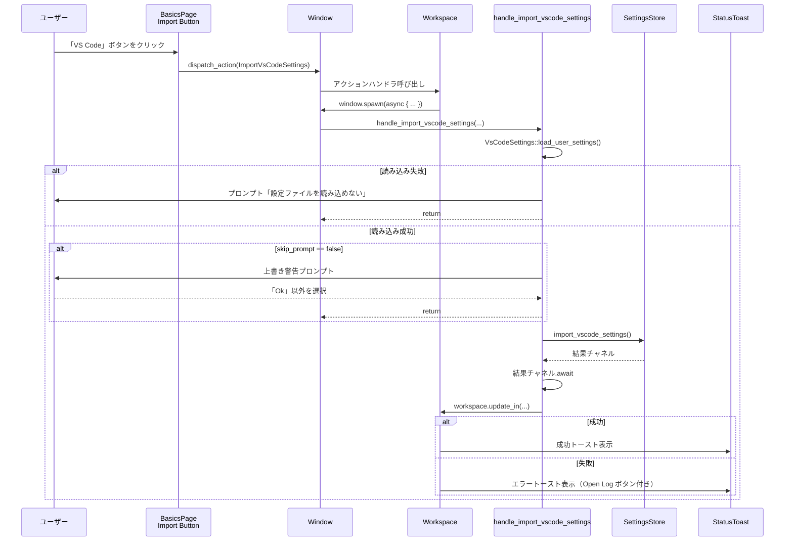

# onboarding/ ディレクトリ解説

## 1. ざっくり一言

Zed エディタの「オンボーディング／ウェルカム」体験（最初の設定画面）を実装するクレートです。  
テーマ・キーマップ・Vim モード・テレメトリなどの初期設定 UI と、VS Code / Cursor からの設定インポート、マルチバッファ機能のヒント表示などをまとめています。

---

## 2. このモジュールの役割

### 2.1 概要

- このクレートは **Zed 起動直後のオンボーディングフロー** を実装し、ユーザーが最初に行う各種設定をまとめて行える画面を提供します。
- 具体的には、
  - オンボーディングページ（`Onboarding` アイテム）の生成・遷移
  - テーマ／テーマモード／ベースキーマップ／Vim モード／プロジェクト信頼設定／テレメトリ設定の UI
  - VS Code / Cursor からの設定インポート機能
  - マルチバッファ機能のヒントをツールバーに表示するコンポーネント
  - テーマ一覧用のプレビュータイルコンポーネント
  を提供します。

### 2.2 アーキテクチャ内での位置づけ

主要モジュールと外部依存の関係を簡略化すると、次のようになります。

```mermaid
graph TD
    A[onboarding (lib root)] --> B[basics_page]
    A --> C[base_keymap_picker]
    A --> D[multibuffer_hint]
    A --> E[theme_preview]
    A --> F[workspace]
    A --> G[gpui]
    A --> H[settings/theme<br/>theme_settings]
    A --> I[db/KeyValueStore]
    A --> J[notifications<br/>StatusToast]
```

- `onboarding.rs` がクレートのエントリポイントで、`init` 関数から各モジュールを初期化します。
- UI 表示は `gpui` と `workspace` クレートの仕組み（`Item`, `SerializableItem`, `ToolbarItemView` など）に乗っています。
- 設定の読み書きは `settings` / `theme_settings` / `Fs` / `SettingsStore` を通じて行われます。
- 簡易的な永続化には `db::kvp::KeyValueStore`（例: マルチバッファヒントの表示回数）や専用の DB ドメイン `OnboardingPagesDb` が使われています。

### 2.3 設計上のポイント

- **責務分割**
  - 画面全体の制御とワークスペースとの連携: `onboarding.rs`（`Onboarding` 型）
  - 個別設定 UI（テーマ、キーマップ、Vim 等）: `basics_page.rs`
  - ベースキーマップを検索付きで変更するモーダル: `base_keymap_picker.rs`
  - 結果マルチバッファに関するヒント（ツールバー項目）: `multibuffer_hint.rs`
  - テーマをサムネイル表示する汎用コンポーネント: `theme_preview.rs`
- **状態管理**
  - グローバル設定は `SettingsStore` や各種 `*Settings::get_global` を使用。
  - 一部状態（例: マルチバッファヒントの表示回数）は `KeyValueStore` + `AtomicUsize` で永続化。
  - Onboarding ページ自体は `workspace::SerializableItem` と独自 DB (`OnboardingPagesDb`) により永続化可能。
- **非同期処理**
  - 設定インポート（VS Code / Cursor）は `AsyncWindowContext` で非同期に実行。
  - テーマプレビューのためのフォントプリフェッチも非同期で行い、完了後に `cx.notify()` で再描画。
  - ベースキーマップ検索はバックグラウンド executor で fuzzy マッチング。
- **エラーハンドリング／ユーザー通知**
  - 設定インポートに失敗した場合はプロンプトやトーストでユーザーに通知。
  - テレメトリイベント（`telemetry::event!`）を各操作に紐付けて計測。

---

## 3. 主要な機能一覧

このクレートが提供する主な機能は次の通りです。

- オンボーディングページ (`Onboarding`) の表示とワークスペースへの追加
- 既存ワークスペースや新規ワークスペースでの「Welcome / Onboarding」画面の表示切り替え
- テーマ選択:
  - ライト／ダーク／システムモードの切り替え
  - 代表的なテーマファミリー（One / Ayu / Gruvbox）のプレビューと選択
- ベースキーマップ選択:
  - Onboarding ページ上のアイコン付きトグルボタンによる選択
  - 別途モーダルピッカー（検索付き）による選択
- Vim モード切り替え、プロジェクト自動信頼（Worktree Auto Trust）の切り替え
- テレメトリ設定（メトリクス／クラッシュレポート）のオン・オフ
- VS Code / Cursor からのユーザー設定インポート（上書き注意プロンプト付き）
- 結果マルチバッファの使い方を案内するツールバーヒント（表示回数の制限と永続カウンタ）
- テーマプレビュー用のサムネイルコンポーネント (`ThemePreviewTile`) の提供とカタログ表示

---

## 4. 関数・構造体の解説

### 4.1 主要な型一覧

| 名前 | 種別 | 定義ファイル | 役割 / 用途 |
|------|------|--------------|-------------|
| `Onboarding` | 構造体 | `onboarding.rs` | オンボーディングページを表す `Item` 実装。UI レイアウトとアクション処理を担当します。 |
| `ImportVsCodeSettings` | 構造体 (Action) | `onboarding.rs` | VS Code から設定をインポートするアクションのペイロード。`skip_prompt` フラグを持ちます。 |
| `ImportCursorSettings` | 構造体 (Action) | `onboarding.rs` | Cursor から設定をインポートするアクションのペイロード。 |
| `SettingsImportState` | 構造体 (Global) | `onboarding.rs` | VS Code / Cursor からの設定インポート済みフラグを保持するグローバル状態。 |
| `MultibufferHint` | 構造体 | `multibuffer_hint.rs` | ツールバーに表示される「マルチバッファを編集に使える」旨のヒント。表示回数を制限します。 |
| `BaseKeymapSelector` | 構造体 | `base_keymap_picker.rs` | ベースキーマップを選ぶモーダルビュー。内部に `Picker` を持ちます。 |
| `BaseKeymapSelectorDelegate` | 構造体 | `base_keymap_picker.rs` | `PickerDelegate` 実装。キーマップ候補の一覧・フィルタリング・確定処理を担当します。 |
| `ThemePreviewTile` | 構造体 (Component) | `theme_preview.rs` | テーマを抽象的なエディタサムネイルとして表示する UI コンポーネント。 |
| `ThemePreviewStyle` | 列挙体 | `theme_preview.rs` | テーマプレビューの描画スタイル（枠あり／なし／サイドバイサイド）を指定します。 |

このほか、オンボーディングで利用される UI セクションごとに `render_*` 系の関数が `basics_page.rs` に多数定義されています。

### 4.2 重要な関数・メソッドの詳細（抜粋）

ここでは、ディレクトリ全体の挙動を理解するうえで重要な関数・メソッドを 7 件取り上げます。

#### 4.2.1 `init(cx: &mut App)`

定義: `onboarding::init`

**概要**

- アプリケーション起動時に呼び出される初期化関数です。
- ワークスペースに対してオンボーディング関連のアクションハンドラやシリアライズ設定を登録し、ベースキーマップピッカーも初期化します。

**引数**

| 引数名 | 型 | 説明 |
|--------|----|------|
| `cx` | `&mut App` | アプリケーション全体のコンテキスト。グローバルなイベントやオブザーバを登録します。 |

**内部処理の流れ**

- `Workspace` の新規作成を監視し、以下のアクションを登録します。
  - `ResetHints`: 呼び出されると `MultibufferHint::set_count(0, cx)` でヒント表示回数をリセット。
  - `ImportVsCodeSettings` / `ImportCursorSettings`:
    - `window.spawn` で `handle_import_vscode_settings` を非同期に実行。
- `OpenOnboarding` アクションを購読し、オンボーディングページをアクティブペインに追加またはフォーカスします。
- `ShowWelcome` アクションを購読し、`WelcomePage` を開くか既存のものにフォーカスします。
- `base_keymap_picker::init(cx)` を呼んで、ベースキーマップモーダルのトグルアクションを Workspace に登録します。
- `register_serializable_item::<Onboarding>` および `::<WelcomePage>` を呼び、ワークスペースのシリアライズ対象として登録します。

**Examples（使用例）**

アプリケーション側の起動処理で 1 回だけ呼び出します。

```rust
// main.rs 想定

fn main() {
    gpui::App::new(|cx| {
        // 他のドメインの init
        project::init(cx);
        settings::init(cx);

        // オンボーディング機能の初期化
        onboarding::init(cx);
    })
    .run();
}
```

**使用上の注意点**

- `init` は **アプリケーション全体で一度だけ** 呼び出す前提の設計です（複数回呼び出すとアクション登録が重複する可能性があります）。
- `WelcomePage` や `Workspace` などはこのクレート外で定義されており、そちらが正しく初期化されている前提です。

---

#### 4.2.2 `show_onboarding_view(app_state: Arc<AppState>, cx: &mut App) -> Task<anyhow::Result<()>>`

**概要**

- 「オンボーディングビュー」を新しいワークスペース／ウィンドウとして開く関数です。
- 初回起動時など、外部から明示的にオンボーディング画面を表示したい場合に使われます。

**引数**

| 引数名 | 型 | 説明 |
|--------|----|------|
| `app_state` | `Arc<AppState>` | アプリケーションの状態（ファイルシステムなどを含む） |
| `cx` | `&mut App` | アプリケーションコンテキスト |

**戻り値**

- `Task<anyhow::Result<()>>`  
  `open_new` の非同期処理を表すタスク。エラーは `anyhow::Error` でラップされます。

**内部処理の流れ**

- Telemetry イベント `"Onboarding Page Opened"` を送信。
- `open_new` を呼び、新しい `Workspace` を開く。
  - 左ドック (`DockPosition::Left`) をトグル表示。
  - `Onboarding::new(workspace, cx)` でオンボーディングページを生成し、センターペインに追加。
  - ウィンドウフォーカスを `onboarding_page.focus_handle(cx)` に合わせる。
  - `KeyValueStore::global(cx)` を使って `FIRST_OPEN` キーに `"false"` を書き込み、初回起動フラグを更新。

**Examples**

```rust
// 初回起動時にオンボーディングビューを開く例
fn maybe_show_onboarding(app_state: Arc<AppState>, cx: &mut App) {
    let task = onboarding::show_onboarding_view(app_state, cx);
    task.detach(); // fire-and-forget で開始
}
```

**エッジケース**

- DB 書き込み（`FIRST_OPEN` の更新）は `db::write_and_log` を通じて非同期で行われるため、失敗しても UI 自体は開かれます。
- `open_new` 内でのエラー内容はこのコードからは読み取れません（`anyhow::Result<()>` に委ねられています）。

---

#### 4.2.3 `impl Render for Onboarding::render`

**概要**

- オンボーディングページ全体の UI レイアウトを構築するメソッドです。
- ヘッダ（ロゴ・タイトル・「Finish Setup」ボタン）と、本文（`basics_page::render_basics_page`）から構成されます。

**引数**

| 引数名 | 型 | 説明 |
|--------|----|------|
| `&mut self` | `Onboarding` | ページの状態（フォーカスハンドルなど） |
| `window` | `&mut Window` | アクティブウィンドウ |
| `cx` | `&mut Context<Self>` | コンポーネント用コンテキスト |

**戻り値**

- `impl IntoElement`  
  `gpui` の仮想 DOM 要素。UI フレームワークによって描画されます。

**内部処理の流れ（概要）**

- ルートの `div`:
  - `image_cache` 設定、`KeyContext` に `"Onboarding"` / `"menu"` を登録。
  - `track_focus` で `focus_handle` を追跡。
  - 背景色をテーマの `editor_background` に設定。
  - キーボードアクション:
    - `Finish` → `Self::on_finish`
    - `SignIn` → `Self::handle_sign_in`
    - `OpenAccount` → `Self::handle_open_account`
    - `menu::SelectNext` / `SelectPrevious` → フォーカス移動。
- 内側のコンテナ `div`:
  - 最大幅 48 rem の中央寄せレイアウト。
  - スクロール可能な `v_flex`:
    - ヘッダ行：
      - 左: ロゴ (`VectorName::ZedLogo`) と「Welcome to Zed」「The editor for what's next」テキスト。
      - 右: `"Finish Setup"` ボタン
        - クリックで `Finish` アクションをディスパッチ。
        - ショートカットキーは `KeyBinding::for_action_in(&Finish, &self.focus_handle, cx)` によって設定。
    - 区切り線 (`Divider`)。
    - 本文: `self.render_page(cx)` → 実際には `basics_page::render_basics_page(cx)` の内容。
    - スクロールは `ScrollHandle` と `vertical_scrollbar_for` で制御。

**Examples**

オンボーディングページのレイアウト自体を変更したい場合は、この `render` 実装を読むことで構造が把握できます。

```rust
// レンダリング中に basics_page を差し替えたい場合のイメージ（実際のコード例ではなく概念例）
//
// impl Onboarding {
//     fn render_page(&mut self, cx: &mut Context<Self>) -> AnyElement {
//         // 条件に応じて別ページを返す
//         if some_condition {
//             crate::another_page::render_another_page(cx).into_any_element()
//         } else {
//             crate::basics_page::render_basics_page(cx).into_any_element()
//         }
//     }
// }
```

**使用上の注意点**

- `render` 内で非同期処理は行われていませんが、`Onboarding::new` でフォントプリフェッチの非同期タスクが起動されており、その完了に応じて `cx.notify()` により再描画が発生します。
- キーコンテキスト `"Onboarding"` / `"menu"` により、グローバルなキーバインド設定と紐付けられます。

---

#### 4.2.4 `handle_import_vscode_settings(...)`

定義: `onboarding::handle_import_vscode_settings`

```rust
pub async fn handle_import_vscode_settings(
    workspace: WeakEntity<Workspace>,
    source: VsCodeSettingsSource,
    skip_prompt: bool,
    fs: Arc<dyn Fs>,
    cx: &mut AsyncWindowContext,
)
```

**概要**

- VS Code または Cursor からユーザー設定をインポートする非同期処理を実装します。
- 設定ファイルの読み込み・上書き警告プロンプト・インポートの実行・結果トーストの表示までを一連で行います。

**引数**

| 引数名 | 型 | 説明 |
|--------|----|------|
| `workspace` | `WeakEntity<Workspace>` | 結果トースト表示などのために更新対象となるワークスペース |
| `source` | `VsCodeSettingsSource` | 設定インポート元（`VsCode` または `Cursor`） |
| `skip_prompt` | `bool` | `true` の場合、上書き警告のプロンプトをスキップ |
| `fs` | `Arc<dyn Fs>` | 設定ファイルを読むためのファイルシステム抽象 |
| `cx` | `&mut AsyncWindowContext` | 非同期ウィンドウコンテキスト |

**内部処理の流れ**

1. `settings::VsCodeSettings::load_user_settings(source, fs.clone()).await` で設定ファイルを読み込み。
   - 失敗した場合:
     - ログにエラーを出力し、`cx.prompt` で「読み込めなかった」旨の情報ダイアログを表示。
     - 処理終了。
2. `skip_prompt` が `false` の場合:
   - 「インポートすると既存設定が上書きされるかもしれない」という警告プロンプトを表示。
   - `util::truncate_and_remove_front` でパス表示を短縮。
   - ユーザーが `"Ok"` を選ばなかった場合は処理を中断。
3. `cx.update` で UI スレッドに戻り、
   - `SettingsStore::import_vscode_settings(fs, vscode_settings)` を呼び、結果チャネルを取得。
   - ログに「どこからインポートしたか」を記録。
4. 結果チャネルを `.await` し、`workspace.update_in` でワークスペースを更新:
   - 成功時:
     - `"Your {source} settings were successfully imported."` というトーストを表示。
     - `SettingsImportState::update` で `source` に応じて `vscode` / `cursor` フラグを `true` に設定。
   - 失敗時:
     - 「Failed to import settings. See log for details」というエラートーストを表示。
     - 「Open Log」ボタン付きで、`workspace::OpenLog` アクションをディスパッチ可能。

**Examples**

`ImportVsCodeSettings` アクションからの呼び出しはすでに `init` で登録されています。外部から直接使うことはあまり想定されていませんが、呼び出しパターンは以下のようになります。

```rust
// Workspace 内で VS Code 設定をインポートするタスクを起動するイメージ
window.spawn(cx, async move |cx: &mut AsyncWindowContext| {
    onboarding::handle_import_vscode_settings(
        workspace_weak,
        VsCodeSettingsSource::VsCode,
        false,      // 警告プロンプトを表示
        fs_arc,
        cx,
    )
    .await;
});
```

**エッジケース**

- 設定ファイルが存在しない・パースできない場合はインポートは行われず、情報ダイアログのみ表示されます。
- `workspace.update_in` は `WeakEntity` を使っているため、ワークスペースがすでに閉じられている場合は `ok()` で無視されます（トーストも表示されません）。

**使用上の注意点**

- この関数は `AsyncWindowContext` 前提の `async fn` であり、通常は `window.spawn` から呼び出されます。
- `skip_prompt = true` を指定すると既存設定の上書きに関する警告が表示されないため、その点を UI 側で明示する必要があります（コード上は単にスキップされます）。

---

#### 4.2.5 `MultibufferHint::set_active_pane_item` と `determine_toolbar_location`

**概要**

- アクティブなペインアイテムに応じてヒントの表示・非表示位置（ツールバーのどこに置くか）を決定し、条件を満たすとヒントを表示します。
- 表示回数は `NUMBER_OF_HINTS`（10 回）までに制限され、`KeyValueStore` に永続化されます。

**`set_active_pane_item` の引数**

| 引数名 | 型 | 説明 |
|--------|----|------|
| `&mut self` | `MultibufferHint` | ヒントの状態 |
| `active_pane_item` | `Option<&dyn ItemHandle>` | 現在アクティブなペインアイテム |
| `window` | `&mut Window` | ウィンドウ |
| `cx` | `&mut Context<Self>` | コンテキスト |

**`set_active_pane_item` の処理**

- `cx.notify()` で再描画を要求。
- `self.active_item` に `active_pane_item` を `boxed_clone` して保存。
- `active_pane_item` が `None` の場合は `ToolbarItemLocation::Hidden` を返して終了。
- `active_pane_item.subscribe_to_item_events` でパンくず (`UpdateBreadcrumbs`) の更新イベントを購読し、
  - パンくずが更新されるたびに `determine_toolbar_location` を呼び出し、
  - 場所の変更を `ToolbarItemEvent::ChangeLocation` として発火。
- 最後に `determine_toolbar_location(cx)` の結果を返します。

**`determine_toolbar_location` の条件**

```rust
fn determine_toolbar_location(&mut self, cx: &mut Context<Self>) -> ToolbarItemLocation {
    if Self::shown_count(cx) >= NUMBER_OF_HINTS {
        return ToolbarItemLocation::Hidden;
    }

    let Some(active_pane_item) = self.active_item.as_ref() else {
        return ToolbarItemLocation::Hidden;
    };

    if active_pane_item.buffer_kind(cx) == ItemBufferKind::Singleton
        || active_pane_item.breadcrumbs(cx).is_none()
        || !active_pane_item.can_save(cx)
    {
        return ToolbarItemLocation::Hidden;
    }

    if self.shown_on.insert(active_pane_item.item_id()) {
        Self::increment_count(cx);
    }

    ToolbarItemLocation::Secondary
}
```

- 全体数カウンタ `shown_count` が 10 回以上なら表示しない。
- アクティブアイテムがない場合も表示しない。
- 条件:
  - バッファ種別が `Singleton` でないこと
  - パンくず (`breadcrumbs`) が存在すること
  - `can_save` が `true` であること
- その上で、まだこのアイテム ID で表示したことがない場合は `shown_on` に追加し、`increment_count` でグローバルカウンタを増加。
- 表示位置は `ToolbarItemLocation::Secondary` として返却。

**エッジケース**

- `KeyValueStore::global(cx)` からの読み込みに失敗した場合は、カウンタ初期値を 0 として扱います。
- `set_count` は非同期で DB に書き込みますが、失敗してもカウンタ自体は `AtomicUsize` に保持され続けます。

**使用上の注意点**

- ヒントの表示回数はプロセスを越えて永続化されるため、一度 10 回を超えると以降表示されません。テストやデバッグ時には `ResetHints` アクション（`onboarding::init` で登録済み）を使ってリセットできます。
- `dismiss` メソッドではカウンタを `NUMBER_OF_HINTS` に設定して再表示を止めており、UI の「Dismiss」ボタンから呼ばれます。

---

#### 4.2.6 `render_basics_page(cx: &mut App) -> impl IntoElement`

定義: `basics_page::render_basics_page`

**概要**

- オンボーディングページの本文にあたる「Basics」セクション全体（テーマ、キーマップ、設定インポート等）をまとめて描画します。

**引数**

| 引数名 | 型 | 説明 |
|--------|----|------|
| `cx` | `&mut App` | アプリケーションコンテキスト（グローバル設定取得、FS アクセス等に使用） |

**戻り値**

- `impl IntoElement`  
  `gpui` の縦方向レイアウト要素。

**内部処理の流れ**

- `tab_index` を 0 で開始し、各 UI 要素にキーボードフォーカス順序を割り当てる。
- 縦方向の `v_flex` を構築し、順に以下を `child` として追加:
  1. `render_theme_section(&mut tab_index, cx)`  
     - テーマモード（Light / Dark / System）のトグル  
     - 代表的なテーマのプレビュー (`ThemePreviewTile`) とクリックでの選択
  2. `render_base_keymap_section(&mut tab_index, cx)`  
     - ベースキーマップ（VS Code, JetBrains, Sublime Text, Atom, Emacs, Cursor）の選択
  3. `render_import_settings_section(&mut tab_index, cx)`  
     - VS Code / Cursor から設定をインポートするボタン
  4. `render_vim_mode_switch(&mut tab_index, cx)`  
     - Vim モードの ON/OFF スイッチ
  5. `render_worktree_auto_trust_switch(&mut tab_index, cx)`  
     - すべてのプロジェクトをデフォルトで信頼するかどうかのスイッチ
  6. 区切り線 (`Divider`)
  7. `render_telemetry_section(&mut tab_index, cx)`  
     - テレメトリ（メトリクス／クラッシュレポート）の ON/OFF スイッチ

**Examples**

```rust
// Onboarding::render_page からの呼び出し
fn render_page(&mut self, cx: &mut Context<Self>) -> AnyElement {
    crate::basics_page::render_basics_page(cx).into_any_element()
}
```

**使用上の注意点**

- 各 `render_*` 関数は `tab_index` をミューテートしており、呼び出し順序を変更するとタブ移動順も変わります。
- 設定の書き込みはすべて `update_settings_file` 経由で行われるため、`Fs::global(cx)` 等が正しくセットアップされている必要があります。

---

#### 4.2.7 ベースキーマップピッカー関連: `toggle` と `BaseKeymapSelectorDelegate::update_matches` / `confirm`

**`toggle`**

```rust
pub fn toggle(
    workspace: &mut Workspace,
    _: &ToggleBaseKeymapSelector,
    window: &mut Window,
    cx: &mut Context<Workspace>,
)
```

**概要**

- `ToggleBaseKeymapSelector` アクションに応じて、ベースキーマップ選択モーダルの開閉を行います。

**処理の流れ**

- `workspace.app_state().fs.clone()` でファイルシステムハンドルを取得。
- `workspace.toggle_modal` を呼び、現在のモーダル状態に応じて `BaseKeymapSelector` を開くか閉じる。
  - モーダルを開く際、`BaseKeymapSelectorDelegate::new` に `selector` の `WeakEntity` と `fs` を渡します。

---

**`BaseKeymapSelectorDelegate::update_matches`**

```rust
fn update_matches(
    &mut self,
    query: String,
    window: &mut Window,
    cx: &mut Context<Picker<BaseKeymapSelectorDelegate>>,
) -> Task<()>
```

**概要**

- 入力されたクエリに応じて、ベースキーマップの候補リストを fuzzy マッチングで更新する処理です。

**処理の流れ（要約）**

- `BaseKeymap::names()` を列挙し、`StringMatchCandidate` のベクタに変換。
- `cx.spawn_in(window, async move |this, cx| { ... })` で非同期タスクを起動。
  - クエリが空文字の場合:
    - 全候補をスコア 0、ハイライト位置なしの `StringMatch` としてそのままリスト化。
  - そうでない場合:
    - `match_strings(&candidates, &query, ...)` を呼び出して fuzzy マッチングを実行。
  - 実行結果を `this.update(cx, |this, _| { ... })` で `delegate.matches` に反映し、
    - `selected_index` が範囲外にならないよう `min(len-1)` で調整。

---

**`BaseKeymapSelectorDelegate::confirm`**

```rust
fn confirm(
    &mut self,
    _: bool,
    _: &mut Window,
    cx: &mut Context<Picker<BaseKeymapSelectorDelegate>>,
)
```

**概要**

- 現在選択されているキーマップを確定し、設定ファイルに書き込んだ上でモーダルを閉じます。

**処理の流れ**

- 現在の `selected_index` に対応する `StringMatch` を `self.matches` から取得。
- `BaseKeymap::from_names(&selection.string)` で `BaseKeymap` 型に変換。
- Telemetry イベント `"Settings Changed"`（`setting = "keymap"`, `value = base_keymap.to_string()`）を送信。
- `update_settings_file` を使って設定ファイルを更新（`setting.base_keymap = Some(base_keymap.into())`）。
- `selector`（`WeakEntity<BaseKeymapSelector>`）を `update` し、`DismissEvent` を emit してモーダルを閉じる。

**エッジケース**

- `matches` が空、または `selected_index` が範囲外の場合は何も変更されず、モーダルだけが閉じられます（`self.matches.get(self.selected_index)` が `None`）。
- 名前から `BaseKeymap` への変換は `BaseKeymap::from_names` に委ねられており、このコードからは変換失敗時の挙動は読み取れません。

**使用上の注意点**

- 非同期マッチング中にクエリが変化する可能性があるため、UI 側で連続入力があっても安全に動くように `this.update` を用いています。
- `update_settings_file` は非同期でファイルを書き換えるため、即時にディスク状態が反映されるとは限りませんが、UI の表示は `Settings` グローバルの更新で追随します。

---

### 4.3 その他の主な関数・コンポーネント（概要）

詳細な列挙はしませんが、以下のような補助的な関数・コンポーネントが存在します。

| 名前 | 役割（1 行） |
|------|--------------|
| `render_theme_section` | テーマモードとテーマファミリーのプレビュー／選択 UI を構築します。 |
| `render_telemetry_section` | メトリクス／クラッシュレポート送信の ON/OFF スイッチを提供します。 |
| `render_base_keymap_section` | 代表的なエディタごとのベースキーマップを選択するトグルボタン群を描画します。 |
| `render_vim_mode_switch` | Vim モードのオン・オフを切り替えるスイッチを描画し、`setting.vim_mode` を更新します。 |
| `render_worktree_auto_trust_switch` | 新規プロジェクトを自動的に信頼済みにするかどうかを設定するスイッチです。 |
| `render_import_settings_section` | VS Code / Cursor 設定のインポートボタンとその説明文の UI を描画します。 |
| `ThemePreviewTile::render_editor` | サイドバーとコードスケルトンからなるエディタ風サムネイルを描画します。 |
| `ThemePreviewTile::preview` | ドキュメント用に、複数テーマのプレビュー例を一覧表示します。 |

---

## 5. データフロー

ここでは、**VS Code 設定のインポート** という代表的な処理シナリオのデータフローを説明します。  
UI のボタンからトースト表示まで、どのコンポーネントがどのように関与するかを追います。

### 5.1 処理の流れ（概要）

1. ユーザーが Onboarding ページの「Import Settings」セクションで「VS Code」ボタンをクリック。
2. `render_import_settings_section` 内の `render_setting_import_button` により:
   - Telemetry `"Welcome Import Settings"` を送信。
   - 対応する `ImportVsCodeSettings { skip_prompt: false }` アクションを `window.dispatch_action` で発火。
3. `onboarding::init` で登録済みの Workspace アクションハンドラが呼ばれ:
   - `window.spawn` により `handle_import_vscode_settings` タスクを起動。
4. `handle_import_vscode_settings` 内で:
   - 設定ファイルを `VsCodeSettings::load_user_settings` で読み込み。
   - 必要なら警告プロンプトを表示し、ユーザーの選択に応じて続行／中断。
   - `SettingsStore::import_vscode_settings` を呼び出し、結果チャネルを受け取る。
5. 結果チャネルを `.await` した後、`workspace.update_in` 経由で:
   - 成功時: 成功トースト + `SettingsImportState` フラグ更新。
   - 失敗時: エラートースト（ログを開くアクション付き）。

### 5.2 シーケンス図



---

## 6. 使い方（How to Use）

### 6.1 基本的な使用方法

このクレートを利用する典型的なフローは次の通りです。

1. アプリ起動時に `onboarding::init` を呼ぶ。
2. 必要に応じて `show_onboarding_view` や `OpenOnboarding` アクションでオンボーディングページを表示。
3. ユーザーは Onboarding ページ上でテーマやキーマップ、テレメトリなどを設定。
4. 「Finish Setup」ボタンや `Finish` アクションにより、`WelcomePage` に遷移。

```rust
use std::sync::Arc;
use workspace::AppState;
use onboarding::{self, ShowWelcome};

fn main() {
    gpui::App::new(|cx| {
        // 1. Onboarding 機能の初期化
        onboarding::init(cx);

        // 2. アプリ状態の用意（例: デフォルトで新しい workspace を開く）
        let app_state = Arc::new(AppState::default());

        // 3. 初回起動ならオンボーディングビューを開く
        // （ここでは例として常に開く）
        onboarding::show_onboarding_view(app_state.clone(), cx).detach();
    })
    .run();
}
```

### 6.2 よくある使用パターン

#### パターン 1: 既存ワークスペースから Onboarding を開く

`OpenOnboarding` アクション（`zed_actions`）を発火すると、`init` で登録されたハンドラが Onboarding ページをアクティブペインに開きます。

```rust
// 例: メニューコマンドから Onboarding を開く
fn on_open_onboarding_menu(window: &mut Window, cx: &mut App) {
    window.dispatch_action(zed_actions::OpenOnboarding.boxed_clone(), cx);
}
```

#### パターン 2: ベースキーマップモーダルを開く

`ToggleBaseKeymapSelector` アクションを発火すると、検索付きのベースキーマップセレクタモーダルが開閉します。

```rust
use onboarding::base_keymap_picker::ToggleBaseKeymapSelector;

fn open_keymap_selector(window: &mut Window, cx: &mut App) {
    window.dispatch_action(ToggleBaseKeymapSelector.boxed_clone(), cx);
}
```

#### パターン 3: テーマプレビュータイルを別 UI から利用する

`ThemePreviewTile` は Onboarding に限らず、テーマ一覧画面などでも流用できます。

```rust
use onboarding::theme_preview::ThemePreviewTile;
use theme::ThemeRegistry;

fn render_theme_gallery(cx: &mut App) -> impl IntoElement {
    let registry = ThemeRegistry::global(cx);
    let one_dark = registry.get("One Dark").unwrap();

    div()
        .w(px(240.))
        .h(px(180.))
        .child(ThemePreviewTile::new(one_dark, 0.42))
}
```

### 6.3 使用上の注意点

- **初期化タイミング**
  - `onboarding::init` はアプリケーションの初期化段階で一度だけ呼ぶ設計になっています。  
    これにより、アクションやシリアライズ設定が二重登録されないようになります。
- **非同期コンテキスト**
  - `handle_import_vscode_settings` やフォントプリフェッチなど、いくつかの処理は `AsyncWindowContext` やバックグラウンド executor で実行されます。  
    これらは通常 `window.spawn` / `cx.spawn` / `cx.spawn_in` を通じてのみ使用します。
- **設定の上書き**
  - VS Code / Cursor 設定のインポートは既存設定を上書きし得るため、`skip_prompt = false` のデフォルトを前提に UI が実装されています。  
    `skip_prompt = true` を使う場合は、ユーザーに対して事前に明示する必要があります（コード上では追加の安全装置はありません）。
- **永続カウンタ**
  - `MultibufferHint` は `KeyValueStore` を使って表示回数を永続化しているため、一度上限に達するとその後はプロセスをまたいで表示されません。  
    開発・テスト環境で再表示させたい場合は `ResetHints` アクションを利用します。
- **外部依存との整合性**
  - このクレートは `workspace`, `gpui`, `settings`, `theme`, `db` など、Zed の他コンポーネントに強く依存しています。  
    これらが適切に初期化されている前提で動作します。単独での利用は想定されていません。

---

## 7. 関連ファイル

| パス | 役割 / 関係 |
|------|------------|
| `onboarding/Cargo.toml` | クレート名・依存クレート・ライブラリエントリ (`src/onboarding.rs`) を定義します。 |
| `onboarding/src/onboarding.rs` | クレートのルート。オンボーディングページ `Onboarding`、初期化関数 `init`、設定インポート機能、シリアライズ処理、`SettingsImportState` など中核ロジックを提供します。 |
| `onboarding/src/basics_page.rs` | Onboarding ページ本文（テーマ、ベースキーマップ、Vim モード、Worktree Auto Trust、テレメトリ、設定インポート）の UI を構築します。 |
| `onboarding/src/base_keymap_picker.rs` | ベースキーマップ選択用のモーダルピッカー UI と、そのデリゲート (`PickerDelegate`) を実装します。`ToggleBaseKeymapSelector` アクションを定義します。 |
| `onboarding/src/multibuffer_hint.rs` | 結果マルチバッファに関するヒントをツールバーに表示する `MultibufferHint` コンポーネントと、表示回数の永続化ロジックを提供します。 |
| `onboarding/src/theme_preview.rs` | テーマをサムネイルとしてプレビューする `ThemePreviewTile` コンポーネントとその描画ユーティリティを提供します。Onboarding のテーマセクションで利用されます。 |

これらのファイルは、`onboarding::init` を起点として一体となって Zed のオンボーディング体験を構成しています。
