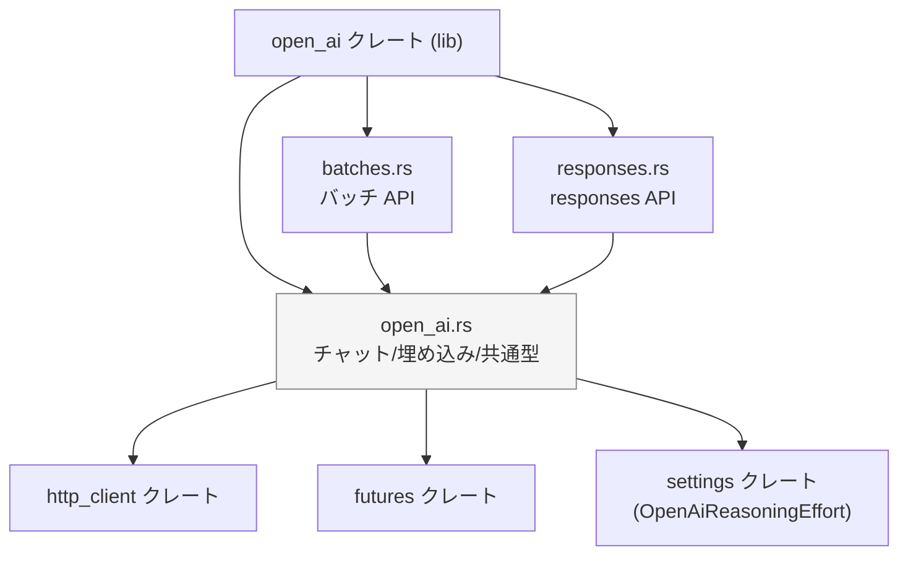
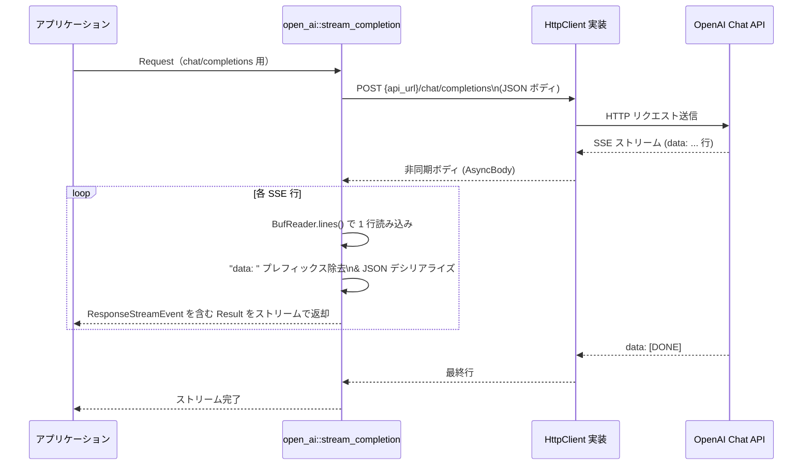

# C:\Drive\rust\zed-local\crates/open_ai

## 0. ざっくり一言

OpenAI 互換の HTTP API（`/chat/completions`・`/responses`・`/embeddings`・バッチ API）を叩くための、型付きクライアント層です。  
チャット・ツール呼び出し・推論要約・バッチ処理などを、Rust の型と非同期ストリームで扱えるようにしています。

---

## 1. このモジュールの役割

### 1.1 概要

- このクレートは **OpenAI 互換 API へのアクセスを安全かつ一貫したインターフェースで提供する** ために存在し、
- 次のような機能を提供します。
  - チャット補完 API (`/chat/completions`) の非ストリーミング / ストリーミング呼び出し
  - 新しい `responses` API (`/responses`) のストリーミング / 非ストリーミング呼び出し
  - 埋め込み API (`/embeddings`) の呼び出し
  - バッチ API（JSONL ファイルアップロード・バッチ作成・状態取得・結果ファイルのダウンロード/パース）

HTTP クライアント実装は外部クレート `http_client` に任せ、このクレートは主に **リクエスト/レスポンスの型定義と JSON 変換・エラーハンドリング** を担います。

### 1.2 アーキテクチャ内での位置づけ

モジュール間の依存関係を簡略化して示すと、次のようになります。



- `open_ai.rs`
  - クレートのルートモジュールです。
  - モデル一覧 (`Model`)、チャット用の `Request`/`Response` 型、ストリーミング用の差分型、共通エラー型 `RequestError`、埋め込み API などを定義します。
- `batches.rs`
  - バッチアップロード (`/files`)・バッチ作成 (`/batches`)・状態取得・結果ファイルのダウンロード/パースなどを実装します。
  - チャット用の `Request`/`Response` 型を再利用します。
- `responses.rs`
  - `responses` エンドポイント用のリクエスト/ストリームイベント/サマリ型を定義し、`stream_response` 関数で SSE ストリーミングと非ストリーミング両方を扱います。
  - 役割 (`Role`)、ツール選択 (`ToolChoice`)、推論負荷 (`ReasoningEffort`) などはルートモジュールから利用しています。

### 1.3 設計上のポイント

コードから読み取れる設計上の特徴を挙げます。

- **ステートレスな関数設計**
  - すべての HTTP 呼び出し関数は `&dyn HttpClient`・`api_url`・`api_key`・リクエスト構造体を受け取り、その都度リクエストを組み立てて送信します。
  - セッションやキャッシュなどの状態は保持しません。
- **型による API の安全化**
  - チャット・responses・バッチ・埋め込みごとに専用の `Request`/`Response` 型を定義し、JSON と自動で相互変換できるように `serde` でシリアライズ/デシリアライズしています。
  - ツール呼び出し・画像入力・推論サマリなど、OpenAI API の構造を可能な範囲で Rust の型に落とし込んでいます。
- **エラーハンドリング**
  - HTTP ステータスがエラーの場合は共通の `RequestError::HttpResponseError` を返し、ステータスコード・ボディ・ヘッダを保持します。
  - JSON パースや I/O などのその他のエラーは `RequestError::Other(anyhow::Error)` でラップします。
  - 埋め込み API (`embed`) は `anyhow::Result` を直接返す設計です。
- **非同期・ストリーミング対応**
  - すべての HTTP 呼び出しは `async fn` か `Future` を返す関数になっており、`http_client` クレートの非同期 I/O に対応しています。
  - ストリーミング API は `futures::stream::BoxStream` で表現され、各要素が `anyhow::Result<...>` となるストリームを返します。
- **モデル機能の明示**
  - `Model` 列挙体に、トークン上限・出力トークン上限・推論負荷 (`ReasoningEffort`)・`parallel_tool_calls`/`prompt_cache_key` の対応有無を問い合わせるメソッドがあり、「このモデルで何が使えるか」をコード上で判断できます。

---

## 2. 主要な機能一覧

このクレートが提供する主な機能をまとめます。

- **チャット補完 API 呼び出し（非ストリーミング）**  
  `non_streaming_completion` で `/chat/completions` を叩き、`Response` 型として一括で受け取ります。

- **チャット補完 API 呼び出し（ストリーミング）**  
  `stream_completion` で SSE ストリームを受け取り、`ResponseStreamEvent` のストリームとして段階的に処理します。

- **埋め込み API 呼び出し**  
  `embed` で `/embeddings` を叩き、`OpenAiEmbeddingResponse`（ベクトル埋め込みの配列）を取得します。

- **チャット関連の共通型定義**
  - モデル識別子と機能情報: `Model`
  - メッセージとコンテンツ表現: `RequestMessage` / `MessageContent` / `MessagePart` / `ImageUrl`
  - ツール呼び出しに関する型: `ToolDefinition` / `FunctionDefinition` / `ToolCall` / `FunctionContent` / `ToolChoice`
  - 応答: `Response` / `Choice` / `Usage` / ストリーミング用の `ChoiceDelta` / `ResponseMessageDelta`

- **バッチ API**
  - JSONL 行単位のリクエスト表現: `BatchRequestItem`
  - アップロードされたファイルの表現: `FileObject`
  - バッチ作成リクエスト: `CreateBatchRequest`
  - バッチ状態: `Batch` / `BatchRequestCounts`
  - バッチ出力・エラー: `BatchOutputItem` / `BatchResponseBody` / `BatchError`
  - HTTP 呼び出し関数: `upload_batch_file` / `create_batch` / `retrieve_batch` / `download_file` / `parse_batch_output`

- **responses API**
  - 入力: `responses::Request` / `ResponseInputItem` / `ResponseInputContent` など
  - 推論設定: `ReasoningConfig` / `ReasoningSummaryMode`
  - ストリームイベント: `StreamEvent`
  - 応答サマリ: `ResponseSummary` / `ResponseOutputItem` / `ResponseReasoningItem` など
  - HTTP 呼び出し関数: `responses::stream_response`

- **共通ユーティリティ**
  - 役割列挙: `Role`
  - 推論負荷: `ReasoningEffort`（`settings` クレートから再エクスポート）
  - 共通エラー型: `RequestError`
  - デフォルト API ベース URL: `OPEN_AI_API_URL`

---

## 3. 関数・構造体の解説

### 3.1 型一覧（主要な構造体・列挙体）

代表的な公開型を一覧にします。

| 名前 | 種別 | 定義場所 | 役割 / 用途 |
|------|------|----------|-------------|
| `Role` | 列挙体 | `open_ai.rs` | メッセージ送信者の役割（user / assistant / system / tool）を表します。 |
| `Model` | 列挙体 | `open_ai.rs` | 利用可能なモデルを列挙し、ID・表示名・トークン上限・機能対応などを問い合わせるために使います。`Custom` バリアントで任意のモデル名と特性も定義できます。 |
| `StreamOptions` | 構造体 | `open_ai.rs` | チャットストリーミング時に usage 情報を含めるかどうかを制御します。 |
| `Request` | 構造体 | `open_ai.rs` | `/chat/completions` に送るチャットリクエスト本体です（モデル名・メッセージ列・温度・ツール設定など）。 |
| `RequestMessage` | 列挙体 | `open_ai.rs` | ユーザー/アシスタント/システム/ツールいずれかのメッセージを表します。ツールコール結果や画像も含められます。 |
| `MessageContent` | 列挙体 | `open_ai.rs` | メッセージの中身。プレーンテキストか、複数の `MessagePart` からなるマルチパート表現です。 |
| `MessagePart` | 列挙体 | `open_ai.rs` | テキストパート (`Text`) または画像 URL パート (`Image`) を表します。 |
| `ImageUrl` | 構造体 | `open_ai.rs` | 画像 URL と、解像度等を表すオプションの詳細文字列を保持します。 |
| `ToolChoice` | 列挙体 | `open_ai.rs` | ツールの呼び出しモード（自動 / 必須 / なし / 明示的指定）を表します。 |
| `ToolDefinition` (chat) | 列挙体 | `open_ai.rs` | チャット API の `tools` フィールドで指定するツール定義（現状 `Function` のみ）です。 |
| `FunctionDefinition` | 構造体 | `open_ai.rs` | ツールとして呼び出される関数の名前・説明・パラメータスキーマを保持します。 |
| `ToolCall` / `ToolCallContent` / `FunctionContent` | 構造体・列挙体 | `open_ai.rs` | モデルから返ってくるツール呼び出し（関数名と JSON 文字列の引数）を表します。 |
| `Response` | 構造体 | `open_ai.rs` | 非ストリーミングチャット応答のトップレベル構造体です（`choices` と `usage` を含む）。 |
| `Choice` | 構造体 | `open_ai.rs` | 単一の応答候補（メッセージと終了理由）を表します。 |
| `Usage` | 構造体 | `open_ai.rs` | prompt / completion / total のトークン数を保持します。 |
| `ResponseMessageDelta` / `ChoiceDelta` | 構造体 | `open_ai.rs` | ストリーミング時に一部だけ届くメッセージ差分や選択肢差分です。 |
| `ResponseStreamEvent` | 構造体 | `open_ai.rs` | ストリーミングチャットで 1 行の SSE `data:` に相当するイベントです。 |
| `RequestError` | 列挙体 | `open_ai.rs` | HTTP レスポンスエラーと、それ以外の `anyhow::Error` をまとめて扱うエラー型です。 |
| `OpenAiEmbeddingModel` | 列挙体 | `open_ai.rs` | 埋め込み API で利用するモデルを表します（`text-embedding-3-small/large`）。 |
| `OpenAiEmbeddingResponse` / `OpenAiEmbedding` | 構造体 | `open_ai.rs` | 埋め込み API の応答（ベクトルの配列）を表します。 |
| `BatchRequestItem` | 構造体 | `batches.rs` | バッチ JSONL ファイル 1 行分のエントリ（`Request` 本体を含む）です。 |
| `CreateBatchRequest` | 構造体 | `batches.rs` | `/batches` に送るバッチ作成リクエストです。 |
| `Batch` | 構造体 | `batches.rs` | バッチの状態・統計情報などをまとめたレスポンス構造体です。 |
| `BatchRequestCounts` | 構造体 | `batches.rs` | バッチ内の total / completed / failed などの件数です。 |
| `FileObject` | 構造体 | `batches.rs` | ファイルアップロード (`/files`) の結果として返るメタデータです。 |
| `BatchOutputItem` / `BatchResponseBody` / `BatchError` | 構造体 | `batches.rs` | バッチ出力 JSONL の各行（成功応答またはエラー）を表します。 |
| `responses::Request` | 構造体 | `responses.rs` | `responses` エンドポイント用のリクエストです。入力アイテム列や温度・ツール設定・推論設定などを含みます。 |
| `ResponseInputItem` | 列挙体 | `responses.rs` | `responses` API に渡す 1 アイテム（メッセージ・関数呼び出し・関数結果）を表します。 |
| `ResponseInputContent` | 列挙体 | `responses.rs` | テキスト・画像・モデル出力テキスト・拒否メッセージなど多様な内容を表します。 |
| `ReasoningConfig` / `ReasoningSummaryMode` | 構造体・列挙体 | `responses.rs` | 推論の「努力度」や要約モード（Auto/Concise/Detailed）を指定します。 |
| `responses::ToolDefinition` | 列挙体 | `responses.rs` | responses API 用の関数ツール定義です（名前・説明・パラメータ・strict フラグ）。 |
| `StreamEvent` | 列挙体 | `responses.rs` | responses API のストリームイベントを細かく区別した列挙体です（created / in_progress / output_item_added など）。 |
| `ResponseSummary` | 構造体 | `responses.rs` | 非ストリーミング responses API の全体サマリです。 |
| `ResponseOutputItem` | 列挙体 | `responses.rs` | サマリ内の出力アイテム（メッセージ・関数コール・推論要約・Unknown）を表します。 |

※ モデル ID（`gpt-5` 系など）はコード上にハードコードされていますが、これらが実際に利用できるかどうかは OpenAI 側の仕様に依存し、このコードからは分かりません。

---

### 4.2 重要関数の詳細（7 件）

#### 4.2.1 `non_streaming_completion(client, api_url, api_key, request) -> Result<Response, RequestError>`

```rust
pub async fn non_streaming_completion(
    client: &dyn HttpClient,
    api_url: &str,
    api_key: &str,
    request: Request,
) -> Result<Response, RequestError>
```

**概要**

- チャット補完 API (`{api_url}/chat/completions`) を **非ストリーミングモード** で呼び出し、1 回のレスポンスとして `Response` を返します。
- リクエストボディには `open_ai::Request` をそのまま JSON にシリアライズして送信します。

**引数**

| 引数名 | 型 | 説明 |
|--------|----|------|
| `client` | `&dyn HttpClient` | 実際の HTTP 通信を行うクライアント実装への参照です。 |
| `api_url` | `&str` | ベース URL（通常は `OPEN_AI_API_URL`）。プロキシなどを使う場合に差し替えます。 |
| `api_key` | `&str` | 認証に利用する API キー。`Authorization: Bearer <trimmed>` として送信されます。 |
| `request` | `Request` | モデル名・メッセージ・温度などを含むチャットリクエストです。 |

**戻り値**

- 成功時: `Ok(Response)` – `choices` と `usage` を含んだチャット応答。
- 失敗時: `Err(RequestError)` – HTTP エラーまたは JSON パース・I/O エラー。

**内部処理の流れ**

1. `uri = format!("{api_url}/chat/completions")` を組み立てます。
2. `HttpRequest::builder()` で POST リクエストを作り、`Content-Type: application/json`・`Authorization: Bearer ...` を設定します。
3. `request` を `serde_json::to_string` で JSON 文字列にシリアライズし、`AsyncBody::from` でボディに詰めます。
4. `client.send(request).await` で送信し、`response.status()` をチェックします。
5. ステータスが成功であればボディ全体を `String` に読み込み、`serde_json::from_str` で `Response` にデシリアライズして返します。
6. ステータスがエラーであれば、ボディを文字列として読み込んだ上で `RequestError::HttpResponseError` にまとめて返します。

**Examples（使用例）**

具体例は「6.1 基本的な使用方法」を参照してください。

**Errors / Panics**

- `RequestError::HttpResponseError`
  - HTTP ステータスがエラー (`!is_success()`) の場合。
- `RequestError::Other`
  - リクエスト構築エラー (`HttpRequest::builder().body(...)`)。
  - `serde_json::to_string` / `serde_json::from_str` の失敗。
  - レスポンスボディ読み込み時の I/O エラー。
- panic は行っていません。

**Edge cases（エッジケース）**

- `request.model` に不正なモデル ID を指定すると、API 側でエラーになり `HttpResponseError` になります（コードからはメッセージ内容までは分かりません）。
- `request.stream` を `true` にした場合でも、この関数はレスポンスを通常の JSON として扱います。  
  API がストリーミング応答を返す設定になっていると、JSON パースに失敗して `RequestError::Other` になる可能性があります（コードからは「`false` を想定している」と解釈できますが、明示的なチェックはありません）。

**使用上の注意点**

- ストリーミングが不要な場合のみこの関数を使い、ストリーミングを行いたい場合は `stream_completion` を使う設計になっています。
- `Request` 内の `tools` や `parallel_tool_calls` は、事前に `Model::supports_chat_completions` / `supports_parallel_tool_calls` で対応可否を確認してから設定するのが安全です（非対応でもコード上では弾かれません）。

---

#### 4.2.2 `stream_completion(client, provider_name, api_url, api_key, request) -> Result<BoxStream<'static, anyhow::Result<ResponseStreamEvent>>, RequestError>`

```rust
pub async fn stream_completion(
    client: &dyn HttpClient,
    provider_name: &str,
    api_url: &str,
    api_key: &str,
    request: Request,
) -> Result<BoxStream<'static, Result<ResponseStreamEvent>>, RequestError>
```

※ 戻り値のストリーム要素は `anyhow::Result<ResponseStreamEvent>` です。

**概要**

- チャット補完 API を **ストリーミングモード** で呼び出し、SSE の各 `data:` 行を `ResponseStreamEvent` に変換したストリームを返します。
- ストリームの各要素は `Ok(event)` または `Err(anyhow::Error)` になります。

**引数**

| 引数名 | 型 | 説明 |
|--------|----|------|
| `client` | `&dyn HttpClient` | HTTP クライアント。 |
| `provider_name` | `&str` | エラーメッセージで使用するプロバイダ名（例: `"openai"`）。 |
| `api_url` | `&str` | ベース URL。 |
| `api_key` | `&str` | API キー。 |
| `request` | `Request` | チャットリクエスト。通常 `stream: true` に設定されます。 |

**戻り値**

- 成功時: `Ok(BoxStream<'static, anyhow::Result<ResponseStreamEvent>>)`
- 失敗時: `Err(RequestError)` – HTTP またはセットアップ時のエラー。

**内部処理の流れ**

1. エンドポイントやヘッダ構築は `non_streaming_completion` と同様です。
2. リクエストボディに `request` を JSON で詰めて送信します。
3. HTTP ステータスが成功であれば、`response.into_body()` を `BufReader` で包み、`lines()` から SSE 行を非同期ストリームとして受け取ります。
4. 各行に対して以下を行い、`filter_map` で `Option<Result<ResponseStreamEvent>>` を生成します。
   - `"data: "` または `"data:"` プレフィックスを取り除きます。それ以外の行は無視されます。
   - 行が `"[DONE]"` であれば `None` を返し、ストリームを終了します。
   - 行を `serde_json::from_str` で `ResponseStreamResult`（Ok/Err ラッパ）としてパースします。
   - `Ok(ResponseStreamResult::Ok(event))` なら `Some(Ok(event))`。
   - `Ok(ResponseStreamResult::Err { error })` なら `Some(Err(anyhow!(error.message)))`。
   - パースに失敗した場合はログを出した上で `Some(Err(anyhow!(error)))` を返します。
5. HTTP ステータスがエラーであれば、ボディを文字列として読み、`RequestError::HttpResponseError` を返します。

**Examples（使用例）**

ストリーミングの利用例は「6.2 よくある使用パターン」のチャットストリーミング例を参照してください。

**Errors / Panics**

- 戻り値の外側 `Result`:
  - HTTP 送信・ボディ読み込み・JSON シリアライズ失敗などで `RequestError` を返します。
- ストリーム要素内の `anyhow::Result`:
  - SSE 行ごとの JSON パース失敗や、API からのエラーオブジェクト（`ResponseStreamResult::Err`）が `Err(anyhow::Error)` として表現されます。
- panic は行っていません。

**Edge cases（エッジケース）**

- 呼び出し側で `request.stream` を `true` にしない場合でも、この関数はレスポンスをストリーミングとして処理します。  
  API 側が非ストリーミング JSON を返した場合、JSON パースに失敗してエラーイベントが発生すると考えられます（コードからは明示的なチェックはありません）。
- `"data: "` / `"data:"` 以外の行は無視されます。そのため、非標準の SSE ラインが混在していると読み飛ばされる可能性があります。
- `"[DONE]"` 以降の行は無視されます。

**使用上の注意点**

- `Request` の `stream` フィールドと、この関数の利用を一致させる（両方ストリーミング前提）ことが前提条件と解釈できます。
- ストリームの要素は `Result` なので、`StreamExt::next()` で取り出したあとに毎回 `match` で `Ok` / `Err` を分岐させる必要があります。

---

#### 4.2.3 `embed(client, api_url, api_key, model, texts) -> Future<Output = anyhow::Result<OpenAiEmbeddingResponse>>`

```rust
pub fn embed<'a>(
    client: &dyn HttpClient,
    api_url: &str,
    api_key: &str,
    model: OpenAiEmbeddingModel,
    texts: impl IntoIterator<Item = &'a str>,
) -> impl 'static + Future<Output = Result<OpenAiEmbeddingResponse>>
```

**概要**

- 埋め込み API (`{api_url}/embeddings`) を呼び出し、複数テキストのベクトル埋め込みを取得します。
- 呼び出しは非同期ですが、`async fn` ではなく「Future を返す関数」として定義されています。

**引数**

| 引数名 | 型 | 説明 |
|--------|----|------|
| `client` | `&dyn HttpClient` | HTTP クライアント。 |
| `api_url` | `&str` | ベース URL。 |
| `api_key` | `&str` | API キー。 |
| `model` | `OpenAiEmbeddingModel` | 埋め込みに使用するモデル。 |
| `texts` | `impl IntoIterator<Item = &'a str>` | 埋め込み対象のテキスト列。 |

**戻り値**

- `impl Future<Output = anyhow::Result<OpenAiEmbeddingResponse>>`  
  `await` すると API 呼び出し結果が `OpenAiEmbeddingResponse` として返ります。

**内部処理の流れ**

1. `OpenAiEmbeddingRequest { model, input: texts.into_iter().collect() }` を構築します。
2. `serde_json::to_string(&request).unwrap()` で JSON に変換し、`AsyncBody` として包みます。
3. `HttpRequest::builder()` で POST リクエストを作り、`Authorization` などのヘッダを設定して `client.send` を呼び出す Future を作ります。
4. 戻り値の Future 内部で:
   - リクエスト構築の `Result` を `?` で展開し、送信結果の `Result` も `?` で展開します。
   - レスポンスボディを文字列に読み込みます。
   - `anyhow::ensure!(response.status().is_success(), ...)` で HTTP ステータスをチェックし、エラーならステータスとボディを含むエラーを返します。
   - ボディ文字列を `serde_json::from_str` で `OpenAiEmbeddingResponse` に変換して返します。

**Examples（使用例）**

```rust
use open_ai::{OpenAiEmbeddingModel, embed, OPEN_AI_API_URL};
use http_client::HttpClient;
use std::error::Error;

// 埋め込みの簡単な利用例
async fn embedding_example(client: &dyn HttpClient, api_key: &str) -> Result<(), Box<dyn Error>> {
    // 埋め込み対象のテキスト
    let texts = vec!["Rust is great.", "I like embeddings."];

    // Future を生成して await する
    let response = embed(
        client,
        OPEN_AI_API_URL,
        api_key,
        OpenAiEmbeddingModel::TextEmbedding3Small,
        &texts,
    ).await?;

    // 各テキストに対応するベクトルを確認
    for (i, item) in response.data.iter().enumerate() {
        println!("item #{i} embedding length = {}", item.embedding.len());
    }

    Ok(())
}
```

**Errors / Panics**

- `anyhow::Error`
  - HTTP エラー（非成功ステータス）。
  - レスポンスボディ読み込み失敗。
  - JSON パース失敗。
- panic の可能性
  - `serde_json::to_string(&request).unwrap()` でシリアライズに失敗すると panic します。  
    型が単純なため通常は起こらないと考えられますが、理論上の可能性として存在します。

**Edge cases（エッジケース）**

- `texts` に空文字列が含まれる場合の挙動は、このコードからは分かりません（API 側の仕様に依存します）。
- テキスト数が多い場合、`input` ベクタやレスポンスボディのメモリ消費が増大します。

**使用上の注意点**

- 多数のテキストや長文を一度に送ると、レスポンスが大きくなりメモリ消費が増えます。必要に応じて分割する設計が必要です。
- HTTP ステータスとレスポンスボディがエラーメッセージに埋め込まれるので、ログなどに出力する際には情報量に注意が必要です。

---

#### 4.2.4 `batches::upload_batch_file(client, api_url, api_key, filename, content) -> Result<FileObject, RequestError>`

```rust
pub async fn upload_batch_file(
    client: &dyn HttpClient,
    api_url: &str,
    api_key: &str,
    filename: &str,
    content: Vec<u8>,
) -> Result<FileObject, RequestError>
```

**概要**

- バッチ処理用の JSONL ファイルを `multipart/form-data` として `/files` エンドポイントにアップロードし、`FileObject` を受け取ります。
- アップロードされたファイル ID は後続の `create_batch` で利用します。

**引数**

| 引数名 | 型 | 説明 |
|--------|----|------|
| `client` | `&dyn HttpClient` | HTTP クライアント。 |
| `api_url` | `&str` | ベース URL。 |
| `api_key` | `&str` | API キー。 |
| `filename` | `&str` | サーバに伝えるファイル名。 |
| `content` | `Vec<u8>` | JSONL ファイルのバイト列全体。 |

**戻り値**

- 成功時: `Ok(FileObject)` – アップロードしたファイルの ID・サイズ・用途などを含む。
- 失敗時: `Err(RequestError)`。

**内部処理の流れ**

1. `uri = format!("{api_url}/files")` を構築します。
2. `boundary` としてランダムな 64bit 整数を 16 進数で埋め込んだ文字列を作ります。
3. `purpose=batch` と `file` の 2 パートからなる `multipart/form-data` ボディを手動で組み立てます。
4. `Content-Type: multipart/form-data; boundary=...` ヘッダを付与し、`client.send` で送信します。
5. ステータスが成功ならボディを文字列として読み、`serde_json::from_str` で `FileObject` にデシリアライズします。
6. エラー時はボディ文字列とともに `HttpResponseError` を返します。

**Examples（使用例）**

バッチの一連の流れ（アップロード→バッチ作成）は「6.2 よくある使用パターン」のバッチ例を参照してください。

**Errors / Panics**

- `RequestError::Other`
  - リクエスト構築エラー。
  - ボディ読み込み・JSON パース失敗。
- `RequestError::HttpResponseError`
  - HTTP ステータスがエラーの場合。
- panic はありません。

**Edge cases（エッジケース）**

- `content` が非常に大きい場合、`Vec<u8>` と組み立てた multipart ボディの両方がメモリを消費します（ストリーミングアップロードではありません）。
- `filename` に特殊文字を含む場合の扱いは、このコードからは分かりません（ヘッダ中ではそのまま文字列連結されています）。

**使用上の注意点**

- バッチ JSONL ファイルは **事前に `BatchRequestItem` 等から正しく構築** しておく必要があります。  
  この関数は単にバイト列を送信するだけで、中身の検証は行いません。
- `purpose` は固定で `"batch"` に設定されています。他の用途（例: fine-tuning 等）には使えません。

---

#### 4.2.5 `batches::create_batch(client, api_url, api_key, request) -> Result<Batch, RequestError>`

```rust
pub async fn create_batch(
    client: &dyn HttpClient,
    api_url: &str,
    api_key: &str,
    request: CreateBatchRequest,
) -> Result<Batch, RequestError>
```

**概要**

- 事前にアップロードしたファイル (`FileObject.id`) を指定して、`/batches` エンドポイントでバッチ処理を作成します。
- 応答として、バッチ ID や現在の状態などを含む `Batch` を返します。

**引数**

| 引数名 | 型 | 説明 |
|--------|----|------|
| `client` | `&dyn HttpClient` | HTTP クライアント。 |
| `api_url` | `&str` | ベース URL。 |
| `api_key` | `&str` | API キー。 |
| `request` | `CreateBatchRequest` | 入力ファイル ID やエンドポイント、完了までのタイムウィンドウ等。 |

**戻り値**

- `Ok(Batch)` – 作成されたバッチのメタデータ。
- `Err(RequestError)`。

**内部処理の流れ**

1. `uri = format!("{api_url}/batches")`。
2. `serde_json::to_string(&request)` で JSON にシリアライズし、`AsyncBody` に詰めて POST 送信。
3. ステータス成功ならボディを文字列として読み、`Batch` にパース。
4. エラー時は `HttpResponseError`。

**Examples（使用例）**

アップロードとセットでの利用例は「6.2 バッチ API 利用パターン」を参照してください。

**Edge cases / 使用上の注意点**

- `CreateBatchRequest::new(input_file_id)` は `endpoint="/v1/chat/completions"`・`completion_window="24h"` をデフォルト設定します。
  - 他のエンドポイントをバッチ処理したい場合は、`endpoint` フィールドを明示的に変更する必要があります。
- `metadata` は任意の JSON を格納できますが、その解釈は API 側に依存します。

---

#### 4.2.6 `batches::parse_batch_output(content) -> Result<Vec<BatchOutputItem>, serde_json::Error>`

```rust
pub fn parse_batch_output(content: &str) -> Result<Vec<BatchOutputItem>, serde_json::Error>
```

**概要**

- バッチ結果ファイルの JSONL 文字列全体を受け取り、各行を `BatchOutputItem` としてパースしたベクタに変換します。
- 空行は無視されます。

**引数**

| 引数名 | 型 | 説明 |
|--------|----|------|
| `content` | `&str` | JSONL 形式のファイル内容全体。 |

**戻り値**

- 成功時: `Ok(Vec<BatchOutputItem>)`。
- 失敗時: `Err(serde_json::Error)` – 最初に失敗した行の JSON パースエラー。

**内部処理の流れ**

1. `content.lines()` で行ごとのイテレータを取得します。
2. `line.trim().is_empty()` な行を `filter` で除外します。
3. 各行を `serde_json::from_str::<BatchOutputItem>` でパースします。
4. `collect()` により、いずれかの行のパースが失敗した時点でエラーを返し、成功した要素も含めて一切返しません（all-or-nothing）。

**Examples（使用例）**

```rust
use open_ai::batches::{parse_batch_output, BatchOutputItem};
use std::error::Error;

fn parse_example(jsonl_content: &str) -> Result<Vec<BatchOutputItem>, Box<dyn Error>> {
    // バッチ結果 JSONL 文字列を Vec<BatchOutputItem> に変換
    let items = parse_batch_output(jsonl_content)?;
    Ok(items)
}
```

**Edge cases（エッジケース）**

- 途中の 1 行だけが壊れている場合でも、`collect()` の特性により **全体がエラー** になります。
- `content` に BOM や制御文字が含まれると、該当行のパースに失敗する可能性があります。
- 空ファイル (`content` が空文字列) の場合は、空のベクタが返ります。

**使用上の注意点**

- 出力の一部だけでも利用したい場合は、呼び出し側で `lines()` を明示的にループし、行ごとに `serde_json::from_str` を呼ぶ等の処理を書き換える必要があります。
- エラーが起きた行番号を知りたい場合も、自前で行ループを実装した方が追跡しやすくなります。

---

#### 4.2.7 `responses::stream_response(client, provider_name, api_url, api_key, request) -> Result<BoxStream<'static, anyhow::Result<StreamEvent>>, RequestError>`

```rust
pub async fn stream_response(
    client: &dyn HttpClient,
    provider_name: &str,
    api_url: &str,
    api_key: &str,
    request: Request,
) -> Result<BoxStream<'static, Result<StreamEvent>>, RequestError>
```

※ 戻り値ストリームの要素は `anyhow::Result<StreamEvent>` です。

**概要**

- `responses` エンドポイント (`{api_url}/responses`) を呼び出し、  
  - `request.stream == true` の場合: SSE ストリームをそのまま `StreamEvent` のストリームとして処理し、
  - `false` の場合: 非ストリーミング応答を一括取得した後、**疑似ストリームイベント列** を構築して返します。
- どちらの場合も、呼び出し側からは「`StreamEvent` のストリーム」を同一の形で扱えます。

**引数**

| 引数名 | 型 | 説明 |
|--------|----|------|
| `client` | `&dyn HttpClient` | HTTP クライアント。 |
| `provider_name` | `&str` | エラーメッセージ用のプロバイダ名。 |
| `api_url` | `&str` | ベース URL。 |
| `api_key` | `&str` | API キー。 |
| `request` | `responses::Request` | responses API 用リクエスト。`stream` フラグによりモードを切り替えます。 |

**戻り値**

- 成功時: `Ok(BoxStream<'static, anyhow::Result<StreamEvent>>)`
- 失敗時: `Err(RequestError)`。

**内部処理の流れ**

1. `uri = format!("{api_url}/responses")` を構築し、リクエストを JSON で POST。
2. HTTP ステータスが成功でない場合は `HttpResponseError` を返します。
3. `is_streaming = request.stream` を事前に保存しておき、分岐します。
4. `is_streaming == true` の場合:
   - `response.into_body()` を `BufReader` に包み、`lines()` で SSE 行を読みます。
   - `"data: "` / `"data:"` プレフィックスを取り除き、`"[DONE]"` または空行は無視します。
   - 各行を `serde_json::from_str::<StreamEvent>` でパースし、成功なら `Ok(event)`、失敗時はログを残して `Err(anyhow!(error))` を返すストリームを構築します。
5. `is_streaming == false` の場合:
   - ボディ全体を文字列として読み込み、`serde_json::from_str::<ResponseSummary>` でサマリにパースします。
   - 成功時は以下のようなイベント列 `Vec<StreamEvent>` を組み立てます。
     - `Created`、`InProgress` を先頭に 2 つ追加。
     - 各 `ResponseOutputItem` について:
       - `OutputItemAdded`、必要に応じて `OutputTextDelta` や `FunctionCallArgumentsDone`、`ReasoningSummaryTextDelta` などを付けた上で `OutputItemDone` を追加。
     - 最後に `Completed` を追加。
   - このベクタから `futures::stream::iter(all_events.into_iter().map(Ok)).boxed()` でストリームを生成します。
   - サマリのパースに失敗した場合はログを出力し、`RequestError::Other(anyhow!(error))` を返します。

**Examples（使用例）**

利用例は「6.2 よくある使用パターン」の responses API の例を参照してください。

**Errors / Panics**

- `RequestError::HttpResponseError`
  - HTTP ステータスがエラーの場合。
- `RequestError::Other`
  - 非ストリーミングモードでの `ResponseSummary` パース失敗など。
- ストリーム要素の `anyhow::Error`
  - ストリーミングモードで 1 行のイベント JSON パースに失敗した場合。
- panic は行っていません。

**Edge cases（エッジケース）**

- 非ストリーミングモードでは、応答全体を一度にメモリに読み込むため、大きな応答ではメモリ消費が増加します。
- `ResponseOutputItem::Unknown` はイベント列の生成時に特別な処理を行っていません（`OutputItemAdded` と `OutputItemDone` のみ）。
- `ResponseOutputMessage.content` 内の JSON は、「`text` フィールドを持つ単純な形」を前提に `OutputTextDelta` を生成しています。それ以外の構造のコンテンツは無視されます。

**使用上の注意点**

- `request.stream` と実際の扱いを揃えることで、一貫したストリーム処理ができます。`true` と `false` で内部処理が分岐する点に注意が必要です。
- イベントの順序は、非ストリーミングモードではこの関数が組み立てているため、実際の SSE の順序と完全に一致するかどうかはこの実装に依存します。

---

### 4.3 その他の主な関数一覧

| 関数名 | 定義場所 | 役割（1 行） |
|--------|----------|--------------|
| `batches::BatchRequestItem::new` | `batches.rs` | チャット補完エンドポイント向けのバッチリクエスト行を作成します（POST `/v1/chat/completions` 固定）。 |
| `batches::BatchRequestItem::to_jsonl_line` | `batches.rs` | `BatchRequestItem` を 1 行の JSON 文字列に変換します。 |
| `CreateBatchRequest::new` | `batches.rs` | デフォルト設定（`endpoint="/v1/chat/completions"`, `completion_window="24h"`）でバッチ作成リクエストを構築します。 |
| `batches::retrieve_batch` | `batches.rs` | `/batches/{batch_id}` からバッチの状態を取得して `Batch` にデシリアライズします。 |
| `batches::download_file` | `batches.rs` | `/files/{file_id}/content` から結果ファイルをダウンロードし、文字列として返します。 |
| `Model::from_id` / `Model::id` / `Model::display_name` | `open_ai.rs` | モデル ID 文字列と `Model` バリアントの相互変換・表示名取得を行います。 |
| `Model::max_token_count` / `max_output_tokens` | `open_ai.rs` | モデルごとのトークン上限値を返します。 |
| `Model::supports_chat_completions` / `supports_parallel_tool_calls` / `supports_prompt_cache_key` | `open_ai.rs` | 各機能の対応有無を判定します。 |

---

## 4. データフロー

ここでは代表的なシナリオとして、**チャット補完ストリーミング (`stream_completion`)** のデータフローを説明します。

1. 呼び出し側で `Request` を組み立て、`stream_completion` に渡します。
2. `stream_completion` は `/chat/completions` へ POST し、SSE ストリームを取得します。
3. `BufReader` と `lines()` により、サーバから送られてくる `data: ...` 行を 1 行ずつ非同期に読みます。
4. 各行を `ResponseStreamResult` → `ResponseStreamEvent` に変換し、`BoxStream<...>` に流します。
5. 呼び出し側は、ストリームから `ResponseStreamEvent` を順次受け取り、UI 表示やログに利用できます。

### シーケンス図



この図から分かるように、`HttpClient` 実装とは疎結合であり、`open_ai` クレートは **プロトコル（URL・JSON 形式・SSE 解析）** に集中しています。

---

## 5. 使い方（How to Use）

### 5.1 基本的な使用方法（非ストリーミング・チャット）

ここでは、`non_streaming_completion` を使って単純なチャット応答を取得する例を示します。

```rust
use std::error::Error;
use open_ai::{
    Model,
    Request as ChatRequest,
    RequestMessage,
    MessageContent,
    non_streaming_completion,
    OPEN_AI_API_URL,
    Role,
};
use http_client::HttpClient;

// 非ストリーミングなチャット補完の基本例
async fn simple_chat_example(
    client: &dyn HttpClient, // HTTP クライアント実装（外部から注入）
    api_key: &str,           // OpenAI 互換 API キー
) -> Result<(), Box<dyn Error>> {
    // 使用するモデルを選択する（例: デフォルトの高速モデル）
    let model = Model::default_fast();

    // ユーザーからのメッセージ 1 件を含むチャットリクエストを構築する
    let request = ChatRequest {
        model: model.id().to_string(), // モデル ID 文字列を設定する
        messages: vec![
            RequestMessage::System {
                // システムプロンプトとして振る舞い方を指定する
                content: MessageContent::Plain(
                    "あなたは丁寧な日本語で回答するアシスタントです。".to_owned(),
                ),
            },
            RequestMessage::User {
                // ユーザーからの質問メッセージ
                content: MessageContent::Plain(
                    "Rust の所有権について簡単に教えてください。".to_owned(),
                ),
            },
        ],
        stream: false,              // 非ストリーミング応答を期待する
        stream_options: None,       // 非ストリーミングなので未指定
        max_completion_tokens: None,
        stop: Vec::new(),
        temperature: Some(0.7),     // 多少ランダム性を持たせる
        tool_choice: None,          // ツール呼び出しは行わない
        parallel_tool_calls: None,  // 並列ツール呼び出しも無効
        tools: Vec::new(),          // 利用可能なツールなし
        prompt_cache_key: None,     // プロンプトキャッシュキー未使用
        reasoning_effort: model.reasoning_effort(), // モデルに対応する推論負荷を設定（なければ None）
    };

    // 非ストリーミングのチャット補完 API を呼び出す
    let response = non_streaming_completion(
        client,
        OPEN_AI_API_URL, // "https://api.openai.com/v1"
        api_key,
        request,
    ).await?;

    // 最初の候補メッセージを取り出して表示する
    if let Some(choice) = response.choices.first() {
        match &choice.message {
            RequestMessage::Assistant { content: Some(content), .. } => {
                println!("assistant: {:?}", content); // コンテンツ全体をデバッグ表示
            }
            _ => {
                println!("unexpected message role: {:?}", choice.message);
            }
        }
    }

    Ok(())
}
```

ポイント:

- **クライアント実装の型**（`http_client` クレート側の具体型）はここでは仮定していません。呼び出し元から `&dyn HttpClient` を受け取るスタイルになっています。
- モデル名は `Model` 列挙体の `id()` を使うことで、スペルミスを減らせます。
- `RequestMessage` の `System` / `User` / `Assistant` を使い分けることで、ロールを明示できます。

---

### 5.2 よくある使用パターン

#### 5.2.1 チャット補完のストリーミング表示

`stream_completion` を利用して、チャット応答を逐次的に受け取る基本パターンです。

```rust
use std::error::Error;
use futures::StreamExt; // ストリームを反復処理するために使用
use open_ai::{
    Model,
    Request as ChatRequest,
    RequestMessage,
    MessageContent,
    stream_completion,
    ResponseStreamEvent,
    OPEN_AI_API_URL,
};
use http_client::HttpClient;

// ストリーミングでトークを逐次表示する例
async fn stream_chat_example(
    client: &dyn HttpClient,
    api_key: &str,
) -> Result<(), Box<dyn Error>> {
    let model = Model::default_fast(); // 高速系モデルを選択する

    // ストリーミングを有効にしたチャットリクエストを構築する
    let request = ChatRequest {
        model: model.id().to_string(),
        messages: vec![
            RequestMessage::User {
                content: MessageContent::Plain("自己紹介を 3 行でお願いします。".to_owned()),
            },
        ],
        stream: true, // ストリーミングモードを有効化する
        stream_options: None,
        max_completion_tokens: None,
        stop: Vec::new(),
        temperature: Some(0.7),
        tool_choice: None,
        parallel_tool_calls: None,
        tools: Vec::new(),
        prompt_cache_key: None,
        reasoning_effort: model.reasoning_effort(),
    };

    // ストリームを開始する（外側の Result は HTTP レベルのエラー）
    let mut stream = stream_completion(
        client,
        "openai",        // プロバイダ名（エラーメッセージ用）
        OPEN_AI_API_URL, // ベース URL
        api_key,
        request,
    ).await?;

    // SSE に相当するイベントを逐次受け取る
    while let Some(event_result) = stream.next().await {
        match event_result {
            Ok(ResponseStreamEvent { choices, usage: _ }) => {
                // 各 choice の delta を使ってテキストを組み立てる
                for delta in choices {
                    if let Some(message_delta) = delta.delta {
                        if let Some(content) = message_delta.content {
                            // ここでは単純に content をそのまま出力する（内部では差分テキスト）
                            print!("{content}");
                        }
                    }
                }
            }
            Err(e) => {
                eprintln!("ストリームイベントの処理中にエラー: {e}");
            }
        }
    }

    println!(); // 行を区切る
    Ok(())
}
```

ポイント:

- `request.stream = true` にすることが暗黙の前提と考えられます。
- `ResponseStreamEvent` 内の `choices` は差分情報なので、実際のテキストを組み立てるには呼び出し側で蓄積する必要があります。

---

#### 5.2.2 responses API（構造化応答）のストリーミング

`responses::stream_response` を用いると、より細かいイベント単位での制御が可能です。

```rust
use std::error::Error;
use futures::StreamExt;
use http_client::HttpClient;
use serde_json::json;

use open_ai::{
    Role,
    ToolChoice,
    ReasoningEffort,
};
use open_ai::responses::{
    self,
    Request as ResponsesRequest,
    ResponseInputItem,
    ResponseMessageItem,
    ResponseInputContent,
    ReasoningConfig,
    ReasoningSummaryMode,
    StreamEvent,
};

// responses API をストリーミングで利用する例
async fn responses_stream_example(
    client: &dyn HttpClient,
    api_key: &str,
    api_url: &str,
) -> Result<(), Box<dyn Error>> {
    // 単純なメッセージ 1 件だけを含む入力を構築する
    let input_item = ResponseInputItem::Message(ResponseMessageItem {
        role: Role::User, // ユーザーからのメッセージであることを指定
        content: vec![
            ResponseInputContent::Text {
                text: "推論過程を簡潔に説明しながら回答してください。".to_owned(),
            },
        ],
    });

    let request = ResponsesRequest {
        model: "gpt-4o-mini".to_owned(), // 例: 文字列でモデル ID を指定
        input: vec![input_item],
        stream: true,                    // ストリーミングモード
        temperature: Some(0.2),
        top_p: None,
        max_output_tokens: None,
        parallel_tool_calls: None,
        tool_choice: Some(ToolChoice::Auto),
        tools: Vec::new(),
        prompt_cache_key: None,
        reasoning: Some(ReasoningConfig {
            effort: ReasoningEffort::Medium,      // 詳細は settings クレート側の定義に依存
            summary: Some(ReasoningSummaryMode::Concise),
        }),
    };

    // responses API のストリーミングを開始する
    let mut stream = responses::stream_response(
        client,
        "openai",
        api_url,
        api_key,
        request,
    ).await?;

    // StreamEvent を逐次処理する
    while let Some(event_result) = stream.next().await {
        match event_result {
            Ok(event) => {
                println!("Stream event: {:?}", event);
                // イベントの種類に応じて UI 更新や関数呼び出し、推論ログ表示などを行う
            }
            Err(e) => {
                eprintln!("responses stream error: {e}");
            }
        }
    }

    Ok(())
}
```

ポイント:

- `responses::Request` はチャット用の `Request` とは別型です。インポート時に名前の衝突に注意します。
- `ReasoningConfig` で推論要約出力を有効化すると、`StreamEvent::ReasoningSummaryTextDelta` などのイベントを受け取れます。

---

#### 5.2.3 バッチ API（アップロード → バッチ作成 → 結果取得）

最後に、バッチ処理の簡略的な全体フロー例を示します。

```rust
use std::error::Error;
use http_client::HttpClient;
use open_ai::{
    Model,
    Request as ChatRequest,
    RequestMessage,
    MessageContent,
};
use open_ai::batches::{
    BatchRequestItem,
    CreateBatchRequest,
    upload_batch_file,
    create_batch,
    retrieve_batch,
    download_file,
    parse_batch_output,
};

// バッチ API を使った非同期処理の例（ポーリングは簡略化）
async fn batch_example(
    client: &dyn HttpClient,
    api_key: &str,
    api_url: &str,
) -> Result<(), Box<dyn Error>> {
    let model = Model::default_fast();

    // バッチ内の各リクエストを定義する（ここでは 2 件のチャット）
    let chat_request1 = ChatRequest {
        model: model.id().to_string(),
        messages: vec![RequestMessage::User {
            content: MessageContent::Plain("1+1 はいくつ？".to_owned()),
        }],
        stream: false,
        stream_options: None,
        max_completion_tokens: None,
        stop: Vec::new(),
        temperature: Some(0.0),
        tool_choice: None,
        parallel_tool_calls: None,
        tools: Vec::new(),
        prompt_cache_key: None,
        reasoning_effort: None,
    };

    let chat_request2 = ChatRequest {
        model: model.id().to_string(),
        messages: vec![RequestMessage::User {
            content: MessageContent::Plain("Rust の特徴を 3 つ教えてください。".to_owned()),
        }],
        ..chat_request1.clone() // 他のフィールドを再利用する
    };

    // JSONL ファイル用に BatchRequestItem を 2 行用意する
    let items = vec![
        BatchRequestItem::new("item-1".to_owned(), chat_request1),
        BatchRequestItem::new("item-2".to_owned(), chat_request2),
    ];

    // JSONL 文字列を組み立てる
    let mut jsonl = String::new();
    for item in &items {
        jsonl.push_str(&item.to_jsonl_line()?);
        jsonl.push('\n');
    }

    // ファイルとしてアップロードする
    let file = upload_batch_file(
        client,
        api_url,
        api_key,
        "batch.jsonl",
        jsonl.into_bytes(),
    ).await?;
    println!("uploaded file id = {}", file.id);

    // バッチを作成する
    let create_req = CreateBatchRequest::new(file.id.clone());
    let mut batch = create_batch(client, api_url, api_key, create_req).await?;
    println!("created batch id = {}", batch.id);

    // 実際にはここでステータスをポーリングして completed になるのを待つ
    // batch = retrieve_batch(client, api_url, api_key, &batch.id).await?;

    // 完了後、output_file_id を取得して内容をダウンロードする
    if let Some(output_file_id) = batch.output_file_id.clone() {
        let content = download_file(client, api_url, api_key, &output_file_id).await?;
        let outputs = parse_batch_output(&content)?;
        println!("parsed {} output items", outputs.len());
    }

    Ok(())
}
```

ポイント:

- `BatchRequestItem::new` と `CreateBatchRequest::new` は `/v1/chat/completions` 向けのバッチを前提としています。
- 実運用では `retrieve_batch` を使ってステータス (`status` や `completed_at`) をポーリングし、完了を確認する必要があります。

---

### 5.3 使用上の注意点（まとめ）

このクレート全体を利用する際の共通の注意点をまとめます。

- **HTTP クライアントの前提**
  - すべての関数は `&dyn HttpClient` を受け取ります。具体的な実装（タイムアウト・リトライ・プロキシ等）は `http_client` クレート側に依存します。
  - 実装がスレッドセーフかどうかも `http_client` クレートの設計次第です。このクレート側では特別な制約を設けていません。

- **`api_url` の扱い**
  - デフォルト値として `OPEN_AI_API_URL` が用意されていますが、プロキシや互換サービス（ローカルゲートウェイなど）を利用する場合は `api_url` 引数で明示的に指定する必要があります。

- **モデルと機能対応**
  - `Model` 列挙体の情報（`supports_chat_completions` / `supports_parallel_tool_calls` など）と、API 実装側の仕様を合わせて確認する必要があります。
  - コード内では、非対応モデルに対してオプションを設定してもコンパイルエラーにはならないため、呼び出し側でのバリデーションが重要です。

- **ストリーミング vs 非ストリーミング**
  - チャット API:
    - `non_streaming_completion` は非ストリーミング前提。
    - `stream_completion` はストリーミング前提。
    - `Request.stream` の値は呼び出し側が正しく設定する必要があります。
  - responses API:
    - `responses::stream_response` は `Request.stream` により内部の処理を切り替えますが、戻り値の形は常に「イベントのストリーム」です。

- **バッチ API のメモリ使用量**
  - JSONL コンテンツや multipart ボディ、ダウンロードした結果ファイルはすべてメモリ上の `String` / `Vec<u8>` として扱われます。非常に大きなバッチを扱う場合は、メモリ消費に注意が必要です。

- **エラー処理**
  - HTTP ステータスエラーは `RequestError::HttpResponseError` としてまとめられ、ステータスコード・ボディ・ヘッダーを確認できます。
  - ストリーム要素内のエラー（`anyhow::Result`）は **イベント単位** の失敗を表し、ストリーム自体は継続する場合があります。  
    呼び出し側は、各イベントごとにエラーを処理するロジックを設ける必要があります。

---

## 7. 関連ファイル

このクレートと密接に関係するファイル・クレートをまとめます。

| パス / クレート | 役割 / 関係 |
|-----------------|------------|
| `open_ai/Cargo.toml` | クレート名・バージョン・依存関係・`schemars` 機能などを定義します。 |
| `open_ai/src/open_ai.rs` | クレートのルートモジュール。チャット API・埋め込み API・共通型・エラー定義を含みます。 |
| `open_ai/src/batches.rs` | バッチ API（ファイルアップロード・バッチ作成/取得・結果ダウンロード・JSONL パース）を扱うモジュールです。 |
| `open_ai/src/responses.rs` | responses API 用の型と `stream_response` 関数を定義するモジュールです。 |
| `settings` クレート（ワークスペース内） | `OpenAiReasoningEffort`（このクレートでは `ReasoningEffort` として再エクスポート）を定義します。推論負荷レベルの詳細はここに依存します。 |
| `http_client` クレート（ワークスペース内） | `HttpClient` トレイト・`AsyncBody`・HTTP リクエスト/レスポンス型を提供し、このクレートのすべての HTTP 通信の基盤となります。 |

このディレクトリのコードを理解・拡張する際は、上記のファイル・クレートをあわせて参照すると、全体像を把握しやすくなります。
