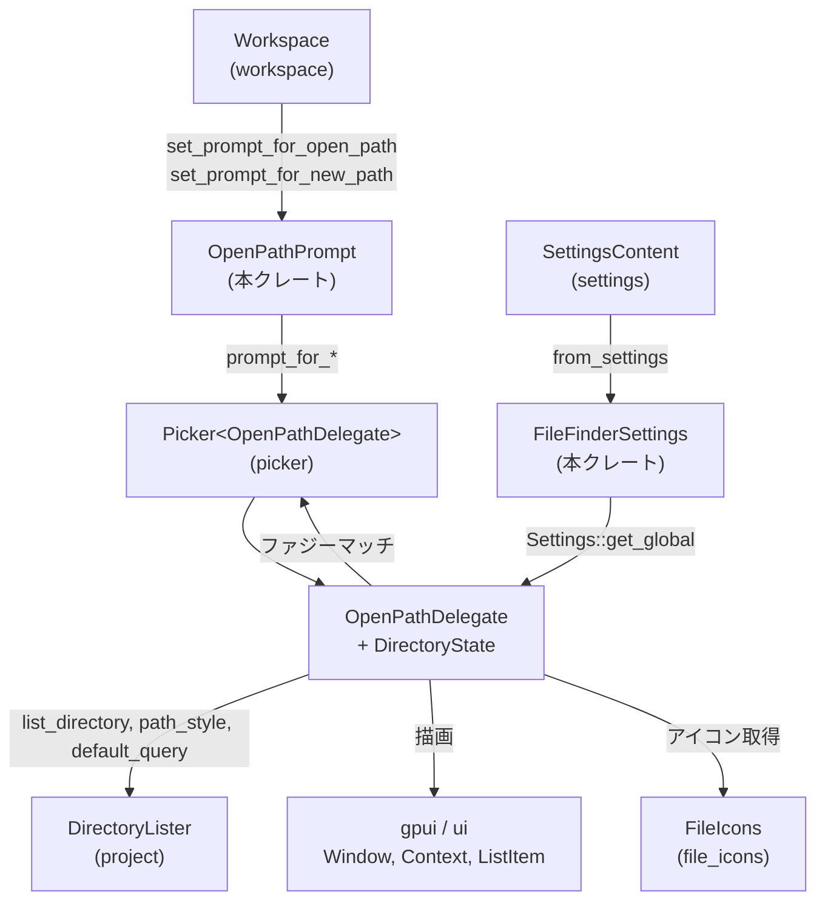
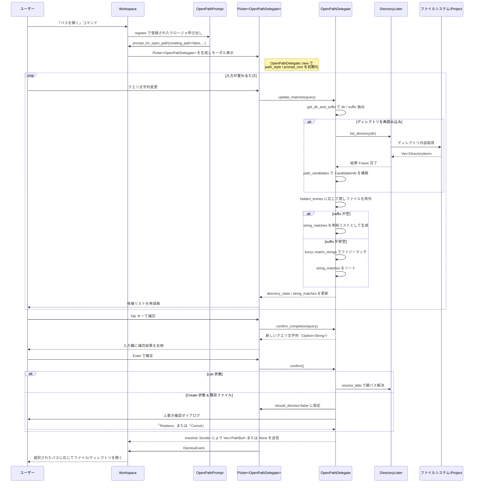

# crates/open_path_prompt/ ディレクトリ解説

## 1. ざっくり一言

`open_path_prompt` クレートは、ワークスペース内でパスを入力してファイルやディレクトリを「開く／新規作成」するための、ファジー検索付きパス入力プロンプトを提供するモジュール群です。  
パススタイル（POSIX/Windows）や隠しファイルの扱い、設定連携、UI 表示までを一括で扱います。

---

## 2. このモジュールの役割

### 2.1 概要

- このディレクトリは、**ユーザーがテキストでパスを入力しながら、ファイルシステム上の候補をインタラクティブに絞り込む問題**を解決するために存在します。
- `DirectoryLister` から取得したディレクトリ内容を `Picker` に表示し、**ファジーマッチによる候補リスト**・**タブ補完**・**新規パスの作成／上書き確認**などの機能を提供します。
- また `FileFinderSettings` を通じて、**ファイルアイコンの表示やモーダル幅などの設定**と連携します。

### 2.2 アーキテクチャ内での位置づけ

このクレートは UI レイヤの一部として、プロジェクト・ワークスペース・設定・ファイルアイコンなどの周辺クレートと連携します。



- `OpenPathPrompt` は Workspace への登録窓口です。
- `OpenPathDelegate` が `PickerDelegate` を実装し、ディレクトリ状態・ファジーマッチ・UI 表示をまとめて管理します。
- `DirectoryLister` がディレクトリ内容の取得を抽象化し、実際のファイルシステムやプロジェクトルートなどを隠蔽します。
- `FileFinderSettings` は設定ファイルから UI 設定値を読み込みます。

### 2.3 設計上のポイント

- **状態マシン的設計**
  - ディレクトリブラウズ中（`List`）と新規パス作成中（`Create`）、未初期化（`None`）を `DirectoryState` で明示的に区別しています。
- **非同期 + キャンセル**
  - ディレクトリ一覧取得とファジーマッチを非同期タスクとして実行し、`AtomicBool` を使って前の検索をキャンセルできるようにしています。
- **ファイル名の「候補」と「ユーザー入力」の分離**
  - 実在する `CandidateInfo` と、まだ存在しない `UserInput` を別構造体に分離し、Create 状態では両方を統合して候補リストに見せています。
- **パススタイルの抽象化**
  - `PathStyle`（POSIX / Windows）により、区切り文字・ルート表現（`"/"` / `"C:\"`）を吸収しています。
- **UI 設定との疎結合**
  - アイコン表示やモーダル幅などの UI 設定は `FileFinderSettings` に集約し、グローバル設定からの読み出しで利用しています。

---

## 3. 主要な機能一覧

- ワークスペースへのプロンプト登録:
  - `OpenPathPrompt::register`: 既存パスを開くプロンプトを Workspace に登録する。
  - `OpenPathPrompt::register_new_path`: 新しいパスを作成するプロンプトを登録する。
- パス入力と候補リストの更新:
  - `OpenPathDelegate::update_matches`: 入力クエリに基づきディレクトリ内容を取得し、候補をファジーマッチで絞り込む。
- タブ補完:
  - `OpenPathDelegate::confirm_completion`: 選択中の候補からクエリ文字列を補完する。
- 実行（Enter）時のパス確定:
  - `OpenPathDelegate::confirm`: 選択したファイル／新規パスを確定し、呼び出し元へ `PathBuf` を返す。
- 隠しファイルの表示制御:
  - `OpenPathDelegate::show_hidden`: ドット始まりのエントリを表示するかどうかを切り替える。
- ディレクトリ／ファイル候補の構築:
  - `path_candidates`: `DirectoryItem` から表示用候補 (`CandidateInfo`) を作成する（内部利用）。
- クエリからディレクトリとサフィックスの切り出し:
  - `get_dir_and_suffix`: 入力パス文字列から「ディレクトリ部分」と「末尾の名前候補」を取り出す（内部利用・テストあり）。
- ファイルファインダ設定の読み込み:
  - `FileFinderSettings::from_settings`: 設定ファイルからファイルアイコン有無や幅などを取り出す。

---

## 4. 関数・構造体の解説

### 4.1 型一覧（構造体・列挙体など）

| 名前 | 種別 | 公開 | 役割 / 用途 |
|------|------|------|-------------|
| `FileFinderSettings` | 構造体 | 公開 (`pub`) | ファイルファインダ UI の設定値（アイコン表示、幅など）を保持し、`settings::Settings` から構築されます。 |
| `FileFinderWidth` | 列挙体 | 公開 (`pub`) | モーダルの最大幅を表す設定値（`Small`〜`Full`）。シリアライズ時は小文字文字列として扱われます。 |
| `OpenPathPrompt` | 構造体（中身なし） | 公開 (`pub`) | ワークスペースに「パスを開く／新規作成するプロンプト」を登録するためのエントリポイントです。 |
| `OpenPathDelegate` | 構造体 | 公開 (`pub`) | `PickerDelegate` を実装するデリゲート本体。ディレクトリ状態・候補リスト・キャンセルフラグ・UI 表示などを保持します。 |
| `DirectoryState` | 列挙体 | 非公開 | デリゲート内部の状態（`List` / `Create` / `None`）を表します。 |
| `UserInput` | 構造体 | 非公開 | Create 状態において、ユーザーが入力したパス末尾と、その存在可否・ディレクトリかどうかを記録します。 |
| `CandidateInfo` | 構造体 | 非公開 | 1 件の候補（`StringMatchCandidate` と `is_dir` フラグ）を表します。 |

---

### 4.2 重要な関数の詳細

以下では、特に重要な 7 つの関数・メソッドを詳しく解説します。

#### 4.2.1 `OpenPathPrompt::register(workspace, _window, _cx)`

```rust
impl OpenPathPrompt {
    pub fn register(
        workspace: &mut Workspace,
        _window: Option<&mut Window>,
        _: &mut Context<Workspace>,
    ) {
        workspace.set_prompt_for_open_path(Box::new(|workspace, lister, window, cx| {
            let (tx, rx) = futures::channel::oneshot::channel();
            Self::prompt_for_open_path(workspace, lister, false, None, tx, window, cx);
            rx
        }));
    }
}
```

**概要**

- `Workspace` に対して、「既存パスを開く」ためのプロンプト関数を登録します。
- 登録後、Workspace 側が適切なタイミングでこのクロージャを呼び出すと、モーダルのパスプロンプトが開き、結果は `oneshot::Receiver<Option<Vec<PathBuf>>>` で返されます。

**引数**

| 引数名 | 型 | 説明 |
|--------|----|------|
| `workspace` | `&mut Workspace` | プロンプトを登録する対象ワークスペースです。 |
| `_window` | `Option<&mut Window>` | 呼び出し時のウィンドウ（ここでは未使用）です。 |
| `_` | `&mut Context<Workspace>` | `gpui` のコンテキスト（ここでは未使用）です。 |

**戻り値**

- なし。Workspace 内部にコールバックを登録するだけです。

**内部処理の流れ**

1. `Workspace::set_prompt_for_open_path` にクロージャを登録します。
2. クロージャは呼び出されたときに:
   - `oneshot::channel()` を生成し、送信用 `tx` と受信用 `rx` を得ます。
   - `OpenPathPrompt::prompt_for_open_path` を呼び出し、モーダル＋`Picker` を表示します。
   - 呼び出し元に `rx` を返します。
3. 実際にユーザーがパスを確定すると、`OpenPathDelegate::confirm` 経由で `tx` に結果が送信されます。

**Examples（使用例）**

```rust
use workspace::Workspace;
use crate::OpenPathPrompt;

fn init_workspace_prompts(workspace: &mut Workspace) {
    // 「既存パスを開く」プロンプトを登録する                      // OpenPathPrompt を Workspace に組み込む
    OpenPathPrompt::register(workspace, None, &mut /* Context<Workspace> */ {
        // 実際には gpui から提供されるコンテキストが渡される想定   // ここではダミーを表現
    });
}
```

※ 実際の `Context<Workspace>` の取得方法は、このチャンクには含まれていません。

**使用上の注意点**

- `set_prompt_for_open_path` の挙動（どのコマンドから呼ばれるか）は `Workspace` 実装依存であり、このコードからは分かりません。
- `prompt_for_open_path` は内部で `.show_hidden()` を呼ぶため、隠しファイルも候補に含まれる状態で表示されます。

---

#### 4.2.2 `OpenPathPrompt::register_new_path(workspace, _window, _cx)`

```rust
impl OpenPathPrompt {
    pub fn register_new_path(
        workspace: &mut Workspace,
        _window: Option<&mut Window>,
        _: &mut Context<Workspace>,
    ) {
        workspace.set_prompt_for_new_path(Box::new(
            |workspace, lister, suggested_name, window, cx| {
                let (tx, rx) = futures::channel::oneshot::channel();
                Self::prompt_for_new_path(workspace, lister, suggested_name, tx, window, cx);
                rx
            },
        ));
    }
}
```

**概要**

- 「新しいパス（ファイルやディレクトリ）を作成する」モードのプロンプトを Workspace に登録します。
- 既存パスの確認に加え、**未存在のパスの作成候補**や「上書き確認」を行う機能が有効になります。

**引数・戻り値**

- `register` と同様で、`Workspace` にクロージャを登録するだけです。
- 登録されたクロージャは `suggested_name: Option<String>` を受け取り、初期クエリに名前を足すように `prompt_for_new_path` から扱われます。

**内部処理の流れ**

1. `Workspace::set_prompt_for_new_path` にクロージャを登録します。
2. クロージャは `suggested_name` 付きで呼ばれ、内部で `prompt_for_new_path` を呼び出します。
3. `prompt_for_new_path` はフラグ `creating_path = true` を立てて `prompt_for_open_path` を呼び出し、Create モードを有効にします。

**Examples（使用例）**

```rust
use workspace::Workspace;
use crate::OpenPathPrompt;

fn init_new_path_prompt(workspace: &mut Workspace) {
    // 「新規パス作成」プロンプトを登録する                        // ユーザーが「新規ファイル作成」等を選んだとき用
    OpenPathPrompt::register_new_path(workspace, None, &mut /* Context<Workspace> */ {
        // 実際の Context<Workspace> は gpui から提供される         // ここではダミー
    });
}
```

**使用上の注意点**

- Create モードでは、入力したパスが既存のファイル名と一致する場合に「(replace)」表示と上書き確認ダイアログが出ます。
- 既存ディレクトリ名と一致する場合は、`confirm` が何も行わず（ディレクトリを「作成」しない）、enter しても確定されません。

---

#### 4.2.3 `OpenPathDelegate::new(tx, lister, creating_path, cx) -> Self`

```rust
impl OpenPathDelegate {
    pub fn new(
        tx: oneshot::Sender<Option<Vec<PathBuf>>>,
        lister: DirectoryLister,
        creating_path: bool,
        cx: &App,
    ) -> Self { /* ... */ }
}
```

**概要**

- `Picker<OpenPathDelegate>` に渡すためのデリゲートを初期化します。
- ここでパススタイル（POSIX / Windows）やルート文字列、初期状態（List or Create モード）が決まります。

**引数**

| 引数名 | 型 | 説明 |
|--------|----|------|
| `tx` | `oneshot::Sender<Option<Vec<PathBuf>>>` | パス確定時に結果を返すための送信側です。`None` はキャンセルを示します。 |
| `lister` | `DirectoryLister` | ディレクトリ内容を取得するための抽象オブジェクトです。 |
| `creating_path` | `bool` | `true` なら新規パス作成モード（Create 状態）で開始します。 |
| `cx` | `&App` | `gpui` のアプリケーションコンテキスト。`lister.path_style(cx)` 取得に使用します。 |

**戻り値**

- 完全に初期化された `OpenPathDelegate`。

**内部処理の流れ**

1. `lister.path_style(cx)` から `PathStyle`（`Posix` / `Windows`）を取得します。
2. `path_style` に応じて `prompt_root` を `/` または `C:\` に設定します。
3. `directory_state` を `DirectoryState::None { create: creating_path }` に設定し、まだディレクトリリストは読み込まれていないことを表します。
4. `selected_index = 0`, `string_matches = Vec::new()` など、その他フィールドを初期値で埋めます。
5. `render_footer` にはシュッと何も描画しないクロージャ（常に `None`）を入れます。
6. `hidden_entries` は `false`（非表示）で始まります（`prompt_for_open_path` 呼び出し側では `.show_hidden()` で上書きされます）。

**Examples（使用例）**

テストコードと同じパターンで、Picker を直接組み立てる例です。

```rust
use gpui::{Context as GpuiContext, Window};
use picker::Picker;
use project::DirectoryLister;
use ui::rems;
use crate::OpenPathDelegate;

// window と cx は gpui によって提供される前提                     // ここでは関数引数として受け取る想定
fn build_picker_for_project(
    lister: DirectoryLister,                       // Project 由来の DirectoryLister
    window: &mut Window,                           // 表示先のウィンドウ
    cx: &mut GpuiContext<Picker<OpenPathDelegate>> // Picker 用コンテキスト
) -> Picker<OpenPathDelegate> {
    let (tx, _rx) = futures::channel::oneshot::channel(); // パス結果受信用チャネルを作成
    let delegate = OpenPathDelegate::new(tx, lister, false, cx.app()); // creating_path=false で初期化
    Picker::uniform_list(delegate, window, cx)           // 一様リストの Picker を生成
        .width(rems(34.))                                // モーダルの幅を設定
}
```

※ 実際には `Context<Picker<OpenPathDelegate>>` の取得方法などは他モジュール依存です。

**エッジケース**

- `creating_path` が `true` の場合でも、最初は `DirectoryState::None { create: true }` です。最初の `update_matches` 呼び出し時に `Create` 状態へ遷移します。
- `PathStyle::Windows` の場合、`prompt_root` は常に `"C:\"` となります。複数ドライブ対応などはここからは分かりません。

**使用上の注意点**

- `tx` は `confirm` または `dismissed` 内で `take()` されるため、同じデリゲートから複数回結果は送れません。
- `lister` はクローンされて内部保持されますが、その実装がスレッドセーフかどうかは `DirectoryLister` 側に依存します。

---

#### 4.2.4 `OpenPathDelegate::update_matches(query, window, cx) -> Task<()>`

```rust
fn update_matches(
    &mut self,
    query: String,
    window: &mut Window,
    cx: &mut Context<Picker<Self>>,
) -> Task<()> { /* 非同期処理本体 */ }
```

**概要**

- ユーザーが入力したクエリ文字列から、「表示すべき候補一覧」と「ファジーマッチ結果」を更新する中核メソッドです。
- ディレクトリ一覧取得とファジーマッチを非同期に行い、結果を `string_matches` と `directory_state` に反映します。

**引数**

| 引数名 | 型 | 説明 |
|--------|----|------|
| `query` | `String` | 入力ボックスの現在の文字列です。絶対パス・相対パスの両方を取りうると想定されます。 |
| `window` | `&mut Window` | UI 更新に利用されるウィンドウです（`cx.spawn_in` のために必要）。 |
| `cx` | `&mut Context<Picker<Self>>` | `Picker` とデリゲート更新用のコンテキストです。 |

**戻り値**

- `Task<()>`。非同期タスクのハンドルであり、呼び出し側で `await` することも、しないこともできます（テストでは `await` しています）。

**内部処理の流れ（簡略版）**

1. `get_dir_and_suffix(query, self.path_style)` でクエリを  
   - ディレクトリ部分 `dir`  
   - ファイル名候補 `suffix`  
   に分解します。
2. 以前の `directory_state` と比較し、ディレクトリやサフィックスが変わっていない場合はディレクトリの再読み込みを省略します。
3. 変更が必要な場合は `DirectoryLister::list_directory(dir.clone(), cx)` を呼び出し、その `Future` を保持します。
4. 既存の `cancel_flag` に `true` を書き込み、新しい `cancel_flag` を作成して差し替えます（古い検索タスクを論理的にキャンセル）。
5. `cx.spawn_in(window, async move |this, cx| { ... })` で非同期処理を開始します。
6. 非同期処理内で:
   1. ディレクトリ取得 `paths = query.await` を行い、キャンセルフラグを確認します。
   2. 結果に応じて `DirectoryState` を `List` または `Create` に更新します。
      - Create 状態では、`suffix` と同名のエントリが存在するかどうかを走査し、`UserInput { exists, is_dir }` を構成します。
      - 既存のファイルと同名で新規作成しようとする場合、そのファイル候補を通常のエントリから削除します。
   3. `hidden_entries` が `false` の場合、`.` で始まる候補をすべて除外します。
   4. `suffix` が空かどうかで分岐します。
      - 空の場合（ディレクトリパスで終わるとき）
        - 必要に応じて `./` または `.\\` を追加候補として先頭に挿入します。
        - `string_matches` は「単純なリスト」（スコア 0, マッチ位置なし）として構築します。
      - 空でない場合（ファイル名の一部が入力されたとき）
        - `fuzzy::match_strings` を呼び出してファジーマッチを行います。
        - Create 状態かつ同名のファイル候補は除外し、`./` / `.\\` も除外します。
        - `string_matches` を、`candidate.string.starts_with(suffix)` を優先するようにソートします。
   5. 最後に `selected_index = 0` に戻し、`cx.notify()` で UI の再描画を通知します。

**Examples（使用例）**

テストコードに近い形で、`Picker` 側から呼ぶ例です。

```rust
use gpui::VisualTestContext;
use picker::Picker;
use crate::OpenPathDelegate;

// Picker<Entity> から update_matches を呼ぶユーティリティ         // テストコードと同じパターン
async fn insert_query(
    query: &str,                                           // 入力クエリ
    picker: &gpui::Entity<Picker<OpenPathDelegate>>,       // 対象 Picker
    cx: &mut VisualTestContext,                            // ビジュアルテスト用コンテキスト
) {
    picker
        .update_in(cx, |f, window, cx| {
            f.delegate.update_matches(query.to_string(), window, cx) // 非同期タスクを開始
        })
        .await;                                             // タスク完了を待機
}
```

**エッジケース**

- `query` が空文字列の場合
  - `PathStyle::Posix` では `(dir = "/", suffix = "")` に変換されます。
  - `PathStyle::Windows` では `(dir = "C:\\", suffix = "")` に変換されます（テスト `test_get_dir_and_suffix_*` より）。
- `suffix` が空の場合
  - ファジーマッチは行われず、ディレクトリ内の全エントリ（＋必要に応じて `./` or `.\\`）がそのまま候補になります。
- `hidden_entries == false` の場合
  - `".a"` のような隠しエントリは候補から除外されます（`test_open_path_prompt` の挙動と一致）。
- Create 状態で `suffix` と同名のファイルが存在する場合
  - その既存ファイルは通常候補から削除され、ユーザー入力候補（create/replace）が先頭に追加されます。

**使用上の注意点**

- 連続して高速に入力される前提で設計されているため、常に `update_matches` が最新の `cancel_flag` を使っていることが重要です。デリゲートインスタンスを途中で使い回す場合は、古いタスクが残らないようにします。
- `cx.spawn_in` に渡されるクロージャ内部で `this.update` / `this.read_with` を使うため、`Picker` インスタンスは `update_matches` 実行中も有効である必要があります。

---

#### 4.2.5 `OpenPathDelegate::confirm_completion(query, window, cx) -> Option<String>`

```rust
fn confirm_completion(
    &mut self,
    query: String,
    _window: &mut Window,
    _: &mut Context<Picker<Self>>,
) -> Option<String> { /* ... */ }
```

**概要**

- タブ補完などで呼ばれ、**選択中の候補からクエリ文字列を補完した新しい文字列**を返します。
- ディレクトリ候補であれば末尾に区切り文字（`/` または `\`）を付け、ファイル候補であれば付けません。

**引数**

| 引数名 | 型 | 説明 |
|--------|----|------|
| `query` | `String` | 現在の入力クエリ文字列。補完に失敗した場合はこれがそのまま返されることがあります。 |
| `_window` | `&mut Window` | 未使用です。 |
| `_` | `&mut Context<Picker<Self>>` | 未使用です。 |

**戻り値**

- `Some(補完後クエリ)` または `None`。
- `None` は「補完しない（現状維持）」という意味です。

**内部処理の流れ**

1. `self.get_entry(self.selected_index)` から現在選択中の `CandidateInfo` を取得します。
   - 取得できなければ `None` を返します。
2. 候補の文字列が空、または `current_dir()`（`"./"` or `.\\`）と等しい場合
   - 補完すべき文字列が意味を持たないため、`None` を返します。
3. それ以外の場合、`directory_state` に応じて
   - `DirectoryState::Create { parent_path, .. }`
   - `DirectoryState::List { parent_path, .. }`
   から `parent_path` を取得し、
   - `format!("{}{}{}", parent_path, candidate.path.string, suffix)`  
     を構築します。
   - `candidate.is_dir` が `true` のときだけ `suffix` に区切り文字（`path_style.primary_separator()`）を付けます。
4. `maybe!` マクロでラップされているため、途中でエラーがあった場合は `None` になり、その場合は `unwrap_or(query)` により元のクエリ文字列が返されます。

**Examples（使用例）**

テストコードから引用したパターンです。

```rust
fn confirm_completion_for_index(
    query: &str,                                           // 入力クエリ
    select: usize,                                         // 選択したインデックス
    picker: &gpui::Entity<Picker<OpenPathDelegate>>,       // Picker エンティティ
    cx: &mut gpui::VisualTestContext,                      // テスト用コンテキスト
) -> Option<String> {
    picker.update_in(cx, |f, window, cx| {
        if f.delegate.selected_index() != select {         // 必要に応じて選択インデックスを変更
            f.delegate.set_selected_index(select, window, cx);
        }
        f.delegate.confirm_completion(query.to_string(), window, cx) // 補完結果を取得
    })
}
```

**エッジケース**

- 現在選択中の候補が `./` または `.\\`（`is_current_dir_candidate`）の場合
  - `None` が返されます（`test_open_path_prompt_completion` のテストメッセージより）。
- `DirectoryState::None` の場合
  - `get_entry` が `None` を返し、`confirm_completion` も `None` を返します。
- `maybe!` 内でエラーが起きた場合（詳細はこのチャンクからは不明）
  - 元の `query` がそのまま返されます。

**使用上の注意点**

- 呼び出し側は `None` を「補完なし」として扱う必要があります。
- 返ってくる文字列は絶対パス・相対パス混在しうるので、`DirectoryLister`／`Workspace` 側で解釈を合わせる必要があります。

---

#### 4.2.6 `OpenPathDelegate::confirm(_complete_all, window, cx)`

```rust
fn confirm(&mut self, _: bool, window: &mut Window, cx: &mut Context<Picker<Self>>) { /* ... */ }
```

**概要**

- ユーザーが Enter などで「実行」を行ったときに呼ばれ、選択されたパス（または作成するパス）を確定し、`tx` を通じて呼び出し元に送信します。
- Create モードの場合は、既存ファイルへの上書き確認ダイアログもここで扱います。

**引数**

| 引数名 | 型 | 説明 |
|--------|----|------|
| `_` | `bool` | インターフェース上の引数（ここでは未使用）です。 |
| `window` | `&mut Window` | 上書き確認ダイアログ表示に利用されます。 |
| `cx` | `&mut Context<Picker<Self>>` | デリゲート更新と `gpui::DismissEvent` 発火に利用されます。 |

**戻り値**

- なし。結果は内部の `tx: Option<oneshot::Sender<Option<Vec<PathBuf>>>>` を通じて送信されます。

**内部処理の流れ**

1. 現在の選択候補を `self.get_entry(self.selected_index)` で取得します。なければ何もせず終了します。
2. `directory_state` によって分岐します。
   - **`DirectoryState::None { .. }`**  
     何もせず終了します。
   - **`DirectoryState::List { parent_path, .. }`**
     1. `parent_path == self.prompt_root` かつ `candidate.path.string.is_empty()` の場合
        - `confirmed_path = PathBuf::from(&self.prompt_root)` を採用します（ルートディレクトリ選択）。
     2. それ以外の場合
        - `self.lister.resolve_tilde(parent_path, cx)` を使って親ディレクトリを実パスに変換し、
        - `Path::new(...).join(&candidate.path.string)` で最終パスを構成します。
     3. `tx.take()` で送信側を取り出し、`Some(vec![confirmed_path])` を送信します。
   - **`DirectoryState::Create { parent_path, user_input, .. }`**
     1. `user_input` が `None` の場合は何もせず終了します。
     2. `user_input.is_dir` が `true` の場合も、ディレクトリは「作成対象」ではないため終了します。
     3. それ以外の場合、`prompted_path` を List の場合と同様に構成します。
     4. `user_input.exists` によって分岐します。
        - `false` の場合:
          - `tx.take().send(Some(vec![prompted_path]))` を呼び、すぐ `DismissEvent` を発火します。
        - `true` の場合（既存ファイルがある）:
          - `self.should_dismiss = false` にして、直ちに Picker が閉じないようにします。
          - `window.prompt(...)` で上書き確認ダイアログを表示します。
          - 非同期タスクを `cx.spawn_in` で起動し、ユーザーの選択を待ちます。
            - 「Replace」（インデックス 0）が選ばれた場合のみ、`tx.take().send(Some(vec![prompted_path]))` を行い、最後に `DismissEvent` を発火します。
          - それ以外の場合は何も送信せず終了します。

3. 上書き確認を行わずに確定した場合は、最後に `cx.emit(gpui::DismissEvent)` で Picker 自体を閉じます。

**Examples（使用例）**

テストでは `confirm` 自体ではなく、`confirm_completion` でクエリを補完してから Enter を押すケースを検証しています。 `confirm` の直接使用例はテストにはありませんが、一般的な流れは以下のようになります。

```rust
picker.update_in(cx, |f, window, cx| {
    // 何らかの UI イベントで選択インデックスが決定しているとする           // ここでは事前に f.delegate.selected_index が設定済み
    f.delegate.confirm(false, window, cx);                  // Enter 相当の確定処理
});
```

**エッジケース**

- Create 状態で `user_input.is_dir == true` の場合
  - 何も起こらず、結果も送信されません。ディレクトリ自体を「作成する」ことは想定されていないと解釈できます。
- 上書き確認ダイアログで「Cancel」を選んだ場合
  - `tx` は消費されず、そのまま残りますが、その後の挙動はこのチャンクからは分かりません（再確定が可能と解釈できます）。
- 既に `tx` が `take()` 済みの場合
  - `if let Some(tx) = self.tx.take()` によって単に送信されないだけになります。

**使用上の注意点**

- `confirm` を呼んだ後に `tx` は利用できなくなるため、一つのプロンプトインスタンスにつき結果を返せるのは 1 回だけです。
- Create モードで既存ファイルを上書きする場合は、必ずユーザー確認が入りますので、呼び出し側の処理は `None`（キャンセル）も含めて考慮する必要があります。

---

#### 4.2.7 `get_dir_and_suffix(query, path_style) -> (String, String)`

```rust
fn get_dir_and_suffix(query: String, path_style: PathStyle) -> (String, String) { /* ... */ }
```

**概要**

- 入力されたパス文字列を、**ディレクトリ部分（`dir`）**と**末尾のファイル名候補（`suffix`）**に分割します。
- POSIX と Windows で挙動が異なり、Windows ではドライブレターも考慮します。

**引数**

| 引数名 | 型 | 説明 |
|--------|----|------|
| `query` | `String` | ユーザー入力のパス文字列です。空文字列や `"C:"` なども含みます。 |
| `path_style` | `PathStyle` | `Posix` / `Windows` のどちらのパススタイルで解釈するかを指定します。 |

**戻り値**

- `(dir, suffix)` のタプル。
  - `dir`: ディレクトリ部分。末尾には必ずパス区切り文字（`/` または `\`）が付きます。
  - `suffix`: 最後の区切り文字以降の部分。ファイル名候補や未確定の入力（例: `"Docum"`）を表します。

**内部処理の流れ**

- `PathStyle::Posix` の場合:
  1. `query.rfind('/')` を探し、見つかればその位置を `index` とする。
     - 見つからなければ `(dir = query, suffix = "")` とする。
  2. 見つかった場合:
     - `dir = &query[..index]`, `suffix = &query[index + 1..]`。
  3. `dir` の末尾が `/` でなければ `dir.push('/')` する。
- `PathStyle::Windows` の場合:
  1. `query.rfind('\\')` と `query.rfind('/')` の両方を見て、後ろ側にあるほうを `last_sep` とする。
  2. 見つかった場合:
     - `dir = &query[..index + 1]`, `suffix = &query[index + 1..]`。
  3. 見つからない場合:
     - `(dir = query, suffix = "")` とする。
  4. `dir.len() < 3` の場合（例: `""` や `"C:"`）は、`dir = "C:\\"` に強制する。

**Examples（使用例）**

テストで検証されているパターンの一部です。

```rust
use util::paths::PathStyle;
use crate::open_path_prompt::get_dir_and_suffix;

// POSIX パスの例
let (dir, suffix) = get_dir_and_suffix("/Users/Alice/Docum".into(), PathStyle::Posix);
// dir == "/Users/Alice/"
// suffix == "Docum"

// Windows パスの例
let (dir, suffix) = get_dir_and_suffix("C:\\Users\\Alice\\Documents".into(), PathStyle::Windows);
// dir == "C:\\Users\\Alice\\"
// suffix == "Documents"
```

**エッジケース（テストから読み取れるもの）**

- POSIX:
  - `""` → `("/", "")`
  - `"/"` → `("/", "")`
  - `"/Use"` → `("/", "Use")`
  - `"/root/.."` → `("/root/", "..")`（`..` も suffix として扱う）
  - `"/root/.hidden"` → `("/root/", ".hidden")`
- Windows:
  - `""` → `("C:\\", "")`
  - `"C:"` → `("C:\\", "")`
  - `"C:\\"` → `("C:\\", "")`
  - `"C:\\Use"` → `("C:\\", "Use")`
  - `"C:/root/"` → `("C:/root/", "")`（スラッシュ混在もサポート）
  - `"C:/root\\.hidden"` → `("C:/root\\", ".hidden")`（最後の区切りだけを採用）

**使用上の注意点**

- Windows で `dir.len() < 3` のときに強制的に `"C:\\"` へ補正されるため、`"D:"` のような入力がどう扱われるかは、この関数だけでは分かりません（テストも `"C:"` のみ）。
- 混在セパレータ（`"C:\\root/"` など）も、その時点の最後のセパレータを基準に解釈されます。

---

### 4.3 その他の関数・メソッド

補助的な関数や単純なラッパー関数を簡潔に列挙します。

| 関数 / メソッド名 | 役割（1 行） |
|-------------------|--------------|
| `OpenPathPrompt::prompt_for_open_path` | Workspace 上でモーダル Picker を開き、既存パス用プロンプトを表示する内部関数です。 |
| `OpenPathPrompt::prompt_for_new_path` | `creating_path = true` を指定して `prompt_for_open_path` を呼ぶラッパーです。 |
| `OpenPathDelegate::with_footer` | フッター描画用クロージャ（キー操作説明など）を差し替えるためのビルダメソッドです。 |
| `OpenPathDelegate::show_hidden` | `hidden_entries = true` をセットし、`.` 始まりのエントリを候補に含めるようにします。 |
| `OpenPathDelegate::match_count` | 現在の候補件数を返します。Create 状態では `UserInput` 分も加算します。 |
| `OpenPathDelegate::selected_index` / `set_selected_index` | 選択中インデックスの取得・更新を行います。 |
| `OpenPathDelegate::render_match` | 1 件の候補を `ListItem` として描画し、ハイライトやアイコン・Create/Replace 表示を行います。 |
| `OpenPathDelegate::render_footer` | 事前に設定された `render_footer` クロージャを呼び出します。 |
| `OpenPathDelegate::no_matches_text` | 候補がないときのメッセージ（Create 時は `"Type a path…"`, エラー時はその内容）を返します。 |
| `OpenPathDelegate::placeholder_text` | 入力欄プレースホルダ（例: `"[directory/]filename.ext"`）を返します。 |
| `OpenPathDelegate::separators_after_indices` | 区切り線を入れる行インデックスを返します。先頭が `./` / `.\\` のとき `[0]` を返します。 |
| `path_candidates` | `DirectoryItem` のベクタから `CandidateInfo` ベクタを生成し、ルートの特別エントリ追加とソートを行います。 |
| `OpenPathDelegate::collect_match_candidates` | テスト用: 現在の候補の文字列リストを取り出します。 |

---

## 5. データフロー

ここでは、ユーザーがパスプロンプトを開き、候補を選択して確定するまでの代表的なデータフローを示します。

### 5.1 処理の概要

1. アプリ起動時などに `OpenPathPrompt::register` / `register_new_path` が呼ばれ、Workspace にプロンプトクロージャが登録されます。
2. ユーザーが「パスを開く」コマンドを実行すると、Workspace が登録済みクロージャを呼び出し、`prompt_for_open_path` がモーダル Picker を表示します。
3. Picker 内でテキスト入力が行われるたびに、`OpenPathDelegate::update_matches` が呼び出され、`DirectoryLister` からディレクトリ内容を取得し、ファジーマッチ結果を `string_matches` に格納します。
4. `render_match` によって候補が UI 上に描画されます。
5. ユーザーが Tab で補完を行うと `confirm_completion` が呼ばれ、新しいクエリ文字列が入力欄に反映されます。
6. ユーザーが Enter で確定すると `confirm` が呼ばれ、最終的な `PathBuf` が `oneshot::Sender` を通じて Workspace に返され、Picker が閉じられます。

### 5.2 シーケンス図



---

## 6. 使い方（How to Use）

### 6.1 基本的な使用方法

#### 6.1.1 Workspace へのプロンプト登録

アプリケーションの初期化時に、`OpenPathPrompt` を Workspace に登録することで、Workspace 側のコマンドからパスプロンプトを起動できるようになります。

```rust
use workspace::Workspace;
use gpui::Context;
use crate::OpenPathPrompt;

fn init_prompts(workspace: &mut Workspace, cx: &mut Context<Workspace>) {
    // 「既存パスを開く」プロンプトを登録する                       // ファイルを開くダイアログ代わり
    OpenPathPrompt::register(workspace, None, cx);

    // 「新規パス作成」プロンプトを登録する                         // 新規ファイル/ディレクトリ作成用
    OpenPathPrompt::register_new_path(workspace, None, cx);
}
```

※ 実際にどのコマンドでこれらのプロンプトが呼ばれるかは `Workspace` 側の実装に依存し、このチャンクには含まれていません。

#### 6.1.2 Picker と OpenPathDelegate を直接使う（テストと同様）

テストコードにある `build_open_path_prompt` 関数は、`OpenPathDelegate` と `Picker` を直接組み立てる良い例です。

```rust
use gpui::{TestAppContext, VisualTestContext, Entity};
use picker::Picker;
use project::Project;
use ui::rems;
use workspace::{AppState, MultiWorkspace};
use crate::OpenPathDelegate;

fn build_open_path_prompt_for_tests(
    project: Entity<Project>,                               // テスト用 Project
    creating_path: bool,                                    // true なら新規作成モード
    show_hidden: bool,                                      // 隠しファイルを表示するかどうか
    cx: &mut TestAppContext,                                // テスト用 AppContext
) -> (Entity<Picker<OpenPathDelegate>>, &mut VisualTestContext) {
    let (tx, _) = futures::channel::oneshot::channel();     // 結果受信用チャネル（受信側はテストで使わない）
    let lister = project::DirectoryLister::Project(project.clone()); // Project から DirectoryLister を生成

    // MultiWorkspace と Workspace をテスト用に初期化                // 実アプリでは既に存在している想定
    let (multi_workspace, cx) =
        cx.add_window_view(|window, cx| MultiWorkspace::test_new(project, window, cx));
    let workspace = multi_workspace.read_with(cx, |mw, _| mw.workspace().clone());

    let picker_entity = workspace.update_in(cx, |_, window, cx| {
        let delegate = OpenPathDelegate::new(tx, lister.clone(), creating_path, cx); // デリゲートを生成
        let delegate = if show_hidden { delegate.show_hidden() } else { delegate };  // 必要なら隠しファイルを表示
        cx.new(|cx| {
            let picker = Picker::uniform_list(delegate, window, cx)  // Picker を生成
                .width(rems(34.))                                    // 幅を設定
                .modal(false);                                      // テストではモーダルにしない
            let query = lister.default_query(cx);                    // 初期クエリを取得
            picker.set_query(&query, window, cx);                    // 初期クエリを設定
            picker
        })
    });

    (picker_entity, cx)                                              // Picker エンティティと VisualTestContext を返す
}
```

このパターンはテスト用ですが、実アプリ側でも `Workspace` を介さずに直接 Picker を使いたい場合の参考になります。

---

### 6.2 よくある使用パターン

#### 6.2.1 既存パスを開く（隠しファイルは非表示）

- ユーザーにルートディレクトリ配下のファイルやフォルダを選ばせる一般的なケースです。
- 隠しファイルは非表示とし、通常のファイルブラウザ的挙動を実現します。

テストコード `test_open_path_prompt` のパターン：

1. ファイルシステムに `/root` 以下のディレクトリツリーを挿入。
2. `creating_path = false`, `show_hidden = false` で `build_open_path_prompt` を呼び出し。
3. `insert_query("/root/")` でディレクトリを指定。
4. `collect_match_candidates` の結果として
   - `["./", "a1", "a2", "a3", "dir1", "dir2"]`
   を得ます（隠しファイル `.a1`, `.b1` が除外されている）。

#### 6.2.2 新規パスを作成する（Create モード）

- 新しいファイルやフォルダ名を入力して作成するケースです。
- 既存名と衝突した場合は `(replace)` ラベルと上書き確認ダイアログが使われます。

テストコード `test_new_path_prompt` のパターン：

1. `/root` 配下にいくつかのファイル・ディレクトリを用意。
2. `creating_path = true`, `show_hidden = false` で `build_open_path_prompt` を呼出し。
3. 例えば `/root/dir12` と入力すると、`collect_match_candidates` の結果が `["dir12"]` となり、
   - 実在しないパスにもかかわらず、ユーザー入力候補として先頭に表示されます。

#### 6.2.3 隠しファイルを含めてブラウズする

- `.git` や `.config` など、ドット始まりのエントリも選択できるようにする使い方です。

テストコード `test_open_path_prompt_with_show_hidden` のパターン：

1. `/root` に `"directory_1"`, `"directory_2"`, `".hidden"` を用意。
2. `creating_path = false`, `show_hidden = true` で `build_open_path_prompt` を呼び出します。
3. `/root/` をクエリとして入れると、候補は
   - `["./", ".hidden", "directory_1", "directory_2"]`
   となり、隠しディレクトリも表示されます。

---

### 6.3 使用上の注意点

ディレクトリ全体としての共通の注意点をまとめます。

1. **設定値の存在前提（`FileFinderSettings::from_settings`）**
   - `content.file_finder.as_ref().unwrap()` や各フィールドの `.unwrap()` を多用しており、設定が存在しない場合は panic します。
   - 実運用では、設定スキーマやデフォルト値により必ず値が入る前提で利用する必要があります。

2. **パススタイルとルートの挙動**
   - Windows スタイルの場合、`get_dir_and_suffix` は `dir.len() < 3` で `"C:\\"` に強制します。
   - 他ドライブレターや UNC パスなどをどう扱うかは、このコードだけでは分からないため、`DirectoryLister` 側の仕様と整合させる必要があります。

3. **Create モードでのディレクトリ扱い**
   - `confirm` 内で `user_input.is_dir` が `true` の場合、何も確定されません。
   - 既存ディレクトリと同名の入力は「そのディレクトリを作成する」動作にはならず、無視されます。

4. **上書き確認の UI**
   - Create モードで `exists == true` かつ `is_dir == false` の場合のみ、上書き確認ダイアログが出ます。
   - ダイアログでキャンセルした場合、`tx` に結果は送信されないため、呼び出し側は `None` を「ユーザーキャンセル」として扱う設計が必要です。

5. **隠しファイルのフィルタリング**
   - `hidden_entries` が `false` のとき、`update_matches` は `entry.path.string.starts_with('.')` な候補を除外します。
   - `show_hidden()` を呼ばない限り、`".a"`, `".git"` などはユーザーに見えません。

6. **`./` / `.\\` 特別候補の扱い**
   - `suffix` が空で、かつ入力が空でない場合、現在ディレクトリを表す `./` または `.\\` を先頭候補として挿入します。
   - `confirm_completion` ではこの候補に対しては `None` を返し、リストの「区切り」として扱っています。

7. **非同期タスクとキャンセル**
   - 入力ごとに `update_matches` が新しい非同期タスクを起動し、`cancel_flag` で前のタスクを論理キャンセルしています。
   - 非常に短い間隔で連続入力が発生する前提で設計されているため、デリゲートや Picker インスタンスを適切にライフサイクル管理する必要があります。

---

## 7. 関連ファイル

このディレクトリに含まれるファイルと、それぞれの役割を一覧にします。

| パス | 役割 / 関係 |
|------|------------|
| `open_path_prompt/Cargo.toml` | クレートのメタデータと依存クレート定義。ライブラリエントリを `src/open_path_prompt.rs` に指定しています。 |
| `open_path_prompt/src/file_finder_settings.rs` | `FileFinderSettings` と `FileFinderWidth` を定義し、設定ファイルからファイルファインダ関連の設定値を読み込むロジックを提供します。 |
| `open_path_prompt/src/open_path_prompt.rs` | クレートのメイン実装。`OpenPathPrompt`、`OpenPathDelegate`、`DirectoryState` などを定義し、Picker と連携したパスプロンプトの挙動を実装します。 |
| `open_path_prompt/src/open_path_prompt_tests.rs` | `gpui::test` ベースのテストコード。ディレクトリツリーのモックを使って、候補生成・補完・Create モード・Windows パスなどの挙動を網羅的に検証します。 |

以上が `open_path_prompt` ディレクトリ全体の構造と主要機能の解説です。
