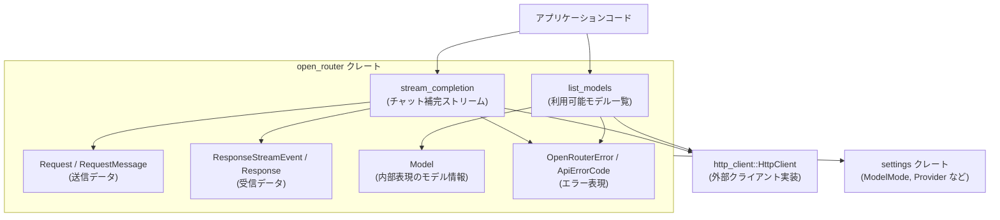
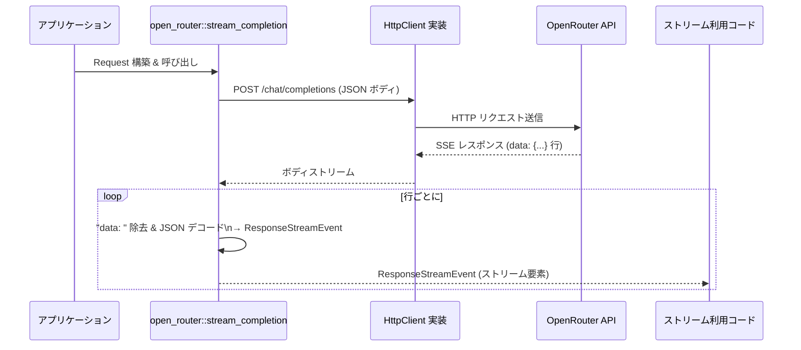

# crates/open_router ディレクトリ解説

## 1. ざっくり一言

`crates/open_router` は、OpenRouter の HTTP API（チャット補完とモデル一覧）を叩くための **リクエスト／レスポンス型と HTTP ラッパ関数** を提供するクレートです。  
Zed Editor から OpenRouter を利用するためのクライアント層という位置づけになっています。

---

## 2. このモジュールの役割

### 2.1 概要

- OpenRouter の `chat/completions` と `models/user` エンドポイントを呼び出す非同期関数を提供します。
- それに対応する **リクエスト／レスポンス用の型群**（メッセージ、ツール呼び出し、ストリームイベント、エラーなど）を定義します。
- HTTP の送受信は外部の `http_client::HttpClient` トレイト実装に任せ、このクレートは **JSON 変換とエラーの整理** に集中しています。
- 設定クレート `settings` から `ModelMode` や `OpenRouterProvider` などを再エクスポートし、Zed 全体の設定と連携できるようになっています。

### 2.2 アーキテクチャ内での位置づけ

このディレクトリ内では、主に 1 つのモジュール（`open_router.rs`）が、外部 HTTP クライアントとアプリケーションコードの間をつなぎます。



- アプリケーションは `stream_completion` / `list_models` を呼び、OpenRouter と通信します。
- HTTP の具体的な送信は `HttpClient` に依存し、このクレートは HTTP リクエストの組み立てと JSON のパースを担当します。
- 設定やモード情報は `settings` クレートから再エクスポートされた型を介して扱います。

### 2.3 設計上のポイント

コードから読み取れる特徴を挙げます。

- **ステートレスな API**
  - グローバルな状態は持たず、`HttpClient` とパラメータを引数で受け取る関数型 API になっています。
- **強い型付けのリクエスト／レスポンス**
  - メッセージ、ツール呼び出し、ストリームイベント、モデル一覧などを構造体・列挙体で表現し、`serde` で JSON と相互変換しています。
- **ストリーミング対応**
  - `stream_completion` はサーバー送信イベント（`data: ...` 形式の行）を `ResponseStreamEvent` のストリームとして返します。
  - `"[DONE]"` や `":"` で始まるコメント行を明示的に扱っています。
- **エラーの正規化**
  - HTTP ステータスコードを `ApiErrorCode` にマッピングし、`OpenRouterError` で
    - シリアライズ／デシリアライズエラー
    - HTTP 送信エラー
    - レート制限・サーバ過負荷
    - API エラー
    を区別して扱います。
- **レート制限情報の抽出**
  - `X-RateLimit-Reset` ヘッダから再試行までの時間を `Duration` として取り出す補助関数を持ちます。
- **UI 都合の加工**
  - モデル一覧取得時に `entry.name` からコロン以降だけを表示名として抽出するなど、UI 表示用の整形をこの層で行っています。

---

## 3. 主要な機能一覧

このクレートが提供する主な機能は次のとおりです。

- **チャット補完ストリーミング呼び出し**
  - `stream_completion`: OpenRouter の `/chat/completions` を叩き、`ResponseStreamEvent` のストリームを返します。
- **ユーザーごとの利用可能モデル一覧取得**
  - `list_models`: `/models/user` を叩き、内部の `Model` 型の一覧に変換して返します。
- **チャットメッセージ・ツール呼び出しの型表現**
  - `Request`, `RequestMessage`, `MessageContent`, `MessagePart`, `ToolDefinition`, `ToolCall` など、OpenRouter のチャット API で使う JSON 構造を Rust の型として表現します。
- **ツール実行用の関数定義**
  - `FunctionDefinition` / `FunctionContent` でツール関数のシグネチャと呼び出し内容を表現します。
- **レスポンスおよびストリームイベントの型表現**
  - `ResponseStreamEvent`, `Response`, `Choice`, `ChoiceDelta`, `ResponseMessageDelta`, `Usage` など。
- **エラーとエラーコードの共通表現**
  - `OpenRouterError`, `ApiError`, `ApiErrorCode`, `OpenRouterErrorBody` などで API エラーを共通化します。
- **モデル情報の内部表現**
  - `Model`, `ListModelsResponse`, `ModelEntry`, `ModelArchitecture` などでモデルメタデータを扱います。
- **設定クレートとの橋渡し**
  - `DataCollection`, `ModelMode`, `AvailableModel`, `Provider` を `settings` クレートから再エクスポートします。

---

## 4. 関数・構造体の解説

### 4.1 主要な型一覧

代表的な型を一覧にします（この他にも補助型があります）。

| 名前 | 種別 | 役割 / 用途 |
|------|------|-------------|
| `Role` | 列挙体 | メッセージの役割（`user` / `assistant` / `system` / `tool`）を表す |
| `Model` | 構造体 | モデル ID、表示名、トークン数上限、モードなどを保持する内部モデル情報 |
| `Request` | 構造体 | `/chat/completions` に送るリクエスト全体（モデル、メッセージ、ツール、温度など） |
| `RequestUsage` | 構造体 | リクエストで usage 情報を含めるかどうかのフラグ |
| `RequestMessage` | 列挙体 | `assistant` / `user` / `system` / `tool` 各種メッセージの内容を表す |
| `MessageContent` | 列挙体 | プレーンテキスト、または複数パート（テキスト＋画像など）を表す |
| `MessagePart` | 列挙体 | テキストまたは画像 URL の 1 パート |
| `ToolDefinition` | 列挙体 | ツール定義（現状は関数ツールのみ） |
| `FunctionDefinition` | 構造体 | ツール関数の名前・説明・パラメータスキーマ |
| `ToolCall` | 構造体 | レスポンス内の 1 つのツール呼び出し（ID + 内容） |
| `ToolCallContent` | 列挙体 | ツール呼び出しの具体的な種類（現状は function 呼び出し） |
| `FunctionContent` | 構造体 | 実行された関数名、引数 JSON 文字列など |
| `ResponseMessageDelta` | 構造体 | ストリーミング中のメッセージ差分（部分的な content や tool_calls） |
| `ResponseStreamEvent` | 構造体 | 1 行分のストリーミングイベント（複数 choices を含む） |
| `Response` | 構造体 | ストリーミングではない場合を想定した完全レスポンス（このクレートでは生成のみ） |
| `Choice` / `ChoiceDelta` | 構造体 | 各候補のメッセージまたは差分 |
| `Usage` | 構造体 | トークン使用量（prompt / completion / total） |
| `ListModelsResponse` | 構造体 | `/models/user` の生レスポンス（`data: Vec<ModelEntry>`） |
| `ModelEntry` | 構造体 | API が返す 1 モデル分の情報（name, description, context_length など） |
| `ModelArchitecture` | 構造体 | モデルのモダリティ情報（入力に image を扱えるか等） |
| `OpenRouterError` | 列挙体 | このクレート全体で使うエラー型（I/O, JSON, RateLimit などを統合） |
| `OpenRouterErrorBody` | 構造体 | API が返す `error` オブジェクトの中身 |
| `OpenRouterErrorResponse` | 構造体 | API エラーのトップレベル `{ error: {...} }` 表現 |
| `ApiError` | 構造体 | `ApiErrorCode` + メッセージで表す API エラー |
| `ApiErrorCode` | 列挙体 | OpenRouter のエラーコード（`rate_limit_error` 等） |
| `DataCollection` | 型（再エクスポート） | `settings` クレート由来。データ収集設定を表すものと推測されますが、詳細はこのチャンクからは分かりません。 |
| `ModelMode` | 型（再エクスポート） | モデルの動作モードを表す enum。`Default` と `Thinking { budget_tokens: ... }` などが存在することがコードから分かります。 |
| `AvailableModel` | 型（再エクスポート） | 利用可能モデルを列挙した型。詳細はこのチャンクにはありません。 |
| `Provider` | 型（再エクスポート） | OpenRouter 側のプロバイダを表す型。詳細は `settings` クレート側です。 |

### 4.2 重要関数・メソッドの詳細

#### `Model::new(...) -> Model` / `Model::default() -> Model`

**概要**

- OpenRouter のモデル情報を表す `Model` のインスタンスを生成します。
- `default()` は `"openrouter/auto"` を指すデフォルトモデルを返します。

**主要フィールド**

- `name`: OpenRouter API 上のモデル ID（例: `"openrouter/auto"`）。
- `display_name`: UI 表示用の名前。`None` の場合は `name` が代わりに使われます。
- `max_tokens`: 入力・出力を合わせた最大トークン数として扱われます。
- `supports_tools`: ツール呼び出しをサポートするかどうか。
- `supports_images`: 画像入力をサポートするかどうか。
- `mode`: `ModelMode`（`Default` / `Thinking` など）。
- `provider`: OpenRouter 側のプロバイダ情報（`Provider`）。

**主なメソッド**

- `id(&self) -> &str`  
  モデル ID（`name`）を返します。
- `display_name(&self) -> &str`  
  `display_name` があればそれを、なければ `name` を返します。
- `max_token_count(&self) -> u64`  
  `max_tokens` を返します。
- `max_output_tokens(&self) -> Option<u64>`  
  現状は常に `None` を返す実装になっています。
- `supports_tool_calls(&self) -> bool`  
  `supports_tools.unwrap_or(false)` を返します。
- `supports_parallel_tool_calls(&self) -> bool`  
  現状は常に `false` を返します。

**使用上の注意点**

- `Model::default()` の戻り値は **ハードコーディング** された `"openrouter/auto"` です。実際に利用可能かどうかは API 側とアカウント設定に依存します。
- `list_models` で構築される `Model` の `provider` は常に `None` に設定されています。プロバイダ情報が必要な場合は、別途取得・設定する必要があります。
- `max_output_tokens()` は未実装（常に `None`）なので、出力側の上限を別途扱いたい場合はアプリケーション側で管理する必要があります。

---

#### `MessageContent` とそのメソッド

`MessageContent` はメッセージ本文の表現です。

```rust
#[serde(untagged)]
pub enum MessageContent {
    Plain(String),
    Multipart(Vec<MessagePart>),
}
```

**概要**

- `Plain(String)`: 単純なテキストメッセージ。
- `Multipart(Vec<MessagePart>)`: テキストと画像 URL の組み合わせなど、複数パートのメッセージ。

**主なメソッド**

1. `fn empty() -> Self`
   - 空文字列の `Plain` を返します。

2. `fn push_part(&mut self, part: MessagePart)`
   - 既存の内容に `MessagePart` を追加します。
   - アルゴリズム:
     1. `Plain` かつ空文字列のとき: そのまま `Multipart(vec![part])` に変換。
     2. `Plain` かつ非空文字列のとき: 既存のテキストを `Text` パートに変換し、その後ろに `part` を並べて `Multipart` に変換。
     3. すでに `Multipart` のとき: 単に `parts.push(part)`。

3. `fn as_text(&self) -> Option<&str>`
   - 内容が純粋なテキストとして解釈できるときに `Some(&str)` を返します。
   - 条件:
     - `Plain(text)` の場合 → `Some(&text)`。
     - `Multipart` で `Text` パートが 1 つだけで他のパートが無い場合 → そのテキスト。
     - それ以外（画像を含むなど）は `None`。

4. `fn to_text(&self) -> String`
   - テキストパートだけを連結した文字列を返します。
   - `Multipart` の場合、`MessagePart::Text` だけを順に結合し、画像などは無視します。

**エッジケース**

- `push_part` を空の `Plain("")` に対して呼ぶと、最初のパートで自動的に `Multipart` に変換されます。
- `to_text` は画像パートを **無視** するため、画像のみのメッセージは空文字列になります。
- `as_text` は「純テキスト」の場合しか `Some` を返さないため、画像付きメッセージなどは `None` になります。

**使用上の注意点**

- メッセージを常にテキストとして処理したい場合は、`as_text` よりも `to_text` を使うと、画像付きメッセージでもテキスト部分だけを取得できます。
- 画像 URL が重要な場合は、`MessageContent` を直接 `match` して `MessagePart::Image` を明示的に処理する必要があります。

---

#### `extract_retry_after(headers: &http::HeaderMap) -> Option<Duration>`

**概要**

- レート制限関連のヘッダ `X-RateLimit-Reset` から、次にリクエストを送るまでの待ち時間を算出します。

**アルゴリズム**

1. ヘッダ `X-RateLimit-Reset` を取得（なければ `None` を返す）。
2. 値を UTF-8 文字列として取得し、`u64` にパース。
3. システム時刻（UNIX エポックからのミリ秒）を取得。
4. `epoch_ms > now` の場合、その差分を `Duration::from_millis` で返す。
5. それ以外（パース失敗、過去時刻）は `None`。

**使用上の注意点**

- 値は **エポックミリ秒** 前提です。それ以外の形式が返ってきた場合、この関数は `None` を返します。
- 呼び出し側では `None` の場合にデフォルトの待ち時間（ここでは 60 秒）を設定しています。

---

#### `ApiErrorCode::from_status(status: u16) -> ApiErrorCode`

**概要**

- HTTP ステータスコードを OpenRouter のエラーコード列挙体 `ApiErrorCode` にマッピングします。

**マッピング例**

- `400` → `InvalidRequestError`
- `401` → `AuthenticationError`
- `402` → `PaymentRequiredError`
- `403` → `PermissionError`
- `408` → `RequestTimedOut`
- `429` → `RateLimitError`
- `502` → `ApiError`
- `503` → `OverloadedError`
- 上記以外 → `ApiError`（汎用）

**使用上の注意点**

- API 側が新しいステータスコードを返しても、この関数は `ApiError` にまとめてしまいます。
- より細かい扱いが必要な場合は、アプリケーション側でステータスコードも参照する必要があります。

---

#### `stream_completion(...)`

```rust
pub async fn stream_completion(
    client: &dyn HttpClient,
    api_url: &str,
    api_key: &str,
    request: Request,
) -> Result<BoxStream<'static, Result<ResponseStreamEvent, OpenRouterError>>, OpenRouterError>
```

**概要**

- OpenRouter の `/chat/completions` エンドポイントに POST し、ストリーミングレスポンス（SSE）を `ResponseStreamEvent` のストリームとして返します。

**引数**

| 引数名 | 型 | 説明 |
|--------|----|------|
| `client` | `&dyn HttpClient` | HTTP リクエストを送信するクライアント。実装は外部クレート側です。 |
| `api_url` | `&str` | ベース URL。通常は `OPEN_ROUTER_API_URL` を渡します。 |
| `api_key` | `&str` | OpenRouter の API キー。`Authorization: Bearer ...` に設定されます。 |
| `request` | `Request` | モデル、メッセージ、ツールなどを含むリクエスト本体。 |

**戻り値**

- 成功時: `BoxStream<'static, Result<ResponseStreamEvent, OpenRouterError>>`  
  - 各要素は 1 つのストリームイベント（複数 choices を含む）。
  - 要素が `Err(OpenRouterError::...)` の場合はストリームの途中でエラーが発生したことを意味します。
- 失敗時: `Err(OpenRouterError)`  
  - HTTP レベルのエラー、JSON 変換エラー、API エラーなど。

**内部処理の流れ**

1. `uri = "{api_url}/chat/completions"` を組み立て。
2. HTTP リクエストを `POST` で構築。
   - `Content-Type: application/json`
   - `Authorization: Bearer {api_key}`
   - `HTTP-Referer: https://zed.dev`
   - `X-Title: Zed Editor`
3. `Request` を `serde_json::to_string` で JSON 文字列に変換。
   - 失敗時 → `OpenRouterError::SerializeRequest`。
4. HTTP ボディに JSON を詰めて `client.send(request).await`。
   - 失敗時 → `OpenRouterError::HttpSend`。
5. レスポンスステータスが成功 (`2xx`) の場合:
   - ボディを `BufReader` でラップし、`lines()` から非同期行ストリームを取得。
   - 各行に対して:
     - `:` で始まる行 → SSE コメントとして無視。
     - `"data: "` プレフィックスを除去（それが無い行は無視）。
     - `"[DONE]"` → ストリーム終了マーカーとして無視。
     - 残りを `serde_json::from_str::<ResponseStreamEvent>` でパース。
       - 成功 → `Ok(ResponseStreamEvent)` として流す。
       - 失敗:
         - 空行 → 無視。
         - 非空 → `Err(OpenRouterError::DeserializeResponse)` として流す。
     - 行の読み取り自体が失敗した場合 → `Err(OpenRouterError::ReadResponse)` として流す。
6. レスポンスステータスがエラー (`!is_success()`) の場合:
   - ステータスコードを `ApiErrorCode::from_status` で分類。
   - ボディ全体を文字列として読み出す（`ReadResponse` 失敗時はそのエラー）。
   - `{ "error": {...} }` 形式を `OpenRouterErrorResponse` としてパースを試みる。
     - 成功: `error` フィールドを利用。
     - 失敗: ステータスコードと生ボディをそのまま `OpenRouterErrorBody` に詰める。
   - `ApiErrorCode` に応じて:
     - `RateLimitError` → `OpenRouterError::RateLimit { retry_after }`
     - `OverloadedError` → `OpenRouterError::ServerOverloaded { retry_after }`
     - その他 → `OpenRouterError::ApiError(ApiError { code, message })`

**エッジケース**

- サーバーが `data: ...` 形式ではない行を返した場合、その行は `strip_prefix("data: ")` で `None` になり無視されます。
- 空行やコメント行（`:` で始まる）はストリーム利用者には届きません。
- JSON デコードに失敗し、かつ行が空でない場合、その行は `Err(OpenRouterError::DeserializeResponse)` としてストリームに流れます。
- HTTP レスポンスのボディ読み取りが途中で失敗すると、その時点で `Err(OpenRouterError::ReadResponse)` がストリームに届きます。
- レート制限時に `X-RateLimit-Reset` がパースできない場合、`retry_after` は 60 秒にフォールバックします。

**使用上の注意点**

- `Request` 側の `stream` フィールドが `true` であることを前提とした処理になっています（コード上は強制していませんが、レスポンス形式が SSE でないとパースに失敗します）。
- 返ってくるストリームは `Result<ResponseStreamEvent, OpenRouterError>` のストリームなので、**ストリーム内の個々の要素がエラーになりうる** 点に注意が必要です。
- 実際の HTTP クライアント実装 (`HttpClient`) はこのチャンクには登場しません。非同期 I/O が正しく動作する実装を用意する必要があります。

---

#### `list_models(...)`

```rust
pub async fn list_models(
    client: &dyn HttpClient,
    api_url: &str,
    api_key: &str,
) -> Result<Vec<Model>, OpenRouterError>
```

**概要**

- OpenRouter の `/models/user` エンドポイントに GET して、ユーザーが利用可能なモデル一覧を `Vec<Model>` として返します。

**引数**

| 引数名 | 型 | 説明 |
|--------|----|------|
| `client` | `&dyn HttpClient` | HTTP クライアント実装 |
| `api_url` | `&str` | ベース URL |
| `api_key` | `&str` | API キー |

**戻り値**

- `Ok(Vec<Model>)`: `ModelEntry` を内部表現の `Model` にマッピングした一覧。
- `Err(OpenRouterError)`: HTTP, JSON, API エラーなど。

**内部処理の流れ**

1. `uri = "{api_url}/models/user"` を構築。
2. HTTP GET リクエストを構築。
   - `Accept: application/json`
   - `Authorization: Bearer {api_key}`
   - `HTTP-Referer`, `X-Title` も `stream_completion` と同様に設定。
3. 空ボディ (`AsyncBody::default()`) を付けて送信。
4. レスポンスボディを全て `String` に読み込む。
5. ステータスが成功のとき:
   - ボディを `ListModelsResponse` としてデシリアライズ。
   - 各 `ModelEntry` を `Model` に変換:
     - `name: entry.id`
     - `display_name`: `entry.name` をコロン（`:`）で分割し、最後の要素だけ（モデル名部分）を取り出し、前後の空白を削ったもの。
     - `max_tokens`: `entry.context_length.unwrap_or(2000000)`
     - `supports_tools`: `entry.supported_parameters` に `"tools"` が含まれているかどうか。
     - `supports_images`: `entry.architecture.input_modalities` に `"image"` が含まれているかどうか。
     - `mode`:
       - `supported_parameters` に `"reasoning"` が含まれる場合 → `ModelMode::Thinking { budget_tokens: Some(4096) }`
       - それ以外 → `ModelMode::Default`
     - `provider`: `None`
6. ステータスがエラーのとき:
   - `stream_completion` と同様に `ApiErrorCode` を決定し、`OpenRouterError` を組み立てる。

**エッジケース**

- `entry.name` にコロンが含まれない場合、`display_name` は `entry.name` 全体になります。
- `architecture` フィールドが `None` の場合、`supports_images` は `Some(false)` になります。
- `supported_parameters` に `"reasoning"` が含まれていないモデルは、`ModelMode::Default` 扱いになります。

**使用上の注意点**

- この関数で作られる `Model` の `provider` は常に `None` です。プロバイダ情報が必要であれば、`settings` 側との突き合わせなどが必要になります。
- `max_tokens` に API 側の `context_length` が入りますが、これは API の定義に依存します。アプリケーション側の制約と合わせて扱う必要があります。

---

### 4.3 その他の補助関数・実装

| 名前 | 役割（1 行） |
|------|--------------|
| `is_none_or_empty<T>` | `Option<Vec<_>>` 等が `None` または空かどうかを判断するヘルパー。`serde(skip_serializing_if)` に使用。 |
| `Role: TryFrom<String>` | `"user"` などの文字列を `Role` に変換する。未知の文字列はエラー。 |
| `impl From<Role> for String` | `Role` を `"user"` 等の小文字文字列に変換する。 |
| `impl Display for ApiErrorCode` | 各エラーコードをスネークケース文字列（`"rate_limit_error"` 等）に変換する。 |

---

## 5. データフロー

ここでは、`stream_completion` を使ったチャット補完ストリーミングのデータフローを例にします。

1. アプリケーションコードが `Request` を組み立て、`stream_completion` に渡す。
2. `stream_completion` は HTTP リクエストを組み立て、`HttpClient` 実装を通じて OpenRouter API に送信する。
3. OpenRouter API は `data: {...}` 形式の SSE を返し、`HttpClient` はそれをストリームとして提供する。
4. `stream_completion` はこのストリームを 1 行ずつ読み、`ResponseStreamEvent` にデコードして、呼び出し元に `BoxStream` として返す。
5. 呼び出し元はこのストリームから順次イベントを読み取り、テキストやツール呼び出しを組み立てていく。



`list_models` の場合は、単一の HTTP GET → JSON 全体のデコード → `Vec<Model>` というシンプルな一方向のフローです。

---

## 6. 使い方（How to Use）

### 6.1 基本的な使用方法

ここでは、既に適切な `HttpClient` 実装が用意されている前提で、  

- モデル一覧を取得する
- シンプルなチャット補完をストリーミングで受け取る  
という基本的な流れを示します。

```rust
use futures::StreamExt;                                       // ストリームから .next() を使うために必要
use http_client::HttpClient;                                  // HTTP クライアントのトレイト
use open_router::{                                           // このクレートから必要な型をインポート
    list_models,
    stream_completion,
    Request,
    RequestMessage,
    MessageContent,
    RequestUsage,
    OpenRouterError,
    OPEN_ROUTER_API_URL,
};

/// シンプルな利用例: モデル一覧を取得してからチャット補完を行う
async fn run_example(
    client: &dyn HttpClient,                                 // 実際の HTTP クライアント実装
    api_key: &str,                                           // OpenRouter の API キー
) -> Result<(), OpenRouterError> {
    // 1. 利用可能なモデル一覧を取得する
    let models = list_models(client, OPEN_ROUTER_API_URL, api_key).await?; // Vec<Model> を取得

    // 代表として最初のモデルを使う（存在しない場合は early return）
    let Some(first_model) = models.first() else {             // モデルが 1 つもなければ何もせず終了
        return Ok(());
    };

    println!("使うモデル: {} ({})",                           // モデルの表示名と ID を表示
        first_model.display_name(),
        first_model.id(),
    );

    // 2. チャット用のメッセージを組み立てる
    let messages = vec![
        RequestMessage::System {                              // system プロンプト
            content: MessageContent::from(
                "You are a helpful assistant.",              // &str から MessageContent::Plain に変換
            ),
        },
        RequestMessage::User {                                // user メッセージ
            content: MessageContent::from(
                "こんにちは、自己紹介してください。",        // 日本語の質問
            ),
        },
    ];

    // 3. Request を構築する
    let request = Request {
        model: first_model.id().to_string(),                  // 使用するモデル ID
        messages,                                             // 上で組み立てたメッセージ
        stream: true,                                         // ストリーミングレスポンスを期待
        max_tokens: Some(512),                                // 応答側トークン上限（OpenRouter 側の仕様に依存）
        stop: Vec::new(),                                     // 任意の停止トークンがあればここに列挙
        temperature: 0.7,                                     // サンプリング温度
        tool_choice: None,                                    // 今回はツール呼び出しなし
        parallel_tool_calls: None,                            // 並列ツール呼び出しも未使用
        tools: Vec::new(),                                    // ツール定義も未指定
        reasoning: None,                                      // reasoning 関連オプションなし
        usage: RequestUsage { include: true },                // usage 情報も含めるよう指定
        provider: None,                                       // プロバイダはデフォルトのルーティングに任せる
    };

    // 4. ストリーミング補完を開始する
    let mut stream = stream_completion(
        client,                                               // HTTP クライアント
        OPEN_ROUTER_API_URL,                                  // ベース URL
        api_key,                                              // API キー
        request,                                              // 上で組み立てたリクエスト
    ).await?;                                                 // HTTP or API エラーならここで Err

    // 5. ストリームからイベントを読み取り、テキストを出力する
    while let Some(event_result) = stream.next().await {      // ストリームから次のイベントを取得
        let event = event_result?;                            // 行レベルのエラーがあればここで Err

        for choice in event.choices {                         // 各 choice（候補）について
            if let Some(content) = choice.delta.content {     // このチャンクに content が含まれていれば
                print!("{content}");                          // 逐次出力（末尾改行は任意）
            }
        }
    }

    println!();                                               // 応答の最後に改行を追加
    Ok(())                                                    // 正常終了
}
```

- 実際の `HttpClient` 実装（例えば `reqwest` ベースなど）はこのチャンクには含まれていません。
- 上記のように「`&dyn HttpClient` を受け取る関数」をアプリケーション側に用意して使うのが自然です。

---

### 6.2 よくある使用パターン

#### パターン 1: モデル一覧を UI に表示する

`list_models` を使って、ユーザーが選択できるモデル一覧を作る典型的な例です。

```rust
use http_client::HttpClient;
use open_router::{list_models, OpenRouterError, OPEN_ROUTER_API_URL};

/// モデル一覧を取得してコンソールに表示する例
async fn print_models(
    client: &dyn HttpClient,                                 // HTTP クライアント
    api_key: &str,                                           // API キー
) -> Result<(), OpenRouterError> {
    let models = list_models(client, OPEN_ROUTER_API_URL, api_key).await?; // モデル一覧を取得

    for model in models {
        println!(
            "- {} (id: {}, max_tokens: {}, tools: {}, images: {})",
            model.display_name(),                            // UI 向けの短い名前
            model.id(),                                      // モデル ID
            model.max_token_count(),                         // コンテキスト長
            model.supports_tool_calls(),                     // ツールサポート有無
            model.supports_images(),                         // 画像サポート有無
        );
    }

    Ok(())
}
```

- `display_name()` は `"provider: model"` 形式の表示名から、コロン以降のモデル名だけを抽出しているため、UI での横幅を抑えた表示に適しています。
- `supports_tool_calls` / `supports_images` を使うことで、UI 上でツール呼び出しや画像入力対応モデルだけを絞り込むこともできます。

#### パターン 2: ツール呼び出しを含むリクエストの送信

ツール定義を含む `Request` の構造は次のようになります（実行までは示しませんが、型の使い方のイメージです）。

```rust
use serde_json::json;
use open_router::{
    FunctionDefinition,
    ToolDefinition,
    Request,
    RequestMessage,
    MessageContent,
    RequestUsage,
};

fn build_request_with_tool(model_id: &str) -> Request {
    // 1. ツール定義を作成する（例: 天気情報を取得する関数）
    let tool_def = ToolDefinition::Function {
        function: FunctionDefinition {
            name: "get_weather".to_string(),                 // 関数名
            description: Some("Get the current weather.".to_string()), // 説明
            parameters: Some(json!({                         // JSON Schema などのパラメータ定義
                "type": "object",
                "properties": {
                    "city": { "type": "string" }
                },
                "required": ["city"]
            })),                                              // serde_json::Value として保持
        },
    };

    // 2. メッセージを組み立てる
    let messages = vec![
        RequestMessage::User {
            content: MessageContent::from(
                "東京の天気を教えてください。",              // ユーザーからの質問
            ),
        },
    ];

    // 3. Request を作成する（stream / tool_choice などは適宜調整）
    Request {
        model: model_id.to_string(),                          // 使用モデル
        messages,                                             // メッセージ
        stream: true,                                         // ツール呼び出しもストリーミングで受け取る想定
        max_tokens: Some(512),
        stop: Vec::new(),
        temperature: 0.0,                                     // 再現性重視で 0.0 にしてもよい
        tool_choice: None,                                    // "auto" や "required" にしたい場合は ToolChoice を指定
        parallel_tool_calls: None,
        tools: vec![tool_def],                                // 定義したツールを渡す
        reasoning: None,
        usage: RequestUsage { include: true },
        provider: None,
    }
}
```

- 実際にツール呼び出しが行われたかどうかは、レスポンス側の `ToolCall` / `ToolCallChunk` を確認する必要があります。
- `ToolChoice` を `Auto` や `Required` に設定することで、ツール呼び出しの動作を制御できます。

---

### 6.3 使用上の注意点

このディレクトリのコードを利用する際の共通の注意点をまとめます。

- **`stream_completion` とレスポンス形式**
  - この関数は **SSE 形式（`data: ...` 行 + `"[DONE]"`）を前提** としています。
  - `Request.stream` を `true` にしないと、サーバー側のレスポンス形式が異なり、パースに失敗する可能性があります。
- **ストリーム内の個別エラー**
  - 戻り値は `Result<ResponseStreamEvent, OpenRouterError>` のストリームです。
  - ストリーム自体が成功しても、**途中の要素で JSON パース失敗や読み取りエラーにより `Err` が返る** ことがあります。
- **レート制限・サーバー過負荷への対応**
  - `OpenRouterError::RateLimit { retry_after }` と `OpenRouterError::ServerOverloaded { retry_after }` には再試行までの時間が入ることがあります。
  - `retry_after` が `None` またはデフォルト値（60 秒）になっているケースもあるため、アプリケーション側でフォールバックポリシーを決めておく必要があります。
- **`MessageContent` のテキスト化**
  - `to_text` は画像パートを捨ててテキストだけを連結します。画像内容に依存する処理では、必ず `MessagePart::Image` を明示的に見る必要があります。
- **`Model` のフィールドの意味**
  - `max_tokens` や `mode` の意味付けは OpenRouter API の仕様に依存しています。アプリケーション側で追加の制約を設ける場合は、仕様と照合した上で利用する必要があります。
- **外部クライアント実装への依存**
  - `HttpClient` トレイトの具体的な実装はこのクレート外にあり、I/O まわりのエラー特性やタイムアウト挙動は実装依存です。
  - 高頻度のリクエストや長時間ストリーミングを行う場合、`HttpClient` 実装側の設定（接続数、タイムアウトなど）も確認する必要があります。

---

## 7. 関連ファイル

| パス | 役割 / 関係 |
|------|------------|
| `crates/open_router/Cargo.toml` | `open_router` クレートのパッケージ定義。ライブラリエントリを `src/open_router.rs` に設定し、`schemars` フィーチャなどを定義しています。 |
| `crates/open_router/src/open_router.rs` | 本解説の対象となるメインソース。OpenRouter API 用の型と `stream_completion` / `list_models` 関数が実装されています。 |
| `crates/settings`（別ディレクトリ） | `DataCollection`, `ModelMode`, `OpenRouterAvailableModel`, `OpenRouterProvider` を提供するクレート。このクレートから再エクスポートされており、モデル設定やプロバイダ情報と連携します。 |
| `crates/http_client`（別ディレクトリ） | `HttpClient`, `AsyncBody`, `Request` など HTTP 抽象化を提供するクレート。`stream_completion` / `list_models` の HTTP 層として利用されます。 |

このディレクトリ単体では HTTP 実装や設定の詳細は分かりませんが、  
上記の関連クレートと組み合わせることで、Zed Editor から OpenRouter を安全に利用できる構成になっています。
