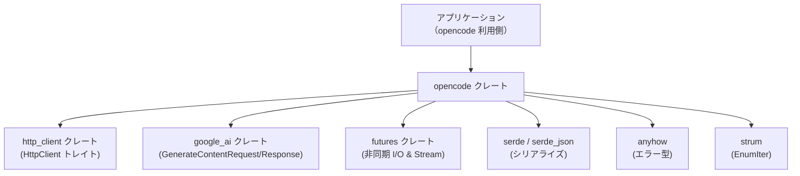
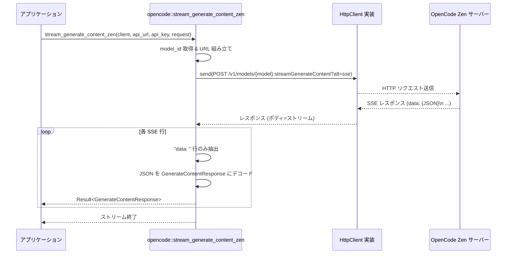

# crates/opencode ディレクトリ

## 1. ざっくり一言

`crates/opencode` は、OpenCode Zen 経由で利用できる各種 AI モデルを列挙してメタ情報を提供し、Google 系モデル向けのストリーミング生成 API 呼び出しヘルパーをまとめたライブラリです。

---

## 2. このモジュールの役割

### 2.1 概要

- このクレートは **OpenCode Zen 上のモデルを表現・選択するための型** と、  
  **Google 系モデル向けの `streamGenerateContent` ストリーミング呼び出し** を提供します。
- モデルごとに
  - モデル ID 文字列
  - 表示名
  - 利用トークン数の上限
  - 対応する API プロトコル（Anthropic / OpenAI / Google / OpenAI 互換）
  - ツール・画像対応可否  
  といったメタデータを一元的に取得できます。
- HTTP 通信部分は `http_client::HttpClient` トレイトに抽象化されており、利用側で具体的な HTTP クライアント実装を差し込む構成になっています。

### 2.2 アーキテクチャ内での位置づけ

このディレクトリには Rust ファイルは 1 つだけですが、複数の外部クレートに依存しています。利用側アプリケーションとの関係を簡略化した図です。



- アプリケーションは `opencode` を通じてモデル選択やストリーミング API を利用します。
- `opencode` は実際の HTTP 通信を `http_client` に委譲し、  
  リクエスト／レスポンス構造体は `google_ai` クレートの型をそのまま利用します。
- `serde` / `serde_json` は JSON シリアライズ／デシリアライズに使用されます。

### 2.3 設計上のポイント

- **モデル情報の集中管理**
  - 1 つの `Model` 列挙体に、サポートされる全モデルとそのメタ情報を集約しています。
  - モデル ID 文字列（外部 API に渡す値）と、人間向け表示名を区別して持ちます。
- **プロトコルの抽象化**
  - `ApiProtocol` 列挙体で「Anthropic プロトコル」「OpenAI Responses」「OpenAI Chat」「Google」といったプロトコル種別を表現し、モデルごとにどの API を使うべきかを取得できます。
- **非同期ストリーミング処理**
  - `stream_generate_content_zen` は `BoxStream` を返し、SSE（Server-Sent Events）形式のレスポンスを 1 行ずつ読み出して JSON にパースします。
  - HTTP 通信エラーと、ストリーム途中の JSON パースエラーを区別して扱うようになっています（外側の `Result` とストリーム要素の `Result`）。
- **依存の疎結合**
  - HTTP クライアントはトレイト `HttpClient` で抽象化されており、特定ライブラリに固定されていません。
- **スキーマ生成オプション**
  - `schemars` feature を有効にすると、`ApiProtocol` と `Model` に JSON Schema 生成用の派生が付与されます（API や設定 UI のスキーマに利用可能です）。

---

## 3. 主要な機能一覧

- **モデル列挙 `Model`**
  - OpenCode Zen で利用可能な多数のモデルを列挙体として定義。
- **プロトコル種別 `ApiProtocol`**
  - 各モデルがどのプロトコル（Anthropic / OpenAI Responses / OpenAI Chat / Google）を使うかを表現。
- **モデルメタ情報取得**
  - `Model::id()` : 外部 API に渡すモデル ID 文字列を取得。
  - `Model::display_name()` : UI 表示向けのモデル名を取得。
  - `Model::max_token_count()` / `Model::max_output_tokens()` : モデルごとのトークン上限を取得。
  - `Model::protocol()` : 利用すべき API プロトコルを取得。
  - `Model::supports_images()` / `Model::supports_tools()` : 画像・ツール対応可否の判定。
- **デフォルトモデルの取得**
  - `Model::default()` / `Model::default_fast()` : デフォルトの「汎用」モデルや「高速」モデルを取得。
- **Google 用ストリーミング API ヘルパー**
  - `stream_generate_content_zen()` : Google 系モデルに対し、OpenCode Zen 経由で `streamGenerateContent` を SSE 形式で呼び出す非同期関数。

---

## 4. 関数・構造体の解説

### 4.1 列挙体 `ApiProtocol`

```rust
#[derive(Clone, Copy, Debug, Default, PartialEq, Eq, Serialize, Deserialize)]
#[serde(rename_all = "snake_case")]
pub enum ApiProtocol {
    #[default]
    Anthropic,
    OpenAiResponses,
    OpenAiChat,
    Google,
}
```

| バリアント        | 意味 |
|-------------------|------|
| `Anthropic`       | Anthropic 形式の API プロトコル（Claude 系モデル向け）。 |
| `OpenAiResponses` | OpenAI Responses API 形式のプロトコル。 |
| `OpenAiChat`      | OpenAI Chat Completions 互換のプロトコル。 |
| `Google`          | Google の `generateContent` API プロトコル（Gemini 系）。 |

- `serde(rename_all = "snake_case")` により、JSON では `anthropic` / `open_ai_responses` のようなスネークケースで表現されます。
- `Default` は `Anthropic` になっています。

### 4.2 列挙体 `Model`

```rust
#[derive(Clone, Debug, Default, Serialize, Deserialize, PartialEq, EnumIter)]
pub enum Model {
    // Anthropic プロトコルモデル群
    #[serde(rename = "claude-opus-4-6")]
    ClaudeOpus4_6,
    // ... 省略 ...
    #[default]
    #[serde(rename = "claude-sonnet-4-6")]
    ClaudeSonnet4_6,
    // OpenAI Responses API モデル群
    #[serde(rename = "gpt-5.4")]
    Gpt5_4,
    // ... 省略 ...

    // Google プロトコルモデル群
    #[serde(rename = "gemini-3.1-pro")]
    Gemini3_1Pro,
    // ... 省略 ...

    // OpenAI Chat 互換モデル群
    #[serde(rename = "minimax-m2.5")]
    MiniMaxM2_5,
    // ... 省略 ...

    // カスタムモデル
    #[serde(rename = "custom")]
    Custom {
        name: String,
        display_name: Option<String>,
        max_tokens: u64,
        max_output_tokens: Option<u64>,
        protocol: ApiProtocol,
    },
}
```

- 多数の具体的モデルがバリアントとして定義され、それぞれ `#[serde(rename = "...")]` で外部 API 用のモデル ID が指定されています。
- `Default` は `ClaudeSonnet4_6` です。
- `EnumIter` 派生により、`Model` のすべてのバリアントを列挙するイテレータが利用可能です（後述の使用例参照）。
- `Custom` バリアントでは、OpenCode 側に存在しない任意のモデルをアプリケーション側で定義できます。

`Custom` のフィールド:

| フィールド名        | 型                | 説明 |
|---------------------|-------------------|------|
| `name`              | `String`          | 外部 API に渡すモデル ID 文字列。 |
| `display_name`      | `Option<String>`  | UI 等で表示したいモデル名。`None` の場合は `name` が利用されます。 |
| `max_tokens`        | `u64`             | 入力＋出力を含めたトークン総数の上限（目安）。 |
| `max_output_tokens` | `Option<u64>`     | 出力トークン数の上限（`None` の場合、制限情報なし）。 |
| `protocol`          | `ApiProtocol`     | このモデルに利用する API プロトコル。 |

#### `Model::default_fast() -> Self`

**概要**

- 「高速」推論用のデフォルトモデルを返します。
- 現在は `ClaudeHaiku4_5` が返されます。

**戻り値**

- `Model::ClaudeHaiku4_5`

**エッジケース**

- 特になし（単純な定数返却）。

**使用上の注意点**

- 「高速」であることのみを基準とした選択であり、品質や機能面での保証はコード上からは読み取れません。

---

#### `Model::id(&self) -> &str`

**概要**

- 各バリアントに対応する **外部 API に渡すモデル ID 文字列** を返します。
- `serde` の `rename` 属性と同じ文字列が返ってきます。

**戻り値**

- 例:
  - `Model::ClaudeSonnet4_6` → `"claude-sonnet-4-6"`
  - `Model::Gpt5_4` → `"gpt-5.4"`
  - `Model::Gemini3_1Pro` → `"gemini-3.1-pro"`
  - `Model::Custom { name, .. }` → `name` の参照

**エッジケース**

- `Custom` の場合、`name` フィールドの値がそのまま返されます。空文字列を設定した場合でもそのまま返されます（バリデーションは行っていません）。

**使用上の注意点**

- HTTP リクエストのパスやボディに埋め込む際は、この `id()` を利用すると、列挙体との整合性が保たれます。
- ID の妥当性（API 側で実在するかどうか）はこのコードでは検証していません。

---

#### `Model::display_name(&self) -> &str`

**概要**

- UI 等で表示するための、人間にとって読みやすいモデル名を返します。

**戻り値例**

- `Model::ClaudeSonnet4_6` → `"Claude Sonnet 4.6"`
- `Model::Gpt5_4Pro` → `"GPT 5.4 Pro"`
- `Model::Gemini3_1Pro` → `"Gemini 3.1 Pro"`
- `Model::Custom { name, display_name: None, .. }` → `name`
- `Model::Custom { display_name: Some(d), .. }` → `d`

**エッジケース**

- `Custom` で `display_name` が `None` の場合、`name` がそのまま返されます。

**使用上の注意点**

- 表示にのみ利用するメソッドです。API 呼び出しには必ず `id()` を使用する必要があります。

---

#### `Model::protocol(&self) -> ApiProtocol`

**概要**

- 各モデルが利用するべき API プロトコルを返します。

**戻り値の対応**

- Anthropic 系モデル → `ApiProtocol::Anthropic`
- OpenAI Responses 系モデル → `ApiProtocol::OpenAiResponses`
- Google 系モデル → `ApiProtocol::Google`
- OpenAI Chat 互換モデル群 → `ApiProtocol::OpenAiChat`
- `Custom` → フィールド `protocol` の値

**エッジケース**

- `Custom` に不適切な `protocol` を設定した場合でも、そのまま返されます（バリデーションなし）。

**使用上の注意点**

- アプリケーション側で「プロトコルごとに呼び出しを分岐する」場合、このメソッドを利用するとモデル定義と分岐条件の整合性を保ちやすくなります。

---

#### `Model::max_token_count(&self) -> u64`

**概要**

- 各モデルに設定された **トークン総数の上限（目安）** を返します。

**戻り値の例（抜粋）**

- `ClaudeOpus4_6` / `ClaudeSonnet4_6` → `1_000_000`
- 多くの Claude / GPT シリーズ → `200_000` または `400_000` など
- `Gemini3_1Pro` / `Gemini3Flash` → `1_048_576`
- `Custom { max_tokens, .. }` → `max_tokens`

**エッジケース**

- `Custom` に小さい値や極端に大きい値を指定しても、そのまま返されます。

**使用上の注意点**

- 実際の API 側の制限値と完全に一致する保証はコードからは読み取れません。あくまで「このクレートにハードコードされた目安」です。
- プロンプトを組み立てる際に、`max_token_count()` を基準に安全マージンを取って制限する用途に向いています。

---

#### `Model::max_output_tokens(&self) -> Option<u64>`

**概要**

- モデルごとの **出力トークン数上限（目安）** を返します。

**戻り値の例（抜粋）**

- `ClaudeOpus4_6` → `Some(128_000)`
- 多くの OpenAI 系モデル → `Some(128_000)`
- `Gemini3_1Pro` / `Gemini3Flash` → `Some(65_536)`
- 一部モデルは `Some(16_384)` など
- `Custom { max_output_tokens, .. }` → `max_output_tokens`

**エッジケース**

- `Custom` で `max_output_tokens` を `None` にした場合、`None` が返り、「上限情報なし」という扱いになります。

**使用上の注意点**

- 実際の API の制限は別途ドキュメントを確認する必要があります。
- `None` の場合は、アプリケーション側で別途上限を決めるか、API 側のエラーに任せる設計になると考えられます。

---

#### `Model::supports_tools(&self) -> bool`

**概要**

- 現状、常に `true` を返します。

**使用上の注意点**

- 「将来的にモデルごとのツール対応可否を分けるためのフック」である可能性がありますが、このチャンクからは詳細は分かりません。
- 実際にツール呼び出しが利用可能かどうかは、外部 API 側の仕様も確認する必要があります。

---

#### `Model::supports_images(&self) -> bool`

**概要**

- モデルが画像をサポートしているかどうかの判定を返します。

**戻り値のルール**

- Anthropic 系モデル → `true`
- OpenAI 系モデル → `true`
- Google 系モデル → `true`
- OpenAI 互換モデル群（MiniMax, GLM, Kimi, Mimo, Trinity, BigPickle, Nemotron など） → `false`
- `Custom { protocol, .. }` → `protocol` が `Anthropic` / `OpenAiResponses` / `OpenAiChat` / `Google` のいずれかなら `true`（現状はすべて該当）

**エッジケース**

- OpenAI 互換モデル群は、コード上は安全側に倒して `false` になっています。実際には画像を受け付ける API であっても、このフラグは更新されていない可能性があります。

**使用上の注意点**

- このフラグはあくまでクライアント側の判定であり、API 側が必ず同じ挙動をするとは限りません。
- 画像付きリクエストを組み立てる前のガードとして利用しつつ、実際の挙動は API 側のエラーも合わせて確認する必要があります。

---

### 4.3 関数 `stream_generate_content_zen`

```rust
/// Stream generate content for Google models via OpenCode Zen.
///
/// Unlike `google_ai::stream_generate_content()`, this uses:
/// - `/v1/models/{model}` path (not `/v1beta/models/{model}`)
/// - `Authorization: Bearer` header (not `key=` query param)
pub async fn stream_generate_content_zen(
    client: &dyn HttpClient,
    api_url: &str,
    api_key: &str,
    request: google_ai::GenerateContentRequest,
) -> Result<BoxStream<'static, Result<google_ai::GenerateContentResponse>>>
```

**概要**

- OpenCode Zen を経由して、Google の `streamGenerateContent` 相当の API を **SSE (Server-Sent Events)** 形式でストリーミング呼び出しするためのヘルパー関数です。
- `google_ai::stream_generate_content()` と似た役割ですが、パスや認証方式が OpenCode Zen 向けに調整されています。

**引数**

| 引数名   | 型                                       | 説明 |
|----------|------------------------------------------|------|
| `client` | `&dyn HttpClient`                        | `http_client` クレートの HTTP クライアント実装への参照。非同期 `send` を提供するトレイトです。 |
| `api_url`| `&str`                                   | OpenCode Zen のベース URL。通常は `OPENCODE_API_URL` (`"https://opencode.ai/zen"`) を渡します。 |
| `api_key`| `&str`                                   | OpenCode Zen の API キー。前後の空白は関数内で `trim()` されます。 |
| `request`| `google_ai::GenerateContentRequest`      | 送信するリクエストオブジェクト。`request.model.model_id` が利用されます。 |

**戻り値**

- `Result<BoxStream<'static, Result<google_ai::GenerateContentResponse>>>`
  - 外側の `Result`:
    - HTTP リクエストの構築・送信・ステータスコードが失敗した場合に `Err(anyhow::Error)` が返されます。
  - 内側の `Result`（ストリーム要素）:
    - 各 SSE メッセージを JSON デコードした `google_ai::GenerateContentResponse` またはパースエラー等の `anyhow::Error` を含みます。

**内部処理の流れ**

1. `api_key.trim()` で前後の空白を除去します。
2. `request.model.model_id` からモデル ID を取得し、  
   `"{api_url}/v1/models/{model_id}:streamGenerateContent?alt=sse"` という URL を組み立てます。
3. `HttpRequest::builder()` を用いて HTTP POST リクエストを組み立てます。
   - `Content-Type: application/json`
   - `Authorization: Bearer {api_key}`
   - ボディには `request` を `serde_json::to_string()` で JSON 文字列化した内容を詰めます。
4. `client.send(request).await?` で非同期に HTTP リクエストを送信します。
5. レスポンスのステータスが成功（`is_success()`）なら:
   - レスポンスボディを `BufReader` でラップし、`AsyncBufReadExt::lines()` で行単位の非同期ストリームに変換します。
   - 各行について:
     - `"data: "` で始まる行のみを対象とし、先頭の `"data: "` を取り除いた文字列を JSON としてパースします。
     - パース成功 → `Ok(GenerateContentResponse)` をストリーム要素として流す。
     - パース失敗 → `Err(anyhow!("Error parsing JSON: ..."))` をストリーム要素として流す。
   - その他の行（`data:` 以外）は無視します。
6. レスポンスのステータスが失敗なら:
   - レスポンスボディ全体を `String` として読み込み、  
     `"error during streamGenerateContent via OpenCode Zen, status code: ..., body: ..."` というメッセージで `Err(anyhow!(...))` を返します。

**Examples（使用例）**

`HttpClient` や `GenerateContentRequest` の詳細定義はこのチャンクには無いため、**疑似コード的な例** になります。

```rust
use anyhow::Result;                                 // anyhow::Result を利用する
use futures::StreamExt;                             // Stream の next() を使う
use opencode::{                                     // このクレートから必要なものをインポート
    Model,
    OPENCODE_API_URL,
    stream_generate_content_zen,
};
use google_ai::GenerateContentRequest;              // リクエスト型（定義は別クレート）
use http_client::HttpClient;                        // トレイト（実装は別クレート）

// 仮の HTTP クライアント実装。実際には http_client が提供する型を使う。
struct MyHttpClient;
impl HttpClient for MyHttpClient {
    // 必要なメソッド群の実装は google_ai / http_client クレート側に依存します。
    // このチャンクからは詳細は分かりません。
}

async fn example() -> Result<()> {
    // HTTP クライアントを用意する
    let client = MyHttpClient;

    // 利用したいモデルを選ぶ（ここでは Google プロトコルの例とする）
    let model = Model::Gemini3_1Pro;

    // google_ai 側の API を用いて GenerateContentRequest を組み立てる
    // 実際の構築方法は google_ai クレートの定義に依存するため、ここでは既に用意されているものとする。
    let mut request: GenerateContentRequest = /* どこかで構築したリクエスト */ ;

    // モデル ID を opencode::Model から設定する
    request.model.model_id = model.id().to_string();

    // API キーを取得し、OpenCode Zen の URL とともに関数を呼び出す
    let api_key = std::env::var("OPENCODE_API_KEY")?;
    let mut stream = stream_generate_content_zen(
        &client,
        OPENCODE_API_URL,
        &api_key,
        request,
    ).await?;

    // ストリームを 1 件ずつ読み取る
    while let Some(item) = stream.next().await {
        match item {
            Ok(resp) => {
                // resp: google_ai::GenerateContentResponse
                // ここで生成結果を処理する
            }
            Err(e) => {
                // ストリーム途中での JSON パースエラーや I/O エラーなど
                eprintln!("stream error: {e:?}");
            }
        }
    }

    Ok(())
}
```

**Errors / Panics**

- **panics**
  - コード上、`panic!` 呼び出しは存在せず、`?` 演算子で `Result` によるエラー伝播を行っています。
- **外側の `Result` が `Err` になる条件**
  - HTTP リクエストの構築や送信時にエラーが発生した場合。
  - レスポンスステータスがエラー（2xx 以外）の場合。
    - このとき、レスポンスボディ全体を文字列として読み込み、ステータスコードと本文を含むメッセージで `anyhow::Error` が生成されます。
- **ストリーム要素の `Result` が `Err` になる条件**
  - SSE ストリームを行単位で読み込む際に I/O エラーが発生した場合。
  - `"data: "` 行から取り出した JSON のパースに失敗した場合。

**Edge cases（エッジケース）**

- SSE の行が `"data: "` で始まらない場合、その行は完全に無視されます（アプリケーション側には届きません）。
- `api_key` の前後に改行や空白が含まれていても、`trim()` により自動的に除去されます。
- `request.model.model_id` が空文字列や不正な値であっても、そのまま URL に埋め込まれます。結果として API 側で 4xx エラーなどが返る可能性があります。

**使用上の注意点**

- `api_url` には通常 `OPENCODE_API_URL` を渡しますが、テスト用に別 URL を指定することもできます。
- レスポンスが SSE 形式でない場合（単一の JSON など）、`lines()` による処理が想定どおりに動作しません。その場合は JSON パースエラーなどの `Err` が多発する可能性があります。
- 2 重の `Result`（外側とストリーム要素）を区別して扱う必要があります。接続確立時のエラーは外側の `Err`、ストリーム途中のエラーは内側の `Err` として現れます。

---

## 5. データフロー

ここでは、`stream_generate_content_zen` を利用して Google 系モデルでストリーミング生成を行う典型的なフローを説明します。

### 5.1 処理の要点

1. アプリケーションが `GenerateContentRequest` を構築し、利用したい `Model` を選択します。
2. `Model::id()` で取得したモデル ID を `request.model.model_id` に設定します。
3. `stream_generate_content_zen` を呼び出すと、OpenCode Zen に対して HTTP POST リクエストが送信されます。
4. OpenCode Zen から SSE 形式のレスポンスが返され、`opencode` 側で `"data: "` 行のみを抽出し JSON デコードします。
5. 各デコード結果が `BoxStream` を通じてアプリケーションに渡されます。

### 5.2 シーケンス図



- ステータスコードが 2xx 以外の場合は、図のループに入る前にエラーとして終了します。
- ストリーム途中で読み込みやパースに失敗した場合も、ループ内で `Err` としてアプリケーションに渡されますが、以降の行が存在すれば処理は継続されます。

---

## 6. 使い方（How to Use）

### 6.1 基本的な使用方法

ここでは、`Model` と `stream_generate_content_zen` を組み合わせた基本的な利用例を示します。  
`HttpClient` 実装や `GenerateContentRequest` の具体的な構築方法は別クレートに依存するため、コメントで補足します。

```rust
use anyhow::Result;                                 // anyhow::Result を使う
use futures::StreamExt;                             // Stream の next() を使う
use opencode::{                                     // opencode クレートから必要な要素をインポート
    Model,
    ApiProtocol,
    OPENCODE_API_URL,
    stream_generate_content_zen,
};
use google_ai::GenerateContentRequest;              // リクエスト型（詳細はこのチャンクにはない）
use http_client::HttpClient;                        // トレイト（実装は別クレート）

// 仮の HTTP クライアント実装
struct MyHttpClient;
impl HttpClient for MyHttpClient {
    // 必要なメソッドの実装は http_client クレートに依存し、このチャンクからは分かりません。
}

async fn basic_usage() -> Result<()> {
    // 1. HTTP クライアントを用意する
    let client = MyHttpClient;

    // 2. 利用したいモデルを選択する
    let model = Model::Gemini3_1Pro;

    // 3. プロトコルを元に、Google 系かどうかを判定できる
    let protocol = model.protocol();
    assert_eq!(protocol, ApiProtocol::Google);

    // 4. google_ai クレートの API を使って GenerateContentRequest を組み立てる
    let mut request: GenerateContentRequest = /* 既に構築済みのリクエスト */ ;

    // モデル ID を opencode の定義から設定する
    request.model.model_id = model.id().to_string();

    // 5. API キーと URL を指定してストリーミング関数を呼ぶ
    let api_key = std::env::var("OPENCODE_API_KEY")?;
    let mut stream = stream_generate_content_zen(
        &client,
        OPENCODE_API_URL,
        &api_key,
        request,
    ).await?;

    // 6. ストリームを逐次処理する
    while let Some(item) = stream.next().await {
        match item {
            Ok(response) => {
                // response: google_ai::GenerateContentResponse
                // ここで生成結果の内容を取り出して利用する
            }
            Err(err) => {
                // 途中での JSON パースエラーや I/O エラー
                eprintln!("stream item error: {err:?}");
            }
        }
    }

    Ok(())
}
```

### 6.2 よくある使用パターン

#### パターン 1: 利用可能なモデル一覧を UI に表示する

`EnumIter` 派生により、すべてのモデルを列挙できます。  
（`strum::IntoEnumIterator` トレイトをインポートする必要があります。）

```rust
use opencode::Model;                                // Model 列挙体
use strum::IntoEnumIterator;                        // EnumIter で生成されるトレイト

fn list_models_for_ui() {
    for model in Model::iter() {                    // すべての Model バリアントを列挙
        let id = model.id();                        // API に渡すモデル ID
        let name = model.display_name();            // UI 向け表示名
        let max_tokens = model.max_token_count();   // トークン上限
        let supports_images = model.supports_images();

        println!(
            "id={id}, name={name}, max_tokens={max_tokens}, images={supports_images}",
        );
    }
}
```

- このようにして、UI のモデル選択プルダウンなどを生成できます。
- 特定のプロトコルだけに絞りたい場合は、`model.protocol()` でフィルタできます。

#### パターン 2: カスタムモデルの定義

OpenCode Zen に直接対応していないモデルや、別のエンドポイント用モデルを `Custom` バリアントで表現できます。

```rust
use opencode::{Model, ApiProtocol};                 // Model と ApiProtocol をインポート

fn build_custom_model() -> Model {
    Model::Custom {
        name: "my-special-model".to_string(),       // 実際に API に渡す ID
        display_name: Some("My Special Model".into()), // UI に出したい名前
        max_tokens: 200_000,                        // トークン上限（任意に設定）
        max_output_tokens: Some(16_000),            // 出力トークン上限（任意）
        protocol: ApiProtocol::OpenAiChat,          // 利用するプロトコルを指定
    }
}
```

- その後は通常の `Model` と同様に `id()`, `display_name()`, `protocol()` などが利用できます。

#### パターン 3: トークン数に基づく安全なプロンプト制御

`max_token_count()` や `max_output_tokens()` を使って、投入するコンテキストの長さを調整できます。

```rust
use opencode::Model;                                // Model をインポート

fn plan_prompt_size(model: Model, desired_output_tokens: u64) {
    let max_total = model.max_token_count();        // 入出力合わせたトークン上限
    let max_output = model
        .max_output_tokens()
        .unwrap_or(desired_output_tokens);          // 上限情報がなければ希望値を使う

    // 入力に使えるトークン数の目安を計算する（単純な例）
    let input_budget = max_total.saturating_sub(max_output);

    println!(
        "Model {}: input up to ~{} tokens, output up to ~{} tokens",
        model.display_name(),
        input_budget,
        max_output,
    );
}
```

### 6.3 使用上の注意点

- **トークン上限値の信頼度**
  - `max_token_count()` / `max_output_tokens()` に返される値は、このクレートにハードコードされた定数です。
  - 実際の API 側の仕様変更があっても自動で追従されるわけではないため、「厳密な制限値」ではなく「目安」として扱う必要があります。

- **`supports_images()` / `supports_tools()` の意味**
  - これらのメソッドはクライアント側の知識に基づくフラグであり、API 側の正式なサポート状況と完全に一致するとは限りません。
  - 画像対応が `false` のモデルに画像を送った場合、API 側でエラーとなる可能性が高いですが、`true` でも一部の入力形式が拒否される可能性があります。

- **`stream_generate_content_zen` の前提条件**
  - `request.model.model_id` には、利用したいモデル ID が設定されている必要があります。空や不正な ID の場合、そのまま URL に埋め込まれ、API 側でエラーになります。
  - `api_key` はプレーンなキー文字列を想定しており、`"Bearer ..."` という形で渡す必要はありません（関数内で `"Bearer "` が付加されます）。
  - レスポンスが SSE 形式であることを前提としているため、SSE 以外の形式のレスポンスには対応していません。

- **二重の `Result` の扱い**
  - 外側の `Result` が `Err` になるのは「接続や HTTP レスポンス自体の問題」です。
  - ストリーム要素の `Result` が `Err` になるのは「ストリーム途中の 1 イベントのパースや読み込みの問題」です。
  - アプリケーション側では、この 2 種類を分けてログやリトライ戦略を考える必要があります。

---

## 7. 関連ファイル

| パス                          | 役割 / 関係 |
|-------------------------------|-------------|
| `opencode/Cargo.toml`         | クレート名 `opencode`、依存クレート（`anyhow`, `futures`, `google_ai`, `http_client`, `serde`, `serde_json`, `strum` など）、および `schemars` feature の定義を行います。ライブラリのエントリポイントとして `src/opencode.rs` を指定しています。 |
| `opencode/src/opencode.rs`    | 本レポートで解説したメイン実装ファイルです。`ApiProtocol` / `Model` 列挙体と、そのメタ情報メソッド群、および `stream_generate_content_zen` 関数を定義しています。 |

- `google_ai` や `http_client` などの依存クレート内のコードは、このバッチには含まれていないため、詳細な型定義やコンストラクタはここからは分かりません。利用時にはそれぞれのクレートのドキュメントを参照する必要があります。
