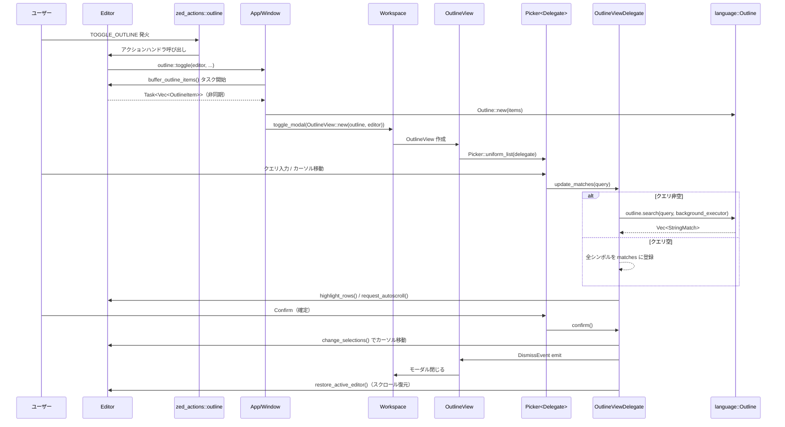

### 1. ざっくり一言

`outline` クレートは、エディタ内のシンボル一覧（アウトライン）をモーダルビューとして開き、ファジー検索しながら選択したシンボル行へジャンプする UI を提供するモジュールです。

---

### 2. このモジュールの役割

#### 2.1 概要

- このモジュールは、**現在のエディタバッファに含まれるシンボル（関数・構造体など）を一覧表示し、検索・ジャンプできるアウトラインビュー**を提供します。
- エディタの `buffer_outline_items` からシンボル情報（`language::OutlineItem`）を取得し、`Picker` ベースの UI で表示・フィルタリングします。
- 選択中のシンボルに応じて、エディタ側の行ハイライトとカーソル位置の更新も行います。

#### 2.2 アーキテクチャ内での位置づけ

- `Editor` からアウトライン情報を取得し、`Workspace` のモーダルとして `OutlineView` を開きます。
- `OutlineView` 内では `Picker<OutlineViewDelegate>` が UI と検索処理を担います。
- 実際のシンボル情報と検索ロジックは `language::Outline` / `OutlineItem` と `fuzzy::StringMatch` に委譲されています。

主要コンポーネント間の依存関係を Meramid 図で示します。

```mermaid
graph TD
  Editor["Editor（エディタ）"]
  OutlineFn["toggle()/outline_for_editor()"]
  OutlineData["language::Outline<Anchor>"]
  OutlineView["OutlineView（モーダル）"]
  Picker["Picker<OutlineViewDelegate>"]
  Delegate["OutlineViewDelegate"]
  Workspace["Workspace"]
  Fuzzy["fuzzy::StringMatch 検索"]
  Theme["ThemeSettings / ActiveTheme"]

  Editor -->|buffer_outline_items| OutlineFn
  OutlineFn -->|OutlineItem に変換| OutlineData
  Editor -->|TOGGLE_OUTLINE アクション| OutlineFn
  OutlineFn -->|toggle_modal| Workspace
  Workspace -->|表示| OutlineView
  OutlineView --> Picker
  Picker --> Delegate
  Delegate -->|items, search()| OutlineData
  Delegate -->|行ハイライト| Editor
  Delegate -->|文字装飾| Theme
  Delegate -->|スコアリング| Fuzzy
```

#### 2.3 設計上のポイント

- **責務の分割**
  - `OutlineView` はモーダルビューのコンテナ（UI 構造とフォーカス）に専念しています。
  - 検索・ハイライト・ジャンプロジックは `OutlineViewDelegate` が担います。
  - アウトラインデータの取得は `outline_for_editor` に集約されています。
- **状態管理**
  - 現在の検索結果・選択インデックス・元のスクロール位置などの状態は `OutlineViewDelegate` が保持します。
  - エディタ側の行ハイライトは、`OutlineRowHighlights` というマーカー型を通じて管理されています。
- **非同期処理**
  - アウトライン取得 (`outline_for_editor`) および検索 (`Outline::search`) は `Task` とバックグラウンドエグゼキュータを使って非同期実行され、UI をブロックしない構造になっています。
- **エラーハンドリング方針**
  - アウトラインが取得できない場合や空だった場合は、何も表示せずに静かに終了します（モーダルを開かない）。
  - モーダルの dismiss に失敗しても `log_err()` でログに残すのみでパニックにはしません。

---

### 3. 主要な機能一覧

- **初期化 (`init`)**  
  エディタにアウトライントグルアクションを登録し、`OutlineView` を開閉できるようにします。

- **アウトラインモーダルの表示・非表示 (`toggle`)**  
  現在のエディタのアウトラインを取得し、`Workspace` のモーダルとして `OutlineView` をトグル表示します。

- **エディタからのアウトライン取得 (`outline_for_editor`)**  
  `Editor::buffer_outline_items` の結果を `Outline<Anchor>` 形式に変換する非同期タスクを作成します。

- **アウトラインモーダル UI (`OutlineView`)**  
  モーダルとして表示されるビュー。`Picker` を子として持ち、フォーカスと閉じるタイミングを制御します。

- **検索・選択・ジャンプロジック (`OutlineViewDelegate`)**  
  ファジー検索によるマッチ生成、選択されたシンボル範囲の行ハイライト、確定時のカーソル移動とモーダルのクローズを担当します。

- **アウトラインアイテムの描画 (`render_item`)**  
  テーマ・フォント設定とシンボル固有のハイライト情報を組み合わせて、1 行分のラベル表示用 `StyledText` を構築します。

- **テスト用ユーティリティと挙動検証（tests モジュール）**  
  行ハイライトの挙動や、空クエリ・スコアタイの選択ルール、LSP ドキュメントシンボルとの切り替え挙動を検証するテストを含みます。

---

### 4. 関数・構造体の解説

#### 4.1 公開関数

##### `init(cx: &mut App)`

**概要**

- アウトライン機能をアプリケーションに登録する初期化関数です。
- 新しい `Editor` が作られたタイミングで `OutlineView::register` を呼び出し、アウトラインチャネルを紐づけます。
- `zed_actions::outline::TOGGLE_OUTLINE` アクションにハンドラを設定します。

**主な処理の流れ**

1. `cx.observe_new(OutlineView::register)` により、新規エディタへアウトラインアクションを登録するオブザーバを設定。
2. `zed_actions::outline::TOGGLE_OUTLINE.set(...)` でグローバルアクションハンドラを登録。
   - `view` を `Editor` にダウンキャストできた場合のみ `toggle` を呼び出します。

**使用例**

```rust
use gpui::App;
use outline;          // このクレート
use editor;           // エディタ初期化モジュール（別クレート）

fn main() {
    gpui::App::new(|cx: &mut App| {
        outline::init(cx); // アウトライン機能を登録
        editor::init(cx);  // エディタ機能を登録
        // 以降は App のメインループなど
    });
}
```

**使用上の注意点**

- アウトライン機能を利用するには、アプリケーション起動時に一度 `init` を呼び出す必要があります。
- `Editor` 側の初期化（`editor::init`）と組み合わせて利用します（順序はテストコードでは `crate::init` → `editor::init` になっています）。

---

##### `toggle(

    editor: Entity<Editor>,
    _: &zed_actions::outline::ToggleOutline,
    window: &mut Window,
    cx: &mut App,
)`

**概要**

- 与えられた `Editor` に対して、アウトラインモーダルの表示／非表示を切り替えます。
- 必要に応じてアウトライン情報を非同期に取得し、`OutlineView` を表示します。

**主な処理の流れ**

1. `editor.read(cx).workspace()` から `Workspace` を取得できなければ何もせず終了。
2. すでに `OutlineView` がアクティブモーダルとして開いている場合:
   - `workspace.toggle_modal` を呼び出してモーダルを閉じる（既存の `OutlineView` をトグル）。
3. まだ開いていない場合:
   - `outline_for_editor` でアウトライン取得用タスクを生成。`None` なら終了。
   - `window.spawn` で非同期タスクを実行し、アウトラインアイテムが空なら何もせず終了。
   - 空でなければ `Outline::new(items)` を作成し、`workspace.toggle_modal` で `OutlineView::new` を表示。

**エッジケース**

- 対応する `Workspace` が存在しないエディタでは、アウトラインモーダルは開かれません。
- アウトラインが空（シンボルが一つも無い）場合は、モーダルは開かれません。

**使用上の注意点**

- 通常は直接呼び出さず、`TOGGLE_OUTLINE` アクション経由で呼び出されます。
- バッファが「マルチバッファ」で、`as_singleton()` できない場合には内部で `outline_for_editor` が `None` を返し、何も起きません。

---

##### `outline_for_editor(

    editor: &Entity<Editor>,
    cx: &mut App,
) -> Option<Task<Vec<OutlineItem<Anchor>>>>`

**概要**

- 指定された `Editor` の現在バッファからアウトラインアイテムを取得し、`OutlineItem<Anchor>` のベクタを返す非同期 `Task` を構築します。
- バッファが単一バッファでない場合やアウトラインが取得できない場合は `None` を返します。

**主な処理の流れ**

1. `editor.read(cx).buffer().read(cx).snapshot(cx)` で `MultiBuffer` のスナップショットを取得。
2. `as_singleton()` で単一バッファのスナップショットを取得できなければ `None`。
3. `buffer_snapshot.remote_id()` を取り、`editor.update(... buffer_outline_items(buffer_id, cx))` でアウトライン情報取得タスクを作成。
4. バックグラウンドエグゼキュータでタスクを実行し、返ってきたアイテムを `OutlineItem<Anchor>` へ変換:
   - `range`, `source_range_for_text`, `body_range`, `annotation_range` の各 `Range` を `anchor_in_buffer` で `Anchor` ベースに変換。
5. 変換結果の `Vec<OutlineItem<Anchor>>` を返す `Task` を `Some` で返す。

**エッジケース**

- `as_singleton()` が失敗するような複雑なマルチバッファ構造の場合はアウトライン機能が利用できません。
- 各 `anchor_in_buffer` 呼び出しが `None` を返した場合、そのアイテムは `filter_map` により除外されます。

**使用上の注意点**

- この関数自体は非公開ですが、`toggle` の挙動を理解する上で重要です。
- `OutlineItem` 変換時に一部の範囲変換が失敗すると、そのアイテムはアウトラインに含まれなくなります。

---

##### `pub fn render_item<T>(

    outline_item: &OutlineItem<T>,
    match_ranges: impl IntoIterator<Item = Range<usize>>,
    cx: &App,
) -> StyledText`

**概要**

- 1 つのアウトラインアイテムを、テーマ情報にもとづくフォント・色・ハイライトを適用した `StyledText` として描画データに変換します。
- ファジーマッチによるヒット部分と、言語側から提供されるシンタックスハイライト等をマージして表示します。

**主な処理の流れ**

1. ファジーマッチ範囲（`match_ranges`）に対して、背景色付きの `HighlightStyle` を生成。
2. `ThemeSettings::get_global(cx)` からバッファ用フォント設定を取得。
3. `TextStyle` を構築:
   - テキスト色に `cx.theme().colors().text`
   - フォントファミリ・機能・フォールバック・サイズ・ウェイトを `settings.buffer_font*` から設定。
4. `gpui::combine_highlights` で、ファジーマッチハイライトと `outline_item.highlight_ranges` を統合。
5. `StyledText::new(outline_item.text.clone())` に対して `with_default_highlights` で上記スタイルとハイライトを適用。

**使用例**

アウトライン以外で `OutlineItem` を自前で描画したい場合の簡易例です（`OutlineItem<T>` 自体の構築は別モジュールに依存します）。

```rust
use gpui::StyledText;
use language::OutlineItem;
use outline::render_item;

fn render_custom_outline_item<T>(
    item: &OutlineItem<T>,              // 言語側が提供したアウトラインアイテム
    matched: bool,                      // 自前の条件でマッチしたかどうか
    cx: &gpui::App,
) -> StyledText {
    let match_ranges = if matched {
        vec![0..item.text.len()]       // 全体を強調する例
    } else {
        Vec::new()
    };
    render_item(item, match_ranges, cx) // outline::render_item を再利用
}
```

**使用上の注意点**

- `match_ranges` のインデックスは `outline_item.text` のバイトではなく、`StyledText` の想定に沿った文字インデックスです（具体的な仕様は `gpui` に依存します）。
- フォントや色は `ThemeSettings` と `ActiveTheme` に依存しているため、テーマ設定が適切に初期化されている必要があります。

---

#### 4.2 主要構造体

##### `pub struct OutlineView`

**役割**

- アウトラインモーダルそのものを表すビューです。
- 内部に `Picker<OutlineViewDelegate>` を持ち、モーダルとしてのライフサイクルと描画を管理します。

**主なフィールド**

- `picker: Entity<Picker<OutlineViewDelegate>>`  
  アウトラインアイテム一覧と検索 UI を管理する `Picker` のエンティティです。

**主な実装トレイト**

- `Focusable`  
  フォーカスハンドルは内部の `picker` に委譲されます。
- `EventEmitter<DismissEvent>`  
  モーダルクローズ用イベントを発火するためのマーカー。
- `ModalView`  
  `on_before_dismiss` でエディタの状態（行ハイライトとスクロール位置）を元に戻します。
- `Render`  
  実際の UI を構築します。幅 34rem の縦方向レイアウトで `Picker` を子要素として持ちます。

**コンストラクタ**

```rust
fn new(
    outline: Outline<Anchor>,
    editor: Entity<Editor>,
    window: &mut Window,
    cx: &mut Context<Self>,
) -> OutlineView
```

- 指定された `Outline<Anchor>` とアクティブな `Editor` から `OutlineViewDelegate` を生成し、それを使って `Picker` を初期化します。
- `Picker::uniform_list(delegate, window, cx)` を使い、最大高さをウィンドウの 75% に制限し、スクロールバーを表示します。

**使用上の注意点**

- 通常は `toggle` 内で `workspace.toggle_modal` を通じて生成されます。直接 `new` を呼ぶのは内部用途が想定されています。
- `ModalView::on_before_dismiss` によって、モーダルを閉じる前に必ず `restore_active_editor` が呼ばれます。

---

##### `struct OutlineViewDelegate`

**役割**

- `Picker` 用のデリゲートとして、検索クエリに応じたマッチ計算、選択インデックスの管理、エディタへのハイライト適用・ジャンプ処理を行います。

**主なフィールド**

- `outline_view: WeakEntity<OutlineView>`  
  自身を囲む `OutlineView` への弱参照。モーダルの dismiss を発火するために使用します。
- `active_editor: Entity<Editor>`  
  対象となるエディタ。
- `outline: Arc<Outline<Anchor>>`  
  表示対象のアウトラインデータ。
- `selected_match_index: usize`  
  現在選択中のマッチのインデックス。
- `prev_scroll_position: Option<Point<ScrollOffset>>`  
  モーダルを開く直前のエディタスクロール位置。閉じる際に復元します。
- `matches: Vec<StringMatch>`  
  現在の検索クエリに対するマッチリスト。

**重要メソッド（抜粋）**

1. `fn new(...) -> Self`  
   初期化時にエディタのスクロール位置を保存します。

2. `fn restore_active_editor(&mut self, window: &mut Window, cx: &mut App)`  
   - 行ハイライト（`OutlineRowHighlights`）をクリアし、保存しておいたスクロール位置があれば復元します。

3. `fn set_selected_index(&mut self, ix: usize, navigate: bool, cx: &mut Context<Picker<...>>)`  
   - `selected_match_index` を更新。
   - `navigate == true` かつ `matches` 非空の場合、選択中シンボルの行範囲をエディタでハイライトし、中央にオートスクロールします。

4. `fn update_matches(&mut self, query: String, window: &mut Window, cx: &mut Context<Picker<...>>)` （`PickerDelegate` 実装）
   - クエリが空の場合は
     - エディタのハイライトとスクロール位置を元に戻し、
     - 全シンボルをスコア 0 のマッチとして列挙。
     - カーソルが含まれる最も深いシンボル（深さ優先・同深さでは先頭）を選択インデックスとします。
   - クエリ非空の場合は
     - `Outline::search` を非同期で実行し、
     - スコア最大・スコアタイの場合は「先に出現した」候補を選択インデックスとします（テストで検証されています）。
     - 初期選択時には `navigate = true` として `set_selected_index` を呼び、行ハイライトを行います。

5. `fn confirm(&mut self, _: bool, window: &mut Window, cx: &mut Context<Picker<...>>)`  
   - 現在の選択に対応する行範囲をハイライトし、最初の行へカーソルを移動 (`change_selections`)。
   - ハイライトをクリアし、エディタにフォーカスを戻した後、モーダルを dismiss します。

6. `fn dismissed(&mut self, window: &mut Window, cx: &mut Context<Picker<...>>)`  
   - `OutlineView` に `DismissEvent` を emit し、モーダルを閉じます。
   - `restore_active_editor` でエディタの状態を復元します。

**エッジケース・挙動の要点**

- **空クエリ時の選択ロジック**  
  - カーソル位置を含むシンボルの中で、`depth` が最大のものを優先します。
  - どのシンボルにも含まれない場合は、最初のシンボル（インデックス 0）を選択します。
- **フィルタ時のスコアタイ**  
  - 同スコアの候補が複数ある場合、最初に出現した候補が選択されます（スコア順を保つ）。
  - カーソル位置はフィルタ後の選択には影響しません。

---

##### `enum OutlineRowHighlights {}`

**役割**

- 行ハイライト API で使うための「タグ用空 enum」です。
- `editor.highlight_rows::<OutlineRowHighlights>(...)` のように、どの機能によるハイライトかを型で区別するために使われます。

---

##### テストモジュール内のユーティリティ

テストモジュールでは、以下のような補助関数が定義されています。

- `open_outline_view(&Entity<Workspace>, &mut VisualTestContext) -> Entity<Picker<OutlineViewDelegate>>`  
  実際に `zed_actions::outline::ToggleOutline` を dispatch してアウトラインモーダルを開き、中の `Picker` エンティティを取得します。

- `outline_names(...) -> Vec<String>`  
  現在のマッチに対応するシンボル名の一覧を取得します。

- `highlighted_display_rows(...) -> Vec<u32>`  
  現在ハイライトされている表示行インデックスを収集します。

- `set_single_caret_at_row(...)` / `assert_single_caret_at_row(...)`  
  カーソル位置の設定と検証のためのヘルパです。

これらは利用者向け API ではなく、挙動理解の参考になります。

---

### 5. データフロー

ここでは、「ユーザーがアウトラインモーダルを開き、シンボルを選択してジャンプする」一連のフローを説明します。

#### 5.1 処理の要点

1. ユーザーがエディタで `TOGGLE_OUTLINE` アクション（キーバインドなど）を実行します。
2. `toggle` 関数が呼ばれ、現在のエディタからアウトライン情報を非同期に取得します。
3. 取得したアウトラインをもとに `OutlineView` モーダルを開きます。
4. ユーザーが検索クエリを入力すると、`OutlineViewDelegate::update_matches` がファジー検索を行い、マッチを更新します。
5. カーソルキーなどでシンボルを選ぶと、対応する行範囲がエディタ側でハイライトされます。
6. `Confirm` アクションで確定すると、そのシンボルの先頭行へカーソルが移動し、モーダルは閉じられます。

#### 5.2 シーケンス図



---

### 6. 使い方（How to Use）

#### 6.1 基本的な使用方法

アプリケーションにアウトライン機能を組み込む基本的な流れは以下の通りです。

1. アプリケーション起動時に `outline::init` を呼び出して機能を登録する。
2. エディタにフォーカスがある状態で `zed_actions::outline::ToggleOutline` アクションを発火する（キーバインド、メニューなど）。
3. 開いたアウトラインモーダルで検索・選択・確定を行う。

簡略化した例です（実際のアプリケーションフレームワークに合わせて調整が必要です）。

```rust
use gpui::{App, Window};
use editor;
use outline;

fn main() {
    App::new(|cx: &mut App| {
        // グローバル状態のセットアップ
        editor::init(cx);  // エディタ機能
        outline::init(cx); // アウトライン機能

        // ウィンドウとワークスペースの生成など…
        cx.add_window(|window: &mut Window, cx| {
            // ここでエディタビューを作成し、Workspace に追加する
        });
    });
}
```

アウトラインを開く処理は、テストコードでは次のように行われています。

```rust
use workspace::Workspace;
use gpui::VisualTestContext;

// Workspace から OutlineView を開くテスト用関数
fn open_outline_view(
    workspace: &Entity<Workspace>,
    cx: &mut VisualTestContext,
) -> Entity<Picker<OutlineViewDelegate>> {
    cx.dispatch_action(zed_actions::outline::ToggleOutline);   // アウトラインをトグル
    cx.executor().advance_clock(Duration::from_millis(200));   // 非同期タスクの完了を待つ
    workspace.update(cx, |workspace, cx| {
        workspace
            .active_modal::<OutlineView>(cx)                   // アクティブな OutlineView を取得
            .unwrap()
            .read(cx)
            .picker                                            // 中の Picker を返す
            .clone()
    })
}
```

#### 6.2 よくある使用パターン

1. **空クエリで現在のカーソル位置のシンボルを選択**

   - アウトラインを開いただけ、またはクエリをすべて消した状態では、カーソル位置を含む最も深いシンボルが自動選択されます。
   - カーソルがどのシンボルにも含まれていない場合は、先頭のシンボルが選択されます。

2. **ファジー検索でシンボルを絞り込み**

   - クエリを入力すると、`Outline::search` によるファジーマッチで候補が並び替えられます。
   - 同じスコアの候補が複数ある場合、**先に出現した候補**が選択されます（カーソル位置には依存しません）。
   - 上下キーなどで候補を移動すると、その都度該当シンボルの行範囲がハイライトされます。

3. **Tree-sitter アウトラインと LSP ドキュメントシンボルの切り替え**

   - テストコードでは、`SettingsStore` を通じて `settings.project.all_languages.defaults.document_symbols` を `On` / `Off` に切り替えることで、
     - デフォルト: Tree-sitter に基づくアウトライン（例: `"struct Foo", "bar", "baz"`）。
     - LSP ドキュメントシンボル: LSP サーバー提供のシンボル（例: `"struct Foo", "bar", "lsp_only_field"`）。
     が切り替わることが確認されています。
   - 実際の設定 API の場所や UI は `settings` クレート側に依存しますが、`outline` クレートは `Editor::buffer_outline_items` の結果に追従する形です。

#### 6.3 使用上の注意点（まとめ）

- **単一バッファ前提**
  - `outline_for_editor` は `MultiBuffer::as_singleton()` に依存しているため、単一バッファでない場合にはアウトラインが表示されません。
- **シンボルが存在しない場合**
  - 取得したアウトラインアイテムが空の場合は、モーダルは開かれません（`toggle` 内で `items.is_empty()` をチェックしています）。
- **行ハイライトのライフサイクル**
  - モーダルを閉じる（Cancel / Confirm / Toggle）と、`restore_active_editor` により行ハイライトは必ずクリアされます。
  - Confirm 時にはカーソル位置が移動するため、スクロール位置は元に戻らず、新しいカーソル位置に合わせて表示されます。
- **パフォーマンス面**
  - アウトライン取得と検索は `Task` とバックグラウンドエグゼキュータで非同期処理されるため、UI スレッドを直接ブロックしない設計になっています。
  - ただし、シンボル数が非常に多い場合は、`outline.search` のコストに依存した遅延が発生する可能性があります。

---

### 7. 関連ファイル

このディレクトリおよび周辺で、`outline` モジュールと密接に関わるファイル・クレートをまとめます。

| パス / クレート名                           | 役割 / 関係 |
|--------------------------------------------|-------------|
| `outline/Cargo.toml`                       | `outline` ライブラリクレートの定義。依存クレート（`editor`, `language`, `picker`, `gpui` など）を指定しています。 |
| `outline/src/outline.rs`                   | 本レポートで解説したアウトラインモーダルの本体。公開 API（`init`, `toggle`, `render_item`, `OutlineView` など）を含みます。 |
| `editor` クレート                          | `Editor` 型・バッファスナップショット・アウトライン情報取得 (`buffer_outline_items`)・行ハイライトなどを提供します。 |
| `language` クレート                        | `Outline` / `OutlineItem` 型、および Tree-sitter / LSP ベースのシンボル情報を提供します。 |
| `picker` クレート                          | 一覧からの選択・ファジー検索 UI を表す `Picker` と `PickerDelegate` を提供し、`OutlineView` の UI 基盤となっています。 |
| `fuzzy` クレート                           | `StringMatch` 型を通してファジーマッチング結果（スコアとマッチ位置）を表現します。 |
| `theme` / `theme_settings` クレート        | テキスト色やフォント設定など、`render_item` で使用されるテーマ・フォント情報を提供します。 |
| `workspace` クレート                       | `Workspace`・`ModalView`・`active_modal`・`toggle_modal` など、モーダルビューの管理機能を提供します。 |
| `settings` クレート                        | LSP ドキュメントシンボルの on/off など、アウトライン表示に影響する設定値の管理を行います（テストで使用されています）。 |

※ 他のクレート（`project`, `lsp`, `menu` など）はテストでの動作確認のために使用されており、`outline` クレートの利用者が直接触る必要は必ずしもありません。
