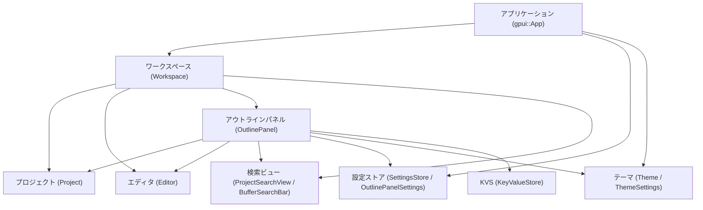
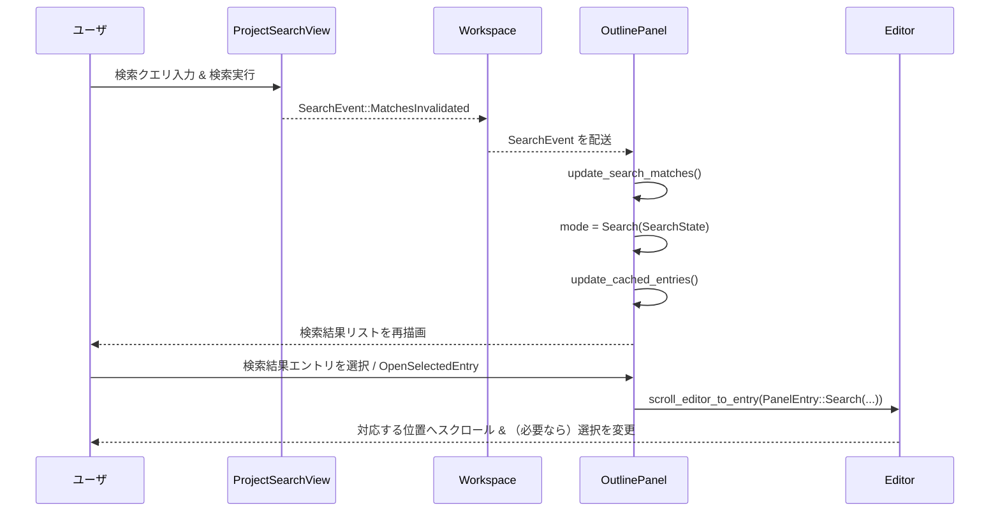

# outline_panel/ ディレクトリ全体の解説

## 1. ざっくり一言

`outline_panel` クレートは、Zed のワークスペースにドッキングされる「アウトラインパネル」を実装しており、アクティブなエディタに対して

- プロジェクトツリー（ファイル／ディレクトリ）
- コードのアウトライン（関数・型など）
- 検索結果（プロジェクト検索／バッファ検索）

を一つのツリーとして表示し、選択と連動してエディタをスクロール・フォールドするモジュールです。

---

## 2. このモジュールの役割

### 2.1 概要

このディレクトリは `outline_panel` クレート全体を構成し、主に次の問題を解決します。

- **問題**: 
  - プロジェクトツリー・コードアウトライン・検索結果がバラバラに表示されると、ファイル間／シンボル間のナビゲーションが煩雑になる。
  - エディタ側の選択状態や折りたたみ状態とビューが同期していないと、現在の作業位置が見失われやすい。
- **機能**:
  - アクティブなエディタに紐づくファイル・ディレクトリ・アウトライン・検索結果を単一のリスト（ツリー風）として表示。
  - キーボードショートカットやクリックでの移動に応じて、エディタのカーソル位置やスクロール位置を同期。
  - ディレクトリやアウトラインの折りたたみ／展開、すべて展開／すべて折りたたみ、ファジー検索によるフィルタリングなどを提供。
  - パネルの位置や幅、アイコン表示、インデントガイドなどを設定 (`OutlinePanelSettings`) から制御。

### 2.2 アーキテクチャ内での位置づけ

`OutlinePanel` はワークスペース (`Workspace`) のパネルとして動作し、エディタ・プロジェクト・検索ビュー・設定ストアと連携します。



主な関係は以下のとおりです。

- `init` 関数で、新規 `Workspace` 生成時にパネル用アクション（Toggle / ToggleFocus）が登録されます。
- `OutlinePanel::load` が `Workspace` と `KeyValueStore` を用いてパネルの状態（開いているかどうか）を復元し、`Workspace` にパネル `Entity` を作成します。
- `OutlinePanel` は
  - `Project` からワークツリーや Git ステータスを取得し、ファイルツリーを構築。
  - アクティブな `Editor` から `MultiBufferSnapshot`／アウトライン情報を取得。
  - `ProjectSearchView`・`BufferSearchBar` から検索結果を取得。
  - `SettingsStore`／`OutlinePanelSettings` から UI の振る舞いや初期展開深度を取得。
- 重い処理（ファイル走査、アウトライン取得、ファジーマッチ、ハイライト計算）は `gpui::Task` と `smol::channel` を使ってバックグラウンドスレッドで行い、結果だけ UI スレッドに反映します。

### 2.3 設計上のポイント

コードから読み取れる主な設計方針は次のとおりです。

- **イベント駆動・リアクティブ**
  - `EditorEvent`・`SearchEvent`・`SettingsStore` の変更を `Subscription` で購読し、必要なときだけ UI を更新します。
  - パネル自体も `EventEmitter<Event>`・`EventEmitter<PanelEvent>` を実装し、フォーカスなどのイベントを発行します。

- **単一の表示用キャッシュ**
  - 実際に描画されるリストは `cached_entries: Vec<CachedEntry>` に集約されており、  
    「ファイル／ディレクトリ」「折りたたまれた複数ディレクトリ」「アウトライン項目」「検索結果」を一列に並べた構造になっています。
  - このフラットなリストに `depth` を持たせることで、ツリー風の表示・インデントガイドを実現しています。

- **折りたたみ状態の管理**
  - 折りたたみ状態は `collapsed_entries: HashSet<CollapsedEntry>` に集約され、  
    ディレクトリ／ファイル／外部ファイル／抜粋 (`Excerpt`)／アウトライン項目ごとに独立して記録されます。
  - エディタ側のバッファフォールド状態とも同期し、パネルでの折りたたみ操作がエディタのフォールドに反映されます。

- **2 つの表示モード**
  - `ItemsDisplayMode::Outline` … ファイルツリー＋抜粋＋アウトライン項目を表示。
  - `ItemsDisplayMode::Search(SearchState)` … プロジェクト検索／バッファ検索の結果を表示。
  - 検索結果が存在する場合には自動で Search モードに切り替え、結果がなくなれば Outline モードに戻ります。

- **設定と永続化**
  - `OutlinePanelSettings` でボタン表示・デフォルト幅・ドック位置・インデントサイズ・自動リビール・自動折りたたみなどを制御します。
  - 「パネルが開いていたかどうか」は `SerializedOutlinePanel` として `KeyValueStore` に保存され、ワークスペース ID をキーに復元されます。

---

## 3. 主要な機能一覧

このクレートが提供する主な機能は次のとおりです。

- **アウトライン表示**  
  - アクティブバッファの抜粋範囲 (`ExcerptRange`) とアウトライン項目 (`OutlineItem`) を階層表示。
  - Tree-sitter ベースのアウトラインと LSP Document Symbols の切り替え（`LanguageSettings::document_symbols`）にも対応。

- **プロジェクトツリー表示**
  - ワークツリー (`Worktree`) のルートから、ディレクトリ／ファイルをツリー構造で表示。
  - プロジェクト外の開いているバッファは「外部ファイル」として別枠表示。

- **ディレクトリの自動折りたたみ**
  - `auto_fold_dirs` 設定と `FsChildren` 情報を使い、  
    「子が 1 つのディレクトリのみ」といった直線的なディレクトリ列を `FoldedDirsEntry` として 1 行にまとめて表示。

- **検索結果ナビゲーション**
  - `ProjectSearchView` や `BufferSearchBar` の検索結果を `SearchEntry` として統合表示。
  - 検索結果を選択すると対応する位置にエディタをスクロール／選択。

- **ファジーフィルタリング**
  - パネル下部の `filter_editor` でクエリを入力すると、  
    `fuzzy::match_strings` によるファジーマッチで行単位にフィルタし、マッチ箇所をハイライト。

- **キーボードナビゲーション**
  - `SelectNext` / `SelectPrevious` / `SelectParent` / `SelectFirst` / `SelectLast` などのアクションでリスト内を移動。
  - `OpenSelectedEntry` や `OpenExcerpts` により、現在の選択をエディタ側に反映。

- **折りたたみ制御**
  - 個別のディレクトリ／ファイル／アウトラインの展開・折りたたみ（`ExpandSelectedEntry` / `CollapseSelectedEntry`）。
  - すべて展開／すべて折りたたみ（`ExpandAllEntries` / `CollapseAllEntries`）。

- **エディタとの同期・オートリビール**
  - エディタの選択変更 (`EditorEvent::SelectionsChanged`) に応じて、対応するアウトライン項目やファイルを自動選択し、必要に応じてディレクトリを展開（`reveal_entry_for_selection`）。

- **パネルのピン留め**
  - `ToggleActiveEditorPin` により、別ファイルにフォーカスを移してもパネル側で追従するかどうかを制御。

- **インデントガイド・スクロールバー**
  - `OutlinePanelSettings::indent_guides` / `scrollbar` に応じて、パネル内のインデントガイドとスクロールバーの表示を制御。

---

## 4. 関数・構造体の解説

### 4.1 型一覧（構造体・列挙体など）

主な型を役割ごとに整理します。

| 名前 | 種別 | 役割 / 用途 |
|------|------|-------------|
| `OutlinePanel` | 構造体 | アウトラインパネル本体。プロジェクトツリー／アウトライン／検索結果の状態と描画ロジックを保持します。 |
| `OutlinePanelSettings` | 構造体 | パネルの設定値。ドック位置・幅・アイコン表示・インデントサイズ・自動リビールなどを保持します。 |
| `PanelEntry` | enum | パネルの 1 行に対応する論理項目。`Fs`（ファイル系） / `FoldedDirs`（折り畳みディレクトリ束） / `Outline` / `Search` を保持します。 |
| `FsEntry` | enum | ファイルシステム項目。`Directory` / `File` / `ExternalFile`（プロジェクト外バッファ）を表します。 |
| `FsEntryFile` / `FsEntryDirectory` / `FsEntryExternalFile` | 構造体 | それぞれファイル・ディレクトリ・外部ファイルのメタデータ（`WorktreeId` や `GitEntry`、バッファ ID など）を保持します。 |
| `FoldedDirsEntry` | 構造体 | 自動折りたたみされた連続ディレクトリ列を 1 行として表現するための構造体です。 |
| `OutlineEntry` | enum | アウトライン系の項目。バッファ内の抜粋範囲 (`Excerpt`) か、個々のアウトライン項目 (`OutlineItem`) を保持します。 |
| `BufferOutlines` | 構造体 | 各バッファごとの抜粋一覧とアウトライン状態 (`OutlineState`) をキャッシュします。 |
| `OutlineState` | enum | アウトライン取得状態。`Outlines(Vec<Outline>)` / `Invalidated(Vec<Outline>)` / `NotFetched` のいずれかです。 |
| `CachedEntry` | 構造体 | 描画用にフラット化された項目。`depth`（インデントレベル）・`entry: PanelEntry`・ファジーマッチ結果 (`StringMatch`) を保持します。 |
| `SelectedEntry` | enum | 現在の選択状態。`Valid(PanelEntry, index)` / `Invalidated(Option<PanelEntry>)` / `None` を取り、再生成後の再選択に使われます。 |
| `CollapsedEntry` | enum | 折りたたみ対象のキー。ディレクトリ・ファイル・外部ファイル・抜粋・アウトライン項目のいずれかを識別します。 |
| `SearchState` | 構造体 | 検索モード時の状態。検索種別 (`SearchKind`)・クエリ文字列・マッチ範囲と `SearchData` を保持し、ハイライト計算タスクも内包します。 |
| `SearchEntry` | 構造体 | 1 件の検索結果。マッチ範囲（`Range<editor::Anchor>`）と種別・ `SearchData` へのハンドルを持ちます。 |
| `SearchKind` | enum | 検索の種類。`Project`（プロジェクト検索）か `Buffer`（バッファ検索）を表します。 |
| `SearchData` | 構造体 | 検索結果 1 件に対する表示用コンテキスト。周辺テキスト (`context_text`)・マッチインデックス・シンタックスハイライト情報を保持します。 |
| `FsChildren` | 構造体 | ディレクトリ直下の `files` / `dirs` 数を保持し、自動折りたたみ条件判定に使われます。 |
| `ActiveItem` | 構造体 | 現在パネルが追従しているワークスペース項目。`WeakItemHandle` とアクティブな `Editor`、イベント購読を保持します。 |
| `Event` | enum | パネル固有のイベント。現状 `Focus` のみ定義されており、パネルにフォーカスが入った際に発行されます。 |
| `OutlinePanelSettingsScrollbarProxy` | 構造体 | パネル用スクロールバー表示設定を `EditorSettings` と連携させるためのアダプタです。 |
| `ScrollbarSettings` | 構造体 | スクロールバー表示ポリシー（`Option<ShowScrollbar>`）を保持します。 |
| `IndentGuidesSettings` | 構造体 | インデントガイドの表示ポリシー（`ShowIndentGuides`）を保持します。 |

### 4.2 主要な関数・メソッド詳細

ここでは特に重要な 7 つの関数・メソッドを取り上げます。

---

#### `pub fn init(cx: &mut App)`

**概要**

- アプリケーション起動時に呼び出し、`Workspace` に対してアウトラインパネル用のアクション (`Toggle`, `ToggleFocus`) を登録します。
- 新しい `Workspace` が生成されるたびに、そのワークスペースに対してパネル切り替えの動作を注入します。

**引数**

| 引数名 | 型 | 説明 |
|--------|----|------|
| `cx` | `&mut App` | アプリケーション全体の `gpui::App` コンテキスト |

**戻り値**

- なし (`()`)

**内部処理の流れ**

1. `cx.observe_new` を使い、新しく生成される `Workspace` を監視します。
2. 各 `Workspace` について `register_action` を 2 つ登録します。
   - `ToggleFocus` アクション: `workspace.toggle_panel_focus::<OutlinePanel>` を呼び出し、パネルのフォーカスをトグル。
   - `Toggle` アクション:  
     `toggle_panel_focus::<OutlinePanel>` の戻り値が `false` の場合は `workspace.close_panel::<OutlinePanel>` を呼んでパネルを閉じる。

**Examples（使用例）**

アプリケーション初期化コードで、他のサブシステムと一緒に呼び出します。

```rust
fn init_app(cx: &mut gpui::App) {
    editor::init(cx);            // エディタサブシステムの初期化
    search::buffer_search::init(cx);  // バッファ検索の初期化
    search::project_search::init(cx); // プロジェクト検索の初期化
    outline_panel::init(cx);     // ← アウトラインパネルのアクション登録
}
```

**Edge cases（エッジケース）**

- `init` が呼ばれていない場合でもコンパイルは通りますが、新しい `Workspace` からパネルのトグルアクションが利用できなくなります。
- すでに `Workspace` が存在する状態で後から呼んだ場合、その既存ワークスペースにはアクションは登録されません（`observe_new` は新規生成のみ監視します）。

**使用上の注意点**

- 通常はアプリケーションの起動時（他の `*_panel` 系の `init` と同じタイミング）で 1 度だけ呼び出す前提の設計です。

---

#### `pub async fn load(workspace: WeakEntity<Workspace>, mut cx: AsyncWindowContext) -> anyhow::Result<Entity<Self>>`

**概要**

- 与えられた `Workspace` に対する `OutlinePanel` を生成し、永続化された状態（パネルがアクティブかどうか）を復元します。
- `KeyValueStore` を通じて保存された JSON (`SerializedOutlinePanel`) を読み出し、`active` フラグを初期化します。

**引数**

| 引数名 | 型 | 説明 |
|--------|----|------|
| `workspace` | `WeakEntity<Workspace>` | パネルを結びつける対象ワークスペースへの弱参照 |
| `cx` | `AsyncWindowContext` | 非同期タスクから UI を更新するためのコンテキスト |

**戻り値**

- `anyhow::Result<Entity<OutlinePanel>>`  
  - 成功時: 新しく生成された `OutlinePanel` の `Entity`  
  - 失敗時: `Workspace` 更新エラーなどを含む `anyhow::Error`

**内部処理の流れ**

1. `serialization_key(workspace)` を用いて、ワークスペース固有のシリアライズキーを組み立てます。  
   - `database_id` または `session_id` が利用されます。
2. そのキーを元に `KeyValueStore::global(cx)` から JSON 文字列を非同期で読み出します。
3. JSON を `SerializedOutlinePanel` に `serde_json::from_str` でデコードし、`active` フラグを取り出します。
4. `workspace.update_in` を通じて UI スレッド上で `OutlinePanel::new` を呼び出し、パネル `Entity` を作成します。
5. 作成直後に `cx.notify()` を呼び、初期描画をトリガします。

**Examples（使用例）**

テストコードと同じパターンで、ワークスペースにパネルを追加する例です。

```rust
// 事前に Workspace を用意済みとする
let workspace_weak = workspace.downgrade();                      // Workspace への弱参照を作る

let panel_entity = window
    .update(cx, |_, window, cx| {
        // Window 上に非同期タスクを起動して OutlinePanel をロード
        cx.spawn_in(window, async move |_this, cx| {
            OutlinePanel::load(workspace_weak, cx).await         // 状態復元込みでパネルを生成
        })
    })?
    .await?;                                                     // Task の完了を待つ

window.update(cx, |multi_workspace, window, cx| {
    multi_workspace.workspace().update(cx, |workspace, cx| {
        workspace.add_panel(panel_entity, window, cx);           // ワークスペースのパネルとして追加
    });
})?;
```

**Errors / Panics**

- シリアライズデータの読み込み・デコード失敗は `log_err().flatten()` で握りつぶされるため、通常は `load` 全体のエラーにはなりません。
- `workspace.update_in` が失敗した場合のみ、`anyhow::Error` として呼び出し元に伝播します。

**Edge cases**

- ワークスペースに `database_id` / `session_id` が設定されていない場合、シリアライズキーは `None` となり、状態復元は行われません（その場合 `active` はデフォルト `false`）。
- シリアライズ済みの JSON が壊れていても、エラーはログに出るだけで、パネル自体はデフォルト状態で生成されます。

**使用上の注意点**

- `load` 自体はパネルを「生成」するだけで、パネルを表示状態にするには `Workspace::add_panel` 側の呼び出しが必要です。
- UI スレッドで `cx.spawn_in(window, ...)` を使って呼び出す必要があります。

---

#### `fn update_fs_entries(&mut self, active_editor: Entity<Editor>, debounce: Option<Duration>, window: &mut Window, cx: &mut Context<Self>)`

**概要**

- 現在アクティブなエディタを基準に、パネル内に表示するファイルシステム項目 (`fs_entries`) とその深さ (`fs_entries_depth`)、子数 (`fs_children_count`) を再構築します。
- バッファとワークツリーの対応付け、Git ステータスの取得、自動折りたたみ対象のディレクトリ判定など、ファイルツリー周りの重い計算をバックグラウンドで行います。

**引数**

| 引数名 | 型 | 説明 |
|--------|----|------|
| `active_editor` | `Entity<Editor>` | 基準とするアクティブエディタ |
| `debounce` | `Option<Duration>` | 更新を遅延させる場合の待ち時間（`Some` ならタイマーを挟む） |
| `window` | `&mut Window` | UI 更新の対象ウィンドウ |
| `cx` | `&mut Context<Self>` | パネル自身の UI コンテキスト |

**戻り値**

- なし。更新結果は `self.fs_entries` などのフィールドに反映されます。

**内部処理の流れ（簡略）**

1. パネルが非アクティブ (`!self.active`) の場合は即 return。
2. アクティブエディタの `MultiBufferSnapshot` を取得し、そこに含まれる全 `ExcerptRange` ごとに
   - 対応する `BufferSnapshot`／`File`／`Worktree`／`ProjectEntryId`／Git ステータスなどを収集し、
   - `buffer_excerpts`（バッファごとの抜粋情報）と `new_buffers`（`BufferOutlines`）を構築。
3. バックグラウンドタスクを起動し、`buffer_excerpts` から次を計算:
   - `new_collapsed_entries`: 折りたたまれたファイル・外部ファイルを反映。
   - `new_unfolded_dirs`: 自動折りたたみ機能と手動展開状態を統合した展開済みディレクトリ集合。
   - `new_fs_entries`: `FsEntry` の一覧（プロジェクト内ファイル＋ディレクトリ＋外部ファイル）。
   - `new_depth_map`: `(WorktreeId, ProjectEntryId) -> depth` マップ。
   - `new_children_count`: ディレクトリ直下の `FsChildren` カウント。
4. UI スレッドに戻り、これらを `self` に反映。  
   さらに `update_non_fs_items`（検索結果／アウトライン）を更新し、  
   まだアウトラインが取得されていなければ `fetch_outdated_outlines` を呼びます。
5. アウトラインが不要な場合は `update_cached_entries` を呼び、最終的な表示用リストを再生成します。

**Examples（使用例）**

この関数は外部から直接呼ぶことは想定されておらず、パネル内から次のように利用されています。

```rust
fn replace_active_editor(
    &mut self,
    new_active_item: Box<dyn ItemHandle>,      // 新しいアクティブ項目
    new_active_editor: Entity<Editor>,         // 新しいアクティブエディタ
    window: &mut Window,                       // ウィンドウ
    cx: &mut Context<Self>,                    // パネルコンテキスト
) {
    // ... 略: active_item の差し替えや購読設定 ...
    self.update_fs_entries(new_active_editor, None, window, cx); // ← 新しいエディタに合わせてファイルツリーを更新
}
```

**Edge cases**

- `self.active == false` の場合は何も更新されません。  
  テストでは必ず `set_active(true, ...)` を呼んだ後で結果を検証しています。
- `buffer_excerpts` の計算中に `Project` や `Worktree` への参照が得られなかった場合、そのバッファは外部ファイルとして扱われます。

**使用上の注意点**

- 更新は非同期に行われるため、直後に `cached_entries` を読むとまだ古い内容の可能性があります。テストでは `UPDATE_DEBOUNCE` 分だけクロックを進めてから検証しています。
- 内部実装に強く依存するため、外部コードから直接呼び出すのではなく、`EditorEvent` や `Workspace` のイベントに任せる前提の設計です。

---

#### `fn generate_cached_entries(&self, is_singleton: bool, query: Option<String>, window: &mut Window, cx: &mut Context<Self>) -> Task<(Vec<CachedEntry>, Option<usize>)>`

**概要**

- 現在の `fs_entries`・アウトライン・検索状態に基づいて、実際に描画に用いるフラットな `CachedEntry` のリストを生成します。
- フィルタクエリ（ファジーマッチ）にも対応し、必要に応じて `StringMatch` を付加します。

**引数**

| 引数名 | 型 | 説明 |
|--------|----|------|
| `is_singleton` | `bool` | アクティブな `MultiBuffer` が単一バッファかどうか（単一ファイルビュー用の特別処理に使用） |
| `query` | `Option<String>` | フィルタ文字列（トリム済み）。`None` の場合はフィルタなし。 |
| `window` | `&mut Window` | UI 更新用ウィンドウ |
| `cx` | `&mut Context<Self>` | パネルのコンテキスト |

**戻り値**

- `Task<(Vec<CachedEntry>, Option<usize>)>`  
  - 第1要素: 生成された `CachedEntry` のベクタ  
  - 第2要素: 「最大幅推定」を持つエントリのインデックス（インデント＋文字数から算出）。

**内部処理の流れ（概要）**

1. `active_editor` が存在しない場合は空リストを返す `Task::ready` を返します。
2. `GenerationState` を初期化し、`fs_entries` を順に走査します。
3. エントリがディレクトリのとき:
   - 自動折りたたみロジックに従って `FoldedDirsEntry` を形成し、  
     連続する単調なディレクトリ系列を 1 行にまとめる場合があります。
4. `track_matches`（クエリの有無）に応じて `push_entry` を使い、
   - `PanelEntry::Fs` / `PanelEntry::FoldedDirs` / `PanelEntry::Outline` / `PanelEntry::Search` を `CachedEntry` として追加し、
   - ファジーマッチ用の `StringMatchCandidate` を登録します。
5. 表示モードに応じて:
   - `ItemsDisplayMode::Outline` の場合: `add_buffer_entries` で抜粋・アウトライン項目を追加。
   - `ItemsDisplayMode::Search` の場合: `add_search_entries` で検索結果を追加。
6. `query` が `Some` の場合は、バックグラウンドで `fuzzy::match_strings` を呼び出し、  
   各候補に `StringMatch` を付与しつつ、マッチしないエントリを削除します。
7. 最終的な `entries` と最大幅インデックスをタプルで返します。

**Examples（使用例）**

パネル内部で `update_cached_entries` から呼び出されています。

```rust
fn update_cached_entries(
    &mut self,
    debounce: Option<Duration>,                      // デバウンス時間
    window: &mut Window,
    cx: &mut Context<Self>,
) {
    if !self.active {
        return;                                      // 非アクティブなら更新しない
    }
    let is_singleton = self.is_singleton_active(cx); // 単一ファイルかどうか
    let query = self.query(cx);                      // フィルタ文字列

    self.cached_entries_update_task = cx.spawn_in(window, async move |panel, cx| {
        // generate_cached_entries から Task を受け取り、完了を待つ
        let task = panel.update_in(cx, |panel, window, cx| {
            panel.generate_cached_entries(is_singleton, query, window, cx)
        })?;
        let (entries, max_width_index) = task.await;
        // ... 略: self.cached_entries への反映 ...
        Ok(())
    });
}
```

**Edge cases**

- `is_singleton == true` のときは、抜粋よりもアウトラインを優先した単純なリストになるよう、`state.clear()` によるリストのリセットが行われます。
- クエリが空文字や空白のみの場合は `None` とみなされ、ファジーマッチは行われません。

**使用上の注意点**

- この関数自体は `Task` を返すだけで、実際に `self.cached_entries` に結果を書き戻す処理は `update_cached_entries` 内で行われます。
- バックグラウンドでのファジーマッチはキャンセルされないため、高頻度に呼び出す場合は既存タスクを上書きするロジック（現在の実装通り）を維持する前提です。

---

#### `fn add_buffer_entries(&mut self, state: &mut GenerationState, buffer_id: BufferId, parent_depth: usize, track_matches: bool, is_singleton: bool, query: Option<&str>, cx: &mut Context<Self>)`

**概要**

- 特定バッファに対して、そのバッファに紐づく抜粋 (`ExcerptRange`) とアウトライン項目 (`OutlineItem`) を `GenerationState` に追加します。
- 折りたたみ状態（抜粋・アウトラインとも）を考慮し、表示すべき項目だけを `CachedEntry` として登録します。

**引数**

| 引数名 | 型 | 説明 |
|--------|----|------|
| `state` | `&mut GenerationState` | 描画用エントリの一時バッファ |
| `buffer_id` | `BufferId` | 対象のバッファ ID |
| `parent_depth` | `usize` | 親エントリの深さ（インデントレベル） |
| `track_matches` | `bool` | ファジーマッチ用候補に登録するかどうか |
| `is_singleton` | `bool` | 単一ファイルビューかどうか |
| `query` | `Option<&str>` | フィルタ文字列（`None` ならフィルタなし） |
| `cx` | `&mut Context<Self>` | パネルコンテキスト |

**戻り値**

- なし。結果は `state.entries` に追加されます。

**内部処理の流れ（概要）**

1. `self.buffers` から `buffer_id` に対応する `BufferOutlines` を取得。なければ return。
2. `buffer.excerpts` を順に処理し、各抜粋に対して:
   - `PanelEntry::Outline(OutlineEntry::Excerpt)` を `parent_depth + 1` の深さで `push_entry`。
   - `is_singleton` のときは抜粋ごとに `GenerationState` をリセットし、アウトラインをトップレベルに表示。
   - `query.is_none()` かつ `CollapsedEntry::Excerpt` に含まれている場合は、その抜粋に属するアウトラインをスキップ。
3. 該当バッファのすべてのアウトライン項目を `Vec` に集め、次の情報を構築:
   - `outline_has_children`: `(range, depth)` → 「子を持つかどうか」のマップ。
   - `visible_outlines`: 折りたたみ状態を反映した表示対象アウトライン一覧。
4. `outline_children_cache` に `outline_has_children` を保存。
5. `visible_outlines` を順に `push_entry` し、`outline.depth` に応じて深さを `outline_base_depth + outline.depth` として追加します。

**Examples（使用例）**

パネル内部から `generate_cached_entries` を通じて呼び出されています。

```rust
// Outline モードで、ファイルエントリに紐づくアウトラインを追加する箇所
match outline_panel.mode {
    ItemsDisplayMode::Outline => {
        if let Some((buffer_id, _excerpts)) = excerpts_to_consider {
            if !active_editor.read(cx).is_buffer_folded(buffer_id, cx) {
                outline_panel.add_buffer_entries(
                    &mut generation_state, // 生成中のエントリ集合
                    buffer_id,             // 対象バッファ
                    depth,                 // 親の深さ
                    track_matches,         // ファジーマッチ候補登録可否
                    is_singleton,          // 単一ファイルかどうか
                    query.as_deref(),      // フィルタクエリ
                    cx,
                );
            }
        }
    }
    _ => {}
}
```

**Edge cases**

- 抜粋自体が `CollapsedEntry::Excerpt` に含まれている場合、クエリが `None` のときはその抜粋配下のアウトラインは表示されません。  
  ただしクエリがある場合はフィルタ対象とするため、折りたたみを無視してアウトラインを展開します。
- アウトライン自体が `CollapsedEntry::Outline` に含まれている場合、そのアウトラインより深い子孫アウトラインはスキップされます。

**使用上の注意点**

- 外部から直接呼ぶ想定ではなく、`generate_cached_entries` と一緒に使うことで意味を持つ関数です。
- `outline_children_cache` を更新しているため、アウトラインの折りたたみ／展開判定 (`has_children`) に依存する場合は、この関数を通じてキャッシュが作られている前提になります。

---

#### `fn update_search_matches(&mut self, window: &mut Window, cx: &mut Context<OutlinePanel>) -> bool`

**概要**

- アクティブなプロジェクト検索 (`ProjectSearchView`) とバッファ検索 (`BufferSearchBar`) の結果を取得し、パネルを検索モードに切り替えるかどうかを決定します。
- 新しい検索状態 (`SearchState`) を構築し、必要であれば `cached_entries` の再生成を要求します。

**引数**

| 引数名 | 型 | 説明 |
|--------|----|------|
| `window` | `&mut Window` | UI 用ウィンドウ |
| `cx` | `&mut Context<OutlinePanel>` | パネルコンテキスト |

**戻り値**

- `bool`  
  - `true`: 検索状態が変化したため `update_cached_entries` を呼ぶ必要がある。  
  - `false`: 変化なし（`cached_entries` は再生成不要）。

**内部処理の流れ**

1. アクティブな `ProjectSearchView` を取得し、`get_matches(cx)` でプロジェクト検索結果を取得。
2. アクティブエディタに紐づくバッファ検索バー (`BufferSearchBar`) を探索し、  
   `editor.get_matches(window, cx)` でバッファ検索結果を取得。
3. 両方とも空の場合:
   - 現在のモードが `ItemsDisplayMode::Search(_)` なら `ItemsDisplayMode::Outline` に戻し、`true` を返却。
4. どちらかに結果がある場合:
   - 優先順位: バッファ検索結果 > プロジェクト検索結果。
   - 新しい `SearchState::new(kind, query, previous_matches, new_matches, theme.syntax, ...)` を生成し、  
     `self.mode = ItemsDisplayMode::Search(...)` でセット。
   - クエリやマッチ配列の変化を以前の `SearchState` と比較し、変化があれば `true` を返却。

**Examples（使用例）**

パネル内部から `update_non_fs_items` などを通じて呼ばれます。

```rust
fn update_non_fs_items(&mut self, window: &mut Window, cx: &mut Context<OutlinePanel>) -> bool {
    if !self.active {
        return false;                                 // 非アクティブなら何もしない
    }
    let mut update_cached_items = false;
    update_cached_items |= self.update_search_matches(window, cx); // 検索状態を更新
    self.fetch_outdated_outlines(window, cx);                      // 必要ならアウトライン取得も開始
    if update_cached_items {
        self.selected_entry.invalidate();            // 選択状態を無効化して再計算させる
    }
    update_cached_items
}
```

**Edge cases**

- バッファ検索とプロジェクト検索が同時に結果を持つ場合、バッファ検索が優先されます。
- モードが `Outline` から `Search` に切り替わると、`cached_entries` は検索結果中心のリストに再構成されます。

**使用上の注意点**

- 戻り値が `true` のときに `update_cached_entries(Some(UPDATE_DEBOUNCE), ...)` を呼んで表示を更新する前提で設計されています。
- 検索結果のハイライト計算 (`SearchState::new` 内のタスク) は非同期に行われ、完了後に `cx.notify()` で再描画がトリガされます。

---

#### `fn scroll_editor_to_entry(&mut self, entry: &PanelEntry, prefer_selection_change: bool, prefer_focus_change: bool, window: &mut Window, cx: &mut Context<OutlinePanel>)`

**概要**

- 指定された `PanelEntry` に対応するエディタ上の位置へスクロールし、必要に応じて選択範囲やフォーカスを変更します。
- ファイル・外部ファイル・アウトライン・検索結果など、エントリ種別に応じてアンカー位置を求めます。

**引数**

| 引数名 | 型 | 説明 |
|--------|----|------|
| `entry` | `&PanelEntry` | スクロール対象のパネルエントリ |
| `prefer_selection_change` | `bool` | 可能なら実際の選択範囲も変更するか（true の場合はカーソル移動も行う） |
| `prefer_focus_change` | `bool` | 可能ならフォーカスをエディタに移すかどうか |
| `window` | `&mut Window` | 対象ウィンドウ |
| `cx` | `&mut Context<OutlinePanel>` | パネルコンテキスト |

**戻り値**

- なし。エディタ側・パネル側の状態が更新されます。

**内部処理の流れ（概要）**

1. アクティブなエディタを取得。ない場合は return。
2. アクティブエディタの `MultiBufferSnapshot` を取得し、`entry` の種別に応じてスクロール対象アンカーを求めます。
   - `Fs::File` / `Fs::ExternalFile`: 該当バッファの先頭の抜粋にジャンプ。
   - `Outline::Outline`: アウトライン範囲の開始（または終了）にジャンプ。
   - `Outline::Excerpt`: 該当抜粋の開始にジャンプし、通常は選択・フォーカスは変更しない。
   - `Search`: マッチ範囲の開始にジャンプ。
   - ディレクトリ系 (`Directory` / `FoldedDirs`) は実際のアンカーを持たないためスクロールしません。
3. 対応する `ItemHandle` を `Workspace` に `activate_item` させ、必要に応じてフォーカスをエディタ／パネルへ切り替え。
4. `prefer_selection_change` が `true` の場合は `Editor::change_selections` により選択範囲を `anchor..anchor` に設定し、`Autoscroll::center()` を用いてスクロール。
5. そうでない場合は `Editor::set_scroll_anchor` を使ってスクロールのみ行い、マルチバッファ時にはヘッダ分のオフセットを考慮します。

**Examples（使用例）**

パネル内で選択変更後にエディタを追従させる際に使われています。

```rust
fn select_next(&mut self, _: &SelectNext, window: &mut Window, cx: &mut Context<Self>) {
    // 次のエントリを選択
    if let Some(entry_to_select) = self.selected_entry().and_then(|selected| {
        self.cached_entries
            .iter()
            .map(|c| &c.entry)
            .skip_while(|e| *e != selected)
            .nth(1)
            .cloned()
    }) {
        self.select_entry(entry_to_select, true, window, cx);
    } else {
        self.select_first(&SelectFirst {}, window, cx);
    }

    // エディタを選択項目にスクロール
    if let Some(selected_entry) = self.selected_entry().cloned() {
        self.scroll_editor_to_entry(&selected_entry, true, false, window, cx);
    }
}
```

**Edge cases**

- アクティブエディタが存在しない場合や、アンカーを求められない場合（例えば該当抜粋が見つからない場合）は何も起こりません。
- ディレクトリ行 (`Fs::Directory` / `FoldedDirs`) を指定した場合は `change_focus` を `false` に変更し、スクロールも行いません（UI だけ更新）。

**使用上の注意点**

- `prefer_selection_change` を `true` にすると、エディタ側のカーソル位置が変わるため、ユーザ操作に対する挙動として自然かどうかを考慮する必要があります。
- このメソッドは内部からのみ呼ばれており、外部コードは `OpenSelectedEntry` アクションなどを通じて間接的に利用するのが前提です。

---

#### `fn set_active(&mut self, active: bool, window: &mut Window, cx: &mut Context<Self>)` （`Panel` トレイト実装）

**概要**

- `Panel` トレイトの一部として実装されており、パネルがアクティブ（表示されている）かどうかを切り替えます。
- アクティブ化されたときには、現在のアクティブエディタに追従して内容を更新し、非アクティブ化されたときには状態をクリアした上でシリアライズします。

**引数**

| 引数名 | 型 | 説明 |
|--------|----|------|
| `active` | `bool` | 新しいアクティブ状態 |
| `window` | `&mut Window` | ウィンドウ |
| `cx` | `&mut Context<Self>` | パネルコンテキスト |

**戻り値**

- なし。

**内部処理の流れ（概要）**

1. `cx.spawn_in(window, async move |outline_panel, cx| { ... })` で非同期タスクを起動。
2. タスク内で `update_in` を呼び、旧アクティブ状態と比較して必要な処理を行う。
3. `active` が `true` に変わった場合:
   - `workspace_active_editor` から現在のアクティブアイテムとエディタを取得。
   - 既存の `active_item` からの置換が必要なら `replace_active_editor` を呼ぶ。
   - それ以外の場合は `update_fs_entries` を呼んで内容更新のみ行う。
4. `active` が `false` に変わった場合:
   - `pinned` が `false` であれば `clear_previous` で各種内部状態をクリア。
5. 最後に `serialize` を呼び、`SerializedOutlinePanel` として `active` 状態を `KeyValueStore` に保存。

**Examples（使用例）**

テストコードでは、パネルの動作を検証する前に必ずアクティブ化しています。

```rust
outline_panel.update_in(cx, |panel, window, cx| {
    panel.set_active(true, window, cx);  // パネルを表示状態にする
});
```

**Edge cases**

- pinned 状態 (`self.pinned == true`) のときに非アクティブ化しても、`clear_previous` が呼ばれないため、内部状態が保持されます。
- アクティブ化時にアクティブエディタが存在しない場合は、ファイルツリーの更新は行われません。

**使用上の注意点**

- `update_fs_entries` など多くの処理は `self.active` が `true` のときのみ動くため、テストやカスタムコードから直接メソッドを呼び出す際も、事前に `set_active(true, ...)` しておく必要があります。

---

#### `fn query(&self, cx: &App) -> Option<String>`

**概要**

- フィルタエディタ (`filter_editor`) のテキストを取得し、空白のみなら `None` にする簡易ユーティリティです。
- ファジーフィルタリングの有無判定に使用されます。

**引数**

| 引数名 | 型 | 説明 |
|--------|----|------|
| `cx` | `&App` | アプリケーションコンテキスト |

**戻り値**

- `Some(query)` : トリム済みクエリ文字列（空でないとき）。
- `None` : 空文字または空白のみの場合。

**Examples（使用例）**

```rust
fn update_cached_entries(&mut self, debounce: Option<Duration>, window: &mut Window, cx: &mut Context<Self>) {
    if !self.active {
        return;
    }

    let is_singleton = self.is_singleton_active(cx);    // 単一バッファかどうか
    let query = self.query(cx);                        // ← フィルタ文字列（空なら None）

    // query に応じて generate_cached_entries でファジーマッチを有効／無効にする
    self.cached_entries_update_task = cx.spawn_in(window, async move |panel, cx| {
        let task = panel.update_in(cx, |panel, window, cx| {
            panel.generate_cached_entries(is_singleton, query, window, cx)
        })?;
        let (entries, max_width_index) = task.await;
        // ... 略 ...
        Ok(())
    });
}
```

**使用上の注意点**

- トリム（`trim()`）された結果で空かどうかを判定しているため、「スペースだけ入力してもフィルタは効かない」挙動になります。

---

### 4.3 その他の関数（一覧）

ここでは補助的な関数・メソッドの役割を簡潔にまとめます。

| 関数名 / メソッド名 | 役割（1 行） |
|---------------------|--------------|
| `workspace_active_editor` | `Workspace` から「フルモードのアクティブエディタ」とその `ItemHandle` を取得します。 |
| `serialize` | パネルの `active` 状態を `SerializedOutlinePanel` として `KeyValueStore` に保存します。 |
| `reveal_entry_for_selection` | エディタの選択位置から最も近いパネル項目を探し、必要なディレクトリ／アウトラインを展開して選択します。 |
| `outline_location` | 与えられたアンカー位置に対して最もふさわしいアウトライン項目または抜粋・ファイルエントリを返します。 |
| `update_non_fs_items` | 検索状態とアウトライン取得状態を更新し、`cached_entries` 再生成が必要かどうかを判定します。 |
| `expand_selected_entry` / `collapse_selected_entry` | 現在選択されているディレクトリ／ファイル／アウトライン／抜粋を 1 段階展開／折りたたみします。 |
| `expand_all_entries` / `collapse_all_entries` | 全ての折りたたみ可能な項目を展開／折りたたみし、必要に応じてバッファフォールドも変更します。 |
| `toggle_active_editor_pin` | パネルの「ピン留め」状態をトグルし、アクティブエディタの追従を制御します。 |
| `copy_path` / `copy_relative_path` | 選択中項目の絶対パス／プロジェクト相対パスをクリップボードにコピーします。 |
| `reveal_in_finder` / `open_in_terminal` | 選択中項目を OS のファイルマネージャで開く／そのディレクトリでターミナルを開くためのアクションです。 |
| `subscribe_for_editor_events` | `EditorEvent` を購読し、選択変更・フォールド変更・パース更新などに応じてパネル状態を更新します。 |
| `find_active_indent_guide_ix` | 現在選択されている行に対応するインデントガイドのインデックスを計算し、ハイライト用に返します。 |
| `file_name` | パスからファイル名部分を抽出し、なければパス全体を文字列として返します。 |

---

## 5. データフロー

ここでは代表的な処理シナリオとして、「プロジェクト検索結果がアウトラインパネルに反映される流れ」を示します。

### シナリオ: プロジェクト検索 → パネル更新 → エディタナビゲーション

1. ユーザが `ProjectSearchView` 上で検索クエリを入力し、検索を実行します。
2. `ProjectSearchView` は検索結果を内部に保持しつつ、`SearchEvent::MatchesInvalidated` を発行します。
3. `OutlinePanel` は `SearchEvent` を購読しており、`update_search_matches` を呼び出します。
4. `update_search_matches` は `ProjectSearchView::get_matches(cx)` からマッチ範囲を取得し、`SearchState::new` で検索状態を構築します。
5. `ItemsDisplayMode` が `Search` に切り替わり、`update_cached_entries` によって `CachedEntry` リストが「検索結果中心のリスト」に再生成されます。
6. ユーザがパネル上の検索結果行を選択し `OpenSelectedEntry` アクションをトリガすると、`scroll_editor_to_entry` によってエディタが該当位置へスクロールされます。

これをシーケンス図で表現すると次のようになります。



ポイント:

- 検索結果は `SearchEntry` として `CachedEntry` に格納され、`SearchData` により周辺テキストとハイライト情報が用意されます。
- エディタがバッファフォールドされている場合には、スクロール前に該当バッファを展開するロジックも別途存在します（`toggle_buffers_fold` / `reveal_entry_for_selection` など）。

---

## 6. 使い方（How to Use）

### 6.1 基本的な使用方法

`outline_panel` は Zed のワークスペースと強く結びついているため、通常は次のような流れで利用されます（テストコード `add_outline_panel` と同等）。

```rust
use gpui::{App, Window};
use workspace::{MultiWorkspace, Workspace};
use project::Project;
use outline_panel::{OutlinePanel, init as init_outline_panel};

fn main() {
    App::run(|cx| {
        // 1. 各サブシステムの初期化                               
        editor::init(cx);                    // エディタの初期化                    
        search::project_search::init(cx);    // プロジェクト検索の初期化
        search::buffer_search::init(cx);     // バッファ検索の初期化
        init_outline_panel(cx);              // アウトラインパネルのアクション登録

        // 2. プロジェクトとワークスペースの作成（簡略化）           
        let project = Project::test(...);    // テスト用プロジェクトを作成（別クレート）
        let window = cx.add_window(|window, cx| {
            MultiWorkspace::test_new(project.clone(), window, cx)
        });
        let workspace = window
            .read_with(cx, |mw, _| mw.workspace().clone())
            .expect("workspace の取得に失敗");

        // 3. OutlinePanel をロードしてワークスペースに追加          
        let workspace_weak = workspace.downgrade();
        let panel = window
            .update(cx, |_, window, cx| {
                cx.spawn_in(window, async move |_this, cx| {
                    OutlinePanel::load(workspace_weak, cx).await
                })
            })
            .expect("OutlinePanel::load の起動に失敗")
            .await
            .expect("OutlinePanel のロードに失敗");

        window
            .update(cx, |multi_workspace, window, cx| {
                multi_workspace.workspace().update(cx, |workspace, cx| {
                    workspace.add_panel(panel, window, cx); // パネルとして登録
                });
            })
            .expect("パネル追加に失敗");
    });
}
```

パネルを表示状態にしたい場合は、生成後に `set_active(true, ...)` を呼び出します（テストでは必ず行っています）。

```rust
outline_panel_entity.update_in(&mut visual_cx, |panel, window, cx| {
    panel.set_active(true, window, cx);      // パネルをアクティブ化
});
```

### 6.2 よくある使用パターン

#### パターン 1: コードアウトラインとして使う

- エディタでソースファイルを開くと、自動的に抜粋＋アウトライン項目がツリー形式で表示されます。
- カーソルを移動すると、`reveal_entry_for_selection` により対応するアウトライン項目が選択されます（`auto_reveal_entries` が有効な場合）。

```rust
// エディタでファイルを開く（Workspace 側の API）
workspace.update_in(cx, |workspace, window, cx| {
    workspace.open_abs_path(
        "/path/to/src/lib.rs".into(),
        OpenOptions { visible: Some(OpenVisible::All), ..Default::default() },
        window,
        cx,
    )
}).await?;
```

この状態でアウトラインパネルを見ると、`outline: struct Foo` のような行が表示され、  
`SelectNext` / `SelectPrevious` / ダブルクリックでアウトライン項目にジャンプできます。

#### パターン 2: 検索結果ナビゲータとして使う

- `ProjectSearchView::deploy_search` でプロジェクト検索ビューを開き、検索を実行します。
- 検索結果があると、アウトラインパネルは自動的に Search モードに移行し、
  - 上部に「Searching: {query}」
  - リストに `search: ...` 行が並びます。

```rust
// プロジェクト検索ビューを開く
workspace.update_in(cx, |workspace, window, cx| {
    ProjectSearchView::deploy_search(
        workspace,
        &workspace::DeploySearch::default(),  // 検索オプション
        window,
        cx,
    )
});

// 検索ビューから検索実行（テストコードより）
perform_project_search(&search_view, "some_query", cx);
```

パネル上で `SelectNext` などで検索結果を選ぶと、エディタが対応位置にスクロールします。

#### パターン 3: フィルタボックスで項目を絞り込む

- パネル下部のフィルタエディタ（プレースホルダ: `Search buffer symbols…`）に文字を入力すると、  
  ファイル名・ディレクトリ名・アウトライン名・検索結果テキストに対してファジーマッチが行われます。
- 入力中のテキストは `OutlinePanel::query` 経由で `generate_cached_entries` に渡され、  
  `fuzzy::match_strings` の結果に応じて `CachedEntry.string_match` が設定されます。

```rust
outline_panel.update_in(cx, |panel, window, cx| {
    panel.filter_editor.update(cx, |editor, cx| {
        editor.set_text("foo", window, cx);  // "foo" をクエリとしてセット
    });
});
// UPDATE_DEBOUNCE 後に cached_entries がフィルタ済みに更新される
```

### 6.3 よくある間違い

```rust
// 間違い例: set_active を呼ばないまま状態更新を期待してしまう
outline_panel.update_in(cx, |panel, window, cx| {
    // panel.set_active(true, window, cx); を呼んでいない
    panel.update_cached_entries(None, window, cx); // active=false のため何も更新されない
});

// 正しい例: 先にパネルをアクティブ化してから更新する
outline_panel.update_in(cx, |panel, window, cx| {
    panel.set_active(true, window, cx);          // まずアクティブ化
    panel.update_cached_entries(None, window, cx); // これで更新が有効になる
});
```

```rust
// 間違い例: UI コンテキスト外から直接メソッドを呼ぶ
// （別スレッドから &mut OutlinePanel を触ろうとするなど）

// 正しい例: 常に Entity 経由で update / update_in を使う
outline_panel_entity.update_in(cx, |panel, window, cx| {
    panel.expand_all_entries(&ExpandAllEntries, window, cx);
});
```

### 6.4 使用上の注意点（まとめ）

- **アクティブ状態**
  - 多くの更新処理（ファイルツリー更新・検索結果更新・アウトライン取得）は `self.active == true` のときのみ動作します。  
    テストやカスタムコードから利用する場合は必ず `set_active(true, ...)` を呼んでおく必要があります。

- **UI スレッドと非同期タスク**
  - `update_fs_entries`・`generate_cached_entries`・`fetch_outdated_outlines` などは `Task` とバックグラウンド実行を多用します。  
    直接フィールドを参照する場合、非同期更新中である可能性を考慮する必要があります（テストではクロックを進めて待機しています）。

- **折りたたみとフォールドの同期**
  - `collapsed_entries` とエディタ側のバッファフォールドは、`toggle_buffers_fold` や `EditorEvent::BufferFoldToggled` で同期されています。  
    どちらか一方を外部から直接書き換えると、一時的に不整合な状態になる可能性があります。

- **設定の依存**
  - `OutlinePanelSettings` の `auto_fold_dirs` / `auto_reveal_entries` / `expand_outlines_with_depth` に挙動が依存しています。  
    設定を変更すると、アウトライン／ツリーの展開状態や自動選択の動作が変わります。

- **LSP Document Symbols との連携**
  - `LanguageSettings::document_symbols` が `On` の場合、アウトラインは LSP の DocumentSymbol を優先して表示します。  
    設定を切り替えるとアウトラインソースが変わるため、テストでもその点が検証されています。

---

## 7. 関連ファイル

このディレクトリ内および主要な関連モジュールを一覧にします。

| パス | 役割 / 関係 |
|------|------------|
| `outline_panel/Cargo.toml` | クレートのメタデータと依存クレート定義。`editor`・`workspace`・`project`・`search`・`theme` など多数のサブシステムに依存します。 |
| `outline_panel/src/outline_panel.rs` | クレートのメイン実装ファイル。`OutlinePanel` 本体・各種内部構造体・描画ロジック・テストが含まれます。 |
| `outline_panel/src/outline_panel_settings.rs` | `OutlinePanelSettings` およびスクロールバー・インデントガイド設定の定義。`Settings` トレイト実装を通じて外部の設定ファイルと連携します。 |
| `editor` クレート | `Editor` 本体と `EditorEvent`・アウトライン取得 (`buffer_outline_items`)・検索 (`BufferSearchBar`) などを提供し、本モジュールから集中的に利用されます。 |
| `workspace` クレート | `Workspace` と `Panel` トレイト、`MultiWorkspace` などのワークスペース管理機構を提供し、パネルのドッキングやアクション登録に利用されます。 |
| `project` クレート | `Project`・`Worktree`・`GitEntry` などを提供し、ファイルツリー構築と Git ステータス取得に使われます。 |
| `search` クレート | `ProjectSearchView` と `BufferSearchBar` など検索 UI を提供し、`SearchEvent` を通じてアウトラインパネルと連携します。 |
| `settings` クレート | `SettingsStore`・`SettingsContent`・`RegisterSetting` マクロなどを提供し、`OutlinePanelSettings` の定義と読み出しに利用されます。 |
| `theme` / `theme_settings` クレート | シンタックスハイライトテーマや UI カラースキームを提供し、検索結果ハイライト (`SearchData`) やアイコン色決定に使われます。 |

以上が、`outline_panel` ディレクトリの全体構造と主要な型・関数・データフローの概要です。  
この説明を基にコードを読むと、どの関数が「何をしていて」「どこから呼ばれているのか」が把握しやすくなるはずです。
