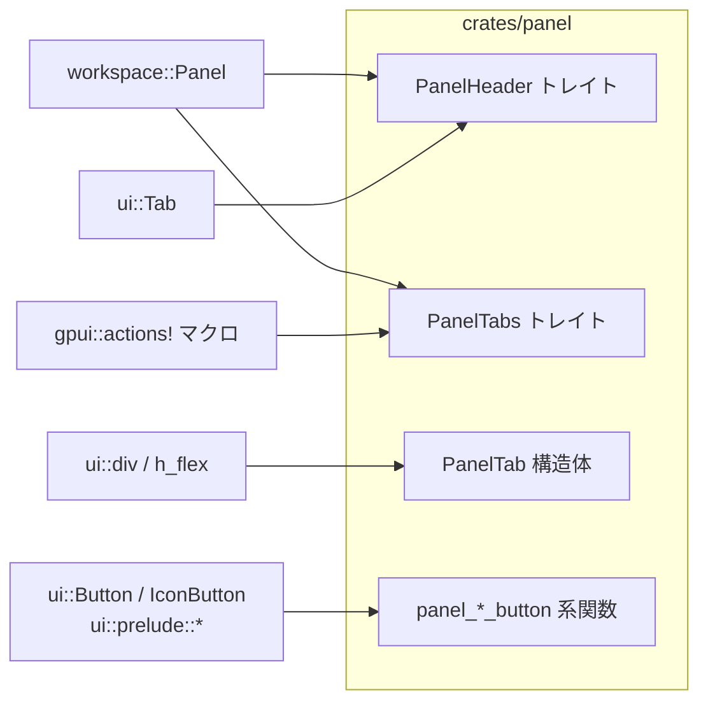
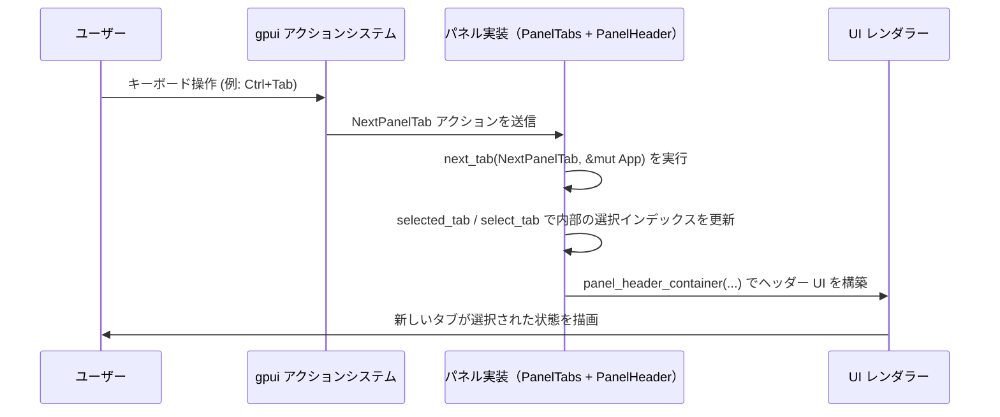

# panel/ コード解説

## 1. ざっくり一言

`panel` クレートは、アプリケーション内の「パネル」用ヘッダーとタブ UI を共通化するためのトレイトと、小さなボタン／アイコンボタンのスタイルを揃えるヘルパー関数を提供するモジュールです。

---

## 2. このモジュールの役割

### 2.1 概要

- このクレートは、UI 全体に散らばる「パネル」コンポーネントのヘッダー・タブ挙動・ボタンスタイルを統一する目的で存在しています。
- `workspace::Panel` を拡張する `PanelHeader` / `PanelTabs` トレイトを定義し、タブ付きパネルの共通インターフェースを提供します。
- また、パネル用のボタン・アイコンボタンのスタイルを一貫させるためのヘルパー関数群（`panel_button` など）を提供します。
- キーボード操作などからタブ移動を行うためのアクション (`NextPanelTab`, `PreviousPanelTab`) もこのクレートで宣言されます。

### 2.2 アーキテクチャ内での位置づけ

このクレートは、ワークスペース内の他クレートと次のような関係にあります。

- `workspace` クレート  
  - `workspace::Panel` トレイトを提供し、アプリ全体の「パネル」という概念を定義していると考えられます（コードからの推測であり、詳細はこのチャンクからは分かりません）。
  - `PanelHeader` / `PanelTabs` はどちらも `workspace::Panel` を継承しています。
- `ui` クレート  
  - `Tab` コンポーネント、`Button` / `IconButton`、`h_flex` / `div` などの UI ビルディングブロックを提供します。
  - ヘッダー高さ算出・ヘッダーコンテナ生成・ボタンスタイル設定で利用されています。
- `gpui` クレート  
  - `actions!` マクロを通じて、アクション (`NextPanelTab`, `PreviousPanelTab`) の定義と登録を行います。
  - アクションはキーボードショートカットなどから発火する UI イベントの単位と考えられます。

依存関係のイメージを簡略図で示します。



矢印は「右側のコンポーネントを利用している」という意味です。

### 2.3 設計上のポイント

コードから読み取れる設計上の特徴は次のとおりです。

- **責務の分割**
  - `PanelHeader` は「ヘッダー領域のレイアウト・高さ」に責務を限定しています。
  - `PanelTabs` は「タブの選択状態とタブ移動アクション」のインターフェースを定義しています。
  - パネルの具体的な内容（中身のビュー）は、このクレートでは扱わず、`workspace::Panel` とその実装側に委ねられています。
- **状態を持たないヘルパー**
  - `PanelTab` 構造体はフィールドを持たない空構造体で、`RenderOnce` によって毎回新しい UI 要素（`div()`）を返すのみです。
  - ボタン生成関数もすべて純粋関数であり、渡された引数から UI コンポーネントを構築して返すだけです。
- **既定実装による統一**
  - `PanelHeader` のメソッドにはデフォルト実装があり、パネルごとに同じ高さ・同じマージン／パディングのヘッダーを得られます。
  - 必要な場合だけオーバーライドすることで、全体の統一感を保ちやすい構造になっています。
- **アクション駆動のタブ移動**
  - タブ移動は `NextPanelTab` / `PreviousPanelTab` アクションを引数に取るメソッドで行われます。
  - これにより、キーボードショートカットやメニューからの「次のタブ」「前のタブ」操作を、`PanelTabs` 実装に結び付けやすくなっています。
- **ElementId の自動生成**
  - `panel_button` では、ラベル文字列から自動的に `ElementId::Name` を生成し、UI 要素に安定した識別子を付与しています。
  - アイコンボタンでは明示的な ID を受け取る形になっており、重要なボタンには開発者が分かりやすい ID を付けられます。

---

## 3. 主要な機能一覧

このクレートが提供する主な機能は次のとおりです。

- **パネルヘッダー共通化**
  - `PanelHeader` トレイト: ヘッダー高さおよびヘッダー用コンテナ要素の生成。
- **タブ付きパネルのインターフェース**
  - `PanelTabs` トレイト: 現在タブの取得・タブ選択・次／前のタブへの移動。
- **タブ UI コンポーネント**
  - `PanelTab` 構造体: タブヘッダーのためのシンプルな UI 要素（現状は空の `div`）。
- **タブナビゲーションアクション**
  - `NextPanelTab`, `PreviousPanelTab`: 「次のタブ」「前のタブ」を表すアクション型（`gpui::actions!` マクロで生成）。
- **ボタンスタイルの共通化**
  - `panel_button`: パネル用の小さめ・コンパクトなテキストボタンを生成。
  - `panel_filled_button`: 上記に Filled スタイルを適用したボタンを生成。
- **アイコンボタンスタイルの共通化**
  - `panel_icon_button`: パネル用のアイコンボタンを生成。
  - `panel_filled_icon_button`: 上記に Filled スタイルを適用したアイコンボタンを生成。

---

## 4. 関数・構造体の解説

### 4.1 型一覧

公開されている主な型を表にまとめます。

| 名前               | 種別     | 役割 / 用途 |
|--------------------|----------|-------------|
| `PanelHeader`      | トレイト | `workspace::Panel` を拡張し、パネルヘッダーの高さとコンテナ要素の生成方法を定義します。 |
| `PanelTabs`        | トレイト | タブ付きパネルのインターフェースを定義し、タブ選択と前後移動アクションを扱います。 |
| `PanelTab`         | 構造体   | パネル内のタブを表す UI 要素。現状は空の `div` を一度だけ描画します。 |
| `NextPanelTab`     | 型（アクション） | 「次のタブへ移動」というアクションを表します（`actions!` マクロから生成されます）。 |
| `PreviousPanelTab` | 型（アクション） | 「前のタブへ移動」というアクションを表します（同上）。 |

`NextPanelTab` / `PreviousPanelTab` の実体はこのチャンクには直接現れませんが、`actions!` マクロに渡されていることと、`PanelTabs` のメソッド引数として使用されていることから、アクション型として利用されることが分かります。

---

### 4.2 トレイト `PanelHeader`

```rust
pub trait PanelHeader: workspace::Panel {
    fn header_height(&self, cx: &mut App) -> Pixels {
        Tab::container_height(cx)
    }

    fn panel_header_container(&self, _window: &mut Window, cx: &mut App) -> Div {
        h_flex()
            .h(self.header_height(cx))
            .w_full()
            .px_1()
            .flex_none()
    }
}
```

**概要**

- `workspace::Panel` を実装する型に対し、「パネルヘッダー領域」を構築するための共通メソッドを追加するトレイトです。
- デフォルト実装として、`ui::Tab` と同じ高さのヘッダーコンテナ（横並びレイアウト・全幅・一定のパディング）を返します。

**メソッド一覧**

| メソッド名 | シグネチャ | 説明 |
|-----------|------------|------|
| `header_height` | `fn header_height(&self, cx: &mut App) -> Pixels` | ヘッダーの高さを返します。デフォルトでは `Tab::container_height(cx)` を使用します。 |
| `panel_header_container` | `fn panel_header_container(&self, _window: &mut Window, cx: &mut App) -> Div` | ヘッダー部分をレイアウトするための `Div` を構築して返します。 |

**内部処理の流れ**

- `header_height`（デフォルト実装）:
  1. `ui::Tab::container_height(cx)` を呼び出し、タブコンテナの高さ（`Pixels` 型）を取得します。
  2. 取得した高さをそのまま返します。
- `panel_header_container`（デフォルト実装）:
  1. `h_flex()` を呼び出して水平方向のフレックスレイアウトを持つ `Div` を生成します。
  2. `.h(self.header_height(cx))` で高さを設定します。
  3. `.w_full()` で横幅を親要素いっぱいに広げます。
  4. `.px_1()` で水平方向のパディング（左右）を 1 単位分付けます。
  5. `.flex_none()` で、この要素自身がフレックスで伸縮しないようにします。
  6. 最終的な `Div` を返します。

**Edge cases（エッジケース）**

- `header_height` は `Tab::container_height(cx)` に依存しているため、`Tab` コンポーネントの仕様変更（高さが 0 になるなど）がそのままヘッダー高さに反映されます。
- `panel_header_container` は `header_height` を呼ぶため、`header_height` をオーバーライドした場合は、その値がコンテナ高さとして使われます。
- `Window` 引数は現状 `_window` という未使用変数であり、デフォルト実装では参照されません。

**使用上の注意点**

- ヘッダーの高さやレイアウトを変えたい場合は、`header_height` または `panel_header_container` をオーバーライドすることになります。
- ただし、既定実装は `Tab` と同じ高さを前提として UI がデザインされている可能性があるため、大きく変更すると他のコンポーネントと高さが揃わなくなる可能性があります。

---

### 4.3 トレイト `PanelTabs`

```rust
/// Implement this trait to enable a panel to have tabs.
pub trait PanelTabs: PanelHeader {
    /// Returns the index of the currently selected tab.
    fn selected_tab(&self, cx: &mut App) -> usize;
    /// Selects the tab at the given index.
    fn select_tab(&self, cx: &mut App, index: usize);
    /// Moves to the next tab.
    fn next_tab(&self, _: NextPanelTab, cx: &mut App) -> Self;
    /// Moves to the previous tab.
    fn previous_tab(&self, _: PreviousPanelTab, cx: &mut App) -> Self;
}
```

**概要**

- タブ機能を持つパネルのためのトレイトです。
- 現在選択中のタブインデックス、任意インデックスへの選択、次／前のタブへの移動操作を定義します。
- コメントから、「このトレイトを実装するとパネルにタブ機能が付与される」という位置づけであることが分かります。

**メソッド一覧**

| メソッド名 | シグネチャ | 説明 |
|-----------|------------|------|
| `selected_tab` | `fn selected_tab(&self, cx: &mut App) -> usize` | 現在選択中のタブのインデックスを返します。 |
| `select_tab` | `fn select_tab(&self, cx: &mut App, index: usize)` | 指定したインデックスのタブを選択状態にします。 |
| `next_tab` | `fn next_tab(&self, _: NextPanelTab, cx: &mut App) -> Self` | 「次のタブへ移動」アクションを受けて、次のタブを選択した新しい状態の `Self` を返すことが期待されます（実装はトレイト利用側に委ねられています）。 |
| `previous_tab` | `fn previous_tab(&self, _: PreviousPanelTab, cx: &mut App) -> Self` | 「前のタブへ移動」アクションを受けて、前のタブを選択した新しい状態の `Self` を返すことが期待されます。 |

**Edge cases（エッジケース）**

このトレイト自体には実装がないため、エッジケース処理はすべて実装側に委ねられます。

代表的な論点としては次のようなものが考えられます（どのように扱うかは実装次第であり、コードからは分かりません）。

- `index` がタブ数の範囲外のとき `select_tab` をどう扱うか（無視する・最寄りに丸める・パニックなど）。
- `next_tab` / `previous_tab` で末尾や先頭に達したときにどう振る舞うか（循環する／止まるなど）。
- タブが 0 個のとき `selected_tab` をどう扱うか。

**使用上の注意点**

- `next_tab` / `previous_tab` の戻り値が `Self` になっているため、「現在のパネル状態を更新した新しいバージョンの `Self` を返す」ようなイミュータブルな設計を採る場合に適しています。
  - 実際に内部でミュータブルな更新を行うかどうかは実装によりますが、少なくとも呼び出し側は返り値の `Self` を使う前提で処理を組む必要があります。
- アクション引数 (`NextPanelTab`, `PreviousPanelTab`) 自体はメソッド内で未使用にしてもよい設計になっています（プレースホルダ `_` というパラメータ名から分かります）。
  - ただし、将来的にアクションに追加情報が付く可能性もあり、その際に利用できる拡張ポイントになり得ます。

---

### 4.4 構造体 `PanelTab`

```rust
#[derive(IntoElement)]
pub struct PanelTab {}

impl RenderOnce for PanelTab {
    fn render(self, _window: &mut Window, _cx: &mut App) -> impl IntoElement {
        div()
    }
}
```

**概要**

- パネル内のタブ UI を表現するための構造体ですが、現時点ではフィールドを持たない空の構造体です。
- `RenderOnce` トレイトの実装により、一度だけレンダリングされる UI 要素として利用できます。
- `render` メソッドは単に空の `div()` を返すため、このままでは見た目のあるタブにはなりませんが、CSS やテーマ側でスタイルが当たる前提か、あるいは今後拡張される前提のプレースホルダとして利用されている可能性があります（コードからの推測であり、詳細は不明です）。

**内部処理**

- `render` メソッドは次の処理を行います。
  1. 引数の `self`（`PanelTab`）を消費します。
  2. `_window`, `_cx` 引数は未使用です。
  3. `div()` を呼び出して空の `Div` 要素を生成し、そのまま返します。

**Edge cases**

- フィールドを持たないため、状態に応じて見た目を変えるといったことはこの構造体単体では行われません。
- ただし、`IntoElement` 派生や `RenderOnce` の実装は、外部の UI システム（`ui`/`gpui`）と結び付いているため、テーマやスタイルシート側で `PanelTab` に特別なスタイルが紐づいている可能性があります。この点はコードだけからは判断できません。

**使用上の注意点**

- `PanelTab` のままでは中身が何もないため、タブラベルやアイコンなどを表示したい場合は、別のコンポーネントと組み合わせてヘッダーを構築する必要があります。
- 具体的な使い方はこのチャンクには現れないため、他ファイルの実装を併せて確認する必要があります。

---

### 4.5 ボタン／アイコンボタン ヘルパー関数

ここでは特に重要と思われる 4 つのヘルパー関数について詳しく説明します。

#### `panel_button(label: impl Into<SharedString>) -> ui::Button`

**概要**

- パネルのヘッダーなどで使用する、小さめでコンパクトなスタイルのテキストボタンを生成します。
- ラベル文字列から自動的に `ElementId::Name` を生成し、ボタンに一意な ID を付与します（ラベルが一意であることを前提としています）。

**引数**

| 引数名 | 型 | 説明 |
|--------|----|------|
| `label` | `impl Into<SharedString>` | ボタンに表示するテキストです。`&str`, `String`, `SharedString` などから変換できます。 |

**戻り値**

- 型: `ui::Button`
- ラベルサイズが `Small`、サイズが `Compact`、レイヤーが `ElevationIndex::ModalSurface` に設定されたボタンインスタンスです。

**内部処理の流れ**

1. `label.into()` で `SharedString` 型に変換します。
2. `label.to_lowercase().replace(' ', "_")` でラベルを小文字化し、スペースをアンダースコアに置換します。
3. その結果の文字列を `ElementId::Name(... .into())` で ID 化します。
4. `ui::Button::new(id, label)` でボタンインスタンスを生成します。
5. `.label_size(ui::LabelSize::Small)` でラベル文字のサイズを小さめに設定します。
6. `.layer(ui::ElevationIndex::ModalSurface)` でボタンの描画レイヤー（Z オーダーや影など）を「モーダルサーフェス」相当のレベルに設定します。
7. `.size(ui::ButtonSize::Compact)` でボタンの高さ・パディングなどをコンパクトなサイズに設定します。

**Examples（使用例）**

次の例は、「保存」ボタンを作成するものです。

```rust
use panel::panel_button;                        // panel クレートからヘルパー関数をインポート
use ui::prelude::*;                             // Button などの UI 型をインポート（パスはワークスペース依存）

fn build_header_buttons() -> ui::Button {       // パネルヘッダー用のボタンを 1 つ返す仮の関数
    let save_button = panel_button("Save");     // "Save" というラベルのコンパクトなボタンを生成
    save_button                                 // 呼び出し元に返す
}
```

このとき、`ElementId::Name("save".into())` のような ID が内部的に設定されます。

**Errors / Panics**

- この関数自身はエラーや `Result` を返しません。
- 内部で呼び出している `to_lowercase`, `replace`, `ElementId::Name`, `Button::new` などがパニックを起こす条件は、このチャンクからは分かりませんが、通常の UTF-8 文字列に対してはパニックは想定しにくい処理です。

**Edge cases（エッジケース）**

- **空文字列のラベル**:  
  `""` を渡した場合、ID は `ElementId::Name("".into())` になります。これは UI システム側で有効な ID とみなされるかどうかは、このコードからは分かりません。
- **重複ラベル**:  
  同じラベルを持つボタンを複数作成すると、同じ `ElementId` が割り当てられます。ID の一意性を前提とする仕組みがある場合（テスト・自動操作など）、問題になる可能性があります。
- **非 ASCII 文字**:  
  日本語や絵文字を含むラベルの場合、`to_lowercase` の結果や `replace` の挙動は Unicode に従いますが、ID としてどう扱われるかは UI フレームワーク側の仕様に依存します。

**使用上の注意点**

- ボタンの ID としてラベルをそのまま利用しているため、「ラベルは画面内で一意である」ことが望ましいです。一意性が重要なボタンでは、別途 ID 付与のロジックを検討する必要があります。
- デザイン上、パネルヘッダーに置く小さなボタン専用のスタイルになっている可能性が高いため、他の場所での一般的なボタンとしては別のヘルパーを使う方がよい場面もあります（これはワークスペース全体の設計に依存します）。

---

#### `panel_filled_button(label: impl Into<SharedString>) -> ui::Button`

**概要**

- `panel_button` で生成したボタンに対し、`ButtonStyle::Filled` を適用したバージョンです。
- 中身が塗りつぶされたボタンをパネルヘッダーで使いたい場合に利用します。

**内部処理の流れ**

1. `panel_button(label)` を呼び出してベースとなるボタンを生成します。
2. `.style(ui::ButtonStyle::Filled)` でスタイルを Filled に変更します。
3. 変更後のボタンを返します。

**使用例**

```rust
use panel::panel_filled_button;                 // Filled パネルボタン用ヘルパー
use ui::prelude::*;

fn build_new_button() -> ui::Button {
    let new_button = panel_filled_button("New"); // Filled スタイルの "New" ボタンを生成
    new_button
}
```

**使用上の注意点**

- `panel_button` と同様、ラベルから生成される ID が重複しないよう注意する必要があります。
- 背景色のコントラストなどは `ButtonStyle::Filled` とテーマ設定に依存するため、可読性の確認が必要です。

---

#### `panel_icon_button(id: impl Into<SharedString>, icon: IconName) -> ui::IconButton`

**概要**

- パネル用のアイコンボタン（テキストラベルを持たないボタン）を生成するヘルパーです。
- ボタン ID を明示的に指定する点が `panel_button` と異なります。

**引数**

| 引数名 | 型 | 説明 |
|--------|----|------|
| `id`   | `impl Into<SharedString>` | ボタンに付与する識別子です。`ElementId::Name` に変換されます。 |
| `icon` | `IconName`                | 表示するアイコンの種類を表す列挙値です（定義はこのチャンクにはありません）。 |

**戻り値**

- 型: `ui::IconButton`
- レイヤーが `ElevationIndex::ModalSurface` に設定されたアイコンボタンです。

**内部処理の流れ**

1. `id.into()` で `SharedString` に変換します。
2. `ElementId::Name(id.into())` で ID を生成します。
3. `IconButton::new(id, icon)` でアイコンボタンを生成します。
4. `.layer(ui::ElevationIndex::ModalSurface)` で描画レイヤーを設定します。
5. 生成した `IconButton` を返します。

**使用例**

```rust
use panel::panel_icon_button;                   // アイコンボタン用ヘルパーをインポート
use ui::{prelude::*, IconName};                 // IconName などをインポート

fn build_close_button() -> ui::IconButton {
    // "close_tab" という ID を持つタブ閉じるボタンを作成
    let close_btn = panel_icon_button("close_tab", IconName::Close);
    close_btn
}
```

`IconName::Close` などの具体的なバリアント名は、このチャンクには現れないため例示にとどまります。

**Edge cases**

- `id` が空文字列や重複した文字列の場合の扱いは UI フレームワーク側に依存します。
- 存在しないアイコン名（`IconName` の不正な値）はコンパイル時に防がれるため、実行時エラーにはなりにくい設計です。

**使用上の注意点**

- ID を明示的に指定するため、テストやアクセシビリティ・自動操作（UI テスト）などで参照しやすくなりますが、その分 ID 命名規則をプロジェクト内で統一しておく必要があります。
- レイヤーが常に `ModalSurface` に固定されているため、他の UI 要素との重なり順に影響する可能性があります。必要に応じて別レイヤーを持つヘルパーを用意する選択肢も考えられますが、このクレート内には現時点では存在しません。

---

#### `panel_filled_icon_button(id: impl Into<SharedString>, icon: IconName) -> ui::IconButton`

**概要**

- `panel_icon_button` で作成したアイコンボタンに `ButtonStyle::Filled` を適用したバージョンです。
- 背景付きのアイコンボタンをパネルヘッダーに置きたい場合に利用します。

**内部処理の流れ**

1. `panel_icon_button(id, icon)` を呼び出してベースとなるアイコンボタンを生成します。
2. `.style(ui::ButtonStyle::Filled)` を呼び出してスタイルを Filled に変更します。
3. 変更後のアイコンボタンを返します。

**使用例**

```rust
use panel::panel_filled_icon_button;            // Filled アイコンボタン用ヘルパー
use ui::{prelude::*, IconName};

fn build_run_button() -> ui::IconButton {
    // "run" という ID を持つ実行ボタンを生成
    let run_btn = panel_filled_icon_button("run", IconName::Play);
    run_btn
}
```

**使用上の注意点**

- `panel_icon_button` と同様、ID の一意性に注意する必要があります。
- テーマによっては Filled アイコンボタンが目立ちすぎる場合があるため、UI 全体のバランスを見て使い分ける必要があります。

---

### 4.6 その他の API / マクロ

| 名前 | 種別 | 役割（1 行） |
|------|------|--------------|
| `actions!(panel, [ NextPanelTab, PreviousPanelTab ])` | マクロ呼び出し | `NextPanelTab` / `PreviousPanelTab` アクション型および、それに関連する登録処理を生成します（詳細は `gpui::actions!` の実装に依存します）。 |

---

## 5. データフロー

ここでは、「ユーザーがキーボードショートカットで次のタブへ移動する」という代表的なシナリオを想定して、データおよび処理の流れを説明します。

1. ユーザーがキーボードショートカット（例: `Ctrl+Tab`）を押します。
2. `gpui` のアクションシステムがこの入力を検知し、`NextPanelTab` アクションを発行します。
3. 現在フォーカスされているパネル（`PanelTabs` を実装している型）に対して、`next_tab(NextPanelTab, &mut App)` が呼び出されます。
4. パネル実装側は `selected_tab` / `select_tab` などを用いて内部の選択インデックスを更新し、新しい `Self` を返します。
5. 更新後のパネル状態をもとに、ヘッダー部分は `PanelHeader::panel_header_container` を使って再構築されます。このとき `PanelTab` や `panel_button`／`panel_icon_button` などが組み合わされて UI がレンダリングされます。
6. レンダラーが UI を再描画し、ユーザーには新しいタブがアクティブになったヘッダーやコンテンツが表示されます。

これをシーケンス図で表すと、次のようになります（内部の具体的な型名や呼び出し順はコードから推測したものであり、実装により異なる可能性があります）。



この図は、「アクション → トレイトメソッド → UI 再描画」という大まかな流れを示しています。

---

## 6. 使い方（How to Use）

### 6.1 基本的な使用方法

ここでは、`PanelHeader` と `PanelTabs` を実装した簡単なパネルの例と、パネルボタンの利用例を示します。実際の `workspace::Panel` の詳細な API はこのチャンクにはないため、コメントで省略部分を示します。

```rust
use panel::{PanelHeader, PanelTabs, panel_button}; // 本クレートのトレイトとヘルパーをインポート
use workspace::Panel as WorkspacePanel;            // ベースとなる Panel トレイト
use ui::prelude::*;                                // App, Window, レイアウトヘルパーなどをインポート

// タブ付きパネルの例示的な実装
pub struct MyPanel {                               // 仮のパネル構造体
    pub tabs: Vec<SharedString>,                  // タブラベルの一覧
    pub selected: usize,                          // 現在選択されているタブのインデックス
}

// workspace::Panel の実装（詳細はワークスペース側の仕様に依存するため省略）
impl WorkspacePanel for MyPanel {
    // 必要なメソッドをここに実装する
}

// パネルヘッダーの共通仕様を有効化
impl PanelHeader for MyPanel {}                   // デフォルト実装をそのまま利用

// タブ機能の実装
impl PanelTabs for MyPanel {
    fn selected_tab(&self, _cx: &mut App) -> usize {
        self.selected                           // 現在の選択インデックスを返す
    }

    fn select_tab(&self, _cx: &mut App, index: usize) {
        // 実際にはミュータブルな更新や状態管理が必要ですが、
        // ここでは例示としてロジックの場所だけ示します。
        // self.selected = index; など
    }

    fn next_tab(&self, _action: NextPanelTab, _cx: &mut App) -> Self {
        // 簡単な例: 末尾の次は先頭に戻る
        let next_index = if self.tabs.is_empty() {
            0
        } else {
            (self.selected + 1) % self.tabs.len()
        };

        MyPanel {
            tabs: self.tabs.clone(),            // タブ一覧はそのままコピー
            selected: next_index,               // 更新された選択インデックス
        }
    }

    fn previous_tab(&self, _action: PreviousPanelTab, _cx: &mut App) -> Self {
        let len = self.tabs.len();
        let prev_index = if len == 0 {
            0
        } else if self.selected == 0 {
            len - 1                             // 先頭の前は末尾
        } else {
            self.selected - 1
        };

        MyPanel {
            tabs: self.tabs.clone(),
            selected: prev_index,
        }
    }
}

// パネルヘッダー内でボタンを配置する例（実装場所は実際の UI 構築コードに依存）
fn build_panel_header(window: &mut Window, cx: &mut App, panel: &MyPanel) -> Div {
    let mut header = panel.panel_header_container(window, cx); // PanelHeader の既定ヘッダーコンテナを取得
    let refresh_button = panel_button("Refresh");              // リフレッシュボタンを生成
    header = header.child(refresh_button);                     // ヘッダーにボタンを追加（メソッド名は実際の API に依存）
    header                                                   // 完成したヘッダーを返す
}
```

上記コードは概念的な例であり、`child` メソッドなど具体的な UI API 名は `ui` クレートの実装に依存するため、このチャンクの情報だけでは正確には記述できません。

### 6.2 よくある使用パターン

1. **タブヘッダーにアイコンボタンを配置する**

   タブバー右端に「新規タブ」や「タブを閉じる」アイコンを置きたい場合、`panel_icon_button` / `panel_filled_icon_button` が利用できます。

   ```rust
   use panel::{panel_icon_button, panel_filled_icon_button};
   use ui::{prelude::*, IconName};

   fn build_tab_actions() -> (ui::IconButton, ui::IconButton) {
       // 新規タブボタン（線画アイコン）
       let new_tab_btn = panel_icon_button("new_tab", IconName::Plus);

       // タブ一覧ボタン（Filled アイコン）
       let list_tab_btn = panel_filled_icon_button("list_tabs", IconName::List);

       (new_tab_btn, list_tab_btn)
   }
   ```

2. **ヘッダー高さをカスタマイズしたパネル**

   `PanelHeader` の `header_height` をオーバーライドして、特定のパネルだけヘッダーを高くしたい場合の例です。

   ```rust
   use panel::PanelHeader;
   use workspace::Panel as WorkspacePanel;
   use ui::prelude::*;

   pub struct LargeHeaderPanel {
       // パネルの状態
   }

   impl WorkspacePanel for LargeHeaderPanel {
       // ...
   }

   impl PanelHeader for LargeHeaderPanel {
       fn header_height(&self, cx: &mut App) -> Pixels {
           // 既定の Tab 高さの 1.5 倍にする例
           Tab::container_height(cx) * 1.5
       }
       // panel_header_container は既定のままでもよい
   }
   ```

   ここで `Pixels` に対する `* 1.5` のような演算が実際に可能かどうかは、このチャンクからは分かりません。実際の API に合わせて適切な演算を行う必要があります。

3. **Filled ボタンで主要操作を目立たせる**

   ヘッダー上でメインアクションを Filled ボタン、補助的なアクションを通常ボタンにする、といった使い分けも考えられます。

   ```rust
   use panel::{panel_button, panel_filled_button};
   use ui::prelude::*;

   fn build_actions_row() -> (ui::Button, ui::Button) {
       let run_btn = panel_filled_button("Run"); // メイン操作
       let stop_btn = panel_button("Stop");      // 補助的な操作（例）

       (run_btn, stop_btn)
   }
   ```

### 6.3 使用上の注意点

- **タブインデックスの境界処理**
  - `PanelTabs` の `select_tab` / `next_tab` / `previous_tab` は境界処理の仕様を定めていません。
  - 実装時には、タブ数 0 の場合や末尾／先頭での挙動（循環するかどうか）を明示的に決めておく必要があります。
- **ID の一意性**
  - `panel_button` はラベルから ID を生成し、`panel_icon_button` は文字列 ID を直接受け取ります。
  - 同じ ID を持つ要素が多数存在すると、UI テストやアクセシビリティ、テーマ適用などで問題が発生する可能性があります。ID 設計をプロジェクト全体で統一することが推奨されます。
- **レイヤー設定 (`ElevationIndex::ModalSurface`)**
  - ボタン／アイコンボタンはすべて `ModalSurface` レイヤーに固定されています。
  - 他のコンポーネントとの重なり順や影の付き方に影響するため、パネル以外の場所で使う場合はレイヤーの妥当性を確認する必要があります。
- **UI フレームワーク依存の API**
  - `h_flex`, `div`, `IntoElement`, `RenderOnce`, `App`, `Window` などはすべて外部クレート由来であり、詳細な挙動はこのクレートからは分かりません。
  - そのため、パネルの UI を拡張する際は `ui` / `gpui` / `workspace` クレートのドキュメントも併せて参照する必要があります。

---

## 7. 関連ファイル

このクレートと密接に関係するファイル・モジュールを一覧にします。

| パス / クレート名        | 役割 / 関係 |
|--------------------------|-------------|
| `panel/Cargo.toml`       | 本クレートのメタデータと依存関係 (`gpui`, `ui`, `workspace`) を定義します。 |
| `panel/src/panel.rs`     | 本レポートの対象となるライブラリ本体であり、`PanelHeader` / `PanelTabs` とボタンヘルパーを提供します。 |
| `gpui`（ワークスペース内クレート） | `actions!` マクロや `App`, `Window` など、UI アプリケーションのコアとなる型・機能を提供していると考えられます（詳細はこのチャンクにはありません）。 |
| `ui`（ワークスペース内クレート）   | `Tab`, `Button`, `IconButton`, `ElementId`, レイアウトヘルパー (`div`, `h_flex`) など、具体的な UI コンポーネントとスタイル設定を提供します。 |
| `workspace`（ワークスペース内クレート） | `workspace::Panel` トレイトを提供し、アプリ全体のパネル管理ロジックの中心を担っていると推測されます（実装はこのチャンクには含まれていません）。 |

`gpui`, `ui`, `workspace` の具体的なディレクトリパスは、上位のワークスペース設定（ルートの `Cargo.toml` など）によって決まります。このチャンク単体からは正確な相対パスは分かりません。
