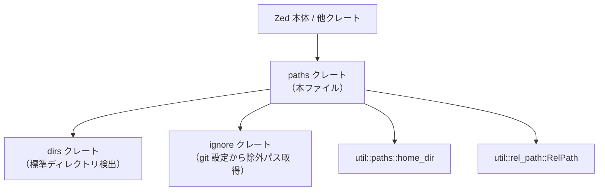
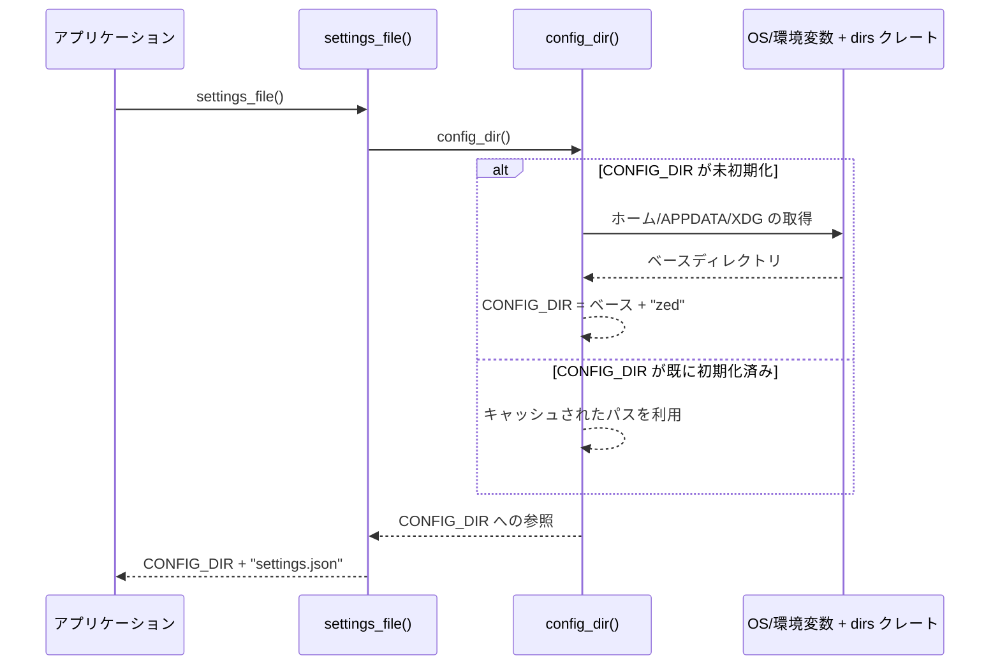

## 1. ざっくり一言

`paths` クレートは、Zed エディタが利用する **設定・データ・ログ・拡張機能などの各種ディレクトリ／ファイルのパスを一元的に計算し、キャッシュするユーティリティ** です。

---

## 2. このモジュールの役割

### 2.1 概要

- このクレートは、Zed が動作する **プラットフォーム（macOS / Linux / FreeBSD / Windows）や環境変数** に応じて、設定・データ・一時ファイル・拡張機能などの保存場所を決定します。
- `OnceLock` や `LazyLock` により、一度計算したパスを **プロセス全体で共有・再利用** します。
- VS Code / Cursor など、他エディタの設定ファイルの候補パスも提供し、設定移行などで再利用できるようにしています。

### 2.2 アーキテクチャ内での位置づけ

このクレートは「パス計算の単一の窓口」として働き、他のクレートから呼び出されます。外部には依存しますが、逆方向の依存は持たない構造になっています。



- 上位レイヤ（Zed 本体など）は `paths` クレートの関数を呼び出すだけで、OS ごとの差異や環境変数の扱いを意識せずに済みます。
- OS 依存のロジックは `cfg!(target_os = "...")` と `dirs` クレートに集約されています。
- パス文字列の組み立てのうち、プロジェクト内の相対パスには `util::rel_path::RelPath` が使用されています。

### 2.3 設計上のポイント

- **グローバルな一度きりの初期化**
  - 多くの関数は `OnceLock<PathBuf>` でラップされており、最初の呼び出しでパスを計算し、その後は同じ値を再利用します。
- **OS / 環境変数ごとの分岐**
  - `cfg!(target_os = ...)` と `std::env::var` を組み合わせ、Flatpak 系の環境変数（`FLATPAK_XDG_*`）や VS Code 用の環境変数にも対応しています。
- **カスタムデータディレクトリのサポート**
  - `set_custom_data_dir` を用いて、テストや特別な環境用にデータ格納場所を上書きできます。
  - ただし、一度 `data_dir` や `config_dir` を計算した後では変更できないようになっています。
- **PathBuf 参照の共有**
  - 多くの API は `&'static PathBuf` を返し、呼び出し側はクローンせずに参照だけを利用できます（必要であれば `.clone()` でコピー可能です）。
- **エラー処理**
  - 一部の関数では、ディレクトリが検出できない場合に `expect` で panic します（OS や環境が想定外の場合）。

---

## 3. 主要な機能一覧

このクレートが提供する主な機能を、用途別にまとめます。

- **基底ディレクトリの決定**
  - `config_dir()` : Zed の設定ディレクトリ（`settings.json` など）を置く場所
  - `data_dir()` : 拡張やデータベースなどのアプリデータ用ディレクトリ
  - `state_dir()` : 状態ファイル（XDG_STATE_HOME 相当）
  - `temp_dir()` : 一時ファイル用ディレクトリ（cache 相当）
- **ログ・クラッシュ関連**
  - `logs_dir()`, `log_file()`, `old_log_file()`
  - `hang_traces_dir()`
  - `crashes_dir()`, `crashes_retired_dir()`
  - `database_dir()`
- **ユーザー設定ファイル（グローバル）**
  - `settings_file()`, `global_settings_file()`, `settings_backup_file()`
  - `keymap_file()`, `keymap_backup_file()`
  - `tasks_file()`, `debug_scenarios_file()`
- **拡張・言語・エージェント関連のディレクトリ**
  - `extensions_dir()`, `remote_extensions_dir()`, `remote_extensions_uploads_dir()`
  - `themes_dir()`, `snippets_dir()`
  - `prompts_dir()`, `prompt_overrides_dir(...)`
  - `embeddings_dir()`
  - `languages_dir()`, `debug_adapters_dir()`
  - `external_agents_dir()`, `copilot_dir()`, `default_prettier_dir()`
  - `remote_servers_dir()`, `devcontainer_dir()`
- **プロジェクト内のローカル設定フォルダ・ファイル**
  - `.zed` / `.vscode` フォルダ名:
    - `local_settings_folder_name()`, `local_vscode_folder_name()`
  - `.zed` / `.vscode` 以下のファイルの相対パス（`RelPath`）:
    - `local_settings_file_relative_path()`
    - `local_tasks_file_relative_path()`
    - `local_vscode_tasks_file_relative_path()`
    - `local_debug_file_relative_path()`
    - `local_vscode_launch_file_relative_path()`
  - ファイル名のみ:
    - `debug_task_file_name()`, `task_file_name()`
- **SSH / 他エディタとの連携**
  - SSH:
    - `user_ssh_config_file()`, `global_ssh_config_file()`
  - VS Code / Cursor:
    - `vscode_settings_file_paths()`
    - `cursor_settings_file_paths()`
- **Zed リモート関連**
  - `remote_server_dir_relative()`, `remote_wsl_server_dir_relative()`
  - `remote_server_state_dir()`
- **その他**
  - `EDITORCONFIG_NAME` : `.editorconfig` のデフォルトファイル名
  - `global_gitignore_path()` : git のグローバル ignore 設定ファイルのパス

---

## 4. 関数・構造体の解説

このクレートは独自の構造体・列挙体は定義しておらず、**すべて関数と定数** で構成されています。ここでは特に重要な関数を詳細に説明し、その後でその他の関数群をグループごとに整理します。

### 4.1 重要な関数（詳細）

#### `set_custom_data_dir(dir: &str) -> &'static PathBuf`

**概要**

- Zed が利用するデータディレクトリ（`data_dir()` の結果）の基底パスを **任意のディレクトリに上書き** します。
- テストや特殊な実行環境で、ユーザーデータを別の場所に隔離したい場合に利用されます。

**引数**

| 引数名 | 型 | 説明 |
|--------|----|------|
| `dir`  | `&str` | カスタムデータディレクトリとして使用するパス文字列 |

**戻り値**

- `&'static PathBuf` : 正規化（canonicalize）されたディレクトリパスへの静的参照です。

**内部処理の流れ**

1. すでに `data_dir()` または `config_dir()` が初期化済み (`CURRENT_DATA_DIR` / `CONFIG_DIR` が `Some`) かを確認します。
2. 初期化済みであれば  
   → `panic!("set_custom_data_dir called after ...")` で異常終了します。
3. まだ初期化されていなければ `CUSTOM_DATA_DIR.get_or_init(...)` を呼び出します。
   - `PathBuf::from(dir)` で PathBuf に変換。
   - `std::fs::create_dir_all(&path)` でディレクトリを作成（存在しない場合）。
   - `path.canonicalize()` で絶対パスへ正規化。
4. 正規化されたパスを `CUSTOM_DATA_DIR` に保存し、その参照を返します。

**Edge cases（エッジケース）**

- `dir` が存在しない場合  
  → `create_dir_all` により作成されます。
- `dir` にアクセス権がない / 作成できない場合  
  → `expect("failed to create custom data directory")` により panic します。
- `dir` が正規化できないパスの場合（例: 存在しないルートなど）  
  → `canonicalize` の `expect` により panic します。

**使用上の注意点**

- **必ず、`data_dir()` や `config_dir()` を呼び出す前に実行する必要があります。**
  - 一度でもこれらが呼ばれると、`set_custom_data_dir` は panic するようになっています。
- この関数は **ディスク I/O（ディレクトリ作成・canonicalize）を行う** ため、通常はアプリケーション起動直後など、早い段階で一度だけ呼び出すのが前提です。

---

#### `config_dir() -> &'static PathBuf`

**概要**

- Zed がグローバル設定ファイル（`settings.json` など）を保存する **設定ディレクトリのパス** を返します。
- OS・環境変数・カスタムデータディレクトリに応じて場所が変わります。

**戻り値**

- `&'static PathBuf` : 設定ディレクトリ（例: `~/.config/zed`, `%APPDATA%\Zed` など）への静的参照。

**内部処理の流れ**

1. `CONFIG_DIR.get_or_init(...)` で一度だけ計算し、以降は同じ値を再利用します。
2. 優先順位は次の通りです。
   1. `CUSTOM_DATA_DIR` が設定済みの場合  
      → `custom_dir.join("config")`
   2. Windows の場合 (`cfg!(target_os = "windows")`)  
      → `dirs::config_dir()?.join("Zed")`
   3. Linux / FreeBSD の場合  
      - `FLATPAK_XDG_CONFIG_HOME` 環境変数があればそれをベースに、
      - なければ `dirs::config_dir()?` をベースに、
      - 最後に `.join("zed")`。
   4. その他（主に macOS の通常パス）  
      → `home_dir().join(".config").join("zed")`

**Edge cases**

- `dirs::config_dir()` が `None` を返した場合  
  → `expect("failed to determine ...")` により panic します。
- `CUSTOM_DATA_DIR` が設定されている場合は、OS や環境変数は無視されます。

**使用上の注意点**

- 返される `PathBuf` は **ディレクトリが存在することを保証していません**。実際にファイルを書き込む前に、呼び出し側で `std::fs::create_dir_all(config_dir())` のようにディレクトリを作成する必要がある場合があります。
- `set_custom_data_dir` を使う場合は、その前に `config_dir()` を呼ばないようにする必要があります。

---

#### `data_dir() -> &'static PathBuf`

**概要**

- 拡張機能、データベース、ログなどの **アプリケーションデータを保存するディレクトリ** を返します。
- OS ごとに適切な「アプリデータ」ディレクトリを選択します。

**戻り値**

- `&'static PathBuf` : データディレクトリ（例: `~/Library/Application Support/Zed`, `$XDG_DATA_HOME/zed`, `%LOCALAPPDATA%\Zed` など）。

**内部処理の流れ**

1. `CURRENT_DATA_DIR.get_or_init(...)` で一度だけ計算し、以降再利用します。
2. 優先順位は次の通りです。
   1. `CUSTOM_DATA_DIR` が設定済み  
      → その `clone()` を返します。
   2. macOS (`cfg!(target_os = "macos")`)  
      → `home_dir().join("Library/Application Support/Zed")`
   3. Linux / FreeBSD  
      - `FLATPAK_XDG_DATA_HOME` があればそれをベースに、
      - なければ `dirs::data_local_dir()?` をベースに、
      - 最後に `.join("zed")`。
   4. Windows  
      → `dirs::data_local_dir()?.join("Zed")`
   5. その他  
      → `config_dir().clone()` をフォールバックとして使用。

**Edge cases**

- `dirs::data_local_dir()` が `None` の場合  
  → `expect("failed to determine XDG_DATA_HOME directory")` 等で panic します。
- `CUSTOM_DATA_DIR` が設定されていれば、OS や環境変数は無視されます。

**使用上の注意点**

- ここでもディレクトリの実在は保証されません。必要に応じて呼び出し側で作成します。
- このパスを元に多くのサブディレクトリ（`extensions`, `logs`, `db` など）が作成されるため、**ユーザーデータのルート** として扱われます。

---

#### `prompt_overrides_dir(repo_path: Option<&Path>) -> PathBuf`

**概要**

- プロンプトテンプレート（Assistant やコア機能のプロンプト）の **上書き用ディレクトリ** を返します。
- 開発環境（Zed リポジトリ内）かどうかで振る舞いが変わります。

**引数**

| 引数名     | 型           | 説明 |
|-----------|--------------|------|
| `repo_path` | `Option<&Path>` | Zed リポジトリのルートディレクトリを指すパス。`Some` の場合は開発モードとして扱われます。 |

**戻り値**

- `PathBuf` : プロンプトテンプレートの検索先ディレクトリ。

**内部処理の流れ**

1. `repo_path` が `Some(path)` の場合:
   - `dev_path = path.join("assets").join("prompts")` を計算。
   - `dev_path.exists()` が真なら、**そのまま `dev_path` を返して終了**（開発モード）。
2. 上記に該当しない場合（`None` または `assets/prompts` がない場合）:
   - 静的 `PROMPT_TEMPLATES_DIR: OnceLock<PathBuf>` を利用。
   - 初回呼び出し時に:
     - macOS なら `config_dir().join("prompt_overrides")`。
     - それ以外なら `data_dir().join("prompt_overrides")`。
   - 上記をキャッシュして `.clone()` したものを返します。

**Edge cases**

- `repo_path` を指定しても、`assets/prompts` が存在しない場合は通常モードと同じ扱いになります。
- 返されるディレクトリ自体は存在しない可能性があります（書き込み前に作成が必要）。

**使用上の注意点**

- 開発時に `repo_path` を渡すことで、リポジトリ内の `assets/prompts` を直接編集しながら挙動確認ができます。
- 本番環境では通常 `None` を渡し、ユーザーごとの上書きテンプレートを `prompt_overrides` ディレクトリに配置します。

---

#### `vscode_settings_file_paths() -> Vec<PathBuf>`

**概要**

- VS Code のユーザー設定ファイル（`User/settings.json`）の **候補となる複数のパス** を返します。
- 異なるエディション（Code, Code - Insiders, VSCodium など）やポータブルモードに対応しています。

**戻り値**

- `Vec<PathBuf>` : `"User/settings.json"` を含む様々な VS Code 設定ディレクトリの候補パス。

**内部処理の流れ**

1. `vscode_user_data_paths()` を呼び出して、VS Code の「ユーザーデータディレクトリ」の候補を列挙します。
   - `VSCODE_PORTABLE` 環境変数があれば `VSCODE_PORTABLE/user-data` を追加。
   - `VSCODE_APPDATA` 環境変数があれば、その下に `Code`, `VSCodium`, `Code - OSS` などの複数の製品名でディレクトリを追加。
   - 上記以外に OS ごとの既定パスを `add_vscode_user_data_paths` で追加します。
2. 得られた各パスに対して、`path.push("User/settings.json")` を実行し、最終的なファイルパスに変換します。
3. ベクタをそのまま返します（存在チェックは呼び出し側で行います）。

**Edge cases**

- 返されるパスが実際に存在するとは限りません。複数パスのうち **どれか 1 つが存在する** という前提で使う想定です。
- 環境変数が設定されていない場合でも、OS の既定ディレクトリから候補が生成されます。

**使用上の注意点**

- 呼び出し側で `for path in vscode_settings_file_paths() { if path.exists() { ... } }` のように **存在チェック** を行うことが前提です。
- VS Code の各エディションごとに設定ファイルが存在する可能性があるため、どれを優先するかは呼び出し側のポリシーに依存します。

---

#### `global_gitignore_path() -> Option<PathBuf>`

**概要**

- Git のグローバルな ignore 設定ファイル（`core.excludesFile`）のパスを返します。
- 通常ビルド時は `ignore` クレートに処理を委譲し、その結果をキャッシュします。

**戻り値**

- `Option<PathBuf>` : ignore ファイルが設定されていれば `Some(path)`、なければ `None`。

**内部処理の流れ**

- `#[cfg(not(any(test, feature = "test-support")))]` の場合（通常使用）:
  1. `GLOBAL_GITIGNORE_PATH: OnceLock<Option<PathBuf>>` を定義。
  2. `get_or_init(::ignore::gitignore::gitconfig_excludes_path)` を呼び出し、
     - `gitconfig_excludes_path()` が返した `Option<PathBuf>` をキャッシュします。
  3. そのクローンを返します。
- テストビルドまたは `test-support` 機能有効時:
  - 常に `Some(home_dir().join(".config/git/ignore"))` を返します（テスト用の固定パス）。

**Edge cases**

- Git の設定で `core.excludesFile` が指定されていない場合、`None` が返ります。
- システムによっては `gitconfig_excludes_path` がエラーになる可能性もありますが、その場合の挙動は `ignore` クレート側の実装に依存します。

**使用上の注意点**

- 返り値が `Option` であるため、`if let Some(path) = global_gitignore_path() { ... }` のように **存在チェックが必須** です。
- テストコード内では挙動が変わる（ホームディレクトリ直下固定）ことに注意が必要です。

---

### 4.2 その他の関数・定数（グループ別）

ここでは、残りの関数を用途ごとにまとめて説明します（個々の実装はすべて `paths/src/paths.rs` 内にあります）。

#### 基本パス・状態

| 名前 | 役割 |
|------|------|
| `EDITORCONFIG_NAME` | デフォルトの EditorConfig ファイル名（`.editorconfig`）。 |
| `state_dir()` | アプリケーション状態用ディレクトリ。macOS は `~/.local/state/Zed`、Linux/FreeBSD は `XDG_STATE_HOME/zed`、Windows は `LocalAppData/Zed`。 |
| `temp_dir()` | 一時ファイル用ディレクトリ。各 OS の cache ディレクトリに `Zed` を結合。 |

#### ログ・クラッシュ・DB 関連

| 名前 | 役割 |
|------|------|
| `hang_traces_dir()` | ハングトレースファイルを保存するサブディレクトリ（`data_dir()/hang_traces`）。 |
| `logs_dir()` | ログディレクトリ。macOS は `~/Library/Logs/Zed`、その他は `data_dir()/logs`。 |
| `log_file()` | メインログ `Zed.log` のパス（`logs_dir()/Zed.log`）。 |
| `old_log_file()` | ローテーション済みログ `Zed.log.old` のパス。 |
| `database_dir()` | データベース用ディレクトリ（`data_dir()/db`）。 |
| `crashes_dir()` | クラッシュレポートディレクトリ（macOS のみ `~/Library/Logs/DiagnosticReports`、それ以外は `None`）。 |
| `crashes_retired_dir()` | Retired クラッシュレポートディレクトリ（`crashes_dir()/Retired`）。OS によっては `None`。 |

#### 拡張機能・言語・エージェント関連

| 名前 | 役割 |
|------|------|
| `extensions_dir()` | ローカル拡張機能の保存ディレクトリ（`data_dir()/extensions`）。 |
| `remote_extensions_dir()` | リモート拡張機能の保存ディレクトリ（`data_dir()/remote_extensions`）。 |
| `remote_extensions_uploads_dir()` | リモート拡張アップロード用ディレクトリ（`remote_extensions_dir()/uploads`）。 |
| `themes_dir()` | テーマファイル（拡張以外）の保存ディレクトリ（`config_dir()/themes`）。 |
| `snippets_dir()` | スニペットファイル保存ディレクトリ（`config_dir()/snippets`）。 |
| `prompts_dir()` | Assistant 用プロンプト保存ディレクトリ。macOS は `config_dir()/prompts`、その他は `data_dir()/prompts`。 |
| `embeddings_dir()` | セマンティック検索用埋め込みベクトルの保存ディレクトリ。macOS は `config_dir()/embeddings`、その他は `data_dir()/embeddings`。 |
| `languages_dir()` | 組み込み言語サーバのダウンロード先（`data_dir()/languages`）。 |
| `debug_adapters_dir()` | デバッグアダプタ（DAP）のダウンロード先（`data_dir()/debug_adapters`）。 |
| `external_agents_dir()` | 外部エージェントサーバのダウンロード先（`data_dir()/external_agents`）。 |
| `copilot_dir()` | Copilot 関連ファイル用ディレクトリ（`data_dir()/copilot`）。 |
| `default_prettier_dir()` | デフォルト Prettier の保存ディレクトリ（`data_dir()/prettier`）。 |
| `remote_servers_dir()` | リモートサーババイナリの保存ディレクトリ（`data_dir()/remote_servers`）。 |
| `devcontainer_dir()` | devcontainer CLI の保存ディレクトリ（`data_dir()/devcontainer`）。 |

#### ユーザー設定ファイル（グローバル）

| 名前 | 役割 |
|------|------|
| `settings_file()` | ユーザー設定ファイル `settings.json` のパス（`config_dir()/settings.json`）。 |
| `global_settings_file()` | グローバル設定ファイル `global_settings.json` のパス。 |
| `settings_backup_file()` | 設定バックアップファイル `settings_backup.json` のパス。 |
| `keymap_file()` | キーマップ設定 `keymap.json` のパス。 |
| `keymap_backup_file()` | キーマップバックアップ `keymap_backup.json` のパス。 |
| `tasks_file()` | タスク設定 `tasks.json` のパス。 |
| `debug_scenarios_file()` | デバッグシナリオ `debug.json` のパス。 |

#### プロジェクト内のローカル設定（.zed / .vscode）

| 名前 | 役割 |
|------|------|
| `local_settings_folder_name()` | プロジェクト内の `.zed` フォルダ名。 |
| `local_vscode_folder_name()` | プロジェクト内の `.vscode` フォルダ名。 |
| `local_settings_file_relative_path()` | `.zed/settings.json` への相対パス（`RelPath`）。 |
| `local_tasks_file_relative_path()` | `.zed/tasks.json` への相対パス。 |
| `local_vscode_tasks_file_relative_path()` | `.vscode/tasks.json` への相対パス。 |
| `local_debug_file_relative_path()` | `.zed/debug.json` への相対パス。 |
| `local_vscode_launch_file_relative_path()` | `.vscode/launch.json` への相対パス。 |
| `debug_task_file_name()` | `debug.json` というファイル名のみ。 |
| `task_file_name()` | `tasks.json` というファイル名のみ。 |

`RelPath::unix("...")` により、ユニックス形式の相対パスを表現しています。

#### SSH・リモート関連

| 名前 | 役割 |
|------|------|
| `remote_server_dir_relative()` | SSH ホスト上の `.zed_server` ディレクトリへの相対パス（`RelPath`）。 |
| `remote_wsl_server_dir_relative()` | WSL ホスト上の `.zed_wsl_server` ディレクトリへの相対パス。 |
| `remote_server_state_dir()` | ローカル側でのリモートサーバ状態ディレクトリ（`data_dir()/server_state`）。 |
| `user_ssh_config_file()` | ユーザー SSH 設定ファイル `~/.ssh/config` のパス。 |
| `global_ssh_config_file()` | システム全体の SSH 設定ファイル `/etc/ssh/ssh_config`（Windows では `None`）。 |

#### VS Code / Cursor のユーザーデータディレクトリ（内部ヘルパー含む）

| 名前 | 役割 |
|------|------|
| `vscode_settings_file_paths()` | VS Code の `User/settings.json` の候補パス一覧。 |
| `cursor_settings_file_paths()` | Cursor エディタの `User/settings.json` の候補パス一覧。 |
| `vscode_user_data_paths()` | VS Code の「ユーザーデータディレクトリ」の候補一覧（内部ヘルパー）。 |
| `cursor_user_data_paths()` | Cursor のユーザーデータディレクトリ候補一覧（内部ヘルパー）。 |
| `add_vscode_user_data_paths(...)` | OS ごとの既定パスを `paths` ベクタへ追加する内部ヘルパー。 |

---

## 5. データフロー

ここでは、典型的なシナリオとして「Zed が起動時に `settings.json` を読み込む」場合のパス解決フローを説明します（実際の読み込み処理は他モジュールですが、パスの解決は本クレートが担当します）。

### 5.1 `settings_file()` を用いた設定ファイルパスの決定

1. アプリケーションコードが `paths::settings_file()` を呼び出します。
2. `settings_file()` は内部で `config_dir()` を呼び出します。
3. `config_dir()` は、まだ初期化されていなければ一度だけ OS / 環境変数 / `CUSTOM_DATA_DIR` をもとに設定ディレクトリを決定し、`CONFIG_DIR` に保存します。
4. `settings_file()` は、`CONFIG_DIR` に `"settings.json"` を結合した `PathBuf` を返します。
5. アプリケーションは、返されたパスを使って JSON ファイルを読み込みます。

これをシーケンス図で表現します。



このように、一度パスが決定されると以降の呼び出しはキャッシュされた値を用いるため、繰り返し使用してもオーバーヘッドは低く抑えられます。

---

## 6. 使い方（How to Use）

### 6.1 基本的な使用方法

#### 例1: 設定ファイルを読み込む

Zed 以外のクレートから、設定ファイル `settings.json` を読み込む典型パターンです。

```rust
use std::fs;                                      // ファイル読み込みのために fs をインポート
use std::io::Read;                                // 読み込みトレイトをインポート
use paths::settings_file;                         // このクレートの settings_file 関数をインポート

fn load_settings_json() -> std::io::Result<String> {
    let path = settings_file();                   // 設定ファイルのパス (&'static PathBuf) を取得
    let mut file = fs::File::open(path)?;         // そのパスでファイルを開く
    let mut contents = String::new();             // 読み込み先の文字列バッファを用意
    file.read_to_string(&mut contents)?;          // ファイル内容を文字列として読み込む
    Ok(contents)                                  // 読み込んだ JSON テキストを返す
}
```

このコードでは、OS や環境変数の違いを意識せずに、常に適切な `settings.json` の場所を参照できます。

#### 例2: 起動時にカスタムデータディレクトリを指定する

テストなどで、ユーザーデータを専用のディレクトリに隔離したい場合の例です。

```rust
use paths::{set_custom_data_dir, data_dir};       // カスタムデータディレクトリと data_dir をインポート

fn main() {
    // Zed のデータディレクトリを一時ディレクトリ配下に変更
    // ※ data_dir や config_dir を呼ぶ前に実行する必要があります
    let custom_dir = set_custom_data_dir("/tmp/zed-data-for-tests");
                                                    // カスタムディレクトリを設定し、その絶対パス参照を取得

    println!("Using data dir: {}", custom_dir.display());
                                                    // 実際にどのディレクトリが使われているか表示

    // 以降の data_dir() は、上で指定したディレクトリを返す
    let data = data_dir();                          // &'static PathBuf を取得
    println!("Data dir via data_dir(): {}", data.display());
}
```

このように、アプリケーションの最初期に `set_custom_data_dir` を呼び出すことで、それ以降のパス計算結果をすべて変更できます。

---

### 6.2 よくある使用パターン

#### パターン1: VS Code / Cursor の設定を探して移行する

```rust
use std::fs;
use paths::{vscode_settings_file_paths, cursor_settings_file_paths};

fn find_first_existing_vscode_settings() -> Option<std::path::PathBuf> {
    for path in vscode_settings_file_paths() {       // すべての VS Code 設定候補パスを列挙
        if path.exists() {                           // 実在するかを確認
            return Some(path);                       // 最初に見つかったファイルパスを返す
        }
    }
    None                                             // どれも存在しない場合は None
}

fn find_first_existing_cursor_settings() -> Option<std::path::PathBuf> {
    for path in cursor_settings_file_paths() {       // Cursor 版の候補パスを列挙
        if path.exists() {
            return Some(path);
        }
    }
    None
}
```

このように `*_settings_file_paths()` から返される複数候補のうち、実際に存在するファイルを探して設定移行に利用できます。

#### パターン2: ログファイルへの書き込み

```rust
use std::fs::{self, OpenOptions};
use std::io::Write;
use paths::{logs_dir, log_file};

fn append_log(message: &str) -> std::io::Result<()> {
    fs::create_dir_all(logs_dir())?;                // ログディレクトリを作成（存在しても OK）
    let file_path = log_file();                     // Zed.log のパスを取得
    let mut file = OpenOptions::new()
        .create(true)                               // なければ作成
        .append(true)                               // 追記モード
        .open(file_path)?;                          // ログファイルを開く
    writeln!(file, "{}", message)?;                 // メッセージを 1 行書き込む
    Ok(())
}
```

`logs_dir()` / `log_file()` を使うことで、OS ごとの差異やディレクトリ構造を気にせずにログを書き込めます。

---

### 6.3 使用上の注意点

- **`set_custom_data_dir` の呼び出しタイミング**
  - `data_dir()` や `config_dir()` を一度でも呼び出した後に `set_custom_data_dir` を呼ぶと panic します。
  - カスタムディレクトリを使いたい場合は、プログラムの最初期（他のパス関連関数を呼ぶ前）に実行する必要があります。

- **ディレクトリの存在について**
  - 多くの関数は「パスの計算」に特化しており、**ディレクトリの作成は行いません**。
  - 実際にファイルを書き込む前には `std::fs::create_dir_all(...)` で親ディレクトリを作成する必要があります。
  - 例外的に `set_custom_data_dir` はディレクトリを作成します。

- **OS / 環境依存の panic**
  - `config_dir()`, `data_dir()`, `temp_dir()`, `state_dir()` などは `dirs` クレートから `None` が返ってきた場合に `expect` で panic します。
  - 通常のデスクトップ環境では問題になりにくいですが、特殊なランタイム環境では考慮が必要です。

- **`Option<PathBuf>` を返す関数の扱い**
  - `crashes_dir()`, `crashes_retired_dir()`, `global_ssh_config_file()`, `global_gitignore_path()` などは `Option` で返します。
  - これらは OS によって存在しないケースがあるため、必ず `match` または `if let` で存在チェックを行う前提の API になっています。

- **スレッド安全性**
  - `OnceLock` と `LazyLock` により、パスの初期化はスレッドセーフです。
  - 複数スレッドから同時に `config_dir()` などを呼び出しても、安全に一度だけ初期化されます。

---

## 7. 関連ファイル

このディレクトリに含まれるファイルと、その役割は次の通りです。

| パス | 役割 / 関係 |
|------|------------|
| `paths/Cargo.toml` | `paths` クレートの定義ファイル。クレート名やバージョン、`dirs` / `ignore` / `util` への依存関係を宣言しています。 |
| `paths/src/paths.rs` | 本ドキュメントで説明したすべてのパスユーティリティ関数・定数の実装本体です。 |

また、このクレートは次の外部（または他クレートの）APIに依存しています。

- `util::paths::home_dir()`（別クレート）  
  ホームディレクトリのパスを返します。
- `util::rel_path::RelPath`（別クレート）  
  プロジェクト内で使用する相対パスを表現する型です。
- `dirs` クレート  
  XDG や Windows の標準ディレクトリの位置を取得するために使用されています。
- `ignore::gitignore::gitconfig_excludes_path`  
  Git の `core.excludesFile` 設定を解釈し、グローバル ignore ファイルのパスを取得するために使用されています。

これらを踏まえることで、Zed 全体でパス関連の処理がどのように統一されているかを把握しやすくなります。
