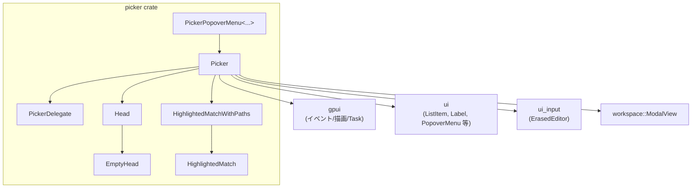
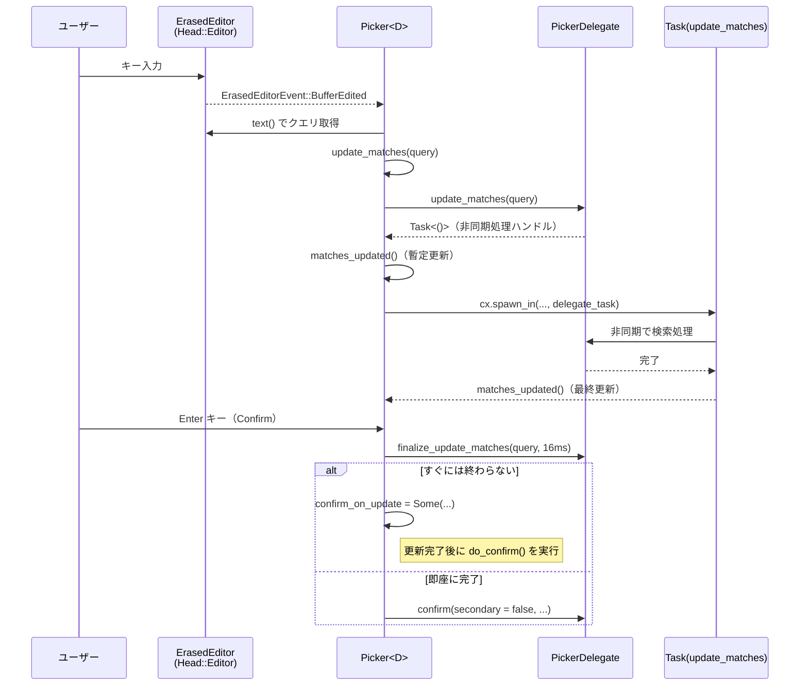

# picker/ ディレクトリ解説

## 1. ざっくり一言

`picker` クレートは、「検索ボックス＋候補リスト」型の汎用ピッカー UI を提供するモジュールです。  
データの取得や選択結果の処理は `PickerDelegate` トレイトでアプリ側に委譲し、UI 部分だけを共通化しています。

---

## 2. このモジュールの役割

### 2.1 概要

- このディレクトリは **汎用的な候補選択 UI（Picker）** を実装しています。
- 項目の一覧表示、キーボード／マウスによる選択、検索ボックスによるフィルタリング、非同期検索タスクの管理などを行います。
- 候補の横に「ドキュメントパネル（DocumentationAside）」を表示したり、ポップオーバーメニューとして表示するための補助型も含まれます。
- 候補表示用の「ハイライト付きラベル（検索一致部分の強調）」を組み立てるユーティリティも含まれます。

### 2.2 アーキテクチャ内での位置づけ

ディレクトリ内の主な型と外部クレートとの関係を簡略化した図です。



- `Picker<D>` は UI の本体で、`PickerDelegate` を通じてアプリ側のデータ／ロジックとやり取りします。
- `Head`／`EmptyHead` は「検索ボックスを持つかどうか」を抽象化します。
- `HighlightedMatch*` はラベル文字列とそのハイライト位置を保持し、`ui::HighlightedLabel` に渡す役割です。
- `PickerPopoverMenu` は `ui::PopoverMenu` のトリガーとして `Picker` を組み込むためのラッパーです。
- 外部クレート `gpui`・`ui`・`ui_input`・`workspace` などは UI フレームワークやテーマ、モーダル表示の基盤を提供しています。

### 2.3 設計上のポイント

コードから読み取れる設計上の特徴を箇条書きで整理します。

- **UI とロジックの分離**
  - `Picker<D>` は表示と入力処理を担当し、項目の生成／フィルタリング／確定処理は `PickerDelegate` トレイトに委譲します。
- **検索可・不可を共通の実装で扱う**
  - `Head` enum (`Editor` / `Empty`) により、検索ボックスがあるピッカーと、リストのみのピッカーを同じコードで扱っています。
- **可変高さ / 一様高さリストの両対応**
  - `ElementContainer` (`ListState` / `UniformListScrollHandle`) で、`gpui::list` と `gpui::uniform_list` を切り替えます。
- **非同期検索のサポート**
  - デリゲートの `update_matches` は `Task<()>` を返し、`Picker` 側は `PendingUpdateMatches` で Task のライフサイクルを安全に管理します。
  - `finalize_update_matches` により、短時間だけ同期的に結果を待って「空のリストが一瞬表示される」ようなちらつきを抑える設計になっています。
- **柔軟なナビゲーション／確定フロー**
  - `menu::SelectNext` などのアクションでキーボードナビゲーションを行い、クリック・ホバーでも選択位置を更新します。
  - `confirm` / `secondary_confirm` / `ConfirmInput` / `ConfirmCompletion` といった複数の確定パスを持ち、用途に応じた挙動をデリゲート側で実装できます。
- **ドキュメント・サイドパネルの統合**
  - `DocumentationAside` と項目の境界（`canvas` による `Bounds` 記録）を用いて、選択／ホバー中の項目の横に文書パネルを位置決めします。
- **Popover との統合**
  - `PickerPopoverMenu` が `PopoverMenu` と `Picker` をつなぎ、`DismissEvent` の伝播も自動で行います。

---

## 3. 主要な機能一覧

このディレクトリが提供する主な機能を一行ずつまとめます。

- **汎用ピッカー UI (`Picker<D>`)**
  - デリゲートで定義された候補一覧を、検索ボックス付き／なしのリストとして表示します。
- **可変高さ／一様高さリストの切り替え**
  - `Picker::list`（可変高さ）と `Picker::uniform_list`（全行同じ高さ）で使い分けます。
- **キーボード／マウスによる選択操作**
  - 上下移動・先頭／末尾選択・キャンセル・確定・ホバーでの選択移動などをサポートします。
- **非同期マッチ更新**
  - 入力文字列に応じてデリゲートの `update_matches` を呼び出し、バックグラウンドで候補を更新します。
- **検索入力のカスタム処理**
  - `ConfirmInput` と `confirm_input` により、「選択された項目」ではなく「エディタに入力された文字列そのもの」に対する処理も実装できます。
- **ハイライト付きラベル (`HighlightedMatch*`)**
  - 文字列中の一部をインデックス指定でハイライトしたり、パス情報付きで表示するためのヘルパーを提供します。
- **ドキュメント・サイドパネル**
  - `PickerDelegate::documentation_aside`／`documentation_aside_index` により、選択中／ホバー中の項目に対応するドキュメントを横に表示できます。
- **ポップオーバーメニューへの組み込み**
  - `PickerPopoverMenu` により、ボタン等をトリガーにしたポップオーバー内に `Picker` を表示できます。

---

## 4. 関数・構造体の解説

### 4.1 型一覧（構造体・列挙体など）

主な型を表形式で整理します。

| 名前 | 種別 | 役割 / 用途 |
|------|------|-------------|
| `Picker<D>` | 構造体 | 汎用ピッカー UI 本体。候補リストの表示と操作をまとめるコンポーネントです。 |
| `PickerDelegate` | トレイト | ピッカーに表示するデータと挙動をアプリ側で実装するためのインターフェースです。 |
| `Head` | enum | ピッカー上部（検索エディタ or 何もない）の種別を表します。`Editor` / `Empty`。 |
| `EmptyHead` | 構造体 | 実際には見えないがフォーカスだけを保持する要素です（非検索ピッカー用）。 |
| `ElementContainer` | enum | リスト表示方法を表します。`List(ListState)`（可変高さ）と `UniformList(UniformListScrollHandle)`（一定高さ）。 |
| `ContainerKind` | enum（非公開） | 上記 `ElementContainer` を構築するための内部用フラグです。 |
| `Direction` | enum | 選択移動の方向。`Up` / `Down`。履歴選択やフォールバックに利用します。 |
| `PickerEditorPosition` | enum | 検索エディタをリストの「上」か「下」のどちらに表示するかを表します。 |
| `PendingUpdateMatches` | 構造体 | デリゲートの `update_matches` から返された Task と、それをラップする Picker 側の Task をまとめて管理します。 |
| `ConfirmInput` | 構造体 + Action | 「選択確定」ではなく「入力文字列そのものを確定」するためのアクション引数です。`secondary` でセカンダリ動作を区別します。 |
| `HighlightedMatch` | 構造体 | 1 行のラベル文字列と、その中でハイライトすべきバイト位置、色を保持します。 |
| `HighlightedMatchWithPaths` | 構造体 | メインの一致ラベルに加え、複数の「パス」行（小さいフォントのサブ情報）をまとめて表示するための型です。 |
| `PickerPopoverMenu<T, TT, P>` | 構造体 | `PopoverMenu` と `Picker<P>` を結びつけるラッパー。トリガー UI とツールチップ生成関数、ピッカーの `Entity` を保持します。 |

#### PickerDelegate の主なメソッド役割

`PickerDelegate` はメソッド数が比較的多いので、目的だけ簡単に整理します。

- 必須と思われるメソッド（このチャンクから推測）
  - `match_count` / `selected_index` / `set_selected_index` / `placeholder_text`
  - `update_matches` / `confirm` / `dismissed` / `render_match`
- オプションのカスタマイズポイント
  - 項目の選択可否: `can_select`
  - 選択変更時の副作用: `selected_index_changed`
  - 検索履歴ナビゲーション: `select_history`
  - 確定時にクエリを書き換える: `confirm_update_query`
  - 入力文字列そのものの確定: `confirm_input`
  - 補完的確定: `confirm_completion`
  - `No matches` メッセージ: `no_matches_text`
  - エディタ位置: `editor_position`
  - ヘッダ／フッタ要素: `render_header` / `render_footer`
  - ドキュメントパネル: `documentation_aside` / `documentation_aside_index`
  - 更新完了を少しだけ同期的に待つ: `finalize_update_matches`
  - キャンセルしてよいか: `should_dismiss`

### 4.2 代表的な関数・メソッド詳細

以下では、特に重要な関数・メソッドを選んで詳しく説明します。

---

#### `Head::editor`

```rust
impl Head {
    pub fn editor<V: 'static>(
        placeholder_text: Arc<str>,
        mut edit_handler: impl FnMut(
            &mut V,
            &ErasedEditorEvent,
            &mut Window,
            &mut Context<V>,
        ) + 'static,
        window: &mut Window,
        cx: &mut Context<V>,
    ) -> Self
```

**概要**

- 非型付きのテキストエディタ `ErasedEditor` を生成し、ピッカーの「ヘッド」として保持する `Head::Editor` 変種を作ります。
- エディタからのイベント（テキスト変更・フォーカス喪失など）を、呼び出し元が渡した `edit_handler` クロージャに転送します。

**引数**

| 引数名 | 型 | 説明 |
|--------|----|------|
| `placeholder_text` | `Arc<str>` | エディタに表示するプレースホルダ文字列です。 |
| `edit_handler` | クロージャ | `ErasedEditorEvent` を受け取り、呼び出し元のビュー状態 `V` を更新するハンドラです。 |
| `window` | `&mut Window` | `gpui` のウィンドウコンテキストです。 |
| `cx` | `&mut Context<V>` | 現在のビュー `V` 用のコンテキストです。 |

**戻り値**

- `Head::Editor(Arc<dyn ErasedEditor>)` を返します。  
  `Head` は後で `Picker` がフォーカスやクエリ取得に利用します。

**内部処理の流れ**

1. `ui_input::ERASED_EDITOR_FACTORY` からエディタ生成関数を取得し、`editor` を作成します。
2. `set_placeholder_text` でプレースホルダ文字列を設定します。
3. `cx.weak_entity()` で現在のビュー `V` への弱い参照を取得します。
4. `editor.subscribe(...)` でエディタイベントの購読を設定し、イベント発生時に
   - `this.update(cx, |this, cx| edit_handler(this, &event, window, cx))`
   を呼んで `edit_handler` に処理を委譲します。
5. `Self::Editor(editor)` を返します。

**Errors / Panics**

- `ui_input::ERASED_EDITOR_FACTORY.get().unwrap()` を呼んでいるため、ファクトリが未初期化の状態で呼ぶと `panic!` します。
  - このファクトリはアプリ側の初期化コードで設定されている必要があります（詳細はこのチャンクからは分かりません）。

**Edge cases**

- `edit_handler` 内で `panic!` した場合、そのエラーは通常の Rust のパニックとして伝播します。
- `placeholder_text` が空であっても特に問題はなく、そのまま設定されます。

**使用上の注意点**

- `edit_handler` は **すべてのエディタイベント**（少なくとも `BufferEdited` / `Blurred`）を受け取るため、イベント種別で分岐する必要があります。
- `Head` のライフタイム中に `edit_handler` が捕捉しているキャプチャが有効であることを保証する必要があります（`'static` 制約あり）。

---

#### `HighlightedMatch::join(components: impl Iterator<Item = Self>, separator: &str) -> Self`

**概要**

- 複数の `HighlightedMatch` を 1 つのラベルに結合し、ハイライト位置も連結後の文字列に合わせてオフセット調整します。
- セパレータ文字列を各要素の間に挿入します。

**引数**

| 引数名 | 型 | 説明 |
|--------|----|------|
| `components` | `impl Iterator<Item = HighlightedMatch>` | 結合したいハイライト付きラベルの反復子です。 |
| `separator` | `&str` | 各要素の間に挿入する区切り文字列です。 |

**戻り値**

- すべての `text` を連結し、`highlight_positions` を連結後の **バイトオフセット** に変換した `HighlightedMatch` を返します。
- 戻り値の `color` は `Color::Default` に固定されます（必要なら `.color(...)` で上書き）。

**内部処理の流れ**

1. `first` フラグと `byte_offset`（現在のバイト位置）を初期化します。
2. `components` を順に取り出しながら:
   - 先頭以外なら `separator` を `text` に追加し、そのバイト長だけ `byte_offset` を増やします。
   - 各 `component.highlight_positions` に `byte_offset` を足して新しい位置に変換し、結果の `highlight_positions` ベクタに追加します。
   - `component.text` を `text` に追記し、そのバイト長を `byte_offset` に加えます。
3. 結合後の `text` と `highlight_positions`、`Color::Default` を持つ `HighlightedMatch` を生成します。

**Examples（使用例）**

```rust
// "foo" と "bar" を " / " 区切りで結合する例
let left = HighlightedMatch {
    text: "foo".to_string(),                // 左側の文字列
    highlight_positions: vec![0, 1],        // 'f', 'o' をハイライト
    color: Color::Default,
};
let right = HighlightedMatch {
    text: "bar".to_string(),                // 右側の文字列
    highlight_positions: vec![0],           // 'b' をハイライト
    color: Color::Default,
};
let joined = HighlightedMatch::join([left, right].into_iter(), " / ");

// joined.text は "foo / bar"
// joined.highlight_positions は [0, 1, 6] など、バイトオフセットで並ぶ
```

**Errors / Panics**

- 内部で `panic!` しうる操作はなく、通常の `String` 操作のみです。

**Edge cases**

- `components` が空の場合
  - `text` は空文字列、`highlight_positions` は空ベクタになります。
- Unicode 文字（マルチバイト）を含む場合
  - `highlight_positions` はバイトオフセットとして加算されるため、元の位置が `is_char_boundary` を満たしていれば、結合後も境界を保ちます。
  - テスト `join_offsets_positions_by_bytes_not_chars` で、UTF-8 マルチバイト文字列中のハイライト位置が文字境界であることを確認しています。

**使用上の注意点**

- `highlight_positions` は **バイト単位のオフセット** として扱われます。文字数（`char` 単位）ではない点に注意が必要です。
- 元の `HighlightedMatch` 内で不正な位置（文字境界でない位置）が指定されていた場合、`join` はそれを修正しません。

---

#### `Picker::uniform_list(delegate: D, window: &mut Window, cx: &mut Context<Self>) -> Self`

```rust
impl<D: PickerDelegate> Picker<D> {
    pub fn uniform_list(
        delegate: D,
        window: &mut Window,
        cx: &mut Context<Self>,
    ) -> Self
```

**概要**

- 各行の高さが一定である前提のピッカーを作成します。
- 内部では `gpui::uniform_list` を用いるため、多数の項目を効率良く扱えます。

**引数**

| 引数名 | 型 | 説明 |
|--------|----|------|
| `delegate` | `D: PickerDelegate` | ピッカーに表示するデータと挙動を定義するデリゲートです。 |
| `window` | `&mut Window` | 現在のウィンドウコンテキストです。 |
| `cx` | `&mut Context<Picker<Self>>` | `Picker` 自身のビューコンテキストです。 |

**戻り値**

- 初期化済みの `Picker<D>` インスタンスを返します。  
  デフォルトで検索エディタを持ち、空クエリ `""` のマッチ更新が 1 回走ります。

**内部処理の流れ**

1. `Head::editor` を使って検索エディタ付きのヘッドを生成します。
   - `delegate.placeholder_text(window, cx)` からプレースホルダ文字列を取得します。
   - エディタイベントハンドラとして `Self::on_input_editor_event` を渡します。
2. `Self::new(delegate, ContainerKind::UniformList, head, window, cx)` を呼び出します。
   - `ElementContainer::UniformList(UniformListScrollHandle::new())` を作成。
   - `max_height` を `24rem` に設定。
   - `pending_update_matches` などを初期化。
   - 空クエリ `""` で `update_matches` を実行。
   - `finalize_update_matches` を約 4ms だけ試みて、最初の結果を同期的に取得しようとします。

**Examples（使用例）**

```rust
// テストコードに近い形の使用例
use gpui::TestAppContext;
use picker::{Picker, PickerDelegate};
use ui::{ListItem, Label};

// シンプルなデリゲート例（true = selectable）
struct BoolDelegate {
    items: Vec<bool>,                  // 各要素が選択可能かどうか
    selected: usize,                   // 現在の選択インデックス
}

impl PickerDelegate for BoolDelegate {
    type ListItem = ui::ListItem;

    fn match_count(&self) -> usize { self.items.len() }
    fn selected_index(&self) -> usize { self.selected }
    fn set_selected_index(
        &mut self,
        ix: usize,
        _window: &mut Window,
        _cx: &mut Context<Picker<Self>>,
    ) { self.selected = ix; }

    fn can_select(
        &self,
        ix: usize,
        _window: &mut Window,
        _cx: &mut Context<Picker<Self>>,
    ) -> bool { self.items.get(ix).copied().unwrap_or(false) }

    fn placeholder_text(&self, _window: &mut Window, _cx: &mut App) -> Arc<str> {
        "Search items".into()
    }

    fn update_matches(
        &mut self,
        _query: String,
        _window: &mut Window,
        _cx: &mut Context<Picker<Self>>,
    ) -> gpui::Task<()> {
        gpui::Task::ready(())            // 即座に完了する Task
    }

    fn confirm(
        &mut self,
        _secondary: bool,
        _window: &mut Window,
        _cx: &mut Context<Picker<Self>>,
    ) { /* 確定処理 */ }

    fn dismissed(&mut self, _window: &mut Window, _cx: &mut Context<Picker<Self>>) {}
    
    fn render_match(
        &self,
        ix: usize,
        selected: bool,
        _window: &mut Window,
        _cx: &mut Context<Picker<Self>>,
    ) -> Option<Self::ListItem> {
        Some(
            ListItem::new(ix)
                .inset(true)
                .toggle_state(selected)
                .child(Label::new(format!("Item {ix}"))),
        )
    }
}

// 実際のウィンドウでの生成（テストコードと同様のパターン）
#[gpui::test]
async fn show_picker(cx: &mut TestAppContext) {
    let (_picker_entity, _cx) = cx.add_window_view(|window, cx| {
        Picker::uniform_list(
            BoolDelegate { items: vec![true, false, true], selected: 0 },
            window,
            cx,
        )
    });
}
```

**Edge cases**

- `update_matches` を空クエリで呼ぶため、デリゲート側は空文字列に対しても安全に動作する必要があります。
- `match_count()` が 0 の場合でも正常に動作しますが、その場合はリスト部分は表示されず、`no_matches_text` の結果に応じて空状態メッセージが描画されます。

**使用上の注意点**

- 高さが異なる項目を返すデリゲートでは `uniform_list` は使わず、`Picker::list` を使用する必要があります。
- `update_matches` が重い処理の場合、`Task` 内で実行し、UI スレッドをブロックしないようにする必要があります。

---

#### `Picker::set_selected_index(&mut self, ix: usize, fallback_direction: Option<Direction>, scroll_to_index: bool, window: &mut Window, cx: &mut Context<Self>)`

**概要**

- 指定されたインデックスを選択し、その変更をデリゲートに反映します。
- 選択不可能な項目が指定された場合、`fallback_direction` に応じて次の選択可能な項目を探します。
- 選択変更時には必要に応じてスクロール位置を更新し、副作用（`selected_index_changed`）も実行します。

**引数**

| 引数名 | 型 | 説明 |
|--------|----|------|
| `ix` | `usize` | 選択したいインデックスです。 |
| `fallback_direction` | `Option<Direction>` | 選択不可だった場合に探索する方向。`None` なら即時中断。 |
| `scroll_to_index` | `bool` | 選択後にその項目が見えるようスクロールするかどうかです。 |
| `window` | `&mut Window` | ウィンドウコンテキスト。 |
| `cx` | `&mut Context<Self>` | `Picker` のビューコンテキスト。 |

**戻り値**

- 戻り値は `()` で、値は返しません。  
  デリゲートの `selected_index` が更新され、UI が必要に応じて再描画されます。

**内部処理の流れ**

1. `match_count = delegate.match_count()` を取得し、0 なら何もせず終了します。
2. `fallback_direction` が `Some(bias)` の場合:
   - `curr_ix` を `ix` で初期化し、
   - `delegate.can_select(curr_ix, ...)` が `true` になるまで `bias` の方向にインデックスを進めます（末尾では先頭に、先頭では末尾にラップ）。
   - 一周して `ix == curr_ix` に戻った場合、**すべての項目が選択不可** と判断し、終了します。
3. `fallback_direction` が `None` の場合:
   - `delegate.can_select(ix, ...)` が `false` なら何もせず終了します。
4. `previous_index = delegate.selected_index()` を保存し、`delegate.set_selected_index(ix, ...)` を呼びます。
5. `current_index = delegate.selected_index()` を再取得し、違っていれば:
   - `delegate.selected_index_changed(ix, ...)` が `Some(action)` なら、`action(window, cx)` を実行します。
   - `scroll_to_index` が `true` なら `self.scroll_to_item_index(ix)` を呼び、該当項目が表示範囲に入るようスクロールします。

**Edge cases**

- すべての項目に対して `can_select` が `false` を返す場合:
  - `fallback_direction` が `Some` でも一周して元のインデックスに戻り、選択は変わりません。
- インデックス `ix` が範囲外（`ix >= match_count`）の場合:
  - コード内では明示的なチェックはありませんが、`can_select` の実装次第では `false` が返る設計（テストの例では `get(ix).copied().unwrap_or(false)`）になっているため、実質何も起きないケースが想定されます。

**使用上の注意点**

- `set_selected_index` は **デリゲートの状態を変更する責任** を持ちます。デリゲート側の `set_selected_index` 実装は、`selected_index` を整合性の取れた状態に保つ必要があります。
- ピッカー内部でも多用されるため、`can_select` や `match_count` との整合性が崩れていると、ナビゲーション全体が不安定になります。

---

#### `Picker::update_matches(&mut self, query: String, window: &mut Window, cx: &mut Context<Self>)`

**概要**

- 現在のクエリ文字列に対して、デリゲートにマッチ更新を依頼します。
- 即座に `matches_updated` を 1 回呼び出したあと、デリゲートから返された `Task` が完了したタイミングでもう一度 `matches_updated` を呼び出します。
- これにより、楽観的な（またはキャッシュされた）結果と、バックグラウンドで計算された結果の両方に対応できます。

**引数**

| 引数名 | 型 | 説明 |
|--------|----|------|
| `query` | `String` | 現在の検索クエリ文字列です。 |
| `window` | `&mut Window` | ウィンドウコンテキスト。 |
| `cx` | `&mut Context<Self>` | `Picker` のビューコンテキスト。 |

**戻り値**

- 直接の戻り値はありません。内部状態（`pending_update_matches` 等）が更新されます。

**内部処理の流れ**

1. `delegate.update_matches(query, window, cx)` を呼び出し、`Task<()>`（`delegate_pending_update_matches`）を受け取ります。
2. `self.matches_updated(window, cx)` を呼び、現時点の `delegate.match_count()` を元にリスト状態を更新します。
3. `PendingUpdateMatches` を構築し、`self.pending_update_matches` に保存します。
4. `cx.spawn_in(window, async move |this, cx| { ... })` で、`delegate_pending_update_matches` を待機する Task を起動します。
   - この Task 内では:
     1. `this.update(...)` で `delegate_update_matches` を取り出します。
     2. `delegate_update_matches.await` でデリゲート側の Task 完了を待ちます。
     3. `this.update_in(...)` で `this.matches_updated(window, cx)` を再度呼びます。

**`matches_updated` の主な処理**

- `ElementContainer::List` の場合は `state.reset(self.delegate.match_count())` でリストの長さを更新します。
- 現在の `selected_index` までスクロールします。
- `pending_update_matches` を `None` にクリアします。
- `confirm_on_update` が `Some(secondary)` なら、`do_confirm(secondary, ...)` を実行します（更新完了時に確定処理を遅延実行）。
- `cx.notify()` で再描画を促します。

**Edge cases**

- `delegate.update_matches` が非常に長い時間を要する／完了しない場合:
  - Task 完了前に再度 `update_matches` を呼ぶと、`PendingUpdateMatches` の Task を上書きします。
  - コメントにある通り、「Task をラップしておく」ことで同期ドロップ時の挙動を制御していますが、外部 Task が完了しない場合の挙動は、このチャンクからは詳細不明です。
- `confirm` / `secondary_confirm` が `pending_update_matches` 中に呼ばれた場合:
  - `finalize_update_matches` が短時間で `true` を返さなければ、`confirm_on_update` にフラグが立ち、更新完了時に確定処理が実行されます。

**使用上の注意点**

- `update_matches` 内でデリゲート側は `match_count` や `selected_index` の整合性を保つ必要があります。
- Task 内で `panic!` した場合のエラーハンドリングは、`anyhow::Result` を返す親側 Task に依存しますが、詳細な扱いはこのチャンクからは分かりません。

---

#### `Picker::render_element(&self, window: &mut Window, cx: &mut Context<Self>, ix: usize) -> impl IntoElement`

**概要**

- 指定インデックス `ix` の 1 行分の UI 要素を生成します。
- クリック・右クリック・ホバー・境界取得（bounds 記録）などの振る舞いを紐づけます。
- 実際の内容はデリゲートの `render_match` に委譲されます。

**引数**

| 引数名 | 型 | 説明 |
|--------|----|------|
| `window` | `&mut Window` | ウィンドウコンテキスト。 |
| `cx` | `&mut Context<Self>` | `Picker` のビューコンテキスト。 |
| `ix` | `usize` | 表示したい項目のインデックスです。 |

**戻り値**

- `gpui` の `IntoElement` を実装した UI 要素を返します（div によるラッパー）。

**内部処理の流れ**

1. `selectable = self.delegate.can_select(ix, window, cx)` で、この項目が選択可能かどうかを判断します。
2. `div().id(("item", ix))` で要素 ID を付与します。
3. `selectable` が `true` の場合、`cursor_pointer()` によりマウスポインタを「クリック可能」に変更します。
4. 子要素として `canvas(...)` を追加し、描画時の `bounds` を `item_bounds` に保存します。
   - これは後でドキュメントパネルの位置決めに使われます。
5. `on_click` ハンドラを登録し、クリック時に `handle_click(ix, secondary, ...)` を呼びます。
6. `on_mouse_up(MouseButton::Right, ...)` で右クリックにも同様の `handle_click` を紐づけます（macOS の ctrl+クリック対策）。
7. `on_hover` ハンドラを登録し、ホバー中であれば `set_selected_index(ix, None, false, ...)` で選択だけ更新します。
8. デリゲート `render_match(ix, selected, ...)` から得た要素を `.children(...)` で内側に配置します。
9. `separators_after_indices()` に `ix` が含まれていれば、ボーダー表示（区切り線）を追加します。

**Edge cases**

- `render_match` が `None` を返した場合、`children(None)` がどのように扱われるかは `gpui` の仕様に依存します（このチャンクだけでは詳細不明です）。
- `can_select` が `false` の場合でも、要素自体は表示されます（ただしカーソルは通常のままになり、クリックしても `handle_click` が即 return します）。

**使用上の注意点**

- `separators_after_indices` で返すインデックスは `match_count` の範囲内である必要があります。
- `render_match` の `selected` フラグを UI に反映することで、選択状態を視覚的に分かりやすくすることができます（テストでは `ListItem::toggle_state(selected)` を使っています）。

---

#### `impl<D: PickerDelegate> Render for Picker<D>`

```rust
impl<D: PickerDelegate> Render for Picker<D> {
    fn render(&mut self, window: &mut Window, cx: &mut Context<Self>) -> impl IntoElement {
        // ...
    }
}
```

**概要**

- `Picker` 全体の UI を構築するメインのレンダリング関数です。
- エディタ・候補リスト・ヘッダ／フッタ・空状態メッセージ・ドキュメントサイドパネルなどを一括で組み立てます。

**主な処理の構造**

1. **環境情報の取得**
   - UI フォントサイズ、ウィンドウサイズ、`rem` サイズから「横幅が広いウィンドウかどうか」 (`is_wide_window`) を判定します。
   - デリゲートから `documentation_aside` を取得します。

2. **メインメニュー（`menu`）の構築**
   - `v_flex()` による縦方向レイアウト。
   - `key_context("Picker")` でキーバインドコンテキストを設定。
   - 幅制限（`self.width`）や `elevation_3`（モーダル表示時）を適用。
   - `canvas` によりピッカー全体の `Bounds` を `picker_bounds` に保存。
   - `on_action` で各種アクション（`SelectNext` / `SelectPrevious` / `Cancel` / `Confirm` など）に対応。
   - `Head` に応じてエディタや `EmptyHead` を上部／下部に配置（`editor_position` に依存）。

3. **候補リスト部分**
   - `delegate.match_count() > 0` の場合:
     - `v_flex().id("element-container")` を使い、ヘッダ・リスト本体・スクロールバー（オプション）を構成。
     - `render_element_container` によって `ElementContainer`（`list` or `uniform_list`）を描画。
   - `match_count == 0` の場合:
     - `no_matches_text` が `Some` であれば、そのテキストをグレイアウトした `ListItem` として表示。

4. **フッタ要素の追加**
   - `delegate.render_footer(window, cx)` の結果を `.children(...)` で追加。

5. **ドキュメントサイドパネルとの統合**
   - `documentation_aside` が `None` なら `menu` をそのまま返して終了。
   - `Some(aside)` の場合:
     - `render_aside` クロージャで Aside 用のコンテナを作成（幅制限・elevation など）。
     - 横幅が広い (`is_wide_window`) 場合:
       - `documentation_aside_index` と `picker_bounds` / `item_bounds` から対象項目の相対位置を算出。
       - 項目の横に `aside` を絶対位置で表示。
     - 狭い場合:
       - ピッカーの上部（または下部）に Aside を縦に積むレイアウトに切り替え。

**使用上の注意点**

- デリゲートが `documentation_aside` を返す場合、`documentation_aside_index` も適切に設定しないと Aside が表示されないことがあります。
- `match_count` や `selected_index` と `item_bounds` の整合性が崩れると、Aside の位置が期待通りにならない可能性があります。

---

### 4.3 PickerPopoverMenu::new（簡略）

```rust
impl<T, TT, P> PickerPopoverMenu<T, TT, P>
where
    T: PopoverTrigger + ButtonCommon,
    TT: Fn(&mut Window, &mut App) -> AnyView + 'static,
    P: PickerDelegate,
{
    pub fn new(
        picker: Entity<Picker<P>>,
        trigger: T,
        tooltip: TT,
        anchor: Corner,
        cx: &mut App,
    ) -> Self { /* ... */ }
}
```

- `picker` で与えられた `Entity<Picker<P>>` をポップオーバーメニューの中身として使うための初期化関数です。
- コンストラクタ内で `cx.subscribe(&picker, |picker, &DismissEvent, cx| { ... })` を呼び、
  - ピッカーが `DismissEvent` を emit したときに、同じく `DismissEvent` をポップオーバー側にも伝播させています。
- `offset` や `anchor` によってポップオーバーの表示位置を制御できます。
- `with_handle` によって、外部から `PopoverMenuHandle` を使って開閉制御も可能です。

---

## 5. データフロー

ここでは、典型的な「ユーザが文字を入力し、候補が更新され、確定する」までの流れを説明します。

1. ユーザがキーボードで文字を入力すると、`ErasedEditor` が `ErasedEditorEvent::BufferEdited` を発行します。
2. `Head::editor` で登録された購読により、このイベントが `Picker::on_input_editor_event` に渡されます。
3. `on_input_editor_event` は現在のクエリ文字列を `editor.text(cx)` から取得し、`update_matches(query, window, cx)` を呼びます。
4. `update_matches` はデリゲートの `update_matches` に処理を委譲し、返ってきた `Task` を `PendingUpdateMatches` として保持しつつ、即座に `matches_updated` を呼びます。
5. デリゲート側の Task が完了すると、`matches_updated` がもう一度呼ばれ、最終的な候補一覧とスクロール位置を反映します。
6. ユーザが Enter キー（`menu::Confirm`）を押すと、`Picker::confirm` が呼ばれ、`finalize_update_matches` を短時間試し、それでも未完了なら `confirm_on_update` フラグを立てます。
7. 更新 Task 完了後の `matches_updated` で `confirm_on_update` が `Some(...)` なら、`do_confirm` を呼んで実際の確定処理（デリゲートの `confirm` など）を行います。

この流れを Mermaid のシーケンス図で表すと次のようになります。



---

## 6. 使い方（How to Use）

### 6.1 基本的な使用方法

最も単純なケースとして、「文字列のリストから 1 つを選ぶ」ピッカーを `Picker::list` で作る例を示します。

```rust
use std::sync::Arc;
use picker::{Picker, PickerDelegate};
use gpui::{App, Window, Context, Task};
use ui::{ListItem, Label};

// 文字列リスト用のデリゲート
struct StringListDelegate {
    items: Vec<String>,                        // 全候補
    indices: Vec<usize>,                       // 現在のフィルタ後インデックス
    selected: usize,                           // indices 内での選択位置
}

impl StringListDelegate {
    fn new(items: Vec<String>) -> Self {
        let indices = (0..items.len()).collect();
        Self { items, indices, selected: 0 }
    }
}

impl PickerDelegate for StringListDelegate {
    type ListItem = ui::ListItem;

    fn match_count(&self) -> usize {
        self.indices.len()                     // フィルタ後の件数
    }

    fn selected_index(&self) -> usize {
        self.selected                          // 現在選択されている indices の位置
    }

    fn set_selected_index(
        &mut self,
        ix: usize,
        _window: &mut Window,
        _cx: &mut Context<Picker<Self>>,
    ) {
        self.selected = ix;                    // 選択位置を更新
    }

    fn placeholder_text(&self, _window: &mut Window, _cx: &mut App) -> Arc<str> {
        "Type to filter".into()               // 検索ボックスのプレースホルダ
    }

    fn update_matches(
        &mut self,
        query: String,
        _window: &mut Window,
        _cx: &mut Context<Picker<Self>>,
    ) -> Task<()> {
        let q = query.to_lowercase();         // 小文字で簡易フィルタ
        self.indices = self
            .items
            .iter()
            .enumerate()
            .filter(|(_, s)| s.to_lowercase().contains(&q))
            .map(|(i, _)| i)
            .collect();
        self.selected = 0.min(self.indices.len().saturating_sub(1));
        Task::ready(())                        // 即完了 Task
    }

    fn confirm(
        &mut self,
        _secondary: bool,
        _window: &mut Window,
        _cx: &mut Context<Picker<Self>>,
    ) {
        if let Some(&item_ix) = self.indices.get(self.selected) {
            let value = &self.items[item_ix];
            // 実際にはここで値をどこかに渡すなどの処理を行う
            eprintln!("confirmed: {}", value);
        }
    }

    fn dismissed(&mut self, _window: &mut Window, _cx: &mut Context<Picker<Self>>) {
        // キャンセル時の後片付けなど
    }

    fn render_match(
        &self,
        ix: usize,                              // indices 内でのインデックス
        selected: bool,
        _window: &mut Window,
        _cx: &mut Context<Picker<Self>>,
    ) -> Option<Self::ListItem> {
        let item_ix = self.indices[ix];        // 元の items インデックス
        Some(
            ListItem::new(item_ix)
                .inset(true)
                .toggle_state(selected)        // 選択状態を表示に反映
                .child(Label::new(&self.items[item_ix])),
        )
    }
}

// テストコンテキストと同様の方法で Picker をウィンドウに追加する例
#[gpui::test]
async fn show_string_picker(cx: &mut gpui::TestAppContext) {
    let (_picker, _cx) = cx.add_window_view(|window, cx| {
        let delegate = StringListDelegate::new(vec![
            "apple".into(),
            "banana".into(),
            "orange".into(),
        ]);
        Picker::list(delegate, window, cx)     // 可変高さリストとして表示
    });
}
```

この例では、`update_matches` が簡単なテキストフィルタを行い、`confirm` で選択された値を `stderr` に出力しています。

### 6.2 よくある使用パターン

#### パターン1: 全行同じ高さの大量リストに `uniform_list` を使う

```rust
// 各行が同じ高さで描画される前提なら、より効率良い uniform_list を選択
let picker = Picker::uniform_list(delegate, window, cx)
    .max_height(Some(rems(20.).into()))  // 必要なら最大高さを調整
    .show_scrollbar(true);               // 常にスクロールバーを表示したい場合
```

- 表示する行がすべて同じ高さになるようデリゲート側の `render_match` を実装する前提です。
- `widest_item(Some(ix))` を指定すると、特定の行の幅を基準に全体の幅を決定できます。

#### パターン2: 検索ボックスのないシンプルな選択メニュー

```rust
// 項目数が少なく、検索せずに選ぶだけなら nonsearchable_* 系を利用
let picker = Picker::nonsearchable_uniform_list(delegate, window, cx)
    .modal(false);                       // 既存モーダル内に埋め込む場合は false に
```

- この場合、`Head` は `Head::Empty` となり、検索エディタは表示されません。
- `query()` は常に空文字列を返します。

#### パターン3: ボタンからポップオーバーメニューとして開く

```rust
use picker::popover_menu::PickerPopoverMenu;
use ui::{Button, PopoverTrigger};
use gpui::{Corner, App};

// どこかの UI レイアウト内で:
let (picker_entity, _cx2) = cx.add_window_view(|window, cx| {
    Picker::uniform_list(delegate, window, cx)     // ポップオーバー内に表示する Picker
});

// トリガーボタン
let trigger_button = Button::new("open-picker");   // PopoverTrigger + ButtonCommon を実装している前提

// ツールチップ用ビュー生成関数
let tooltip = |_window: &mut Window, _cx: &mut App| {
    ui::Label::new("Open picker").into_any_view()
};

// PickerPopoverMenu の生成
let popover = PickerPopoverMenu::new(
        picker_entity,                           // 中身の Picker
        trigger_button,                          // トリガーボタン
        tooltip,                                 // ツールチップ
        Corner::BottomLeft,                      // アンカー位置
        cx,
    );
```

- `PickerPopoverMenu` は内部で `DismissEvent` を購読しているため、Picker 側でキャンセル（`cancel`）したときにポップオーバーも閉じるようになります。

### 6.3 使用上の注意点（まとめ）

- **デリゲートの整合性**
  - `match_count` / `selected_index` / `set_selected_index` / `render_match` で扱うインデックスは常に整合している必要があります。
  - `separators_after_indices` の戻り値は `0..match_count` の範囲に収まるようにします。

- **非同期更新 (`update_matches`)**
  - 長時間かかる処理は `Task` 内で行い、UI スレッドをブロックしないようにします。
  - `update_matches` はクエリが頻繁に変化しても安全に呼び出せるように実装する必要があります。
  - 結果反映後に確定させたい場合は、`finalize_update_matches` や `confirm_on_update` の挙動を理解しておくとよいです。

- **ハイライト位置の扱い**
  - `HighlightedMatch::highlight_positions` は **UTF-8 のバイトオフセット** であることが前提です。
  - 文字境界でない位置を指定すると、`HighlightedLabel` の内部処理で不正とみなされる可能性があります（テストでは `is_char_boundary` を用いて検証）。

- **検索エディタの有無**
  - `Head::Editor` を使うピッカーでは `query()` がユーザ入力を返しますが、`Head::Empty` の場合は常に空文字列になります。
  - フォーカス外れ時 (`Blurred`) の挙動は `is_modal` に依存します。モーダルとして動作している場合、フォーカス喪失で自動的にキャンセルされます。

- **ドキュメントサイドパネル**
  - `documentation_aside` を返す場合は、同時に `documentation_aside_index` も適切に設定しないと、パネルが表示されないことがあります。
  - インデックスに対応する `item_bounds` がまだ計測されていない描画タイミングでは Aside が描画されない設計になっています（`when_some(item_position, ...)`）。

- **PopoverMenu との連携**
  - `PickerPopoverMenu` は `Picker` の `DismissEvent` を監視しているため、ピッカー側で `cancel` を呼ぶとポップオーバーも閉じます。  
    別途ポップオーバーを閉じる処理を二重に行う必要はありません。

---

## 7. 関連ファイル

このディレクトリと密接に関係するファイル・外部モジュールを一覧にします。

| パス / モジュール | 役割 / 関係 |
|-------------------|------------|
| `picker/src/picker.rs` | クレートのメインファイル。`Picker<D>` 本体、`PickerDelegate`、各種アクション・補助型の定義を含みます。 |
| `picker/src/head.rs` | ピッカー上部の「ヘッド」部分（検索エディタ or 空のフォーカス用エレメント）を表す `Head` と `EmptyHead` を定義します。 |
| `picker/src/highlighted_match_with_paths.rs` | `HighlightedMatch`／`HighlightedMatchWithPaths` と、そのレンダリング／テスト（ハイライトオフセットの検証）を提供します。 |
| `picker/src/popover_menu.rs` | `PickerPopoverMenu` を定義し、`PopoverMenu` と `Picker` を組み合わせる機能を提供します。 |
| `ui_input` クレート | `ErasedEditor`・`ErasedEditorEvent`・`ERASED_EDITOR_FACTORY` を提供し、検索エディタの生成とイベント処理に利用されています。 |
| `ui` クレート | `Label`・`ListItem`・`HighlightedLabel`・`PopoverMenu` 等、UI 部品とレイアウトヘルパー（`v_flex` など）を提供します。 |
| `gpui` クレート | `App`・`Window`・`Context`・`Task`・`list`／`uniform_list`・`canvas` など、UI フレームワークの中核を提供します。 |
| `menu` クレート | `SelectNext` / `SelectPrevious` / `SelectFirst` / `SelectLast` / `Cancel` / `Confirm` / `SecondaryConfirm` といったアクション型を提供し、キーボード操作に利用されています。 |
| `workspace::ModalView` | `Picker` がモーダルビューとしてワークスペースに統合されるためのトレイトです。 |
| `theme_settings` / `theme` | UI テーマとフォントサイズ、`rem` サイズ取得 (`WithRemSize`) などスタイル関連の設定を提供します。 |
| `zed_actions::editor` | エディタ用の移動アクション `MoveUp` / `MoveDown` を提供し、Picker 内でのカーソル移動にも利用されています。 |
| テスト関連 (`editor` / `settings` など) | `dev-dependencies` として、テーマやエディタの初期化・テスト環境構築に使われます。 |

このディレクトリを利用・変更する際は、特に `ui_input`・`ui`・`gpui` の API と、アプリ固有の `PickerDelegate` 実装との関係を意識すると理解しやすくなります。
