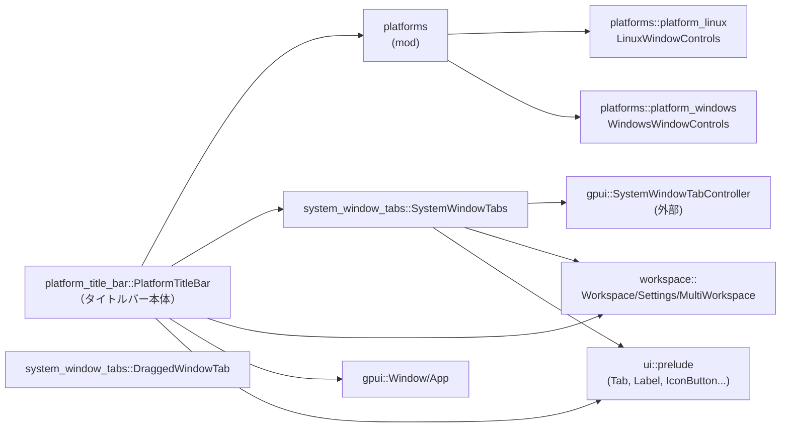
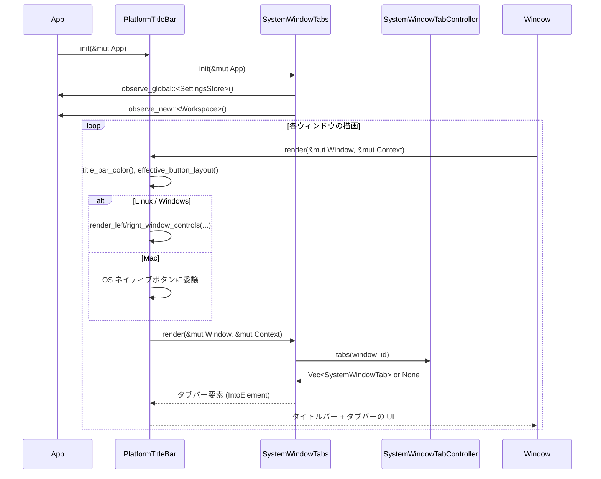

# platform_title_bar/ ディレクトリ解説

## 1. ざっくり一言

`platform_title_bar` は、エディタウィンドウの **タイトルバーとシステムウィンドウタブ** を、OSごとに適切な見た目・挙動で描画するためのモジュール群です。  
Linux / Windows 向けのカスタムウィンドウボタンと、システムレベルのウィンドウタブ（OSのタブ機能）を統合します。

---

## 2. このモジュールの役割

### 2.1 概要

- このディレクトリは、**プラットフォーム依存のタイトルバー UI** と **システムウィンドウタブ UI** を提供します。
- `PlatformTitleBar` がエントリポイントとなり、プラットフォームごとのボタン実装（Linux/Windows）と `SystemWindowTabs` を組み合わせて 1 つのタイトル領域を構築します。
- OS の「タブ付きウィンドウ」機能と連携するために、`SystemWindowTabController` と設定 (`WorkspaceSettings`) を監視し、タブの追加・並び替え・分離/結合を制御します。

### 2.2 アーキテクチャ内での位置づけ

このディレクトリ内の主要モジュール間の関係を示します。



- `PlatformTitleBar`  
  - ライブラリの公開エントリ。  
  - プラットフォームごとのボタン (`LinuxWindowControls`, `WindowsWindowControls`) と `SystemWindowTabs` を組み合わせて描画します。
- `system_window_tabs::SystemWindowTabs`  
  - OS が持つウィンドウタブ機能 (`SystemWindowTabController`) と連携し、タブバー UI・ドラッグ＆ドロップ・コンテキストメニューを実装します。
- `platforms::platform_linux` / `platforms::platform_windows`  
  - 各 OS 向けのキャプションボタン（閉じる・最小化・最大化など）を描画します。

### 2.3 設計上のポイント

- **プラットフォーム抽象 (`PlatformStyle`)**
  - コード内では `PlatformStyle::Linux / ::Windows / ::Mac` で分岐しており、OS ごとにタイトルバーの挙動・ボタン描画を切り替えています。
  - `PlatformStyle` 自体の定義はこのチャンクには含まれていませんが、少なくとも上記 3 バリアントを持つ enum であることが分かります。

- **OS ネイティブ機能との協調**
  - Windows ではクリック処理を Rust 側で直接扱わず、`WindowControlArea` を用いて OS 側の処理に任せています。
  - システムウィンドウタブの状態は `SystemWindowTabController`（gpui 側のグローバル管理）と `Window` のメソッド（`set_tabbing_identifier`, `move_tab_to_new_window` など）を通じて OS と同期されます。

- **状態管理**
  - `PlatformTitleBar` は内部状態として
    - モバイル中フラグ (`should_move`)
    - 子要素リスト (`children`)
    - システムタブ用の子エンティティ (`Entity<SystemWindowTabs>`)
    - サイドバー状態取得用の `WeakEntity<MultiWorkspace>`
    を保持します。
  - `SystemWindowTabs` は
    - スクロール位置 (`ScrollHandle`)
    - タブ幅計測結果 (`measured_tab_width`)
    - 最後にドラッグされたタブ (`last_dragged_tab`)
    を保持し、ドラッグ＆ドロップ処理に利用します。

- **設定と feature flag**
  - `WorkspaceSettings::use_system_window_tabs` を監視し、ON/OFF に応じて `SystemWindowTabController` とウィンドウ群を更新します。
  - `PlatformTitleBar::is_multi_workspace_enabled` では `AgentV2FeatureFlag` と `DisableAiSettings` を組み合わせて、マルチワークスペース（AI 関連）の有効・無効を判定しています。

---

## 3. 主要な機能一覧

このディレクトリが提供する主な機能は次のとおりです。

- プラットフォーム別タイトルバー描画:  
  `PlatformTitleBar` による OS ごとの高さ・背景色・角丸・ドラッグ領域の設定。
- ウィンドウボタン描画（Linux）:  
  `LinuxWindowControls` + `WindowControl` による最小化／最大化／閉じるボタンの描画とクリック処理。
- ウィンドウボタン描画（Windows）:  
  `WindowsWindowControls` + `WindowsCaptionButton` による、Windows 標準スタイルのキャプションボタン描画（挙動は OS に委譲）。
- 左右のウィンドウコントロール配置:  
  `render_left_window_controls`, `render_right_window_controls` による、ボタンレイアウトとウィンドウデコレーション種別に応じた左右コントロールの表示制御。
- システムウィンドウタブバーの表示:  
  `SystemWindowTabs` によるタブバー UI（タブの一覧、アクティブタブのハイライト、タブ追加ボタン）。
- タブドラッグ＆ドロップ:  
  `SystemWindowTabs` と `DraggedWindowTab` によるタブの並び替え・タブの別ウィンドウへの移動。
- タブに対するコンテキストメニューとアクション:  
  右クリックメニューから「タブを閉じる / 他を閉じる / 新しいウィンドウへ移動 / 全てのタブを表示」などを実行。
- システムタブ操作用アクションの公開:  
  `ShowNextWindowTab`, `ShowPreviousWindowTab`, `MergeAllWindows`, `MoveTabToNewWindow` アクション型の公開。

---

## 4. 関数・構造体の解説

### 4.1 主な型一覧

| 名前 | 種別 | 定義ファイル | 役割 / 用途 |
|------|------|--------------|-------------|
| `PlatformTitleBar` | 構造体 | `platform_title_bar.rs` | プラットフォーム依存のタイトルバー（ボタン＋内容＋システムタブ）を描画するメインコンポーネント。 |
| `LinuxWindowControls` | 構造体 | `platforms/platform_linux.rs` | Linux のウィンドウコントロール（左または右のボタン列）を描画するコンテナ。 |
| `WindowControlType` | enum | `platforms/platform_linux.rs` | `Minimize` / `Restore` / `Maximize` / `Close` のウィンドウボタン種別。 |
| `WindowControlStyle` | 構造体 | `platforms/platform_linux.rs` | Linux ウィンドウボタンの背景色・ホバー色・アイコン色などのスタイル設定を保持。 |
| `WindowControl` | 構造体 | `platforms/platform_linux.rs` | 個々の Linux ウィンドウボタン（最小化・最大化・閉じるなど）の描画とクリック処理を担当。 |
| `WindowsWindowControls` | 構造体 | `platforms/platform_windows.rs` | Windows のキャプションボタン列（最小化／最大化／閉じる）を描画。 |
| `WindowsCaptionButton` | enum | `platforms/platform_windows.rs` | Windows の各キャプションボタン（`Minimize` / `Restore` / `Maximize` / `Close`）を表す内部用 enum。 |
| `SystemWindowTabs` | 構造体 | `system_window_tabs.rs` | システムウィンドウタブのバー表示、タブのドラッグ＆ドロップ、コンテキストメニュー、タブの開閉/移動アクションを管理。 |
| `DraggedWindowTab` | 構造体 | `system_window_tabs.rs` | ドラッグ中のタブの情報（WindowId, 幅, タイトル, アクティブかどうか等）と、そのゴースト表示用ビュー。 |
| `ShowNextWindowTab` | アクション型 | `system_window_tabs.rs` | 次のシステムウィンドウタブに切り替えるアクション。 |
| `ShowPreviousWindowTab` | アクション型 | `system_window_tabs.rs` | 前のシステムウィンドウタブに切り替えるアクション。 |
| `MergeAllWindows` | アクション型 | `system_window_tabs.rs` | 複数のウィンドウを 1 つのタブグループに結合するアクション。 |
| `MoveTabToNewWindow` | アクション型 | `system_window_tabs.rs` | アクティブなタブを新しいウィンドウへ移動するアクション。 |

> `ShowNextWindowTab` などのアクション型は、`actions!` マクロによって定義されています。コードチャンクには具体的な struct 定義はありませんが、Action トレイトを実装したユニット型であることが推測できます（`on_action` で使用）。

---

### 4.2 重要な関数・メソッドの詳細

ここでは、ディレクトリ全体で特に重要な 7 つの関数・メソッドを取り上げます。

#### 4.2.1 `impl Render for PlatformTitleBar::render`

```rust
impl Render for PlatformTitleBar {
    fn render(&mut self, window: &mut Window, cx: &mut Context<Self>) -> impl IntoElement {
        /* ... */
    }
}
```

**概要**

- プラットフォームやウィンドウ状態に応じたタイトルバー UI を構築し、さらにその下に `SystemWindowTabs` を配置して返します。
- ウィンドウのドラッグ開始やダブルクリックでの最大化、サイドバーの状態による角丸やボタン表示の制御もここで行います。

**引数**

| 引数名 | 型 | 説明 |
|--------|----|------|
| `window` | `&mut Window` | 現在描画中のウィンドウ。アクティブ状態・全画面・デコレーション種別・ウィンドウメニュー・タブバー可視状態などを照会します。 |
| `cx` | `&mut Context<Self>` | `PlatformTitleBar` の描画コンテキスト。テーマ、グローバル設定、`SystemWindowTabs` エンティティなどにアクセスします。 |

**戻り値**

- `impl IntoElement`  
  タイトルバー（水平レイアウト）＋システムウィンドウタブバー（水平レイアウト）を含む垂直レイアウト (`v_flex()`)。

**内部処理の流れ**

1. **ウィンドウ・テーマ情報の取得**
   - `window.window_controls()` で OS がサポートするボタン（最小化・最大化など）を取得。
   - `window.window_decorations()` でサーバー／クライアントサイドデコレーションを取得。
   - `platform_title_bar_height(window)` でタイトルバーの高さを計算。
   - `title_bar_color` メソッドで背景色を決定（Linux/FreeBSD ではアクティブ／非アクティブを考慮）。

2. **ボタンレイアウト・サイドバー状態**
   - `effective_button_layout` により、Linux クライアントデコレーション時のみ有効な `WindowButtonLayout` を取得。
   - `sidebar_render_state` でサイドバーの開閉状態と側（Left/Right）を取得。これにより角丸やボタンの表示有無を決めます。

3. **タイトルバー本体 (`h_flex`) の構築**
   - `WindowControlArea::Drag` を指定し、タイトルバー全体がドラッグ開始領域になるように設定。
   - マウスイベントで `should_move` フラグを管理し、ドラッグ中に `window.start_window_move()` を 1 回だけ呼び出します。
   - プラットフォーム別のダブルクリック処理:
     - Mac: ダブルクリックすると `window.titlebar_double_click()` を呼ぶ。
     - Linux: ダブルクリックすると `window.zoom_window()`（最大化／復元）を呼ぶ。
   - 左側の余白またはコントロールを決定:
     - 全画面時: 左余白 (`pl_2`) のみ。
     - Mac かつ左サイドバーが閉じている: `TRAFFIC_LIGHT_PADDING` 分だけ余白。
     - Linux などで `render_left_window_controls(...)` が `Some` を返した場合: その要素を先頭子要素として追加。
   - クライアントサイドデコレーション時:
     - タイル状態 (`tiling.top/left/right`) とサイドバーの有無に応じて、左上・右上角の角丸 (`rounded_tl/tr`) を付与。
     - 丸い角の隙間を隠すために、上下に -1px のマージンと 1px 枠線を付け、枠線色をタイトルバー色に設定。

4. **タイトルバー内容の配置**
   - 内部に `div().id(self.id.clone())` を置き、`self.children` から取り出した子要素を右左の間で `justify_between` で配置します。

5. **右側のウィンドウコントロール**
   - 全画面でない場合のみ、右側にウィンドウコントロールを追加。
   - 右サイドバーが開いているときはボタンを隠す。
   - `render_right_window_controls(...)` の結果を子要素として追加。
   - Linux クライアントデコレーション時かつ `supported_controls.window_menu` が `true` の場合、右クリックで `window.show_window_menu(ev.position)` を呼んで標準のウィンドウメニューを開く。

6. **システムウィンドウタブバーの追加**
   - `v_flex()` の子としてタイトルバーを追加し、さらに `self.system_window_tabs.clone().into_any_element()` を下に追加して返します。

**Examples（使用例・概念図）**

`PlatformTitleBar` 自体の `render` は gpui から自動的に呼び出されるため、利用側で直接呼び出すことは通常ありません。  
利用者は `Entity<PlatformTitleBar>` をビュー階層に配置します（6章のコード例を参照）。

**Errors / Panics**

- このメソッド内に明示的な `panic!` や `expect` はありません。
- 条件分岐と UI ビルダー呼び出しのみであり、パニック条件は見当たりません。

**Edge cases（エッジケース）**

- 全画面 (`window.is_fullscreen() == true`) のとき:
  - 左右のウィンドウコントロールは表示されず、左右に固定の余白のみが付きます。
- サイドバーが開いている側のコーナー:
  - 角丸が無効化され、サイドバーとタイトルバーが自然につながるようになります。
- Linux/FreeBSD でドラッグ中 (`should_move == true`):
  - タイトルバーの色が非アクティブ背景色に切り替わります（`title_bar_color` 内の条件）。

**使用上の注意点**

- `PlatformTitleBar::init` をどこかで呼び出しておかないと、システムウィンドウタブ関連の初期化が行われません（詳細は後述）。
- `self.children` は `render` のたびに `mem::take` で取り出されるため、継続的な子要素を持たせる場合は、`ParentElement` 経由で毎回子を追加する前提となります。

---

#### 4.2.2 `render_left_window_controls`

```rust
pub fn render_left_window_controls(
    button_layout: Option<WindowButtonLayout>,
    close_action: Box<dyn Action>,
    window: &Window,
) -> Option<AnyElement> { /* ... */ }
```

**概要**

- Linux かつクライアントサイドデコレーションのときに、左側に表示するウィンドウコントロール（主に閉じるボタン）を必要に応じて生成します。
- Mac や Windows、Linux でもサーバーサイドデコレーションの場合には `None` を返します。

**引数**

| 引数名 | 型 | 説明 |
|--------|----|------|
| `button_layout` | `Option<WindowButtonLayout>` | 左右のボタン配置を表すレイアウト。`None` のときは何も描画しません。 |
| `close_action` | `Box<dyn Action>` | 閉じるボタンがクリックされた際に実行するアクション（通常は `CloseWindow`）。 |
| `window` | `&Window` | `window.window_decorations()` を用いてクライアント／サーバーデコレーションを判定します。 |

**戻り値**

- `Option<AnyElement>`  
  - 左側ボタン列 (`LinuxWindowControls`) をラップした UI 要素。条件が揃わない場合は `None`。

**内部処理の流れ**

1. `PlatformStyle::platform()` が `Linux` 以外なら即座に `None`。
2. `window.window_decorations()` が `Decorations::Client { .. }` でなければ `None`。
3. `button_layout` が `None` の場合も `None`。
4. 左側配列 `button_layout.left[0]` が `None` の場合（左側にボタンが全くないレイアウト）、`None`。
5. 上記すべてを満たした場合、
   - `LinuxWindowControls::new("left-window-controls", button_layout.left, close_action)` を生成し、
   - `into_any_element()` で `AnyElement` に変換して `Some(...)` を返します。

**Errors / Panics**

- インデックス `button_layout.left[0]` は配列の 0 番要素なので範囲外になることはありません。
- パニックを起こすコードは含まれていません。

**Edge cases**

- `button_layout.left` に閉じるボタンが含まれていても、`window.window_controls().close` のようなサポート判定はここでは行いません。実際のフィルタリングは `LinuxWindowControls::render` 内で行われます。
- `button_layout` が `Some` でも左側の先頭が `None` の場合は、左側ボタンが一切描画されません。

**使用上の注意点**

- 通常は `PlatformTitleBar` の内部から呼び出され、利用側が直接使う必要はありません。
- 独自のタイトルバーを実装する場合に再利用することは可能ですが、Linux 以外では常に `None` を返す点に注意が必要です。

---

#### 4.2.3 `render_right_window_controls`

```rust
pub fn render_right_window_controls(
    button_layout: Option<WindowButtonLayout>,
    close_action: Box<dyn Action>,
    window: &Window,
) -> Option<AnyElement> { /* ... */ }
```

**概要**

- プラットフォームごとに右側のウィンドウコントロール（閉じる・最小化・最大化）を生成します。
  - Linux: クライアントサイドデコレーション時に `LinuxWindowControls` を生成。
  - Windows: 常に `WindowsWindowControls` を生成。
  - Mac: 何も生成しません (`None`)。

**引数・戻り値**

- 引数は `render_left_window_controls` と同様ですが、右側のレイアウト (`button_layout.right`) を対象とします。
- 戻り値は右側ボタン列を含む `Option<AnyElement>`。

**内部処理の流れ**

1. `let decorations = window.window_decorations();`
2. タイトルバーの高さを `platform_title_bar_height(window)` で取得（Windows用ボタン高さに利用）。
3. `match PlatformStyle::platform()` で OS ごとに分岐：
   - **Linux**:
     - `decorations` が `Decorations::Client { .. }` でなければ `None`。
     - `button_layout` が `None` なら `None`。
     - `button_layout.right[0]` が `None` なら `None`。
     - 上記を満たすとき `LinuxWindowControls::new("right-window-controls", button_layout.right, close_action)` を生成して `Some(...)`。
   - **Windows**:
     - `WindowsWindowControls::new(height).into_any_element()` を常に `Some(...)` で返す。
   - **Mac**:
     - `None` を返す。

**Errors / Panics**

- パニックを起こすコードはありません。
- Windows 側ではボタンの挙動を OS に委譲しているため、この関数の範囲内でのエラー処理はありません。

**Edge cases**

- Linux でサーバーサイドデコレーション（`Decorations::Server`）を使用している場合、ボタンは一切描画されません。
- Mac では OS がネイティブなタイトルバーとボタンを提供すると想定されており、この関数は常に `None` を返します。

**使用上の注意点**

- Linux では `button_layout` に依存してボタン有無が決まるため、レイアウトが空の場合（`right[0]` が `None`）は何も表示されません。
- Windows 用ボタンは OS による制御（`WindowControlArea`）を前提としているため、この要素自体にクリックハンドラを追加すると挙動が複雑になる可能性があります。

---

#### 4.2.4 `impl RenderOnce for LinuxWindowControls::render`

```rust
impl RenderOnce for LinuxWindowControls {
    fn render(self, window: &mut Window, cx: &mut App) -> impl IntoElement { /* ... */ }
}
```

**概要**

- 与えられたボタン配列とウィンドウのサポート状況に基づき、Linux 用のウィンドウコントロールボタン列を生成します。
- 実際のボタン描画とクリック処理は `WindowControl` に委譲します。

**引数**

| 引数名 | 型 | 説明 |
|--------|----|------|
| `self` | `LinuxWindowControls` | id・ボタン配列・close_action を含みます。 |
| `window` | `&mut Window` | 最大化状態やサポートされているボタン種別の判定に使用します。 |
| `cx` | `&mut App` | テーマ情報や SVG アイコンなどを取得するために利用されます。 |

**戻り値**

- `impl IntoElement`  
  ボタン列を含む横並びのコンテナ (`h_flex`)。ボタンが 1 つもレンダリングされない場合は、空のコンテナになります。

**内部処理の流れ**

1. `is_maximized = window.is_maximized();` で現在のウィンドウ状態を取得。
2. `supported_controls = window.window_controls();` で最小化・最大化のサポート可否を取得。
3. `self.buttons` を走査し、
   - `Option<WindowButton>` を `filter_map` で `WindowButton` に変換。
   - `supported_controls` に応じて `Minimize` / `Maximize` ボタンをフィルタリング。
   - 残った各ボタンについて `create_window_button(button, button.id(), is_maximized, &*self.close_action, cx)` を呼び出し、`AnyElement` を生成。
4. 生成された `button_elements` が空でない場合のみ、
   - `h_flex().id(self.id).gap_3().px_3()` でコンテナをスタイル設定。
   - 左クリックダウンでバブルを止める (`on_mouse_down(MouseButton::Left, |_, _, cx| cx.stop_propagation())`)。
   - `children(button_elements)` でボタンを追加。

**Errors / Panics**

- パニックを明示的に発生させる箇所はありません。
- `create_window_button` 内の `WindowControl::new_close` が `expect` を持つため、`Close` ボタンに対応する `close_action` が `Some` である前提は維持される必要があります。

**Edge cases**

- 全てのボタンが非サポート（例: `WindowButton::Minimize` だけが要求されているが最小化非対応）の場合、`button_elements` は空となり、見た目上ボタンのないコンテナになります。
- `self.buttons` の長さは `MAX_BUTTONS_PER_SIDE` で固定されており、`filter_map` により `None` 要素は自動的にスキップされます。

**使用上の注意点**

- `LinuxWindowControls` は通常 `render_left_window_controls` / `render_right_window_controls` 経由で使用されます。直接利用する場合は、`buttons` 配列と `close_action` の整合性（`Close` ボタンがあるときは必ず `close_action` を渡す）に注意が必要です。

---

#### 4.2.5 `impl RenderOnce for WindowsWindowControls::render`

```rust
impl RenderOnce for WindowsWindowControls {
    fn render(self, window: &mut Window, _: &mut App) -> impl IntoElement { /* ... */ }
}
```

**概要**

- Windows 向けに、左右に並んだキャプションボタン（最小化・最大化／復元・閉じる）を描画します。
- クリックの挙動は `WindowControlArea` を通して OS に委譲されます（Rust 側からの `on_click` は定義していません）。

**引数**

| 引数名 | 型 | 説明 |
|--------|----|------|
| `self` | `WindowsWindowControls` | ボタン高さ (`button_height`) を保持します。 |
| `window` | `&mut Window` | 現在のウィンドウが最大化されているかどうかを判定します。 |
| `_` | `&mut App` | テーマは各ボタン側が参照するため、ここでは未使用です。 |

**戻り値**

- `impl IntoElement`  
  `id("windows-window-controls")` を持つ `div`。`WindowsCaptionButton` を子として 3 つ追加します。

**内部処理の流れ**

1. ルート要素 `div()` を作成し、次を設定:
   - `id("windows-window-controls")`
   - `font_family(Self::get_font())` （OS バージョンに応じて `"Segoe Fluent Icons"` または `"Segoe MDL2 Assets"` を選択）。
   - 横方向フレックスレイアウト、ボタン高さの最大/最小を `button_height` に固定。
2. 子要素として `WindowsCaptionButton::Minimize` を追加。
3. `map` を使い、`window.is_maximized()` の真偽に応じて `Restore` または `Maximize` ボタンを追加。
4. 最後に `WindowsCaptionButton::Close` を追加。

**Errors / Panics**

- `get_font` が Windows 版では `unsafe` な `RtlGetVersion` を呼び出しますが、戻り値のステータスをチェックしており、失敗時は古いフォント名 `"Segoe MDL2 Assets"` を使うだけです。
- パニックを起こすコードは含まれていません。

**Edge cases**

- Windows 以外の OS でビルドする場合（`cfg(not(target_os = "windows"))`）、`get_font` は常に `"Segoe Fluent Icons"` を返し、Windows API は一切使用されません。
- クリック挙動は `WindowControlArea` に依存しているため、OS の標準動作と統合されます。Rust 側でイベントをフックしない設計になっています。

**使用上の注意点**

- このコンポーネントは Windows 前提です。Linux や Mac でタイトルバーをカスタマイズしたい場合は `LinuxWindowControls` または OS ネイティブ機能を利用する必要があります。
- `button_height` はタイトルバー高さに応じて設定することが前提で、`render_right_window_controls` では `platform_title_bar_height(window)` がそのまま渡されています。

---

#### 4.2.6 `SystemWindowTabs::init`

```rust
impl SystemWindowTabs {
    pub fn init(cx: &mut App) {
        /* ... */
    }
}
```

**概要**

- システムウィンドウタブ機能の初期化と、設定変更・新規 Workspace 作成時の監視をセットアップします。
- `use_system_window_tabs` 設定に応じて、`SystemWindowTabController` の初期化・全ウィンドウへのタブ登録・アクションハンドラの登録を行います。

**引数**

| 引数名 | 型 | 説明 |
|--------|----|------|
| `cx` | `&mut App` | グローバル設定・ウィンドウ一覧・Workspace 登録などにアクセスするアプリケーションコンテキスト。 |

**戻り値**

- なし。設定・監視のみ行います。

**内部処理の流れ**

1. **初期状態の取得**
   - `was_use_system_window_tabs` に現在の `WorkspaceSettings::get_global(cx).use_system_window_tabs` を保存。

2. **設定ストア (`SettingsStore`) の監視登録**
   - `cx.observe_global::<SettingsStore>(move |cx| { ... }).detach();`
   - コールバック内で `WorkspaceSettings::get_global(cx).use_system_window_tabs` を再取得。
   - 値が変化していなければ何もしない。
   - 変更された場合:
     - `tabbing_identifier` を `Some("zed".to_string())` か `None` に設定。
     - 有効化される (`use_system_window_tabs == true`) 場合は `SystemWindowTabController::init(cx)` を呼び出し、コントローラを初期化。
     - すべての既存ウィンドウ (`cx.windows().iter()`) に対して:
       - `window.set_tabbing_identifier(tabbing_identifier.clone())` を呼び、OS にタブグループ識別子を設定。
       - 有効化時のみ:
         - `window.tabbed_windows()` で既存のタブリストを取得。なければ現在のウィンドウ 1 つからなる `Vec<SystemWindowTab>` を生成。
         - `SystemWindowTabController::add_tab(cx, handle.window_id(), tabs)` でコントローラに登録。

3. **新規 Workspace の監視登録**
   - `cx.observe_new(|workspace: &mut Workspace, _, _| { ... }).detach();`
   - 新しく作成された `Workspace` に対して `workspace.register_action_renderer` を呼び、Window ごとのアクションハンドラを設定：
     - `controller = cx.global::<SystemWindowTabController>();`
     - `tabs = controller.tabs(window_id)` と `tab_groups = controller.tab_groups()` を取得。
     - `tabs` が存在し、`tabs.len() > 1` の場合:
       - `ShowNextWindowTab` / `ShowPreviousWindowTab` / `MoveTabToNewWindow` の各アクションに対応する `on_action` ハンドラを登録。
       - ハンドラ内では `SystemWindowTabController` と `window` のメソッド（`select_next_tab`, `move_tab_to_new_window` など）を呼び出す。
     - `tab_groups.len() > 1` の場合:
       - `MergeAllWindows` アクションのハンドラを登録し、全ウィンドウのタブを統合する。

**Errors / Panics**

- `handle.update` など、`Result` を返す API については戻り値が無視されており、エラー時は静かに失敗します。
- 明示的な `panic!` や `expect` はありません。

**Edge cases**

- `SystemWindowTabs::init` が複数回呼ばれた場合:
  - 新たな `observe_global` / `observe_new` が積み重なり、同じコールバックが複数回実行される可能性があります。このチャンクからはそれを防ぐ仕組みは確認できません。
- 設定が OFF → ON → OFF と切り替わるたびに、`tabbing_identifier` が `Some("zed")` → `None` に更新されます。

**使用上の注意点**

- この関数は、アプリケーション起動時に **一度だけ** 呼び出すのが自然です。  
  そのためのラッパーとして `PlatformTitleBar::init` が用意されています。
- システムタブ機能を用いないアプリケーションでは、この初期化を行わない選択も可能ですが、その場合 `SystemWindowTabs` のタブ管理は最小限（1 タブ）になります。

---

#### 4.2.7 `impl Render for SystemWindowTabs::render`

```rust
impl Render for SystemWindowTabs {
    fn render(&mut self, window: &mut Window, cx: &mut Context<Self>) -> impl IntoElement {
        /* ... */
    }
}
```

**概要**

- 現在のウィンドウに対するシステムウィンドウタブの一覧を描画します。
- タブバーの表示／非表示、タブの幅計測、ドラッグ＆ドロップ、右クリックメニュー、タブ追加ボタン（+）などを含みます。

**引数**

| 引数名 | 型 | 説明 |
|--------|----|------|
| `window` | `&mut Window` | 現在のウィンドウ。タイトル、タブバー可視状態、ウィンドウ ID などを取得します。 |
| `cx` | `&mut Context<Self>` | `SystemWindowTabController` や `WorkspaceSettings`、テーマ、エンティティ自身 (`cx.entity()`) にアクセスするためのコンテキスト。 |

**戻り値**

- `impl IntoElement`  
  タブバー全体 (`h_flex`) または、条件を満たさない場合は空のコンテナ (`h_flex().into_any_element()`)。

**内部処理の流れ**

1. **設定・テーマの取得**
   - `WorkspaceSettings::get_global(cx).use_system_window_tabs` でシステムタブを使うかどうかを取得。
   - タイトルバー背景色（アクティブタブ用）とタブバー背景色（非アクティブタブ用）を取得。
   - 自身の `Entity<SystemWindowTabs>` を `cx.entity()` で取得（後の幅計測に利用）。

2. **タブ情報の取得**
   - `controller = cx.global::<SystemWindowTabController>();`
   - `visible = controller.is_visible();`
   - 現在のウィンドウ ID に対するタブリスト:
     - `tabs = controller.tabs(window_id).unwrap_or(&current_window_tab).clone();`
     - コントローラがタブ情報を持っていなければ、現在のウィンドウ 1 つだけを `current_window_tab` として扱います。

3. **タブアイテム要素の生成**
   - `tabs.iter().enumerate()` でタブごとに `render_tab(...)` を呼び、タブ UI を `Vec<_>` に集めます。
   - `number_of_tabs = tab_items.len().max(1);`

4. **表示条件の判定**
   - 次の条件を満たす場合、タブバーは描画されません（空の `h_flex` を返す）:
     - `(!window.tab_bar_visible() && !visible)`  
       → ウィンドウ自身のタブバーもコントローラ側のタブバーも表示されていない。
     - または `(!use_system_window_tabs && number_of_tabs == 1)`  
       → システムタブ無効かつタブが 1 つだけ。

5. **タブバー本体の構築**
   - ルート `h_flex()` に対して:
     - 幅いっぱい (`w_full`)、高さ `Tab::container_height(cx)`、背景 `inactive_background_color` を設定。
     - `on_mouse_up_out(MouseButton::Left, ...)` により、ドラッグしたタブをタブバーの外でマウスアップした場合に「新しいウィンドウへ移動」操作を発火。
       - `last_dragged_tab` を取り出し、`SystemWindowTabController::move_tab_to_new_window(cx, tab.id)` を呼び、
       - 対応する `window.move_tab_to_new_window()`（または別ウィンドウの handle を通じた呼び出し）を行う。

6. **スクロール可能なタブ一覧**
   - 子要素として、ID `"window tabs"` を持つ内部 `h_flex` を追加:
     - `overflow_x_scroll()` および `track_scroll(&self.tab_bar_scroll_handle)` により横スクロール可能。
     - 生成済みの `tab_items` を `children(tab_items)` で追加。
     - さらに `canvas(...)` を重ねて配置し、`bounds.size.width / number_of_tabs` を計算。
       - これを `self.measured_tab_width` と比較し、変化があれば更新して `cx.notify()` を呼び、再描画をトリガします。
       - これにより、ウィンドウ幅に応じてタブ幅が自動調整されます。

7. **タブ追加ボタン（+）**
   - タブ一覧の右側に、枠線付きの小さなコンテナを追加。
   - その中に `IconButton::new("plus", IconName::Plus)` を配置し、クリック時に `zed_actions::OpenRecent { create_new_window: true }` アクションをディスパッチ。
   - これにより、新しいウィンドウを開く操作が行われます。

**Errors / Panics**

- 明示的な `panic!` や `expect` はありません。
- `tab.handle.update` の戻り値は `let _ =` で捨てられており、失敗してもパニックはしません。

**Edge cases**

- コントローラがタブを管理していない場合も、現在のウィンドウ 1 つを擬似タブとして扱いますが、条件 `(number_of_tabs == 1 && !use_system_window_tabs)` により多くの場合タブバーは非表示になります。
- `last_dragged_tab` が `Some` のままタブバー外でマウスアップすると、新しいウィンドウにタブを移動する動作が発生します。
- ウィンドウ幅が大きく変化した場合、`canvas` による幅測定で `measured_tab_width` が変わり、再描画されます。

**使用上の注意点**

- `SystemWindowTabs::init` が呼ばれていないと、`SystemWindowTabController` が初期化されず、ここで期待するタブ情報が取得できない可能性があります。
- このコンポーネントは `PlatformTitleBar` から直接利用される前提で設計されており、単独で使う場合も同等の初期化が必要です。

---

### 4.3 その他の関数（概要のみ）

| 関数名 / メソッド名 | 定義ファイル | 役割（1 行） |
|---------------------|--------------|--------------|
| `PlatformTitleBar::new(id, cx)` | `platform_title_bar.rs` | プラットフォームスタイルと `SystemWindowTabs` エンティティを初期化し、新しいタイトルバーインスタンスを作成する。 |
| `PlatformTitleBar::with_multi_workspace` / `set_multi_workspace` | 同上 | `WeakEntity<MultiWorkspace>` を紐付け、サイドバーの開閉状態をタイトルバー内で利用可能にする。 |
| `PlatformTitleBar::title_bar_color` | 同上 | OS とウィンドウのアクティブ状態に応じてタイトルバー背景色を決定する。 |
| `PlatformTitleBar::set_children` | 同上 | タイトルバー中央に配置する任意の子要素（タブバー以外のコンテンツ）を登録する。 |
| `PlatformTitleBar::set_button_layout` | 同上 | Linux クライアントデコレーション時に使用する `WindowButtonLayout` を明示的に設定する。 |
| `PlatformTitleBar::is_multi_workspace_enabled` | 同上 | feature flag と AI 設定を組み合わせてマルチワークスペースの有効・無効を判定する。 |
| `WindowControl::render` | `platforms/platform_linux.rs` | Linux 用ウィンドウボタン 1 個のアイコンを描画し、クリック時に最小化／最大化／閉じるなどを実行する。 |
| `SystemWindowTabs::render_tab` | `system_window_tabs.rs` | 個々のタブ（タイトル、アクティブ状態、右クリックメニュー、ドラッグ＆ドロップ）の UI を構築する。 |
| `DraggedWindowTab::render` | `system_window_tabs.rs` | ドラッグ中にマウスカーソルの近くに表示するタブのゴースト UI を描画する。 |

---

## 5. データフロー

ここでは、「ウィンドウのタイトルバーを描画する際に、システムタブ情報を反映する」までのデータフローを示します。

### 処理の要点（文章）

1. アプリケーション起動時に `PlatformTitleBar::init`（内部で `SystemWindowTabs::init`）が呼ばれ、設定ストアと Workspace 新規作成の監視が登録されます。
2. `SystemWindowTabs::init` は、`WorkspaceSettings::use_system_window_tabs` を基に `SystemWindowTabController` を初期化し、既存ウィンドウのタブ情報を登録します。
3. 各ウィンドウのビュー階層には `Entity<PlatformTitleBar>` が含まれており、描画時に `PlatformTitleBar::render` が呼ばれます。
4. `PlatformTitleBar::render` は、左/右のウィンドウコントロールを OS 別に生成し、下部に `SystemWindowTabs` エンティティを配置します。
5. `SystemWindowTabs::render` は `SystemWindowTabController` から現在のタブ情報を取得し、タブバーを描画します。

### シーケンス図（概念）



- 設定変更や Workspace の増減に応じたタブグループ更新は、`SystemWindowTabs::init` による監視コールバックの中で行われます。
- ユーザー操作（タブのドラッグ＆ドロップ、コンテキストメニューの選択など）は `SystemWindowTabs::render_tab` → `SystemWindowTabController` → `Window` という経路で OS 側のウィンドウ管理と連携します。

---

## 6. 使い方（How to Use）

> 以下のコード例は、このディレクトリ内の型・メソッドの利用イメージを示すための **簡略化したサンプル** です。  
> 実際のアプリケーション構成や `gpui` のバージョンによって細部は異なる可能性があります。

### 6.1 基本的な使用方法

#### 1. アプリケーション起動時に初期化する

```rust
use gpui::App;
use platform_title_bar::PlatformTitleBar;

// アプリケーションの初期化時に一度だけ呼び出す
fn init_platform_ui(app: &mut App) {
    // システムウィンドウタブの監視・アクション登録を行う
    PlatformTitleBar::init(app);  // SystemWindowTabs::init を内部で呼び出す
}
```

#### 2. 各ウィンドウに `PlatformTitleBar` を配置する

```rust
use gpui::{App, Context, Entity, Render, Window};
use platform_title_bar::PlatformTitleBar;
use ui::prelude::*; // v_flex などのレイアウトビルダー

// ウィンドウ全体を表すビュー
struct RootView {
    title_bar: Entity<PlatformTitleBar>, // タイトルバーのエンティティ
}

impl RootView {
    // RootView のコンストラクタ内でタイトルバーを作成する例
    fn new(cx: &mut Context<Self>) -> Self {
        // PlatformTitleBar は Context<PlatformTitleBar> を受け取るので、
        // cx.new のクロージャ内で初期化する
        let title_bar = cx.new(|cx| PlatformTitleBar::new("platform-title-bar", cx));

        Self { title_bar }
    }
}

impl Render for RootView {
    fn render(&mut self, window: &mut Window, _cx: &mut Context<Self>) -> impl IntoElement {
        // シンプルな例: タイトルバーの下に残りのコンテンツを配置する
        v_flex()                                           // 垂直方向に要素を積む
            .child(self.title_bar.clone().into_any_element()) // 上部にタイトルバーを追加
            // .child(... 残りのエディタ UI ...)             // 本文やタブバーなどをここに追加
    }
}
```

- `PlatformTitleBar` 自体が `Render` を実装しており、`Entity<PlatformTitleBar>` を `into_any_element()` してレイアウトに組み込みます。
- `PlatformTitleBar` 内で `SystemWindowTabs` も自動的に描画されます。

### 6.2 よくある使用パターン

#### パターン1: Linux でボタンレイアウトをカスタマイズする

Linux クライアントサイドデコレーション使用時、`PlatformTitleBar` にカスタムの `WindowButtonLayout` を渡すことで、表示するボタンを制御できます。

```rust
use gpui::{App, WindowButtonLayout, WindowButton};
use platform_title_bar::PlatformTitleBar;
use ui::prelude::*;

// 概念的な例：PlatformTitleBar のインスタンスにカスタムレイアウトを設定する
fn configure_linux_buttons(
    title_bar: &mut PlatformTitleBar, // ここでは直接可変参照を持っていると仮定
    app: &App,
) {
    // システムデフォルトのボタンレイアウトをベースにする（存在すれば）
    if let Some(mut layout) = app.button_layout() {
        // 例: 左側に閉じるボタンのみ配置し、その他は右側に任せる
        layout.left[0] = Some(WindowButton::Close);
        // 残りの要素は None または既定値のまま

        // PlatformTitleBar にレイアウトを設定
        title_bar.set_button_layout(Some(layout));
    }
}
```

- 実際には `Entity<PlatformTitleBar>` を通じて `update` しながら `set_button_layout` を呼ぶ形になります（このコード例は概念を示しています）。
- `effective_button_layout` は Linux クライアントデコレーション時のみ参照される点に注意します。

#### パターン2: タブ操作アクションをキーバインドやメニューから利用する

`SystemWindowTabs::init` は `ShowNextWindowTab` などのアクションを Workspace に登録します。  
必要であれば、追加の UI 要素から同じアクションを発火させることも可能です。

```rust
use platform_title_bar::ShowNextWindowTab;
use ui::prelude::*;

// あるビューの render 内で、独自の「次のタブ」ボタンを作る例（概念的）
fn render_custom_controls() -> impl IntoElement {
    h_flex()
        .child(
            // 単純なボタン。クリック時に ShowNextWindowTab を発火させる
            div()
                .text("Next Tab")
                .cursor_pointer()
                .on_click(|_, window, cx| {
                    // ShowNextWindowTab アクションをディスパッチし、
                    // SystemWindowTabController 側のハンドラに処理を委譲する
                    window.dispatch_action(Box::new(ShowNextWindowTab), cx);
                }),
        )
}
```

- `SystemWindowTabs::init` によって `Workspace` 側に `on_action` ハンドラが登録されているため、ここではアクションの発火だけで十分です。

### 6.3 使用上の注意点（まとめ）

- **`PlatformTitleBar::init` / `SystemWindowTabs::init` の呼び出し回数に注意**
  - これらは `observe_global` / `observe_new` を登録するため、何度も呼び出すと監視が重複する可能性があります。
  - アプリケーション起動時に 1 回だけ呼ぶ設計が安全です。

- **Linux の `WindowControl::Close` ボタン**
  - `WindowControlType::Close` のとき、`WindowControl::render` は `self.close_action` が `Some` であることを `expect` で前提にしています。
  - `Close` ボタンをカスタムで作る場合は、必ず `WindowControl::new_close` を利用する必要があります。

- **サイドバー状態とウィンドウボタンの重なり**
  - サイドバーが開いている側（Left/Right）では、タイトルバーの角丸やボタン表示が抑制されます。
  - タイトルバーとサイドバーが重なって見える場合、この仕様によるものです。

- **システムタブ機能を使わない場合**
  - `WorkspaceSettings::use_system_window_tabs` を `false` にすることで、タブバー表示を抑制できます。
  - この場合でも `SystemWindowTabs` は 1 つの擬似タブを内部的に扱いますが、基本的には空のバーが返されるため見た目に影響しません。

- **Windows のフォント依存**
  - `WindowsWindowControls` は `"Segoe Fluent Icons"` または `"Segoe MDL2 Assets"` フォントの存在を前提としています。
  - Windows 以外の OS では Windows API 呼び出しは行われず、フォント名のみが指定されます。

---

## 7. 関連ファイル

このディレクトリと密接に関係する他モジュール／クレートの一覧です（パスは Rust のモジュール／クレート名で記載します）。

| パス / モジュール | 役割 / 関係 |
|-------------------|------------|
| `gpui` | UI ランタイム。`App`, `Window`, `Context`, `Entity`, レイアウトビルダー、`SystemWindowTab` / `SystemWindowTabController` など、本ディレクトリのすべてのビュー実装の基盤となる型を提供します。 |
| `ui::prelude` | `h_flex`, `v_flex`, `Label`, `IconButton`, `Tab` などの高レベル UI コンポーネントを提供し、タイトルバーやタブバーのレイアウト構築に利用されています。 |
| `ui::utils::platform_title_bar_height` | ウィンドウごとのタイトルバー高さを計算するユーティリティ関数。Linux/Windows でのボタン高さにも使われます。 |
| `workspace::{Workspace, WorkspaceSettings, ItemSettings, MultiWorkspace}` | ワークスペース全体の状態と設定を提供し、システムタブの有効・無効やタブのクローズボタンの表示位置、サイドバー描画状態などを `PlatformTitleBar` / `SystemWindowTabs` に伝えます。 |
| `workspace::item::{ClosePosition, ShowCloseButton}` | タブのクローズボタン表示位置（左／右／非表示）や表示条件（常時／ホバー時など）を表す enum。タブ描画時のレイアウトに利用されます。 |
| `settings::{SettingsStore}` | 設定変更の通知元。`SystemWindowTabs::init` が `observe_global` で監視し、`WorkspaceSettings::use_system_window_tabs` の変化を検出します。 |
| `theme_settings::ThemeSettings` / `theme` | UI テーマ（色・フォントサイズなど）を提供し、タイトルバー・ボタン・タブの色やフォント設定に使用されます。 |
| `feature_flags::AgentV2FeatureFlag` | マルチワークスペース（AI 関連機能）の feature flag。`PlatformTitleBar::is_multi_workspace_enabled` が参照します。 |
| `project::DisableAiSettings` | グローバルな AI 機能の ON/OFF 設定。feature flag と組み合わせて、マルチワークスペース機能を有効化するかどうかを決めます。 |
| `zed_actions::OpenRecent` | 「最近開いたプロジェクトを開く」アクション。`SystemWindowTabs::render` の「+」ボタンから、新しいウィンドウを作成する用途で使用されます。 |
| `windows`（`target_os = "windows"` のみ） | Windows のシステム API（`RtlGetVersion`）を提供し、使用するアイコンフォント（Segoe Fluent Icons / MDL2 Assets）の選択に利用されます。 |

このディレクトリのコードは、上記の外部モジュールと密に連携しながら、プラットフォーム固有のタイトルバーとシステムタブ UI を一貫したインターフェース（`PlatformTitleBar`）として提供しています。
