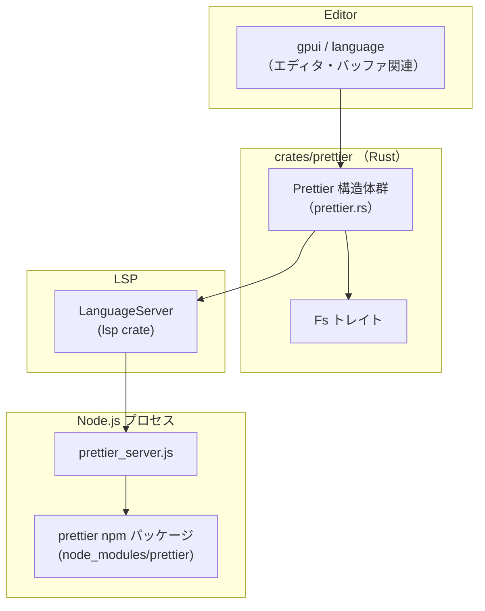
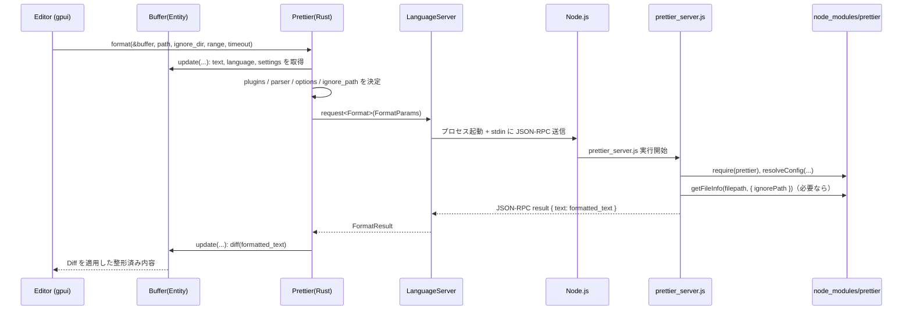

# crates/prettier ディレクトリ解説

## 1. ざっくり一言

`crates/prettier` は、エディタ内部から Prettier を呼び出してコード整形を行うためのモジュールです。  
Rust 側で Prettier の検索・設定・LSP 風プロトコルの管理を行い、Node.js の `prettier_server.js` で実際の Prettier npm パッケージを利用して整形します。

---

## 2. このモジュールの役割

### 2.1 概要

- このディレクトリは **Prettier によるコード整形** をエディタから利用できるようにするための実装を提供します。
- Rust 側では:
  - プロジェクト内の Prettier インストール位置の探索
  - `.prettierignore` の探索
  - Node.js ベースの Prettier サーバの起動
  - バッファ内容の整形リクエストの生成・結果の適用  
  を担います。
- JavaScript 側 (`prettier_server.js`) では:
  - 標準入力越しに JSON-RPC 風メッセージを受信
  - Prettier の設定解決・ignore 判定
  - `prettier.format` の呼び出しと結果返却  
  を行います。

### 2.2 アーキテクチャ内での位置づけ

Rust 側と Node 側、さらに外部クレートとの関係を簡略化した依存関係図です。



- エディタ本体（`gpui`, `language`）が `Prettier` を利用して整形を要求します。
- `Prettier` は `LanguageServer` を通じて Node プロセス上の `prettier_server.js` に JSON-RPC 風のリクエストを送信します。
- `prettier_server.js` は `node_modules/prettier` を `require` して、実際の整形処理を行います。
- ファイルシステム上の探索（`package.json` や `.prettierignore`）には抽象化された `Fs` が使われます。

### 2.3 設計上のポイント

コードから読み取れる特徴を列挙します。

- **責務分割**
  - Rust:
    - Prettier インストールパス・ignore ファイルの探索
    - Prettier サーバ（LanguageServer）の起動と管理
    - バッファからのテキスト取得・オプション構築・Diff の適用
  - Node:
    - 標準入出力を使用したメッセージ処理
    - Prettier 設定の解決と ignore 判定
    - 実際の `prettier.format` の呼び出し
- **状態管理**
  - Rust 側の `RealPrettier` は `LanguageServer` インスタンスと Prettier ルートディレクトリを保持します。
  - Node 側の `Prettier` クラスは `prettier` モジュールと「ベースの」設定オブジェクトを持ちます。
- **エラーハンドリング方針**
  - Rust:
    - `anyhow::Result` と `with_context` による文脈付きエラー。
    - 条件不成立時は `anyhow::ensure!` で早期にエラーを返します。
    - Prettier が見つからない・parser が決められない場合などは明示的に `bail!`。
  - Node:
    - パースエラーやヘッダ不正時にエラー応答を返しつつ、入力ストリームの再同期を試みます。
    - Prettier の読み込み失敗や設定解決失敗時には標準エラーに出力してプロセスを終了します。
- **テストサポート**
  - `#[cfg(any(test, feature = "test-support"))]` で切り替わる `TestPrettier` 実装により、実際の Prettier を起動せずに挙動をテストできるようになっています。

---

## 3. 主要な機能一覧

このディレクトリが提供する主な機能を列挙します。

- Prettier のインストール場所探索（npm プロジェクト／npm workspaces 対応）
- `.prettierignore` の探索（単一プロジェクト・モノレポ対応）
- Prettier 用 Node サーバ（`prettier_server.js`）の起動と LSP 風通信
- バッファ内容の整形（ファイル全体／範囲指定）
- 言語設定（タブ幅、行長、ハードタブなど）から Prettier オプションへのデフォルト反映
- Prettier プラグインのディスク上パス解決（Tailwind プラグインを最後に適用）
- Prettier 設定キャッシュのクリア
- テスト用の簡易 Prettier 実装（出力にマーカー文字列を付与）

---

## 4. 関数・構造体の解説

### 4.1 Rust 側の型一覧（`prettier.rs`）

| 名前 | 種別 | 役割 / 用途 |
|------|------|-------------|
| `Prettier` | enum | 実際の Prettier 実装 (`RealPrettier`) とテスト用実装 (`TestPrettier`) をまとめるラッパーです。 |
| `RealPrettier` | 構造体 | Node ベースの Prettier サーバへの接続情報（`LanguageServer`）と Prettier ルートディレクトリを保持します。 |
| `TestPrettier` | 構造体（テスト用） | 実際の Prettier を使わず、テスト用の疑似整形処理を行う実装です。 |
| `Format` | enum（マーカー） | `lsp::request::Request` を実装し、`"prettier/format"` メソッドを表す型です。 |
| `FormatParams` | 構造体 | Prettier サーバに送る整形リクエストのパラメータ（テキストと各種オプション）です。 |
| `FormatOptions` | 構造体 | Prettier 側に渡す細かなオプション（parser, plugins, filepath, rangeStart など）を保持します。 |
| `FormatResult` | 構造体 | Prettier から返る整形済みテキストを保持します。 |
| `ClearCache` | enum（マーカー） | `"prettier/clear_cache"` リクエスト用の型です。 |

主な定数:

| 名前 | 型 | 説明 |
|------|----|------|
| `FAIL_THRESHOLD` | `usize` | 失敗許容回数のような値ですが、このチャンク内では使用箇所がなく、具体的用途は不明です。 |
| `PRETTIER_SERVER_FILE` | `&'static str` | Node サーバスクリプトのファイル名 (`"prettier_server.js"`) です。 |
| `PRETTIER_SERVER_JS` | `&'static str` | `prettier_server.js` の内容を埋め込んだ文字列です。どこか別の箇所でファイルに書き出す用途と考えられますが、このチャンク内の使用箇所はありません。 |
| `CONFIG_FILE_NAMES` | `&'static [&'static str]` | Prettier 関連の設定ファイル名（`.prettierrc*`, `prettier.config.*`, `.editorconfig`, `.prettierignore`）の一覧です。 |

### 4.2 JavaScript 側の型一覧（`prettier_server.js`）

| 名前 | 種別 | 役割 / 用途 |
|------|------|-------------|
| `Prettier` | クラス | Prettier のモジュール (`require(".../prettier")`) と、そのベース設定オブジェクトを保持します。 |
| `readStdin` | 非同期ジェネレータ関数 | LSP 風の `Content-Length` ヘッダ付きメッセージを標準入力から読み出します。 |
| `handleMessage` | 非同期関数 | 1 つのメッセージ（`prettier/format` など）を解釈し、Prettier の呼び出しや応答生成を行います。 |

---

### 4.3 主要関数詳細（Rust）

ここでは特に重要な 5 つの関数を詳しく説明します。

#### `Prettier::locate_prettier_installation(fs, installed_prettiers, locate_from)`

```rust
pub async fn locate_prettier_installation(
    fs: &dyn Fs,
    installed_prettiers: &HashSet<PathBuf>,
    locate_from: &Path,
) -> anyhow::Result<ControlFlow<(), Option<PathBuf>>>
```

**概要**

- 指定したパスから親ディレクトリ方向に辿りながら、Prettier がインストールされているプロジェクトルートを探索します。
- npm workspaces 構成にも対応し、ワークスペースルートにある Prettier も検出します。
- `node_modules` 以下のファイルについては整形対象外とし、そこで探索を打ち切るための `ControlFlow::Break(())` を返します。

**引数**

| 引数名 | 型 | 説明 |
|--------|----|------|
| `fs` | `&dyn Fs` | 抽象化されたファイルシステム。`metadata` や `load` でファイルやディレクトリ情報を取得します。 |
| `installed_prettiers` | `&HashSet<PathBuf>` | すでに判明している Prettier インストールディレクトリのキャッシュ集合です。 |
| `locate_from` | `&Path` | 探索を開始するパス（通常はファイルパス）です。 |

**戻り値**

- `Ok(ControlFlow::Continue(Some(path)))`  
  - `path` 直下に `node_modules/prettier` がある（またはキャッシュ済み）プロジェクトルートが見つかったことを表します。
- `Ok(ControlFlow::Continue(None))`  
  - ルートまで辿っても Prettier が見つからなかった場合です。
- `Ok(ControlFlow::Break(()))`  
  - `locate_from` が `node_modules` 以下だった場合など、探索自体をスキップすべき状況です。
- `Err(_)`  
  - npm workspaces で `package.json` に Prettier が書かれているが、対応する `node_modules/prettier` が存在しない場合など、矛盾した状態を検出したときに返されます。

**内部処理の流れ**

1. `locate_from` のパスコンポーネントを `node_modules` までで打ち切って `path_to_check` を作成。
   - もし元の `locate_from` に `node_modules` が含まれていれば、`ControlFlow::Break(())` を返す。
2. `fs.metadata(path_to_check)` で初期パスのメタデータを取得し、ファイルだった場合は親ディレクトリに一段上がる。
3. ループしながら次を行う:
   - `installed_prettiers` に `path_to_check` があれば、それを結果として `Continue(Some(...))` で返す。
   - `read_package_json(fs, path_to_check)` で `package.json` を読み込み:
     - `has_prettier_in_node_modules(fs, path_to_check)` が true なら、そこを Prettier ルートとして返す。
     - そうでなければ、最初に見つけた `package.json` を `closest_package_json_path` として記録。
     - 2 つ目以降の `package.json` については `"workspaces"` フィールド（配列）を調べ、`closest_package_json_path` がそのワークスペースに属しているかを `PathMatcher` で判定。
       - 属している場合、現在の `path_to_check` がワークスペースルートであるため、そこに `node_modules/prettier` があるかチェック。
       - 見つかればそこを返し、見つからなければ `ensure!` でエラーにする。
4. `path_to_check.pop()` で親ディレクトリに上がり、もう上がれなくなったら探索終了として `Continue(None)` を返す。

**Errors / Panics**

- 初期パスや `package.json` のメタデータ取得に失敗した場合は `Err` を返します。
- workspaces ルートに Prettier が定義されていない（`node_modules/prettier` 不在）場合は `Err` で、
  - 子プロジェクトのパス
  - workspaces ルート候補  
  を含むメッセージを返します（テストで確認済み）。

**Edge cases（エッジケース）**

- `locate_from` が `node_modules` 配下の場合:  
  → 即座に `ControlFlow::Break(())` で探索を中止します。
- `package.json` はあるが `node_modules/prettier` がない単純なプロジェクト:  
  → ルートまで上がりきり、結果は `Continue(None)` になります。
- npm workspaces で、サブプロジェクト側には `package.json` に Prettier があるが
  ルートに Prettier がインストールされていない場合:  
  → エラー (`Err(_)`) になります。

**使用上の注意点**

- 戻り値が `ControlFlow::Break(())` の場合は「node_modules 内など、そもそも整形対象にすべきでない」と判断して処理を打ち切る前提で使う必要があります。
- `Err(_)` は「環境の矛盾」を示すため、ユーザへの明示的なエラーメッセージ表示に使う想定と解釈できます。

---

#### `Prettier::locate_prettier_ignore(fs, prettier_ignores, locate_from)`

```rust
pub async fn locate_prettier_ignore(
    fs: &dyn Fs,
    prettier_ignores: &HashSet<PathBuf>,
    locate_from: &Path,
) -> anyhow::Result<ControlFlow<(), Option<PathBuf>>>
```

**概要**

- Prettier の ignore ルールを記述する `.prettierignore` がどこにあるかを探索し、そのディレクトリを返します。
- 単一プロジェクトおよび npm workspaces 構成（モノレポ）に対応します。
- こちらも `node_modules` 配下は対象外として `ControlFlow::Break(())` を返します。

**主な挙動**

- すでに `prettier_ignores` キャッシュにあるディレクトリならそれを優先。
- 現在のディレクトリに `.prettierignore` が存在すればそこを返す。
- npm workspaces の場合、子パッケージとルートの両方に `.prettierignore` があるケースでは「より近い（子パッケージ側）」を返すテストが書かれています。
- ルートまで上がって見つからなければ `ControlFlow::Continue(None)` です。

**Edge cases**

- ルートと子パッケージの両方に `.prettierignore` がある場合、必ず子パッケージ側が優先されます（テスト `test_prettier_ignore_in_monorepo_with_root_and_child_ignores` 参照）。
- `package.json` が存在しないディレクトリには `.prettierignore` があってもここでは検出されませんが、
  テストでは常に `package.json` と `.prettierignore` がともに存在する形で構成されています。

**使用上の注意点**

- 戻り値の `Option<PathBuf>` は「どのディレクトリを ignorePath として Prettier に渡すか」を決めるのに利用します。
- 実際の ignore 判定ロジックは Node 側 (`prettier_server.js`) の `getFileInfo` 呼び出しに委ねています。

---

#### `Prettier::start`（本番用 `RealPrettier`）

```rust
#[cfg(not(any(test, feature = "test-support")))]
pub async fn start(
    server_id: LanguageServerId,
    prettier_dir: PathBuf,
    node: NodeRuntime,
    request_timeout: Duration,
    mut cx: AsyncApp,
) -> anyhow::Result<Self>
```

**概要**

- Node.js を用いた Prettier サーバ（`prettier_server.js`）を起動し、`RealPrettier` を構築します。
- LSP 風の `LanguageServer` を内部で作成し、初期化まで行います。

**引数**

| 引数名 | 型 | 説明 |
|--------|----|------|
| `server_id` | `LanguageServerId` | LSP サーバを識別するための ID です。 |
| `prettier_dir` | `PathBuf` | Prettier を含むプロジェクト／ディレクトリのルートパスです。`node_modules/prettier` が存在する必要があります。 |
| `node` | `NodeRuntime` | Node.js バイナリのパス取得などを行うランタイムです。 |
| `request_timeout` | `Duration` | Prettier サーバへのリクエストタイムアウトです。 |
| `cx` | `AsyncApp` | 非同期コンテキスト／実行環境です。 |

**戻り値**

- 成功時は `Ok(Prettier::Real(RealPrettier { ... }))` を返します。

**内部処理の流れ**

1. `prettier_dir` がディレクトリであることを `ensure!` で確認。
2. `default_prettier_dir().join(PRETTIER_SERVER_FILE)` に `prettier_server.js` が存在することを確認。
3. `NodeRuntime` から Node バイナリパスを取得。
4. `LanguageServerBinary` を構築
   - `path`: Node バイナリ
   - `arguments`: `[prettier_server.js のパス, prettier_dir]`
5. `LanguageServer::new` でサーバを生成。
6. `server.default_initialize_params` と `DidChangeConfigurationParams` を使って `initialize` リクエストを送り、初期化完了を待つ。
7. `RealPrettier { server, default, prettier_dir }` を構築し、`Prettier::Real` として返す。

**Errors / Panics**

- `prettier_dir` がディレクトリでない場合や `prettier_server.js` が存在しない場合は `Err` になります。
- LSP サーバの生成・初期化中に問題が発生した場合も `Err` を返し、`context` によって原因が区別しやすくなっています。

**使用上の注意点**

- `prettier_dir` は後続の `format` で `prettier_dir/node_modules` を参照するため、`node_modules/prettier` を含むディレクトリである必要があります。
- `default` フラグは `prettier_dir == default_prettier_dir()` の比較で決まり、後述の「デフォルトオプション補完」に影響します。

---

#### `Prettier::format(&self, buffer, buffer_path, ignore_dir, range_utf16, request_timeout, cx)`

```rust
pub async fn format(
    &self,
    buffer: &Entity<Buffer>,
    buffer_path: Option<PathBuf>,
    ignore_dir: Option<PathBuf>,
    range_utf16: Option<Range<OffsetUtf16>>,
    request_timeout: Duration,
    cx: &mut AsyncApp,
) -> anyhow::Result<Diff>
```

**概要**

- 与えられたバッファ内容を Prettier で整形し、その結果との差分 `Diff` を返します。
- ファイル単位だけでなく UTF-16 ベースの範囲指定整形にも対応します。
- 言語設定から Prettier 設定へのデフォルト値補完や、プラグインのパス解決を行った上で、Node サーバへリクエストを送信します。

**主な処理の流れ（`Real` の場合）**

1. `buffer.update` のクロージャ内で
   - `buffer.language()` から言語オブジェクトを取得。
   - `LanguageSettings::for_buffer` から言語別設定を読み出し、その中の `prettier` 設定 (`PrettierSettings`) を参照。
   - `prettier_settings.allowed` が `true` であることを確認（許可されていないとエラー）。
2. Prettier ルート `self.prettier_dir()` 配下の `node_modules` ディレクトリが存在するか確認。
3. プラグイン解決:
   - `prettier_settings.plugins` の各名前に対して `node_modules/<plugin-name>` 以下のいくつかの候補パス（`dist/index.mjs`, `index.js`, `plugin.js`, `standalone.js` など）を順に探し、最初に見つかったパスを採用。
   - Tailwind 向けプラグイン (`"prettier-plugin-tailwindcss"`) は一旦リストから除外し、最後に追加することで「最後に適用される」ようにしています。
   - 見つからなかったプラグインはエラーログを出しつつ無視します。
4. Prettier オプション補完 (`prettier_options`):
   - `self.is_default()` が `true`（= エディタに同梱された Prettier の場合）のみ、
     - `tabWidth`, `printWidth`, `useTabs` が設定されていなければ、`LanguageSettings` の値で補完。
   - それ以外（ユーザが用意した Prettier）の場合は `None`（＝ Node 側で既存設定を優先）とします。
5. パーサの決定:
   - `prettier_parser_name(buffer_path.as_deref(), buffer_language, prettier_settings)` を呼び出して `Option<String>` を取得。
   - unsaved ファイルで parser を決められない場合はエラーになります。
6. ignore ファイルパスの決定:
   - `ignore_dir`（探索で見つかったディレクトリ）に `.prettierignore` が存在すれば、そのファイルパスを `ignore_path` として設定。
7. `FormatParams` を構築:
   - `text`: `buffer.text()` の生テキスト。
   - `options`: `FormatOptions` として
     - `path`: `buffer_path`
     - `parser`
     - `plugins`（解決済みのプラグインパス）
     - `prettier_options`（上記補完済みオプション）
     - `ignore_path`
     - `range_start` / `range_end`: `range_utf16` から UTF-16 オフセット値を取り出して格納。
8. `LanguageServer` に `request::<Format>(params, request_timeout)` を送り、`FormatResult` を受け取る。
9. 再度 `buffer.update` で `buffer.diff(response.text, cx)` を呼び出し、非同期タスクとして `Diff` を算出して `await` する。

**`Test` バリアントの挙動**

- Rust 以外の言語では、実際には整形せず
  - 全体整形: テキスト末尾に `FORMAT_SUFFIX` と（あれば）parser 名を追記。
  - 範囲整形: 範囲開始位置近くの改行後あたりに `RANGE_FORMAT_SUFFIX` と parser 名を挿入。
- Rust 言語の場合は `"prettier does not support Rust"` というエラーを返します。

**Errors / Panics**

- Prettier がその言語に対して許可されていない場合 (`allowed == false`)。
- Prettier ルート配下に `node_modules` ディレクトリが存在しない場合。
- パーサが決定できない（特に unsaved ファイル）場合。
- Node 側での実行エラーは `into_response()` 経由で Rust 側に変換され、`Err` になります。
- `Test` バリアントでは、言語が不明 (`None`) の時に `panic!` します（テスト前提）。

**Edge cases**

- `buffer_path == None`（未保存ファイル）の場合:
  - `prettier_settings.parser` か `buffer_language.prettier_parser_name()` のどちらかが必須です。
  - どちらも無い場合はエラーになります。
- ファイル拡張子が言語の `matcher.path_suffixes` に含まれていない場合:
  - 言語が持つデフォルトの Prettier parser 名を使用します。
- 範囲整形:
  - `range_utf16` が指定されると `range_start` / `range_end` が設定され、Node 側の `rangeOptions` として Prettier に渡されます。

**使用上の注意点**

- 戻り値は差分 `Diff` なので、呼び出し側で適用（`buffer.apply_diff` など）する必要があります。
- `request_timeout` は Node 側での整形時間も含めた全体のタイムアウトであり、大きなファイルや複雑なフォーマットでは適切に設定する必要があります。

---

#### `prettier_parser_name(buffer_path, buffer_language, prettier_settings)`

```rust
fn prettier_parser_name(
    buffer_path: Option<&Path>,
    buffer_language: Option<&Language>,
    prettier_settings: &PrettierSettings,
) -> anyhow::Result<Option<String>>
```

**概要**

- 実行時に使用する Prettier parser 名（例: `"typescript"`, `"babel"`, `"json"` など）を決定して返します。
- ファイルパスの有無・拡張子と、言語設定およびユーザ設定を組み合わせて決めるロジックです。

**主なロジック**

1. `buffer_path` が `None`（未保存ファイル）の場合:
   - `prettier_settings.parser` または `buffer_language.prettier_parser_name()` のどちらかを利用。
   - 両方 `None` ならエラーとし、「unsaved file では parser が決められない」として失敗させます。
2. `buffer_path` と `buffer_language` の両方がある場合:
   - 拡張子がその言語の `config().matcher.path_suffixes` に含まれて *いない* 場合:
     - 言語の `prettier_parser_name()` を使います。
   - 上記以外の場合:
     - `prettier_settings.parser` の値（なければ `None`）をそのまま使用します。
3. いずれにせよ `Option<&str>` を `Option<String>` に変換して返します。

**使用上の注意点**

- 「未保存ファイルで parser 不明」のケースを明確にエラーとすることで、Prettier 側に不完全なパラメータを送らないようになっています。
- 言語の matcher 設定を見て「想定外の拡張子」かどうかを判定している点が特徴です。

---

#### `has_prettier_in_node_modules(fs, path)` / `read_package_json(fs, path)`

この 2 つは `locate_prettier_installation` / `locate_prettier_ignore` の補助関数です。

- `has_prettier_in_node_modules`  
  - `path.join("node_modules").join("prettier")` のメタデータを取得し、存在していればディレクトリかどうかで判定します。
- `read_package_json`  
  - `path.join("package.json")` を読み込み、存在すれば `HashMap<String, serde_json::Value>` としてパースして返します。
  - ディレクトリやシンボリックリンクであれば無視し、`Ok(None)` を返します。

---

### 4.4 主要関数詳細（JavaScript）

#### `async function* readStdin()`

**概要**

- 標準入力から LSP 風のメッセージ（`Content-Length: <n>\r\n\r\n<JSON>`）を読み取り、JSON 文字列を 1 メッセージずつ生成する非同期ジェネレータです。

**主な処理の流れ**

1. `process.stdin` の `"data"` イベントでバイト列をバッファに連結します。
2. `headerSeparator = "\r\n"` を用いて `"\r\n\r\n"`（ヘッダ終端）を探します。
3. ヘッダ部から `Content-Length` ヘッダを探し、値を `parseInt` してメッセージボディ長を決定します。
4. バッファに必要な長さが溜まるまで `"readable"` イベントを待ちます。
5. 必要な長さが揃ったら、ヘッダ部を除いた JSON 文字列を `yield` します。
6. ヘッダ不在や長さ不整合・ストリーム終了などの異常時には `makeError` でエラー応答を送り、
   内部状態をリセットした上で再度 `"readable"` を待って処理を継続します。

**使用上の注意点**

- この関数自体は JSON のパースは行わず、あくまで「ヘッダ付きのメッセージフレーム」を取り出す役割に徹しています。
- エラー発生時もプロセスを即終了させず、できる限りストリームの再同期を試みる設計になっています。

---

#### `async function handleMessage(message, prettier)`

**概要**

- 1 つのメッセージ（`method`, `id`, `params` を持つ JSON オブジェクト）を解釈し、適切な処理を実行します。
- 主に `"prettier/format"` と `"prettier/clear_cache"`、`"initialize"`、LSP 系の `"shutdown"`, `"exit"`, `"initialized"` を処理します。

**主なロジック**

1. `method` チェック
   - 未定義ならエラー。
   - `"initialized"` は何もせず return。
   - `"shutdown"` は `{ result: {} }` を返す。
   - `"exit"` は `process.exit(0)` でプロセス終了。
2. `id` チェック
   - 未定義ならエラー。
3. `"prettier/format"` の場合:
   - `params.text` と `params.options` が存在することをチェック。
   - `params.options.filepath` が指定されている場合:
     - `prettier.prettier.resolveConfig(filepath)` でファイル単位の設定を取得。
     - `params.options.ignorePath` があれば
       - `prettier.prettier.getFileInfo(filepath, { ignorePath })` を呼び、`ignored` が `true` ならテキストをそのまま返して終了。
   - `params.options.filepath === null` の場合は `undefined` に書き換え（Prettier が filepath を必須としないように）。
   - `plugins` の決定:
     - resolvedConfig に `plugins` があればそれを優先、なければ Rust 側から渡された `params.options.plugins` を使用。
   - range オプション (`rangeStart`, `rangeEnd`) をまとめる。
   - 実際に渡す `options` を構築:
     - ベース: `params.options.prettierOptions` または `prettier.config`
     - その上に `resolvedConfig` をマージ（ファイル固有設定が優先）
     - さらに `plugins`, `parser`, `filepath`, `rangeOptions` を設定。
   - この `options` と `params.text` を用いて `prettier.prettier.format` を呼び、結果テキストを返す。
4. `"prettier/clear_cache"` の場合:
   - `prettier.prettier.clearConfigCache()` を呼び、`prettier.config` を再度 `resolveConfig(prettier.path)` で読み直す。
5. `"initialize"` の場合:
   - LSP の初期化リクエストに相当し、`capabilities: {}` を返します。
6. それ以外の `method` ならエラー。

**使用上の注意点**

- ignore 処理は Node 側が担っており、Rust 側は ignorePath のパスを渡すだけです。
- オプションマージの優先度は  
  `prettierOptions / prettier.config` < `resolvedConfig` < `plugins / parser / filepath / rangeOptions`  
  となっています。
- エラー発生時には `handleBuffer` 側で request をラップし、元の `params.text` を `"..snip.."` に差し替えた上でエラー応答を返します。

---

### 4.5 その他の関数・メソッド（概要だけ）

| 関数名 / メソッド名 | 場所 | 役割（1 行） |
|---------------------|------|--------------|
| `Prettier::clear_cache` | Rust | Prettier サーバに `"prettier/clear_cache"` リクエストを送り、設定キャッシュをクリアします。 |
| `Prettier::server` | Rust | 内部の `LanguageServer` 参照を `Option<&Arc<LanguageServer>>` として返します。 |
| `Prettier::is_default` | Rust | この Prettier が `default_prettier_dir()` にあるかどうかを返します。 |
| `Prettier::prettier_dir` | Rust | Prettier のルートディレクトリパスを返します。 |
| `makeError` | JS | JSON-RPC 形式のエラーオブジェクトを作成します。 |
| `sendResponse` | JS | `Content-Length` ヘッダ付き JSON-RPC レスポンスを stdout に書き出します。 |
| `loadPrettier` | JS | 指定パスから `prettier` モジュールを `require` し、Promise で返します。 |
| `handleBuffer` | JS | `readStdin()` からのメッセージを逐次処理するメインループです。 |

---

## 5. データフロー

ここでは「エディタから Prettier でファイルを整形する」典型的なシナリオのデータフローを示します。

### 5.1 概要

1. エディタから `Prettier::format` が呼ばれる。
2. Rust 側でバッファ内容・オプション・プラグインパスが収集され、`FormatParams` として LSP サーバに送信される。
3. LSP サーバが Node プロセス上の `prettier_server.js` に JSON-RPC メッセージを転送。
4. `prettier_server.js` が設定解決・ignore 処理・Prettier 本体呼び出しを行い、整形結果テキストを返す。
5. Rust 側で元のバッファとの `Diff` を計算し、呼び出し元に返す。

### 5.2 シーケンス図



---

## 6. 使い方（How to Use）

### 6.1 基本的な使用方法

ここでは、すでに `prettier_dir` が決まっており、NodeRuntime や LanguageServerId が用意されている前提で、
単一ファイルを整形する流れの例を示します。

```rust
use std::time::Duration;
use gpui::{AsyncApp, Entity};
use language::Buffer;
use lsp::LanguageServerId;
use node_runtime::NodeRuntime;
use prettier::Prettier; // 実際のモジュールパスはプロジェクト構成に依存します
use paths::default_prettier_dir;

// 省略: AsyncApp, NodeRuntime, LanguageServerId, Buffer の準備
async fn format_current_buffer(
    mut cx: AsyncApp,                        // 非同期コンテキスト
    node: NodeRuntime,                       // Node ランタイム
    server_id: LanguageServerId,             // Prettier 用 LSP サーバ ID
    buffer: Entity<Buffer>,                  // 整形対象バッファ
) -> anyhow::Result<()> {
    // Prettier を起動する
    let prettier_dir = default_prettier_dir().to_path_buf(); // デフォルトの Prettier ルート
    let prettier = Prettier::start(
        server_id,
        prettier_dir,
        node,
        Duration::from_secs(10),
        cx.clone(),
    )
    .await?;                                  // RealPrettier が返る

    // buffer に紐づくファイルパスを取得（無名バッファなら None）
    let buffer_path = buffer
        .update(&mut cx, |buf, cx| {
            Ok(buf.file().map(|f| f.full_path(cx)))
        })?
        .await;

    // ignore ディレクトリはここでは指定しない例
    let ignore_dir = None;

    // 範囲指定なし（ファイル全体を整形）
    let range_utf16 = None;

    // Prettier に整形を依頼し、Diff を取得
    let diff = prettier
        .format(
            &buffer,
            buffer_path,
            ignore_dir,
            range_utf16,
            Duration::from_secs(10),
            &mut cx,
        )
        .await?;

    // Diff を適用（具体的メソッド名は Buffer 実装に依存します）
    buffer
        .update(&mut cx, |buf, cx| {
            buf.apply_diff(diff.clone(), cx); // apply_diff は仮のメソッド名です
            Ok(())
        })?
        .await;

    Ok(())
}
```

> ※ 上記では `apply_diff` というメソッド名を仮に用いています。  
> 実際の名前は `Buffer` の実装に依存するため、このチャンクだけでは特定できません。

### 6.2 よくある使用パターン

#### 6.2.1 プロジェクトごとの Prettier / `.prettierignore` 探索

Prettier インストール場所と ignore ファイルを事前に探索してから `format` に渡す使い方です。

```rust
use collections::HashSet;
use fs::Fs;
use std::path::{Path, PathBuf};
use std::ops::ControlFlow;

async fn find_prettier_and_ignore(
    fs: &dyn Fs,                 // ファイルシステム抽象
    file_path: &Path,            // 整形対象ファイルのパス
    installed: &HashSet<PathBuf>,// 既知の Prettier ルート
    ignores: &HashSet<PathBuf>,  // 既知の ignore ルート
) -> anyhow::Result<Option<(PathBuf, Option<PathBuf>)>> {
    // Prettier インストール場所を探索
    let prettier_root = match Prettier::locate_prettier_installation(fs, installed, file_path).await? {
        ControlFlow::Break(()) => return Ok(None), // node_modules/ 以下など、整形しない
        ControlFlow::Continue(root) => root,       // Some or None
    };

    // ignore ディレクトリを探索
    let ignore_root = match Prettier::locate_prettier_ignore(fs, ignores, file_path).await? {
        ControlFlow::Break(()) => None,           // node_modules/ 以下など
        ControlFlow::Continue(root) => root,      // Some or None
    };

    Ok(prettier_root.map(|root| (root, ignore_root)))
}
```

取得した `(prettier_root, ignore_root)` を用いて `Prettier::start` や `format` に渡して使う形になります。

#### 6.2.2 範囲整形（range formatting）

`range_utf16` を指定することで、ファイルの一部のみを整形できます。

```rust
use language::OffsetUtf16;
use std::ops::Range;

// 例: 0〜100 UTF-16 コード単位分の範囲を整形
let range_utf16 = Some(Range {
    start: OffsetUtf16(0),
    end: OffsetUtf16(100),
});

let diff = prettier
    .format(
        &buffer,
        buffer_path,
        ignore_dir,
        range_utf16,
        Duration::from_secs(10),
        &mut cx,
    )
    .await?;
```

Node 側では `rangeStart` / `rangeEnd` として Prettier に渡されます。

### 6.3 使用上の注意点（まとめ）

- **node_modules 配下は整形対象外**
  - `locate_prettier_installation` / `locate_prettier_ignore` は `node_modules` 以下で `ControlFlow::Break(())` を返します。
  - 呼び出し側でこの戻り値を確認し、整形をスキップする前提になっています。
- **Prettier のインストール整合性**
  - npm workspaces で `package.json` に Prettier が書かれているのに `node_modules/prettier` が無い場合はエラーになります。
  - これは環境設定の問題としてユーザに知らせる必要があります。
- **parser の設定**
  - 未保存ファイルを整形する場合、言語側か `PrettierSettings` に parser 名が設定されている必要があります。
- **デフォルト設定の上書き**
  - `is_default() == true` の場合のみ、`tabWidth` / `printWidth` / `useTabs` が未設定ならエディタ側の設定で補完されます。
  - ユーザ独自の Prettier を使う場合は、設定は Prettier 側（`prettier.config.*` や `package.json`）に任されます。
- **プラグインのパス解決**
  - `plugins` に指定したプラグイン名が `node_modules` に見つからない場合、エラーログが出てそのプラグインは無視されます。
  - Tailwind プラグインは常に最後に追加されるため、プラグイン順序に依存する整形ルールに配慮されています。

---

## 7. 関連ファイル

このディレクトリに含まれるファイルと、その役割をまとめます。

| パス | 役割 / 関係 |
|------|------------|
| `prettier/Cargo.toml` | `prettier` クレートの設定ファイルです。ライブラリターゲットとして `src/prettier.rs` を指定し、`node_runtime`, `gpui`, `language`, `lsp` などへの依存を定義しています。 |
| `prettier/src/prettier.rs` | Rust 側のメイン実装ファイルです。Prettier サーバの起動、インストール／ignore の探索、整形リクエストの生成などを行います。 |
| `prettier/src/prettier_server.js` | Node.js 側の Prettier サーバ実装です。標準入出力経由で JSON-RPC 風のメッセージを受け取り、`node_modules/prettier` を使って実際の整形や ignore 判定を行います。 |

この 3 ファイルで、エディタ内から Prettier を安全かつ柔軟に呼び出すための仕組みが構成されています。
