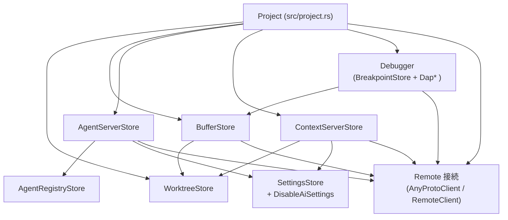
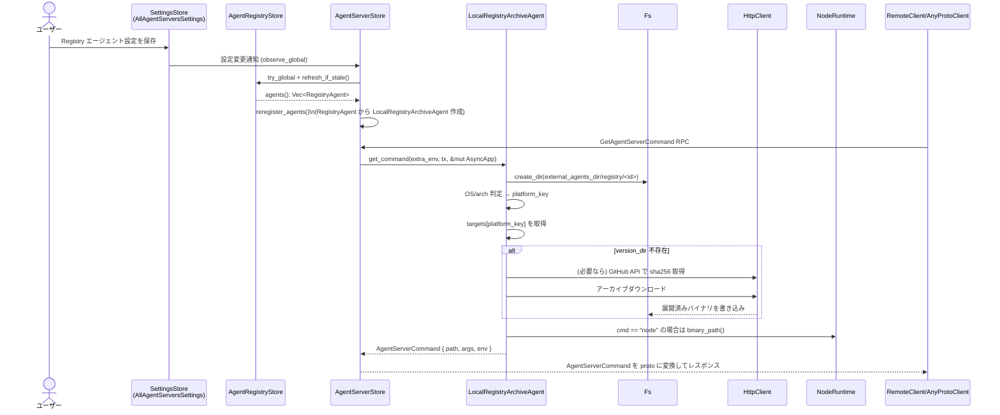
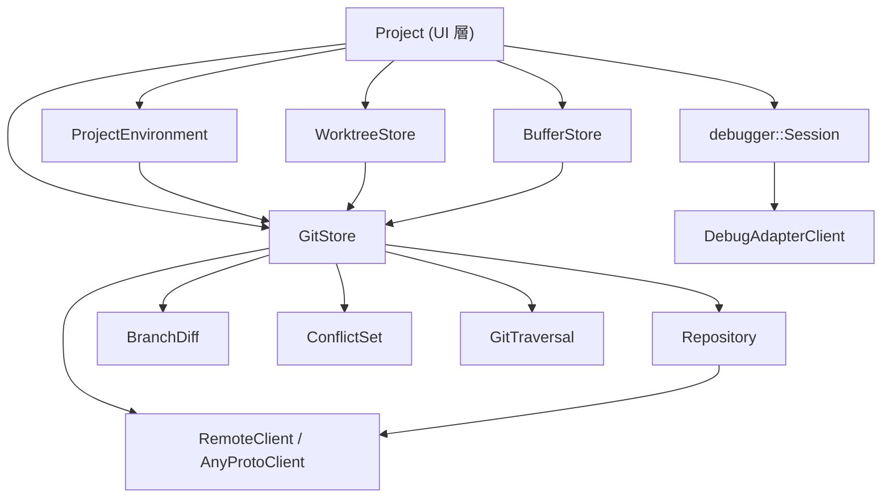
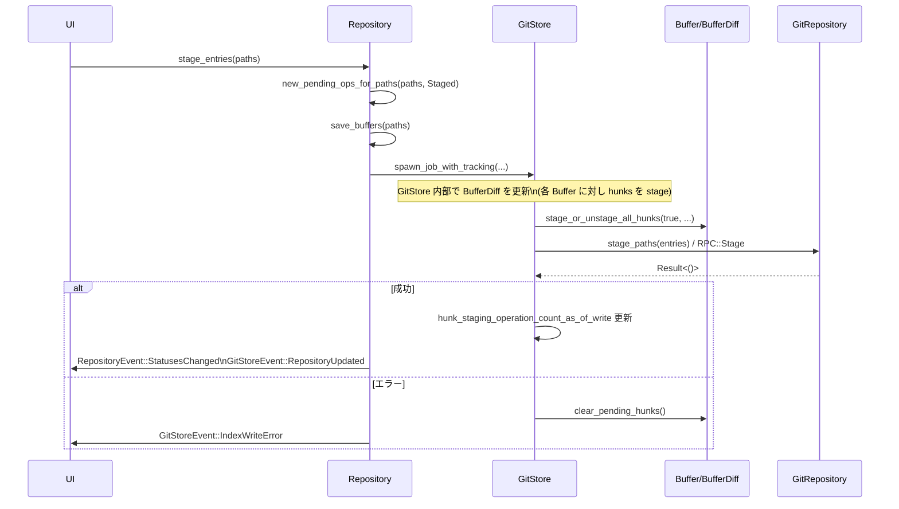
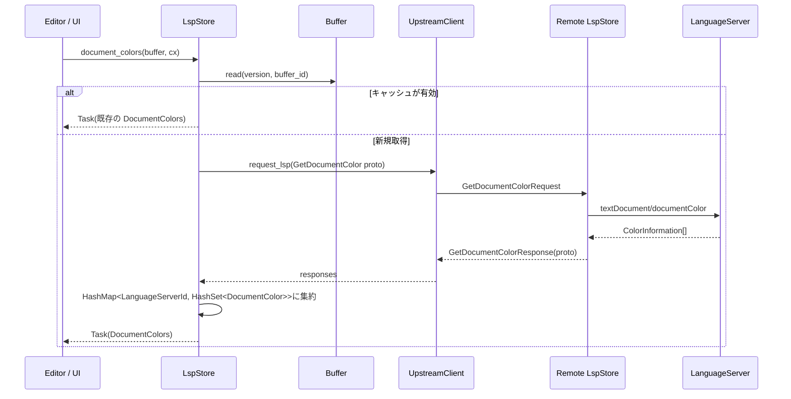
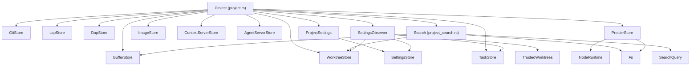
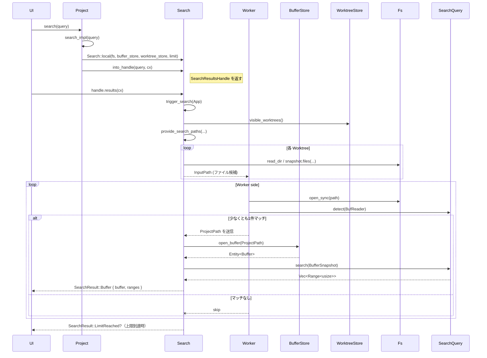
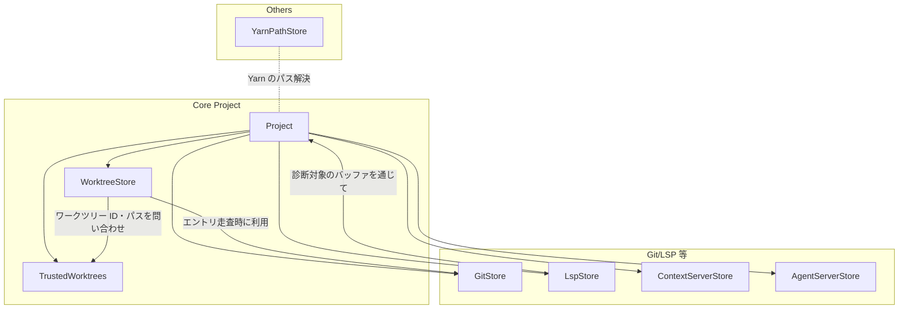
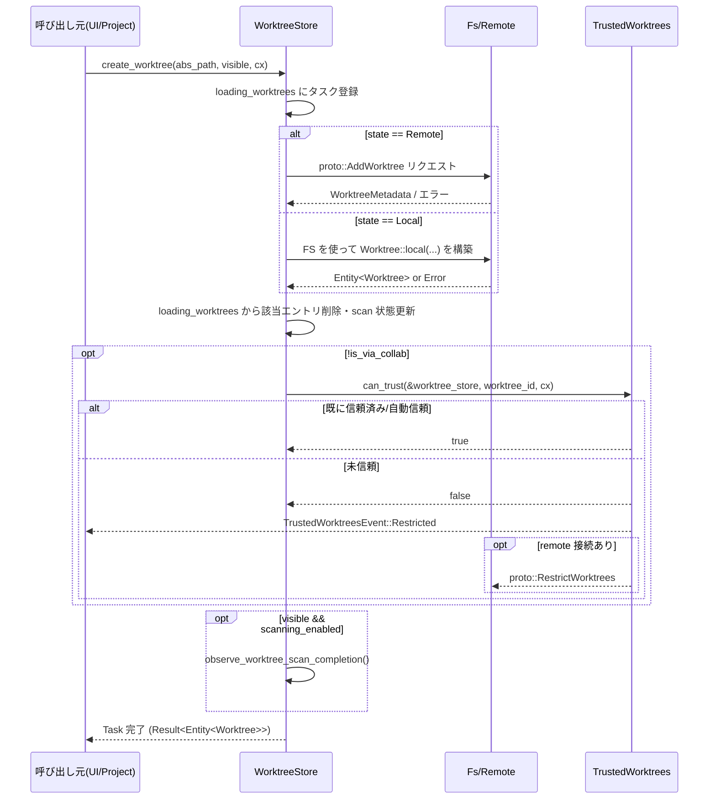

# project ディレクトリ解説（chunk 1/6）

> このレポートは、`crates/project` クレートのうち、このチャンクに含まれるソースコードだけを根拠にした解説です。他ファイルの挙動は、**名前から推測できる範囲にとどめ**、詳細不明な箇所はその旨を明記します。

---

## 1. ざっくり一言

`project` クレートは、エディタ／IDE の「プロジェクト」単位で必要になる各種ストアやサービス（バッファ管理、外部エージェント、コンテキストサーバ、デバッガ、リモート接続など）をまとめて扱う中核モジュールです。

このチャンクでは主に次の領域が実装されています。

- 外部エージェント（ACP Registry / 拡張 / カスタム）管理
- テキストバッファ（ローカル／リモート／コラボ）管理
- コンテキストサーバ（MCP HTTP/stdio）と OAuth 認証
- DAP（Debug Adapter Protocol）ベースのデバッガ統合
- ブレークポイント管理
- リモート接続の自動再接続
- LSP 完了アイテムからの色抽出、デバウンス実行ユーティリティ

---

## 2. このモジュールの役割

### 2.1 概要

このチャンクに含まれるモジュールは、おおまかに次の問題を解決します。

- **外部プロセスの管理**  
  - AI エージェントサーバ（レジストリ／拡張／ユーザー定義）のインストール・起動コマンド構築
  - コンテキストサーバ（MCP サーバと思われる）の起動・停止と設定更新、HTTP + OAuth 認証
- **編集バッファとリモート同期**  
  - ローカルファイルと `language::Buffer` の対応付け
  - リモートホストとの RPC（open/save/reload）およびコラボレーション共有
- **デバッガ関連**  
  - ファイルごとのブレークポイント集合を管理し、DAP ブレークポイントへ変換
  - DAP リクエストを抽象化する `LocalDapCommand` / `DapCommand` と、各種コマンド実装
- **補助機能**  
  - LSP Completion から CSS 風カラーコードを抽出して `Hsla` に変換
  - 一定時間内の連続トリガをまとめるデバウンスつき遅延実行

### 2.2 アーキテクチャ内での位置づけ

このチャンク内の主要コンポーネントと周辺コンポーネントの関係を簡略図で示します（外部クレートの実装はこのチャンクには含まれません）。



- `BufferStore` は `WorktreeStore` と連携してファイルとバッファの対応を管理し、リモート／コラボとの同期も担います。
- `AgentRegistryStore` は ACP Registry からエージェント定義を取得し、`AgentServerStore` がそれをもとにローカル実行コマンドを組み立てます。
- `ContextServerStore` は `ProjectSettings` や拡張からの定義をもとにコンテキストサーバを起動し、HTTP サーバ向けには OAuth 認証も扱います。
- `Debugger` 一式は `BufferStore` と `WorktreeStore` を使ってソースコード位置と DAP の位置情報を結びつけます。
- `AnyProtoClient` / `RemoteClient` を介して、リモートプロジェクトやコラボ相手と状態を同期します。

### 2.3 設計上のポイント

コードから読み取れる設計上の特徴を列挙します。

- **状態を持つ Store パターン**
  - `AgentRegistryStore`, `AgentServerStore`, `BufferStore`, `ContextServerStore`, `BreakpointStore` などは「Store」として長寿命の状態（キャッシュ・マップ・サブスクリプション）を保持します。
  - 多くが `gpui::Entity<T>` として生成され、`gpui` のリアクティブな更新/通知機構（`cx.update`, `cx.notify`, `cx.emit`）と組み合わせています。

- **Local / Remote の二重構造**
  - `AgentServerStoreState`, `BufferStoreState`, `ContextServerStoreState`, `BreakpointStoreMode` のように、ローカル・リモートの二形態を enum で明示的に分けています。
  - リモートの場合は `AnyProtoClient` / `RemoteClient` 経由で RPC を発行し、イベントハンドラ（`handle_*` 関数）で状態を更新します。
  - 想定外の状態で「ローカル専用メソッド」などを呼ぶと `debug_panic!` でデバッグ時に検出する方針です。

- **非同期処理と Task**
  - 長時間かかり得る処理（HTTP、ファイル I/O、RPC）はすべて `gpui::Task` と非同期クロージャで表現されます。
  - `cx.spawn` で UI スレッドから非同期タスクを起動し、内部でさらに `background_executor` を使う二段階構成もよく使われています。
  - コラボやリモートバッファでは `futures::channel::oneshot` で「バッファが届くまで待つ」などの同期も行います。

- **設定と機能フラグの反映**
  - `SettingsStore` と `RegisterSetting` 派生の設定型（例： `AllAgentServersSettings`, `ProjectSettings`）を `cx.observe_global` で監視し、設定変更時にストアを自動再構成します。
  - `DisableAiSettings::get_global(cx).disable_ai` を見て AI 関連機能（エージェントやコンテキストサーバ）の起動を抑制する仕組みがあります。

- **外部プロセスの抽象化**
  - エージェントサーバやコンテキストサーバの起動は
    - 設定（registry / extension / custom / HTTP）→
    - プラットフォーム別のターゲット選択→
    - アーカイブのダウンロード＆展開→
    - 実行コマンド (`AgentServerCommand` / `ContextServerCommand`) 構築
    のパイプラインとして整理されています。
  - デバッガは `LocalDapCommand` / `DapCommand` という共通トレイトで、ローカル DAP 要求と RPC メッセージとの変換ロジックを共通化しています。

- **OAuth 対応 HTTP コンテキストサーバ**
  - `ContextServerStore` は HTTP ベースのサーバで 401 応答と `WWW-Authenticate` を検出すると OAuth ディスカバリを行い、`AuthRequired` / `Authenticating` といった状態を経てトークン取得・保存・再起動まで管理します。
  - 認証情報は `CredentialsProvider` 経由で OS のキーチェーンに保存されます。

---

## 3. 主要な機能一覧

このチャンクに含まれる主な機能を箇条書きで示します。

- **エージェントレジストリ管理 (`agent_registry_store.rs`)**
  - ACP Registry から JSON を取得し、`RegistryAgent`（バイナリ / NPX）に変換
  - キャッシュ（`registry.json` とアイコン SVG）の読み書き
  - 現在のプラットフォーム向けターゲットの有無判定

- **エージェントサーバ管理 (`agent_server_store.rs`)**
  - カスタム / 拡張 / Registry ベースの外部エージェントサーバの登録・再登録
  - レジストリエージェントのアーカイブダウンロード・検証・展開
  - Node.js（`NodeRuntime`）や `npm exec` を用いた NPX エージェントの起動
  - バージョン変更時の再接続通知（watch チャンネル）

- **バッファ管理 (`buffer_store.rs`)**
  - ローカルワークツリー上のファイルを開いて `language::Buffer` を生成
  - バッファの保存・保存先変更（`save_buffer`, `save_buffer_as`）
  - リモートホストとのバッファ同期（open/save/reload、チャンク配信）
  - コラボ相手とのバッファ共有と LSP ハンドルの管理
  - プロジェクト検索用の一時ハンドル管理

- **コンテキストサーバ管理 (`context_server_store.rs`, `context_server_store/extension.rs`, `.../registry.rs`)**
  - 設定／拡張／HTTP URL に基づくコンテキストサーバの生成とライフサイクル管理
  - HTTP サーバ向けの OAuth 認証フロー（ブラウザ起動・コード取得・トークン保存）
  - サーバ設定の変更や AI 無効化に応じた自動再構成・停止

- **デバッガ関連 (`debugger/breakpoint_store.rs`, `debugger/dap_command.rs`, 一部 `debugger/dap_store.rs`)**
  - ブレークポイントの追加・削除・条件・ログメッセージ編集
  - アクティブなスタックフレーム位置の管理と UI へのイベント発行
  - DAP の各種リクエスト（ステップ／変数取得／メモリ読み取りなど）の抽象化と proto 変換

- **接続管理 (`connection_manager.rs`)**
  - client の接続状態を監視し、切断検出時に一定回数リトライ
  - 再接続成功時に `RejoinRemoteProjects` を送り、リモートプロジェクトを再参加
  - 失敗時にはプロジェクトを閉じる

- **補助ユーティリティ**
  - `color_extractor.rs`: LSP `CompletionItem` から CSS 風色表現（hex/rgb/hsl）を抽出し `Hsla` に変換
  - `debounced_delay.rs`: 一定時間内の連続呼び出しをまとめて 1 回だけ処理するデバウンス付き遅延実行

---

## 4. 関数・構造体の解説

### 4.1 主要な型一覧

このチャンクで特に重要と思われる型をまとめます。

| 名前 | 所属モジュール | 種別 | 役割 / 用途 |
|------|----------------|------|-------------|
| `AgentRegistryStore` | `agent_registry_store` | 構造体 | ACP Registry からエージェント一覧を取得・キャッシュし、`RegistryAgent` のリストとして提供する。 |
| `RegistryAgentMetadata` / `RegistryBinaryAgent` / `RegistryNpxAgent` / `RegistryAgent` | 同上 | 構造体 / enum | レジストリエージェントのメタ情報と、バイナリ配布 or NPX 配布の差異を表現する。 |
| `RegistryTargetConfig` | 同上 | 構造体 | バイナリエージェントのプラットフォームごとの配布設定（アーカイブ URL、コマンド、引数、環境変数、SHA256）を保持する。 |
| `AgentServerStore` | `agent_server_store` | 構造体 | 外部エージェントサーバの一覧・生成ロジックを保持するストア。ローカル／リモート／コラボの状態を持つ。 |
| `AgentId` | 同上 | newtype 構造体 | エージェントの一意な ID を `SharedString` でラップしたキー型。 |
| `AgentServerCommand` | 同上 | 構造体 | 外部エージェントサーバを起動するためのコマンド（パス・引数・環境変数）。 |
| `ExternalAgentServer` | 同上 | トレイト | 任意の実装（拡張、レジストリ、カスタム）に共通する「コマンド構築インターフェース」。 |
| `ExternalAgentEntry` | 同上 | 構造体 | `ExternalAgentServer` と表示用アイコン／名称／ソース種別をまとめたエントリ。 |
| `AllAgentServersSettings` / `CustomAgentServerSettings` | 同上 | 構造体 / enum | 設定ファイルから読み込まれるエージェントサーバ設定全体と、エージェントごとの設定内容（Custom/Extension/Registry）を表す。 |
| `LocalExtensionArchiveAgent` / `LocalRegistryArchiveAgent` / `LocalRegistryNpxAgent` / `LocalCustomAgent` | 同上 | 構造体 | `ExternalAgentServer` の具体実装。拡張由来のアーカイブ、レジストリ由来のアーカイブ／NPX、完全カスタムコマンドなどを扱う。 |
| `BufferStore` | `buffer_store` | 構造体 | プロジェクト内の開いている `language::Buffer` を管理し、ファイルとの対応・リモート同期・共有などを行う。 |
| `BufferStoreState` / `LocalBufferStore` / `RemoteBufferStore` | 同上 | enum / 構造体 | `BufferStore` の内部状態をローカル／リモートに分け、各々の保存／オープン／リロード処理を持つ。 |
| `BufferStoreEvent` | 同上 | enum | バッファ追加／ファイルパス変更／共有バッファ終了などのイベント。UI や他ストアへ通知される。 |
| `ProjectTransaction` | 同上 | 構造体 | 複数バッファに対する編集トランザクション集合。リロードや検索置換などで利用される。 |
| `ContextServerStore` | `context_server_store` | 構造体 | コンテキストサーバの設定・生成・ライフサイクルと OAuth 認証状態を管理するストア。 |
| `ContextServerConfiguration` | 同上 | enum | コンテキストサーバの設定種別（Custom/Extension/HTTP）と詳細情報（コマンド／URL／ヘッダ／タイムアウト）。 |
| `ContextServerStatus` / `ContextServerState` | 同上 | enum | UI に見せるステータスと、内部状態（Starting/Running/Stopped/Error/AuthRequired/Authenticating）。 |
| `ContextServerDescriptorRegistry` / `ContextServerDescriptor` | `context_server_store::registry` | 構造体 / トレイト | 拡張が登録するコンテキストサーバ定義のレジストリと、そのインターフェース。 |
| `BreakpointStore` | `debugger::breakpoint_store` | 構造体 | ファイル単位のブレークポイント集と、アクティブスタックフレームの位置を管理する。 |
| `BreakpointWithPosition` / `StatefulBreakpoint` / `BreakpointsInFile` | 同上 | 構造体 | テキストアンカーでの位置とブレークポイント本体、およびセッションごとの状態（verified / id）を保持。 |
| `Breakpoint` / `BreakpointState` / `BreakpointEditAction` | 同上 | 構造体 / enum | ブレークポイントの内容（条件式・ヒット回数条件・ログメッセージ・有効／無効）と編集操作種別。 |
| `SourceBreakpoint` | 同上 | 構造体 | 1 行単位のソースブレークポイント（行番号 + 条件など）。DAP に変換可能。 |
| `LocalDapCommand` / `DapCommand` | `debugger::dap_command` | トレイト | DAP リクエストの共通インターフェースと、RPC メッセージとの相互変換を抽象化する。 |
| `NextCommand`, `EvaluateCommand`, `VariablesCommand`, `ReadMemory` など | 同上 | 構造体 | 個別の DAP リクエストを表現するコマンド型。`LocalDapCommand` / `DapCommand` を実装し、proto 型と DAP 型を橋渡しする。 |
| `Manager` | `connection_manager` | 構造体 | client の接続状態を監視し、プロジェクト一覧をもとに再接続・再参加 or 切断処理を行う。 |
| `DebouncedDelay<E>` | `debounced_delay` | 構造体 | 任意のエンティティ `E` に対して、デバウンス付きでタスクを実行するユーティリティ。 |
| `extract_color` | `color_extractor` | 関数 | LSP `CompletionItem` から色コードを探し、`Hsla` へ変換。 |

（他にも多くの内部構造体・関数がありますが、主要な設計理解に関係するものに絞っています。）

### 4.2 代表的な関数の詳細（抜粋）

#### 1. `AgentRegistryStore::refresh(&mut self, cx: &mut Context<Self>)`

**概要**

- ACP Registry から最新版のエージェント一覧を取得し、キャッシュと内部 `agents` リストを更新します。
- 既に実行中のリフレッシュがあれば二重実行はしません。

**引数**

| 引数名 | 型 | 説明 |
|--------|----|------|
| `cx` | `&mut Context<AgentRegistryStore>` | `gpui` のコンテキスト。タスク起動や通知に使用。 |

**戻り値**

- なし。結果は `self.agents`, `self.fetch_error`, `self.is_fetching` に反映されます。

**内部処理の流れ**

1. すでに `pending_refresh` が `Some` なら何もせず return（多重リクエスト防止）。
2. `DisableAiSettings::get_global(cx).disable_ai` が `true` なら即 return（AI 無効時はリフレッシュしない）。
3. `is_fetching = true`, `fetch_error = None`, `last_refresh = Some(Instant::now())` に設定し、`cx.notify()`。
4. `fs` と `http_client` をクローンし、非同期タスクを `cx.spawn`:
   1. `fetch_registry_index(http_client.clone())` で HTTP GET → JSON 解析。
   2. 成功した場合は `build_registry_agents(fs.clone(), http_client, data.index, data.raw_body, true)` で `RegistryAgent` の Vec に変換しつつキャッシュ更新。
   3. 失敗した場合は `log::error!` でログし、そのエラーを結果とする。
   4. `this.update` でメインスレッドに戻し、`pending_refresh = None`, `is_fetching = false` にし、成功なら `agents` 更新／失敗なら `fetch_error` にエラーメッセージ文字列を格納。

**Errors / Panics**

- ネットワークエラー、JSON パースエラーなどは `anyhow::Error` としてハンドリングされ、`fetch_error: Option<SharedString>` に文字列が格納されます。
- この関数自身は `panic` せず、エラーはログ + 状態反映にとどまります。

**Edge cases**

- AI 無効設定 (`DisableAiSettings.disable_ai == true`) の場合は、呼び出しても状態は変わりません。
- すでに別の `refresh` が走っている間に呼ぶと何もしません。
- HTTP ステータスが 4xx の場合、レスポンスボディを文字列化し `"registry status error ..."` で `bail!` してログに残します。

**使用上の注意点**

- UI から「更新」ボタンなどで呼ぶ場合は、`refresh_if_stale` の方を使うと 1 時間に 1 回までに抑制できます。
- エラーが発生したかどうかを UI で表示したい場合は、`fetch_error()` アクセサで確認します。

---

#### 2. `AgentServerStore::reregister_agents(&mut self, cx: &mut Context<Self>)`

**概要**

- 設定 (`AllAgentServersSettings`)、拡張マニフェスト、レジストリストア (`AgentRegistryStore`) の状態から、`external_agents` マップを再構築します。
- バージョン付きエージェントの「新バージョン通知」チャネルもここで管理します。

**引数**

| 引数名 | 型 | 説明 |
|--------|----|------|
| `cx` | `&mut Context<AgentServerStore>` | `gpui` コンテキスト。設定読み出しやエンティティ更新に使用。 |

**戻り値**

- なし。`self.external_agents` と `settings`、下流クライアントへの通知に副作用があります。

**内部処理の主なステップ**

1. `self.state` が `Local` であることを前提とし、それ以外なら `debug_panic!`。
2. グローバル `SettingsStore` から新しい `AllAgentServersSettings` を取得。
3. 設定側で Registry エージェントが使われていれば、`AgentRegistryStore::try_global(cx)` を見てレジストリストアのリフレッシュ（`refresh_if_stale`）をキック。
4. レジストリ側にロード済みの `RegistryAgent` を ID 文字列キーの `HashMap` にコピー。
5. 既存 `external_agents` を `drain` し、`server.version()` があるエージェントについては `(AgentId, (version, new_version_available_tx))` を `old_versioned_agents` に保存。
6. **拡張由来エージェント**:
   - `extension_agents` を走査し、設定から追加の `env` があればマージ。
   - `LocalExtensionArchiveAgent` を作成し、`ExternalAgentEntry` として `external_agents` に挿入。
7. **Custom/Registry 設定由来エージェント**:
   - `Custom`：`LocalCustomAgent` を生成。
   - `Registry`：
     - レジストリに存在しなければログ出力のみでスキップ。
     - `RegistryAgent::Binary`：現プラットフォームに対応していなければ warn ログのみでスキップ、それ以外は `LocalRegistryArchiveAgent` を生成。
     - `RegistryAgent::Npx`：`LocalRegistryNpxAgent` を生成。
8. **バージョン変更検知**:
   - 新しい `external_agents` を走査し、`old_versioned_agents` に同名エージェントがいれば旧バージョンと比較。
   - バージョンが変わっていれば `tx.send(Some(new_version))` で通知し、同じなら `set_new_version_available_tx(tx)` でチャネルを引き継ぐ。
9. 下流クライアント（コラボ相手）に `proto::ExternalAgentsUpdated` を送信し、`AgentServersUpdated` イベントを emit。

**Errors / Panics**

- `self.state` が `Local` 以外の場合は `debug_panic!` とログで「バグ」として扱われます。
- 通常の処理では `anyhow::Result` を返さず、内部で失敗してもログ出力に留める箇所が多いです。

**Edge cases**

- レジストリに存在しない ID が設定されているとき：そのエージェントは無視され、`log::debug!` にメッセージが出ます。
- 現在の OS/アーキテクチャに対応するバイナリがないレジストリアイテムは `warn` ログの上、登録されません。
- 同じバージョンでレジストリが更新された場合は通知は飛ばず、watch チャンネルだけが新エントリに移されます（テストで検証済み）。

**使用上の注意点**

- 設定変更や拡張のインストール／アンインストールはこの関数を通じてエージェント一覧に反映されるため、外から明示的に呼ぶよりも `SettingsStore` / 拡張イベントの購読に任せる設計になっています。
- `AgentRegistryStore` の初期化が行われていない場合でも安全に動きますが、その場合 Registry エージェントは利用できません。

---

#### 3. `LocalRegistryArchiveAgent::get_command(...) -> Task<Result<AgentServerCommand>>`

**概要**

- ACP レジストリ由来のバイナリエージェント用に、必要ならアーカイブをダウンロード／展開し、実行可能なコマンド (`AgentServerCommand`) を構築します。

**主な引数**

| 引数名 | 型 | 説明 |
|--------|----|------|
| `extra_env` | `HashMap<String, String>` | 呼び出し元が追加したい環境変数。 |
| `new_version_available_tx` | `Option<watch::Sender<Option<String>>>` | 新バージョン通知用のチャネル。ここで `self` に保存されるだけで、本処理には直接関係しません。 |
| `cx` | `&mut AsyncApp` | 非同期コンテキスト。 |

**戻り値**

- 非同期タスク。完了すると `AgentServerCommand` か `anyhow::Error` を返します。

**内部処理の流れ（タスク内）**

1. `ProjectEnvironment::default_environment(cx)` を経由して基底の環境変数マップを取得。
2. それに Distribution 固有の `target_config.env`、`extra_env`、設定から渡された `settings_env` を順にマージ。
3. `paths::external_agents_dir()/registry/{registry_id}` を作成（存在しなくても `create_dir` は OK）。
4. `cfg!` マクロから OS (`darwin` / `linux` / `windows`) とアーキテクチャ（`aarch64` / `x86_64`）を判定し、`"{os}-{arch}"` の `platform_key` を組み立てる。
5. `self.targets` から `platform_key` に対応する `RegistryTargetConfig` を取り出す。なければ `anyhow::bail!` でエラー。
6. `versioned_archive_cache_dir` でバージョン＋URL に基づくキャッシュディレクトリを決める。
7. そのディレクトリが存在しなければアーカイブをダウンロード:
   1. SHA256 は `target_config.sha256` を優先し、なければ GitHub Release API から（URL が `github.com/.../releases/download/...` の形式なら）取得を試みる。
   2. `asset_kind_for_archive_url` で `.zip` / `.tar.gz` / `.tar.bz2` を判定。
   3. `http_client::github_download::download_server_binary` でダウンロード＆展開。
8. `cmd` が `"node"` の場合は `node_runtime.binary_path().await?` で Node.js のバイナリパスを取得。
   - それ以外の場合は
     - `".."` を含んでいたら `bail!`（ディレクトリトラバーサル防止）。
     - `"./"` もしくは `".\"` で始まる相対パスのみ許可し、`version_dir` からの相対位置に解決。ファイルが存在しなければエラー。
9. 最終的な `AgentServerCommand { path, args: target_config.args.clone(), env: Some(env) }` を返す。

**Errors / Panics**

- 未対応 OS/アーキテクチャの場合は `"unsupported OS"` / `"unsupported architecture"` で `bail!` します。
- 対応ターゲットが存在しないプラットフォームは `"no target specified for platform ..."` エラー。
- サポートされていないアーカイブ拡張子は `"unsupported archive type in URL: ..."` エラー。
- コマンドパスが `..` を含むか、先頭が `"./"`/`".\"` ではない場合もエラー。

**Edge cases**

- GitHub API から SHA256 が取得できなかった場合、`sha256` を `None` にしてダウンロードします（検証なし）。
- すでに `version_dir` が存在する場合、ダウンロードはスキップされます（再利用）。
- `cmd == "node"` の場合は、配布アーカイブにバイナリを含めず Node.js を使う想定です。

**使用上の注意点**

- プラットフォームキーの命名は `"{os}-{arch}"` 固定（例: `linux-x86_64`）なので、レジストリ側の設定と一致している必要があります。
- `path` はローカルファイルシステム上の実行可能ファイルパスなので、この値をそのままユーザー向けに表示する際にはパス長などに注意が必要です。

---

#### 4. `BufferStore::open_buffer(&mut self, project_path: ProjectPath, cx: &mut Context<Self>) -> Task<Result<Entity<Buffer>>>`

**概要**

- 指定された `ProjectPath` のファイルを開き（なければ新規バッファ）、`language::Buffer` エンティティを返します。
- 同じ `ProjectPath` に対する重複読み込みは `loading_buffers` による共有タスクで回避します。

**引数**

| 引数名 | 型 | 説明 |
|--------|----|------|
| `project_path` | `ProjectPath` | ワークツリー ID と相対パスの組み合わせ。 |
| `cx` | `&mut Context<BufferStore>` | ストアのコンテキスト。WorktreeStore 参照やタスク起動に使用。 |

**戻り値**

- 非同期タスク。完了すると `Entity<Buffer>` かエラーを返します。

**内部処理の流れ**

1. 既に `path_to_buffer_id` に同じ `project_path` があればそのバッファを即座に返却（同期）。
2. `loading_buffers.entry(project_path.clone())` を見て、
   - 既にロード中タスクがあれば `Shared<Task<...>>` をそのまま利用。
   - なければ新規ロードタスクを作成して `entry.insert(...).shared()`。
3. 新規タスクの場合：
   - `worktree_store` から `project_path.worktree_id` に対応する `Worktree` を取得できなければエラー。
   - `self.state` が Local なら `LocalBufferStore::open_buffer`, Remote なら `RemoteBufferStore::open_buffer` を呼び出す。
   - 完了後、`this.update` 内で `loading_buffers` から当該 `project_path` を削除し、バッファの `Result` を `Arc` でラップして返す。
4. 呼び出し側には `cx.background_spawn` を使って `Task<Result<Entity<Buffer>>>` に変換し、RPC レベルの `ErrorCode` を `anyhow::Error` にマッピングして返す。

**Errors / Panics**

- 対応する Worktree が存在しない場合は `"no such worktree"` エラー。
- ローカルバッファ読み込み中に I/O エラーが起きた場合も `anyhow::Error` として伝播します。

**Edge cases**

- 開いているバッファが `File` を持っていない（新規バッファ）場合、`path_to_buffer_id` への登録はスキップされます。
- リモートモードでは、実際の `Buffer` の構築は `handle_create_buffer_for_peer` からのチャンク受信によって段階的に行われるため、`open_buffer` の完了までに時間がかかることがあります。

**使用上の注意点**

- `open_buffer` は常に非同期で動作し、エラーはタスクの `Result` で返されます。UI 側で await しつつエラーメッセージを表示する前提です。
- すでにロード中のバッファを連続で開こうとすると、同じ `Shared<Task<...>>` を共有するため、1 回の読み込みで済みます。

---

#### 5. `ContextServerStore::maintain_servers(this: WeakEntity<Self>, cx: &mut AsyncApp) -> Result<()>`

**概要**

- 設定・拡張・AI 有効/無効の状態から「あるべきコンテキストサーバ一覧」を計算し、現在の `self.servers` に対して差分適用（開始・停止・削除）を行います。
- `available_context_servers_changed` からバックグラウンドタスクとして呼ばれます。

**引数**

| 引数名 | 型 | 説明 |
|--------|----|------|
| `this` | `WeakEntity<ContextServerStore>` | ストア自身への弱参照。ドロップ検知に利用。 |
| `cx` | `&mut AsyncApp` | 非同期アプリケーションコンテキスト。 |

**戻り値**

- 正常終了で `Ok(())`、途中のエラーはログ出力の上 `Err` として返されます。

**処理の流れ（簡略）**

1. **AI 無効時の処理**
   - `DisableAiSettings::get_global(cx).disable_ai` が `true` の場合、
     - `self.servers` に入っているすべてのサーバを `stop_server` し、
     - 以降の開始処理は行わず早期 `Ok(())` で終了。

2. **設定と拡張から望ましいサーバ一覧を決定**
   - `context_server_settings` のコピーと `registry`、`worktree_store` をローカルに取得。
   - `registry.context_server_descriptors()` を読み、存在する拡張があれば `ContextServerSettings::default_extension()` を `configured_servers` に追加。
   - `configured_servers` を enabled / disabled に分割（`settings.enabled()`）。

3. **有効なサーバ設定から `ContextServerConfiguration` を生成**
   - 各 `(id, settings)` について `ContextServerConfiguration::from_settings(...)` を await。
     - 失敗（コマンド解決失敗・タイムアウトなど）したものは除外。

4. **現在の `self.servers` と比較して差分計算**
   - `configured_servers` に含まれない ID を
     - disabled 側にあるなら「停止のみ」（後で再度起動可能な Stopped 状態）、
     - そうでなければ完全削除（`remove_server`）対象とする。
   - `configured_servers` に含まれていても
     - 既存の設定と異なる or Stopped 状態なら「再起動」対象とする（必要なら先に `stop_server`）。

5. **差分適用**
   - 先に stop / remove を `this.update` 内で実行。
   - その後、各 `(id, config)` について `create_context_server` を await し成功したものから `run_server` で起動。
   - `create_context_server` 失敗時は `ContextServerStatus::Error` を emit。

**Edge cases**

- 設定のコマンド解決がタイムアウトした拡張コンテキストサーバは黙ってスキップされます（ログのみ）。
- HTTP + OAuth サーバは、初回起動時に 401 が返ると `AuthRequired` 状態になる可能性があります。その場合も本関数は「開始失敗」とみなし、状態更新は `run_server` 側で行われます。

**使用上の注意点**

- この関数を直接呼び出すのではなく、`available_context_servers_changed` 経由で呼ばれる想定です。外部コードから手動で呼ぶ必要は基本的にありません。
- 設定変更やレジストリの変化に対して極力自動で整合性をとる設計なので、「勝手にサーバが起動／停止する」ことがありますが、それが仕様です。

---

#### 6. `ContextServerStore::run_oauth_flow(...) -> Result<()>`

**概要**

- HTTP ベースのコンテキストサーバが 401 / OAuth 必要状態になった場合に、ブラウザを開いて OAuth 認可コードフローを行い、トークン取得・キーチェーン保存・新サーバ起動までを一連で行います。
- `authenticate_server` から非同期タスクとして呼ばれます。

**重要な引数（抜粋）**

| 引数名 | 型 | 説明 |
|--------|----|------|
| `this` | `WeakEntity<ContextServerStore>` | ストア自身への弱参照。 |
| `id` | `ContextServerId` | 対象サーバ ID。 |
| `discovery` | `Arc<OAuthDiscovery>` | 事前に `resolve_start_failure` で取得した OAuth メタデータ。 |
| `configuration` | `Arc<ContextServerConfiguration>` | HTTP サーバ設定。 |

**処理の概要**

1. `oauth::canonical_server_uri` と `generate_pkce_challenge` でリソース URI と PKCE を準備。
2. ランダム 32 バイトから CSRF 防止用 state を生成。
3. `oauth::start_callback_server()` でローカルの loopback HTTP サーバを起動し、`redirect_uri` と `callback_rx` を取得。
4. `oauth::resolve_client_registration` でクライアント ID 等を取得。
5. `oauth::build_authorization_url` でブラウザに開く認可 URL を作成し、`cx.open_url(...)` で OS デフォルトブラウザを起動。
6. `callback_rx.await` でブラウザからのリダイレクトを待ち、state を検証。
7. `oauth::exchange_code` でアクセストークンを取得。
8. `OAuthSession` を組み立て、`CredentialsProvider` 経由で `store_session` を呼び出しキーチェーンに保存。
9. `create_oauth_token_provider` で `McpOAuthTokenProvider` を作成。
10. `this.update` で新しい HTTP トランスポート付き `ContextServer` を生成し、`run_server` で起動。

**Edge cases**

- コールバックサーバが先に終了した、state が一致しない、トークン交換に失敗するなどそれぞれのケースで適切なエラーメッセージを付けて `Err` を返します。
- `configuration` が HTTP 以外（このチャンク内のコードでは guard あり）ならエラーになります。

**使用上の注意点**

- ユーザー操作側からは `authenticate_server` を呼ぶだけで、内部でこのフローが走ります。直接 `run_oauth_flow` を呼ぶ必要はありません。
- 認証に失敗した場合は状態を `AuthRequired` に戻し、ユーザーが再試行できるようにしています。

---

#### 7. `BreakpointStore::toggle_breakpoint(...)`

```rust
pub fn toggle_breakpoint(
    &mut self,
    buffer: Entity<Buffer>,
    mut breakpoint: BreakpointWithPosition,
    edit_action: BreakpointEditAction,
    cx: &mut Context<Self>,
)
```

**概要**

- 指定バッファの指定位置にあるブレークポイントの追加／削除／条件編集などを一元的に扱います。
- ローカルモードではファイルパスごとの内部 BTreeMap を更新し、リモート／下流クライアントにも同期します。

**引数**

| 引数名 | 型 | 説明 |
|--------|----|------|
| `buffer` | `Entity<Buffer>` | 対象のテキストバッファ。 |
| `breakpoint` | `BreakpointWithPosition` | テキストアンカー位置とブレークポイント情報。 |
| `edit_action` | `BreakpointEditAction` | トグル／条件編集などの具体的な操作内容。 |
| `cx` | `&mut Context<BreakpointStore>` | ストアのコンテキスト。 |

**処理の流れ（簡略）**

1. `abs_path_from_buffer` でファイルの絶対パスを取得できなければ何もしない。
2. `self.breakpoints` の該当パスに対応する `BreakpointsInFile` を取得 or 新規作成。
3. `edit_action` に応じて `breakpoints` ベクタを更新：
   - `Toggle`：同じ `BreakpointWithPosition` が存在すれば削除、なければ追加。
   - `InvertState`：既存ブレークポイントの Enabled/Disabled を反転。存在しなければ Disabled で追加。
   - `EditLogMessage` / `EditHitCondition` / `EditCondition`：対応するフィールドを更新、空文字列になった場合は削除。
4. 対象ファイルのブレークポイントが 0 件になったら `self.breakpoints.remove(&abs_path)`。
5. `Remote` モードの場合：
   - `Breakpoint::to_proto` で proto 形式に変換し、`proto::ToggleBreakpoint` を上流クライアントへ送信。
6. `Local` + 下流クライアントがいる場合：
   - 最新のブレークポイント一覧を `proto::BreakpointsForFile` で送信。
7. `BreakpointStoreEvent::BreakpointsUpdated(abs_path, reason)` を emit し、`cx.notify()`。

**Edge cases**

- Anchor の比較には `PartialEq` 実装が使われるため、テキスト変更後に位置がずれていてもアンカーが同一であれば同じブレークポイントとして扱われます。
- ログメッセージ／条件／ヒット条件の編集で空文字列が来た場合は「そのフィールド付きのブレークポイントを削除する」振る舞いになります。

**使用上の注意点**

- UI からは行番号ベースでブレークポイント操作を行いたい場合が多いですが、ここでは `text::Anchor` が前提なので、呼び出し側で適切に Anchor に変換する必要があります（逆変換には `BufferSnapshot` の API を使う想定ですが、このチャンクに定義はありません）。
- リモートモードではブレークポイントの実際の有効化は DAP セッション側に依存します。`BreakpointsInFile` にはセッションごとの `verified` 状態も保持されます。

---

### 4.3 その他の代表的な関数・ユーティリティ（抜粋）

| 関数名 | 所属 | 役割（1 行） |
|--------|------|--------------|
| `AgentRegistryStore::refresh_if_stale` | `agent_registry_store` | 最終更新時刻から 1 時間以上経過していれば `refresh` を呼ぶ、簡易スロットリング付き更新。 |
| `resolve_extension_icon_path` | `agent_server_store` | 拡張ディレクトリ内の相対パスからアイコンパスを解決し、ディレクトリ外へのエスケープを防ぐ。 |
| `asset_kind_for_archive_url` | 同上 | アーカイブ URL の拡張子から ZIP / TarGz / TarBz2 を判定する。 |
| `github_release_archive_from_url` | 同上 | GitHub Releases ダウンロード URL からリポジトリ名・タグ・アセット名を抽出する。 |
| `versioned_archive_cache_dir` | 同上 | バージョン文字列と URL からハッシュを計算し、衝突しにくいキャッシュディレクトリパスを生成。 |
| `BufferStore::create_local_buffer` | `buffer_store` | 任意文字列からローカルバッファを生成し `BufferStore` に登録、検索対象フラグも設定。 |
| `BufferStore::deserialize_project_transaction` | 同上 | リモートから送られた `proto::ProjectTransaction` を `language::Transaction` 群に復元。 |
| `ContextServerConfiguration::from_settings` | `context_server_store` | 設定型 `ContextServerSettings` から `ContextServerConfiguration`（Custom/Extension/Http）を構築。 |
| `ContextServerStore::authenticate_server` | 同上 | `AuthRequired` 状態のサーバに対して OAuth フロータスクを起動し、状態を `Authenticating` に更新。 |
| `ContextServerStore::logout_server` | 同上 | HTTP サーバ用にキーチェーンから OAuth セッションを削除し、再設定トリガを発火。 |
| `DebouncedDelay::fire_new` | `debounced_delay` | 直前の遅延タスクをキャンセルして新しい遅延タスクを登録する（デバウンス）。 |
| `extract_color` | `color_extractor` | `CompletionItem` の label/detail/documentation から CSS 色リテラルを抽出し、`Hsla` に変換。 |
| `Manager::maintain_project_connection` | `connection_manager` | プロジェクトを監視対象に登録し、必要なら接続維持タスクを起動。 |
| `Manager::maintain_connection` | 同上 | client の接続状態に応じて再接続／再参加 or 切断を行うメインループ。 |

---

## 5. データフロー

ここでは、**Registry ベースのバイナリエージェントを起動するまで**の代表的なフローを例として説明します。

### 5.1 概要

1. ユーザーが設定で「このエージェントは Registry から使う」と指定する。
2. `AgentServerStore` が設定変更イベントを受けて `reregister_agents` を実行。
3. `AgentRegistryStore` が必要に応じて ACP Registry を更新し、`RegistryAgent` を提供。
4. `AgentServerStore` が `LocalRegistryArchiveAgent` を生成。
5. リモートクライアントから `GetAgentServerCommand` RPC が来ると、`LocalRegistryArchiveAgent::get_command` がアーカイブのダウンロード・展開・コマンド構築を行い、RPC レスポンスとして返す。

### 5.2 シーケンス図



このフローにより、レジストリに定義されたエージェントをユーザー環境に安全に配置し、プラットフォームに応じたバイナリを選択して実行できるようになっています。

---

## 6. 使い方（How to Use）

> ここでは、このチャンクに登場するストアを**同一プロセス内から利用する場合の典型的な流れ**を示します。実際のアプリ全体の初期化コード（`src/project.rs` など）はこのチャンクには含まれないため、呼び出し位置やタイミングは推測レベルです。

### 6.1 基本的な使用方法

#### 6.1.1 BufferStore を使ってファイルを開く

```rust
use std::sync::Arc;
use gpui::{App, AppContext, Context, Entity};
use fs::FakeFs; // このチャンク内で使われているテスト用実装
use worktree::Worktree;
use project::buffer_store::{BufferStore};
use project::{ProjectPath};
use project::worktree_store::{WorktreeStore, WorktreeIdCounter};

fn open_file_example(app: &mut App) {
    app.update(|cx| {
        // ファイルシステムの実装を用意する（ここではテスト用 FakeFs を使用）
        let fs: Arc<dyn fs::Fs> = FakeFs::new(cx.background_executor().clone());

        // WorktreeStore を作成（定義は別ファイル `worktree_store.rs` にあり、このチャンクにはありません）
        let worktree_store = cx.new(|cx| {
            WorktreeStore::local(false, fs.clone(), WorktreeIdCounter::get(cx))
        });

        // BufferStore をローカルモードで初期化
        let buffer_store = cx.new(|cx| BufferStore::local(worktree_store.clone(), cx));

        // 開きたいプロジェクトパスを組み立てる
        let worktree_id = worktree_store.read(cx).visible_worktrees(cx)
            .next().expect("少なくとも 1 つの worktree が必要")
            .read(cx).id();
        let project_path = ProjectPath {
            worktree_id,
            path: util::rel_path::RelPath::from("src/main.rs"),
        };

        // 非同期でバッファを開く
        let task = buffer_store.update(cx, |store, cx| store.open_buffer(project_path, cx));
        cx.background_spawn(async move {
            match task.await {
                Ok(buffer_entity) => {
                    // buffer_entity は language::Buffer の Entity
                    println!("Opened buffer {:?}", buffer_entity.entity_id());
                }
                Err(err) => {
                    eprintln!("Failed to open buffer: {err:#}");
                }
            }
        }).detach();
    });
}
```

ポイント:

- `BufferStore::local` は `WorktreeStore` を必要とします。
- `open_buffer` は非同期 `Task<Result<Entity<Buffer>>>` を返すので、`background_spawn` や `await` で処理する設計になっています。

#### 6.1.2 AgentServerStore を使って Registry エージェントを利用する

```rust
use std::sync::Arc;
use gpui::{App, AppContext, Context};
use node_runtime::NodeRuntime;
use http_client::FakeHttpClient;
use fs::FakeFs;
use project::agent_server_store::{AgentServerStore, AllAgentServersSettings, CustomAgentServerSettings};
use project::agent_registry_store::AgentRegistryStore;
use project::ProjectEnvironment;
use project::worktree_store::{WorktreeStore, WorktreeIdCounter};

fn setup_agents(app: &mut App) {
    app.update(|cx| {
        // 設定ストアをテストモードで登録（詳細は settings クレート側、このチャンクには実装なし）
        let settings_store = settings::SettingsStore::test(cx);
        cx.set_global(settings_store);

        // WorktreeStore / ProjectEnvironment を初期化
        let fs: Arc<dyn fs::Fs> = FakeFs::new(cx.background_executor().clone());
        let worktree_store =
            cx.new(|cx| WorktreeStore::local(false, fs.clone(), WorktreeIdCounter::get(cx)));
        let project_environment = cx.new(|cx| {
            ProjectEnvironment::new(None, worktree_store.downgrade(), None, false, cx)
        });

        // HTTP クライアントと NodeRuntime を用意（ここではテスト用）
        let http_client = FakeHttpClient::with_404_response();
        let node_runtime = NodeRuntime::unavailable();

        // レジストリストアのグローバルを初期化（必要ならキャッシュ読み込みやネットワーク更新）
        let _registry = AgentRegistryStore::init_global(cx, fs.clone(), http_client.clone());

        // AgentServerStore をローカルモードで初期化
        let agent_store = cx.new(|cx| {
            AgentServerStore::local(
                node_runtime.clone(),
                fs.clone(),
                project_environment.clone(),
                http_client.clone(),
                cx,
            )
        });

        // Registry エージェントを 1 つ設定に追加する例（実際には settings ファイル経由）
        AllAgentServersSettings::override_global(
            AllAgentServersSettings(
                [(
                    "example-registry-agent".to_string(),
                    settings::CustomAgentServerSettings::Registry {
                        env: Default::default(),
                        default_mode: None,
                        default_model: None,
                        favorite_models: vec![],
                        default_config_options: Default::default(),
                        favorite_config_option_values: Default::default(),
                    }
                    .into(),
                )]
                .into_iter()
                .collect(),
            ),
            cx,
        );

        // 設定変更を反映させる
        agent_store.update(cx, |store, cx| {
            // 設定変更は observe_global 経由で検出され、reregister_agents() が呼ばれる
            store.agent_servers_settings_changed(cx);
        });
    });
}
```

ポイント:

- 実環境では `settings` クレート経由で設定が読み込まれますが、この例ではテスト用 API を利用しています。
- `AgentRegistryStore` の内容が揃っていないと Registry エージェントはスキップされます。`init_global` と `refresh`/`refresh_if_stale` が重要です。

### 6.2 よくある使用パターン

- **ローカル vs リモートプロジェクト**
  - `BufferStore::local` / `BufferStore::remote`
  - `AgentServerStore::local` / `AgentServerStore::remote` / `AgentServerStore::collab`
  - `ContextServerStore::local` / `ContextServerStore::remote`
  - 同じ API でも内部で呼び出される処理（ローカル I/O vs RPC）が変わるので、**ストア生成時にどちらのモードかを意識**する必要があります。

- **AI 機能の ON/OFF**
  - `DisableAiSettings` が `true` のとき：
    - `AgentRegistryStore::refresh` や `ContextServerStore::maintain_servers` は外部接続を行わない／サーバを停止する。
  - 設定 UI から AI を再度有効にした場合、`SettingsStore` の監視により再度サーバやエージェントが構築されます。

- **デバッグセッションとの連携**
  - `BreakpointStore` は DAP セッションとは独立して存在し、セッション開始時に `BreakpointStore` 側のブレークポイントを DAP 側に同期する設計です（具体的な同期コードは `debugger::session` など、別ファイルに存在します）。
  - `dap_command.rs` で定義される `LocalDapCommand` 実装を通じて、`Session` から DAP リクエストを簡単に送信できるようにしています。

### 6.3 よくある間違いと注意点

- **Local/Remote モードを間違えて呼び出す**
  - 例: `BufferStore` が `Local` なのに `deserialize_project_transaction`（リモート専用）を呼ぶと `"not a remote buffer store"` エラーになり、`debug_panic!` も発火します。
  - 逆も同様に、`Local` 専用パスを `Remote` モードで呼ぶと `debug_panic!` が仕込まれている箇所があります。

- **レジストリターゲットに OS/arch の設定漏れ**
  - `LocalRegistryArchiveAgent::get_command` で `"no target specified for platform 'xxx-yyy'"` エラーになります。
  - レジストリ JSON の `binary` セクションに `darwin-aarch64` 等のキーがないと、エージェントはスキップされます。

- **HTTP コンテキストサーバに静的 Authorization ヘッダを指定しつつ OAuth に期待してしまう**
  - `resolve_start_failure` では、`WWW-Authenticate` が返ってきても `Authorization` ヘッダが静的に設定されている場合は OAuth には進まず、そのまま Error 状態になります。
  - OAuth によるログインフローを使いたい場合は、設定から静的 Authorization を外す必要があります。

### 6.4 使用上の注意点（まとめ）

- **スレッド／タスクとライフサイクル**
  - 多くの処理が `gpui::Task` による非同期になっているため、`Entity` や `WeakEntity` の寿命に注意が必要です。`WeakEntity` 経由で `update` した際には `upgrade()` が `None` になり得ます。
- **I/O とパフォーマンス**
  - エージェントやコンテキストサーバのアーカイブダウンロードはネットワークとファイル I/O を伴うため、UI スレッドから直接ブロッキングしないようすべてバックグラウンドで動かされています。新しい同期パスを追加する場合も同様に `cx.background_executor()` を使うのが前提です。
- **キーチェーン上の OAuth セッション**
  - HTTP コンテキストサーバの OAuth セッションは `server_url` をキーにしてキーチェーンへ保存されます。URL を変えたり、テスト環境と本番環境を行き来する際には `logout_server` でセッションをクリアする設計になっています。
- **正規表現でのカラー抽出**
  - `color_extractor` の `parse` は「文字列全体」または「先頭／末尾のみ」を色として解釈します。説明文字列の中央にある色コードは抽出されません。

---

## 7. 関連ファイル

このチャンクに含まれるモジュールと、密接に関係すると考えられる他ファイルをまとめます。

| パス | 役割 / 関係 |
|------|------------|
| `project/src/project.rs` | クレートのルートモジュール。`Project` 型や `ProjectEnvironment` など、このチャンクで参照される型の定義があると考えられます（コードはこのチャンク外）。 |
| `project/src/worktree_store.rs` | `WorktreeStore` の実装ファイル。バッファやブレークポイントからファイルパス／ワークツリーを解決するために使用されていますが、詳細はこのチャンクにはありません。 |
| `project/src/project_settings.rs` | `ProjectSettings` と `ContextServerSettings` の定義元。`ContextServerStore` はここからコンテキストサーバ設定を取得します。 |
| `project/src/environment.rs` | `ProjectEnvironment` の実装ファイル。外部プロセス起動時のデフォルト環境変数を構築するのに使われています。 |
| `project/src/debugger/session.rs` | DAP セッション管理の中核モジュール。`BreakpointStore` や `dap_command` 内で `SessionId` や `CompletionsQuery` が参照されていますが、実装はこのチャンク外です。 |
| `project/src/debugger/dap_store.rs` | DAP リクエスト送信やレスポンス管理のストアと思われます。`use` 宣言のみ途中まで含まれ、このチャンクでは本体が切れています。 |
| `project/src/agent_registry_store.rs` | ACP Registry のキャッシュ・パースロジック。`AgentServerStore` から Registry エージェント取得に使われます（本レポートで詳細説明済み）。 |
| `project/src/agent_server_store.rs` | 外部エージェントサーバの起動・再登録ロジック。`AgentId` や `AgentServerCommand`、各種ローカルエージェント実装を提供（本レポートで詳細説明済み）。 |
| `project/src/buffer_store.rs` | プロジェクトのバッファ管理とリモート同期の中核ストア（本レポートで詳細説明済み）。 |
| `project/src/context_server_store.rs` および `project/src/context_server_store/*` | コンテキストサーバ管理と拡張統合、OAuth 対応の実装（本レポートで詳細説明済み）。 |
| `project/tests/integration/*.rs` | `BufferStore`, `AgentServerStore`, `ContextServerStore`, `Debugger` などの統合テスト。個々のテスト内容はこのチャンクには含まれませんが、実際の利用例を確認するのに有用です。 |

このチャンクは `project` クレート全体のうち、外部プロセス管理・バッファ管理・デバッグ・リモート接続など「プロジェクト内インフラ」の中心部分をカバーしています。残りのチャンク（2/6〜6/6）には LSP ストアや Git ストアなど、さらに別種の機能が含まれていると考えられます。

---

# project/src （debugger・environment・git_store）ディレクトリ解説

## 1. ざっくり一言

- デバッガ（DAP ベースのセッション管理）、プロジェクト環境変数の解決、Git 連携（複数リポジトリ・差分・ステージング・履歴など）をまとめて扱うデータレイヤです。

---

## 2. このモジュールの役割

### 2.1 概要

- `debugger` モジュールは、Debug Adapter Protocol (DAP) を使ったデバッグセッションの状態管理・ブレークポイント・ステップ実行・変数／ウォッチ表示などを提供します。
- `environment` モジュールは、CLI から継承した環境変数や、ローカル／リモートのシェル、direnv などからプロジェクト用の環境変数セットを構築します。
- `git_store` モジュール群は、プロジェクト内の複数 Git リポジトリを検出・スキャンし、ファイルステータス・差分・ステージングや stash・ブランチ操作などの Git 操作を抽象化します。

### 2.2 アーキテクチャ内での位置づけ

このチャンクに現れる主なコンポーネントの依存関係は、概ね次のようになっています。



- `GitStore` は `WorktreeStore` と `BufferStore` からファイル情報を取得し、`Repository` エンティティを通じて Git バックエンドを操作します。
- `ProjectEnvironment` は `GitStore` や外部プロセス起動時の環境を提供します。
- `BranchDiff` や `ConflictSet` は `GitStore` / `Repository` のスナップショットや `Buffer` と連携して UI 向けの差分ビューやコンフリクト解消を支援します。
- `debugger::Session` は `DebugAdapterClient` と対話し、エディタ UI 向けにスレッド・スタック・変数・評価結果などの状態を保持します。

### 2.3 設計上のポイント（読み取れる範囲）

- **ローカル／リモートの二重実装**
  - Git 関連は `GitStoreState::{Local, Remote}` と `RepositoryState::{Local, Remote}` で、ローカルの Git 実装と RPC 経由のリモート実装を統一的に扱う構造になっています。
- **状態のスナップショット指向**
  - `RepositorySnapshot`, `ConflictSetSnapshot`, `Session` 内の `active_snapshot` など、UI 表示に適した不変スナップショットを保持し、バックグラウンドの更新とは分離しています。
- **非同期ジョブキュー**
  - Git 操作は `GitJob` と `job_sender` を通して専用ワーカーで順序制御されています（`GitJobKey` による同種ジョブの抑制など）。
  - gpui の `Task` / `Context` / `Entity` を通して UI スレッドとバックグラウンドタスクが明確に分離されています。
- **差分とコンフリクトの専用モデル**
  - `BufferGitState` が `BufferDiff` と Git テキスト（HEAD/Index/OID）を保持し、ステージング／アンステージング時に整合性を保ちながら差分を再計算します。
  - `ConflictSet` はテキスト中のコンフリクトマーカーから構造化された `ConflictRegion` 群を構築し、部分解消や差分更新に対応します。
- **環境変数解決のキャッシュ**
  - ディレクトリ／シェルの組み合わせごとに環境取得をキャッシュ (`Shared<Task<Option<HashMap<_,_>>>>`) し、複数呼び出しから共有されるようになっています。

---

## 3. 主要な機能一覧

- デバッグセッション管理（`debugger::Session`）
  - スレッドの停止／継続／ステップ実行（over/in/out/back）
  - ブレークポイント／例外ブレークポイント／データブレークポイントのオン・オフ
  - スタックフレーム・スコープ・変数・ウォッチ式の取得と更新
  - 式評価 (`evaluate`) とコンソール出力
  - リモート JS デバッグ用ブラウザコンパニオンの起動・停止

- プロジェクト環境変数の取得（`ProjectEnvironment`）
  - CLI から継承した環境の提供
  - ローカルシェルでカレントディレクトリに応じた環境を取得
  - リモートプロジェクトの場合は `RemoteClient` 経由で環境を問い合わせ
  - direnv（ShellHook / Direct）の統合とエラー通知

- Git リポジトリ管理（`GitStore` と `Repository`）
  - Worktree からの Git リポジトリ検出／追加／削除
  - 複数リポジトリのステータススキャンとアクティブリポジトリ選択
  - ステージング／アンステージング／stash／reset／checkout／commit／fetch／push／pull 等の操作
  - Git Graph やファイル履歴、blame、permalink 取得のラッパー

- 差分表示とコンフリクト管理
  - `open_unstaged_diff` / `open_uncommitted_diff` / `open_diff_since` による `BufferDiff` の生成と共有
  - `BranchDiff` による HEAD とマージベースなどのツリー差分とファイルリストの構築
  - `ConflictSet` によるテキスト中のコンフリクトマーカー解析と解決操作

- Git とファイルツリーの横断トラバース（`GitTraversal`）
  - Worktree のエントリに Git のサマリステータス (`GitSummary`) を付与して走査するイテレータ
  - 任意ディレクトリ直下のエントリをステータス付きで列挙する `ChildEntriesGitIter`

- Git 操作の進行状況トラッキング（`PendingOps`）
  - パスごとのステージング／アンステージング／リバート処理を `PendingOp` として記録
  - sum_tree による集約 (`PendingOpsSummary`) で、ステージ済み／ステージ処理中の件数を高速に取得

---

## 4. 関数・構造体の解説

### 4.1 主な型一覧

| 名前 | 種別 | 役割 / 用途 |
|------|------|-------------|
| `debugger::Session` | 構造体 | 単一デバッグセッションの状態（スレッド・スタック・変数・ブレークポイントなど）と DAP 通信を管理します。 |
| `SessionStateEvent` | 列挙体 | セッション状態のイベント（`Running` / `Restart` / `Shutdown` など）を表し、UI 側に通知されます。 |
| `ProjectEnvironment` | 構造体 | プロジェクトの CLI／ローカル／リモート環境変数を解決・キャッシュし、エラーをキューに蓄積します。 |
| `ProjectEnvironmentEvent` | 列挙体 | 環境関連のイベント（このチャンクでは `ErrorsUpdated` のみ）を通知します。 |
| `GitStore` | 構造体 | プロジェクト内の全 Git リポジトリを管理し、ステータス／差分／Git 操作／RPC ハンドラを提供します。 |
| `GitStoreEvent` | 列挙体 | GitStore から UI へのイベント（リポジトリ追加・更新・ConflictsUpdated 等）です。 |
| `Repository` | 構造体 | 個々の Git リポジトリのスナップショットとローカル／リモートの Git バックエンドへの橋渡しを行います。 |
| `RepositorySnapshot` | 構造体 | リポジトリのステータスツリー・ブランチ情報・HEAD・stash・ワークツリー一覧などの静的スナップショットです。 |
| `BranchDiff` | 構造体 | HEAD とマージベースなど、指定ベースとのツリー差分を計算し、対象ファイル一覧をイベント駆動で更新します。 |
| `DiffBase` | 列挙体 | 差分の基点（`Head` または `Merge { base_ref }`）を指定します。 |
| `ConflictSet` | 構造体 | 単一バッファ内のコンフリクト有無と、その詳細スナップショットを保持します。 |
| `ConflictSetSnapshot` | 構造体 | バッファ中の全 `ConflictRegion` を持つスナップショットです。 |
| `ConflictRegion` | 構造体 | 1 箇所のコンフリクト（ours/theirs/base 範囲・ブランチ名）を表します。 |
| `GitTraversal` | 構造体 | Worktree の `Traversal` と `RepositorySnapshot` を組み合わせ、各エントリに `GitSummary` を付与して走査します。 |
| `GitEntryRef` / `GitEntry` | 構造体 | Worktree エントリとその Git サマリをまとめて扱う参照／所有型です。 |
| `PendingOps` | 構造体 | ファイルごとの進行中／完了した Git 操作 (`PendingOp`) の履歴を保持します。 |
| `PendingOp` | 構造体 | 一つの Git 操作（ステージ／アンステージ／リバートなど）の状態を表します。 |
| `PendingOpsSummary` | 構造体 | sum_tree サマリとして、ステージ済み件数・ステージ中件数を集約します。 |
| `RepositoryId` | 構造体 | リポジトリの一意 ID (`u64`) をラップし、RPC との相互変換を提供します。 |

※ `BufferGitState` や `LocalRepositoryState` / `RemoteRepositoryState` など内部的な型もありますが、ここでは外部から直接関わる可能性が高いものに絞っています。

### 4.2 重要な関数・メソッド詳細

#### `Session::evaluate(expression, context, frame_id, source, cx) -> Task<()>`

**概要**

- デバッガの「ウォッチ式」やコンソール入力のように、任意の式をデバッグアダプタに評価させ、その結果を出力イベントとしてセッションに追加します。
- 評価後はメモリ・変数キャッシュを無効化して再取得を促します。

**引数**

| 引数名 | 型 | 説明 |
|--------|----|------|
| `expression` | `String` | 評価する式（例: `"x + 1"`）。 |
| `context` | `Option<EvaluateArgumentsContext>` | DAP の評価コンテキスト（`Watch` / `Repl` / `Hover` など）。 |
| `frame_id` | `Option<u64>` | 対象スタックフレーム ID。スコープ付き評価に使用されます。 |
| `source` | `Option<Source>` | 関連するソース情報（このチャンクでは具体的な利用はしていません）。 |
| `cx` | `&mut Context<Session>` | gpui のコンテキスト。非同期タスクの生成と UI 通知に用います。 |

**戻り値**

- `Task<()>`：バックグラウンドで評価を行うタスクです。呼び出し側は通常 `detach()` するだけでよく、結果は出力イベントと `SessionEvent::Variables` 通知として受け取ります。

**内部処理の流れ**

1. 入力行として `"> {expression}"` の `dap::OutputEvent` を `push_output` で出力キューに追加。
2. `self.state.request_dap(EvaluateCommand { .. })` で DAP 評価リクエストを送信し、その `Future` を保持。
3. `cx.spawn` で非同期タスクを開始し、レスポンスを待機。
4. タスク内の `update` ブロックで:
   - `self.memory.clear(..)` によりメモリキャッシュをクリア。
   - `invalidate_command_type::<ReadMemory>()` / `<VariablesCommand>()` で関連コマンドのレスポンスキャッシュを無効化。
   - `cx.emit(SessionEvent::Variables)` で変数更新を通知。
   - 成功時: `< result` 形式の `dap::OutputEvent` を作り、`variables_reference` を付与。
   - 失敗時: エラーメッセージを文字列化して `OutputEvent` に出力。
   - `cx.notify()` で UI 更新をトリガ。

**Examples（使用例）**

```rust
// 評価コンテキスト: ウォッチ式として現在フレームで評価する例
fn eval_watch_expression(
    session: &mut Session,
    frame_id: u64,
    cx: &mut gpui::Context<Session>,
) {
    session
        .evaluate(
            "my_var.len()".to_string(),                // 評価する式
            Some(EvaluateArgumentsContext::Watch),     // ウォッチとして評価
            Some(frame_id),                            // 対象フレーム
            None,                                      // ソース情報なし
            cx,
        )
        .detach();                                     // 結果は出力イベントで受け取る
}
```

**Errors / Panics**

- DAP 側でエラーが起きた場合、`response: Result<...>` が `Err` となり、その内容を文字列化して `OutputEvent` に出力します。
- パニックは、コードからは特に想定していません（`unwrap` / `expect` は使われていません）。

**Edge cases（エッジケース）**

- `frame_id` が無効だったり、コンテキストに対応していない場合でも、DAP 側のエラーとして処理され、UI にはエラーメッセージが表示されます。
- 評価結果が変数（`variables_reference` を持つ）だった場合、返却された参照を使って後続の `variables` 取得が可能です。

**使用上の注意点**

- 評価後に変数・メモリキャッシュがクリアされるため、高頻度に呼ぶと変数取得コマンドが多く発生します。
- UI 側では `SessionEvent::Variables` と出力イベントの両方を監視する設計前提になっています。

---

#### `Session::step_over(thread_id, granularity, cx)`

**概要**

- 指定スレッドを「ステップオーバー」実行し、次の行（または命令）まで進めます。
- 対応している場合はステッピング粒度（行／命令）と単一スレッド実行のオプションも設定します。

**引数**

| 引数名 | 型 | 説明 |
|--------|----|------|
| `thread_id` | `ThreadId` | 対象スレッド ID（内部では `u64` を持ちます）。 |
| `granularity` | `SteppingGranularity` | 行単位／命令単位などのステッピング粒度。 |
| `cx` | `&mut Context<Session>` | gpui コンテキスト。 |

**戻り値**

- 返り値はなく、内部で `Task` を `detach()` して非同期に DAP リクエストを送信します。

**内部処理の流れ**

1. `select_historic_snapshot(None, cx)` を呼び、過去スナップショット表示を解除し「現在」状態に戻します。
2. アダプタの capability から
   - `supports_single_thread_execution_requests`
   - `supports_stepping_granularity`
   を参照。
3. `NextCommand` / 内部 `StepCommand` を構築:
   - `thread_id` を設定。
   - `supports_stepping_granularity == true` の場合のみ `granularity` を `Some` で設定。
   - 単一スレッド実行がサポートされていれば `single_thread = true`。
4. `active_snapshot.thread_states.process_step(thread_id)` でローカルスレッド状態を「ステップ中」に更新。
5. `self.request(command, Self::on_step_response::<NextCommand>(thread_id), cx).detach()` で非同期リクエストを送信。
6. レスポンスハンドラ `on_step_response` では、成功時はアクティブなブレークポイント位置をクリアし、失敗時はスレッドを停止状態にして UI を更新します。

**Examples（使用例）**

```rust
fn step_over_current_thread(session: &mut Session, thread_id: ThreadId, cx: &mut Context<Session>) {
    session.step_over(thread_id, SteppingGranularity::Line, cx);
}
```

**Edge cases**

- アダプタが `supports_stepping_granularity` をサポートしていない場合、`granularity` は `None` で送信されます（行／命令の違いはアダプタ任せ）。
- スレッド ID が既に終了している場合などは、DAP 側エラーとして `on_step_response` 経由で処理されます。その場合 `thread_states.stop_thread(thread_id)` が呼ばれます。

**使用上の注意点**

- ステップ系メソッド（`step_in` / `step_out` / `step_back` / `continue_thread`）はほぼ同じパターンで実装されており、UI 側で重複操作を防ぐ必要があります（例: 実行中に再度ステップを投げない）。

---

#### `ProjectEnvironment::local_directory_environment(shell, abs_path, cx) -> Shared<Task<Option<HashMap<String, String>>>>`

**概要**

- 指定ディレクトリでシェルを起動したときに得られる環境変数の集合を非同期に取得し、結果を共有可能な `Task` として返します。
- CLI 起動時に継承された環境があれば、それを優先して返します。

**引数**

| 引数名 | 型 | 説明 |
|--------|----|------|
| `shell` | `&Shell` | 使用するシェル（`System` / `Program(path)` など）。 |
| `abs_path` | `Arc<Path>` | 環境を取得したいディレクトリの絶対パス。 |
| `cx` | `&mut App` | gpui アプリケーションコンテキスト。 |

**戻り値**

- `Shared<Task<Option<HashMap<String, String>>>>`  
  - `Some(env)`：環境変数マップ。
  - `None`：環境取得に失敗した場合など。
  - `Shared` により同じディレクトリ・シェルの要求が一度の計算を共有します。

**内部処理の流れ**

1. `get_cli_environment()` を呼び、CLI から継承された環境があればそれをすぐに `Task::ready(Some(env))` として返します。
2. `local_environments` キャッシュを `(shell.clone(), abs_path.clone())` キーで検索。
3. 初回であれば `cx.spawn` で非同期タスクを生成:
   - `ProjectSettings::get_global(cx).load_direnv` を取得。
   - `load_directory_shell_environment(shell, abs_path.clone(), load_direnv, tx)` をバックグラウンド実行。
   - 成功時は `ZED_ENVIRONMENT` マーカーを `WorktreeShell` として設定。
   - 失敗時はログ出力し `None` を返す。
4. 既にキャッシュがあれば、その `Shared<Task<_>>` をそのまま返します。

**Examples（使用例）**

```rust
fn get_env_for_path(
    project_env: &mut ProjectEnvironment,
    path: Arc<std::path::Path>,
    cx: &mut App,
) -> Shared<Task<Option<HashMap<String, String>>>> {
    // 通常は TerminalSettings などから shell を決定しますが、
    // この例では System シェルを直接指定します。
    project_env.local_directory_environment(&Shell::System, path, cx)
}
```

**Edge cases**

- `get_cli_environment()` が `Some` を返す（CLI から開いたプロジェクト）場合、ディレクトリ別の環境は取得されず、CLI 環境がそのまま使用されます。
- `DirenvSettings::Disabled` の場合、`load_directory_shell_environment` は空の `HashMap` を返します。
- シェル起動に失敗した場合や direnv 実行に失敗した場合は、`environment_error_messages_tx` 経由でエラーメッセージがキューに追加されます。

**使用上の注意点**

- 戻り値は非同期タスクであり、`await` するまで環境は利用できません。
- 同じ `(shell, abs_path)` に対して複数回呼んだ場合も内部の計算は共有されるため、無駄なプロセス起動を避けられます。

---

#### `GitStore::open_unstaged_diff(buffer, cx) -> Task<Result<Entity<BufferDiff>>>`

**概要**

- 指定バッファに対して、ワークツリーとインデックスの差分（いわゆる「Unstaged diff」）を計算し、`BufferDiff` エンティティを返します。
- 既に diff が存在する場合はそれを再利用し、必要なら再計算完了を待ちます。

**引数**

| 引数名 | 型 | 説明 |
|--------|----|------|
| `buffer` | `Entity<Buffer>` | 対象テキストバッファ。プロジェクト内ファイルに紐づいている必要があります。 |
| `cx` | `&mut Context<GitStore>` | gpui コンテキスト。 |

**戻り値**

- `Task<Result<Entity<BufferDiff>>>`：非同期に diff を用意するタスク。
  - `Ok(BufferDiff)`：成功（diff エンティティへのハンドル）。
  - `Err(anyhow::Error)`：リポジトリ未検出などのエラー。

**内部処理の流れ（要約）**

1. `buffer_id = buffer.read(cx).remote_id()` を取得。
2. 既存 `diff_state` があり、そこに `unstaged_diff` が存在しアップグレード可能なら:
   - `diff_state.wait_for_recalculation()` が返す Future があればそれを待ってから `Ok(unstaged_diff)` を返す。
3. バッファに対応するリポジトリと `RepoPath` を `repository_and_path_for_buffer_id` で解決。
   - 見つからなければ即座に `Err("failed to find git repository for buffer")` を返す。
4. `loading_diffs` キャッシュに `(buffer_id, DiffKind::Unstaged)` のエントリがあれば、その `Shared<Task<_>>` を再利用。
5. なければ、新しいタスクを登録:
   - `repo.load_staged_text(buffer_id, repo_path, cx)` でインデックステキストを取得。
   - `Self::open_diff_internal(..)` を呼び、`BufferGitState` を初期化しつつ `BufferDiff` を作成。
6. 最終的に `Task<Result<Entity<BufferDiff>>>` を `cx.background_spawn` でラップして返します。

**Examples（使用例）**

```rust
fn show_unstaged_diff(
    git_store: &mut GitStore,
    buffer: Entity<Buffer>,
    cx: &mut Context<GitStore>,
) {
    git_store
        .open_unstaged_diff(buffer, cx)
        .detach(); // UI 側で BufferDiff を購読して表示
}
```

**Edge cases**

- 対応する Git リポジトリが見つからない（例: Git 管理外のファイル）の場合、`Err` を返します。
- すでに別の diff 計算が進行中でも `loading_diffs` によって共有されるため、重複計算は抑制されます。

**使用上の注意点**

- `BufferDiff` は `GitStore` 側で購読登録され、hunk ステージングイベントを Git に反映するようになっています。UI 側で勝手に破棄するとその連携が切れるので注意が必要です。
- 戻り値の `Task` を `await` したタイミングで diff が利用可能になりますが、以後ステージングなどで再計算され得る点に留意します。

---

#### `GitStore::open_uncommitted_diff(buffer, cx) -> Task<Result<Entity<BufferDiff>>>`

**概要**

- HEAD（コミット済み）とワークツリーの差分（いわゆる「Uncommitted diff」）を表す `BufferDiff` を取得します。
- Unstaged diff が存在する場合は、それを「セカンダリ diff」として組み合わせ、HEAD vs Index vs Worktree の 3 者を一貫して扱えるようにします。

**内部処理の要点**

- 既存の uncommitted diff があれば再利用し、必要なら再計算待ち。
- 新規作成時は:
  - `repo.load_committed_text(buffer_id, repo_path, cx)` で HEAD と Index のテキストをまとめて取得。
  - `open_diff_internal(DiffKind::Uncommitted, ..)` によって:
    - `BufferGitState` を初期化し、必要に応じて Unstaged diff を生成。
    - HEAD vs Worktree の diff を構築し、Unstaged diff をセカンダリとして設定。

**使用上の注意点**

- ローカル／リモートのどちらのリポジトリでも同じインターフェースで利用できますが、実際のテキスト取得はそれぞれ別の経路（ローカル: Git ライブラリ、リモート: RPC）になります。
- HEAD が存在しない（空リポジトリ）場合など、`DiffBasesChange` の内容によっては Index のみがベースとして扱われます。

---

#### `GitStore::open_conflict_set(buffer, cx) -> Entity<ConflictSet>`

**概要**

- バッファに対する `ConflictSet` を取得し、必要に応じてコンフリクトマーカーの解析タスクを走らせます。
- リポジトリの `MergeDetails` から、そのパスにコンフリクトがあるかどうかを判定します。

**引数**

| 引数名 | 型 | 説明 |
|--------|----|------|
| `buffer` | `Entity<Buffer>` | 対象テキストバッファ。 |
| `cx` | `&mut Context<GitStore>` | コンテキスト。 |

**戻り値**

- `Entity<ConflictSet>`：コンフリクト情報のエンティティ。

**内部処理の流れ（簡略）**

1. 既存の `ConflictSet` が `diff_state.conflict_set` にあれば、それを使って `reparse_conflict_markers` を再スケジュールし、そのまま返却。
2. なければ:
   - `repository_and_path_for_buffer_id` と `RepositorySnapshot::has_conflict` から `is_unmerged` を判定。
   - `ConflictSet::new(buffer_id, is_unmerged, cx)` で新しい `ConflictSet` エンティティを作成。
   - `GitStoreEvent::ConflictsUpdated` を購読する subscription を追加。
   - `BufferGitState` に `conflict_set` を紐づけ、`reparse_conflict_markers` を実行。

**使用例（文字列は簡略化）**

```rust
fn ensure_conflict_set(
    git_store: &mut GitStore,
    buffer: Entity<Buffer>,
    cx: &mut Context<GitStore>,
) -> Entity<ConflictSet> {
    git_store.open_conflict_set(buffer, cx)
}
```

**使用上の注意点**

- `ConflictSet::parse` はバッファ全体を走査するため、非常に大きなファイルで多数のコンフリクトがある場合はそれなりのコストがかかります。
- `ConflictSetUpdate` イベントには、どの範囲のコンフリクト情報が変わったかの情報 (`buffer_range` / `old_range` / `new_range`) が含まれるので、UI はそれを使って部分的に再描画できます。

---

#### `Repository::stage_entries(entries, cx) -> Task<anyhow::Result<()>>`

※ 実装は `stage_or_unstage_entries(true, entries, cx)` 経由です。

**概要**

- 指定された複数ファイルを「git add」相当でステージします。
- 進行中の操作は `PendingOps` として記録され、UI から「ステージ中」「完了」「エラー」などが把握できるようになっています。

**引数**

| 引数名 | 型 | 説明 |
|--------|----|------|
| `entries` | `Vec<RepoPath>` | ステージしたいリポジトリ内パスの一覧。 |
| `cx` | `&mut Context<Self>` | コンテキスト。 |

**戻り値**

- `Task<anyhow::Result<()>>`：ステージ処理の結果を返すタスク。

**内部処理の流れ（stage 版）**

1. 空の `entries` なら即座に `Ok(())` を返して終了。
2. `new_pending_ops_for_paths(entries, GitStatus::Staged)` で `PendingOps` ツリーに「Running」状態の `PendingOp` を追加。
3. `save_buffers(entries)` で対象パスに対応する `Buffer` を探し、未保存のものは保存タスクを積む。
4. `spawn_job_with_tracking` でジョブを生成:
   - まず `save_tasks` を順に `await`。
   - `send_keyed_job(Some(GitJobKey::WriteIndex(entries.clone())), Some("git add ..."), ..)` で Git ジョブキューに依頼。
     - ローカル: `backend.stage_paths(entries, environment)` を呼ぶ。
     - リモート: RPC `proto::Stage` を送信。
   - 成功時は各 `PendingOp` の `job_status` を `Finished` に、失敗時は `Error` に更新。

**Edge cases**

- Git バックエンドでの失敗（コンフリクトや権限エラーなど）は `Err(anyhow::Error)` として返り、`PendingOp` は `Error` ステータスになります。
- 同じパスに対して連続して stage / unstage を行う場合、`GitJobKey::WriteIndex` により同種の並列ジョブが抑制されます。

**使用上の注意点**

- ステージング中にバッファ内容を大きく変更すると、`BufferDiff` 側の pending hunk 状態とインデックスの実際の状態がずれる可能性がありますが、`hunk_staging_operation_count(_as_of_write)` により再計算タイミングで整合チェックが行われます。
- UI 側では `RepositoryEvent::PendingOpsChanged` を購読して進行状況を表示する設計になっています。

---

### 4.3 その他の関数（抜粋）

| 関数名 | 所属 | 役割（1 行） |
|--------|------|--------------|
| `Session::shutdown` | `debugger::Session` | DAP セッションを `Terminate` または `Disconnect` して終了処理を行い、アダプタプロセスを kill します。 |
| `Session::stack_frames` | `debugger::Session` | 指定スレッドのスタックトレースを DAP 経由で取得し、ローカルスナップショットを更新します。 |
| `Session::variables` | `debugger::Session` | `VariablesCommand` を発行して変数を取得し、アダプタごとの特殊処理（Debugpy の文字列 unescape 等）を行います。 |
| `BranchDiff::status_for_buffer_id` | `BranchDiff` | HEAD と Merge base の両方の差分を考慮して、バッファの最終ステータスを計算します。 |
| `ConflictRegion::resolve` | `ConflictRegion` | 指定範囲を残してその他を削除することで、1 箇所のコンフリクトを解消します。 |
| `GitTraversal::next` | `GitTraversal` | Worktree を 1 ステップ進め、現在エントリに対する `GitSummary` 付き参照を返すイテレータ実装です。 |
| `resolve_git_worktree_to_main_repo` | `git_store` モジュール関数 | Git linked worktree の `.git` ファイルを解析して、元のメインリポジトリのパスを解決します。 |
| `worktrees_directory_for_repo` | 同上 | `git.worktree_directory` 設定から、安全なワークツリーディレクトリのフルパスを計算し、制約チェックを行います。 |
| `linked_worktree_short_name` | 同上 | メインワークツリーと linked worktree のパスから、UI 用の短い名前（フォルダ名など）を決定します。 |

---

## 5. データフロー

ここでは、代表例として「ファイルをステージングしたときのデータフロー」を説明します。

### 5.1 ステージング処理の流れ（概要）

1. UI がユーザー操作（チェックボックスやコマンド）に応じて `Repository::stage_entries` を呼び出します。
2. `Repository` は該当パスの未保存バッファを保存しつつ、`PendingOps` に「ステージング中」のエントリを追加します。
3. `GitStore` 経由で `BufferDiff` に対して hunk のステージングを適用し、pending 状態を更新します。
4. ローカルの場合は Git バックエンドが `git add` 相当を実行し、完了後に `Repository` のステータススナップショットを更新します。
5. `GitStoreEvent::RepositoryUpdated` や `GitStoreEvent::IndexWriteError` が発行され、UI が差分ビューやエラーメッセージを更新します。

### 5.2 Mermaid シーケンス図



この図は、ステージ操作が UI から Git バックエンドまでどのように伝播し、エラーや進捗がどのイベントを通じて UI に返ってくるかを示しています。

---

## 6. 使い方（How to Use）

### 6.1 基本的な使用方法

ここでは、GitStore と ProjectEnvironment を組み合わせて、簡単な Git ステータス表示と diff 表示を行う流れの一例を示します。

```rust
use gpui::{Context, Entity};
use std::sync::Arc;
use fs::RealFs; // 実際の Fs 実装（このチャンクには定義はありません）

use crate::{
    ProjectEnvironment,
    worktree_store::WorktreeStore,
    buffer_store::BufferStore,
    git_store::GitStore,
};

fn init_git_store(
    worktree_store: &Entity<WorktreeStore>,
    buffer_store: Entity<BufferStore>,
    project_env: Entity<ProjectEnvironment>,
    cx: &mut Context<GitStore>,
) -> GitStore {
    // Fs 実装は別モジュールにあります。この例では RealFs と仮定します。
    let fs: Arc<dyn fs::Fs> = Arc::new(RealFs::new());
    GitStore::local(worktree_store, buffer_store, project_env, fs, cx)
}

fn show_unstaged_diff_for_buffer(
    git_store: &mut GitStore,
    buffer: Entity<language::Buffer>,
    cx: &mut Context<GitStore>,
) {
    // 非同期に BufferDiff を開き、結果は UI 側で購読して表示します。
    git_store
        .open_unstaged_diff(buffer, cx)
        .detach();
}
```

- 実際には `GitStore` や `ProjectEnvironment` 自体も `cx.new(|cx| { ... })` を通して gpui エンティティとして生成されます。
- 上記は「どの関数を呼べば何が起きるか」の流れを示すための簡略例です。

### 6.2 よくある使用パターン

#### 6.2.1 あるディレクトリの環境を取得して外部コマンドを実行

```rust
use std::sync::Arc;
use std::path::Path;
use gpui::App;

fn run_tool_in_project_dir(
    project_env: &mut ProjectEnvironment,
    dir: Arc<Path>,
    cx: &mut App,
) {
    let env_task = project_env.local_directory_environment(&task::Shell::System, dir.clone(), cx);

    cx.background_executor().spawn(async move {
        if let Some(env) = env_task.await {
            // env を使って外部コマンドを起動する（実際の起動処理は別モジュール）
            // ここでは概念的な例です。
            println!("PATH in {:?}: {:?}", dir, env.get("PATH"));
        }
        anyhow::Ok(())
    });
}
```

#### 6.2.2 ブランチ差分ビューの構築

```rust
use gpui::{Context, Window, Entity};
use crate::{Project, git_store::branch_diff::{BranchDiff, DiffBase}};

fn create_branch_diff(
    project: Entity<Project>,
    window: &mut Window,
    cx: &mut Context<BranchDiff>,
) -> BranchDiff {
    BranchDiff::new(DiffBase::Head, project, window, cx)
}
```

- `BranchDiff` の `load_buffers` を呼び出すと、表示対象ファイルごとの `Buffer` / `BufferDiff` をロードするタスク一覧が得られます。

#### 6.2.3 デバッガで式を評価

```rust
use crate::debugger::session::Session;
use dap::EvaluateArgumentsContext;

fn eval_in_debugger(
    session: &mut Session,
    frame_id: u64,
    cx: &mut gpui::Context<Session>,
) {
    session
        .evaluate(
            "x + y".to_string(),
            Some(EvaluateArgumentsContext::Repl),
            Some(frame_id),
            None,
            cx,
        )
        .detach();
}
```

### 6.3 よくある間違い

```rust
// 間違い例: Git 管理外のファイルに対して diff を開こうとしている
fn bad_open_diff(
    git_store: &mut GitStore,
    buffer: Entity<Buffer>,
    cx: &mut Context<GitStore>,
) {
    // この buffer が Git 管理下でないと、Err になってしまう
    let _task = git_store.open_unstaged_diff(buffer, cx);
}

// 正しい例: 事前に Git リポジトリが存在することを確認する
fn safe_open_diff(
    git_store: &mut GitStore,
    buffer: Entity<Buffer>,
    cx: &mut Context<GitStore>,
) {
    let buffer_id = buffer.read(cx).remote_id();
    if let Some((_repo, _path)) = git_store.repository_and_path_for_buffer_id(buffer_id, cx) {
        git_store.open_unstaged_diff(buffer, cx).detach();
    } else {
        // Git 管理外なので何もしない、またはメッセージを表示する
    }
}
```

その他の典型的な誤用:

- `ProjectEnvironment::local_directory_environment` の戻り値（`Shared<Task<_>>`）を `await` せずにすぐ環境を使おうとしてしまう。
- `ConflictRegion::resolve` を呼ぶ際に、解消範囲の Anchor を別バッファのスナップショットから計算してしまう（必ず同じ `BufferSnapshot` に対する Anchor を使用する必要があります）。
- デバッガの `step_*` 系メソッドを短時間に連打し、前のリクエストが返る前に新たなステップを投げてしまう。

### 6.4 使用上の注意点（まとめ）

- **非同期性**
  - 多くのメソッドが `Task` を返し、内部でさらに別のタスクを `spawn` します。状態更新はイベント (`GitStoreEvent`, `RepositoryEvent`, `SessionEvent`) を経由する設計になっているため、結果をポーリングするのではなくイベント駆動で扱う前提です。
- **ローカル／リモートの違い**
  - `RepositoryState::Local` と `::Remote` で内部実装が異なりますが、外側の API は可能な限り同一です。一部機能（Git Graph の commit データ取得など）はローカルのみ対応で、リモートではログ出力のみになる箇所があります。
- **PATH や direnv の影響**
  - `ProjectEnvironment` を通じて得られる環境には PATH 変更や direnv による変更が含まれます。Git バックエンドの実行バイナリ検索にもこの PATH が使われるため、環境設定によっては `git` が見つからない場合があります。
- **大きな差分・履歴**
  - 大量の差分や長大な履歴を扱う関数（`diff`, `diff_tree`, `load_commit_diff`, Git Graph 関連など）は出力を制限したり（例: diff を 1MB までに切り詰める）、バックグラウンドタスクを分割して UI の応答性を保つ実装になっています。

---

## 7. 関連ファイル

このチャンクに登場するモジュールと、その周辺のファイルとの関係です。

| パス | 役割 / 関係 |
|------|------------|
| `project/src/debugger.rs` | デバッガデータレイヤのルートモジュール。DAP ストア・セッション・ブレークポイントストアなどをまとめて公開します。 |
| `project/src/debugger/session.rs` | 単一デバッグセッションの本体。DAP コマンド送信、ステップ・ブレークポイント・変数・ウォッチ・メモリ・ブラウザコンパニオン起動などを管理します（このチャンクでは後半のみ）。 |
| `project/src/debugger/test.rs` | テスト用ユーティリティ。`intercept_debug_sessions` で新規 `Session` を監視し、`DebugAdapterClient` のリクエストハンドラを差し込めるようにします。 |
| `project/src/environment.rs` | `ProjectEnvironment` の実装。CLI 環境、ローカル／リモート環境、direnv 統合、および環境エラーキューを提供します。 |
| `project/src/git_store.rs` | Git 連携の中心。`GitStore` と `Repository`、RPC ハンドラ群、`BufferGitState`、blame・diff・履歴・stash など多くの操作がここにまとまっています。 |
| `project/src/git_store/branch_diff.rs` | ブランチ間（または HEAD とマージベース）のツリー差分表示用データ構造とロジックを提供します。 |
| `project/src/git_store/conflict_set.rs` | コンフリクトマーカー解析と解決ロジックを提供し、`ConflictSetUpdate` イベントで UI に更新範囲を通知します。 |
| `project/src/git_store/git_traversal.rs` | Worktree のエントリと Git ステータスを同時に歩く `GitTraversal` を実装し、ディレクトリ直下のエントリ列挙などで利用されます。 |
| `project/src/git_store/pending_op.rs` | path ごとの進行中 Git 操作を表現する `PendingOps` を定義し、sum_tree の集約対象として使用されます。 |
| `project/src/worktree_store.rs` | Worktree 管理モジュール（このチャンクには定義がありません）。`GitStore` がリポジトリ検出・更新に利用します。 |
| `project/src/buffer_store.rs` | バッファ管理モジュール。`GitStore` が `BufferDiff` の生成やバッファとの対応付けに使用します。 |
| `project/src/trusted_worktrees.rs` | `TrustedWorktrees` とそのイベントを提供し、Git リポジトリが安全に扱えるかどうかを `GitStore` が判断するために使用します。 |

このレポートは、このチャンクに含まれるコードをもとにした解説です。同一ディレクトリ内の他のファイル（例: `debugger/breakpoint_store.rs`, `debugger/dap_store.rs` など）は、モジュール宣言や名前から存在が分かりますが、実装はこのチャンクには含まれていません。そのため詳細な説明は省略しています。

---

# project/src（LSP 関連モジュール）コード解説（chunk 3/6）

## 0. ざっくり一言

- 言語サーバープロトコル（LSP）をローカル／リモート問わず一元的に扱い、**補完・シンボル・インレイヒント・セマンティックトークン・診断・コードレンズ等の機能をまとめて提供するストアと、その周辺モジュール**の実装です。

---

## 1. このモジュールの役割

### 1.1 概要

- この一連のファイル群は、エディタからの高レベルな要求（「補完してほしい」「シンボル一覧がほしい」など）を、  
  - LSP リクエスト・レスポンス  
  - RPC 経由の proto メッセージ  
  - エディタ内部の型（`Anchor`, `OutlineItem`, `InlayHint` など）  
  の間で変換しつつ処理する役割を持ちます。
- また、同一バッファの同一バージョンに対する結果をキャッシュし、複数の言語サーバーからの結果をマージし、ローカル／リモート LSP の違いを隠蔽します。

### 1.2 アーキテクチャ内での位置づけ

- 中心に `LspStore`（および `LocalLspStore`）があり、各種サブモジュールが機能別にぶら下がります。
- LSP 側とのやり取りは `LspCommand` 実装（`GetDocumentSymbols`, `InlayHints`, `SemanticTokensFull` など）が担当し、それをストア側のモジュールが呼び出してキャッシュ・加工します。

```mermaid
graph TD
    UI[Editor / UI] -->|要求| LspStore
    LspStore -->|trait呼び出し| LspCommand[各種 LspCommand 実装]
    LspStore --> DocSymbols[document_symbols.rs<br/>シンボルキャッシュ]
    LspStore --> Folding[folding_ranges.rs<br/>折りたたみキャッシュ]
    LspStore --> Inlays[inlay_hints.rs<br/>インレイヒントキャッシュ]
    LspStore --> SemTok[semantic_tokens.rs<br/>セマンティックトークン]
    LspStore --> Colors[document_colors.rs<br/>色情報]
    LspStore --> Logs[log_store.rs<br/>LSPログ]
    LspStore --> LS[LanguageServer<br/>(ローカル/リモート)]
    LspStore --> RpcClient[RPC クライアント<br/>proto::*]
```

- clangd / rust-analyzer / vue-language-server / json-language-server などの**サーバー固有拡張**は、それぞれ専用の `*_ext.rs` モジュールに切り出されています。

### 1.3 設計上のポイント

- **LspCommand トレイトによる共通化**
  - 各機能（補完・ホバー・シンボルなど）を `LspCommand` トレイト実装として定義し、  
    - LSP リクエスト用型（`type LspRequest`）  
    - RPC 用 proto 型（`type ProtoRequest`）  
    - エディタ内部のレスポンス型（`type Response`）  
    を一カ所でまとめて扱う設計になっています。
- **バージョン単位のキャッシュ**
  - `version_queried_for` と `lsp_data.buffer_version` を比較し、  
    同じバージョンの結果は再利用、違えば再クエリとするパターンが `document_symbols`, `folding_ranges`, `document_colors`, `semantic_tokens` などで繰り返し使われています。
  - さらに「どの言語サーバーが開いているか」が変わった場合もキャッシュを無効化します。
- **ローカル／リモート LSP の抽象化**
  - `upstream_client()` がある場合は proto 経由でリモートへ、  
    ない場合は `request_multiple_lsp_locally` や `language_server_for_local_buffer` を通してローカル LSP に問い合わせます。
- **非同期タスクの重複排除**
  - `Shared<Task<...>>` を使って、同じバッファ／バージョンに対する重複リクエストをまとめています。
- **サーバー固有拡張の分離**
  - clangd の `textDocument/inactiveRegions`, rust-analyzer の flycheck、Vue LS の tsserver ブリッジ、vscode JSON LS の schema content 拡張などは、それぞれ小さなモジュールに切り出され、`LocalLspStore::setup_lsp_messages` から登録されます。
- **診断・ログ・セマンティックトークンの拡張**
  - 診断（`GetDocumentDiagnostics` / `GetDocumentDiagnosticsResponse`）は pull/push 両方を扱う補助関数群を持ち、  
    ログは `log_store.rs` で LSP ログ・トレース・RPC ログを集約し、  
    セマンティックトークンは delta 対応やスタイル適用（`SemanticTokenStylizer`）まで担います。

---

## 2. 主要な機能一覧

- ドキュメントシンボル:
  - `GetDocumentSymbols`（LspCommand）＋ `document_symbols.rs` によるアウトライン生成・キャッシュ
- シグネチャヘルプ:
  - `GetSignatureHelp` の変換・キャッシュ
- ホバー情報:
  - `GetHover` による `HoverBlock` シーケンスへの変換
- 補完:
  - `GetCompletions` と `parse_completion_text_edit` による補完候補・テキスト編集範囲の解析
- コードアクション:
  - `GetCodeActions` と `CodeAction` 型、サーバー能力に応じたフィルタリング
- コードレンズ:
  - `GetCodeLens`（LspCommand）＋ `code_lens.rs` による per-server キャッシュと再利用
- ドキュメントカラー:
  - `GetDocumentColor` ＋ `document_colors.rs` による色情報取得とキャッシュ、プレゼンテーション解決
- 折りたたみ範囲:
  - `GetFoldingRanges` ＋ `folding_ranges.rs` による折りたたみ範囲の取得・フィルタリング
- インレイヒント:
  - `InlayHints`（LspCommand）＋ `inlay_hints.rs` によるチャンク単位キャッシュと invalidate ロジック
- セマンティックトークン:
  - `SemanticTokensFull` / `SemanticTokensDelta`（LspCommand）＋ `semantic_tokens.rs` によるフル／デルタ取得とバッファ座標への展開、スタイリング
- 診断の pull:
  - `GetDocumentDiagnostics` ＋ 補助関数群で LSP <-> proto <-> 内部型を相互変換
- clangd / rust-analyzer / JSON LS / Vue LS 拡張:
  - `clangd_ext.rs`, `rust_analyzer_ext.rs`, `json_language_server_ext.rs`, `vue_language_server_ext.rs`
- LSP ログ収集:
  - `log_store.rs` による LSP / RPC ログの蓄積とイベント配信

---

## 3. 公開 API と詳細解説

### 3.1 型一覧（主要な構造体・列挙体など）

| 名前 | 種別 | 役割 / 用途 |
|------|------|-------------|
| `LspStore` | 構造体 | ローカル／リモート LSP を統合して扱うストア本体（定義は `lsp_store.rs` の他部分にあります）。 |
| `LocalLspStore` | 構造体 | ホスト側で言語サーバーの起動・停止・動的登録を管理する内部ストア。 |
| `DocumentSymbolsData` | 構造体 | バッファごとのドキュメントシンボル結果と進行中タスクを保持。 |
| `FoldingRangeData` | 構造体 | バッファごとの折りたたみ範囲と進行中タスクを保持。 |
| `DocumentColorData` | 構造体 | バッファごとの色情報と進行中タスクを保持。 |
| `DocumentColors` | 構造体 | 1 バッファに対する集合的な `DocumentColor`（`HashSet`）ラッパー。 |
| `BufferInlayHints` | 構造体 | バッファを行チャンクに分割し、チャンクごと・サーバーごとのインレイヒントと取得タスクをキャッシュ。 |
| `InvalidationStrategy` | enum | インレイヒントの無効化理由（サーバーからの refresh, 編集, なし）を表現。 |
| `SemanticTokenConfig` | 構造体 | セマンティックトークンのルールと stylizer のキャッシュ、グローバルモードを管理。 |
| `SemanticTokensData` | 構造体 | バッファ単位の生セマンティックトークン（raw）と invalidation 情報、進行中タスクを保持。 |
| `BufferSemanticTokens` | 構造体 | バッファ内の LSP サーバーごとの `BufferSemanticToken` 配列をまとめたもの。 |
| `SemanticTokenStylizer` | 構造体 | LSP の semantic token legend と設定を基に、トークン種別ごとのスタイルルールを管理。 |
| `LspFoldingRange` | 構造体 | アンカー範囲＋任意の折りたたみ表示文字列から成る折りたたみ範囲。 |
| `WorkspaceLspPullDiagnostics` | 構造体 | ワークスペース診断における 1 URI 分の診断とそのバージョン。 |
| `LogStore` | 構造体 | 複数プロジェクト／言語サーバーのログ・トレース・RPC メッセージを集中管理。 |
| `LanguageServerState` | 構造体 | 各言語サーバーのログ、トレース、RPC 状態、トレースレベルを持つ。 |
| `ExpandMacro`, `OpenDocs`, `SwitchSourceHeader`, `GoToParentModule`, `GetLspRunnables` | 構造体 | 各種 LSP 拡張リクエスト（rust-analyzer など）用の `LspCommand` 実装のパラメータ型。 |

※ `DocumentSymbol`, `CodeAction`, `InlayHint` などのドメイン型は crate の別ファイルで定義されており、このチャンクでは使用のみされています。

---

### 3.2 関数詳細（代表 5 件）

#### 1. `LspStore::fetch_document_symbols(&mut self, buffer: &Entity<Buffer>, cx: &mut Context<Self>) -> Task<Vec<OutlineItem<Anchor>>>`

**概要**

- 指定バッファに対するドキュメントシンボルを問い合わせ、エディタ用の `OutlineItem<Anchor>`（折りたたみ可能なアウトライン項目）に変換して返す関数です。
- バッファのバージョンと開いている言語サーバーセットに基づいて結果をキャッシュし、同じ条件の再呼び出しは即座にキャッシュを返します。

**引数**

| 引数名 | 型 | 説明 |
|--------|----|------|
| `buffer` | `&Entity<Buffer>` | 対象となるテキストバッファのエンティティ。 |
| `cx` | `&mut Context<Self>` | `LspStore` 用の同期コンテキスト。内部で `spawn` や `background_spawn` を行います。 |

**戻り値**

- `Task<Vec<OutlineItem<Anchor>>>`  
  非同期に実行されるタスクで、完了時にアウトライン項目のベクタを返します。

**内部処理の流れ**

1. バッファから現在のバージョンとリモート ID を取得します。
2. 現在そのバッファを開いている言語サーバーの集合を `buffers_opened_in_servers` から取得します（ローカルモード時）。
3. 既存の LSP データ（`current_lsp_data`）に `document_symbols` があり、かつ
   - クエリ時バージョンが `buffer_version` と変わっておらず、
   - 現在の言語サーバー集合がキャッシュ作成時と同じ  
   であれば、キャッシュされたシンボルを `OutlineItem` にソートしたものを即座に返します。
4. まだ取得中のタスクがあり、そのタスクが同一バージョン向けであれば、そのタスクを共有して `background_spawn` でラップしたタスクを返します。
5. 上記いずれにも当てはまらなければ、新規タスクを `cx.spawn` で起動します。
   1. 30ms の小さな遅延を入れてから `fetch_document_symbols_for_buffer` を呼び、LSP から `DocumentSymbol` を取得。
   2. 取得結果が `Ok` かつ `Some` のとき:
      - バッファの `BufferSnapshot` を取得。
      - 各サーバーの `Vec<DocumentSymbol>` を `flatten_document_symbols` でフラットな `OutlineItem<Anchor>` に変換。
      - バッファバージョンとの関係を見て、キャッシュをマージまたは置き換え。
      - `symbols_update` を `None` にし、すべてのアウトラインをソートして返します。
   3. 取得エラーの場合は、該当バッファの `symbols_update` を `None` に戻し、エラーを返します。
6. 生成した `Shared<Task<...>>` を `symbols_update` に保存し、呼び出し元には `background_spawn` でラップしたタスクを返します。

**Examples（使用例）**

```rust
use crate::lsp_store::LspStore;
use gpui::{Context, Entity};
use language::Buffer;

// LspStore を所有しているコンポーネントのメソッド内などを想定
fn update_outline(
    lsp_store: &mut LspStore,             // LspStore への可変参照
    buffer: &Entity<Buffer>,              // 対象バッファ
    cx: &mut Context<LspStore>,           // LspStore 用コンテキスト
) {
    // アウトライン取得用タスクを生成
    let task = lsp_store.fetch_document_symbols(buffer, cx);

    // 非同期に実行して UI を更新
    cx.background_spawn(async move {
        let items = task.await;           // Vec<OutlineItem<Anchor>>
        // items を使ってアウトラインビューを更新する…
    }).detach();
}
```

**Errors / Panics**

- 内部で `anyhow::Error` を `Arc` で包んでタスク内に保持します。呼び出し側からは `Task` 完了時に `Err` として観測される可能性がありますが、`background_spawn` 経由の戻りでは `log_err().unwrap_or_default()` により「失敗時は空のリスト」を返すコードパスもあります。
- この関数自体は panic するような `unwrap` は使用していません。

**Edge cases（エッジケース）**

- 言語サーバーが一つも起動していない場合:
  - `fetch_document_symbols_for_buffer` が `Ok(None)` を返し、最終的に空のリストになります。
- バッファのバージョンがリクエスト発行後に進んだ場合:
  - キャッシュ更新時に `buffer_version` と `query_version` を比較し、必要に応じてマージかリセットを行うことで、古い結果が上書きしないようにしています。

**使用上の注意点**

- 直接 `fetch_document_symbols_for_buffer` を呼び出さず、この公開メソッドを使うことで、キャッシュ・重複排除・バージョン整合性を自動的に扱えます。
- 戻り値の `Task` を無視してもコンパイルは通りますが、実際の結果を使うには何らかの形で `await` する必要があります。

---

#### 2. `LspStore::fetch_folding_ranges(&mut self, buffer: &Entity<Buffer>, cx: &mut Context<Self>) -> Task<Vec<LspFoldingRange>>`

**概要**

- バッファに対する折りたたみ可能な範囲を取得し、アンカー範囲＋任意の表示文字列 `collapsed_text` を含む `LspFoldingRange` のリストとして返します。
- ドキュメントシンボルと同様に、バッファバージョン・言語サーバー集合に基づいてキャッシュ・重複排除を行います。

**引数 / 戻り値**

- 引数は `fetch_document_symbols` と同様（`buffer`, `cx`）。
- 戻り値は `Task<Vec<LspFoldingRange>>` です。

**内部処理の流れ**

- `version_queried_for`, `buffer_id`, 現在の言語サーバー集合を取得。
- `current_lsp_data` の `folding_ranges` にキャッシュがあり、バージョンとサーバー集合が一致すれば、
  - スナップショットを取って `range.start` でソートした結果を即座に返します。
- 進行中の `ranges_update` があれば、同一バージョンならそれを共有して返します。
- 新規タスクでは以下を行います。
  - `fetch_folding_ranges_for_buffer` を呼び出して per-server の `Vec<LspFoldingRange>` を取得。
  - バージョンを確認しつつキャッシュに extend / reset。
  - すべての範囲をソートして返します。

**Examples**

```rust
use crate::lsp_store::{LspStore, LspFoldingRange};
use gpui::{Context, Entity};
use language::Buffer;

fn request_folding(
    lsp_store: &mut LspStore,
    buffer: &Entity<Buffer>,
    cx: &mut Context<LspStore>,
) {
    let task = lsp_store.fetch_folding_ranges(buffer, cx);

    cx.background_spawn(async move {
        let ranges: Vec<LspFoldingRange> = task.await;
        // ranges を使ってエディタに折りたたみマーカーを表示する…
    }).detach();
}
```

**Edge cases / 注意点**

- LSP 側で開始行と終了行が逆転している／同じ行の範囲は `GetFoldingRanges::response_from_lsp` 側でフィルタされます（`start_line < end_line` のみ残す）。
- バッファ外の行番号もフィルタされるため、結果は必ずバッファ範囲内になります。

---

#### 3. `LspStore::document_colors(&mut self, buffer: Entity<Buffer>, cx: &mut Context<Self>) -> Option<DocumentColorTask>`

**概要**

- バッファに含まれる色リテラル（例えば CSS の `#ff00ff` や RGBA など）に対する `DocumentColor` 集合を取得するためのタスクを返します。
- バージョン＋サーバー集合についてキャッシュされ、進行中タスクも dedupe されます。

**引数**

| 引数名 | 型 | 説明 |
|--------|----|------|
| `buffer` | `Entity<Buffer>` | バッファのエンティティ（所有権で受け取る）。 |
| `cx` | `&mut Context<Self>` | `LspStore` の同期コンテキスト。 |

**戻り値**

- `Option<DocumentColorTask>`  
  - Some: 対応する LSP サーバーがあり、クエリを行うタスクが生成・再利用できた場合。  
  - None: LSP サーバーがなく問い合わせできない場合など。

**内部処理の流れ**

1. バッファの `version()` と `remote_id()` を取得。
2. 現在の言語サーバー集合を求める。
3. `current_lsp_data` の `document_colors` にキャッシュがあり、バージョンとサーバー集合が一致すれば、即座に `Task::ready(Ok(DocumentColors { ... }))` を返します。
4. 進行中の `colors_update` があり、かつ同じバージョン向けであればそのタスクを再利用します。
5. それ以外の場合、新たなタスクを `cx.spawn` で作成:
   1. 30ms 後に `fetch_document_colors_for_buffer` を呼び、per-server の `HashSet<DocumentColor>` を取得。
   2. バッファのバージョンがクエリ時と変わっていたら空を返す（古い結果を捨てる）。
   3. `latest_lsp_data` の `colors` に対して extend か置き換え（バージョンに応じて）。
   4. サーバーを横断して `HashSet<DocumentColor>` をまとめた `DocumentColors` を返します。
6. エラーが出た場合は `colors_update` を `None` に戻し、エラーを返します。

**Examples**

```rust
use crate::lsp_store::{LspStore, DocumentColors};
use gpui::{Context, Entity};
use language::Buffer;

fn request_document_colors(
    lsp_store: &mut LspStore,
    buffer: Entity<Buffer>,
    cx: &mut Context<LspStore>,
) {
    if let Some(task) = lsp_store.document_colors(buffer.clone(), cx) {
        cx.background_spawn(async move {
            match task.await {
                Ok(DocumentColors { colors }) => {
                    // colors: HashSet<DocumentColor>
                    // ここで色のインジケータを表示するなど
                }
                Err(e) => {
                    // エラー時はログなど
                    log::error!("document colors error: {e:#}");
                }
            }
        }).detach();
    }
}
```

**Edge cases / 注意点**

- バッファのバージョンが変わっていた場合、古いクエリ結果は無視され、空集合が返るので、描画側では「色が消えた」ケースもあり得ます。
- `upstream_client()` がない（ローカルのみ）場合でも、`fetch_document_colors_for_buffer` 内でローカル LSP 経由の問い合わせにフォールバックします。

---

#### 4. `LspStore::semantic_tokens(&mut self, buffer: Entity<Buffer>, refresh: Option<RefreshForServer>, cx: &mut Context<Self>) -> SemanticTokensTask`

**概要**

- バッファに対するセマンティックトークン（構文ハイライト用）を取得し、`BufferSemanticTokens` として返すタスクを生成します。
- LSP の full / delta 両方に対応し、サーバーごとのトークンを `RawSemanticTokens` に蓄積した上で、バッファオフセットに展開します。
- サーバーからの `SemanticTokensRefresh` リクエストに応じてキャッシュを無効化できます。

**引数**

| 引数名 | 型 | 説明 |
|--------|----|------|
| `buffer` | `Entity<Buffer>` | 対象バッファ。 |
| `refresh` | `Option<RefreshForServer>` | 特定サーバーからの refresh を反映するオプション（サーバー ID と request_id を含む）。 |
| `cx` | `&mut Context<Self>` | コンテキスト。 |

**戻り値**

- `SemanticTokensTask` = `Shared<Task<Result<BufferSemanticTokens, Arc<anyhow::Error>>>>`  
  複数呼び出しで共有されるタスクです。

**内部処理の流れ（概要）**

1. `latest_lsp_data.semantic_tokens` を取り出し、`refresh` が指定されていれば
   - `latest_invalidation_requests` に request_id を記録し、新しい refresh であれば `raw_tokens` と `update` をクリアします。
2. すでに進行中のタスクがあり、かつ対象バージョンに対して有効であれば、それを再利用して返します。
3. `fetch_semantic_tokens_for_buffer` を呼び、ローカル／リモート LSP から `HashMap<LanguageServerId, SemanticTokensResponse>` を取得するタスクを作成します。
4. 新しいタスク本体（`cx.spawn`）では:
   1. `new_tokens.await` でサーバーごとのレスポンスを受け取る。
   2. `update` で `SemanticTokensData.raw_tokens.servers` に対し、`Full` なら `ServerSemanticTokens::from_full` で差し替え、`Delta` なら既存トークンに `apply` します。
   3. `buffer_snapshot` を取得し、`raw_to_buffer_semantic_tokens` を `background_spawn` で呼び出し、`BufferSemanticToken` に展開します。
   4. それを `BufferSemanticTokens { tokens: Some(...) }` として返します。
5. もし `new_tokens` が `None`（能力がない・エラーなど）なら、`current_lsp_data.semantic_tokens` を `None` にリセットします。

**Examples**

```rust
use crate::lsp_store::{LspStore, BufferSemanticTokens};
use gpui::{Context, Entity};
use language::Buffer;
use lsp::LanguageServerId;

fn refresh_semantic_tokens_for_buffer(
    lsp_store: &mut LspStore,
    buffer: Entity<Buffer>,
    server_id: LanguageServerId,
    cx: &mut Context<LspStore>,
) {
    // 特定サーバーからの Refresh 通知に対応する例
    let refresh = Some(crate::lsp_store::semantic_tokens::RefreshForServer {
        server_id,
        request_id: None,
    });
    let task = lsp_store.semantic_tokens(buffer, refresh, cx);

    cx.background_spawn(async move {
        match task.await {
            Ok(BufferSemanticTokens { tokens: Some(map) }) => {
                // map: HashMap<LanguageServerId, Arc<[BufferSemanticToken]>>
                // ここでスタイル適用などを行う
            }
            Ok(_) => {
                // トークンなし
            }
            Err(e) => {
                log::error!("semantic tokens error: {e:#}");
            }
        }
    }).detach();
}
```

**Edge cases / 注意点**

- サーバーが delta をサポートしない場合、毎回 full を取り直します（`SemanticTokensDelta::check_capabilities` を使用）。
- `ServerSemanticTokens::apply` は `start` や `delete_count` が範囲外でもパニックしないよう `min` でクリップしており、テストでも確認されています。
- 非常に長いファイルでは、`raw_to_buffer_semantic_tokens` が 5000 トークン単位で `yield_now` を挟み、メインスレッド占有を避ける設計になっています。

---

#### 5. `LocalLspStore::start_language_server(...) -> LanguageServerId`

```rust
fn start_language_server(
    &mut self,
    worktree_handle: &Entity<Worktree>,
    delegate: Arc<LocalLspAdapterDelegate>,
    adapter: Arc<CachedLspAdapter>,
    settings: Arc<LspSettings>,
    key: LanguageServerSeed,
    language_name: LanguageName,
    cx: &mut App,
) -> LanguageServerId
```

**概要**

- 実際に言語サーバープロセス（またはそれに相当する接続）を起動し、`LanguageServerId` を返す内部関数です。
- バイナリ解決・ワークツリー信頼状態の確認・初期設定（`initialize` + `workspace/configuration`）・通知 / リクエストハンドラ登録までをまとめて行います。

**主な引数**

| 引数名 | 型 | 説明 |
|--------|----|------|
| `worktree_handle` | `&Entity<Worktree>` | プロジェクトのワークツリー。 |
| `delegate` | `Arc<LocalLspAdapterDelegate>` | アダプタからシェル環境などを取得するためのデリゲート。 |
| `adapter` | `Arc<CachedLspAdapter>` | 対象言語の LSP アダプタ。 |
| `settings` | `Arc<LspSettings>` | LSP 起動に関する設定（バイナリオーバーライドなど）。 |
| `key` | `LanguageServerSeed` | サーバーの識別キー（ワークツリー・名前・ツールチェーン・設定）。 |
| `language_name` | `LanguageName` | 対応言語名。 |

**戻り値**

- 起動した（または起動中の）言語サーバーを識別する `LanguageServerId`。

**内部処理の流れ（簡略）**

1. ワークツリー ID やパス、ツールチェーン、初期オプション等を準備。
2. ワークツリーが信頼済みかどうかを `TrustedWorktrees` から確認し、未信頼なら信頼されるまで待つための `watch::Receiver<bool>` をセットアップ。
3. `get_language_server_binary` を呼び、  
   - 設定で指定されたパスがあればそれを使う、  
   - そうでなければアダプタからバイナリ探査・ダウンロードを行うタスクを生成。
4. `languages.next_language_server_id()` で新しいサーバー ID を採番し、`LanguageServerState::Starting` を `self.language_servers` に登録。
5. `cx.spawn` で実際の LSP プロセス起動＋ `initialize` を行うタスク（`startup`）を起動:
   - `LanguageServer::new` でプロセスを立ち上げ、stderr キャプチャを行う。
   - `workspace_configuration_for_adapter` / `initialization_options_for_adapter` で初期設定 JSON を生成。
   - `initialize` / `DidChangeConfiguration` を呼んでサーバーを初期化。
   - `setup_lsp_messages` を呼んで各種通知・リクエストハンドラを登録。
6. 起動成功時:
   - `insert_newly_running_language_server` で `LanguageServerState::Running` に差し替え、stderr キャプチャをクリア。
7. 失敗時:
   - アダプタ側に `BinaryStatus::Failed` を通知し、stderr とともにログを出力します。

**Edge cases / 注意点**

- ワークツリーが信頼されていない場合、**信頼されるまで起動をブロック**します（セキュリティ対策）。
- 起動中に `LspStore` が破棄された場合など、`weak` ハンドルが `upgrade` に失敗すると、起動結果が破棄されます。
- ストア外からは直接呼ぶことはなく、`get_or_insert_language_server` 経由で使われます。

---

### 3.3 その他の関数（抜粋）

| 関数名 | 役割（1 行） |
|--------|--------------|
| `parse_completion_text_edit` | LSP の `CompletionTextEdit` をバッファスナップショット上の `ParsedCompletionEdit`（アンカー範囲＋テキスト）に変換する。 |
| `GetCompletions::response_from_lsp` | LSP からの補完レスポンスをフィルタしつつ `CoreCompletionResponse` に変換し、必要に応じて is_incomplete を立て直す。 |
| `InlayHints::lsp_to_project_hint` | LSP の `InlayHint` を `InlayHint` 型に変換し、アンカー位置・ツールチップ・ラベル部品などを詰め替える。 |
| `InlayHints::project_to_proto_hint` / `proto_to_project_hint` | プロジェクト内部のインレイヒントと proto 表現の相互変換。 |
| `GetDocumentDiagnostics::serialize_lsp_diagnostic` / `deserialize_lsp_diagnostic` | LSP 診断と proto 診断の相互変換を行うユーティリティ。 |
| `GetDocumentDiagnostics::diagnostics_from_proto` | proto レスポンスから `LspPullDiagnostics` のリストを復元する。 |
| `process_full_diagnostics_report` / `process_unchanged_diagnostics_report` | pull diagnostics の full / unchanged レポートを URI ごとの集約構造にマージする。 |
| `clangd_ext::register_notifications` | clangd 独自の `textDocument/inactiveRegions` 通知を受け取り、不要診断としてマージする。 |
| `rust_analyzer_ext::cancel_flycheck` / `run_flycheck` / `clear_flycheck` | rust-analyzer の flycheck 関連 LSP 拡張をローカル／リモートの両方で扱う。 |
| `json_language_server_ext::register_requests` | vscode JSON LS の `vscode/content` 拡張リクエストをハンドラ関数に委譲する。 |
| `vue_language_server_ext::register_requests` | `vue-language-server` の tsserver リクエスト／レスポンス通知を、TypeScript LS にフォワードする。 |
| `log_store::add_language_server_log` / `add_language_server_trace` / `add_language_server_rpc` | 各種ログを `LogStore` に蓄積し、必要に応じてイベントを発火する。 |

---

## 4. データフロー

ここでは、**ドキュメントカラー取得**の典型的なフローを例に、データの流れを説明します。

1. UI（エディタ）は `LspStore::document_colors` を呼び出し、`DocumentColorTask` を受け取ります。
2. ストアはキャッシュを確認し、必要なら `fetch_document_colors_for_buffer` を呼び出して LSP へ問い合わせます。
3. リモート LSP の場合:
   - `GetDocumentColor`（`LspCommand` 実装）が `to_proto` で `proto::GetDocumentColor` に変換。
   - RPC クライアントがリモート側 `LspStore` に転送し、`GetDocumentColor::to_lsp` で LSP の `DocumentColorParams` が生成され、言語サーバーへ送信されます。
   - 言語サーバーからの `ColorInformation[]` を `GetDocumentColor::response_from_lsp` が `Vec<DocumentColor>` に変換。
   - それを再び proto 形式に変換してクライアントに返し、ローカル `LspStore` が `HashMap<LanguageServerId, HashSet<DocumentColor>>` に集約します。
4. `DocumentColors` にまとめられ、タスク完了時に UI へ返されます。



- ローカルのみの場合は `Client`・`Remote` を経由せず、`fetch_document_colors_for_buffer` が `request_multiple_lsp_locally` を使って直接 `LanguageServer` に問い合わせます。

---

## 5. 使い方（How to Use）

### 5.1 基本的な使用方法

ここでは、**ドキュメントシンボルの取得**と**折りたたみ範囲の取得**を行う基本的なフロー例を示します。

```rust
use crate::lsp_store::{LspStore, LspFoldingRange};
use gpui::{AppContext, Context, Entity};
use language::Buffer;

// 何らかのコンポーネントが LspStore を持っている前提
fn update_outline_and_folding(
    lsp_store: &mut LspStore,          // LspStore への可変参照
    buffer: &Entity<Buffer>,           // 対象バッファ
    cx: &mut Context<LspStore>,        // LspStore 用コンテキスト
) {
    // 1. ドキュメントシンボル取得タスクを作成
    let symbols_task = lsp_store.fetch_document_symbols(buffer, cx);

    // 2. 折りたたみ範囲取得タスクを作成
    let folding_task = lsp_store.fetch_folding_ranges(buffer, cx);

    // 3. 非同期に両タスクを待ち、UI を更新
    cx.background_spawn(async move {
        let outline_items = symbols_task.await;           // Vec<OutlineItem<Anchor>>
        let folding_ranges: Vec<LspFoldingRange> = folding_task.await;

        // ここで outline_items と folding_ranges を使って
        // アウトラインパネルや折りたたみ UI を更新する…
    }).detach();
}
```

### 5.2 よくある使用パターン

1. **スクロール位置に応じたインレイヒント取得**

   - `BufferInlayHints` はバッファを `RowChunks` 単位に分割してキャッシュするため、
   - 画面に見えている行範囲から `applicable_chunks` を求め、各チャンクごとに
     「キャッシュがあればそれを使い、なければフェッチタスクを貼る」パターンを取ることが想定されます。
   - このチャンクにはその呼び出しコードは含まれていませんが、
     `cached_hints` / `fetched_hints` の API からそのような使い方が想定できます。

2. **サーバーからの Refresh 通知後に再取得**

   - `InlayHints`, `SemanticTokens`, `CodeLens`, `DocumentDiagnostics` などは、
     LSP サーバーからの Refresh / Pull リクエストに対応するハンドラが
     `LocalLspStore::setup_lsp_messages` 内で登録されています。
   - それらのイベントを受けて UI 側は、対象バッファに対して改めて
     `semantic_tokens`, `document_colors`, `fetch_document_symbols` 等を呼び出し、
     新しい結果を描画します。

3. **ローカル拡張コマンドの利用（例: ExpandMacro）**

   ```rust
   use crate::lsp_store::LspStore;
   use crate::lsp_store::lsp_ext_command::{ExpandMacro, ExpandedMacro};
   use gpui::{Context, Entity, AsyncApp};
   use language::Buffer;
   use text::PointUtf16;

   async fn expand_macro_at_cursor(
       lsp_store: &Entity<LspStore>,      // ストア自体は Entity として持っている想定
       buffer: &Entity<Buffer>,
       position: PointUtf16,
       mut cx: AsyncApp,
   ) -> anyhow::Result<ExpandedMacro> {
       lsp_store
           .update(&mut cx, |store, cx| {
               store.request_lsp_for_buffer(
                   buffer.clone(),
                   ExpandMacro { position }, // LspCommand 実装
                   cx,
               )
           })?
           .await
   }
   ```

   ※ `request_lsp_for_buffer` のようなヘルパーはこのチャンクには登場しませんが、  
   `LspCommand` 実装の形からこのような利用パターンが一般的と考えられます。

### 5.3 よくある間違い

```rust
// 誤り例: 内部ヘルパーを直接呼んでしまう
fn wrong(store: &mut LspStore, buffer: &Entity<Buffer>, cx: &mut Context<LspStore>) {
    // これは内部ヘルパーであり、キャッシュやエラーハンドリングの責務が異なる
    let _task = store.fetch_document_symbols_for_buffer(buffer, cx); // 非公開 / 想定外の利用
}

// 正しい例: 公開されているラッパーを用いる
fn correct(store: &mut LspStore, buffer: &Entity<Buffer>, cx: &mut Context<LspStore>) {
    let _task = store.fetch_document_symbols(buffer, cx); // キャッシュなど込みで処理される
}
```

- **間違いポイント**
  - `fetch_*_for_buffer` 系は `anyhow::Result<Option<...>>` を返す内部向けヘルパーであり、
    LSP 能力チェックやリモート／ローカル切り替えをするものの、「キャッシュ更新」の責務は持ちません。
- **正しい使い方**
  - 公開メソッド（`fetch_document_symbols`, `fetch_folding_ranges`, `document_colors`, `semantic_tokens` など）を経由することで、
    バージョン管理・キャッシュ・進行中タスクの再利用まで含めて安全に扱えます。

### 5.4 使用上の注意点（まとめ）

- **バージョン整合性**
  - 多くの `from_proto` 実装は `buffer.wait_for_version(...)` や `buffer.wait_for_anchors(...)` を呼び、  
    アンカーや UTF-16 座標が正しいバージョンに対して解釈されるようにしています。
  - 新たな機能を追加する際も、このパターンに倣うと安全です。
- **`Shared<Task<...>>` の再利用**
  - `DocumentColorTask`, `DocumentSymbolsTask`, `FoldingRangeTask`, `CacheInlayHintsTask`, `SemanticTokensTask` などは `Shared` でラップされています。
  - `clone` して複数箇所で `await` しても、同じ非同期処理が共有されます（2 回実行されるわけではありません）。
- **`unsafe` な変換の前提**
  - `mem::transmute` による `lsp::SymbolKind` <-> `i32` 変換などが存在します。  
    これらは proto 定義と LSP 定義が対応していることを前提としており、enum 値を増やす際は整合性に注意が必要です。
- **ログ・診断の取り扱い**
  - `LogStore` や `GetDocumentDiagnostics` は大量のログ・診断を扱うため、  
    高頻度での呼び出しは UI 更新やネットワーク負荷に影響します。  
    既存コードは適切にサーバー側の pull/push 機能を使い分けています。

---

## 6. 変更の仕方（How to Modify）

### 6.1 新しい機能を追加する場合

1. **LspCommand 実装を追加**

   - `project/src/lsp_command.rs` に新しい構造体（例: `GetDocumentFoo`）と、それに対する `impl LspCommand for GetDocumentFoo` を追加します。
   - ここで
     - `type LspRequest`（標準 or 拡張 LSP リクエスト型）
     - `type ProtoRequest`（`rpc::proto` に追加したメッセージ型）
     - `type Response`（エディタ内部で使いたい型）
     を定義します。

2. **proto メッセージの追加**

   - `rpc::proto` 側（このチャンクにはありません）に Request / Response メッセージを追加し、
     `to_proto` / `from_proto` / `response_to_proto` / `response_from_proto` で相互変換を実装します。

3. **キャッシュモジュールが必要な場合**

   - `document_symbols.rs` / `folding_ranges.rs` / `document_colors.rs` などを参考に、
     - バッファごとの `*_Data` 構造体
     - 最新バージョン／進行中タスク／サーバーごとの結果保持用フィールド
     を定義し、`LspStore` 内の lsp_data にフィールドを追加します。

4. **サーバー側 Refresh 通知への対応**

   - LSP に refresh リクエストがある機能（inlay hints, semantic tokens, code lens など）では、
     `LocalLspStore::setup_lsp_messages` 内で対応する `on_request::<...Refresh, _>` ハンドラが登録されています。
   - 新機能にも同様のメカニズムが必要であれば、`LspStoreEvent` と proto の `RefreshFoo` を追加し、
     それを受けてキャッシュを invalidate する処理をストア側に追加します。

### 6.2 既存の機能を変更する場合

- **影響範囲の確認**

  - 例えば `GetDocumentDiagnostics::serialize_lsp_diagnostic` を変更する場合、
    - それを呼ぶ `response_to_proto`／`diagnostics_from_proto`、
    - さらにその結果を使う UI 側コード  
    まで含めて型や意味が変わらないか確認が必要です。

- **前提条件／契約の維持**

  - `from_proto` 実装は「対応するバッファバージョンを `wait_for_version` で待つ」契約に基づきます。
  - 新たにアンカーや座標を扱う場合も、この前提に合わせると、競合状態を避けられます。

- **テストの確認**

  - `document_symbols.rs` や `semantic_tokens.rs` にはテストが含まれています。
  - flatten 仕様や delta 適用ロジックを変える場合、テストケースの期待値も合わせて見直す必要があります。

---

## 7. 関連ファイル

| パス | 役割 / 関係 |
|------|------------|
| `project/src/lsp_command.rs` | `LspCommand` トレイトと、今回説明した各コマンド（`GetDocumentSymbols`, `InlayHints`, `SemanticTokensFull` など）の実装を提供します。 |
| `project/src/lsp_store.rs` | LSP ストア本体 (`LspStore`, `LocalLspStore`, `RemoteLspStore`) の定義と、多数のユーティリティ・メソッドを含みます。 |
| `project/src/lsp_store/document_symbols.rs` | 本節で扱ったドキュメントシンボルのキャッシュ・フラット化・テストを提供します。 |
| `project/src/lsp_store/folding_ranges.rs` | 折りたたみ範囲のキャッシュ・問い合わせロジックを実装します。 |
| `project/src/lsp_store/document_colors.rs` | カラー情報のキャッシュ・LSP／proto 変換・プレゼンテーション解決を提供します。 |
| `project/src/lsp_store/inlay_hints.rs` | インレイヒントのチャンク単位キャッシュと invalidate ロジック、resolve のハンドラを実装します。 |
| `project/src/lsp_store/semantic_tokens.rs` | セマンティックトークンの取得・delta 適用・バッファ座標への展開・スタイリングを実装します。 |
| `project/src/lsp_store/code_lens.rs` | CodeLens の取得・キャッシュと refresh ハンドラを実装します。 |
| `project/src/lsp_store/log_store.rs` | LSP／RPC ログ全般の収集・フィルタリング・プロジェクトとの紐付けを行います。 |
| `project/src/lsp_store/clangd_ext.rs` | clangd の `inactiveRegions` 拡張通知を診断として反映します。 |
| `project/src/lsp_store/rust_analyzer_ext.rs` | rust-analyzer 固有の server status / flycheck 拡張を扱います。 |
| `project/src/lsp_store/json_language_server_ext.rs` | vscode JSON LS の `vscode/content` 拡張とスキーマ変更通知を扱います。 |
| `project/src/lsp_store/vue_language_server_ext.rs` | vue-language-server と TypeScript LS 間で tsserver プロトコルをフォワードします。 |
| `language` クレート | `Buffer`, `Anchor`, `OutlineItem`, `LanguageName` など、LSP ストアが依存するコア言語モデルを提供します（このチャンクには定義はありません）。 |
| `rpc::proto` | LSP ストアとリモートホスト間の通信に使う Protobuf メッセージ定義を提供します。 |

このチャンクは、LSP 機能の「データ面」（LSP / proto / 内部型の相互変換とキャッシュ）を広くカバーしており、  
新しい LSP 機能を追加する場合や、既存の機能の挙動を把握する際の入口として参照するのが有用です。

---

このディレクトリ（depth1-project-144）のチャンク4/6のコードを受け取りました。

まだ全体像（1/6〜6/6）が揃っていないため、モジュール全体のレポート（0〜7章構成）を書くには情報が不足しています。  
残りのチャンクも送っていただければ、まとめて

- モジュールの役割整理
- 主要な型・関数の一覧
- 代表的なフロー（Mermaid図）
- 使い方・注意点

といった形で解説レポートを作成します。

---

# project/src ディレクトリ コード解説（chunk 5/6）

このチャンクでは、特に以下のモジュール群を扱います。

- `project.rs`: プロジェクト全体を表す中核構造体 `Project`
- `project_search.rs`: プロジェクト横断検索のパイプライン
- `project_settings.rs`: 設定値の構造と `.zed/settings.json` 等の監視 (`SettingsObserver`)
- `search.rs`: 検索クエリ (`SearchQuery`) の表現と検索アルゴリズム
- `search_history.rs`: 検索履歴
- `prettier_store.rs`（末尾のみ）: デフォルト Prettier インスタンス管理
- `task_inventory.rs`（冒頭のみ）: タスクインベントリのドキュメントコメント

---

## 1. ざっくり一言

- このチャンクは、**プロジェクトの中核 (`Project`)・検索・設定・フォーマッタ（Prettier）周りのインフラ**をまとめた部分です。
- ローカル／リモート／コラボレーション・プロジェクトの違いを吸収し、検索・フォーマット・Git・LSP などほぼ全ての機能の起点になっています。

---

## 2. このモジュールの役割

### 2.1 概要

- `Project` は「**1つの編集プロジェクト**」を表すエンティティで、バッファ、ワークツリー、Git、LSP、デバッガ、タスク、設定、AI などへの窓口になっています。
- `project_search` と `search` は、**ファイルシステム・開いているバッファ・リモートホスト**をまたいだ高速検索を提供します。
- `project_settings` と `SettingsObserver` は、**プロジェクト／ワークツリー毎の設定ファイル**や `.editorconfig` を監視して、`SettingsStore` や `TaskStore` に反映します。
- `prettier_store` の一部は、**デフォルトの Prettier サーバの起動・再試行制御と npm インストール**を扱います。

### 2.2 アーキテクチャ内での位置づけ

主要モジュール間の依存関係は概ね次のようになっています。



- `Project` はほぼ全てのストア (`BufferStore`, `WorktreeStore`, `GitStore`, `LspStore`, `TaskStore` など) を保持し、イベント購読も行います。
- `Search` は `Project` から生成され、`BufferStore`・`WorktreeStore` とファイルシステム/リモート RPC を組み合わせて候補ファイルを列挙し、`SearchQuery` で中身を検索します。
- `SettingsObserver` はワークツリーの変更イベントと設定ファイルのファイルウォッチを受け、`SettingsStore` と `TaskStore` を更新し、必要に応じてコラボ／SSH 先へも設定を中継します。
- `PrettierStore` とその内部構造体 (`DefaultPrettier`, `PrettierInstance`) は `LspStore` や `Project::format` から使われ、Prettier の起動・再起動を制御します。

### 2.3 設計上のポイント

- **単一の中心エンティティ**  
  - `Project` がプロジェクト単位のほぼ全ての状態を保持し、他コンポーネントとは `Entity<T>` とイベントでやり取りします。
- **ローカル／リモート／コラボの統一インターフェース**  
  - `ProjectClientState` と `remote_client` の組み合わせでモードを表現し、メソッド内部で分岐しています。
- **非同期 + イベント駆動**  
  - 多くの操作は `Task<T>` とチャンネル経由で非同期に行われ、UI スレッド(`App`)とは分離されています。
- **検索パイプラインの段階分割**  
  - 「候補パスの列挙 → 1件でもマッチするかの判定 → マッチしたファイルの全文検索」という3段階に分け、各段階をチャンネルでつないでいます。
- **設定ファイルの信頼性チェック**  
  - コラボ経由の `.zed/settings.json` は `TrustedWorktrees` を通じて信頼済みかどうかを確認し、信頼されていなければ保留してから適用します。
- **Prettier 起動の再試行制限**  
  - `PrettierInstance` が `attempt` カウンタと `FAIL_THRESHOLD` を持ち、繰り返し失敗したインスタンスは再起動しないようにしています。

---

## 3. 主要な機能一覧

このチャンクで実装されている主な機能は次のとおりです。

- プロジェクト管理 (`Project`)
  - ローカル／SSH／コラボプロジェクトの生成 (`local`, `remote`, `in_room`)
  - バッファ・ワークツリー・Git・LSP・DAP・画像・タスク・設定ストアの初期化と購読
  - プロジェクトの共有／再共有／再参加／切断処理
  - バッファ／画像のオープン・保存・リロード・差分表示
  - LSP 経由の定義ジャンプ、リファレンス検索、ホバー、コードアクション、リネーム、フォーマットなど
  - Git 連携（ステータス・差分・ blame・permalink 生成など）
  - 検索・補完・インレイヒント・セマンティックトークンのトリガー
- プロジェクト検索 (`project_search.rs`, `search.rs`)
  - テキスト／正規表現検索クエリの構築 (`SearchQuery::text`, `SearchQuery::regex`)
  - ローカルファイル・開いているバッファ・リモートホストを対象とした検索パイプライン (`Search::into_handle`)
  - 検索結果のストリーミング (`SearchResultsHandle`, `SearchResults<SearchResult>`)
  - Git 無視ディレクトリを含めた／除いた検索範囲制御 (`PathInclusionMatcher`)
- プロジェクト設定 (`project_settings.rs`)
  - LSP・DAP・コンテキストサーバ・Git・Node・セッションなどの設定構造 (`ProjectSettings`, `GlobalLspSettings`, `GitSettings` など)
  - `.zed/settings.json`, `.zed/tasks.json`, `.editorconfig` 等の監視と適用 (`SettingsObserver`)
  - 設定の上流／下流への同期 (`UpdateWorktreeSettings`, `UpdateUserSettings` ハンドラ)
- 検索履歴 (`search_history.rs`)
  - 検索履歴の管理 (`SearchHistory`)
  - 履歴カーソルとドラフトテキスト (`SearchHistoryCursor`)
- Prettier 統合（一部）
  - デフォルト Prettier インスタンスの管理 (`DefaultPrettier`, `PrettierInstance`)
  - npm からの Prettier 本体／プラグインのインストール (`install_prettier_packages`)
  - Prettier サーバ JS ファイルの生成／更新 (`save_prettier_server_file`, `should_write_prettier_server_file`)

---

## 4. 関数・構造体の解説

### 4.1 型一覧（構造体・列挙体など）

代表的な公開／重要な型をまとめます。

| 名前 | 種別 | 定義 | 役割 / 用途 |
|------|------|------|-------------|
| `Project` | 構造体 | `project.rs` | 1つのプロジェクトの中核。バッファ、ワークツリー、LSP、Git、DAP、設定、タスクなどへの窓口を提供します。 |
| `ProjectPath` | 構造体 | `project.rs` | `WorktreeId` と `RelPath` の組み合わせで、プロジェクト内パスを表します。LSP や Git など多くの API で使用されます。 |
| `ResolvedPath` | 列挙体 | `project.rs` | `ProjectPath` または絶対パスに解決済みで、かつ存在が確認されたパスを表します。 |
| `ProjectClientState` | 列挙体 | `project.rs` | `Local` / `Shared` / `Collab` を区別し、プロジェクトがどのモードで動いているかを管理します。 |
| `Event` | 列挙体 | `project.rs` | `Project` から UI に発行されるイベント（LSP 追加・トースト通知・診断更新など）を表します。 |
| `Search` | 構造体 | `project_search.rs` | プロジェクト検索の設定（対象ストア、検索上限、ローカル/リモート/開いているバッファのみ）を表します。 |
| `SearchResultsHandle` | 構造体 | `project_search.rs` | 検索実行を遅延させつつ、「結果ストリーム」と「マッチしたバッファのストリーム」の両方を取得するためのハンドルです。 |
| `SearchResults<T>` | 構造体 | `project_search.rs` | 背景タスクと結果受信チャネル (`Receiver<T>`) をまとめたラッパです。 |
| `SearchResult` | 列挙体 | `search.rs` | 検索結果1件を表現。マッチしたバッファとアンカー範囲、または `LimitReached` を表します。 |
| `SearchQuery` | 列挙体 | `search.rs` | テキスト検索／正規表現検索のクエリ本体。パスフィルタ・大小区別・ whole word なども含みます。 |
| `SearchInputs` | 構造体 | `search.rs` | `SearchQuery` の内部で使われる共通フィールド（素のクエリ文字列、PathMatcher など）です。 |
| `SearchHistory` | 構造体 | `search_history.rs` | 検索履歴を管理し、挿入ポリシーや最大件数を制御します。 |
| `SearchHistoryCursor` | 構造体 | `search_history.rs` | 履歴内の現在位置とドラフトクエリを保持します。 |
| `ProjectSettings` | 構造体 | `project_settings.rs` | プロジェクト単位の設定（LSP, DAP, Git, Node, セッションなど）をまとめた高レベル設定です。 |
| `GlobalLspSettings` | 構造体 | `project_settings.rs` | LSP 共通の設定（タイムアウト、通知、セマンティックトークンルールなど）。 |
| `DiagnosticsSettings` | 構造体 | `project_settings.rs` | 診断ボタン表示、警告の扱い、pull 診断、インライン診断の設定。 |
| `GitSettings` | 構造体 | `project_settings.rs` | Git 連携の ON/OFF、ギター表示方法、blame 設定など。 |
| `NodeBinarySettings` | 構造体 | `project_settings.rs` | Node/npm のパスと「バンドル Node を使うか」の設定。 |
| `SettingsObserver` | 構造体 | `project_settings.rs` | `.zed/settings.json` 等のローカル設定ファイルを監視して `SettingsStore` や `TaskStore` に反映し、必要なら上流／下流へも送信します。 |
| `SettingsObserverEvent` | 列挙体 | `project_settings.rs` | ローカル設定／タスク／デバッグシナリオ更新時の結果を表し、`Project` にトースト表示のきっかけを与えます。 |
| `DefaultPrettier` | 構造体 | `prettier_store.rs` | グローバルなデフォルト Prettier インストール状態と、既にインストール済みのプラグイン集合を保持します。 |
| `PrettierInstallation` | 列挙体 | `prettier_store.rs` | デフォルト Prettier が未インストールか、`PrettierInstance` がインストール済みかを区別します。 |
| `PrettierInstance` | 構造体 | `prettier_store.rs` | 1つの Prettier サーバへの接続状態（起動試行回数と `PrettierTask`）を保持し、起動ロジックを提供します。 |
| `PathInclusionMatcher` | 構造体 | `project_search.rs` | 検索クエリの include/exclude パターンに基づき、「gitignored ディレクトリを遡ってスキャンすべきか」を判定します。 |

この他にも多数の enum / struct が存在しますが、ここでは主要な外部 API やデータフローに関わるものに絞っています。

---

### 4.2 関数詳細（7件）

#### 1. `Project::local(client, node, user_store, languages, fs, env, flags, cx) -> Entity<Project>`

**概要**

- ローカルプロジェクト（同一マシン上のプロジェクト）の `Project` エンティティを新規作成します。
- ほぼ全てのストア（ワークツリー、バッファ、LSP、Git、タスク、設定、画像など）を初期化・接続し、イベント購読・バックグラウンドタスクのセットアップを行います。

**引数**

| 引数名 | 型 | 説明 |
|--------|----|------|
| `client` | `Arc<Client>` | RPC クライアント。コラボ機能やテレメトリ送信等に使われます。 |
| `node` | `NodeRuntime` | Node.js 実行環境。LSP や Prettier、エージェントサーバなどの起動に利用されます。 |
| `user_store` | `Entity<UserStore>` | ユーザー情報ストア。コラボレーター情報の取得などに使用します。 |
| `languages` | `Arc<LanguageRegistry>` | 言語レジストリ。LSP・ツールチェイン・ハイライトなどに必要です。 |
| `fs` | `Arc<dyn Fs>` | ファイルシステム抽象。ローカルファイルの読み書きに使用します。 |
| `env` | `Option<HashMap<String, String>>` | プロジェクトに対する環境変数（任意）。 |
| `flags` | `LocalProjectFlags` | ワークツリー信頼の初期化やグローバル設定監視を行うかどうかのフラグ。 |
| `cx` | `&mut App` | `gpui` のアプリケーションコンテキスト。エンティティ生成やタスク起動に必要です。 |

**戻り値**

- 初期化済みの `Entity<Project>` を返します。生成直後からワークツリースキャン等のバックグラウンド処理が走り始めます。

**内部処理の流れ**

1. `mpsc::unbounded` で `BufferOrderedMessage` 用のチャネルを作成し、`send_buffer_ordered_messages` をバックグラウンドで起動します。
2. `SnippetProvider`, `WorktreeStore::local`, `ContextServerStore::local`, `ProjectEnvironment`, `ManifestTree`, `ToolchainStore::local` を順に生成。
3. `BufferStore::local`・`ImageStore::local` を生成し、`on_buffer_store_event`・`on_image_store_event` に購読を登録。
4. `BreakpointStore::local`, `DapStore::new_local` を生成し、DAP 関係イベントも購読。
5. `PrettierStore::new`, `GitStore::local`, `TaskStore::local` を生成。
6. `SettingsObserver::new_local` でローカル設定監視を開始し、`on_settings_observer_event` を購読。
7. `LspStore::new_local` を生成し、`on_lsp_store_event` を購読。
8. `AgentServerStore::local` を生成。
9. 上記すべてを `Project` のフィールドとしてまとめた構造体を返します。

**Examples（使用例）**

`gpui::App` のコンテキスト内でローカルプロジェクトを立ち上げる簡略例です。

```rust
use std::sync::Arc;
use gpui::{App, AppContext};
use project::{Project, LocalProjectFlags};
use client::Client;
use language::LanguageRegistry;
use fs::RealFs;

fn create_project(cx: &mut App) {
    // RPC クライアントを作成する
    let clock = Arc::new(clock::SystemClock::new());
    let http_client = http_client::HttpClient::new();
    let client = Client::new(clock, http_client, cx);

    // ユーザーストア
    let user_store = cx.new(|cx| client::UserStore::new(client.clone(), cx));

    // 言語レジストリ・ファイルシステム・NodeRuntime を準備
    let languages = Arc::new(LanguageRegistry::default());
    let fs = Arc::new(RealFs::new(None, cx.background_executor().clone()));
    let node = node_runtime::NodeRuntime::unavailable();

    // ローカルプロジェクトを生成
    let _project = Project::local(
        Arc::new(client),
        node,
        user_store,
        languages,
        fs,
        None,
        LocalProjectFlags::default(),
        cx,
    );
}
```

**Errors / Panics**

- 関数内で明示的に `Result` を返していないため、通常ケースではエラーを呼び出し側に返しません。
- ただし内部で `expect` や `unwrap` を使っている箇所が別モジュールに存在する可能性はありますが、このチャンク内からは分かりません。

**Edge cases（エッジケース）**

- `flags.init_worktree_trust` が `false` の場合、`trusted_worktrees::track_worktree_trust` は呼ばれず、信頼状態は別経路で管理されます。
- `ToolchainStore::local` 作成時にツールチェインが見つからなくても、この関数自体は失敗しません（内部でエラー処理されています）。

**使用上の注意点**

- `Project::local` は UI スレッド (`&mut App`) 上で呼ぶ想定です。`AsyncApp` から直接呼ぶことはできません。
- `NodeRuntime` が `unavailable()` の場合、Node に依存する機能（Prettier、いくつかのデバッガなど）は利用できない可能性があります。

---

#### 2. `Project::open_buffer(path, cx) -> Task<Result<Entity<Buffer>>>`

**概要**

- `ProjectPath` で指定されたファイル（または新規バッファ）を開き、`Buffer` エンティティへの非同期タスクを返します。

**引数**

| 引数名 | 型 | 説明 |
|--------|----|------|
| `path` | `impl Into<ProjectPath>` | 開きたいファイルのプロジェクト内パス。 |
| `cx` | `&mut App` | `Project` 自身のメソッドだが、`Context<Self>` ではなく生の `App` を受け取ります。 |

**戻り値**

- `Task<Result<Entity<Buffer>>>`  
  - 成功時に `Entity<Buffer>` を返す非同期タスク。
  - 失敗時には `anyhow::Error` を含みます。

**内部処理の流れ**

1. `self.is_disconnected(cx)` を確認し、切断状態（コラボ／リモートから切れている場合）なら即座に `ErrorCode::Disconnected` で `Err` を返します。
2. そうでなければ `buffer_store.open_buffer(path.into(), cx)` を呼び出し、その `Task` を返します。
3. 実際のファイル読み込み・バッファ生成は `BufferStore` 側で行われます。

**Examples（使用例）**

```rust
use project::{Project, ProjectPath};
use gpui::{App, Context};
use worktree::WorktreeId;
use util::rel_path::RelPath;

fn open_file(project: &mut Project, cx: &mut App) {
    // WorktreeId と RelPath から ProjectPath を組み立てる
    let worktree_id = WorktreeId::from_raw(1);
    let rel_path = RelPath::unix("src/main.rs").unwrap().into();

    let path = ProjectPath { worktree_id, path: rel_path };

    // 非同期タスクとしてバッファを開く
    let task = project.open_buffer(path, cx);

    cx.background_spawn(async move {
        match task.await {
            Ok(buffer) => {
                // バッファを成功裡に取得
                println!("Opened buffer: {:?}", buffer);
            }
            Err(err) => eprintln!("Failed to open buffer: {:#}", err),
        }
    }).detach();
}
```

**Errors / Panics**

- プロジェクトが `is_disconnected == true` の場合、`ErrorCode::Disconnected` を包んだ `anyhow::Error` が返されます。
- ファイルが存在しない／読み込みに失敗した場合も `Err(anyhow::Error)` になります（詳細は `BufferStore::open_buffer` 依存）。

**Edge cases**

- コラボプロジェクトでホストとの接続が切れているときは、たとえローカルにバッファが存在しても `Disconnected` 扱いになります。
- 新規ファイルを開く動作（パスがまだ存在しない）は `BufferStore` 側のポリシーに依存し、このチャンクだけでは確定できません。

**使用上の注意点**

- `Task` は起動しない限り何も行われません。`await` するか、`cx.spawn` / `cx.background_spawn` で実行する必要があります。
- `Context<Project>` ではなく `&mut App` を受け取るので、`Project` メソッド内から呼ぶときは注意が必要です。

---

#### 3. `Project::search(&mut self, query, cx) -> SearchResults<SearchResult>`

**概要**

- プロジェクト全体を対象とした検索を開始し、結果をストリームとして受け取るための `SearchResults` を返します。
- ローカル/リモート/開いているバッファのみ のいずれかに対して、`SearchQuery` に基づく検索を行います。

**引数**

| 引数名 | 型 | 説明 |
|--------|----|------|
| `query` | `SearchQuery` | テキスト／正規表現・パスフィルタ・ include_ignored などを含む検索条件。 |
| `cx` | `&mut Context<Self>` | `Project` のミューテックス付きコンテキスト。 |

**戻り値**

- `SearchResults<SearchResult>`  
  - 内部で検索タスクを保持しつつ、`Receiver<SearchResult>` を通じて結果を受信できます。

**内部処理の流れ**

1. `search_impl(query, cx)` を呼び出し、`SearchResultsHandle` を取得。
2. `SearchResultsHandle::results(cx)` を呼び出して、結果ストリームに変換。
3. 以降の詳細な検索は `Search::into_handle` と `Worker` の実装に委ねられます。

**Examples（使用例）**

```rust
use project::{Project};
use search::SearchQuery;
use search::SearchResult;
use gpui::Context;

fn search_project(project: &mut Project, cx: &mut Context<Project>) {
    // シンプルなテキスト検索クエリを作成
    let path_style = project.path_style(cx);
    let query = SearchQuery::text(
        "TODO",
        false,   // whole_word
        false,   // case_sensitive
        false,   // include_ignored
        util::paths::PathMatcher::new(vec!["**".to_string()], path_style).unwrap(),
        util::paths::PathMatcher::new(Vec::<String>::new(), path_style).unwrap(),
        false,   // match_full_paths
        None,    // 開いているバッファのみではない
    ).unwrap();

    let mut results = project.search(query, cx);

    cx.background_spawn(async move {
        while let Ok(result) = results.rx.recv().await {
            match result {
                SearchResult::Buffer { buffer, ranges } => {
                    println!("Matched in buffer {:?}, {} ranges", buffer, ranges.len());
                }
                SearchResult::LimitReached => {
                    println!("Search limit reached");
                    break;
                }
            }
        }
    }).detach();
}
```

**Errors / Panics**

- `SearchResults` 自体は `Result` を返しませんが、内部で開けなかったバッファ等はログ (`log_err`) で処理されます。

**Edge cases**

- `SearchQuery` が空文字列の場合、`SearchQuery::search` は空の結果を返すようになっているため、実質的に何もヒットしません。
- 結果件数が `Search::MAX_SEARCH_RESULT_FILES` または `Search::MAX_SEARCH_RESULT_RANGES` を超えると、`SearchResult::LimitReached` が送られます。

**使用上の注意点**

- 結果は順次ストリーミングされるため、大規模プロジェクトでも最初のヒットは早く得られます。
- `LimitReached` を受け取ったら、それ以降の結果は考慮しない（あるいはユーザーに「上限に達した」ことを表示する）必要があります。

---

#### 4. `Search::into_handle(self, query, cx) -> SearchResultsHandle`

**概要**

- `Search` に保持されたストアや検索上限・モードに基づき、検索パイプラインを構築します。
- 実際の検索実行は `SearchResultsHandle` の `results()` / `matching_buffers()` 呼び出し時に行われます。

**引数**

| 引数名 | 型 | 説明 |
|--------|----|------|
| `self` | `Search` | 検索モード（ローカル／リモート／開バッファのみ）とストア・上限を含む構造体。 |
| `query` | `SearchQuery` | 検索クエリ。 |
| `cx` | `&mut App` | `App` コンテキスト。バックグラウンドタスクの起動に利用します。 |

**戻り値**

- `SearchResultsHandle`  
  - `results(cx)` で `SearchResult` ストリーム、`matching_buffers(cx)` でマッチした `Buffer` のストリームを起動できます。

**内部処理の流れ（概略）**

1. 現在開いているバッファを走査し、検索対象かどうかを判定。
   - ワークツリー上に対応するエントリがあるものは `open_buffers` 集合へ。
   - エントリのない「名前なしバッファ」は `unnamed_buffers` として別扱いにし、残り上限数から差し引きます。
2. 検索結果用チャネル (`tx`, `rx`) と、バッファスナップショット取得用チャネル (`grab_buffer_snapshot_tx`, `grab_buffer_snapshot_rx`) を作成。
3. `self.kind` に応じて `FindSearchCandidates` を構築:
   - `OpenBuffersOnly`: `all_loaded_buffers` でバッファ集合を求め、そのまま `grab_buffer_snapshot_tx` に送信。
   - `Local`: `provide_search_paths`, `open_buffers`, `maintain_sorted_search_results` の3つのタスクを起動し、ファイルシステムを対象に候補パスを列挙。
   - `Remote`: RPC 経由でホストに検索候補を問い合わせ、返ってきたバッファ ID から `wait_for_remote_buffer` でバッファを開く。
4. CPU コア数に応じて複数の `Worker` を起動し、以下のイベントを処理:
   - 「全マッチを探せ」リクエスト（特定バッファに対する全文検索）
   - 「このパスに少なくとも1件マッチがあるか」チェック
   - 「新しいパスをスキャン」リクエスト
5. `SearchResult` をソート・ストリーミングし、`SearchResultsHandle` に返却。

**Examples（使用例）**

通常は `Project::search` 経由で使用するため、直接 `into_handle` を呼ぶケースは限定的です。直接使う場合は次のようになります。

```rust
use project_search::Search;
use search::{SearchQuery, SearchResult};
use gpui::App;

fn custom_search(cx: &mut App, search: Search, query: SearchQuery) {
    let handle = search.into_handle(query, cx);
    let mut results = handle.results(cx);

    cx.background_spawn(async move {
        while let Ok(result) = results.rx.recv().await {
            // SearchResult を処理
            if let SearchResult::LimitReached = result {
                break;
            }
        }
    }).detach();
}
```

**Errors / Panics**

- 内部の非同期処理で多くの `anyhow::Error` が発生し得ますが、`maybe!` と `log_err` で握りつぶしており、この関数の戻り値としては現れません。

**Edge cases**

- 開いているバッファのみモード (`OpenBuffersOnly`) の場合、ファイルシステムやリモートは一切参照されません。
- リモートモードでホストからの応答がない場合、`maybe!` 経由で早期終了する可能性がありますが、API 上は静かに終わります。

**使用上の注意点**

- `SearchResultsHandle` は一度しか使えません（`self` を消費する）。`results()` と `matching_buffers()` を同時に使うことはできない点に注意してください（どちらか一方を選ぶ設計になっています）。

---

#### 5. `SearchQuery::search(&self, buffer, subrange) -> Vec<Range<usize>>`

**概要**

- `BufferSnapshot` に対して、この `SearchQuery` にマッチするテキストのオフセット範囲一覧を非同期に返します。
- テキスト検索（Aho-Corasick）と正規表現検索（fancy-regex）の両方に対応しています。

**引数**

| 引数名 | 型 | 説明 |
|--------|----|------|
| `buffer` | `&BufferSnapshot` | 検索対象のバッファスナップショット。 |
| `subrange` | `Option<Range<usize>>` | 検索対象の一部範囲（バイトオフセット）。`None` なら全体を検索。 |

**戻り値**

- `Vec<Range<usize>>`  
  - バッファ内のバイトオフセット範囲（開始〜終了）を表すベクタです。

**内部処理の流れ**

1. クエリ文字列が空なら即座に空ベクタを返します。
2. `subrange` が指定されていれば、その部分だけを `Rope` で切り出します。
3. `SearchQuery` の変種に応じて処理:
   - **Text**:
     - Aho-Corasick の `stream_find_iter` でマッチ箇所を列挙。
     - `whole_word` が `true` の場合は、前後の文字種（`CharKind::Word` かどうか）を判定して単語境界で囲まれているものだけを残します。
   - **Regex**:
     - `multiline` が `true` の場合はバッファ全体を文字列化して正規表現を適用。
     - `multiline` が `false` の場合は行単位で検索し、`one_match_per_line == Some(true)` の場合は最初のマッチだけを採用。
4. 約 20,000 件ごとに `yield_now().await` を呼び、長時間ブロックしないようにしています。

**Examples（使用例）**

```rust
use search::SearchQuery;
use language::BufferSnapshot;

// buffer_snapshot はどこかで取得済みとする
async fn count_matches(query: &SearchQuery, snapshot: &BufferSnapshot) -> usize {
    let matches = query.search(snapshot, None).await;
    matches.len()
}
```

**Errors / Panics**

- このメソッド自体は `Result` を返さず、内部で発生した正規表現エラーはクエリ構築時 (`SearchQuery::regex`) に検出される設計です。

**Edge cases**

- `Text` クエリで非 ASCII + case-insensitive の場合、`text()` 内で自動的に Regex クエリにフォールバックしているため、ここでは常に Aho-Corasick か Regex のどちらかに統一されています。
- 正規表現が非常に重い場合でも、`YIELD_INTERVAL` により UI スレッドがブロックされにくくなっています。

**使用上の注意点**

- 返ってくる範囲は「バイトオフセット」であり、`Anchor` や `PointUtf16` に変換する場合は `BufferSnapshot` の提供する変換メソッドを使用する必要があります。

---

#### 6. `PrettierInstance::prettier_task(&mut self, node, prettier_dir, worktree_id, cx) -> Option<Task<anyhow::Result<PrettierTask>>>`

**概要**

- 1つの Prettier インスタンスを起動（または既存インスタンスを再利用）するための `Task` を返します。
- 失敗回数がしきい値 (`prettier::FAIL_THRESHOLD`) を超えている場合は、新しい起動を抑止します。

**引数**

| 引数名 | 型 | 説明 |
|--------|----|------|
| `self` | `&mut PrettierInstance` | 既存のインスタンス状態（試行回数・タスク）を保持している構造体。 |
| `node` | `&NodeRuntime` | Prettier サーバを起動するための Node 実行環境。 |
| `prettier_dir` | `Option<&Path>` | Prettier がインストールされているディレクトリ。`None` の場合は「デフォルト Prettier」を起動します。 |
| `worktree_id` | `Option<WorktreeId>` | 関連付けたいワークツリー ID（任意）。 |
| `cx` | `&mut Context<PrettierStore>` | PrettierStore のコンテキスト。タスク起動やストア更新に使います。 |

**戻り値**

- `Some(Task<Result<PrettierTask>>)`  
  - Prettier の `Shared<Task<...>>` を返す非同期タスク。
- `None`  
  - 起動試行回数が `FAIL_THRESHOLD` を超えたため新規起動を行わない場合。

**内部処理の流れ**

1. `self.attempt > FAIL_THRESHOLD` なら警告ログを出して `None` を返す。
2. 既に `self.prettier` に `Some(prettier_task)` が入っていれば、それをクローンして `Task::ready(Ok(prettier_task.clone()))` を返す。
3. 未起動 (`self.prettier == None`) で `prettier_dir` が `Some(path)` の場合:
   - `PrettierStore::start_prettier(node.clone(), path.to_path_buf(), worktree_id, cx)` を呼び出して新しいタスクを作成。
   - `self.attempt` をインクリメントし、`self.prettier` に保存。
   - 生成したタスクを `Task::ready(Ok(new_task))` として返す。
4. 未起動かつ `prettier_dir == None` の場合（デフォルト Prettier）:
   - `self.attempt` をインクリメント。
   - `cx.spawn` で非同期タスクを起動し、その中で `prettier_store.update(...)` を通じて `PrettierStore::start_default_prettier` を呼び出す。
   - `cx.spawn` の戻り値である `Task<Result<PrettierTask>>` を返す。

**Examples（使用例）**

通常は `DefaultPrettier::prettier_task` や `PrettierStore` 内部から呼ばれるため、外部から直接触ることは少ないです。概念的な例を示します。

```rust
use project::prettier_store::{PrettierInstance};
use node_runtime::NodeRuntime;
use gpui::Context;

fn ensure_prettier(
    instance: &mut PrettierInstance,
    node: &NodeRuntime,
    cx: &mut Context<prettier_store::PrettierStore>,
) {
    if let Some(task) = instance.prettier_task(node, None, None, cx) {
        cx.background_spawn(async move {
            match task.await {
                Ok(shared_task) => {
                    // shared_task.await で実際の Prettier インスタンスにアクセスできる
                    let _ = shared_task.await;
                }
                Err(err) => eprintln!("Failed to start prettier: {:#}", err),
            }
        }).detach();
    }
}
```

**Errors / Panics**

- Prettier の起動に失敗すると `Err(anyhow::Error)` が返されます。詳細なエラー内容は `PrettierStore::start_prettier` 側で構築されます。

**Edge cases**

- 連続して起動に失敗すると `attempt` が増え続け、`FAIL_THRESHOLD` を超えると以降の呼び出しで `None` が返るため、ユーザーへのフィードバックがないと「動かないまま」になる可能性があります。
- デフォルト Prettier (`prettier_dir == None`) の場合は `cx.spawn` 経由で間接的に `start_default_prettier` が呼ばれ、即座に `Task::ready` は返されません。

**使用上の注意点**

- `PrettierInstance` はミューテーブルに扱う必要があり、複数スレッドから同時に変異させないようにします（`Context<PrettierStore>` がそれを保証しています）。
- 失敗回数リセットのタイミングは別ロジック（`prettier_store` 内の `update` コールバックなど）に依存します。

---

#### 7. `SettingsObserver::new_local(fs, worktree_store, task_store, watch_global_configs, cx) -> SettingsObserver`

**概要**

- ローカルプロジェクトの設定監視用 `SettingsObserver` を生成します。
- 各ワークツリーの `.zed/settings.json`, `.zed/tasks.json`, `.editorconfig` などを監視し、変更があれば `SettingsStore` / `TaskStore` に適用するとともに、コラボ相手への同期も担当します。

**引数**

| 引数名 | 型 | 説明 |
|--------|----|------|
| `fs` | `Arc<dyn Fs>` | 設定ファイルの読み込み・監視に使うファイルシステム実装。 |
| `worktree_store` | `Entity<WorktreeStore>` | ワークツリーの集合。ここからイベント購読して変更を検知します。 |
| `task_store` | `Entity<TaskStore>` | タスク設定を適用・更新する先。 |
| `watch_global_configs` | `bool` | ユーザーのグローバル設定ファイル（`~/.config/zed/tasks.json` 等）も監視するかどうか。 |
| `cx` | `&mut Context<Self>` | `SettingsObserver` エンティティの生成コンテキスト。 |

**戻り値**

- 初期化済み `SettingsObserver` インスタンス。

**内部処理の流れ**

1. `worktree_store` のイベント `WorktreeStoreEvent` を購読し、新規ワークツリー追加時に `.zed` 配下の設定ファイル変更イベントを購読するようにします。
2. `TrustedWorktrees` が存在する場合は、それに対する購読を設定し、信頼されたワークツリーの保留設定 (`pending_local_settings`) を適用するロジックを登録します。
3. `SettingsStore` の `editorconfig_store` を購読し、外部 `.editorconfig` が変わったときに `update_settings` を呼び出します。
4. `watch_global_configs` が `true` の場合、グローバルタスク／デバッグ設定ファイルに対するファイルウォッチ (`watch_config_file`) を開始し、変更を `TaskStore` に反映します。

**Examples（使用例）**

`Project::local` 内での使用例（簡略化）:

```rust
let settings_observer = cx.new(|cx| {
    SettingsObserver::new_local(
        fs.clone(),
        worktree_store.clone(),
        task_store.clone(),
        flags.watch_global_configs,
        cx,
    )
});
cx.subscribe(&settings_observer, Project::on_settings_observer_event).detach();
```

**Errors / Panics**

- コンストラクタ内部で致命的エラーを返すことはなく、ファイル読み込み等のエラーは `log::error!` や `log_err()` で記録された上で継続します。

**Edge cases**

- コラボ経由で信頼されていないワークツリーに設定ファイルがある場合、その内容は `pending_local_settings` に保持され、後で信頼が付与されてから適用されます。
- `SettingsStore` がまだ存在しない場合、一部の watcher は設定されません（`try_global` を使っている箇所があります）。

**使用上の注意点**

- `SettingsObserver` 自体を `Project` と紐付けておく必要があり、プロジェクトが終了したら `on_release` ハンドラ等で適切に解放されます。
- 設定ファイルのフォーマットが不正な場合は `SettingsObserverEvent` が発行され、`Project` がトースト（通知）でユーザーにエラーを伝えます。

---

### 4.3 その他の関数（代表例）

全てを列挙すると膨大になるため、補助的な関数の代表例のみ示します。

| 関数名 | 所属 | 役割（1行） |
|--------|------|-------------|
| `Project::format` | `project.rs` | 指定バッファ集合を LSP 経由でフォーマットし、`ProjectTransaction` を返します。 |
| `Project::definitions / references / hover` など | `project.rs` | LSP への各種リクエストを行い、結果を `Task` として返します。 |
| `Project::resolve_path_in_buffer` | `project.rs` | バッファ中の文字列パスを、絶対パスまたは `ProjectPath` に解決します。 |
| `Project::save_buffers / save_buffer` | `project.rs` | 複数／単一バッファをファイルシステムへ保存します。 |
| `Search::local / remote / open_buffers_only` | `project_search.rs` | 検索対象とモードを設定した `Search` インスタンスを構築します。 |
| `SearchQuery::text / regex` | `search.rs` | テキスト／正規表現クエリを構築し、大小区別や whole-word などのフラグを設定します。 |
| `SearchQuery::replacement_for` | `search.rs` | ヒットしたテキスト1つに対する置換結果文字列（`Cow<str>`）を返します。 |
| `SearchHistory::add / previous / next` | `search_history.rs` | 検索履歴にクエリを追加し、カーソルを使って前後の履歴をたどります。 |
| `install_prettier_packages` | `prettier_store.rs` | Node/npm を使って Prettier 本体とプラグインを指定ディレクトリにインストールします。 |
| `save_prettier_server_file / should_write_prettier_server_file` | `prettier_store.rs` | Prettier サーバ JS ファイルをディスクに書き出す／書き直しが必要かどうかを判定します。 |

---

## 5. データフロー

ここでは「プロジェクト検索（ローカル検索）」の典型的なデータフローを示します。

### 5.1 概要

1. UI から `Project::search` が呼ばれる。
2. `Project::search` → `Search::local` + `Search::into_handle` で検索パイプラインをセットアップ。
3. `Search::provide_search_paths` が `Worktree` の `Snapshot` からファイル候補を列挙。
4. `Worker` が `Fs` を使い `SearchQuery::detect` で「最低1件マッチしそうか」を確認。
5. マッチしそうなファイルは `BufferStore::open_buffer` でバッファ化され、`SearchQuery::search` で全マッチが計算される。
6. 結果は `SearchResult::Buffer` として送信され、クライアントはストリームとして受け取ります。

### 5.2 シーケンス図



---

## 6. 使い方（How to Use）

### 6.1 基本的な使用方法

ここでは、ローカルプロジェクトの作成 → ファイルを開く → プロジェクト検索 → フォーマット、という一連の流れの概略を示します。

```rust
use std::sync::Arc;
use gpui::{App, AppContext, Context};
use project::{Project, LocalProjectFlags, ProjectPath};
use search::{SearchQuery, SearchResult};
use util::rel_path::RelPath;
use worktree::WorktreeId;

fn run_example(app: &mut App) {
    // 1. Project を生成する
    let clock = Arc::new(clock::SystemClock::new());
    let http_client = http_client::HttpClient::new();
    let client = Arc::new(client::Client::new(clock, http_client, app));

    let user_store = app.new(|cx| client::UserStore::new(client.clone(), cx));
    let languages = Arc::new(language::LanguageRegistry::default());
    let fs = Arc::new(fs::RealFs::new(None, app.background_executor().clone()));
    let node = node_runtime::NodeRuntime::unavailable();

    let project = Project::local(
        client.clone(),
        node,
        user_store,
        languages.clone(),
        fs.clone(),
        None,
        LocalProjectFlags::default(),
        app,
    );

    // 2. 任意のファイルを開く（ここでは既に存在することを仮定）
    let buffer_task = project.update(app, |proj, cx| {
        let worktree_id = WorktreeId::from_raw(1);
        let rel_path = RelPath::unix("src/main.rs").unwrap().into();
        proj.open_buffer(ProjectPath { worktree_id, path: rel_path }, cx)
    });

    app.background_spawn(async move {
        let buffer = buffer_task.await.unwrap();

        // 3. プロジェクト検索を行う
        buffer.update(app, |_, _| ()).ok(); // buffer が生きていることを確認するだけ

        project.update(app, |proj, cx| {
            let path_style = proj.path_style(cx);
            let query = SearchQuery::text(
                "TODO",
                false,
                false,
                false,
                util::paths::PathMatcher::new(vec!["**".to_string()], path_style).unwrap(),
                util::paths::PathMatcher::new(Vec::<String>::new(), path_style).unwrap(),
                false,
                None,
            ).unwrap();

            let mut results = proj.search(query, cx);
            cx.background_spawn(async move {
                while let Ok(result) = results.rx.recv().await {
                    match result {
                        SearchResult::Buffer { buffer, ranges } => {
                            println!("TODO found in {:?} ({} matches)", buffer, ranges.len());
                        }
                        SearchResult::LimitReached => break,
                    }
                }
            }).detach();
        }).ok();
    }).detach();
}
```

### 6.2 よくある使用パターン

1. **開いているバッファだけを検索したい**

   - `SearchQuery` を作った上で、`Search` を `Search::open_buffers_only` で構築し、`into_handle` を使います。
   - `Project` からは、`SearchQuery::buffers` に開いているバッファのリストを設定することで同様の挙動を得られます。

2. **リモートプロジェクトを検索したい**

   - `Project::remote` や `Project::in_room` で作成されたプロジェクトに対しても、`Project::search` をそのまま使えます。
   - 内部で `Search::remote` が選択され、`rpc::proto::FindSearchCandidates` を通じてホスト側検索が行われます。

3. **検索 + 置換を行いたい**

   - `SearchQuery::with_replacement("new_text".to_string())` で置換テキストを付加し、`SearchQuery::replacement_for` でマッチ1件ごとの置換後テキストを得られます。
   - 実際の書き換えは `Buffer` に対するトランザクションとして別途構築する必要があります。

### 6.3 よくある間違い

```rust
// 間違い例: リモート切断後に open_buffer を直接呼び出している
fn open_after_disconnect(project: &mut Project, cx: &mut App, path: ProjectPath) {
    let task = project.open_buffer(path, cx); // ErrorCode::Disconnected で失敗する可能性
}

// 正しい例: 事前に is_disconnected を確認し、エラーをハンドリングする
fn open_safely(project: &mut Project, cx: &mut App, path: ProjectPath) {
    if project.is_disconnected(cx) {
        eprintln!("Project is disconnected; cannot open buffer");
        return;
    }
    let task = project.open_buffer(path, cx);
    cx.background_spawn(async move {
        if let Err(err) = task.await {
            eprintln!("Failed to open buffer: {:#}", err);
        }
    }).detach();
}
```

```rust
// 間違い例: SearchResult::LimitReached を無視して延々と受信し続ける
async fn consume_results(mut results: SearchResults<SearchResult>) {
    while let Ok(result) = results.rx.recv().await {
        // LimitReached でもループを抜けない
    }
}

// 正しい例: LimitReached でループを抜ける
async fn consume_results_correct(mut results: SearchResults<SearchResult>) {
    while let Ok(result) = results.rx.recv().await {
        match result {
            SearchResult::Buffer { .. } => { /* ... */ }
            SearchResult::LimitReached => break,
        }
    }
}
```

### 6.4 使用上の注意点（まとめ）

- **接続状態のチェック**  
  - コラボ／SSH プロジェクトでは、`Project::is_disconnected` を確認してから LSP・バッファ操作を行うと安全です。
- **検索上限**  
  - 結果件数とヒット範囲には上限 (`MAX_SEARCH_RESULT_FILES`, `MAX_SEARCH_RESULT_RANGES`) があるため、大規模検索では `LimitReached` を必ず考慮する必要があります。
- **設定ファイルの安全性**  
  - `.zed/settings.json` 等をコラボ相手から受け取った場合、`TrustedWorktrees` によって信頼されるまで自動適用されないことがあります。
- **Prettier の再起動制限**  
  - Prettier 起動に繰り返し失敗すると `PrettierInstance` が起動を諦めるため、UI 側でエラーをユーザーに示す設計が前提になっています（詳細は `prettier_store` 内のログ参照）。
- **非同期タスクのライフサイクル**  
  - 多くの処理は `Task` として返されます。`await` せずに放置すると、その処理は実行されない場合があります（`ready` なタスクを除く）。

---

## 7. 関連ファイル

このチャンクで登場するモジュールと、それに密接に関係する他ファイルの一覧です。

| パス | 役割 / 関係 |
|------|------------|
| `project/src/project.rs` | `Project` 本体とその周辺型・イベント・RPC ハンドラを定義する中核モジュールです。 |
| `project/src/project_search.rs` | プロジェクト検索のパイプライン (`Search`, `SearchResultsHandle`) と内部ワーカーを実装します。 |
| `project/src/project_settings.rs` | プロジェクト設定 (`ProjectSettings`) と設定監視ロジック (`SettingsObserver`) を提供します。 |
| `project/src/search.rs` | 検索クエリ (`SearchQuery`) と検索アルゴリズム、パスフィルタ (`PathMatcher` を利用) を実装します。 |
| `project/src/search_history.rs` | 検索履歴 (`SearchHistory`) とそのカーソル (`SearchHistoryCursor`) を管理します。 |
| `project/src/prettier_store.rs` | Prettier のインストール・起動・再試行制御を行うストア。ここでは `DefaultPrettier` や `PrettierInstance` の一部が登場します。 |
| `project/src/buffer_store.rs` | バッファの生成・保存・共有・リモート同期を扱うストアで、`Project`・`Search` から頻繁に呼ばれています（このチャンクには定義がありません）。 |
| `project/src/worktree_store.rs` | プロジェクトのワークツリー集合を管理し、`Project` や `SettingsObserver` がイベントを購読します。 |
| `project/src/lsp_store.rs` | LSP クライアントとサーバプロセスを管理し、`Project` から定義・参照・フォーマットなどの LSP 操作が委譲されます。 |
| `project/src/git_store.rs` | Git ステータス・差分・blame・permalink を提供し、`Project` が Git 関連機能を呼び出します。 |
| `project/src/task_store.rs` | タスク設定の読込／実行・デバッグシナリオを扱い、`SettingsObserver` から更新通知を受けます。 |
| `settings` クレート | `ProjectSettings::from_settings` や `SettingsStore` の実装を提供します。 |
| `fs` クレート | 抽象化されたファイルシステムインターフェースで、検索や設定監視で利用されます。 |

このチャンクのコードだけでは、各ストア内部の詳細実装までは分かりませんが、ここで説明したインターフェースを通じて、プロジェクト全体がどのように連携しているかを把握できるようになっています。

---

# project ディレクトリ解説

## 1. ざっくり一言

`project` クレートは、Zed 内で「プロジェクト」を扱う中核レイヤーです。  
ワークツリー（開いているディレクトリ/ファイル）の管理、信頼/制限モデル、Git・LSP・コンテキストサーバー・外部エージェントなどとの連携と、その統合テスト群が含まれています。

---

## 2. このモジュールの役割

### 2.1 概要

- このディレクトリは **エディタ内のプロジェクト状態を一元管理** するために存在し、具体的には次のような機能を提供します。
  - 複数の `Worktree`（ディレクトリ/単一ファイル）の生成・列挙・スキャン状態の管理
  - 「信頼済み / 制限付き」ワークツリーを記録する **TrustedWorktrees** システム
  - Yarn 独自の仮想パス（`__virtual__` や `.zip` 内パス）の実パスへの変換
  - Git、LSP、コンテキストサーバー、外部エージェントなどの周辺機能との統合と、それを検証する多数の統合テスト

### 2.2 アーキテクチャ内での位置づけ

このディレクトリの主なコンポーネント間の関係を、テストコードから読み取れる範囲で図示します。



- `Project` は全体のオーケストレーターで、`worktree_store()`, `git_store()`, `context_server_store()`, `agent_server_store()`, `lsp_store()` などを通じて各ストアを保持していることがテストから分かります。
- `WorktreeStore` は「開いているディレクトリ/ファイル集合」を管理し、`TrustedWorktrees` はその各 `WorktreeStore` に属する worktree ごとの信頼/制限状態を保持します。
- 統合テストは、これらが正しく連携しているかを検証する形になっています（Git 競合マーカー検出、LSP 診断、コンテキストサーバーの起動/停止など）。

### 2.3 設計上のポイント

コードから読み取れる設計上の特徴は次のとおりです。

- **状態管理の分離**
  - `WorktreeStore` は Worktree の一覧・順序・スキャン状態など「ファイルツリー」に集中。
  - `TrustedWorktrees` は Worktree の信頼状態・制限状態とその永続化に集中。
  - Yarn のパス処理は `yarn.rs` に分離され、`YarnPathStore` が責務を持ちます。

- **ローカル / リモートの切替**
  - `WorktreeStoreState::{Local, Remote}` により、同じ API でローカルとリモートの worktree を扱えるようにしてあります。
  - Remote の場合は `AnyProtoClient` と `proto::*` メッセージを使ってサーバー側と通信します。

- **弱参照によるライフサイクル管理**
  - `TrustedWorktrees` 内部では `WeakEntity<WorktreeStore>` をキーにしたマップを用いており、WorktreeStore の破棄に追従しやすい構造です。
  - `WorktreeStore` も `WorktreeHandle::{Strong, Weak}` を使い、「可視な Worktree は強参照を保持し、それ以外は弱参照に落とす」という方針がとられています。

- **イベント駆動・非同期**
  - ほとんどの重い処理は `gpui::Task` / `cx.spawn` / `background_spawn` で非同期実行され、その結果は `EventEmitter` や LSP 通知などで伝播します。
  - Git・LSP・コンテキストサーバー・エージェントなどは、`project/tests/integration/*` によってイベントシーケンスが検証されています。

---

## 3. 主要な機能一覧

このディレクトリ（特にこのチャンクに含まれるファイル）が提供する主な機能は次の通りです。

- Worktree 管理:
  - ローカル/リモート Worktree の生成 (`WorktreeStore::create_worktree`)
  - Worktree の列挙・検索 (`worktrees`, `visible_worktrees`, `find_worktree`, `worktree_for_id`)
  - Worktree 追加/削除/並べ替えと、そのイベント通知 (`WorktreeStoreEvent`)

- 信頼モデル (TrustedWorktrees):
  - 特定の Worktree やパスを「信頼済み」として登録 (`TrustedWorktrees::trust`)
  - 未信頼な Worktree への最初のアクセスで自動的に「制限付き」登録 (`TrustedWorktrees::can_trust`)
  - 制限された Worktree の一覧照会 (`TrustedWorktrees::restricted_worktrees`)
  - 「すべて信頼する」モードへの切り替え (`TrustedWorktrees::auto_trust_all`)
  - 信頼情報の永続化と復元 (`schedule_serialization`, `trusted_paths_for_serialization`, `add_worktree_store`)

- Yarn パス解決:
  - Yarn の `__virtual__` 経由の仮想パスから実パスへの変換 (`resolve_virtual`)
  - `.zip` 内パスの解釈と一時ディレクトリへの展開 (`YarnPathStore::process_path`)

- 統合テストで検証されている代表的な振る舞い:
  - Git 競合マーカーのパース・更新 (`git_store` テスト)
  - Git ステータスの伝播と複数リポジトリのトラバース (`GitTraversal`)
  - Git worktree 用ディレクトリ設定の検証 (`worktrees_directory_for_repo`)
  - TrustedWorktrees と Repository の `is_trusted` 連携
  - LSP 診断のシリアライズ/デシリアライズ、ドキュメントラベル正規化、補完ドキュメントの整形
  - コンテキストサーバー / 外部エージェントの起動、設定変更、タイムアウト、アイコンパス検証など

---

## 4. 関数・構造体の解説

### 4.1 型一覧（構造体・列挙体など）

| 名前 | 種別 | 役割 / 用途 |
|------|------|-------------|
| `WorktreeStore` | 構造体 | プロジェクト内のすべての `Worktree` を保持し、生成・列挙・削除・順序変更・スキャン状態などを管理します。ローカル/リモート両方に対応します。 |
| `WorktreeStoreState` | 列挙体 | `Local { fs }` と `Remote { upstream_client, upstream_project_id, path_style }` に分岐し、実体がどこにあるかを表現します。 |
| `WorktreeStoreEvent` | 列挙体 | Worktree の追加/削除/解放/順序変更/更新などを UI に通知するためのイベント種別です。`EventEmitter<WorktreeStoreEvent>` によって発火されます。 |
| `WorktreeIdCounter` | 構造体 (Global) | `AtomicU64` による Worktree ID のグローバルカウンタです。ローカル・リモートの両ケースで ID の払い出しに利用されます。 |
| `WorktreeHandle` | 列挙体 | `Strong(Entity<Worktree>)` or `Weak(WeakEntity<Worktree>)`。可視 Worktree や共有中の Worktree は Strong、その他は Weakとして保持します。 |
| `YarnPathStore` | 構造体 | Yarn の仮想パス / zip パスを解析し、一時ディレクトリへの展開と実パスへのマッピングを行います。`temp_dirs` キャッシュを持ちます。 |
| `TrustedWorktrees` | 構造体 | Worktree の信頼状態を管理するグローバルストアです。`HashMap<WeakEntity<WorktreeStore>, HashSet<PathTrust>>` などを保持し、信頼済み/制限付き Worktree やパスを管理します（定義本体は他チャンク）。 |
| `PathTrust` | 列挙体 | `Worktree(WorktreeId)` または `AbsPath(Arc<Path>)`。ユーザがどの単位で信頼を表明したか（具体的な worktree 単位か、ホスト上の絶対パスか）を表します。 |

> `TrustedWorktrees` 本体のフィールド定義はこのチャンクにはありませんが、メソッドから上記のような構造であることが読み取れます。

---

### 4.2 関数詳細（代表 7 件）

#### `TrustedWorktrees::trust(&mut self, worktree_store: &Entity<WorktreeStore>, trusted_paths: HashSet<PathTrust>, cx: &mut Context<Self>)`

**概要**

- 指定された `worktree_store` 上の特定の Worktree や絶対パスを「信頼済み」として追加し、必要に応じて制限状態を解除します。
- 信頼階層（単一ファイル vs ディレクトリ vs 絶対パス）に基づいて、関連する Worktree を自動的に信頼済みに引き上げます。
- RPC 経由でリモートに `TrustWorktrees` メッセージを送り、`TrustedWorktreesEvent::Trusted` を発火します。

**引数**

| 引数名 | 型 | 説明 |
|--------|----|------|
| `worktree_store` | `&Entity<WorktreeStore>` | 信頼状態を更新する対象の WorktreeStore。 |
| `trusted_paths` | `HashSet<PathTrust>` | 新たに信頼済みとする Worktree ID や絶対パスの集合。関数内で破壊的に拡張され、最終的にイベントに含められます。 |
| `cx` | `&mut Context<Self>` | `TrustedWorktrees` エンティティの UI コンテキスト。イベント発火や他エンティティへのアクセスに使います。 |

**戻り値**

- 返り値はありません。内部状態 (`self.trusted_paths`, `self.restricted`) と外部への通知（イベント・RPC）が副作用として行われます。

**内部処理の流れ（簡略）**

1. `worktree_store` を `WeakEntity` にダウングレードし、作業用の集合
   - `new_trusted_single_file_worktrees`
   - `new_trusted_other_worktrees` (`(abs_path, WorktreeId)` のペア)
   - `new_trusted_abs_paths`
   を初期化します。

2. 引数 `trusted_paths` と、すでに `self.trusted_paths` に登録されていた同一 `worktree_store` の信頼パスを併合して走査します。

   - `PathTrust::Worktree(id)` の場合:
     - `self.restricted` から該当 ID を削除（制限解除）。
     - Worktree が存在すれば `is_single_file()` に応じて
       - 単一ファイル: `new_trusted_single_file_worktrees` に ID を追加
       - ディレクトリ: `(abs_path, id)` を `new_trusted_other_worktrees` に追加

   - `PathTrust::AbsPath(path)` の場合:
     - `util::paths::is_absolute` で絶対パスであることを `debug_assert!`。
     - `find_worktree_in_store` で「パス = Worktree ルート」ならその Worktree を信頼済みに変換（単一ファイルかどうかも区別）。
     - いずれにせよ `new_trusted_abs_paths` にこの絶対パスを登録。

3. `new_trusted_other_worktrees` は、`new_trusted_abs_paths` によって包含されるもの（`worktree_abs_path.starts_with(new_trusted_path)`）を取り除きます。  
   さらに「ディレクトリ Worktree を新規に信頼した場合」は `new_trusted_single_file_worktrees` を空にします（同一ホスト上ではディレクトリ信頼が単一ファイル信頼より優先する、というポリシーを実現）。

4. 既存の `self.restricted` エントリを再計算します。
   - 旧制限 Worktree セットを走査し、以下の条件で「制限を解除（かつ信頼済みに昇格）」します。
     - Worktree がもはや存在しない → 破棄
     - 単一ファイルで `new_trusted_abs_paths` が非空 → すべての単一ファイル Worktree をトランジティブに信頼するポリシーにより解除
     - それ以外でも、信頼済みディレクトリ Worktree や絶対パス配下に含まれる場合は解除
   - 解除されたものは `trusted_paths`（引数の集合）に `PathTrust::Worktree(id)` として追記されます。
   - 残るものだけで新たな `restricted_worktrees` を作り直して `self.restricted` に戻します。

5. `self.trusted_paths[weak_worktree_store]` を更新し、
   - 新しく信頼された絶対パスを `PathTrust::AbsPath`
   - ディレクトリ Worktree と単一ファイル Worktree を `PathTrust::Worktree`
   として追加します。

6. もし `self.worktree_stores[weak_worktree_store].upstream_client` があれば、
   - すべての `trusted_paths` を `to_proto()` 変換し `proto::TrustWorktrees` として送信します。

7. 最後に `cx.emit(TrustedWorktreesEvent::Trusted(weak_worktree_store, trusted_paths))` で UI へ通知します。

**Examples（使用例）**

テストコードから簡略化した例です。1つの worktree 全体を信頼したい場合:

```rust
use collections::HashSet;
use project::trusted_worktrees::{TrustedWorktrees, PathTrust};
use project::worktree_store::WorktreeStore;
use gpui::{Context, Entity};

// どこかの初期化済みコンテキスト内
let trusted = TrustedWorktrees::try_get_global(cx).expect("trust system not initialized");
let worktree_store: Entity<WorktreeStore> = project.read(cx).worktree_store();
let worktree_id = worktree_store.read(cx).worktrees().next().unwrap().read(cx).id();

trusted.update(cx, |store, cx| {
    store.trust(
        &worktree_store,
        HashSet::from_iter([PathTrust::Worktree(worktree_id)]),
        cx,
    );
});
```

**Errors / Panics**

- 絶対パスでない `PathTrust::AbsPath` を渡すと `debug_assert!` によりデバッグビルドでパニックします。
- Worktree 自体が消えている場合、その Worktree に対する制限・信頼は自然に破棄されます（エラーにはなりません）。

**Edge cases（エッジケース）**

- 同じ Worktree を複数回 `trust` に渡した場合も、内部では `HashSet` で重複が排除されます。
- 絶対パスが既存 Worktree のルートと一致しない場合は、そのまま `AbsPath` として保持されます（のちに `add_worktree_store` 時に再解決されます）。
- ディレクトリ Worktree と単一ファイル Worktree を混在して信頼した場合、ディレクトリ信頼が優先され、単一ファイルの「新規信頼」は抑制されるようになっています。

**使用上の注意点**

- `trusted_paths` 引数は関数内で `insert` されてからイベントにそのまま渡されるため、「ユーザに何を信頼したと報告するか」にも影響します。
- `restrict` と組み合わせる場合、`trust` 呼び出しにより制限が解除される可能性を考慮する必要があります。

---

#### `TrustedWorktrees::can_trust(&mut self, worktree_store: &Entity<WorktreeStore>, worktree_id: WorktreeId, cx: &mut Context<Self>) -> bool`

**概要**

- ある Worktree が **実行や解析に利用してよい「信頼レベル」にあるか** を判定します。
- 信頼されていない場合、初回はその Worktree を `restricted` に記録し、必要ならリモートへ `RestrictWorktrees` を送信してイベントを発火します。

**引数**

| 引数名 | 型 | 説明 |
|--------|----|------|
| `worktree_store` | `&Entity<WorktreeStore>` | 対象 Worktree を含むストア。 |
| `worktree_id` | `WorktreeId` | チェック対象の Worktree ID。 |
| `cx` | `&mut Context<Self>` | `TrustedWorktrees` のコンテキスト。 |

**戻り値**

- `true` : すでに信頼されている、または自動的に信頼とみなせる Worktree。
- `false` : 信頼されておらず、今回の呼び出しで `restricted` として記録された Worktree。

**内部処理の流れ**

1. グローバル設定 `ProjectSettings::get_global(cx).session.trust_all_worktrees` が `true` なら、何もしないで `true` を返します。

2. `worktree_store.read(cx).worktree_for_id(worktree_id, cx)` で Worktree を取得。存在しなければ `false`。

3. Worktree が非可視 (`is_visible() == false`) の場合はログだけ出して `true` を返します（内部的な一時ディレクトリなどを信頼チェックから除外）。

4. `self.restricted` にこの Worktree ID が含まれていれば `false` を返します。

5. `self.trusted_paths` に `PathTrust::Worktree(worktree_id)` があれば `true` を返します。

6. それ以外の場合、`trusted_paths` による自動信頼判定を行います。
   - `PathTrust::Worktree(id)` について:
     - その Worktree の `abs_path()` を取得し、対象 Worktree のパスが
       - その配下にある (`worktree_path.starts_with(&trusted_worktree.abs_path())`)
       - もしくは「対象が単一ファイルで、trusted 側がディレクトリ」の場合
       に `auto_trusted = true` とします。
   - `PathTrust::AbsPath(path)` について:
     - 対象 Worktree が単一ファイル、または `worktree_path.starts_with(path)` なら `auto_trusted = true`。

7. `auto_trusted == true` なら `true` を返し、何も記録しません。

8. それでも信頼できない場合、
   - `self.restricted.entry(weak_store).or_default().insert(worktree_id)` で制限を記録。
   - ログを出力し、下流/上流クライアントへ `proto::RestrictWorktrees` を送信。
   - `TrustedWorktreesEvent::Restricted` を emit して `false` を返します。

**Examples（使用例）**

`WorktreeStore::create_worktree` のラストで自動的に呼び出されており、典型的な使用例は次のようになります。

```rust
// Worktree を新規に作成した後、その trust をチェック
let worktree_task = worktree_store.update(cx, |store, cx| {
    store.create_worktree("/path/to/project", true, cx)
});
let worktree = worktree_task.await?;

trusted_worktrees.update(cx, |tw, cx| {
    let worktree_id = worktree.read(cx).id();
    if !tw.can_trust(&worktree_store, worktree_id, cx) {
        // UI 側で「信頼しますか？」ダイアログを出すなど
    }
});
```

**Edge cases**

- `worktree` が一時的に存在しない（読み出し時に `None`）場合は単に `false` が返され、`restricted` にも登録されません。
- Worktree が非可視 (`is_visible == false`) の場合はチェックをスキップし、常に `true` を返します。

**使用上の注意点**

- `can_trust` 自体は「信頼を登録する」機能ではなく、「信頼できない場合に制限を記録して通知する」機能です。ユーザの明示操作で信頼させる場合は `trust` を使います。
- 設定で `trust_all_worktrees` が有効な場合は一切のチェック・通知を行わないことに注意が必要です。

---

#### `TrustedWorktrees::restricted_worktrees(&self, worktree_store: &Entity<WorktreeStore>, cx: &App) -> HashSet<(WorktreeId, Arc<Path>)>`

**概要**

- 指定された `worktree_store` に対して、「明示的に制限された Worktree 一覧」を `(WorktreeId, abs_path)` の集合として返します。
- 単一ファイル Worktree とディレクトリ Worktree の扱いを分け、「ディレクトリがひとつでも制限されている場合はディレクトリだけ」を返し、それが無い場合のみ単一ファイル Worktree を返します。

**引数**

| 引数名 | 型 | 説明 |
|--------|----|------|
| `worktree_store` | `&Entity<WorktreeStore>` | 対象ストア。 |
| `cx` | `&App` | 読み取り用 `App` コンテキスト。 |

**戻り値**

- `HashSet<(WorktreeId, Arc<Path>)>`: 制限中の Worktree ID とその絶対パス。

**内部処理（簡略）**

1. `single_file_paths` を空集合として用意。
2. `self.restricted.get(&worktree_store.downgrade())` で制限 Worktree ID の集合を取得。
3. 各 ID について:
   - Worktree が存在しなければスキップ。
   - `is_single_file()` なら `(id, abs_path)` を `single_file_paths` に追加。
   - そうでなければ `(id, abs_path)` を `other_paths` 集合に追加。
4. `other_paths` が空でなければ `other_paths` を返し、空であれば `single_file_paths` を返します。

**Edge cases**

- 制限対象が単一ファイルしかない場合だけ、それらが返ります。
- Worktree がすでに破棄されている ID は結果に含まれません。

**使用上の注意点**

- UI に「制限中 Worktree」を表示する際、単一ファイル Worktree よりもディレクトリ Worktree の情報を優先して見せたい、という方針がこのロジックに反映されています。

---

#### `TrustedWorktrees::auto_trust_all(&mut self, cx: &mut Context<Self>)`

**概要**

- 「すべての Worktree を自動的に信頼する」モードに切り替えるためのヘルパーです。
- 現在 `restricted` に登録されている Worktree ID をまとめて `PathTrust::Worktree` に変換し、`trust` を呼び出すことで順次信頼済みにします。

**引数**

| 引数名 | 型 | 説明 |
|--------|----|------|
| `cx` | `&mut Context<Self>` | `TrustedWorktrees` のコンテキスト。 |

**戻り値**

- 返り値なし（内部状態変更・イベント・RPC が副作用として発生します）。

**内部処理**

1. `std::mem::take(&mut self.restricted)` によって、全ての制限エントリを一旦取り出します。
2. `(worktree_store, worktrees)` のペア列を `HashMap<WeakEntity<WorktreeStore>, HashSet<PathTrust>>` に畳み込み、
   - 各 Worktree ID を `PathTrust::Worktree` に変換します。
3. 各 `worktree_store` について `upgrade()` に成功したものだけに対し、
   - `self.trust(&worktree_store, worktrees, cx)` を呼び出します。

**使用上の注意点**

- ドキュメントに「永続化済みのデータには影響しないが、新規 worktree を追加しなくなる」とある通り、永続化ロジックや設定との相互作用は別途考慮が必要です（このチャンクではその詳細は分かりません）。
- 安易に呼び出すと、セキュリティモデル上の意味で「すべて信頼」になってしまうため、通常はユーザーの明示的な設定に紐づけるべき関数です。

---

#### `WorktreeStore::create_worktree(&mut self, abs_path: impl AsRef<Path>, visible: bool, cx: &mut Context<Self>) -> Task<Result<Entity<Worktree>>>`

**概要**

- 指定した絶対パス配下をルートとする新しい Worktree を作成し、`Task` として返します。
- `WorktreeStoreState` に応じてローカル/リモート別の作成ロジックを選択します。
- 作成完了後、必要に応じて初回スキャン完了の監視や TrustedWorktrees との連携も行われます。

**引数**

| 引数名 | 型 | 説明 |
|--------|----|------|
| `abs_path` | `impl AsRef<Path>` | Worktree のルートにしたい絶対パス。 |
| `visible` | `bool` | プロジェクトパネルなどに表示するかどうか。単一ファイル Worktree の場合も `visible` が `false` だと内部用途に限定されます。 |
| `cx` | `&mut Context<Self>` | `WorktreeStore` コンテキスト。 |

**戻り値**

- `Task<Result<Entity<Worktree>>>`:
  - 成功時は `Entity<Worktree>`。
  - 失敗時は `anyhow::Error` を `Arc` でラップしたものが返されます。

**内部処理の流れ**

1. `SanitizedPath::new_arc(&abs_path)` で標準化されたパス表現を作り、`loading_worktrees` に既にタスクが存在するかを確認します。
2. まだタスクがなければ、`self.state` に応じて以下のどちらかを選択:
   - **Remote の場合**:
     - `upstream_client.is_via_collab()` が `true` なら即座に `Err("cannot create worktrees via collab")` を返すタスクを作成。
     - それ以外は `create_remote_worktree` を呼び出す。
   - **Local の場合**:
     - `create_local_worktree(fs.clone(), abs_path.clone(), visible, cx)` を呼び出す。
3. 生成したタスクを `Shared<Task<...>>` として `loading_worktrees[abs_path]` に格納します。
   - `visible && scanning_enabled` の場合、`initial_scan_complete` を `false` に更新します。
4. 最後に `cx.spawn` でラッパータスクを生成し、
   - タスク完了後に `loading_worktrees` エントリを削除
   - スキャン状況を再評価 (`update_initial_scan_state`)
   - 成功時:
     - コラボ経由でなければ `TrustedWorktrees` を取得し `can_trust` を呼び出す
     - `visible && scanning_enabled` なら `observe_worktree_scan_completion` で初回スキャン完了を監視
   - 結果の `Entity<Worktree>` かエラーを呼び出し側に返します。

**Examples（使用例）**

```rust
use fs::FakeFs;
use gpui::{Context, Task};
use project::worktree_store::{WorktreeStore, WorktreeIdCounter};

fn open_project_root(
    fs: Arc<dyn Fs>,
    root: &Path,
    cx: &mut Context<WorktreeStore>,
) -> Task<Result<Entity<Worktree>>> {
    let store = cx.entity(); // すでに WorktreeStore エンティティとして存在している前提
    store.update(cx, |store, cx| {
        store.create_worktree(root, true, cx)
    })
}
```

**Errors / Panics**

- Remote 共有が「collab 経由」のときに `create_worktree` を呼び出すと、`"cannot create worktrees via collab"` というエラーで失敗します。
- `debug_assert!` で Worktree ID の重複などがチェックされていますが、通常の使用でパニックになるようなパスは公開 API からは見えません。

**Edge cases**

- 同じ `abs_path` に対して短時間に複数回呼び出した場合、最初のタスクを共有 (`Shared<Task<_>>`) するため、重複した Worktree は作成されません。
- `visible == false` の Worktree は `initial_scan_complete` に影響しないように扱われます。

**使用上の注意点**

- 戻り値が `Task` なので、呼び出し側は UI のライフサイクルと合わせて適切な場所で `.await` する必要があります。
- Remote/Local の違いは `WorktreeStore::local` / `WorktreeStore::remote` の生成時に決まるため、呼び出し側で意識する必要はありません。

---

#### `WorktreeStore::find_worktree(&self, abs_path: impl AsRef<Path>, cx: &App) -> Option<(Entity<Worktree>, Arc<RelPath>)>`

**概要**

- 指定した絶対パスが、どの Worktree の配下にあるかを検索します。
- 見つかった場合、該当 Worktree と「Worktree ルートからの相対パス」を返します。

**引数**

| 引数名 | 型 | 説明 |
|--------|----|------|
| `abs_path` | `impl AsRef<Path>` | 検索対象の絶対パス。 |
| `cx` | `&App` | 読み取り用コンテキスト。 |

**戻り値**

- `Some((Entity<Worktree>, Arc<RelPath>))`: 見つかった場合は Worktree とその中での相対パス。
- `None`: どの Worktree にも属さない場合。

**内部処理**

1. `SanitizedPath::new(abs_path.as_ref())` で正規化します。
2. `self.worktrees()` で全 Worktree を列挙し、各 Worktree の
   - `path_style` を取得 (`Unix`, `Windows` など)
   - `strip_prefix(abs_path, worktree_root)` を試みます。
3. `strip_prefix` に成功した最初の Worktree について、
   - `relative_path` を `RelPath` に変換し `Arc` 化して返します。

**使用上の注意点**

- 戻り値の `RelPath` は「Worktree ルートからの相対パス」であり、プロジェクト全体からの相対ではありません。
- `find_worktree_in_store`（`trusted_worktrees.rs` の free 関数）はこれを利用して「ルートが完全一致する Worktree があるか」を判定しています。

---

#### `YarnPathStore::process_path(&mut self, path: &Path, protocol: &str, cx: &Context<Self>) -> Task<Option<(Arc<Path>, Arc<RelPath>)>>`

**概要**

- Yarn が用いる特殊なパス（`zip:` プレフィックス、`__virtual__` セグメント、`.zip` 内パスなど）を解釈し、
  - 必要なら zip ファイルを一時ディレクトリへ展開し、
  - 展開先ディレクトリと、その中での相対パスを返します。
- 変換対象でないパスや、Yarn パスとして不正なものは `None` を返します。

**引数**

| 引数名 | 型 | 説明 |
|--------|----|------|
| `path` | `&Path` | Yarn から渡されたパス。zip 内パスや仮想パスを含む場合があります。 |
| `protocol` | `&str` | Yarn プロトコル。`"zip"` の場合に zip 処理フラグが立ちます。 |
| `cx` | `&Context<Self>` | `YarnPathStore` のコンテキスト。 |

**戻り値**

- `Task<Option<(Arc<Path>, Arc<RelPath>)>>`:
  - `Some((zip_root, rel_path))` : zip 展開先ディレクトリと、その中での相対パス。
  - `None` : Yarn の仮想パスとして扱う必要がない、または解析不可なパス。

**内部処理の流れ**

1. `protocol == "zip"` なら `is_zip = true` とし、TypeScript LSP が付加する `"/zip:"` プレフィックスを取り除く特別処理を行います。
2. `resolve_virtual(path)` を呼び、Yarn の `__virtual__` パスであれば非仮想化されたパスを得ます。
   - そうでなければ、`is_zip == true` のときだけ元の `path` を使います。
   - どちらでもない場合は `Task::ready(None)` で即座に終わります。
3. できあがったパスに対して `zip_path(&path)` を呼び出し、`.zip/` を含むかどうかを判定します。
   - 含まなければ `Task::ready(None)`。
4. zip ファイルパス（例: `/foo/cache.zip`）を `zip_file` とし、
   - すでに `temp_dirs` に展開済みであればそのパスを再利用
   - なければ `dump_zip(zip_file, fs)` で一時ディレクトリへ zip を展開し、そのディレクトリパスを `temp_dirs` にキャッシュ
5. 元の Yarn パスから zip ファイルプレフィックスを `strip_prefix` し、その残りを `RelPath::new(..., PathStyle::local())` で相対パスに変換します。
6. `(zip_root_path, relative_path)` を `Some` で返します。

**Examples（使用例）**

（実際の呼び出し元はこのチャンクにはありませんが、パターンとして）

```rust
let yarn_store = YarnPathStore::new(fs.clone(), app);
let task = yarn_store.update(cx, |s, cx| {
    s.process_path(
        Path::new("/zip:/path/to/cache.zip/node_modules/pkg/index.js"),
        "zip",
        cx,
    )
});

// 非同期的に zip を展開し、(展開先, 相対パス) を取得
if let Some((root, rel)) = task.await {
    // root/rel が実ファイルパスとして利用できる
}
```

**Edge cases**

- `resolve_virtual` が `None` を返し、かつ `protocol != "zip"` の場合は、Yarn パスとしては扱われません。
- `zip_path` が `.zip/` を見つけられない場合も `None` です（通常のファイルパスとして扱うべきケース）。
- zip 展開に失敗すると、その zip については `temp_dirs` にキャッシュされません（エラーは `log_err()` でログに送られるのみで、`None` を返します）。

**使用上の注意点**

- 一度展開した zip ファイルは `temp_dirs` にキャッシュされるため、長時間の利用では一時ディレクトリのライフサイクルに注意が必要です（このチャンク内にはクリーンアップ処理は見当たりません）。
- `RelPath` にはローカル `PathStyle` を利用しているため、リモート環境では別途変換が必要になる可能性があります。

---

### 4.3 その他の関数（抜粋）

| 関数名 | 定義場所 | 役割（1 行） |
|--------|----------|--------------|
| `TrustedWorktrees::has_restricted_worktrees` | `trusted_worktrees.rs` | 指定 WorktreeStore に、実在する制限 Worktree が少なくとも一つあるかを判定します。 |
| `TrustedWorktrees::restrict` | 同上 | 与えられた `PathTrust::Worktree` セットを制限状態として登録し、`TrustedWorktreesEvent::Restricted` を発火します。`AbsPath` は制限不可で `debug_panic!` となります。 |
| `TrustedWorktrees::clear_trusted_paths` | 同上 | `trusted_paths` と `db_trusted_paths` をクリアし、すべての信頼情報を消去します（コメントによると Zed の再起動が必要）。 |
| `TrustedWorktrees::schedule_serialization` | 同上 | 信頼パスをホスト別の絶対パス集合にまとめ、外部のシリアライザ関数を呼び出す `Task` を保存します。 |
| `TrustedWorktrees::add_worktree_store` | 同上 | 新しい WorktreeStore を登録し、DB 由来の信頼パスと一時的なパス情報を統合します。 |
| `find_worktree_in_store` | `trusted_worktrees.rs` | `WorktreeStore::find_worktree` を使って「指定パスが Worktree ルートかどうか」を確認し、`(WorktreeId, is_single_file)` を返します。 |
| `WorktreeStore::local` / `remote` | `worktree_store.rs` | ローカル/リモート用の `WorktreeStore` インスタンスを構築します。 |
| `WorktreeStore::worktrees`, `visible_worktrees` | 同上 | 全 Worktree / ユーザ可視 Worktree のイテレータを返します。 |
| `WorktreeStore::copy_entry` / `rename_entry` | 同上 | ローカル/リモートのファイルコピー・リネームのラッパーで、`Fs` または RPC を通じて実行します。 |
| `WorktreeStore::send_project_updates` | 同上 | `downstream_client` へ `UpdateProject` を送信し、Worktree ごとの更新を伝播します。 |
| `resolve_virtual` | `yarn.rs` | Yarn の `__virtual__` セグメントを解釈し、元の非仮想パスを再構築します。 |
| `zip_path` / `dump_zip` | `yarn.rs` | `.zip/` までの部分パス抽出と、その zip を一時ディレクトリへ展開する処理です。 |

---

## 5. データフロー

ここでは、「Worktree の作成と信頼判定」がどのように流れるかを示します。  
`WorktreeStore::create_worktree` と `TrustedWorktrees::can_trust` の連携がポイントです。



- 呼び出し元（`Project` や UI）は、`create_worktree` によって Worktree を追加し、その直後に信頼判定が行われます。
- 信頼されない Worktree は一度 `restricted` に記録され、イベント経由で UI やリモートへ通知されます。
- 「すべて信頼する」設定が有効な場合は `can_trust` が即 true を返し、制限登録やイベントは発生しません。

---

## 6. 使い方（How to Use）

### 6.1 基本的な使用方法

#### WorktreeStore と TrustedWorktrees を使ったプロジェクト初期化

テストコードから読み取れる基本的な流れです。

```rust
use fs::FakeFs;
use gpui::{App, Context, Entity};
use project::{
    Project,
    worktree_store::{WorktreeStore, WorktreeIdCounter},
    trusted_worktrees::{TrustedWorktrees, DbTrustedPaths, PathTrust},
};
use util::path;

// App 初期化のどこかで trust システムを初期化
cx.update(|cx| {
    project::trusted_worktrees::init(DbTrustedPaths::default(), cx);
});

// プロジェクトを作成 (テストでは Project::test_with_worktree_trust が使われています)
let fs = FakeFs::new(cx.executor());
fs.insert_tree(path!("/project"), json!({ ".git": {}, "a.txt": "hello" })).await;
let project = Project::test_with_worktree_trust(fs.clone(), [path!("/project").as_ref()], cx).await;

// WorktreeStore と TrustedWorktrees を取得
let worktree_store = project.read_with(cx, |project, _| project.worktree_store());
let worktree_id = worktree_store.read_with(cx, |store, cx| {
    store.worktrees().next().unwrap().read(cx).id()
});

let trusted_worktrees = cx
    .update(|cx| TrustedWorktrees::try_get_global(cx).expect("trust global should be set"));

// 特定の Worktree を信頼済みとして登録
trusted_worktrees.update(cx, |store, cx| {
    store.trust(
        &worktree_store,
        HashSet::from_iter([PathTrust::Worktree(worktree_id)]),
        cx,
    );
});
```

### 6.2 よくある使用パターン

1. **ユーザー操作に応じた Worktree 信頼/制限**

   - ユーザーが「このフォルダを信頼する」を選んだとき:
     - 対象 Worktree ID を `PathTrust::Worktree` として `trust` に渡す。
   - 信頼しないを選んだとき:
     - 以降は `can_trust` が `false` を返し、`restricted` イベントが発生する。

2. **絶対パスベースのホストレベル信頼**

   - Git リポジトリルートディレクトリなどを絶対パスで信頼したい場合:
     - `PathTrust::AbsPath(abs_path)` を `trust` に渡す。
     - そのパス配下の Worktree や単一ファイルは自動的に信頼対象になります。

3. **Yarn .zip パスの解決**

   TypeScript 言語サーバーなどから渡される Yarn 風パスを解決する例:

   ```rust
   use project::yarn::{YarnPathStore, resolve_virtual};
   use gpui::{App, Entity};

   let fs: Arc<dyn Fs> = /* ... */;
   let yarn_store = YarnPathStore::new(fs.clone(), app);

   // 例: "zip:" プロトコル付き Yarn パス
   let task = yarn_store.update(cx, |store, cx| {
       store.process_path(
           Path::new("/zip:/cache/pkg.zip/node_modules/.pnpm/.../index.js"),
           "zip",
           cx,
       )
   });

   if let Some((root, rel)) = task.await {
       let actual_path = root.join(rel.as_std_path());
       // `actual_path` をツールや LSP に渡して実ファイルとして扱う
   }
   ```

### 6.3 よくある間違い

```rust
use project::trusted_worktrees::{TrustedWorktrees, PathTrust};

// 間違い例: 相対パスを AbsPath として信頼しようとしている
trusted_worktrees.update(cx, |store, cx| {
    store.trust(
        &worktree_store,
        HashSet::from_iter([
            PathTrust::AbsPath(Arc::from(Path::new("relative/path"))) // NG
        ]),
        cx,
    );
});

// 正しい例: 必ず絶対パスを渡す
let abs = std::fs::canonicalize("relative/path")?;
trusted_worktrees.update(cx, |store, cx| {
    store.trust(
        &worktree_store,
        HashSet::from_iter([
            PathTrust::AbsPath(Arc::from(abs.as_path())), // OK
        ]),
        cx,
    );
});
```

- `PathTrust::AbsPath` に相対パスを渡すと `debug_assert!` に引っかかります（デバッグビルドでパニック）。
- `TrustedWorktrees::restrict` に `PathTrust::AbsPath` を渡すと `debug_panic!("Unexpected: cannot restrict an abs path")` になります。制限できるのは Worktree ID のみです。
- コラボレーション経由 (`upstream_client.is_via_collab() == true`) の Remote WorktreeStore で `create_worktree` を呼ぶと、`"cannot create worktrees via collab"` エラーになります。

### 6.4 使用上の注意点（まとめ）

- **グローバル初期化の順序**
  - `TrustedWorktrees::init(...)` や `SettingsStore::test(...)` など、グローバル設定が前提の API が多いため、テストのように初期化順序を意識する必要があります。
- **非同期タスクのライフサイクル**
  - `WorktreeStore::create_worktree` や `YarnPathStore::process_path` は `Task` を返すので、UI が破棄された後に結果を扱おうとしてパニックしないよう、`Entity` のライフサイクルと合わせて設計する必要があります。
- **信頼状態の永続化**
  - `schedule_serialization` / `trusted_paths_for_serialization` / `add_worktree_store` によって、ホスト単位で信頼パスが永続化・復元されます。WorktreeStore の再生成時には `add_worktree_store` が呼ばれる前提になっています（呼び出し側の実装はこのチャンクにはありません）。
- **Git 連携**
  - `git_store` テストでは `TrustedWorktrees` と Git Repository の `is_trusted()` が密接に結びついていることが示されています。信頼されていないリポジトリでは一部機能が制限される前提のようです。

---

## 7. 関連ファイル

このチャンクに含まれる主なファイルと、その役割・本モジュールとの関係です。

| パス | 役割 / 関係 |
|------|------------|
| `project/src/trusted_worktrees.rs` | Worktree/パスの信頼/制限状態を管理し、RPC との連携や永続化を提供するストア。`git_store` テストから Repository の信頼判定にも利用されていることが分かります。 |
| `project/src/worktree_store.rs` | Worktree の生成・列挙・削除・順序変更・スキャン状態管理を行う中核コンポーネント。`Project` から `worktree_store()` を通じて利用されています。 |
| `project/src/yarn.rs` | Yarn の仮想パスと `.zip` パスの解決を行うユーティリティ。LSP などから渡される Yarn 由来のパスを実ファイルシステムにマッピングします。 |
| `project/tests/integration/git_store.rs` | Git 競合マーカーのパース/更新、Git ステータスや nested repository のトラバース、Git worktree ディレクトリ設定、TrustedWorktrees と Repository 信頼の連携などを検証するテスト群。 |
| `project/tests/integration/context_server_store.rs` | `ContextServerStore` のサーバー起動/停止、設定変更時の再起動、AI 無効化設定との連携、HTTP/stdio/タイムアウトなどの動作を検証。 |
| `project/tests/integration/ext_agent_tests.rs` | `AgentServerStore` の外部エージェント登録・削除、拡張機能から提供されるエージェントのアイコンパス検証（パストラバーサル防止）などをテスト。 |
| `project/tests/integration/extension_agent_tests.rs` | 拡張機能由来のエージェント名の扱い、アーカイブ配布エージェント (`LocalExtensionArchiveAgent`) の構成、Node ランタイム利用、設定中のチルダ展開などを検証。 |
| `project/tests/integration/image_store.rs` | 画像ファイルのロードキャッシュ（同一画像を二重にロードしない）と、バイト列からの画像メタデータ抽出をテスト。 |
| `project/tests/integration/lsp_command.rs` | LSP 診断 (`lsp::Diagnostic`) と RPC プロト (`proto::LspDiagnostic`) の相互変換を検証。 |
| `project/tests/integration/lsp_store.rs` | パスグロブのリテラルプレフィックス計算、補完ラベル正規化（複数バイト文字を含む）、補完ドキュメントの1行化など LSP 表示周りのユーティリティをテスト。 |
| `project/tests/integration/manifest_tree.rs` | `manifest_tree::path_trie` によるパス Trie 構造の挿入・走査・削除・中断 (`ControlFlow`) を検証。 |
| `project/tests/integration/project_search.rs` | `project_search::PathInclusionMatcher` が、gitignore + include/exclude 設定に基づいて gitignored ディレクトリを検索対象に含めるかどうかを判定する挙動をテスト。 |
| `project/tests/integration/project_tests.rs` | 非常に多岐にわたる統合テストを束ねるファイル。`.editorconfig` 連携、タスク管理、LSP サーバーのライフサイクル、ディスクベース診断、シングルファイル worktree の診断など、`project` クレート全体の統合動作を確認しています。 |

このように、`trusted_worktrees`・`worktree_store`・`yarn` といったコア実装と、それらを含む `project` クレート全体の振る舞いを確認する統合テスト群が、このディレクトリで密接に連携しています。
