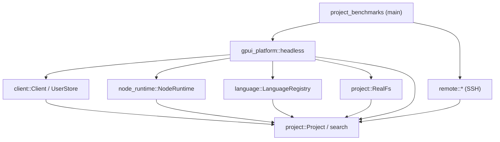
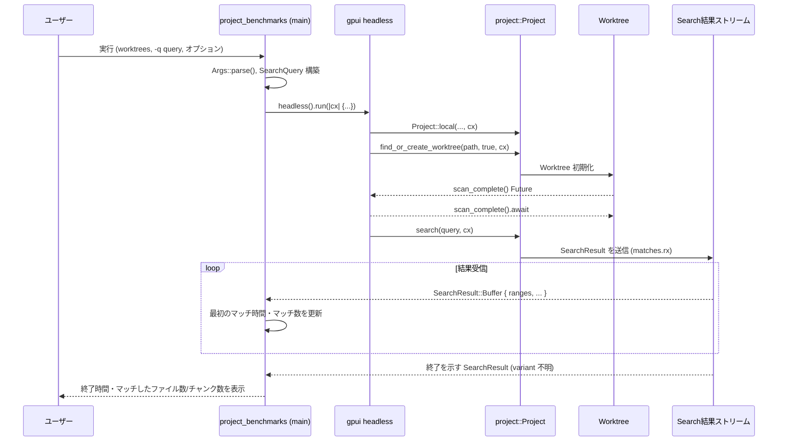

# project_benchmarks ディレクトリ解説

## 1. ざっくり一言

`project_benchmarks` は、Zed の `project` 機能（Project 全体検索）を CLI から叩いて、ローカル or SSH リモートのワークツリーに対して検索を実行し、検索速度やマッチ数を計測するためのベンチマーク用バイナリクレートです。

---

## 2. このモジュールの役割

### 2.1 概要

- このクレートは、**複数の worktree ディレクトリに対してテキスト/正規表現検索を行い、その性能を測る**ために存在します。
- Zed の内部クレート（`project`, `remote`, `client`, `node_runtime`, `language` など）を組み合わせて、GUI なしの **headless 環境で Project を初期化し、検索 API を直接呼び出す**構成になっています。
- ローカルのみでなく、`--ssh` オプションにより **SSH 経由のリモートプロジェクト**に対しても同様の検索ベンチマークを実行します。
- さらに、`--askpass` モードでは **SSH 認証用の askpass サーバ**として振る舞う補助モードも備えています。

### 2.2 アーキテクチャ内での位置づけ

このクレートは、ワークスペース内の複数クレートを束ねる「実行用の薄いラッパ」です。

- CLI からの入力を `clap` で解釈
- `gpui_platform::headless()` で headless アプリケーションコンテキストを構築
- `project::Project` をローカルまたはリモート（`remote` クレート）として生成
- `Project::search` で検索を開始し、`SearchResult` を受信してメトリクスを算出

依存関係の概要を Mermaid 図で示します（ノード名は概念レベルです）。



この図は、`project_benchmarks` がワークスペース内の「Project 検索スタック」を直接呼び出す位置にあることを示しています。

### 2.3 設計上のポイント

コードから読み取れる特徴を整理します。

- **責務の分割**
  - `main.rs` は CLI 解析、環境初期化、Project の構築と検索開始、結果の集計というフロー全体を管理します。
  - SSH に関わる UI 的な処理（パスワード問い合わせ・ステータス表示）は `BenchmarkRemoteClient`（`RemoteClientDelegate` 実装）に切り出されています。
- **状態管理**
  - 実際のアプリケーション状態（Project、Worktree、ユーザー情報など）は `gpui` の `AppContext` 管理下にあります。
  - `project` や `remote` のエンティティは `cx.update(...)` / `cx.new(...)` 経由で生成・操作されています。
- **非同期処理**
  - 検索処理やワークツリーの初期化は `cx.spawn(async move |cx| { ... })` 内で非同期に実行されます。
  - Worktree の初期化結果は `futures::future::join_all` でまとめて待機します。
  - 検索結果はチャネル（`matches.rx.recv().await`）から逐次受信しながら、最初のマッチ時間と総マッチ数をカウントします。
- **エラーハンドリング**
  - 多くの処理で `anyhow::Error` を返す `Result` を利用し、`?` 演算子で伝播しています。
  - 一部の処理（`remote::connect(...).await.unwrap()` や `unimplemented!()` のメソッド）は panic を起こしうるコードパスとして残されています。
- **テスト/ベンチマーク用の前提**
  - `http_client::FakeHttpClient::with_200_response()` を利用しており、HTTP 通信は実際には行われません。
  - `release_channel::init_test` を固定値で呼び出しており、リリースチャンネルやバージョンは「テスト用」の設定になっています。

---

## 3. 主要な機能一覧

このクレートが提供する主要な機能を列挙します。

- CLI 引数解析: `Args` 構造体と `clap::Parser` により、worktree パスや検索条件、SSH オプションを解析します。
- Askpass モード: `--askpass` 指定時に、SSH 認証用の askpass サーバとして動作します。
- 検索クエリ構築:
  - テキスト検索: `SearchQuery::text` による通常の文字列検索クエリの生成。
  - 正規表現検索: `SearchQuery::regex` による正規表現検索クエリの生成。
  - 大文字小文字、単語単位、gitignore 無視/無視しない等のオプションをサポート。
- Headless 環境初期化:
  - `gpui_platform::headless().run` で GUI なしのアプリケーションコンテキストを構築。
  - `release_channel` や `settings` の初期化、`Client`, `NodeRuntime`, `LanguageRegistry`, `RealFs` などの依存オブジェクトを生成。
- Project の構築:
  - ローカルプロジェクト: `Project::local` でローカルの worktree 群を扱う `Project` を生成。
  - SSH リモートプロジェクト: `Project::remote` と `remote::RemoteClient` を用いて SSH 経由のリモート project を生成。
- Worktree の初期化とインデックス構築:
  - `find_or_create_worktree` を使って指定された worktree それぞれを初期化。
  - ローカル worktree では `scan_complete()` を待ち、リモート worktree では 10 秒間待機することでスキャン完了を待ちます。
- 検索の実行とメトリクス出力:
  - `Project::search` で検索を開始し、`SearchResult` ストリームから結果を受信。
  - 最初のマッチまでの時間、検索完了までの時間、マッチしたファイル数とマッチチャンク数（`ranges.len()`）を標準出力に表示。

---

## 4. 関数・構造体の解説

### 4.1 型一覧

このファイル内で定義されている主要な型をまとめます。

| 名前                   | 種別     | 役割 / 用途 |
|------------------------|----------|-------------|
| `Args`                 | 構造体   | コマンドライン引数の定義。worktrees や検索クエリ、SSH / askpass オプションを受け取ります。 |
| `BenchmarkRemoteClient`| 構造体   | `remote::RemoteClientDelegate` の実装。SSH パスワードの問い合わせやステータス表示を担当します。 |

※ `SearchQuery` や `SearchResult` は `project` クレートからのインポートであり、このファイル内では定義されていません。

#### `Args` のフィールド概要

- `worktrees: Vec<String>`  
  検索対象とする worktree のパスのリスト（位置引数）。
- `query: Option<String>` (`-q`)  
  検索クエリ文字列。未指定の場合はエラーになります。
- `askpass: Option<String>` (`--askpass`)  
  値が指定されると askpass モードで起動し、そのソケットでパスワード問い合わせを受け付けます。
- `regex: bool` (`-r` / `--regex`)  
  正規表現検索を行うかどうか。
- `whole_word: bool` (`--whole-word`)  
  完全な単語単位でマッチさせるかどうか。
- `case_sensitive: bool` (`--case-sensitive`)  
  大文字小文字を区別するかどうか（デフォルト `false`）。
- `include_ignored: bool` (`--include-ignored`)  
  gitignore されたファイルも検索対象に含めるかどうか。
- `ssh: Option<String>` (`--ssh`)  
  SSH 接続先を表す文字列。具体的なフォーマットは `SshConnectionOptions::parse_command_line` に依存し、このファイルからは詳細不明です。

### 4.2 主要な関数・メソッドの詳細

#### `fn main() -> Result<(), anyhow::Error>`

**概要**

- ベンチマークバイナリのエントリポイントです。
- CLI 引数を解析し、必要に応じて askpass モードで終了するか、headless `gpui` コンテキストを起動して Project 検索ベンチマークを実行します。

**引数**

- なし（`std::env::args` から `Args::parse()` が内部的に取得します）。

**戻り値**

- `Ok(())`  
  正常終了。
- `Err(anyhow::Error)`  
  クエリ未指定など、各種エラーが発生した場合。

**内部処理の流れ**

1. `Args::parse()` で CLI 引数を解析し、`args` に格納します。
2. `args.askpass` が `Some(socket)` の場合:
   - `askpass::main(socket)` を呼び出し、askpass サーバとして動作。
   - その後すぐに `Ok(())` を返して終了します（Project 検索は行いません）。
3. `args.query` を取り出し、未指定 (`None`) の場合は `anyhow!("-q/--query is required")` でエラーを返して終了します。
4. `args.regex` フラグに応じて、`SearchQuery::regex(...)` または `SearchQuery::text(...)` を呼び出して `query: SearchQuery` を生成します。
   - `whole_word`, `case_sensitive`, `include_ignored` などの CLI オプションを引数として渡します。
   - ここでの `?` により、クエリ構築時のエラー（不正な正規表現など）は `anyhow::Error` として返されます。
5. `gpui_platform::headless().run(|cx| { ... })` を呼び出し、headless `gpui` アプリケーションを起動します。
   - `cx` はアプリケーションコンテキスト（`gpui::AppContext`）です。
6. `run` のクロージャ内で、以下を行います。
   - `release_channel::init_test` でテスト用のリリースチャンネルとバージョンを初期化。
   - `settings::init(cx)` で設定を初期化。
   - `Client::production(cx)` で API クライアントを生成。
   - `FakeHttpClient::with_200_response()` と `watch::channel` から `NodeRuntime` を構築。
   - `UserStore`, `LanguageRegistry`, `RealFs` を生成し、`Arc` で共有可能にします。
7. 続いて、`cx.spawn(async move |cx| { ... })` で非同期タスクを起動し、そこでベンチマーク本体を実行します（詳細は後述）。
8. `cx.spawn(...).detach_and_log_err(cx);` により、非同期タスクをデタッチし、エラーはログ出力されるようになります。
9. `gpui_platform::headless().run` が終了した後、`main` は `Ok(())` を返します。

**非同期タスク内の処理（ベンチマーク本体）**

このタスク内では、Project の生成から検索完了までを一括で行います。

1. **ローカル or SSH Project の生成**
   - `args.ssh` が `Some(ssh_target)` の場合:
     - `"Setting up SSH connection for ..."` を表示。
     - `SshConnectionOptions::parse_command_line(&ssh_target)?` で SSH オプションを解析。
     - `remote::RemoteConnectionOptions::from(ssh_connection_options)` でリモート接続オプションに変換。
     - `delegate = Arc::new(BenchmarkRemoteClient)` を生成。
     - `remote::connect(connection_options.clone(), delegate.clone(), cx).await.unwrap()` でリモート接続を確立。
       - `unwrap()` のため、接続失敗時は panic になります。
     - `oneshot::channel()` でチャネルを作成し、`remote::RemoteClient::new(...)` を `cx.update` から呼び出して `remote_client` を作成。
       - `Ok(None)` が返された場合は `anyhow!("ssh initialization returned None")` としてエラー扱い。
     - 最後に `Project::remote(remote_client, client, node, user_store, registry, fs, false, cx)` でリモート Project を生成。
   - `args.ssh` が `None` の場合:
     - `"Setting up local project"` を表示。
     - `Project::local(...)` を `cx.update` 経由で呼び出し、ローカル Project を生成。
2. **Worktree の生成とスキャン完了待ち**
   - `"Loading worktrees"` を表示。
   - `project.update(cx, |this, cx| { ... })` 内で
     - `args.worktrees.into_iter().map(|worktree| this.find_or_create_worktree(worktree, true, cx))` により、各 worktree について非同期な初期化処理を生成。
   - その結果のベクタに対して `futures::future::join_all(worktrees).await` を行い、すべての worktree 初期化の完了を待機。
   - `.collect::<Result<Vec<_>, anyhow::Error>>()?` により、いずれかの worktree 初期化がエラーを返した場合には `anyhow::Error` として伝播します。
   - 各 `(worktree, _)` に対して
     - `worktree.update(cx, |this, _| { ... })` で `local.scan_complete()` を呼び出せるか確認。
     - ローカル worktree (`as_local().is_some()`) なら `scan_complete().await` を待機。
     - リモート worktree の場合は `cx.background_executor().timer(Duration::from_secs(10)).await` で 10 秒間待機。
3. **検索の実行**
   - `"Worktrees loaded"` を表示。
   - `"Starting a project search"` を表示。
   - `timer = std::time::Instant::now()` で計測を開始。
   - `matches = project.update(cx, |this, cx| this.search(query, cx));` で検索を開始し、結果受信用の構造（`matches`）を取得。
   - `matched_files`, `matched_chunks` を 0 に初期化。
   - `while let Ok(match_result) = matches.rx.recv().await { ... }` ループで検索結果を逐次受信。
     - 最初の `match_result` 受信時には `first_match` をセットし、`"First match found after {time:?}"` を表示。
     - `SearchResult::Buffer { ranges, .. }` の場合:
       - `matched_files += 1`。
       - `matched_chunks += ranges.len()`。
     - それ以外の variant（終了など）の場合は `break` でループを抜けます。
4. **結果の出力と終了処理**
   - `elapsed = timer.elapsed()` を計測し、`"Finished project search after {elapsed:?}. Matched {matched_files} files and {matched_chunks} excerpts"` を表示。
   - `drop(project);` で Project のハンドルを解放。
   - `cx.update(|cx| cx.quit());` を呼び出し、`gpui` アプリケーションを終了させます。
   - `anyhow::Ok(())` を返してタスクを終了。

**Errors / Panics**

- `args.query` が指定されていない場合: `Err(anyhow!("-q/--query is required"))` を返します。
- 正規表現が不正な場合など、`SearchQuery::text` / `regex` が `Err` を返した場合: そのまま `anyhow::Error` として伝播します。
- `SshConnectionOptions::parse_command_line` や `RemoteClient::new` など、`?` を通じて `anyhow::Error` が発生しうる箇所が複数あります。
- `remote::connect(...).await.unwrap()`:
  - リモート接続が `Err` の場合に panic します。
- `BenchmarkRemoteClient` の `get_download_url` / `download_server_binary_locally`:
  - 呼ばれた場合は `unimplemented!()` により panic します。

**Edge cases（エッジケース）**

- `worktrees` が空の場合:
  - `find_or_create_worktree` のループは空になり、`join_all` も空のベクタを返します。
  - その後も `Project::search` は呼び出されますが、実際にどのような `SearchResult` が流れるかは `Project` 実装に依存し、このファイルからは分かりません。
- `--ssh` 指定時で、リモート側の設定によって `get_download_url` や `download_server_binary_locally` が必要になる場合:
  - それらが呼ばれると `unimplemented!()` により panic します。
  - 実際に呼ばれるかどうかは `remote` クレート内の実装次第です。
- リモート worktree のスキャン:
  - `scan_complete()` はローカル worktree にしか呼ばれず、リモート worktree は 1 つあたり固定で 10 秒待つだけです。
  - スキャンに 10 秒以上かかる場合、検索開始時点でスキャンが完了していない可能性があります。

**使用上の注意点**

- `--query` (`-q`) は必須です。未指定では即エラーで終了します。
- `--ssh` を利用する場合、
  - 実行環境に TTY があり、`rpassword::prompt_password` によるパスワード入力が可能であることが前提です。
  - リモート接続失敗時には panic する可能性がある（`unwrap` 部分）ため、ベンチマーク実行時には安定した SSH 接続先を用意する必要があります。
- `BenchmarkRemoteClient` の未実装メソッドに依存するパスに入ると panic します。そのようなパスに入るかどうかは、このチャンクのコードからは判断できません。

---

#### `impl RemoteClientDelegate for BenchmarkRemoteClient::ask_password`

```rust
fn ask_password(
    &self,
    prompt: String,
    tx: oneshot::Sender<EncryptedPassword>,
    _cx: &mut gpui::AsyncApp,
)
```

**概要**

- SSH 接続時にパスワードが必要になった場合に呼び出されるコールバックです。
- 標準エラーにプロンプトを表示し、`rpassword::prompt_password` で対話的にパスワードを取得し、`EncryptedPassword` に変換してチャネルで返します。

**引数**

| 引数名  | 型                                     | 説明 |
|---------|----------------------------------------|------|
| `prompt` | `String`                              | ユーザーに表示するパスワード入力プロンプト文字列。 |
| `tx`    | `oneshot::Sender<EncryptedPassword>`  | 暗号化済みパスワードを返すための one-shot チャネル。 |
| `_cx`   | `&mut gpui::AsyncApp`                 | 非同期アプリケーションコンテキスト（この実装では未使用）。 |

**戻り値**

- なし（`()`）。エラーは標準エラー出力へのメッセージとしてのみ扱われます。

**処理の流れ**

1. `eprintln!("SSH asking for password: {}", prompt);` でプロンプトを標準エラーに表示。
2. `rpassword::prompt_password(&prompt)` でユーザーからパスワードを TTY 経由で読み取る。
3. 読み取りに成功した場合:
   - `EncryptedPassword::try_from(password.as_ref())` で暗号化済みパスワードに変換。
   - 変換成功時:
     - `tx.send(encrypted)` を試み、失敗した場合は `"Failed to send password"` を `eprintln!` で出力。
   - 変換失敗時:
     - `"Failed to encrypt password: {e}"` を `eprintln!` で出力。
4. 読み取りに失敗した場合:
   - `"Failed to read password: {e}"` を `eprintln!` で出力。

**Edge cases**

- TTY がない環境（非対話的なシェル等）では `rpassword::prompt_password` がエラーになる可能性があります。
- チャネル `tx` の受信側がすでにドロップされている場合:
  - `tx.send` が `Err` を返し、その旨が `eprintln!` で出力されます。

**使用上の注意点**

- この実装ではエラーが `Result` として返されず、単に `eprintln!` されるだけなので、呼び出し側がエラー原因をプログラム的に区別することはできません（呼び出し側の挙動は `remote` クレート側の実装に依存します）。
- パスワードは `EncryptedPassword` に変換された上で送られます。生パスワードはこの関数内のローカル変数としてのみ保持されます。

---

#### `impl RemoteClientDelegate for BenchmarkRemoteClient::set_status`

```rust
fn set_status(&self, status: Option<&str>, _: &mut gpui::AsyncApp)
```

**概要**

- SSH 接続やリモート操作の進捗・状態を表示するためのコールバックです。
- 渡された `status` を標準出力に表示するのみのシンプルな実装です。

**引数**

| 引数名  | 型               | 説明 |
|---------|------------------|------|
| `status` | `Option<&str>`  | 表示するステータス文字列。`None` の場合は何も表示しません。 |
| `_`     | `&mut gpui::AsyncApp` | アプリケーションコンテキスト（この実装では未使用）。 |

**処理の流れ**

1. `status` が `Some(status)` のとき、`println!("SSH status: {status}");` を実行します。
2. `None` の場合は何もしません。

**Edge cases / 使用上の注意点**

- ステータス表示は標準出力に行われます。ログとの混在を避けたい場合は実行環境側で標準出力/標準エラーの扱いを調整する必要があります。

---

### 4.3 その他のメソッド（簡略）

`BenchmarkRemoteClient` には以下のメソッドも実装されていますが、どちらも `unimplemented!()` であり、呼び出されると panic します。

| 関数名 | 役割（1 行） |
|--------|--------------|
| `get_download_url` | リモートプラットフォーム・リリースチャンネル・バージョンに応じたサーババイナリのダウンロード URL を返す想定ですが、このコードでは未実装です。 |
| `download_server_binary_locally` | リモートサーババイナリをローカルにダウンロードする想定ですが、このコードでは未実装です。 |

これらが実際に呼ばれるかどうか、およびいつ呼ばれるのかは `remote` クレートの実装に依存し、このチャンクのコードからは判断できません。

---

## 5. データフロー

ここでは、代表的なシナリオとして「ローカル worktree に対する検索ベンチマーク」のデータフローを示します。

1. ユーザーが CLI から `project_benchmarks` を実行し、worktree パスと検索クエリを指定します。
2. `main` が CLI 引数を解析し、`SearchQuery` を生成します。
3. `gpui_platform::headless().run` を介して headless `gpui` コンテキストが立ち上がります。
4. 非同期タスク内で `Project::local` が呼ばれ、Project と Worktree が構築されます。
5. 各 Worktree のスキャン完了を待った後、`Project::search` が開始されます。
6. 検索結果（`SearchResult`）がチャネルで `project_benchmarks` に送られ、時間とマッチ数が集計されます。

Mermaid のシーケンス図で表すと以下のようになります。



リモート (`--ssh`) の場合も概ね同様ですが、Project の生成の前に `remote::connect` で SSH 接続および `RemoteClient` の生成が挟まります。

---

## 6. 使い方（How to Use）

### 6.1 基本的な使用方法

このクレートはバイナリクレートとして設計されているため、基本的な利用方法は CLI から実行する形になります。

#### ローカル worktree に対する検索

```bash
# 例: ./repo1 と ./repo2 という 2 つの worktree に対して
# "foo" という文字列を検索する（大文字小文字無視、正規表現ではない）
cargo run -p project_benchmarks -- ./repo1 ./repo2 -q foo
```

このコマンドを実行すると、プログラムは以下のような流れで動作します。

1. `./repo1`, `./repo2` を worktree として `Project::local` に登録。
2. 各 worktree のスキャンが完了するまで待機。
3. `"foo"` にマッチする箇所をプロジェクト全体から検索。
4. 最初のマッチが見つかるまでの時間と、検索完了までの時間を標準出力に表示。
5. マッチしたファイル数とマッチチャンク数（`ranges` の総数）を表示。

#### 正規表現検索

```bash
# 正規表現 "foo.*bar" で検索し、gitignore されたファイルも含める
cargo run -p project_benchmarks -- ./repo -q 'foo.*bar' --regex --include-ignored
```

ここでは `SearchQuery::regex` が利用され、不正な正規表現の場合はエラーで終了します。

### 6.2 よくある使用パターン

#### 1. 単一 worktree のベンチマーク

```bash
#1 つのリポジトリに対して簡易ベンチマーク
cargo run -p project_benchmarks -- /path/to/repo -q 'TODO'
```

- 単一の大規模リポジトリの検索性能を確認するのに向いています。
- `TODO` のように多数ヒットが想定されるクエリを使うと、マッチ数の多いケースを測れます。

#### 2. 複数 worktree の比較

```bash
# 2 つの worktree（例えば異なるブランチ）をまとめて検索
cargo run -p project_benchmarks -- ./repo-main ./repo-feature -q 'my_symbol'
```

- 同じクエリに対して複数の worktree を一度に検索することで、インデックス状態や構成の違いが性能に与える影響を測定できます。

#### 3. SSH リモート環境のベンチマーク

```bash
# SSH 経由の worktree に対して検索（ssh_target の形式は parse_command_line に依存）
cargo run -p project_benchmarks -- /remote/worktree -q 'pattern' --ssh 'user@example.com:/path/to/project'
```

- この例の `ssh` 引数の具体的なフォーマットは `SshConnectionOptions::parse_command_line` に依存し、このコードだけからは正確には分かりません。
- 実行時には
  - `Setting up SSH connection for ...`
  - `SSH status: ...`
  といったログが表示され、必要に応じてパスワードプロンプト（`ask_password`）が表示されます。

#### 4. askpass モード（SSH 認証補助）

```bash
# askpass ソケットを指定して askpass モードで起動
project_benchmarks --askpass /path/to/socket
```

- このモードでは Project 検索は行われず、`askpass::main(socket)` が呼ばれるのみです。
- `askpass::main` の挙動は `askpass` クレートの実装に依存し、このチャンクからは詳細不明です。

### 6.3 使用上の注意点（まとめ）

- **`--query` の必須性**
  - `-q` / `--query` が指定されていないと `"-q/--query is required"` というエラーで即座に終了します。
- **正規表現の妥当性**
  - `--regex` を指定した場合、不正な正規表現は `SearchQuery::regex` でエラーになります。
  - エラーメッセージは `anyhow::Error` として出力されます（どのようにユーザーに見えるかは呼び出し方・ロガー設定によります）。
- **リモート接続時の panic の可能性**
  - `remote::connect(...).await.unwrap()` によって、接続失敗が panic に直結する設計になっています。
  - ベンチマーク用途で利用する場合は、あらかじめ接続確認済みの環境で実行することが前提になります。
- **リモート用 Delegate の未実装メソッド**
  - `BenchmarkRemoteClient` の `get_download_url` / `download_server_binary_locally` は `unimplemented!()` です。
  - これらが呼ばれるコードパスに入ると panic します。実際に呼ばれるかどうかは `remote` クレート側の実装に依存します。
- **TTY 依存のパスワード入力**
  - `ask_password` は `rpassword::prompt_password` を使用しているため、TTY がない環境ではパスワード入力に失敗する可能性があります。
- **Worktree スキャン待ち**
  - ローカル worktree は `scan_complete()` を明示的に待ちます。
  - リモート worktree は一律 10 秒の待機のみであり、より長いスキャン時間が必要な場合、インデックスが不完全な状態で検索が開始される可能性があります。
- **依存クレートの初期化順序**
  - `release_channel::init_test` → `settings::init` → `Client` → `NodeRuntime` → `Project` → `Worktree` という順で初期化されます。
  - これらの前提が崩れるような変更（例: `settings::init` を省略する等）を行うと、`Project` 側で期待されている前提（設定値の存在など）が失われる可能性があります。

---

## 7. 関連ファイル

このクレートおよびその依存と密接に関係するファイル・ディレクトリをまとめます。パスはワークスペース構成に依存し、このチャンクから正確なディレクトリは分かりませんが、概念的な関係を示します。

| パス / クレート名               | 役割 / 関係 |
|---------------------------------|------------|
| `project_benchmarks/Cargo.toml` | 本クレートのマニフェスト。`project`, `remote`, `client`, `node_runtime` などへの依存関係が定義されています。 |
| `project_benchmarks/src/main.rs` | 本レポートで説明したエントリポイントとベンチマークロジックを含むファイルです。 |
| クレート `project`             | `Project`, `RealFs`, `LocalProjectFlags`, `search::SearchQuery`, `search::SearchResult` などを提供し、プロジェクトおよび検索の中核的なロジックを担います。 |
| クレート `remote`              | `RemoteClientDelegate`, `SshConnectionOptions`, `RemoteConnectionOptions`, `RemoteClient`, `RemotePlatform` などを提供し、SSH 経由のリモート接続を扱います。 |
| クレート `client`              | `Client` および `UserStore` を提供し、ユーザー情報やバックエンドとの通信を抽象化します（詳細はこのチャンクからは不明です）。 |
| クレート `node_runtime`        | `NodeRuntime` を提供し、HTTP クライアントやウォッチチャンネルと連携して Node ベースの処理を実行します。 |
| クレート `language`            | `LanguageRegistry` を提供し、言語ごとの情報（シンタックスなど）を管理します。 |
| クレート `http_client`         | `FakeHttpClient` を提供し、HTTP 通信をモックするために利用されています。 |
| クレート `watch`               | `watch::channel` を提供し、`NodeRuntime` などが状態変化を監視するために使用します。 |
| クレート `askpass`             | `askpass::main` および `EncryptedPassword` を提供し、SSH 認証用の askpass 機構を担当します。 |
| クレート `settings` / `release_channel` | アプリケーション設定およびリリースチャンネルの管理を行い、`main` から初期化されます。 |

これらのクレートの内部実装については、このチャンクには含まれていないため詳細は不明ですが、`project_benchmarks` はそれらを組み合わせることで、Zed の Project 検索機構を CLI ベンチマークとして利用可能な形にまとめています。
