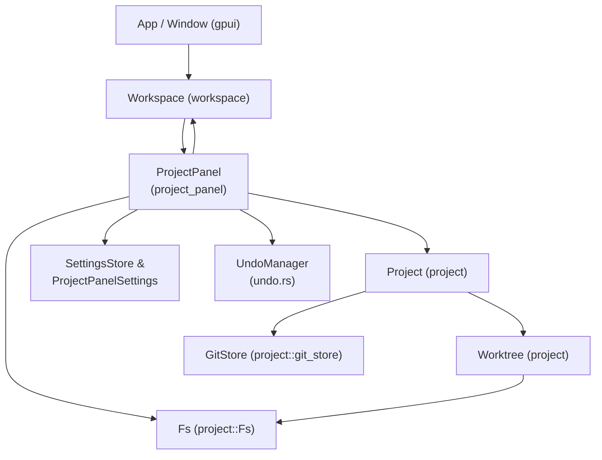
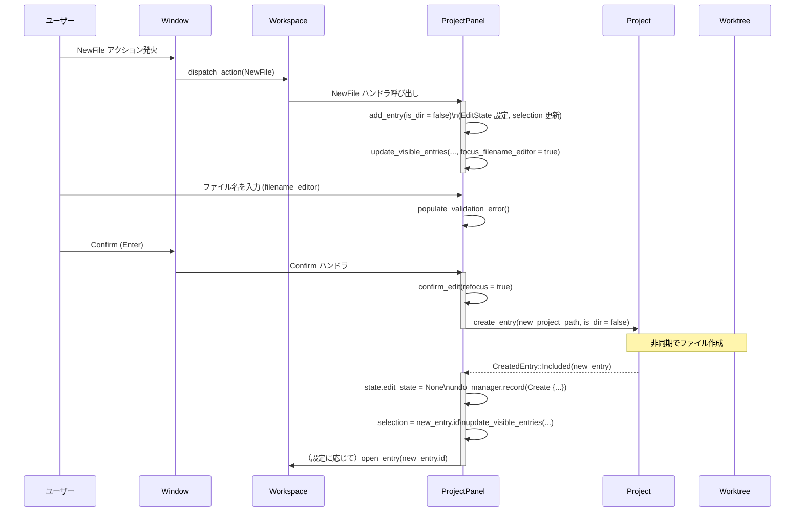

## 1. ざっくり一言

`project_panel` クレートは、Zed の「プロジェクトパネル」（ファイルツリー）を実装するモジュール群です。  
プロジェクトのワークツリーをツリー表示し、開閉・検索・Git ステータス・診断表示・ドラッグ＆ドロップ・コピー/移動/削除・Undo など、ファイル操作用の UI をまとめて提供します。

---

## 2. このモジュールの役割

### 2.1 概要

- このディレクトリは **ワークスペース内のプロジェクトツリーを表示・操作するパネル** を実装します。
- 主な機能は:
  - `Project` / `Worktree` のエントリをツリー表示し、展開/折り畳み・自動折り畳み（auto_fold_dirs）を行うこと
  - ファイル・ディレクトリの新規作成、名前変更、削除、検索、Git 操作（履歴表示・復元）などのパネルアクションを提供すること
  - Git ステータスや診断結果（エラー・警告）をツリー上に表示すること
  - クリップボードやドラッグ＆ドロップを利用したコピー/移動や、Undo による操作の取り消しを行うこと

### 2.2 アーキテクチャ内での位置づけ

このクレートは Zed 全体の中で、`workspace` / `project` / `gpui` / `ui` などのレイヤの上に乗る「パネル UI コンポーネント」として動作します。



- `Workspace` から `ProjectPanel::new` / `ProjectPanel::load` でパネルが作られます。
- `ProjectPanel` は `Project` / `Worktree` / `GitStore` からファイルツリーと Git/診断情報を取得し、`gpui` / `ui` を使って描画します。
- `ProjectPanelSettings` と `SettingsStore` は、表示や挙動（アイコン、スクロール、auto_fold_dirs など）を制御します。
- `UndoManager`（`undo.rs`）は、作成・リネーム・移動などのファイル操作を「やり直し」できるように記録します（詳細な実装はこのチャンクには含まれていません）。
- `Fs` はリモート/ローカルを問わず実ファイルシステム操作を抽象化したものです。

### 2.3 設計上のポイント

コードから読み取れる特徴を列挙します。

- **UI コンポーネントとしての自己完結**
  - `ProjectPanel` は `Render` / `Panel` / `Focusable` / `EventEmitter` を実装し、パネル UI とキーバインドの両方をカプセル化しています。
  - `Workspace` からは主に `Panel` トレイト経由で扱われます。

- **非同期・差分更新を前提とした状態管理**
  - `State` が展開ディレクトリ、可視エントリ、編集状態（`EditState`）、自動折り畳み状態などを保持します。
  - `update_visible_entries` は `gpui` のバックグラウンドエグゼキュータ上で走り、新しい `State` を計算してから一括置き換えする構造になっています。

- **ディレクトリ自動折り畳み（auto_fold_dirs）**
  - 子にディレクトリを一つだけ持つディレクトリ列を、一行にまとめて表示する仕組みがあります。
  - `FoldedAncestors` と `ancestors: HashMap<ProjectEntryId, FoldedAncestors>` による深さ・アクティブコンポーネントの管理で、「フォルダ/サブフォルダ/ファイル名」をパスコンポーネント単位で操作できるようになっています。

- **豊富な UI 状態**
  - 選択中エントリ、複数マークされたエントリ、診断数、Git ステータス、sticky 行、ドラッグ中のハイライト状態など、多くの UI 状態を一箇所（`EntryDetails`）に集約しています。
  - 名前編集中は「エディタ行」「処理中行」を差し込むことで、実ファイル作成と UI を非同期に同期させています。

- **Undo 対応**
  - ファイル操作（新規作成、リネーム、コピー/移動など）ごとに `ProjectPanelOperation` を生成し、`UndoManager` に記録しています。
  - Undo によって `Project` 側の状態を巻き戻せるようになっており、複数エントリの一括操作はバッチとして記録されます。

- **プラットフォーム・接続形態ごとの条件分岐**
  - リモートプロジェクト（SSH/コラボ）かローカルかによって、「Trash」メニューを隠す、システムファイルマネージャ/ターミナルを開くかどうかを分岐しています。
  - Windows ではパス末尾の `.` / `\` の扱いを特別に処理しています。

---

## 3. 主要な機能一覧

このディレクトリ全体で提供される主要機能を簡潔にまとめます。

- **プロジェクトツリー表示**
  - 複数ワークツリーを 1 つのパネルに並べて表示
  - ディレクトリの展開/折り畳み、ルート表示の ON/OFF（`hide_root`）

- **自動ディレクトリ折り畳み（auto_fold_dirs）**
  - 子に 1 つだけディレクトリを持つディレクトリ列を 1 行にまとめて表示し、パスコンポーネントごとにクリック/ドラッグ対象にできます。

- **ファイル操作**
  - 新規ファイル・ディレクトリ作成（`NewFile` / `NewDirectory`）
  - リネーム（`Rename`）
  - 削除/Trash（`Delete` / `Trash`）
  - プロジェクトからの除外（`RemoveFromProject`）

- **コピー/移動・ドラッグ＆ドロップ**
  - Cut/Copy/Paste（パネル内およびワークツリー間）
  - 外部パス（OS からのドラッグ＆ドロップ）をプロジェクトにコピー
  - ドラッグ先によるディレクトリ展開、背景ドロップによるルートへの移動

- **Undo**
  - ファイル作成・ディレクトリ作成・リネーム・ドラッグ/切り取り貼り付けの Undo（`Undo` アクション）

- **Git / 診断統合**
  - Git ステータスアイコン/インジケータ（新規・変更・削除・衝突など）
  - ファイル/ディレクトリごとの診断（エラー/警告）バッジ・色
  - 次/前の Git 変更エントリ・診断エントリジャンプ

- **検索・ツール連携**
  - ディレクトリ内検索の開始（`NewSearchInDirectory`）
  - Git ファイル履歴ビューの起動（`git::FileHistory`）
  - diff ビュー（`CompareMarkedFiles`）による 2 ファイル比較

- **表示設定・スクロール**
  - インデントガイド、sticky スクロール、スクロールバー表示制御
  - ディレクトリ/ファイル順序の切り替え（`ProjectPanelSortMode`）
  - 水平スクロールの有無、アイコン表示など

- **ベンチマーク**
  - Linux リポジトリスナップショットを用いたソート処理ベンチ（`benches/sorting.rs`）

---

## 4. 関数・構造体の解説

### 4.1 主要な型一覧

公開・内部を含め、理解に重要な型の一覧です。

| 名前 | 種別 | 公開範囲 | 役割 / 用途 |
|------|------|----------|-------------|
| `ProjectPanel` | 構造体 | crate 内公開（`Panel` 実装） | プロジェクトパネル本体。UI 状態・描画・イベント処理をすべて担います。 |
| `State` | 構造体 | モジュール内 | 展開ディレクトリ、可視エントリ、編集状態、自動折り畳み状態など、パネル内部の派生状態を保持します。 |
| `VisibleEntriesForWorktree` | 構造体 | モジュール内 | 1 ワークツリー分の `Vec<GitEntry>` とパスインデックスを保持し、描画/探索を効率化します。 |
| `FoldedAncestors` | 構造体 | モジュール内 | auto_fold_dirs で折り畳まれたディレクトリ列の情報（祖先 ID リストと現在の深さ）を持ちます。 |
| `EditState` | 構造体 | モジュール内 | 新規作成/リネーム中の状態（対象エントリ、ディレクトリかどうか、検証状態など）を表現します。 |
| `ValidationState` | enum | モジュール内 | 名前編集時の検証結果（なし/警告/エラーとメッセージ）を保持します。 |
| `ClipboardEntry` | enum | モジュール内 | パネル内クリップボード（Cut または Copied と BTreeSet<SelectedEntry>）を表します。 |
| `DiagnosticCount` | 構造体 | モジュール内 | エラー・警告数を保持し、バッジ表示用の「99+」表記を生成します。 |
| `EntryDetails` | 構造体 | モジュール内 | 1 行分の描画情報（ファイル名、アイコン、インデント、色、ステータスなど）をまとめた UI 用データです。 |
| `StickyDetails` | 構造体 | モジュール内 | sticky 行（スクロール時に上部に固定される親ディレクトリ）の情報を保持します。 |
| `ProjectPanelSettings` | 構造体 | `project_panel_settings.rs` / `RegisterSetting` | プロジェクトパネルのユーザ設定（アイコン表示、ソートモード、スクロールバー設定など）をまとめた構成体です。 |
| `IndentGuidesSettings` | 構造体 | 公開 | インデントガイドの表示設定（`ShowIndentGuides`）をラップします。 |
| `ScrollbarSettings` | 構造体 | 公開 | スクロールバー表示タイミングと水平スクロールの有無を設定します。 |
| `AutoOpenSettings` | 構造体 | 公開 | 新規作成・ペースト・ドロップ時に自動でファイルを開くかどうかの設定です。 |
| `ProjectPanelScrollbarProxy` | 構造体 | crate 内 | `ScrollbarVisibility` を実装し、エディタと同様/個別のスクロールバー設定を統合します。 |
| `Event` | enum | モジュール内（`EventEmitter<Event>` 実装） | パネル内部からワークスペース等に通知されるイベント（ファイルを開いた、分割して開いた、など）です。 |
| `StickyProjectPanelCandidate` | 構造体 | モジュール内 | sticky スクロール対象候補（インデント深さと行インデックス）を表します。 |
| `UndoManager`, `ProjectPanelOperation` | 構造体/enum | `src/undo.rs`（このチャンク外） | ファイル操作の Undo を管理します。コードはこのチャンクに含まれていませんが、Create/Rename 操作を記録していることが呼び出し側から分かります。 |

### 4.2 重要な関数の詳細

ここでは特に重要な 7 つ（※1）の関数/メソッドを取り上げます。

> ※1 うち 2 つは密接に関連するソート関数をまとめて 1 件として扱います。

---

#### `init(cx: &mut App)`

**概要**

- `App` 初期化時に呼び出され、`Workspace` が生成されるたびにプロジェクトパネル関連のアクションを登録します。
- キーボードショートカットやコマンドパレットから `ToggleFocus` / `Toggle` / `Rename` / `Duplicate` / `Delete` / `FileHistory` などのアクションを実行できるようにします。

**引数**

| 引数名 | 型 | 説明 |
|--------|----|------|
| `cx` | `&mut App` | アプリケーション全体のコンテキスト。`Workspace` 生成の監視やグローバル設定へのアクセスに使用します。 |

**戻り値**

- なし（副作用としてオブザーバ・ハンドラを登録します）。

**内部処理の流れ**

1. `cx.observe_new(|workspace: &mut Workspace, _, _| { ... })` で、新しい `Workspace` が作られたタイミングを監視します。
2. その中で、`workspace.register_action` を使って多数のアクションハンドラを登録します。
   - `ToggleFocus` / `Toggle` : パネルのフォーカスや表示状態をトグル。
   - `ToggleHideGitIgnore` / `ToggleHideHidden` : `settings::update_settings_file` 経由で設定ファイルを書き換え、パネル表示を更新。
   - `Rename` / `Duplicate` / `Delete` : パネルを開き、該当メソッドを呼び出す。
   - `CollapseAllEntries` など、パネルの状態を更新するアクション。
3. `git::FileHistory` アクションについては:
   - まず、パネルがフォーカスされていればパネルの選択エントリから `ProjectPath` を求める。
   - 取得できなければ、アクティブエディタのファイルパスから `ProjectPath` を求める。
   - 対応するリポジトリが見つかれば `git_ui::file_history_view::FileHistoryView::open` を呼び出します。
4. リモートプロジェクトの場合、`Trash` アクションをコマンドパレットから隠します（`CommandPaletteFilter::update_global`）。

**Examples（使用例）**

アプリケーションのセットアップコードから:

```rust
fn main() {
    gpui::App::run(|mut app| {
        // プロジェクトパネルのアクション・パネル登録を行う      // ProjectPanel 用の初期化
        project_panel::init(&mut app);                              // Workspace ごとにアクションが登録される

        // 他の各種パネル・機能の初期化...                       // 他のモジュールの init もここで呼ぶ
    });
}
```

**Edge cases（エッジケース）**

- リモートホスト上のプロジェクトでは Trash 機能が非対応のため、`Trash` アクションはコマンドパレットから隠れるようになっています。
- アクション実行時にパネルが存在しない場合は、必要に応じてパネルを開く（例: `Rename`）か、何もしないようになっています。

**使用上の注意点**

- `init` はアプリ起動時に 1 度だけ呼ぶ前提の設計です。同じ `App` に対して複数回呼ぶと、アクションが重複登録される可能性があります。
- `Workspace` 側の実装（`toggle_panel_focus` など）に依存しているため、Zed のワークスペース環境以外で単独に使うことは想定されていません。

---

#### `ProjectPanel::new(workspace: &mut Workspace, window: &mut Window, cx: &mut Context<Workspace>) -> Entity<Self>`

**概要**

- 指定された `Workspace` / `Window` 上に新しい `ProjectPanel` インスタンスを作成し、各種イベント購読や初期状態の構築を行います。
- 実際の `Entity<ProjectPanel>` を返し、その後 `Workspace::add_panel` などから利用されます。

**引数**

| 引数名 | 型 | 説明 |
|--------|----|------|
| `workspace` | `&mut Workspace` | パネルが属するワークスペース。`Project` や `app_state().fs` へのハンドルを取得します。 |
| `window` | `&mut Window` | パネルを表示するウィンドウ。フォーカスやイベントループに使用します。 |
| `cx` | `&mut Context<Workspace>` | `Workspace` に紐づく UI コンテキスト。`cx.new` や `subscribe_in` に利用します。 |

**戻り値**

- `Entity<ProjectPanel>` : `gpui` のエンティティ ID を持つパネルインスタンス。

**内部処理の流れ（概要）**

1. `project`, `git_store`, `path_style`, `fs`, `workspace.weak_handle()` など、必要な依存オブジェクトを取得します。
2. `cx.new` で `ProjectPanel` 本体を作成し、その中で:
   - フォーカスハンドルを作り、フォーカス時に `focus_in` を呼ぶよう設定。
   - GitStore と Project のイベント (`GitStoreEvent`, `project::Event`) を購読し、ステータス変更・ワークツリー更新などに応じて `update_visible_entries` や `update_diagnostics` を実行。
   - ファイル名入力用 `Editor` (`filename_editor`) を生成し、その `EditorEvent` を購読してバリデーション・自動スクロール・フォーカス喪失時の confirm/cancel を処理。
   - `SettingsStore` と `FileIcons` のグローバルを監視し、設定変更に応じて再描画/再計算。
   - `UniformListScrollHandle` を初期化し、リストスクロールの状態を追跡。
   - `UndoManager::new(workspace.weak_handle())` を作成し、Undo 機能を有効化。
   - 初回の `update_visible_entries(None, false, false, window, cx)` を呼び出して、ツリーの初期表示を計算。
3. 生成した `project_panel` `Entity` に対して、`Event`（`OpenedEntry` / `SplitEntry`）のリスナを登録し、ファイルを実際に開く処理を `Workspace` に委譲します。

**Examples（使用例）**

テストコードに近い最小例:

```rust
// プロジェクトとワークスペースを作成                           // テスト用の Project と MultiWorkspace を生成
let project = Project::test(fs.clone(), ["/root".as_ref()], cx).await;
let window = cx.add_window(|window, cx| MultiWorkspace::test_new(project.clone(), window, cx));
let workspace = window.read_with(cx, |mw, _| mw.workspace().clone()).unwrap();

// ProjectPanel をこの Workspace/Window 上に作成                 // Workspace 内に ProjectPanel を作る
let panel: Entity<ProjectPanel> = workspace.update_in(cx, ProjectPanel::new);
```

**Edge cases**

- プロジェクトがリモートの場合、コンテキストメニューから Trash アクションを除外する処理が含まれます。
- 設定（`ProjectPanelSettings`）が変化した際に、表示・ソートモード・sticky スクロールなどを自動的に反映するよう購読を登録します。

**使用上の注意点**

- `ProjectPanel::new` は `Workspace` の UI スレッドコンテキスト内（`update_in` 等）で呼び出す必要があります。  
  非同期コンテキストから作りたい場合は `ProjectPanel::load`（async）を利用します。
- 生成後に `workspace.add_panel(panel.clone(), window, cx)` を呼び出して実際にドックパネルとして登録するパターンがテスト内にあります。

---

#### `ProjectPanel::update_visible_entries(&mut self, new_selected_entry: Option<(WorktreeId, ProjectEntryId)>, focus_filename_editor: bool, autoscroll: bool, window: &mut Window, cx: &mut Context<Self>)`

**概要**

- 現在の `Project` / 設定 / 編集状態から、パネルに表示すべきエントリ一覧や折り畳み情報を再計算し、`State` を更新します。
- Git スナップショット・ファイルスキャン結果を基に `GitEntry` のリストを組み立て、自動折り畳み・フィルタリング・ソートを行います。

**引数**

| 引数名 | 型 | 説明 |
|--------|----|------|
| `new_selected_entry` | `Option<(WorktreeId, ProjectEntryId)>` | 再計算後に選択状態として設定したいエントリ（任意）。 |
| `focus_filename_editor` | `bool` | 再計算完了後にファイル名エディタへフォーカスを当てるかどうか。 |
| `autoscroll` | `bool` | 再計算完了後に選択エントリが中央付近に来るよう自動スクロールするかどうか。 |
| `window` | `&mut Window` | スクロール・フォーカス更新用。 |
| `cx` | `&mut Context<Self>` | `ProjectPanel` の UI コンテキスト。 |

**戻り値**

- なし（`self.state` と内部の `UpdateVisibleEntriesTask` を更新します）。

**内部処理の流れ（簡略版）**

1. `ProjectPanelSettings` から `auto_fold_dirs`, `hide_gitignore`, `hide_root`, `hide_hidden`, `sort_mode` を取得します。
2. 現在の `State` から `ancestors` / `expanded_dir_ids` / `unfolded_dir_ids` をコピーし、新しい `State` を `State::derive` で初期化します。
3. `Project::visible_worktrees` から各ワークツリーのスナップショットを取得します。
4. `cx.spawn_in(window, async move |this, cx| { ... })` 内でバックグラウンドタスクを起動し、その中で:
   - 各ワークツリーごとに `GitTraversal` でエントリを列挙。
   - auto_fold_dirs が有効な場合、単一子ディレクトリチェーンを検出して `FoldedAncestors` を構築し、葉エントリの表示パスと深さを調整。
   - `hide_gitignore` / `hide_hidden` / `hide_root` 設定に従ってエントリをスキップ。
   - 新規作成中のプレースホルダ（`NEW_ENTRY_ID`）があれば、対応する位置に `create_new_git_entry` で差し込み。
   - 各エントリの表示幅（インデント深度＋文字数＋シンボリックリンク有無）から `max_width_item_index` を推定。
   - `sort_worktree_entries_with_mode` / `par_sort_worktree_entries_with_mode` でソート。
   - 以上を `new_state.visible_entries` として構築。
5. タスク完了時に `this.update_in(cx, |this, window, cx| { ... })` で:
   - `self.state = new_state` を反映。
   - `new_selected_entry` があれば `self.selection` を更新。
   - 必要なら `filename_editor` にフォーカス、`autoscroll` を実行。
   - 条件付きでテレメトリイベント（`Project Panel Updated`）を記録。

**Examples（使用例）**

このメソッドは外部から直接呼ぶことは少なく、内部の多くの操作（展開/折り畳み、編集開始/完了、削除 など）から呼び出されています。例えば:

```rust
// ディレクトリを展開したあと、可視エントリを再計算         // Expand 後に表示を更新
self.project.update(cx, |project, cx| {
    project.expand_entry(worktree_id, entry_id, cx);
});
self.update_visible_entries(Some((worktree_id, entry_id)), false, false, window, cx);
```

**Errors / Panics**

- メソッド内部で `unwrap` を積極的に使っていないため、パニックは起きにくい構造になっています。
- `Project` 側でエントリが削除されていた場合などは、`entry_for_id` が `None` になり、そのエントリをスキップするような形で安全側に倒れています。

**Edge cases**

- ワークツリーが 1 つかつ `hide_root = true` の場合、最上位のルート名を隠し、下位ディレクトリだけをトップレベルに表示します。この挙動は `test_auto_collapse_dir_paths` で確認されています。
- auto_fold_dirs 有効時に一時的にディレクトリを展開して編集した場合、`TemporaryUnfoldedPendingState` により編集終了後に元の折り畳み状態に戻す処理があります。

**使用上の注意点**

- 高コストな処理のため、多くの場合は直接呼び出さず、既存の操作メソッド（expand/collapse・rename 等）に任せる方が安全です。
- 呼び出し直後に `cx.notify()` を行っているため、連続で大量に呼ぶと UI 再描画が頻繁になります。コード上では多くの箇所で必要なタイミングだけに絞って呼び出されています。

---

#### `ProjectPanel::confirm_edit(&mut self, refocus: bool, window: &mut Window, cx: &mut Context<Self>) -> Option<Task<Result<()>>>`

**概要**

- ファイル名エディタで入力された内容を確定し、新規エントリ作成または既存エントリのリネームを非同期タスクとして実行します。
- 入力が空、既存と重複、実際に変更がない場合などは `None` を返して何もしません。

**引数**

| 引数名 | 型 | 説明 |
|--------|----|------|
| `refocus` | `bool` | 処理開始時にパネル本体のフォーカスを取得し直すかどうか。 |
| `window` | `&mut Window` | エディタのフォーカス制御やタスク起動に使用します。 |
| `cx` | `&mut Context<Self>` | UI コンテキスト。`Project` 更新やタスク生成に使用します。 |

**戻り値**

- `Some(Task<Result<()>>)` : 実際のファイル作成/リネームを行う非同期タスク。呼び出し側で `.detach_and_notify_err(...)` 等で実行します。
- `None` : 検証失敗や入力無しなどで処理を行わない場合。

**内部処理の流れ（主なポイント）**

1. `self.state.edit_state` が無ければ `None` を返す。
2. `filename_editor.read(cx).text(cx)` から現在のファイル名テキストを取得。
   - Windows の場合は末尾の `.` を落とすループが入っています（ファイルシステム上無視されるため）。
   - 全体が空白のみなら `None` を返して何もしません。
3. `filename_indicates_dir` を判定:
   - Windows: 末尾が `/` または `\` ならディレクトリ候補。
   - それ以外: 末尾が `/` ならディレクトリ候補。
4. テキスト先頭の `/` または `/` `\` を削除し、`RelPath::new(..., path_style)` でパスに変換。失敗すれば `None`。
5. 既存エントリを取得し、新規 or リネームかで分岐:
   - **新規（`is_new_entry()`）**:
     - 親ディレクトリのパスに `filename` を `join` して `new_path` を作成。
     - 同名エントリが存在すれば `None` を返す。
     - `NEW_ENTRY_ID` で一時選択状態を作り、`project.create_entry(new_project_path, is_dir, cx)` タスクを生成。
   - **リネーム**:
     - 親ディレクトリ（あれば）の直下に `filename` を置いたパスを作る。
     - すでに他のエントリが同じパスにいる場合は `None`（変更なし or 重複）。
     - `project.rename_entry(edited_entry_id, new_project_path.clone(), cx)` タスクを生成。
6. `refocus` が true ならパネルのフォーカスに戻す。
7. `edit_state.processing_filename` にファイル名をセットし、「[PROCESSING: 'name']」表示用に反映。
8. `cx.spawn_in(window, async move |project_panel, cx| { ... })` で非同期タスクを起動:
   - `edit_task.await` で `CreatedEntry` を受け取る。
   - 成功した場合は:
     - 操作種別に応じて `ProjectPanelOperation::Create` または `ProjectPanelOperation::Rename` を作成し、`undo_manager.record`。
     - 選択エントリ・可視エントリを更新し、新規作成かつファイルの場合 `auto_open.on_create` に応じてファイルを開く。
   - 除外ディレクトリに作成された場合 (`CreatedEntry::Excluded`) は、トーストや `open_abs_path` で対応。

**Examples（使用例）**

新規ファイル作成フローの一部（テストコードより簡略化）:

```rust
// 1. NewFile でエディタを開く                                // new_file を呼ぶとエディタが開く
panel.new_file(&NewFile, window, cx);

// 2. ファイル名を入力                                        // ファイル名を入力
panel.filename_editor.update(cx, |editor, cx| {
    editor.set_text("new-file.txt", window, cx);              // "new-file.txt" をセット
});

// 3. confirm_edit を呼び出しタスクを取得                     // confirm_edit でタスクを取得
if let Some(task) = panel.confirm_edit(true, window, cx) {
    task.detach_and_notify_err(panel.workspace.clone(), window, cx);
}
```

**Errors / Panics**

- 実ファイル作成やリネームは `Project` 側の非同期タスクで行われ、エラー時は `NotifyResultExt` などを通じてトーストなどで報告されます。
- 名前検証エラー（空、重複など）は関数内部で `None` を返す形で扱われ、パニックにはなりません。

**Edge cases**

- 名前に前後空白が含まれる場合は `populate_validation_error` で Warning として表示されますが、`confirm_edit` 自体はパスとして有効であれば処理します。
- 先頭に `/` を付けたパスは、カレントディレクトリからの絶対風相対パスとして解釈されます（`/dir1/file` など）。テストではこれを使って複数ディレクトリ階層をまとめて作成しています。
- Windows では `new_dir\` などの末尾 `\` にも対応してディレクトリ作成を行います（`test_adding_directory_via_file` 参照）。

**使用上の注意点**

- `populate_validation_error` を併用することで UI 上にエラーメッセージを出せますが、`confirm_edit` 自体は ValidationState を直接参照していません。UI ロジックとして両者をセットで使う前提です。
- `Option<Task<...>>` を返すため、呼び出し側で必ず `Some(task)` の場合にタスクを `.await` するか `.detach_and_...` する必要があります。そうしないとファイルが実際には作成されません。

---

#### `ProjectPanel::paste(&mut self, _: &Paste, window: &mut Window, cx: &mut Context<Self>)`

**概要**

- パネル内の Paste アクションを処理し、以下の二種類の貼り付けを行います。
  - 外部パス（OS のファイルマネージャなどからのドラッグ＆ドロップ） -> `drop_external_files`
  - パネル内コピー/カット（`ClipboardEntry`） -> `Project::copy_entry` / `Project::rename_entry` を用いた複製/移動

**引数**

| 引数名 | 型 | 説明 |
|--------|----|------|
| `_` | `&Paste` | アクション構造体。フィールドはありません。 |
| `window` | `&mut Window` | ダイアログやタスク起動用。 |
| `cx` | `&mut Context<Self>` | UI コンテキスト。`Project` 更新や `Workspace` へのアクセスに利用します。 |

**戻り値**

- なし（内部でタスクを起動します）。

**内部処理の流れ（概要）**

1. まず、システムクリップボードに `ExternalPaths` が載っているかを確認（`external_paths_from_system_clipboard`）。
   - あれば、`selection` または `last_worktree_root_id` を貼り付け先として `drop_external_files` を呼び出し、外部ファイル/ディレクトリをコピーします。
2. そうでなければ、内部クリップボード `self.clipboard: Option<ClipboardEntry>` を確認。
   - 空または `items().is_empty()` の場合は何もしません。
3. 選択中エントリまたは最後のルートエントリから貼り付け先の `(worktree, entry)` を決定します。
4. クリップボードの各 `SelectedEntry` について `create_paste_path` を呼び、新しいパスと（必要なら）リネームエディタの選択レンジを計算します。
   - Cut の場合: `Project::rename_entry` による移動。
   - Copy の場合: `Project::copy_entry` による複製。
5. これらを `PasteTask`（Rename or Copy）として `Vec<PasteTask>` に集め、`cx.spawn_in(window, async move |project_panel, cx| { ... })` で非同期実行。
   - 成功した各操作に対して `ProjectPanelOperation::Rename` / `Create` を生成し、`undo_manager.record_batch` でまとめて登録。
   - 最後に成功したエントリを選択状態にし、単一エントリで名前を自動生成した場合は `rename_impl` を呼び出してリネームエディタを再度開く。
   - `auto_open.on_paste` が true かつ単一ファイルの場合は、貼り付け直後にファイルを開く。
6. 元のクリップボードが Cut だった場合、一度貼り付けた後は `ClipboardEntry::into_copy_entry` を呼び、「2 回目以降のペーストはコピーとして動作」するように変換します。
7. 最後に `expand_entry` で貼り付け先ディレクトリを展開します。

**Examples（使用例）**

パネル内での Copy → Paste:

```rust
// 1. ファイルを選択して Copy                                     // ファイル選択後に Copy
panel.copy(&Copy, window, cx);

// 2. 貼り付け先ディレクトリを選択                               // 貼り付け先ディレクトリを選択
select_path(&panel, "root/target_dir", cx);

// 3. Paste アクションを実行                                     // Paste を呼ぶ
panel.paste(&Paste, window, cx);

// → target_dir 内に複製が作成され、必要なら "copy" サフィックス付きで disambiguation が行われます。
```

**Edge cases**

- **Cut モード**  
  - 最初の Paste は移動。2 回目以降はコピーとして動作することが `test_cut_paste` でテストされています。
- **複数項目の disambiguation**  
  - 複数ファイル/ディレクトリを同時に貼り付けて名前衝突が起きた場合、自動的にすべてに `copy`, `copy 1`, ... などを付与しますが、単一項目の場合だけリネームエディタを開きます。
- **ディレクトリコピー**  
  - ディレクトリをコピーする場合、その配下のファイル・サブディレクトリも含めて再帰的にコピーされることが `test_copy_paste_directory` などで確認されています。

**使用上の注意点**

- 貼り付け先がファイルの場合、その親ディレクトリが実際のターゲットになります（ファイル自身をディレクトリとして扱わないようにしています）。
- 複数のワークツリー間での Cut/Paste もサポートされていますが、`Project` 側が対応していることが前提です（`Project::rename_entry` / `copy_entry` がワークツリー ID を跨いだ操作に対応している必要があります）。

---

#### `ProjectPanel::drop_external_files(&mut self, paths: &[PathBuf], entry_id: ProjectEntryId, window: &mut Window, cx: &mut Context<Self>)`

**概要**

- OS からドラッグ＆ドロップされた外部パス（ファイル/ディレクトリ）を、指定したパネルエントリの下へコピーします。
- 競合ファイル名がある場合には、ユーザーに「Replace / Cancel」のプロンプトを出し、選択に応じて処理を分岐します。

**引数**

| 引数名 | 型 | 説明 |
|--------|----|------|
| `paths` | `&[PathBuf]` | ドロップされた外部パス一覧。 |
| `entry_id` | `ProjectEntryId` | ドロップ先として指定されたプロジェクトパネルのエントリ ID。 |
| `window` | `&mut Window` | プロンプト表示やタスク起動に使用します。 |
| `cx` | `&mut Context<Self>` | UI コンテキスト。`Project` / `Worktree` / `Fs` にアクセスします。 |

**戻り値**

- なし（`Worktree::copy_external_entries` タスクを起動します）。

**内部処理の流れ（要約）**

1. `paths` を `Arc<Path>` に変換し、1 件だけでファイルの場合は `open_file_after_drop` フラグを立てます。
2. `Project` から `entry_id` が属する `Worktree` と `Fs` を取得し、`target_directory` を決定します。
   - ドロップ先がディレクトリならそのパス。
   - ファイルなら、その親ディレクトリ。
3. ターゲットディレクトリにすでに同名ファイル/ディレクトリが存在する場合、`paths_to_replace` に追加します。
4. 非同期タスクを起動し、`paths_to_replace` について 1 件ずつ:
   - 「A file or folder with name X already exists... Replace / Cancel」ダイアログを表示。
   - `Cancel` を選んだパスは `paths` から除外。
5. 残った `paths` に対して、`worktree.copy_external_entries(target_directory, paths, fs, cx)` を呼び出し、`CreatedEntry` を取得。
6. パネル側では:
   - 単一ファイルかつ `auto_open.on_drop` が true なら、ドロップ完了後に `open_entry` でファイルを開く。
   - そうでなければ最後に作成されたエントリを選択し、必要に応じて `expand_entry` と `update_visible_entries` でツリーを更新。

**Examples（使用例）**

ユーザーが OS ファイルマネージャからファイルをパネルにドロップしたときの処理は、`render` 内で `on_drop::<ExternalPaths>` がこのメソッドを呼び出します。コード例（抜粋）:

```rust
div()
    .on_drop(cx.listener(
        move |this, external_paths: &ExternalPaths, window, cx| {
            this.drop_external_files(
                external_paths.paths(), // OS からのパス配列
                entry_id,              // ドロップ先エントリ ID
                window,
                cx,
            );
            cx.stop_propagation();
        },
    ));
```

**Edge cases**

- 全パスが競合し、ユーザーがすべて `Cancel` を選ぶと、最終的に何もコピーされません。その場合でもエラーにはならず、何も起こらないだけです。
- ディレクトリを含む複数項目をドロップした場合、`Worktree::copy_external_entries` 側で再帰的にコピーされる前提の設計です（このチャンクには `copy_external_entries` の実装は含まれていません）。

**使用上の注意点**

- プロンプトの表示・回答待ちを伴うため、ユーザー操作が必要な長期処理になり得ます。`cx.spawn_in` を利用し UI スレッドをブロックしないように実装されています。
- `fs` は `Project` の `fs()` から取得されているため、リモートプロジェクトの場合も適切な実装が渡されている必要があります。

---

#### `sort_worktree_entries_with_mode(entries: &mut [impl AsRef<Entry>], mode: settings::ProjectPanelSortMode)`

および

#### `par_sort_worktree_entries_with_mode(entries: &mut Vec<GitEntry>, mode: settings::ProjectPanelSortMode)`

**概要**

- プロジェクトパネル内のエントリをソートする共通関数です。
- `sort_worktree_entries_with_mode` はシングルスレッドの通常ソート、`par_sort_worktree_entries_with_mode` は `rayon` を用いた並列ソートを行います。

**引数**

| 関数 | 引数名 | 型 | 説明 |
|------|--------|----|------|
| `sort_worktree_entries_with_mode` | `entries` | `&mut [impl AsRef<Entry>]` | ソート対象のスライス（`Entry` 参照を返せる型）。 |
| 同上 | `mode` | `ProjectPanelSortMode` | ディレクトリ優先 / 混在 / ファイル優先のソートモード。 |
| `par_sort_worktree_entries_with_mode` | `entries` | `&mut Vec<GitEntry>` | ソート対象の `GitEntry` ベクタ（エントリ本体 + Git ステータス）。 |
| 同上 | `mode` | `ProjectPanelSortMode` | 同上。 |

**戻り値**

- なし（`entries` をインプレースでソートします）。

**内部処理の流れ**

1. `cmp_with_mode(a: &Entry, b: &Entry, mode: &ProjectPanelSortMode)` で比較関数を決定します。
   - `DirectoriesFirst` : `compare_rel_paths`（ディレクトリを前、ファイルを後）
   - `Mixed` : `compare_rel_paths_mixed`
   - `FilesFirst` : `compare_rel_paths_files_first`
2. `sort_worktree_entries_with_mode`:
   - `entries.sort_by(|lhs, rhs| cmp_with_mode(lhs.as_ref(), rhs.as_ref(), &mode))` を呼び出します。
3. `par_sort_worktree_entries_with_mode`:
   - `entries.par_sort_by(|lhs, rhs| cmp_with_mode(lhs, rhs, &mode))` を呼び出し、`rayon` による並列ソートを行います。

**Examples（使用例）**

ベンチマークコード `benches/sorting.rs`:

```rust
fn criterion_benchmark(c: &mut Criterion) {
    let snapshot = load_linux_repo_snapshot();                 // Linux リポジトリのスナップショット

    c.bench_function("Sort linux worktree snapshot", |b| {
        b.iter_batched(
            || snapshot.clone(),
            |mut snapshot| {
                par_sort_worktree_entries_with_mode(          // ディレクトリ優先で並列ソート
                    &mut snapshot,
                    ProjectPanelSortMode::DirectoriesFirst,
                )
            },
            criterion::BatchSize::LargeInput,
        );
    });
}
```

**Edge cases**

- ソートキーが同じエントリ間の相対順は保証されません（`sort_by` / `par_sort_by` は安定ソートではないため）。
- `Entry` の `path` と `is_file()` に基づいているため、異なるワークツリーに跨る要素を同じ配列でソートするようには設計されていません（実際にはワークツリーごとにソートしています）。

**使用上の注意点**

- 大量の `GitEntry` を扱う場合は `par_sort_worktree_entries_with_mode` を用いることでスループットを上げられますが、`rayon` のスレッドプール設定に依存します。
- ソートモードは `ProjectPanelSettings::sort_mode` から取得するのが通常で、ユーザ設定によって動的に変わります。

---

### 4.3 その他の主な関数群（概要）

コード量が多いため、ここではカテゴリ別に概要だけ整理します。

| カテゴリ | 代表的な関数 | 役割（1 行） |
|----------|--------------|--------------|
| 選択・ナビゲーション | `select_next`, `select_previous`, `select_first`, `select_last`, `select_parent` | キーボード操作によるカーソル移動・親ディレクトリ選択などを行います。 |
| 診断/Git ナビゲーション | `select_next_diagnostic`, `select_prev_diagnostic`, `select_next_git_entry`, `select_prev_git_entry` | 次/前の診断エントリ・Git 変更エントリにジャンプします。 |
| 展開/折り畳み | `expand_selected_entry`, `collapse_selected_entry`, `collapse_all_entries`, `expand_all_for_entry`, `collapse_all_for_entry`, `unfold_directory`, `fold_directory` | ディレクトリの開閉、auto_fold_dirs に関連する展開/折り畳みを制御します。 |
| クリップボード | `cut`, `copy`, `create_paste_path`, `write_entries_to_system_clipboard`, `external_paths_from_system_clipboard` | 内部/外部クリップボードにパスを書き出し、貼り付け先のパス生成を行います。 |
| 削除・Trash | `delete`, `trash`, `remove`, `find_next_selection_after_deletion` | 選択エントリの削除/Trash と、削除後のフォーカス移動先決定を行います。 |
| Git 操作 | `has_git_changes`, `restore_file`, `git_status_indicator` | Git 変更の有無判定や、Git ステータスに基づくインジケータ文字列生成などを行います。 |
| 診断集計 | `update_diagnostics`, `update_strongest_diagnostic_severity` | `Project` から診断サマリを取得し、ディレクトリ単位の最強度診断・件数を集計します。 |
| 検索/ツール連携 | `new_search_in_directory`, `compare_marked_files`, `open_system`, `open_in_terminal`, `reveal_in_finder` | 検索ビュー・Diff ビュー・システムアプリ連携などを起動します。 |
| 描画 | `render_entry`, `render_folder_elements`, `render_entry_path_separator`, `render_sticky_entries`, `find_active_indent_guide` | 各エントリ行の UI 構築、auto_fold_dirs 表示、sticky 行やインデントガイドの描画を行います。 |
| ドラッグ＆ドロップ | `drag_onto`, `highlight_entry_for_external_drag`, `highlight_entry_for_selection_drag`, `should_highlight_background_for_selection_drag`, `refresh_drag_cursor_style` | 内部/外部ドラッグの受け入れ先とカーソルスタイル、ハイライト表示などを制御します。 |
| Undo | `undo` | `UndoManager` に委譲して直前のファイル操作バッチを取り消します。 |

---

## 5. データフロー

ここでは「新規ファイルをプロジェクトパネルから作成する」シナリオのデータフローを簡単に説明します。

### 5.1 概要

1. ユーザーが `NewFile` アクション（キーボードショートカットやコンテキストメニュー）を実行。
2. `ProjectPanel::new_file` が `EditState` を設定し、ファイル名エディタを表示。
3. ユーザーが名前を入力し、Enter (Confirm) を押すと `confirm_edit` が呼ばれ、`Project::create_entry` タスクを起動。
4. タスク完了後、`update_visible_entries` で可視エントリが更新され、必要なら新規ファイルが自動で開かれます。

### 5.2 シーケンス図



---

## 6. 使い方（How to Use）

### 6.1 基本的な使用方法

#### パネルの作成と登録

テストコードに近い典型的なフローです。

```rust
use project_panel::project_panel::ProjectPanel;
use workspace::MultiWorkspace;
use project::Project;

// 1. Project を作成                                                     // Project を用意
let project = Project::test(fs.clone(), ["/root".as_ref()], cx).await;

// 2. Window / MultiWorkspace を作成                                     // Window と MultiWorkspace を作成
let window = cx.add_window(|window, cx| MultiWorkspace::test_new(project.clone(), window, cx));

// 3. Workspace を取得                                                   // Workspace ハンドルを取得
let workspace = window.read_with(cx, |mw, _| mw.workspace().clone()).unwrap();

// 4. ProjectPanel を Workspace 内に生成                                 // Workspace コンテキストで ProjectPanel を生成
let panel = workspace.update_in(cx, ProjectPanel::new);

// （オプション）パネルをドックに追加                                   // 必要なら Workspace に追加してドック表示
workspace.update_in(cx, |workspace, window, cx| {
    workspace.add_panel(panel.clone(), window, cx);                      // Panel トレイトを通じてドック管理
});
```

#### 設定の取得と更新

```rust
use project_panel::project_panel_settings::ProjectPanelSettings;
use settings::SettingsStore;

// グローバル設定から現在の ProjectPanelSettings を取得                // 現在の ProjectPanel 設定を取得
let settings = ProjectPanelSettings::get_global(cx);

// 設定を一時的に変更（テスト用など）                                  // テスト用に設定を上書き
cx.update_global::<SettingsStore, _>(|store, cx| {
    store.update_user_settings(cx, |content| {
        if let Some(panel) = content.project_panel.as_mut() {            // project_panel セクションを取得
            panel.sort_mode = Some(settings::ProjectPanelSortMode::DirectoriesFirst);
        }
    });
});
```

### 6.2 よくある使用パターン

1. **キーボードショートカットによる操作**

   - `ProjectPanel` は `key_context("ProjectPanel", "menu", "editing"/"not_editing")` を持ち、様々な `on_action` を登録しています。
   - 例: `SelectNext` / `SelectPrevious` / `Open` / `NewFile` / `Rename` / `Delete` / `Undo` など。

   ```rust
   h_flex()
       .key_context(self.dispatch_context(window, cx))                   // "ProjectPanel" コンテキスト
       .on_action(cx.listener(Self::select_next))                        // j / Down などのバインド
       .on_action(cx.listener(Self::select_previous))
       .on_action(cx.listener(Self::open))                               // Enter / o など
       // ...
   ```

2. **ソートアルゴリズムのベンチマーク**

   - `benches/sorting.rs` のように外部から `par_sort_worktree_entries_with_mode` を使い、特定のファイルリストに対するソート性能を計測できます。

   ```rust
   use project_panel::par_sort_worktree_entries_with_mode;
   use settings::ProjectPanelSortMode;

   let mut entries: Vec<GitEntry> = load_entries_somehow();              // GitEntry を集める
   par_sort_worktree_entries_with_mode(
       &mut entries,
       ProjectPanelSortMode::DirectoriesFirst,                           // ディレクトリ優先
   );
   ```

3. **設定による挙動のカスタマイズ（auto_fold_dirs など）**

   - テストでは `ProjectPanelSettings::override_global` が使われており、これにより auto_fold_dirs や hide_root の挙動を変えた状態で可視リストの挙動を検証しています。
   - 実運用ではユーザ設定として `settings.json`（相当）を書き換えることで制御されます。

### 6.3 使用上の注意点（まとめ）

- **コンテキスト依存**
  - `ProjectPanel` は Zed の `Workspace`, `Project`, `gpui::App` の存在を前提に設計されています。スタンドアロンでの利用は想定されておらず、依存モジュールの挙動に強く依存します。

- **非同期タスクの扱い**
  - 新規作成・リネーム・コピー/削除・外部ドロップなど多くの操作は `cx.spawn_in` で非同期タスクとして実行されます。  
    テストコードでは `.await` や `run_until_parked` でタスク完了を待っており、実装側も「タスクを起動したらどこで完了まで面倒を見るか」を設計する必要があります。

- **Undo 対応の範囲**
  - Undo 対象は `ProjectPanelOperation` として明示的に記録された操作（新規作成・リネーム・ドラッグ＆ドロップ・Cut/Paste 等）に限られます。  
    `project::Project` から直接ファイルを操作した場合、それはパネルの Undo スタックには乗りません。

- **auto_fold_dirs とパス操作**
  - 自動折り畳みされたディレクトリ列では、ユーザーがパスコンポーネント単位でクリック/ドラッグできるように UI が組まれていますが、内部的には最も外側のディレクトリから葉まで `FoldedAncestors` と `resolve_entry` で追跡しています。  
    パスを扱うときは「葉 ID」と「折り畳み中の祖先 ID」を混同しないポイントに注意が必要です。

- **リモートプロジェクト時の制限**
  - Trash 機能が無効化される、システムファイルマネージャとの連携が制限される、`DownloadFromRemote` アクションが追加されるなど、ローカルとは挙動が異なる部分があります。

- **Windows 固有の挙動**
  - Windows では末尾の `.` が自動的に取り除かれるなど、パス文字列と OS の扱いの違いを吸収するコードがあります。クロスプラットフォームでのテストが重要です。

---

## 7. 関連ファイル

このディレクトリ内の主要ファイルと、それぞれの役割です。

| パス | 役割 / 関係 |
|------|------------|
| `project_panel/Cargo.toml` | クレートのメタデータと依存関係定義。`gpui` / `workspace` / `project` / `git_ui` / `settings` など多数の内部クレートに依存しています。 |
| `project_panel/src/project_panel.rs` | プロジェクトパネル本体の実装ファイル。UI・イベント処理・ファイル操作・ドラッグ＆ドロップ・Git/診断連携など、ほぼ全機能がここに集中しています。 |
| `project_panel/src/project_panel_settings.rs` | `ProjectPanelSettings` と関連する設定構造体 (`IndentGuidesSettings`, `ScrollbarSettings`, `AutoOpenSettings`) を定義し、`Settings` トレイト実装を通じて設定ストアと連携します。 |
| `project_panel/src/undo.rs` | `UndoManager` と `ProjectPanelOperation` を定義すると思われるファイルです。ファイル作成・リネーム・ドラッグによる移動などの Undo ロジックをカプセル化します（このチャンクにはコード本体は含まれていません）。 |
| `project_panel/src/utils.rs` | `ReversibleIterable` など、エントリ探索を前後両方向で行うための小さなユーティリティを提供します（詳細実装はこのチャンクには含まれていません）。 |
| `project_panel/src/project_panel_tests.rs` | `gpui::test` ベースの大量のビジュアル/機能テスト。可視リスト、auto_fold_dirs、編集 UI、Copy/Cut/Paste、Undo などの挙動を網羅的に検証しています。 |
| `project_panel/benches/sorting.rs` | `criterion` を用いたベンチマーク。Linux リポジトリスナップショットを読み込み、`par_sort_worktree_entries_with_mode` の性能をモード別に計測します。 |

以上が、このディレクトリ（`project_panel`）の構造と主な機能の解説です。
