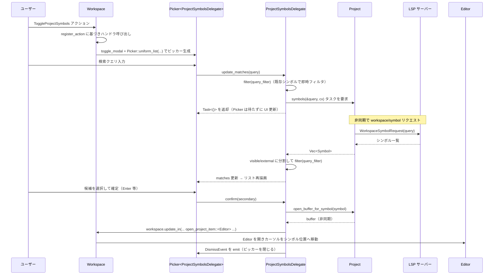

# crates/project_symbols ディレクトリ解説

## 1. ざっくり一言

`project_symbols` クレートは、**プロジェクト全体のシンボル（関数・型など）を LSP 経由で取得し、ファジー検索付きの一覧モーダル（Picker）として表示し、選択したシンボルの位置にエディタでジャンプする**ためのモジュールです。

---

## 2. このモジュールの役割

### 2.1 概要

- このクレートは、ワークスペース内で「**プロジェクトシンボル検索**」を行う UI を提供します。
- ユーザーの検索クエリに応じて LSP の `workspace/symbol` からシンボル一覧を取得し、`fuzzy` クレートでファジーマッチングを行います。
- 検索結果を `picker::Picker` のリストとしてレンダリングし、選択されたシンボルの定義位置を `editor::Editor` で開き、カーソルをその位置に移動します。
- Rust Analyzer の **パススタイル検索 (`mod1::mod2::name`)** に対応するための処理も含まれています。

### 2.2 アーキテクチャ内での位置づけ

このクレートは、`workspace` / `project` / `picker` / `editor` などのクレートを橋渡しする「UI デリゲート」の役割を担います。

```mermaid
graph TD
    G["project_symbols::init"]
    A["Workspace（crates/workspace）"]
    P["Project（crates/project）"]
    K["Picker<ProjectSymbolsDelegate>（crates/picker）"]
    D["ProjectSymbolsDelegate"]
    E["Editor（crates/editor）"]
    L["LSP サーバー"]

    G --> A              %% init が Workspace にアクションを登録
    A --> K              %% Workspace がモーダルとして Picker を生成
    K --> D              %% Picker が Delegate を利用
    D --> P              %% Delegate が Project にシンボル取得を依頼
    P --> L              %% Project が LSP に workspace/symbol をリクエスト
    D --> A              %% Delegate が Workspace 経由でエディタを開く
    A --> E              %% Workspace が Editor を開き、その中でジャンプ
```

### 2.3 設計上のポイント

コードから読み取れる設計上の特徴は次のとおりです。

- **Picker デリゲートとしての実装**
  - `ProjectSymbolsDelegate` は `PickerDelegate` トレイトを実装し、Picker のために
    - プレースホルダテキスト
    - マッチ件数・選択インデックス
    - マッチの更新 (`update_matches`)
    - マッチの描画 (`render_match`)
    - 確定時の処理 (`confirm`)
    を提供します。
- **状態の保持**
  - 保持する状態は検索用の軽量なものに限定されています。
    - `symbols: Vec<Symbol>`（LSP から取得したシンボル）
    - `visible_match_candidates` / `external_match_candidates`（ファジーマッチ対象）
    - `matches: Vec<StringMatch>`（現在のマッチ結果）
    - `selected_match_index` など。
  - `Workspace` への参照は `WeakEntity<Workspace>` として保持し、ライフタイムに依存しすぎない設計です。
- **非同期処理の分離**
  - LSP からのシンボル取得は `cx.spawn_in(window, async move { ... })` を使い、UI スレッドから切り離された非同期タスクとして実行されます。
  - `ResultExt::log_err` により、エラーはログに残され、UI はパニックしません。
- **プロジェクト内シンボルと外部シンボルの区別**
  - `SymbolLocation::InProject` かどうか、さらに `entry_for_path` の結果が ignored かどうかで、
    - 「プロジェクト内で可視なシンボル」
    - 「外部／無視されたシンボル」
    に分割し、まず前者を優先的にファジーマッチングします。
- **検索結果数の制限**
  - `filter` 内で `MAX_MATCHES: usize = 100` として上限を設け、UI に表示する候補を最大 100 件に制限しています。

---

## 3. 主要な機能一覧

このディレクトリ（クレート）が提供する主な機能は次のとおりです。

- **Workspace へのアクション登録**
  - `init` 関数で `workspace::ToggleProjectSymbols` アクションを `Workspace` に登録し、このアクション実行でシンボル検索モーダルを開きます。
- **プロジェクトシンボルの取得と分類**
  - `ProjectSymbolsDelegate::update_matches` が `Project::symbols(&query, cx)` を通じて LSP からシンボル一覧を取得します。
  - 取得したシンボルを「プロジェクト内可視」／「外部」シンボルに分割します。
- **ファジーマッチング**
  - `ProjectSymbolsDelegate::filter` が `fuzzy::match_strings` により、可視シンボルと外部シンボルに対してファジー検索を行い、スコア順にソートします。
- **Rust Analyzer 風パス検索のサポート**
  - `update_matches` でクエリを `mod1::mod2::name` 形式とみなし、「最後のセグメント（`name`）」のみを表示側のフィルタに用いることで、RA のパス検索に近い挙動を実現します。
- **検索結果の描画**
  - `render_match` で、シンボル名・ファイルパス・行番号を含む `ListItem` を構築し、コードラベル風のスタイルとマッチ部分のハイライトを適用します。
- **シンボル位置へのジャンプ**
  - `confirm` で、選択されたシンボルについて
    - 対応するバッファを開き (`Project::open_buffer_for_symbol`)
    - `Workspace::open_project_item::<Editor>` でエディタを開き
    - `Editor::change_selections` で該当位置にカーソルを移動しスクロールします。

---

## 4. 関数・構造体の解説

### 4.1 型一覧

| 名前 | 種別 | 役割 / 用途 |
|------|------|-------------|
| `ProjectSymbols` | 型エイリアス | `Entity<Picker<ProjectSymbolsDelegate>>` の別名です。ウィンドウ上に表示されるプロジェクトシンボルピッカーの Entity を表します。 |
| `ProjectSymbolsDelegate` | 構造体 | プロジェクトシンボル検索のロジック（シンボル取得・ファジー検索・描画・確定処理）を `picker::Picker` に提供するデリゲートです。 |

`ProjectSymbolsDelegate` のフィールド概要は次のとおりです。

| フィールド名 | 型 | 説明 |
|--------------|----|------|
| `workspace` | `WeakEntity<Workspace>` | エディタを開くなどの操作を行うための `Workspace` への弱参照です。 |
| `project` | `Entity<Project>` | シンボルやバッファを取得する対象プロジェクトです。 |
| `selected_match_index` | `usize` | 現在選択されているマッチのインデックスです。 |
| `symbols` | `Vec<Symbol>` | LSP から取得したシンボル一覧です。ファジーマッチングの元データになります。 |
| `visible_match_candidates` | `Vec<StringMatchCandidate>` | プロジェクト内で可視なシンボルに対応するマッチ候補です。 |
| `external_match_candidates` | `Vec<StringMatchCandidate>` | 外部または無視されたシンボルに対応するマッチ候補です。 |
| `show_worktree_root_name` | `bool` | 複数 worktree が可視な場合に、パス表示に worktree ルート名を含めるかどうかのフラグです。 |
| `matches` | `Vec<StringMatch>` | 現在の検索クエリに対するマッチ結果です。 |

### 4.2 主要関数・メソッドの詳細

#### `init(cx: &mut App)`

**概要**

- 新しい `Workspace` が生成されたときに、`workspace::ToggleProjectSymbols` アクションを登録し、そのアクションでプロジェクトシンボルピッカーをモーダルとして開くように設定します。

**引数**

| 引数名 | 型 | 説明 |
|--------|----|------|
| `cx` | `&mut App` | アプリケーション全体のコンテキストです。`Workspace` 生成の監視やアクション登録に用います。 |

**戻り値**

- なし（副作用として `Workspace` にアクションが登録されます）。

**内部処理の流れ**

1. `cx.observe_new` を呼び出し、新しく生成される `Workspace` を監視します。
2. 各 `Workspace` に対して `workspace.register_action` を呼び出し、`workspace::ToggleProjectSymbols` アクションのハンドラを登録します。
3. ハンドラ内では
   - `workspace.project().clone()` で `Project` Entity を取得。
   - `cx.entity().downgrade()` で `Workspace` の `WeakEntity` を取得。
   - `workspace.toggle_modal(window, cx, move |window, cx| { ... })` でモーダルを開き、その中で
     - `ProjectSymbolsDelegate::new(handle, project)` でデリゲートを生成。
     - `Picker::uniform_list(delegate, window, cx).width(rems(34.))` で幅 34rem の一覧ピッカーを構築。
4. `observe_new` の戻り値のタスクを `detach()` して、ライフタイム管理を UI に任せます。

**Examples（使用例）**

アプリケーションの初期化時にこのクレートを有効化する例です。

```rust
use gpui::App;                        // gpui のアプリケーション型
use project_symbols;                 // このクレート

fn init_app(cx: &mut App) {          // アプリ起動時に呼ばれる初期化関数
    project_symbols::init(cx);       // Workspace に ToggleProjectSymbols アクションを登録
    // 他のモジュールの初期化処理...
}
```

**エッジケース**

- この関数自体にはエラー戻り値はありません。内部で `observe_new` したタスクは `detach` 済みのため、ここでパニックするような処理はありません。

**使用上の注意点**

- アプリケーション内で `Workspace` を利用する前に 1 回だけ呼び出すことを前提とした構造になっています（コード上は複数回呼び出しても動きますが、アクションが重複登録される可能性があります）。

---

#### `ProjectSymbolsDelegate::new(workspace: WeakEntity<Workspace>, project: Entity<Project>) -> Self`

**概要**

- `ProjectSymbolsDelegate` のコンストラクタです。必要な参照を受け取り、内部状態をデフォルト値で初期化します。

**引数**

| 引数名 | 型 | 説明 |
|--------|----|------|
| `workspace` | `WeakEntity<Workspace>` | 後でエディタを開くために利用する `Workspace` の弱参照です。 |
| `project` | `Entity<Project>` | シンボル検索対象のプロジェクトです。 |

**戻り値**

- 初期化された `ProjectSymbolsDelegate` インスタンス。

**内部処理**

- 全てのベクタ (`symbols`, `visible_match_candidates`, `external_match_candidates`, `matches`) を `Default::default()`（空）で初期化し、`selected_match_index` を 0、`show_worktree_root_name` を `false` に設定します。

**使用上の注意点**

- `workspace` は弱参照のため、`Workspace` が破棄された後に `confirm` が呼ばれた場合、`workspace.update_in` が失敗する可能性があります（失敗はエラーとして処理され、ログに出る設計です）。

---

#### `ProjectSymbolsDelegate::filter(&mut self, query: &str, window: &mut Window, cx: &mut Context<Picker<Self>>)`

**概要**

- 既に保持している `symbols` とマッチ候補から、`query` に対するファジーマッチングを行い、`self.matches` と `selected_match_index` を更新します。
- プロジェクト内可視シンボルと外部シンボルを別々にマッチングし、スコア順にマージします。

**主な処理内容**

1. `MAX_MATCHES` を 100 に設定。
2. `visible_match_candidates` について `fuzzy::match_strings` を実行し、`visible_matches` を取得。
3. 残り枠 `MAX_MATCHES - visible_matches.len().min(MAX_MATCHES)` を上限として `external_match_candidates` に対して `match_strings` を実行し、`external_matches` を取得。
4. 両方のマッチをそれぞれ
   - `Reverse(OrderedFloat(mat.score))`（スコア降順）
   - `symbol.label.filter_text()`（ラベル文字列）  
   のタプルでソート。
5. `visible_matches` と `external_matches` を結合し、`matches` とする。
6. 各 `StringMatch` の `positions`（マッチ位置）を `symbol.label.filter_range.start` だけシフトし、元のラベル文字列上の位置に合わせる。
7. `self.matches` を更新し、`self.set_selected_index(0, window, cx)` で選択インデックスを 0 にリセット。

**エッジケース**

- `symbols` が空、あるいは `visible_match_candidates` / `external_match_candidates` が空の場合は、`matches` は空ベクタになります。
- `MAX_MATCHES` を超える件数がマッチしても、上位 100 件のみが `matches` に残ります。

**使用上の注意点**

- この関数は `update_matches` から内部的に呼び出されます。外部から直接呼ぶ場合は、事前に `symbols` とマッチ候補が更新されていることが前提です。
- マッチ位置のハイライトは `symbol.label.filter_range` に依存するため、`label` 側の設定が正しくないとハイライト位置がずれる可能性があります。

---

#### `update_matches(&mut self, query: String, window: &mut Window, cx: &mut Context<Picker<Self>>) -> Task<()>`

（`PickerDelegate` トレイトの実装）

**概要**

- ユーザーの検索クエリに応じて
  - 即時にローカルファジーフィルタリングを行い
  - バックグラウンドで LSP から新しいシンボル一覧を取得し、到着次第フィルタリングを更新する
 という二段階の更新を行います。
- Rust Analyzer のパススタイルクエリ（`mod1::mod2::name`）を扱うため、クエリを分割して利用します。

**内部処理の流れ**

1. **クエリの分割（RA 互換パス検索）**
   - `query.rsplit_once("::")` で最後の `"::"` 以降の部分を `query_filter` として取得。
   - `"mod1::name"` のようなクエリなら `query_filter` は `"name"` になります。
   - `"::"` を含まない場合は、`query_filter` は `query` そのものです。

2. **ローカルフィルタリング**
   - `self.filter(&query_filter, window, cx)` を呼び出し、すでに保持している `symbols` を対象に表示を更新します。
   - `self.show_worktree_root_name` を `project.visible_worktrees(cx).count() > 1` に応じて更新します。

3. **LSP からのシンボル取得（非同期）**
   - `let symbols = self.project.update(cx, |project, cx| project.symbols(&query, cx));`
     で、`query` 全体（パス部分を含む）を用いた `symbols` 取得タスクを生成します。
   - `cx.spawn_in(window, async move |this, cx| { ... })` で非同期タスクを起動します。
   - タスク内では
     1. `let symbols = symbols.await.log_err();` で結果を待ち、エラーはログ出力して `Option` に変換。
     2. `if let Some(symbols) = symbols { ... }` で成功時のみ処理を続行。
     3. `this.update_in(cx, |this, window, cx| { ... })` で UI コンテキスト上で `this.delegate` を更新。
     4. 取得した `symbols` から `StringMatchCandidate` を生成し、
        - `SymbolLocation::InProject` かつ `entry_for_path` の結果が ignored でないものを `visible_match_candidates`
        - それ以外を `external_match_candidates`
        に `partition` で分割。
     5. `delegate.symbols` / `delegate.visible_match_candidates` / `delegate.external_match_candidates` を更新。
     6. 再度 `delegate.filter(&query_filter, window, cx);` を呼び、最新のシンボルに基づいたマッチ結果に更新。

4. `Task<()>` として非同期タスクのハンドルを返します（Picker 側のインタフェースに合わせた戻り値です）。

**Examples（使用例）**

テストコードと同様のパターンで `ProjectSymbols` Entity のマッチを更新する例です。

```rust
// `symbols` は ProjectSymbols = Entity<Picker<ProjectSymbolsDelegate>> とする
symbols.update_in(cx, |picker, window, cx| {                 // Picker Entity の中身を更新
    picker.update_matches("one".to_string(), window, cx);    // クエリ "one" でマッチを更新
});
cx.run_until_parked();                                       // 非同期タスクの完了を待つ（テストなど）
```

Rust Analyzer 風のパスクエリを使う例（テストと同じパターン）です。

```rust
symbols.update_in(cx, |picker, window, cx| {                 // RA 風のパス・クエリを投げる
    picker.update_matches("dir::to".to_string(), window, cx); // "dir::" がパス、"to" が末尾シンボル名として扱われる
});
cx.run_until_parked();                                       // 結果が反映されるのを待つ
```

**エッジケース**

- クエリが空文字列 `""` の場合  
  テスト内の Fake LSP 実装では、空クエリ時に空の結果を返すようになっており、最終的な `matches` も空になります。
- 短時間に連続して `update_matches` が呼ばれた場合  
  テストでは `"o"`, `"on"`, `"onex"` のような連続クエリを投げ、最終的に `"onex"` の結果だけが反映され、マッチが 0 件であることを確認しています。  
  実際の古いバグ（コメントの GitHub issue）に対するリグレッションテストになっています。

**使用上の注意点**

- `update_matches` は UI スレッドから `Entity::update_in` 経由で呼び出される前提の API です。`Context<Picker<Self>>` を直接構築して呼び出すことは想定されていません。
- 頻繁に呼ばれる前提のため、シンボル取得が重い場合でも UI がブロックされないよう、必ず非同期タスクとして実行しています。

---

#### `confirm(&mut self, secondary: bool, window: &mut Window, cx: &mut Context<Picker<Self>>)`

（`PickerDelegate` トレイトの実装）

**概要**

- 現在選択されているシンボルの定義位置をエディタで開き、カーソルをそこに移動し、ピッカーを閉じます。
- `secondary` 引数によって、アクティブペインではなく隣接ペインに開くかどうかを切り替えます。

**主な処理内容**

1. `self.matches.get(self.selected_match_index)` で現在選択中の `StringMatch` を取得。
2. そこから `candidate_id` を使って `self.symbols[mat.candidate_id].clone()` を取り出し、`Symbol` を得ます。
3. `self.project.update(cx, |project, cx| project.open_buffer_for_symbol(&symbol, cx))` で、該当シンボルの位置を含むバッファを開くタスクを生成。
4. `cx.spawn_in(window, async move |_, cx| { ... })` で非同期タスクを起動し、次を行います。
   1. `buffer` を `await` で取得。
   2. `workspace.update_in(cx, |workspace, window, cx| { ... })` で、`Workspace` を更新。
   3. `buffer.read(cx).clip_point_utf16(symbol.range.start, Bias::Left)` でシンボルの開始位置をバッファ上の座標に変換。
   4. `secondary` が `true` なら `workspace.adjacent_pane(window, cx)`、`false` なら `workspace.active_pane().clone()` を選択。
   5. `workspace.open_project_item::<Editor>(...)` で該当ペインに `Editor` を開く。
   6. `editor.update(cx, |editor, cx| { editor.change_selections(...); })` でカーソルをシンボル位置に移動し、中央にスクロール。
5. タスク終了後、`cx.emit(DismissEvent);` を呼び出し、ピッカーを閉じます。

**エッジケース**

- `self.matches` が空、または `selected_match_index` が範囲外の場合  
  - `self.matches.get(...)` が `None` を返し、`if let Some(symbol) = ...` が偽になり、何も行われません（ピッカーも閉じません）。
- `Workspace` がすでに破棄されている場合  
  - `workspace.update_in` がエラーを返す可能性がありますが、このエラーはタスク側で `detach_and_log_err(cx)` を通じてログに出力される設計です。

**使用上の注意点**

- 通常は Picker の UI フレームワークが `Enter` キーやマウス操作に応じて `confirm` を呼び出すため、直接呼ぶ必要はありません。
- `secondary` を `true` にすると、新しいシンボルが隣接ペインに開かれるため、スプリットビューでの閲覧が可能になります（実際のキー割り当ては他のコード側で決定されます）。

---

#### `render_match(&self, ix: usize, selected: bool, _window: &mut Window, cx: &mut Context<Picker<Self>>) -> Option<ListItem>`

**概要**

- 指定インデックス `ix` のマッチ結果を UI 用の `ListItem` に変換します。
- ラベル（シンボル名）にシンタックスハイライトとマッチ部分のハイライトを適用し、下部にファイルパスと行番号を表示します。

**主な処理内容**

1. `path_style` を `project.read(cx).path_style(cx)` から取得。
2. `string_match` と `symbol` を `self.matches` / `self.symbols` から取り出す（インデックスが無効なら `None` を返す）。
3. テーマ情報を取得し、`styled_runs_for_code_label(&symbol.label, theme.syntax(), &local_player)` でコード用のスタイル付きランを作成。
4. `symbol.path` に応じてパス文字列を構築。
   - `SymbolLocation::InProject(project_path)` の場合:
     - 必要に応じて worktree ルート名を前置し、`path.display(path_style).into_owned()` でスタイルに合わせて表示用文字列を生成。
   - `SymbolLocation::OutsideProject { abs_path, .. }` の場合:
     - `abs_path.to_string_lossy()` を使ってパス文字列を取得。
5. `line_number` を `symbol.range.start.0.row + 1` から計算。
6. `ThemeSettings::get_global(cx)` と `cx.theme()` からフォントや色設定を取得し、`TextStyle` と `HighlightStyle` を構築。
7. `string_match.positions` の各位置を 1 文字幅の範囲として `highlight_style` を対応付け、`gpui::combine_highlights(custom_highlights, syntax_runs)` でシンタックスハイライトとマッチハイライトを統合。
8. `ListItem::new(ix)` に対して
   - `.inset(true)`
   - `.spacing(ListItemSpacing::Sparse)`
   - `.toggle_state(selected)`
   - ラベルとパス／行番号のラベルから成る `v_flex` / `h_flex` レイアウト  
   を組み合わせて、1 行分の表示要素を返します。

**エッジケース**

- `ix` が範囲外の場合は `None` が返され、Picker 側からは「描画する行がない」と扱われます。
- `symbol.path` が `OutsideProject` の場合、`abs_path` の文字列変換結果がそのまま表示されます。

**使用上の注意点**

- この関数は `Picker` のレンダリングフックとして内部的に呼び出され、外部から直接呼び出す必要はありません。
- フォントや色は `ThemeSettings` と `cx.theme()` に依存するため、グローバルな設定が行われていることが前提です。

---

### 4.3 その他の関数・メソッド

補助的なメソッドや単純なラッパーは以下のとおりです。

| 関数 / メソッド名 | 役割（1 行） |
|-------------------|--------------|
| `placeholder_text` | Picker の検索ボックスに表示するプレースホルダ文字列 `"Search project symbols..."` を返します。 |
| `dismissed` | Picker が閉じられたときに呼ばれますが、この実装では何も行いません。 |
| `match_count` | 現在の `self.matches.len()` を返し、Picker にリスト件数を伝えます。 |
| `selected_index` | 現在選択されているインデックス `selected_match_index` を返します。 |
| `set_selected_index` | 選択インデックスを更新します（範囲チェックは Picker 側に任されています）。 |
| `tests::test_project_symbols` | 非同期クエリの連続更新や RA 風パス検索が正しく動くかを検証する統合テストです。 |
| `tests::init_test` | テスト用に `SettingsStore`・テーマ・リリースチャンネル・エディタなどを初期化します。 |
| `tests::symbol` | `lsp::SymbolInformation` を生成するテスト用ヘルパー関数です。 |

---

## 5. データフロー

ここでは、「ユーザーが `ToggleProjectSymbols` アクションを実行し、シンボルを検索してジャンプする」一連の流れを示します。

### 5.1 処理の要約

1. ユーザーが `ToggleProjectSymbols` を発火すると、`Workspace` がモーダルとして `Picker<ProjectSymbolsDelegate>` を開きます。
2. ユーザーが検索クエリを入力するたびに、Picker が `ProjectSymbolsDelegate::update_matches` を呼び、即時フィルタリングと LSP 経由のシンボル取得を行います。
3. 非同期にシンボルが取得されると、Delegate が内部状態を更新し `filter` を再実行、画面上の候補リストが更新されます。
4. ユーザーが候補を確定すると、`confirm` が呼ばれ、対応するバッファとエディタが開かれ、シンボル位置にジャンプし、Picker は閉じられます。

### 5.2 シーケンス図



---

## 6. 使い方（How to Use）

### 6.1 基本的な使用方法

#### アプリケーションへの組み込み（`init` の利用）

通常は、アプリケーション起動時に `project_symbols::init` を呼び出しておき、`workspace::ToggleProjectSymbols` アクションでモーダルを開きます。

```rust
use gpui::App;                         // gpui アプリケーション型
use project_symbols;                  // このクレート

fn init_app(cx: &mut App) {           // アプリケーション起動時に呼ばれると仮定
    project_symbols::init(cx);        // Workspace にプロジェクトシンボル検索アクションを登録
    // 他モジュールの初期化...
}
```

この初期化を行うと、`Workspace` 側で `workspace::ToggleProjectSymbols` アクションが発行されたときに、幅 34rem のプロジェクトシンボルピッカーがモーダルとして表示されます。

#### 手動で Picker を生成する（テストと同様のパターン）

テストコードでは、`ProjectSymbolsDelegate` を直接渡して Picker を構築しています。実際の UI でも、類似のパターンで手動生成することは可能です。

```rust
// `project` は Entity<Project>、`workspace` は Entity<Workspace> を想定
let symbols: ProjectSymbols = cx.new_window_entity(|window, cx| {  // 新しいウィンドウにビューを追加
    Picker::uniform_list(                                         // 一様なリスト表示の Picker を構築
        ProjectSymbolsDelegate::new(                              // デリゲートを生成
            workspace.downgrade(),                                // Workspace への弱参照
            project.clone(),                                      // Project Entity
        ),
        window,
        cx,
    )
});
```

### 6.2 よくある使用パターン

#### 通常の名前ベースの検索

```rust
// `symbols` は ProjectSymbols とする
symbols.update_in(cx, |picker, window, cx| {                  // Picker Entity を更新
    picker.update_matches("one".to_string(), window, cx);     // 文字列 "one" で検索
});
cx.run_until_parked();                                        // 非同期結果を反映（テストやデモ用）
```

この場合、シンボル名（`symbol.label.filter_text()`）に対してファジーマッチが行われ、スコア順に上位 100 件までが `matches` に入ります。

#### Rust Analyzer 互換のパススタイル検索

テストコードと同様に、`"dir::to"` のようなクエリを投げると、`"dir::"` 部分は LSP へのクエリにのみ使われ、表示側では `"to"` のみがファジーフィルタ対象になります。

```rust
symbols.update_in(cx, |picker, window, cx| {                 // RA 風のパススタイル検索
    picker.update_matches("dir::to".to_string(), window, cx); // "dir" というパス配下で "to" にマッチするシンボルを探す
});
cx.run_until_parked();
```

Fake LSP を使ったテストでは、このクエリに対して `"dir"` を含むパスのシンボルのみが候補になり、その中で `"to"` にマッチするものが返ることを確認しています。

#### 隣接ペインに開く（secondary 確定）

`confirm` メソッドの `secondary` 引数が `true` の場合、`Workspace::adjacent_pane` を使って隣接ペインにエディタを開きます。実際のキー割り当てはこのクレート外ですが、概念的には次のような挙動になります。

```rust
// 擬似的な例：secondary = true で confirm を呼ぶ
symbols.update_in(cx, |picker, window, cx| {
    picker.delegate.confirm(true, window, cx);               // 隣接ペインでシンボル位置を開く
});
```

（実際には Picker の UI が `confirm` を呼び出すため、このように直接呼ぶことはテスト用途に限られます。）

### 6.3 使用上の注意点（まとめ）

- **シンボル件数の上限**
  - `filter` では `MAX_MATCHES = 100` により、表示候補が 100 件に制限されています。大量のシンボルがあるプロジェクトでは「マッチしていても 101 件目以降は表示されない」可能性があります。
- **非同期更新と連続クエリ**
  - `update_matches` は各クエリごとに非同期タスクを起動します。短時間で多くのクエリを送ると、複数のタスクが並行して進行します。
  - テストでは「最終クエリの結果のみが最終状態に反映される」ことが確認されていますが、`Project::symbols` 側の実装にも依存します。
- **Workspace のライフタイム**
  - `ProjectSymbolsDelegate` は `WeakEntity<Workspace>` を保持するだけで、`Workspace` のライフタイムを延長しません。
  - `Workspace` が破棄された後に `confirm` などが動作すると、`workspace.update_in` が失敗し、エラーがログに出力される設計です。
- **ラベルとハイライト位置の関係**
  - マッチ文字のハイライト位置は `symbol.label.filter_text()` と `filter_range.start` に基づいて計算されます。
  - ラベル構造（`filter_range`）が正しく設定されていない場合、ハイライトが期待した位置とずれる可能性があります。

---

## 7. 関連ファイル

このディレクトリと密接に関係するファイル・クレートは次のとおりです。

| パス / クレート名 | 役割 / 関係 |
|-------------------|------------|
| `project_symbols/Cargo.toml` | `project_symbols` クレートのマニフェストです。`editor` / `fuzzy` / `gpui` / `picker` / `project` / `workspace` などへの依存が定義されています。 |
| `project_symbols/src/project_symbols.rs` | 本レポートで解説した、プロジェクトシンボルピッカーの実装本体です。 |
| クレート `workspace` | `Workspace` 型および `ToggleProjectSymbols` アクション、`toggle_modal`、ペイン管理などを提供し、本クレートから利用されています。 |
| クレート `project` | `Project` と `Symbol` 型、`symbols(&query, cx)`、`open_buffer_for_symbol` など LSP と連携したプロジェクト情報取得機能を提供します。 |
| クレート `picker` | `Picker` と `PickerDelegate` を提供し、汎用的なリストピッカー UI のインフラを担っています。 |
| クレート `editor` | `Editor` 型、選択範囲操作 (`change_selections`)、`styled_runs_for_code_label` など、テキストエディタ UI の機能を提供します。 |
| クレート `theme` / `theme_settings` | テキスト色やフォントなどのテーマ設定を提供し、`render_match` 内でラベルの見た目を決定する際に利用されています。 |

このディレクトリ単体ではこれら依存クレートの内部実装は分かりませんが、インタフェース名から上記のような役割が読み取れます。
