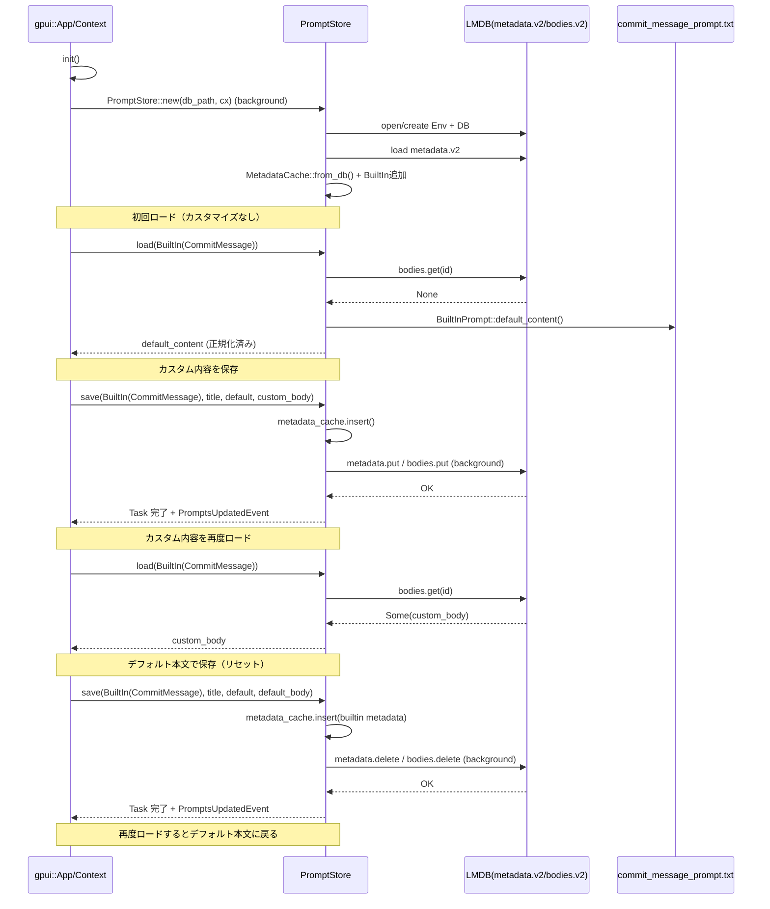

# prompt_store/ ディレクトリ解説

## 1. ざっくり一言

`prompt_store` クレートは、

- プロンプト（テキスト）の永続保存・検索・バージョン移行
- プロジェクトやバッファ内容からのテンプレートベースのプロンプト生成

を行うための仕組みを提供します。

---

## 2. このモジュールの役割

### 2.1 概要

このクレートは次の 2 つの責務を持っています。

- `PromptStore`  
  - LMDB（`heed`）を使って、ユーザー定義／組み込みのプロンプトを永続化します。
  - メモリ内キャッシュを持ち、検索や UI 用の一覧取得を効率的に行います。
  - 旧バージョンのデータベース（V1）から新バージョン（V2）への移行も行います。
- `PromptBuilder`  
  - `handlebars` テンプレートと各種コンテキスト（プロジェクト情報、バッファ内容、ターミナル状態）を用いて、最終的なプロンプト文字列を生成します。
  - ファイルシステムを監視し、ユーザーが `.hbs` テンプレートを追加／変更した場合に自動的に再ロードします。

### 2.2 アーキテクチャ内での位置づけ

主要コンポーネント間の依存関係を示します。

```mermaid
graph TD
    App["gpui::App / Context"]
    GlobalStore["GlobalPromptStore"]
    PromptStore["PromptStore"]
    HeedEnv["heed::Env (LMDB)"]
    Templates["PromptBuilder"]
    Assets["assets::Assets (prompts/)"]
    Fs["fs::Fs (ファイル監視)"]
    Paths["paths::prompt_overrides_dir / prompts_dir"]
    GitUiPrompt["commit_message_prompt.txt\n(別クレート git_ui)"]

    App -->|init() で set_global| GlobalStore
    GlobalStore --> PromptStore
    PromptStore --> HeedEnv
    PromptStore --> Paths
    PromptStore --> GitUiPrompt

    Templates --> Assets
    Templates --> Fs
    Templates --> Paths
    App --> Templates
```

- `PromptStore` は
  - `paths::prompts_dir()` から DB ディレクトリを決定し、
  - `heed::Env` にメタデータ DB (`metadata.v2`) と本文 DB (`bodies.v2`) を作成します。
- `PromptBuilder` は
  - `assets::Assets` から組み込みテンプレート（`prompts/*.hbs`）をロードし、
  - `fs::Fs` と `paths::prompt_overrides_dir()` でユーザー上書きテンプレートを監視します。
- `gpui::App` / `Context` は
  - 非同期タスク (`Task`) の実行と `GlobalPromptStore` の管理を行います。

### 2.3 設計上のポイント

- 永続化とキャッシュ
  - LMDB（`heed`）上に JSON シリアライズされた `PromptId`／`PromptMetadata` と本文を保存します。
  - メタデータは起動時に全ロードして `RwLock` 付きキャッシュ（`MetadataCache`）に保持し、検索や一覧表示は DB を再度読むことなく行います。
- 組み込みプロンプトとユーザープロンプト
  - `BuiltInPrompt` enum によって組み込みプロンプト（現在は `CommitMessage` のみ）を表現し、ファイルからデフォルト本文を読み込みます。
  - `PromptId` は組み込みとユーザー（`UserPromptId(Uuid)`）を区別し、編集可否などをメソッドで提供します。
- 旧 DB からのマイグレーション
  - V1 (`metadata`, `bodies`) から V2 (`metadata.v2`, `bodies.v2`) へ、保存日時 (`saved_at`) を比較しつつ上書き／スキップの判断を行います。
- フェイルオープンな初期化
  - DB に互換性のないキー（別ブランチのフォーマットなど）があっても、初期化時にそのレコードだけをスキップし、全体は成功させる方針です（`MetadataCache::from_db` 内の `log::warn!` とテストにより確認できます）。
- 非同期・UI 連携
  - すべての DB アクセスは `gpui` の `background_spawn` 経由で別スレッド実行し、UI スレッドをブロックしません。
  - 更新後は `PromptsUpdatedEvent` を発火し、UI への再描画トリガーに利用します。
- テンプレートの上書き
  - `PromptBuilder` は組み込みテンプレートをベースにしつつ、ファイルシステム上の `.hbs` ファイルで個別テンプレートを上書きできます。
  - 上書きディレクトリが削除された場合は、組み込みテンプレートを再登録して「元に戻す」挙動をとります。
- コンテキストの明示的な構造化
  - プロジェクト、ユーザールール、バッファ内容、診断メッセージ、ターミナル出力など、それぞれ専用の `*_Context` 構造体を用意し、テンプレートから利用できる形でシリアライズします。

---

## 3. 主要な機能一覧

- プロンプト ID 管理
  - `PromptId`, `UserPromptId`, `BuiltInPrompt` による一意な ID 付与と編集可否の判定。
- プロンプトメタデータ管理
  - タイトル・デフォルトフラグ・最終保存時刻を持つ `PromptMetadata` の保存・読み出し・一覧取得。
- プロンプト本文の永続化
  - 任意の文字列本文を LMDB 上に保存／読み込みし、組み込みプロンプトは DB に無い場合にデフォルト本文へフォールバック。
- プロンプト検索
  - メモリキャッシュ上のタイトルに対するファジー検索（`fuzzy::match_strings`）と「デフォルトフラグ優先」ソート。
- DB マイグレーション
  - 旧形式（V1）のプロンプト ID／メタデータを新形式（V2）へ移行し、削除済みプロンプトが復活しないように整合性を維持。
- プロンプトテンプレートの生成
  - エディタ内の選択範囲・ドキュメント内容・診断情報からインライン変換用のプロンプトを生成。
  - ターミナル出力やシェル情報からターミナルアシスタント用のプロンプトを生成。
- テンプレートの動的上書き
  - `prompts/` アセットから読み込んだ組み込みテンプレートを、ユーザーディレクトリ内の `.hbs` ファイルで動的に上書き。
- プロジェクトコンテキストの構築
  - ワークツリー・ルールファイル・OS/ARCH/シェルなどの環境情報をまとめた `ProjectContext` の生成。

---

## 4. 関数・構造体の解説

### 4.1 型一覧（主要な構造体・列挙体）

#### プロンプトストア関連（`prompt_store.rs`）

| 名前 | 種別 | 役割 / 用途 |
|------|------|-------------|
| `BuiltInPrompt` | enum | 組み込みプロンプトの種類（現在は `CommitMessage` のみ）を表します。 |
| `UserPromptId` | 構造体（`Uuid` ラッパー） | ユーザー定義プロンプトの ID。新規作成時に `new()` でランダム生成します。 |
| `PromptId` | enum | プロンプトの ID。ユーザー／組み込みを区別し、編集可否の判定メソッドを持ちます。 |
| `PromptMetadata` | 構造体 | プロンプトのメタ情報。ID・タイトル・デフォルトフラグ・保存時刻を保持します。 |
| `PromptStore` | 構造体 | LMDB 環境＋メタデータ／本文 DB とキャッシュを持つストア本体です。 |
| `MetadataCache` | 構造体 | メモリ上のメタデータ配列と `id → メタデータ` マップを保持し、並び順も管理します。 |
| `PromptsUpdatedEvent` | 空構造体 | プロンプト更新時に UI へ通知するためのイベント型です。 |
| `PromptIdV1` | 構造体 | 旧 DB 形式の ID。マイグレーション時のみ使用します。 |
| `PromptMetadataV1` | 構造体 | 旧 DB 形式のメタデータ。マイグレーション時のみ使用します。 |
| `GlobalPromptStore` | 構造体 | `PromptStore` への共有 `Task` を `gpui::Global` としてラップするための型です。 |

#### プロンプト生成関連（`prompts.rs`）

| 名前 | 種別 | 役割 / 用途 |
|------|------|-------------|
| `RULES_FILE_NAMES` | 定数スライス | プロジェクトルールファイルとして扱うファイル名候補の一覧です。 |
| `ProjectContext` | 構造体 | ワークツリー・ユーザールール・OS/ARCH/シェル情報をまとめたテンプレート用コンテキストです。 |
| `UserRulesContext` | 構造体 | ユーザー定義のルール（UUID, タイトル, 内容）を表します。 |
| `WorktreeContext` | 構造体 | 各ワークツリーのルート名・パス・ルールファイル情報を表します。 |
| `RulesFileContext` | 構造体 | ルールファイルの相対パス・本文・プロジェクトエントリ ID を表します。 |
| `ContentPromptDiagnosticContext` | 構造体 | バッファ診断情報（行番号・エラーメッセージ・該当コード）をテンプレートに渡すための構造体です。 |
| `ContentPromptContext` | 構造体 | 旧バージョンのインライン変換用テンプレート `content_prompt` 向けコンテキストです。 |
| `ContentPromptContextV2` | 構造体 | 新バージョン `content_prompt_v2` 用のインライン変換コンテキストです。 |
| `TerminalAssistantPromptContext` | 構造体 | ターミナルアシスタント用テンプレート `terminal_assistant_prompt` のコンテキストです。 |
| `PromptLoadingParams` | 構造体 | ファイル監視付きテンプレートロードに必要な依存（Fs, repo_path, App）をまとめたものです。 |
| `PromptBuilder` | 構造体 | `handlebars` インスタンスを保持し、各種テンプレートのロード・監視・レンダリングを行います。 |

---

### 4.2 重要な関数・メソッド詳細（抜粋・最大 7 件）

ここでは代表的な API を 7 件に絞って詳しく説明します。

---

#### `init(cx: &mut App)`

**概要**

- アプリ起動時に呼ばれる初期化関数です。
- プロンプト DB をバックグラウンドで開き、その結果（`Entity<PromptStore>`）への共有 `Task` を `GlobalPromptStore` として `App` に登録します。

**引数**

| 引数名 | 型 | 説明 |
|--------|----|------|
| `cx` | `&mut App` | `gpui` アプリケーションコンテキスト。バックグラウンドタスク起動やグローバル設定に使用します。 |

**戻り値**

- なし。副作用として `GlobalPromptStore` グローバルを設定します。

**内部処理の流れ**

1. `paths::prompts_dir()` に `"prompts-library-db.0.mdb"` を連結して DB パスを決定。
2. `PromptStore::new(db_path, cx)` を呼び出し、`Task<Result<PromptStore>>` を取得。
3. `cx.spawn` で `PromptStore` 初期化タスクをバックグラウンド実行し、その結果を `Entity<PromptStore>` に包む。
4. エラーは `Arc<anyhow::Error>` にラップ。
5. 共有可能な `Shared<Task<...>>` に変換し、`GlobalPromptStore` として `cx.set_global` で登録。

**使用上の注意点**

- `PromptStore::global` を使用する場合は、この `init` がアプリケーション起動時に一度呼ばれている前提になります。

---

#### `PromptStore::new(db_path: PathBuf, cx: &App) -> Task<Result<Self>>`

**概要**

- LMDB 環境と V2 データベースを初期化し、必要に応じて V1 DB からのマイグレーションを行った上で `PromptStore` を構築します。
- 実行は常に `background_spawn` で行われます。

**主な処理手順**

1. `std::fs::create_dir_all(&db_path)` で DB ディレクトリを作成。
2. `heed::EnvOpenOptions` でマップサイズ 1GB・データベース最大 4 個の設定で `Env` を開く。
3. 書き込みトランザクションを開始し、`metadata.v2` と `bodies.v2` DB を作成してコミット。
4. `Self::upgrade_dbs` により、存在すれば V1 DB（`metadata`, `bodies`）から V2 へデータを移行。
5. 読み取りトランザクションを開始し、`MetadataCache::from_db` でメタデータをメモリにロードし、ビルトインプロンプトを追加。
6. `PromptStore { env, metadata_cache, metadata, bodies }` を返す。

**Errors**

- ファイルシステムアクセスや LMDB 初期化に失敗した場合、`anyhow::Error` として `Err` を返します。

**使用上の注意点**

- `unsafe` な `heed::EnvOpenOptions::open` を呼び出しているため、同一パスを他プロセスが不正に共有しない前提です（LMDB の一般的前提）。
- 戻り値は `Task<Result<PromptStore>>` なので、`await` してから `cx.new(|cx| store)` のように `Entity` にラップして使います（テストコード参照）。

---

#### `PromptStore::load(&self, id: PromptId, cx: &App) -> Task<Result<String>>`

**概要**

- 指定された `PromptId` の本文を非同期にロードします。
- 本文が DB に存在しない組み込みプロンプトの場合は、組み込みのデフォルト本文を返します。

**引数**

| 引数名 | 型 | 説明 |
|--------|----|------|
| `id` | `PromptId` | 読み出したいプロンプトの ID。 |
| `cx` | `&App` | バックグラウンドタスク実行用のコンテキスト。 |

**戻り値**

- `Task<Result<String>>`  
  - 成功時: 正規化済み（行末コード統一済み）の本文文字列。
  - 失敗時: `anyhow::Error`。

**内部処理**

1. LMDB 環境と本文 DB ハンドルをクローンし、`background_spawn` で非同期タスクを起動。
2. 読み取りトランザクションを開始し、`bodies.get(&txn, &id)` で本文を取得。
3. 本文が存在すれば `Str` → `String` に変換。
4. 存在しない場合、`id.as_built_in()` が `Some` なら `BuiltInPrompt::default_content()` を返す。
5. それ以外の場合は `"prompt not found"` で `bail!`。
6. `LineEnding::normalize(&mut prompt)` で行末を正規化し、返す。

**Edge cases**

- 組み込みプロンプトが DB に保存されていない場合でも、必ずデフォルト本文が返ります（テスト `test_built_in_prompt_load_save` で確認できます）。
- ユーザープロンプトで本文が存在しない場合はエラーになります。

**使用上の注意点**

- 返り値は `Task` なので `await` が必要です。
- 複数のロードを同時に行っても問題ないように、`Env` と DB ハンドルはクローンされています。

---

#### `PromptStore::save(&self, id: PromptId, title: Option<SharedString>, default: bool, body: Rope, cx: &Context<Self>) -> Task<Result<()>>`

**概要**

- プロンプト本文およびメタデータを保存します。
- 組み込みプロンプトの場合、本文がデフォルトと等しいときは DB から削除し、「カスタマイズ解除」の意味になります。

**主な引数**

| 引数名 | 型 | 説明 |
|--------|----|------|
| `id` | `PromptId` | 保存対象プロンプトの ID。 |
| `title` | `Option<SharedString>` | 新しいタイトル。組み込みの場合は通常 `Some("Commit message")` など。 |
| `default` | `bool` | UI などで「デフォルトとして扱うか」を示すフラグ。 |
| `body` | `Rope` | 保存する本文。 |
| `cx` | `&Context<Self>` | `PromptStore` エンティティ用コンテキスト。イベント発火に使用。 |

**内部処理**

1. `id.can_edit()` が `false` の場合はすぐにエラーの `Task::ready(Err(...))` を返す。
2. `body.to_string()` で本文を `String` に変換。
3. `id.as_built_in()` が `Some(builtin)` で、本文が `builtin.default_content()` と空白を除いて同一なら `is_default_content = true`。
4. メタデータを構築:
   - 組み込み: `PromptMetadata::builtin(builtin)`（保存時刻は `DateTime::default()`）。
   - ユーザー: `saved_at = Utc::now()` で新規作成。
5. `metadata_cache.write().insert(metadata.clone())` でキャッシュを更新。
6. バックグラウンドタスク:
   - 書き込みトランザクションを開始。
   - `is_default_content` が `true` の場合は `metadata_db.delete` と `bodies.delete` を実行し、DB から削除。
   - それ以外は `metadata_db.put` と `bodies.put` で保存。
   - コミット。
7. さらに `cx.spawn` でタスク完了後に `PromptsUpdatedEvent` を発火。

**Edge cases**

- 組み込みプロンプトに対して「デフォルト本文を保存する」と、DB 上ではエントリが削除され、次回はファイルからのデフォルト読み込みに戻ります（テストで確認済み）。
- 編集不可な ID に対して呼ぶと即座にエラーを返します。

**使用上の注意点**

- イベントは非同期で発火されるため、保存直後に UI 側で一覧を再取得する場合は、`await` 完了後のタイミングで行う必要があります。
- 本文長に制限はコード上明示されていませんが、LMDB マップサイズ（1GB）に依存します。

---

#### `PromptStore::search(&self, query: String, cancellation_flag: Arc<AtomicBool>, cx: &App) -> Task<Vec<PromptMetadata>>`

**概要**

- メモリキャッシュされたプロンプトタイトルに対してファジー検索を行い、マッチしたメタデータを返します。
- 検索クエリが空文字の場合は、全メタデータを返します。

**引数**

| 引数名 | 型 | 説明 |
|--------|----|------|
| `query` | `String` | 検索クエリ文字列。空なら全件。 |
| `cancellation_flag` | `Arc<AtomicBool>` | 外部から検索をキャンセルするためのフラグ。 |
| `cx` | `&App` | バックグラウンド実行のための `gpui::App`。 |

**戻り値**

- `Task<Vec<PromptMetadata>>`  
  検索結果のメタデータ一覧。`default == true` のものが後で優先されるように `Reverse(metadata.default)` でソートされます。

**内部処理**

1. `metadata_cache.read().metadata.clone()` でキャッシュしたメタデータを取得。
2. `query` が空ならそのまま返す。
3. そうでない場合、`title` を持つエントリのみ `StringMatchCandidate` に変換し、`fuzzy::match_strings` に渡す。
4. 返ってきたマッチ結果から、元のメタデータを `candidate_id` を使って取り出して結果ベクタを構築。
5. `matches.sort_by_key(|metadata| Reverse(metadata.default))` でデフォルトフラグが `true` のものを先頭に寄せる。

**使用上の注意点**

- 検索対象はタイトルのみであり、本文は対象になりません。
- `cancellation_flag` を `true` にすると `fuzzy::match_strings` 側が適切に処理を中断します（挙動の詳細は `fuzzy` クレート側に依存します）。

---

#### `PromptStore::delete(&self, id: PromptId, cx: &Context<Self>) -> Task<Result<()>>`

**概要**

- 指定した ID のプロンプトを削除します。
- V2 DB だけでなく、存在すれば V1 DB からも対応するエントリを削除します。

**内部処理**

1. 先にメモリキャッシュ側の `metadata_cache.write().remove(id)` を実行。
2. LMDB 環境・DB ハンドルをクローンし `background_spawn` で非同期タスク:
   - 書き込みトランザクション開始。
   - `metadata.delete(&mut txn, &id)` と `bodies.delete(&mut txn, &id)` で V2 エントリ削除。
   - `PromptId::User` の場合のみ:
     - V1 の `metadata` と `bodies` DB を `SerdeBincode<PromptIdV1>, SerdeBincode<()>` として開き、該当 ID を削除。
   - コミット。
3. 別の `cx.spawn` タスクで上記完了を待ち、`PromptsUpdatedEvent` を発火。

**Edge cases**

- 旧 DB にのみ存在するプロンプトを削除した場合も、V1 DB から削除されるため、再起動時にマイグレーションで復活しません（テスト `test_deleted_prompt_does_not_reappear_after_migration` で確認）。

**使用上の注意点**

- 削除は非同期であり、完了前に他の箇所がキャッシュや DB を参照すると、短時間だけ古い状態が見える可能性があります（キャッシュは先に更新されるため、通常は UI からは削除済みに見えます）。

---

#### `PromptBuilder::load(fs: Arc<dyn Fs>, stdout_is_a_pty: bool, cx: &mut App) -> Arc<Self>`

**概要**

- 組み込みテンプレートのロードと、必要ならテンプレート上書きディレクトリの監視を行った `PromptBuilder` を構築します。
- エラー時には、監視なしで組み込みテンプレートのみを持つ `PromptBuilder` にフォールバックします。

**内部処理**

1. `stdout_is_a_pty` が `true` の場合のみ、`std::env::current_dir()` を `repo_path` として取得（エラーは `log_err` でログのみ）。
2. `PromptLoadingParams { fs, repo_path, cx }` を `Some` で `new` に渡して構築を試みる。
3. `new` が `Err` の場合、`PromptBuilder::new(None)` を呼んで、監視なしで組み込みテンプレートのみを登録したインスタンスを `Arc` で返す。

**使用上の注意点**

- `stdout_is_a_pty` により「今いるディレクトリをリポジトリとみなすかどうか」を制御しています。ターミナル経由の呼び出しなどで挙動が変わる可能性があります。
- 呼び出し側からは常に `Arc<PromptBuilder>` が返るため、シングルトン的に共有しやすくなっています。

---

#### `PromptBuilder::generate_inline_transformation_prompt(&self, user_prompt: String, language_name: Option<&LanguageName>, buffer: BufferSnapshot, range: Range<usize>) -> Result<String, RenderError>`

**概要**

- エディタ内の選択範囲とユーザー入力を元に、インライン変換（書き換え／挿入）用のプロンプト文字列を生成します。
- `content_prompt` という `handlebars` テンプレートを使用します。

**主な引数**

| 引数名 | 型 | 説明 |
|--------|----|------|
| `user_prompt` | `String` | ユーザーが入力した指示文。 |
| `language_name` | `Option<&LanguageName>` | 対象言語。`"Markdown"`/`"Plain Text"` は `"text"` として扱われ、それ以外は `"code"` として扱われます。 |
| `buffer` | `BufferSnapshot` | ドキュメント内容と診断情報を含むスナップショット。 |
| `range` | `Range<usize>` | 対象範囲。空なら「挿入」、非空なら「書き換え」とみなします。 |

**内部処理の概要**

1. `language_name` から `content_type`（`"text"` or `"code"`）を決定。
2. `const MAX_CTX: usize = 50000` を上限として、対象範囲前後 50,000 文字を最大とするように `clip_offset` で切り詰め、`is_truncated` フラグを設定。
3. `document_content` を構築:
   - 前方コンテキスト →  
   - 挿入モードなら `<insert_here></insert_here>`  
   - 書き換えモードなら `<rewrite_this>\n...範囲内容...\n</rewrite_this>` →  
   - 後方コンテキスト、という順に結合。
4. 書き換えモードのときは `rewrite_section` に選択範囲のテキストを入れる。挿入モードのときは `None`。
5. `buffer.diagnostics_in_range(range, false)` から診断情報を取り出し、行番号・メッセージ・コードスニペットを `ContentPromptDiagnosticContext` としてベクタ化。
6. 以上を `ContentPromptContext` に詰めて `handlebars.render("content_prompt", &context)` を呼び出す。

**Edge cases**

- ドキュメントが非常に大きい場合でも、前後合わせて最大 100,000 文字＋選択範囲分に制限されます。
- 範囲が空（カーソルのみ）の場合は `<insert_here></insert_here>` が埋め込まれ、変換モデルが挿入位置を把握しやすくなります。

**使用上の注意点**

- `range` はバッファのオフセット（バイトまたはコードポイント単位）であり、`BufferSnapshot` が提供する API と整合している前提です（このクレートのコードからは詳細単位は分かりません）。
- テンプレート名 `"content_prompt"` は組み込みテンプレートかユーザー上書きで事前に登録されている必要があります（`register_built_in_templates`・ファイル監視参照）。

---

### 4.3 その他の関数・メソッド（一覧）

ここでは比較的単純なヘルパーやラッパーのみ列挙します。

#### `prompt_store.rs`

| 関数 / メソッド名 | 役割（1 行） |
|-------------------|--------------|
| `BuiltInPrompt::title` | 組み込みプロンプトの表示タイトル文字列を返します。 |
| `BuiltInPrompt::default_content` | 組み込みプロンプトのデフォルト本文（外部ファイルの内容）を返します。 |
| `PromptId::new` | 新しいユーザープロンプト ID を生成します。 |
| `PromptId::as_user` / `as_built_in` | ID をユーザー／組み込みとして取り出します（合致しない場合は `None`）。 |
| `PromptId::is_built_in` / `can_edit` | 組み込みかどうか、編集可能かどうかを判定します。 |
| `UserPromptId::new` | ランダムな `Uuid` を使った新しいユーザープロンプト ID を生成します。 |
| `PromptStore::global` | `App` から `GlobalPromptStore` を取得し、`Entity<PromptStore>` を返す Future を構築します。 |
| `PromptStore::all_prompt_metadata` | キャッシュ上のすべての `PromptMetadata` のクローンを返します。 |
| `PromptStore::default_prompt_metadata` | `default == true` のメタデータだけを返します。 |
| `PromptStore::metadata` | 指定 ID のメタデータをキャッシュから取得します。 |
| `PromptStore::first` | ソート済みメタデータ一覧の先頭を返します。 |
| `PromptStore::id_for_title` | タイトルに一致する最初の ID を返します。 |
| `PromptStore::save_metadata` | 本文を変更せずにタイトル／デフォルトフラグだけを更新します（組み込みのタイトルは変更不可）。 |

#### `prompts.rs`

| 関数 / メソッド名 | 役割（1 行） |
|-------------------|--------------|
| `ProjectContext::new` | ワークツリーとユーザールールから `ProjectContext` を構築し、OS/ARCH/シェルを自動設定します。 |
| `PromptBuilder::new` | 組み込みテンプレートを登録し、必要に応じてファイル監視を開始した `PromptBuilder` を返します。 |
| `PromptBuilder::watch_fs_for_template_overrides` | テンプレート上書きディレクトリを監視し、`.hbs` ファイルの追加・変更・削除に応じて登録を更新します。 |
| `PromptBuilder::register_built_in_templates` | `assets::Assets` から `prompts/*.hbs` を列挙・読み込みし、`handlebars` に登録します。 |
| `PromptBuilder::generate_inline_transformation_prompt_tools` | ユーザー指示なしのツール用インライン変換プロンプトを生成します（`content_prompt_v2`）。 |
| `PromptBuilder::generate_terminal_assistant_prompt` | ターミナルアシスタント用プロンプト（コマンド出力＋ユーザー入力）を生成します。 |

---

## 5. データフロー

ここでは、「組み込みコミットメッセージプロンプトをロードし、カスタマイズしてから再びデフォルトに戻す」シナリオのデータフローを説明します（テスト `test_built_in_prompt_load_save` に対応）。

### 処理の要点

1. アプリ起動時に `init` で `PromptStore` が初期化される。
2. 組み込み ID (`PromptId::BuiltIn(BuiltInPrompt::CommitMessage)`) を使って本文をロードすると、DB 未登録ならデフォルト本文が返る。
3. ユーザーが本文を編集して `save` すると、メタデータと新本文が DB に保存される。
4. 再度 `load` すると、今度は DB 上のカスタム本文が返る。
5. デフォルト本文と同じ内容を再び `save` すると、DB エントリが削除され、以後はデフォルト本文に戻る。

### シーケンス図



---

## 6. 使い方（How to Use）

### 6.1 基本的な使用方法

#### PromptStore の初期化と利用

`gpui` ベースのアプリケーションで、`PromptStore` をグローバルに初期化・利用する例です。

```rust
use gpui::{App, AppContext, Entity};
use prompt_store::{init, PromptStore, PromptId, BuiltInPrompt};
use rope::Rope;

// アプリ起動時に一度だけ呼び出す
fn app_main(cx: &mut App) {
    // PromptStore をバックグラウンドで初期化し、グローバルに登録する
    init(cx);
}

// どこかのハンドラ等からの利用例
async fn use_prompt_store(cx: &mut AppContext) -> anyhow::Result<()> {
    // GlobalPromptStore から PromptStore エンティティを取得
    let store_entity: Entity<PromptStore> = PromptStore::global(cx.app()).await?;

    // ビルトインコミットメッセージプロンプトの ID
    let prompt_id = PromptId::BuiltIn(BuiltInPrompt::CommitMessage);

    // 本文をロード（Task を返すので、Entity 経由で update して await する）
    let content = store_entity
        .update(cx, |store, app| store.load(prompt_id, app))
        .await??;

    println!("Loaded prompt:\n{}", content);

    // 本文を少し編集して保存
    let new_body = Rope::from(format!("{}\n\n// Customized", content));
    store_entity
        .update(cx, |store, ctx| {
            store.save(
                prompt_id,
                Some("Commit message".into()), // タイトル
                false,                         // default フラグ
                new_body,
                ctx,
            )
        })
        .await??;

    Ok(())
}
```

#### PromptBuilder によるインライン変換プロンプト生成

```rust
use std::{ops::Range, sync::Arc};
use fs::RealFs; // 実際には fs::Fs を実装する型
use gpui::App;
use language::{LanguageName};
use prompt_store::PromptBuilder;

// 何らかのバッファスナップショットを持っている前提
fn build_inline_prompt(
    app: &mut App,
    buffer: language::BufferSnapshot,
    selection: Range<usize>,
) -> anyhow::Result<String> {
    // 実際のファイルシステム実装を用意
    let fs = Arc::new(RealFs::new());

    // stdout が TTY であるかどうかはアプリ側で判定する想定
    let stdout_is_a_pty = true;

    // PromptBuilder を構築（必要ならテンプレート上書きディレクトリを監視する）
    let builder = PromptBuilder::load(fs, stdout_is_a_pty, app);

    // ユーザー入力とバッファからインライン変換プロンプトを生成
    let user_prompt = "Refactor this code for clarity".to_string();
    let language_name = Some(LanguageName::from("Rust"));

    let prompt = builder.generate_inline_transformation_prompt(
        user_prompt,
        language_name.as_ref(),
        buffer,
        selection,
    )?;

    Ok(prompt)
}
```

### 6.2 よくある使用パターン

1. **新しいユーザープロンプトの作成**

```rust
use prompt_store::{PromptStore, PromptId};
use rope::Rope;

// 新規プロンプト ID を作成
let new_id = PromptId::new();

// 本文とタイトルを設定して保存
store_entity
    .update(cx, |store, ctx| {
        store.save(
            new_id,
            Some("My new prompt".into()),
            false,
            Rope::from("This is my custom prompt."),
            ctx,
        )
    })
    .await?;
```

2. **タイトルから ID を取得して編集**

```rust
// タイトルから ID を検索
let maybe_id = store_entity.read_with(cx, |store, _| store.id_for_title("My new prompt"));

if let Some(id) = maybe_id {
    // メタデータだけ更新（例: デフォルトフラグを立てる）
    store_entity
        .update(cx, |store, ctx| store.save_metadata(id, None, true, ctx))
        .await?;
}
```

3. **ターミナルアシスタント用プロンプトの生成**

```rust
use prompt_store::PromptBuilder;

let fs = Arc::new(RealFs::new());
let builder = PromptBuilder::load(fs, true, app);

let latest_output = vec![
    "cargo build".to_string(),
    "error[E0425]: cannot find value `x` in this scope".to_string(),
];

let prompt = builder.generate_terminal_assistant_prompt(
    "Fix the compilation error and provide the corrected command.",
    Some("bash"),
    Some("/home/user/project"),
    &latest_output,
)?;
```

### 6.3 使用上の注意点（まとめ）

- **初期化順序**
  - `PromptStore::global` を使う前に必ず `init(&mut App)` が呼ばれている必要があります。
- **非同期性**
  - `load`, `save`, `delete`, `search`, `save_metadata` はすべて `Task` を返します。`Entity` 経由で `update` しつつ `await` するパターンを前提としています。
- **編集可否**
  - `PromptId::can_edit()` が `false` の ID（現状該当は定義されていませんが、将来追加される可能性があります）に対して `save`/`save_metadata` を呼ぶとエラーになります。
  - 組み込みプロンプトのタイトルは `save_metadata` 内で元に戻されるため、タイトル変更は実質無効です（`!can_edit()` の場合は既存タイトルを強制使用）。
- **組み込み vs ユーザー**
  - 組み込みプロンプトは DB に存在しなくても常にメタデータとデフォルト本文が利用できます。
  - 組み込みプロンプトに対して「デフォルト本文」を保存すると、DB から削除され、次回以降はファイルから読み込まれます。
- **DB マイグレーション**
  - V1 → V2 のマイグレーションは、`saved_at` が新しい方を優先し、削除済みのプロンプトが再登場しないように設計されています。
  - 不正なレコードはスキップされるため、DB の完全性が損なわれていてもストア全体の初期化は続行されます。
- **テンプレート上書きディレクトリ**
  - `paths::prompt_overrides_dir(repo_path)` 配下の `.hbs` ファイルは、組み込みテンプレートを上書きします。
  - ディレクトリが削除された場合、組み込みテンプレートが再登録され、上書きは解除されます。
- **コンテキスト量の制限**
  - インライン変換用プロンプト生成では、前後合計で最大 100,000 文字程度に自動で切り詰められます。非常に長いファイルでは、対象範囲の周辺のみが含まれる点に注意が必要です。

---

## 7. 関連ファイル

| パス | 役割 / 関係 |
|------|------------|
| `prompt_store/Cargo.toml` | クレート名・依存関係・ライブラリエントリ（`src/prompt_store.rs`）を定義します。 |
| `prompt_store/src/prompt_store.rs` | クレートのメインモジュール。`PromptStore` および ID/メタデータ型、グローバル登録、DB マイグレーション、検索・保存・削除などの永続化ロジックを提供します。 |
| `prompt_store/src/prompts.rs` | プロンプトテンプレート関連モジュール。`PromptBuilder` と各種コンテキスト型、ルールファイル名一覧、およびインライン変換/ターミナルアシスタント用のプロンプト生成ロジックを提供します。 |
| `git_ui/src/commit_message_prompt.txt` | （このディレクトリ外）`BuiltInPrompt::CommitMessage` のデフォルト本文として `include_str!` で参照されるテキストファイルです。 |
| `paths` クレート内の `prompts_dir`, `prompt_overrides_dir` | （このチャンクには定義がありません）プロンプト DB の保存場所およびテンプレート上書きディレクトリのパス計算を行う関数です。 |

このディレクトリに含まれないテストコードや他クレートの実装（`paths`, `fs`, `assets`, `language` など）については、ここでは概要のみ示しており、詳細な挙動はそれぞれのクレート側のコードに依存します。
