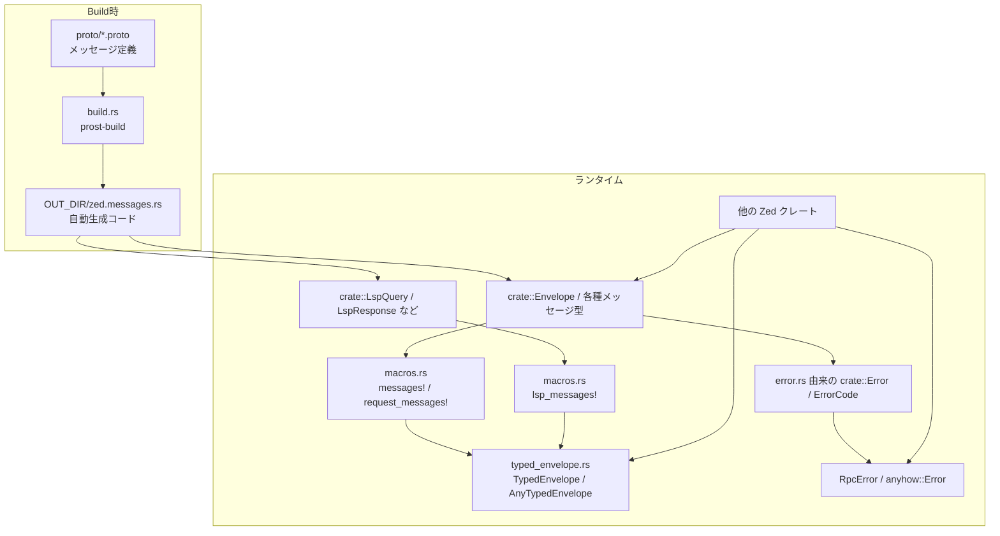
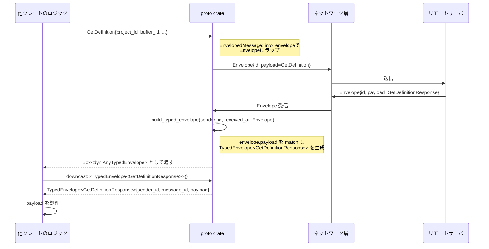
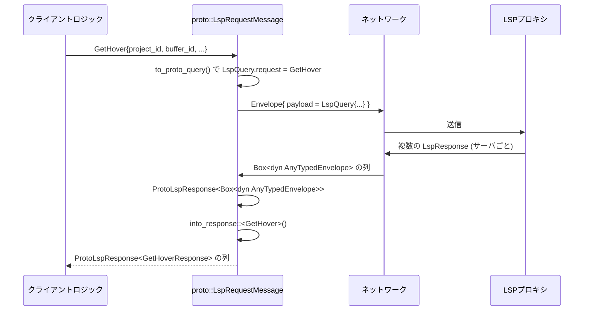

# proto/ ディレクトリ解説

## 1. ざっくり一言

Zed アプリ本体と zed.dev サーバ間でやり取りされる **すべての RPC メッセージ定義（.proto）** と、  
それを Rust から安全に扱うための **型付き Envelope / LSP ヘルパー / エラー型** をまとめた共通プロトコル crate です。

---

## 2. このモジュールの役割

### 2.1 概要

- この crate は、Zed のクライアントとサーバ間通信で使う **Protocol Buffers メッセージ群** と、それに基づく Rust API を提供します。
- `proto/` 以下の `.proto` ファイルから、`prost-build` によって Rust コードが自動生成されます。
- `src/` 以下では、その自動生成コードに対して:
  - メッセージを型安全に包む **TypedEnvelope** 周りの仕組み
  - **リクエスト/レスポンス対応付け**, **LSP 用ヘルパー**
  - **構造化エラー (`RpcError`)**  
  を追加し、アプリ側から扱いやすいインターフェースを提供します。

### 2.2 アーキテクチャ内での位置づけ

この crate 内の主要コンポーネントの関係は以下のようになっています。



- `.proto` ファイル群（`ai.proto`, `buffer.proto`, `zed.proto` など）が **通信プロトコルのスキーマ** です。
- `build.rs` が `prost-build` を利用して `zed.messages.rs` を生成し、`src/proto.rs` の `include!` で取り込みます。
- `macros.rs` と `typed_envelope.rs` が、生成された `Envelope` や各メッセージ型に対して **型安全なラッパーとメタ情報（優先度・エンティティ ID 等）** を与えます。
- `error.rs` は `.proto` で定義された `Error` / `ErrorCode` と `anyhow::Error` をつなぐ **構造化エラー層** を提供します。

### 2.3 設計上のポイント

コードから読み取れる範囲での特徴は次の通りです。

- **Codegen 前提の薄いラッパー構造**
  - すべてのドメインメッセージは `.proto` にあり、Rust 側は主に **Envelope 化・ルーティング・補助的変換** に集中しています。
- **メッセージの分類とメタデータ**
  - `MessagePriority::{Foreground, Background}` による優先度分類（UI 反応が必要なもの vs バックグラウンド処理）を付与。
  - `EntityMessage` によって「どのリモートエンティティ（主に project_id or channel_id）に属するメッセージか」を取り出せるようになっています。
- **リクエスト / レスポンス対応の型レベル表現**
  - `RequestMessage` と `LspRequestMessage` により、「このリクエストにはこのレスポンスが返ってくる」という対応が型で表現されています。
- **構造化エラー**
  - `.proto` の `Error{ message, code, tags }` に対応する `RpcError` を用意し、`anyhow::Error` と相互変換可能です。
  - `ErrorCodeExt` / `ErrorExt` により、「エラーコード＋任意メッセージ＋タグ」を簡潔に組み立てられるようにしています。
- **大きな更新メッセージの分割**
  - `UpdateWorktree` / `UpdateRepository` など「巨大になり得る更新」を一定サイズに分割する関数を提供しています。
- **LSP 特化の補助**
  - `LspRequestMessage` と `ProtoLspResponse` により、「複数 LSP サーバからのレスポンスを一括管理し、型付きで取り出す」仕組みがあります。

---

## 3. 主要な機能一覧

このディレクトリで提供される主要な機能は次の通りです。

- プロトコル定義
  - `.proto` ファイル群による、コラボレーション・Git・LSP・デバッガなどの **全 RPC メッセージ定義**。
- 自動生成された Rust メッセージ型
  - `Envelope`, `Hello`, `Error`, `UpdateWorktree`, `LspQuery`, `LspResponse` 等の型（`zed.messages.rs`）。
- Envelope ラッパー
  - 任意のメッセージを `Envelope` に **パック / アンパック** する `EnvelopedMessage` と `TypedEnvelope<T>`。
  - `build_typed_envelope` による `Envelope` → `TypedEnvelope<具体型>` のダイナミック変換。
- メッセージ分類・ルーティング
  - `MessagePriority` による前景／背景メッセージの区別。
  - `EntityMessage` による「project_id / channel_id 等からリモートエンティティを特定」する仕組み。
- リクエスト・レスポンス関連付け
  - `RequestMessage` による「単一レスポンス」型の対応付け。
  - `LspRequestMessage` ＋ `ProtoLspResponse` による LSP クエリ／レスポンスのブリッジ。
- 構造化エラー
  - `.proto` の `ErrorCode` と `Error` を元にした `RpcError` と、`anyhow::Error` との相互変換。
  - エラーコード・メッセージ・タグの付与と取り出し。
- 大きな更新メッセージのチャンク分割
  - `split_worktree_update(UpdateWorktree)` によるマルチチャンク化。
  - `split_repository_update(UpdateRepository)` によるステータス更新の分割。
- 補助変換
  - `Timestamp` ↔ `SystemTime` 変換。
  - `Nonce` ↔ `u128` 変換。
  - `PeerId` ↔ `u64` 変換、および Hash / Ord / Display 実装。

---

## 4. 関数・構造体の解説

### 4.1 主要な型・トレイト一覧

| 名前 | 種別 | 定義箇所 | 役割 / 用途 |
|------|------|----------|-------------|
| `Envelope` | 構造体（生成コード） | `zed.proto` | すべてのメッセージを `oneof payload` として詰め込む共通コンテナ |
| `Error` / `ErrorCode` | 構造体 / enum（生成コード） | `zed.proto` | RPC エラーの内容とコードを表現 |
| `RpcError` | 構造体 | `src/error.rs` | ErrorCode・メッセージ・タグを持つ構造化エラー。`anyhow::Error` との橋渡し |
| `ErrorCodeExt` | トレイト | `src/error.rs` | `ErrorCode`/`RpcError` からメッセージやタグ付きの `RpcError` / `anyhow::Error` を生成する拡張 |
| `ErrorExt` | トレイト | `src/error.rs` | `anyhow::Error` や `RpcError` から `ErrorCode` やタグ、`crate::Error` を取り出す拡張 |
| `EnvelopedMessage` | トレイト | `src/typed_envelope.rs` | 任意のメッセージ型を Envelope にパック／アンパックする共通インターフェース |
| `EntityMessage` | トレイト | `src/typed_envelope.rs` | メッセージがどのリモートエンティティ（例: project_id）に属するかを返す |
| `RequestMessage` | トレイト | `src/typed_envelope.rs` | リクエスト型に対応するレスポンス型を関連付ける |
| `LspRequestMessage` | トレイト | `src/typed_envelope.rs` | LSP 関連リクエストとレスポンス、およびバッファ情報を対応付ける |
| `MessagePriority` | enum | `src/typed_envelope.rs` | メッセージの優先度（Foreground / Background）を表現 |
| `TypedEnvelope<T>` | 構造体 | `src/typed_envelope.rs` | `Envelope` の中身を型付きで持つラッパー（sender_id・受信時刻付き） |
| `AnyTypedEnvelope` | トレイト | `src/typed_envelope.rs` | 型消去された TypedEnvelope（動的ディスパッチ用） |
| `ProtoLspResponse<R>` | 構造体 | `src/typed_envelope.rs` | 単一 LSP サーバからのレスポンス（server_id + payload） |
| `LspRequestId` | newtype | `src/typed_envelope.rs` | LSP リクエスト ID（u64） |
| `Receipt<T>` | 構造体 | `src/typed_envelope.rs` | 特定リクエストの sender_id / message_id のハンドル（ACK 等に使用） |
| `PeerId` | 構造体（生成コード + 拡張） | `core.proto` + `typed_envelope.rs` | オーナーとローカル ID を組み合わせた識別子。Hash / Ord / Display / u64 変換など |
| `Timestamp` | 構造体（生成コード + 拡張） | `worktree.proto` + `proto.rs` | Unix 時刻との相互変換を提供 |
| `Nonce` | 構造体（生成コード + 拡張） | `core.proto` + `proto.rs` | 128bit ノンスを 2 つの u64 に分割して保持 |

以下では、特に重要な機能をいくつか詳細に見ていきます。

### 4.2 構造化エラー関連 (`ErrorCodeExt`, `ErrorExt`, `RpcError`)

#### `trait ErrorCodeExt` とその実装

```rust
pub trait ErrorCodeExt {
    fn anyhow(self) -> anyhow::Error;
    fn message(self, msg: String) -> RpcError;
    fn with_tag(self, k: &str, v: &str) -> RpcError;
}
```

- **概要**
  - `.proto` 側の `ErrorCode`（例: `Forbidden`, `NoSuchProject` など）から、アプリ内で扱う `anyhow::Error` や `RpcError` を生成するための拡張トレイトです。
  - `ErrorCode` に直接 `.message("...")` や `.with_tag("key", "value")` をチェーンして、**構造化エラー** を簡潔に作れます。

- **主な実装**
  - `impl ErrorCodeExt for ErrorCode`
    - `anyhow(self)`  
      - `self.into()` 経由で `RpcError` → `anyhow::Error` へ変換します。
    - `message(self, msg)`  
      - `self` から `RpcError` を作り、その `msg` を上書きします。
    - `with_tag(self, k, v)`  
      - `self` から `RpcError` を作り、`"k=v"` 形式の文字列タグを `tags` に追加します。
  - `impl ErrorCodeExt for RpcError`
    - `message(self, msg)` / `with_tag(self, ...)` は既存の `RpcError` に追記する形で利用できます。
    - `.anyhow()` で `anyhow::Error` に変換できます。

- **使用例**

```rust
use proto::{ErrorCode, ErrorCodeExt};

// シンプルに Forbidden エラーを返す
let err: anyhow::Error = ErrorCode::Forbidden.anyhow();

// メッセージ付き
let err = ErrorCode::Forbidden.message("not an admin".to_string()).anyhow();

// タグ付き
let err = ErrorCode::CommitFailed
    .with_tag("repo", "/path/to/repo")
    .with_tag("branch", "main")
    .anyhow();
```

#### `trait ErrorExt` とその実装

```rust
pub trait ErrorExt {
    fn error_code(&self) -> ErrorCode;
    fn error_tag(&self, k: &str) -> Option<&str>;
    fn to_proto(&self) -> crate::Error;
    fn cloned(&self) -> anyhow::Error;
}
```

- **概要**
  - 主に `anyhow::Error` から、元になった `RpcError` の情報を取り出すためのトレイトです。
  - UI 層や RPC 層で、「どの ErrorCode か」「どんなタグが付いているか」を判定できます。

- **`anyhow::Error` に対する挙動**
  - `error_code()`  
    - 内部が `RpcError` ならその `code`、そうでなければ `ErrorCode::Internal` を返します。
  - `error_tag(k)`  
    - 内部が `RpcError` なら `tags` を `"key=value"` 形式で走査し、キー一致する値を返します。
  - `to_proto()`  
    - 内部が `RpcError` ならそのまま `crate::Error` へ変換します。
    - そうでなければ `ErrorCode::Internal` と、`format!("{self:#}")` の改行をスペースで連結した文字列をメッセージにした `crate::Error` を生成します。
  - `cloned()`  
    - 内部が `RpcError` ならクローンした `RpcError` を `anyhow::Error` として返します。
    - そうでなければ `anyhow::anyhow!("{self:#}")` で文字列化します。

- **エッジケース・注意点**
  - `error_tag` は `"key=value"` 形式でタグを格納しているため、値に `'='` を含めると分割結果が意図しない形になる可能性があります。
  - `to_proto()` で `ErrorCode::Internal` にフォールバックした場合、元のエラー型の細かい種類は失われます。

#### `struct RpcError`

- **フィールド**
  - `request: Option<String>` - エラーが起きた RPC リクエストの識別情報（任意）。
  - `msg: String` - エラーのメッセージ。
  - `code: ErrorCode` - `zed.proto` に定義されたエラーコード。
  - `tags: Vec<String>` - `"key=value"` 形式のタグ。

- **主なメソッド**
  - `raw_message(&self)`  
    - RPC 用のプレフィクスを付与しない、生の `msg` を返します。
  - `from_proto(error: &crate::Error, request: &str)`  
    - `.proto` 由来の `crate::Error` から `RpcError` を生成し、`request` 情報を補います。
  - `message(self, msg)` / `with_tag(self, k, v)`（`ErrorCodeExt` 実装経由）  
    - メッセージやタグを付け替え／追加します。
  - `to_proto(&self) -> crate::Error`（`ErrorExt` 実装）  
    - `code`, `message`, `tags` を持つ `.proto` の `Error` 型に変換します。

- **Display 実装**
  - `request` があれば `"RPC request {request} failed: {msg} {tag1} {tag2} ..."` 形式で表示されます。
  - なければ `{msg} {tag1} {tag2} ...`。

- **使用上の注意点**
  - `RpcError` 自体は `Sync + Send` 制約は明示されていませんが、`anyhow::Error` 経由でスレッド間に渡されることが多い点を意識する必要があります。
  - タグは文字列ベースなので、値の型情報は失われます（UI 側でパースする場合は約束事に従う必要があります）。

### 4.3 メッセージのチャンク分割 (`split_worktree_update`, `split_repository_update`)

#### `split_worktree_update(message: UpdateWorktree) -> impl Iterator<Item = UpdateWorktree>`

**概要**

- `UpdateWorktree` メッセージ内の `updated_entries`, `removed_entries`, `updated_repositories`, `removed_repositories` が大きくなりすぎないように、**最大 N 件ずつのチャンクに分割して返す** イテレータを生成します。
- `MAX_WORKTREE_UPDATE_MAX_CHUNK_SIZE` は本番で 256、テスト時は 2 に設定されています。

**引数 / 戻り値**

| 名前 | 型 | 説明 |
|------|----|------|
| `message` | `UpdateWorktree` | 元の大きな更新メッセージ（所有権をムーブ） |
| 戻り値 | `impl Iterator<Item = UpdateWorktree>` | 分割された `UpdateWorktree` を順に返すイテレータ |

**処理の流れ（簡略）**

1. `done` フラグを `false` にセット。
2. `iter::from_fn` でクロージャベースのイテレータを作る。
3. 各イテレーションで:
   - `message.updated_entries` から最大 `MAX_WORKTREE_UPDATE_MAX_CHUNK_SIZE` 件を `drain` して `updated_entries` として取り出す。
   - 同様に `removed_entries` も最大 N 件だけ `drain`。
   - `updated_repositories` については、各リポジトリごとに `updated_statuses` / `removed_statuses` を N 件以内に収まるように部分的に `drain` して `RepositoryEntry` を構築。
     - 使い切ったリポジトリは `message.updated_repositories.remove(0)` で削除。
     - `limit` が 0 になったらループを抜ける。
   - `updated_entries`, `removed_entries`, `updated_repositories` がすべて空になったら `done = true`。
4. `done` のときのみ、元の `message.removed_repositories` を `mem::take` して、このチャンクの `removed_repositories` に入れる。
5. その他のフィールド（`project_id`, `worktree_id`, `root_name`, `abs_path`, `root_repo_common_dir`, `scan_id`）は元メッセージからコピー。
6. `is_last_update` は `done && message.is_last_update` として、「元の is_last_update が true かつこのチャンクが最後」のときだけ true になります。

**エッジケース**

- 元の `updated_entries` / `removed_entries` / `updated_repositories` が空の場合でも、`removed_repositories` があれば **最後に 1 回だけ**（空更新だが `removed_repositories` を含む）メッセージが返ります。
- `checked_add` のような panic の可能性はありません（純粋なベクタ操作のみ）。

**使用上の注意点**

- 元の `message` は内部で `drain` / `remove` / `mem::take` されるため、**イテレータ生成後に `message` を使い回すことはできません**。
- 送信側と受信側が `is_last_update` の意味を共有している前提で使う必要があります。

#### `split_repository_update(update: UpdateRepository) -> impl Iterator<Item = UpdateRepository>`

**概要**

- 単一リポジトリの `UpdateRepository` について、`updated_statuses` と `removed_statuses` のみを **最大 N 件ずつ** に分割するイテレータを生成します。

**処理の流れ（簡略）**

1. `mem::take(&mut update.updated_statuses)` / `removed_statuses` で元のベクタを取り出し、`IntoIterator::into_iter().fuse()` したイテレータを作成。
2. `from_fn` のクロージャ内で:
   - 各イテレーションごとに `take(N)` で `updated_statuses` と `removed_statuses` をベクタに収集。
   - 両方とも空なら `None` を返し、イテレータ終了。
   - そうでなければ、`..update.clone()` で他フィールドをコピーした `UpdateRepository` を返し、`is_last_update = false` をセット。
3. 最後に、`updated_statuses` / `removed_statuses` が空で `is_last_update = true` の `UpdateRepository` を 1 件だけチェインします。

**エッジケース**

- 元の `updated_statuses` / `removed_statuses` が空の場合でも、「`is_last_update = true` の空メッセージ」が必ず 1 件返ります。

**使用上の注意点**

- 受信側は、「最後のチャンクは `is_last_update == true` である」前提で処理する必要があります。
- 更新の順序はベクタの順序そのままです。

### 4.4 LSP クエリ補助 (`LspRequestMessage`, `ProtoLspResponse`, `LspQuery::query_name_and_write_permissions`)

#### `trait LspRequestMessage`

- **役割**
  - LSP ベースのリクエスト（`GetDefinition`, `GetHover`, `GetDocumentColor` 等）を proto レベルの `LspQuery` / `LspResponse` にブリッジするためのトレイトです。
  - `lsp_messages!` マクロで、各リクエスト／レスポンスペアに自動実装されています。

- **主要メソッド**
  - `to_proto_query(self) -> crate::lsp_query::Request`
    - 自身を `LspQuery` の `oneof request` 用 enum に包む。
  - `response_to_proto_query(response: Self::Response) -> crate::lsp_response::Response`
    - 対応するレスポンス型を `LspResponse` の `oneof response` 用 enum に包む。
  - `buffer_id(&self) -> u64`
  - `buffer_version(&self) -> &[crate::VectorClockEntry]`
  - `stop_previous_requests() -> bool`
    - true なら同種の過去リクエストをキャンセル・無視するポリシーを示すために利用されます。

#### `struct ProtoLspResponse<R>`

```rust
pub struct ProtoLspResponse<R> {
    pub server_id: u64,
    pub response: R,
}
```

- 単一の LSP サーバからのレスポンスを、`server_id` とセットで保持します。
- 特に `R = Box<dyn AnyTypedEnvelope>` の場合、`into_response::<T: LspRequestMessage>` によって、「期待するレスポンス型」に downcast できます。

```rust
impl ProtoLspResponse<Box<dyn AnyTypedEnvelope>> {
    pub fn into_response<T: LspRequestMessage>(self) -> Result<ProtoLspResponse<T::Response>> {
        let envelope = self
            .response
            .into_any()
            .downcast::<TypedEnvelope<T::Response>>()
            .map_err(|_| {
                anyhow::anyhow!(
                    "cannot downcast LspResponse to {} for message {}",
                    T::Response::NAME,
                    T::NAME,
                )
            })?;

        Ok(ProtoLspResponse {
            server_id: self.server_id,
            response: envelope.payload,
        })
    }
}
```

- **エッジケース**
  - downcast に失敗すると `anyhow::Error` が返されます。その場合は「型の対応付けが誤っている」か、「別種の LSP レスポンスを混在させている」ことを意味します。

#### `impl LspQuery { pub fn query_name_and_write_permissions(&self) -> (&str, bool) }`

- **概要**
  - `LspQuery` の `request` 内容から、「問い合わせ名」と「書き込み権限が必要かどうか」を取得するユーティリティです。
  - ログや権限制御に利用できます。

- **戻り値**
  - `(&str, bool)`:
    - `&str` は `"GetHover"`, `"GetCodeActions"` 等の名前。
    - `bool` は「書き込み操作の可能性があるかどうか」。
      - `GetCodeActions` のみ `true`（コードアクション適用は編集を伴う可能性がある）。
      - それ以外の既知のクエリは `false`。
      - `None`（`request` が無い）時は `("<unknown>", true)` を返します。

- **使用上の注意点**
  - この関数は **判定ロジックを固定文字列ベースで持っている** ため、新しい LSP クエリを追加する際は、必要に応じてここも更新する必要があります。

### 4.5 Envelope と ID 関連 (`EnvelopedMessage`, `TypedEnvelope`, `PeerId`)

#### `trait EnvelopedMessage`

- **役割**
  - 任意のメッセージ型（prost 生成された `Hello`, `UpdateWorktree`, `GetDefinition` 等）を、共通コンテナ `Envelope` に包んだり、`Envelope` から取り出したりするためのインターフェースです。

- **主な要件**
  - `Clone + Debug + Serialize + Sized + Send + Sync + 'static`

- **主なメソッド**
  - `into_envelope(self, id, responding_to, original_sender_id) -> Envelope`
  - `from_envelope(envelope: Envelope) -> Option<Self>`

- **実装**
  - `messages!` マクロにより、`proto.rs` の大きなリストに登場する各メッセージについて自動実装されています。

#### `struct TypedEnvelope<T>`

```rust
#[derive(Clone, Debug)]
pub struct TypedEnvelope<T> {
    pub sender_id: PeerId,
    pub original_sender_id: Option<PeerId>,
    pub message_id: u32,
    pub payload: T,
    pub received_at: Instant,
}
```

- **役割**
  - `Envelope` に包まれていたメッセージを **型付きで取り出しつつ、メタ情報（送信者 ID・受信時刻 等）を保持する** コンテナです。
- **主なメソッド**
  - `original_sender_id(&self) -> Result<PeerId>`
    - `original_sender_id` が `None` の場合は `anyhow::Error` を返します。
  - `receipt(&self) -> Receipt<T>`（`T: RequestMessage` のとき）
    - ACK やレスポンスを返す際に使う、「このリクエストの送り主とメッセージ ID」を取り出します。

#### `impl PeerId`（`typed_envelope.rs`）

```rust
impl PeerId {
    pub fn from_u64(peer_id: u64) -> Self {
        let owner_id = (peer_id >> 32) as u32;
        let id = peer_id as u32;
        Self { owner_id, id }
    }

    pub fn as_u64(self) -> u64 {
        ((self.owner_id as u64) << 32) | (self.id as u64)
    }
}
```

- **役割**
  - `PeerId { owner_id: u32, id: u32 }` を 64bit の整数にパック／アンパックするヘルパーです。
  - ソートやハッシュ、表示用に `Copy`, `Eq`, `Ord`, `Hash`, `Display` も実装されています。

- **エッジケース**
  - `from_u64` と `as_u64` はビット単位で対応しているため、他の変換（例えば異なるフィールド配置）と混在させないことが前提です。
  - `tests` モジュールで、様々な境界値で `PeerId::from_u64(peer.as_u64()) == peer` が検証されています。

---

## 5. データフロー

### 5.1 代表的なフロー: リクエスト送信と TypedEnvelope による受信

ここでは、プロジェクトに紐づく `GetDefinition` リクエストを送信し、レスポンスを処理する流れを概念的に示します。



- 実装上、`build_typed_envelope` は `messages!` マクロによって生成されます。
  - `Envelope.payload` の `oneof`（`envelope::Payload`）を `match` し、対応する `TypedEnvelope<T>` を作成します。
  - 対応する型でない場合は `None` を返します。
- 上位ロジックでは `Box<dyn AnyTypedEnvelope>` として受け取り、`payload_type_id` や `downcast` によって実際のメッセージ型を判定します。

### 5.2 LSP クエリのフロー（概念）



- 1 つの LSP リクエストに対して、複数サーバから複数レスポンスが返り得る点が特徴です。
- `LspRequestMessage` により、`buffer_id`, `version` などの必須情報が一貫した方法で取得できます。

---

## 6. 使い方（How to Use）

### 6.1 基本的な使用方法

#### 6.1.1 型付きメッセージを Envelope 経由で送受信する

以下は、任意のメッセージ（例として `GetDefinition`）を Envelope に包み、レスポンスを TypedEnvelope 経由で受信する際のパターンを簡略化した例です。

```rust
use proto::{
    EnvelopedMessage, RequestMessage, AnyTypedEnvelope, TypedEnvelope,
    Envelope, PeerId,
};
use std::time::Instant;

// 送信側: GetDefinition リクエストを Envelope に包む例
fn send_get_definition(
    sender_id: PeerId,                       // このクライアントの PeerId
    next_id: u32,                            // メッセージ ID カウンタ
    request: proto::GetDefinition,          // prost 生成された型
) -> Envelope {
    // RequestMessage::Response = GetDefinitionResponse が型で保証される
    request.into_envelope(next_id, None, Some(sender_id))
}

// 受信側: Envelope を TypedEnvelope<GetDefinitionResponse> に変換する例
fn handle_response(
    sender_id: PeerId,                       // サーバ (REMOTE_SERVER_PEER_ID) など
    envelope: Envelope,
) -> Option<TypedEnvelope<proto::GetDefinitionResponse>> {
    let received_at = Instant::now();

    // messages! マクロが生成する関数
    if let Some(any_envelope) =
        proto::build_typed_envelope(sender_id, received_at, envelope)
    {
        // 具体的な型にダウンキャスト
        if let Ok(te) = any_envelope
            .into_any()
            .downcast::<TypedEnvelope<proto::GetDefinitionResponse>>()
        {
            return Some(*te);  // Box から取り出し
        }
    }

    None
}
```

このように、実際のメッセージ型は `EnvelopedMessage` トレイトと `build_typed_envelope` によって **共通の Envelope 表現と型安全な世界を行き来** できます。

#### 6.1.2 構造化エラーの生成と変換

```rust
use proto::{ErrorCode, ErrorCodeExt, ErrorExt};

fn do_something() -> Result<(), anyhow::Error> {
    // 何らかの条件で Forbidden エラーを返す
    if !user_is_admin() {
        return Err(
            ErrorCode::Forbidden
                .message("not an admin".to_string())
                .with_tag("required_role", "admin")
                .anyhow()
        );
    }

    Ok(())
}

fn handle_error(err: anyhow::Error) {
    // エラーコードごとの分岐
    match err.error_code() {
        ErrorCode::Forbidden => {
            let required = err.error_tag("required_role").unwrap_or("unknown");
            eprintln!("Forbidden. Required role: {}", required);
        }
        ErrorCode::Internal => {
            eprintln!("Internal error: {}", err);
        }
        _ => {
            eprintln!("Other error: {}", err);
        }
    }

    // RPC で返す場合
    let proto_error: proto::Error = err.to_proto();
    // ここで Envelope に詰めて送信できる
}
```

### 6.2 よくある使用パターン

1. **プロジェクト単位でのメッセージルーティング（EntityMessage）**
   - `entity_messages!({project_id, ShareProject}, ...)` により、
     - `AddProjectCollaborator`, `UpdateWorktree`, `GitDiff` など多数のメッセージが `EntityMessage<Entity = ShareProject>` として扱えます。
   - ルータ側で `remote_entity_id()` を使い、`project_id` ごとにメッセージキューを分離するといった使い方が可能です。

2. **チャネル単位でのメッセージルーティング**
   - `entity_messages!({channel_id, Channel}, ...)` により、
     - `ChannelMessageSent`, `UpdateChannelBuffer` 等が `channel_id` ベースで扱えます。

3. **LSP リクエストのキャンセル／デデュープ（LspRequestMessage）**
   - `lsp_messages!` の第 3 引数 `stop_previous_requests` が true のもの（例: `GetHover`, `GetDefinition` など）は、
     - 新しいリクエストが来たときに以前の同種リクエストをキャンセルするポリシーを取りやすくなります。
   - false の `InlayHints` のようなものは、複数同時に走らせても問題ない前提です。

4. **バックグラウンド vs フォアグラウンド**
   - `MessagePriority::Foreground` なメッセージ（例: `Hello`, `JoinRoom`, `SaveBuffer`）は UI 反応に直結するものが多く、優先的に処理されることを想定しています。
   - `MessagePriority::Background` なメッセージ（例: `GitDiff`, `LspQuery`, `GetCrashFiles`）は長時間かかる可能性のある処理として扱われます。

### 6.3 使用上の注意点（まとめ）

- **.proto の変更とコード生成**
  - `.proto` ファイルを変更した場合、`build.rs` が `prost-build` を通じて `zed.messages.rs` を再生成します。
  - フィールド番号の変更や削除は後方互換性に影響するため、`.proto` 側の reserved 指定等に従う必要があります（ファイル内に多くの `reserved` が存在します）。
- **Timestamp / SystemTime 変換**
  - `impl From<Timestamp> for SystemTime` は `UNIX_EPOCH.checked_add(...).unwrap()` を使用しているため、極端に大きな値が渡された場合には panic し得ます。
  - 通常は `.proto` から来る値が妥当である前提ですが、外部入力をそのまま流す構成にする場合は注意が必要です。
- **LspQuery::query_name_and_write_permissions の保守**
  - 新しい LSP クエリを `.proto` に追加した場合、必要に応じて `query_name_and_write_permissions` の `match` にもケースを追加する必要があります。
- **Error タグの形式**
  - `RpcError` の `tags` は単純な `"key=value"` 形式です。値に `=` を含めると分割ロジックが曖昧になるため、必要ならエスケープ規則を上位で決める必要があります。
- **TypedEnvelope / AnyTypedEnvelope の downcast**
  - `ProtoLspResponse::into_response` や任意の `Box<dyn AnyTypedEnvelope>` の downcast は、メッセージ型の対応付けが正しいことが前提です。型を間違えると `anyhow::Error` になります。

---

## 7. 関連ファイル

| パス | 役割 / 関係 |
|------|------------|
| `proto/Cargo.toml` | crate 名や依存関係、ライブラリエントリ (`src/proto.rs`) を定義 |
| `proto/build.rs` | `prost-build` を使って `proto/*.proto` から `OUT_DIR/zed.messages.rs` を生成し、全メッセージ型に `serde::{Serialize, Deserialize}` を付与。`ProjectPath` と `Anchor` に `Hash, Eq` を derive |
| `proto/proto/ai.proto` | AI サーバ関連メッセージ（Agent サーバコマンド、外部エージェント、スレッド共有） |
| `proto/proto/app.proto` | アプリレベルの設定・クラッシュレポート・拡張機能同期・リモートプロファイリングなど |
| `proto/proto/buffer.proto` | コラボ用バッファ、編集操作、診断、検索クエリなど、テキストバッファ周り |
| `proto/proto/call.proto` | ルーム、通話、プロジェクト共有、フォロー／ビュー、連絡先などのコラボ機能 |
| `proto/proto/channel.proto` | チャットチャンネル、チャンネルメッセージ、チャンネルバッファ（スレッド）関連 |
| `proto/proto/core.proto` | 基本型（`PeerId`, `User`, `Nonce`, `Collaborator`） |
| `proto/proto/debugger.proto` | DAP（Debug Adapter Protocol）に対応するメッセージ、ブレークポイント、デバッグタスクなど |
| `proto/proto/download.proto` | ファイルダウンロード（パス指定・チャンク転送） |
| `proto/proto/git.proto` | Git リポジトリ状態、ブランチ、stash、diff、blame、worktree などの Git 関連 API |
| `proto/proto/image.proto` | 画像ファイルのオープン・チャンク転送 |
| `proto/proto/lsp.proto` | LSP 関連（定義ジャンプ、補完、コードアクション、診断、インレイヒント等）と LSP ログ・制御 |
| `proto/proto/notification.proto` | 通知の取得・追加・更新・削除 |
| `proto/proto/task.proto` | タスク実行環境、シェル設定、SpawnInTerminal など |
| `proto/proto/toolchain.proto` | プロジェクトごとのツールチェーン列挙・アクティベーション・解決 |
| `proto/proto/worktree.proto` | Worktree / ファイルエントリ / プロジェクト操作・信頼設定など |
| `proto/proto/zed.proto` | `Envelope` と、上記全てのメッセージを `payload` として束ねるトップレベルプロトコル定義 |
| `proto/src/error.rs` | `.proto` の `Error` / `ErrorCode` と `anyhow::Error` を橋渡しする構造化エラー (`RpcError`) と拡張トレイト |
| `proto/src/macros.rs` | `messages!`, `request_messages!`, `entity_messages!`, `lsp_messages!` など、生成コードに対するマクロ拡張 |
| `proto/src/proto.rs` | crate のメインモジュール。`zed.messages.rs` を `include!` し、マクロ適用、各種変換関数（Timestamp, Nonce, Worktree 更新分割、LspQuery 補助）を定義 |
| `proto/src/typed_envelope.rs` | `EnvelopedMessage`, `TypedEnvelope`, `AnyTypedEnvelope`, `EntityMessage`, `RequestMessage`, `LspRequestMessage` や `PeerId` の補助実装など、Envelope・LSP 周りの中核 |

このディレクトリ全体として、Zed のクライアント／サーバ間プロトコルの「**単一の真実の場所 (single source of truth)**」として機能しつつ、Rust コードからそれを安全かつ実用的に扱うためのインフラを提供していると解釈できます。
