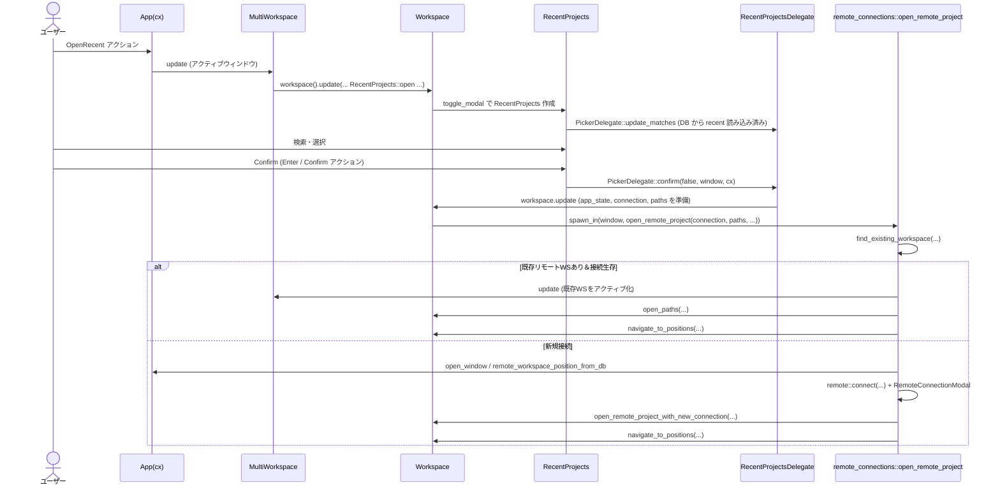

# recent_projects/ ディレクトリ解説

## 1. ざっくり一言

ローカル・リモートを含む「最近開いたプロジェクト」や「リモートサーバー／WSL／Dev Container 接続」を管理し、UI（モーダル・サイドバー・トースト）からプロジェクトを開くための機能群です。

---

## 2. このモジュールの役割

### 2.1 概要

- このクレートは Zed の「最近のプロジェクト」体験を提供するモジュールです。
- ローカル・リモート（SSH / WSL / Dev Container）のワークスペース履歴を `WorkspaceDb` から読み取り、ピッカー UI で検索・選択できるようにします。
- SSH/WSL/Dev Container の接続設定を `settings` に保存・編集し、そこからリモートプロジェクトを開くためのモーダル (`RemoteServerProjects`) を提供します。
- Dev Container 関連として:
  - `.devcontainer` の追加を検知して再オープンを提案するトースト
  - 明示的な `OpenDevContainer` アクションから起動する Dev Container 接続モーダル
  を提供します。
- リモート接続が切断されたときに再接続を促すオーバーレイ (`DisconnectedOverlay`) も含みます。

### 2.2 アーキテクチャ内での位置づけ

主要な内部モジュールと外部クレートとの関係を簡略化した図です。

```mermaid
graph TD
    RP[recent_projects (lib)]
    DCS[dev_container_suggest]
    DO[disconnected_overlay]
    RC[remote_connections]
    RS[remote_servers]
    SRP[sidebar_recent_projects]
    SSHC[ssh_config]
    WSLP[wsl_picker]

    WS[workspace]
    PROJ[project]
    REM[remote]
    UI[gpui/ui/picker]

    RP --> DCS
    RP --> DO
    RP --> RC
    RP --> RS
    RP --> SRP
    RP --> SSHC
    RP --> WSLP

    RP --> WS
    RP --> PROJ
    RP --> REM
    RP --> UI
```

- `recent_projects.rs` がライブラリ本体で、アクション登録 (`init`) や主要な型・関数を提供します。
- `remote_connections.rs` は「具体的にリモートプロジェクトを開く処理」を担当し、リモートクライアント確立や既存ウィンドウの再利用を行います。
- `remote_servers.rs` は「接続先サーバーや Dev Container の一覧・設定編集 UI」を担当します。
- `sidebar_recent_projects.rs` / `RecentProjects` は「最近のプロジェクトピッカー UI（モーダル／サイドバー）」を担当します。
- `dev_container_suggest.rs`, `wsl_picker.rs`, `ssh_config.rs`, `disconnected_overlay.rs` はそれぞれ特化した補助的機能を提供します。

### 2.3 設計上のポイント

- **イベント／アクション駆動**  
  - `zed_actions::OpenRecent`, `OpenRemote`, `OpenDevContainer` などのアクションを `init` で登録し、ユーザー操作から UI を起動します。
  - `project::Event` や `DismissEvent` などのイベント購読により、接続切断や Dev Container 検出といった状態変化に反応します。

- **非同期タスクと UI 更新の分離**
  - DB やリモートへの I/O はすべて `cx.spawn_in` / `AsyncApp` 経由の非同期タスクで行い、完了後に `update_in` で UI を更新する構造になっています。
  - 長時間かかり得る処理（DB 読み込み、リモート接続）は UI スレッドをブロックしません。

- **ローカル／リモートの明確な区別**
  - `SerializedWorkspaceLocation::{Local, Remote}` によってワークスペースの種類を区別し、UI 上のアイコンやアクション（再利用／再接続）を切り替えています。
  - リモートの場合は `RemoteConnectionOptions`（SSH / WSL / Docker / Mock）を通して接続オプションを扱います。

- **設定・履歴の永続化**
  - 最近のワークスペースは `WorkspaceDb` に保持され、`recent_workspaces_on_disk` で取得します。
  - SSH / WSL 接続設定やリモートプロジェクトリストは `SettingsStore` の `remote.*` セクションに保存し、UI から編集すると `update_settings_file` で反映されます。
  - Dev Container の「再度提案しない」状態は `KeyValueStore` に保存されます。

- **UI コンポーネントの再利用**
  - プロジェクト選択系の UI はすべて `Picker<T>` と `PickerDelegate` をベースにしており、モーダル版 (`RecentProjects`) とサイドバー版 (`SidebarRecentProjects`) でロジックを共有しつつ表示スタイルだけを変えています。

---

## 3. 主要な機能一覧

- 最近プロジェクトの取得:
  - `get_recent_projects` で DB からローカルの最近ワークスペースを読み込み、表示用エントリを構築します。
- 最近プロジェクトモーダル:
  - `RecentProjects` + `RecentProjectsDelegate` により、現在のウィンドウ＋最近プロジェクトを横断的に検索・オープンします。
- サイドバー最近プロジェクト:
  - `SidebarRecentProjects` でサイドバー用のコンパクトな最近プロジェクトピッカーを提供します。
- リモート接続＆プロジェクトオープン:
  - `open_remote_project`（`remote_connections.rs`）で SSH / WSL / Dev Container に接続し、リモートパスを開きます。
  - 既存リモートウィンドウの再利用や、行・列指定付きパスへのジャンプも行います。
- リモートサーバー管理 UI:
  - `RemoteServerProjects` で SSH サーバー / WSL ディストロ / Dev Container の一覧・作成・編集 UI を提供します。
  - `ssh_config` からのホスト自動検出、WSL ディストロの自動検出も含まれます。
- Dev Container 関連:
  - `OpenDevContainer` アクションから Dev Container を選択・起動し、その中にリモートプロジェクトとして接続します。
  - `.devcontainer` 追加時にプロジェクトを Dev Container で開き直すかを提案する `dev_container_suggest::suggest_on_worktree_updated`。
- WSL 関連（Windows 限定）:
  - `WslPickerDelegate` / `WslOpenModal` で WSL ディストロ一覧から選択して開く UI を提供します。
  - 任意のローカルパスを WSL パスに変換して開くアクション (`OpenFolderInWsl`, `OpenWslPath`) を取り扱います。
- 接続切断オーバーレイ:
  - `DisconnectedOverlay` でリモート接続が切れた際にメッセージと再接続ボタンを提示します。

---

## 4. 関数・構造体の解説

### 4.1 主要な型一覧

| 名前 | 種別 | モジュール | 役割 / 用途 |
|------|------|-----------|-------------|
| `RecentProjectEntry` | 構造体 | `recent_projects` | 最近のローカルワークスペース 1 件を表す表示用データ |
| `RecentProjects` | 構造体 | `recent_projects` | 「最近のプロジェクト」モーダルのルートビュー |
| `RecentProjectsDelegate` | 構造体 | `recent_projects` | モーダル内 `Picker` の振る舞い（検索・描画・決定）を定義 |
| `ProjectPickerEntry` | enum | `recent_projects` | ピッカーに表示される 1 行分（見出し／開いているフォルダ／開いているプロジェクト／最近プロジェクト） |
| `SidebarRecentProjects` | 構造体 | `sidebar_recent_projects` | サイドバー用の最近プロジェクトポップオーバー |
| `SidebarRecentProjectsDelegate` | 構造体 | `sidebar_recent_projects` | サイドバー用ピッカーの振る舞い |
| `RemoteSettings` | 構造体 | `remote_connections` | SSH / WSL 接続設定（settings 経由で永続化される） |
| `Connection` | enum | `remote_connections` | SSH / WSL / Dev Container の接続種別をまとめるラッパー |
| `RemoteServerProjects` | 構造体 | `remote_servers` | SSH/WSL/Dev Container 一覧＋編集＋接続 UI のルート |
| `RemoteEntry` | enum | `remote_servers` | リモートサーバーの 1 エントリ（settings 由来 or ssh_config 由来） |
| `CreateRemoteServer` | 構造体 | `remote_servers` | 「SSH サーバー追加」モードの内部状態 |
| `CreateRemoteDevContainer` | 構造体 | `remote_servers` | Dev Container 起動 UI の内部状態 |
| `DevContainerPickerDelegate` | 構造体 | `remote_servers` | Dev Container 設定ファイルの選択ピッカー |
| `DisconnectedOverlay` | 構造体 | `disconnected_overlay` | リモート切断時のオーバーレイモーダル |
| `WslPickerDelegate` | 構造体 | `wsl_picker` | WSL ディストロ一覧ピッカー |
| `WslOpenModal` | 構造体 | `wsl_picker` | 「選んだ WSL ディストロでパスを開く」モーダル |
| `RemoteServerProjects::Mode` | enum | `remote_servers` | RemoteServerProjects 内の表示モード切り替え（一覧／作成／編集など） |
| `PathWithPosition` | 構造体（他クレート） | `util::paths` | `path:line:column` 形式のパス＋位置情報を表現（ここでは利用側のみ） |

### 4.2 重要関数の詳細（7件）

#### 1. `init(cx: &mut App)`

**概要**

`recent_projects` クレート全体のエントリーポイントで、Zed の `App` に対してアクションハンドラやモーダルの登録を行います。

**主な役割**

- Windows 上の WSL 関連アクション (`OpenFolderInWsl`, `OpenWsl`, `OpenWslPath`) のハンドリング。
- `OpenRecent` アクションから `RecentProjects` モーダルを開く。
- `OpenRemote` アクションから `RemoteServerProjects` モーダルを開く。
- `OpenDevContainer` アクションから Dev Container 接続モーダルを開く。
- `DisconnectedOverlay` の登録。
- Worktree 更新イベントを監視して Dev Container の提案トーストを出す。

**内部処理の流れ（要点）**

- 必要な OS 条件付きアクション（WSL 関連）は `#[cfg(target_os = "windows")]` 下で登録。
- `cx.on_action(|open_recent: &OpenRecent, cx| { ... })` のようにして各アクションに対応するクロージャを登録。
  - `OpenRecent` の場合：
    - アクティブなウィンドウが `MultiWorkspace` かどうかを判定。
    - すでに `RecentProjects` モーダルが開いていれば、その中の選択をサイクル。
    - 開いていなければ `RecentProjects::open` を呼び出してモーダルを開く。
  - `OpenRemote` の場合：
    - 既存接続を使うかどうかを `from_existing_connection` で分岐。
    - `RemoteServerProjects::new` でモーダルを開く。
  - `OpenDevContainer` の場合：
    - プロジェクトがローカルかチェック（リモートからは Dev Container を開けないため）。
    - `RemoteServerProjects::new_dev_container` で Dev Container 用モーダルを開く。
- `cx.observe_new(DisconnectedOverlay::register)` により新しい `Workspace` 生成時に切断オーバーレイを登録。
- `cx.observe_new` で `project::Event::WorktreeUpdatedEntries` を購読し、Dev Container 提案関数に委譲。

**使用上の注意点**

- この関数は Zed のアプリ起動時に一度だけ呼び出すことを前提としています。
- 他のクレートから直接 UI コンポーネントを使う場合でも、`init` を通してアクション等が登録されている必要があります。

---

#### 2. `get_recent_projects(...) -> Vec<RecentProjectEntry>`

```rust
pub async fn get_recent_projects(
    current_workspace_id: Option<WorkspaceId>,
    limit: Option<usize>,
    fs: Arc<dyn fs::Fs>,
    db: &WorkspaceDb,
) -> Vec<RecentProjectEntry>
```

**概要**

`WorkspaceDb` に保存されている最近のワークスペース一覧から、現在のワークスペースを除き、かつローカルなものだけを抽出して表示用の `RecentProjectEntry` に変換します。

**引数**

| 引数名 | 型 | 説明 |
|--------|----|------|
| `current_workspace_id` | `Option<WorkspaceId>` | 現在アクティブなワークスペース ID（表示対象から除外） |
| `limit` | `Option<usize>` | 取得件数の上限（`None` なら全件） |
| `fs` | `Arc<dyn Fs>` | ファイルシステムアクセス用。DB 側のフィルタリングで利用される |
| `db` | `&WorkspaceDb` | 最近ワークスペース情報のストア |

**戻り値**

- フィルタリング済みの `RecentProjectEntry` ベクタ。
  - `name`: 単一パスならその末尾ディレクトリ名、複数ならカンマ区切りの名前。
  - `full_path`: パス群を `\n` 区切りで連結した文字列。
  - `paths`: 実際の `PathBuf` リスト。

**内部処理の流れ**

1. `db.recent_workspaces_on_disk(fs.as_ref()).await.unwrap_or_default()` で最近ワークスペースを取得。
2. `current_workspace_id` と等しい ID、または `SerializedWorkspaceLocation::Local` 以外（リモート）をフィルタリングで除外。
3. 各エントリについて:
   - `PathList` から `paths()` と `ordered_paths()` を取り出す。
   - パスの数が 1 ならディレクトリ名（`file_name`）、複数ならディレクトリ名をカンマ区切りで `name` にする。
   - `full_path` は `ordered_paths` の文字列表現を改行区切りで連結。
4. `limit` が指定されていれば `take(n)` で上限をかける。

**エッジケース**

- DB が空、あるいはエラーが起きた場合は `Vec::new()` が返ります（`unwrap_or_default`）。
- パスからファイル名が取得できない場合（ルートなど）はパス全体を `name` に使います。
- `limit = Some(0)` の場合は空ベクタを返します。

**使用例**

```rust
use std::sync::Arc;
use fs::FakeFs; // 実際には workspace 側の Fs 実装を使う
use workspace::WorkspaceDb;

async fn print_recent(db: &WorkspaceDb, fs: Arc<dyn fs::Fs>) {
    let recents = get_recent_projects(None, Some(10), fs, db).await;
    for entry in recents {
        println!("{} -> {}", entry.name, entry.full_path);
    }
}
```

---

#### 3. `RecentProjects::open(...)`

```rust
pub fn open(
    workspace: &mut Workspace,
    create_new_window: bool,
    sibling_workspace_ids: HashSet<WorkspaceId>,
    window: &mut Window,
    focus_handle: FocusHandle,
    cx: &mut Context<Workspace>,
)
```

**概要**

現在の `Workspace` に対して「最近のプロジェクト」モーダル (`RecentProjects`) を開きます。既に開いているフォルダ・同一ウィンドウ内のワークスペース・DB 上の最近ワークスペースをまとめて検索・選択できる UI を構築します。

**内部処理の流れ**

1. `workspace` の `WeakEntity` を作成（モーダル内での参照用）。
2. `get_open_folders` を呼び出して、同一ワークスペース内に開いている複数のフォルダ情報を収集。
3. プロジェクトの `remote_connection_options` を取得（現在接続中のリモート有無を判断）。
4. `fs` としてアプリ状態の `fs` を `Some` で渡し、`RecentProjects::new` を呼び出してモーダル本体を生成。
5. `workspace.toggle_modal(window, cx, |window, cx| { ... })` を通じてモーダルを開く。

**Examples**

モーダルを開く簡略例（実際には `init` 内でアクションから呼ばれています）:

```rust
workspace.update(cx, |workspace, cx| {
    let focus = workspace.focus_handle(cx);
    RecentProjects::open(
        workspace,
        /* create_new_window = */ false,
        HashSet::new(),
        window,
        focus,
        cx,
    );
});
```

**使用上の注意点**

- `RecentProjects::open` は既存のモーダルと排他的に動作します。すでに `RecentProjects` が開いている場合は、`init` のロジック上、代わりに選択サイクルが行われます。
- `sibling_workspace_ids` には同じ `MultiWorkspace` 内で開いている他ワークスペース ID を渡すことで、「このウィンドウ」セクションと「最近プロジェクト」セクションを適切に分けています。

---

#### 4. `SidebarRecentProjects::popover(...)`

```rust
pub fn popover(
    workspace: WeakEntity<Workspace>,
    sibling_workspace_ids: HashSet<WorkspaceId>,
    _focus_handle: FocusHandle,
    window: &mut Window,
    cx: &mut App,
) -> Entity<Self>
```

**概要**

サイドバー等から呼び出す「最近プロジェクト」ポップオーバー UI を新規に生成します。`RecentProjects` モーダルのコンパクト版です。

**内部処理の流れ**

1. `workspace` が `upgrade` できるならその `fs` を取得。
2. `SidebarRecentProjectsDelegate` を初期化し、`Picker::list` でピッカー UI を構築。
3. `picker` の `FocusHandle` を `delegate` に記録。
4. `Picker` の `DismissEvent` を購読し、ピッカーが閉じられたら `SidebarRecentProjects` も閉じるように設定。
5. 非同期タスクを起動:
   - `WorkspaceDb::global(cx)` から DB を取得。
   - `recent_workspaces_on_disk` と `resolve_worktree_workspaces` で最近ワークスペースを解決。
   - 完了後、`delegate.set_workspaces` と `picker.update_matches` を呼んで一覧を更新。
6. 最後に `picker.focus_handle(cx).focus(window, cx)` でフォーカスを当てる。

**使用例**

```rust
let sidebar_popover = SidebarRecentProjects::popover(
    workspace.downgrade(),
    HashSet::new(),
    workspace.focus_handle(cx),
    window,
    cx,
);
```

**使用上の注意点**

- `Workspace` がすでにドロップされている場合は `fs` が取得できず、そのまま何も表示されないことがあります（その場合は何もせず終了）。
- `sibling_workspace_ids` を渡さないと、現在ウィンドウ内の他のワークスペースと最近プロジェクトの区別がつきません。

---

#### 5. `open_remote_project(...)`（`remote_connections.rs`）

```rust
pub async fn open_remote_project(
    connection_options: RemoteConnectionOptions,
    paths: Vec<PathBuf>,
    app_state: Arc<AppState>,
    open_options: OpenOptions,
    cx: &mut AsyncApp,
) -> Result<()>
```

**概要**

指定された `RemoteConnectionOptions`（SSH / WSL / Dev Container など）でリモート接続を確立し、指定パス（オプションで行・列付き）のファイル／ディレクトリを開きます。既存リモートワークスペースがあれば再利用し、そうでなければ新しいウィンドウ＋ワークスペースを作成します。

**引数**

| 引数名 | 型 | 説明 |
|--------|----|------|
| `connection_options` | `RemoteConnectionOptions` | SSH / WSL / Docker / Mock いずれかの接続情報 |
| `paths` | `Vec<PathBuf>` | リモートで開きたいパス。`foo.rs:10:5` のような位置情報付き文字列も許容 |
| `app_state` | `Arc<AppState>` | ワークスペース作成やウィンドウオプション生成に必要なアプリ状態 |
| `open_options` | `OpenOptions` | 既存ウィンドウ再利用／新規ウィンドウ作成などのオプション |
| `cx` | `&mut AsyncApp` | 非同期アプリコンテキスト |

**内部処理の流れ（簡略）**

1. `find_existing_workspace` で同じ接続先＋パスに対応する既存リモートワークスペースを探す。
   - 見つかれば `existing_window` / `existing_workspace` を得る。
2. 既存ワークスペースがあり、かつリモートクライアントが生きていれば：
   - `determine_paths_with_positions` で `PathWithPosition` リストを構築（行・列情報を抽出、存在しないファイルはベースパスに修正）。
   - `Workspace::open_paths` でファイル／ディレクトリを開く。
   - `navigate_to_positions` で `Editor` 上のカーソルを指定位置に移動。
   - このケースで処理完了。
3. 既存ワークスペースがない、または接続が死んでいる場合：
   - `open_options.requesting_window` が `Some` ならその中のアクティブワークスペースを再利用、`None` なら新しいウィンドウ＋ワークスペースを生成。
   - `RemoteConnectionModal` を開き、`remote::connect` 経由で接続確立を試みる。
   - エラー時は `window.prompt` で「Retry / Cancel」を提示。
   - 成功時は `workspace::open_remote_project_with_new_connection` に委譲してリモートワークスペースを構成し、`determine_paths_with_positions` → `navigate_to_positions` で表示を整える。
4. 最後にリモートクライアントを `ExtensionStore` に登録（拡張機能側で利用するため）。

**Errors / Panics**

- 戻り値 `Result<()>` の `Err` にはリモート接続／ウィンドウ生成／DB アクセスなどで失敗した詳細が含まれます。
- エラー発生時はユーザーに対してクリティカルな `prompt` を表示し、`Retry` 選択時のみ再試行します。

**エッジケース**

- 既存ワークスペースがあるが、そのリモートクライアントが「サーバー停止状態」の場合、エラーを出さずに「新しい接続としてやり直す」パスにフォールバックします（テスト `test_reconnect_when_server_not_running` で検証）。
- `paths` に行・列情報が含まれるが、実際にはそのパスが存在しない場合:
  - `determine_paths_with_positions` が元のパスを `PathWithPosition` に記録しつつ、基底パスだけを存在するパスに置き換えます。

**使用例**

```rust
use remote::SshConnectionOptions;
use remote_connections::open_remote_project;

async fn open_remote_example(cx: &mut gpui::AsyncApp, app_state: Arc<AppState>) {
    let opts = RemoteConnectionOptions::Ssh(SshConnectionOptions {
        host: "example.com".into(),
        username: Some("user".into()),
        port: Some(22),
        ..Default::default()
    });

    let paths = vec![PathBuf::from("/project/src/main.rs:10:1")];

    open_remote_project(
        opts,
        paths,
        app_state,
        OpenOptions::default(),
        cx,
    )
    .await
    .expect("remote open failed");
}
```

---

#### 6. `RemoteServerProjects::new(...)` / `popover(...)` / `new_dev_container(...)`

これらはすべて「リモートサーバー／Dev Container 一覧 UI」を生成するためのコンストラクタ群です。

```rust
pub fn new(
    create_new_window: bool,
    fs: Arc<dyn Fs>,
    window: &mut Window,
    workspace: WeakEntity<Workspace>,
    cx: &mut Context<Self>,
) -> Self
```

**概要**

- `new` はモーダルとして `RemoteServerProjects` を開くときの標準エントリ。
- `popover` はポップオーバーとして表示したいときに使う簡易コンストラクタ。
- `new_dev_container` は Dev Container の提案トーストなどから直接「Dev Container 作成モード」で開くためのコンストラクタ。

**主な動作**

- `Mode` enum を使って内部モード（一覧／サーバー作成／Dev Container など）を管理。
- `RemoteSettings::get_global(cx)` から SSH / WSL 接続設定を読み込み、`DefaultState::new` で現在のサーバーリストを構築。
- `read_ssh_config` が有効な場合は `spawn_ssh_config_watch` を起動し、ユーザー／グローバル SSH コンフィグからホスト名を取得・監視。
- `new_dev_container` の場合:
  - `configs.len() > 1` なら `DevContainerPickerDelegate` を使ったピッカーを用意、`SelectingConfig` モードで開始。
  - 1 件のみなら直接 `open_dev_container` を呼び、`Creating` モードに遷移。

**使用上の注意点**

- `workspace` を `WeakEntity` で受け取っているため、呼び出し側で `Workspace` がドロップされている場合は一部操作が無視されることがあります。
- `create_new_window` によって「いつ新しいウィンドウを開くか」が変わるため、呼び出し元の UX に応じて適切に設定する必要があります。

---

#### 7. `dev_container_suggest::suggest_on_worktree_updated(...)`

```rust
pub fn suggest_on_worktree_updated(
    workspace: &mut Workspace,
    worktree_id: WorktreeId,
    updated_entries: &UpdatedEntriesSet,
    project: &gpui::Entity<Project>,
    window: &mut Window,
    cx: &mut Context<Workspace>,
)
```

**概要**

`project::Event::WorktreeUpdatedEntries` を受けて、`.devcontainer` ディレクトリや `.devcontainer.json` が更新されたときに Dev Container で開き直すかどうかをユーザーに提案する関数です。コマンドラインフラグ `--dev-container` で自動オープンが指定されている場合の処理も含みます。

**内部処理の流れ**

1. `updated_entries` の中に `.devcontainer` または `.devcontainer.json` が含まれているかチェック。
2. `workspace.open_in_dev_container()` が `true`（CLI からの指定）かどうかを確認。
   - 両方とも偽なら何もしない。
3. 該当 `worktree_id` に対応する `Worktree` を取得し、ローカルプロジェクトであることを確認。
4. `find_configs_in_snapshot(worktree)` で Dev Container 設定が存在するか確認。
5. CLI 自動オープン (`cli_auto_open`) が `true` の場合:
   - `workspace.set_open_in_dev_container(false)` でフラグをクリア。
   - ワークツリーのスキャン完了を待ってから、プロジェクト全体のどこかに Dev Container 設定があるか再確認。
   - あれば次フレームで `OpenDevContainer` アクションをディスパッチ。
6. 自動オープンでない通常ケース:
   - Dev Container 設定がなければ終了。
   - プロジェクトの絶対パス文字列をキーにして `KeyValueStore` をチェックし、「Don't Show Again」が選ばれていないか確認。
   - 過去に隠されていれば終了。
   - `MessageNotification` を使って通知を表示し:
     - 「Yes, Open in Container」ボタンで `OpenDevContainer` アクションを発火。
     - 「Don't Show Again」ボタンで `KeyValueStore` に「dismissed」を書き込み、今後はこのプロジェクトでは提案しない。

**エッジケース・注意点**

- `Worktree` がリモートの場合（`!worktree.is_local()`）は Dev Container 提案を行いません。
- CLI 自動オープン時に Dev Container 設定が最終的に見つからなかった場合は `warn` ログを出すのみです。
- Key-Value ストアのキーは `DEV_CONTAINER_SUGGEST_KEY + "_" + project_path` 形式であり、パス文字列の変化（シンボリックリンクなど）で別プロジェクトとして扱われる可能性があります。

---

### 4.3 その他の関数（抜粋）

| 関数名 | モジュール | 役割（1行） |
|--------|-----------|-------------|
| `navigate_to_positions` | `remote_connections` | 開いたアイテムと `PathWithPosition` の列を対応付け、`Editor` 上で指定行・列にカーソルを移動する |
| `determine_paths_with_positions` | `remote_connections` | パス文字列から行・列情報を抽出し、存在しないパスを補正しつつ `PathWithPosition` を構築する |
| `parse_ssh_config_hosts` | `ssh_config` | `~/.ssh/config` などのテキストから、Git プロバイダを除く `Host` エイリアスを抽出する |
| `spawn_ssh_config_watch` | `remote_servers` | ユーザー／グローバル SSH コンフィグの変更を監視し、ホスト一覧を更新する |
| `WslOpenModal::new` | `wsl_picker` | パス＋「新規ウィンドウかどうか」の情報を受け取って WSL ディストロ選択モーダルを構築する |
| `add_wsl_distro` | `recent_projects` | 接続済み WSL ディストロを settings の `remote.wsl_connections` に追加する |
| `icon_for_remote_connection` | `recent_projects` | 接続種別（ローカル／SSH／WSL／Docker）に応じたアイコン名を返す |
| `highlights_for_path` | `recent_projects` | fuzzy マッチされたハイライト位置をパスとファイル名に分配し、UI 表示用の `HighlightedMatch` を返す |

---

## 5. データフロー

### 5.1 シナリオ：最近のリモートプロジェクトをモーダルから開く

このシーケンスでは、ユーザーが `OpenRecent` アクションを実行し、`RecentProjects` モーダルからリモートプロジェクトを選択して開く流れを表します。



**ポイント**

- `RecentProjectsDelegate::confirm` がローカル／リモート／既に開いているワークスペースを判定し、適切なオープン方法を選びます。
- リモートの場合は `SerializedWorkspaceLocation::Remote(connection)` として DB に保存された接続オプションを使いつつ、`RemoteSettings::fill_connection_options_from_settings` でユーザー設定を補完します。
- 実際の接続処理・エラーハンドリングは `open_remote_project` に集約されています。

---

## 6. 使い方（How to Use）

### 6.1 基本的な使用方法

このクレートを統合する最小限のパターンは、アプリ初期化時に `recent_projects::init` を呼び出すことです。

```rust
use gpui::App;
use recent_projects; // このクレート

fn main() {
    gpui::App::run(|cx: &mut App| {
        // 他のサブシステムの初期化
        // ...

        // recent_projects のアクション・モーダル登録
        recent_projects::init(cx);

        // イベントループ開始など
    });
}
```

これにより以下が有効になります。

- `OpenRecent` アクション → `RecentProjects` モーダル
- `OpenRemote` アクション → `RemoteServerProjects` モーダル
- `OpenDevContainer` アクション → Dev Container モーダル
- WSL 関連アクション → WSL ピッカー（Windows のみ）
- Worktree 更新時の Dev Container 提案
- リモート切断時の `DisconnectedOverlay`

### 6.2 よくある使用パターン

#### パターン1: 独自 UI から「最近プロジェクト」モーダルを開きたい

`Workspace` が手元にあれば、`RecentProjects::open` を直接呼び出せます。

```rust
use recent_projects::RecentProjects;
use workspace::Workspace;

fn open_recents_from_custom_ui(
    workspace: &mut Workspace,
    window: &mut gpui::Window,
    cx: &mut gpui::Context<Workspace>,
) {
    let focus = workspace.focus_handle(cx);

    RecentProjects::open(
        workspace,
        /* create_new_window = */ false,
        /* sibling_workspace_ids = */ std::collections::HashSet::new(),
        window,
        focus,
        cx,
    );
}
```

#### パターン2: サイドバーから最近プロジェクトポップオーバーを開きたい

```rust
use recent_projects::sidebar_recent_projects::SidebarRecentProjects;
use workspace::Workspace;

fn show_sidebar_recent(
    workspace: gpui::WeakEntity<Workspace>,
    window: &mut gpui::Window,
    cx: &mut gpui::App,
) {
    let sibling_ids = std::collections::HashSet::new();
    let focus_handle = cx.focus_handle();

    let _popover = SidebarRecentProjects::popover(
        workspace,
        sibling_ids,
        focus_handle,
        window,
        cx,
    );
}
```

#### パターン3: 別クレートから SSH でリモートプロジェクトを開く

```rust
use std::{sync::Arc, path::PathBuf};
use remote::SshConnectionOptions;
use recent_projects::open_remote_project;
use workspace::{AppState, OpenOptions};

async fn open_remote_from_other_crate(
    async_cx: &mut gpui::AsyncApp,
    app_state: Arc<AppState>,
) {
    let opts = remote::RemoteConnectionOptions::Ssh(SshConnectionOptions {
        host: "example.com".into(),
        username: Some("user".into()),
        port: Some(22),
        ..Default::default()
    });
    let paths = vec![PathBuf::from("/project")];

    open_remote_project(
        opts,
        paths,
        app_state,
        OpenOptions::default(),
        async_cx,
    )
    .await
    .expect("failed to open remote project");
}
```

### 6.3 よくある間違いと注意点

#### 間違い例1: リモートプロジェクトから Dev Container を開こうとする

```rust
// NG: すでにリモートプロジェクトなのに OpenDevContainer を投げる
window.dispatch_action(Box::new(zed_actions::OpenDevContainer), cx);
```

- `init` 内の `OpenDevContainer` ハンドラでは、`project.is_local()` でローカルプロジェクトかどうかを確認しており、リモートの場合はエラープロンプトを表示して終了します。

#### 正しい例

Dev Container はローカルワークスペースからのみ開きます。

```rust
if workspace.project().read(cx).is_local() {
    window.dispatch_action(Box::new(zed_actions::OpenDevContainer), cx);
}
```

#### 間違い例2: `RemoteServerProjects` を直接 `new_dev_container` せずに Dev Container を起動しようとする

Dev Container からのプロジェクトオープンは `open_remote_project` 経由で行われるため、`DevContainerContext` の生成や接続確立を自前で再実装する必要はありません。`OpenDevContainer` アクションまたは `RemoteServerProjects::new_dev_container` に委譲します。

### 6.4 使用上の注意点（まとめ）

- **UI スレッドと非同期処理**
  - DB アクセスやリモート接続は常に `cx.spawn_in` / `AsyncApp` で行われている前提です。新しい処理を追加する際も、UI スレッドをブロックしないように同じパターンに従う必要があります。

- **`WeakEntity` の利用**
  - 多くの UI コンポーネント（`RecentProjects`, `RemoteServerProjects` など）は `Workspace` を `WeakEntity` として保持します。
  - 長寿命タスクから `upgrade` した際に `None` を返す可能性があるため、その場合は処理を中断するガードを入れる必要があります（コード中でも必ず `let Some(workspace) = ... else { return; };` で防御しています）。

- **リモート設定の一貫性**
  - SSH 接続オプションを直接構築する場合でも、可能であれば `RemoteSettings::connection_options_for` や `fill_connection_options_from_settings` を使い、ユーザー設定（nickname, port forwards, args など）を反映させる方が UI 表示と整合します。

- **Dev Container の提案**
  - Dev Container 提案はプロジェクトパス単位で `KeyValueStore` に記録されます。パスの扱い（シンボリックリンクやマウントポイント）が変わると、同じプロジェクトでも別キーとして扱われる可能性があります。

- **SSH Config / WSL 依存部分**
  - `ssh_config` のパースや `wsl_picker` の WSL ディストロ検出は、該当 OS／環境に依存します。テストや別環境での利用では適切なガード（`#[cfg(target_os = "windows")]`）やフェイルセーフ処理を真似る必要があります。

---

## 7. 関連ファイル

| パス | 役割 / 関係 |
|------|------------|
| `recent_projects/Cargo.toml` | クレート定義。ライブラリエントリを `src/recent_projects.rs` に設定。多数のワークスペース内クレート（`workspace`, `remote`, `gpui` など）に依存。 |
| `recent_projects/src/recent_projects.rs` | ライブラリ本体。`init` 関数、`RecentProjects` モーダル、W​SL / Dev Container アクションハンドラ、`icon_for_remote_connection` / `highlights_for_path` 等の共通ヘルパーを提供。 |
| `recent_projects/src/sidebar_recent_projects.rs` | サイドバー用の最近プロジェクトポップオーバー UI。`RecentProjects` と同様に `WorkspaceDb` から履歴を読み込み、コンパクトな `Picker` を提供。 |
| `recent_projects/src/remote_connections.rs` | リモート接続まわりの低レベルロジック。`RemoteSettings` 設定型、`open_remote_project`, `navigate_to_positions`, `determine_paths_with_positions` を提供。`remote_connection` クレートの UI も re-export。 |
| `recent_projects/src/remote_servers.rs` | `RemoteServerProjects` モーダルの実装。SSH / WSL / Dev Container を一覧表示し、追加・編集・削除・接続を行う。SSH コンフィグウォッチ・Dev Container 起動ロジックもここに含まれる。 |
| `recent_projects/src/dev_container_suggest.rs` | `.devcontainer` / `.devcontainer.json` の出現・変更を検知し、Dev Container での再オープンを提案するトースト通知を実装。 |
| `recent_projects/src/disconnected_overlay.rs` | リモート接続が切断された際に表示されるオーバーレイモーダル。再接続ボタンから `open_remote_project` を呼び出す。 |
| `recent_projects/src/ssh_config.rs` | `~/.ssh/config` 等のテキストから `Host` エントリをパースし、Git プロバイダドメインを除いた候補ホスト名を `BTreeSet` として返すユーティリティ。`RemoteServerProjects` から利用。 |
| `recent_projects/src/wsl_picker.rs` | Windows 限定の WSL ディストロ選択 UI。レジストリから WSL ディストロ一覧を取得し、fuzzy マッチで選択・リモート接続を開始する。`RemoteServerProjects` や `OpenFolderInWsl` ハンドラから利用。 |

この構成により、ローカル／リモート／Dev Container／WSL といった多様なプロジェクトソースを、統一的な「最近のプロジェクト」「リモート接続」体験として Zed の UI に統合しています。
